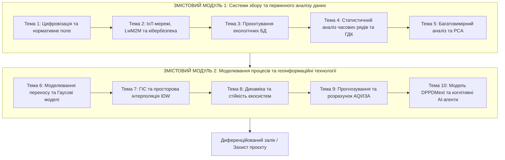

# РОБОЧА ПРОГРАМА ОСВІТНЬОГО КОМПОНЕНТА
## «Інформаційно-аналітичні технології в екологічних системах»

---

### 1. Опис освітнього компонента

Освітній компонент «Інформаційно-аналітичні технології в екологічних системах» є фундаментальною складовою циклу професійної підготовки здобувачів вищої освіти третього (освітньо-наукового) рівня за спеціальністю 101 «Екологія» (освітньо-наукова програма «Екологічна безпека»). Дисципліна орієнтована на формування у майбутніх докторів філософії науково-прикладного світогляду щодо використання сучасних методів цифровізації, прикладного штучного інтелекту, статистичного аналізу часових рядів та геопросторового моделювання для розв'язання задач екологічного моніторингу та оцінки техногенних загроз. 

Головний акцент курсу спрямовано на підвищення ефективності екологічних досліджень шляхом автоматизації аналітичних процедур у хмарно-інтегрованому та локальному середовищі *Jupyter Lab* на базі мови програмування *Python*, застосування інтелектуальних модулів підтримки прийняття рішень (зокрема великих мовних моделей і квантово-гібридних алгоритмів) без необхідності низькорівневої розробки програмного забезпечення.

| Найменування показників | Галузь знань, спеціальність, освітній рівень | Характеристика навчальної дисципліни |
| :--- | :--- | :--- |
| **Кількість кредитів ECTS:** 4.0 **Загальний обсяг годин:** 120 | **Галузь знань:** 10 «Природничі науки» **Спеціальність:** 101 «Екологія» | **Вид дисципліни:** Обов'язкова |
| **Модулів:** 1 **Змістових модулів:** 2 **Індивідуальне завдання:** Науково-дослідний курсовий проєкт | **Освітня програма:** «Екологічна безпека» **Освітній рівень:** Третій (освітньо-науковий) рівень (PhD) | **Рік підготовки:** 1-й **Семестр:** 2-й |
| **Тижневих годин для денної форми:** аудиторних — 3 год. самостійної роботи — 6 год. | **Форма навчання:** Денна | **Лекції:** 10 год. **Лабораторні заняття:** 20 год. **Практичні заняття:** – (0 год.) **Самостійна робота:** 90 год. **Вид підсумкового контролю:** Диференційований залік |

Співвідношення кількості годин аудиторних занять до самостійної та індивідуальної роботи становить $30 / 90$ ($1/3$).

---

### 2. Мета та завдання освітнього компонента

**Метою викладання освітнього компонента** є формування у здобувачів вищої освіти ступеня доктора філософії системи поглиблених теоретичних знань, методологічних підходів та практичних умінь щодо побудови, дослідження та практичного застосування інформаційно-аналітичних технологій, систем збору, накопичення, просторового моделювання та інтелектуального аналізу даних у складних екологічних системах для наукового обґрунтування та оперативного прийняття управлінських рішень у сфері екологічної безпеки урбанізованих територій.

**Основними завданнями освітнього компонента є:**
* засвоєння методологічних засад функціонування сучасних цифрових систем екологічного моніторингу та нормативно-правової бази оцінки якості компонентів довкілля (зокрема положень Директиви ЄС 2008/50/EC, AAQD 2024/2881 EC та Постанови КМУ № 827);
* вивчення архітектурних рішень та безпекових аспектів побудови сенсорних IoT-мереж збору екологічної телеметрії у реальному часі на основі стандартизованих легковагових протоколів (LwM2M, CoAP, MQTT);
* опанування інструментів проєктування спеціалізованих баз екологічних даних та алгоритмів первинного очищення, фільтрації викидів і відновлення пропусків у часових рядах спостережень;
* набуття практичних навичок багатовимірного та статистичного аналізу екологічних вибірок, розрахунку кратності й тривалості перевищення гранично допустимих концентрацій (ГДК) забруднюючих речовин;
* вивчення методів математичного та комп'ютерного моделювання процесів атмосферної дифузії та масопереносу домішок від точкових і лінійних джерел емісій із застосуванням Гаусових моделей;
* оволодіння інструментарієм просторової інтерполяції екологічних показників (методи IDW, Kriging) та картографування полів забруднення у середовищах геоінформаційних систем (ГІС);
* опанування методів часового та квантово-гібридного прогнозування стану довкілля за концептуальною моделлю $\text{DPPDMext}$, а також використання когнітивних LLM/VLM-агентів для автоматизованої генерації експертних висновків.

---

### 3. Компетентності та програмні результати навчання

Згідно з вимогами освітньо-наукової програми «Екологічна безпека», вивчення освітнього компонента забезпечує набуття здобувачами таких компетентностей та результатів навчання:

#### Спеціальні (фахові) компетентності (СК):
* **СК04.** Здатність ініціювати, розробляти і реалізовувати комплексні інноваційні проєкти у сфері екології та дотичні до неї міждисциплінарні проєкти, демонструвати лідерство під час їх практичної реалізації.
* **СК05.** Здатність застосовувати сучасні інструменти, електронні інформаційні ресурси, спеціалізоване програмне забезпечення у науковій та освітній діяльності, зокрема для моделювання екологічних процесів і прийняття оптимальних рішень у сфері охорони природи та раціонального природокористування.

#### Програмні результати навчання (ПРН):
* **ПРН05.** Розробляти та реалізовувати наукові та/або інноваційні інженерні проєкти, які дають можливість переосмислити наявне та створити нове цілісне знання та/або професійну практику з урахуванням соціальних, етичних, економічних, екологічних та правових аспектів.
* **ПРН06.** Застосовувати сучасні інструменти та інформаційні технології пошуку, оброблення й аналізу інформації з проблем екології та дотичних питань, зокрема статистичні методи аналізу даних великого обсягу та/або складної структури, спеціалізовані бази даних та геоінформаційні системи.

#### У результаті вивчення освітнього компонента здобувач вищої освіти повинен:

**Знати:**
* структуру, функціональні рівні та нормативно-правове регулювання сучасного цифрового моніторингу довкілля;
* принципи побудови та безпекового функціонування розподілених систем збору екологічної інформації на основі технологій Інтернету речей (IoT) та протоколу LwM2M;
* математичний апарат аналізу часових рядів екологічних показників (тренди, сезонні коливання, оцінка стаціонарності, критерії Дікі-Фуллера);
* аналітичні залежності та рівняння поширення забруднюючих речовин у приземному шарі атмосфери (моделі Гаусового шлейфу та сіткові згорткові моделі);
* теоретичні засади геопросторової інтерполяції за методом зворотних зважених відстаней (IDW) для ідентифікації фонових та аномальних концентрацій;
* принципи функціонування класичних (ARIMA, BATS, Prophet) та квантово-гібридних нейромережевих архітектур (VQC-LSTM) для екологічного прогнозування в умовах малих вибірок;
* структуру та компоненти розширеної концептуальної моделі обробки даних $\text{DPPDMext} = \langle D, T, F, (A, P, Q, M, E), F, V \rangle$.

**Уміти:**
* формувати та налаштовувати сценарії автоматизованого отримання екологічної інформації з відкритих API-сервісів моніторингу (*Vaisala*, *SaveEcoBot*, *EcoCity*);
* виконувати первинну обробку, нормалізацію, фільтрацію артефактів за правилом $3\sigma$ та усунення пропусків в екологічних масивах даних у середовищі *Jupyter Lab*;
* проводити багатофакторний статистичний аналіз, будувати кореляційні матриці взаємозв'язку полютантів і здійснювати декомпозицію простору ознак методом PCA;
* здійснювати програмний розрахунок кратності перевищення ГДК та формувати реєстри тривалих інцидентів забруднення відповідно до чинних екологічних нормативів;
* реалізовувати алгоритми просторової інтерполяції IDW для побудови цифрових карт розподілу полютантів та виявлення інформаційних «сліпих зон» мережі моніторингу;
* застосовувати готові модулі машинного навчання та часового прогнозування для розрахунку прогнозних концентрацій та визначення інтегральних індексів якості повітря (AQI, ІЗА);
* використовувати локальні та хмарні когнітивні LLM/VLM-агенти для автоматизованої інтерпретації результатів аналізу, верифікації графічних залежностей та підготовки науково обґрунтованих екологічних звітів.

---

### 4. Програма навчальної дисципліни

#### Модуль 1. Інформаційно-аналітичний базис та комп'ютерні технології в екології

##### Змістовий модуль 1. Системи збору та первинного аналізу даних в екологічному моніторингу

* **Тема 1. Сучасні концепції цифровізації екологічного моніторингу.**  
  Розглядаються теоретичні та практичні засади цифровізації екологічного контролю на муніципальному, регіональному та державному рівнях. Аналізується еволюція систем моніторингу від класичних ручних методів дискретного відбору проб до сучасних розподілених автоматизованих комплексів реального часу. Опрацьовується нормативно-правова база України та Європейського Союзу, зокрема вимоги Директиви ЄС 2008/50/EC, оновленої директиви про якість атмосферного повітря AAQD 2024/2881 EC та положення Постанови Кабінету Міністрів України № 827 від 14.08.2019 року щодо організації моніторингу атмосферного повітря. Досліджується концепція цифрових двійників міст (*Urban Digital Twins*), що інтегрує просторові дані, сенсорні потоки та аналітичні моделі для створення віртуальних динамічних реплік урбосистем з метою оцінки та моделювання сценаріїв пом'якшення антропогенного впливу.

* **Тема 2. IoT-технології та сенсорні мережі в екології.**  
  Вивчається архітектурна побудова та апаратне забезпечення систем безперервного збору екологічних даних на базі Інтернету речей (IoT). Аналізуються типи первинних перетворювачів, оптичних та електрохімічних газоаналізаторів для вимірювання вмісту $\text{PM}_{2.5}$, $\text{PM}_{10}$, $\text{CO}$, $\text{NO}_2$, $\text{SO}_2$ та метеорологічних параметрів. Розглядаються спеціалізовані протоколи передачі даних у середовищі з обмеженими ресурсами: порівняння пропускної здатності, накладних витрат та енергоефективності протоколів HTTP/REST, MQTT, CoAP та спеціалізованого стандарту *Lightweight M2M* (LwM2M). Оцінюються проблеми інформаційної безпеки, захисту каналів зв'язку за допомогою шифрування DTLS/TLS, а також впровадження динамічного контролю доступу до ресурсів сенсорних станцій на основі моделі атрибутивного доступу (ABAC).

* **Тема 3. Проєктування екологічних баз даних.**  
  Досліджуються принципи організації структурованих сховищ для накопичення гетерогенних екологічних показників. Вивчаються схеми реляційних баз даних (MySQL, PostgreSQL), призначених для зберігання даних із різними рівнями часової дискретизації: збереження «сирих» щохвилинних вимірювань, а також автоматизована агрегація у 20-хвилинні, добові, середньомісячні та середньорічні таблиці. Розглядаються формати обміну інформацією JSON, CSV, робота зі спеціалізованими структурами даних у бібліотеці `pandas`. Вивчаються методи взаємодії з відкритими API муніципальних і комерційних станцій моніторингу (*Vaisala API*, *SaveEcoBot API*, платформи *EcoCity*), а також принципи оптимізації зберігання великих масивів екологічної телеметрії для забезпечення високої швидкості аналітичних вибірок.

* **Тема 4. Статистичні методи аналізу складних екологічних даних.**  
  Розглядається математичний апарат попередньої обробки та валідації часових рядів екологічного стану. Опрацьовуються алгоритми виявлення аномальних вимірювань та апаратних збоїв за допомогою Z-score критерію ($|x_t - \mu| > 3\sigma$) та міжквартильного розмаху ($IQR = Q_3 - Q_1$), а також методи інтерполяції для відновлення втрачених спостережень у часових рядах:
  $$\mu = \frac{1}{T}\sum_{t=1}^{T} X_t, \quad \sigma^2 = \frac{1}{T-1}\sum_{t=1}^{T}(X_t - \mu)^2$$
  Вивчається методологія STL-декомпозиції часових рядів на трендову ($T_t$), сезонну ($S_t$) та залишкову ($R_t$) складові:
  $$X_t = T_t + S_t + R_t$$
  Досліджуються методи оцінки стаціонарності за допомогою розширеного тесту Дікі-Фуллера (ADF) та аналізу автокореляційної функції (ACF). Формалізується математичний алгоритм підрахунку кратності перевищення встановлених нормативів гранично допустимих концентрацій (ГДК / MPC) та ідентифікації тривалих небезпечних послідовностей (streak-індикація) за формулою:
  $$P_{i,j,t} = \begin{cases} 1, & \text{якщо } x_{i,j,t} > G_j, \\ 0, & \text{в іншому випадку.} \end{cases} \quad C_{i,j} = \sum_{t=1}^T P_{i,j,t}$$

* **Тема 5. Багатовимірний аналіз та інтелектуальні технології.**  
  Вивчаються теоретичні основи кореляційного аналізу для оцінки взаємозалежностей між концентраціями різних полютантів та метеорологічними факторами за допомогою розрахунку коефіцієнтів кореляції Пірсона:
  $$r_{ij} = \frac{\text{Cov}(x_i, x_j)}{\sigma_{x_i} \sigma_{x_j}}$$
  Розглядається метод головних компонент (Principal Component Analysis, PCA) як засіб ортогонального перетворення простору багатовимірних екологічних ознак у некорельовані головні компоненти, що дозволяє виявляти провідні фактори антропогенного навантаження та здійснювати кластеризацію промислових районів. Опрацьовуються базові концепції використання методів класифікації та регресії (*Decision Trees*, *Random Forest*) для визначення ступеня небезпеки атмосферного повітря без надмірного ускладнення коду.

##### Змістовий модуль 2. Моделювання екологічних процесів та геоінформаційні технології

* **Тема 6. Комп’ютерне моделювання переносу та дифузії забруднюючих речовин.**  
  Розглядаються фізико-математичні моделі поширення шкідливих домішок в атмосферному повітрі від точкових промислових та рухомих транспортних джерел. Вивчаються класичні аналітичні моделі Гаусового шлейфу та методи оцінки розсіювання викидів у приземному шарі атмосфери з урахуванням швидкості й напрямку вітру, класу атмосферної стійкості та стратифікації температури. Опрацьовується імітаційне моделювання транспортних потоків на міській вуличній мережі з використанням алгоритму пошуку найкоротшого шляху $A^*$ ($f(p) = g(p) + h(p)$) та моделювання розсіювання викидів азоту діоксиду на дискретній просторовій сітці за допомогою двовимірної згортки з Гаусовим ядром:
  $$C_{i,j}^{\text{new}} = \frac{\sum_{k=-1}^1 \sum_{l=-1}^1 C_{i+k, j+l} \cdot K_{k+1, l+1}}{\sum_{k=-1}^1 \sum_{l=-1}^1 K_{k+1, l+1}}, \quad K = \begin{bmatrix} 0 & 1 & 0 \\ 1 & 2 & 1 \\ 0 & 1 & 0 \end{bmatrix}$$

* **Тема 7. Геоінформаційні системи в екологічних дослідженнях.**  
  Вивчається методологія просторового аналізу екологічних даних та їх просторової прив'язки в геоінформаційних системах. Детально розглядається математичний апарат методу просторової інтерполяції за алгоритмом зворотних зважених відстаней (Inverse Distance Weighting, IDW) з експоненційним параметром згладжування $p=2$:
  $$C(x_0, y_0) = \frac{\sum_{i=1}^N \frac{C_i}{d_i^p}}{\sum_{i=1}^N \frac{1}{d_i^p}}, \quad d_i = \sqrt{(x_0 - x_i)^2 + (y_0 - y_i)^2}$$
  Формалізується математична методика створення віртуальних вимірювальних станцій та розрахунку різниці між концентрацією цільової точки $C(x_n, y_n)$ та фонової референтної точки $C(x_f, y_f)$:
  $$\Delta C = C(x_n, y_n) - C(x_f, y_f)$$
  Аналізується застосування бібліотек `geopandas` та `shapely` для генерації теплових карт забруднення, виділення контурів ізоконцентрацій і виявлення просторових «сліпих зон» у фізичній мережі екологічного моніторингу.

* **Тема 8. Моделювання динаміки та стійкості екологічних систем.**  
  Досліджуються математичні моделі функціонування та динамічної стійкості біоценозів в умовах постійного техногенного навантаження. Розглядається класична та модифікована система нелінійних диференціальних рівнянь моделі Лотки-Вольтерра («хижак–жертва» та міжвидова конкуренція) з інтегрованими параметрами антропогенного пригнічення популяцій:
  $$\frac{dx}{dt} = \alpha x - \beta x y - \mu_1 C x, \quad \frac{dy}{dt} = \delta x y - \gamma y - \mu_2 C y$$
  Вивчаються методи комп'ютерного моделювання процесів самоочищення відкритих водойм (баланс розчиненого кисню, БСК/ХСК), кінетика біодеградації органічних забруднень в аеробних та анаеробних біореакторах типу SBR, а також математичні критерії оцінки екологічної ємності урбанізованих геосистем.

* **Тема 9. Інформаційні системи прогнозування та оцінки екологічних ризиків.**  
  Розглядається практична реалізація статистичних та адаптивних методів коротко- і середньострокового прогнозування екологічних часових рядів за допомогою моделей AutoARIMA, Holt-Winters Exponential Smoothing, Facebook Prophet, BATS та TBATS:
  $$y_t = c + \sum_{i=1}^p \phi_i y_{t-i} + \sum_{j=1}^q \theta_j \varepsilon_{t-j} + \varepsilon_t$$
  Опрацьовуються критерії вибору оптимальної прогностичної моделі на основі порівняння помилок на тестових вибірках: Mean Squared Error (MSE), Mean Absolute Error (MAE), Root Mean Squared Error (RMSE) та коефіцієнта детермінації ($R^2$):
  $$R^2 = 1 - \frac{\sum_{t=1}^N (y_t - \hat{y}_t)^2}{\sum_{t=1}^N (y_t - \bar{y})^2}$$
  Вивчається методика розрахунку інтегрального індексу якості атмосферного повітря (Air Quality Index, AQI) за окремими полютантами та комплексного індексу забруднення атмосфери (ІЗА) для багатокритеріальної оцінки екологічного ризику для здоров'я населення.

* **Тема 10. Квантово-гібридні та інтелектуальні платформи просторового прогнозування.**  
  Вивчаються передові архітектурні підходи до побудови систем прескриптивної екологічної аналітики. Формалізується розширена концептуальна модель підготовки, обробки та доповненого прогнозування екологічних даних $\text{DPPDMext} = \langle D, T, F, P_{ext}, F, V \rangle$, де предиктивне ядро $P_{ext} = \langle A, P, Q, M, E \rangle$ поєднує попередній аналіз ($A$), гібридне прогнозування ($P$), оптимізацію якості ($Q$), просторове моделювання ($M$) та експертну оцінку ($E$). Розглядаються основи квантового машинного навчання (QML) та інтеграція варіаційних квантових схем (VQC) у рекурентні нейромережі (Quantum-LSTM, Quantum-GRU) для подолання проблеми «малих вибірок». Опрацьовується концепція використання автономних когнітивних агентів на основі великих мовних моделей (LLM: *DeepSeek-R1-Distill*, *LLaVA*) для автоматизованого аудиту розрахунків, інтерпретації аналітичних графіків і формування аргументованих рекомендацій для осіб, які приймають рішення.

---

### 5. Структура освітнього компонента

| Назва змістових модулів і тем | Усього годин | Лекції | Практичні | Лабораторні | Самостійна робота |
| :--- | :---: | :---: | :---: | :---: | :---: |
| **Змістовий модуль 1. Системи збору та первинного аналізу даних в екологічному моніторингу** | | | | | |
| Тема 1. Сучасні концепції цифровізації екологічного моніторингу | 12 | 1 | – | 2 | 9 |
| Тема 2. IoT-технології та сенсорні мережі в екології | 12 | 1 | – | 2 | 9 |
| Тема 3. Проєктування екологічних баз даних | 12 | 1 | – | 2 | 9 |
| Тема 4. Статистичні методи аналізу складних екологічних даних | 12 | 1 | – | 2 | 9 |
| Тема 5. Багатовимірний аналіз та інтелектуальні технології | 12 | 1 | – | 2 | 9 |
| **Усього за змістовим модулем 1** | **60** | **5** | **0** | **10** | **45** |
| **Змістовий модуль 2. Моделювання екологічних процесів та геоінформаційні технології** | | | | | |
| Тема 6. Комп’ютерне моделювання переносу та дифузії забруднюючих речовин | 12 | 1 | – | 2 | 9 |
| Тема 7. Геоінформаційні системи в екологічних дослідженнях | 12 | 1 | – | 2 | 9 |
| Тема 8. Моделювання динаміки та стійкості екологічних систем | 12 | 1 | – | 2 | 9 |
| Тема 9. Інформаційні системи прогнозування та оцінки екологічних ризиків | 12 | 1 | – | 2 | 9 |
| Тема 10. Квантово-гібридні та інтелектуальні платформи просторового прогнозування | 12 | 1 | – | 2 | 9 |
| **Усього за змістовим модулем 2** | **60** | **5** | **0** | **10** | **45** |
| Виконання індивідуального завдання (Науково-дослідний курсовий проєкт) | *(в межах СР)* | – | – | – | *(в межах СР)* |
| **УСЬОГО ГОДИН** | **120** | **10** | **0** | **20** | **90** |

---

### 6. Теми лабораторних робіт

| № з/п | Назва теми лабораторної роботи | Кількість годин |
| :---: | :--- | :---: |
| 1 | **ЛБ №1.** Дослідження функціональної архітектури та екологічного наповнення відкритих систем моніторингу довкілля (*SaveEcoBot*, *EcoCity*, *Vaisala API*). | 2 |
| 2 | **ЛБ №2.** Конфігурування інформаційного каналу отримання та попередньої обробки даних IoT-станцій екологічного моніторингу. | 2 |
| 3 | **ЛБ №3.** Проєктування та структурування табличних наборів даних для зберігання екологічної інформації за допомогою бібліотеки `pandas`. | 2 |
| 4 | **ЛБ №4.** Статистичний аналіз часових рядів концентрацій забруднювачів та автоматичний розрахунок перевищень нормативів ГДК (Постанова КМУ № 827). | 2 |
| 5 | **ЛБ №5.** Багатофакторний кореляційний аналіз та метод головних компонент (PCA) у дослідженні взаємозв'язку екологічних факторів. | 2 |
| 6 | **ЛБ №6.** Комп’ютерне моделювання локального розсіювання викидів в атмосфері на основі Гаусового ядра у середовищі *Jupyter Lab*. | 2 |
| 7 | **ЛБ №7.** Просторова інтерполяція екологічних показників методом IDW та виявлення аномальних зон забруднення у `GeoPandas`. | 2 |
| 8 | **ЛБ №8.** Моделювання динаміки та стійкості екологічних систем при антропогенному навантаженні на основі рівнянь Лотки-Вольтерра. | 2 |
| 9 | **ЛБ №9.** Прогнозування часових рядів екологічних показників моделями AutoARIMA/BATS та розрахунок комплексного індексу якості повітря (AQI / ІЗА). | 2 |
| 10 | **ЛБ №10.** Інтеграція аналітичного контуру $\text{DPPDMext}$: автоматизована генерація екологічного звіту за допомогою когнітивного LLM-агента. | 2 |
| | **Усього годин** | **20** |

---

### 7. Теми практичних (семінарських) занять

Навчальним планом підготовки докторів філософії за спеціальністю 101 «Екологія» аудиторні практичні заняття для даного освітнього компонента **не передбачені (0 годин)**. Усі прикладні розрахунки, алгоритмічний аналіз, розв'язання ситуаційних задач та кейс-стаді інтегровано безпосередньо у лабораторний практикум та науково-дослідну самостійну роботу здобувачів.

---

### 8. Самостійна робота

| № з/п | Назва теми для самостійного опрацювання та короткий зміст робіт | Кількість годин СР |
| :---: | :--- | :---: |
| 1 | **Тема 1. Дослідження нормативно-правової бази України та Директив ЄС щодо стандартизації обміну просторовими екологічними даними.** Самостійне опрацювання стандартів метаданих, директив INSPIRE, Директиви ЄС 2024/2881 про якість атмосферного повітря. Аналіз архітектури державних геопорталів екологічної інформації та порівняльний аналіз процедур гармонізації українського законодавства. Підготовка порівняльної аналітичної таблиці критеріїв оцінки ризиків для здоров'я людини. | 9 |
| 2 | **Тема 2. Безпекові аспекти функціонування критичної інфраструктури систем екологічного моніторингу.** Дослідження загроз цілісності та конфіденційності екологічної телеметрії. Оцінка протоколу LwM2M з шифруванням DTLS для захисту малопотужних сенсорних вузлів. Розробка моделі політики динамічного розмежування прав доступу ABAC для суб'єктів муніципального моніторингу. | 9 |
| 3 | **Тема 3. Технології інтеграції екологічних баз даних із глобальними хмарними сервісами.** Огляд хмарних платформ (*AWS IoT*, *Google Cloud*, *Azure*) та сховищ класу NoSQL для збереження екологічних Big Data. Порівняння швидкодії запитів при агрегації телеметрії з десятків станцій спостереження. Побудова діаграми інформаційних потоків між сервером збору даних та аналітичними веб-панелями. | 9 |
| 4 | **Тема 4. Методики відновлення пропущених значень та усунення аномалій у тривалих рядах екологічних спостережень.** Поглиблене вивчення алгоритмів лінійної, сплайн- та kNN-інтерполяції для заповнення прогалин у часових рядах станцій *Vaisala*. Дослідження впливу фільтрації апаратного шуму сенсорів на достовірність подальшої оцінки кратності перевищення ГДК. Складання скрипту валідації даних у *Jupyter Notebook*. | 9 |
| 5 | **Тема 5. Порівняльний аналіз методів машинного навчання при вирішенні задач класифікації та прогнозування стану екосистем.** Дослідження методів опорних векторів (SVM), градієнтного бустингу (XGBoost) та дерев рішень для оцінки якості повітря. Опрацьовування процедур формування навчальних і тестових вибірок, крос-валідації часових рядів, розрахунку метрик точності (Precision, Recall, F1-score). | 9 |
| 6 | **Тема 6. Дослідження та використання спеціалізованого програмного забезпечення для моделювання транскордонного переносу забруднень.** Ознайомлення з функціональними можливостями пакетів NOAA HYSPLIT, CAMx та систем моделювання розсіювання на основі дробового числення. Аналіз впливу метеорологічних сіток високої роздільної здатності на точність розрахунку траєкторій переносу полютантів на відстані понад 100 км. | 9 |
| 7 | **Тема 7. Використання даних дистанційного зондування Землі у ГІС-дослідженнях екосистем.** Опрацювання спектральних супутникових знімків систем *Sentinel-2* та *Landsat*. Розрахунок індексу нормалізованої різниці вегетації (NDVI) для моніторингу зелених зон міських агломерацій. Інтеграція супутникових карт температури поверхні землі (LST) із наземними вимірюваннями концентрації пилу. | 9 |
| 8 | **Тема 8. Моделювання кругообігу речовин та трофічних ланцюгів у водних екосистемах.** Побудова математичних моделей процесів евтрофікації урбанізованих водойм. Дослідження динаміки розчиненого кисню, азоту та фосфору при залпових скидах недостатньо очищених стічних вод. Розрахунок параметрів відновлення балансу геосистеми після техногенного навантаження. | 9 |
| 9 | **Тема 9. Інтеграційні рішення для систем раннього екологічного оповіщення населення при виникненні техногенних аварій.** Проєктування архітектури автоматизованого інформування громадськості у випадку перевищення порогів небезпеки токсичних речовин. Поєднання результатів чисельного просторового моделювання аварійних викидів із картографічними сервісами геотаргетованого оповіщення. | 9 |
| 10 | **Тема 10. Науково-дослідний курсовий проєкт: розробка та програмне прототипування сценарію адаптивного моніторингу за моделлю $\text{DPPDMext}$.** Виконання індивідуального науково-дослідного завдання: формулювання структури задачі, вибір цільового промислового району/полютанта, первинна обробка телеметрії, просторове моделювання (IDW/A*), побудова прогностичної моделі (AutoARIMA/BATS), генерація когнітивного звіту за допомогою LLM-агента, оформлення наукової пояснювальної записки та створення файлу `.ipynb`. | 9 |
| | **Усього годин** | **90** |

---

### 9. Методи навчання

Організація освітнього процесу здійснюється із застосуванням проблемно-орієнтованих, інтерактивних та дослідницько-інноваційних методів навчання, що відповідають специфіці підготовки докторів філософії:

* **Словесні та евристичні методи:** проблемні лекції, інтерактивні дискусії, наукові колоквіуми, аналіз суперечливих наукових гіпотез щодо екстраполяції екологічних моделей у зонах інформаційної невизначеності.
* **Наочні методи:** графічна демонстрація просторових структур і карт забруднення у середовищах *Jupyter Lab* та *QGIS*, комп'ютерна візуалізація фазових портретів стійкості екосистем, розгляд архітектурних схем сенсорних мереж та потоків даних.
* **Практично-дослідницькі методи:** виконання лабораторного практикуму у форматі дослідницьких блокнотів (*Jupyter Notebooks*), проведення обчислювальних експериментів на реальних вибірках моніторингових станцій м. Кременчука, Черкас, Дніпра, аналіз та верифікація адекватності математичних моделей.
* **Методи проблемного та проєктного навчання (Problem-Based & Project-Based Learning):** виконання наскрізного індивідуального науково-дослідного курсового проєкту, що моделює повний цикл роботи аналітика-еколога від первинного отримання сирих сигналів до формування фінального звіту для муніципальної влади.
* **Когнітивно-асистентські технології:** використання методів діалогу з локальними мовними моделями (LLM) для автоматизованого первинного скринінгу статистичних помилок, генерації коду обробки та синтезу текстових висновків екологічної експертизи.

---

### 10. Методи контролю

Оцінювання результатів навчання здобувачів вищої освіти здійснюється на основі поєднання форм поточного, модульного та підсумкового контролю:

1. **Поточний контроль:**
   * експрес-контроль теоретичної підготовки перед виконанням лабораторних робіт (усне опитування, інтерактивні тести);
   * оцінювання практичних результатів виконання, алгоритмічної коректності та якості оформлення звітів за кожною з 10 лабораторних робіт;
   * захист результатів лабораторних робіт з інтерпретацією отриманих екологічних залежностей, аналізом похибок моделювання та формулюванням висновків.
2. **Модульний контроль:**
   * виконання двох письмових/комп'ютерних модульних контрольних робіт (тестових завдань) за результатами вивчення Змістового модуля 1 та Змістового модуля 2 (по 10 балів за кожен модульний тест).
3. **Підсумковий семестровий контроль (Диференційований залік):**
   * комплексний підсумковий контроль у формі публічного захисту науково-дослідного курсового проєкту та складання підсумкового стандартизованого комп'ютерного тесту (20 балів).
   * **Умови допуску до підсумкового контролю:** успішне виконання та захист усіх 10 лабораторних робіт, позитивне складання двох модульних тестів (набрання не менше 50% балів за поточною навчальною роботою — від 40 балів).

---

### 11. Розподіл балів, які отримують здобувачі за темами

| Вид занять / Контрольні заходи | Змістовий модуль 1 | | | | | Змістовий модуль 2 | | | | | Підсумковий контроль (Захист проєкту / Тест) | Сума балів |
| :--- | :---: | :---: | :---: | :---: | :---: | :---: | :---: | :---: | :---: | :---: | :---: | :---: |
| | **Т1** | **Т2** | **Т3** | **Т4** | **Т5** | **Т6** | **Т7** | **Т8** | **Т9** | **Т10** | | |
| Опрацювання матеріалу лекцій | 1 | 1 | 1 | 1 | 1 | 1 | 1 | 1 | 1 | 1 | — | **10** |
| Виконання та захист лабораторних робіт | 5 | 5 | 5 | 5 | 5 | 5 | 5 | 5 | 5 | 5 | — | **50** |
| Модульний контроль (Тест 1 та Тест 2) | — | — | — | — | 10 | — | — | — | — | 10 | — | **20** |
| Підсумковий контроль (Диференційований залік) | — | — | — | — | — | — | — | — | — | — | 20 | **20** |
| **Усього за тему / етап** | **6** | **6** | **6** | **6** | **16** | **6** | **6** | **6** | **6** | **16** | **20** | **100** |

---

### 12. Розподіл балів, які отримують здобувачі за видами занять

| Вид роботи, пояснення | Розрахункова формула | Максимальні бали |
| :--- | :---: | :---: |
| **Опрацювання теоретичного матеріалу за тематикою лекцій.** Усього 10 тем. За опрацювання та активну участь у дискусії за 1 темою — 1 бал. | $10 \text{ тем} \times 1 \text{ бал}$ | **10** |
| **Виконання та захист лабораторних робіт у Jupyter Lab.** Усього 10 робіт. Оцінюється завантаження розрахункового файлу `.ipynb`, оформлення звіту та захист інтерпретації результатів (по 5 балів за роботу). | $10 \text{ робіт} \times 5 \text{ балів}$ | **50** |
| **Модульне тестування за змістовими модулями.** Тест 1 (за Змістовим модулем 1) — 10 балів. Тест 2 (за Змістовим модулем 2) — 10 балів. | $2 \text{ тести} \times 10 \text{ балів}$ | **20** |
| **Підсумковий контроль (диференційований залік).** Публічний захист науково-дослідного курсового проєкту та складання підсумкового комплексного тесту. | Комплексний захист | **20** |
| **УСЬОГО БАЛІВ:** | | **100** |

---

### 13. Критерії оцінювання

#### 13.1. Критерії оцінювання лабораторних робіт (поточний контроль)
Кожна лабораторна робота оцінюється за шкалою від 0 до 5 балів:
* **5 балів («відмінно»):** завдання виконано в повному обсязі у середовищі *Jupyter Lab*, скрипти працюють стабільно, дані очищено та візуалізовано належним чином; здобувач демонструє глибоке розуміння фізико-екологічної сутності отриманих результатів, вільно пояснює математичні залежності (IDW, Z-score, кореляції, розсіювання), формулює коректні висновки.
* **4 бали («добре»):** завдання виконано повністю, проте допущені незначні неточності у графічному оформленні результатів або при виборі граничних параметрів моделювання; здобувач правильно інтерпретує загальні тенденції, але припускається несуттєвих помилок при відповідях на додаткові запитання.
* **3 бали («задовільно»):** базовий алгоритм реалізовано, однак розрахунки виконано частково або з методичними похибками; здобувач відчуває труднощі при аналізі отриманих метрик чи встановленні причинно-наслідкових екологічних зв'язків.
* **1–2 бали («незадовільно»):** роботу виконано фрагментарно, програмний код містить критичні помилки, здобувач не володіє теоретичним матеріалом та не може пояснити отримані результати.
* **0 балів:** роботу не виконано або не представлено на перевірку.

#### 13.2. Критерії оцінювання науково-дослідного курсового проєкту
Оцінювання курсового проєкту (індивідуального завдання) здійснюється за такими критеріями (у межах підсумкової атестації):

| Складова оцінювання курсового проєкту | Критерії якості | Макс. бали |
| :--- | :--- | :---: |
| **Науково-методична обґрунтованість** | Коректність постановки екологічної проблеми, відповідність нормативній базі (Постанова КМУ №827 / AAQD), повнота огляду стану питання. | **5** |
| **Технічна реалізація та моделювання** | Якість підготовки датасету, адекватність застосування математичних методів (IDW, ARIMA/BATS, Гаусові моделі) у *Jupyter Notebook*. | **7** |
| **Аналітична інтерпретація та висновки** | Глибина аналізу екологічних ризиків, коректність використання LLM-агента для формування рекомендацій, самостійність висновків. | **4** |
| **Якість доповіді та захисту** | Чіткість викладу наукових положень під час презентації, аргументованість відповідей на фахові запитання комісії. | **4** |
| **Разом за курсовий проєкт:** | | **20** |

#### 13.3. Критерії оцінювання підсумкового контролю (диференційованого заліку)
Диференційований залік виставляється як інтегральна сума балів, накопичених здобувачем протягом семестру за всіма видами навчальної діяльності. Здобувач, який набрав від 60 до 100 балів, отримує диференційовану оцінку відповідно до шкали. Здобувачі, які бажають підвищити семестровий рейтинг або мають заборгованість, проходять підсумкову співбесіду за комплексними науково-теоретичними питаннями курсу.

---

### 14. Шкала оцінювання: національна та ECTS

| Сума балів за всі види навчальної діяльності | Оцінка ECTS | Оцінка за національною шкалою (для диференційованого заліку) |
| :---: | :---: | :--- |
| **90–100** | **A** | **Відмінно** — здобувач демонструє всебічні, глибокі знання теоретичного матеріалу, вільно володіє програмно-аналітичним апаратом, самостійно розв'язує комплексні екологічні задачі та формулює оригінальні наукові висновки. |
| **82–89** | **B** | **Дуже добре** — здобувач на високому рівні володіє програмою курсу, без помилок реалізує аналітичні алгоритми, але допускає окремі несуттєві неточності під час інтерпретації специфічних граничних станів моделей. |
| **74–81** | **C** | **Добре** — здобувач у цілому опанував навчальний матеріал, успішно застосовує стандартні математичні й геоінформаційні методи, але потребує консультативної допомоги при розв'язанні складних багатофакторних задач. |
| **64–73** | **D** | **Задовільно** — здобувач засвоїв основні положення дисципліни, спроможний повторити базові процедури аналізу за інструкцією, проте допускає суттєві помилки при статистичній обробці та оцінці ризиків. |
| **60–63** | **E** | **Достатньо** — знання та практичні навички відповідають мінімальним критеріям допуску, розрахункові роботи виконано на репродуктивному рівні з численними зауваженнями. |
| **35–59** | **FX** | **Незадовільно з можливістю повторного складання** — здобувач не виконав базових вимог програми, має заборгованість із лабораторних робіт або отримав незадовільні бали за модульні контролі, призначається повторне складання. |
| **1–34** | **F** | **Незадовільно з обов'язковим повторним вивченням** — грубе порушення графіку навчального процесу, повна відсутність практичних і теоретичних навичок, призначається повторне проходження курсу. |

---

### 15. Рекомендована література та інформаційні ресурси

#### Основна література:
1. Застосування ГІС у природоохоронній справі на прикладі відкритої програми QGIS : навч. посіб. / О. Часковський, Ю. Андрейчук, Т. Ямелинець. Львів : ЛНУ ім. Івана Франка, Вид-во Простір-М, 2021. 228 с.
2. Моніторинг довкілля : підручник / В. М. Боголюбов та ін. ; за ред. В. М. Боголюбова. 2-ге вид., перероб. і доп. Київ : Видавничий центр НУБіП України, 2018. 435 с.
3. A Quantum-Hybrid Framework for Urban Environmental Forecasting Integrating Advanced AI and Geospatial Simulation / J. Peksa, A. Perekrest, K. Vadurin, D. Mamchur. *Sensors*. 2025. Vol. 25, Iss. 24. Art. 7422. DOI: [https://doi.org/10.3390/s25247422](https://doi.org/10.3390/s25247422).
4. Towards Digitalization for Air Pollution Detection: Forecasting Information System of the Environmental Monitoring / K. Vadurin, A. Perekrest, V. Bakharev, V. Shendryk, Y. Parfenenko, S. Shendryk. *Sustainability*. 2025. Vol. 17, Iss. 9. Art. 3760. DOI: [https://doi.org/10.3390/su17093760](https://doi.org/10.3390/su17093760).
5. Information and analytical system for collecting, processing and analyzing data on air pollution / A. Zavalieiev, K. Vadurin, A. Perekrest, V. Bakharev. *Автоматизація технологічних і бізнес-процесів*. 2024. Т. 16, № 1. С. 72–82. DOI: [https://doi.org/10.15673/atbp.v16i1.2774](https://doi.org/10.15673/atbp.v16i1.2774).
6. Вадурін К. О., Перекрест А. Л., Бахарєв В. С. Розробка методу автоматичного формування звітності про кількість перевищень встановлених нормативів маркерів атмосферного повітря. *Інфокомунікаційні та комп’ютерні технології*. 2023. № 2 (06). С. 50–59. DOI: [https://doi.org/10.36994/2788-5518-2023-02-06-05](https://doi.org/10.36994/2788-5518-2023-02-06-05).

#### Додаткова література:
7. Удовик І., Вадурін К. Дослідження стану предметної галузі інтелектуального аналізу часових рядів та геопросторового моделювання в муніципальних системах екологічного моніторингу. *Вісник Кременчуцького національного університету імені Михайла Остроградського*. 2026. Вип. 2 (157), Ч. 1. С. 158–171. DOI: [https://doi.org/10.32782/1995-0519.2026.2.16](https://doi.org/10.32782/1995-0519.2026.2.16).
8. Components of ensuring secure infrastructure for environmental monitoring systems using the LwM2M protocol / K. Vadurin, A. Perekrest, D. Mamchur, S. Vladov. *Proceedings of the 4th International Conference on Cyber Hygiene & Conflict Management in Global Information Networks (CH&CMiGIN’25)* (Kyiv, June 20–22, 2025). CEUR Workshop Proceedings, 2025. Vol. 4024. P. 1–20. URL: [https://ceur-ws.org/Vol-4024/paper19.pdf](https://ceur-ws.org/Vol-4024/paper19.pdf).
9. Web-based technology of intellectual analysis of environmental data of an industrial enterprise / A. Perekrest, D. Mamchur, A. Zavaleev, K. Vadurin, V. Malolitko, V. Bakharev. *2023 IEEE 5th International Conference on Modern Electrical and Energy System (MEES)* (Kremenchuk, Sept. 27–30, 2023). IEEE, 2023. P. 1–7. DOI: [https://doi.org/10.1109/MEES61502.2023.10402523](https://doi.org/10.1109/MEES61502.2023.10402523).
10. Інформаційна система збору та накопичення даних про якість атмосферного повітря зі станцій Vaisala муніципального рівня / К. О. Вадурін, А. Л. Перекрест, В. С. Бахарєв, А. І. Дерієнко, А. В. Іващенко, С. А. Шкарупа. *Інфокомунікаційні та комп’ютерні технології*. 2023. № 2 (06). С. 38–49. DOI: [https://doi.org/10.36994/2788-5518-2023-02-06-04](https://doi.org/10.36994/2788-5518-2023-02-06-04).
11. Децентралізовані мережі фізичної інфраструктури для управління відновлюваною енергією / А. Перекрест, В. Дружиніна, Л. Сакун, В. Ноженко, К. Вадурін. *Вісник Кременчуцького національного університету імені Михайла Остроградського*. 2026. Вип. 2 (157), Ч. 1. С. 114–130. DOI: [https://doi.org/10.32782/1995-0519.2026.2.13](https://doi.org/10.32782/1995-0519.2026.2.13).
12. Brimicombe A. GIS, Environmental Modeling and Engineering. 2nd ed. Boca Raton : CRC Press, 2020. 330 p.
13. Шушура О., Міщенко А. Архітектура системи виявлення аномалій у комп’ютерних системах на основі мультимодальних даних та нейро-нечіткого виводу. *Вісник Кременчуцького національного університету імені Михайла Остроградського*. 2026. Вип. 2 (157), Ч. 1. С. 172–179. DOI: [https://doi.org/10.32782/1995-0519.2026.2.17](https://doi.org/10.32782/1995-0519.2026.2.17).

#### Нормативні документи та стандарти:
14. Деякі питання здійснення державного моніторингу в галузі охорони атмосферного повітря : Постанова Кабінету Міністрів України від 14 серпня 2019 р. № 827. Офіційний вісник України. 2019. № 69. С. 2413. URL: [https://zakon.rada.gov.ua/laws/show/827-2019-п#Text](https://zakon.rada.gov.ua/laws/show/827-2019-п#Text).
15. Directive (EU) 2024/2881 of the European Parliament and of the Council of 11 April 2024 on Ambient Air Quality and Cleaner Air for Europe (Recast). *Official Journal of the European Union*. 2024. L 2024/2881. URL: [https://eur-lex.europa.eu/eli/dir/2024/2881/oj](https://eur-lex.europa.eu/eli/dir/2024/2881/oj).

#### Інформаційні ресурси в мережі Інтернет:
16. Офіційний портал громадського екологічного моніторингу *SaveEcoBot* в Україні: [https://www.saveecobot.com/](https://www.saveecobot.com/)
17. Відкрита мережа громадського моніторингу радіаційного фону та якості повітря *EcoCity*: [https://eco-city.org.ua/](https://eco-city.org.ua/)
18. Earth Data Science Tutorials & Open Geospatial Workflows: [https://earthdatascience.org/](https://earthdatascience.org/)
19. Geographic Data Science with Python (Open Textbook): [https://geographicdata.science/book/intro.html](https://geographicdata.science/book/intro.html)
20. Python Data Science Handbook (Jake VanderPlas): [https://jakevdp.github.io/PythonDataScienceHandbook/](https://jakevdp.github.io/PythonDataScienceHandbook/)