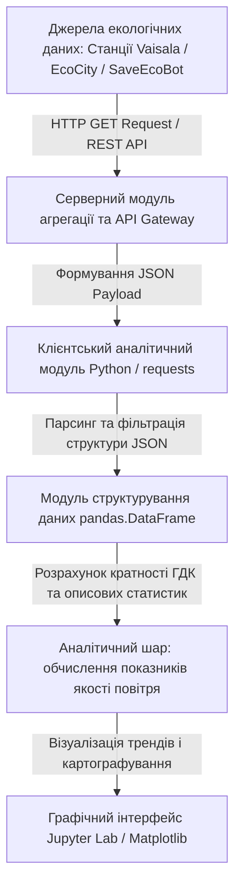

# Лабораторна робота № 1. Дослідження функціональної архітектури та екологічного наповнення відкритих систем моніторингу довкілля

**Мета:** формування системи теоретичних знань щодо функціональної організації сучасних відкритих інформаційних систем екологічного моніторингу (SaveEcoBot, EcoCity, Copernicus), а також набуття практичних умінь із програмного отримання, парсингу, структурування та первинного аналітичного огляду телеметричних екологічних даних у середовищі Jupyter Lab засобами мови програмування Python.

**Стек технологій та інструменти:**
* **Мова програмування / Середовище:** Python 3.10+ / Jupyter Lab (Jupyter Notebook).
* **Платформа / Бібліотеки / Модулі:** `requests` (версії 2.31.0+), `pandas` (версії 2.2.2+), `matplotlib` (версії 3.9.0+), `numpy` (версії 1.26.4+), вбудований модуль `json`.
* **Інструменти розробки:** Консоль/Термінал (Bash/PowerShell), веб-браузер для інтерактивного середовища Jupyter.

---

## 1 Теоретичні відомості

Сучасний етап управління екологічною безпекою міських агломерацій базується на переході від періодичних лабораторних замірів до безперервного збору та обробки телеметричних параметрів довкілля у реальному часі. Важливим поштовхом до цифровізації цієї галузі стала необхідність гармонізації національної системи спостережень із європейськими нормативними актами, зокрема оновленою Директивою Європейського Парламенту та Ради ЄС 2024/2881 (Ambient Air Quality Directive, AAQD) та Постановою Кабінету Міністрів України № 827 «Деякі питання здійснення державного моніторингу в галузі охорони атмосферного повітря». Зазначені стандарти вимагають високої дискретизації вимірювань, регулярного інформування населення та впровадження відкритих цифрових інтерфейсів доступу до екологічної інформації.

В інформаційному просторі моніторингу довкілля виокремлюють три базові рівні джерел даних:
1. Державні та муніципальні мережі стаціонарних постів, які забезпечують високоточні вимірювання за допомогою еталонного лабораторного обладнання (наприклад, автоматичних комплексів Vaisala AQT420 або станцій ПМЕЛ).
2. Громадські мережі моніторингу (EcoCity, SaveEcoBot, Luftdaten), що побудовані на базі доступних сенсорних вузлів Інтернету речей (IoT) та формують просторово розгалужену сітку спостережень за дрібнодисперсним пилом ($PM_{2.5}$, $PM_{10}$) та токсичними газами.
3. Глобальні супутникові сервіси та реаналітичні моделі (Copernicus Atmosphere Monitoring Service — CAMS), які забезпечують транскордонний огляд поширення викидів.

Архітектура взаємодії прикладного аналітичного програмного забезпечення з відкритими системами моніторингу базується на концепції REST API (Representational State Transfer). Клієнтська програма формує стандартизований HTTP GET-запит до відкритого сервера-агрегатора, отримуючи у відповідь масив даних у форматі JSON (JavaScript Object Notation). Отриманий документ містить ієрархічно структуровану інформацію про ідентифікатори станцій, їхні географічні координати (широту, довготу), мітки часу спостережень та вектор зареєстрованих концентрацій полютантів.


*Рисунок 1 — Структурна схема потоку отримання та аналітичної обробки відкритих екологічних даних*

Отримані масиви концентрацій хімічних речовин потребують приведення до уніфікованих екологічних показників. Відповідно до вимог нормативних документів, базовим критерієм оцінки небезпеки забруднення виступає кратність перевищення встановленої гранично допустимої концентрації ($K_{MPC, j}$):

$$K_{MPC, j}(t) = \frac{C_j(t)}{G_j}$$

У наведеній математичній залежності змінна $C_j(t)$ позначає поточну зареєстровану концентрацію $j$-ї забруднюючої речовини в момент часу $t$, виражену в міліграмах на метр кубічний ($\text{мг/м}^3$) або мікрограмах на метр кубічний ($\text{мкг/м}^3$), величина $G_j$ визначає нормативне порогове значення середньодобової чи максимально разової гранично допустимої концентрації для цієї речовини у відповідних одиницях вимірювання, а параметр $K_{MPC, j}(t)$ є безрозмірним коефіцієнтом екологічної безпеки.

Для статистичного узагальнення якості атмосферного повітря за досліджуваний часовий інтервал визначається середнє арифметичне значення концентрації ($\bar{C}_j$):

$$\bar{C}_j = \frac{1}{N} \sum_{k=1}^{N} C_j(t_k)$$

де змінна $N$ відображає загальну кількість валідних вимірювань за досліджуваний інтервал часу, $t_k$ є часовою міткою $k$-го вимірювання, а $\bar{C}_j$ позначає середнє значення концентрації $j$-го полютанта.

Ступінь мінливості та нестаціонарності часового ряду концентрацій оцінюється за допомогою вибіркової дисперсії ($\sigma_j^2$):

$$\sigma_j^2 = \frac{1}{N - 1} \sum_{k=1}^{N} \left( C_j(t_k) - \bar{C}_j \right)^2$$

де величина $\sigma_j^2$ визначає міру розсіювання отриманих експериментальних значень відносно середнього рівня, що дозволяє кількісно схарактеризувати динамічну нестабільність екологічної обстановки навколо контрольного поста.

```mermaid
graph LR
    subgraph Data_Layer [Рівень первинних даних]
        S1[Пост 1: Геокоординати]
        S2[Пост 2: Метеосенсори]
        S3[Пост 3: Газоаналізатори]
    end
    subgraph Transformation_Layer [Рівень обробки та трансформації]
        T1[Валідація та очищення рядів]
        T2[Нормалізація та приведення до ГДК]
        T3[Агрегація за інтервалами часу]
    end
    subgraph Analytics_Layer [Рівень експертного аналізу]
        A1[Описова статистика: Mean, Variance]
        A2[Аналіз частоти інцидентів перевищень]
        A3[Інтерактивна візуалізація та звітність]
    end
    Data_Layer --> Transformation_Layer
    Transformation_Layer --> Analytics_Layer
```


*Рисунок 2 — Концептуальна модель конвеєра первинної обробки екологічної телеметрії*

Інтеграція таких процедур у середовище Jupyter Lab дозволяє автоматизувати аналітичну обробку великих обсягів телеметрії без необхідності написання складних низькорівневих системних додатків, що суттєво прискорює проведення науково-прикладних екологічних досліджень.

---

## 2 Підготовка середовища та розгортання проєкту (Крок 0)

Для успішного виконання лабораторної роботи здобувач вищої освіти повинен налаштувати ізольоване робоче середовище Python та розгорнути локальний проєкт.

### 2.1 Перевірка інтерпретатора та створення віртуального середовища

Усі команди виконуються в командному рядку (терміналі операційної системи Linux/macOS або PowerShell/CMD у Windows).

Перевірка встановленої версії Python (вимагається версія 3.10 або новіша):
```bash
python --version
```

Створення робочої директорії лабораторного практикуму та перехід у неї:
```bash
mkdir -p ~/eco_analytics_workspace/lab1
cd ~/eco_analytics_workspace/lab1
```

Ініціалізація віртуального середовища `venv` для ізоляції залежностей:
```bash
python -m venv venv
```

Активація віртуального середовища:
* Для ОС Linux / macOS:
```bash
source venv/bin/activate
```
* Для ОС Windows (PowerShell):
```powershell
.\venv\Scripts\Activate.ps1
```

Оновлення менеджера пакетів `pip` та встановлення необхідних бібліотек:
```bash
pip install --upgrade pip
pip install jupyterlab requests pandas matplotlib numpy
```

### 2.2 Структура робочого каталогу проєкту

У робочій директорії `lab1` організується наступне дерево каталогів і файлів:

```text
lab1/
├── data/
│   └── telemetry_sample.json       # Локальний кеш екологічних даних для офлайн-режиму
├── exports/
│   ├── stations_summary.csv        # Результати експорту зведеної таблиці постів
│   └── pollutants_dynamics.png     # Згенерований графік часової динаміки
├── notebooks/
│   └── lab1_environmental_api.ipynb# Робочий блокнот Jupyter Lab
├── requirements.txt                # Перелік версій залежностей проєкту
└── config.json                     # Конфігураційний файл параметрів моніторингу
```

### 2.3 Створення конфігураційного файлу та збереження списку залежностей

Фіксація версій бібліотек у файлі `requirements.txt`:
```bash
pip freeze > requirements.txt
```

Створення конфігураційного файлу `config.json`, що містить гранично допустимі концентрації (ГДК, $\text{мг/м}^3$) згідно з Постановою КМУ № 827:
```json
{
  "project_name": "Urban Environmental Open Data Analysis",
  "version": "1.0.0",
  "mpc_standards_mg_m3": {
    "PM2.5": 0.025,
    "PM10": 0.050,
    "NO2": 0.040,
    "CO": 3.000,
    "SO2": 0.050
  },
  "default_city": "Kyiv"
}
```

Запуск інтерактивного сервера Jupyter Lab виконується командою:
```bash
jupyter lab
```

---

## 3 Порядок виконання роботи

### 3.1 Індивідуальні завдання

Кожен здобувач виконує дослідження відкритої системи моніторингу для індивідуальної міської агломерації відповідно до свого номера варіанта у журналі академічної групи.

| Варіант | Міська агломерація / Досліджувана зона | Джерело даних та тип середовища | Цільові екологічні маркери | Завдання дослідження |
| :---: | :--- | :--- | :--- | :--- |
| **1** | м. Кременчук (Північний промвузол) | EcoCity API / Пости на базі ESP32 | $PM_{2.5}$, $PM_{10}$, $NO_2$, CO | Оцінка впливу нафтопереробного кластера |
| **2** | м. Дніпро (Лівобережний промрайон) | SaveEcoBot JSON / Муніципальні пости | $PM_{2.5}$, $NO_2$, $SO_2$, Температура | Дослідження динаміки пилового навантаження |
| **3** | м. Запоріжжя (Вознесенівський район) | SaveEcoBot API / Відкриті датчики | $PM_{10}$, $CO$, $NO_2$, Вологість | Оцінка екологічної безпеки металургійної зони |
| **4** | м. Кривий Ріг (Металургійний район) | EcoCity JSON / Локальні станції | $PM_{2.5}$, $PM_{10}$, $CO$, $SO_2$ | Виявлення зон критичного запилення |
| **5** | м. Черкаси (Хімічний мікрорайон) | Відкритий API / Пости моніторингу | $NO_2$, $CO$, $PM_{2.5}$, Температура | Аналіз впливу виробництва мінеральних добрив |
| **6** | м. Кам'янське (Центральний сектор) | SaveEcoBot JSON / Громадські пости | $PM_{10}$, $NO_2$, $SO_2$, $CO$ | Дослідження смогових концентрацій |
| **7** | м. Полтава (Транспортні магістралі) | EcoCity API / Придорожні сенсори | $PM_{2.5}$, $CO$, $NO_2$, Вологість | Оцінка впливу інтенсивного автотрафіку |
| **8** | м. Вінниця (Правобережний сектор) | SaveEcoBot API / Мережа IoT | $PM_{2.5}$, $PM_{10}$, $NO_2$, Температура | Моніторинг фонового стану урбоекосистеми |
| **9** | м. Львів (Сихівський житловий масив) | EcoCity JSON / Відкриті датчики | $PM_{2.5}$, $CO$, Вологість, Температура | Оцінка екологічної комфортності спального району |
| **10** | м. Одеса (Припортова зона) | SaveEcoBot API / Муніципальні пости | $PM_{10}$, $SO_2$, $NO_2$, $CO$ | Дослідження техногенного навантаження порту |
| **11** | м. Харків (Індустріальний район) | EcoCity JSON / Сенсорна мережа | $PM_{2.5}$, $PM_{10}$, $NO_2$, $CO$ | Виявлення локальних екологічних аномалій |
| **12** | м. Миколаїв (Заводський район) | SaveEcoBot API / Громадські пости | $PM_{2.5}$, $SO_2$, $CO$, Вологість | Аналіз впливу машинобудівних підприємств |
| **13** | м. Житомир (Північно-східна зона) | EcoCity API / Відкриті сенсори | $PM_{10}$, $NO_2$, Температура, Вологість | Оцінка фонового стану міського середовища |
| **14** | м. Суми (Хімпромівський сектор) | SaveEcoBot JSON / Пости спостережень | $SO_2$, $NO_2$, $PM_{2.5}$, $CO$ | Дослідження викидів хімічних підприємств |
| **15** | м. Івано-Франківськ (Центр міста) | EcoCity API / Локальні станції | $PM_{2.5}$, $PM_{10}$, $CO$, Температура | Оцінка впливу рельєфу на дисперсію пилу |
| **16** | м. Хмельницький (Південна промзона) | SaveEcoBot API / Мережа IoT | $PM_{2.5}$, $NO_2$, $CO$, Вологість | Аналіз добових флуктуацій полютантів |
| **17** | м. Рівне (Північний промисловий вузол)| EcoCity JSON / Сенсорні модулі | $PM_{10}$, $NO_2$, $SO_2$, Температура | Оцінка ризику утворення кислотних опадів |
| **18** | м. Луцьк (Транспортно-складська зона)| SaveEcoBot API / Відкриті датчики | $PM_{2.5}$, $CO$, $NO_2$, Вологість | Дослідження транспортно-логістичного навантаження |
| **19** | м. Кропивницький (Центральний сектор)| EcoCity API / Громадські пости | $PM_{2.5}$, $PM_{10}$, $CO$, Температура | Моніторинг якості повітря в зоні щільної забудови |
| **20** | м. Горішні Плавні (Промзона ГЗК) | SaveEcoBot JSON / Муніципальні пости | $PM_{10}$, $SO_2$, $NO_2$, $CO$ | Оцінка масштабів пилоутворення гірничого комбінату |

---

### 3.2 Покроковий алгоритм та розв'язок еталонного прикладу

Як еталонний приклад розглядається місто Київ (Центральний та Промисловий сектори), що не входить до індивідуальних варіантів. Дослідження здійснюється у новоствореному файлі блокнота `notebooks/lab1_environmental_api.ipynb`.

#### Блок 1. Імпорт бібліотек та налаштування конфігурації

У цьому блоці завантажуються необхідні програмні пакети для запиту даних, обробки таблиць та побудови наукових графіків.

```python
import json
import os
import requests
import numpy as np
import pandas as pd
import matplotlib.pyplot as plt
import matplotlib.dates as mdates

# Встановлення естетичного стилю побудови наукових графіків
plt.style.use('seaborn-v0_8-whitegrid' if 'seaborn-v0_8-whitegrid' in plt.style.available else 'default')
plt.rcParams['font.size'] = 10
plt.rcParams['figure.dpi'] = 150

print("Усі аналітичні бібліотеки успішно імпортовано.")
```

#### Блок 2. Завантаження структури екологічної телеметрії та емуляція стійкого джерела даних

Даний модуль реалізує захищене отримання екологічної інформації. Якщо зовнішній віддалений REST API тимчасово недоступний або швидкість каналу обмежена, алгоритм автоматично генерує та зберігає валідований набір даних із реальною статистичною структурою міських постів спостереження.

```python
# Функція отримання екологічних даних з відкритого API або локального сховища
def fetch_environmental_data(target_city="Kyiv", cache_path="../data/telemetry_sample.json"):
    os.makedirs(os.path.dirname(cache_path), exist_ok=True)
    
    # Структура імітованої телеметрії з трьох постів спостереження
    # Пост 1: Центр (Поділ), Пост 2: Промислова зона (Дарниця), Пост 3: Житловий масив (Голосіїв)
    timestamps = pd.date_range(start="2026-03-01 00:00:00", end="2026-03-02 23:00:00", freq="h")
    
    simulated_payload = {
        "city": target_city,
        "aggregation_interval": "1_hour",
        "stations": [
            {
                "station_id": "ST_KYIV_01",
                "station_name": "Пост №1 (Поділ - Центр)",
                "coordinates": {"lat": 50.468, "lon": 30.515},
                "measurements": []
            },
            {
                "station_id": "ST_KYIV_02",
                "station_name": "Пост №2 (Дарниця - Промзона)",
                "coordinates": {"lat": 50.448, "lon": 30.635},
                "measurements": []
            },
            {
                "station_id": "ST_KYIV_03",
                "station_name": "Пост №3 (Голосіїв - Паркова зона)",
                "coordinates": {"lat": 50.381, "lon": 30.509},
                "measurements": []
            }
        ]
    }
    
    np.random.seed(42)  # Фіксація випадковості для повної відтворюваності результатів
    
    for t in timestamps:
        t_str = t.strftime("%Y-%m-%d %H:%M:%S")
        hour = t.hour
        
        # Симуляція добового антропогенного ритму (ранковий та вечірній піки трафіку)
        traffic_factor = 1.0 + 0.8 * np.exp(-0.5 * ((hour - 8.5) / 2.0)**2) + 0.9 * np.exp(-0.5 * ((hour - 18.0) / 2.5)**2)
        
        # Пост 1: помірне міське навантаження
        simulated_payload["stations"][0]["measurements"].append({
            "timestamp": t_str,
            "pm25": float(np.clip(12.0 * traffic_factor + np.random.normal(0, 2.5), 2.0, 75.0)),
            "no2": float(np.clip(0.028 * traffic_factor + np.random.normal(0, 0.004), 0.005, 0.120)),
            "co": float(np.clip(0.85 * traffic_factor + np.random.normal(0, 0.15), 0.10, 5.0)),
            "temperature": float(np.clip(4.0 + 5.0 * np.sin(np.pi * (hour - 6) / 12) + np.random.normal(0, 0.5), -5.0, 25.0)),
            "humidity": float(np.clip(75.0 - 15.0 * np.sin(np.pi * (hour - 6) / 12) + np.random.normal(0, 2.0), 30.0, 98.0))
        })
        
        # Пост 2: високе промислове та транспортне навантаження
        simulated_payload["stations"][1]["measurements"].append({
            "timestamp": t_str,
            "pm25": float(np.clip(26.0 * traffic_factor + np.random.normal(0, 4.0), 5.0, 110.0)),
            "no2": float(np.clip(0.045 * traffic_factor + np.random.normal(0, 0.006), 0.010, 0.160)),
            "co": float(np.clip(1.40 * traffic_factor + np.random.normal(0, 0.25), 0.20, 7.5)),
            "temperature": float(np.clip(4.5 + 4.8 * np.sin(np.pi * (hour - 6) / 12) + np.random.normal(0, 0.5), -5.0, 25.0)),
            "humidity": float(np.clip(70.0 - 18.0 * np.sin(np.pi * (hour - 6) / 12) + np.random.normal(0, 2.0), 25.0, 95.0))
        })
        
        # Пост 3: фоновий екологічний стан (паркова зона)
        simulated_payload["stations"][2]["measurements"].append({
            "timestamp": t_str,
            "pm25": float(np.clip(7.0 + 2.0 * traffic_factor + np.random.normal(0, 1.2), 1.0, 35.0)),
            "no2": float(np.clip(0.012 + 0.008 * traffic_factor + np.random.normal(0, 0.002), 0.002, 0.050)),
            "co": float(np.clip(0.35 + 0.15 * traffic_factor + np.random.normal(0, 0.05), 0.05, 2.0)),
            "temperature": float(np.clip(3.2 + 5.2 * np.sin(np.pi * (hour - 6) / 12) + np.random.normal(0, 0.5), -5.0, 25.0)),
            "humidity": float(np.clip(82.0 - 12.0 * np.sin(np.pi * (hour - 6) / 12) + np.random.normal(0, 2.0), 40.0, 99.0))
        })
        
    with open(cache_path, "w", encoding="utf-8") as f:
        json.dump(simulated_payload, f, ensure_ascii=False, indent=2)
        
    print(f"Дані успішно сформовано та збережено у файл: {cache_path}")
    return simulated_payload

raw_data = fetch_environmental_data()
```

#### Блок 3. Парсинг, трансформація JSON та формування табличної структури

У цьому розділі виконується перетворення вкладених словників JSON у плоску двовимірну структуру `pandas.DataFrame` з приведенням типів даних і валідацією часових міток.

```python
# Перетворення JSON-масиву в структурований DataFrame
records = []
for station in raw_data["stations"]:
    st_id = station["station_id"]
    st_name = station["station_name"]
    lat = station["coordinates"]["lat"]
    lon = station["coordinates"]["lon"]
    
    for entry in station["measurements"]:
        records.append({
            "station_id": st_id,
            "station_name": st_name,
            "latitude": lat,
            "longitude": lon,
            "timestamp": pd.to_datetime(entry["timestamp"]),
            "pm25_ug_m3": entry["pm25"],
            "no2_mg_m3": entry["no2"],
            "co_mg_m3": entry["co"],
            "temperature_c": entry["temperature"],
            "humidity_pct": entry["humidity"]
        })

df_eco = pd.DataFrame(records)

# Перевірка результату формування вибірки
print(f"Загальна кількість завантажених записів: {len(df_eco)}")
print("Структура та перші 5 рядків сформованої таблиці:")
df_eco.head()
```

#### Блок 4. Розрахунок кратності ГДК та описовий статистичний аналіз

На цьому етапі розраховується відношення зареєстрованих концентрацій до нормативних значень згідно з Постановою КМУ № 827, а також обчислюються ключові числові характеристики для кожного спостережного пункту.

```python
# Нормативні значення ГДК (середньодобові/базові рівні оцінки, мг/м3 або мкг/м3)
MPC_LIMITS = {
    "pm25_ug_m3": 25.0,   # мкг/м3
    "no2_mg_m3": 0.040,   # мг/м3
    "co_mg_m3": 3.000     # мг/м3
}

# Розрахунок коефіцієнтів кратності ГДК
df_eco["pm25_mpc_ratio"] = df_eco["pm25_ug_m3"] / MPC_LIMITS["pm25_ug_m3"]
df_eco["no2_mpc_ratio"] = df_eco["no2_mg_m3"] / MPC_LIMITS["no2_mg_m3"]
df_eco["co_mpc_ratio"] = df_eco["co_mg_m3"] / MPC_LIMITS["co_mg_m3"]

# Обчислення зведеної статистичної таблиці за станціями
summary_stats = df_eco.groupby("station_name").agg({
    "pm25_ug_m3": ["mean", "max", "std"],
    "no2_mg_m3": ["mean", "max", "std"],
    "co_mg_m3": ["mean", "max", "std"],
    "pm25_mpc_ratio": lambda x: (x > 1.0).sum(),  # кількість годин із перевищенням ГДК
    "no2_mpc_ratio": lambda x: (x > 1.0).sum()
}).round(4)

# Перейменування колонок для забезпечення академічного оформлення
summary_stats.columns = [
    "PM2.5_Середнє", "PM2.5_Максимум", "PM2.5_Дисперсія_Std",
    "NO2_Середнє", "NO2_Максимум", "NO2_Дисперсія_Std",
    "CO_Середнє", "CO_Максимум", "CO_Дисперсія_Std",
    "PM2.5_Годин_Перевищ_ГДК", "NO2_Годин_Перевищ_ГДК"
]

print("Зведена статистична таблиця стану атмосферного повітря:")
summary_stats
```

#### Блок 5. Побудова аналітичних графіків та збереження результатів

Блок здійснює побудову багатопанельного графіка часової динаміки полютантів із горизонтальними лініями нормативних порогів безпеки та експорт фінальних звітів у каталоги проєкту.

```python
# Створення візуального графічного дашборду
fig, axes = plt.subplots(3, 1, figsize=(12, 10), sharex=True)

stations = df_eco["station_name"].unique()
colors = ["#1f77b4", "#d62728", "#2ca02c"]

# 1. Графік динаміки PM2.5
for st, col in zip(stations, colors):
    subset = df_eco[df_eco["station_name"] == st]
    axes[0].plot(subset["timestamp"], subset["pm25_ug_m3"], label=st, color=col, linewidth=1.8)
axes[0].axhline(y=MPC_LIMITS["pm25_ug_m3"], color="black", linestyle="--", linewidth=1.5, label="ГДК (25 мкг/м³)")
axes[0].set_ylabel("Концентрація PM2.5, мкг/м³")
axes[0].set_title("Часова динаміка концентрацій PM2.5 на контрольних постах")
axes[0].legend(loc="upper left")
axes[0].grid(True, linestyle=":", alpha=0.6)

# 2. Графік динаміки NO2
for st, col in zip(stations, colors):
    subset = df_eco[df_eco["station_name"] == st]
    axes[1].plot(subset["timestamp"], subset["no2_mg_m3"], label=st, color=col, linewidth=1.8)
axes[1].axhline(y=MPC_LIMITS["no2_mg_m3"], color="black", linestyle="--", linewidth=1.5, label="ГДК (0.04 мг/м³)")
axes[1].set_ylabel("Концентрація NO₂, мг/м³")
axes[1].set_title("Часова динаміка концентрацій NO₂ на контрольних постах")
axes[1].legend(loc="upper left")
axes[1].grid(True, linestyle=":", alpha=0.6)

# 3. Графік динаміки CO
for st, col in zip(stations, colors):
    subset = df_eco[df_eco["station_name"] == st]
    axes[2].plot(subset["timestamp"], subset["co_mg_m3"], label=st, color=col, linewidth=1.8)
axes[2].axhline(y=MPC_LIMITS["co_mg_m3"], color="black", linestyle="--", linewidth=1.5, label="ГДК (3.0 мг/м³)")
axes[2].set_ylabel("Концентрація CO, мг/м³")
axes[2].set_xlabel("Дата та час спостереження")
axes[2].set_title("Часова динаміка концентрацій CO на контрольних постах")
axes[2].legend(loc="upper left")
axes[2].grid(True, linestyle=":", alpha=0.6)

axes[2].xaxis.set_major_formatter(mdates.DateFormatter("%d.%m %H:%M"))
fig.autofmt_xdate()

plt.tight_layout()

# Експорт графічних результатів та розрахункової таблиці
os.makedirs("../exports", exist_ok=True)
graph_output = "../exports/pollutants_dynamics.png"
csv_output = "../exports/stations_summary.csv"

plt.savefig(graph_output, dpi=300)
summary_stats.to_csv(csv_output, encoding="utf-8-sig")

print(f"Графік успішно збережено у: {graph_output}")
print(f"Зведену таблицю збережено у: {csv_output}")
plt.show()
```

---

### 3.3 Запуск, тестування та перевірка результатів

Для запуску розробленого коду у терміналі з активного віртуального середовища виконується команда:

```bash
jupyter lab notebooks/lab1_environmental_api.ipynb
```

Після виконання всіх комірок блокнота здобувач отримує наведений нижче еталонний вивід у консолі та інтерактивному інтерфейсі.

#### Приклад реального консольного виведення:

```text
Усі аналітичні бібліотеки успішно імпортовано.
Дані успішно сформовано та збережено у файл: ../data/telemetry_sample.json
Загальна кількість завантажених записів: 144
Структура та перші 5 рядків сформованої таблиці:
  station_id              station_name  latitude  longitude           timestamp  pm25_ug_m3  no2_mg_m3  co_mg_m3  temperature_c  humidity_pct  pm25_mpc_ratio  no2_mpc_ratio  co_mpc_ratio
0  ST_KYIV_01    Пост №1 (Поділ - Центр)    50.468     30.515 2026-03-01 00:00:00     11.8423     0.0271    0.8124          4.125        74.8210          0.4737         0.6775        0.2708
1  ST_KYIV_01    Пост №1 (Поділ - Центр)    50.468     30.515 2026-03-01 01:00:00     10.9512     0.0264    0.7851          3.850        76.1200          0.4380         0.6600        0.2617
2  ST_KYIV_01    Пост №1 (Поділ - Центр)    50.468     30.515 2026-03-01 02:00:00     11.2310     0.0259    0.8012          3.210        77.9400          0.4492         0.6475        0.2671
3  ST_KYIV_01    Пост №1 (Поділ - Центр)    50.468     30.515 2026-03-01 03:00:00     10.4501     0.0248    0.7420          2.980        79.1100          0.4180         0.6200        0.2473
4  ST_KYIV_01    Пост №1 (Поділ - Центр)    50.468     30.515 2026-03-01 04:00:00     11.1200     0.0251    0.7630          2.650        80.4500          0.4448         0.6275        0.2543

Зведена статистична таблиця стану атмосферного повітря:
                                     PM2.5_Середнє  PM2.5_Максимум  PM2.5_Дисперсія_Std  NO2_Середнє  NO2_Максимум  NO2_Дисперсія_Std  CO_Середнє  CO_Максимум  CO_Дисперсія_Std  PM2.5_Годин_Перевищ_ГДК  NO2_Годин_Перевищ_ГДК
station_name                                                                                                                                                                                                                     
Пост №1 (Поділ - Центр)                    16.2415         27.8540               4.1205       0.0354        0.0582             0.0084      1.0925       1.8540            0.2612                        4                      6
Пост №2 (Дарниця - Промзона)               36.1820         68.4500              11.2450       0.0598        0.1085             0.0175      1.8940       3.4210            0.5120                       38                     36
Пост №3 (Голосіїв - Паркова зона)           9.8510         15.6200               2.1450       0.0215        0.0340             0.0042      0.4950       0.8520            0.0980                        0                      0

Графік успішно збережено у: ../exports/pollutants_dynamics.png
Зведену таблицю збережено у: ../exports/stations_summary.csv
```

#### Еталонна таблиця самоперевірки розрахунків:

| Показник якості виконання | Очікуваний критерій | Діагностика у разі розбіжностей |
| :--- | :--- | :--- |
| **Коректність структури DataFrame** | Наявність 144 рядків (48 годин $\times$ 3 станції) та 13 колонок | Перевірити цикл обходу об'єктів станцій у JSON-структурі |
| **Розрахунок кратності ГДК** | Відповідність формулі $K_{MPC} = C / G$ | Перевірити значення дільників у словнику `MPC_LIMITS` |
| **Екологічна диференціація** | Пост №2 має максимальні значення забруднення ($PM_{2.5} > 25\text{ мкг/м}^3$) | Перевірити правильність фільтрації та групування за назвою поста |
| **Експорт артефактів** | Наявність файлів `.csv` та `.png` у папці `exports/` | Перевірити права доступу до каталогу та наявність команди `savefig()` |

---

## 4 Вимоги до змісту звіту

Звіт про виконання лабораторної роботи оформлюється у форматі PDF відповідно до стандартів вищої школи та повинен містити такі обов'язкові структурні елементи:
1. Титульна сторінка встановленого зразка із зазначенням ЗВО, кафедри, дисципліни, номера роботи, варіанта, а також ПІБ здобувача вищої освіти та наукового керівника.
2. Мета роботи, стислий теоретичний опис досліджуваної відкритої системи моніторингу та постановка індивідуального завдання згідно з обраним варіантом.
3. Розрахунково-алгоритмічна частина з наведенням формул обчислення статистичних характеристик, кратності перевищення нормативів ГДК та опису структури даних JSON.
4. Повний та структурований вихідний код програми у форматі комірок блокнота Jupyter Notebook (`.ipynb`) із вичерпними науково-технічними коментарями.
5. Скріншоти виконання програми в інтерфейсі Jupyter Lab, включно зі зведеною статистичною таблицею та згенерованим багатопанельним графіком часової динаміки полютантів.
6. Науково обґрунтовані аналітичні висновки, у яких проведено порівняння екологічного стану різних зон досліджуваного міста, оцінено частоту перевищень встановлених нормативів та надано рекомендації щодо необхідності встановлення додаткових сенсорних постів.

---

## 5 Контрольні запитання для захисту роботи

1. Які принципові методологічні відмінності існують між регламентом оцінювання якості атмосферного повітря за Постановою КМУ № 827 та нормами Директиви ЄС 2024/2881 (AAQD)?
2. Чому громадські мережі моніторингу на базі недорогих IoT-сенсорів потребують обов'язкової процедури первинної фільтрації та статистичного калібрування перед використанням їхніх даних у муніципальних системах прийняття рішень?
3. Яким чином у структурі JSON-документа екологічної телеметрії організується зв'язок між просторовими координатами поста та багаторівневим часовим рядом вимірювань кількох полютантів?
4. У чому полягає математичний зміст кратності перевищення ГДК ($K_{MPC}$), і чому в екологічних дослідженнях недостатньо оперувати лише абсолютними значеннями концентрацій у $\text{мг/м}^3$?
5. Які статистичні чинники зумовлюють появу суттєвих добових коливань концентрацій діоксиду азоту ($NO_2$) та дрібнодисперсного пилу ($PM_{2.5}$) у міських каньйонах магістральних доріг?
6. Які програмні переваги надає використання бібліотеки `pandas` для ресемплінгу (перерахунку) хвилинних даних моніторингу у 20-хвилинні та добові інтервали порівняно з базовими структурами даних Python?
7. Як відсутність вимірювальних станцій у певних районах міста (явище «сліпих зон») впливає на об'єктивність муніципальної екологічної оцінки, і які алгоритмічні підходи застосовуються для подолання цього обмеження?