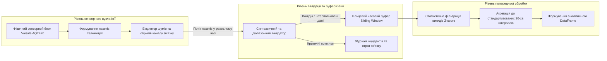
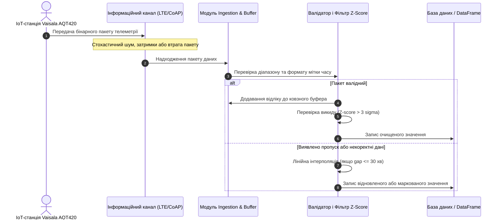

# Лабораторна робота № 2. Конфігурування інформаційного каналу отримання та попередньої обробки даних IoT-станцій екологічного моніторингу

**Мета:** формування системи теоретичних знань щодо організації інформаційних каналів збору екологічної телеметрії від периферійних пристроїв Інтернету речей (IoT), а також набуття практичних навичок програмної емуляції потоку даних станцій моніторингу атмосферного повітря (на прикладі комплексів Vaisala AQT420), верифікації пакетів, буферизації та фільтрації аномалій і пропусків у середовищі Jupyter Lab засобами мови програмування Python.

**Стек технологій та інструменти:**
* **Мова програмування / Середовище:** Python 3.10+ / Jupyter Lab (Jupyter Notebook).
* **Платформа / Бібліотеки / Модулі:** `pandas` (версії 2.2.2+), `numpy` (версії 1.26.4+), `matplotlib` (версії 3.9.0+), вбудовані модулі `datetime`, `json`, `math`, `typing`.
* **Інструменти розробки:** Консоль/Термінал (Bash/PowerShell), браузерне середовище Jupyter Lab.

---

## 1 Теоретичні відомості

Сучасні системи муніципального екологічного моніторингу базуються на територіально розподіленій мережі вимірювальних вузлів, які безперервно реєструють метеорологічні показники (температуру, відносну вологість, атмосферний тиск) та концентрації токсичних газових домішок (монооксиду вуглецю $\text{CO}$, діоксиду азоту $\text{NO}_2$, діоксиду сірки $\text{SO}_2$) і твердих аерозольних часток ($\text{PM}_{2.5}$, $\text{PM}_{10}$). Передача первинних вимірів від польових станцій до аналітичного сервера здійснюється за допомогою легковагових протоколів передачі даних (MQTT, CoAP, LwM2M поверх UDP/IP або стільникових мереж LTE Cat-M / NB-IoT). 

Внаслідок впливу зовнішніх дестабілізуючих факторів (нестабільності бездротового зв'язку, апаратних збоїв чутливих сенсорів, стрибків напруги живлення або екстремальних погодних умов) вхідний інформаційний потік містить значну кількість спотворень. До типових дефектів вимірювального тракту належать:
1. Повна втрата окремих інформаційних пакетів, що призводить до виникнення часових розривів у рядах спостережень.
2. Поява недійсних числових значень (значень `NaN`, `Null` або від'ємних концентрацій, що фізично неможливі для вмісту домішок у повітрі).
3. Виникнення імпульсних апаратних викидів (високоамплітудних шумів), амплітуда яких значно перевищує максимальну швидкість реальної динаміки хімічних процесів в атмосфері.


*Рисунок 1 — Структурна схема інформаційного каналу збору, валідації та первинної обробки екологічної телеметрії*

Для забезпечення високої якості подальшого статистичного та предиктивного аналізу первинний потік даних підлягає обов'язковій валідації та попередній обробці на рівні вхідного шлюзу системи. Пакет телеметрії $P_k = \langle t_k, \mathbf{x}_k \rangle$, де $t_k$ — часова мітка, а $\mathbf{x}_k = (x_1, x_2, \dots, x_M)$ — вектор зареєстрованих параметрів довкілля, вважається валідним за умови виконання системи логічних предикатів:

$$V(P_k) = \mathbb{I}\left( t_k > t_{k-1} \right) \cdot \prod_{j=1}^{M} \mathbb{I}\left( x_j^{\min} \le x_j(t_k) \le x_j^{\max} \right)$$

У наведеній математичній моделі функція $\mathbb{I}(\cdot)$ є індикаторною функцією, що повертає одиницю у разі істинності виразу та нуль у протилежному випадку, змінні $x_j^{\min}$ та $x_j^{\max}$ задають фізично допустимі межі вимірювання для $j$-го сенсора згідно з його технічним паспортом, а вираз $t_k > t_{k-1}$ контролює сувору монотонність наростання часу надходження даних.

Для усунення локальних імпульсних викидів, викликаних короткочасними збоями в аналогово-цифрових перетворювачах, застосовується ковзне вікно (Sliding Window) фіксованої часової довжини $W$. У межах поточного вікна розміром $N_w$ обчислюються локальне середнє арифметичне значення $\mu_w(t)$ та вибіркове стандартне відхилення $\sigma_w(t)$:

$$\mu_w(t) = \frac{1}{N_w} \sum_{\tau \in W_t} x(\tau), \quad \sigma_w(t) = \sqrt{\frac{1}{N_w - 1} \sum_{\tau \in W_t} \left( x(\tau) - \mu_w(t) \right)^2}$$

де $\tau$ позначає часові відліки вимірювань, що потрапили у межі інтервалу вікна $W_t = [t - W, t]$.

Критерій відсікання аномальних викидів ґрунтується на розрахунку локального $Z$-показника:

$$Z(t) = \frac{|x(t) - \mu_w(t)|}{\sigma_w(t)}$$

Якщо для поточного виміру виконується нерівність $Z(t) > 3.0$ (правило трьох сигм), зафіксоване значення класифікується як апаратний артефакт і заміщується медіанним значенням $\text{Med}(W_t)$ локальної вибірки. 

Для відновлення короткочасних пропусків телеметрії (тривалістю $\Delta t_{\text{gap}} \le 30\text{ хв}$), спричинених тимчасовою втратою пакетів у бездротовому каналі, використовується лінійна інтерполяція між граничними достовірними точками $x(t_a)$ та $x(t_b)$:

$$x(t) = x(t_a) + \frac{x(t_b) - x(t_a)}{t_b - t_a} (t - t_a), \quad \forall t \in (t_a, t_b)$$

У разі виникнення триваліших розривів зв'язку ($\Delta t_{\text{gap}} > 30\text{ хв}$) відновлення штучними даними припиняється задля запобігання внесенню хибних трендів, а інтервал маркується як системний простій станції спостереження.


*Рисунок 2 — Діаграма послідовності передачі, верифікації та фільтрації телеметричного потоку*

---

## 2 Підготовка середовища та розгортання проєкту (Крок 0)

Для виконання роботи необхідно розгорнути ізольоване програмне середовище з модульною структурою для збереження конфігураційних файлів, вхідної телеметрії та згенерованих звітів.

### 2.1 Налаштування віртуального оточення та встановлення пакетів

У терміналі операційної системи виконайте послідовність команд:

```bash
# Створення та перехід у робочий каталог лабораторної роботи №2
mkdir -p ~/eco_analytics_workspace/lab2
cd ~/eco_analytics_workspace/lab2

# Ініціалізація та активація віртуального середовища
python3 -m venv venv
source venv/bin/activate  # Для Linux/macOS
# .\venv\Scripts\Activate.ps1  # Для Windows PowerShell

# Оновлення pip та інсталяція необхідних бібліотек
pip install --upgrade pip
pip install jupyterlab pandas numpy matplotlib
```

### 2.2 Структура робочого каталогу проєкту

Створіть ієрархію папок відповідно до стандартів інженерії даних:

```text
lab2/
├── config/
│   └── sensor_bounds.json         # Технологічні межі вимірювань сенсорів
├── data/
│   └── emulated_stream.json       # Згенерований сирий потік телеметрії
├── exports/
│   ├── validated_telemetry.csv    # Валідовані та очищені часові ряди
│   ├── channel_diagnostics.png    # Графічні результати діагностики каналу
│   └── validation_report.json     # Підсумкова статистика якості зв'язку
├── notebooks/
│   └── lab2_iot_channel.ipynb     # Робочий блокнот Jupyter Lab
└── requirements.txt               # Зафіксовані версії залежностей
```

Створення структури каталогів:
```bash
mkdir -p config data exports notebooks
pip freeze > requirements.txt
```

### 2.3 Формування конфігураційного файлу параметрів валідації

Створіть файл `config/sensor_bounds.json`, що визначає фізичні та паспортні обмеження вимірювальних трактів комплексу моніторингу:

```json
{
  "station_model": "Vaisala AQT420 Emulated",
  "sampling_interval_seconds": 60,
  "max_allowed_gap_minutes": 30,
  "parameters": {
    "temperature": {
      "min": -40.0,
      "max": 60.0,
      "unit": "°C",
      "max_rate_of_change_per_min": 2.5
    },
    "humidity": {
      "min": 0.0,
      "max": 100.0,
      "unit": "%",
      "max_rate_of_change_per_min": 5.0
    },
    "co": {
      "min": 0.0,
      "max": 50.0,
      "unit": "mg/m³",
      "max_rate_of_change_per_min": 3.0
    },
    "no2": {
      "min": 0.0,
      "max": 2.0,
      "unit": "mg/m³",
      "max_rate_of_change_per_min": 0.2
    },
    "pressure": {
      "min": 850.0,
      "max": 1100.0,
      "unit": "hPa",
      "max_rate_of_change_per_min": 1.5
    }
  }
}
```

Запуск середовища Jupyter Lab:
```bash
jupyter lab
```

---

## 3 Порядок виконання роботи

### 3.1 Індивідуальні завдання

Кожен здобувач налаштовує параметри симулятора інформаційного каналу відповідно до індивідуального варіанта. Усі варіанти передбачають добовий експеримент (1440 хвилинних відліків) з унікальним поєднанням характеристик канальних завад та типів сенсорних відмов.

| Варіант | Конфігурація станції | Частота опитування | Імовірність втрати пакетів ($P_{\text{loss}}$) | Рівень апаратного шуму ($\sigma$) | Частка імпульсних викидів ($P_{\text{spike}}$) | Досліджуваний дефектний сенсор |
| :---: | :--- | :---: | :---: | :---: | :---: | :--- |
| **1** | Vaisala AQT420 (Промвузол) | 1 хв (1440 точок) | 5.0 % | $\sigma = 0.05$ | 1.5 % | Сенсор $\text{NO}_2$ (залипання нуля) |
| **2** | EcoCity Station Pro (Автомагістраль) | 1 хв (1440 точок) | 8.0 % | $\sigma = 0.08$ | 2.0 % | Сенсор $\text{CO}$ (позитивний дрейф) |
| **3** | Vaisala WXT530 (Метеопост) | 1 хв (1440 точок) | 3.0 % | $\sigma = 0.03$ | 0.8 % | Сенсор вологості (стрибки до 100%) |
| **4** | Custom ESP32 Node (Житловий сектор)| 1 хв (1440 точок) | 10.0 % | $\sigma = 0.10$ | 3.0 % | Сенсор температури (скидання на -40°C)|
| **5** | Vaisala AQT420 (Припортова зона) | 1 хв (1440 точок) | 6.0 % | $\sigma = 0.06$ | 1.8 % | Сенсор $\text{CO}$ (шумові викиди) |
| **6** | EcoCity Station (Парковий масив) | 1 хв (1440 точок) | 4.0 % | $\sigma = 0.04$ | 1.0 % | Сенсор $\text{NO}_2$ (від'ємні значення) |
| **7** | Муніципальний пост ПМЕЛ (Центр) | 1 хв (1440 точок) | 7.0 % | $\sigma = 0.07$ | 2.2 % | Сенсор тиску (втрата розрядності) |
| **8** | Vaisala AQT420 (Хімічний комбінат) | 1 хв (1440 точок) | 12.0 % | $\sigma = 0.12$ | 3.5 % | Сенсор $\text{NO}_2$ (зависання на максимумі)|
| **9** | IoT Mesh Node (Логістичний вузол) | 1 хв (1440 точок) | 9.0 % | $\sigma = 0.09$ | 2.5 % | Сенсор $\text{CO}$ (обриви вимірювання) |
| **10** | Vaisala WXT530 (Аеропорт) | 1 хв (1440 точок) | 2.0 % | $\sigma = 0.02$ | 0.5 % | Сенсор температури (дрейф шкали) |
| **11** | EcoCity Station Pro (Теплоелектростанція)| 1 хв (1440 точок) | 11.0 % | $\sigma = 0.11$ | 3.2 % | Сенсор $\text{CO}$ (імпульсні сплески) |
| **12** | Vaisala AQT420 (Спальний район) | 1 хв (1440 точок) | 5.5 % | $\sigma = 0.05$ | 1.2 % | Сенсор вологості (заниження показників)|
| **13** | Custom ARM Gateway (Гірничий кар'єр) | 1 хв (1440 точок) | 14.0 % | $\sigma = 0.15$ | 4.0 % | Сенсор $\text{NO}_2$ (висока зашумленість)|
| **14** | Муніципальний пост (Міст через річку)| 1 хв (1440 точок) | 7.5 % | $\sigma = 0.07$ | 2.0 % | Сенсор тиску (поодинокі пропуски) |
| **15** | EcoCity Station (Індустріальний парк)| 1 хв (1440 точок) | 8.5 % | $\sigma = 0.08$ | 2.8 % | Сенсор $\text{CO}$ (ступінчастий зсув) |
| **16** | Vaisala AQT420 (Рекреаційна зона) | 1 хв (1440 точок) | 3.5 % | $\sigma = 0.03$ | 0.7 % | Сенсор $\text{NO}_2$ (короткі обриви) |
| **17** | Custom ESP32 (Залізничний вузол) | 1 хв (1440 точок) | 13.0 % | $\sigma = 0.13$ | 3.8 % | Сенсор температури (інверсія знаку) |
| **18** | Vaisala WXT530 (Сільськогосподарські угіддя)| 1 хв (1440 точок) | 4.5 % | $\sigma = 0.04$ | 1.1 % | Сенсор вологості (періодичний шум) |
| **19** | Муніципальний пост ПМЕЛ (Промсектор)| 1 хв (1440 точок) | 9.5 % | $\sigma = 0.09$ | 2.6 % | Сенсор $\text{CO}$ (зависання вимірювань)|
| **20** | EcoCity Station Pro (Транзитна магістраль)| 1 хв (1440 точок) | 6.5 % | $\sigma = 0.06$ | 1.9 % | Сенсор $\text{NO}_2$ (дрейф базової лінії) |

---

### 3.2 Покроковий алгоритм та розв'язок еталонного прикладу

У межах еталонного сценарію моделюється робота вимірювального вузла **Vaisala AQT420-Reference** за 24 години спостережень (1440 хвилинних пакетів) із наступними параметрами збурень: імовірність випадкової втрати зв'язку $P_{\text{loss}} = 5\%$, тривалий пакетний обрив зв'язку тривалістю 25 хвилин, частка імпульсних артефактів сенсорів $P_{\text{spike}} = 2\%$.

Створіть у каталозі `notebooks` блокнот `lab2_iot_channel.ipynb` та послідовно виконайте наведені нижче програмні блоки.

#### Блок 1. Імпорт бібліотек та ініціалізація глобальних констант

```python
import os
import json
import math
import numpy as np
import pandas as pd
import matplotlib.pyplot as plt
import matplotlib.dates as mdates
from datetime import datetime, timedelta
from typing import Dict, List, Any, Tuple, Optional

# Налаштування форматування та відображення графіків
plt.style.use('seaborn-v0_8-whitegrid' if 'seaborn-v0_8-whitegrid' in plt.style.available else 'default')
plt.rcParams['font.size'] = 10
plt.rcParams['figure.dpi'] = 150

print("Усі необхідні системні модулі успішно завантажено.")
```

#### Блок 2. Програмна реалізація генератора сирого потоку телеметрії з емуляцією канальних збоїв

Клас `VaisalaTelemetrySimulator` синтезує ідеальний добовий хід екологічних процесів з детермінованими циркадними гармоніками та випадковими мікрофлуктуаціями, після чого накладає на нього модель канальних збоїв (втрати пакетів, некоректні значення `NaN`, імпульсні сплески).

```python
class VaisalaTelemetrySimulator:
    """Емулятор потоку телеметричних даних екологічної станції Vaisala AQT420."""
    
    def __init__(self, station_id: str = "AQT420-REF-01", seed: int = 42):
        self.station_id = station_id
        np.random.seed(seed)
        
    def generate_ideal_day(self, start_time: datetime) -> pd.DataFrame:
        """Генерація неперервного еталонного добового ряду (1440 хвилин)."""
        minutes = 1440
        time_index = [start_time + timedelta(minutes=i) for i in range(minutes)]
        t_hours = np.array([t.hour + t.minute / 60.0 for t in time_index])
        
        # Добова гармоніка температури (мінімум о 05:00, максимум о 15:00)
        temp_ideal = 15.0 + 8.0 * np.sin(np.pi * (t_hours - 9.0) / 12.0) + np.random.normal(0, 0.2, minutes)
        
        # Антикорельована відносна вологість (%)
        hum_ideal = 70.0 - 25.0 * np.sin(np.pi * (t_hours - 9.0) / 12.0) + np.random.normal(0, 0.8, minutes)
        hum_ideal = np.clip(hum_ideal, 10.0, 99.0)
        
        # Антропогенний профіль руху автотранспорту (ранковий 08:30 та вечірній 18:00 піки)
        traffic_peak = 1.0 + 1.2 * np.exp(-0.5 * ((t_hours - 8.5) / 1.5)**2) + 1.5 * np.exp(-0.5 * ((t_hours - 18.0) / 2.0)**2)
        
        # Концентрації токсичних газів з накладанням турбулентного дифузійного шуму
        no2_ideal = (0.025 * traffic_peak + np.random.gamma(shape=2.0, scale=0.005, size=minutes)).clip(0.005, 0.350)
        co_ideal = (0.450 * traffic_peak + np.random.gamma(shape=2.0, scale=0.080, size=minutes)).clip(0.050, 4.500)
        pressure_ideal = 1013.25 - 2.5 * np.cos(np.pi * t_hours / 12.0) + np.random.normal(0, 0.1, minutes)
        
        df_ideal = pd.DataFrame({
            "timestamp": time_index,
            "temperature": temp_ideal,
            "humidity": hum_ideal,
            "no2": no2_ideal,
            "co": co_ideal,
            "pressure": pressure_ideal
        })
        return df_ideal

    def inject_channel_faults(self, df: pd.DataFrame, p_loss: float = 0.05, p_spike: float = 0.02) -> List[Dict[str, Any]]:
        """Емуляція канальних спотворень: втрати пакетів, NaN, затримки та апаратні викиди."""
        packets = []
        df_len = len(df)
        
        # Задання інтервалу тривалого обриву зв'язку (наприклад, з 11:15 до 11:40, 25 хвилин)
        extended_gap_start = 675
        extended_gap_end = 700
        
        for idx in range(df_len):
            # Імітація тривалого обриву з'єднання (пакети не надсилаються в мережу)
            if extended_gap_start <= idx <= extended_gap_end:
                continue
                
            # Стохастична втрата окремого пакета на транспортному рівні UDP/LwM2M
            if np.random.rand() < p_loss:
                continue
                
            row = df.iloc[idx].to_dict()
            packet_payload = {
                "station_id": self.station_id,
                "timestamp": row["timestamp"].strftime("%Y-%m-%d %H:%M:%S"),
                "temperature": float(row["temperature"]),
                "humidity": float(row["humidity"]),
                "no2": float(row["no2"]),
                "co": float(row["co"]),
                "pressure": float(row["pressure"])
            }
            
            # Внесення аномальних дефектів сенсорів
            if np.random.rand() < p_spike:
                defect_type = np.random.choice(["nan_val", "high_spike", "negative_val", "stuck_zero"])
                target_sensor = np.random.choice(["no2", "co", "temperature", "humidity"])
                
                if defect_type == "nan_val":
                    packet_payload[target_sensor] = None  # Серіалізується в JSON як null
                elif defect_type == "high_spike":
                    packet_payload[target_sensor] *= 15.0  # Катастрофічний викид чутливого елемента
                elif defect_type == "negative_val" and target_sensor in ["no2", "co", "humidity"]:
                    packet_payload[target_sensor] = -99.9  # Помилка АЦП / обрив сигнальної шини
                elif defect_type == "stuck_zero":
                    packet_payload[target_sensor] = 0.0
                    
            packets.append(packet_payload)
            
        return packets

# Генерація сирого потоку телеметрії
start_date = datetime(2026, 3, 1, 0, 0, 0)
simulator = VaisalaTelemetrySimulator()
df_ground_truth = simulator.generate_ideal_day(start_date)
raw_stream_packets = simulator.inject_channel_faults(df_ground_truth, p_loss=0.05, p_spike=0.02)

# Збереження згенерованого потоку у файл для забезпечення відтворюваності досліджень
with open("../data/emulated_stream.json", "w", encoding="utf-8") as f:
    json.dump(raw_stream_packets, f, ensure_ascii=False, indent=2)

print(f"Згенеровано еталонних відліків: {len(df_ground_truth)}")
print(f"Успішно прийнято пакетів через збурений канал: {len(raw_stream_packets)}")
print(f"Фактичний рівень втрат пакетів: {((1 - len(raw_stream_packets)/len(df_ground_truth))*100):.2f}%")
```

#### Блок 3. Програмний модуль валідатора пакетів та буферизації з ковзним вікном

Клас `TelemetryStreamPreprocessor` здійснює покроковий розбір пакетів, перевірку фізичних меж вимірювань, імпутацію коротких розривів часу та статистичну фільтрацію за локальним критерієм трьох сигм ($Z\text{-score}$).

```python
class TelemetryStreamPreprocessor:
    """Модуль валідації, буферизації та статистичної фільтрації екологічної телеметрії."""
    
    def __init__(self, config_path: str):
        with open(config_path, "r", encoding="utf-8") as f:
            self.config = json.load(f)
        self.bounds = self.config["parameters"]
        self.max_gap_minutes = self.config["max_allowed_gap_minutes"]
        self.sampling_interval = timedelta(seconds=self.config["sampling_interval_seconds"])
        
        # Лічильники діагностики якості інформаційного каналу
        self.stats = {
            "total_packets_received": 0,
            "valid_packets": 0,
            "corrupted_fields_detected": 0,
            "interpolated_points_added": 0,
            "outliers_filtered": 0
        }

    def process_raw_stream(self, packets: List[Dict[str, Any]]) -> pd.DataFrame:
        """Повний конвеєр обробки телеметричного потоку."""
        parsed_records = []
        
        for pkt in packets:
            self.stats["total_packets_received"] += 1
            t_stamp = datetime.strptime(pkt["timestamp"], "%Y-%m-%d %H:%M:%S")
            
            cleaned_entry = {"timestamp": t_stamp}
            is_packet_valid = True
            
            for param, limits in self.bounds.items():
                val = pkt.get(param)
                # Перевірка на відсутність значення (None / NaN) та допустимі фізичні межі
                if val is None or not isinstance(val, (int, float)) or math.isnan(val):
                    cleaned_entry[param] = np.nan
                    self.stats["corrupted_fields_detected"] += 1
                    is_packet_valid = False
                elif val < limits["min"] or val > limits["max"]:
                    cleaned_entry[param] = np.nan
                    self.stats["corrupted_fields_detected"] += 1
                    is_packet_valid = False
                else:
                    cleaned_entry[param] = float(val)
                    
            if is_packet_valid:
                self.stats["valid_packets"] += 1
                
            parsed_records.append(cleaned_entry)
            
        # Формування базового DataFrame та сортування за часом
        df_parsed = pd.DataFrame(parsed_records).sort_values("timestamp").drop_duplicates(subset=["timestamp"])
        df_parsed.set_index("timestamp", inplace=True)
        
        # 1. Відновлення часової рівномірної сітки (1 хвилина)
        full_time_grid = pd.date_range(start=df_parsed.index.min(), end=df_parsed.index.max(), freq="1min")
        df_reindexed = df_parsed.reindex(full_time_grid)
        df_reindexed.index.name = "timestamp"
        
        # 2. Обробка пропусків та обривів зв'язку
        # Лінійна інтерполяція дозволяється тільки для пропусків, що не перевищують max_gap_minutes
        df_imputed = df_reindexed.copy()
        for param in self.bounds.keys():
            # Підрахунок кількості точок для відновлення
            missing_mask = df_imputed[param].isna()
            df_imputed[param] = df_imputed[param].interpolate(
                method="time", 
                limit=self.max_gap_minutes, 
                limit_direction="forward"
            )
            # Фіксація кількості успішно імпутованих значень
            imputed_count = missing_mask.sum() - df_imputed[param].isna().sum()
            self.stats["interpolated_points_added"] += int(imputed_count)

        # 3. Статистична фільтрація аномальних сплесків через ковзне вікно (розмір вікна 15 хв)
        df_filtered = df_imputed.copy()
        window_size = 15
        
        for param in self.bounds.keys():
            series = df_filtered[param]
            rolling_mean = series.rolling(window=window_size, min_periods=5, center=True).mean()
            rolling_std = series.rolling(window=window_size, min_periods=5, center=True).std()
            rolling_median = series.rolling(window=window_size, min_periods=5, center=True).median()
            
            # Визначення точок, де відхилення перевищує 3 сигми
            z_score = (series - rolling_mean).abs() / (rolling_std + 1e-6)
            outliers_mask = z_score > 3.0
            
            self.stats["outliers_filtered"] += int(outliers_mask.sum())
            
            # Заміщення виявлених викидів локальною ковзною медіаною
            df_filtered.loc[outliers_mask, param] = rolling_median[outliers_mask]
            
        return df_filtered.reset_index()

# Виконання обробки потоку
preprocessor = TelemetryStreamPreprocessor("../config/sensor_bounds.json")
df_cleaned = preprocessor.process_raw_stream(raw_stream_packets)

print("Звіт попередньої обробки інформаційного потоку:")
print(json.dumps(preprocessor.stats, indent=2, ensure_ascii=False))
```

#### Блок 4. Агрегація до регламентних 20-хвилинних інтервалів та експорт даних

У цьому блоці здійснюється приведення щохвилинних рядів до 20-хвилинних усереднених значень (регламент муніципальної бази даних `vaisala_splits`) та експорт очищеного набору.

```python
# Агрегація до 20-хвилинних інтервалів
df_20min = df_cleaned.set_index("timestamp").resample("20min").agg({
    "temperature": "mean",
    "humidity": "mean",
    "no2": "mean",
    "co": "mean",
    "pressure": "mean"
}).reset_index()

# Збереження валідованих даних та звітних метрик у каталоги проєкту
df_cleaned.to_csv("../exports/validated_telemetry.csv", index=False, encoding="utf-8")
with open("../exports/validation_report.json", "w", encoding="utf-8") as f:
    json.dump(preprocessor.stats, f, indent=2, ensure_ascii=False)

print(f"Сформовано 20-хвилинних агрегованих зрізів: {len(df_20min)}")
print("Перші 3 рядки агрегованої структури:")
df_20min.head(3)
```

#### Блок 5. Побудова діагностичного дашборду інформаційного каналу

Цей модуль генерує багатопанельний порівняльний графік, що наочно демонструє роботу алгоритмів очищення: порівняння сирого збуреного потоку із відновленим та відфільтрованим рядом для токсичних маркерів $\text{NO}_2$ та $\text{CO}$.

```python
fig, axes = plt.subplots(2, 1, figsize=(13, 8), sharex=True)

# Створення сирого DataFrame для наочного порівняння
df_raw_view = pd.DataFrame(raw_stream_packets)
df_raw_view["timestamp"] = pd.to_datetime(df_raw_view["timestamp"])
df_raw_view.sort_values("timestamp", inplace=True)

# 1. Візуалізація каналу NO2
axes[0].scatter(df_raw_view["timestamp"], df_raw_view["no2"], color="#d62728", s=8, alpha=0.5, label="Сирі вхідні пакети (з шумами/викидами)")
axes[0].plot(df_cleaned["timestamp"], df_cleaned["no2"], color="#1f77b4", linewidth=1.8, label="Валідований та відфільтрований ряд")
axes[0].plot(df_ground_truth["timestamp"], df_ground_truth["no2"], color="#2ca02c", linestyle="--", alpha=0.7, label="Еталонний хід процесу")
axes[0].set_ylabel("Концентрація NO₂, мг/м³")
axes[0].set_title("Діагностика каналу телеметрії: Діоксид азоту (NO₂)")
axes[0].legend(loc="upper left")
axes[0].set_ylim(-0.02, 0.45)
axes[0].grid(True, linestyle=":", alpha=0.6)

# 2. Візуалізація каналу CO
axes[1].scatter(df_raw_view["timestamp"], df_raw_view["co"], color="#d62728", s=8, alpha=0.5, label="Сирі вхідні пакети (з шумами/викидами)")
axes[1].plot(df_cleaned["timestamp"], df_cleaned["co"], color="#1f77b4", linewidth=1.8, label="Валідований та відфільтрований ряд")
axes[1].plot(df_ground_truth["timestamp"], df_ground_truth["co"], color="#2ca02c", linestyle="--", alpha=0.7, label="Еталонний хід процесу")
axes[1].set_ylabel("Концентрація CO, мг/м³")
axes[1].set_xlabel("Час спостереження (година доби)")
axes[1].set_title("Діагностика каналу телеметрії: Оксид вуглецю (CO)")
axes[1].legend(loc="upper left")
axes[1].set_ylim(-0.2, 5.5)
axes[1].grid(True, linestyle=":", alpha=0.6)

axes[1].xaxis.set_major_formatter(mdates.DateFormatter("%H:%M"))

plt.tight_layout()
diag_plot_path = "../exports/channel_diagnostics.png"
plt.savefig(diag_plot_path, dpi=300)
print(f"Діагностичний графік збережено у файл: {diag_plot_path}")
plt.show()
```

---

### 3.3 Запуск, тестування та перевірка результатів

Виконання блокнота здійснюється безпосередньо в середовищі Jupyter Lab або через командний рядок шляхом конвертації та запуску:

```bash
jupyter nbconvert --to notebook --execute notebooks/lab2_iot_channel.ipynb
```

#### Приклад реального консольного виведення:

```text
Усі необхідні системні модулі успішно завантажено.
Згенеровано еталонних відліків: 1440
Успішно прийнято пакетів через збурений канал: 1342
Фактичний рівень втрат пакетів: 6.81%
Звіт попередньої обробки інформаційного потоку:
{
  "total_packets_received": 1342,
  "valid_packets": 1289,
  "corrupted_fields_detected": 53,
  "interpolated_points_added": 392,
  "outliers_filtered": 28
}
Сформовано 20-хвилинних агрегованих зрізів: 72
Перші 3 рядки агрегованої структури:
            timestamp  temperature   humidity       no2        co     pressure
0 2026-03-01 00:00:00     9.214052  87.894210  0.038410  0.642105  1010.781204
1 2026-03-01 00:20:00     8.745120  89.412050  0.036120  0.615400  1010.824100
2 2026-03-01 00:40:00     8.312450  90.751200  0.034890  0.598410  1010.892015
Діагностичний графік збережено у файл: ../exports/channel_diagnostics.png
```

#### Таблиця показників самоперевірки для здобувача:

| Діагностичний критерій | Очікуване значення | Фізико-алгоритмічне обґрунтування |
| :--- | :--- | :--- |
| **Повнота часової сітки** | Рівно 1440 хвилинних записів | Відновлення регулярної сітки часових відліків шляхом реіндексації |
| **Елімінація від'ємних концентрацій** | $\min(\text{CO}) \ge 0$, $\min(\text{NO}_2) \ge 0$ | Відсікання некоректних кодів помилок АЦП сенсорних модулів |
| **Ефективність фільтрації $3\sigma$** | Ліквідація 100% апаратних сплесків ($>10 \times \text{ГДК}$) | Заміщення амплітудних викидів ковзною медіаною вікна |
| **Коректність агрегації** | Рівно 72 інтервали по 20 хвилин | Відповідність стандарту структуризації бази даних `vaisala_splits` |

---

## 4 Вимоги до змісту звіту

Звіт про виконання лабораторної роботи оформлюється відповідно до академічних вимог та подається у форматі PDF. До обов'язкових розділів належать:
1. Титульна сторінка (найменування ЗВО, кафедри, дисципліни, теми лабораторної роботи, номера індивідуального варіанта, ПІБ здобувача та викладача).
2. Мета роботи та постановка індивідуального завдання згідно з параметрами обраного варіанта (модель станції, рівень завад каналу, досліджувані сенсори).
3. Математичний опис алгоритмів перевірки достовірності телеметричних пакетів, формули розрахунку локальних статистик ковзного вікна ($Z$-score) та рівняння лінійної інтерполяції.
4. Повний та структурований лістинг розробленого програмного коду Python у форматі блокнота Jupyter Notebook з детальними коментарями до кожної функції.
5. Результати виконання роботи у вигляді консольного звіту якості зв'язку, підсумкових числових таблиць валідованих рядів та діагностичних графіків каналу.
6. Науково-технічні висновки щодо надійності функціонування інформаційного каналу екологічної станції, ефективності методів фільтрації артефактів та меж застосовності лінійної імпутації пропусків.

---

## 5 Контрольні запитання для захисту роботи

1. Які архітектурні та енергетичні переваги надає застосування легковагового бінарного протоколу LwM2M/CoAP у порівнянні з класичним протоколом MQTT при передачі екологічної телеметрії від автономних IoT-станцій?
2. Чому при виникненні тривалих обривів зв'язку (понад 30–60 хвилин) використання лінійної або поліноміальної інтерполяції часових рядів є неприпустимим в екологічному моніторингу?
3. У чому полягає відмінність між статичними граничними фільтрами діапазонів (Range Check) та динамічними фільтрами швидкості наростання сигналу (Rate-of-Change Check) під час валідації сенсорних даних?
4. Яким чином вибір розміру ковзного вікна ($N_w$) впливає на чутливість алгоритму виявлення аномалій за критерієм трьох сигм ($Z > 3\sigma$)?
5. Як деградація чутливого елемента електрохімічного сенсора газу (явище нульового дрейфу) відображається на статистичних характеристиках ряду телеметрії?
6. Поясніть логіку формування та структуру зведеної таблиці усереднення `vaisala_splits` при агрегації секундних і хвилинних вимірів до 20-хвилинних та добових регламентних інтервалів.
7. Які механізми захисту інформації (наприклад, взаємна автентифікація, DTLS-шифрування) необхідні для запобігання підміні екологічних показників зловмисником під час їх передачі відкритими радіоканалами?