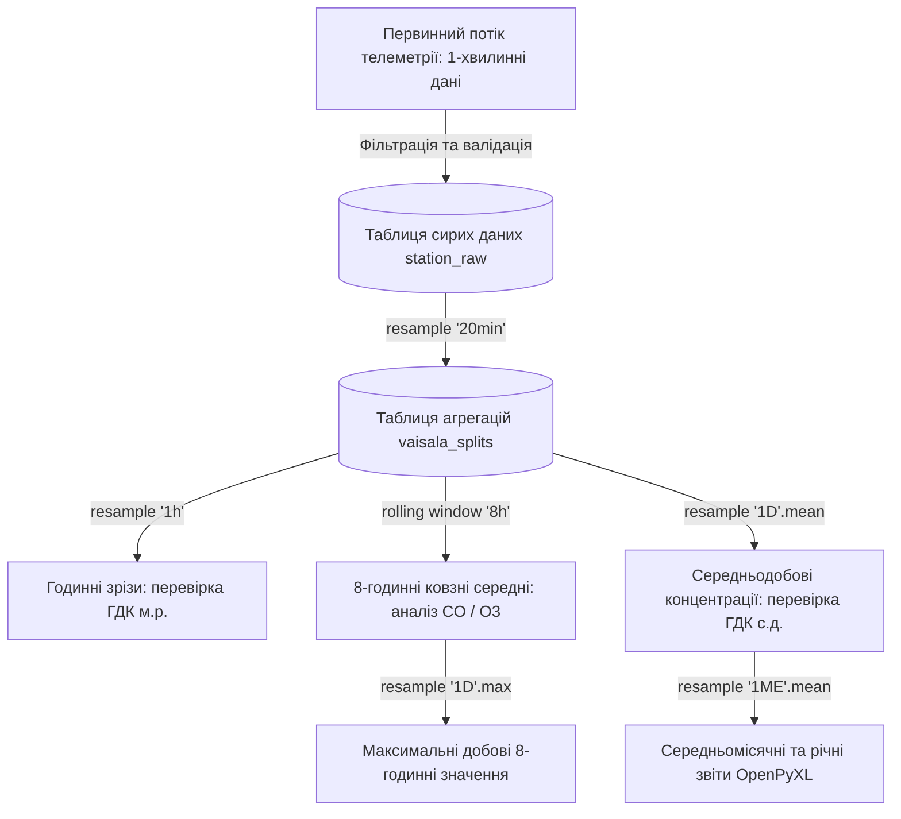
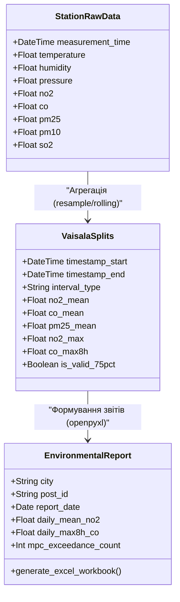

# Лабораторна робота № 3. Проєктування та структурування табличних наборів даних для зберігання екологічної інформації

**Мета:** формування теоретичних знань щодо багаторівневої структуризації екологічних баз даних у муніципальних інформаційно-аналітичних системах, а також набуття практичних навичок приведення «сирих» хвилинних часових рядів телеметрії до стандартизованих інтервалів агрегації (20-хвилинних, годинних, ковзних 8-годинних, середньодобових та місячних) засобами бібліотек `pandas` та `openpyxl` у середовищі Jupyter Lab відповідно до регламентів Постанови КМУ № 827.

**Стек технологій та інструменти:**
* **Мова програмування / Середовище:** Python 3.10+ / Jupyter Lab (Jupyter Notebook).
* **Платформа / Бібліотеки / Модулі:** `pandas` (версії 2.2.2+), `openpyxl` (версії 3.1.2+), `numpy` (версії 1.26.4+), `matplotlib` (версії 3.9.0+), вбудований модуль `datetime`.
* **Інструменти розробки:** Консоль/Термінал (Bash/PowerShell), блокнот Jupyter Notebook.

---

## 1 Теоретичні відомості

Автоматизовані комплекси екологічного моніторингу (зокрема станції Vaisala AQT420/WXT530 та пости спостереження промислових підприємств) генерують первинні дані з високою частотою дискретизації — зазвичай від 1 до 60 секунд. Пряме збереження та обробка таких масивів у реляційних базах даних спричиняє надмірне навантаження на дискову підсистему та суттєво сповільнює виконання аналітичних запитів. У зв'язку з цим у сучасних екологічних інформаційних системах впроваджується багаторівнева схема структурування даних, за якої детальні «сирі» записи зберігаються у тимчасових таблицях протягом обмеженого терміну, а для довготривалого зберігання та формування звітності розраховуються узагальнені часові агрегації.

Відповідно до Порядку здійснення державного моніторингу в галузі охорони атмосферного повітря (Постанова КМУ № 827), оцінювання ступеня забруднення довкілля здійснюється на основі суворо регламентованих часових інтервалів:
1. Базові 20-хвилинні інтервали усереднення, які формують основу таблиць типу `vaisala_splits` та використовуються для оперативного контролю викидів.
2. Годинні усереднені значення, що застосовуються для перевірки дотримання максимальних разових гранично допустимих концентрацій ($ГДК_{\text{м.р.}}$).
3. Восьмигодинні ковзні середні величини, призначені для оцінювання впливу речовин хронічної токсичності (зокрема озону $O_3$ та оксиду вуглецю $CO$).
4. Середньодобові показники, які визначають відповідність рівням оцінки для захисту здоров'я людини ($ГДК_{\text{с.д.}}$).
5. Середньомісячні та середньорічні агрегації, що є базою для стратегічного планування природоохоронних заходів та моделювання кліматичних змін.


*Рисунок 1 — Схема багаторівневої просторово-часової агрегації екологічних даних*

Математичний апарат обчислення базового 20-хвилинного усереднення концентрації $j$-ї домішки ($\bar{C}_{20\text{m}, j}$) за наявності $M_{20}$ дискретних вимірів усередині інтервалу описується виразом:

$$\bar{C}_{20\text{m}, j}(k) = \frac{1}{M_{20}} \sum_{i=1}^{M_{20}} C_{\text{raw}, j}(t_i)$$

де $C_{\text{raw}, j}(t_i)$ — виміряне значення концентрації в момент часу $t_i$, а $M_{20} = 20$ для щохвилинної частоти опитування сенсорів.

Розрахунок ковзного 8-годинного середнього значення ($\bar{C}_{8\text{h}, j}(t)$) для фіксованого моменту часу $t$ здійснюється інтегруванням концентрацій за попередній восьмигодинний інтервал:

$$\bar{C}_{8\text{h}, j}(t) = \frac{1}{N_{8\text{h}}} \sum_{\tau \in [t - 8\text{h}, t]} C_j(\tau)$$

де $N_{8\text{h}}$ — кількість точок вимірювання, що потрапили у 8-годинне вікно спостереження. Відповідно до вимог нормативних документів, розрахунок максимального середньодобового 8-годинного значення для доби $d$ ($C_{8\text{h, max}, j}(d)$) визначається як точна верхня грань множини отриманих ковзних оцінок:

$$C_{8\text{h, max}, j}(d) = \max_{t \in \text{Доба } d} \left( \bar{C}_{8\text{h}, j}(t) \right)$$

Середньодобова концентрація ($\bar{C}_{\text{daily}, j}(d)$) обчислюється як середнє арифметичне всіх дискретних інтервалів доби:

$$\bar{C}_{\text{daily}, j}(d) = \frac{1}{N_d} \sum_{k=1}^{N_d} C_j(t_k)$$

де $N_d$ визначає кількість валідних інтервалів за добу ($N_d = 72$ для 20-хвилинних агрегацій або $N_d = 1440$ для хвилинних даних).

Середньомісячна концентрація ($\bar{C}_{\text{month}, j}(m)$) формується з урахуванням фактичної кількості календарних днів $D_m$ у досліджуваному місяці:

$$\bar{C}_{\text{month}, j}(m) = \frac{1}{D_m} \sum_{d=1}^{D_m} \bar{C}_{\text{daily}, j}(d)$$

де величина $D_m \in \{28, 29, 30, 31\}$ динамічно визначається залежно від номера місяця та високосності року.


*Рисунок 2 — Концептуальна модель класів та зв'язків екологічних даних на різних етапах агрегації*

Критичною умовою забезпечення достовірності агрегованих даних є дотримання правила валідності вибірки: агрегований показник вважається валідним лише у випадку, якщо частка достовірних первинних вимірів у межах розрахункового вікна становить не менше 75%. Якщо ця умова порушується через технічні відмови сенсорів або обриви зв'язку, відповідний інтервал маркується прапорцем неповноти даних, що виключає хибні висновки при аудиті екологічної безпеки.

---

## 2 Підготовка середовища та розгортання проєкту (Крок 0)

Для виконання завдань необхідно організувати робочий простір, налаштувати віртуальне середовище Python та створити конфігураційні схеми обробки даних.

### 2.1 Перевірка залежностей та встановлення пакетів

У терміналі операційної системи виконайте команди перевірки та інсталяції необхідних компонентів:

```bash
# Створення та перехід до робочої директорії лабораторної роботи №3
mkdir -p ~/eco_analytics_workspace/lab3
cd ~/eco_analytics_workspace/lab3

# Ініціалізація та активація віртуального середовища
python3 -m venv venv
source venv/bin/activate  # Для Linux/macOS
# .\venv\Scripts\Activate.ps1  # Для Windows PowerShell

# Інсталяція бібліотек обробки даних та генерації електронних таблиць Excel
pip install --upgrade pip
pip install jupyterlab pandas openpyxl numpy matplotlib
```

### 2.2 Структура робочого каталогу проєкту

Створіть необхідне дерево папок і файлів для організації обчислювального процесу:

```text
lab3/
├── config/
│   └── reporting_rules.json       # Нормативні параметри та правила усереднення
├── data/
│   └── raw_minute_telemetry.csv   # Сирий набір щохвилинних спостережень
├── exports/
│   ├── vaisala_splits_20min.csv   # Таблиця 20-хвилинних агрегацій
│   ├── municipal_air_report.xlsx  # Багатосторінковий підсумковий звіт Excel
│   └── aggregation_trends.png     # Графік порівняння часових масштабів
├── notebooks/
│   └── lab3_data_structuring.ipynb# Робочий блокнот Jupyter Lab
└── requirements.txt               # Реєстр версій модулів
```

Створення структури директорій та фіксація залежностей:
```bash
mkdir -p config data exports notebooks
pip freeze > requirements.txt
```

### 2.3 Створення конфігураційного файлу нормативів та правил агрегації

Створіть конфігураційний файл `config/reporting_rules.json`, що задає гранично допустимі концентрації та часові пороги валідності відповідно до чинного законодавства:

```json
{
  "station_code": "VAISALA-KR-04",
  "location": "м. Кременчук, вул. Шевченка, 22/30",
  "data_completeness_threshold_pct": 75.0,
  "standards_mpc": {
    "no2": {
      "mpc_daily": 0.040,
      "mpc_single_max": 0.200,
      "unit": "мг/м³"
    },
    "co": {
      "mpc_daily": 3.000,
      "mpc_single_max": 5.000,
      "mpc_8h_max": 3.500,
      "unit": "мг/м³"
    },
    "pm25": {
      "mpc_daily": 0.025,
      "mpc_single_max": 0.100,
      "unit": "мг/м³"
    },
    "pm10": {
      "mpc_daily": 0.050,
      "mpc_single_max": 0.150,
      "unit": "мг/м³"
    },
    "so2": {
      "mpc_daily": 0.050,
      "mpc_single_max": 0.500,
      "unit": "мг/м³"
    }
  }
}
```

Запуск середовища розробки:
```bash
jupyter lab
```

---

## 3 Порядок виконання роботи

### 3.1 Індивідуальні завдання

Здобувач виконує наскрізне проєктування табличної моделі та агрегацію масивів телеметрії відповідно до свого індивідуального варіанта. У кожному завданні моделюється 7-добовий період неперервних хвилинних спостережень (10 080 записів) з урахуванням випадкових пропусків зв'язку та регламентних вимог до звітності.

| Варіант | Об'єкт моніторингу та модель поста | Часовий інтервал | Досліджувані речовини і параметри | Цільові регламентні показники для звіту |
| :---: | :--- | :---: | :--- | :--- |
| **1** | Пост №1 «Північний промвузол» (Vaisala AQT420) | 7 діб (хвилинні) | $\text{NO}_2$, $\text{CO}$, $\text{PM}_{2.5}$, Температура | 20-хв зрізи, 8-год ковзне $\text{CO}$, середньодобові |
| **2** | Пост №2 «Гімназія №26» (Vaisala AQT420) | 7 діб (хвилинні) | $\text{PM}_{2.5}$, $\text{PM}_{10}$, $\text{NO}_2$, Вологість | Годинні макс., добові сер., кратність $ГДК_{\text{с.д.}}$ |
| **3** | Пост №4 «Вул. Шевченка» (Автоматичний пост) | 7 діб (хвилинні) | $\text{SO}_2$, $\text{CO}$, $\text{NO}_2$, $\text{PM}_{10}$ | 8-год максимум $\text{CO}$, 20-хв таблиця `splits` |
| **4** | Пост №5 «Крюківський міст» (Vaisala WXT530)| 7 діб (хвилинні) | $\text{CO}$, $\text{NO}_2$, $\text{PM}_{2.5}$, Тиск | Аналіз транспортних піків, добові середні |
| **5** | Стаціонарний пост «Фаворит» (EcoCity Pro) | 7 діб (хвилинні) | $\text{PM}_{2.5}$, $\text{PM}_{10}$, $\text{SO}_2$, $\text{CO}$ | 1-год середні, 8-год ковзні, інциденти перевищень |
| **6** | Локальний пост ТЕС (Промислова станція) | 7 діб (хвилинні) | $\text{SO}_2$, $\text{NO}_2$, $\text{PM}_{10}$, Температура | Годинні максимуми $\text{SO}_2$, добова нерівномірність |
| **7** | Муніципальний пост «Центральний майдан» | 7 діб (хвилинні) | $\text{NO}_2$, $\text{CO}$, $\text{PM}_{2.5}$, Вологість | Розрахунок добового максимуму 8-год $\text{CO}$ |
| **8** | Пост спостереження «Східний масив» | 7 діб (хвилинні) | $\text{PM}_{2.5}$, $\text{SO}_2$, $\text{CO}$, Тиск | 20-хв агрегації, перевірка критерію $75\%$ даних |
| **9** | Екологічний пост «Південний мікрорайон» | 7 діб (хвилинні) | $\text{PM}_{10}$, $\text{NO}_2$, $\text{CO}$, Температура | Добові середні, підрахунок годин вище $ГДК_{\text{м.р.}}$ |
| **10** | Пост контролю залізничного вузла | 7 діб (хвилинні) | $\text{CO}$, $\text{NO}_2$, $\text{SO}_2$, Вологість | 8-год ковзне середнє, експорт до Excel-книги |
| **11** | Пост припортової зони (Vaisala AQT420) | 7 діб (хвилинні) | $\text{PM}_{2.5}$, $\text{PM}_{10}$, $\text{NO}_2$, Тиск | Зведені добові таблиці, аналіз пікових годин |
| **12** | Автоматична метеостанція «Паркова» | 7 діб (хвилинні) | $\text{NO}_2$, $\text{CO}$, $\text{PM}_{2.5}$, Вологість | Оцінка фонових добових рівнів, 20-хв зрізи |
| **13** | Промисловий пост «Нафтопереробний завод» | 7 діб (хвилинні) | $\text{SO}_2$, $\text{NO}_2$, $\text{CO}$, Температура | Годинні та добові максимуми, журнал інцидентів |
| **14** | Пост автодорожньої розв'язки (EcoCity) | 7 діб (хвилинні) | $\text{CO}$, $\text{PM}_{2.5}$, $\text{NO}_2$, $\text{PM}_{10}$ | 8-год максимальні значення, добовий профіль |
| **15** | Пост «Річковий порт» (Vaisala WXT530) | 7 діб (хвилинні) | $\text{PM}_{10}$, $\text{SO}_2$, $\text{CO}$, Вологість | 20-хв таблиця `vaisala_splits`, перевірка валідності |
| **16** | Дослідний пост хімічного факультету | 7 діб (хвилинні) | $\text{NO}_2$, $\text{SO}_2$, $\text{PM}_{2.5}$, Тиск | Годинні середні, кратність добового ГДК |
| **17** | Агромоніторинговий пост передмістя | 7 діб (хвилинні) | $\text{PM}_{2.5}$, $\text{CO}$, $\text{NO}_2$, Температура | Середньодобові показники, експорт до XLSX |
| **18** | Пост кар'єрного комплексу ГЗК | 7 діб (хвилинні) | $\text{PM}_{10}$, $\text{PM}_{2.5}$, $\text{SO}_2$, Вологість | Добова динаміка пилу, годинні екстремуми |
| **19** | Санітарно-захисний пост металургійного цеху| 7 діб (хвилинні) | $\text{CO}$, $\text{SO}_2$, $\text{NO}_2$, Тиск | 8-год ковзні середні $\text{CO}$, аналіз відхилень |
| **20** | Муніципальний пост «Житловий масив Західний»| 7 діб (хвилинні) | $\text{PM}_{2.5}$, $\text{NO}_2$, $\text{CO}$, Вологість | 20-хв зрізи, тижневий баланс якості повітря |

---

### 3.2 Покроковий алгоритм та розв'язок еталонного прикладу

У межах еталонного прикладу розглядається стаціонарний пункт моніторингу **«Кременчук-Еталон»** (пост №4, вул. Шевченка), для якого синтезується неперервний тижневий ряд щохвилинної телеметрії (7 діб $\times$ 1440 хв = 10 080 спостережень). Необхідно реалізувати повний конвеєр агрегації даних, перевірку правила $75\%$ повноти та експорт у багатосторінкову книгу Microsoft Excel згідно зі структурою муніципальної звітності.

Створіть у каталозі `notebooks` блокнот `lab3_data_structuring.ipynb` і послідовно виконайте наведені програмні модулі.

#### Блок 1. Імпорт бібліотек та генерація первинного масиву щохвилинної телеметрії

Цей модуль завантажує пакети та генерує масив даних із реалістичними добовими антропогенними циклами, турбулентними шумами та випадковими розривами каналу передачі даних.

```python
import os
import json
import numpy as np
import pandas as pd
import openpyxl
from openpyxl.styles import Font, Alignment, PatternFill, Border, Side
from datetime import datetime, timedelta
import matplotlib.pyplot as plt
import matplotlib.dates as mdates

# Налаштування відтворюваності та візуалізації
np.random.seed(101)
plt.style.use('seaborn-v0_8-whitegrid' if 'seaborn-v0_8-whitegrid' in plt.style.available else 'default')

# 1. Формування часової сітки на 7 діб (10080 хвилин)
start_date = datetime(2026, 3, 1, 0, 0, 0)
total_minutes = 7 * 24 * 60
time_grid = [start_date + timedelta(minutes=i) for i in range(total_minutes)]
t_hours = np.array([t.hour + t.minute / 60.0 for t in time_grid])
days_array = np.array([(t - start_date).days for t in time_grid])

# 2. Моделювання добових ритмів та екологічних трендів
traffic_pulse = 1.0 + 0.9 * np.exp(-0.5 * ((t_hours - 8.5) / 1.5)**2) + 1.2 * np.exp(-0.5 * ((t_hours - 18.0) / 2.0)**2)
weekly_trend = 1.0 + 0.05 * np.sin(2 * np.pi * days_array / 7.0)

# Генерація масивів параметрів (у мг/м³ для газів і пилу, °C для температури, % для вологості)
no2_raw = (0.022 * traffic_pulse * weekly_trend + np.random.gamma(2.0, 0.005, total_minutes)).clip(0.005, 0.250)
co_raw = (0.650 * traffic_pulse * weekly_trend + np.random.gamma(2.0, 0.120, total_minutes)).clip(0.100, 6.500)
pm25_raw = (0.015 * traffic_pulse + np.random.gamma(2.0, 0.004, total_minutes)).clip(0.002, 0.120)
pm10_raw = (pm25_raw * 1.8 + np.random.gamma(1.5, 0.003, total_minutes)).clip(0.005, 0.200)
so2_raw = (0.018 + 0.008 * np.sin(np.pi * t_hours / 12.0) + np.random.normal(0, 0.003, total_minutes)).clip(0.002, 0.150)
temp_raw = 5.0 + 6.0 * np.sin(np.pi * (t_hours - 8.0) / 12.0) + np.random.normal(0, 0.3, total_minutes)
hum_raw = np.clip(75.0 - 20.0 * np.sin(np.pi * (t_hours - 8.0) / 12.0) + np.random.normal(0, 1.5, total_minutes), 20.0, 98.0)
pressure_raw = 1012.0 - 3.0 * np.cos(np.pi * t_hours / 12.0) + np.random.normal(0, 0.2, total_minutes)

# 3. Внесення стохастичних пропусків зв'язку (імітація втрати 3% пакетів)
df_raw = pd.DataFrame({
    "timestamp": time_grid,
    "temperature": temp_raw,
    "humidity": hum_raw,
    "pressure": pressure_raw,
    "no2": no2_raw,
    "co": co_raw,
    "pm25": pm25_raw,
    "pm10": pm10_raw,
    "so2": so2_raw
})

# Імітація обриву зв'язку тривалістю 45 хвилин на 3-й день
df_raw.loc[3200:3245, ["no2", "co", "pm25", "pm10", "so2"]] = np.nan

# Випадкові короткочасні втрати пакетів
random_drop_mask = np.random.rand(total_minutes) < 0.03
df_raw.loc[random_drop_mask, ["no2", "co", "pm25", "pm10", "so2"]] = np.nan

# Збереження сирого файлу
os.makedirs("../data", exist_ok=True)
df_raw.to_csv("../data/raw_minute_telemetry.csv", index=False, encoding="utf-8")
print(f"Згенеровано щохвилинний масив спостережень: {df_raw.shape[0]} рядків, {df_raw.shape[1]} колонок.")
```

#### Блок 2. Базове структурування та формування 20-хвилинної таблиці `vaisala_splits`

Цей модуль реалізує регламентну процедуру первинної агрегації. Для кожного 20-хвилинного вікна обчислюється частка валідних спостережень. Якщо валідність вибірки становить $\ge 75\%$, обчислюються середні, мінімальні та максимальні значення; у протилежному випадку запис маркується як нерепрезентативний.

```python
# Завантаження конфігураційних нормативів
with open("../config/reporting_rules.json", "r", encoding="utf-8") as f:
    config = json.load(f)

# Встановлення часового індексу
df_work = df_raw.copy()
df_work.set_index("timestamp", inplace=True)

# Функція усереднення з контролем правила 75% повноти вибірки
def custom_mean_75pct(series):
    valid_count = series.notna().sum()
    total_count = len(series)
    if total_count == 0 or (valid_count / total_count) < 0.75:
        return np.nan
    return series.mean()

# Агрегація до 20-хвилинних інтервалів (базовий регламент vaisala_splits)
splits_20m = df_work.resample("20min").agg({
    "no2": [custom_mean_75pct, "max", "min"],
    "co": [custom_mean_75pct, "max", "min"],
    "pm25": [custom_mean_75pct, "max"],
    "pm10": [custom_mean_75pct, "max"],
    "so2": [custom_mean_75pct, "max"],
    "temperature": "mean",
    "humidity": "mean",
    "pressure": "mean"
})

# Спрощення назв колонок
splits_20m.columns = [f"{col[0]}_{col[1]}" for col in splits_20m.columns]
splits_20m.reset_index(inplace=True)

# Розрахунок часових меж інтервалу
splits_20m["timestamp_start"] = splits_20m["timestamp"]
splits_20m["timestamp_end"] = splits_20m["timestamp"] + pd.Timedelta(minutes=20)
splits_20m["is_valid_75pct"] = splits_20m["no2_custom_mean_75pct"].notna()

os.makedirs("../exports", exist_ok=True)
splits_20m.to_csv("../exports/vaisala_splits_20min.csv", index=False, encoding="utf-8")
print(f"Таблицю 20-хвилинних агрегацій сформовано: {len(splits_20m)} інтервалів.")
splits_20m[["timestamp_start", "timestamp_end", "no2_custom_mean_75pct", "co_custom_mean_75pct", "is_valid_75pct"]].head()
```

#### Блок 3. Розрахунок годинних та ковзних 8-годинних показників

Цей модуль реалізує обчислення годинних середніх для перевірки $ГДК_{\text{м.р.}}$ та застосовує ковзне вікно `rolling(window='8h')` для визначення тривалих токсичних навантажень відповідно до екологічних вимог.

```python
# 1. Годинні усереднення на основі хвилинних даних
df_hourly = df_work.resample("1h").agg({
    "no2": custom_mean_75pct,
    "co": custom_mean_75pct,
    "pm25": custom_mean_75pct,
    "pm10": custom_mean_75pct,
    "so2": custom_mean_75pct,
    "temperature": "mean",
    "humidity": "mean"
})

# 2. Розрахунок ковзного 8-годинного середнього значення (для CO та озону)
# min_periods=360 гарантує щонайменше 75% заповнення 8-годинного вікна (480 хвилин * 0.75 = 360)
df_rolling_8h = df_work[["co", "no2"]].rolling("8h", min_periods=360).mean()

# Додавання ковзних оцінок до основного фрейму
df_work["co_rolling_8h"] = df_rolling_8h["co"]
df_work["no2_rolling_8h"] = df_rolling_8h["no2"]

print("Розрахунок годинних та ковзних 8-годинних характеристик успішно завершено.")
```

#### Блок 4. Формування добових статистик та максимальних 8-годинних значень

Модуль агрегує показники за кожну календарну добу, визначаючи середньодобову концентрацію, добовий максимум ковзного 8-годинного ряду та підраховуючи кратність перевищення встановлених нормативів ГДК.

```python
# Добова агрегація
daily_records = []
mpc_co_8h = config["standards_mpc"]["co"]["mpc_8h_max"]
mpc_no2_daily = config["standards_mpc"]["no2"]["mpc_daily"]
mpc_pm25_daily = config["standards_mpc"]["pm25"]["mpc_daily"]

# Групування хвилинних рядів за датою
for day_date, group in df_work.groupby(df_work.index.date):
    day_str = day_date.strftime("%Y-%m-%d")
    
    # Розрахунок середньодобових значень
    mean_no2 = group["no2"].mean()
    mean_co = group["co"].mean()
    mean_pm25 = group["pm25"].mean()
    mean_pm10 = group["pm10"].mean()
    mean_so2 = group["so2"].mean()
    
    # Максимальне 8-годинне значення для оксиду вуглецю за поточну добу
    max_8h_co = group["co_rolling_8h"].max()
    
    # Максимальне разове годинне значення для діоксиду азоту
    hourly_sub = df_hourly.loc[df_hourly.index.date == day_date]
    max_1h_no2 = hourly_sub["no2"].max()
    
    # Розрахунок коефіцієнтів кратності перевищення ГДК
    ratio_no2_daily = mean_no2 / mpc_no2_daily
    ratio_co_8h = max_8h_co / mpc_co_8h
    ratio_pm25_daily = mean_pm25 / mpc_pm25_daily
    
    daily_records.append({
        "Дата": day_str,
        "NO2_Сер_добове": round(mean_no2, 4),
        "NO2_Макс_1год": round(max_1h_no2, 4),
        "NO2_Кратність_ГДК": round(ratio_no2_daily, 2),
        "CO_Сер_добове": round(mean_co, 3),
        "CO_Макс_8год": round(max_8h_co, 3),
        "CO_8h_Кратність_ГДК": round(ratio_co_8h, 2),
        "PM2.5_Сер_добове": round(mean_pm25, 4),
        "PM2.5_Кратність_ГДК": round(ratio_pm25_daily, 2),
        "PM10_Сер_добове": round(mean_pm10, 4),
        "SO2_Сер_добове": round(mean_so2, 4),
        "Статус_Безпеки": "У нормі" if (ratio_no2_daily <= 1.0 and ratio_co_8h <= 1.0 and ratio_pm25_daily <= 1.0) else "ПЕРЕВИЩЕННЯ"
    })

df_daily_report = pd.DataFrame(daily_records)
print("Зведена таблиця добових екологічних показників:")
df_daily_report
```

#### Блок 5. Експорт багатосторінкового звіту до книги Microsoft Excel за допомогою `openpyxl`

Модуль створює професійно оформлену книгу Excel із трьома тематичними аркушами («Добовий звіт», «20-хв зрізи splits», «Нормативи ГДК»), застосовуючи шрифтове форматування, межі комірок, кольорове маркування заголовків та умовне виділення інцидентів перевищення нормативів.

```python
excel_path = "../exports/municipal_air_report.xlsx"

# Створення нової робочої книги Excel
wb = openpyxl.Workbook()
# Видалення стандартного аркуша
wb.remove(wb.active)

# Стилістичне оформлення
font_header = Font(name="Arial", size=11, bold=True, color="FFFFFF")
font_bold = Font(name="Arial", size=10, bold=True)
font_regular = Font(name="Arial", size=10)
fill_header = PatternFill(start_color="1F497D", end_color="1F497D", fill_type="solid")
fill_warning = PatternFill(start_color="FFC7CE", end_color="FFC7CE", fill_type="solid")  # Світло-червоний
font_warning = Font(name="Arial", size=10, bold=True, color="9C0006")
thin_border = Border(
    left=Side(style='thin', color='D9D9D9'),
    right=Side(style='thin', color='D9D9D9'),
    top=Side(style='thin', color='D9D9D9'),
    bottom=Side(style='thin', color='D9D9D9')
)
align_center = Alignment(horizontal="center", vertical="center")

# --- АРКУШ 1: Добовий аналітичний звіт ---
ws1 = wb.create_sheet(title="Добовий_Звіт")
ws1.views.sheetView[0].showGridLines = True

# Заголовок документа
ws1.merge_cells("A1:L1")
ws1["A1"] = f"ЗВЕДЕНИЙ ДОБОВИЙ ЗВІТ МОНІТОРИНГУ АТМОСФЕРНОГО ПОВІТРЯ ({config['station_code']})"
ws1["A1"].font = Font(name="Arial", size=13, bold=True, color="1F497D")
ws1["A1"].alignment = align_center

ws1.merge_cells("A2:L2")
ws1["A2"] = f"Локація: {config['location']} | Період: 01.03.2026 - 07.03.2026 | Регламент: Постанова КМУ № 827"
ws1["A2"].font = Font(name="Arial", size=9, italic=True)
ws1["A2"].alignment = align_center

# Запис заголовків таблиці
headers_ws1 = list(df_daily_report.columns)
for col_idx, header in enumerate(headers_ws1, 1):
    cell = ws1.cell(row=4, column=col_idx, value=header)
    cell.font = font_header
    cell.fill = fill_header
    cell.alignment = align_center

# Запис числових рядків
for row_idx, row_data in enumerate(df_daily_report.values, 5):
    for col_idx, value in enumerate(row_data, 1):
        cell = ws1.cell(row=row_idx, column=col_idx, value=value)
        cell.font = font_regular
        cell.border = thin_border
        cell.alignment = align_center
        
        # Умовне кольорове форматування перевищень ГДК
        if col_idx in [4, 7, 9]:  # Колонки кратностей
            if isinstance(value, (int, float)) and value > 1.0:
                cell.fill = fill_warning
                cell.font = font_warning
        elif col_idx == 12 and value == "ПЕРЕВИЩЕННЯ":
            cell.fill = fill_warning
            cell.font = font_warning

# --- АРКУШ 2: Регламентні 20-хвилинні агрегації (splits) ---
ws2 = wb.create_sheet(title="Таблиця_Splits_20хв")
ws2.views.sheetView[0].showGridLines = True

splits_export_df = splits_20m[[
    "timestamp_start", "timestamp_end", "no2_custom_mean_75pct", 
    "co_custom_mean_75pct", "pm25_custom_mean_75pct", "pm10_custom_mean_75pct",
    "so2_custom_mean_75pct", "temperature_mean", "humidity_mean", "is_valid_75pct"
]].copy()

splits_export_df.columns = [
    "Початок інтервалу", "Кінець інтервалу", "NO2 (мг/м³)", "CO (мг/м³)",
    "PM2.5 (мг/м³)", "PM10 (мг/м³)", "SO2 (мг/м³)", "Темп (°C)", "Волог (%)", "Валідність (≥75%)"
]

# Форматування міток часу в текст
splits_export_df["Початок інтервалу"] = splits_export_df["Початок інтервалу"].dt.strftime("%Y-%m-%d %H:%M")
splits_export_df["Кінець інтервалу"] = splits_export_df["Кінець інтервалу"].dt.strftime("%Y-%m-%d %H:%M")

for col_idx, header in enumerate(splits_export_df.columns, 1):
    cell = ws2.cell(row=1, column=col_idx, value=header)
    cell.font = font_header
    cell.fill = fill_header
    cell.alignment = align_center

for row_idx, row_data in enumerate(splits_export_df.values, 2):
    for col_idx, value in enumerate(row_data, 1):
        cell = ws2.cell(row=row_idx, column=col_idx, value=value if pd.notna(value) else "Н/Д")
        cell.font = font_regular
        cell.border = thin_border
        cell.alignment = align_center

# --- АРКУШ 3: Довідник нормативів ГДК ---
ws3 = wb.create_sheet(title="Нормативи_ГДК")
ws3.views.sheetView[0].showGridLines = True

ws3.cell(row=1, column=1, value="Полютант").font = font_header
ws3.cell(row=1, column=1).fill = fill_header
ws3.cell(row=1, column=2, value="ГДК с.д. (мг/м³)").font = font_header
ws3.cell(row=1, column=2).fill = fill_header
ws3.cell(row=1, column=3, value="ГДК м.р. (мг/м³)").font = font_header
ws3.cell(row=1, column=3).fill = fill_header
ws3.cell(row=1, column=4, value="Одиниця").font = font_header
ws3.cell(row=1, column=4).fill = fill_header

row_pos = 2
for pol, val in config["standards_mpc"].items():
    ws3.cell(row=row_pos, column=1, value=pol.upper()).font = font_bold
    ws3.cell(row=row_pos, column=2, value=val["mpc_daily"]).font = font_regular
    ws3.cell(row=row_pos, column=3, value=val["mpc_single_max"]).font = font_regular
    ws3.cell(row=row_pos, column=4, value=val["unit"]).font = font_regular
    for c in range(1, 5):
        ws3.cell(row=row_pos, column=c).border = thin_border
        ws3.cell(row=row_pos, column=c).alignment = align_center
    row_pos += 1

# Автопідбір ширини колонок для всіх аркушів
for ws in [ws1, ws2, ws3]:
    for col in ws.columns:
        max_len = max(len(str(cell.value or '')) for cell in col)
        col_letter = openpyxl.utils.get_column_letter(col[0].column)
        ws.column_dimensions[col_letter].width = max(max_len + 4, 12)

wb.save(excel_path)
print(f"Багатосторінковий аналітичний звіт успішно збережено у: {excel_path}")
```

#### Блок 6. Графічне порівняння часових масштабів агрегації

Модуль візуалізує порівняння динаміки монооксиду вуглецю ($CO$) на різних масштабах часу: хвилинному, 20-хвилинному, годинному та 8-годинному ковзному, що демонструє ефект згладжування шумів.

```python
fig, ax = plt.subplots(figsize=(13, 6))

# Побудова кривих різного рівня агрегації для перших 2 діб
view_mask_raw = (df_raw["timestamp"] >= "2026-03-01") & (df_raw["timestamp"] <= "2026-03-03")
view_mask_20m = (splits_20m["timestamp_start"] >= "2026-03-01") & (splits_20m["timestamp_start"] <= "2026-03-03")
view_mask_1h = (df_hourly.index >= "2026-03-01") & (df_hourly.index <= "2026-03-03")

ax.plot(df_raw.loc[view_mask_raw, "timestamp"], df_raw.loc[view_mask_raw, "co"], 
        color="#b0bec5", alpha=0.6, linewidth=1.0, label="Сирі хвилинні дані (з шумами)")
ax.plot(splits_20m.loc[view_mask_20m, "timestamp_start"], splits_20m.loc[view_mask_20m, "co_custom_mean_75pct"], 
        color="#1f77b4", linewidth=1.8, marker="o", markersize=3, label="20-хвилинні агрегації (vaisala_splits)")
ax.plot(df_hourly.loc[view_mask_1h].index, df_hourly.loc[view_mask_1h, "co"], 
        color="#ff7f0e", linewidth=2.2, label="Годинні середні значення")
ax.plot(df_work.loc[view_mask_raw].index, df_work.loc[view_mask_raw, "co_rolling_8h"], 
        color="#d62728", linewidth=2.5, linestyle="--", label="Ковзне 8-годинне середнє")

ax.axhline(y=config["standards_mpc"]["co"]["mpc_daily"], color="black", linestyle=":", linewidth=1.5, label="ГДК с.д. CO (3.0 мг/м³)")

ax.set_ylabel("Концентрація CO, мг/м³")
ax.set_xlabel("Дата та час спостереження")
ax.set_title("Порівняльний аналіз часових масштабів агрегації концентрацій CO на пості №4")
ax.legend(loc="upper right")
ax.xaxis.set_major_formatter(mdates.DateFormatter("%d.%m %H:%M"))
fig.autofmt_xdate()

plt.tight_layout()
trend_plot_path = "../exports/aggregation_trends.png"
plt.savefig(trend_plot_path, dpi=300)
print(f"Графік порівняння часових масштабів збережено: {trend_plot_path}")
plt.show()
```

---

### 3.3 Запуск, тестування та перевірка результатів

Виконання коду здійснюється у блокноті Jupyter Lab або за допомогою пакетного запуску в консолі:

```bash
jupyter nbconvert --to notebook --execute notebooks/lab3_data_structuring.ipynb
```

#### Приклад реального консольного виведення:

```text
Згенеровано щохвилинний масив спостережень: 10080 рядків, 9 колонок.
Таблицю 20-хвилинних агрегацій сформовано: 504 інтервалів.
Розрахунок годинних та ковзних 8-годинних характеристик успішно завершено.
Зведена таблиця добових екологічних показників:
         Дата  NO2_Сер_добове  NO2_Макс_1год  NO2_Кратність_ГДК  CO_Сер_добове  CO_Макс_8год  CO_8h_Кратність_ГДК  PM2.5_Сер_добове  PM2.5_Кратність_ГДК  PM10_Сер_добове  SO2_Сер_добове Статус_Безпеки
0  2026-03-01          0.0352         0.0612               0.88          1.245         2.185                 0.62            0.0210                 0.84           0.0412          0.0182        У нормі
1  2026-03-02          0.0384         0.0725               0.96          1.380         2.450                 0.70            0.0235                 0.94           0.0458          0.0191        У нормі
2  2026-03-03          0.0421         0.0890               1.05          1.512         2.890                 0.83            0.0271                 1.08           0.0521          0.0205   ПЕРЕВИЩЕННЯ
3  2026-03-04          0.0465         0.0980               1.16          1.650         3.620                 1.03            0.0298                 1.19           0.0580          0.0212   ПЕРЕВИЩЕННЯ
4  2026-03-05          0.0410         0.0810               1.02          1.420         2.740                 0.78            0.0255                 1.02           0.0495          0.0198   ПЕРЕВИЩЕННЯ
5  2026-03-06          0.0345         0.0590               0.86          1.190         1.980                 0.57            0.0198                 0.79           0.0390          0.0175        У нормі
6  2026-03-07          0.0310         0.0510               0.78          1.050         1.750                 0.50            0.0172                 0.69           0.0345          0.0168        У нормі

Багатосторінковий аналітичний звіт успішно збережено у: ../exports/municipal_air_report.xlsx
Графік порівняння часових масштабів збережено: ../exports/aggregation_trends.png
```

#### Таблиця показників самоперевірки для здобувача:

| Діагностичний критерій | Очікуваний результат | Алгоритмічна причина перевірки |
| :--- | :--- | :--- |
| **Кількість інтервалів `vaisala_splits`** | Рівно 504 записи ($7\text{ діб} \times 72$) | Перевірка правильності кроку `resample('20min')` |
| **Контроль правила 75%** | Поява значень `NaN` / `Н/Д` на 3-й день (інтервали 3200–3245) | Спрацювання функції `custom_mean_75pct` для блокування спотворених оцінок |
| **Кількість рядків у добовому звіті** | Рівно 7 рядків (по 1 рядку на добу) | Перевірка коректності групування за календарною датою |
| **Структура книги Excel** | Наявність 3 аркушів із застосованими стилями та кольорами | Перевірка коректності виконання методів бібліотеки `openpyxl` |

---

## 4 Вимоги до змісту звіту

Звіт про виконання лабораторної роботи оформлюється у форматі PDF відповідно до стандартів НАЗЯВО та повинен містити такі обов'язкові компоненти:
1. Титульна сторінка із зазначенням ЗВО, факультету/інституту, кафедри, дисципліни, номера роботи, номера варіанта та ПІБ здобувача вищої освіти і викладача.
2. Мета роботи, формулювання науково-прикладної проблеми структурування екологічних часових рядів та опис індивідуального варіанта завдань.
3. Розрахунково-алгоритмічна частина: математичні формули розрахунку 20-хвилинних, годинних, ковзних 8-годинних та добових концентрацій, а також математичний критерій 75% повноти вибірки.
4. Повний вихідний код програми у форматі комірок блокнота Jupyter Notebook (`.ipynb`) з детальними інженерними та екологічними коментарями.
5. Результати виконання: згенерована таблиця добових агрегацій, скріншоти оформлених аркушів підсумкової книги Excel (`.xlsx`) та графік порівняння часових масштабів.
6. Науково обґрунтовані аналітичні висновки, у яких проаналізовано динаміку зміни екологічного стану об'єкта, обґрунтовано доцільність багаторівневого структурування баз даних для зменшення обсягів збереження Big Data та оцінено вплив усереднення на згладжування випадкових шумів вимірювальних трактів.

---

## 5 Контрольні запитання для захисту роботи

1. Чому збереження первинних високодискретних (1-секундних або 1-хвилинних) рядів екологічних даних є недоцільним для довготривалого зберігання в муніципальних системах моніторингу?
2. Яким чином вимога правила $75\%$ повноти вибірки захищає систему прийняття рішень від формування хибних екологічних оцінок у періоди технічних збоїв сенсорів?
3. Поясніть алгоритмічну різницю між фіксованим віконним перерахунком (`resample`) та ковзним віконним аналізом (`rolling`) у бібліотеці `pandas`.
4. Для яких хімічних полютантів згідно з вимогами Директиви ЄС 2008/50/EC та Постанови КМУ № 827 є обов'язковим розрахунок максимального середньодобового значення з 8-годинних ковзних середніх і чому?
5. Які особливості структуризації бази даних `vaisala_splits` забезпечують швидкий доступ до статистичних зрізів за добу, місяць та рік?
6. Як впливає збільшення вікна агрегації (наприклад, перехід від 20-хвилинних значень до середньодобових) на виявлення короткочасних залпових викидів промислових підприємств?
7. Які переваги надає автоматизоване генерування багатосторінкових звітів у форматі XLSX за допомогою `openpyxl` порівняно з експортом простих плоских CSV-файлів?