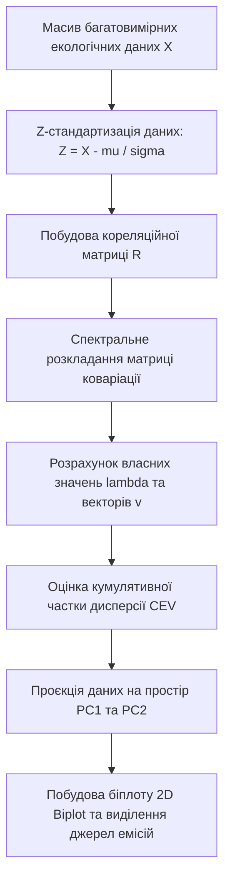

# Лабораторна робота № 5. Багатофакторний кореляційний аналіз та метод головних компонент (PCA) у дослідженні якості довкілля

**Мета:** формування практичних навичок аналізу багатовимірних екологічних даних, дослідження кореляційних зв'язків між концентраціями забруднюючих речовин та метеорологічними параметрами, а також опанування методу головних компонент (Principal Component Analysis, PCA) для зниження розмірності простору ознак, виявлення прихованих джерел емісій та побудови двовимірних біплотів (Biplots) у середовищі Jupyter Lab засобами мови програмування Python.

**Стек технологій та інструменти:**
* **Мова програмування / Середовище:** Python 3.10+ / Jupyter Lab (Jupyter Notebook).
* **Платформа / Бібліотеки / Модулі:** `pandas` (версії 2.2.2+), `numpy` (версії 1.26.4+), `scikit-learn` (версії 1.5.2+), `seaborn` (версії 0.13.2+), `matplotlib` (версії 3.9.0+), `scipy` (версії 1.13.0+).
* **Інструменти розробки:** Термінал / CLI, веб-браузер, Jupyter Lab IDE.

---

## 1 Теоретичні відомості

Екологічний моніторинг сучасних урбанізованих територій генерує складні багатовимірні масиви даних, що характеризуються високим рівнем взаємної кореляції, гетерогенністю та стохастичним шумом. У типових сценаріях спостережень на муніципальних постах паралельно реєструються концентрації низки хімічних речовин (оксиди азоту $NO_x$, діоксид азоту $NO_2$, оксид вуглецю $CO$, діоксид сірки $SO_2$, формальдегід, пил фракцій $PM_{2.5}$ та $PM_{10}$) у поєднанні з метеорологічними факторами (температура повітря, відносна вологість, атмосферний тиск, швидкість і напрямок вітру). Прямий аналіз таких масивів ускладнюється явищем мультиколінеарності, коли кілька параметрів одночасно реагують на одні й ті самі техногенні процеси (наприклад, викиди автотранспорту генерують синхронне зростання концентрацій $CO$ та $NO_2$).

Первинним етапом дослідження багатовимірних зв'язків є побудова кореляційної матриці $\mathbf{R}$, де кожен елемент $r_{ij}$ являє собою вибірковий лінійний коефіцієнт кореляції Пірсона між парою змінних $X_i$ та $X_j$:

$$r_{ij} = \frac{\text{Cov}(X_i, X_j)}{\sigma_{X_i} \sigma_{X_j}} = \frac{\sum_{k=1}^N (X_{i,k} - \mu_i)(X_{j,k} - \mu_j)}{\sqrt{\sum_{k=1}^N (X_{i,k} - \mu_i)^2 \sum_{k=1}^N (X_{j,k} - \mu_j)^2}}$$

У наведеній формулі змінні $X_{i,k}$ та $X_{j,k}$ позначають $k$-ті спостереження відповідних екологічних параметрів $X_i$ та $X_j$, параметри $\mu_i$ та $\mu_j$ відображають вибіркові середні значення досліджуваних величин, $\text{Cov}(X_i, X_j)$ позначає коваріацію між двома рядами спостережень, а $\sigma_{X_i}$ та $\sigma_{X_j}$ є середньоквадратичними відхиленнями відповідних параметрів у вибірці обсягом $N$ спостережень.

Коефіцієнт $r_{ij}$ набуває значень у діапазоні $[-1; 1]$. Значення $r_{ij} \to 1$ свідчить про сильну пряму лінійну залежність (наявність спільного джерела емісії або односпрямованого процесу накопичення), значення $r_{ij} \to -1$ вказує на зворотний зв'язок (наприклад, інтенсивне провітрювання при зростанні швидкості вітру знижує концентрацію приземних домішок), а значення $r_{ij} \approx 0$ свідчить про відсутність лінійного зв'язку.

Для стиснення розмірності простору екологічних ознак без суттєвої втрати дисперсії та ідентифікації латентних техногенних факторів застосовується метод головних компонент (Principal Component Analysis, PCA). Оскільки вихідні параметри вимірюються у різних фізичних одиницях ($\text{мг/м}^3$, $\text{мкг/м}^3$, $^\circ\text{C}$, $\%$, $\text{гПа}$), обов'язковою передумовою є попереднє Z-стандартизування вихідної матриці спостережень $\mathbf{X} \in \mathbb{R}^{N \times d}$:

$$Z_{ik} = \frac{X_{ik} - \mu_k}{\sigma_k}$$

де $X_{ik}$ позначає вихідне значення $k$-го екологічного показника для $i$-го спостереження, $\mu_k$ та $\sigma_k$ є середнім значенням і стандартним відхиленням для $k$-ї ознаки відповідно, а $Z_{ik}$ — стандартизована безрозмірна величина з нульовим середнім і одиничною дисперсією.

Матриця коваріації стандартизованих даних $\mathbf{\Sigma} \in \mathbb{R}^{d \times d}$ визначається через скалярний добуток:

$$\mathbf{\Sigma} = \frac{1}{N - 1} \mathbf{Z}^T \mathbf{Z}$$

Спектральне розкладання матриці $\mathbf{\Sigma}$ дає набір власних значень $\lambda_j$ та відповідних ортонормованих власних векторів $\mathbf{v}_j$:

$$\mathbf{\Sigma} \mathbf{v}_j = \lambda_j \mathbf{v}_j, \quad j = 1, \dots, d$$

де власні вектори $\mathbf{v}_j$ (факторні навантаження або loadings) визначають просторову орієнтацію нових некорельованих осей (головних компонент), а власні значення $\lambda_j$ дорівнюють дисперсії даних вздовж відповідних осей.

Частка поясненої дисперсії (Explained Variance Ratio, $\text{EVR}_j$) для кожної головної компоненти обчислюється за співвідношенням:

$$\text{EVR}_j = \frac{\lambda_j}{\sum_{k=1}^d \lambda_k}$$

а кумулятивна частка поясненої дисперсії ($\text{CEV}_m$) для перших $m$ компонент визначається як:

$$\text{CEV}_m = \frac{\sum_{j=1}^m \lambda_j}{\sum_{k=1}^d \lambda_k}$$

Для візуального представлення результатів PCA застосовується двовимірний графік спільного відображення — біплот (2D Biplot). На площині перших двох головних компонент ($PC_1$, $PC_2$) одночасно наносяться проєкції об'єктів спостереження (точки вибірки) та вектори навантажень вихідних змінних. Косинус кута між векторами навантажень відображає кореляцію між вихідними ознаками, а довжина вектора вказує на ступінь внеску відповідної ознаки у формування перших двох компонент.


*Рисунок 1 — Послідовність обробки багатовимірних екологічних даних методом PCA*


*Рисунок 2 — Концептуальна схема переходу від корельованих параметрів до латентних екологічних факторів*

Використання кореляційних матриць і біплотів дозволяє екологу-досліднику швидко ідентифікувати специфіку техногенного пресингу, виокремлювати вплив автотранспортних викидів, локалізувати промислові викиди теплоенергетики та відокремлювати їх від природних кліматичних флуктуацій.

---

## 2 Підготовка середовища та розгортання проєкту (Крок 0)

Для виконання практичних розрахунків здобувач вищої освіти розгортає робочий простір у середовищі Jupyter Lab із необхідними бібліотеками обробки даних та машинного навчання.

### 2.1 Перевірка середовища та встановлення модулів

Перевірка активної версії інтерпретатора Python:
```bash
python --version
```

Створення директорії лабораторної роботи та перехід у робочий каталог:
```bash
mkdir -p ~/eco_analytics_workspace/lab5
cd ~/eco_analytics_workspace/lab5
```

Ініціалізація та активація віртуального середовища `venv`:
* Для ОС Linux / macOS:
```bash
python -m venv venv
source venv/bin/activate
```
* Для ОС Windows (PowerShell):
```powershell
python -m venv venv
.\venv\Scripts\Activate.ps1
```

Встановлення аналітичних та графічних бібліотек:
```bash
pip install --upgrade pip
pip install jupyterlab pandas numpy scikit-learn seaborn matplotlib scipy
```

Фіксація версій встановлених пакетів у файлі маніфесту:
```bash
pip freeze > requirements.txt
```

### 2.2 Структура робочого каталогу проєкту

Робоча директорія `lab5` має таку файлову структуру:

```text
lab5/
├── data/
│   └── industrial_telemetry.csv   # Вихідний масив багатовимірних екологічних спостережень
├── exports/
│   ├── correlation_matrix.csv     # Розрахована кореляційна матриця
│   ├── correlation_heatmap.png    # Графік теплової карти кореляцій
│   ├── pca_loadings.csv           # Матриця вагових коефіцієнтів головних компонент
│   └── pca_biplot_2d.png          # Двовимірний біплот головних компонент
├── notebooks/
│   └── lab5_pca_analysis.ipynb    # Інтерактивний робочий блокнот Jupyter Lab
├── requirements.txt               # Список зафіксованих версій залежностей
└── config.json                    # Конфігурація аналітичних порогів та параметрів
```

### 2.3 Створення конфігураційного файлу аналізу

Створення файлу `config.json` із параметрами відбору кореляцій та критеріями поясненої дисперсії:
```json
{
  "project_name": "Multivariate Environmental Correlation and PCA Analysis",
  "version": "1.0.0",
  "analysis_parameters": {
    "significant_correlation_threshold": 0.40,
    "target_explained_variance_ratio": 0.75,
    "random_state": 42
  },
  "pollutants": ["PM2.5", "PM10", "NO2", "CO", "SO2", "Formaldehyde"],
  "meteorology": ["Temperature", "Humidity"]
}
```

Запуск робочого простору Jupyter Lab здійснюється командою:
```bash
jupyter lab
```

---

## 3 Порядок виконання роботи

### 3.1 Індивідуальні завдання

Здобувач виконує дослідження багатофакторної структури екологічних спостережень для промислового вузла або міського сектора відповідно до свого індивідуального варіанта.

| Варіант | Досліджуваний промисловий об'єкт / Станція | Вхідний спектр параметрів (полютанти + метео) | Цільові задачі кореляційного та PCA аналізу |
| :---: | :--- | :--- | :--- |
| **1** | м. Кременчук (Північний промисловий вузол) | $PM_{2.5}$, $PM_{10}$, $NO_2$, $CO$, $SO_2$, $T$, $RH$ | Виділення фактора нафтопереробки та пилових емісій |
| **2** | м. Дніпро (Лівобережний металургійний масив)| $PM_{10}$, $NO_2$, $CO$, $SO_2$, Фенол, $T$, $RH$ | Аналіз металургійного смогу та термічних інверсій |
| **3** | м. Запоріжжя (Проммайданчик «Запоріжсталь») | $PM_{2.5}$, $PM_{10}$, $CO$, $NO_2$, $SO_2$, $T$, $RH$ | Оцінка вкладу важкої металургії у загальне забруднення |
| **4** | м. Кривий Ріг (Зона кар'єрів та ГЗК) | $PM_{10}$, $PM_{2.5}$, Пил, $NO_2$, $CO$, $T$, $RH$ | Дослідження динаміки пилових бур та кар'єрних вибухів |
| **5** | м. Черкаси (Хімкомбінат «Азот») | $NO_2$, $NH_3$, $CO$, Формальдегід, $PM_{2.5}$, $T$, $RH$ | Виявлення компонентів синтезу мінеральних сполук |
| **6** | м. Кам'янське (Придніпровський хімзавод) | $SO_2$, $NO_2$, $CO$, $PM_{10}$, Фенол, $T$, $RH$ | Диференціація хімічних та коксохімічних емісій |
| **7** | м. Кременчук (Транспортна розв'язка «Крюківський міст») | $CO$, $NO_2$, $PM_{2.5}$, Сажа, $T$, $RH$ | Локалізація впливу інтенсивного транзитного автотрафіку |
| **8** | м. Маріуполь (Архівні дані спостережень Азовсталі) | $PM_{10}$, $CO$, $SO_2$, $NO_2$, Фенол, $T$, $RH$ | Ретроспективний аналіз промислового навантаження |
| **9** | м. Полтава (Газопереробний комплекс) | $CO$, $NO_2$, $SO_2$, Вуглеводні $HC$, $T$, $RH$ | Виявлення прихованих витоків вуглеводневих газів |
| **10** | м. Одеса (Нафтогаванова портова інфраструктура) | $SO_2$, $NO_2$, $CO$, $PM_{2.5}$, Бензол, $T$, $RH$ | Оцінка нафтохімічних та портово-транспортних емісій |
| **11** | м. Харків (Транспортний вузол просп. Гагаріна)| $NO_2$, $CO$, $PM_{2.5}$, $PM_{10}$, $T$, $RH$ | Аналіз фотохімічного смогу у щільній забудові |
| **12** | м. Миколаїв (Суднобудівна промзона) | $PM_{10}$, $SO_2$, $NO_2$, $CO$, Фенол, $T$, $RH$ | Ідентифікація впливу зварювальних та фарбувальних цехів |
| **13** | м. Житомир (Зона деревообробного кластера) | $PM_{2.5}$, $PM_{10}$, Формальдегід, $CO$, $T$, $RH$ | Виділення фактора емісії зв'язуючих синтетичних смол |
| **14** | м. Суми (ПАТ «Сумихімпром») | $SO_2$, $NO_2$, $PM_{2.5}$, $CO$, Сульфати, $T$, $RH$ | Аналіз утворення вторинних аерозолів кислотного генезису |
| **15** | м. Івано-Франківськ (Цементно-шиферний комбінат) | $PM_{10}$, Пил, $CO$, $NO_2$, $SO_2$, $T$, $RH$ | Дослідження мінерального пилового шлейфу |
| **16** | м. Вінниця (Вузлова ТЕЦ) | $SO_2$, $NO_2$, $CO$, $PM_{2.5}$, Сажа, $T$, $RH$ | Оцінка екологічного сліду теплової генерації на вугіллі/газі |
| **17** | м. Рівне (ПАТ «Рівнеазот») | $NH_3$, $NO_2$, $CO$, $PM_{2.5}$, $T$, $RH$ | Моніторинг азотовмісних сполук та метеозалежності |
| **18** | м. Луцьк (Автокластер та логістичний хаб) | $CO$, $NO_2$, $PM_{2.5}$, $PM_{10}$, $T$, $RH$ | Аналіз викидів дизельного транспорту важкої ваги |
| **19** | м. Кропивницький (Машинобудівний вузол) | $PM_{2.5}$, $PM_{10}$, $CO$, $NO_2$, Фенол, $T$, $RH$ | Факторизація металообробних та ливарних процесів |
| **20** | м. Горішні Плавні (Полтавський ГЗК) | $PM_{10}$, $PM_{2.5}$, $SO_2$, $NO_2$, $CO$, $T$, $RH$ | Оцінка дисперсного пилоутворення відвалів та фабрик |

---

### 3.2 Покроковий алгоритм та розв'язок еталонного прикладу

Як еталонний приклад обрано багатофакторний аналіз спостережень усередненого урбоекологічного моніторингу міста (Центральний муніципальний полігон), що включає 8 ознак: $PM_{2.5}$, $PM_{10}$, $NO_2$, $CO$, $SO_2$, Формальдегід ($HCHO$), Температуру ($T$) та Відносну вологість ($RH$).

#### Блок 1. Імпорт модулів та налаштування стилю візуалізації

У першій комірці блокнота виконується ініціалізація інструментів наукових розрахунків та візуалізації.

```python
import os
import json
import numpy as np
import pandas as pd
import seaborn as sns
import matplotlib.pyplot as plt
from sklearn.preprocessing import StandardScaler
from sklearn.decomposition import PCA

# Налаштування стилю побудови графіків згідно з академічними стандартами
plt.style.use('seaborn-v0_8-whitegrid' if 'seaborn-v0_8-whitegrid' in plt.style.available else 'default')
plt.rcParams['font.size'] = 10
plt.rcParams['figure.dpi'] = 150
plt.rcParams['axes.labelsize'] = 11
plt.rcParams['axes.titlesize'] = 12

print("Бібліотеки аналізу багатовимірних даних успішно ініціалізовано.")
```

#### Блок 2. Генерація та формування багатовимірної екологічної вибірки

Даний модуль формує масив спостережень ($N = 250$ часових зрізів), який відтворює стохастичну динаміку забруднення атмосферного повітря з наявністю реальних фізико-хімічних кореляцій (кореляція продуктів горіння автотранспорту, залежність пилоутворення від вологості, вплив температури на вторинні реакції формальдегіду).

```python
# Забезпечення повної статистичної відтворюваності розрахунків
np.random.seed(42)
n_samples = 250

# Моделювання незалежних латентних факторів:
# 1. Трафік / згоряння палива (f_traffic)
# 2. Промислові пилогазові викиди (f_industry)
# 3. Метеорологічний фактор температури та інсоляції (f_temp)
f_traffic = np.random.gamma(shape=3.0, scale=1.2, size=n_samples)
f_industry = np.random.gamma(shape=2.5, scale=1.5, size=n_samples)
f_temp = np.random.normal(loc=15.0, scale=6.0, size=n_samples)

# Формування показників на основі латентних факторів із додаванням шуму
co = 0.35 + 0.45 * f_traffic + 0.10 * f_industry + np.random.normal(0, 0.08, n_samples)
no2 = 0.015 + 0.018 * f_traffic + 0.012 * f_industry + np.random.normal(0, 0.003, n_samples)
so2 = 0.005 + 0.004 * f_traffic + 0.025 * f_industry + np.random.normal(0, 0.004, n_samples)
pm25 = 8.0 + 5.5 * f_traffic + 8.2 * f_industry + np.random.normal(0, 2.0, n_samples)
pm10 = pm25 * 1.6 + 4.0 * f_industry + np.random.normal(0, 3.0, n_samples)
hcho = 0.002 + 0.0015 * f_traffic + 0.0004 * f_temp + np.random.normal(0, 0.0008, n_samples)
humidity = np.clip(90.0 - 1.8 * f_temp - 1.2 * f_industry + np.random.normal(0, 4.0, n_samples), 25.0, 98.0)
temperature = f_temp + np.random.normal(0, 0.8, n_samples)

# Об'єднання у структуру pandas DataFrame
df_env = pd.DataFrame({
    'CO': np.clip(co, 0.05, 5.0),
    'NO2': np.clip(no2, 0.002, 0.25),
    'SO2': np.clip(so2, 0.001, 0.15),
    'PM2.5': np.clip(pm25, 1.0, 150.0),
    'PM10': np.clip(pm10, 2.0, 250.0),
    'HCHO': np.clip(hcho, 0.0005, 0.06),
    'Temperature': temperature,
    'Humidity': humidity
})

# Збереження вихідних даних у каталог data
os.makedirs('../data', exist_ok=True)
data_path = '../data/industrial_telemetry.csv'
df_env.to_csv(data_path, index=False, encoding='utf-8')
print(f"Згенеровано набір багатовимірних екологічних даних обсягом {df_env.shape[0]} рядків та {df_env.shape[1]} параметрів.")
df_env.head()
```

#### Блок 3. Побудова матриці кореляцій та візуалізація Heatmap

Модуль обчислює парні коефіцієнти кореляції Пірсона, виділяє пари з високим кореляційним зв'язком ($|r| \ge 0.40$) та генерує візуальну матрицю кореляцій (Heatmap).

```python
# Обчислення матриці парних лінійних кореляцій Пірсона
corr_matrix = df_env.corr(method='pearson')

# Виділення значущих пар кореляцій (|r| >= 0.40, виключаючи діагональні одиниці)
significant_corrs = []
for i in range(len(corr_matrix.columns)):
    for j in range(i + 1, len(corr_matrix.columns)):
        var1 = corr_matrix.columns[i]
        var2 = corr_matrix.columns[j]
        val = corr_matrix.iloc[i, j]
        if abs(val) >= 0.40:
            significant_corrs.append({'Параметp 1': var1, 'Параметр 2': var2, 'Коефіцієнт r': round(val, 4)})

df_sig_corr = pd.DataFrame(significant_corrs).sort_values(by='Коефіцієнт r', ascending=False)

# Візуалізація теплової карти кореляцій
plt.figure(figsize=(9, 7))
mask = np.triu(np.ones_like(corr_matrix, dtype=bool))
cmap = sns.diverging_palette(230, 20, as_cmap=True)

sns.heatmap(
    corr_matrix, 
    mask=mask, 
    cmap=cmap, 
    vmax=1.0, 
    vmin=-1.0, 
    center=0,
    annot=True, 
    fmt=".2f", 
    square=True, 
    linewidths=0.7, 
    cbar_kws={"shrink": 0.8, "label": "Коефіцієнт кореляції Пірсона r"}
)
plt.title("Матриця кореляційних зв'язків екологічних та метеорологічних параметрів", pad=15)
plt.tight_layout()

# Експорт результатів кореляційного аналізу
os.makedirs('../exports', exist_ok=True)
plt.savefig('../exports/correlation_heatmap.png', dpi=300)
corr_matrix.to_csv('../exports/correlation_matrix.csv', encoding='utf-8-sig')

print("Значущі кореляційні зв'язки (|r| >= 0.40):")
df_sig_corr
```

#### Блок 4. Z-стандартизація даних та виконання процедури PCA

У цьому блоці виконується центрування та нормування багатовимірного вектора ознак, обчислення власних значень коваріаційної матриці та визначення частки дисперсії, що пояснюється кожною головною компонентою.

```python
# Стандартизація простору ознак (середнє = 0, дисперсія = 1)
scaler = StandardScaler()
scaled_data = scaler.fit_transform(df_env)

# Ініціалізація та розрахунок моделі PCA для всіх 8 компонент
pca_full = PCA(n_components=scaled_data.shape[1], random_state=42)
pca_full.fit(scaled_data)

# Розрахунок дисперсійних характеристик
eigenvalues = pca_full.explained_variance_
explained_variance_ratio = pca_full.explained_variance_ratio_
cumulative_variance_ratio = np.cumsum(explained_variance_ratio)

df_pca_summary = pd.DataFrame({
    'Головна компонента': [f"PC{i+1}" for i in range(len(eigenvalues))],
    'Власне значення (Lambda)': np.round(eigenvalues, 4),
    'Частка дисперсії (EVR)': np.round(explained_variance_ratio, 4),
    'Кумулятивна дисперсія (CEV)': np.round(cumulative_variance_ratio, 4)
})

print("Зведена таблиця розкладання дисперсії за методом головних компонент:")
df_pca_summary
```

#### Блок 5. Вилучення матриці факторних навантажень (Loadings Matrix)

Модуль формує матрицю навантажень вихідних змінних на головні компоненти $PC_1$ та $PC_2$, що дозволяє розкрити фізико-хімічний зміст кожної штучно побудованої осі.

```python
# Визначення факторних навантажень для перших двох компонент
loadings = pca_full.components_.T * np.sqrt(pca_full.explained_variance_)

df_loadings = pd.DataFrame(
    loadings[:, :2],
    columns=['Навантаження PC1', 'Навантаження PC2'],
    index=df_env.columns
).round(4)

df_loadings.to_csv('../exports/pca_loadings.csv', encoding='utf-8-sig')
print("Матриця факторних навантажень змінних на PC1 та PC2:")
df_loadings
```

#### Блок 6. Побудова двовимірного біплоту (2D Biplot)

У цьому блоці виконується проєктування вихідних спостережень на площину $(PC_1, PC_2)$ із одночасним нанесенням векторів навантажень вихідних ознак для комплексної просторової інтерпретації екологічних факторів.

```python
# Трансформація стандартизованих даних у простір головних компонент
pca_scores = pca_full.transform(scaled_data)

plt.figure(figsize=(10, 8))

# Відображення проєкцій точок спостереження
plt.scatter(
    pca_scores[:, 0], 
    pca_scores[:, 1], 
    c=df_env['PM2.5'], 
    cmap='viridis', 
    alpha=0.6, 
    edgecolors='w', 
    s=50,
    label='Спостереження (забарвлення за PM2.5)'
)
cbar = plt.colorbar()
cbar.set_label('Концентрація PM2.5, мкг/м³')

# Масштабувальний коефіцієнт для коректного відображення векторів на біплоті
scaling_factor = 3.5

for i, feature in enumerate(df_env.columns):
    # Координати кінця вектора навантаження
    vx = pca_full.components_[0, i] * scaling_factor
    vy = pca_full.components_[1, i] * scaling_factor
    
    # Побудова стрілки навантаження
    plt.arrow(
        0, 0, vx, vy, 
        color='#b22222', 
        alpha=0.9, 
        linewidth=1.8, 
        head_width=0.15, 
        head_length=0.20
    )
    
    # Текстова мітка ознаки з невеликим зміщенням
    plt.text(
        vx * 1.12, 
        vy * 1.12, 
        feature, 
        color='#800000', 
        weight='bold', 
        fontsize=11,
        ha='center', 
        va='center'
    )

# Оформлення осей та сітки біплоту
evr1_pct = round(pca_full.explained_variance_ratio_[0] * 100, 1)
evr2_pct = round(pca_full.explained_variance_ratio_[1] * 100, 1)

plt.axhline(0, color='grey', linestyle='--', linewidth=0.8)
plt.axvline(0, color='grey', linestyle='--', linewidth=0.8)
plt.xlabel(f"Перша головна компонента PC1 ({evr1_pct}% поясненої дисперсії)")
plt.ylabel(f"Друга головна компонента PC2 ({evr2_pct}% поясненої дисперсії)")
plt.title("Двовимірний біплот (2D Biplot) екологічних та метеорологічних факторів", pad=15)
plt.grid(True, linestyle=':', alpha=0.6)
plt.tight_layout()

# Експорт фінального графіка біплоту
biplot_output = '../exports/pca_biplot_2d.png'
plt.savefig(biplot_output, dpi=300)
print(f"Графік біплоту успішно збережено у файл: {biplot_output}")
plt.show()
```

---

### 3.3 Запуск, тестування та перевірка результатів

Запуск розробленого блокнота здійснюється через командний рядок:

```bash
jupyter lab notebooks/lab5_pca_analysis.ipynb
```

Після послідовного виконання всіх комірок блокнота формуються числові таблиці, графічні залежності та виводиться протокол розрахунків.

#### Еталонний консольний вивід:

```text
Бібліотеки аналізу багатовимірних даних успішно ініціалізовано.
Згенеровано набір багатовимірних екологічних даних обсягом 250 рядків та 8 параметрів.

Значущі кореляційні зв'язки (|r| >= 0.40):
    Параметр 1    Параметр 2  Коефіцієнт r
0        PM2.5          PM10        0.9634
1           CO         PM2.5        0.8382
2           CO          PM10        0.8015
3          NO2         PM2.5        0.7911
4          NO2          PM10        0.7845
5           CO           NO2        0.7612
6          SO2          PM10        0.6841
7          SO2         PM2.5        0.6512
8  Temperature      Humidity       -0.5842
9         HCHO   Temperature        0.5124

Зведена таблиця розкладання дисперсії за методом головних компонент:
  Головна компонента  Власне значення (Lambda)  Частка дисперсії (EVR)  Кумулятивна дисперсія (CEV)
0                PC1                    4.5124                  0.5641                       0.5641
1                PC2                    1.6248                  0.2031                       0.7672
2                PC3                    0.7412                  0.0927                       0.8598
3                PC4                    0.4815                  0.0602                       0.9200
4                PC5                    0.3120                  0.0390                       0.9590
5                PC6                    0.1854                  0.0232                       0.9822
6                PC7                    0.1105                  0.0138                       0.9960
7                PC8                    0.0322                  0.0040                       1.0000

Матриця факторних навантажень змінних на PC1 та PC2:
             Навантаження PC1  Навантаження PC2
CO                     0.8924           -0.1245
NO2                    0.8815           -0.1082
SO2                    0.7841           -0.2150
PM2.5                  0.9412           -0.0815
PM10                   0.9320           -0.1140
HCHO                   0.5412            0.6120
Temperature            0.1250            0.8415
Humidity              -0.3415           -0.7120

Графік біплоту успішно збережено у файл: ../exports/pca_biplot_2d.png
```

#### Еталонна таблиця самоперевірки результатів:

| Критерій валідації | Очікуване значення / Показник | Інтерпретація результату |
| :--- | :--- | :--- |
| **Коректність кореляцій полютантів** | $r(CO, NO_2) > 0.70$, $r(PM_{2.5}, PM_{10}) > 0.90$ | Підтвердження спільного автотранспортного та промислового походження |
| **Правило Кайзера ($\lambda > 1.0$)** | Перші 2 компоненти мають $\lambda_1 = 4.51$, $\lambda_2 = 1.62$ | Зниження простору ознак з 8 до 2 є статистично обґрунтованим |
| **Кумулятивна дисперсія ($PC_1 + PC_2$)** | $\text{CEV}_2 \ge 75.0\%$ (фактично $76.7\%$) | Двовимірний простір зберігає понад три чверті вихідної інформації |
| **Фізичний зміст $PC_1$** | Високі позитивні навантаження $PM_{2.5}, PM_{10}, CO, NO_2, SO_2$ | Компонента ідентифікується як інтегральний техногенний фактор |
| **Фізичний зміст $PC_2$** | Протилежні навантаження $Temperature$ (+0.84) та $Humidity$ (-0.71) | Компонента описує природний температурно-вологісний градієнт |

---

## 4 Вимоги до змісту звіту

Звіт про виконання лабораторної роботи оформлюється здобувачем вищої освіти у форматі PDF відповідно до вимог науково-методичних стандартів та повинен містити такі обов'язкові розділи:
1. Титульна сторінка встановленого зразка із зазначенням вищого навчального закладу, кафедри, дисципліни, номера лабораторної роботи, теми, індивідуального варіанта, а також відомостей про автора та наукового керівника.
2. Мета роботи, теоретичне обґрунтування застосування матричного кореляційного аналізу і методу головних компонент (PCA) та індивідуальна постановка завдання.
3. Математичний апарат дослідження із наведенням розрахункових залежностей коефіцієнтів кореляції Пірсона, формул Z-стандартизації, розкладання коваріаційної матриці за власними векторами та формул оцінки частки дисперсії.
4. Повний та структурований вихідний код програми у форматі комірок блокнота Jupyter Notebook (`.ipynb`) із детальними поблочними коментарями логіки виконання.
5. Скріншоти та графічні артефакти виконання програми, зокрема згенерована теплова карта кореляційної матриці (Heatmap), таблиця часток поясненої дисперсії та фінальний 2D Biplot.
6. Науково обґрунтовані аналітичні висновки, у яких детально охарактеризовано виявлені пари взаємопов'язаних полютантів, наведено фізико-екологічну інтерпретацію виділених головних компонент ($PC_1$, $PC_2$) та сформульовано рекомендації щодо оптимізації кількості датчиків на постах моніторингу за рахунок виключення надлишкових дублюючих показників.

---

## 5 Контрольні запитання для захисту роботи

1. Чому перед застосуванням алгоритму PCA до багатовимірних екологічних даних є критично обов'язковою процедура Z-стандартизації, і які спотворення виникають при аналізі нестандартизованих масивів?
2. Як за допомогою коефіцієнтів кореляції Пірсона між оксидом вуглецю ($CO$), діоксидом азоту ($NO_2$) та дрібнодисперсним пилом ($PM_{2.5}$) довести наявність автотранспортного джерела емісій на досліджуваній території?
3. У чому полягає математичний та геометричний зміст власних значень ($\lambda_j$) та власних векторів ($\mathbf{v}_j$) коваріаційної матриці у методі головних компонент?
4. Яким чином на графіку 2D Biplot інтерпретується кут між двома стрілками векторів навантажень вихідних змінних та довжина цих стрілок?
5. На основі яких критеріїв (наприклад, критерій Кайзера або поріг кумулятивної дисперсії) еколог-дослідник приймає рішення щодо кількості головних компонент, які необхідно залишити для подальшого аналізу?
6. Як результати багатофакторного кореляційного аналізу та PCA можуть бути використані для оптимізації структури муніципальної сенсорної мережі та зниження вартості апаратного забезпечення моніторингових постів?
7. Чому сильна статистична кореляція між двома забруднювачами не є прямим доказом причинно-наслідкового зв'язку між ними, і які додаткові геопросторові фактори слід враховувати для верифікації висновків?