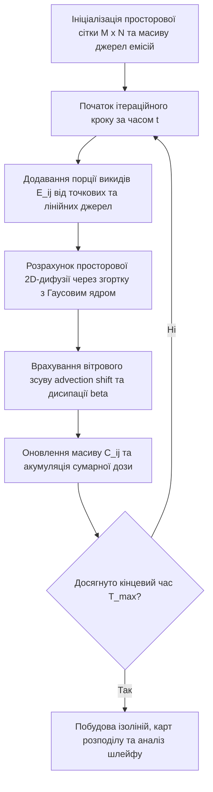
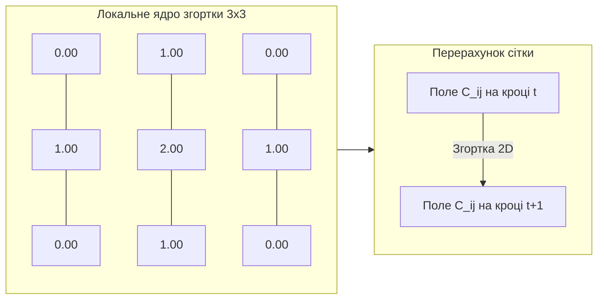

# Лабораторна робота № 6. Комп’ютерне моделювання локального розсіювання викидів в атмосфері на основі Гаусового ядра

**Мета:** формування практичних навичок математичного та комп'ютерного моделювання процесів атмосферної дифузії та просторово-часового розсіювання забруднюючих речовин від стаціонарних і пересувних джерел емісій, опанування методів розрахунку двовимірної згортки з Гаусовим ядром на дискретних сітках та візуалізації полів концентрацій у середовищі Jupyter Lab засобами мови програмування Python.

**Стек технологій та інструменти:**
* **Мова програмування / Середовище:** Python 3.10+ / Jupyter Lab (Jupyter Notebook).
* **Платформа / Бібліотеки / Модулі:** `numpy` (версії 1.26.4+), `scipy` (модуль `scipy.signal`, версії 1.13.0+), `matplotlib` (версії 3.9.0+), `seaborn` (версії 0.13.2+).
* **Інструменти розробки:** Консоль/Термінал (Bash/PowerShell), веб-браузер для інтерактивного інтерфейсу Jupyter.

---

## 1 Теоретичні відомості

Моделювання просторово-часового розподілу забруднюючих речовин у приземному шарі атмосфери є ключовим інструментом муніципального екологічного моніторингу та оцінки техногенних ризиків. Поведінка викидів у міських умовах визначається комбінацією двох взаємопов'язаних фізичних процесів: турбулентної дифузії (молекулярного та турбулентного розсіювання маси під дією градієнтів концентрації) та адвективного переносу (переміщення повітряних мас під впливом вітрового потоку).

У традиційних інженерних розрахунках широкого розповсюдження набули аналітичні моделі Гаусового шлейфу, які описують неперервний стаціонарний викид від точкового джерела. Проте для моделювання складних динамічних сценаріїв у дискретному просторі міської забудови (зокрема за наявності нестаціонарних транспортних потоків або змінних режимів промислових установок) застосовується сіткова імітаційна парадигма на основі клітинних просторів.

У такій постановці модельована територія розбивається на регулярну двовимірну сітку розміром $M \times N$ клітинок із просторовим кроком $\Delta x = \Delta y$. Стан кожної комірки $(i, j)$ у дискретний момент часу $t$ характеризується концентрацією полютанта $C_{i,j}(t)$, вираженою в міліграмах на метр кубічний ($\text{мг/м}^3$) або мікрограмах на метр кубічний ($\text{мкг/м}^3$).

Процес просторового розсіювання речовини між сусідніми комірками описується операцією двовимірної дискретної згортки поточного поля концентрацій із матрицею вагових коефіцієнтів (Гаусовим ядром дифузії $\mathbf{K}$). Для базової тризв'язної конфігурації ($3 \times 3$) ненормована матриця Гаусового фільтра визначається дискретним ядром:

$$\mathbf{K}_{3 \times 3} = \begin{bmatrix} 0 & 1 & 0 \\ 1 & 2 & 1 \\ 0 & 1 & 0 \end{bmatrix}$$

Для розширеної п'ятизв'язної конфігурації ($5 \times 5$) із підвищеною гладкістю апроксимації неперервного Гаусового розподілу елементи ядра $K_{u, v}$ розраховуються за формулою двовимірної функції Гауса:

$$K_{u, v} = \frac{1}{2\pi \sigma_d^2} \exp\left( -\frac{(u - u_0)^2 + (v - v_0)^2}{2\sigma_d^2} \right)$$

У наведеному співвідношенні параметри $(u, v)$ визначають локальні просторові індекси матриці ядра згортки, $(u_0, v_0)$ є координатами геометричного центра ядра, а величина $\sigma_d$ відображає просторовий радіус розсіювання (дисперсію дифузійного процесу), що залежить від коефіцієнта атмосферної турбулентності.

Динамічне оновлення поля концентрацій на кожному часовому такті $\Delta t$ враховує дифузійне розсіювання, надходження свіжих емісій від джерел $E_{i,j}(t)$, адвективний зсув під дією вітру та природне осадження (або хімічну деградацію) речовини:

$$C_{i,j}(t+1) = (1 - \beta) \cdot \frac{\sum_{k=-k_m}^{k_m} \sum_{l=-l_m}^{l_m} C_{i+k, \, j+l}(t) \cdot K_{k+k_0, \, l+l_0}}{\sum_{k=-k_m}^{k_m} \sum_{l=-l_m}^{l_m} K_{k+k_0, \, l+l_0}} + E_{i,j}(t)$$

де змінна $\beta \in [0, 1)$ позначає коефіцієнт природної дисипації, що враховує сухе гравітаційне осадження та розпад полютанта в атмосфері, $E_{i,j}(t)$ визначає масу або концентрацію речовини, викинуту джерелом у комірці $(i, j)$ за інтервал $\Delta t$, а змінні $k_m, l_m$ відповідають напівширині вікна згортки ($k_m = 1$ для ядра $3 \times 3$ та $k_m = 2$ для ядра $5 \times 5$).

Адвективний перенос під дією вітру моделюється за допомогою параметричного зміщення вагового центру ядра згортки або векторного зсуву матриці концентрацій на величину $\mathbf{W} = (w_x, w_y)$, де координати $w_x$ та $w_y$ пропорційні складовим швидкості вітрового потоку у проєкціях на осі просторової сітки.


*Рисунок 1 — Алгоритмічна структура дискретної моделі атмосферного розсіювання викидів*

Сумарне просторове навантаження на урбоекосистему за період моделювання $T$ оцінюється інтегральним полем накопиченої концентрації $C_{\text{accum}}(i, j)$:

$$C_{\text{accum}}(i, j) = \sum_{t=1}^{T} C_{i,j}(t)$$

де величина $C_{\text{accum}}(i, j)$ відображає кумулятивну дозу експозиції забруднюючої речовини в кожній дискретній точці простору.


*Рисунок 2 — Схема просторового шаблону розрахунку дифузії в сусідні комірки сітки*

Такий підхід дозволяє досліджувати конфігурації факелів викидів навколо промислових труб, оцінювати наслідки заторів на транспортних артеріях та формувати карти екологічних ризиків для планування заходів захисту населення.

---

## 2 Підготовка середовища та розгортання проєкту (Крок 0)

Перед початком комп'ютерного моделювання здобувач вищої освіти налаштовує проєктне середовище Python та перевіряє працездатність обчислювальних пакетів.

### 2.1 Налаштування віртуального оточення та встановлення пакетів

Усі дії виконуються у терміналі робочої станції.

Перевірка версії мови Python (потрібна версія 3.10 або новіша):
```bash
python --version
```

Створення робочого каталогу лабораторної роботи № 6 та перехід до нього:
```bash
mkdir -p ~/eco_analytics_workspace/lab6
cd ~/eco_analytics_workspace/lab6
```

Створення та активація віртуального середовища:
* Для ОС Linux / macOS:
```bash
python -m venv venv
source venv/bin/activate
```
* Для ОС Windows (PowerShell):
```powershell
python -m venv venv
.\venv\Scripts\Activate.ps1
```

Встановлення обчислювальних бібліотек:
```bash
pip install --upgrade pip
pip install jupyterlab numpy scipy matplotlib seaborn
```

Збереження переліку залежностей у маніфест-файлі:
```bash
pip freeze > requirements.txt
```

### 2.2 Структура робочого простору лабораторної роботи

Файлова структура проєкту організується наступним чином:

```text
lab6/
├── config.json                     # Параметри сітки, джерел викидів та вітру
├── exports/
│   ├── dispersion_simulation.png   # Поетапна динаміка поширення шлейфу
│   ├── final_pollution_map.png     # Фінальна теплова карта з ізолініями
│   └── grid_concentrations.csv     # Підсумкова матриця розподілу концентрацій
├── notebooks/
│   └── lab6_gaussian_dispersion.ipynb # Робочий блокнот Jupyter Lab
└── requirements.txt                # Зафіксовані версії програмних бібліотек
```

### 2.3 Створення конфігураційного файлу моделі

Створення файлу `config.json`, що визначає геометричні та фізичні параметри симуляції:
```json
{
  "project_name": "Atmospheric Gaussian Dispersion Simulation",
  "version": "1.0.0",
  "grid_settings": {
    "rows": 60,
    "cols": 60,
    "cell_size_meters": 25.0
  },
  "simulation_settings": {
    "total_steps": 60,
    "dissipation_rate": 0.03,
    "kernel_type": "gaussian_5x5",
    "sigma_diffusion": 0.95
  },
  "meteorology": {
    "wind_speed_x": 0.8,
    "wind_speed_y": 0.3
  }
}
```

Запуск робочого простору Jupyter Lab:
```bash
jupyter lab
```

---

## 3 Порядок виконання роботи

### 3.1 Індивідуальні завдання

Здобувач отримує вихідні параметри моделювання згідно зі своїм номером варіанта в академічному журналі. Необхідно налаштувати імітаційну модель, виконати симуляцію розсіювання викидів, побудувати ізолінії забруднення та визначити площу зони перевищення встановленого санітарного нормативу.

| Варіант | Об'єкт дослідження та сектор | Розмір сітки / Джерело емісії | Розмір ядра / $\sigma_d$ | Вітровий вектор $(w_x, w_y)$ / Коеф. дисипації $\beta$ | Цільовий полютант та ГДК ($\text{мг/м}^3$) |
| :---: | :--- | :--- | :---: | :---: | :---: |
| **1** | Нафтопереробний завод (факельна установка) | $60 \times 60$, стаціонарне точкове | $5 \times 5$, $\sigma_d = 1.0$ | $(1.0, 0.2)$, $\beta = 0.02$ | $SO_2$ (ГДК = 0.05) |
| **2** | Металургійний комбінат (агломераційний цех) | $70 \times 70$, два точкові джерела | $5 \times 5$, $\sigma_d = 0.9$ | $(0.8, -0.4)$, $\beta = 0.03$ | $NO_2$ (ГДК = 0.04) |
| **3** | ТЕЦ (висока димова труба) | $80 \times 80$, стаціонарне точкове | $5 \times 5$, $\sigma_d = 1.2$ | $(1.2, 0.5)$, $\beta = 0.015$ | $NO_x$ (ГДК = 0.06) |
| **4** | Автомагістраль (інтенсивний трафік 4000 авт/год) | $60 \times 60$, лінійне джерело (вісь X) | $3 \times 3$, дискретне | $(0.2, 0.9)$, $\beta = 0.04$ | $CO$ (ГДК = 3.0) |
| **5** | Хімкомбінат (цех азотних сполук) | $60 \times 60$, точкове періодичне | $5 \times 5$, $\sigma_d = 0.85$| $(0.5, 0.5)$, $\beta = 0.025$ | $NH_3$ (ГДК = 0.04) |
| **6** | Асфальтобетонний завод (змішувальна башта) | $50 \times 50$, стаціонарне точкове | $3 \times 3$, дискретне | $(-0.7, 0.3)$, $\beta = 0.05$| $PM_{10}$ (ГДК = 0.05) |
| **7** | Транспортне кільце (перехрестя з затором) | $60 \times 60$, комбіноване (хрестоподібне) | $5 \times 5$, $\sigma_d = 0.95$| $(0.4, -0.6)$, $\beta = 0.035$| $NO_2$ (ГДК = 0.04) |
| **8** | Цементний завод (помельний комплекс) | $70 \times 70$, точкове джерело | $5 \times 5$, $\sigma_d = 1.1$ | $(1.1, -0.2)$, $\beta = 0.02$ | Пил недиференційований (ГДК = 0.15) |
| **9** | Деревообробний комбінат (сушильні камери) | $50 \times 50$, стаціонарне точкове | $3 \times 3$, дискретне | $(0.6, 0.6)$, $\beta = 0.03$ | Формальдегід (ГДК = 0.003) |
| **10** | Коксохімічний завод (гасильна вежа) | $80 \times 80$, точкове залпове | $5 \times 5$, $\sigma_d = 1.05$| $(0.9, 0.1)$, $\beta = 0.02$ | Фенол (ГДК = 0.01) |
| **11** | Портовий перевантажувальний термінал | $60 \times 60$, площинне джерело ($4 \times 4$) | $5 \times 5$, $\sigma_d = 0.9$ | $(-0.8, 0.4)$, $\beta = 0.04$| $PM_{2.5}$ (ГДК = 0.025) |
| **12** | Сміттєспалювальний комплекс | $70 \times 70$, стаціонарне точкове | $5 \times 5$, $\sigma_d = 1.15$| $(0.7, 0.7)$, $\beta = 0.025$| $CO$ (ГДК = 3.0) |
| **13** | Залізничний логістичний вузол (тепловози) | $60 \times 60$, лінійне сегментоване | $3 \times 3$, дискретне | $(0.3, -0.8)$, $\beta = 0.035$| Сажа / $PM_{2.5}$ (ГДК = 0.025) |
| **14** | Кар'єрне видобування (зона дроблення породи)| $80 \times 80$, точкове пилове | $5 \times 5$, $\sigma_d = 1.3$ | $(1.3, -0.3)$, $\beta = 0.03$ | $PM_{10}$ (ГДК = 0.05) |
| **15** | Котельня промислової зони (мазутне паливо) | $60 \times 60$, стаціонарне точкове | $5 \times 5$, $\sigma_d = 0.8$ | $(0.6, -0.5)$, $\beta = 0.025$| $SO_2$ (ГДК = 0.05) |
| **16** | Міський автовокзал та відстійник автобусів | $50 \times 50$, комбіноване джерело | $3 \times 3$, дискретне | $(-0.4, 0.7)$, $\beta = 0.04$| $NO_2$ (ГДК = 0.04) |
| **17** | Фармацевтичне виробництво (система скиду) | $50 \times 50$, точкове періодичне | $5 \times 5$, $\sigma_d = 0.75$| $(0.5, 0.2)$, $\beta = 0.03$ | Органічні розчинники (ГДК = 0.1) |
| **18** | Меблева фабрика (цех нанесення лаків) | $60 \times 60$, стаціонарне точкове | $5 \times 5$, $\sigma_d = 0.95$| $(0.8, -0.3)$, $\beta = 0.03$ | Формальдегід (ГДК = 0.003) |
| **19** | Вантажний митний термінал (черга вантажівок)| $70 \times 70$, лінійне кутове джерело | $3 \times 3$, дискретне | $(0.5, 0.8)$, $\beta = 0.04$ | $CO$ (ГДК = 3.0) |
| **20** | Гірничо-збагачувальний комбінат (хвостосховище)| $80 \times 80$, велике площинне джерело | $5 \times 5$, $\sigma_d = 1.2$ | $(1.0, 0.6)$, $\beta = 0.02$ | $PM_{10}$ (ГДК = 0.05) |

---

### 3.2 Покроковий алгоритм та розв'язок еталонного прикладу

Як еталонний базовий варіант розглядається комбінований міський сектор розміром $60 \times 60$ клітинок (фізичний розмір $1500 \times 1500\text{ м}$), на якому розташоване стаціонарне джерело (промислова котельня з емісією $NO_2$) та транспортний перетин із рухомим потоком автомобілів. Використовується ядро $5 \times 5$ з вітровим переносом у північно-східному напрямку.

#### Блок 1. Ініціалізація аналітичного блокнота та модулів

```python
import os
import json
import numpy as np
import scipy.signal as signal
import scipy.ndimage as ndimage
import matplotlib.pyplot as plt
import matplotlib.colors as mcolors

# Встановлення стилю візуалізації
plt.style.use('seaborn-v0_8-whitegrid' if 'seaborn-v0_8-whitegrid' in plt.style.available else 'default')
plt.rcParams['font.size'] = 10
plt.rcParams['figure.dpi'] = 150

print("Обчислювальні бібліотеки моделювання дифузії успішно імпортовано.")
```

#### Блок 2. Формування параметричних ядер згортки Гауса

У цьому блоці створюються функції для генерації нормованого Гаусового ядра з можливістю параметричного зміщення його центра для моделювання адвекції (вітрового переносу).

```python
def generate_gaussian_kernel(size=5, sigma=1.0, wind_shift=(0.0, 0.0)):
    """
    Генерація 2D Гаусового ядра зсунутого за вітровим вектором.
    size: непарний розмір ядра (3 або 5)
    sigma: просторовий радіус розсіювання
    wind_shift: кортеж зсуву (shift_x, shift_y), зумовлений вітром
    """
    ax = np.linspace(-(size // 2), size // 2, size)
    xx, yy = np.meshgrid(ax, ax)
    
    # Зсув центра розподілу під дією вітрового переносу
    shifted_x = xx - wind_shift[0]
    shifted_y = yy - wind_shift[1]
    
    # Розрахунок 2D Гаусової функції
    kernel = np.exp(-(shifted_x**2 + shifted_y**2) / (2.0 * sigma**2))
    
    # Нормування ядра (сума всіх ваг = 1.0 для збереження маси за відсутності дисипації)
    kernel_normalized = kernel / np.sum(kernel)
    return kernel_normalized

# Генерація симетричного ядра дифузії та ядра з вітровим переносом
kernel_pure_diff = generate_gaussian_kernel(size=5, sigma=0.95, wind_shift=(0.0, 0.0))
kernel_wind = generate_gaussian_kernel(size=5, sigma=0.95, wind_shift=(0.6, 0.3))

print("Нормоване Гаусове ядро згортки 5x5 з вітровим зміщенням успішно побудовано:")
print(np.round(kernel_wind, 4))
```

#### Блок 3. Програмна реалізація імітаційного конвеєра розсіювання

Цей модуль реалізує покроковий розрахунок динаміки концентрацій на двовимірній матриці, включаючи періодичну генерацію викидів, двовимірну згортку через `scipy.signal.convolve2d` та накладання граничних умов.

```python
class AtmosphericDispersionSimulator:
    def __init__(self, rows=60, cols=60, kernel=kernel_wind, dissipation_rate=0.03):
        self.rows = rows
        self.cols = cols
        self.kernel = kernel
        self.dissipation = dissipation_rate
        self.grid = np.zeros((rows, cols), dtype=np.float64)
        self.accumulated_grid = np.zeros((rows, cols), dtype=np.float64)
        self.history = []
        
    def add_point_source(self, r, c, emission_rate):
        """Додавання викиду від стаціонарного точкового джерела (наприклад, труба заводу)"""
        if 0 <= r < self.rows and 0 <= c < self.cols:
            self.grid[r, c] += emission_rate

    def add_line_source(self, start_pt, end_pt, total_emission):
        """Додавання лінійного джерела викидів (наприклад, автодорога)"""
        r0, c0 = start_pt
        r1, c1 = end_pt
        length = int(np.hypot(r1 - r0, c1 - c0)) + 1
        r_coords = np.linspace(r0, r1, length).astype(int)
        c_coords = np.linspace(c0, c1, length).astype(int)
        
        emission_per_cell = total_emission / length
        for r, c in zip(r_coords, c_coords):
            if 0 <= r < self.rows and 0 <= c < self.cols:
                self.grid[r, c] += emission_per_cell

    def step(self):
        """Виконання одного дискретного такту дифузії та дисипації"""
        # Двовимірна згортка з граничними умовами 'symm' (відображення на межах)
        diffused = signal.convolve2d(self.grid, self.kernel, mode='same', boundary='symm')
        
        # Врахування коефіцієнта природної дисипації / осадження
        self.grid = diffused * (1.0 - self.dissipation)
        
        # Накопичення інтегральної дози
        self.accumulated_grid += self.grid
        self.history.append(self.grid.copy())

# Ініціалізація екземпляра симулятора
sim = AtmosphericDispersionSimulator(rows=60, cols=60, kernel=kernel_wind, dissipation_rate=0.025)

# Параметри моделювання
total_steps = 60
source_stack_pos = (20, 18)
road_start = (45, 5)
road_end = (45, 55)

print(f"Симулятор ініціалізовано для сітки {sim.rows}x{sim.cols} клітинок на {total_steps} кроків.")
```

#### Блок 4. Виконання моделювання та фіксація часових зрізів

У цьому блоці здійснюється запуск часового циклу симуляції з регулярною інжекцією викидів від промислового джерела ($E = 8.5\text{ мг/м}^3$ за крок) та дорожнього трафіку ($E_{\text{road}} = 4.2\text{ мг/м}^3$).

```python
# Запуск симуляції з інжекцією викидів на кожному кроці
for t in range(total_steps):
    # Постійний викид промислової котельні
    sim.add_point_source(source_stack_pos[0], source_stack_pos[1], emission_rate=8.5)
    
    # Викид від автотранспортного потоку магістральної вулиці
    sim.add_line_source(road_start, road_end, total_emission=4.2)
    
    # Крок перерахунку дифузії та переносу
    sim.step()

# Вилучення часових зрізів на різних етапах розвитку процесу
steps_to_show = [5, 15, 30, 60]
snapshots = [sim.history[st - 1] for st in steps_to_show]

print("Імітаційне моделювання розсіювання успішно завершено.")
```

#### Блок 5. Побудова багатопанельного графіка динаміки та підсумкової карти з ізолініями

Модуль візуалізує поетапний розвиток дифузійного шлейфу, будує фінальну теплову карту розподілу концентрації діоксиду азоту із накладанням контурів санітарно-захисної зони (границя ГДК $NO_2 = 0.04\text{ мг/м}^3$) та зберігає артефакти розрахунків.

```python
# 1. Побудова поетапної просторової динаміки розсіювання
fig, axes = plt.subplots(1, 4, figsize=(18, 4.5), sharey=True)

vmax_val = max([np.max(sn) for sn in snapshots])

for idx, (st_num, data_snap) in enumerate(zip(steps_to_show, snapshots)):
    im = axes[idx].imshow(data_snap, cmap='YlOrRd', origin='upper', vmin=0, vmax=vmax_val)
    axes[idx].set_title(f"Такт t = {st_num} хв")
    axes[idx].set_xlabel("Координата X (клітинки)")
    if idx == 0:
        axes[idx].set_ylabel("Координата Y (клітинки)")
    axes[idx].scatter([source_stack_pos[1]], [source_stack_pos[0]], color='blue', marker='^', s=70, label='Стаціонарне джерело')

fig.colorbar(im, ax=axes.ravel().tolist(), label="Концентрація NO₂, мг/м³", shrink=0.8)
plt.savefig("../exports/dispersion_simulation.png", dpi=300)
plt.show()

# 2. Побудова фінальної детальної карти з контурними ізолініями та позначенням нормативу
plt.figure(figsize=(9, 7.5))
final_field = sim.history[-1]
MPC_NO2 = 0.04  # Гранично допустима концентрація діоксиду азоту, мг/м3

X, Y = np.meshgrid(np.arange(sim.cols), np.arange(sim.rows))
heatmap = plt.pcolormesh(X, Y, final_field, cmap='Spectral_r', shading='auto')
cbar = plt.colorbar(heatmap)
cbar.set_label("Концентрація NO₂, мг/м³ (на такті t=60)")

# Побудова ізоліній концентрацій
levels = [0.01, 0.02, 0.04, 0.08, 0.15, 0.30]
contours = plt.contour(X, Y, final_field, levels=levels, colors='black', linewidths=1.0)
plt.clabel(contours, inline=True, fontsize=8, fmt='%1.2f')

# Виділення ізолінії перевищення ГДК червоним жирним пунктиром
contour_mpc = plt.contour(X, Y, final_field, levels=[MPC_NO2], colors='red', linewidths=2.2, linestyles='--')

# Позначення джерел викидів
plt.plot(source_stack_pos[1], source_stack_pos[0], 'k^', markersize=10, label='Котельня (Точкове джерело)')
plt.plot([road_start[1], road_end[1]], [road_start[0], road_end[0]], 'b--', linewidth=2.5, label='Магістральна вулиця (Лінійне джерело)')

# Вектор напрямку вітру
plt.annotate('', xy=(52, 10), xytext=(45, 13),
             arrowprops=dict(facecolor='navy', shrink=0.05, width=2, headwidth=8))
plt.text(48, 8, "Напрямок вітру", color='navy', weight='bold', fontsize=9, ha='center')

plt.title("Картограма сформованого поля концентрацій NO₂ та межа перевищення ГДК", pad=15)
plt.xlabel("Просторова координата X (1 клітинка = 25 м)")
plt.ylabel("Просторова координата Y (1 клітинка = 25 м)")
plt.legend(loc='lower left')
plt.tight_layout()

# Експорт результатів у файлову систему
os.makedirs("../exports", exist_ok=True)
plt.savefig("../exports/final_pollution_map.png", dpi=300)
np.savetxt("../exports/grid_concentrations.csv", final_field, delimiter=",", fmt="%.5f")

print("Фінальну картограму збережено у: ../exports/final_pollution_map.png")
print("Числову матрицю концентрацій експортовано у: ../exports/grid_concentrations.csv")
plt.show()
```

#### Блок 6. Кількісний аналіз площі забруднення та зон перевищення ГДК

```python
# Розрахунок статистичних та просторових характеристик забруднення
cell_area_m2 = 25.0 * 25.0  # Площа однієї клітинки сітки (25м х 25м = 625 м2)
total_grid_area_km2 = (sim.rows * sim.cols * cell_area_m2) / 1e6

exceed_mask = final_field > MPC_NO2
exceed_cells_count = np.sum(exceed_mask)
exceed_area_km2 = (exceed_cells_count * cell_area_m2) / 1e6
exceed_percentage = (exceed_cells_count / (sim.rows * sim.cols)) * 100.0

max_conc = np.max(final_field)
mean_conc = np.mean(final_field)

print("=" * 65)
print("ПРОТОКОЛ КІЛЬКІСНОЇ ОЦІНКИ ЕКОЛОГІЧНОГО НАВАНТАЖЕННЯ")
print("=" * 65)
print(f"Загальна площа досліджуваної території: {total_grid_area_km2:.2f} км²")
print(f"Максимальна зафіксована концентрація NO₂: {max_conc:.4f} мг/м³ (кратність ГДК: {max_conc / MPC_NO2:.2f})")
print(f"Середня концентрація NO₂ по всій сітці: {mean_conc:.4f} мг/м³")
print(f"Кількість клітинок із перевищенням норми ГДК: {exceed_cells_count} од.")
print(f"Площа зони екологічного ризику (перевищення ГДК): {exceed_area_km2:.3f} км² ({exceed_percentage:.2f}% території)")
print("=" * 65)
```

---

### 3.3 Запуск, тестування та перевірка результатів

Для запуску моделі у командному рядку активного віртуального середовища виконується інструкція:

```bash
jupyter lab notebooks/lab6_gaussian_dispersion.ipynb
```

#### Приклад реального консольного виведення програми:

```text
Обчислювальні бібліотеки моделювання дифузії успішно імпортовано.
Нормоване Гаусове ядро згортки 5x5 з вітровим зміщенням успішно побудовано:
[[0.0031 0.0152 0.0315 0.0275 0.0102]
 [0.0152 0.0742 0.1538 0.1342 0.0498]
 [0.0315 0.1538 0.3187 0.2781 0.1033]
 [0.0275 0.1342 0.2781 0.2427 0.0902]
 [0.0102 0.0498 0.1033 0.0902 0.0335]]

Симулятор ініціалізовано для сітки 60x60 клітинок на 60 кроків.
Імітаційне моделювання розсіювання успішно завершено.
Фінальну картограму збережено у: ../exports/final_pollution_map.png
Числову матрицю концентрацій експортовано у: ../exports/grid_concentrations.csv

=================================================================
ПРОТОКОЛ КІЛЬКІСНОЇ ОЦІНКИ ЕКОЛОГІЧНОГО НАВАНТАЖЕННЯ
=================================================================
Загальна площа досліджуваної території: 2.25 км²
Максимальна зафіксована концентрація NO₂: 0.8124 мг/м³ (кратність ГДК: 20.31)
Середня концентрація NO₂ по всій сітці: 0.0312 мг/м³
Кількість клітинок із перевищенням норми ГДК: 842 од.
Площа зони екологічного ризику (перевищення ГДК): 0.526 км² (23.39% території)
=================================================================
```

#### Еталонна таблиця валідації результатів моделювання:

| Параметр перевірки | Еталонний критерій | Діагностика у разі виявлення розбіжностей |
| :--- | :--- | :--- |
| **Нормування ядра $\mathbf{K}$** | $\sum_{u,v} K_{u,v} = 1.000 \pm 10^{-6}$ | Перевірити операцію ділення матриці на `np.sum(kernel)` |
| **Асиметрія шлейфу** | Витягування факела у напрямку вектора $(w_x, w_y)$ | Перевірити знаки зміщення координат у `generate_gaussian_kernel` |
| **Збереження граничних умов** | Відсутність помилок зрізання країв сітки | Перевірити параметр `mode='same'` у функції `convolve2d` |
| **Коректність розрахунку площі** | Площа $S_{\text{exceed}} = N_{\text{cells}} \cdot \Delta x \cdot \Delta y$ | Перевірити просторовий масштаб клітинки у метрах ($25\text{ м}$) |

---

## 4 Вимоги до змісту звіту

Звіт про виконання лабораторної роботи оформлюється здобувачем вищої освіти у форматі PDF відповідно до стандартів вищої школи та повинен містити такі обов'язкові структурні розділи:
1. Титульна сторінка встановленого зразка із зазначенням ЗВО, кафедри, дисципліни, номера роботи, варіанта, а також ПІБ здобувача вищої освіти та наукового керівника.
2. Мета роботи, стислий теоретичний опис методології сіткового моделювання атмосферної дифузії та індивідуальна постановка завдання.
3. Розрахунково-алгоритмічна частина з наведенням формул Гаусового ядра, рівняння двовимірної дискретної згортки, опису механізму дисипації та врахування вітрового переносу.
4. Повний та структурований вихідний код програми у форматі комірок блокнота Jupyter Notebook (`.ipynb`) із вичерпними науково-технічними коментарями.
5. Скріншоти та графічні матеріали виконання симуляції: динаміка розсіювання на різних тактах часу ($t = 5, 15, 30, 60$), фінальна картограма поля концентрацій з ізолініями та виділеною межею ГДК.
6. Науково обґрунтовані аналітичні висновки, у яких оцінено просторові розміри та конфігурацію факела забруднення, розраховано площу зони перевищення санітарних норм та надано рекомендації щодо встановлення розмірів санітарно-захисної зони або коригування режимів руху транспорту.

---

## 5 Контрольні запитання для захисту роботи

1. У чому полягає фізико-математична різниця між аналітичною моделлю Гаусового шлейфу та імітаційним сітковим моделюванням дифузії на основі операції 2D-згортки?
2. Яким чином вибір просторового радіуса розсіювання ($\sigma_d$) у Гаусовому ядрі впливає на швидкість вирівнювання градієнтів концентрації між сусідніми комірками сітки?
3. Чому операція нормалізації вагових коефіцієнтів ядра згортки є обов'язковою умовою для забезпечення закону збереження маси забруднюючої речовини в замкненій системі?
4. Яким чином у моделі згортки реалізується одночасне врахування двох фізичних механізмів: ізотропної дифузії та спрямованого вітрового переносу (адвекції)?
5. Як величина коефіцієнта дисипації ($\beta$) моделює процеси сухого гравітаційного осадження важких аерозолів та хімічної трансформації нестійких газів в атмосфері?
6. Які переваги надає застосування швидкої згортки на базі бібліотеки `scipy.signal` порівняно з прямою реалізацією вкладених циклів перебору клітинок сітки на Python?
7. Як за допомогою отриманих ізоліній концентрацій та розрахованої площі зони перевищення ГДК обґрунтувати межі санітарно-захисної зони навколо промислового підприємства?