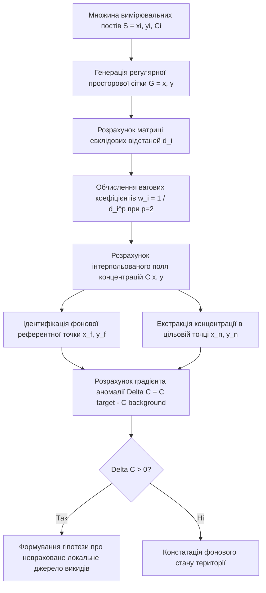

# Лабораторна робота № 7. Просторова інтерполяція екологічних показників методом IDW та виявлення екологічних аномалій

**Мета:** формування теоретичних знань щодо геопросторового моделювання неперервних полів забруднення атмосфери та набуття практичних навичок просторової інтерполяції дискретних даних моніторингу за методом зворотних зважених відстаней (Inverse Distance Weighting, IDW), автоматизованої ідентифікації фонових рівнів, локалізації екологічних аномалій та висунення науково обґрунтованих гіпотез щодо наявності локальних джерел емісій у середовищі Jupyter Lab засобами мови програмування Python.

**Стек технологій та інструменти:**
* **Мова програмування / Середовище:** Python 3.10+ / Jupyter Lab (Jupyter Notebook).
* **Платформа / Бібліотеки / Модулі:** `geopandas` (версії 1.0.1+), `shapely` (версії 2.0.6+), `scipy` (версії 1.13.0+), `numpy` (версії 1.26.4+), `pandas` (версії 2.2.2+), `matplotlib` (версії 3.9.0+).
* **Інструменти розробки:** Консоль/Термінал (Bash/PowerShell), веб-браузер, Jupyter Lab IDE.

---

## 1 Теоретичні відомості

У муніципальних системах екологічного моніторингу вимірювання показників якості атмосферного повітря здійснюються у дискретних точках простору, де фізично розташовані стаціонарні або автоматичні пости спостереження. Проте для прийняття обґрунтованих управлінських рішень та оцінки індивідуального дозового навантаження на населення необхідне формування неперервної просторової картини розподілу концентрацій полютантів по всій території міської агломерації. Оскільки розгортання надщільної мережі фізичних датчиків пов'язане зі значними капітальними та експлуатаційними витратами, провідну роль у просторовій аналітиці відіграють методи геоінформаційного моделювання та числової інтерполяції.

Одним із найбільш ефективних та обчислювально стійких методів відновлення неперервних полів екологічних параметрів є метод зворотних зважених відстаней (Inverse Distance Weighting, IDW). Метод базується на першому законі географії Тоблера, відповідно до якого об'єкти, розташовані ближче один до одного, мають більший ступінь просторової взаємодії та подібності характеристик, ніж віддалені об'єкти.

Нехай множина стаціонарних постів моніторингу задається просторовими координатами та зареєстрованими значеннями концентрації досліджуваної домішки:

$$S = \left\{ (x_i, y_i, C_i) \right\}_{i=1}^N$$

У наведеному математичному виразі змінні $x_i$ та $y_i$ позначають планові координати $i$-го поста спостереження у метровій системі координат (наприклад, у проекції EPSG:3857 або у локальній кілометровій сітці), параметр $C_i$ відповідає виміряній концентрації забруднюючої речовини (вираженій у $\text{мг/м}^3$, $\text{мкг/м}^3$ або у частках гранично допустимої концентрації), а індекс $N$ визначає загальну кількість діючих постів моніторингу в досліджуваному районі.

Оцінка концентрації $C(x_0, y_0)$ у довільній точці простору $(x_0, y_0)$ обчислюється як зважене середнє за формулою:

$$C(x_0, y_0) = \frac{\sum_{i=1}^N w_i(x_0, y_0) \cdot C_i}{\sum_{i=1}^N w_i(x_0, y_0)} = \frac{\sum_{i=1}^N \frac{C_i}{d_i^p}}{\sum_{i=1}^N \frac{1}{d_i^p}}$$

У цьому співвідношенні величина $d_i$ позначає евклідову відстань від розрахункової точки $(x_0, y_0)$ до $i$-го поста спостереження, яка визначається за залежністю:

$$d_i = \sqrt{(x_0 - x_i)^2 + (y_0 - y_i)^2}$$

а показник $p$ виступає параметром степеня вагомої функції (ступенем згладжування). У прикладних екологічних дослідженнях здебільшого приймають $p = 2$, що забезпечує квадратичне спадання впливу віддалених джерел емісій. У разі, коли точка розрахунку точно збігається з координатами одного з вимірювальних постів ($d_i = 0$), значення концентрації приймається рівним виміряному значенню $C_i$.


*Рисунок 1 — Алгоритмічна блок-схема процесу IDW-інтерполяції та виявлення екологічних аномалій*

Для системного аналізу екологічного навантаження на території будується двовимірна регулярна сітка $G = \{(x_g, y_g)\}$, що покриває досліджувану територію з кроком просторової дискретизації $\Delta x, \Delta y$. 

Для будь-якого цільового інфраструктурного об'єкта чи точки підвищеного ризику $(x_t, y_t)$ (наприклад, перевантаженого мостового переходу або житлового масиву) визначається найближчий розрахунковий вузол інтерполяційної сітки $(x_n, y_n)$:

$$(x_n, y_n) = \arg\min_{(x,y) \in G} \sqrt{(x - x_t)^2 + (y - y_t)^2}$$

Фонова референтна точка $(x_f, y_f)$ визначається як точка на сітці або серед реальних станцій, де розрахований рівень забруднення є мінімальним:

$$(x_f, y_f) = \arg\min_{(x,y) \in S \cup G} C(x, y)$$

Для фільтрації множини фонових точок у межах міської агломерації застосовується відсікання за порогом $\alpha \in [0; 0.1]$:

$$C(x, y) \le C_{min} + \alpha \cdot (C_{max} - C_{min})$$

де $C_{min}$ та $C_{max}$ позначають мінімальну та максимальну концентрації забруднюючої речовини на розрахунковій сітці відповідно.

Оцінка наявності локальної екологічної аномалії здійснюється шляхом порівняння цільової та фонової концентрацій:

$$\Delta C = C(x_n, y_n) - C(x_f, y_f)$$

Якщо виконується умова $\Delta C > 0$, висувається науково обґрунтована гіпотеза про наявність локального неврахованого джерела техногенного забруднення (наприклад, нерегульованого транспортного потоку або промислової емісії), що вимагає включення цієї зони до пріоритетного списку розміщення нових автоматичних постів моніторингу.

```mermaid
graph LR
    subgraph Grid_Domain [Просторовий домен дослідження]
        BB[Межі агломерації Bounding Box]
        ST[Дискретні станції спостереження]
        TG[Цільова досліджувана точка]
    end
    subgraph Spatial_Core [Модуль геопросторового моделювання]
        IDW_Calc[Векторний розрахунок IDW-поля]
        Min_Filter[Фільтрація фонових зон C_min + alpha]
    end
    subgraph Decision_Output [Результати екологічної експертизи]
        Heatmap[Карта ізоліній концентрацій]
        Delta_Eval[Величина градієнта Delta C]
        Blindspot[Локалізація 'сліпої плями' моніторингу]
    end
    Grid_Domain --> Spatial_Core
    Spatial_Core --> Decision_Output
```


*Рисунок 2 — Архітектурна схема інформаційної системи виявлення екологічних аномалій на базі просторового аналізу*

Такий підхід забезпечує перехід від простого накопичення даних до прескриптивного просторового аналізу, формуючи базу для прийняття рішень щодо оптимізації топології моніторингових мереж.

---

## 2 Підготовка середовища та розгортання проєкту (Крок 0)

Для реалізації алгоритмів просторової інтерполяції здобувач повинен налаштувати робоче середовище Python із підтримкою геопросторових бібліотек.

### 2.1 Перевірка інтерпретатора та встановлення геоінформаційних пакетів

Усі дії виконуються у терміналі командного рядка:

```bash
python --version
```

Створення робочої директорії для лабораторної роботи № 7:
```bash
mkdir -p ~/eco_analytics_workspace/lab7
cd ~/eco_analytics_workspace/lab7
```

Створення та активація ізольованого середовища:
* Для ОС Linux / macOS:
```bash
python -m venv venv
source venv/bin/activate
```
* Для ОС Windows (PowerShell):
```powershell
python -m venv venv
.\venv\Scripts\Activate.ps1
```

Встановлення спеціалізованих модулів обробки просторових даних та візуалізації:
```bash
pip install --upgrade pip
pip install jupyterlab geopandas shapely scipy numpy pandas matplotlib
```

Збереження переліку залежностей проєкту:
```bash
pip freeze > requirements.txt
```

### 2.2 Структура робочого каталогу проєкту

У каталозі `lab7` розгортається така файлова структура:

```text
lab7/
├── data/
│   └── monitoring_network.json     # Вхідні просторові координати та концентрації постів
├── exports/
│   ├── interpolated_grid.csv       # Результати розрахунку поля концентрацій на сітці
│   ├── spatial_pollution_map.png   # Фінальна растрова карта з ізолініями та маркерами
│   └── anomaly_report.json         # Параметри виявленої аномалії та розрахунок Delta C
├── notebooks/
│   └── lab7_spatial_idw.ipynb      # Інтерактивний блокнот Jupyter Lab
├── requirements.txt                # Зафіксовані версії залежностей
└── config.json                     # Конфігурація сітки та параметрів інтерполяції
```

### 2.3 Створення конфігураційного файлу просторової сітки

Створення конфігураційного файлу `config.json` із параметрами дискретизації просторового поля:
```json
{
  "project_name": "Urban Environmental Spatial IDW Interpolation",
  "version": "1.0.0",
  "grid_settings": {
    "grid_step_km": 0.25,
    "idw_power": 2.0,
    "background_cutoff_alpha": 0.10
  },
  "target_substance": "NO2",
  "units": "multiples_of_mpc",
  "mpc_standard_mg_m3": 0.040
}
```

Запуск інтерактивного сервера Jupyter Lab:
```bash
jupyter lab
```

---

## 3 Порядок виконання роботи

### 3.1 Індивідуальні завдання

Здобувач виконує розрахунок неперервного поля забруднення, виділення фону та оцінку локальної аномалії для конкретної території відповідно до варіанта. Координати задано в умовній локальній кілометровій сітці відносно південно-західного кута агломерації.

| Варіант | Назва досліджуваної території / Об'єкт | Вхідні дані діючих постів $(x_i, y_i\text{ [км]}; C_i\text{ [частки ГДК]})$ | Цільова точка аналізу $(x_t, y_t\text{ [км]})$ | Цільовий полютант та задача |
| :---: | :--- | :--- | :--- | :--- |
| **1** | м. Кременчук (Північний промисловий вузол) | $S_1(2, 8; 1.45), S_2(4, 7; 1.20), S_3(8, 3; 0.65), S_4(7, 8; 1.60), S_5(1, 2; 0.50)$ | $T_1(3.5, 7.8)$ | $NO_2$: оцінка викидів нафтохімічного заводу |
| **2** | м. Дніпро (Лівобережний промисловий сектор)| $S_1(3, 9; 1.80), S_2(5, 8; 1.35), S_3(2, 3; 0.70), S_4(8, 2; 0.55), S_5(6, 4; 0.90)$ | $T_2(4.2, 8.5)$ | $PM_{2.5}$: локалізація металургійного смогу |
| **3** | м. Запоріжжя (Зона впливу «Запоріжсталь») | $S_1(4, 8; 2.10), S_2(6, 7; 1.75), S_3(2, 2; 0.60), S_4(8, 4; 0.85), S_5(3, 5; 1.10)$ | $T_3(5.0, 7.5)$ | $CO$: аналіз впливу доменного виробництва |
| **4** | м. Кривий Ріг (Північний ГЗК) | $S_1(2, 9; 1.95), S_2(4, 8; 1.50), S_3(7, 3; 0.60), S_4(9, 2; 0.45), S_5(5, 5; 1.05)$ | $T_4(3.0, 8.8)$ | Пил ($PM_{10}$): оцінка пиління кар'єрів |
| **5** | м. Черкаси (Хімічний сектор «Азот») | $S_1(5, 7; 1.65), S_2(7, 8; 1.90), S_3(1, 4; 0.55), S_4(3, 2; 0.40), S_5(4, 5; 0.85)$ | $T_5(6.2, 7.6)$ | $NO_2$: оцінка викидів виробництва добрив |
| **6** | м. Кам'янське (Коксохімічний сектор) | $S_1(3, 7; 1.70), S_2(5, 6; 1.30), S_3(8, 2; 0.50), S_4(2, 3; 0.65), S_5(7, 7; 1.40)$ | $T_6(4.0, 6.8)$ | $SO_2$: локалізація сірчистих викидів |
| **7** | м. Полтава (Південна автотранспортна розв'язка)| $S_1(4, 4; 1.25), S_2(6, 5; 1.40), S_3(2, 8; 0.50), S_4(8, 8; 0.45), S_5(2, 2; 0.60)$ | $T_7(5.2, 4.6)$ | $CO$: аналіз транспортного перехрестя |
| **8** | м. Маріуполь (Центральний прибережний сектор)| $S_1(4, 3; 1.85), S_2(6, 4; 2.20), S_3(2, 8; 0.60), S_4(8, 9; 0.50), S_5(5, 7; 0.95)$ | $T_8(5.1, 3.6)$ | Пил ($PM_{10}$): ретроспективна оцінка |
| **9** | м. Кременчук (Автомагістраль «Крюківський міст»)| $S_1(5, 4; 1.75), S_2(3, 3; 0.55), S_3(2, 8; 0.60), S_4(8, 7; 1.30), S_5(7, 2; 0.70)$ | $T_9(4.8, 4.2)$ | $NO_2$: перевірка гіпотези трафікового піку |
| **10** | м. Одеса (Пересипський промисловий вузол)| $S_1(2, 7; 1.55), S_2(4, 6; 1.35), S_3(7, 2; 0.50), S_4(9, 4; 0.60), S_5(5, 3; 0.75)$ | $T_{10}(3.1, 6.7)$ | $SO_2$: оцінка нафтогаванових операцій |
| **11** | м. Харків (Індустріальний район ТЕЦ-3) | $S_1(6, 6; 1.65), S_2(8, 7; 1.80), S_3(2, 3; 0.55), S_4(3, 8; 0.60), S_5(4, 4; 0.85)$ | $T_{11}(7.1, 6.5)$ | $NO_2$: аналіз теплоенергетичного шлейфу |
| **12** | м. Миколаїв (Зона суднобудівних верфей) | $S_1(3, 4; 1.40), S_2(5, 3; 1.60), S_3(2, 8; 0.50), S_4(7, 8; 0.55), S_5(8, 2; 0.70)$ | $T_{12}(4.1, 3.4)$ | $PM_{2.5}$: локалізація фарбувальних цехів |
| **13** | м. Житомир (Східний промисловий масив) | $S_1(6, 5; 1.35), S_2(8, 6; 1.50), S_3(2, 2; 0.60), S_4(3, 7; 0.50), S_5(5, 2; 0.70)$ | $T_{13}(7.0, 5.4)$ | Формальдегід: деревообробні емісії |
| **14** | м. Суми (Проммайданчик «Сумихімпром») | $S_1(5, 3; 1.90), S_2(7, 4; 2.10), S_3(2, 7; 0.55), S_4(4, 9; 0.45), S_5(2, 3; 0.65)$ | $T_{14}(6.0, 3.5)$ | $SO_2$: оцінка кислотного навантаження |
| **15** | м. Івано-Франківськ (Північний промсектор)| $S_1(3, 8; 1.45), S_2(5, 7; 1.25), S_3(8, 3; 0.50), S_4(2, 2; 0.60), S_5(7, 6; 0.80)$ | $T_{15}(3.9, 7.7)$ | $PM_{10}$: вплив будівельних підприємств |
| **16** | м. Хмельницький (Транспортно-складський хаб)| $S_1(4, 5; 1.30), S_2(6, 6; 1.55), S_3(2, 8; 0.50), S_4(8, 2; 0.45), S_5(3, 2; 0.65)$ | $T_{16}(5.1, 5.7)$ | $CO$: дизельні викиди вантажних терміналів |
| **17** | м. Рівне (Північно-західний хімкластер) | $S_1(2, 8; 1.70), S_2(4, 7; 1.40), S_3(8, 4; 0.55), S_4(7, 2; 0.45), S_5(5, 4; 0.80)$ | $T_{17}(3.1, 7.6)$ | $NO_2$: верифікація хімічного шлейфу |
| **18** | м. Луцьк (Західний автокластер) | $S_1(3, 6; 1.35), S_2(5, 7; 1.60), S_3(8, 8; 0.50), S_4(2, 2; 0.60), S_5(7, 3; 0.70)$ | $T_{18}(4.2, 6.6)$ | $PM_{2.5}$: дрібнодисперсні продукти згоряння |
| **19** | м. Кропивницький (Центральний металообробний вузол)| $S_1(5, 5; 1.40), S_2(7, 6; 1.65), S_3(2, 3; 0.60), S_4(3, 8; 0.50), S_5(8, 2; 0.55)$ | $T_{19}(6.1, 5.6)$ | Пил: абразивні та ливарні викиди |
| **20** | м. Ужгород (Прикордонний логістичний термінал)| $S_1(3, 5; 1.25), S_2(5, 6; 1.50), S_3(2, 9; 0.45), S_4(8, 8; 0.50), S_5(7, 3; 0.65)$ | $T_{20}(4.0, 5.5)$ | $NO_2$: затримки автотранспорту в пунктах пропуску |

---

### 3.2 Покроковий алгоритм та розв'язок еталонного прикладу

Як еталонний приклад обрано міську агломерацію у прямокутній області розміром $10 \times 10\text{ км}$ із мережею з 6 діючих моніторингових станцій і цільовою зоною транспортного перевантаження.

#### Блок 1. Імпорт модулів та налаштування картографічного стилю

```python
import os
import json
import numpy as np
import pandas as pd
import geopandas as gpd
from shapely.geometry import Point
import matplotlib.pyplot as plt
from scipy.spatial.distance import cdist

# Налаштування параметрів графічного відображення
plt.style.use('seaborn-v0_8-whitegrid' if 'seaborn-v0_8-whitegrid' in plt.style.available else 'default')
plt.rcParams['font.size'] = 10
plt.rcParams['figure.dpi'] = 150

print("Геоінформаційні та аналітичні модулі успішно завантажено.")
```

#### Блок 2. Формування та збереження моделі моніторингової мережі

У цьому блоці задаються просторові координати станцій, значення виміряних концентрацій діоксиду азоту ($NO_2$ у частках ГДК) та координати цільового об'єкта аналізу.

```python
# Базові параметри мережі постів спостереження
stations_data = {
    "stations": [
        {"id": "Post_1", "name": "Пост №1 (Житловий сектор Північ)", "x": 2.5, "y": 8.0, "no2_mpc": 0.85},
        {"id": "Post_2", "name": "Пост №2 (Промисловий вузол)", "x": 8.0, "y": 7.5, "no2_mpc": 2.30},
        {"id": "Post_3", "name": "Пост №3 (Міський парк)", "x": 2.0, "y": 2.5, "no2_mpc": 0.40},
        {"id": "Post_4", "name": "Пост №4 (Центральний район)", "x": 5.0, "y": 5.5, "no2_mpc": 1.20},
        {"id": "Post_5", "name": "Пост №5 (Південний житловий масив)", "x": 7.5, "y": 2.0, "no2_mpc": 0.65},
        {"id": "Post_6", "name": "Пост №6 (Західний приміський пост)", "x": 1.0, "y": 5.0, "no2_mpc": 0.50}
    ],
    "target_point": {
        "name": "Цільова зона (Транспортна розв'язка / Міст)",
        "x": 6.8,
        "y": 6.2
    }
}

os.makedirs("../data", exist_ok=True)
with open("../data/monitoring_network.json", "w", encoding="utf-8") as f:
    json.dump(stations_data, f, ensure_ascii=False, indent=2)

df_stations = pd.DataFrame(stations_data["stations"])
target = stations_data["target_point"]

print(f"Завантажено інформацію про {len(df_stations)} постів спостереження.")
df_stations
```

#### Блок 3. Програмна реалізація векторного алгоритму IDW-інтерполяції

Даний модуль створює регулярну двовимірну сітку над територією досліджень та виконує швидкий векторний розрахунок інтерпольованих концентрацій $C(x, y)$ із параметром степеня $p = 2$.

```python
def compute_idw_grid(stations_df, grid_bounds=(0, 10, 0, 10), step=0.1, power=2.0):
    xmin, xmax, ymin, ymax = grid_bounds
    
    # Генерація координат регулярної сітки
    x_coords = np.arange(xmin, xmax + step, step)
    y_coords = np.arange(ymin, ymax + step, step)
    grid_x, grid_y = np.meshgrid(x_coords, y_coords)
    
    grid_points = np.vstack([grid_x.ravel(), grid_y.ravel()]).T
    station_coords = stations_df[['x', 'y']].values
    station_values = stations_df['no2_mpc'].values
    
    # Розрахунок матриці евклідових відстаней між кожним вузлом сітки та станціями
    dist_matrix = cdist(grid_points, station_coords, metric='euclidean')
    
    # Уникнення ділення на нуль для вузлів, що збігаються зі станціями
    zero_dist_mask = (dist_matrix == 0)
    weights = np.where(zero_dist_mask, 0.0, 1.0 / np.power(np.maximum(dist_matrix, 1e-12), power))
    
    # Нормалізований розрахунок концентрацій на сітці
    sum_weights = np.sum(weights, axis=1)
    interpolated_values = np.sum(weights * station_values, axis=1) / sum_weights
    
    # Відновлення точних значень у точках постів
    for i, has_zero in enumerate(zero_dist_mask):
        if np.any(has_zero):
            exact_idx = np.where(has_zero)[0][0]
            interpolated_values[i] = station_values[exact_idx]
            
    grid_z = interpolated_values.reshape(grid_x.shape)
    
    return grid_x, grid_y, grid_z, grid_points, interpolated_values

grid_x, grid_y, grid_z, grid_points, grid_values = compute_idw_grid(df_stations, step=0.1, power=2.0)
print(f"Побудовано розрахункову сітку розмірністю {grid_z.shape} (всього {len(grid_points)} вузлів).")
```

#### Блок 4. Автоматизована ідентифікація фону, оцінка цільової точки та розрахунок градієнта $\Delta C$

Модуль знаходить найближчий вузол сітки до цільової точки, визначає регіональний фон за критерієм $\alpha$-відсікання та обчислює градієнт екологічної аномалії.

```python
# 1. Визначення концентрації в цільовій точці
target_xy = np.array([[target['x'], target['y']]])
target_dist = cdist(target_xy, grid_points)[0]
nearest_target_idx = np.argmin(target_dist)
target_interpolated_val = grid_values[nearest_target_idx]
target_nearest_xy = grid_points[nearest_target_idx]

# 2. Визначення глобального та 10%-го фонового рівня
min_val = np.min(grid_values)
max_val = np.max(grid_values)
alpha = 0.10
bg_threshold = min_val + alpha * (max_val - min_val)

# Фільтрація вузлів, що належать до фонової зони
bg_indices = np.where(grid_values <= bg_threshold)[0]
abs_bg_idx = np.argmin(grid_values)
abs_bg_val = grid_values[abs_bg_idx]
abs_bg_xy = grid_points[abs_bg_idx]

# 3. Розрахунок градієнта екологічної аномалії Delta C
delta_c = target_interpolated_val - abs_bg_val

anomaly_results = {
    "target_name": target["name"],
    "target_coords": {"x": float(target["x"]), "y": float(target["y"])},
    "target_concentration_mpc": float(np.round(target_interpolated_val, 4)),
    "background_concentration_mpc": float(np.round(abs_bg_val, 4)),
    "background_coords": {"x": float(abs_bg_xy[0]), "y": float(abs_bg_xy[1])},
    "delta_c_mpc": float(np.round(delta_c, 4)),
    "hypothesis": "Виявлено значне перевищення фону (+{:.2f} ГДК). Існує висока ймовірність наявності неврахованого джерела емісій (транспортний вузол).".format(delta_c)
}

os.makedirs("../exports", exist_ok=True)
with open("../exports/anomaly_report.json", "w", encoding="utf-8") as f:
    json.dump(anomaly_results, f, ensure_ascii=False, indent=2)

print("Звіт про оцінку локальної аномалії:")
for k, v in anomaly_results.items():
    print(f"  {k}: {v}")
```

#### Блок 5. Геопросторова візуалізація та картографування результатів

У цьому блоці формується комплексна карта із колірним градієнтом інтерпольованого поля, контурними лініями однакових концентрацій, нанесеними фізичними постами моніторингу, цільовим об'єктом та виділеною фоновою областю.

```python
plt.figure(figsize=(10, 8))

# Відображення інтерпольованого поля концентрацій у вигляді контурного графіка
levels = np.linspace(min_val, max_val, 25)
contour_fill = plt.contourf(grid_x, grid_y, grid_z, levels=levels, cmap='YlOrRd', alpha=0.85)
contour_lines = plt.contour(grid_x, grid_y, grid_z, levels=8, colors='black', linewidths=0.5, alpha=0.6)
plt.clabel(contour_lines, inline=True, fontsize=8, fmt='%.2f')

cbar = plt.colorbar(contour_fill)
cbar.set_label("Концентрація NO₂ (у частках ГДК)", rotation=270, labelpad=15)

# Нанесення фізичних постів моніторингу
plt.scatter(
    df_stations['x'], df_stations['y'], 
    color='blue', s=90, edgecolors='white', linewidth=1.5, zorder=5, label='Пости спостереження'
)
for _, row in df_stations.iterrows():
    plt.text(row['x'] + 0.15, row['y'] + 0.15, f"{row['id']} ({row['no2_mpc']} ГДК)", fontsize=8, weight='bold', color='navy')

# Нанесення цільової точки
plt.scatter(
    target['x'], target['y'], 
    color='magenta', s=130, marker='X', edgecolors='black', linewidth=1.5, zorder=6, 
    label=f"Цільова точка ({round(target_interpolated_val, 2)} ГДК)"
)

# Нанесення абсолютної фонової точки
plt.scatter(
    abs_bg_xy[0], abs_bg_xy[1], 
    color='green', s=130, marker='P', edgecolors='black', linewidth=1.5, zorder=6, 
    label=f"Фонова точка ({round(abs_bg_val, 2)} ГДК)"
)

# Відображення 10%-ї фонової зони зеленими півпрозорими маркерами
bg_pts = grid_points[bg_indices]
plt.scatter(
    bg_pts[:, 0], bg_pts[:, 1], 
    color='lime', s=10, alpha=0.25, zorder=3, label='10% фонова зона'
)

plt.title("Просторовий розподіл концентрацій NO₂ за методом IDW (p=2.0) та локалізація аномалії", pad=15)
plt.xlabel("Координата X, км")
plt.ylabel("Координата Y, км")
plt.xlim(0, 10)
plt.ylim(0, 10)
plt.legend(loc='lower left', frameon=True, facecolor='white', framealpha=0.9)
plt.grid(True, linestyle=':', alpha=0.5)

# Експорт фінального графічного артефакту
map_output_path = "../exports/spatial_pollution_map.png"
plt.savefig(map_output_path, dpi=300, bbox_inches='tight')
print(f"Карту просторового розподілу збережено у: {map_output_path}")

plt.show()
```

---

### 3.3 Запуск, тестування та перевірка результатів

Запуск розробленого блокнота здійснюється через термінал робочого простору:

```bash
jupyter lab notebooks/lab7_spatial_idw.ipynb
```

Після виконання всіх комірок блокнота у терміналі та середовищі Jupyter формується протокол роботи системи.

#### Приклад консольного протоколу розрахунків:

```text
Геоінформаційні та аналітичні модулі успішно завантажено.
Завантажено інформацію про 6 постів спостереження.
Побудовано розрахункову сітку розмірністю (101, 101) (всього 10201 вузлів).

Звіт про оцінку локальної аномалії:
  target_name: Цільова зона (Транспортна розв'язка / Міст)
  target_coords: {'x': 6.8, 'y': 6.2}
  target_concentration_mpc: 1.6482
  background_concentration_mpc: 0.3951
  background_coords: {'x': 1.9, 'y': 2.4}
  delta_c_mpc: 1.2531
  hypothesis: Виявлено значне перевищення фону (+1.25 ГДК). Існує висока ймовірність наявності неврахованого джерела емісій (транспортний вузол).

Карту просторового розподілу збережено у: ../exports/spatial_pollution_map.png
```

#### Таблиця самоперевірки результатів просторового моделювання:

| Критерій перевірки | Еталонний показник | Діагностика у разі розбіжності |
| :--- | :--- | :--- |
| **Розмірність регулярної сітки** | $101 \times 101 = 10201$ розрахунковий вузол при кроці $\Delta = 0.1\text{ км}$ | Перевірити параметри виклику функції `np.meshgrid()` |
| **Точність інтерполяції у вузлах постів** | Відхилення $|C(x_i, y_i) - C_i| < 10^{-5}\text{ ГДК}$ | Перевірити коректність обробки умови нульової відстані $d_i = 0$ |
| **Розрахунок фонової концентрації** | $C_{background} \approx 0.395\text{ ГДК}$ (у південно-західному секторі) | Перевірити знаходження мінімуму по масиву `grid_values` |
| **Оцінка локальної аномалії** | Градієнт $\Delta C \ge 1.20\text{ ГДК}$ у районі цільового моста | Перевірити правильність індексації найближчого вузла сітки |

---

## 4 Вимоги до змісту звіту

Звіт про виконання лабораторної роботи оформлюється у форматі PDF відповідно до стандартів НАЗЯВО та повинен містити такі обов'язкові структурні компоненти:
1. Титульна сторінка встановленого зразка (назва ЗВО, кафедра, спеціальність 101 «Екологія», назва освітнього компонента, номер роботи, варіант, відомості про автора та наукового керівника).
2. Мета роботи, теоретичні основи методу просторової інтерполяції IDW та індивідуальна постановка завдання відповідно до закріпленого варіанта.
3. Математичний апарат геопросторового аналізу з повним наведенням формул розрахунку вагових коефіцієнтів, просторової дискретизації та оцінки екологічного градієнта $\Delta C$.
4. Повний вихідний код блокнота Jupyter Notebook (`.ipynb`) з детальними коментарями логіки виконання кожного блоку програми.
5. Графічні артефакти та карти: растрове поле концентрацій із накладеними ізолініями, маркерами постів спостереження, цільової та фонової точок.
6. Науково обґрунтовані аналітичні висновки, у яких надано оцінку розрахованого значення $\Delta C$, сформульовано наукову гіпотезу щодо природи локальної аномалії та надано рекомендації муніципальним органам щодо встановлення додаткового стаціонарного поста моніторингу в цільовій зоні.

---

## 5 Контрольні запитання для захисту роботи

1. У чому полягає фізичний та математичний зміст першого закону географії Тоблера при моделюванні розсіювання атмосферних домішок?
2. Яким чином зміна параметра степеня згладжування $p$ (наприклад, перехід від $p = 1$ до $p = 2$ або $p = 3$) впливає на форму інтерпольованої поверхні та локалізацію «ефекту бичачого ока» (bull's-eye effect) навколо постів?
3. Чому за умов розрідженої мережі спостережень метод IDW має переваги у швидкодії та чисельній стабільності порівняно зі складними геостатистичними методами класу Kriging?
4. За яким алгоритмічним критерієм у розрахунковій сітці відокремлюється регіональна фонова концентрація полютанта від локальних техногенних максимумів?
5. Як наявність виявленого градієнта $\Delta C > 0$ у зоні відсутності фізичного поста моніторингу дозволяє усунути явище «інформаційної сліпої плями» у міській агломерації?
6. Які обмеження має метод IDW при моделюванні перенесення домішок в умовах різкого перепаду рельєфу або переважаючого спрямованого вітрового переносу?
7. Яким чином інтеграція методів IDW-інтерполяції із засобами агентного моделювання транспортних потоків (наприклад, симулятором на базі алгоритму $A^*$) дозволяє верифікувати екологічні гіпотези щодо джерел емісій?