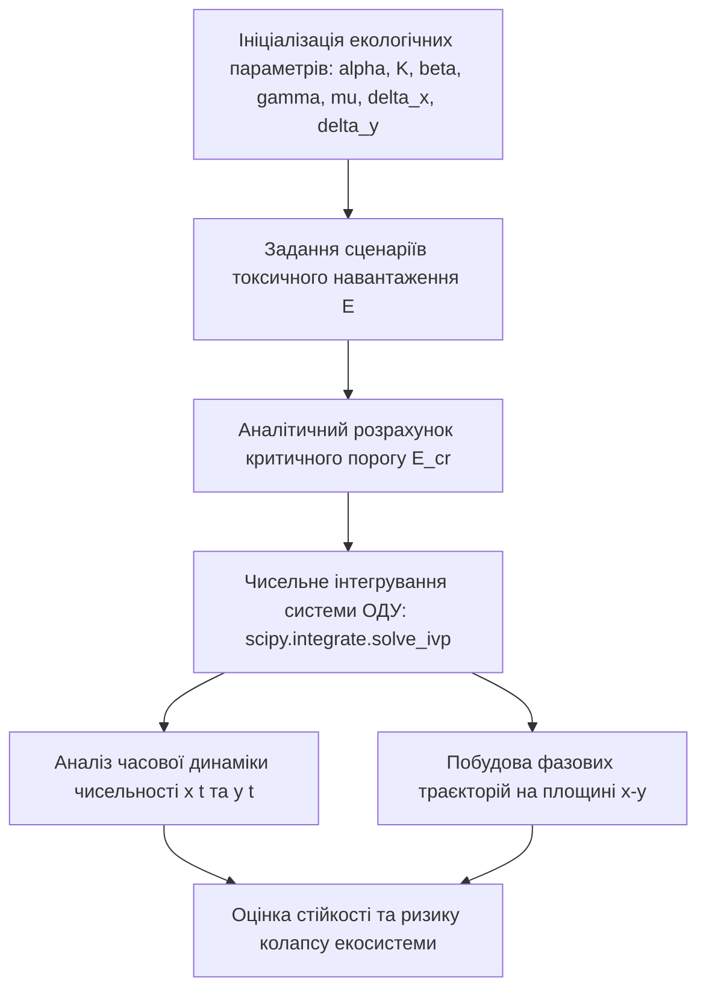

# Лабораторна робота № 8. Моделювання динаміки та стійкості екологічних систем при антропогенному навантаженні

**Мета:** опанування методів математичного та комп'ютерного моделювання динаміки біологічних популяцій в умовах антропогенного навантаження, дослідження стійкості взаємодіючих екосистем за моделлю Лотки-Вольтерра з урахуванням токсичного фактора, побудова фазових траєкторій та визначення критичних меж виживання біоценозу в середовищі Jupyter Lab засобами мови програмування Python.

**Стек технологій та інструменти:**
* **Мова програмування / Середовище:** Python 3.10+ / Jupyter Lab (Jupyter Notebook).
* **Платформа / Бібліотеки / Модулі:** `scipy` (модуль чисельного інтегрування `scipy.integrate`), `numpy` (версії 1.26.4+), `matplotlib` (версії 3.9.0+), `pandas` (версії 2.2.2+).
* **Інструменти розробки:** Консоль/Термінал (Bash/PowerShell), браузер для взаємодії з блокнотом Jupyter.

---

## 1 Теоретичні відомості

Оцінювання стійкості природних біоценозів та прогнозування їхньої реакції на антропогенне втручання є фундаментальною задачею екологічної безпеки. Класичні моделі популяційної динаміки, що описують трофічні взаємодії типу «хижак–жертва», базуються на системі нелінійних диференціальних рівнянь Лотки-Вольтерра. Проте в умовах інтенсивного техногенного пресингу міських і промислових агломерацій природна динаміка чисельності видів суттєво деформується під впливом токсичних скидів, забруднення атмосферного повітря та деградації середовища існування.

Для адекватного відображення екологічних реалій класичну модель модифікують введенням логістичного обмеження росту популяції жертви (наявність граничної екологічної ємності середовища) та додаткових функцій токсичної смертності, пропорційних рівню антропогенного забруднення.

Математична модель динаміки взаємодії популяцій в умовах токсичного навантаження описується системою звичайних диференціальних рівнянь:

$$\begin{cases} \dfrac{dx}{dt} = \alpha x \left(1 - \dfrac{x}{K}\right) - \beta x y - \delta_x E x \\ \dfrac{dy}{dt} = \gamma x y - \mu y - \delta_y E y \end{cases}$$

У наведеній системі диференціальних рівнянь змінна $x(t)$ визначає щільність або біомасу популяції жертви в момент часу $t$ (екз./га або ум. од.), змінна $y(t)$ позначає щільність популяції хижака (екз./га або ум. од.), параметр $\alpha$ відображає коефіцієнт природного біотичного потенціалу (швидкість лінійного розмноження) жертви за відсутності обмежень ($\text{доба}^{-1}$), величина $K$ визначає максимальну екологічну ємність середовища (carrying capacity) для жертви за наявних біотопічних ресурсів (екз./га), коефіцієнт $\beta$ характеризує інтенсивність вилучення жертви хижаком ($\text{га}/(\text{екз}\cdot\text{доба})$), параметр $\gamma$ є коефіцієнтом ефективності засвоєння біомаси (конверсії спожитої жертви у приріст популяції хижака), величина $\mu$ відображає питому природну смертність хижака за відсутності кормової бази ($\text{доба}^{-1}$), змінні $\delta_x$ та $\delta_y$ позначають питомі коефіцієнти токсичної чутливості жертви та хижака відповідно ($\text{доба}^{-1}\cdot\text{конц}^{-1}$), а параметр $E$ визначає інтегральний рівень антропогенного токсичного навантаження на середовище (концентрація токсиканта у воді чи повітрі, виражена в $\text{мг/дм}^3$ або кратностях ГДК).

Стаціонарні стани екосистеми визначаються з умови рівності нулю правих частин системи диференціальних рівнянь:

$$\dfrac{dx}{dt} = 0, \quad \dfrac{dy}{dt} = 0$$

Аналіз системи дає координати ненульової точки динамічної рівноваги $(x^*, y^*)$, що відповідає стану стійкого співіснування обох популяцій:

$$x^* = \frac{\mu + \delta_y E}{\gamma}$$

$$y^* = \frac{1}{\beta} \left[ \alpha \left(1 - \frac{\mu + \delta_y E}{\gamma K}\right) - \delta_x E \right]$$

Фізична умова співіснування популяцій вимагає додатності стаціонарних значень ($x^* > 0$, $y^* > 0$). Оскільки $x^*$ завжди додатне за наявності життя, межа стійкості біоценозу визначається умовою $y^* > 0$. Звідси аналітично визначається критичний рівень антропогенного навантаження ($E_{cr}$), перевищення якого призводить до повної елімінації популяції хижака:

$$E_{cr} = \frac{\alpha \left(\gamma K - \mu\right)}{\alpha \delta_y + \beta \gamma K \delta_x}$$

У наведеній формулі величина $E_{cr}$ є критичним порогом токсичності. Якщо діючий рівень навантаження $E < E_{cr}$, фазові траєкторії системи на площині $(x, y)$ збігаються до стійкого фокуса або утворюють стійкий граничний цикл. Якщо ж $E \ge E_{cr}$, популяція хижака вимирає ($y(t) \to 0$), а чисельність жертви прямує до редукованого техногенного рівня рівноваги $x^*(E) = K\left(1 - \frac{\delta_x E}{\alpha}\right)$.


*Рисунок 1 — Структурна схема алгоритму моделювання та аналізу стійкості екосистеми*


*Рисунок 2 — Еволюція режимів функціонування екосистеми при наростанні токсичного навантаження*

Побудова фазових портретів (траєкторій у просторі станів) дозволяє наочно виявити біфуркаційні переходи системи: від квазіперіодичних циклічних коливань до деградації біологічної структури та втрати самовідновлювальної здатності біогеоценозу під тиском промислових емісій.

---

## 2 Підготовка середовища та розгортання проєкту (Крок 0)

Для проведення комп'ютерного моделювання здобувач вищої освіти налаштовує робоче середовище Python у системі Jupyter Lab.

### 2.1 Перевірка інтерпретатора та встановлення пакетів

Усі дії виконуються у терміналі (Bash, PowerShell або командному рядку операційної системи).

Перевірка версії інтерпретатора Python:
```bash
python --version
```

Створення робочого каталогу лабораторної роботи та перехід до нього:
```bash
mkdir -p ~/eco_analytics_workspace/lab8
cd ~/eco_analytics_workspace/lab8
```

Створення та активація віртуального середовища:
* Для ОС Linux / macOS:
```bash
python -m venv venv
source venv/bin/activate
```
* Для ОС Windows (PowerShell):
```powershell
python -m venv venv
.\venv\Scripts\Activate.ps1
```

Встановлення бібліотек обчислювального та графічного моделювання:
```bash
pip install --upgrade pip
pip install jupyterlab scipy numpy matplotlib pandas
```

Фіксація версій бібліотек у файлі маніфесту `requirements.txt`:
```bash
pip freeze > requirements.txt
```

### 2.2 Структура робочого каталогу проєкту

Робочий каталог організовано за такою схемою:

```text
lab8/
├── config.json                     # Параметри моделювання біоценозу та пороги токсичності
├── exports/
│   ├── time_series_dynamics.png    # Графіки часової динаміки популяцій
│   ├── phase_portrait_2d.png       # Фазовий портрет екосистеми
│   └── stability_metrics.csv       # Таблиця розрахованих стаціонарних станів
├── notebooks/
│   └── lab8_population_dynamics.ipynb # Робочий блокнот Jupyter Lab
└── requirements.txt                # Зафіксовані версії програмних пакетів
```

### 2.3 Створення конфігураційного файлу моделі

Створення файлу `config.json`, що визначає базові константи біотичних взаємодій:
```json
{
  "model_name": "Lotka-Volterra Extended Toxic Dispersion Model",
  "version": "1.0.0",
  "integration_parameters": {
    "t_start": 0.0,
    "t_end": 120.0,
    "t_steps": 1200,
    "method": "RK45"
  },
  "default_initial_conditions": {
    "x0_prey": 40.0,
    "y0_predator": 10.0
  }
}
```

Запуск робочого простору Jupyter Lab:
```bash
jupyter lab
```

---

## 3 Порядок виконання роботи

### 3.1 Індивідуальні завдання

Здобувач обирає вихідні параметри моделі згідно зі своїм номером варіанта в академічному журналі групи. Для кожного варіанта досліджується специфічний тип біоценозу та відповідний вид техногенного фактора.

| Варіант | Досліджувана екосистема та фактор токсичності | Біотичний потенціал $\alpha$, $\text{доба}^{-1}$ | Ємність середовища $K$, екз./га | Коефіцієнт хижацтва $\beta$ | Коефіцієнт конверсії $\gamma$ | Смертність хижака $\mu$, $\text{доба}^{-1}$ | Чутливість $\delta_x, \delta_y$ |
| :---: | :--- | :---: | :---: | :---: | :---: | :---: | :---: |
| **1** | Озерний планктон під дією важких металів ($Cu^{2+}, Zn^{2+}$) | 1.10 | 180.0 | 0.035 | 0.018 | 0.35 | $\delta_x=0.12, \delta_y=0.22$ |
| **2** | Річкові бентосні організми за пестицидного змиву | 0.95 | 140.0 | 0.040 | 0.020 | 0.30 | $\delta_x=0.15, \delta_y=0.28$ |
| **3** | Лісовий біоценоз (комахи-фітофаги / птахи) в зоні викидів $SO_2$ | 1.30 | 220.0 | 0.025 | 0.012 | 0.40 | $\delta_x=0.08, \delta_y=0.18$ |
| **4** | Агроекосистема за умов інсектицидної обробки полів | 1.50 | 250.0 | 0.030 | 0.015 | 0.50 | $\delta_x=0.20, \delta_y=0.35$ |
| **5** | Водойма-охолоджувач ТЕС за термального та хімічного скиду | 1.05 | 160.0 | 0.045 | 0.022 | 0.38 | $\delta_x=0.14, \delta_y=0.25$ |
| **6** | Степ при осіданні важкого пилу гірничо-збагачувального комбінату | 0.85 | 130.0 | 0.032 | 0.016 | 0.28 | $\delta_x=0.10, \delta_y=0.20$ |
| **7** | Прибережна морська зона в зоні нафтоперевалочного комплексу | 1.15 | 200.0 | 0.028 | 0.014 | 0.36 | $\delta_x=0.16, \delta_y=0.30$ |
| **8** | Болотний масив при закисленні стічними водами | 0.75 | 110.0 | 0.050 | 0.025 | 0.25 | $\delta_x=0.11, \delta_y=0.19$ |
| **9** | Ґрунтова мезофауна в зоні радіонуклідного забруднення | 1.25 | 190.0 | 0.038 | 0.019 | 0.42 | $\delta_x=0.18, \delta_y=0.32$ |
| **10** | Лучна ділянка біля автомагістралі (викиди $NO_2, Pb$) | 1.40 | 240.0 | 0.022 | 0.011 | 0.45 | $\delta_x=0.09, \delta_y=0.21$ |
| **11** | Ставкове рибне господарство при евтрофікації та нітратному стресі | 1.00 | 150.0 | 0.042 | 0.021 | 0.32 | $\delta_x=0.13, \delta_y=0.26$ |
| **12** | Гірський ліс під впливом промислових кислотних туманів | 0.90 | 135.0 | 0.036 | 0.017 | 0.34 | $\delta_x=0.07, \delta_y=0.16$ |
| **13** | Садовий агроценоз при систематичному внесенні фунгіцидів | 1.35 | 210.0 | 0.029 | 0.015 | 0.44 | $\delta_x=0.17, \delta_y=0.31$ |
| **14** | Приміський заказник в зоні твердих побутових відходів | 0.80 | 120.0 | 0.048 | 0.024 | 0.29 | $\delta_x=0.12, \delta_y=0.24$ |
| **15** | Кар'єрне озеро при скиданні високомінералізованих вод | 1.05 | 170.0 | 0.034 | 0.018 | 0.37 | $\delta_x=0.15, \delta_y=0.27$ |
| **16** | Водно-болотні угіддя за дії фосфатних добрив | 1.20 | 195.0 | 0.031 | 0.016 | 0.39 | $\delta_x=0.10, \delta_y=0.23$ |
| **17** | Діброва за авіаційної хімічної обробки лісомасивів | 1.45 | 230.0 | 0.026 | 0.013 | 0.48 | $\delta_x=0.19, \delta_y=0.34$ |
| **18** | Зрошувані ґрунти за прогресуючого вторинного засолення | 0.70 | 100.0 | 0.055 | 0.028 | 0.22 | $\delta_x=0.14, \delta_y=0.29$ |
| **19** | Передгірна річка при залпових скидах м'ясокомбінату | 1.15 | 175.0 | 0.039 | 0.019 | 0.41 | $\delta_x=0.16, \delta_y=0.33$ |
| **20** | Урбопарк при високій концентрації озону та фотохімічного смогу | 1.25 | 205.0 | 0.027 | 0.014 | 0.43 | $\delta_x=0.08, \delta_y=0.17$ |

---

### 3.2 Покроковий алгоритм та розв'язок еталонного прикладу

Як еталонний приклад розглядається модель гідробіоценозу міського водосховища з параметрами: $\alpha = 1.20\text{ доба}^{-1}$, $K = 150.0\text{ екз./га}$, $\beta = 0.04$, $\gamma = 0.02$, $\mu = 0.40\text{ доба}^{-1}$, $\delta_x = 0.15$, $\delta_y = 0.25$. Початкові умови: $x(0) = 40.0$, $y(0) = 10.0$.

#### Блок 1. Імпорт модулів та налаштування стилю

```python
import os
import json
import numpy as np
import pandas as pd
import matplotlib.pyplot as plt
from scipy.integrate import solve_ivp

# Встановлення наукового стилю відображення графіків
plt.style.use('seaborn-v0_8-whitegrid' if 'seaborn-v0_8-whitegrid' in plt.style.available else 'default')
plt.rcParams['font.size'] = 10
plt.rcParams['figure.dpi'] = 150
plt.rcParams['axes.labelsize'] = 11
plt.rcParams['axes.titlesize'] = 12

print("Обчислювальні бібліотеки для моделювання екосистем успішно завантажено.")
```

#### Блок 2. Опис математичної моделі та функції правих частин ОДУ

```python
# Базові параметри еталонної моделі біоценозу
alpha = 1.20       # біотичний потенціал жертви
K = 150.0          # ємність середовища
beta = 0.04        # коефіцієнт хижацтва
gamma = 0.02       # коефіцієнт конверсії біомаси
mu = 0.40          # природна смертність хижака
delta_x = 0.15     # чутливість жертви до токсиканта
delta_y = 0.25     # чутливість хижака до токсиканта

# Функція правих частин системи диференціальних рівнянь
def lotka_volterra_toxic(t, state, alpha, K, beta, gamma, mu, delta_x, delta_y, E):
    x, y = state
    # Захист від від'ємних чисельностей при чисельному розв'язанні
    x_val = max(x, 0.0)
    y_val = max(y, 0.0)
    
    dxdt = alpha * x_val * (1.0 - x_val / K) - beta * x_val * y_val - delta_x * E * x_val
    dydt = gamma * x_val * y_val - mu * y_val - delta_y * E * y_val
    return [dxdt, dydt]

# Аналітичний розрахунок критичного навантаження E_cr
numerator = alpha * (gamma * K - mu)
denominator = alpha * delta_y + beta * gamma * K * delta_x
E_cr = numerator / denominator

print(f"Розрахований критичний рівень токсичного навантаження E_cr = {E_cr:.4f} ум. од.")
```

#### Блок 3. Чисельне інтегрування за різними сценаріями навантаження

У цьому блоці моделюється 4 характерні екологічні сценарії:
1. $E = 0.0$ — відсутність антропогенного навантаження (природний режим);
2. $E = 0.5$ — помірний рівень забруднення ($E < E_{cr}$);
3. $E = 1.2$ — критичний передкризовий рівень ($E \approx E_{cr}$);
4. $E = 2.0$ — надкритичне навантаження ($E > E_{cr}$, деградація хижака).

```python
# Часова сітка інтегрування (від 0 до 120 діб)
t_span = (0.0, 120.0)
t_eval = np.linspace(t_span[0], t_span[1], 1200)
initial_state = [40.0, 10.0]

# Досліджувані рівні токсичного впливу E
scenarios_E = [0.0, 0.5, 1.2, 2.0]
results = {}
equilibrium_records = []

for E_val in scenarios_E:
    sol = solve_ivp(
        fun=lambda t, s: lotka_volterra_toxic(t, s, alpha, K, beta, gamma, mu, delta_x, delta_y, E_val),
        t_span=t_span,
        y0=initial_state,
        t_eval=t_eval,
        method='RK45',
        rtol=1e-6,
        atol=1e-8
    )
    results[E_val] = sol
    
    # Розрахунок теоретичної стаціонарної точки
    x_star = (mu + delta_y * E_val) / gamma
    bracket_term = alpha * (1.0 - x_star / K) - delta_x * E_val
    y_star = max(bracket_term / beta, 0.0) if x_star <= K else 0.0
    
    # Якщо хижак вимирає, жертва переходить до моно-рівноваги
    if y_star <= 0.0:
        x_star_mono = max(K * (1.0 - (delta_x * E_val) / alpha), 0.0)
        equilibrium_records.append({
            'Токсичне навантаження E': E_val,
            'Стаціонарна жертва x*': round(x_star_mono, 2),
            'Стаціонарний хижак y*': 0.00,
            'Стан екосистеми': 'Деградація хижака (Монокультура)'
        })
    else:
        equilibrium_records.append({
            'Токсичне навантаження E': E_val,
            'Стаціонарна жертва x*': round(x_star, 2),
            'Стаціонарний хижак y*': round(y_star, 2),
            'Стан екосистеми': 'Стійке співіснування'
        })

df_equilibria = pd.DataFrame(equilibrium_records)
os.makedirs('../exports', exist_ok=True)
df_equilibria.to_csv('../exports/stability_metrics.csv', index=False, encoding='utf-8-sig')
print("Таблиця стаціонарних станів біоценозу:")
df_equilibria
```

#### Блок 4. Візуалізація часової динаміки чисельності популяцій

```python
fig, axes = plt.subplots(2, 2, figsize=(13, 9), sharex=True)
axes = axes.flatten()

for idx, E_val in enumerate(scenarios_E):
    sol = results[E_val]
    ax = axes[idx]
    ax.plot(sol.t, sol.y[0], label='Жертва x(t)', color='#1f77b4', linewidth=2.0)
    ax.plot(sol.t, sol.y[1], label='Хижак y(t)', color='#d62728', linewidth=2.0)
    
    ax.set_title(f"Сценарій E = {E_val} (E_cr = {E_cr:.2f})")
    ax.set_ylabel("Чисельність / Біомаса, ум. од.")
    if idx >= 2:
        ax.set_xlabel("Час t, доби")
    ax.legend(loc='upper right')
    ax.grid(True, linestyle=':', alpha=0.6)

plt.tight_layout()
time_series_path = '../exports/time_series_dynamics.png'
plt.savefig(time_series_path, dpi=300)
print(f"Графік часових рядів збережено: {time_series_path}")
plt.show()
```

#### Блок 5. Побудова фазового портрета та векторного поля системи

```python
plt.figure(figsize=(10, 8))

# Побудова сітки напрямків фазового простору для базового сценарію E = 0.5
x_grid = np.linspace(0, 160, 20)
y_grid = np.linspace(0, 45, 20)
X_m, Y_m = np.meshgrid(x_grid, y_grid)

# Розрахунок векторного поля швидкостей для E = 0.5
DX = alpha * X_m * (1.0 - X_m / K) - beta * X_m * Y_m - delta_x * 0.5 * X_m
DY = gamma * X_m * Y_m - mu * Y_m - delta_y * 0.5 * Y_m
M = np.hypot(DX, DY)
M[M == 0] = 1.0  # Уникнення ділення на нуль
DX_norm = DX / M
DY_norm = DY / M

plt.quiver(X_m, Y_m, DX_norm, DY_norm, color='#b0c4de', alpha=0.5, headwidth=3, headlength=4)

# Нанесення траєкторій для всіх 4 сценаріїв
palette = ['#2ca02c', '#1f77b4', '#ff7f0e', '#d62728']
labels = [f"E = {E} (Природний)" if E == 0 else f"E = {E}" for E in scenarios_E]

for idx, E_val in enumerate(scenarios_E):
    sol = results[E_val]
    plt.plot(sol.y[0], sol.y[1], color=palette[idx], linewidth=2.2, label=labels[idx])
    # Початкова точка
    plt.scatter(sol.y[0][0], sol.y[1][0], color='black', s=30, zorder=5)
    # Фінальна точка
    plt.scatter(sol.y[0][-1], sol.y[1][-1], color=palette[idx], s=60, edgecolors='black', zorder=5)

# Нуль-ізокліни для помірного сценарію E = 0.5
x_null_iso = np.linspace(0.1, 150, 200)
y_null_for_dx = (alpha * (1.0 - x_null_iso / K) - delta_x * 0.5) / beta
plt.plot(x_null_iso, y_null_for_dx, 'k--', alpha=0.6, label='Ізокліна dx/dt = 0 (E=0.5)')
plt.axvline(x=(mu + delta_y * 0.5) / gamma, color='r', linestyle='--', alpha=0.6, label='Ізокліна dy/dt = 0 (E=0.5)')

plt.xlim(0, 160)
plt.ylim(0, 45)
plt.xlabel("Чисельність популяції жертви x")
plt.ylabel("Чисельність популяції хижака y")
plt.title(f"Фазовий портрет біосистеми за різних рівнів токсичного впливу (E_cr = {E_cr:.2f})", pad=15)
plt.legend(loc='upper right')
plt.grid(True, linestyle=':', alpha=0.6)
plt.tight_layout()

phase_portrait_path = '../exports/phase_portrait_2d.png'
plt.savefig(phase_portrait_path, dpi=300)
print(f"Фазовий портрет збережено: {phase_portrait_path}")
plt.show()
```

---

### 3.3 Запуск, тестування та перевірка результатів

Запуск обчислювального блоку виконується у терміналі:

```bash
jupyter lab notebooks/lab8_population_dynamics.ipynb
```

#### Еталонний консольний вивід результатів:

```text
Обчислювальні бібліотеки для моделювання екосистем успішно завантажено.
Розрахований критичний рівень токсичного навантаження E_cr = 1.3433 ум. од.

Таблиця стаціонарних станів біоценозу:
   Токсичне навантаження E  Стаціонарна жертва x*  Стаціонарний хижак y*                      Стан екосистеми
0                      0.0                  20.00                  26.00                 Стійке співіснування
1                      0.5                  26.25                  17.16                 Стійке співіснування
2                      1.2                  35.00                   2.73                 Стійке співіснування
3                      2.0                 112.50                   0.00  Деградація хижака (Монокультура)

Графік часових рядів збережено: ../exports/time_series_dynamics.png
Фазовий портрет збережено: ../exports/phase_portrait_2d.png
```

#### Еталонна таблиця самоперевірки моделювання:

| Показник адекватності моделі | Очікувана поведінка системи | Діагностика можливих відхилень |
| :--- | :--- | :--- |
| **Аналітичний поріг $E_{cr}$** | Числове значення становить $E_{cr} \approx 1.34$ ум. од. | Перевірити формулу розрахунку чисельника та знаменника $E_{cr}$ |
| **Режим співіснування ($E = 0.0, 0.5$)** | Згасаючі коливання та вихід на точку стійкого фокуса | Перевірити метод інтегрування (`solve_ivp` з методом `RK45`) |
| **Режим кризи ($E = 2.0 > E_{cr}$)** | Монотонне падіння $y(t) \to 0$ та зростання $x(t) \to 112.5$ | Перевірити знак при члені токсичної смертності $-\delta_y E y$ |
| **Фазові траєкторії** | Траєкторії закручуються у спіраль навколо стаціонарної точки | Перевірити правильність зв'язування координат $x(t)$ та $y(t)$ |

---

## 4 Вимоги до змісту звіту

Звіт про виконання лабораторної роботи оформлюється здобувачем вищої освіти у форматі PDF відповідно до стандартів НАЗЯВО та повинен містити такі обов'язкові структурні розділи:
1. Титульна сторінка встановленого зразка із зазначенням ЗВО, навчально-наукового інституту, кафедри, дисципліни, номера лабораторної роботи, індивідуального варіанта, а також даних про автора та наукового керівника.
2. Мета роботи, теоретичні засади моделювання екосистем за Лоткою-Вольтерра з урахуванням екологічної ємності середовища та постановка індивідуальної задачі.
3. Розрахункова частина із виведенням аналітичних формул стаціонарних точок $(x^*, y^*)$ та розрахунком критичного рівня токсичності $E_{cr}$ для власного варіанта.
4. Повний та структурований програмний код у форматі комірок блокнота Jupyter Notebook (`.ipynb`) із детальними науково-технічними коментарями.
5. Скріншоти та графічні матеріали комп'ютерного моделювання, зокрема згенеровані часові графіки динаміки чисельності популяцій та фазовий портрет системи для чотирьох рівнів антропогенного навантаження.
6. Науково обґрунтовані аналітичні висновки, у яких детально проаналізовано зміну стійкості біоценозу при переході через критичний поріг $E_{cr}$, оцінено ризики незворотного порушення біологічної рівноваги та запропоновано граничні нормативи скидання забруднюючих речовин для збереження досліджуваної екосистеми.

---

## 5 Контрольні запитання для захисту роботи

1. Чому класична модель Лотки-Вольтерра без логістичного члена $1 - x/K$ є структурно нестійкою, і яку стабілізуючу роль відіграє параметр екологічної ємності середовища $K$?
2. Який фізико-біологічний зміст має коефіцієнт токсичної смертності $\delta_y$ для вищих ланок трофічного ланцюга порівняно з нижчими ланками $\delta_x$ з огляду на ефект біоакумуляції токсикантів?
3. Як за допомогою аналізу власних значень матриці Якобі в стаціонарній точці $(x^*, y^*)$ визначити тип рівноваги (стійкий вузол, стійкий фокус, сідло) та поведінку популяцій у часі?
4. Що відбувається з популяцією жертви $x(t)$ після повного вимирання хижака ($y(t) \to 0$) при перевищенні критичного рівня антропогенного навантаження $E \ge E_{cr}$?
5. Чому фазові траєкторії системи за наявності помірного токсичного навантаження ($0 < E < E_{cr}$) демонструють зсув положення рівноваги в бік меншої чисельності хижака та більшої чисельності жертви?
6. Які практичні рекомендації щодо встановлення гранично допустимих скидів (ГДС) забруднюючих речовин у водні об'єкти можна сформувати на основі розрахованої величини $E_{cr}$?
7. Як відхилення від детермінованого токсичного впливу $E$ до стохастичного (випадкові залпові викиди) впливає на ймовірність раптового колапсу популяцій навіть за умов $E_{\text{середнє}} < E_{cr}$?