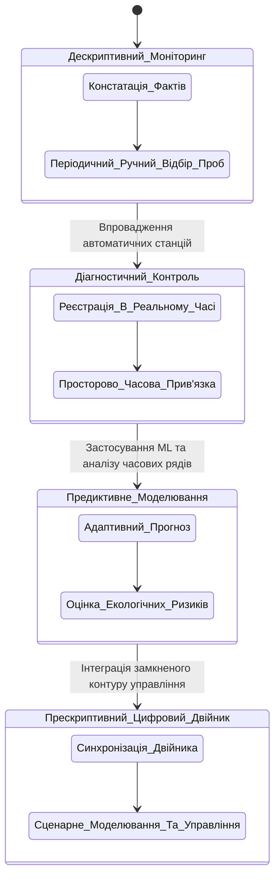
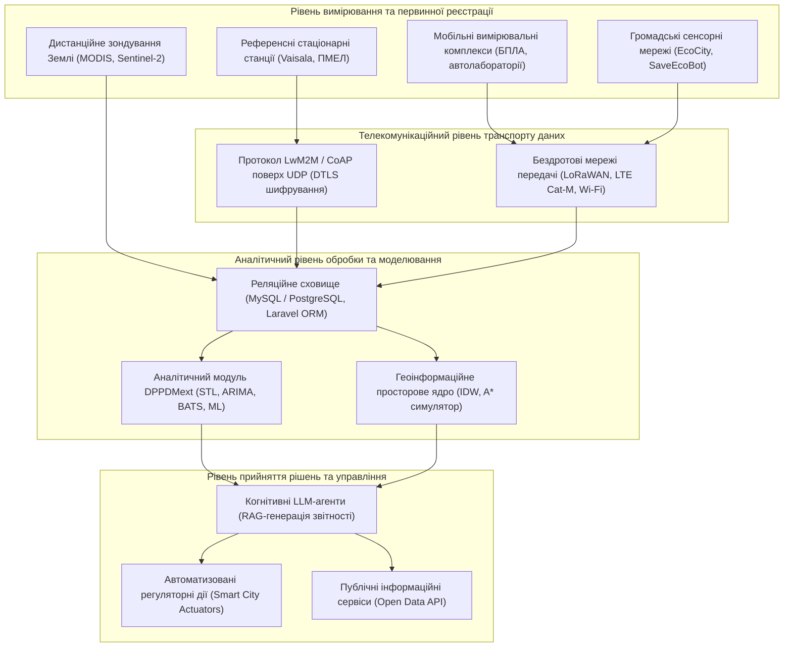
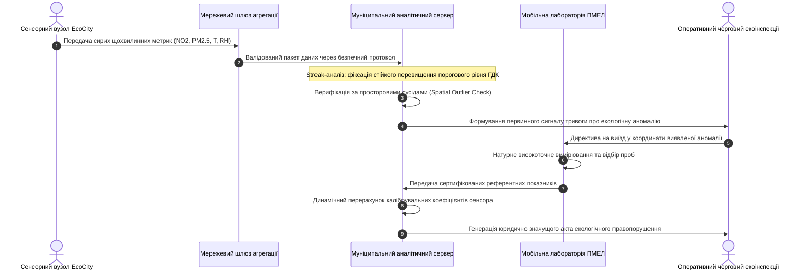
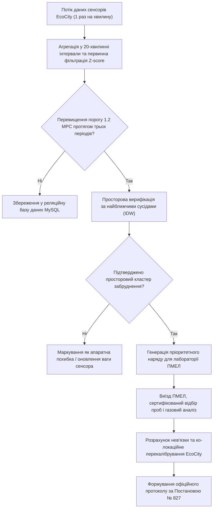

# Тема 1. Сучасні концепції цифровізації екологічного моніторингу

## Мета лекції
Сформувати у здобувачів третього (освітньо-наукового) рівня вищої освіти комплекс фундаментальних знань і системних компетенцій щодо сучасних методологічних підходів до цифровізації багаторівневого моніторингу довкілля, конвергенції державних, регіональних і громадських мереж спостереження, а також гармонізації вітчизняних нормативних регламентів із Директивою ЄС 2024/2881 та постановою Кабінету Міністрів України № 827 для створення надійного інформаційно-аналітичного підґрунтя муніципального екологічного менеджменту та реалізації концепції цифрових двійників міст.

## Очікувані результати навчання
1. **Знання та розуміння.** Здобувачі мають засвоїти теоретико-методологічні засади цифровізації екологічного моніторингу, принципи декомпозиції екосистем та вимоги нормативно-правових документів щодо контролю якості атмосферного повітря.
2. **Застосування.** Здобувачі мають навчитися проєктувати багаторівневі функціональні схеми оперативного екологічного контролю та формалізувати взаємозв'язки між вимірювальними станціями, маркерами забруднення й управлінськими директивами за допомогою кортежних моделей.
3. **Аналіз.** Здобувачі мають аналізувати розбіжності та узгодженість даних між прецизійними муніципальними вимірювальними станціями, автоматизованими промисловими газоаналізаторами та індикативними датчиками громадського моніторингу.
4. **Оцінювання та синтез.** Здобувачі мають формувати стратегії подолання архітектурної фрагментарності інформаційних систем моніторингу та обґрунтовувати комплексну концепцію цифрового двійника урбоекосистеми для підтримки прескриптивних рішень.

## 1. Теоретико-концептуальний базис. Системна архітектура цифровізації екологічного моніторингу та нормативний ландшафт

### 1.1. Еволюція парадигми спостереження довкілля від дескриптивної реєстрації параметрів до предиктивного моделювання та цифрових двійників урбоекосистем

Історичний генезис систем екологічного моніторингу демонструє послідовний перехід від фрагментарних спостережень до високоінтегрованих кіберфізичних комплексів, що функціонують у реальному часі. На початкових етапах функціонування природоохоронних інституцій домінував суто **дескриптивний підхід**, орієнтований на періодичний ручний відбір проб, лабораторний фізико-хімічний аналіз та подальшу фіксацію фактів перевищення гранично допустимих концентрацій забруднюючих речовин. Така констатуюча модель характеризувалася значною часовою затримкою між моментом викиду емісій і прийняттям регуляторних рішень, що унеможливлювало ефективну локалізацію джерел техногенного навантаження в умовах нестаціонарної урбаністичної динаміки.

Розвиток мікроелектроніки, інформаційно-комунікаційних мереж та сенсорних технологій зумовив перехід до етапу **діагностичного моніторингу**. Автоматизація вимірювальних станцій дозволила налагодити безперервні потоки первинних даних, що забезпечило базову просторово-часову локалізацію викидів. Проте конвенційні підходи стикалися з критичним бар'єром: накопичені великі масиви інформації використовувалися переважно для формування ретроспективної звітності без глибокого аналізу системних кореляцій між метеорологічними параметрами, динамікою пересування транспорту та функціонуванням промислових комплексів.

Сучасний стан науково-технічного прогресу вимагає якісної трансформації діагностичних моделей у **предиктивні комплекси**. Предиктивна парадигма передбачає використання методів математичного моделювання, машинного навчання та адаптивного аналізу часових рядів для попереджувальної оцінки стану компонентів довкілля. Впровадження цієї методології є виникаючим імперативом для забезпечення стійкості соціо-екологічних систем, оскільки проактивне прогнозування дозволяє нівелювати загрози для здоров'я населення ще до моменту формування критичних концентрацій токсикантів у приземному шарі атмосфери.

Найвищим щаблем сучасної цифровізації урбанізованих територій виступає концепція **цифрових двійників міст** (Urban Digital Twins). Цифровий двійник являє собою інтегровану віртуальну репліку фізичної урбоекосистеми, яка безперервно синхронізується з матеріальним об'єктом за допомогою двосторонніх інформаційних каналів Інтернету речей. На відміну від статичних геоінформаційних карт, цифровий двійник функціонує в замкненому контурі, об'єднуючи дескриптивні дані сенсорної периферії, предиктивні ядра математичного моделювання та оптимізаційні модулі прийняття прескриптивних рішень. Така система здатна прораховувати альтернативні сценарії розвитку екологічної ситуації за принципом «що, якщо?», варіюючи інтенсивність транспортних потоків, технологічні режими роботи промислових гігантів або реакцію міських служб на екстремальні кліматичні явища.

> **ПРАКТИЧНИЙ ЯКІР:** У процесі цифровізації екологічного моніторингу Кременчуцького промислового вузла муніципальні органи влади здійснили перехід від паперового документообігу та щомісячних лабораторних звітів до інтеграції стаціонарних станцій Vaisala і хмарного аналітичного сховища, що скоротило час виявлення аномальних емісій формальдегіду та діоксиду азоту з 30 діб до 20 хвилин.

---

### 1.2. Нормативно-правові імперативи гармонізації національної системи моніторингу з Директивою ЄС 2024/2881 та постановою Кабінету Міністрів України № 827

Трансформація екологічного моніторингу в Україні відбувається під безпосереднім впливом процесів євроінтеграції та необхідності виконання взятих міжнародних зобов'язань. Ключовим стратегічним орієнтиром виступає оновлена **Директива Європейського Парламенту та Ради (ЄС) 2024/2881** про якість атмосферного повітря та чистіше повітря для Європи. Цей нормативно-правовий акт суттєво посилює вимоги до гранично допустимих концентрацій основних забруднювачів, спрямовуючи стандарти країн-членів на повну конвергенцію з настановами Всесвітньої організації охорони здоров'я. Директива легітимізує застосування інноваційного математичного апарату, встановлюючи вимогу щодо обов'язкового використання методів просторового моделювання та предиктивного аналізу для обґрунтування репрезентативності даних у зонах, де фізичне розміщення стаціонарних постів є економічно чи логістично неможливим.

На національному рівні базовим регламентом є **Постанова Кабінету Міністрів України № 827** «Деякі питання здійснення державного моніторингу в галузі охорони атмосферного повітря», яка структурує управління якістю повітря за європейським принципом розподілу території держави на окремі зони та агломерації. Документ визначає вичерпний перелік маркерів забруднення, обов'язкових до безперервного контролю, встановлює часові рамки осереднення вимірювань та декларує необхідність взаємної інтеграції даних суб'єктів моніторингу різного рівня. Поряд із цим **Наказ Міністерства внутрішніх справ України № 300** регламентує порядок розміщення пунктів спостереження та базові правила їхнього кодування.

Аналіз практичного застосування чинного кодування виявив значні системні недоліки нормативного апарату. Традиційне присвоєння постам коротких ідентифікаторів у вигляді двох десяткових цифр створює високий ризик колізій при об'єднанні регіональних реєстрів у загальнонаціональну аналітичну систему, а також позбавляє інформаційний запис прямої прив'язки до географічних координат та відомчої належності. Для подолання зазначеної семантичної невизначеності обґрунтовано впровадження стандартизованого **вісімнадцятизначного просторового коду**, який містить десяткові географічні координати пункту з точністю до чотирьох знаків після коми, доповнені уніфікованою абревіатурою балансоутримувача обладнання. Такий підхід забезпечує однозначну ідентифікацію вимірювального вузла в просторі $R^2$ та підтримує безшовну інтеграцію даних у реляційні й геоінформаційні сховища.

> **ТИПОВА ПОМИЛКА:** Поширена хибна практика полягає в ототожненні показань індикативних приладів громадського моніторингу з даними сертифікованих муніципальних постів. Безперервні дані недорогих оптичних сенсорів не можуть бути безпосередньо використані як юридичний доказ порушення природоохоронного законодавства без процедури їхньої попередньої математичної верифікації, колібрування за референтними газоаналізаторами та приведення до стандартних метрологічних вимог Постанови № 827.

---

### 1.3. Функціонально-структурна декомпозиція екологічних систем різного походження в координатах концепції «розумного міста»

Управління урбоекосистемами в парадигмі «розумного міста» (Smart City) вимагає розгляду простору як складної гетерогенної структури, в якій неперервно взаємодіють природні середовища, стаціонарні та рухомі антропогенні джерела викидів, а також сенсорні мережі різної точності. **Функціонально-структурна декомпозиція** дозволяє розділити урбаністичний простір на ієрархічні рівні збору, передачі, обробки та використання інформації.

Сенсорний базис сучасної урбоекосистеми складається з кількох незалежних вимірювальних контурів, кожен із яких має специфічні характеристики дискретизації, точності та вартості обслуговування. Систематизацію цих підходів наведено у таблиці нижче.

| Рівень вимірювальної інфраструктури | Методологічний базис збору інформації | Метрологічні характеристики та тип датчиків | Головні технічні та практичні обмеження | Приклад з реальної практики |
| :--- | :--- | :--- | :--- | :--- |
| Референсні муніципальні станції | Автоматичні сертифіковані пункти спостереження з аспіраційними трактами | Висока точність, спектрофотометрія, оптичне розсіювання, сенсори AQT530 та WXT530 | Висока капітальна вартість обладнання, дорогі ліцензії хмарних сервісів ($300–1200/рік) | Мережа постів спостереження комунального підприємства «НДЦ» м. Кременчук |
| Промислові стаціонарні газоаналізатори | Внутрішньозаводські стаціонарні шахтні та факельні прилади типу ПМЕЛ | Неперервний прецизійний контроль специфічних викидів (SO2, CO, H2S, вуглеводні) | Пропрієтарні закриті протоколи передачі даних, відсутність відкритого публічного API | Вимірювальні газоаналізатори нафтопереробного заводу ПАТ «Укртатнафта» |
| Мобільні роботизовані платформи | Безпілотні літальні апарати (БПЛА) та пересувні вимірювальні лабораторії | Датчики концентрації пилу PMS7003, летких органічних сполук CCS811, сенсори BMP280 | Обмежений енергетичний ресурс акумуляторів, залежність від погодних умов | Розумний квадрокоптер кафедри КІЕ КрНУ для висотного профілювання атмосфери |
| Сенсорні мережі громадського моніторингу | Розподілені недорогі станції на базі мікроконтролерів ESP8266 / ESP32 | Індикативні напівпровідникові сенсори MICS-6814, лазерні лічильники пилу SDS011 | Дрейф нульової лінії сенсорів, значна похибка при зміні вологості, нестабільність Wi-Fi | Громадська мережа станцій Air Fresh Max від екологічної ініціативи EcoCity |
| Супутникове дистанційне зондування | Мультиспектральна та гіперспектральна космічна зйомка високої роздільності | Розрахунок інтегральних індексів NDVI, AOD, температури підстильної поверхні LST | Низька дискретизація за часом, сильне затінення хмарним покривом, потреба в даунскейлінгу | Космічні моніторингові дані орбітальних супутників Sentinel-5P та Terra/Aqua MODIS |

Наведена функціональна структура демонструє високу гетерогенність інформаційних потоків. Поєднання даних вимагає наявності чіткого аналітичного шару, здатного зводити різнорідні вимірювання до єдиного часового масштабу та просторового базису.

> **ПРАКТИЧНИЙ ЯКІР:** Під час техногенних наслідків руйнування греблі Каховської ГЕС різке переміщення промислових потужностей у центральні регіони України призвело до зростання фонового вмісту пилу та сажі в житлових масивах Кременчука, що було зафіксовано шляхом перехресного порівняння відкритих даних 4 станцій EcoCity із показниками муніципального поста № 4 по вулиці Шевченка.

---

### 1.4. Концептуальна кортежна модель екологічної системи як базис формалізації предметної області інформаційно-аналітичного моніторингу

Для побудови відмовостійкої архітектури програмного забезпечення та автоматизації аналітичних процесів об'єкти екологічного моніторингу мають бути формалізовані за допомогою суворого математичного апарату теорії множин. Відповідно до концептуальних моделей підготовки та обробки даних, функціонування досліджуваної системи описується за допомогою системи впорядкованих кортежів.

Модель цільової екологічної системи урбанізованого простору формалізується кортежем:

$$T_1 = \langle E, I, P, R, C \rangle$$

У наведеній математичній структурі компоненти мають таке змістовне значення:
* Символ $E$ позначає безпосередній фізичний об'єкт моніторингу, яким може виступати урбанізований повітряний басейн, промисловий майданчик або гідрографічний басейн водосховища.
* Символ $I = \{i_1, i_2, \dots, i_m\}$ задає скінченну множину вимірюваних кількісних та якісних показників, що відображають фізико-хімічний стан досліджуваного об'єкта у часі, зокрема концентрації газових домішок, вміст зважених часток, температуру та вологість середовища.
* Символ $P = \{p_1, p_2, \dots, p_k\}$ формалізує сукупність динамічних природних і техногенних явищ, що протікають у системі, таких як адвективний масоперенос, турбулентна дифузія домішок, гравітаційна седиментація аерозолів та емісії від пересувних джерел.
* Символ $R \subseteq I \times P$ описує матрицю функціональних відношень, взаємозв'язків і кореляційних залежностей між спостережуваними індикаторами та динамічними процесами урбоекосистеми.
* Символ $C$ представляє інтегровану концептуальну схему функціонування системи, що містить онтологічний опис предметної області, нормативні константи гранично допустимих концентрацій та евристичні правила експертної бази знань.

Для структурного представлення окремого інформаційного вимірювання, що надходить від сенсорного вузла до інформаційно-аналітичної системи, застосовується кортежна модель елементарного спостереження:

$$M = \langle O, C_h, M_e, T, L, S, I_n, U \rangle$$

Деталізація параметрів даного кортежу здійснюється за такими положеннями:
* Елемент $O$ визначає конкретний об'єкт натурного спостереження, прив'язаний до локальної точки середовища.
* Елемент $C_h$ вказує на вимірювану фізичну або хімічну характеристику досліджуваного об'єкта, представлену у стандартизованих одиницях масової концентрації або метеорологічних величинах.
* Елемент $M_e$ детермінує застосований метод вимірювання, диференціюючи автоматичну аспірацію, електрохімічний аналіз, дистанційне оптичне детектування чи аналітичний розрахунок.
* Елемент $T$ визначає мітку часу здійснення вимірювання в узгодженому форматі UTC із фіксацією початку та кінця інтервалу інтегрування.
* Елемент $L = (x, y, z)$ фіксує просторові координати вимірювального вузла в метричній системі просторового моделювання EPSG:3857.
* Елемент $S$ задає математичний метод статистичної обробки, застосований до первинних даних, що включає розрахунок математичного сподівання, дисперсії чи кореляційного відношення за обраний період.
* Елемент $I_n$ містить результат інтелектуальної інтерпретації отриманого показника, що ідентифікує стан системи за шкалою екологічної небезпеки або фіксує наявність вимірювальної аномалії.
* Елемент $U$ представляє множину управлінських рішень та директив реагування, автоматично сформованих на основі поточного стану інформаційної системи.

Процес агрегації гетерогенних джерел інформації $D = \{d_1, d_2, \dots, d_n\}$ у централізоване сховище уніфікованих спостережень $S$ описується оператором інтеграції:

$$\mathcal{I}: D \xrightarrow{} S$$

Оператор $\mathcal{I}$ виконує нормалізацію форматів представлення даних, відновлення пропусків, просторово-часову синхронізацію та видалення надлишкових дублікатів. Оцінка метрологічної та інформаційної якості сформованого сховища здійснюється за допомогою показників повноти та надійності даних, які формалізуються такими рівняннями:

$$\text{Completeness} = \frac{N_{\text{filled}}}{N_{\text{expected}}}$$

У наведеній математичній залежності змінна $N_{\text{filled}}$ відображає кількість успішно зафіксованих та валідованих точок вимірювання за встановлений часовий проміжок, а змінна $N_{\text{expected}}$ позначає теоретично очікувану кількість вимірювань за регламентованої частоти опитування датчиків.

$$\text{Reliability} = 1 - \frac{N_{\text{error}}}{N_{\text{total}}}$$

У цьому виразі параметр $N_{\text{error}}$ характеризує сумарну кількість виявлених некоректних записів, спричинених апаратними збоями, нульовими зміщеннями або помилками передачі пакета каналом зв'язку, тоді як параметр $N_{\text{total}}$ визначає загальний обсяг отриманого вибіркового масиву за досліджуваний період. Застосування вказаного математичного апарату закладає суворе алгоритмічне підґрунтя для програмної реалізації інформаційних модулів предиктивного аналізу.

> **КОНТРОЛЬНЕ ПИТАННЯ:** У чому полягає фундаментальна перевага кортежного моделювання екологічних сутностей $T_1 = \langle E, I, P, R, C \rangle$ над традиційними реляційними схемами «сутність-зв'язок» (ERD) при проєктуванні цифрових двійників міст?

Розгорнути аналіз / відповідь

**Правильний варіант: Забезпечення високого рівня семантичної інтероперабельності, підтримки динамічних процесів та мультимодальної інтеграції знань.**

1. Кортежна модель $T_1$ формалізує не лише статичні структури даних (об'єкти $E$ та параметри $I$), а й динамічні просторово-часові процеси переносу речовини $P$, нелінійні реляційні зв'язки $R$, а також когнітивний контекст $C$ (правила онтологій, обмеження нормативів ГДК та експертні бази знань). Це уможливлює формальне поєднання чисельних розрахунків гідродинаміки з нейромережевими ядрами та мовними моделями, тоді як класичні ERD описують лише статичні відношення реляційних таблиць і потребують постійної зміни схеми при додаванні нових гетерогенних джерел.

2. Аналіз дистракторів:
   * Твердження про те, що реляційна модель забезпечує швидший прямий доступ до дискової підсистеми, є технічно коректним для простих CRUD-операцій, проте не вирішує задачу математичної формалізації фізичних процесів і не враховує зміни системних станів середовища.
   * Уявлення, що кортежі використовуються лише для зменшення обсягу пам'яті в базах даних, є помилковим, оскільки теоретико-множинний опис є математичною абстракцією верхнього концептуального рівня проєктування систем і не визначає безпосередню фізичну структуру індексації дискових масивів.

---

### Вказівки для самостійного осмислення

1. Здійсніть критичний порівняльний аналіз вимог щодо гранично допустимих концентрацій зважених часток PM2.5 і PM10, зафіксованих у Директиві ЄС 2024/2881, та аналогічних нормативів, визначених Постановою Кабінету Міністрів України № 827, оцінивши технічну готовність наявної сенсорної інфраструктури вашого регіону до забезпечення регламентованої точності.
2. Сформулюйте формальний теоретико-множинний опис для конкретної локальної урбоекосистеми з рухомими джерелами викидів, розширивши кортежну модель $T_1$ вектором параметрів метеорологічного впливу та матрицею коефіцієнтів трансформації вихлопних газів автотранспорту.
3. Проаналізуйте причини інформаційної надлишковості та затримки пакетів у великих сенсорних мережах громадського моніторингу і запропонуйте математичний критерій для алгоритму адаптивного проріджування часових рядів без втрати інформативності екстремальних екологічних сплесків.

## 2. Методологія та аналіз граничних умов. Інтеграція гетерогенних рівнів моніторингу та подолання архітектурних розривів

### 2.1. Методологічні засади конвергенції систем моніторингу різного підпорядкування: державні пункти, пересувні лабораторії ПМЕЛ та індикативні станції EcoCity

Побудова сучасної автоматизованої системи екологічної безпеки на муніципальному рівні спирається на методологію злиття багатовимірних гетерогенних даних (data fusion), що надходять від вимірювальних систем із принципово різними метрологічними, часовими та просторовими характеристиками. Традиційна архітектура спостережень, яка десятиліттями функціонувала у відриві від цифрових технологій, базується на рідкісній мережі державних та відомчих стаціонарних постів. Такі пункти забезпечують високу селективність фізико-хімічного аналізу за рахунок використання повірених аспіраційних систем, газових хроматографів і спектрофотометрів, проте мають дискретність спостережень від кількох годин до одного місяця, що повністю нівелює можливість фіксації динамічних викидів залпового характеру.

З іншого боку, поява відкритих громадських ініціатив, таких як мережа станцій **EcoCity** або агрегатор **SaveEcoBot**, сформувала альтернативний пласт індикативних даних високої часової роздільності (від одного вимірювання на хвилину). Апаратне забезпечення цих станцій базується на відносно дешевих напівпровідникових та оптичних первинних перетворювачах, що зумовлює їхню високу схильність до апаратного шуму, дрейфу базової лінії внаслідок старіння чутливого шару, а також перехресної чутливості до термодинамічних коливань навколишнього середовища. Пересувні муніципальні лабораторії типу **ПМЕЛ** (постійні моніторингові екологічні лабораторії) займають проміжне положення, володіючи високоточним сертифікованим обладнанням мобільного базування, але їхнє розгортання обмежене ресурсними, логістичними та паливними затратами.

Методологія конвергенції полягає у створенні багаторівневого інформаційного контуру, в якому індикативні прилади низької вартості виконують функцію первинних сигналізаторів просторових аномалій, а сертифіковані муніципальні й державні комплекси виступають калібрувальними ядрами та джерелами легітимної верифікації. Математично взаємозв'язок між сирим сигналом індикативного сенсора $x_{\text{raw}}(t)$ та істинною концентрацією домішки в повітрі $C_{\text{true}}(t)$ у присутності метеорологічних впливів описується нелінійною функцією похибки:

$$C_{\text{true}}(t) = f\big(x_{\text{raw}}(t)\big) \cdot K_{\text{temp}}(T) \cdot K_{\text{hum}}(RH) - \delta_{\text{drift}}(t) + \varepsilon(t)$$

де параметри $K_{\text{temp}}(T)$ та $K_{\text{hum}}(RH)$ представляють емпіричні коефіцієнти температурної та вологісної компенсації відповідно, функція $\delta_{\text{drift}}(t)$ описує деградацію чутливості вимірювального перетворювача в часі, а змінна $\varepsilon(t)$ відображає стохастичний білий шум каналу реєстрації. Забезпечення метрологічної конвергенції вимагає безперервного автоматичного перерахунку передавальної функції індикативних сенсорів на основі еталонних вимірювань найближчих стаціонарних постів або мобільних лабораторій, що тимчасово розміщуються в зоні спостереження для проведення процедури сумісного калібрування (co-location calibration).

У наведеній послідовності взаємодії реалізовано принцип детектування подій із замкненим зворотним зв'язком. Індикативна мережа безперервно сканує урбанізований простір, мінімізуючи час реакції на нештатні емісії, тоді як коштовні ресурси сертифікованої лабораторії задіюються виключно за фактом статистично валідованого сигналу, що забезпечує максимальну економічну та операційну ефективність муніципальної системи моніторингу.

---

### 2.2. Алгоритми оперативного сповіщення та крос-верифікації вимірювань за допомогою повіреного обладнання муніципального рівня при виявленні екстремальних емісій

Управління екологічною безпекою урбанізованих територій вимагає формалізації алгоритму прийняття рішень, який виключає хибні спрацьовування індикативних вимірювальних систем та гарантує юридичну достовірність підсумкової аналітики. Розроблене аналітичне ядро процесу оперативної крос-верифікації формулює п'ятиетапний протокол верифікації, представлений у такій аналітичній системі:

$$
\begin{aligned}
\text{Крок 1 (Детектування тренду):} & \quad \text{IF } \sum_{k=0}^{\tau-1} \mathbb{I}\big(C_{\text{crowd}}(t - k \cdot \Delta t) > \beta \cdot \text{MPC}\big) = \tau \quad \Longrightarrow \quad \text{State} \leftarrow \text{Trigger} \\
\text{Крок 2 (Просторовий аналіз):} & \quad \Delta_{\text{spatial}} = \left| C_{\text{crowd}}(t) - \sum_{i \in \Omega_R} w_i C_i(t) \right| \le 3\sigma_{\Omega} \quad \Longrightarrow \quad \text{State} \leftarrow \text{ClusterConfirmed} \\
\text{Крок 3 (Активація референсу):} & \quad \text{Dispatch}\big(\text{PMEL}, \mathbf{x}_{\text{target}}, \mathbf{y}_{\text{target}}\big) \quad \land \quad \text{Record}\big(C_{\text{ref}}(t')\big) \\
\text{Крок 4 (Крос-валідація):} & \quad \eta = \frac{|C_{\text{crowd}}(t') - C_{\text{ref}}(t')|}{C_{\text{ref}}(t')} \quad \Longrightarrow \quad w_{\text{sensor}} \leftarrow \max\big(0, 1 - \eta\big) \\
\text{Крок 5 (Юридичний синтез):} & \quad \text{IF } C_{\text{ref}}(t') > \text{MPC} \quad \Longrightarrow \quad \text{GenerateReport}\big(\text{Resolution827}, \mathbf{x}, t', C_{\text{ref}}\big)
\end{aligned}
$$

де параметри та змінні процесу мають наступне фізичне й алгоритмічне значення:
* Вираз $\mathbb{I}(\cdot)$ є індикаторною функцією, що набуває одиничного значення у разі істинності аргументу та нуля у протилежному випадку.
* Змінна $C_{\text{crowd}}(t)$ відображає поточну концентрацію домішки за даними станції індикативного рівня.
* Параметр $\beta$ визначає коефіцієнт безпекового порогу відносно встановленої гранично допустимої концентрації ($\text{MPC}$).
* Параметр $\tau$ задає мінімальну довжину серії послідовних спостережень (streak), яка регламентує часову стійкість аномалії та відсікає імпульсні апаратні збої сенсора.
* Множина $\Omega_R$ об'єднує всі сусідні вимірювальні вузли в радіусі просторової кореляції $R$, а коефіцієнти $w_i$ визначають вагові внески сусідів за методом зворотних відстаней.
* Величина $\sigma_{\Omega}$ задає просторове середньоквадратичне відхилення поля концентрацій у межах обраного кластера.
* Вектор $(\mathbf{x}_{\text{target}}, \mathbf{y}_{\text{target}})$ фіксує просторові координати верифікованої аномалії, куди спрямовується мобільна лабораторія $\text{PMEL}$.
* Змінна $C_{\text{ref}}(t')$ відповідає значенню концентрації, отриманому сертифікованим повіреним обладнанням у момент часу $t'$.
* Коефіцієнт $\eta$ визначає відносну нев'язку між індикативним та референтним спостереженнями, на підставі якої алгоритм оновлює коефіцієнт довіри $w_{\text{sensor}}$ до відповідного індикативного вузла в системній базі даних.
* Функція $\text{GenerateReport}(\cdot)$ здійснює автоматизоване складання юридично оформленої відомості про стан повітряного басейну відповідно до уніфікованих форм Постанови № 827.

> **ВАЖЛИВО:** Дані автоматизованих індикативних систем або мікроконтролерних станцій безпосередньо не можуть бути підставою для відкриття кримінального провадження чи накладання штрафних санкцій на суб'єкти господарювання; вони виступають виключно сигнальною базою для направлення повіреної лабораторії, атестованої за вимогами стандарту ДСТУ EN ISO/IEC 17025.

---

### 2.3. Просторова розрідженість сенсорної інфраструктури та проблема виникнення критичних інформаційних сліпих зон як головне практичне обмеження моніторингових систем

Фундаментальним обмеженням існуючих міських систем екологічного спостереження є їхня просторова розрідженість (spatial sparsity). У більшості промислових центрів України кількість постійно діючих вимірювальних постів коливається в межах від трьох до шести одиниць на все місто. Внаслідок цього виникає ефект «інформаційних сліпих зон» — великих урбанізованих територій, що охоплюють житлові квартали, магістральні розв'язки та санітарно-захисні зони підприємств, у межах яких інструментальний контроль складу повітряного басейну повністю відсутній.

Аналітична інтерполяція значень у таких умовах спирається на теоретичне припущення про неперервність та ізотропність поля розсіювання, що на практиці призводить до виникнення грубих помилок моделювання. Математичні та феноменологічні моделі втрачають адекватність за наявності таких граничних умов реального міського ландшафту:

1. **Термодинамічні приземні інверсії.** В осінньо-зимовий період утворюється стійкий інверсійний шар повітря, який блокує вертикальний конвективний підйом викидів. У цих умовах шлейфи токсикантів розтікаються на висотах до кількох десятків метрів уздовж рельєфу, не фіксуючись стаціонарними вимірювальними постами, розташованими на віддалених географічних висотах або поза напрямком переважаючого мікропотоку.

2. **Штиль та околонульові швидкості вітрового переносу ($v < 0.5\text{ м/с}$).** За відсутності динамічного перенесення повітряних мас конвективні допущення математичних моделей розсіювання перестають працювати. Відбувається локальне концентрування важких інгредієнтів (зважений пил, свинець, сірководень) безпосередньо біля джерел емісій, формуючи плями екстремального забруднення діаметром у кілька сотень метрів, які перебувають у сліпій зоні між стаціонарними постами.

3. **Ефект міських вуличних каньйонів (street canyons).** Щільна багатоповерхова забудова формує локальні турбулентні вихори та замкнені аеродинамічні пастки, внаслідок чого концентрація діоксиду азоту та монооксиду вуглецю на паралельних вулицях може відрізнятися у 5–10 разів. Станція моніторингу, встановлена на відкритій площі на відстані лише одного кілометра, демонструє нормативні фонові показники, маскуючи небезпечний рівень забруднення у прилеглих житлових зонах.

4. **Локальні джерела з неперіодичним циклом функціонування.** Несанкціоноване спалювання промислових відходів, аварійні викиди маневрових тепловозів на залізничних вузлах або локальні технологічні інциденти на перевантажувальних терміналах генерують короткоживучі висококонцентровані хмари забруднювачів, які повністю розсіюються до моменту досягнення найближчого контрольного поста.

> **ПРАКТИЧНИЙ ЯКІР:** У процесі натурних досліджень на Крюківському мості через Дніпро в місті Кременчук стаціонарний екологічний пост № 5 (вул. І. Приходька), розташований на віддалі 1,8 км, реєстрував концентрацію $NO_2$ на безпечному рівні 0,8 ГДК, тоді як мобільне обстеження транспортного коридору виявило локальне пікове перевищення до 3,4 ГДК, викликане заторами важкого вантажного транспорту в умовах термічної інверсії над річковим руслом.

---

### 2.4. Методи первинної верифікації та часової синхронізації різнотипних вихідних інформаційних потоків

Об'єднання інформації з референтних і аматорських сенсорних комплексів вимагає попередньої нормалізації та узгодження часових шкал. Первинний аналітичний потік характеризується гетерохронністю: промислові газоаналізатори видають усереднені 20-хвилинні зрізи, цифрові станції Vaisala транслюють хвилинні масиви, а метеостанції WXT530 передають дані за подійною моделлю у разі зміни швидкості вітру. 

Для ліквідації часової неоднорідності застосовується алгоритм ковзної віконної синхронізації. Формується матриця просторово-часових вимірювань за допомогою оператора інтервального осереднення:

$$\bar{x}_j(\tau_k) = \frac{1}{\sum_{t_m \in \mathcal{W}_k} \omega(t_m)} \sum_{t_m \in \mathcal{W}_k} \omega(t_m) \cdot x_j(t_m)$$

де інтервал інтегрування задається вікном $\mathcal{W}_k = [\tau_k - \frac{\Delta t}{2}, \, \tau_k + \frac{\Delta t}{2}]$, величина $\Delta t$ відповідає базовому кванту моделювання (за стандартом Постанови № 827 — 20 хвилин), а вагові коефіцієнти $\omega(t_m)$ ураховують експоненційне згасання актуальності попередніх вимірів або ступінь їхньої достовірності, визначений апаратним шляхом.

Для систематизації аналітичних інструментів, що застосовуються для інтеграції, валідації та інтерполяції екологічних потоків даних у сучасних муніципальних інформаційних системах, сформовано порівняльну матрицю за ключовими інженерними критеріями.

| Клас методології | Метрологічний цільовий рівень | Обчислювальна складність та апаратні вимоги | Швидкодія та латентність контуру | Складність впровадження | Критичні ризики та обмеження методології |
| :--- | :--- | :--- | :--- | :--- | :--- |
| Динамічна ко-локаційна регресія (Co-location ML) | Корекція дрейфу індикативних IoT-сенсорів до суб-референтного рівня | Помірна; потребує періодичного тренування лінійних моделей або градієнтного бустингу на CPU | Відгук у реальному часі (латентність менше 100 мс після навчання) | Середня; вимагає фізичного сумісного розміщення калібрувального вузла | Неможливість екстраполяції за межі калібрувального діапазону температур та вологості |
| Просторове зважування зворотними відстанями (IDW) | Побудова неперервних полів концентрацій для візуалізації | Низька; поліноміальна відносно кількості розрахункових вузлів $O(N \cdot M)$ | Долі секунди для сіток розмірністю до $1000 \times 1000$ вузлів | Низька; реалізується стандартними бібліотеками просторового аналізу | Виникнення артефактів («ефект бичачого ока»), повне ігнорування рельєфу та вітру |
| Оцінка еквівалентності вимірювань (Orthogonal Regression) | Юридична сертифікація та підтвердження придатності вимірювальних систем | Низька; стандартні статистичні матричні процедури на серверній платформі | Висока швидкодія; розрахунок здійснюється пакетами в кінці облікового періоду | Висока; вимагає суворого дотримання протоколів випробувань ISO 17025 | Чутливість до випадкових викидів у навчальних вибірках малої тривалості |
| Імітаційне моделювання мікромасштабної динаміки (CFD / A*) | Виявлення локальних концентрацій у зонах відсутності фізичних постів | Висока; вимагає GPU-прискорення або паралельних кластерних обчислень | Від 5 хвилин до кількох годин залежно від дискретизації просторової сітки | Дуже висока; потребує тривимірної геометрії будівель та калібрування трафіку | Екстремальна чутливість до точності вхідних граничних умов та профілю вітру |
| Хмарне злиття потоків (Asynchronous Stream Fusion) | Уніфікація гетерогенних форматів та створення єдиного часового зрізу | Середня; використання оперативної пам'яті сервера під структури черг та буферів | Потокова обробка з допустимою мережевою затримкою від 1 до 5 секунд | Середня; вимагає підтримки протоколів LwM2M, MQTT та REST API | Втрата частини сирих даних у разі виникнення мережевих колізій або збоїв зв'язку |

Аналіз матриці свідчить, що жоден із ізольованих методів не здатен одночасно вирішити задачу високої швидкодії, глобального покриття території та метрологічної точності. Ефективне функціонування муніципальної системи можливе лише за умов гібридизації: потокове злиття даних агрегує сирі потоки, ко-локаційна регресія компенсує спотворення дешевих сенсорів, просторова інтерполяція візуалізує загальну картину, а імітаційні симулятори перевіряють сліпі зони підвищеного ризику.

> **КОНТРОЛЬНЕ ПИТАННЯ:** Під час моніторингу повітряного басейну в зоні впливу гірничозбагачувального комбінату індикативна станція громадського контролю зафіксувала тригодинне зростання концентрації пилу PM10 з 0,6 ГДК до 2,8 ГДК. Одночасно референтна стаціонарна станція, розташована за 2,5 км на підвітряному боці, фіксує стабільний фоновий рівень 0,4 ГДК при швидкості вітру 1,2 м/с. Яку послідовність аналітичних дій повинен виконати алгоритм крос-верифікації для підтвердження або спростування факту залпового викиду?

Розгорнути аналіз / відповідь

**Правильний варіант: Покроковий алгоритм просторово-метеорологічної дискримінації та спрямування мобільної лабораторії.**

1. Аналітичний розрахунок та перевірка гіпотези здійснюється за такими етапами:
   * **Етап 1 (Метеорологічна перевірка вектора перенесення):** Алгоритм аналізує напрямок вітру відносно взаємного розташування комбінату, громадської станції та референтного поста. Якщо референтний пост перебуває на підвітряному боці, а лінія переносу від комбінату не перетинає сектор чутливості індикативного сенсора, розбіжність у показниках є фізично обґрунтованою. При швидкості 1,2 м/с повітряна маса долає відстань 2,5 км приблизно за 35 хвилин, отже, алгоритм вводить лагову затримку для очікування сплеску на референсному пості.
   * **Етап 2 (Перевірка метеочутливості оптичного каналу):** Аналізується рівень відносної вологості повітря за даними сенсора WXT530. У разі перевищення значення $RH > 85\%$ оптичні лічильники пилу індикативного класу (наприклад, SDS011) демонструють помилкове гіпертрофоване зростання оптичної щільності внаслідок конденсаційного збільшення розміру гігроскопічних аерозолів. Якщо висока вологість підтверджена, сплеск маркується як потенційно метеорологічний артефакт.
   * **Етап 3 (Оперативна верифікація виїздом ПМЕЛ):** Якщо вологість перебуває в нормі, а модель розсіювання за конусом шлейфу Гауса підтверджує наявність сліпої зони комбінату над індикативною станцією, формується пріоритетна заявка для мобільної лабораторії ПМЕЛ із завданням проведення сертифікованого гравіметричного відбору проб у координатах громадського сенсора.
   * **Етап 4 (Оновлення довіри до сенсора):** Після зіставлення результатів натурного аналізу перераховується динамічна вага $w_{\text{sensor}}$ станції в загальній аналітичній матриці міської системи.

2. Аналіз дистракторів (чому інші підходи є хибними):
   * Автоматичне відкидання сигналу індикативної станції через його невідповідність показникам референтного поста є неприпустимим, оскільки на такій відстані (2,5 км) висока просторова розрідженість мережі маскує локальні шлейфи промислових джерел.
   * Негайне накладання штрафних санкцій на комбінат виключно на підставі первинних даних громадського сенсора є грубим порушенням вимог Постанови № 827, оскільки дані індикативного обладнання без обов'язкової метрологічної повірки не мають доказової сили в суді.

## 3. Практичний індустріальний / фаховий кейс. Архітектурна реконфігурація муніципального моніторингу урбосистеми

### 3.1. Комплексний фаховий кейс. Розробка дворівневої системи оперативного контролю викидів Кременчуцького промислового вузла на основі інтеграції муніципальних лабораторій ПМЕЛ та громадської мережі EcoCity

#### Постановка задачі / ситуації
Кременчуцький промисловий вузол є потужним центром машинобудування, нафтопереробки та гірничодобувної галузі, де функціонують великі індустріальні об'єкти (ПАТ «Укртатнафта», Кременчуцький завод технічного вуглецю, ПАТ «Крюківський вагонобудівний завод»). Динаміка забруднення повітряного басейну характеризується періодичними залповими викидами діоксиду азоту, оксиду вуглецю, сажі та формальдегіду. Муніципальна система спостереження комунального підприємства «Науковий центр еколого-соціальних досліджень» (КП «НДЦ») володіє однією сертифікованою пересувною лабораторією ПМЕЛ та трьома стаціонарними автоматичними станціями Vaisala (AQT530/WXT530). Проте пряме обслуговування фірмових хмарних сервісів Vaisala створює надмірне фінансове навантаження на міський бюджет (близько 1200 доларів США на рік за кожну станцію), а наявна мережа залишає значні «сліпі зони» у житлових кварталах і вздовж магістралей перевезення вантажів.

Для розширення просторового охоплення залучено чотири індикативні станції громадської мережі EcoCity (моделі Air Fresh Max). Головна інженерна проблема полягає в тому, що показники станцій EcoCity мають високий рівень інструментального шуму та не володіють юридичною силою згідно з вимогами Постанови Кабінету Міністрів України № 827. Виникає завдання синтезу дворівневої інформаційно-аналітичної технології: на першому рівні дані EcoCity фільтруються й аналізуються алгоритмом виявлення стійких серій перевищень (streaks), після чого система в автоматичному режимі генерує маршрутне завдання для виїзду мобільної лабораторії ПМЕЛ із метою проведення сертифікованого арбітражного вимірювання та коригування динамічних ваг сенсорів.

Параметри та обмеження середовища реалізації кейсу представлено в таблиці нижче.

| Параметр системи / середовища | Одиниця виміру | Числове значення | Технічний та експлуатаційний контекст |
| :--- | :--- | :--- | :--- |
| Площа охоплення моніторингом | км² | 96,0 | Територія урбосистеми м. Кременчук із санітарно-захисними зонами |
| Кількість референтних станцій Vaisala | од. | 3 | Станції з сенсорами AQT530 та метеомодулями WXT530 |
| Кількість індикативних станцій EcoCity | од. | 4 | Станції Air Fresh Max (сенсори MICS-6814, PMS7003, BME280) |
| Кількість мобільних лабораторій ПМЕЛ | од. | 1 | Повірений комплекс з аспіраційними та хроматографічними приладами |
| Гранично допустима концентрація $NO_2$ | мг/м³ | 0,2 | Максимальна разова нормативна межа згідно з Постановою № 827 |
| Гранично допустима концентрація PM2.5 | мг/м³ | 0,025 | Середньодобова цільова норма згідно з Директивою ЄС 2024/2881 |
| Поріг тривалості серії (Streak threshold, $\tau$) | хв | 60 | Тривалість безперервного перевищення (три послідовні зрізи по 20 хв) |
| Максимальний час підльоту / виїзду ПМЕЛ | хв | 40 | Граничний час розгортання мобільної лабораторії в точці аномалії |
| Граничний бюджет експлуатації системи | грн/міс | 12 000 | Витрати на оренду хмарного VPS сервера та підтримку зв'язку |

#### Покроковий аналіз та розв'язок

##### Крок 1. Первинна статистична фільтрація та агрегація щохвилинного потоку даних EcoCity
Первинний масив концентрацій діоксиду азоту від станції № 1748 надходить щохвилини. Для нівелювання імпульсних завад аналітичний модуль здійснює розрахунок ковзного z-критерію та формує 20-хвилинний агрегований зріз із видаленням викидів, для яких виконується умова $|x_t - \mu| > 3\sigma$. Усереднена концентрація за двадцятихвилинний період для часових зрізів $t_1, t_2, t_3$ розраховується відповідно до балансового співвідношення:

$$\bar{C}_{\text{crowd}}(t) = \frac{1}{N} \sum_{k=1}^{N} C_{\text{raw}}(t_k)$$

Припустимо, що за результатами трьох послідовних двадцятихвилинних інтервалів агреговані концентрації діоксиду азоту склали:

$$\bar{C}_{\text{crowd}}(t_1) = 0,26 \text{ мг/м}^3, \quad \bar{C}_{\text{crowd}}(t_2) = 0,31 \text{ мг/м}^3, \quad \bar{C}_{\text{crowd}}(t_3) = 0,28 \text{ мг/м}^3$$

Оскільки норматив ГДК для $NO_2$ становить $G_{NO2} = 0,20\text{ мг/м}^3$, а коефіцієнт тривоги встановлено на рівні $\beta = 1,2$, критичний поріг становить $0,24\text{ мг/м}^3$. Всі три послідовні зрізи перевищують значення $\beta \cdot G_{NO2}$, що свідчить про формування стійкої серії тривалістю 60 хвилин:

$$\text{Streak} = \sum_{k=0}^{2} \mathbb{I}\big(\bar{C}_{\text{crowd}}(t_{3-k}) > 0,24\big) = 3 = \tau$$

Умова генерації первинного сигналу тривоги виконується.

##### Крок 2. Просторове кластерне підтвердження аномалії
Перед формуванням директиви на виїзд мобільної лабораторії алгоритм проводить перевірку гіпотези про локальний апаратний збій сенсора за допомогою інтерполяційного порівняння з сусідніми вимірювальними пунктами. Розрахуємо очікувану концентрацію в точці розташування вузла № 1748 за даними двох суміжних індикативних станцій № 1753 і № 1756, віддалених на відстані $d_1 = 1,4\text{ км}$ та $d_2 = 2,1\text{ км}$ відповідно, які зафіксували значення $C_1 = 0,22\text{ мг/м}^3$ та $C_2 = 0,19\text{ мг/м}^3$:

$$C_{\text{interp}} = \frac{\sum_{i=1}^{2} \frac{C_i}{d_i^2}}{\sum_{i=1}^{2} \frac{1}{d_i^2}} = \frac{\frac{0,22}{1,4^2} + \frac{0,19}{2,1^2}}{\frac{1}{1,4^2} + \frac{1}{2,1^2}} = \frac{\frac{0,22}{1,96} + \frac{0,19}{4,41}}{\frac{1}{1,96} + \frac{1}{4,41}} = \frac{0,1122 + 0,0431}{0,5102 + 0,2268} = \frac{0,1553}{0,7370} \approx 0,211 \text{ мг/м}^3$$

Абсолютна просторова розбіжність становить:

$$\Delta_{\text{spatial}} = |\bar{C}_{\text{crowd}}(t_3) - C_{\text{interp}}| = |0,28 - 0,211| = 0,069 \text{ мг/м}^3$$

Оскільки дисперсія вибірки на сусідніх станціях становить $\sigma_{\Omega} = 0,03\text{ мг/м}^3$, розбіжність не перевищує поріг трьох сигм ($0,069 \le 3 \cdot 0,03 = 0,09$), що виключає ізольований одиничний збій сенсора та підтверджує наявність масштабної просторової аномалії.

##### Крок 3. Розрахунок індексу пріоритетності виїзду лабораторії ПМЕЛ
Для прийняття рішення щодо направлення пересувної лабораторії обчислюється динамічний індекс пріоритету виклику ($PI$), який враховує перевищення нормативу, густоту населення в районі спостереження та час доїзду:

$$PI = \left(\frac{\bar{C}_{\text{crowd}}(t_3) - G_{NO2}}{G_{NO2}}\right) \cdot \frac{\rho_{\text{pop}}}{\rho_{\text{base}}} \cdot \frac{T_{\text{max}}}{T_{\text{travel}}}$$

Підставляючи параметри для досліджуваного району (густота населення $\rho_{\text{pop}} = 4500\text{ осіб/км}^2$ при базовій $\rho_{\text{base}} = 3000\text{ осіб/км}^2$, розрахунковий час доїзду через міські магістралі $T_{\text{travel}} = 25\text{ хв}$ при $T_{\text{max}} = 40\text{ хв}$):

$$PI = \left(\frac{0,28 - 0,20}{0,20}\right) \cdot \frac{4500}{3000} \cdot \frac{40}{25} = 0,40 \cdot 1,5 \cdot 1,6 = 0,96$$

Оскільки отримане значення індексу перевищує встановлений критичний поріг спрацьовування $PI_{\text{crit}} = 0,75$, система формує обов'язкову директиву диспетчеру на негайне розгортання комплексу ПМЕЛ.

##### Крок 4. Арбітражна крос-валідація та динамічна корекція коефіцієнта ваги сенсора
Після прибуття мобільної лабораторії ПМЕЛ на локацію станції № 1748 проводиться синхронний відбір проб атмосферного повітря повіреним газоаналізатором, який фіксує еталонну концентрацію $C_{\text{ref}} = 0,25\text{ мг/м}^3$. Визначається відносна похибка індикативного приладу:

$$\eta = \frac{|\bar{C}_{\text{crowd}} - C_{\text{ref}}|}{C_{\text{ref}}} = \frac{|0,28 - 0,25|}{0,25} = \frac{0,03}{0,25} = 0,12 \quad (12\%)$$

На підставі отриманої нев'язки інформаційна система оновлює динамічний коефіцієнт метрологічної довіри до сенсора № 1748 у реляційній базі даних:

$$w_{\text{sensor}}^{(\text{new})} = w_{\text{sensor}}^{(\text{old})} \cdot (1 - \eta) = 1,0 \cdot (1 - 0,12) = 0,88$$

Водночас факт перевищення нормативу $C_{\text{ref}} = 0,25\text{ мг/м}^3 > 0,20\text{ мг/м}^3$ підтверджено сертифікованим засобом, що ініціює процедуру формування офіційного протоколу порушення екологічного законодавства згідно з Постановою № 827.

#### Інтерпретація результатів та альтернативні сценарії
Запропонований дворівневий підхід дозволив оперативно зафіксувати та юридично верифікувати факт залпового викиду діоксиду азоту, запобігши нецільовому виїзду мобільної лабораторії на одиничні хибні сплески приладів за рахунок механізму перевірки тривалості серій та просторової кластеризації.

Розглянемо альтернативний сценарій функціонування системи у випадку, якби метеорологічні умови характеризувалися високою відносною вологістю ($RH = 94\%$) внаслідок туману, а швидкість вітру становила $v = 0,2\text{ м/с}$ (глибокий штиль). За таких умов індикативні оптичні сенсори пилу PMS7003 продемонстрували б псевдо-сплеск концентрацій PM2.5 до рівня $0,12\text{ мг/м}^3$ внаслідок конденсаційного розбухання гідрофільних аерозолів. За відсутності інтелектуальної температурно-вологісної компенсації система згенерувала б хибний наряд на виїзд лабораторії ПМЕЛ. Проте адаптивний алгоритм первинної обробки зафіксував би вихід вологості за межі робочого діапазону калібрувальної моделі ($RH > 85\%$), заблокував би автоматичний виклик лабораторії та перевів би статус оптичних сенсорів у режим очікування нормалізації метеопараметрів, що заощадило б експлуатаційний ресурс муніципального автотранспорту.

---

### 3.2. Зведена довідкова система лекції

Нижче наведено підсумкову систему концепцій, методів та моделей цифровізації екологічного моніторингу.

| Термін / Концепція | Формалізація / Сутність | Реальний кейс застосування | Основне обмеження / Ризик |
| :--- | :--- | :--- | :--- |
| Цифровий двійник міста (Urban Digital Twin) | Інтегрована кіберфізична репліка урбосистеми із замкненим контуром зворотного зв'язку між сенсорами та виконавчими механізмами | Платформа симуляції сценаріїв зменшення викидів Кременчуцького промислового вузла | Висока алгоритмічна та обчислювальна складність калібрування нелінійних моделей |
| Постанова КМУ № 827 | Національний нормативно-правовий регламент розподілу зон моніторингу, переліку маркерів та правил звітності | Формування офіційних звітів про перевищення рівнів забруднення комунальним підприємством «НДЦ» | Інертність процедур оновлення граничних норм відповідно до оновлень ВООЗ |
| Директива ЄС 2024/2881 | Європейський стандарт якості атмосферного повітря, що вимагає застосування математичного просторового моделювання | Гармонізація українських міських програм захисту довкілля з нормами Європейського Союзу | Необхідність значних капіталовкладень для модернізації аналітичної бази |
| Постійна моніторингова екологічна лабораторія (ПМЕЛ) | Мобільний комплекс сертифікованого високоточного газоаналітичного та метеорологічного обладнання | Арбітражний виїзд для верифікації локальних викидів формальдегіду та ароматичних вуглеводнів | Висока собівартість експлуатації та обмежена просторово-часова дискретність |
| Сенсорна станція EcoCity (Air Fresh Max) | Багатопараметричний індикативний IoT-комплекс на базі недорогих оптичних і напівпровідникових перетворювачів | Розширення просторової щільності моніторингової мережі в житлових кварталах міста | Дрейф базової лінії чутливості та чутливість до вологості середовища |
| Метод просторової інтерполяції IDW | Розрахунок значень неперервного поля як зваженого середнього з вагами, обернено пропорційними квадрату відстані: $Z(x) = \frac{\sum w_i Z_i}{\sum w_i}$ | Побудова картограм розподілу пилу та діоксиду азоту на платформі OpenStreetMap | Поява геометричних артефактів («ефект бичачого ока») за розрідженої сітки станцій |
| Кортежна модель екосистеми $T_1$ | Теоретико-множинна структура предметної області: $T_1 = \langle E, I, P, R, C \rangle$, що інтегрує сутності, процеси та онтології знань | Формалізація реляційних баз даних та аналітичних контурів у системах моніторингу | Складність алгоритмічної підтримки семантичних онтологій у реальному часі |
| Аналіз стійких перевищень (Streak analysis) | Алгоритм підрахунку безперервної тривалості подій, коли концентрація перевищує норматив ГДК: $\sum \mathbb{I}(C_t > G) \ge \tau$ | Запобігання хибним спрацьовуванням системи оповіщення при імпульсних одиничних викидах | Ризик пропуску швидкоплинних, але високотоксичних екстремальних емісій |
| Вісімнадцятизначний просторовий код | Уніфікований ідентифікатор вимірювального поста, що включає десяткові координати та код організації-власника | Усунення колізій ідентифікації станцій при об'єднанні баз даних різних відомств | Потреба у внесенні змін до відомчих регламентів та класифікаторів МВС |
| Ко-локаційне калібрування (Co-location) | Процедура підбору емпіричних передавальних коефіцієнтів IoT-сенсорів шляхом їх тимчасового суміщення з еталоном | Підвищення достовірності вимірювань громадської мережі EcoCity до рівня сертифікованих станцій | Нестабільність коефіцієнтів при різких сезонних змінах складу атмосферного повітря |

---

### 3.3. Контрольні питання та завдання

#### Прикладні тестові завдання

1. Під час проведення натурного моніторингу на межі санітарно-захисної зони нафтопереробного заводу індикативна станція громадського контролю зафіксувала різке зростання концентрації діоксиду сірки з 0,2 ГДК до 2,4 ГДК протягом 10 хвилин. Показники відносної вологості становлять 92%, швидкість вітру дорівнює 0,3 м/с. Яке першочергове рішення має ухвалити автоматизована інформаційна система муніципального рівня?
   * A. Негайно надіслати протокол про екологічне правопорушення до Державної екологічної інспекції для накладення штрафу.
   * B. Відхилити сигнал як стохастичний апаратний шум та обнулити поточні вимірювання в базі даних.
   * C. Ініціювати алгоритм перевірки метеорологічних граничних умов і відкласти відправку наряду мобільній лабораторії до завершення аналізу тривалості серії.
   * D. Перевести найближчу сертифіковану станцію Vaisala в режим екстреного продування вимірювального тракту.

Розгорнути аналіз / відповідь

**Правильний варіант: C.**

1. Відповідно до методології дворівневого моніторингу, одноразовий сплеск за умов високої вологості ($RH > 85\%$) та штилю ($v < 0,5\text{ м/с}$) має високу ймовірність виявитися метеорологічним артефактом електрохімічного чи напівпровідникового сенсора. Алгоритм зобов'язаний виконати перевірку тривалості серії перевищення (streak analysis) та корекцію на вологість перед залученням дорогого ресурсу пересувної лабораторії.

2. Аналіз дистракторів:
   * Варіант A є грубим порушенням юридичного регламенту, оскільки індикативні датчики не є засобами вимірювальної техніки згідно з Постановою № 827.
   * Варіант B є неприпустимим, оскільки повне ігнорування сплеску може призвести до пропуску реальної техногенної аварії залпового характеру.
   * Варіант D є абсурдним, оскільки режим продування тракту референтної станції не впливає на реєстрацію зовнішньої просторової аномалії.

2. Яка системна помилка виникне в базі даних екологічного моніторингу муніципалітету при спробі інтеграції даних 50 нових станцій EcoCity з використанням традиційного двозначного коду поста спостереження відповідно до застарілих вимог Наказу МВС № 300?
   * A. Переповнення буфера оперативної пам'яті сервера через надмірну довжину рядка ідентифікатора.
   * B. Виникнення колізії первинних ключів (Primary Key collision) у реляційній таблиці та неможливість однозначної просторової прив'язки.
   * C. Порушення алгоритму розрахунку індексу якості повітря через відсутність стандартизованих одиниць вимірювання.
   * D. Блокування передачі пакетів мережевим екраном на транспортному рівні протоколу UDP.

Розгорнути аналіз / відповідь

**Правильний варіант: B.**

1. Двозначна система кодування обмежує адресний простір ідентифікаторів діапазоном від 01 до 99. При масштабуванні мережі та об'єднанні баз даних різних власників виникає дублювання ключів (колізія), що призводить до перезапису записів або аварійної зупинки транзакцій реляційної СУБД, а також унеможливлює вилучення геокоординат без додаткових таблиць зв'язків.

2. Аналіз дистракторів:
   * Варіант A є хибним, оскільки двозначний числовий або рядковий тип займає мінімальний обсяг пам'яті (1–2 байти) і не викликає переповнення буфера.
   * Варіант C є невірним, оскільки розрахунок AQI залежить від числового значення концентрації та нормативної шкали, а не від структури системного ідентифікатора поста.
   * Варіант D не має технічного підґрунтя, оскільки мережеві протоколи передачі (UDP/IP) функціонують на нижчих рівнях моделі OSI та не аналізують прикладні ідентифікатори баз даних.

3. Для території площею 100 км² розгорнуто моніторингову мережу, що складається з чотирьох стаціонарних постів, розташованих виключно по периметру міста. Який характер матиме похибка просторової інтерполяції методом зважених зворотних відстаней (IDW) у центральній частині міста, де розташоване невраховане автотранспортне перехрестя?
   * A. Завищення прогнозованих значень внаслідок накладання гаусових ядер сусідніх станцій.
   * B. Формування штучних екстремумів поблизу периферійних вузлів із повною втратою інформації про високі концентрації в центрі міста (ефект сліпої зони).
   * C. Аварійна зупинка розрахункового алгоритму через ділення на нуль у точці перетину координат.
   * D. Зниження ступеня згладжування інтерполяційної функції до строго лінійної залежності.

Розгорнути аналіз / відповідь

**Правильний варіант: B.**

1. Метод IDW є опуклим комбінаторним інтерполятором, тобто прогнозовані значення в будь-якій внутрішній точці не можуть виходити за межі мінімального та максимального значень вихідних опорних пунктів. Якщо в центрі міста є локальне джерело емісій, але станції розташовані лише по периметру, алгоритм розрахує хибно занижену гладку поверхню, утворивши критичну інформаційну сліпу зону.

2. Аналіз дистракторів:
   * Варіант A є помилковим, оскільки IDW не використовує гаусові ядра розсіювання, а базується виключно на відстанях до точок вимірювання.
   * Варіант C є хибним, оскільки ділення на нуль в алгоритмі IDW виникає лише тоді, коли координати розрахункової точки точно збігаються з координатами вимірювального поста, що програмно обробляється як пряме присвоєння значення.
   * Варіант D не відповідає математичній сутності методу, оскільки степінь згладжування $p$ є фіксованим гіперпараметром моделі та не змінюється автоматично.

4. За результатами тривалого натурного експерименту з'ясовано, що індикативний напівпровідниковий сенсор монооксиду вуглецю демонструє лінійний дрейф базової лінії $\delta_{\text{drift}}(t) = 0,05 \cdot t\text{ (мг/м}^3/\text{місяць})$. Яку дію має автоматично реалізувати алгоритм цифрової платформи для збереження адекватності довгострокових часових рядів?
   * A. Повністю видалити з бази даних накопичені вимірювання за весь період експлуатації датчика.
   * B. Застосувати динамічну регресійну компенсацію шляхом віднімання накопиченого зміщення від первинних вимірювань та запланувати натурне калібрування.
   * C. Штучно знизити норматив гранично допустимої концентрації для цієї речовини на величину дрейфу.
   * D. Збільшити частоту опитування сенсора з 1 хвилини до 1 секунди.

Розгорнути аналіз / відповідь

**Правильний варіант: B.**

1. Метод корекції деградації вимірювального тракту передбачає введення динамічної часової поправки до передавальної функції сенсора у вигляді віднімання систематичної похибки $\delta_{\text{drift}}(t)$ з подальшим проведенням фізичного ко-локаційного калібрування за еталонним приладом для відновлення метрологічних характеристик.

2. Аналіз дистракторів:
   * Варіант A призведе до безповоротної втрати ретроспективних часових рядів, що унеможливить вивчення сезонних трендів і кліматичних циклів.
   * Варіант C є грубим порушенням природоохоронного законодавства, оскільки нормативи ГДК регламентуються державою на основі токсикологічних показників і не можуть змінюватися через технічні недоліки приладів.
   * Варіант D не усуває систематичний дрейф чутливості, а лише збільшує навантаження на мережевий канал та обсяг некоректних даних у базі.

---

#### Завдання для самостійної роботи

##### Постановка задачі
У приміській зоні промислового центру, де розташовано великий логістичний вузол та тимчасово релоковано хімічне підприємство з виробництва лакофарбових матеріалів, спостерігаються регулярні скарги мешканців на різкий запах летких органічних сполук (ЛОС) у нічний час. Муніципалітет не має стаціонарного поста спостереження в цьому секторі, а відстань до найближчої автоматичної станції Vaisala становить 6,8 км. Для вирішення проблеми міська рада виділила кошти на розгортання трьох індикативних станцій EcoCity та використання однієї пересувної лабораторії ПМЕЛ.

##### Завдання для виконання
1. Розробіть просторову схему розміщення трьох індикативних станцій моніторингу з урахуванням рози вітрів, топографії місцевості та житлової забудови, сформувавши для кожної станції унікальний 18-значний просторовий ідентифікатор відповідно до географічних координат.
2. Розрахуйте порогові рівні концентрацій та параметри часового вікна алгоритму виявлення серійних перевищень (streak analysis) для маркерів бензолу і толуолу, які забезпечать відсікання випадкових піків від одиночних вантажних автомобілів.
3. Побудуйте алгоритмічну блок-схему дій диспетчерської служби, яка регламентує часові рамки прийняття рішення про направлення лабораторії ПМЕЛ з урахуванням прогнозу погодних умов і наявності температурних інверсій.
4. Опишіть структуру реляційної таблиці бази даних MySQL для збереження протоколів взаємного калібрування індикативних сенсорів за результатами арбітражних замірів лабораторії ПМЕЛ, вказавши назви полів, типи даних та обмеження цілісності.