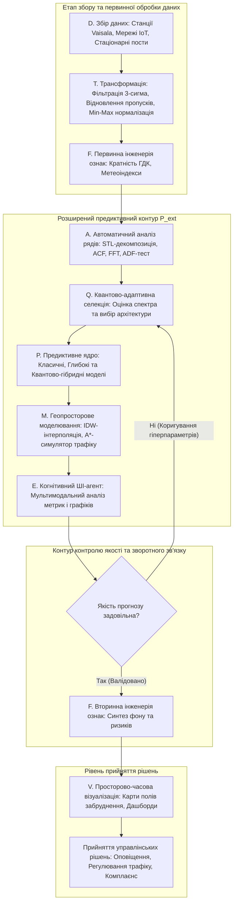

# Змістовий модуль 1. Системи збору та первинного аналізу даних в екологічному моніторингу

# Тема 1. Сучасні концепції цифровізації екологічного моніторингу

---

## 1.1. Структура та рівні екологічного моніторингу: державний, муніципальний, локальний, громадський

### Основний зміст та теоретичний базис
Сучасний розвиток урбанізованих територій супроводжується неперервним зростанням антропогенного навантаження на природне середовище, що вимагає якісної перебудови підходів до спостереження за станом біосфери. Традиційна парадигма моніторингу, яка десятиліттями базувалася на пасивній ретроспективній фіксації забруднення, вичерпала свій потенціал і не здатна забезпечити своєчасне запобігання надзвичайним екологічним ситуаціям. Здобувачі вищої освіти в межах даного освітнього компонента мають засвоїти, що сучасна парадигма екологічного контролю ґрунтується на переході від констатуючого збору даних до проактивного, предиктивного та прескриптивного управління якістю довкілля на основі наскрізної цифровізації.

Організаційна структура сучасного екологічного моніторингу являє собою багаторівневу ієрархічну систему, яка інтегрує державний, муніципальний, локальний та громадський рівні спостереження. Кожен із цих рівнів характеризується специфічними цілями, просторово-часовою дискретизацією, приладовою базою та юридичною силою отриманих результатів. 

```
                                  [ Рівні екологічного моніторингу ]
                                                  |
         +------------------------+---------------+------------------------+
         |                        |                                        |
[ Державний рівень ]     [ Муніципальний рівень ]               [ Локальний рівень ]
(УкрГМЦ, ЦГО; редкісні   (Автоматизовані пости Vaisala;         (Санітарно-захисні зони;
 точки, ручний відбір)   висока точність, 1-20 хв дискретизація) промислові газоаналізатори)
                                                                           |
                                                                [ Громадський рівень ]
                                                                (EcoCity, SaveEcoBot;
                                                                 велика щільність, IoT-сенсори)
```

Державний рівень моніторингу в Україні традиційно реалізується підрозділами Державної гідрометеорологічної служби (зокрема Центральною геофізичною обсерваторією імені Бориса Срезневського та Українським гідрометеорологічним центром). Спостереження на цьому рівні проводяться переважно на стаціонарних постах за фіксованим регламентом із дискретним відбором проб три-чотири рази на добу (о 01:00, 07:00, 13:00 та 19:00) шість днів на тиждень. Отримані проби підлягають подальшому лабораторному хімічному аналізу, що забезпечує високу метрологічну достовірність та юридичну легітимність, проте створює значну часову затримку (латентність) між моментом викиду та формуванням аналітичного звіту. Така часова розрідженість унеможливлює ідентифікацію короткочасних залпових викидів та оперативне реагування на динамічні зміни якості повітря.

Муніципальний рівень моніторингу покликаний ліквідувати часовий розрив державного рівня в межах окремих міських агломерацій. Його основу складають автоматизовані вимірювальні комплекси високого класу точності, такі як автоматичні станції моніторингу atmospheric air серії Vaisala AQT420 або AQT530, інтегровані з метеорологічними комплексами Vaisala WXT530. Муніципальні системи здійснюють безперервний збір інформації щодо концентрації базових полютантів, серед яких ключове значення мають діоксид азоту ($\text{NO}_2$), оксид вуглецю ($\text{CO}$), сірчистий ангідрид ($\text{SO}_2$), приземний озон ($\text{O}_3$), а також дрібнодисперсні фракції пилу ($\text{PM}_{2.5}$ та $\text{PM}_{10}$) у поєднанні з метеорологічними параметрами (температура, вологість, швидкість і напрямок вітру, атмосферний тиск). Первинна дискретизація вимірювань становить 1 хвилину з подальшим програмним агрегуванням у 20-хвилинні, годинні, добові та місячні інтервали. 

Локальний (об'єктовий) рівень охоплює системи моніторингу безпосередньо в зонах впливу великих промислових підприємств (наприклад, нафтопереробних заводів, гірничо-збагачувальних комбінатів, металургійних підприємств) та їхніх санітарно-захисних зонах. Даний рівень орієнтований на контроль специфічних маркерів виробництва (формальдегід, фенол, сірководень, важкі метали) за допомогою промислових стаціонарних газоаналізаторів або мобільних екологічних лабораторій типу ПМЕЛ. 

Громадський (індикативний) рівень екологічного моніторингу стрімко розвинувся завдяки технологіям Інтернету речей (IoT) та платформам громадської науки (Citizen Science), таким як EcoCity, SaveEcoBot або Luftdaten. Цей рівень базується на використанні низьковартісних оптичних і електрохімічних мікропроцесорних сенсорів. Головною перевагою громадського моніторингу є надвисока просторова щільність розташування датчиків у житлових кварталах, що дозволяє формувати детальну просторову картину розподілу забруднення. Разом із тим, первинні дані таких сенсорів зазнають суттєвого впливу стохастичного шуму, кліматичного дрейфу нульової точки та гігроскопічного розбухання аерозольних частинок при вологості повітря понад 70 %, що вимагає впровадження спеціалізованих методів математичної калібрації та фільтрації.

Головною науково-прикладною проблемою сучасного екологічного моніторингу є архітектурна та просторова фрагментарність зазначених рівнів. Отримані масиви даних функціонують у ізольованих інформаційних сховищах (data silos), що перешкоджає створенню єдиного аналітичного контуру. Усунення так званих інформаційних «сліпих зон» у міському середовищі вимагає розробки інтегрованих технологій, які здатні об'єднати прецизійні спостереження муніципальних станцій, високу просторову щільність мереж IoT та геопросторові математичні моделі переносу домішок.

| Рівень моніторингу | Типові засоби вимірювань | Дискретизація вимірювань | Просторова щільність | Метрологічний статус даних | Ключові функції в системі |
| :--- | :--- | :--- | :--- | :--- | :--- |
| **Державний** | Стаціонарні пости гідрометслужби, аспіраційні установки, мокрий хімічний аналіз | Дискретна: 3–4 рази на добу, 6 днів на тиждень | Низька (1–3 пости на місто з населенням 250 тис.) | Референтний, юридично легітимний | Базова довгострокова оцінка кліматичного фону, національна звітність |
| **Муніципальний** | Автоматичні сертифіковані станції (Vaisala AQT420/530, Lufft WS600) | Неперервна: 1–20 хв | Середня (3–6 станцій на промислове місто) | Високий, калібрований | Оперативний контроль за перевищенням нормативів, міське планування |
| **Локальний (промисловий)** | Стаціонарні газоаналізатори на джерелах емісій, мобільні лабораторії (ПМЕЛ) | Неперервна або за технологічним регламентом | Локалізована (периметр підприємства та СЗЗ) | Відомчий, контрольно-технологічний | Контроль технологічних регламентів викидів, екологічний комплаєнс |
| **Громадський (IoT)** | Низьковартісні оптичні сенсори (Plantower, Nova SDS), мікроконтролери ESP32 | Квазінеперервна: 1–5 хв | Висока (десятки або сотні приватних вузлів) | Індикативний, несертифікований | Виявлення локальних аномалій, інформування громадськості, первинний скринінг |

Наведена систематизація демонструє необхідність створення гібридних інформаційних технологій, здатних агрегувати гетерогенні дані з різних рівнів спостереження. Використання методів машинного навчання дозволяє коригувати покази низьковартісних IoT-сенсорів на основі калібрувальних коефіцієнтів, отриманих від високоточних муніципальних станцій Vaisala, забезпечуючи формування надійного фундаменту для цифрового аналізу міського середовища.

---

## 1.2. Нормативна база: вимоги Директиви ЄС 2008/50/EC, оновленої AAQD 2024/2881 EC та Постанови КМУ № 827

### Основний зміст та теоретичний базис
Цифровізація екологічного моніторингу та побудова алгоритмічного забезпечення для інтелектуального аналізу даних мають базуватися на суворій відповідності чинним нормативно-правовим актам. Для України стратегічним вектором розвитку є гармонізація національного екологічного законодавства з європейськими нормами в межах імплементації Угоди про асоціацію між Україною та Європейським Союзом. 

Основоположним документом європейського рівня тривалий час виступала Директива 2008/50/ЄС Європейського Парламенту та Ради «Про якість атмосферного повітря та чистіше повітря для Європи». Вона запровадила обов'язковий поділ території на зони й агломерації (території з чисельністю населення понад 250 тисяч осіб або високою густиною заселення), встановила граничні величини для захисту здоров'я людей та екосистем, а також визначила необхідність безперервного інформування населення в режимі реального часу. 

Сучасним етапом європейського нормування є прийняття оновленої Директиви щодо якості атмосферного повітря (Ambient Air Quality Directive — AAQD) 2024/2881/ЄС. Цей регламент суттєво посилив вимоги до гранично допустимих концентрацій полютантів, наблизивши їх до рекомендацій Всесвітньої організації охорони здоров'я (ВООЗ). Зокрема, стандарт AAQD 2024/2881 встановлює поетапне зниження річного ліміту для дрібнодисперсного пилу $\text{PM}_{2.5}$ з $25\text{ }\mu\text{g/m}^3$ до $10\text{ }\mu\text{g/m}^3$, а для діоксиду азоту $\text{NO}_2$ — з $40\text{ }\mu\text{g/m}^3$ до $20\text{ }\mu\text{g/m}^3$. Важливою вимогою оновленої директиви є обов'язкове поєднання натурних інструментальних вимірювань із математичним та просторовим комп'ютерним моделюванням, що надає офіційного юридичного статусу розрахунковим полям концентрацій, отриманим у цифрових інформаційних системах.

В українському правовому просторі ключовим нормативним актом є Постанова Кабінету Міністрів України від 14 серпня 2019 р. № 827 «Деякі питання здійснення державного моніторингу в галузі охорони атмосферного повітря». Цей документ затвердив принципово новий Порядок здійснення моніторингу, що базується на європейських принципах зонування та класифікації режимів оцінювання. Відповідно до Порядку, встановлюються такі регуляторні пороги для кожного забруднювача:
1. Верхній поріг оцінювання (ВПО);
2. Нижній поріг оцінювання (НПО);
3. Граничні величини (Гранично допустимі концентрації — ГДК / MPC);
4. Поріг інформування;
5. Поріг небезпеки (тривоги).

Математична формалізація алгоритмів аналізу відповідності екологічного стану встановленим нормативам охоплює обчислення середніх значень, перевірку фактів перевищення граничних рівнів та ідентифікацію тривалих послідовностей порушень. 

Середня концентрація $\bar{C}_{ij}(t)$ для $i$-го моніторингового поста в агломерації $j$ за часовий інтервал $t$ (наприклад, рік або місяць) визначається за формулою:

$$\bar{C}_{ij}(t) = \frac{1}{N_t} \sum_{k=1}^{N_t} C_{ij}(t_k),$$

де $C_{ij}(t_k)$ — миттєве або первинно усереднене значення концентрації речовини в момент часу $t_k$, $\text{mg/m}^3$ або $\mu\text{g/m}^3$; $N_t$ — загальна кількість фактично зафіксованих вимірювань протягом досліджуваного періоду $t$.

Загальна кількість випадків перевищення гранично допустимих концентрацій ($\text{Exceedance Count}$) за період спостережень розраховується з використанням індикаторної функції:

$$\text{Exceedance Count} = \sum_{k=1}^{N} \mathbb{I}(C_k > \text{MPC}),$$

де $\mathbb{I}(\cdot)$ — індикаторна функція, яка приймає значення $1$, якщо умова істинна, та $0$, якщо хибна; $C_k$ — виміряна концентрація на $k$-му кроці; $\text{MPC}$ — встановлена нормативна гранично допустима концентрація (максимально разова або середньодобова) для аналізованого полютанта.

Для ідентифікації тривалих небезпечних періодів забруднення алгоритм аналізує послідовність бінарних індикаторів $P_{i,j,t} \in \{0, 1\}$:

$$P_{i,j,t} = \begin{cases} 1, & \text{якщо } x_{i,j,t} > G_j, \\ 0, & \text{якщо } x_{i,j,t} \le G_j, \end{cases}$$

де $x_{i,j,t}$ — виміряне значення концентрації $j$-ї речовини на $i$-му пості в момент часу $t$; $G_j$ — нормативне порогове значення для $j$-ї речовини (поріг небезпеки або ГДК).

Обчислення кількості небезпечних періодів тривалого перевищення $L_{i,j}$ за критерієм тривалості $K$ (наприклад, перевищення порогу небезпеки протягом $K = 3$ послідовних годин згідно з Додатком 2 до Постанови № 827 для $\text{SO}_2 \ge 500\text{ }\mu\text{g/m}^3$ або $\text{NO}_2 \ge 400\text{ }\mu\text{g/m}^3$) реалізується за рекурентним правилом підрахунку безперервної послідовності ($\text{streak}$):

$$\text{streak}_t = \begin{cases} \text{streak}_{t-1} + 1, & \text{якщо } P_{i,j,t} = 1, \\ 0, & \text{якщо } P_{i,j,t} = 0. \end{cases}$$

Коли значення $\text{streak}_t$ досягає заданого критичного порогу $K$, лічильник тривалих інцидентів $L_{i,j}$ інкрементується на одиницю, а змінна $\text{streak}_t$ скидається до нуля для запобігання дублюванню тривожних сповіщень.

Для інтегральної оцінки техногенного ризику конкретного моніторингового пункту розраховується середня частота перевищень $R_i$ за всіма $M$ контрольованими забруднюючими речовинами за загальну кількість часових зрізів $T$:

$$R_i = \sum_{j=1}^{M} \frac{C_{i,j}}{T},$$

де $C_{i,j} = \sum_{t=1}^{T} P_{i,j,t}$ — сумарна кількість зафіксованих перевищень нормативу для $j$-ї речовини на $i$-й станції.

Комплексний індекс забруднення атмосфери ($\text{ІЗА}$), що традиційно використовується для категоризації рівня забрудненості повітря, розраховується через приведення концентрацій окремих домішок до шкідливості діоксиду сірки:

$$\text{ІЗА} = \sum_{j=1}^{M} \left( \frac{\bar{C}_j}{\text{ГДК}_j} \right)^{\beta_j},$$

де $\bar{C}_j$ — середньорічна концентрація $j$-ї домішки, $\text{mg/m}^3$; $\text{ГДК}_j$ — середньодобова гранично допустима концентрація $j$-ї домішки, $\text{mg/m}^3$; $\beta_j$ — безрозмірний коефіцієнт ізоефективності, що залежить від класу небезпеки речовини (для 1-го класу $\beta = 1.7$; для 2-го класу $\beta = 1.5$; для 3-го класу $\beta = 1.0$; для 4-го класу $\beta = 0.85$). 

| Показник якості повітря | Норматив України (Постанова КМУ № 827 / ГДК) | Стандарт ЄС (Директива 2008/50/EC) | Цільові орієнтири AAQD 2024/2881 EC | Настанови ВООЗ (Global Air Quality Guidelines) |
| :--- | :--- | :--- | :--- | :--- |
| **$\text{PM}_{2.5}$ (річна середня)** | $15\text{ }\mu\text{g/m}^3$ | $25\text{ }\mu\text{g/m}^3$ | $10\text{ }\mu\text{g/m}^3$ (до 2030 р.) | $5\text{ }\mu\text{g/m}^3$ |
| **$\text{PM}_{2.5}$ (добова середня)** | $25\text{ }\mu\text{g/m}^3$ | Не регламентовано | $25\text{ }\mu\text{g/m}^3$ (дозволено 18 перев./рік) | $15\text{ }\mu\text{g/m}^3$ (дозволено 3–4 дні/рік) |
| **$\text{PM}_{10}$ (річна середня)** | $40\text{ }\mu\text{g/m}^3$ | $40\text{ }\mu\text{g/m}^3$ | $20\text{ }\mu\text{g/m}^3$ | $15\text{ }\mu\text{g/m}^3$ |
| **$\text{NO}_2$ (годинна максимальна)** | $200\text{ }\mu\text{g/m}^3$ | $200\text{ }\mu\text{g/m}^3$ (дозволено 18 перев./рік) | $200\text{ }\mu\text{g/m}^3$ (дозволено 1 перев./рік) | $25\text{ }\mu\text{g/m}^3$ (добова) |
| **$\text{NO}_2$ (річна середня)** | $40\text{ }\mu\text{g/m}^3$ | $40\text{ }\mu\text{g/m}^3$ | $20\text{ }\mu\text{g/m}^3$ | $10\text{ }\mu\text{g/m}^3$ |
| **$\text{SO}_2$ (поріг небезпеки)** | $500\text{ }\mu\text{g/m}^3$ (протягом 3 год) | $500\text{ }\mu\text{g/m}^3$ (протягом 3 год) | $500\text{ }\mu\text{g/m}^3$ (протягом 3 год) | $40\text{ }\mu\text{g/m}^3$ (добова) |

Зіставлення нормативних вимог демонструє стрімке посилення критеріїв екологічної безпеки в європейському просторі. Національна система екологічного моніторингу потребує не лише перегляду граничних порогових концентрацій, а й створення обчислювальних засобів, здатних автоматично детектувати перехід через контрольні рівні та формувати предиктивні сценарії перевищень для запобігання ризикам для здоров'я населення.

---

## 1.3. Концепція «Цифрового двійника міста» (Urban Digital Twin) та архітектура інформаційних екологічних систем

### Основний зміст та теоретичний базис
Найвищим етапом еволюції систем муніципального екологічного менеджменту є впровадження концепції **Цифрового двійника міста** (Urban Digital Twin — UDT). Цифровий двійник являє собою багатошарову, динамічно оновлювану віртуальну репліку фізичного простору міста, яка інтегрує гетерогенні потоки телеметрії від сенсорних мереж, геоінформаційні моделі просторової топології, фізико-хімічні симулятори поширення викидів та алгоритми штучного інтелекту. На відміну від статичних 3D-моделей міської забудови, екологічний цифровий двійник забезпечує зворотний зв'язок у режимі реального часу, дозволяючи моделювати сценарії «що, якщо» (what-if scenarios) та оцінювати ефективність управлінських рішень до їх практичного впровадження.

Фундаментом інтегрованої обробки даних у таких системах є розширена концептуальна модель підготовки та предиктивного моделювання даних (**DPPDMext** — Data Preparation and Predictive Data Modeling extended). Класична модель підготовки та обробки даних формалізується кортежем:

$$\text{DPPDM} = \langle D, T, P, F, V \rangle,$$

де $D$ ($\text{Data}$) — множина первинних екологічних даних, зібраних із сертифікованих автоматичних станцій (Vaisala), стаціонарних постів спостереження та мереж IoT; $T$ ($\text{Transformation}$) — множина процедур нормалізації, очищення від шумів, інтерполяції та заповнення пропусків; $P$ ($\text{Prediction}$) — набір предиктивних методів оцінювання часових рядів; $F$ ($\text{Feature Engineering}$) — множина розрахункових індикаторів, сформованих на базі первинних спостережень (кратність ГДК, індекси AQI, коваріаційні матриці); $V$ ($\text{Visualization}$) — блок просторово-часової візуалізації результатів у вигляді карт інтенсивності, графіків динаміки та звітів.

Для подолання проблеми низької прогностичної точності класичних підходів на малих і зашумлених вибірках модель DPPDM розширюється до формалізму **DPPDMext**, у якому фаза прогнозування набуває багатокомпонентної структури:

$$P_{\text{ext}} = \langle A, Q, M, E, P \rangle,$$

$$\text{DPPDMext} = \langle D, T, F, (A, Q, M, E, P), F, V \rangle,$$

де елементи розширеного контуру виконують такі специфічні аналітичні завдання:
* Блок $A$ ($\text{Automatic Analysis}$) здійснює глибокий статистичний аналіз часових рядів (розрахунок математичного сподівання $\mu$, дисперсії $\sigma^2$, міжквартильного розмаху $\text{IQR}$, автокореляції $\text{ACF}(k)$, перетворення Фур'є $\text{FFT}$ та тесту Дікі-Фуллера $\text{ADF}$) для автоматичної класифікації ряду за наявністю тренду, сезонності та стаціонарності.
* Блок $Q$ ($\text{Quantum-Adaptive Selection}$) реалізує автоматичний підбір оптимального прогностичного ядра, здійснюючи динамічну маршрутизацію між класичними статистичними моделями (AutoARIMA, ETS, BATS), штучними нейронними мережами (LSTM, GRU, CNN, Transformer) та квантово-гібридними архітектурами залежно від спектральних властивостей ряду та обсягу вибірки.
* Блок $M$ ($\text{Modeling of Virtual Stations}$) виконує геопросторове моделювання за допомогою методу зворотних зважених відстаней (IDW) та симуляції динамічних джерел (автомобільного трафіку на основі алгоритму $A^*$), формуючи синтетичні просторові ознаки для неконтрольованих сегментів території.
* Блок $E$ ($\text{Expert Evaluation}$) функціонує як когнітивний аналітичний агент на базі великих мовних (LLM) та мультимодальних (VLM) моделей, який здійснює верифікацію числових метрик похибок ($\text{MSE}, \text{MAE}, R^2$) і графічних розподілів, формуючи рекомендації щодо адаптації гіперпараметрів моделей.
* Блок $P$ ($\text{Predictive Core}$) безпосередньо генерує прогнози значень екологічних параметрів на заданий горизонт $H$.


*Рисунок 1 — Структурно-функціональна схема розширеного аналітичного контуру DPPDMext у складі цифрового двійника міста*

На наведеній схемі продемонстровано замкнений цикл функціонування інформаційної технології DPPDMext. Процес розпочинається з отримання гетерогенних потоків екологічної інформації (блок $D$), де «сирі» показники нормалізуються у діапазон $[0, 1]$ та очищуються від артефактів за правилом $3\sigma$ (блок $T$). Після формування первинних матриць ознак (блок $F_1$) дані надходять до розширеного блоку прогнозування $P_{\text{ext}}$. 

На стадії $A$ визначаються ключові математичні характеристики часового ряду: рівень нестаціонарності та наявність гармонічних складових. Отриманий аналітичний профіль передається блоку $Q$, який обирає оптимальну предиктивну модель. Якщо ряд характеризується високою стабільністю та дефіцитом спостережень (як у випадку атмосферного тиску чи вологості), перевага надається квантово-гібридним моделям (наприклад, Quantum-LSTM або Quantum-Transformer), де класичний шар вилучення ознак сполучається з варіаційною квантовою схемою (VQC), параметризованою через повороти кубітів $R_X, R_Y, R_Z$. Для високоентропійних зашумлених рядів (температура, хаотичні сплески $\text{CO}$) блок $Q$ активує статистичні моделі з процедурами автодиференціювання (AutoARIMA).

Паралельно блок $M$ формує фонові просторові поля концентрацій за методом IDW та генерує динамічні індекси щільності транспортних потоків за допомогою симулятора на базі алгоритму пошуку шляху $A^*$ та Гаусового розсіювання викидів:

$$\text{new\_pollution}_{i,j} = \frac{\sum_{k=-1}^{1} \sum_{l=-1}^{1} \text{pollution}_{i+k,j+l} \cdot \text{gaussian\_kernel}_{k+1,l+1}}{\sum_{k=-1}^{1} \sum_{l=-1}^{1} \text{gaussian\_kernel}_{k+1,l+1}},$$

де $\text{gaussian\_kernel}$ — ваговий фільтр розсіювання розмірністю $3 \times 3$:

$$\text{gaussian\_kernel} = \begin{bmatrix} 0 & 1 & 0 \\ 1 & 2 & 1 \\ 0 & 1 & 0 \end{bmatrix}.$$

Отримані прогностичні та просторові результати передаються когнітивному агенту $E$, який оцінює якість моделей за метриками $\text{MSE}$, $\text{MAE}$, $R^2$ та графіками розподілу залишків $y_{\text{true}} - y_{\text{pred}}$. У разі виявлення деградації точності агент формує рекомендації та повертає систему на етап переналаштування гіперпараметрів. За умови успішної верифікації результати передаються до блоку вторинної інженерії ознак $F_2$ та підсистеми візуалізації $V$, що забезпечує органи місцевого самоврядування високоточними аналітичними даними для оперативного реагування на екологічні загрози.

---

### Питання для самоперевірки та аналітичного осмислення

1. Які фундаментальні обмеження класичної схеми дискретного відбору проб на постах державної гідрометеорологічної служби зумовили необхідність переходу до автоматизованого муніципального моніторингу в режимі реального часу?
2. У чому полягає системна відмінність між підходами до нормування якості атмосферного повітря за критеріями національного законодавства (Постанова КМУ № 827) та оновленої європейської Директиви AAQD 2024/2881/ЄС?
3. Поясніть математичний та алгоритмічний зміст процедури виявлення тривалих небезпечних періодів перевищення граничних концентрацій за рекурентною залежністю функції $\text{streak}_t$.
4. Охарактеризуйте структуру кортежу розширеної концептуальної моделі $\text{DPPDMext}$. Яку роль відіграє блок інтелектуального аналізу часових рядів $A$ у виборі оптимальної прогностичної архітектури?
5. Чому використання квантово-гібридних нейромережевих моделей (наприклад, VQC-LSTM) демонструє суттєву перевагу при прогнозуванні стабільних циклічних показників (вологість, атмосферний тиск) на малих вибірках, але зазнає деградації точності на високоентропійних зашумлених рядах?
6. Як саме інтеграція геопросторової інтерполяції (IDW) та симуляції транспортних потоків на основі алгоритму $A^*$ у блоці $M$ дозволяє виявити інформаційні «сліпі зони» діючої мережі моніторингу та оптимізувати розміщення нових вимірювальних станцій?
7. Які функціональні можливості та методологічні обмеження має застосування когнітивного мультимодального LLM/VLM-агента у контурі експертної оцінки якості екологічного моделювання?