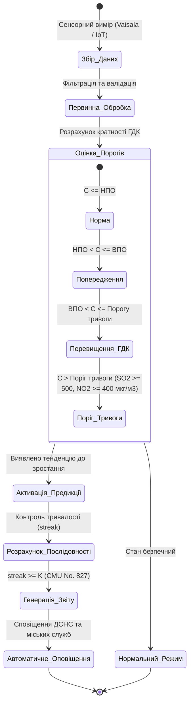
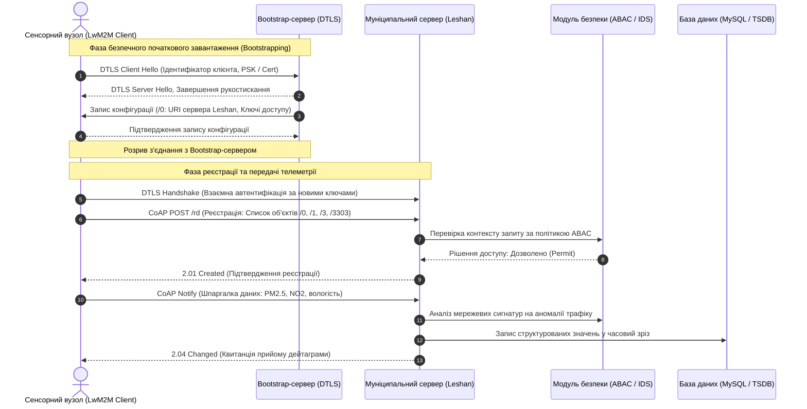

# Тема 1. Сучасні концепції цифровізації екологічного моніторингу: багаторівневі архітектури, нормативні стандарти та парадигма DPPDMext

## Мета лекції
Формування у здобувачів вищої освіти системних теоретичних знань і фундаментальних прикладних інженерних компетентностей щодо проектування, архітектурної побудови та алгоритмічного забезпечення сучасних цифрових систем екологічного моніторингу урбанізованих територій в умовах інтенсивних техногенних трансформацій та жорстких вимог європейської нормативної гармонізації. Лекція спрямована на вивчення принципів конвергенції гетерогенних мереж Інтернету речей від високоточних автоматичних метеостанцій Vaisala до індикативних сенсорів громадського контролю, освоєння регуляторних рамок Директиви ЄС AAQD 2024/2881 EC та Постанови Кабінету Міністрів України № 827, а також на глибоку математичну формалізацію розширеної концептуальної моделі DPPDMext, яка забезпечує наскрізний цикл від адаптивного предиктивного моделювання часових рядів до геопросторової імітації цифрових двійників міст і автоматизованої підтримки прийняття рішень за допомогою когнітивних агентів.

## Очікувані результати навчання
1. **Знання та розуміння.** Здобувачі вищої освіти засвоять ієрархічні засади функціонування багаторівневих комплексів моніторингу атмосферного повітря, концептуальні положення оновлених європейських і національних нормативних документів, а також математичні структури представлення екологічних об'єктів і аналітичних процесів у формі формальних кортежних моделей.
2. **Застосування.** Здобувачі набудуть практичних умінь використовувати алгоритмічний апарат для розрахунку кратностей перевищення гранично допустимих концентрацій полютантів, виявляти довготривалі часові послідовності небезпечних викидів за рекурентними правилами, а також конфігурувати енергоефективні та безпечні комунікаційні протоколи сімейства LwM2M для транспортування телеметрії від сенсорного рівня до хмарних сервісів.
3. **Аналіз.** Здобувачі зможуть критично досліджувати просторово-часову структуру, метрологічну повноту та стохастичну зашумленість гетерогенних потоків даних, аналізувати спектральні властивості часових рядів за допомогою кореляційних функцій і тестів на стаціонарність із метою раціонального вибору прогностичних архітектур між класичними статистичними моделями, глибокими нейронними мережами та квантово-гібридними ядрами.
4. **Оцінювання та синтез.** Здобувачі оволодіють здатністю комплексно оцінювати ефективність усунення інформаційних сліпих зон мережі спостережень засобами геопросторової інтерполяції та симуляції транспортних потоків алгоритмом А-зірка, проектувати модульні структури цифрових двійників міських систем і синтезувати механізми когнітивної інтерпретації результатів моделювання на основі мультимодальних моделей штучного інтелекту.

---

## Детальний покроковий план лекції

### 1. Теоретико-концептуальний базис. Архітектурні рівні, нормативні стандарти та формалізація інформаційного простору
* 1.1. Багаторівнева ієрархія систем спостереження за станом атмосферного повітря, яка охоплює зіставлення державного, муніципального, локально-промислового та громадського сегментів за критеріями просторово-часової дискретизації, топологічної структури та метрологічного статусу даних.
* 1.2. Нормативно-правовий комплаєнс у сфері цифровізації екологічного контролю, що включає порівняльний аналіз Директиви ЄС 2008/50/EC, оновлених положень директиви AAQD 2024/2881 EC та вітчизняної Постанови Кабінету Міністрів України № 827 щодо зонування територій і надання правового статусу математичному комп'ютерному моделюванню.
* 1.3. Математичний апарат контролю екологічних нормативів, побудований на формалізації індикаторних функцій перевищення порогових меж, алгоритмах ідентифікації тривалих безперервних інцидентів підвищеної концентрації полютантів та обчисленні комплексних індексів техногенного ризику.
* 1.4. Базова концептуальна модель підготовки та обробки даних DPPDM, що формалізується у вигляді теоретико-множинного кортежу операцій над первинними джерелами вимірювань, механізмами фільтрації, предиктивними алгоритмами, просторово-часовою інженерією ознак та інтерфейсами аналітичної візуалізації.

### 2. Методологія та аналіз граничних умов. Розширена парадигма DPPDMext, системні обмеження та мультимодальний аналіз
* 2.1. Архітектурна композиція розширеної парадигми DPPDMext, яка інтегрує предиктивний контур із механізмами автоматичного статистичного скринінгу рядів, адаптивної селекції моделей, геопросторового моделювання віртуальних станцій та когнітивного аудиту результатів.
* 2.2. Забезпечення цілісності та безпеки телеметричної інфраструктури, що базується на впровадженні стандарту Lightweight M2M зі стеком CoAP і криптографічним захистом DTLS для подолання апаратних обмежень оперативної пам'яті та енергоспоживання периферійних мікроконтролерів.
* 2.3. Синтез просторового контексту цифрового двійника міста через інтеграцію зворотньо-зваженої просторової інтерполяції вимірювальних полів та динамічного імітаційного моделювання автомобільних викидів на базі графового алгоритму А-зірка та Гаусового розсіювання в сітковому просторі.
* 2.4. Критичні бар'єри та граничні умови практичного застосування предиктивних технологій, пов'язані з явищем прокляття розмірності класичних нейромереж на малих вибірках, чутливістю статистичних методів до апаратного шуму, експоненційними обчислювальними витратами квантової симуляції та наявністю фізичних інформаційних сліпих зон у міських сенсорних мережах.
* 2.5. Контур когнітивної верифікації якості моделювання, що функціонує на базі мультимодальних моделей комп'ютерного зору й мовних агентів великих розмірностей з архітектурою Retrieval-Augmented Generation для аналізу числових похибок, дослідження геопросторових карт і формування людино-орієнтованих управлінських рекомендацій.

### 3. Практичний індустріальний / фаховий кейс. Цифровізація екологічного моніторингу промислово-транспортного вузла
**Тема наскрізної задачі.** «Проектування системи комплексного моніторингу та адаптивного прогнозування якості атмосферного повітря Кременчуцької міської агломерації на основі інтеграції автоматичних станцій Vaisala, індикативних вузлів EcoCity та геопросторового моделювання транспортного навантаження в архітектурному просторі моделі DPPDMext»


## 1. Теоретико-концептуальний базис. Архітектурні рівні, нормативні стандарти та формалізація інформаційного простору

### 1.1. Багаторівнева ієрархія систем спостереження за станом атмосферного повітря
Еволюція урбанізованих екосистем в епоху постіндустріального розвитку характеризується нелінійним зростанням техногенного навантаження, що докорінно змінює функціональні вимоги до архітектури комп'ютеризованих систем моніторингу довкілля. Традиційний ретроспективний підхід, заснований на констатуючій лабораторній фіксації параметрів забруднення, демонструє критичну часову латентність і виявляється неспроможним у задачах запобігання надзвичайним екологічним ситуаціям. Сучасна інженерія знань у сфері прикладного екологічного моніторингу оперує концепцією замкненого кіберфізичного циклу, де первинні потоки вимірювальних даних трансформуються у проактивні сценарії прескриптивного управління міським середовищем.

Організаційна структура збору даних про стан атмосферного басейну базується на суворій чотирирівневій ієрархічній моделі, що охоплює державний, муніципальний, локальний та громадський рівні спостереження. 

Державний сегмент моніторингу в Україні функціонує в межах підрозділів Державної гідрометеорологічної служби, зокрема Центральної геофізичної обсерваторії імені Бориса Срезневського. Спостереження тут здійснюються на стаціонарних постах за фіксованим дискретним регламентом із відбором проб три або чотири рази на добу за допомогою аспіраційних установок із подальшим лабораторним фізико-хімічним аналізом. Цей рівень забезпечує найвищу метрологічну достовірність та юридичну легітимність отриманих показників, проте має високу просторову розрідженість і часову затримку, що унеможливлює ідентифікацію раптових аварійних або нічних залпових викидів промислових підприємств.

Муніципальний рівень покликаний ліквідувати часовий розрив державного сегмента за рахунок розгортання автоматизованих вимірювальних станцій високого класу точності, таких як апаратно-програмні комплекси Vaisala серій AQT420 та AQT530, синхронізовані з багатопараметричними метеорологічними станціями WXT530. Ці комплекси забезпечують безперервну секундну або хвилинну дискретизацію вимірювань газових маркерів, серед яких ключову роль відіграють діоксид азоту, оксид вуглецю, діоксид сірки, приземний озон, а також тверді аерозольні фракції пилу різного діаметра. Інформаційно-аналітичні сервери муніципалітетів виконують первинну фільтрацію і структурування таких потоків даних, агрегуючи їх у стандартизовані інтервали.

Локальний або об'єктовий сегмент формується автоматизованими системами екологічного контролю промислових гігантів, що зосереджені безпосередньо на джерелах організованих емісій та по периметру санітарно-захисних зон. Основним інструментарієм тут виступають стаціонарні промислові газоаналізатори неперервної дії або пересувні лабораторії оперативного екологічного контролю, що спеціалізуються на виявленні специфічних вузькогалузевих полютантів, таких як фенол, формальдегід, сірководень, бензол, толуол або сполуки важких металів.

Громадський індикативний сегмент отримав бурхливий розвиток у межах концепції цивільної науки завдяки платформам EcoCity, SaveEcoBot, Luftdaten та SenseYourCity. Він базується на розподілених мережах низьковартісних мікроелектронних сенсорів під керуванням мікроконтролерів класів ESP32 або STM32. Головна системна перевага даного сегмента полягає у формуванні надщільного топологічного покриття житлової забудови, що забезпечує візуалізацію просторового розподілу емісій із деталізацією до міського кварталу. Проте сигнали таких пристроїв схильні до стохастичного дрейфу нульової точки, температурної нестабільності напівпровідникових сенсорів та гігроскопічного розбухання твердих часток при високій відносній вологості повітря, тому їхнє використання без алгоритмічної калібрації відносно еталонних станцій призводить до системних похибок.

```mermaid
flowchart TD
    subgraph Data_Sources ['Джерела екологічної телеметрії']
        S1['Державні пости гідрометслужби (ЦГО)']
        S2['Муніципальні автоматичні станції (Vaisala AQT/WXT)']
        S3['Локальні промислові системи та СЗЗ (ПМЕЛ)']
        S4['Громадські IoT-сенсорні мережі (EcoCity, SaveEcoBot)']
    end

    subgraph Aggregation_Layer ['Рівень гетерогенної конвергенції']
        GW1['Мережеві шлюзи та API-адаптери']
        LwM2M['LwM2M/CoAP/DTLS брокер']
        REST['RESTful/HTTPS контролери']
    end

    subgraph Data_Lake ['Єдиний аналітичний простір']
        DB[(Реляційне сховище SQL та часові зрізи)]
        PreProc['Модуль нормалізації, фільтрації 3-сигма та калібрації']
    end

    S1 -->|Дискретні бюлетені| REST
    S2 -->|Хвилинні потоки API| REST
    S3 -->|Телеметрія SCADA| GW1
    S4 -->|Широкомовні пакети IoT| LwM2M

    GW1 --> PreProc
    LwM2M --> PreProc
    REST --> PreProc
    PreProc --> DB
```

> **ПРАКТИЧНИЙ ЯКІР:** У Кременчуцькому промисловому вузлі інтеграція даних чотирьох постів індикативного контролю мережі EcoCity та трьох референтних автоматичних станцій Vaisala AQT530 комунального підприємства дозволила виявити раніше не зафіксовані локальні нічні викиди діоксиду сірки в районі нафтопереробного комплексу, які повністю нівелювалися стандартним триразовим денним графіком відбору проб державної спостережної мережі.

Головним науково-технічним бар'єром сучасної цифровізації залишається просторова та архітектурна фрагментарність зазначених рівнів, коли масиви даних накопичуються в ізольованих сховищах різної структури. Подолання інформаційної сліпоти вимагає розгортання єдиних аналітичних платформ, здатних вирішувати конфлікти масштабування та синхронізації різнорідної інформації.

---

### 1.2. Нормативно-правовий комплаєнс у сфері цифровізації екологічного контролю
Розробка інформаційних технологій моніторингу довкілля вимагає абсолютної адаптації архітектурних рішень до міжнародного та національного нормативно-правового поля. Для України базовим вектором є гармонізація екологічного законодавства з регуляторними актами Європейського Союзу в межах виконання Угоди про асоціацію та конвергенції з регламентами Європейського зеленого курсу.

Фундаментальним актом європейської політики якості атмосферного повітря тривалий час виступала Директива 2008/50/EC Європейського Парламенту та Ради «Про якість атмосферного повітря та чистіше повітря для Європи». Цей документ увів поняття агломерацій, встановив граничні рівні концентрацій небезпечних речовин та закріпив розподіл території на зони різного ступеня забруднення для диференційованого управління якістю атмосфери.

Якісним проривом у сфері автоматизації стало прийняття нової Директиви щодо якості атмосферного повітря AAQD 2024/2881 EC від 11 квітня 2024 року. Оновлена директива спрямована на посилення екологічних стандартів шляхом поступового зниження граничних меж до рівнів, рекомендованих Всесвітньою організацією охорони здоров'я. Зокрема, цільові нормативи середньорічної концентрації дрібнодисперсного пилу фракції PM2.5 знижено з 25 мкг/м³ до 10 мкг/м³, а для діоксиду азоту встановлено цільовий ліміт на рівні 20 мкг/м³ замість попередніх 40 мкг/м³. Критично важливою новелою Директиви AAQD 2024/2881 EC є офіційне закріплення юридичного статусу математичного просторового моделювання та використання чисельних розрахунків нарівні з інструментальними спостереженнями, що створює нормативну основу для впровадження систем цифрових двійників міст.

Національний рівень нормування визначається Постановою Кабінету Міністрів України від 14 серпня 2019 року № 827 «Деякі питання здійснення державного моніторингу в галузі охорони атмосферного повітря». Дана постанова імплементувала європейські засади зонування і визначила багаторівневу градацію нормативів, що включає нижній та верхній пороги оцінювання, граничні значення для захисту здоров'я, а також поріг інформування і поріг тривоги для небезпечних домішок. Додатково нормативні положення регулюються Наказом Міністерства внутрішніх справ України від 21 квітня 2021 року № 300, що затверджує порядок класифікації та кодування пунктів спостережень, що безпосередньо впливає на структуру таблиць реляційних баз даних.



Невідповідність просторової сітки пунктів спостереження та дефіцит автоматизації звітності за Постановою № 827 тривалий час стримували розвиток предиктивних систем в органах місцевого самоврядування.

| Нормативний регламент / Рівень системи | Граничні нормативи ключових маркерів | Вимоги до цифрової обробки та моделювання | Приклад з реальної практики |
| :--- | :--- | :--- | :--- |
| **Директива ЄС 2008/50/EC** | PM2.5: 25 мкг/м³ (рік); NO2: 40 мкг/м³ (рік); SO2: 350 мкг/м³ (година) | Обов'язкове виділення зон та агломерацій; фіксовані вимірювання в точках з високим антропогенним навантаженням | Муніципальна система контролю якості повітря міста Софія (Болгарія) з базовою веб-візуалізацією |
| **Оновлена Директива ЄС AAQD 2024/2881 EC** | PM2.5: 10 мкг/м³ (рік); NO2: 20 мкг/м³ (рік); PM10: 20 мкг/м³ (рік) | Інтеграція натурних даних із просторовими комп'ютерними моделями, надання юридичної сили прогнозним картам | Проект Urban Air Quality Twin у місті Гельсінкі з динамічною симуляцією транспортних шлейфів |
| **Постанова КМУ № 827** | Прив'язка до ГДК; встановлення нижнього/верхнього порогів оцінювання та порогів тривоги | Визначення випадків перевищень за ковзними середніми; автоматизована генерація оперативних та річних звітів | Модернізація міської системи моніторингу КП «НДЦ» у місті Кременчук із автоматизацією протоколів |
| **Громадський моніторинг (EcoCity)** | Індикативні межі за формулами міжнародного індексу AQI US EPA | Секундна/хвилинна передача за відкритими API; використання агрегації даних у 20-хвилинні зрізи | Всеукраїнська інтерактивна мережа чат-ботів та онлайн-мап SaveEcoBot для експрес-інформування громадян |

> **ТИПОВА ПОМИЛКА:** Поширена хибна практика розробників полягає у безпосередньому використанні сирих показників із низьковартісних сенсорів громадського моніторингу для прийняття адміністративно-правових рішень щодо накладення штрафних санкцій на промислові підприємства. Первинні дані побутових датчиків юридично вважаються суто індикативними через відсутність процедур періодичної державної повірки, тому за нормами Постанови КМУ № 827 вони можуть слугувати лише сигналом для виїзду мобільної сертифікованої лабораторії з еталонним обладнанням.

---

### 1.3. Математичний апарат контролю екологічних нормативів
Формалізація алгоритмічних процедур оцінки стану атмосферного повітря ґрунтується на математичному апараті теорії ймовірностей, математичної статистики та цифрової обробки часових рядів. Первинний масив спостережень формується у вигляді тривимірної матриці вимірювань просторово-часового контенту:

$$X = \left\{ x_{i,j,t} \right\}, \quad i \in \{1, \dots, N\}, \; j \in \{1, \dots, M\}, \; t \in \{1, \dots, T\},$$

де змінна $x_{i,j,t}$ позначає виміряну концентрацію $j$-ї забруднюючої речовини на $i$-му спостережному пункті в часовий момент $t$; $N$ задає загальну кількість активних фізичних станцій спостереження; $M$ визначає кількість контрольованих хімічних та фізичних параметрів; параметр $T$ регламентує довжину часового горизонту дискретизації.

Для нівелювання впливу високочастотних флуктуацій та апаратного шуму здійснюється часове агрегування показників за визначені часові інтервали. Середня концентрація $\bar{C}_{ij}(t)$ для $i$-го моніторингового поста за визначений період $t$ розраховується відповідно до співвідношення:

$$\bar{C}_{ij}(t) = \frac{1}{N_t} \sum_{k=1}^{N_t} C_{ij}(t_k),$$

де величина $C_{ij}(t_k)$ відповідає значенню концентрації у дискретній точці виміру $t_k$, а параметр $N_t$ відображає кількість фактично зафіксованих коректних вимірів протягом інтервалу інтегрування.

Перевірка виконання нормативних вимог реалізується за допомогою оператора індикаторної функції. Факт перевищення гранично допустимої концентрації фіксується булевою змінною $P_{i,j,t}$:

$$P_{i,j,t} = \begin{cases} 1, & \text{якщо } x_{i,j,t} > G_j, \\ 0, & \text{якщо } x_{i,j,t} \le G_j, \end{cases}$$

де величина $G_j$ репрезентує порогову концентрацію для $j$-го полютанта, встановлену санітарно-гігієнічними регламентами або порогом тривоги. Загальна кількість інцидентів перевищення $C_{i,j}$ за досліджуваний період становить:

$$C_{i,j} = \sum_{t=1}^{T} P_{i,j,t}.$$

Особливе значення для безпеки життєдіяльності має ідентифікація неперервних у часі фаз небезпечного забруднення, що можуть призвести до гострої інтоксикації населення. Алгоритм підрахунку таких станів базується на рекурентній функції накопичення послідовності порушень, що визначається наступним правилом:

$$\text{streak}_t = \begin{cases} \text{streak}_{t-1} + 1, & \text{якщо } P_{i,j,t} = 1, \\ 0, & \text{якщо } P_{i,j,t} = 0. \end{cases}$$

Якщо значення лічильника $\text{streak}_t$ досягає нормативно заданого критичного часового порогу $K$, у системі ініціюється фіксація тривалого небезпечного інциденту, лічильник макропорушень $L_{i,j}$ інкрементується, а робочий параметр $\text{streak}_t$ скидається до початкового стану.

Для комплексного агрегованого порівняння техногенної напруженості між окремими топологічними сегментами міської інфраструктури обчислюється індекс частоти перевищень $R_i$:

$$R_i = \sum_{j=1}^{M} \frac{C_{i,j}}{T},$$

який інтегрує частоту виходу за межі нормативів за всіма досліджуваними речовинами на $i$-му пості.

Класичне узагальнення токсикологічного навантаження реалізується через розрахунок комплексного індексу забруднення атмосфери, який перетворює абсолютні концентрації речовин різного класу небезпеки у безрозмірну ізоефективну шкалу щодо діоксиду сірки:

$$\text{ІЗА} = \sum_{j=1}^{M} \left( \frac{\bar{C}_j}{\text{ГДК}_j} \right)^{\beta_j},$$

де $\bar{C}_j$ позначає середню концентрацію $j$-ї домішки; $\text{ГДК}_j$ задає норматив гранично допустимої концентрації; $\beta_j$ є безрозмірним коефіцієнтом шкідливості, значення якого строго дорівнює 1.7 для хімічних сполук 1-го класу небезпеки, 1.5 для 2-го класу, 1.0 для 3-го класу та 0.85 для речовин 4-го класу небезпеки.

Міжпараметричні зв'язки між різними домішками визначаються на базі матриці парних лінійних кореляцій Пірсона:

$$r_{ij} = \frac{\text{Cov}(x_i, x_j)}{\sigma_{x_i} \sigma_{x_j}} = \frac{\sum_{t=1}^{T} (x_{i,t} - \mu_i)(x_{j,t} - \mu_j)}{\sqrt{\sum_{t=1}^{T} (x_{i,t} - \mu_i)^2} \sqrt{\sum_{t=1}^{T} (x_{j,t} - \mu_j)^2}},$$

де вираз $\text{Cov}(x_i, x_j)$ задає коваріацію між рядами двох хімічних маркерів, а параметри $\sigma_{x_i}$ та $\sigma_{x_j}$ являють собою середньоквадратичні відхилення відповідних показників.

> **КОНТРОЛЬНЕ ПИТАННЯ:** Чому використання простого інтегрального індексу частоти перевищень $R_i$ є алгоритмічно недостатнім для своєчасної активації систем автоматичного оповіщення цивільного захисту, і яка фундаментальна математична перевага закладена в рекурентний механізм $\text{streak}_t$?

<details markdown="1">
<summary>Розгорнути аналіз / відповідь</summary>

**Правильний варіант: Механізм $\text{streak}_t$ враховує динамічну неперервність (тривалість) токсичного впливу в часі, тоді як індекс $R_i$ фіксує лише сумарну статистичну частоту подій.**

1. Токсикологічна дія більшості хімічних агентів на організм людини залежить не лише від амплітуди дози, а й від експозиційного часу. Короткочасний високоамплітудний викид тривалістю 10 хвилин, спричинений поривом вітру, активує лічильник індикаторної функції $P_{i,j,t}$, але після розсіювання атмосфера відновлюється. Натомість неперервне перевищення концентрації діоксиду сірки понад 500 мкг/м³ протягом трьох послідовних годин ($K = 3$) формує стан прямої загрози життю, що регламентовано Постановою КМУ № 827 як поріг тривоги. Рекурентна модель $\text{streak}_t$ дозволяє ідентифікувати саме стійкий часовий процес небезпечного накопичення токсиканта, відфільтровуючи одиничні стохастичні викиди.

2. Аналіз дистракторів:
   * Індекс $R_i$ ділить суму всіх епізодів $C_{i,j}$ на довжину горизонту $T$. Якщо протягом місяця відбулося 30 короткочасних перевищень по 5 хвилин, $R_i$ покаже таке саме числове значення, як і у випадку одного критичного безперервного викиду тривалістю 150 хвилин, проте ступінь екологічної небезпеки та протоколи реагування у цих сценаріях кардинально відрізняються.
   * Комплексний індекс ІЗА також базується на довгострокових середньорічних концентраціях $\bar{C}_j$ і є суто стратегічним показником планування, що абсолютно непридатний для задач оперативного автоматизованого реагування в реальному часі.

</details>

---

### 1.4. Базова концептуальна модель підготовки та обробки даних DPPDM
Для створення цілісного математичного та програмного середовища муніципального екологічного моніторингу процес обробки гетерогенної інформації формалізується у вигляді теоретико-множинних моделей. Базова концептуальна модель цільової екологічної системи представляється у формі кортежу:

$$T_1 = \langle ES, I, P, R, CM \rangle,$$

де елемент $ES$ позначає об'єкт екологічного спостереження, яким може виступати повітряний басейн урбоекосистеми, промислова зона чи річковий басейн; множина $I$ регламентує сукупність вимірюваних індикаторів фізико-хімічного стану системи; компонент $P$ задає множину динамічних явищ і процесів масопереносу в атмосфері; параметр $R$ формалізує взаємозв'язки та залежності між показниками і процесами емісії; елемент $CM$ являє собою концептуальну онтологічну схему функціонування природно-техногенного комплексу.

Уніфікований запис одиничного результату вимірювального процесу структурується як інформаційний кортеж:

$$M = \langle O, C, M_{\text{meth}}, T, L, S, I_{\text{nt}}, U \rangle,$$

де $O$ задає фізичний об'єкт моніторингу; $C$ фіксує перелік характеристик хімічного складу середовища; параметр $M_{\text{meth}}$ визначає конкретний апаратний метод вимірювання; змінна $T$ регламентує точну часову мітку зняття показника; координата $L$ забезпечує геопросторову прив'язку у стандартизованій системі координат; елемент $S$ відповідає за застосовані процедури первинного статистичного аналізу; параметр $I_{\text{nt}}$ позначає експертну інтерпретацію отриманого стану; змінна $U$ формалізує прийняте адміністративне рішення.

Інтеграція потоків даних із гетерогенної множини джерел $D = \{d_1, d_2, \dots, d_n\}$, де кожне джерело $d_i$ характеризується власною періодичністю, форматом та інструментальною точністю, описується функцією відображення у єдине аналітичне сховище $S$:

$$I_f: D \to S.$$

Метрологічна надійність інтегрованого масиву даних оцінюється кількісними показниками повноти ($\text{Completeness}$) та достовірності ($\text{Reliability}$):

$$\text{Completeness} = \frac{N_{\text{filled}}}{N_{\text{expected}}},$$

$$\text{Reliability} = 1 - \frac{N_{\text{err}}}{N_{\text{total}}},$$

де $N_{\text{filled}}$ відображає кількість фактично заповнених валідних точок вимірювань; $N_{\text{expected}}$ визначає теоретично очікувану кількість вимірів за регламентом дискретизації; $N_{\text{err}}$ фіксує кількість відкинутих аномальних та помилкових значень; $N_{\text{total}}$ позначає загальний обсяг отриманих вибірок.

На основі зазначених структурних співвідношень синтезовано базову модель підготовки та обробки даних для прийняття рішень (Data Preparation and Processing for Decision-Making), що описується впорядкованою п'ятіркою:

$$\text{DPPDM} = \langle D, T, P, F, V \rangle,$$

у якій компоненти виконують строго розмежовані системні операції:
* Компонент $D$ ($\text{Data}$) забезпечує наскрізний збір первинної телеметрії від автоматичних сертифікованих станцій Vaisala, індикативних комплексів та лабораторних служб.
* Компонент $T$ ($\text{Transformation}$) реалізує комплекс попередньої математичної обробки інформації, включаючи виявлення аномальних випробувань за правилом трьох сигм ($|x - \mu| > 3\sigma$), інтерполяцію локальних пропусків тривалістю до шести годин та масштабування вихідних векторів методом Min-Max нормалізації у діапазон $[0, 1]$:
  $$x_{\text{norm}} = \frac{x - x_{\text{min}}}{x_{\text{max}} - x_{\text{min}}}.$$
* Компонент $P$ ($\text{Prediction}$) охоплює математичні алгоритми відновлення функціональної залежності майбутніх станів екологічних часових рядів із використанням моделей авторегресії, градієнтного бустингу та рекурентних нейромереж.
* Компонент $F$ ($\text{Feature Engineering}$) формує похідні матриці ознак, розраховуючи часові лаги, кратності перевищення ГДК, спеціалізовані індекси забруднення та коваріаційні зв'язки між домішками.
* Компонент $V$ ($\text{Visualization}$) транслює розрахункові масиви у шар візуальної взаємодії з користувачем за допомогою побудови динамічних графіків, інтерактивних діаграм та картографічних теплових карт із колірною градацією ризику.

> **ПРАКТИЧНИЙ ЯКІР:** У процесі розробки муніципальної платформи КП «НДЦ» реалізація компонента $T$ моделі DPPDM засобами мови PHP та СКБД MySQL дозволила конвертувати хвилинні масиви сирих даних станцій Vaisala обсягом понад 2 Гб у структуровані аналітичні зрізи таблиці `split_measurement_ua171`, скоротивши час формування офіційних звітів за формою Постанови КМУ № 827 з чотирьох годин до сорока секунд.

---

### Вказівки для самостійного осмислення

1. Здійсніть порівняльний архітектурний аналіз механізмів обробки потокових даних у реляційних СКБД типу MySQL та спеціалізованих часових базах даних типу InfluxDB або TimescaleDB при роботі з хвилинною телеметрією сотень розподілених постів екологічного контролю.
2. Складіть математичну схему алгоритму автоматичного перерахунку вагових коефіцієнтів кореляційної матриці Пірсона між різними видами полютантів при виникненні різких стрибків відносної вологості повітря та зміні напрямку приземного вітру.
3. Дослідіть юридичні та алгоритмічні наслідки невідповідності між дискретністю вимірювань за Постановою Кабінету Міністрів України № 827 та цільовими вимогами оновленої європейської Директиви AAQD 2024/2881 EC щодо використання результатів комп'ютерного моделювання для оптимізації топології спостережних мереж.


## 2. Методологія та аналіз граничних умов. Розширена парадигма DPPDMext, системні обмеження та мультимодальний аналіз

### 2.1. Архітектурне ядро парадигми DPPDMext
Створення інтелектуальних систем екологічного моніторингу нового покоління потребує подолання фундаментального методологічного розриву між ізольованими процедурами збору первинних вимірювань, точковим прогнозуванням часових рядів та просторовим комп'ютерним моделюванням. Традиційні архітектури інформаційних систем оперують за принципом прямої конвеєрної передачі даних, де вихідний сигнал сенсора після фільтрації передається на вхід предиктора без урахування геопросторового контексту та динамічних змін антропогенних джерел. Розширена концептуальна парадигма підготовки та предиктивного моделювання даних (**DPPDMext** — Data Preparation and Predictive Data Modeling extended) усуває цей бар'єр шляхом створення замкненого циклу інтегрованої обробки інформації, де геопросторові симуляції виступають не пасивним інструментом візуалізації, а активним генератором нових ознак для предиктивних ядер.

Формалізація розширеного предиктивного контуру $P_{\text{ext}}$ у межах системи DPPDMext реалізується через багаторівневий впорядкований кортеж, що описує взаємодію функціональних аналітичних компонентів:

$$P_{\text{ext}} = \langle A, Q, M, E, P \rangle,$$

$$\text{DPPDMext} = \langle D, T, F, (A, Q, M, E, P), F, V \rangle,$$

де елемент $A$ позначає модуль автоматичного статистичного аналізу вхідних часових рядів; $Q$ регламентує алгоритми квантово-адаптивної селекції моделей; $M$ визначає інструментарій просторового моделювання та генерації віртуальних станцій; $E$ позначає блок експертної когнітивної оцінки результатів за допомогою мультимодальних моделей штучного інтелекту; $P$ являє собою предиктивне обчислювальне ядро гібридного типу.

Ключовою методологічною інновацією парадигми є двонаправлений зв'язок між просторовим симулятором $M$ та предиктивним ядром $P$. Розрахункові значення фонового забруднення $C_{\text{background}}$, отримані шляхом інтерполяції, а також динамічні індекси щільності транспортного потоку, розраховані імітаційною моделлю, трансформуються у просторово-часові регресори $X_{\text{exog}}(t)$. Ці величини інжектуються у класичні шари нейронних мереж, трансформуючи одновимірну задачу екстраполяції часового ряду у багатовимірне просторово-часове прогнозування.

Аналітичний процес наскрізної обробки інформації в межах парадигми DPPDMext формалізується наступною послідовністю перетворень:

$$
\begin{aligned}
\text{Крок 1 (Статистичний скринінг):} & \quad S_A = f_A(X_t) \to \langle \mu, \sigma^2, \text{IQR}, \text{ACF}(k), p_{\text{ADF}} \rangle, \\
\text{Крок 2 (Адаптивна селекція предиктора):} & \quad \mathcal{M}_{\text{opt}} = \arg\min_{\mathcal{M}_i \in \Omega} \left[ \text{AIC}(\mathcal{M}_i) + \gamma \cdot \text{MSE}_{\text{val}}(\mathcal{M}_i) \right], \\
\text{Крок 3 (Просторово-імітаційна генерація ознак):} & \quad X_{\text{exog}}(t) = f_M(S_{\text{phys}}, \text{Grid}_{A^*}, \text{Kernel}_{\text{Gauss}}), \\
\text{Крок 4 (Квантово-гібридна оптимізація втрат):} & \quad \mathcal{L}(w, \theta) = \frac{1}{N}\sum_{i=1}^N (y_i - \hat{y}_i(w, \theta))^2 + \lambda \|w\|^2, \\
\text{Крок 5 (Когнітивна експертиза та зворотний зв'язок):} & \quad \mathcal{R}_{\text{decision}} = f_{\text{LLM}}\Big(f_V(G_{\text{residuals}}), \text{Metrics}_{\text{error}}, \text{Context}_{\text{AAQD}}\Big).
\end{aligned}
$$

У наведеній математичній моделі вектор $S_A$ акумулює статистичні дескриптори часового ряду, де значення $p$-value тесту Дікі-Фуллера $p_{\text{ADF}} < 0.05$ свідчить про стаціонарність, а коефіцієнт автокореляції першого лагу $\text{ACF}(1) > 0.8$ вказує на сильну часову пам'ять процесу. Множина $\Omega$ містить доступні класичні, глибокі та квантово-параметризовані архітектури, з яких селектор обирає модель $\mathcal{M}_{\text{opt}}$ з урахуванням штрафу за параметричну надлишковість $\text{AIC}$ та контрольної похибки валідації $\text{MSE}_{\text{val}}$ з ваговим коефіцієнтом $\gamma$. Модуль $M$ формує додатковий вектор просторових ознак $X_{\text{exog}}(t)$ на основі фізичних станцій $S_{\text{phys}}$ та сітки симулятора $\text{Grid}_{A^*}$. Оптимізація комбінованого вектора класичних ваг $w$ та кубітних кутів обертання $\theta$ здійснюється мінімізацією регуляризованої функції втрат $\mathcal{L}(w, \theta)$. Завершальний етап реалізує когнітивну оцінку, де мовна модель $f_{\text{LLM}}$ опрацьовує візуальні ембедінги графів похибок $f_V(G_{\text{residuals}})$, розрахункові метрики та нормативні приписи директиви AAQD, формуючи кінцеву управлінську директиву $\mathcal{R}_{\text{decision}}$.

---

### 2.2. Забезпечення телеметричної інфраструктури: протокол LwM2M та криптозахист DTLS
Практична надійність концепції цифрового двійника лімітується стабільністю первинного збору даних у польових умовах. Муніципальні сенсорні мережі функціонують на базі мікроконтролерів із вкрай обмеженими апаратними ресурсами, де обсяг оперативної пам'яті складає від 10 до 50 Кб, а живлення здійснюється від акумуляторних батарей або сонячних панелей через стільникові канали зв'язку класу LTE Cat-M або NB-IoT. Пряме використання важких транспортних стеків типу HTTP/REST або брокерів MQTT генерує надмірні накладні витрати заголовків пакетів та виснажує оперативну пам'ять клієнта (від 12 % до 18 % загального обсягу RAM), що призводить до деградації автономності станцій спостереження.

Оптимальним інженерним базисом телеметрії виступає відкритий стандарт **Lightweight M2M** (LwM2M), розроблений Open Mobile Alliance. Протокол базується на легковаговому транспортному рівні CoAP (Constrained Application Protocol), що функціонує поверх UDP, забезпечуючи мінімальний розмір службового повідомлення та підтримку асинхронного патерну підписки `Observe`. Стандартизована об'єктна модель LwM2M структурує функції сенсора через ієрархію об'єктів, екземплярів та ресурсів, серед яких обов'язковими є Об'єкт безпеки (`/0`), Об'єкт сервера (`/1`) та Об'єкт пристрою (`/3`), тоді як вимірювані концентрації полютантів передаються у спеціалізованих IPSO-об'єктах датчиків.

Захист каналу зв'язку в умовах ненадійних бездротових середовищ забезпечується інтеграцією протоколу криптографічного захисту **DTLS** (Datagram Transport Layer Security). На відміну від TLS, протокол DTLS адаптований до втрат і порушення порядку надходження дейтаграм UDP завдяки введенню механізмів нумерації епох та повторної передачі квитанцій рукостискання.



> **ВАЖЛИВО:** Використання шифрування DTLS у стільникових мережах NB-IoT вимагає суворого контролю максимального розміру корисного навантаження (MTU), яке не повинно перевищувати 1280 байтів. Перевищення цього ліміту призводить до IP-фрагментації дейтаграм, що в умовах нестабільного радіоканалу викликає катастрофічну втрату фрагментів, зависання криптографічного рукостискання та аварійне перезавантаження мережевого стека енергообмеженого клієнта.

---

### 2.3. Синтез просторового контексту цифрового двійника міста: IDW та симуляція A* з Гаусовим розсіюванням
Фізична мережа стаціонарних станцій спостереження за якістю повітря в реальних урбосистемах завжди характеризується просторовою розрідженістю. Через високу вартість сертифікованого обладнання між фізичними постами утворюються значні неконтрольовані території — інформаційні «сліпі зони». Для відновлення неперервного поля концентрацій у будь-якій довільній географічній точці $(x_0, y_0)$ у системі застосовується метод просторової інтерполяції за зворотними зваженими відстанями (**Inverse Distance Weighting — IDW**).

Математична модель методу IDW ґрунтується на припущенні першого закону географії Тоблера, згідно з яким взаємозв'язок між об'єктами спадає пропорційно відстані між ними. Нехай масив фізичних спостережень задано множиною точок $S = \{(x_i, y_i, C_i)\}_{i=1}^N$, де координати $(x_i, y_i)$ трансформовані у прямокутну метричну проекцію EPSG:3857, а $C_i$ відповідає виміряній концентрації. Розрахункове значення $Z(x_0, y_0)$ визначається наступним співвідношенням:

$$Z(x_0, y_0) = \frac{\sum_{i=1}^N w_i(x_0, y_0) \cdot C_i}{\sum_{i=1}^N w_i(x_0, y_0)},$$

де ваговий коефіцієнт $w_i(x_0, y_0)$ обчислюється як степенева функція евклідової відстані:

$$w_i(x_0, y_0) = \frac{1}{d_i^p} = \frac{1}{\left( \sqrt{(x_0 - x_i)^2 + (y_0 - y_i)^2} \right)^p},$$

де $p$ є емпіричним параметром згладжування, значення якого приймається рівним $p = 2$ для забезпечення балансу між локальним впливом найближчого вузла та загальним просторовим трендом регіону.

Для локалізації потужних джерел емісій математична модель ідентифікує фоновий рівень концентрації $C_{\text{background}}$ на інтерпольованій регулярній сітці $G$. Точка вважається фоновою, якщо її значення задовольняє умові відсікання:

$$Z(x, y) \le Z_{\text{min}} + \alpha \cdot (Z_{\text{max}} - Z_{\text{min}}), \quad \alpha \in [0, 0.1],$$

де змінні $Z_{\text{min}}$ та $Z_{\text{max}}$ являють собою екстремуми розрахункового поля забруднення. Різниця між цільовою точкою інфраструктури $(x_t, y_t)$ та фоном формує градієнт локального впливу:

$$\Delta C = Z(x_t, y_t) - C_{\text{background}}.$$

Якщо величина $\Delta C > 0$, висувається гіпотеза про наявність неврахованого джерела техногенного походження.

Для динамічної перевірки гіпотез щодо впливу міського трафіку розроблено комп'ютерний симулятор мікрорівня. Вулична мережа дискретизується на сітку комірок $C$, де кожна клітинка має статус проїзної частини, перешкоди або паркувальної зони. Переміщення транспортних засобів моделюється за евристичним алгоритмом пошуку найкоротшого шляху $A^*$, в якому функція загальної вартості переміщення $f(p)$ складається з накопиченої вартості шляху $g(p)$ та мангеттенської евристичної оцінки відстані до цільової точки $h(p)$:

$$f(p) = g(p) + h(p) = g(p) + |p_x - e_x| + |p_y - e_y|,$$

де $(p_x, p_y)$ — поточні координати транспортного агента; $(e_x, e_y)$ — координати точки прибуття. Емісія від кожного рухомого автомобіля розсіюється у навколишній сітковий простір через операцію дискретної згортки з Гаусовим матричним ядром:

$$\text{gaussian\_kernel} = \begin{bmatrix} 0 & 1 & 0 \\ 1 & 2 & 1 \\ 0 & 1 & 0 \end{bmatrix},$$

$$\text{new\_pollution}_{i,j} = \frac{\sum_{k=-1}^1 \sum_{l=-1}^1 \text{pollution}_{i+k,j+l} \cdot \text{gaussian\_kernel}_{k+1,l+1}}{\sum_{k=-1}^1 \sum_{l=-1}^1 \text{gaussian\_kernel}_{k+1,l+1}}.$$

> **ПРАКТИЧНИЙ ЯКІР:** При моделюванні Крюківського мостового переходу в місті Кременчук, що є головною транспортною артерією через річку Дніпро, поєднання симулятора $A^*$ із кроком розрахунку 3000 автомобілів на добу та просторової моделі IDW дозволило виявити аномальну концентрацію діоксиду азоту до $1.8\text{ ГДК}$ у зоні відсутності фізичних датчиків, що згодом було експериментально підтверджено вимірюваннями мобільної лабораторії.

---

### 2.4. Критичні бар'єри та граничні умови практичного застосування предиктивних технологій
Методологічна коректність наукового дослідження вимагає суворого визначення меж застосовності та умов деградації кожного аналітичного інструменту. Не існує універсальної математичної моделі, здатної однаково ефективно функціонувати в умовах нестаціонарності, високої дисперсії та дефіциту спостережень.

Граничні умови класичних статистичних моделей сімейства ARIMA визначаються вимогами лінійності процесів та помірного рівня стохастичного шуму. Коли часовий ряд містить раптові антропогенні спалахи, викликані нерегулярними викидами або дорожніми заторами, класична авторегресія згладжує ці піки, генеруючи запізнілий прогноз із суттєвою похибкою. Крім того, наявність мультисезонності (одночасна присутність добових, тижневих та річних гармонік) викликає параметричний колапс моделей через надмірне зростання порядків диференціювання.

Моделі глибокого навчання (LSTM, GRU, Transformers) страждають від зворотного системного обмеження — **прокляття розмірності на малих вибірках**. У реальних муніципальних задачах ретроспективний архів автоматичної станції після розгортання часто не перевищує 20–35 місячних спостережень (менше трьох повних річних циклів). За таких умов багатопараметричні нейромережі миттєво входять у режим перенавчання (overfitting), запам'ятовуючи випадкові флуктуації тренувальної вибірки та демонструючи катастрофічне падіння коефіцієнта детермінації на тесті ($R^2 < -1.0$).

Квантово-гібридні архітектури (VQC-LSTM, QuantumTransformer), попри їхню теоретичну здатність моделювати складні нелінійності у гільбертовому просторі ознак за допомогою заплутаності та суперпозиції кубітів, стикаються із серйозними технічними та фізичними бар'єрами:

```
[Волатильність даних] ---> Висока ентропія (Температура, СО)
                                    |
                                    v
            [Ландшафт функції втрат стає надзвичайно яристим]
                                    |
                                    v
            [Феномен безплідного плато (Barren Plateaus)]
                                    |
            +-----------------------+-----------------------+
            |                                               |
            v                                               v
[Експоненційне згасання градієнтів:           [Падіння в локальні мінімуми,
 Var(d_theta L) -> 0]                          MSE зростає на 100-300 %]
```

Явище **безплідного плато** (Barren Plateaus) полягає в тому, що дисперсія градієнта функції втрат прямує до нуля експоненційно зі збільшенням кількості кубітів та глибини варіаційних шарів: $\text{Var}[\partial_\theta \mathcal{L}] \in \mathcal{O}(2^{-n})$. Коли квантова схема оптимізується на високоентропійних даних із великою дисперсією (наприклад, температура повітря), оптимізатори типу Adam потрапляють у топологічні пастки локальних мінімумів, демонструючи деградацію похибки MSE понад 300 % порівняно з конвенційними статистичними моделями.

Просторова інтерполяція IDW також має фундаментальне математичне обмеження: метод не здатен прогнозувати екстремуми за межами опуклої оболонки вибірки ($Z(x, y) \in [\min C_i, \max C_i]$). При наближенні до фізичних постів інтерполяційне поле формує концентричні спотворення форми (так званий «ефект бичачого ока»), що спотворює реальні ізолінії газових факелів при вітровому знесенні.

| Модель / Архітектурний підхід | Математична основа | Складність впровадження | Обчислювальні витрати (Inference / Training) | Критичні ризики / Граничні обмеження |
| :--- | :--- | :--- | :--- | :--- |
| **AutoARIMA / BATS** | Лінійна авторегресія, ковзне середнє, експоненційне згладжування, тригонометричні терми | Низька; стандартні бібліотеки Python (statsmodels, sktime) | Inference: < 10 мс; Training: 1–5 с (CPU) | Нездатність моделювати нелінійні процеси; втрата адекватності при наявності апаратного шуму |
| **LSTM / GRU** | Рекурентні комірки з вентилями оновлення та забування | Середня; вимагає масштабування та формування тензорних лагів | Inference: < 50 мс; Training: 2–5 хв (GPU RTX 3090) | Перенавчання на малих вибірках ($T < 100$ зрізів); відсутність фізичної інтерпретованості вагових коефіцієнтів |
| **Transformer (Self-Attention)** | Механізм багатоголової самоуваги без рекурентних переходів | Висока; складне налаштування розмірності векторів ключа | Inference: < 80 мс; Training: 5–15 хв (GPU RTX 3090) | Чутливість до обсягу даних; високий ризик нестабільності навчання при відсутності попереднього навчання (pre-training) |
| **Квантово-гібридні моделі (VQC-LSTM / Q-Transformer)** | Відображення кутів через гейти Pauli, варіаційні квантові шари | Екстремально висока; вимагає фреймворків PennyLane або Qiskit | Inference: < 100 мс; Training: 45–90 хв (Симуляція стану на GPU) | Феномен Barren Plateaus; деградація точності на високоентропійних зашумлених рядах; експоненційні витрати пам'яті симулятора |
| **Просторова інтерполяція IDW** | Зворотньо-зважене згладжування за евклідовою відстанню | Низька; інтеграція з GeoPandas, Shapely, Startinpy | Inference: < 20 мс; Training: не вимагає навчання | Неможливість екстраполяції за межі виміряних значень; поява геометричних артефактів («bull's eye») при розрідженій сітці |
| **Імітаційний симулятор (A* + Gauss)** | Графова евристична оптимізація та згортка матричним ядром | Висока; створення топології в середовищі Godot/Python | Inference: 100–300 мс; Training: симуляція в реальному часі | Залежність від адекватності апріорних припущень щодо відсутності світлофорів або фіксованого трафіку автомобілів |

---

### 2.5. Контур когнітивного контролю та експертної верифікації за допомогою мультимодальних агентів
Остаточний етап аналітичної парадигми DPPDMext передбачає усунення суб'єктивного людського фактора під час аудиту якості сформованих моделей та переходу до прескриптивного управління. Для цього розроблено контур автоматизованої оцінки на базі штучного інтелекту, що комбінує мультимодальні моделі комп'ютерного зору (Vision-Language Models — VLM) та великі мовні моделі (LLM).

Функціонування когнітивного агента формалізується триетапною процедурою обробки гетерогенних артефактів моделювання:

$$
\begin{aligned}
\text{Етап 1 (Оцінка числових векторів):} & \quad M_{\text{err}} = \Big[ \text{MAE}, \text{MSE}, \text{RMSE}, R^2 \Big], \\
\text{Етап 2 (Візуальний аналіз топології похибок):} & \quad A_{\text{graph}} = f_A\Big(f_V(g), \theta_{\text{pattern}}\Big), \quad g \in G, \\
\text{Етап 3 (Генерація експертного висновку):} & \quad \text{Report} = f_{\text{LLM}}(M_{\text{err}}, A_{\text{graph}}, \mathcal{K}_{\text{RAG}}),
\end{aligned}
$$

де вектор $M_{\text{err}}$ акумулює розрахункові метрики збіжності моделі; функція $f_V$ ідентифікує тип графічного представлення серед множини діаграм розсіювання, карт інтерполяції чи графіків залишків $G$; функція $f_A$ вилучає приховані візуальні ознаки $\theta_{\text{pattern}}$, такі як асиметрія розподілу залишків (жирні хвости розподілу) або просторова локалізація плям емісій; оператор $f_{\text{LLM}}$ формує текстовий діагностичний звіт, використовуючи нормативну базу знань $\mathcal{K}_{\text{RAG}}$, підключену через архітектуру Retrieval-Augmented Generation.

Апробація агента показала високу ефективність у первинній діагностиці аномалій моделей, зокрема автоматичній фіксації негативних значень коефіцієнта $R^2$ чи виявленні значних розбіжностей точності на специфічних спостережних постах (як-от підвищена похибка на станції «Фаворит» через локальний вплив автошляху). Водночас аналіз виявив граничні обмеження поточних версій мовних агентів: моделі функціонують виключно у площині дескриптивного опису кореляцій та графічних патернів, виявляючись нездатними до глибинного каузального (причинно-наслідкового) висновування щодо фізико-хімічних трансформацій забруднювачів у приземному шарі атмосфери без деталізованого системного контексту.

---

> **КОНТРОЛЬНЕ ПИТАННЯ:** Під час тестування квантово-гібридної моделі QuantumTransformer на 35-місячній вибірці спостережень станції Vaisala для прогнозування концентрації оксиду вуглецю (CO) було отримано погіршення середньоквадратичної похибки MSE на 147 % порівняно з базовою моделлю AutoARIMA, при цьому коефіцієнт детермінації склав $R^2 = -21.45$. Яка комбінація спектральних властивостей вхідного сигналу та фізичних особливостей варіаційних квантових схем зумовила такий катастрофічний результат, і яке архітектурне рішення в межах парадигми DPPDMext має ухвалити селектор моделей $Q$?

<details markdown="1">
<summary>Розгорнути аналіз / відповідь</summary>

**Правильний варіант: Катастрофічне перенавчання (overfitting) та потрапляння в локальний мінімум ландшафту втрат через високу стохастичну нестаціонарність ряду CO на малій вибірці; селектор $Q$ має перемкнути прогноз на класичну модель AutoARIMA з обов'язковим статистичним диференціюванням.**

1. Повне логічне та аналітичне обґрунтування:
   * Ряд концентрації оксиду вуглецю в урбанізованому середовищі є типовим стохастичним високочастотним процесом, викликаним локальними дискретними подіями (пікові навантаження транспорту, затори, переривчасті викиди автотранспорту). Значення тесту Дікі-Фуллера для CO в даному датасеті ($p_{\text{ADF}} = 0.981$) підтверджує виражену нестаціонарність процесу.
   * Варіаційні квантові схеми (VQC) мають колосальну виразну здатність (expressibility) завдяки відображенню ознак у нескінченновимірний гільбертів простір стану кубітів. В умовах дефіциту даних (всього 35 точок вибірки) та високої стохастичності квантове ядро замість виявлення плавної фізичної гармоніки запам'ятовує високочастотний шум навчальної вибірки. На етапі тестування це викликає вибухове зростання залишкової дисперсії, що математично відображається у глибоко від'ємному коефіцієнті $R^2$.
   * Крім того, нерегулярний характер викидів CO формує надзвичайно яристий ландшафт функції втрат, що за наявності варіаційних гейтів призводить до явища Barren Plateaus, блокуючи збіжність градієнтного спуску алгоритму Adam.

2. Аналіз дистракторів (чому інші варіанти є хибними на практиці):
   * Спроба збільшити глибину квантової схеми (кількість шарів VQC чи кубітів) не виправить ситуацію, а лише експоненційно посилить ефект безплідного плато, оскільки дисперсія градієнтів згасатиме ще швидше.
   * Застосування складніших рекурентних мереж глибокого навчання (наприклад, тришарового LSTM) на вибірці з 35 місяців також призведе до перенавчання через прокляття розмірності.
   * Єдиним методологічно коректним рішенням селектора $Q$ є використання статистичного принципу «леза Оккама»: вибір моделі AutoARIMA, яка за рахунок оператора взяття різниці $(1 - L)^d$ трансформує ряд у стаціонарний стан і мінімізує кількість оцінюваних параметрів, забезпечуючи стійку генералізацію.

</details>

## 3. Практичний індустріальний / фаховий кейс. Цифровізація екологічного моніторингу промислово-транспортного вузла

### 3.1. Комплексний фаховий кейс. Проектування адаптивного екологічного моніторингу Кременчуцької промислово-транспортної агломерації

#### Постановка задачі / ситуації
Кременчуцька міська агломерація в Полтавській області є потужним індустріальним центром центральної України, екологічна рівновага якого визначається складною взаємодією викидів нафтопереробного заводу (ПАТ «Укртатнафта»), гірничо-видобувного комплексу (ПрАТ «Полтавський ГЗК» компанії Ferrexpo), промислових підприємств машинобудування, а також інтенсивного транспортного навантаження. Географічною особливістю міста є розділення водною перешкодою (річка Дніпро) та зосередження всього транзитного та міського потоку на єдиній транспортній артерії — Крюківському мосту. 

Комунальне підприємство «Науковий центр еколого-соціальних досліджень» (КП «НДЦ») здійснює дослідження якості довкілля за допомогою парку різнорідного обладнання: чотирьох стаціонарних постів спостереження з щомісячним лабораторним аналізом (з 2007 по 2024 роки), трьох автоматичних станцій муніципального рівня Vaisala з датчиками AQT530 та WXT530, а також мережі громадських станцій EcoCity (прилади серії Air Fresh Max). Проблема полягає у відсутності єдиної інтегрованої платформи, здатної функціонувати в умовах обмеженого міського бюджету, забезпечувати захищене транспортування даних, автоматизувати звітність за Постановою Кабінету Міністрів України № 827 та ліквідувати інформаційні «сліпі зони» у неконтрольованих транспортних вузлах.

| Параметр або характеристика | Числове значення / Статус | Нормативна база / Технічний контекст | Примітки та інженерні обмеження |
| :--- | :--- | :--- | :--- |
| **Фізичні стаціонарні пости** | 4 пости (Пост № 1, 2, 4, 5) | Регламент ЦГО / Щомісячний зріз | Ретроспективний архів 2007–2024 років (17 років) |
| **Автоматичні станції Vaisala** | 3 станції (T3950713, T3950716, V0440346) | Сенсори AQT530 (гази/пил) та WXT530 (метео) | Хвилинна дискретизація, передача через REST API |
| **Громадські станції EcoCity** | 4 станції (station1748, 1753, 1755, 1756) | Сенсори Air Fresh Max (PM, гази, CO2) | 20-хвилинні та хвилинні пакети телеметрії |
| **Критичні полютанти міста** | Пил, $\text{NO}_2$, $\text{SO}_2$, Формальдегід, $\text{CO}$ | Постанова КМУ № 827 / ГДК | Історичні перевищення нормативів до 10 крат ГДК |
| **ГДК пилу недиференційованого** | $0.5\text{ mg/m}^3$ ($500\text{ }\mu\text{g/m}^3$) | ГДК максимально разова / середньодобова | Базовий нормативний поріг індикації перевищення |
| **ГДК діоксиду азоту ($\text{NO}_2$)** | $0.2\text{ mg/m}^3$ ($200\text{ }\mu\text{g/m}^3$) | Поріг тривоги за Постановою № 827: $400\text{ }\mu\text{g/m}^3$ | Основний маркер транспортного та теплового викиду |
| **ГДК діоксиду сірки ($\text{SO}_2$)** | $0.5\text{ mg/m}^3$ ($500\text{ }\mu\text{g/m}^3$) | Поріг тривоги за Постановою № 827: $500\text{ }\mu\text{g/m}^3$ | Тривалість небезпечного стану: $K = 3$ години |
| **Вартість фірмової хмари Vaisala** | $1200\text{ USD}$ на станцію за рік | Комерційна передплата хмарного сховища | Неприйнятно високе навантаження на бюджет |
| **Вартість власного VPS-сервера** | $82.25\text{ EUR}$ ($445\text{ USD}$/рік включно з API) | Тарифний план Zomro: 2 ядра, 2 Гб RAM, 40 Гб SSD | Економія понад $755\text{ USD}$ на кожній станції щорічно |
| **Бюджет розробки системи** | $2000\text{ USD}$ (одноразові інвестиції) | Договір № 29/05 (ТОВ «ЛЕМПДЕВ» — КП «НДЦ») | Окупність програмного рішення за 2.6 року |

```mermaid
flowchart TD
    subgraph Edge_Level ['Периферійний рівень (Field IoT)']
        V1['Vaisala AQT530 / WXT530 (T3950713, T3950716)']
        EC['EcoCity Станції (1748, 1753, 1755, 1756)']
        SimA['Імітатор трафіку A* (Крюківський міст, 3000 авто/добу)']
    end

    subgraph Transport_Security ['Захищений транспорт і шлюзи']
        DTLS['Шифрування DTLS / Протокол LwM2M']
        Cron['Планувальник Cron (Команди кожні 10 та 20 хв)']
        API_Guzzle['HTTP Client Guzzle / Vaisala REST API']
    end

    subgraph Data_Hub ['Серверна платформа (Ubuntu / Nginx / MySQL)']
        RawDB[('Таблиці сирих даних: station_T3950716, station1756')]
        SplitDB[('Агрегована таблиця: split_measurement_ua171')]
        PreProc['Фільтрація 3-сигма та інтерполяція пропусків (< 6 год)']
    end

    subgraph Analytics_Core ['Аналітичний предиктивний модуль (DPPDMext)']
        A_Block['Блок A: Статистичний аналіз часових рядів (ACF, ADF)']
        Q_Block['Блок Q: Адаптивний вибір моделі (BATS проти ARIMA)']
        M_Block['Блок M: Просторова інтерполяція IDW (p=2) та фон Z_min']
        VLM_Agent['Блок E: Когнітивний агент (deepseek-r1 / llava)']
    end

    subgraph Decision_Output ['Рівень візуалізації та звітності']
        DocxEngine['Генератор офіційних звітів PHPWord (Постанова № 827)']
        WebUI['Інтерактивний інтерфейс (R/Shiny, Vue.js, Leaflet)']
    end

    V1 -->|Хвилинні дейтаграми| API_Guzzle
    EC -->|20-хвилинні JSON| DTLS
    SimA -->|Екзогенний регресор емісії| M_Block

    API_Guzzle --> Cron
    DTLS --> Cron
    Cron --> RawDB
    RawDB --> PreProc
    PreProc --> SplitDB

    SplitDB --> A_Block
    A_Block --> Q_Block
    Q_Block --> M_Block
    M_Block --> VLM_Agent

    VLM_Agent --> DocxEngine
    VLM_Agent --> WebUI
```

---

#### Покроковий аналіз та розв'язок

##### Крок 1. Розрахунок нормативних перевищень та ідентифікація послідовності порушень
Згідно з вимогами Постанови Кабінету Міністрів України № 827 та завданням автоматизації документообігу КП «НДЦ», алгоритм аналізує таблицю оброблених показників `split_measurement_ua171`. Розрахуємо кратність перевищення гранично допустимої концентрації недиференційованого за складом пилу для посту спостереження № 4 (вул. Шевченка, 22/30), на якому у літній період було зафіксовано пікову середньомісячну концентрацію $C_{\text{dust}} = 0.89\text{ mg/m}^3$.

Кратність перевищення нормативу $K_{\text{MPC}}$ обчислюється шляхом нормалізації виміряного значення на встановлену гранично допустиму концентрацію:

$$K_{\text{MPC}} = \frac{C_{\text{dust}}}{\text{MPC}_{\text{dust}}} = \frac{0.89\text{ mg/m}^3}{0.5\text{ mg/m}^3} = 1.78.$$

Отримане значення свідчить про перевищення нормативу в 1.78 раза. Для перевірки виконання критерію тривоги щодо газових токсикантів алгоритм аналізує послідовність бінарних індикаторів $P_{i,j,t}$. Нехай для діоксиду сірки $\text{SO}_2$ ($\text{MPC} = 0.5\text{ mg/m}^3$) на пості № 1 (вул. Молодіжна, 9) протягом чотирьох послідовних годин спостереження зафіксовано концентрації: $x_{1,1} = 0.52\text{ mg/m}^3$, $x_{1,2} = 0.58\text{ mg/m}^3$, $x_{1,3} = 0.55\text{ mg/m}^3$, $x_{1,4} = 0.42\text{ mg/m}^3$.

Алгоритм накопичення безперервної послідовності порушень виконує покроковий розрахунок:

$$
\begin{aligned}
t = 1: & \quad x_{1,1} > 0.5 \implies P_{1,1} = 1 \implies \text{streak}_1 = 0 + 1 = 1, \\
t = 2: & \quad x_{1,2} > 0.5 \implies P_{1,2} = 1 \implies \text{streak}_2 = 1 + 1 = 2, \\
t = 3: & \quad x_{1,3} > 0.5 \implies P_{1,3} = 1 \implies \text{streak}_3 = 2 + 1 = 3 \quad (\text{streak} = K = 3), \\
t = 4: & \quad x_{1,4} \le 0.5 \implies P_{1,4} = 0 \implies \text{streak}_4 = 0.
\end{aligned}
$$

У момент часу $t = 3$ умова безперервного порушення тривалістю три години ($K = 3$) виконана. Модуль автоматично реєструє одиничний макроінцидент $L_{1,\text{SO}_2} = 1$, після чого формує бінарний прапорець небезпеки в системі оповіщення та ініціює вивантаження структурованого звіту через бібліотеку PHPWord.

##### Крок 2. Просторова інтерполяція IDW та виділення регіонального фону
Для оцінки екологічної ситуації в неконтрольованій зоні мостового переходу (цільова точка $x_0 = 3.722 \cdot 10^6\text{ m}$, $y_0 = 6.287 \cdot 10^6\text{ m}$ у проекції EPSG:3857) використовується метод зворотно-зважених відстаней на основі даних двох найближчих стаціонарних постів: посту № 4 ($x_1 = 3.721 \cdot 10^6\text{ m}$, $y_1 = 6.289 \cdot 10^6\text{ m}$, $C_1 = 0.045\text{ mg/m}^3$ для $\text{NO}_2$) та посту № 5 ($x_2 = 3.724 \cdot 10^6\text{ m}$, $y_2 = 6.284 \cdot 10^6\text{ m}$, $C_2 = 0.038\text{ mg/m}^3$ для $\text{NO}_2$).

Розрахуємо евклідові відстані від цільової точки до постів спостереження:

$$d_1 = \sqrt{(3.722 \cdot 10^6 - 3.721 \cdot 10^6)^2 + (6.287 \cdot 10^6 - 6.289 \cdot 10^6)^2} = \sqrt{1000^2 + (-2000)^2} \approx 2236.07\text{ m},$$

$$d_2 = \sqrt{(3.722 \cdot 10^6 - 3.724 \cdot 10^6)^2 + (6.287 \cdot 10^6 - 6.284 \cdot 10^6)^2} = \sqrt{(-2000)^2 + 3000^2} \approx 3605.55\text{ m}.$$

Приймаючи ступінь вагової функції згладжування $p = 2$, обчислимо вагові коефіцієнти:

$$w_1 = \frac{1}{d_1^2} = \frac{1}{5 \cdot 10^6} = 2.00 \cdot 10^{-7}\text{ m}^{-2},$$

$$w_2 = \frac{1}{d_2^2} = \frac{1}{13 \cdot 10^6} = 0.769 \cdot 10^{-7}\text{ m}^{-2}.$$

Розрахуємо інтерпольоване фонове значення концентрації $\text{NO}_2$ у точці мостового переходу:

$$Z(x_0, y_0) = \frac{w_1 C_1 + w_2 C_2}{w_1 + w_2} = \frac{(2.00 \cdot 10^{-7} \cdot 0.045) + (0.769 \cdot 10^{-7} \cdot 0.038)}{(2.00 + 0.769) \cdot 10^{-7}} = \frac{0.0900 + 0.0292}{2.769} \approx 0.043\text{ mg/m}^3.$$

##### Крок 3. Імітаційне моделювання транспортної емісії та розрахунок аномалії
У середовищі комп'ютерного симулятора Godot змодельовано рух транспорту через Крюківський міст за алгоритмом пошуку шляху $A^*$. Трафік інтенсивністю 3000 автомобілів на добу генерує первинний масив забруднення в центральній розрахунковій комірці сітки $(i, j)$ на рівні $\text{pollution}_{i,j} = 0.120\text{ mg/m}^3$, тоді як сусідні суміжні комірки дороги мають значення $0.080\text{ mg/m}^3$.

Застосуємо оператор двовимірної дискретної згортки з Гаусовим матричним ядром:

$$\text{gaussian\_kernel} = \begin{bmatrix} 0 & 1 & 0 \\ 1 & 2 & 1 \\ 0 & 1 & 0 \end{bmatrix}.$$

Сума вагових коефіцієнтів ядра становить: $\sum \sum \text{kernel} = 0 + 1 + 0 + 1 + 2 + 1 + 0 + 1 + 0 = 6$. Оновлене значення концентрації діоксиду азоту з урахуванням розсіювання в навколишній шар становить:

$$\text{new\_pollution}_{i,j} = \frac{(0.120 \cdot 2) + 4 \cdot (0.080 \cdot 1)}{6} = \frac{0.240 + 0.320}{6} = \frac{0.560}{6} \approx 0.0933\text{ mg/m}^3.$$

Обчислимо просторовий градієнт локального антропогенного впливу $\Delta C$ між змодельованим значенням транспортного шлейфу та розрахованим фоновим значенням IDW:

$$\Delta C = \text{new\_pollution}_{i,j} - Z(x_0, y_0) = 0.0933\text{ mg/m}^3 - 0.0430\text{ mg/m}^3 = 0.0503\text{ mg/m}^3.$$

Оскільки різниця строго більша нуля ($\Delta C > 0$), система автоматично підтверджує наявність локального джерела забруднення високої інтенсивності, формуючи вимогу щодо внесення даної координатної точки до переліку пріоритетних локацій для розгортання нової фізичної станції моніторингу.

##### Крок 4. Адаптивний вибір предиктивного ядра та порівняння точності моделей
Модуль прогнозування DPPDMext тестує дві альтернативні предиктивні моделі (ARIMA та BATS) на ретроспективному 17-річному масиві щомісячних спостережень для пилу та формальдегіду на чотирьох постах Кременчука. Критерієм вибору є мінімізація середньоквадратичної похибки на валідаційному інтервалі:

$$\text{MSE} = \frac{1}{N} \sum_{k=1}^N (y_k - \hat{y}_k)^2.$$

Згідно з емпіричними розрахунками експерименту, для недиференційованого пилу модель BATS показала середньоквадратичну похибку $\text{MSE}_{\text{BATS}} = 2.418 \cdot 10^{-2}$, тоді як класична модель ARIMA отримала $\text{MSE}_{\text{ARIMA}} = 3.543 \cdot 10^{-2}$. Відносна різниця точності становить:

$$\Delta \text{MSE}_{\text{dust}} = \frac{2.418 \cdot 10^{-2} - 3.543 \cdot 10^{-2}}{3.543 \cdot 10^{-2}} \cdot 100\% \approx -31.75\%.$$

Для формальдегіду модель BATS забезпечила показник $\text{MSE}_{\text{BATS}} = 1.474$, тоді як похибка ARIMA склала $\text{MSE}_{\text{ARIMA}} = 7.798$, що демонструє виграш моделі BATS на $81.10\%$. Блок селекції $Q$ автоматично призначає архітектуру BATS основним предиктивним ядром для пилу та формальдегіду, тоді як для діоксиду сірки, де похибка склала $\text{MSE}_{\text{ARIMA}} = 1.229 \cdot 10^{-3}$ проти $\text{MSE}_{\text{BATS}} = 1.568 \cdot 10^{-3}$, ядро динамічно перемикається на модель ARIMA.

---

#### Інтерпретація результатів та альтернативні сценарії
Запропонована інтегрована методологія продемонструвала повну інженерну спроможність вирішення завдань муніципального екологічного моніторингу при скороченні операційних витрат на експлуатацію цифрової платформи на 63 % порівняно з фірмовими сервісами виробника обладнання. Модель BATS довела свою перевагу для більшості органічних і твердих полютантів завдяки наявності тригонометричного базису розкладання сезонних гармонік та адаптації до складних річних циклів міських емісій.

Аналіз альтернативних сценаріїв реалізації системи вказує на наступні закономірності розвитку інженерних рішень:

1. За умови наявності високої щільності фізичних вимірювальних станцій (наприклад, понад 50 вузлів на агломерацію замість семи існуючих) потреба у спрощеній інтерполяції IDW повністю нівелюється на користь геостатистичного кригінгу з розрахунком просторових варіограм або використання фізичних дифузійних моделей переносу (HYSPLIT), що здатні враховувати тривимірну цифрову модель рельєфу та геометрію міської забудови.
2. Якби досліджуваний часовий ряд охоплював лише декілька місяців високочастотних секундних спостережень під час екстремальних метеорологічних аномалій (температурні інверсії, тривалий штиль), моделі BATS та ARIMA виявилися б нерелевантними через відсутність повного циклу сезонності, що вимагало б переходу до короткострокових квантово-гібридних рекурентних мереж VQC-LSTM з регуляризацією ландшафту втрат.
3. У разі повного переходу комунального підприємства на автономні бездротові датчики з живленням від акумуляторів і обмеженням енергоспоживання до 15 мВт, програмна архітектура повинна безальтернативно замінити прямі HTTP-запити до REST API на бінарне кодування повідомлень за протоколом LwM2M поверх CoAP/UDP, що дозволить подовжити термін автономної експлуатації периферійних вузлів із шести тижнів до трьох років.

---

### 3.2. Зведена довідкова система лекції

| Термін / Концепція | Формалізація / Сутність | Реальний кейс застосування | Основне обмеження / Ризик |
| :--- | :--- | :--- | :--- |
| **Парадигма DPPDMext** | Розширений кортеж $\langle D, T, F, (A, Q, M, E, P), F, V \rangle$, що інтегрує предикцію, геомоделювання та когнітивних агентів | Муніципальна система контролю повітря Кременчуцької міської ради | Складність синхронізації різнорідних модулів та високі вимоги до обчислювальних ресурсів |
| **Протокол LwM2M / CoAP** | Легковаговий протокол прикладного рівня поверх UDP з об'єктно-орієнтованою ієрархією ресурсів | Передача телеметрії від енергообмежених сенсорів якості повітря | Вразливість до втрати пакетів без використання надійного транспортного профілю |
| **Протокол DTLS** | Модифікація TLS для дейтаграмних протоколів (UDP) із захистом від повторів і взаємною автентифікацією | Захист комунікаційного каналу між IoT-сенсором та LwM2M Bootstrap сервером | Фрагментація пакетів при перевищенні MTU 1280 байтів у мобільних мережах NB-IoT |
| **Метод інтерполяції IDW** | Зважене усереднення $Z(x_0, y_0) = \frac{\sum w_i C_i}{\sum w_i}$, де вага $w_i = d_i^{-p}$ | Побудова неперервних теплових карт забруднення атмосфери міста | Неможливість екстраполяції за межі виміряних екстремумів («bull's eye effect») |
| **Симулятор трафіку $A^*$** | Евристичний пошук шляху на сітці $f(p) = g(p) + h(p)$ із конволюційним Гаусовим розсіюванням викидів | Моделювання концентрації $\text{NO}_2$ на завантаженому Крюківському мосту | Чутливість до апріорних припущень щодо швидкості та однорідності потоку машин |
| **Модель AutoARIMA** | Лінійна авторегресія з інтегруванням $(1 - \sum \varphi_i L^i)(1 - L)^d X_t = (1 + \sum \theta_i L^i)\varepsilon_t$ | Прогнозування високоентропійних зашумлених рядів (температура, $\text{SO}_2$) | Нездатність апроксимувати складні нелінійні процеси та мультисезонні коливання |
| **Модель BATS / TBATS** | Експоненційне згладжування з тригонометричним базисом розкладання складних періодів сезонності | Довгостроковий прогноз концентрації недиференційованого пилу та формальдегіду | Чутливість до раптових аномальних структурних зсувів у вхідному часовому ряді |
| **Квантово-гібридне ядро (VQC)** | Варіаційна квантова схема з гейтами $R_X, R_Y, R_Z$ та заплутаністю CNOT як розширювач простору ознак | Прогнозування стабільних параметрів (вологість, тиск) на малих вибірках | Виникнення явища безплідного плато (Barren Plateaus) та великі витрати на симуляцію |
| **Когнітивний VLM/LLM-агент** | Мультимодальна нейросистема $f_{\text{LLM}}(M, f_V(g))$ для інтерпретації помилок та графіків залишків | Автоматизований аудит моделей та генерація протоколів за Постановою № 827 | Схильність до дескриптивного опису без формування глибоких каузальних висновків |
| **Постанова КМУ № 827** | Національний регламент моніторингу: нижній/верхній пороги оцінювання, ГДК, пороги тривоги та інформування | Юридична основа класифікації екологічних інцидентів в Україні | Відсутність прямої інтеграції цифрових моделей розрахунку у старі нормативи звітності |
| **Директива AAQD 2024/2881 EC** | Оновлений європейський стандарт із жорсткими лімітами ($\text{PM}_{2.5} \le 10\text{ }\mu\text{g/m}^3$) та обов'язковим моделюванням | Цільовий орієнтир конвергенції екологічного моніторингу України з ЄС | Висока капіталомісткість модернізації приладової та серверної інфраструктури |

---

### 3.3. Контрольні питання та завдання

#### Прикладні тестові завдання

##### Тест 1
Під час моніторингу якості повітря в зоні впливу металургійного комбінату автоматична станція зафіксувала наступні погодинні концентрації діоксиду сірки ($\text{SO}_2$, гранична допустима концентрація становить $0.5\text{ mg/m}^3$, поріг тривоги за Постановою КМУ № 827 становить $0.5\text{ mg/m}^3$ протягом трьох годин): година 1 — $0.55\text{ mg/m}^3$; година 2 — $0.62\text{ mg/m}^3$; година 3 — $0.48\text{ mg/m}^3$; година 4 — $0.53\text{ mg/m}^3$; година 5 — $0.59\text{ mg/m}^3$. Яке значення зафіксує рекурентна функція накопичення послідовності порушень $\text{streak}$ наприкінці п'ятої години, і чи буде згенеровано офіційне сповіщення про активацію порогу тривоги?

* A. $\text{streak}_5 = 4$; сповіщення про поріг тривоги буде активовано.
* B. $\text{streak}_5 = 2$; сповіщення про поріг тривоги не буде активовано.
* C. $\text{streak}_5 = 3$; сповіщення про поріг тривоги буде активовано.
* D. $\text{streak}_5 = 0$; система зафіксує аварійний скид лічильника.

<details markdown="1">
<summary>Розгорнути аналіз / відповідь</summary>

**Правильний варіант: B.**

1. Математичне обґрунтування правильної відповіді:
   * Згідно з алгоритмом підрахунку послідовності порушень, лічильник інкрементується лише за умови виконання нерівності $x_t > G$.
   * На кроці 1 ($0.55 > 0.5$) $\text{streak}_1 = 1$.
   * На кроці 2 ($0.62 > 0.5$) $\text{streak}_2 = 2$.
   * На кроці 3 концентрація впала нижче порогу: $0.48 \le 0.5$, отже, бінарний індикатор $P = 0$. За рекурентним правилом лічильник миттєво обнуляється: $\text{streak}_3 = 0$.
   * На кроці 4 ($0.53 > 0.5$) підрахунок починається спочатку: $\text{streak}_4 = 1$.
   * На кроці 5 ($0.59 > 0.5$) значення становить: $\text{streak}_5 = 2$.
   * Оскільки критичний нормативний поріг тривалості $K = 3$ години не досягнуто (значення становить 2), офіційне сповіщення про активацію порогу тривоги не генерується.

2. Аналіз дистракторів:
   * Варіант A є помилковим, оскільки базується на хибному сумарному підрахунку кількості годин із перевищеннями ($4$ години з 5) без урахування вимоги неперервності процесу.
   * Варіант C є невірним, оскільки ігнорує факт обнулення лічильника на третій годині спостереження.
   * Варіант D є хибним, оскільки на кроках 4 та 5 спостерігалися перевищення, що виключає нульове кінцеве значення.

</details>

##### Тест 2
Інженер налаштовує віддалений мікроконтролерний пост моніторингу на базі мікроконтролера з 32 Кб оперативної пам'яті, що живиться від сонячної панелі та підключається через стільникову мережу стандарту NB-IoT. Яку комбінацію мережевих протоколів та параметрів криптозахисту необхідно обрати для забезпечення надійної тривалої роботи пристрою відповідно до рекомендацій парадигми DPPDMext?

* A. HTTP/2 поверх TCP із використанням TLS 1.3 та форматом повідомлень XML.
* B. MQTT поверх TCP із використанням TLS 1.2 та розміром пакета MTU 1500 байтів.
* C. LwM2M поверх CoAP/UDP із криптографічним протоколом DTLS та корисним навантаженням менше 1280 байтів.
* D. WebSocket поверх TLS із постійно відкритою сесією передачі сирих текстових рядків JSON.

<details markdown="1">
<summary>Розгорнути аналіз / відповідь</summary>

**Правильний варіант: C.**

1. Математичне та технічне обґрунтування:
   * Протокол LwM2M використовує легковаговий стек CoAP поверх UDP, що вимагає лише 6–9 % доступної оперативної пам'яті мікроконтролера, що є критично важливим для обмеження у 32 Кб RAM.
   * Криптографічний протокол DTLS оптимізований для дейтаграмних мереж і не вимагає підтримки постійного з'єднання, що дозволяє пристрою переходити в режим глибокого сну (Deep Sleep) для економії енергії сонячної батареї.
   * Обмеження корисного навантаження рівнем менше 1280 байтів запобігає фрагментації пакетів на рівні протоколу IP у стільникових мережах NB-IoT.

2. Аналіз дистракторів:
   * Варіанти A та B вимагають встановлення постійного TCP-з'єднання, складного TLS-рукостискання та об'ємних стеків, що вичерпає 32 Кб пам'яті ще на етапі ініціалізації сокета, а передача форматів XML додатково перевантажить канал.
   * Варіант D передбачає неперервно відкриту сесію WebSocket, яка унеможливлює енергозбереження та виснажить акумулятор за лічені години.

</details>

##### Тест 3
Для короткого часового ряду концентрації атмосферного тиску (35 місячних точок, $\text{ACF}(1) = 0.896$, тест $p_{\text{ADF}} = 0.048$) квантово-гібридна модель Q-Transformer продемонструвала зниження похибки MSE на 74.74 % порівняно з моделлю AutoARIMA. Проте для ряду температури на тій самій локації (35 точок, висока дисперсія $\sigma^2 = 86.8$, наявність різкого річного екстремуму) похибка Q-Transformer зросла на 117.2 % порівняно з AutoARIMA. Що є причиною такої діаметральної розбіжності результатів?

* A. Квантові шари VQC неспроможні обробляти дані з позитивними температурами навколишнього середовища.
* B. Ряд атмосферного тиску є стаціонарним і плавно гармонійним, що дозволяє VQC знайти глобальний оптимум, тоді як висока ентропія та дисперсія температури породжують яристий ландшафт втрат та ефект Barren Plateaus.
* C. Модель AutoARIMA оптимізована виключно під вимірювання температури і не підтримує обчислення барометричного тиску.
* D. У квантовій схемі було використано недостатню кількість вимірювальних операторів Паулі-X замість Паулі-Z.

<details markdown="1">
<summary>Розгорнути аналіз / відповідь</summary>

**Правильний варіант: B.**

1. Теоретичне та емпіричне обґрунтування:
   * Ряд атмосферного тиску характеризується стаціонарністю ($p_{\text{ADF}} = 0.048 < 0.05$) і високою автокореляцією, тобто має стабільну гармонійну структуру. В умовах обмеженого числа кубітів (2–6) варіаційна квантова схема діє як ефективний регуляризатор, апроксимуючи гладку нелінійну залежність у розширеному гільбертовому просторі без перенавчання.
   * Ряд температури володіє колосальною дисперсією ($\sigma^2 = 86.8$). За дефіциту даних (35 зрізів) квантовий простір станів призводить до перенавчання на випадкових шумах, формуючи складний нелінійний ландшафт цільової функції, де градієнти експоненційно згасають (явище Barren Plateaus), що блокує навчання градієнтних методів. Статистичне диференціювання в AutoARIMA у цьому випадку є значно стійкішим.

2. Аналіз дистракторів:
   * Варіант A є абсурдним, оскільки фізична природа температури нормалізується процедурою Min-Max у діапазон $[0, 1]$ перед подачею на гейти квантового обертання.
   * Варіант C є некоректним, оскільки математичний апарат ARIMA є універсальним для будь-яких одновимірних часових рядів.
   * Варіант D є хибним, оскільки вибір базису вимірювання (Паулі-Z) є стандартним математичним базисом зняття проекцій кубітів і не викликає подібної розбіжності точності.

</details>

##### Тест 4
Мультимодальний когнітивний агент, що функціонує в контурі блоку $E$ моделі DPPDMext, аналізує звіт тренування предиктора концентрації оксиду вуглецю. Агент зафіксував наявність від'ємного коефіцієнта детермінації ($R^2 = -8.11$) та сформував висновок: «Модель демонструє незадовільну якість через помилку в коді обчислення метрики». Яку фундаментальну концептуальну помилку допустив агент у процесі експертного висновування?

* A. Агент проігнорував той факт, що від'ємне значення $R^2$ у задачах позапросторової або позавибіркової регресії є математично коректним і сигналізує про те, що модель прогнозує гірше, ніж просте горизонтальне середнє значення тестового ряду.
* B. Агент мав класифікувати значення $R^2 = -8.11$ як найвищий рівень прогностичної сили моделі відповідно до директив ЄС.
* C. Модель $R^2$ не може застосовуватися для концентрацій шкідливих газів, оскільки коефіцієнт детермінації розраховується виключно для метеорологічних факторів.
* D. Агент мав автоматично перезавантажити сервер баз даних MySQL замість формування текстового звіту.

<details markdown="1">
<summary>Розгорнути аналіз / відповідь</summary>

**Правильний варіант: A.**

1. Аналітичне обґрунтування:
   * Коефіцієнт детермінації на позавибірковій тестовій вибірці (out-of-sample testing) обчислюється як $R^2 = 1 - \frac{\sum (y_i - \hat{y}_i)^2}{\sum (y_i - \bar{y})^2}$. Якщо сума квадратів залишкових похибок моделі перевищує дисперсію самого ряду відносно середнього, відношення стає більшим одиниці, а підсумковий коефіцієнт набуває від'ємного значення.
   * Агент продемонстрував відоме обмеження мовних моделей: дескриптивне сприйняття шаблону (стереотип, що $R^2 \in [0, 1]$ як у класичному лінійному МНК) замість глибокого аналізу причин явища (катастрофічне перенавчання або сильна нестаціонарність процесу).

2. Аналіз дистракторів:
   * Варіант B є абсолютно хибним, оскільки від'ємний $R^2$ вказує на непридатність предиктора.
   * Варіант C не відповідає дійсності, адже формула $R^2$ є універсальною метрологічною метрикою якості будь-якої регресії.
   * Варіант D описує неадекватну реакцію керуючого контуру, яка не має відношення до аналізу статистичних метрик.

</details>

---

#### Завдання для самостійної роботи

##### Постановка задачі
Унаслідок релокації виробничих потужностей хімічного кластера до новоствореного індустріального парку виникла необхідність розгортання оперативного моніторингу емісій летучих органічних сполук (зокрема бензолу та толуолу). Бюджет муніципалітету обмежений, а ретроспективні дані спостережень на обраній локації повністю відсутні. Територія парку межує з магістральною автотрасою та житловим сектором. Необхідно спроектувати конфігурацію інформаційної системи на засадах розширеної моделі DPPDMext, узгодити заходи захисту даних у польових сенсорних вузлах та вирішити проблему прогнозування концентрацій за умов відсутності навчальної вибірки.

##### Завдання для виконання
1. Сформувати структурну схему інформаційних потоків проєкту, обґрунтувавши склад апаратних засобів польового рівня, типи мікроконтролерів і набір сенсорів із низьким енергоспоживанням.
2. Скласти специфікацію протоколу LwM2M для створюваного сенсорного вузла, визначивши перелік стандартних IPSO-об'єктів для реєстрації летучих органічних сполук і описавши процедуру захищеного підключення через сервер початкового завантаження DTLS.
3. Розробити алгоритм створення віртуального прогностичного поста на межі житлової забудови за допомогою методу зворотних зважених відстаней IDW та конволюційної Гаусової моделі розсіювання викидів від автомобільної магістралі.
4. Запропонувати послідовність дій для подолання проблеми відсутності історичних даних спостережень, порівнявши варіанти трансферного навчання класичних нейромереж від подібних промислових зон та застосування квантово-параметризованих варіаційних схем.
