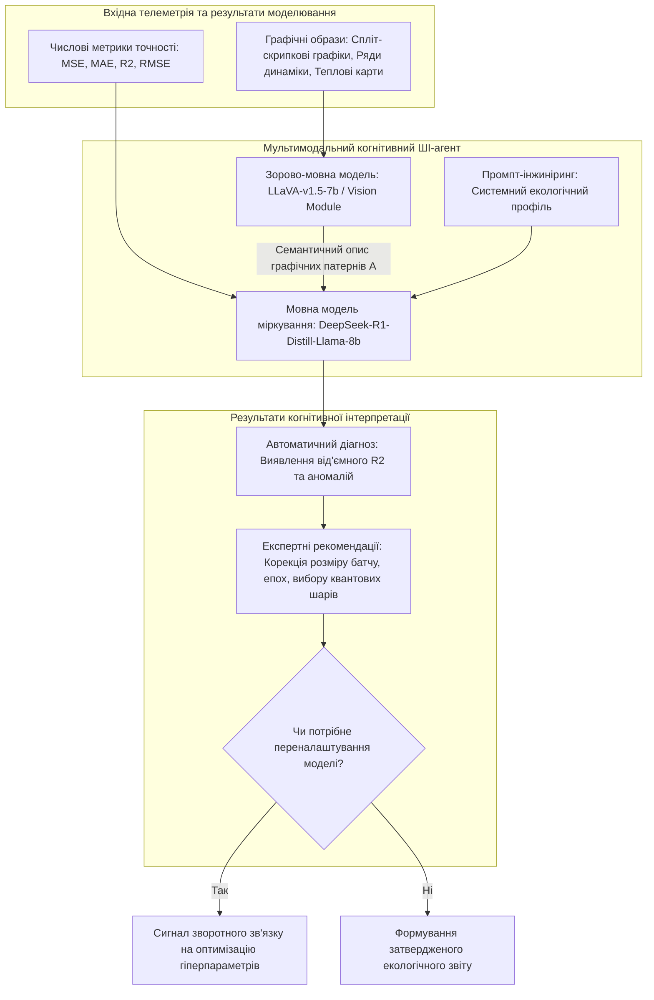

# Змістовий модуль 2. Моделювання екологічних процесів та геоінформаційні технології

# Тема 10. Квантово-гібридні та інтелектуальні платформи просторового прогнозування

---

## 10.1. Концептуальна модель DPPDMext (Data Preparation and Predictive Data Modeling extended): етапи $A, Q, M, E, P, F$

### Основний зміст та теоретичний базис
Процес прогнозування динаміки екологічних параметрів у сучасних урбанізованих системах стикається з низкою критичних обмежень, серед яких головними є нестаціонарність часових рядів, висока стохастичність антропогенних емісій, значна просторова розрідженість постів спостереження та дефіцит репрезентативних ретроспективних вибірок. Традиційні алгоритми глибокого навчання (Deep Learning) вимагають великих обсягів навчальних даних для досягнення прийнятної узагальнюючої здатності, що робить їх малоефективними при розгортанні нових муніципальних станцій або аналізі аномальних ситуацій на коротких проміжках часу. 

Здобувачі вищої освіти в межах даного освітнього компонента мають оволодіти принципами побудови інтегрованих систем екологічної аналітики нового покоління, які базуються на переході від ізольованих прогностичних моделей до комплексних архітектурних рішень.

Теоретичним базисом такої інтеграції виступає розширена концептуальна модель підготовки та предиктивного моделювання даних (**DPPDMext** — Data Preparation and Predictive Data Modeling extended). Якщо класична модель підготовки даних описується кортежем $\text{DPPDM} = \langle D, T, P, F, V \rangle$, то модель DPPDMext розширює предиктивний блок $P$ до багаторівневого ієрархічного контуру:

$$P_{\text{ext}} = \langle A, Q, M, E, P \rangle,$$

$$\text{DPPDMext} = \langle D, T, F, (A, Q, M, E, P), F, V \rangle,$$

де $D$ ($\text{Data}$) — множина первинних екологічних даних, зібраних із сертифікованих автоматичних станцій (Vaisala), стаціонарних лабораторних постів або IoT-мереж; $T$ ($\text{Transformation}$) — операції нормалізації, фільтрації викидів за критерієм $Z$-score ($Z > 3\sigma$) та лінійної інтерполяції короткочасних пропусків (менше 6 годин); $F$ ($\text{Feature Engineering}$) — первинна та вторинна інженерія ознак, що охоплює розрахунок кратності гранично допустимих концентрацій (ГДК / MPC), інтегральних індексів забруднення та просторових екзогенних регресорів; $V$ ($\text{Visualization}$) — підсистема картографічної та графічної візуалізації часових рядів і полів забруднення.

Розширений предиктивний контур $P_{\text{ext}}$ містить такі взаємопов'язані етапи:
* **Етап $A$ (Automatic Analysis)** виконує попередній експертно-статистичний аналіз «сирих» часових рядів $X_t = \{x_1, x_2, \dots, x_T\}$ для оцінки їхніх спектральних та кореляційних властивостей. У межах блоку $A$ обчислюються математичне сподівання $\mu$, дисперсія $\sigma^2$, міжквартильний розмах $\text{IQR} = Q_3 - Q_1$, лінійний нахил тренду $a$ з апроксимаційного рівняння $X_t = at + b$, а також здійснюється декомпозиція ряду методом STL:

$$X_t = T_t + S_t + R_t,$$

де $T_t$ — довгострокова трендова компонента, $S_t$ — циклічна сезонна компонента, $R_t$ — залишкові стохастичні флуктуації (шум). Наявність та кратність сезонності ідентифікуються через автокореляційну функцію $\text{ACF}(k)$ для лагу $k$ та дискретне перетворення Фур'є $\text{FFT}(X_t)$:

$$\text{ACF}(k) = \frac{\sum_{t=1}^{T-k} (X_t - \mu)(X_{t+k} - \mu)}{\sum_{t=1}^{T} (X_t - \mu)^2}, \quad \text{FFT}(X_t) = \sum_{n=0}^{T-1} X_t e^{-\frac{2\pi i n k}{T}}.$$

Стаціонарність ряду верифікується за допомогою розширеного тесту Дікі-Фуллера (Augmented Dickey-Fuller, ADF), де значення $p\text{-value} < 0.05$ свідчить про стаціонарність процесу.
* **Етап $Q$ (Quality / Quantum-Adaptive Selection)** здійснює адаптивну селекцію оптимальної архітектури прогнозування. Якщо ряд характеризується вираженою сезонністю, стабільністю та високою автокореляцією першого порядку ($\text{ACF}(1) > 0.8$), але має обмежену вибірку спостережень, блок $Q$ призначає квантово-гібридні моделі (Quantum-LSTM, Quantum-Transformer). Для рядів із високою волатильністю, стохастичними викидами та нестаціонарністю (наприклад, концентрація $\text{CO}$ або температура з високою дисперсією) блок $Q$ активує класичні статистичні моделі з процедурами автодиференціювання (AutoARIMA, BATS), що відповідає принципу «бритви Оккама».
* **Етап $M$ (Modeling of Virtual Stations)** формує віртуальні вимірювальні пости за допомогою просторової інтерполяції IDW ($p=2$) та імітаційного моделювання розсіювання викидів від рухомих джерел на основі алгоритму $A^*$ із Гаусовою матрицею згортки.
* **Етап $E$ (Expert Evaluation)** забезпечує автономний контроль якості моделей когнітивним агентом на базі великих мультимодальних моделей (LLM/VLM), який верифікує метрики точності ($\text{MSE}, \text{MAE}, R^2$) та у разі виявлення розбіжностей повертає систему на етап переналаштування гіперпараметрів через цикл зворотного зв'язку.
* **Етап $P$ (Prediction Core)** реалізує безпосереднє обчислення прогнозних значень на цільовий горизонт $H$ (від 1 до 24 місяців).

Важливою інновацією концепції DPPDMext є тісна інтеграція блоку просторового моделювання $M$ із блоком вторинної інженерії ознак $F$. Розрахована регіональна фонова концентрація $C_{\text{background}}$ та змодельовані індекси динамічної щільності міського автотрафіку передаються у класичні шари нейромереж як зовнішні екзогенні регресори, що перетворює задачу одновимірного часового прогнозування на багатовимірне просторово-часове моделювання.

---

## 10.2. Основи квантового машинного навчання (QML) для задач малої вибірки: квантові шари (VQC, Q-LSTM, Q-Transformer) та їхня індуктивна перевага

### Основний зміст та теоретичний базис
Квантове машинне навчання (Quantum Machine Learning, QML) у прикладних екологічних дослідженнях розглядається як інноваційний інструмент подолання проблеми дефіциту даних («small data problem»). Класичні глибокі нейронні мережі в умовах обмеженої кількості навчальних прикладів (наприклад, часовий ряд тривалістю 35 місяців, що містить менше трьох повних сезонних циклів) схильні до перенавчання (overfitting) або нездатності апроксимувати складні нелінійні взаємозв'язки. 

Квантові обчислення завдяки фундаментальним явищам суперпозиції та квантової заплутаності (entanglement) забезпечують відображення вхідних даних у високорозмірний гільбертів простір $\mathcal{H}$, у якому нелінійно нероздільні патерни екологічної динаміки стають лінійно роздільними або значно простішими для апроксимації.

Сучасні прикладні QML-системи будуються за квантово-гібридною парадигмою (NISQ-архітектури), де класичний центральний процесор (CPU) здійснює первинну екстракцію ознак, а квантовий співпроцесор (Quantum Processing Unit, QPU) обробляє латентний простір за допомогою варіаційних квантових схем (**Variational Quantum Circuits, VQC**).

```
[ Вхідний часовий ряд X_lag ]
              |
              v
+-------------------------------------------------------+
| КЛАСИЧНИЙ ПРОЦЕСОР (CPU)                              |
| - Попередня екстракція ознак (LSTM / CNN / Dense)     |
| - Вектор латентних ознак x = [x1, x2, ..., xQ]        |
+-------------------------------------------------------+
              |
              | (Min-Max нормалізація в діапазон [0, 1])
              v
+-------------------------------------------------------+
| КВАНТОВИЙ СПІВПРОЦЕСОР (QPU)                          |
| 1. AngleEmbedding: |psi(x)> = (X_rot) |00...0>        |
| 2. Варіаційні шари VQC (BasicEntanglerLayers):        |
|    - Параметризовані обертання RY(theta), RZ(phi)     |
|    - Заплутування кубітів: вентилі CNOT               |
| 3. Вимірювання: <Z_i> = Tr(rho * Z_i) (Очікування)    |
+-------------------------------------------------------+
              |
              | (Вектор квантових ознак z_q)
              v
+-------------------------------------------------------+
| ГІБРИДНИЙ ВИХІДНИЙ ШАР (CPU)                          |
| - Агрегація: y_hat = W_q * z_q + b_q                  |
| - Постобробка: f(x) = max(0, x) (Фізичний ReLU)       |
| - Розрахунок Loss та оновлення тета через Adam        |
+-------------------------------------------------------+
```

Математичний апарат функціонування квантово-гібридних моделей охоплює три обов'язкові стадії:
* **Квантове вбудовування даних (Quantum Data Embedding)** здійснює перетворення нормалізованого класичного вектора ознак $x \in \mathbb{R}^Q$ у квантовий стан $|\psi(x)\rangle$. У моделях прогнозування застосовується кутове кодування (AngleEmbedding), де значення ознак масштабуються на кут $\pi$ або $2\pi$ і задають кути повороту одноелементних гейтів:

$$|\psi(x)\rangle = \bigotimes_{i=1}^{Q} R_X(x_i) |0\rangle^{\otimes Q}, \quad R_X(x_i) = \exp\left( -i \frac{x_i}{2} \sigma_x \right) = \begin{bmatrix} \cos\frac{x_i}{2} & -i\sin\frac{x_i}{2} \\ -i\sin\frac{x_i}{2} & \cos\frac{x_i}{2} \end{bmatrix},$$

де $Q$ — кількість використовуваних кубітів ($Q \in \{2, 3, 4, 5, 6\}$); $\sigma_x$ — матриця Паулі $X$.
* **Варіаційна квантова обробка (VQC Processing)** полягає у пропусканні стану $|\psi(x)\rangle$ крізь послідовність $L$ варіаційних шарів, кожен з яких містить параметризовані ротаційні гейти $R_Y(\theta_{l,i})$, $R_Z(\phi_{l,i})$ та фіксовані вентилі заплутування $\text{CNOT}$:

$$U(\theta) = \prod_{l=1}^{L} \left( U_{\text{ent}} \prod_{i=1}^{Q} R_Y(\theta_{l,i}) \right),$$

де $\theta_{l,i}$ — навчальні ваги квантової схеми; $U_{\text{ent}} = \prod_{(j,k) \in \text{connections}} \text{CNOT}_{(j,k)}$ — унітарний оператор міжквантового заплутування (BasicEntanglerLayers).
* **Квантове вимірювання та агрегація (Measurement & Hybrid Output)** зчитує математичне сподівання квантово-механічного оператора Паулі $Z$ для кожного кубіта:

$$\langle Z_i \rangle = \text{Tr}(\rho \cdot Z_i) = \langle \psi(x, \theta) | Z_i | \psi(x, \theta) \rangle, \quad Z_i = \begin{bmatrix} 1 & 0 \\ 0 & -1 \end{bmatrix},$$

де $\rho = |\psi(x, \theta)\rangle \langle \psi(x, \theta)|$ — матриця густини еволюціонованого квантового стану. Фінальний прогноз формується у лінійному шарі зчитування:

$$\hat{y}_t = \frac{1}{Q} \sum_{i=1}^{Q} \langle Z_i \rangle \quad \text{або} \quad \hat{y}_t = W_q z_q + b_q,$$

де $z_q = [\langle Z_1 \rangle, \langle Z_2 \rangle, \dots, \langle Z_Q \rangle]^T$ — вектор квантових ознак; $W_q, b_q$ — параметри класичного повнозв'язного шару. Для забезпечення фізичної коректності прогнозованих концентрацій полютантів та вологості до виходу обов'язково застосовується нелінійне обмеження $\hat{y}_{\text{final}} = \max(0, \hat{y}_t)$.

У моделі **Quantum-LSTM (Q-LSTM)** рекурентний прихований стан $h_{t-1}$ та поточний вхідний вектор $x_t$ класичного блоку передаються на вхід VQC, що замінює традиційні матричні множення у внутрішніх шлюзах (input, forget, output gates) квантовими перетвореннями. У моделі **Quantum-Transformer** квантовий шар інтегрується паралельно з механізмом багатоголової самоуваги (Multi-Head Self-Attention):

$$\text{Attention}(Q, K, V) = \text{softmax}\left( \frac{QK^T}{\sqrt{d_k}} \right) V,$$

де вихід квантової схеми збагачує матрицю просторово-часових ознак перед шаром нормалізації.

У квантових модифікаціях статистичних моделей (**Quantum-AutoARIMA, Quantum-BATS**) варіаційна схема апроксимує нелінійні зв'язки між лаговими змінними $X_{\text{lag}} = [y_{t-\text{lag}}, \dots, y_{t-1}]$ з оптимізацією функції втрат, що містить регуляризаційний член Тихонова:

$$\mathcal{L}(\theta) = \frac{1}{N} \sum_{i=1}^{N} (y_i - \hat{y}_i)^2 + \lambda \|\theta\|^2.$$

Експериментальні дослідження виявили чітку дихотомію ефективності квантово-гібридних моделей:
1. **Механізм квантової переваги (Quantum Advantage):** Для параметрів із високою внутрішньою стабільністю, гладкою циклічністю та сильною автокореляцією (атмосферний тиск $\text{ACF}(1) = 0.60\dots 0.88$, відносна вологість $\text{ACF}(1) = 0.66\dots 0.89$) квантові моделі забезпечують суттєве зниження середньоквадратичної похибки $\text{MSE}$ (зниження похибки на 19.39–74.74 % для тиску та на 13.21–45.96 % для вологості порівняно з класичними моделями). Висока виразна здатність гільбертового простору діє подібно до ядерних методів із нескінченновимірним простором ознак, а мала кількість кубітів ($Q = 2\dots 6$) створює природне інформаційне вузьке місце («bottleneck»), що запобігає запам'ятовуванню шуму та забезпечує неявну регуляризацію.
2. **Механізм квантової деградації (Quantum Failure):** Для параметрів із високою волатильністю та нестаціонарністю (температура з дисперсією $\sigma^2 > 85$, хаотичні сплески викидів $\text{CO}$ з $p\text{-value}(\text{ADF}) > 0.98$) квантові моделі демонструють зростання $\text{MSE}$ на 60–314 %. У таких умовах функція втрат у квантовому просторі стає надзвичайно порізаною, спричиняючи потрапляння градієнтних оптимізаторів (Adam) у глибокі локальні мінімуми або прояв феномену «безплідного плато» (Barren Plateau), за якого градієнти згасають експоненційно з ростом глибини схеми $L$. Класична модель AutoARIMA за рахунок статистичного диференціювання ($d=1, 2$) усуває нестаціонарність значно ефективніше.

| Екологічний параметр / Локація спостереження | Найкраща класична модель | $\text{MSE}_{\text{Classical}}$ | $R^2_{\text{Classical}}$ | Найкраща квантово-гібридна модель | $\text{MSE}_{\text{Quantum}}$ | $R^2_{\text{Quantum}}$ | Відносна зміна похибки $\Delta\text{MSE}$, % |
| :--- | :--- | :--- | :--- | :--- | :--- | :--- | :--- |
| **Атмосферний тиск** (Північний промвузол) | AutoARIMA | 4.250 | 0.110 | **Q-Transformer** | 1.077 | 0.775 | **$\downarrow$ 74.74 % (Перевага QML)** |
| **Атмосферний тиск** (Гімназія № 26) | AutoARIMA | 5.280 | -5.010 | **Q-CNN** | 2.685 | 0.527 | **$\downarrow$ 49.16 % (Перевага QML)** |
| **Відносна вологість** (Північний промвузол)| LSTM | 120.330 | -0.320 | **Q-LSTM** | 65.020 | 0.280 | **$\downarrow$ 45.96 % (Перевага QML)** |
| **Відносна вологість** (Район «Фаворит») | MLP | 265.110 | -0.210 | **Q-Transformer** | 217.240 | 0.221 | **$\downarrow$ 18.05 % (Перевага QML)** |
| **Діоксид азоту $\text{NO}_2$** (Північний промвузол)| GRU | 0.00007 | -1.000 | **Q-Transformer** | 0.00003 | -0.020 | **$\downarrow$ 49.23 % (Перевага QML)** |
| **Діоксид азоту $\text{NO}_2$** (Район «Фаворит»)| Theta | 0.00035 | -0.110 | **Q-CNN** | 0.00019 | 0.399 | **$\downarrow$ 46.46 % (Перевага QML)** |
| **Оксид вуглецю $\text{CO}$** (Гімназія № 26) | AutoARIMA | 0.00510 | -8.110 | **Q-AutoARIMA** | 0.01260 | -21.450 | **$\uparrow$ 147.00 % (Перевага класики)**|
| **Температура повітря** (Гімназія № 26) | AutoARIMA | 12.890 | 0.420 | **Q-TBATS** | 53.450 | -1.410 | **$\uparrow$ 314.60 % (Перевага класики)**|
| **Температура повітря** (Північний промвузол)| AutoARIMA | 22.450 | 0.620 | **Q-AutoETS** | 48.750 | -0.180 | **$\uparrow$ 117.20 % (Перевага класики)**|

Дані таблиці демонструють виражену контекстну залежність квантового підходу: QML забезпечує істотний приріст точності для стабільних геофізичних процесів, проте вимагає обов'язкового гібридного перемикання на класичні статистичні алгоритми при прогнозуванні високоентропійних параметрів.

---

## 10.3. Застосування автономних когнітивних LLM/VLM-агентів для автоматизованої інтерпретації розрахунків, графіків та підтримки прийняття рішень

### Основний зміст та теоретичний базис
Зростання складності екологічних моделей та необхідність одночасного аналізу сотень прогностичних сценаріїв створюють когнітивне перевантаження для експертів-екологів. У реальних умовах муніципального управління фахівець змушений вручну зіставляти числові таблиці похибок, графіки автокореляції, просторові карти та розподіли залишків, що сповільнює швидкість прийняття рішень у разі виникнення загрозливих екологічних ситуацій. Усунення цього бар'єра досягається шляхом інтеграції в інформаційну систему автономного нейромережевого агента на базі великих мовних (Large Language Models, LLM) та мультимодальних зорово-мовних моделей (Vision-Language Models, VLM).

Математична та процедурна формалізація когнітивного агента оцінки якості моделювання подається кортежем вхідних структур:

$$\text{Agent}_{\text{input}} = \langle X, Y, \hat{Y}, G \rangle,$$

де $X = \{x_1, x_2, \dots, x_n\}$ — вектор просторово-часових ознак; $Y = \{y_1, y_2, \dots, y_n\}$ — вектор фактичних еталонних значень вимірювань; $\hat{Y} = \{\hat{y}_1, \hat{y}_2, \dots, \hat{y}_n\}$ — масив прогнозних значень, згенерованих обчислювальними ядрами; $G = \{g_1, g_2, \dots, g_m\}$ — множина графічних зображень (діаграми Найквіста, графіки часової динаміки, спліт-скрипкові графіки помилок (split violin plots), матриці кореляцій, гістограми розподілу залишків).

Функціонування когнітивного агента складається з трьох послідовних алгоритмічних кроків:
1. **Кількісне оцінювання помилок.** Агент витягує та структурує вектор метрик числової точності $M$:
   $$\text{MAE} = \frac{1}{n}\sum_{i=1}^n |y_i - \hat{y}_i|, \quad \text{MSE} = \frac{1}{n}\sum_{i=1}^n (y_i - \hat{y}_i)^2, \quad \text{RMSE} = \sqrt{\text{MSE}}, \quad R^2 = 1 - \frac{\sum (y_i - \hat{y}_i)^2}{\sum (y_i - \bar{y})^2}.$$
2. **Семантичний аналіз графічних образів VLM-моделлю.** Графічний артефакт $g \in G$ обробляється функцією класифікації типу зображення $f_V(g)$:
   $$\text{Type}(g) = f_V(g), \quad g \in G.$$
   Після ідентифікації типу графіка активується спеціалізована функція аналізу візуальних ознак $f_A(g, \theta)$:
   $$\text{Analysis}(g) = f_A(g, \theta),$$
   де $\theta$ — параметри оцінки візуальної якості (виявлення асиметрії розподілу помилок, виявлення розширених «хвостів» розподілу залишків, детектування залишкової циклічності або аномальних сплесків).
3. **Синтез експертного висновку мовною моделлю.** Генератор аналітичного звіту $f_{\text{LLM}}$ отримує агрегований вектор числових метрик $M$ та структуровані візуальні дескриптори $A$:
   $$\text{Report} = f_{\text{LLM}}(M, A).$$


*Рисунок 1 — Структурно-логічна схема функціонування мультимодального когнітивного ШІ-агента в контурі автоматизованої оцінки якості прогнозування*

Програмна реалізація агента базується на локальному середовищі інференсу LM Studio, що забезпечує конфіденційність муніципальних даних та незалежність від зовнішніх хмарних провайдерів. Для первинного зорового аналізу графіків застосовується модель `llava-v1.5-7b`, а для аналітичного синтезу висновків, логічного міркування (reasoning) та формування управлінських рекомендацій — модель `deepseek-r1-distill-llama-8b`.

Практична апробація агента показала високу ефективність у задачах первинного скринінгу результатів: агент автоматично ідентифікував випадки некоректного входу моделей у режим негативного коефіцієнта детермінації ($R^2 < 0$), локалізував географічні аномалії для станцій зі складними умовами спостережень (пост «Фаворит») та сформував рекомендації щодо корекції гіперпараметрів (збільшення розміру підвибірки `batch_size`, оптимізація кількості кубітів). 

Разом із тим, дослідження виявило фундаментальні обмеження поточного покоління ШІ-агентів: їхні висновки мають переважно дескриптивний (описовий), а не глибокий причинно-наслідковий характер. Агент констатує факт деградації $R^2$, проте не здатний самостійно сформулювати фізичний зв'язок між нестаціонарністю, стрибками викидів автотранспорту та збіжністю квантових гейтів без надання чітких контекстних підказок. 

Таким чином, ШІ-агенти функціонують не як заміна вченого-еколога, а як інструменти когнітивного підсилення (cognitive augmentation), які беруть на себе рутинну обробку масивів первинної інформації та вивільняють часовий ресурс експерта для прийняття відповідальних рішень у сфері забезпечення екологічної безпеки.

---

### Питання для самоперевірки та аналітичного осмислення

1. Охарактеризуйте структуру та функціональне призначення блоків $A, Q, M, E, P, F$ у складі розширеної концептуальної моделі DPPDMext.
2. Поясніть фізико-математичний механізм вбудовування класичних екологічних часових рядів у квантовий стан за допомогою оператора AngleEmbedding.
3. У чому полягає теоретична перевага використання варіаційних квантових схем (VQC) при роботі з екологічними вибірками малого обсягу (small data)?
4. Проаналізуйте причини, через які квантово-гібридні моделі (Q-LSTM, Q-Transformer) демонструють значну перевагу над класичними аналогами при прогнозуванні атмосферного тиску та вологості, але суттєво поступаються моделі AutoARIMA при прогнозуванні температури та оксиду вуглецю.
5. Що являє собою феномен «безплідного плато» (Barren Plateau) у квантовому машинному навчанні, і як він впливає на збіжність градієнтного спуску при навчанні параметрів VQC?
6. Опишіть алгоритмічний ланцюг взаємодії між зорово-мовною моделлю (VLM) та мовною моделлю міркування (LLM) під час автоматизованого формування експертного звіту про стан довкілля.
7. Чому сучасні когнітивні ШІ-агенти розглядаються саме як засоби когнітивної підтримки дослідника-еколога, а не як повністю автономні системи ухвалення управлінських рішень?