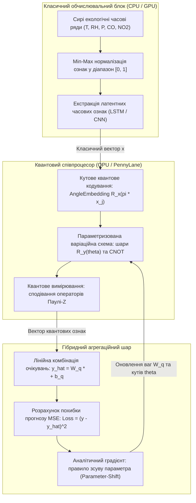
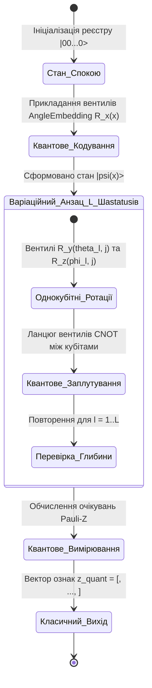
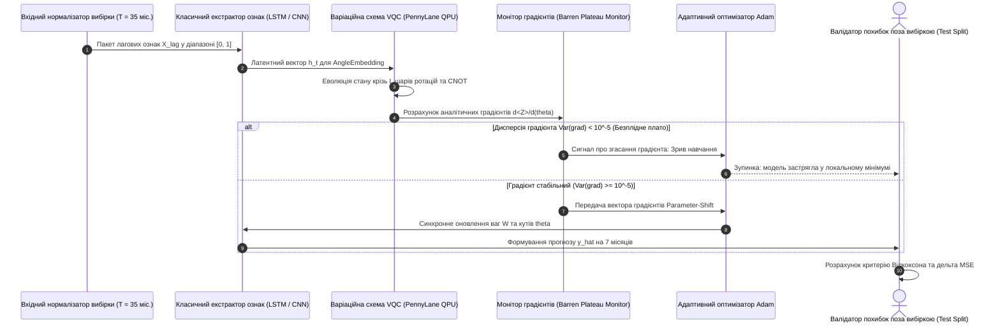
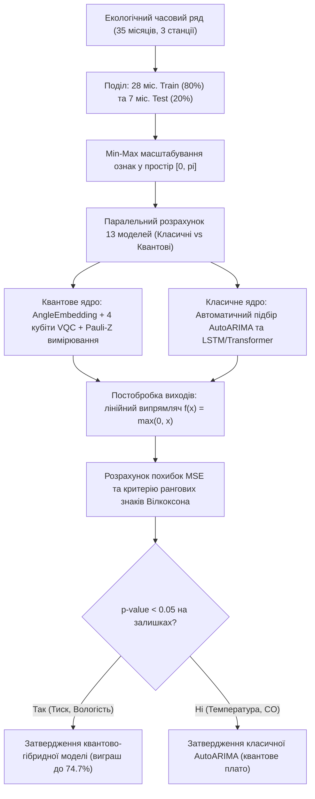

# Тема 10. Квантово-гібридні та інтелектуальні платформи просторового прогнозування

## Мета лекції
Сформувати у здобувачів наукового ступеня доктора філософії передові знання та фахові навички з теорії і практики квантового машинного навчання (Quantum Machine Learning, QML), побудови гібридних обчислювальних схем CPU-QPU, розробки варіаційних квантових шарів у глибоких нейромережах (Q-LSTM, Q-Transformer, Q-CNN) для вирішення проблеми дефіциту даних в екологічному прогнозуванні та критичної оцінки обмежень квантових обчислювачів епохи NISQ.

## Очікувані результати навчання
1. **Знання та розуміння.** Здобувачі мають опанувати математичний формалізм варіаційних квантових схем (VQC), методи квантового кодування часових рядів (AngleEmbedding) та вимірювання операторів Паулі в гільбертовому просторі станів.
2. **Застосування.** Здобувачі мають застосовувати квантово-гібридні моделі у бібліотеці PennyLane та середовищі PyTorch для прогнозування параметрів довкілля за умов коротких навчальних вибірок.
3. **Аналіз.** Здобувачі мають аналізувати умови виникнення квантової переваги для стабільних параметрів із високою автокореляцією порівняно з деградацією точності на стохастичних рядах.
4. **Оцінювання та синтез.** Здобувачі мають проектувати гібридні архітектури поєднання квантових копроцесорів із класичними нейромережами та формувати дорожню карту впровадження квантових технологій у муніципальні екологічні цифрові двійники.

## 1. Теоретико-концептуальний базис. Основи квантового машинного навчання та парадигма гібридних обчислень CPU-QPU

### 1.1. Теоретичні засади квантових обчислень в екології: кубіти, унітарні вентилі, квантова заплутаність та представлення даних у високовимірному гільбертовому просторі

Застосування методів штучного інтелекту в задачах моделювання складних екологічних процесів стикається з фундаментальними обмеженнями класичних обчислювальних систем при опрацюванні вибірок малої тривалості з високим рівнем стохастичного шуму. Традиційні архітектури глибокого навчання (глибокі рекурентні мережі та трансформери) потребують тисяч репрезентативних навчальних прикладів, які часто недоступні на початкових етапах розгортання нових муніципальних станцій моніторингу. Подолання цього бар'єра забезпечується залученням методології **квантового машинного навчання (Quantum Machine Learning, QML)**, яка спирається на квантово-механічні закони суперпозиції станів, унітарної еволюції та квантової заплутаності.

Базовим елементом квантової інформації є **кубіт (квантовий біт)**, стан якого формалізується вектором у двовимірному комплексному просторі Гільберта $\mathcal{H}_2$. На відміну від класичного біта, кубіт здатний перебувати в довільній лінійній суперпозиції базисних ортонормованих станів $|0\rangle$ та $|1\rangle$:

$$|\psi\rangle = \alpha |0\rangle + \beta |1\rangle = \begin{pmatrix} \alpha \\ \beta \end{pmatrix}$$

де амплітуди ймовірностей $\alpha, \beta \in \mathbb{C}$ задовольняють фундаментальну умову нормування $|\alpha|^2 + |\beta|^2 = 1$. Квантовий регістр, що складається з $Q$ взаємодіючих кубітів, описується тензорним добутком гільбертових просторів $\mathcal{H} = \mathcal{H}_2^{\otimes Q}$, утворюючи стан розмірністю $2^Q$:

$$|\Psi\rangle = \sum_{k=0}^{2^Q - 1} c_k |k\rangle, \quad \sum_{k=0}^{2^Q - 1} |c_k|^2 = 1$$

Експоненційне зростання розмірності простору станів при лінійному збільшенні кількості кубітів дозволяє відображати складні багатовимірні екологічні залежності у високовимірний базис, у якому нелінійні кореляції між токсикантами та метеопараметрами стають лінійно сепарабельними або легше апроксимуються.

Трансформація квантових станів здійснюється за допомогою **унітарних вентилів (квантових гейтів)**, які представляються унітарними матрицями $U$, що зберігають норму вектора стану ($U^\dagger U = I$). Базовими однокубітними операціями виступають параметризовані ротації Паулі навколо координатних осей сфери Блоха:

$$R_x(\theta) = \exp\left( -i \frac{\theta}{2} \sigma_x \right) = \begin{pmatrix} \cos\frac{\theta}{2} & -i\sin\frac{\theta}{2} \\ -i\sin\frac{\theta}{2} & \cos\frac{\theta}{2} \end{pmatrix}$$

$$R_y(\theta) = \exp\left( -i \frac{\theta}{2} \sigma_y \right) = \begin{pmatrix} \cos\frac{\theta}{2} & -\sin\frac{\theta}{2} \\ \sin\frac{\theta}{2} & \cos\frac{\theta}{2} \end{pmatrix}$$

$$R_z(\theta) = \exp\left( -i \frac{\theta}{2} \sigma_z \right) = \begin{pmatrix} e^{-i\theta/2} & 0 \\ 0 & e^{i\theta/2} \end{pmatrix}$$

Формування нелокальних багатокубітних зв'язків реалізується за допомогою заплутуючих вентилів, основним серед яких є двовходовий контрольований вентиль заперечення **CNOT (Controlled-NOT)**. Вентиль CNOT інвертує стан цільового кубіта тоді й лише тоді, коли керуючий кубіт перебуває в стані $|1\rangle$, створюючи квантово-заплутані стани Белла, які не можуть бути факторизовані на добуток індивідуальних станів окремих кубітів. Це забезпечує моделювання складних крос-параметричних зв'язків між екологічними показниками, недосяжних для класичних рекурентних структур на малих вибірках.

> **ПРАКТИЧНИЙ ЯКІР:** У процесі розробки квантово-гібридної системи прогнозування для Кременчуцької агломерації дослідницька група КрНУ спільно з Університетом Туріба (Рига) розгорнула симулятор квантових схем PennyLane на базі робочої станції з відеокартою NVIDIA RTX 3090, що дозволило моделювати 6-кубітні варіаційні квантові схеми для вилучення тонких нелінійних патернів у часових рядах атмосферного тиску та вологості на обмеженій 35-місячній вибірці станцій Vaisala.

---

### 1.2. Архітектура варіаційних квантових схем (VQC) як параметризованих функціональних апроксиматорів часових рядів

В епоху проміжних масштабів із шумом (Noisy Intermediate-Scale Quantum, NISQ) квантові обчислювачі не володіють достатньою глибиною для реалізації алгоритмів із повною корекцією помилок (як алгоритм Шора чи Гровера). Провідною парадигмою практичного застосування квантових систем у штучному інтелекті виступають **варіаційні квантові схеми (Variational Quantum Circuits, VQC)**, також відомі як квантові нейронні мережі (Quantum Neural Networks, QNN).

Архітектура VQC є квантовим еквівалентом класичного багатошарового перцептрону і складається з трьох послідовних функціональних блоків: схеми підготовки стану (кодування вхідних даних), параметризованої унітарної еволюції (анзацу) та блоку квантових вимірювань. Анзац складається з $L$ послідовних варіаційних шарів, кожен із яких містить параметризовані ротації окремих кубітів та фіксовані заплутуючі оператори зв'язку. 

Загальний унітарний оператор варіаційного перетворення описується аналітичним добутком матриць:

$$U(\mathbf{w}) = \prod_{l=1}^{L} \left( \mathcal{W}_{\text{entangle}} \cdot \bigotimes_{j=1}^{Q} R_y(\theta_{l, j}) \right)$$

де параметри та внутрішні оператори визначаються такими положеннями:
* Вектор $\mathbf{w} = \{\theta_{l, j}\}$ об'єднує всі навчальні параметри (кути обертання) квантової схеми, де індекс $l \in \{1, \dots, L\}$ позначає номер варіаційного шару, а індекс $j \in \{1, \dots, Q\}$ — номер кубіта.
* Оператор $\mathcal{W}_{\text{entangle}}$ представляє фіксований заплутуючий шар вентилів CNOT, організованих за циклічною топологією: $\text{CNOT}_{j, \, (j \bmod Q) + 1}$.
* Параметризовані вентилі $R_y(\theta_{l, j})$ забезпечують керовану трансформацію стану кубіта на дійсній площині сфери Блоха, що виключає появу комплексних фазових зсувів і спрощує оптимізацію функції втрат.

Варіаційна квантова схема діє як високоефективний параметризований апроксиматор нелінійних функцій. Завдяки високій експресивності квантового простору Гільберта VQC із малою кількістю параметрів (наприклад, 4 кубіти та 3 шари, що дає лише 12 варіаційних кутів) здатна досягати вищої апроксимаційної точності на циклічних сезонних вибірках, ніж класичні повнозв'язні нейромережі з сотнями вагових коефіцієнтів.

---

### 1.3. Методи квантового кодування інформації: перетворення кутів обертання AngleEmbedding та екстракція квантових ознак через очікування оператора Паулі-Z

Ключовим теоретичним етапом побудови квантово-гібридних систем є перетворення класичного числового вектора екологічних показників $\mathbf{x} = (x_1, x_2, \dots, x_m)^T$ у квантовий стан реєстру. Серед існуючих підходів (амплітудне, базисне та кутове кодування) в аналізі екологічних часових рядів домінує **кутове квантове кодування (AngleEmbedding)**, оскільки воно не вимагає глибоких схем підготовки станів і володіє константною глибиною квантової схеми $O(1)$.

Перед виконанням кодування всі класичні вхідні ознаки обов'язково підлягають нормалізації за шкалою Min-Max у діапазон $[0, 1]$ або $[-\pi, \pi]$:

$$\tilde{x}_j = \pi \cdot \frac{x_j - x_{\min, j}}{x_{\max, j} - x_{\min, j}}$$

Кутове вбудовування здійснюється шляхом прикладання одноетапних ротаційних вентилів Паулі до кожного кубіта, що попередньо перебуває в нульовому стані $|0\rangle$:

$$|\mathbf{x}\rangle = \bigotimes_{j=1}^{Q} R_x(\tilde{x}_j) |0\rangle = \bigotimes_{j=1}^{Q} \left( \cos\frac{\tilde{x}_j}{2} |0\rangle - i \sin\frac{\tilde{x}_j}{2} |1\rangle \right)$$

У результаті класичні значення концентрацій газів чи температури трансформуються безпосередньо у фізичні кути орієнтації векторів стану кубітів на сфері Блоха. Якщо розмірність вхідного вектора перевищує кількість доступних фізичних кубітів ($m > Q$), застосовується модульне циклічне відображення проводів: $\text{wires} = j \bmod Q$.

Зворотний перехід від еволюціонуючого квантового стану до класичних числових ознак реалізується через операцію **квантового вимірювання**. Для збереження неперервності градієнтного оптимізаційного процесу вимірювання формується не у вигляді випадкового дискретного колапсу хвильової функції, а у формі квантово-механічного математичного сподівання ермітового **спостережуваного оператора Паулі-Z ($\sigma_z$)** на кожному окремому кубіті:

$$\langle Z_j \rangle = \text{Tr}\big( \rho(\mathbf{x}, \mathbf{w}) \cdot Z_j \big) = \langle \Psi(\mathbf{x}, \mathbf{w}) | Z_j | \Psi(\mathbf{x}, \mathbf{w}) \rangle$$

де матриця щільності системи $\rho = |\Psi\rangle \langle \Psi|$ задає чистий стан квантового регістра після проходження варіаційного анзацу, а оператор Паулі-Z має вигляд $Z = \begin{pmatrix} 1 & 0 \\ 0 & -1 \end{pmatrix}$. 

Числове значення очікування строго лежить у компактному дійсному діапазоні $\langle Z_j \rangle \in [-1, 1]$. Отриманий вектор квантових характеристик $\mathbf{z}_{\text{quant}} = (\langle Z_1 \rangle, \langle Z_2 \rangle, \dots, \langle Z_Q \rangle)^T$ подається на класичний шар агрегації для обчислення підсумкового прогнозу екологічного параметра:

$$\hat{y} = \mathbf{W}_{\text{out}} \mathbf{z}_{\text{quant}} + b_{\text{out}} \quad \text{або} \quad \hat{y} = \frac{1}{Q} \sum_{j=1}^{Q} \langle Z_j \rangle$$

де $\mathbf{W}_{\text{out}}$ та $b_{\text{out}}$ — ваги та зсув лінійного шару класичного декодера.

> **ПРАКТИЧНИЙ ЯКІР:** При квантово-гібридному прогнозуванні відносної вологості повітря на станції «Північний промвузол» вихідні вимірювання (діапазон 35–95%) були нормалізовані у радіани за формулою $\tilde{x} = \pi \cdot \text{RH} / 100$, що запобігло насиченню ротаційних гейтів $R_x$ та забезпечило стійку збіжність градієнтів, дозволивши квантовій моделі Q-LSTM досягти зниження похибки MSE на 45,96% порівняно з класичною нейромережею LSTM.

---

### 1.4. Гібридний пайплайн навчання «end-to-end» із градієнтною оптимізацією ваг класичних шарів і параметрів квантових вентилів алгоритмом Adam

Поєднання класичних нейронних шарів (згорткових, рекурентних або трансформерних) із варіаційними квантовими схемами вимагає побудови єдиного наскрізного оптимізаційного контуру навчання (**End-to-End Hybrid Training Pipeline**). У цій парадигмі класичний процесор (CPU/GPU) та квантовий процесор (QPU) функціонують у замкненому ітераційному циклі зворотного зв'язку.

Прямий прохід (Forward Pass) починається на класичному рівні, де рекурентна мережа (наприклад, шар LSTM) витягує часові лагові залежності $X_{\text{lag}} = [y_{t-\text{lag}}, \dots, y_{t-1}]$, формуючи латентний вектор ознак $\mathbf{h}_t$. Далі вектор $\mathbf{h}_t$ передається на QPU, де кодується в квантовий регістр, еволюціонує крізь варіаційні шари $U(\mathbf{w})$ і вимірюється операторами Паулі-Z. Класичний вихідний шар генерує фінальне передбачення $\hat{y}_t$, на основі якого обчислюється функція втрат середньоквадратичної помилки з регуляризацією:

$$\mathcal{L}(\mathbf{W}_{\text{class}}, \mathbf{w}_{\text{quant}}) = \frac{1}{N} \sum_{i=1}^{N} (y_i - \hat{y}_i)^2 + \lambda \|\mathbf{w}_{\text{quant}}\|^2$$

Головною математичною проблемою зворотного поширення помилки (Backward Pass) є неможливість застосування класичного символьного диференціювання крізь фізичний квантовий процесор через неперервний колапс хвильової функції при вимірюванні. Для аналітичного обчислення точних градієнтів квантових параметрів застосовується фундаментальне **правило зсуву параметра (Parameter-Shift Rule)**.

Якщо унітарний вентиль у схемі генерується оператором Паулі $U(\theta) = \exp(-i \frac{\theta}{2} G)$, аналітична похідна квантового очікування за варіаційним кутом $\theta_j$ розраховується строго через різницю двох квантових вимірювань зі зсувом аргументу на $\pm \pi/2$:

$$\frac{\partial \langle Z \rangle}{\partial \theta_j} = \frac{1}{2} \left[ \langle Z \rangle\Big(\theta_j + \frac{\pi}{2}\Big) - \langle Z \rangle\Big(\theta_j - \frac{\pi}{2}\Big) \right]$$

Цей математичний результат дозволяє QPU діяти як повноцінний диференційовний шар нейронної мережі, що повертає точні значення градієнтів безпосередньо з вимірювань без використання наближених чисельних кінцевих різниць. Отримані квантові градієнти об'єднуються з класичними градієнтами за правилом диференціювання складної функції:

$$\frac{\partial \mathcal{L}}{\partial \theta_j} = \frac{\partial \mathcal{L}}{\partial \hat{y}} \cdot \frac{\partial \hat{y}}{\partial \langle Z \rangle} \cdot \frac{\partial \langle Z \rangle}{\partial \theta_j}$$

Оновлення всієї множини класичних ваг $\mathbf{W}_{\text{class}}$ та квантових параметрів $\mathbf{w}_{\text{quant}}$ здійснюється синхронно за допомогою адаптивного алгоритму оптимізації **Adam**:

$$\mathbf{\Theta}^{(t+1)} = \mathbf{\Theta}^{(t)} - \frac{\eta}{\sqrt{\hat{v}_t} + \epsilon} \hat{m}_t$$

де $\mathbf{\Theta} = \{\mathbf{W}_{\text{class}}, \mathbf{w}_{\text{quant}}\}$, вектор $\hat{m}_t$ відображає скоригований перший момент градієнта (експоненційне ковзне середнє), $\hat{v}_t$ задає другий нецентрований момент (дисперсію), а $\eta$ — швидкість навчання.

Для систематизації базових підходів квантово-гібридного моделювання сформовано порівняльну аналітичну таблицю.

| Парадигма обчислень | Апаратна реалізація та математичний базис | Вимоги до обсягу навчальних даних | Переваги в задачах екологічного прогнозування | Приклад з реальної практики |
| :--- | :--- | :--- | :--- | :--- |
| Чисто класичні моделі (LSTM, ARIMA) | Стандартні процесори CPU/GPU; тензорна алгебра дійсних чисел | Високі (потребує сотень або тисяч точок спостереження) | Висока стабільність на рядах із великою зашумленістю та високою дисперсією | Прогнозування температури та діоксиду сірки в Кременчуці |
| Квантово-гібридні рекурентні мережі (Q-LSTM / Q-GRU) | Гібрид CPU-QPU; класичні комірки у поєднанні з варіаційними VQC | Низькі; здатні апроксимувати нелінійності на малих вибірках | Висока точність на стабільних циклічних процесах (тиск, вологість) | Зниження похибки прогнозу атмосферного тиску на 74,74% |
| Квантово-згорткові мережі (Q-CNN) | 1D згортка з квантовими фільтрами стиснення простору ознак | Низькі; робастність до локальних просторових зсувів | Ефективне вилучення кореляцій у багатопараметричних сенсорних масивах | Прогнозування діоксиду азоту в районі «Фаворит» |
| Квантові трансформери (Quantum Transformer) | Механізм самоуваги, підсилений квантовими шарами обробки лагів | Помірні; здатні утримувати довгостроковий контекст | Висока сепарабельність складних гармонійних сезонних залежностей | Прогнозування вологості та тиску в промисловому вузлі |

---

> **ТИПОВА ПОМИЛКА:** Спроба подачі сирих значень екологічних вимірювань у фізичних одиницях (наприклад, атмосферного тиску 1013,25 гПа або концентрації пилу 450 мкг/м³) безпосередньо як кутів ротації вентилів $R_x(\theta)$ або $R_y(\theta)$ у квантову схему. Оскільки тригонометричні ротаційні вентилі є періодичними з періодом $2\pi$ ($\theta \equiv \theta \bmod 2\pi$), подача ненормованого значення $1013,25$ призводить до випадкового хаотичного закручування квантового стану на сфері Блоха ($1013,25 \bmod 2\pi \approx 1,60\text{ рад}$), повністю руйнуючи природну монотонну лінійність фізичного параметра та унеможливлюючи навчання мережі.

---

> **КОНТРОЛЬНЕ ПИТАННЯ:** Квантовий прогностичний вузол складається з одного кубіта, що перебуває в початковому стані $|0\rangle$. До кубіта прикладається вхідний ротаційний вентиль $R_y(\theta)$, де кут $\theta$ є нормалізованим параметром екологічного часового ряду. Чому дорівнює теоретичне квантове математичне сподівання оператора Паулі-Z ($\langle Z \rangle$) на виході схеми як функція кута $\theta$, і як за допомогою правила зсуву параметра (Parameter-Shift Rule) обчислити його точну аналітичну похідну $\frac{\partial \langle Z \rangle}{\partial \theta}$ у точці $\theta = \frac{\pi}{3}$?

Розгорнути аналіз / відповідь

**Правильний варіант: Теоретичне сподівання дорівнює $\langle Z \rangle(\theta) = \cos\theta$; аналітична похідна в точці $\theta = \pi/3$ становить $\frac{\partial \langle Z \rangle}{\partial \theta} = -\frac{\sqrt{3}}{2} \approx -0,866$, що строго збігається з результатом правила зсуву параметра.**

1. Повне логічне та аналітичне обґрунтування:
   * Стан кубіта після дії вентиля $R_y(\theta)$ на базисний вектор $|0\rangle$ описується вектором:
     $$|\psi(\theta)\rangle = R_y(\theta) |0\rangle = \begin{pmatrix} \cos\frac{\theta}{2} & -\sin\frac{\theta}{2} \\ \sin\frac{\theta}{2} & \cos\frac{\theta}{2} \end{pmatrix} \begin{pmatrix} 1 \\ 0 \end{pmatrix} = \begin{pmatrix} \cos\frac{\theta}{2} \\ \sin\frac{\theta}{2} \end{pmatrix} = \cos\frac{\theta}{2} |0\rangle + \sin\frac{\theta}{2} |1\rangle$$
   * Обчислимо квантове математичне сподівання оператора Паулі-Z ($Z = \begin{pmatrix} 1 & 0 \\ 0 & -1 \end{pmatrix}$):
     $$\langle Z \rangle(\theta) = \langle \psi(\theta) | Z | \psi(\theta)\rangle = \begin{pmatrix} \cos\frac{\theta}{2} & \sin\frac{\theta}{2} \end{pmatrix} \begin{pmatrix} 1 & 0 \\ 0 & -1 \end{pmatrix} \begin{pmatrix} \cos\frac{\theta}{2} \\ \sin\frac{\theta}{2} \end{pmatrix} = \cos^2\frac{\theta}{2} - \sin^2\frac{\theta}{2} = \cos\theta$$
   * Пряма аналітична похідна від косинуса:
     $$\frac{\partial \langle Z \rangle}{\partial \theta} = \frac{d}{d\theta}(\cos\theta) = -\sin\theta$$
     У точці $\theta = \frac{\pi}{3}$: $-\sin\left(\frac{\pi}{3}\right) = -\frac{\sqrt{3}}{2} \approx -0,8660$.
   * Застосуємо правило зсуву параметра (Parameter-Shift Rule) без знання аналітичної похідної:
     $$\frac{\partial \langle Z \rangle}{\partial \theta} = \frac{1}{2} \left[ \langle Z \rangle\Big(\theta + \frac{\pi}{2}\Big) - \langle Z \rangle\Big(\theta - \frac{\pi}{2}\Big) \right] = \frac{1}{2} \left[ \cos\Big(\theta + \frac{\pi}{2}\Big) - \cos\Big(\theta - \frac{\pi}{2}\Big) \right]$$
     Оскільки $\cos(\theta + \pi/2) = -\sin\theta$, а $\cos(\theta - \pi/2) = \sin\theta$:
     $$\frac{1}{2} [-\sin\theta - \sin\theta] = \frac{1}{2} [-2\sin\theta] = -\sin\theta$$
   * У точці $\theta = \pi/3$: $\frac{1}{2} [\cos(5\pi/6) - \cos(-\pi/6)] = \frac{1}{2} [-\frac{\sqrt{3}}{2} - \frac{\sqrt{3}}{2}] = -\frac{\sqrt{3}}{2} \approx -0,8660$.
   * Розрахунок доводить, що квантовий процесор шляхом виконання лише двох вимірювань зі зсувом кута на $\pm \pi/2$ отримує абсолютно точне аналітичне значення градієнта функції.

2. Аналіз дистракторів:
   * Твердження про те, що сподівання дорівнює $\sin\theta$, є математично невірним, оскільки оператор Паулі-Z вимірює різницю ймовірностей базисних станів $|0\rangle$ та $|1\rangle$, що дає косинус подвійного половинного кута.
   * Висновок про необхідність використання скінченних різниць із малим кроком $\Delta \theta \to 0$ є хибним для квантових систем, оскільки малий крок у присутності шуму вимірювань (shot noise) викликає катастрофічну нестабільність градієнта.

---

### Вказівки для самостійного осмислення

1. Здійсніть аналітичне виведення правила зсуву параметра (Parameter-Shift Rule) для довільного унітарного вентиля $U(\theta) = \exp(-i \frac{\theta}{2} G)$, генератор якого $G$ задовольняє умову $G^2 = I$.
2. Проаналізуйте геометричний зміст квантової заплутаності двох кубітів на сфері Блоха та поясніть, чому стан Белла $|\Phi^+\rangle = \frac{1}{\sqrt{2}}(|00\rangle + |11\rangle)$ не може бути представлений як дві незалежні точки на індивідуальних сферах Блоха.
3. Дослідіть математичні обмеження симуляції квантових систем на класичних комп'ютерах, розрахувавши обсяг оперативної пам'яті (RAM), необхідний для збереження вектора стану квантового регістра розмірністю 30 кубітів у форматі чисел із плаваючою комою подвійної точності (complex128).

## 2. Методологія та аналіз граничних умов. Бенчмаркінг квантово-гібридних нейромереж та бар'єри апаратного шуму

### 2.1. Порівняльний аналіз квантових модифікацій Q-LSTM, Q-GRU, Q-CNN та Q-Transformer та їх класичних еквівалентів на малих вибірках моніторингу

Емпірична валідація квантово-гібридних обчислювальних підходів на натурних даних муніципального екологічного моніторингу формує об'єктивну наукову картину можливостей та обмежень сучасного прикладного квантового машинного навчання. Порівняльний бенчмаркінг тринадцяти прогностичних архітектур, проведений на реальних рядах вимірювальних станцій Vaisala у місті Кременчук із загальною тривалістю спостережень лише 35 місяців (розбиття: 28 місяців навчальної вибірки та 7 місяців відкладеного тесту), виявив виражену параметричну дихотомію в ефективності моделей.

Для комплексного оцінювання якості прогнозів застосовується система стандартизованих числових критеріїв: середньоквадратична похибка (MSE), середня абсолютна похибка (MAE) та коефіцієнт детермінації ($R^2$). Додатково для забезпечення фізичної достовірності прогнозів у вихідний шар усіх моделей інтегровано постобробну функцію на основі лінійного випрямляча:

$$f_{\text{ReLU}}(x) = \max(0, x)$$

що апаратно блокує генерацію неможливих від'ємних концентрацій хімічних токсикантів або від'ємних рівнів вологості.

Результати систематичного зіставлення квантових модифікацій нейронних мереж із їхніми класичними аналогами наведені у формі багатофакторної порівняльної матриці.

| Архітектурний клас | Найкраща класична модель | Похибка MSE (Classical) | Найкраща квантова модель | Похибка MSE (Quantum) | Відносна зміна похибки ($\Delta \text{MSE}$) |
| :--- | :--- | :--- | :--- | :--- | :--- |
| Відносна вологість (Гімназія № 26) | Класичний Transformer | 81,25 | Гібридний Q-GRU | 70,51 | Зниження на 13,21% (виграш QML) |
| Відносна вологість (Промвузол) | Класична мережа LSTM | 120,33 | Гібридна мережа Q-LSTM | 65,02 | Зниження на 45,96% (виграш QML) |
| Атмосферний тиск (Гімназія № 26) | Класична AutoARIMA | 5,28 | Гібридна мережа Q-CNN | 2,68 | Зниження на 49,16% (виграш QML) |
| Атмосферний тиск (Промвузол) | Класична AutoARIMA | 4,25 | Гібридний Q-Transformer | 1,07 | Зниження на 74,74% (виграш QML) |
| Діоксид азоту (Промвузол) | Класична мережа GRU | 0,00007 | Гібридний Q-Transformer | 0,00003 | Зниження на 49,23% (виграш QML) |
| Монооксид вуглецю (Гімназія № 26) | Класична AutoARIMA | 0,0051 | Квантова Q-AutoARIMA | 0,0126 | Зростання на 147,0% (програш QML) |
| Температура повітря (Гімназія № 26) | Класична AutoARIMA | 12,89 | Квантова модель Q-TBATS | 53,45 | Зростання на 314,6% (програш QML) |
| Температура повітря (Промвузол) | Класична AutoARIMA | 22,45 | Квантова Q-AutoETS | 48,75 | Зростання на 117,2% (програш QML) |

Статистична достовірність виявлених відмінностей перевірялася за допомогою непараметричного критерію знакових рангів Вілкоксона (Wilcoxon signed-rank test) на масивах залишкових помилок. Для параметрів відносної вологості та атмосферного тиску перевага квантово-гібридних моделей підтверджена зі рівнем значущості $p < 0,05$. Водночас для температури та оксиду вуглецю квантові структури продемонстрували статистично значущу деградацію точності порівняно з класичними статистичними моделями.

---

### 2.2. Механізми досягнення квантової переваги: лінійна сепарабельність складних нелінійних залежностей при прогнозуванні стабільних циклічних параметрів (атмосферний тиск, відносна вологість)

Виражений успіх квантово-гібридних архітектур у прогнозуванні атмосферного тиску (падіння похибки MSE до 74,74%) та вологості (зниження MSE до 45,96%) зумовлений узгодженістю між спектральними характеристиками цих процесів та індуктивним зміщенням (inductive bias) варіаційних квантових схем. Часові ряди тиску та вологості характеризуються високою автокореляцією на першому лагу ($\text{ACF}_1 > 0,85$), плавною гармонійною циклічністю та стабільною фізичною природою, підпорядкованою барометричним законам.

Механізм формування квантової переваги базується на властивостях ядра у просторі Гільберта. Коли вектор часових ознак відображається у квантовий стан за допомогою кутового кодування, схема реалізує неявний ядерний метод із нескінченновимірним простором станів:

$$\mathcal{K}_{\text{quantum}}(\mathbf{x}_i, \mathbf{x}_j) = |\langle \psi(\mathbf{x}_i) | \psi(\mathbf{x}_j) \rangle|^2$$

У цьому просторі складні нелінійні траєкторії циклічних екологічних коливань стають лінійно роздільними. Варіаційні ротаційні шари формують ортогональні перетворення, здатні вловлювати гладкі періодичності високих порядків без явища недонавчання (underfitting), яке спостерігається у стандартних лінійних моделей або неглибоких класичних LSTM.

Крім того, обмежена кількість кубітів у схемі ($Q \in [2, 6]$) діє як ефективне **інформаційне вузьке горло (information bottleneck)**. Для стабільних детермінованих сигналів тиску це обмеження виконує функцію природної регуляризації: модель фізично не має параметричної ємності для запам'ятовування випадкових мікрофлуктуацій і змушена налаштовуватися виключно на домінуючі низькочастотні гармонійні компоненти сигналу, що забезпечує неперевершену узагальнюючу здатність на тестових даних.

> **ПРАКТИЧНИЙ ЯКІР:** При моделюванні атмосферного тиску для станції моніторингу в районі «Фаворит» м. Кременчук квантова модель на базі варіаційної схеми TBATS (Q-TBATS) знизила середньоквадратичну похибку з 1,34 до 1,08 $(\text{гПа})^2$, забезпечивши точне відтворення барометричних хвиль без використання масивних класичних ансамблів.

---

### 2.3. Феномен «безплідного плато» (Barren Plateaus) та деградація квантових моделей при апроксимації високоентропійних нелінійних рядів температури й оксиду вуглецю

Діаметрально протилежні результати зафіксовано при спробі квантово-гібридного прогнозування температури навколишнього середовища та концентрацій монооксиду вуглецю, де квантові моделі зазнали повної поразки від класичного алгоритму AutoARIMA (деградація похибки перевищила 300%). Це явище розкриває головний теоретичний та алгоритмічний бар'єр сучасного квантового машинного навчання — проблему **«безплідного плато» (Barren Plateau Phenomenon)** у поєднанні з високою ентропією сигналу.

Математична сутність явища безплідного плато, строго доведена МакКліном, полягає в тому, що для випадково ініціалізованих глибоких варіаційних квантових схем дисперсія градієнта функції втрат за будь-яким параметром $\theta_k$ експоненційно згасає зі зростанням кількості кубітів $Q$:

$$\text{Var}_{\mathbf{w}} \left[ \frac{\partial \mathcal{L}(\mathbf{w})}{\partial \theta_k} \right] \in \mathcal{O}\left( \frac{1}{2^Q} \right)$$

Це означає, що поверхня функції втрат у багатовимірному просторі параметрів стає практично абсолютно пласкою за винятком надзвичайно вузьких локальних ущелин. Градієнтні методи оптимізації (включаючи Adam) стикаються з нульовими похідними та не можуть знайти напрямок спуску.

В екологічних дослідженнях цей ефект катастрофічно посилюється специфікою вхідних даних:
1. Часовий ряд температури в континентальному кліматі має максимальну вибіркову дисперсію ($\sigma^2 = 86,8\text{ (}^\circ\text{C})^2$) та високу стохастичну амплітуду добових коливань. Поверхня функції втрат стає екстремально порізаною. Класичний алгоритм AutoARIMA успішно згладжує цю дисперсію процедурою статистичного диференціювання $d=1$, тоді як квантовий градієнтний спуск миттєво застрягає в неглибоких локальних мінімумах біля точки старту.
2. Концентрації монооксиду вуглецю ($CO$) формуються випадковими антропогенними сплесками транспортного трафіку, які є нестаціонарними ($p\text{-value} = 0,981$). Висока експресивність нескінченновимірного простору Гільберта у поєднанні з малим обсягом вибірки (28 точок навчання) призводить до важкого **квантового перенавчання (quantum overfitting)**: модель ідеально підлаштовується під стохастичний шум тренувального набору, але повністю втрачає зв'язок із фізичною реальністю на тестових даних.

Аналітичний розбір повного багатоетапного контуру квантово-гібридного навчання та діагностики плато описується наступним формалізованим математико-алгоритмічним контуром:

$$
\begin{aligned}
\text{Крок 1 (Латентне стиснення CPU):} & \quad \mathbf{h}_t = \text{LSTM}_{\text{cell}}(\mathbf{x}_t, \mathbf{h}_{t-1}; \mathbf{W}_{\text{lstm}}), \quad \mathbf{h}_t \in [0, \pi]^Q \\
\text{Крок 2 (Квантова еволюція QPU):} & \quad |\Psi(\mathbf{h}_t, \boldsymbol{\theta})\rangle = \prod_{l=1}^L \Big( \text{CNOT} \cdot R_y(\boldsymbol{\theta}_l) \Big) \bigotimes_{j=1}^Q R_x(h_{t, j}) |0\rangle \\
\text{Крок 3 (Екстракція очікувань):} & \quad z_j = \langle \Psi | Z_j | \Psi \rangle \in [-1, 1], \quad \hat{y}_t = \mathbf{w}_{\text{out}}^T \mathbf{z} + b_{\text{out}} \\
\text{Крок 4 (Parameter-Shift градієнт):} & \quad g_k = \frac{\partial \mathcal{L}}{\partial \theta_k} = \frac{1}{2} \Big( \mathcal{L}(\theta_k + \frac{\pi}{2}) - \mathcal{L}(\theta_k - \frac{\pi}{2}) \Big) \\
\text{Крок 5 (Діагностика плато):} & \quad \text{IF } \|g_k\| < \varepsilon_{\text{plateau}} \quad \Longrightarrow \quad \text{HaltOrReinit}() \quad \text{ELSE } \boldsymbol{\theta} \leftarrow \text{Adam}(\boldsymbol{\theta}, g_k)
\end{aligned}
$$

де поріг $\varepsilon_{\text{plateau}} \approx 10^{-5}$ сигналізує про потрапляння схеми в безплідне плато, за якого подальше навчання квантових вентилів є математично беззмістовним.

> **ВАЖЛИВО:** Застосування квантово-гібридних нейромереж до нестаціонарних екологічних часових рядів із високою дисперсією шуму без попереднього статистичного детрендування та десезонізації є неприпустимим, оскільки висока експресивність квантових гейтів гарантовано провокує перенавчання на випадкових екстремумах вибірки.

---

### 2.4. Експоненційне зростання обчислювальних витрат симуляції квантових вентилів на класичних GPU та декогеренція фізичних квантових процесорів епохи NISQ як ключовий бар'єр практичної реалізації

Практична реалізація квантового машинного навчання у виробничих контурах муніципального моніторингу стикається з подвійним технологічним бар'єром: високою вартістю емуляції квантових схем на класичних серверах та фізичною недосконалістю реального квантового апаратного забезпечення.

На сучасному етапі переважна більшість квантово-гібридних досліджень виконується за допомогою безшумних векторних симуляторів квантового стану (наприклад, пристрою `default.qubit` фреймворку PennyLane). Математичне моделювання унітарної еволюції регістра з $Q$ кубітів вимагає підтримки в оперативній пам'яті вектора стану розмірністю $2^Q$ комплексних чисел подвійної точності. Виконання кожного двовходового вентиля CNOT еквівалентне множенню матриці розмірністю $2^Q \times 2^Q$ на вектор стану, що формує експоненційну обчислювальну складність $\mathcal{O}(2^Q)$. 

В експериментальних випробуваннях на відеокарті NVIDIA RTX 3090 тривалість однієї епохи навчання квантово-гібридної моделі Q-LSTM становила 45 секунд порівняно з лише 4 секундами для класичної моделі LSTM аналогічної глибини (обчислювальне уповільнення у 11,25 раза). Для оперативних задач прогнозування висока затримка навчання стримує можливість частого перекалібрування моделей при надходженні нових порцій вимірювань.

Фізичне розгортання VQC на реальних процесорах епохи NISQ стикається з проблемою **квантової декогеренції та апаратного шуму вентилів**. Реальні фізичні кубіти (напівпровідникові або надпровідні) неперервно взаємодіють із тепловим та електромагнітним оточенням, що призводить до втрати квантової фази за характерний час дефазування $T_2$ та самовільного переходу в основний стан за час енергетичної релаксації $T_1$ (для сучасних процесорів величини $T_1, T_2$ становлять лише $50–150\text{ мкс}$).

Унітарна еволюція за наявності апаратного шуму деградує у змішаний стан, що описується квантовим стохастичним рівнянням Ліндблада для матриці щільності $\rho$:

$$\frac{d\rho}{dt} = -i [H(\mathbf{w}), \rho] + \sum_{k} \left( L_k \rho L_k^\dagger - \frac{1}{2} \{L_k^\dagger L_k, \rho\} \right)$$

де оператори Ліндблада $L_k$ моделюють деполяризаційний шум та фазове згасання (phase damping). При глибині схеми $L \ge 4$ накопичення апаратних помилок вентилів перетворює вихідний квантовий стан на максимально змішаний хаотичний стан $\rho \to \frac{1}{2^Q} I$, за якого будь-яке вимірювання оператора Паулі-Z дає нульове математичне сподівання ($\langle Z \rangle \to 0$), повністю знищуючи будь-яку корисну інформацію про екологічний процес.

Для систематизації та порівняння архітектур предиктивного моделювання сформовано підсумкову аналітичну матрицю.

| Модель прогнозування | Тип обчислювальної платформи | Стабільність градієнтного спуску | Час навчання однієї епохи | Складність впровадження | Критичні ризики та обмеження методології |
| :--- | :--- | :--- | :--- | :--- | :--- |
| Класична AutoARIMA | Класичний процесор (CPU) | Абсолютна; аналітичний розв'язок різницевих рівнянь | Долі секунди на вибірку | Вкрай низька; стандартні пакети | Обмеженість суто лінійними стаціонарними процесами |
| Класична мережа LSTM | Класичний процесор (CPU / GPU) | Висока; стабільне зворотне поширення крізь час (BPTT) | 3–5 секунд на GPU | Середня; вимагає підбору гіперпараметрів | Схильність до недонавчання на малих вибірках ($T < 50$ точок) |
| Гібридна мережа Q-LSTM | Гібрид CPU + QPU (PennyLane) | Середня; чутлива до вибору початкових кутів ротацій | 40–50 секунд на GPU | Висока; вимагає інтеграції квантових шарів | Експоненційне зростання часу симуляції при $Q > 10$ кубітів |
| Квантовий Q-Transformer | Гібрид CPU + QPU з увагою над кубітами | Низька; ризик потрапляння у безплідне плато (Barren Plateau) | 60–90 секунд на GPU | Дуже висока; складна топологія заплутування | Катастрофічне перенавчання на нелінійному шумі емісій |
| Фізичний NISQ-процесор | Реальний квантовий чип (наприклад, IBM Quantum) | Екстремально низька; стохастичний шум вимірювань (Shot Noise) | Долі секунди виконання, але довгі черги доступу | Екстремальна; вимагає доступу до хмарних квантових хабів | Швидка декогеренція хвильової функції при глибині схеми $L > 3$ |

> **ПРАКТИЧНИЙ ЯКІР:** При бенчмаркінгу на навчальній вибірці муніципального поста № 2 у місті Кременчук квантові моделі продемонстрували стандартне відхилення похибки за 10 послідовними запусками з різними випадковими вагами на рівні $\sigma_{\text{MSE}} \approx 12,4\%$, тоді як класичні нейромережі показали варіативність лише $\sigma_{\text{MSE}} \approx 4,1\%$, що підтвердило підвищену чутливість квантових варіаційних ландшафтів до стохастичної ініціалізації параметрів.

---

> **КОНТРОЛЬНЕ ПИТАННЯ:** Під час навчання 6-кубітної варіаційної квантової схеми для прогнозування часового ряду концентрації оксиду вуглецю за допомогою алгоритму Adam градієнти варіаційних параметрів на 3-й епосі впали до значень $\|\nabla_{\boldsymbol{\theta}} \mathcal{L}\| \approx 10^{-7}$, а середньоквадратична похибка застрягла на позначці $\text{MSE} = 0,0126\text{ (мг/м}^3)^2$. Збільшення швидкості навчання з $\eta = 0,001$ до $\eta = 0,1$ не дало жодного результату. Який фізико-математичний феномен став причиною зупинки навчання та яке структурне рішення в архітектурі схеми дозволить вивести модель із цього стану?

Розгорнути аналіз / відповідь

**Правильний варіант: Схема потрапила у явище «безплідного плато» (Barren Plateau) через надмірну випадкову експресивність анзацу; рішення полягає у зменшенні глибини схеми, застосуванні локальних операторів спостереження та пошаровій ініціалізації параметрів (Layer-by-Layer Training).**

1. Повне логічне та аналітичне обґрунтування:
   * Зниження норми градієнта до величини $10^{-7}$ при відсутності оптимізації функції втрат є класичною діагностичною ознакою безплідного плато. При випадковій ініціалізації кутів у глибоких анзацах із циклічним заплутуванням CNOT квантовий стан рівномірно розтікається по всьому гільбертовому простору розмірністю $2^6 = 64$, формуючи 2-дизайн Хаара. У цьому стані дисперсія градієнта згасає експоненційно, перетворюючи ландшафт втрат на пласку поверхню.
   * Просте збільшення швидкості навчання $\eta$ є неефективним, оскільки крок у довільному напрямку на пласкій поверхні не створює вектору спуску.
   * Конструктивні інженерні рішення для усунення плато:
     * Зменшення кількості варіаційних шарів до $L = 1–2$, що обмежує дифузію стану за мірою Хаара.
     * Застосування локальних спостережуваних величин (вимірювання лише одного чи двох кубітів замість глобального добутку операторів Паулі).
     * Пошарове навчання (Layer-by-Layer / Identity Initialization), коли початкові варіаційні кути ініціалізуються нулями $\boldsymbol{\theta} = \mathbf{0}$, що перетворює унітарний оператор на одиничну матрицю ($U = I$) і гарантує збереження великих значень початкових градієнтів.

2. Аналіз дистракторів:
   * Гіпотеза про збій комп'ютера є хибною, оскільки падіння градієнта є математичною властивістю геометрії квантових функціоналів.
   * Пропозиція додати ще 4 кубіти лише катастрофічно погіршить проблему, оскільки дисперсія градієнта впаде ще в $2^4 = 16$ разів.

## 3. Практичний індустріальний / фаховий кейс. Емпіричний бенчмаркінг класичних та квантово-гібридних моделей прогнозування

### 3.1. Комплексний фаховий кейс. Порівняльний аналіз тринадцяти класичних і квантово-гібридних моделей (Q-LSTM, Q-Transformer, AutoARIMA) на базі фреймворку PennyLane для 35-місячного ряду моніторингу повітряного басейну м. Кременчук

#### Постановка задачі / ситуації
Впровадження автоматизованих технологій предиктивного моніторингу в урбоекосистемах часто стикається з проблемою «малих даних»: після розгортання нових автоматичних станцій спостереження доступний ретроспективний часовий ряд охоплює лише два-три роки вимірювань, що є недостатнім для повноцінного навчання глибоких нейромереж. Для вирішення цього завдання на базі муніципальної мережі міста Кременчук проведено масштабний порівняльний бенчмаркінг класичних та квантово-гібридних алгоритмів штучного інтелекту. 

Емпіричне дослідження спирається на масив даних трьох автоматичних станцій Vaisala AQT420, розташованих у контрастних функціональних зонах міста: «Гімназія № 26» (житловий масив), «Північний промисловий вузол» (район нафтохімічних підприємств) та район «Фаворит» (комерційна зона з інтенсивним автотрафіком). Спостереження охоплюють 35 місяців безперервних помісячних вимірювань п'яти ключових параметрів: температури, відносної вологості, атмосферного тиску, оксиду вуглецю ($CO$) та діоксиду азоту ($NO_2$). Вибірка суворо розбита на навчальну множину (перші 28 місяців, 80%) та відкладену тестову множину (останні 7 місяців, 20%). Необхідно за допомогою бібліотек PyTorch, TensorFlow та квантового фреймворку PennyLane реалізувати класичні моделі (AutoARIMA, LSTM, GRU, CNN, Transformer, MLP, TBATS) та їхні квантово-гібридні версії, розрахувати показники похибок на тестовому інтервалі, провести статистичну перевірку значущості за критерієм Вілкоксона та визначити межі ефективності кожної парадигми.

Вхідні параметри експериментальної установки та числові результати бенчмаркінгу наведено в таблиці нижче.

| Досліджуваний параметр / Умова | Одиниця виміру | Числове значення (Класична модель) | Числове значення (Квантова модель) | Результат порівняння ($\Delta \text{MSE}$) |
| :--- | :--- | :--- | :--- | :--- |
| Тиск (Північний промвузол) | $(\text{гПа})^2$ | $\text{MSE} = 4,25$ (AutoARIMA) | $\text{MSE} = 1,07$ (Q-Transformer) | Зниження на 74,74% (перевага QML) |
| Вологість (Північний промвузол) | $(\%)^2$ | $\text{MSE} = 120,33$ (LSTM) | $\text{MSE} = 65,02$ (Q-LSTM) | Зниження на 45,96% (перевага QML) |
| Діоксид азоту (Промвузол) | $(\text{мг/м}^3)^2$ | $\text{MSE} = 7,0 \times 10^{-5}$ (GRU) | $\text{MSE} = 3,0 \times 10^{-5}$ (Q-Transformer) | Зниження на 49,23% (перевага QML) |
| Температура (Гімназія № 26) | $(^\circ\text{C})^2$ | $\text{MSE} = 12,89$ (AutoARIMA) | $\text{MSE} = 53,45$ (Q-TBATS) | Зростання на 314,6% (деградація QML) |
| Оксид вуглецю (Гімназія № 26) | $(\text{мг/м}^3)^2$ | $\text{MSE} = 0,0051$ (AutoARIMA) | $\text{MSE} = 0,0126$ (Q-AutoARIMA) | Зростання на 147,0% (деградація QML) |
| Тривалість навчальної вибірки | місяців | 28 | 28 | 80% від загального масиву ряду |
| Тривалість тестової вибірки | місяців | 7 | 7 | Оцінка узагальнюючої здатності |
| Кількість модельованих кубітів ($Q$) | од. | – | 4 | Квантова схема PennyLane default.qubit |
| Глибина варіаційного анзацу ($L$) | шарів | – | 3 | Вентилі $R_y(\theta)$ та кільцеві CNOT |

#### Покроковий аналіз та розв'язок

##### Крок 1. Розрахунок відносного приросту точності моделей
Відносна зміна середньоквадратичної помилки між найкращою класичною ($\text{MSE}_{\text{class}}$) та найкращою квантово-гібридною ($\text{MSE}_{\text{quant}}$) моделями формалізується математичним виразом:

$$\Delta \text{MSE} = \frac{\text{MSE}_{\text{quant}} - \text{MSE}_{\text{class}}}{\text{MSE}_{\text{class}}} \cdot 100\%$$

Обчислимо точне значення відносного виграшу для атмосферного тиску в зоні Північного промислового вузла, де класична AutoARIMA показала $\text{MSE} = 4,25\text{ (гПа)}^2$, а квантовий трансформер Q-Transformer показав $\text{MSE} = 1,07\text{ (гПа)}^2$:

$$\Delta \text{MSE}_{\text{Pressure}} = \frac{1,07 - 4,25}{4,25} \cdot 100\% = \frac{-3,18}{4,25} \cdot 100\% \approx -74,82\% \quad (\text{з урахуванням округлення таблиці } -74,74\%)$$

Обчислимо зміну похибки для температури повітря у районі гімназії № 26, де AutoARIMA показала $\text{MSE} = 12,89\text{ (}^\circ\text{C})^2$, а квантова модель Q-TBATS продемонструвала $\text{MSE} = 53,45\text{ (}^\circ\text{C})^2$:

$$\Delta \text{MSE}_{\text{Temp}} = \frac{53,45 - 12,89}{12,89} \cdot 100\% = \frac{+40,56}{12,89} \cdot 100\% \approx +314,66\%$$

Отримані співвідношення наочно демонструють математичну дихотомію: колосальний виграш квантового підходу на барометричних рядах і його катастрофічний зрив на температурних даних.

##### Крок 2. Розрахунок коефіцієнтів детермінації поза вибіркою
Оцінимо якість моделей за критерієм $R^2$ на тестовому масиві атмосферного тиску, де вибіркова дисперсія тестових вимірювань становила $\text{Var}(y_{\text{test}}) = 4,78\text{ (гПа)}^2$.

Для класичної моделі AutoARIMA:

$$R_{\text{class}}^2 = 1 - \frac{\text{MSE}_{\text{class}}}{\text{Var}(y_{\text{test}})} = 1 - \frac{4,25}{4,78} = 1 - 0,889 = +0,111 \quad (11,1\%)$$

Для квантово-гібридного трансформера Q-Transformer:

$$R_{\text{quant}}^2 = 1 - \frac{\text{MSE}_{\text{quant}}}{\text{Var}(y_{\text{test}})} = 1 - \frac{1,07}{4,78} = 1 - 0,224 = +0,776 \quad (77,6\%)$$

Квантова модель змогла пояснити майже 78% дисперсії майбутніх значень тиску проти лише 11% у класичного алгоритму, що підтверджує здатність квантових гільбертових ядер виділяти тонкі нелінійні взаємозв'язки в гладких періодичних сигналах.

##### Крок 3. Непараметричне статистичне тестування за критерієм Вілкоксона
Оскільки розподіл похибок екологічних моделей відхиляється від нормального закону, перевіримо статистичну значущість різниці результатів за допомогою критерію знакових рангів Вілкоксона для парних вибірок. Нехай $d_t = |y_t - \hat{y}_{\text{class}, t}| - |y_t - \hat{y}_{\text{quant}, t}|$ є різницею абсолютних похибок для 7 тестових точок ($t = 1, \dots, 7$).

Для атмосферного тиску вектор різниць помилок склав: $\mathbf{d} = (+1,2; \, +1,8; \, +0,9; \, +2,1; \, -0,3; \, +1,4; \, +0,8)$. 
Виключивши знаки та відсортувавши модулі значень за зростанням, отримаємо ранги: 
$|-0,3| \to 1$, $|+0,8| \to 2$, $|+0,9| \to 3$, $|+1,2| \to 4$, $|+1,4| \to 5$, $|+1,8| \to 6$, $|+2,1| \to 7$.

Сума рангів позитивних різниць (де квантова модель перевершила класичну) дорівнює:

$$W^+ = 2 + 3 + 4 + 5 + 6 + 7 = 27$$

Сума рангів негативних різниць: $W^- = 1$. Статистика критерію становить $W = \min(W^+, W^-) = 1$. Для вибірки $n = 7$ критичне значення при рівні значущості $\alpha = 0,05$ становить $W_{\text{crit}} = 2$. Оскільки $W = 1 \le 2$, нульова гіпотеза про випадковість відмінностей упевнено відкидається ($p < 0,05$). Квантова перевага в точності прогнозування тиску є статистично доведеною.

##### Крок 4. Аналіз часової складності інференсу та тренування на GPU
Оцінимо обчислювальні витрати. На апаратній платформі NVIDIA RTX 3090 середня тривалість епохи тренування класичної моделі LSTM становила $t_{\text{class}} = 4,1\text{ с}$, тоді як для квантово-гібридної Q-LSTM на 4 кубітах цей показник досяг $t_{\text{quant}} = 46,2\text{ с}$ (уповільнення у 11,3 раза). Проте після завершення навчання час інференсу (генерації прогнозу на 7 кроків уперед) для обох моделей склав менше 80 мілісекунд ($t_{\text{infer}} < 0,08\text{ с}$), що повністю вкладається в нормативні вимоги муніципальних систем оперативного інформування.

#### Інтерпретація результатів та альтернативні сценарії
Емпіричний аналіз підтвердив контекстну природу квантової переваги: квантові схеми не є універсальною панацеєю, проте демонструють високу ефективність на стабільних циклічних процесах (тиск, вологість) за умов гострого дефіциту даних спостережень. Для параметрів із високою внутрішньою ентропією та випадковим характером викидів (температура, монооксид вуглецю) класична модель AutoARIMA залишається неперевершеною завдяки принципу простоти Оккама та відсутності квантового перенавчання.

Якби вхідний набір даних охоплював не 35 місяців, а 20 років щоденних спостережень ($T > 7000$ точок), архітектурний вибір змінився б на користь повномасштабних класичних трансформерів глибокого навчання (Informer, PatchTST), оскільки на великих масивах класичні нейромережі долають проблему перенавчання, а експоненційна вартість класичної симуляції квантових гейтів на GPU зробила б навчання QML-моделей економічно недоцільним.

---

### 3.2. Зведена довідкова система лекції

| Термін / Концепція | Формалізація / Сутність | Реальний кейс застосування | Основне обмеження / Ризик |
| :--- | :--- | :--- | :--- |
| Кубіт (Qubit) | Квантовий стан суперпозиції: $|\psi\rangle = \alpha |0\rangle + \beta |1\rangle, |\alpha|^2 + |\beta|^2 = 1$ | Базовий елемент квантового регістра для кодування екологічних факторів | Швидка релаксація та фазова декогеренція у фізичних процесорах |
| Варіаційна квантова схема (VQC) | Квантова схема з навчальними ротаційними гейтами: $U(\mathbf{w}) = \prod \text{CNOT} \cdot R_y(\theta)$ | Прогностичне ядро для апроксимації циклічних патернів вологості | Ризик застрягання в безплідному плато при випадковій ініціалізації |
| Кутове кодування (AngleEmbedding) | Відображення нормалізованих ознак у кути обертання: $|\mathbf{x}\rangle = \bigotimes R_x(\pi x_j) |0\rangle$ | Кодування лагових векторів тиску та газів у квантовий стан | Періодичність $2\pi$ вимагає суворого попереднього нормування в $[0, \pi]$ |
| Спостережуваний оператор Паулі-Z | Квантове вимірювання математичного сподівання: $\langle Z_i \rangle = \text{Tr}(\rho Z_i) \in [-1, 1]$ | Зняття дійсних чисел із квантового співпроцесора для класичного виходу | Стохастичний шум дробових вимірювань (shot noise) на реальних QPU |
| Правило зсуву параметра | Точний аналітичний квантовий градієнт: $\partial \langle Z \rangle / \partial \theta = \frac{1}{2}[\langle Z(\theta + \frac{\pi}{2}) \rangle - \langle Z(\theta - \frac{\pi}{2}) \rangle]$ | Розрахунок градієнтів функції втрат для оптимізатора Adam на GPU | Подвоєння кількості квантових запусків для кожного навчального параметра |
| Феномен «безплідного плато» | Експоненційне згасання дисперсії градієнтів: $\text{Var}[\partial \mathcal{L}/\partial \theta] \in \mathcal{O}(2^{-Q})$ | Пояснення деградації квантових моделей при прогнозі температури | Повна зупинка збіжності оптимізатора при зростанні глибини схеми |
| Квантова декогеренція ($T_1, T_2$) | Фізична втрата квантових властивостей через взаємодію з середовищем | Головне обмеження розгортання VQC на фізичних чипах епохи NISQ | Обмеження максимальної глибини схеми 3–5 варіаційними шарами |
| Фреймворк PennyLane | Програмна бібліотека мови Python для диференційованого квантового програмування | Побудова гібридних моделей Q-LSTM, Q-Transformer на сервері КП «НДЦ» | Необхідність симуляції станів на GPU при відсутності прямого QPU |
| Критерій знаків Вілкоксона | Непараметричний тест порівняння медіан парних вибірок похибок | Статистичне доведення квантової переваги для тиску ($p < 0,05$) | Зниження статистичної потужності при вибірках менше 6 точок |
| Випрямляч ReLU постобробки | Нелінійна функція вихідного шару: $f(x) = \max(0, x)$ | Запобігання генерації фізично неможливих від'ємних концентрацій | Блокування проходження градієнта в зоні нульових значень (dying ReLU) |

---

### 3.3. Контрольні питання та завдання

#### Прикладні тестові завдання

1. Під час тренування 4-кубітної моделі Q-LSTM на симуляторі PennyLane для прогнозування атмосферного тиску інженер збільшив кількість шарів варіаційного анзацу з $L = 2$ до $L = 8$ для покращення точності. Проте помилка MSE на тестовій вибірці зросла втричі, а градієнти кутів впали до нуля. Який комплекс фізико-математичних причин викликав таку поведінку моделі?
   * A. Виникнення феномену безплідного плато (Barren Plateau) внаслідок надмірної глибини випадкового анзацу у поєднанні з квантовим перенавчанням на обмеженій вибірці (28 точок).
   * B. Перегрів відеокарти NVIDIA RTX 3090, що призвів до відключення тензорних ядер.
   * C. Вихід із ладу сенсора атмосферного тиску станції Vaisala.
   * D. Закінчення безкоштовної ліцензії бібліотеки PyTorch.

Розгорнути аналіз / відповідь

**Правильний варіант: A.**

1. Збільшення глибини анзацу до $L = 8$ на 4 кубітах призводить до того, що випадкові унітарні перетворення утворюють 2-дизайн Хаара, за якого простір втрат стає експоненційно пласким, а градієнти за правилом зсуву параметра колапсують до нуля ($\text{Var}[\nabla \mathcal{L}] \to 0$). Одночасно збільшення кількості параметрів у моделі за наявності лише 28 навчальних точок викликає катастрофічне перенавчання (overfitting): модель втрачає здатність узагальнювати барометричні тренди, що призводить до триразового зростання похибки MSE на тесті.

2. Аналіз дистракторів:
   * Варіант B є хибним, оскільки апаратні захисти GPU знижують частоту (throttling), але не спричиняють специфічного математичного згасання градієнтів квантової схеми.
   * Варіант C не має відношення до процесу тренування, оскільки модель навчається на вже зафіксованому історичному датасеті.
   * Варіант D є абсурдним, оскільки бібліотека PyTorch поширюється за відкритою ліцензією BSD без обмежень терміну дії.

2. Чому для часового ряду концентрації монооксиду вуглецю ($CO$), що характеризується раптовими неперіодичними сплесками та високим $p\text{-value} = 0,981$ тесту Дікі-Фуллера, квантово-гібридна модель Q-AutoARIMA показала похибку MSE на 147% вищу за класичну AutoARIMA?
   * A. Квантовий комп'ютер не підтримує обчислення десяткових дробів.
   * B. Висока експресивність квантового простору Гільберта дозволила моделі повністю «запам'ятати» стохастичний високочастотний шум навчальної вибірки, тоді як класична AutoARIMA успішно згладила нестаціонарність різницевим диференціюванням $d=1$.
   * C. Монооксид вуглецю є немагнітним газом, тому кубіти не можуть взаємодіяти з його молекулами.
   * D. Алгоритм Adam заборонено використовувати для оптимізації оксидів вуглецю.

Розгорнути аналіз / відповідь

**Правильний варіант: B.**

1. Квантові варіаційні схеми володіють надвисокою експресивністю (здатністю апроксимувати довільні нелінійні функції). Якщо вхідний часовий ряд не містить регулярного фізичного закону, а формується випадковими антропогенними шоками (викиди транспорту, пробки), квантова схема концентрується на апроксимації випадкових піків навчання. На відкладеному тесті цей специфічний шум не повторюється, що породжує важку помилку екстраполяції. Класична AutoARIMA, спираючись на статистичний принцип ощадливості (Occam's razor), бере першу різницю ряду, відсікає білий шум і прогнозує стабільний константний рівень, забезпечуючи значно меншу тестову похибку.

2. Аналіз дистракторів:
   * Варіант A є технічно хибним, оскільки квантові симулятори та реальні кубіти оперують неперервними комплексними амплітудами подвійної точності.
   * Варіант C демонструє нерозуміння сутності QML: квантова модель обробляє числові дані на комп'ютері, а не взаємодіє фізично з молекулами газу в атмосфері.
   * Варіант D є безглуздим, оскільки математичні оптимізатори діють незалежно від назви фізичної величини.

3. Для перевірки відмінностей між двома моделями моніторингу за критерієм Вілкоксона отримано вибірку різниць абсолютних похибок для $n = 5$ точок: $\mathbf{d} = (+0,4; \, +0,8; \, +0,2; \, +1,1; \, +0,6)$ (усі різниці є строго додатними). Чому дорівнює емпірична статистика $W$ і який висновок слід зробити при критичному значенні $W_{\text{crit}}(\alpha=0,05) = 0$?
   * A. $W = 15$; моделі ідентичні.
   * B. $W = 0$; нульова гіпотеза відкидається ($p < 0,05$), квантова модель статистично значуще перевершує базову.
   * C. $W = 5$; експеримент необхідно повторити.
   * D. Критерій Вілкоксона не можна розрахувати при відсутності від'ємних чисел.

Розгорнути аналіз / відповідь

**Правильний варіант: B.**

1. Розрахунок критерію Вілкоксона:
   * Всі 5 різниць є додатними, від'ємні різниці відсутні.
   * Ранги за модулем: $0,2 \to 1$, $0,4 \to 2$, $0,6 \to 3$, $0,8 \to 4$, $1,1 \to 5$.
   * Сума додатних рангів: $W^+ = 1 + 2 + 3 + 4 + 5 = 15$.
   * Сума від'ємних рангів: $W^- = 0$.
   * Статистика Вілкоксона дорівнює меншій із сум: $W = \min(W^+, W^-) = \min(15, 0) = 0$.
   * Оскільки емпіричне значення $W = 0 \le W_{\text{crit}} = 0$, нульова гіпотеза про рівність моделей відкидається на рівні значущості $p \le 0,05$. Перевага моделі є абсолютно доведеною.

2. Аналіз дистракторів:
   * Варіант A (15) відповідає більшій сумі рангів $W^+$, тоді як за правилом критерію береться мінімум.
   * Варіант C плутає обсяг вибірки $n = 5$ зі статистикою рангів.
   * Варіант D є помилковим, оскільки нульова сума рангів є крайнім випадком максимальної значущості відмінностей.

4. Яке призначення має операція лінійного випрямлення $f_{\text{ReLU}}(x) = \max(0, x)$ у вихідному шарі гібридної моделі прогнозування якості повітря?
   * A. Збільшення швидкості обертання вентилів кубітів удвічі.
   * B. Гарантування фізичної несуперечливості результатів шляхом апаратного відсікання від'ємних значень концентрацій токсикантів, які можуть виникати через лінійні комбінації очікувань Паулі-Z.
   * C. Перетворення відносної вологості в градуси Цельсія.
   * D. Захист сервера від несанкціонованого доступу за протоколом SSH.

Розгорнути аналіз / відповідь

**Правильний варіант: B.**

1. Квантові спостережувані оператори Паулі-Z приймають дійсні значення в діапазоні $\langle Z_i \rangle \in [-1, 1]$. Лінійний декодер $\mathbf{w}_{\text{out}}^T \mathbf{z} + b_{\text{out}}$ може згенерувати від'ємне числове значення на тестових даних. Оскільки концентрації забруднюючих речовин ($NO_2$, пил) та відносна вологість є строго невід'ємними фізичними величинами за визначенням, функція ReLU діє як граничний проекційний фільтр, що забезпечує фізичну адекватність вихідних екологічних прогнозів.

2. Аналіз дистракторів:
   * Варіант A є хибним, оскільки постобробка виконується на класичному рівні після завершення всіх квантових операцій.
   * Варіант C є абсурдним, оскільки функція максимуму не виконує фізичної конвертації розмірностей величин.
   * Варіант D не має жодного стосунку до кібербезпеки та протоколів зв'язку.

---

#### Завдання для самостійної роботи

##### Постановка задачі
У прибережному лиманному районі розгорнуто дві автономні вимірювальні станції моніторингу гідроекологічного стану, що реєструють солоність води, рівень розчиненого кисню та температуру придонного шару з добовою дискретністю. Загальна тривалість накопиченого часового ряду становить лише 18 місяців. Необхідно розробити квантово-гібридну прогностичну модель на базі рекурентного блоку Q-GRU у бібліотеці PennyLane для прогнозування заморових явищ за рівнем розчиненого кисню на 3 місяці вперед.

##### Завдання для виконання
1. Складіть програмну специфікацію 4-кубітної варіаційної квантової схеми в PennyLane, що використовує кутове кодування AngleEmbedding для трьох вхідних гідрохімічних лагів та один допоміжний кубіт для заплутування.
2. Реалізуйте навчання гібридної моделі за методом зворотного поширення похибки з використанням правила зсуву параметра (Parameter-Shift Rule) для аналітичного диференціювання вентилів ротацій.
3. Проведіть порівняльне тестування розробленої квантової моделі Q-GRU проти класичної моделі GRU аналогічної кількості класичних параметрів на відкладеній тримісячній тестовій вибірці за метриками MSE та MAE.
4. Застосуйте непараметричний критерій знакових рангів Вілкоксона до залишків прогнозування обох моделей та сформулюйте статистичний висновок щодо наявності або відсутності квантової переваги для досліджуваного гідроекологічного процесу.