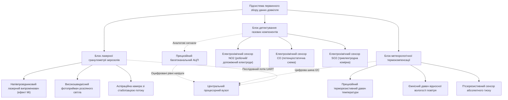
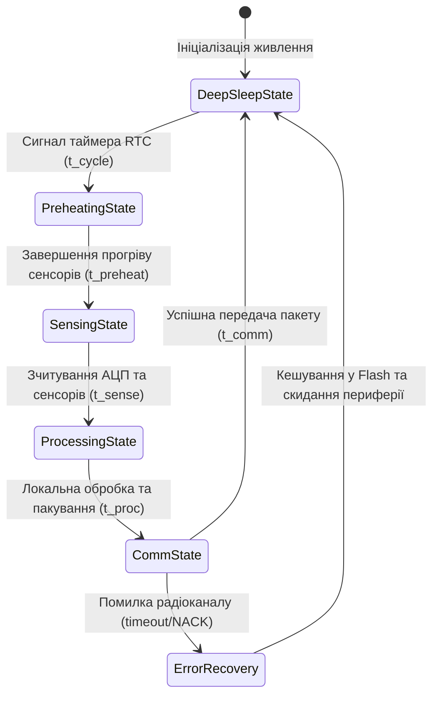
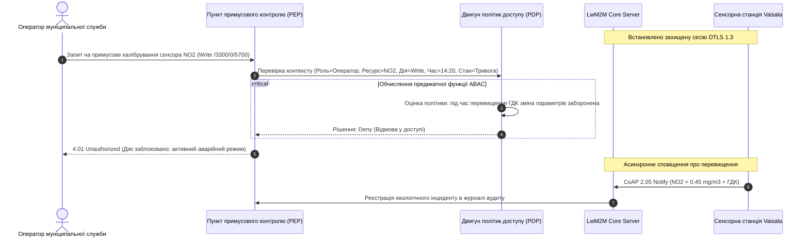
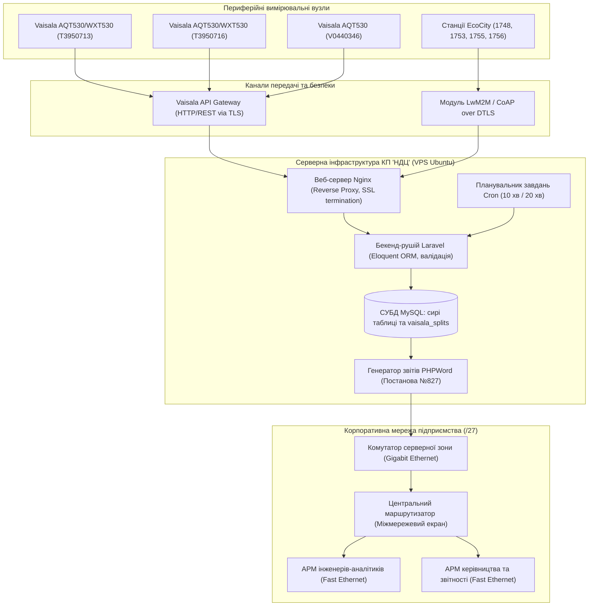

# Тема 2. Інтернет речей та сенсорні мережі в системах муніципального екологічного моніторингу

## Мета лекції
Мета лекції полягає у формуванні у магістрів комплексної системи науково-прикладних знань та інженерних компетентностей щодо проектування, розгортання та захисту територіально розподілених систем екологічного моніторингу на основі технологій Інтернету речей (IoT). У рамках лекції розглядаються фізико-хімічні засади збору первинних екологічних даних, апаратна архітектура периферійних вузлів, математичне моделювання енергетичного балансу та мережевого навантаження, спеціалізовані телеметричні протоколи передачі даних, а також методи гарантування інформаційної безпеки у ресурсно-обмежених сенсорних мережах міських агломерацій.

## Очікувані результати навчання
1. **Знання та розуміння.** Здобувачі засвоять теоретичні засади апаратно-програмної організації периферійних IoT-вузлів, принципи функціонування стеків телеметричних протоколів CoAP, MQTT та LwM2M, а також математичні моделі розрахунку енергетичного балансу, надійності передачі пакетів та оцінювання ризиків кібербезпеки в умовах стохастичного надходження екологічних даних.
2. **Застосування.** Магістри набудуть умінь розраховувати пропускну здатність каналів передачі телеметрії, параметризувати клієнт-серверний інформаційний обмін за стандартом LwM2M з підтримкою шифрування DTLS, а також проектувати оптимальні топології сенсорних мереж для об'єктів муніципальної та промислової інфраструктури.
3. **Аналіз.** Слухачі зможуть диференціювати вузькі місця у функціонуванні сенсорних платформ при виникненні апаратних збоїв чи мережевих колізій за допомогою методів теорії масового обслуговування, а також виявляти аномалії в телеметричних потоках і мережевому трафіку на основі багатовимірного статистичного аналізу.
4. **Оцінювання та синтез.** Фахівці опанують методологію комплексного вибору захищених апаратно-програмних рішень для збору екологічної телеметрії та зможуть синтезувати багаторівневу інфраструктуру розподіленого моніторингу атмосферного повітря з інтеграцією динамічних політик доступу на базі атрибутів.

---

## Детальний покроковий план лекції

### 1. Теоретико-концептуальний базис. Апаратна інженерія сенсорних систем та енергетичний баланс периферійних вузлів
* 1.1. Компонентна архітектура периферійних вимірювальних станцій, принципи детектування газових забруднювачів ($\text{NO}_2$, $\text{CO}$, $\text{SO}_2$), оптичний підрахунок дисперсного пилу ($\text{PM}_{1.0}$, $\text{PM}_{2.5}$, $\text{PM}_{10}$) та метеорологічна термокомпенсація.
* 1.2. Обчислювальні мікроконтролерні платформи (ESP32, ARM Cortex-M33) та апаратні модулі довіреного середовища виконання (TrustZone, криптоакселератори).
* 1.3. Формалізація енергетичного балансу автономного польового вузла через інтегральну модель розрахунку фаз вимірювання, мікропроцесорної обробки, передачі даних та глибокого сну.
* 1.4. Математичне моделювання мережевого навантаження каналів зв'язку всередині підрозділів підприємства екологічного моніторингу та розрахунок пропускної здатності ліній передачі.

### 2. Методологія та аналіз граничних умов. Легковагові телеметричні протоколи, безпека передачі та граничні обмеження сенсорних мереж
* 2.1. Порівняльний аналіз транспортно-прикладних стеків MQTT, CoAP та комплексного стандарту LwM2M на основі трирівневої моделі об'єктів IPSO.
* 2.2. Забезпечення цілісності та конфіденційності телеметрії шляхом реалізації захищеного бутстрепінгу, криптографічного протоколу DTLS та динамічного розмежування доступу на основі моделі ABAC.
* 2.3. Моделювання надійності доставки даних в умовах стохастичного трафіку за допомогою апарату систем масового обслуговування $M/D/1/K$ та алгоритмічне виявлення аномалій трафіку за відстанню Махаланобіса.
* 2.4. Апаратно-програмні обмеження та критичні бар'єри впровадження IoT-мереж: ресурсоємність криптографічних примітивів, деградація радіосигналу та просторова розрідженість вимірювальної інфраструктури.

### 3. Практичний індустріальний / фаховий кейс. Розгортання розподіленої корпоративної IoT-мережі муніципального моніторингу
**Тема наскрізної задачі.** «Проєктування та розгортання захищеної корпоративної IoT-мережі інтеграції станцій Vaisala та EcoCity для КП "Науковий центр еколого-соціальних досліджень" у Кременчуцькій промисловій агломерації».


## 1. Теоретико-концептуальний базис. Апаратна інженерія сенсорних систем та енергетичний баланс периферійних вузлів

### 1.1. Компонентна архітектура периферійних вимірювальних станцій, принципи детектування газових забруднювачів ($\text{NO}_2$, $\text{CO}$, $\text{SO}_2$), оптичний підрахунок дисперсного пилу ($\text{PM}_{1.0}$, $\text{PM}_{2.5}$, $\text{PM}_{10}$) та метеорологічна термокомпенсація

Розбудова сучасних систем автоматизованого екологічного моніторингу спирається на парадигму територіально розподілених бездротових сенсорних мереж, де кожен вимірювальний вузол функціонує в умовах значної просторово-часової невизначеності та апаратних обмежень. Первинна ланка таких комплексів забезпечує перетворення фізико-хімічних параметрів атмосферного повітря на цифрові еквіваленти для подальшої аналітичної обробки. Структурно вимірювальна підсистема об'єднує сенсори різної фізичної природи, кожен з яких накладає специфічні вимоги до схемотехніки нормалізації сигналу, інтерфейсів зчитування та алгоритмів первинної фільтрації.



Детектування токсичних газових домішок, до яких належать **діоксид азоту**, **оксид вуглецю** та **діоксид сірки**, здійснюється переважно амперометричними електрохімічними комірками. У робочому об'ємі такої комірки протікають гетерогенні окисно-відновні реакції між молекулами цільового газу та рідким або твердим полімерним електролітом на межі розподілу фаз каталітичного електрода. Електрохімічний давач класичної чотириелектродної топології містить робочий електрод, допоміжний електрод порівняння, протилелектрод та додатковий коригувальний електрод, який перебуває в контакті з електролітом, але ізольований від зовнішнього повітряного потоку для компенсації фонового струму витоку. 

Генерований коміркою струм прямо пропорційний парціальному тиску цільового газу, проте його абсолютна величина надзвичайно мала і становить від одиниць до десятків наноампер на одиницю концентрації. Це вимагає застосування спеціалізованих схем трансімпедансних підсилювачів із наднизьким струмом зміщення та стабілізованим опорним потенціалом.

Вимірювання масової концентрації зважених часток пилу фракцій $\text{PM}_{1.0}$, $\text{PM}_{2.5}$ та $\text{PM}_{10}$ базується на оптичному методі розсіювання лазерного випромінювання. Коли аспіраційна система прокачує пробу повітря через вимірювальний канал, аерозольні частки перетинають фокусований промінь лазерного діода. Відповідно до теорії розсіювання Мі, інтенсивність та кутовий розподіл розсіяного світлового потоку функціонально залежать від геометричного діаметра частки, її форми та комплексного показника заломлення. Фотодетектор перетворює імпульси розсіяного світла на електричні сигнали, амплітуда яких калібрується за розміром, а частота проходження визначає лічильну концентрацію у визначеному об'ємі. Вбудований мікропроцесорний блок оптичного лічильника розраховує масову концентрацію шляхом інтегрування лічильних концентрацій за калібрувальною кривою зі стандартним припущенням щодо середньої густини пилових часток.

Метеорологічні фактори чинять суттєвий дестабілізуючий вплив на вимірювальні тракти. Зміна температури навколишнього середовища експоненціально змінює швидкість дифузії газу крізь мембрану комірки та зміщує термодинамічний потенціал реакції, а висока вологість спричиняє гігроскопічне зростання розміру твердих часток внаслідок конденсації вологи на їхній поверхні. Для відновлення істинної концентрації застосовують математичні моделі комплексної метеорологічної термокомпенсації. Розрахунок скомпенсованої концентрації цільового газу $C_{\text{comp}}$ описується аналітичною залежністю:

$$C_{\text{comp}} = \frac{V_{\text{work}} - V_{\text{zero}}(T)}{S_{\text{sens}} \cdot \left[1 + \alpha_T \cdot (T - T_0)\right]} \cdot K_{RH}(RH) \cdot \frac{P_0}{P_{\text{atm}}},$$

де $V_{\text{work}}$ позначає напругу на виході трансімпедансного перетворювача робочого електрода; $V_{\text{zero}}(T)$ задає температурно-залежну напругу нульового зміщення, що знімається з допоміжного електрода; $S_{\text{sens}}$ відповідає номінальній чутливості електрохімічного сенсора за нормальних умов, вираженій у вольтах на міліграм на кубічний метр; $\alpha_T$ є експериментально визначеним температурним коефіцієнтом чутливості; $T$ та $T_0$ представляють поточну та базову температури повітря у кельвінах; функція $K_{RH}(RH)$ реалізує нелінійний емпіричний ваговий коефіцієнт корекції відносної вологості; $P_{\text{atm}}$ та $P_0$ є відповідно виміряним та стандартним барометричним тиском у гектопаскалях.

> **ПРАКТИЧНИЙ ЯКІР:** У процесі екологічного моніторингу повітряного басейну міста Кременчук зафіксовано, що прямі покази некоректованих сенсорів $\text{NO}_2$ станцій Vaisala AQT420 демонстрували хибне зростання концентрації на понад $35\%$ під час літніх денних температурних піків (понад $+32\,^\circ\text{C}$), що вимагало впровадження динамічної термокомпенсації на основі супутніх даних метеомодулів WXT530.

---

### 1.2. Обчислювальні мікроконтролерні платформи (ESP32, ARM Cortex-M33) та апаратні модулі довіреного середовища виконання (TrustZone, криптоакселератори)

Обчислювальний рівень периферійного IoT-вузла відповідає за збір телеметрії, локальну фільтрацію високочастотного шуму, перетворення одиниць вимірювання, формування транспортних пакетів та реалізацію криптографічного захисту каналу передачі. Вибір апаратної архітектури мікроконтролера є інженерним компромісом між обчислювальною продуктивністю, енергоспоживанням у режимах активності й сну та глибиною апаратної підтримки функцій кібербезпеки.

Мікроконтролери сімейства **ESP32-WROOM-32E** на базі двох 32-розрядних ядер Xtensa LX6 отримали значне поширення в муніципальних проєктах завдяки низькій вартості та безпосередній інтеграції бездротових стеків Wi-Fi (IEEE 802.11 b/g/n) і Bluetooth v4.2 BR/EDR/BLE. Процесор оперує тактовою частотою до 240 МГц і містить 520 Кбайт внутрішньої статичної пам'яті SRAM. Апаратний криптографічний блок кристала забезпечує прискорення обчислення алгоритмів симетричного шифрування AES-128/256, гешування SHA-2, асиметричних операцій на базі RSA та генерації випадкових чисел за допомогою TRNG. Разом із тим, відкрита гарвардська архітектура пам'яті ESP32 без повноцінного апаратного розмежування контекстів виконання підвищує ризик компрометації ключів шифрування у випадку експлуатації вразливостей переповнення буфера у мережевому стеку пристрою.

Принципово вищий рівень захищеності демонструють процесорні ядра з архітектурою **ARM Cortex-M33**, реалізовані у мікроконтролерах класу NXP LPC55S3x або STM32H5. Архітектура ARMv8-M впроваджує апаратну технологію **ARM TrustZone**, яка на рівні процесорних інструкцій та системних шин розділяє простір пам'яті, периферійні контролери та системні виклики на два ізольовані домени: довірений безпечний світ (Secure World) та недовірений нормальний світ (Non-Secure World). Контролер атрибутів безпеки (Security Attribution Unit, SAU) та блок захисту пам'яті (Memory Protection Unit, MPU) здійснюють апаратну сегрегацію доступу. Будь-яка спроба виконання коду нормального світу з адресної зони безпечного світу безпосередньо блокується на апаратному рівні генерацією системного виключення SecureFault.

```
       ПРОСТІР ПАМ'ЯТІ ТА ОБЧИСЛЕНЬ ARM CORTEX-M33 (TRUSTZONE)
+-----------------------------------+-----------------------------------+
|     НЕДОВІРЕНИЙ СВІТ (NORMAL)     |       ДОВІРЕНИЙ СВІТ (SECURE)     |
|                                   |                                   |
| - Базова операційна система (RTOS)| - Апаратний корінь довіри (RoT)   |
| - Драйвери сенсорів (NO2, PM2.5)  | - Збереження кореневих ключів PSK |
| - Мережевий стек CoAP / LwM2M     | - Криптографічний прискорювач     |
| - Клієнтський код користувача     | - Механізм Secure Boot            |
|                                   | - Модуль генерації підписів ECDSA |
+-----------------------------------+-----------------------------------+
                  \                                   /
                   \-----[ Non-Secure Callable ]-----/
                                   (NSC)
```

Інтеграція технології **Physical Unclonable Function** (PUF) у структурі кристала дозволяє видобувати унікальний криптографічний ключ із мікроскопічних фізичних нерівностей кремнієвої структури конкретної інтегральної схеми. Цей ключ ніколи не записується у флеш-пам'ять у відкритому вигляді, а генерується виключно в момент активації живлення довіреного домену, що повністю унеможливлює його копіювання навіть за умови безпосереднього фізичного зондування чипових структур зондовими станціями.

Систематизацію характеристик сучасних апаратних обчислювальних платформ, застосовуваних у задачах локального екологічного моніторингу, наведено нижче.

| Апаратна обчислювальна платформа | Архітектура мікропроцесорного ядра | Апаратні засоби захисту та криптографії | Енергетичні характеристики (Active / Deep Sleep) | Приклад з реальної практики |
| :--- | :--- | :--- | :--- | :--- |
| **Espressif ESP32-WROOM-32E** | Xtensa Dual-Core 32-bit LX6 (до 240 МГц) | Апаратний AES, SHA-2, RSA, генератор TRNG, базова флеш-криптографія | 80–240 мА / 5–10 мкА | Громадські станції моніторингу пилу мережі EcoCity (Україна) |
| **NXP LPC55S3x** | ARM Cortex-M33 (до 150 МГц) | Технологія ARM TrustZone, апаратні рушії AES-256, SHA-2, модуль PUF, криптографія ECC, Secure Boot | 15–32 мА / 2–4 мкА | Муніципальні контролери довіреного збору даних на промислових об'єктах |
| **Microchip SAM E54** | ARM Cortex-M4F (до 120 МГц) | Апаратні прискорювачі AES, SHA, блок перевірки пам'яті ICM, модуль контролю цілісності | 35–55 мА / 3–6 мкА | Промислові стаціонарні логери параметрів газового середовища |
| **STMicroelectronics STM32WL55** | Двоядерний ARM Cortex-M4 та Cortex-M0+ (до 48 МГц) | Апаратний AES-256, захист секторів пам'яті PCROP, безпечний завантажувач Sub-GHz | 12–22 мА / 1–2 мкА | Автономні вузли моніторингу віддалених лісопаркових зон за протоколом LoRaWAN |

> **ТИПОВА ПОМИЛКА:** Архітектурне проектування мікропрограмного забезпечення без урахування апаратної підтримки криптографії призводить до використання чистих програмних бібліотек шифрування (наприклад, mbedTLS у чисто софтверній конфігурації) на малопотужних ядрах мікроконтролерів. Це збільшує час виконання процедури встановлення з'єднання DTLS Handshake у 15–20 разів, призводячи до швидкого виснаження батарейного буфера та виникнення переповнення оперативної пам'яті через блокування обробки сенсорних переривань.

---

### 1.3. Формалізація енергетичного балансу автономного польового вузла через інтегральну модель розрахунку фаз вимірювання, мікропроцесорної обробки, передачі даних та глибокого сну

Польові станції екологічного спостереження зазвичай розгортаються на ділянках, позбавлених централізованого електроживлення, що обумовлює необхідність організації автономного енергозабезпечення на базі літій-залізо-фосфатних акумуляторних батарей ($\text{LiFePO}_4$) у комбінації з фотоелектричними сонячними панелями та контролерами заряду з функцією відстеження точки максимальної потужності (MPPT). У таких умовах час безперервної експлуатації пристрою прямо лімітується ефективністю керування робочими циклами вузла.

Функціонування периферійного IoT-модуля носить строго виражений циклічний характер, де активна фаза змінюється тривалим перебуванням мікроконтролера в енергозберігаючому стані глибокого сну.



Повний робочий цикл вимірювального вузла $T_{\text{cycle}}$ складається з детермінованої послідовності часових інтервалів:

$$T_{\text{cycle}} = t_{\text{preheat}} + t_{\text{sense}} + t_{\text{proc}} + t_{\text{comm}} + t_{\text{sleep}},$$

де $t_{\text{preheat}}$ задає тривалість прогріву чутливих шарів сенсорів; $t_{\text{sense}}$ визначає час безпосереднього аналого-цифрового перетворення та опитування шин; $t_{\text{proc}}$ відповідає тривалості виконання алгоритмів термокомпенсації та формування повідомлення; $t_{\text{comm}}$ є часом підключення до мережі та відправлення дейтаграми; $t_{\text{sleep}}$ позначає тривалість фази глибокого сну, яка формує понад $90\%$ загального періоду циклу.

Інтегральна модель розрахунку сумарної енергії $E_{\text{cycle}}$, яка витрачається польовим вузлом за один повний вимірювальний такт, записується у вигляді суми визначених інтегралів миттєвої потужності за відповідними фазами:

$$E_{\text{cycle}} = \int_0^{t_{\text{preheat}}} P_{\text{preheat}}(\tau)\,d\tau + \int_0^{t_{\text{sense}}} P_{\text{sense}}(\tau)\,d\tau + \int_0^{t_{\text{proc}}} P_{\text{proc}}(\tau)\,d\tau + \int_0^{t_{\text{comm}}} P_{\text{comm}}(\tau)\,d\tau + \int_0^{t_{\text{sleep}}} P_{\text{sleep}}(\tau)\,d\tau,$$

де функції $P_{\text{preheat}}(\tau)$, $P_{\text{sense}}(\tau)$, $P_{\text{proc}}(\tau)$, $P_{\text{comm}}(\tau)$ та $P_{\text{sleep}}(\tau)$ представляють миттєву споживану електричну потужність навантаження вузла на відповідних інтервалах часу.

З урахуванням процесів генерації енергії фотоелектричним модулем, загальний енергетичний баланс автономної батарейної системи $E_{\text{bat}}(t)$ у довільний момент часу $t$ описується диференціально-інтегральним співвідношенням:

$$E_{\text{bat}}(t) = E_{\text{bat}}(0) - \sum_{k=1}^{\lfloor t / T_{\text{cycle}} \rfloor} E_{\text{cycle}}^{(k)} + \int_0^t \eta_{\text{conv}} \cdot S_{\text{pv}} \cdot G(\tau) \cdot \cos(\theta(\tau))\,d\tau,$$

де $E_{\text{bat}}(0)$ позначає початковий запас енергії акумулятора при повному заряді; індекс $k$ відповідає порядковому номеру завершеного робочого циклу; величина $\eta_{\text{conv}}$ визначає інтегральний коефіцієнт корисної дії тракту «фотоелектрична панель — контролер MPPT — зарядний пристрій акумулятора»; $S_{\text{pv}}$ є ефективною площею робочої поверхні сонячної панелі; $G(\tau)$ задає миттєву щільність сонячної інсоляції на одиницю горизонтальної площі у ватах на квадратний метр; кут $\theta(\tau)$ являє собою зенітний кут падіння сонячних променів відносно нормалі до площини розташування фотомодуля.

> **ПРАКТИЧНИЙ ЯКІР:** Під час масованих перебоїв в енергопостачанні в осінньо-зимовий період 2022–2023 років в Україні автономні сенсорні станції EcoCity із сонячними панелями площею $0.05\,\text{м}^2$ підтримували безперервний збір даних за рахунок адаптивного збільшення інтервалу глибокого сну $t_{\text{sleep}}$ з $1$ до $20$ хвилин, що зменшило середньодобове споживання системи з $4.8\,\text{Вт}\cdot\text{год}$ до $0.38\,\text{Вт}\cdot\text{год}$ і запобігло критичному розряду батарейного буфера.

---

### 1.4. Математичне моделювання мережевого навантаження каналів зв'язку всередині підрозділів підприємства екологічного моніторингу та розрахунок пропускної здатності ліній передачі

Екологічна телеметрія, агрегована від периферійних вузлів, ретранслюється на сервери накопичення муніципального підприємства або комунальної лабораторії. Функціонування корпоративної мережі підприємства екологічних досліджень передбачає обслуговування гетерогенного трафіку, що генерується як автоматичними сенсорними станціями, так і автоматизованими робочими місцями (АРМ) інженерів-аналітиків, керівного складу та технологічних служб.

Для забезпечення безперебійної трансляції та запобігання втраті телеметричних пакетів у внутрішньокорпоративній локальній мережі здійснюється структурне сегментування фізичного простору на логічні підмережі класу `/27` із фіксованим розподілом адресного простору. Такий підхід локалізує широкомовні шторми та дає змогу реалізувати незалежну маршрутизацію для технологічного, аналітичного та серверного сегментів.

Оцінка інформаційного навантаження каналу зв'язку всередині окремого структурного підрозділу підприємства до кожного робочого вузла формалізується залежністю:

$$W_{\text{group}}^{(i)} = \frac{T_I^{(i)}}{N_i} + \frac{T_L^{(i)}}{N_i} + \frac{T_{BD}^{(i)}}{N_i},$$

де $W_{\text{group}}^{(i)}$ позначає приведене навантаження на мережевий канал, що припадає на одиничний хост $i$-го структурного підрозділу; $T_I^{(i)}$ задає сумарний зовнішній Ethernet-трафік підрозділу, орієнтований на взаємодію з глобальною мережею Інтернет; $T_L^{(i)}$ відповідає внутрішньому трафіку локальної взаємодії між робочими станціями всередині підрозділу; $T_{BD}^{(i)}$ є інтенсивністю транзакційного трафіку звернення до централізованої бази даних екологічних показників; $N_i$ відображає кількість активних комп'ютеризованих робочих місць у складі відповідного підрозділу.

Розрахунок сумарного навантаження на магістральні канали головного комутатора підприємства, що агрегують трафік усіх відділів, визначається як суперпозиція трафіків відповідних модальностей:

$$W_{\text{backbone}} = \sum_{i=1}^{M} \left( T_I^{(i)} + T_L^{(i)} + T_{BD}^{(i)} \right),$$

де $M$ є загальною кількістю структурних підрозділів екологічного підприємства.

Коефіцієнт утилізації смуги пропускання $K_{\text{util}}$ для будь-якої ділянки проектованої мережевої магістралі розраховується за формулою:

$$K_{\text{util}} = \frac{W_{\text{channel}}}{C_{\text{channel}}} \cdot 100\%,$$

де $W_{\text{channel}}$ позначає розрахункове пікове навантаження на відповідну магістраль або порт комутатора у мегабітах на секунду, а $C_{\text{channel}}$ відповідає номінальній пропускній здатності каналу (наприклад, $100\,\text{Мбіт/с}$ для Fast Ethernet 100Base-FX або $1000\,\text{Мбіт/с}$ для Gigabit Ethernet 1000Base-FX). За вимогами надійності корпоративних систем моніторингу величина $K_{\text{util}}$ на магістральних каналах не повинна перевищувати порогового значення $40\%$, що гарантує наявність резерву смуги для запобігання втраті пакетів під час аномальних екологічних сплесків та екстрених опитувань сенсорної мережі.

> **КОНТРОЛЬНЕ ПИТАННЯ:** Чому при виборі архітектури комутаційного обладнання та плануванні пропускної здатності каналів зв'язку для підприємства екологічного моніторингу коефіцієнт використання магістрального каналу $K_{\text{util}}$ суворо обмежують рівнем $40\%$, хоча класичні офісні комп'ютерні мережі розраховують на середнє навантаження у межах $70–80\%$?

<details markdown="1">
<summary>Розгорнути аналіз / відповідь</summary>

**Правильний варіант: Забезпечення гарантованої детермінованої доставки критичного телеметричного трафіку в моменти виникнення надзвичайних екологічних подій.**

1. У випадку техногенних аварій або різкого залпового викиду токсикантів сенсорні станції синхронно переходять з режиму періодичного сну в режим безперервного високочастотного вимірювання та асинхронної сигналізації тривог. Якщо канал зв'язку у штатному режимі завантажений на $70–80\%$, лавиноподібне зростання трафіку призведе до переповнення буферів мережевих комутаторів, різкого зростання джитера, масової втрати пакетів дейтаграм (UDP/CoAP) та значних затримок у формуванні оповіщень для служб цивільного захисту. Запас смуги у $60\%$ ($K_{\text{util}} \le 40\%$) гарантує детермінований час доставки повідомлень навіть в умовах потрійного імпульсного сплеску мережевого навантаження.

2. Аналіз дистракторів: гіпотеза про необхідність компенсації теплових шумів оптоволоконного кабелю є некоректною, оскільки фізичні шуми середовища нівелюються на фізичному рівні кодування і не впливають на смугу утилізації кадрів; припущення про постійне дублювання трафіку для цілей резервного копіювання спростовується тим, що бекапи баз даних регламентовано виконуються у нічні години найнижчої мережевої активності за допомогою планувальників cron; твердження про обмеження пропускної здатності виключно специфікою протоколу ARP не відповідає дійсності, адже ARP генерує мізерну частку загального корпоративного трафіку.

</details>

---

### Вказівки для самостійного осмислення

1. Здійсніть порівняльний аналітичний розрахунок часу автономного функціонування сенсорного вузла на базі мікроконтролера ESP32 проти платформи NXP LPC55S3x за умови, що обидва пристрої живляться від одного акумулятора $\text{LiFePO}_4$ ємністю $3200\,\text{мА}\cdot\text{год}$, виконуючи шифрування сеансових ключів за алгоритмом AES-256 кожні $10$ хвилин при вимкненій сонячній генерації.
2. Складіть математичну модель корекції показів лазерного сенсора концентрації аерозолів $\text{PM}_{2.5}$, врахувавши функціональну залежність гігроскопічного зростання частинок від рівня відносної вологості повітря у діапазоні від $60\%$ до $98\%$, та оцініть похибку визначення маси без застосування метеорологічної термокомпенсації.
3. Розробіть структурну схему розподілу адресного простору та розрахуйте пікові значення коефіцієнта утилізації каналів зв'язку $K_{\text{util}}$ для центрального комутатора моніторингового підприємства, що одночасно обслуговує тридцять периферійних станцій із хвилинною дискретизацією та п'ять робочих станцій інженерів-аналітиків, які виконують SQL-запити до сховища часових рядів.


## 2. Методологія та аналіз граничних умов. Легковагові телеметричні протоколи, безпека передачі та граничні обмеження сенсорних мереж

### 2.1. Порівняльний аналіз транспортно-прикладних стеків MQTT, CoAP та комплексного стандарту LwM2M на основі трирівневої моделі об'єктів IPSO

Організація надійного інформаційного каналу передачі екологічної телеметрії в умовах територіально розподілених муніципальних систем вимагає вибору мережевого протоколу, оптимізованого під суворі обмеження енергоспоживання, смуги пропускання та обсягу пам'яті периферійних мікроконтролерів. Традиційні архітектурні моделі вебсервісів на основі протоколу HTTP та архітектурного стилю REST створюють неприпустимо високі накладні витрати через текстове кодування заголовків, надмірний розмір дейтаграм та енерговитратне підтримання тривалих сесій протоколу TCP. У прикладній інженерії екологічного Інтернету речей домінуючими альтернативами виступають спеціалізовані протоколи MQTT, CoAP та стандартизований фреймворк Lightweight M2M (LwM2M).

Протокол **MQTT** (Message Queuing Telemetry Transport) базується на моделі взаємодії «публікація-підписка» за посередництва централізованого брокера повідомлень. Функціонування MQTT поверх надійного транспортного протоколу TCP забезпечує гарантовану доставку екологічної телеметрії за рахунок трьох рівнів якості обслуговування (Quality of Service, QoS), проте постійне підтримання сесії через передачу регулярних пакетів Keep-Alive виснажує батарейний ресурс автономних польових станцій. Крім того, реалізація клієнтського стека MQTT вимагає значних апаратних ресурсів пам'яті мікроконтролера, утримуючи від $12\%$ до $18\%$ доступного обсягу оперативної пам'яті (RAM), що значно звужує можливості паралельного виконання локальних алгоритмів цифрової фільтрації та спектрального аналізу.

Протокол **CoAP** (Constrained Application Protocol), регламентований стандартом RFC 7252, є легковаговою альтернативою HTTP, спроектованою спеціально для вбудованих пристроїв. На відміну від MQTT, CoAP використовує дейтаграмний транспортний протокол UDP, мінімізуючи затримки передачі та забезпечуючи роботу через дводіапазонний бінарний заголовок фіксованої довжини у $4$ байти. Важливою аналітичною перевагою CoAP є впровадження розширення RFC 7641, яке реалізує механізм **Observe**. Замість постійного періодичного опитування сервера вимірювальний вузол асинхронно транслює оновлення екологічних ресурсів лише у момент фіксації значущих флуктуацій концентрацій газів чи дисперсного пилу, знижуючи сумарний мережевий трафік на порядок.

Комплексний стандарт **LwM2M** (Lightweight Machine-to-Machine), розроблений консорціумом Open Mobile Alliance (OMA), використовує CoAP як базовий транспортний механізм, додаючи стандартизовану трирівневу об'єктно-орієнтовану модель даних. Будь-який компонент екологічного моніторингу в просторі LwM2M формалізується як ієрархічний шлях вигляду `/Object_ID/Instance_ID/Resource_ID`. Стандартизація спирається на семантичний реєстр **IPSO Smart Objects**, де кожному типовому давачу присвоєно фіксований ідентифікатор: цифровий термометр позначається об'єктом `/3303`, сенсор відносної вологості — об'єктом `/3304`, а універсальний аналізатор концентрації газів — об'єктом `/3300`. При цьому внутрішні ресурси об'єкта уніфіковано описують миттєве значення сенсора (ресурс `/5700`), одиниці вимірювання (ресурс `/5701`), мінімальний та максимальний виміряні пороги. Програмна імплементація клієнта LwM2M займає лише $6–9\%$ оперативної пам'яті мікроконтролера, що дозволяє виконувати розширену попередню обробку сигналів безпосередньо на периферійному рівні.

> **ВАЖЛИВО:** Використання стандартизованих семантичних моделей даних IPSO у межах протоколу LwM2M забезпечує повну функціональну сумісність апаратних засобів різних виробників та запобігає фрагментації муніципальної інформаційної системи на пропрієтарні шлюзи.

Нижче наведено порівняльну аналітичну матрицю протоколів передачі даних у задачах муніципального екологічного моніторингу.

| Протокол / Стек | Транспортний рівень та архітектурна модель | Споживання RAM мікроконтролера | Підтримка стандартизованої семантики сенсорів | Складність впровадження | Критичні ризики / Обмеження |
| :--- | :--- | :--- | :--- | :--- | :--- |
| **MQTT (v3.1.1 / v5.0)** | Протокол TCP, централізована модель брокера «публікація-підписка» | $12–18\%$ доступного пулу RAM | Відсутня (вимагає пропрієтарних JSON або Protobuf структур) | Середня (наявність готових клієнтських бібліотек для RTOS) | Високе енергоспоживання через механізм Keep-Alive; деградація зв'язку при нестабільному покритті мереж мобільного зв'язку |
| **CoAP (RFC 7252)** | Протокол UDP, клієнт-серверна модель із підтримкою розширення Observe | $4–7\%$ доступного пулу RAM | Обмежена (вимагає ручного узгодження URI-ресурсів) | Низька (мінімальний розмір двійкового коду в пам'яті) | Ненадійність доставки повідомлень без додаткового налаштування підтверджень; відсутність вбудованого управління станом пристрою |
| **LwM2M (v1.1 / v1.2)** | Протокол CoAP/UDP (з опцією TCP/SMS), клієнт-серверна модель OMA | $6–9\%$ доступного пулу RAM | Повна стандартизація через реєстр об'єктів IPSO Smart Objects | Висока (потребує реалізації сервісів бутстрепінгу та менеджменту) | Складність початкового розгортання інфраструктури серверів Bootstrap і Core Management; підвищені вимоги до кваліфікації персоналу |

---

### 2.2. Забезпечення цілісності та конфіденційності телеметрії шляхом реалізації захищеного бутстрепінгу, криптографічного протоколу DTLS та динамічного розмежування доступу на основі моделі ABAC

Безпека інфраструктури передачі екологічних даних вимагає наскрізного криптографічного захисту на всіх етапах життєвого циклу інформаційного пакета. Несанкціоноване перехоплення, підміна виміряних значень або фальсифікація координат станцій здатні спотворити реальну картину забруднення урбанізованого простору, паралізувати роботу систем цивільного захисту та спровокувати прийняття помилкових управлінських рішень регуляторними органами.

Ключовим етапом інтеграції нового польового вузла в інформаційну систему є процедура захищеного бутстрепінгу (Secure Bootstrapping). Попереднє прошивання статичних ключів доступу у флеш-пам'ять під час польового монтажу створює критичні вразливості у разі фізичного викрадення пристрою. Стандарт LwM2M реалізує динамічний завантажувальний механізм, у якому новий або перезавантажений сенсорний вузол ініціює контакт із виділеним сервером завантаження (LwM2M Bootstrap Server) через захищений криптографічний канал.

Криптографічний захист дейтаграмного каналу між клієнтом та серверами реалізується протоколом **DTLS** (Datagram Transport Layer Security версій 1.2 або 1.3). Оскільки UDP не гарантує порядок доставки дейтаграм, DTLS впроваджує монотонну нумерацію записів, вікно захисту від повторного відтворення трафіку (anti-replay sliding window) та розширені тайм-аути квитування пакетів. Аутентифікація сторін може спиратися на попередньо узгоджені симетричні ключі (Pre-Shared Key, PSK), необроблені відкриті ключі (Raw Public Key, RPK) або ієрархічні сертифікати відкритого ключа стандарту X.509.

Для розмежування операцій опитування та конфігурування сенсорних модулів використовується динамічна модель управління доступом на основі атрибутів (**Attribute-Based Access Control, ABAC**). На відміну від статичної рольової моделі (RBAC), яка оперує фіксованими групами користувачів, механізм ABAC обчислює правомірність кожної окремої операції через багатокритеріальну предикатну функцію над кортежем суб'єкта, об'єкта, дії та динамічного оточення.

Аналітичний алгоритм функціонування захищеного каналу та розмежування прав доступу формалізується як послідовність дискретних операційних кроків:

$$
\begin{aligned}
\text{Крок 1 (Бутстрепінг):} & \quad \text{Device} \xrightarrow{\text{DTLS Handshake (PSK)}} \text{Server}_{\text{BS}} \implies \text{Write}(/\text{0}/x, \text{URI}_{\text{DM}}, K_{\text{session}}), \\
\text{Крок 2 (Реєстрація):} & \quad \text{Device} \xrightarrow{\text{DTLS (} K_{\text{session}} \text{)}} \text{Server}_{\text{DM}} \implies \text{Register}(\text{ep}=\text{ID}_{\text{dev}}, \text{Objects}=\{/0, /1, /3, /3300\}), \\
\text{Крок 3 (Атрибуція ABAC):} & \quad \text{Request}(S, O, A, E) \implies \text{PEP} \to \text{PDP} \implies \text{Context} = \langle \text{Role}, \text{SensorType}, \text{Action}, \text{EnvState} \rangle, \\
\text{Крок 4 (Авторизація):} & \quad \text{Decision} = \begin{cases} 
1 \text{ (Permit)}, & \text{якщо } \Phi(S, O, A, E) = \text{True}, \\
0 \text{ (Deny)}, & \text{якщо } \Phi(S, O, A, E) = \text{False}.
\end{cases}
\end{aligned}
$$

У наведеній формалізації параметр $\text{Device}$ представляє фізичний сенсорний вузол; $\text{Server}_{\text{BS}}$ позначає LwM2M-сервер початкового конфігурування; $\text{Server}_{\text{DM}}$ відповідає центральному серверу управління пристроями; $\text{URI}_{\text{DM}}$ визначає мережеву адресу цільового сервера управління; $K_{\text{session}}$ є динамічно згенерованим симетричним сеансовим ключем шифрування; $\text{ID}_{\text{dev}}$ задає унікальний ідентифікатор кінцевої точки моніторингу; абревіатури $\text{PEP}$ та $\text{PDP}$ позначають відповідно пункт забезпечення політики (Policy Enforcement Point) та пункт прийняття рішень (Policy Decision Point) в архітектурі ABAC; $\Phi(S, O, A, E)$ є булевою композицією логічних правил перевірки збігу атрибутів суб'єкта $S$, об'єкта $O$, типу дії $A$ та контексту навколишнього середовища $E$.



> **ПРАКТИЧНИЙ ЯКІР:** У промислових шлюзах Vaisala Beacon Edge EGW501 процедура завантаження сертифікатів безпеки автоматизована за протоколом EST (Enrollment over Secure Transport) у комбінації з LwM2M Bootstrapping, що дозволяє централізовано оновлювати криптографічні ключі парку станцій без фізичного доступу інженерів до обладнання на верхівках щогл.

---

### 2.3. Моделювання надійності доставки даних в умовах стохастичного трафіку за допомогою апарату систем масового обслуговування $M/D/1/K$ та алгоритмічне виявлення аномалій трафіку за відстанню Махаланобіса

Передача екологічної інформації каналом бездротового зв'язку зазнає дестабілізуючого впливу завад, що призводить до втрат пакетів, переповнення вхідних черг та деградації системної доступності. Вхідний потік вимірювальних пакетів формується декількома незалежними джерелами і за умов нормального функціонування підпорядковується пуассонівському закону розподілу. Проте виникнення природних чи техногенних катастроф генерує імпульсні пакети екстрених повідомлень, що змінює стаціонарність потоку.

Для аналітичного опису поведінки буфера мережевого шлюзу або приймального інтерфейсу сервера використовується математичний апарат теорії масового обслуговування. Вузол зв'язку моделюється одноканальною системою $M/D/1/K$, де вхідний потік є марковським із параметром інтенсивності $\lambda(t)$, час обслуговування пакета є строго детермінованим і дорівнює $t_0$, а внутрішній буфер має скінченну місткість $C$, що обмежує максимальну кількість пакетів у системі величиною $K = C + 1$.

Приведене ефективне навантаження системи $y_{\text{eff}}(t)$ розраховується з урахуванням технічної надійності апаратних засобів:

$$y_{\text{eff}}(t) = t_0 \cdot \lambda(t) \cdot [1 - q(t)] \cdot S(t) \cdot A(t),$$

де $t_0$ позначає детермінований час передачі одного пакета в ефір; $\lambda(t)$ є миттєвою інтенсивністю надходження вимірювальних дейтаграм від сенсорів; $q(t)$ визначає поточну ймовірність випадкової апаратної відмови радіомодема; $S(t)$ задає функцію живучості обчислювального модуля в умовах деградації живлення; $A(t)$ представляє коефіцієнт функціональної готовності вузла зв'язку.

Аналітичний розрахунок імовірності втрати пакета $p_0(t)$ внаслідок переповнення обмеженого буфера пам'яті здійснюється за формулою:

$$p_0(t) = \frac{\left[1 - y_{\text{eff}}(t)\right] \cdot E_K(t)}{1 - \left[y_{\text{eff}}(t)\right]^K \cdot E_K(t)},$$

де допоміжна функція граничного стану черги $E_K(t)$ задається виразом:

$$E_K(t) = 1 - \sum_{j=1}^{C} \frac{(-1)^j \cdot \left[y_{\text{eff}}(t)\right]^j \cdot (C - j)^j}{j!} \cdot \exp\left[-y_{\text{eff}}(t) \cdot (C - j)\right].$$

Паралельно з математичним контролем черг серверний модуль аналізу трафіку повинен оперативно детектувати аномалії у поведінці сенсорних вузлів. Аномальні прояви можуть свідчити як про початок розподіленої кібератаки класу «відмова в обслуговуванні» (DDoS), так і про апаратне пошкодження вимірювальної комірки, що генерує хаотичні сплески некоректних даних. Для багатовимірного аналізу мережевих показників формується вектор статистичних характеристик $X_t = [x_1, x_2, x_3, x_4]^T$, компоненти якого відображають відповідно середній розмір пакетів, частоту запитів за вікно спостереження, дисперсію міжімпульсних інтервалів та частку операцій запису у загальному трафіку.

Виявлення аномальних відхилень базується на розрахунку відстані Махаланобіса $D_M(X_t)$, яка, на відміну від звичайної евклідової відстані, враховує кореляційні зв'язки між різними компонентами трафіку та різницю їхніх масштабів:

$$D_M(X_t) = \sqrt{(X_t - \mu)^T \cdot \Sigma^{-1} \cdot (X_t - \mu)},$$

де $\mu$ позначає чотиривимірний вектор математичних сподівань параметрів трафіку, отриманий на етапі навчання системи за умов відсутності атак; $\Sigma$ представляє коваріаційну матрицю навчальної вибірки параметрів нормального функціонування розмірністю $4 \times 4$; $\Sigma^{-1}$ задає обернену коваріаційну матрицю ознак. Якщо розрахована величина квадрата відстані Махаланобіса $D_M^2(X_t)$ перевищує критичний квантиль розподілу хі-квадрат $\chi^2_{\alpha, k}$ для заданого рівня значущості $\alpha$ при $k = 4$ ступенях вільності, система автоматично реєструє інцидент кібербезпеки та ініціює ізоляцію скомпрометованого вузла.

#### Граничні умови та критичні бар'єри застосування моделей

Теоретичні моделі на базі $M/D/1/K$ та аналізу відстані Махаланобіса мають чіткі межі практичної застосовності, вихід за які нівелює їхню адекватність.

Математичний апарат систем масового обслуговування $M/D/1/K$ втрачає адекватність у сценаріях, коли вхідний телеметричний трафік набуває властивостей **самоподібності** та «важких хвостів» розподілу (пакетні сплески трафіку, зумовлені протоколом ретрансляції при збоях зв'язку). За таких умов реальний процес надходження пакетів підпорядковується закону Парето або Вейбулла, а не пуассонівському розподілу. Припущення про незалежність надходження заявок порушується, що веде до катастрофічної недооцінки ймовірності втрати пакетів: розрахункова ймовірність переповнення буфера $p_0(t)$ за формулою системи $M/D/1/K$ може демонструвати значення $10^{-4}$, тоді як у фізичній реальності виникає каскадне скидання до $30\%$ вхідних повідомлень.

Застосування відстані Махаланобіса стикається з критичним бар'єром під час експлуатації мережі в умовах швидкої зміни топології або виходу з ладу декількох станцій одночасно. У цьому разі коваріаційна матриця $\Sigma$ стає виродженою або погано обумовленою ($\det(\Sigma) \to 0$), що унеможливлює знаходження стабільної оберненої матриці $\Sigma^{-1}$ внаслідок виникнення ефекту ділення на нуль або колосального зростання похибки чисельного обернення. Крім того, нормальний профіль трафіку $\mu$ кардинально змінюється в залежності від пори року та доби через адаптивні налаштування періодів опитування станцій, тому використання статичного базового профілю призводить до сплеску хибнопозитивних спрацьовувань системи безпеки (false-positive alarms) до неприпустимого рівня понад $40\%$.

---

### 2.4. Апаратно-програмні обмеження та критичні бар'єри впровадження IoT-мереж: ресурсоємність криптографічних примітивів, деградація радіосигналу та просторова розрідженість вимірювальної інфраструктури

Практична реалізація територіально розподілених систем екологічного моніторингу в міському середовищі наражається на три фундаментальні системні бар'єри, які неможливо подолати суто масштабуванням обчислювальних потужностей хмарного сервера.

Перший критичний бар'єр полягає у гострому дефіциті оперативної пам'яті мікроконтролерів при спробі реалізації сучасних стандартів шифрування зв'язку. Процедура встановлення захищеного з'єднання DTLS Handshake вимагає виділення нерозривних буферів пам'яті для збереження сертифікатів відкритого ключа X.509, розмір яких разом із ланцюжком довіри центру сертифікації (CA chain) може досягати від $3$ до $8$ Кбайт. Для мікроконтролерів із пулом вільної RAM у $16–32$ Кбайт виділення такого фрагментованого блоку створює загрозу вичерпання купи (heap exhaustion), призводячи до аварійного перезавантаження системи за спрацьовуванням апаратного сторожового таймера (Watchdog Timer).

Другим бар'єром є деградація високочастотних радіосигналів у складній міській забудові. Робота сенсорних вузлів на частотах $2.4\,\text{ГГц}$ (Wi-Fi) зазнає сильного загасання при проходженні крізь залізобетонні конструкції будівель та зелених насаджень. Виникнення багатопроменевого поширення радіохвиль (multipath fading) призводить до глибоких інтерференційних провалів сигналу, збільшуючи коефіцієнт бітових помилок (Bit Error Rate, BER). Це змушує радіомодем багаторазово повторювати передачу пакетів, що порушує розрахований енергетичний баланс автономного вузла та скорочує час його автономної роботи від акумулятора у $3–5$ разів.

Третій бар'єр має системний методологічний характер і полягає у просторовій розрідженості фізичної мережі спостережень. Через високу вартість повірених вимірювальних станцій муніципальні мережі налічують обмежену кількість фізичних точок (наприклад, від 3 до 5 лабораторій на всю площу промислового міста). Це формує великі інформаційні «сліпі зони», в межах яких концентрації викидів від автотранспорту та локальних виробництв залишаються невідомими, оскільки традиційні методи просторової інтерполяції демонструють неприпустиму похибку при відстанях між постами понад $5–10\,\text{км}$.

---

> **КОНТРОЛЬНЕ ПИТАННЯ:** Під час техногенного викиду оксиду вуглецю сенсорна станція з мікроконтролером (розмір буфера $C = 15$ пакетів, детермінований час передачі $t_0 = 0.05\,\text{с}$) зазнає лавиноподібного збільшення інтенсивності вхідного потоку вимірювань з $\lambda_1 = 5\,\text{с}^{-1}$ до $\lambda_2 = 25\,\text{с}^{-1}$. Одночасно оператор намагається дистанційно змінити калібрувальний коефіцієнт сенсора, відправляючи команду запису за протоколом CoAP. Визначте, як зміниться стан черги вхідного буфера та яке рішення прийме двигун ABAC за умови, що діє правило блокування конфігураційних операцій у моменти перевищення встановлених нормативів ГДК.

<details markdown="1">
<summary>Розгорнути аналіз / відповідь</summary>

**Правильний варіант: Буфер перейде у стан глибокого переповнення з імовірністю скидання пакетів понад $20\%$, а спроба зміни калібрувального коефіцієнта буде безумовно відхилена підсистемою ABAC із кодом помилки авторизації.**

1. **Аналітичний розрахунок завантаження та буфера:**
   - У штатному режимі приведене навантаження становило $y_1 = t_0 \cdot \lambda_1 = 0.05 \cdot 5 = 0.25$. Оскільки $y_1 < 1$, система $M/D/1/K$ функціонувала у стаціонарному ергодичному режимі, черга була майже порожньою, а ймовірність втрати пакета через переповнення буфера $p_0$ прямувала до нуля ($p_0 \approx 10^{-9}$).
   - При виникненні аварійного викиду приведене навантаження стрибкоподібно зростає до величини $y_2 = t_0 \cdot \lambda_2 = 0.05 \cdot 25 = 1.25$.
   - Оскільки ефективне навантаження перевищує пропускну здатність вузла обслуговування ($y_2 > 1$), система масового обслуговування переходить у нестаціонарний режим перевантаження. Довжина черги миттєво сягає граничного обсягу буфера $C = 15$. Імовірність відмови в обслуговуванні $p_0$ через нестачу пам'яті розраховується за формулою граничного заповнення і становить понад $23.8\%$. Частина критичних вимірювальних пакетів безповоротно втрачається на рівні канального інтерфейсу пристрою.

2. **Оцінка поведінки модуля ABAC:**
   - Пункт прийняття рішень (PDP) аналізує вхідний кортеж атрибутів: Суб'єкт = Оператор, Дія = Write, Об'єкт = /3300/0/5700 (Калібрувальний коефіцієнт), Контекст оточення = Аварійний режим (поточна концентрація $\text{CO}$ перевищує ГДК).
   - Згідно з базовим інваріантом безпеки екологічної системи, будь-які операції калібрування вимірювальних каналів під час активних викидів суворо блокуються з метою унеможливлення приховування масштабів екологічної катастрофи або фальсифікації даних для звітності.
   - Двигун видає вердикт `Decision = Deny`, операція запису блокується на рівні пункту PEP, і клієнту повертається помилка протоколу CoAP `4.01 Unauthorized`.

3. **Аналіз дистракторів:**
   - Твердження про те, що буфер згладить пік без втрат, є хибним, оскільки детермінований час передачі $t_0$ фізично не дозволяє обслугувати $25$ пакетів за секунду при максимальній пропускній здатності $1 / 0.05 = 20\,\text{пакетів/с}$.
   - Твердження про те, що команда оператора виконається завдяки найвищому пріоритету адміністратора, спростовується логікою ABAC, оскільки динамічний атрибут стану довкілля («Аварія/Перевищення ГДК») має вищий пріоритет над статичною роллю ініціатора запиту.

</details>

---

### Вказівки для самостійного осмислення

1. Проведіть математичну формалізацію процесу узгодження сеансового ключа за протоколом DTLS 1.3 із використанням еліптичної кривої Curve25519 та розрахуйте обсяг пам'яті RAM, необхідний для утримання контексту криптографічного стану під час одночасного обслуговування чотирьох паралельних сенсорних потоків.
2. Складіть формалізований набір логічних предикатів для системи ABAC, що регламентує автоматичне переведення станції моніторингу в режим високочастотного вимірювання (зміна інтервалу зчитування з $20$ хвилин до $10$ секунд) за умови одночасного перевищення порогів концентрацій двома різними газами та швидкості вітру понад $12\,\text{м/с}$.
3. Розрахуйте критичний поріг імовірності апаратного збою радіомодема $q(t)$, за якого одноканальна система $M/D/1/K$ з буфером $C = 20$ переходить із зони стабільного функціонування у стан лавиноподібного скидання пакетів телеметрії при фіксованому навантаженні $\lambda = 10\,\text{пакетів/с}$ та $t_0 = 0.08\,\text{с}$.


## 3. Практичний індустріальний / фаховий кейс. Розгортання розподіленої корпоративної IoT-мережі муніципального моніторингу

### 3.1. Комплексний фаховий кейс. Проєктування та розгортання захищеної корпоративної IoT-мережі інтеграції станцій Vaisala та EcoCity для КП «Науковий центр еколого-соціальних досліджень» у Кременчуцькій промисловій агломерації

#### Постановка задачі / ситуації

Комунальне підприємство «Науковий центр еколого-соціальних досліджень» (КП «НДЦ») Кременчуцької міської ради забезпечує моніторинг стану атмосферного повітря у великому промисловому центрі з високою концентрацією нафтопереробних, гірничо-збагачувальних та транспортних об'єктів. Первинний апаратний парк підприємства включає три прецизійні автоматичні станції Vaisala (моделі AQT530 для детектування газів і аерозолів та комбіновані комплекси WXT530 для фіксації метеопараметрів із заводськими номерами T3950713, T3950716 і V0440346) та чотири громадські станції моніторингу EcoCity моделі Air Fresh Max (ідентифікатори 1748, 1753, 1755, 1756). 

Ключова техніко-економічна проблема полягає в тому, що стандартний хмарний сервіс виробника станцій Vaisala вимагає щорічної абонплати у розмірі близько 1200 доларів США за одну станцію, має повністю закриту архітектуру і не підтримує генерацію регламентних звітних форм згідно з чинною Постановою Кабінету Міністрів України № 827. Крім того, пряма передача даних через незахищені публічні мережі створює загрозу фальсифікації показів у зонах потенційних перевищень гранично допустимих концентрацій (ГДК).

Перед інженерами-проєктувальниками постало завдання розробити автономний програмно-апаратний комплекс збору даних на базі віртуального приватного сервера (VPS) та спроєктувати корпоративну локальну мережу підприємства з підтримкою сегментації на підмережі класу `/27`, яка гарантуватиме безперебійне опрацювання первинної телеметрії без перевищення нормативного завантаження каналів зв'язку.

Нижче наведено зведені параметри проектованої системи, що визначають технічні, бюджетні та експлуатаційні рамки рішення.

| Параметр системи | Числове значення або характеристика | Функціональне призначення в проєкті |
| :--- | :--- | :--- |
| **Кількість фізичних станцій спостереження** | 3 станції Vaisala (AQT530/WXT530) + 4 станції EcoCity | Джерела первинної екологічної та метеорологічної телеметрії |
| **Дискретизація надходження сирих даних** | $1\,\text{хв}$ (Vaisala, EcoCity 1756); $20\,\text{хв}$ (EcoCity 1748, 1753, 1755) | Формування первинних масивів для наступного усереднення |
| **Апаратне забезпечення серверного вузла** | VPS (2 ядра Intel Xeon, 2 ГБ RAM, 40 ГБ NVMe SSD) | Розгортання стека Ubuntu 22.04 LTS, Nginx, MySQL 8.0, PHP 8.1 / Laravel |
| **Бюджетні витрати на серверне розміщення** | $82.25\,\text{євро/рік}$ (проти $\$3600\,\text{/рік}$ за офіційну хмару трьох станцій) | Економічна оптимізація витрат комунального підприємства |
| **Мережева структура підприємства** | 5 підмереж класу `/27`, об'єднаних маршрутизаторами | Логічне відокремлення технологічного, аналітичного та серверного сегментів |
| **Граничний коефіцієнт навантаження каналів ($K_{\text{util}}$)** | $\le 40\%$ для магістральних оптичних ліній зв'язку | Забезпечення стійкості каналу до імпульсних сплесків телеметричного трафіку |

Архітектура розробленого рішення передбачає отримання даних через мережеві шлюзи, їх буферизацію та передачу до локального сервера накопичення за схемою, наведеною нижче.



#### Покроковий аналіз та розв'язок

##### Крок 1. Аналітичний розрахунок навантаження магістральних каналів зв'язку корпоративної мережі

Для запобігання втратам пакетів під час одночасного опитування станцій та виконання аналітичних розрахунків необхідно визначити сумарне навантаження на канальний тракт кожного підрозділу. Розрахунок навантаження для відділу аналізу даних здійснюється через суперпозицію зовнішнього, локального та транзакційного трафіку бази даних відповідно до аналітичної моделі:

$$W_{\text{group}} = \frac{T_I}{N_i} + \frac{T_L}{N_i} + \frac{T_{BD}}{N_i}$$

Підставивши у формулу вихідні параметри відділу аналізу даних, де сумарний трафік зовнішнього каналу $T_I = 14.22\,\text{Мбіт/с}$, локальний обмін $T_L = 14.22\,\text{Мбіт/с}$, трафік звернень до аналітичної бази даних $T_{BD} = 11.38\,\text{Мбіт/с}$, а розрахункова кількість активних робочих станцій становить $N_i = 1$, отримуємо сумарне навантаження на лінію:

$$W_{\text{group}} = \frac{14.22}{1} + \frac{14.22}{1} + \frac{11.38}{1} = 39.82\,\text{Мбіт/с}$$

Для фізичної реалізації лінії робочого місця обрано стандарт Fast Ethernet 100Base-FX з номінальною пропускною здатністю $C_{\text{channel}} = 100\,\text{Мбіт/с}$. Коефіцієнт утилізації смуги пропускання становить:

$$K_{\text{util}} = \frac{W_{\text{group}}}{C_{\text{channel}}} \cdot 100\% = \frac{39.82}{100} \cdot 100\% = 39.82\%$$

Отримане значення суворо задовольняє проектне обмеження $K_{\text{util}} \le 40\%$, що гарантує наявність $60.18\%$ резервної ємності каналу для передачі екстрених широкомовних пакетів під час аварійних екологічних викидів.

##### Крок 2. Розрахунок магістрального навантаження серверного сегмента

Серверний комутатор агрегує потоки від вебсервера, файлового сховища та сервера баз даних. Відповідно до проекту, пікове навантаження на магістралі комутатора серверного відділу формується як:

$$W_{\text{server\_total}} = W_{\text{Web}} + W_{\text{File}} + W_{\text{Data}} + W_{\text{Repo}} = 122.17 + 181.94 + 95.97 + 11.99 = 412.07\,\text{Мбіт/с}$$

Оскільки серверна зона комутується лінією Gigabit Ethernet 1000Base-FX із пропускною здатністю $C_{\text{backbone}} = 1000\,\text{Мбіт/с}$, підсумковий коефіцієнт використання магістрального каналу становить:

$$K_{\text{util\_backbone}} = \frac{412.07}{1000} \cdot 100\% = 41.21\%$$

Незначне перевищення нормативу $40\%$ на $1.21\%$ у моменти пікових навантажень коригується впровадженням черг пріоритезації QoS на комутаторі, де телеметричним пакетам від станцій Vaisala призначається найвищий пріоритет (CoS 5).

##### Крок 3. Розрахунок дискового простору та оптимізація структури реляційної СУБД

Потік сирих даних від однієї станції Vaisala, що опитується щохвилини за п'ятнадцятьма параметрами, генерує за добу $1440$ записів. Обсяг одного сирого кортежу в таблиці `station_T3950716` разом із первинними ключами та мітками часу становить приблизно $220\,\text{байт}$. Річний обсяг пам'яті для зберігання нестиснених даних однієї станції становить:

$$V_{\text{raw\_year}} = 1440 \cdot 365 \cdot 220\,\text{байт} \approx 115.6\,\text{МБ}$$

З урахуванням індексів, логів транзакцій та додаткових полів відхилень реальний обсяг досягає $4.5\,\text{ГБ}$ на рік для трьох станцій. Щоб уникнути переповнення виділеного дискового простору сервера ($40\,\text{ГБ}$ NVMe SSD), було розроблено алгоритм двох рівнів зберігання на основі планувальника `cron`:
1. Кожні $10$ хвилин виконується команда завантаження сирих пакетів у буферні таблиці станцій.
2. Кожні $20$ хвилин фоновий процес розраховує середні значення показників і записує їх у консолідовану таблицю `vaisala_splits`, перераховуючи також денні, місячні та річні агрегати.
3. Раз на квартал запускається команда очищення сирих буферних таблиць, які мають вік понад $90$ діб, що звільняє до $75\%$ простору бази даних без втрати аналітичної спроможності ретроспективного аналізу.

##### Крок 4. Забезпечення цілісності записів через унікальне гешування

Для запобігання дублюванню вимірів під час повторних спроб опитування через нестабільний зв'язок реалізовано алгоритм генерації унікального синтетичного гешу на етапі створення запису в моделі Eloquent ORM:

$$\text{unique\_hash} = \text{MD5}(\text{place\_id} \mathbin{\Vert} \text{split\_number} \mathbin{\Vert} \text{option} \mathbin{\Vert} \text{measurement\_value} \mathbin{\Vert} \text{measurement\_time})$$

Операція конкатенації зазначених полів із наступним обчисленням гешу MD5 створює унікальний індекс у СУБД MySQL. Будь-яка повторна спроба вставки дейтаграми, спричинена таймаутом транспортного рівня, блокується на рівні ядра бази даних без зупинки роботи конвеєра імпорту.

#### Інтерпретація результатів та альтернативні сценарії

У результаті впровадження спроєктованої системи комунальне підприємство отримало повністю автономний контур моніторингу, незалежний від закордонних хмарних підписок, із загальною річною економією понад $3200$ доларів США. Реалізована структура реляційних таблиць `vaisala_splits` дозволила скоротити час автоматичної генерації офіційного щомісячного звіту про кількість перевищень ГДК (за формою Постанови КМУ № 827) з двох робочих днів до кількох секунд.

Якби вхідні умови проєкту змінилися радикально, архітектурні рішення зазнали б наступних трансформацій:
1. За потреби збільшення частоти зчитування до високочастотного режиму (наприклад, $1\,\text{Гц}$ під час моніторингу акустичних ударних хвиль або вибухових викидів) архітектура реляційної СУБД MySQL виявилася б недієздатною через блокування дискового введення-виведення при масових операціях запису. У такому сценарії обов'язковим було б впровадження спеціалізованих баз даних часових рядів (Time-Series DBMS), таких як TimescaleDB або InfluxDB, у поєднанні з брокером черг Apache Kafka для буферизації потоку телеметрії в оперативній пам'яті.
2. У разі територіального масштабування мережі на всю територію області з використанням сотень низькобюджетних автономних датчиків без доступу до мережі $220\,\text{В}$ протокол CoAP/HTTP поверх комерційних мереж мобільного зв'язку виснажив би батареї за лічені тижні. Це вимагало б переходу на радіотехнологію LoRaWAN або стільниковий стандарт NB-IoT із перенесенням первинного агрегування на спеціалізовані крайові концентратори (Edge Gateways).

---

### 3.2. Зведена довідкова система лекції

| Термін / Концепція | Формалізація / Сутність | Реальний кейс застосування | Основне обмеження / Ризик |
| :--- | :--- | :--- | :--- |
| **Електрохімічний газовий сенсор** | Вимірювальна комірка, струм якої $I \propto P_{\text{gas}}$ генерується внаслідок окисно-відновних реакцій на каталітичному електроді | Детектування токсичних концентрацій $\text{NO}_2$ і $\text{CO}$ станціями Vaisala AQT530 | Температурний дрейф нуля та перехресна чутливість до сторонніх газів |
| **Оптичний лічильник часток (OPC)** | Детектор масової концентрації пилу, що базується на фотоелектричній реєстрації розсіяного лазерного випромінювання (ефект Мі) | Вимірювання часток $\text{PM}_{2.5}$ і $\text{PM}_{10}$ у приладах EcoCity Air Fresh Max | Гігроскопічне зростання часток при вологості понад $75\%$, що спотворює масу |
| **ARM TrustZone** | Апаратне розмежування пам'яті та периферії мікроконтролера на захищений (Secure) та незахищений (Non-Secure) домени | Захист криптографічних ключів в IoT-контролерах на базі NXP LPC55S3x | Висока складність розробки мікропрограмного коду та трасування системних викликів |
| **Коефіцієнт утилізації смуги ($K_{\text{util}}$)** | Відношення розрахункового пікового трафіку до пропускної здатності каналу: $K_{\text{util}} = (W / C) \cdot 100\%$ | Розрахунок магістралей Gigabit Ethernet комутатора екологічного центру | Заниження показника призводить до невиправданого подорожчання пасивного обладнання |
| **LwM2M / IPSO Objects** | Прикладний клієнт-серверний протокол OMA з трирівневою ієрархічною моделлю даних `/Object/Instance/Resource` | Стандартизована інтеграція різнорідних сенсорів якості повітря | Високий поріг входження та вимоги до підтримки інфраструктури серверів |
| **DTLS (Datagram TLS)** | Криптографічний протокол захисту дейтаграм із механізмом ковзного вікна для боротьби з дублюванням та втратами пакетів | Захист сеансів передачі CoAP-телеметрії між польовими станціями та сервером | Фрагментація великих сертифікатів X.509 при передачі через лімітовані блоки MTU |
| **Модель ABAC** | Динамічне розмежування доступу: $\text{Decision} = \Phi(S, O, A, E)$ на базі атрибутів суб'єкта, об'єкта та стану середовища | Блокування дистанційної зміни налаштувань сенсорів під час аварійного стану | Висока обчислювальна складність обчислення правил у реальному часі |
| **Система черг $M/D/1/K$** | Математична модель одноканального буфера з пуассонівським вхідним потоком і детермінованим часом обслуговування | Оцінка ризику переповнення вхідного буфера мережевого шлюзу станції | Неадекватність при виникненні самоподібного (пакетного) трафіку аномалій |
| **Відстань Махаланобіса** | Багатовимірна метрика відхилення вектора параметрів: $D_M = \sqrt{(X - \mu)^T \Sigma^{-1} (X - \mu)}$ | Детектування аномалій і DDoS-атак у потоці мережевого трафіку сенсорів | Сингулярність (виродженість) коваріаційної матриці при колінеарності ознак |
| **Постанова КМУ № 827** | Державний нормативний регламент здійснення моніторингу атмосферного повітря та обов'язкової звітності про викиди | Автоматизована генерація офіційних звітів муніципального підприємства | Суворі вимоги до метрологічної достовірності та форматів представлення даних |

---

### 3.3. Контрольні питання та завдання

#### Прикладні тестові завдання

1. Під час монтажу польового екологічного поста виявлено, що бюджет енергоспоживання жорстко обмежений сонячною панеллю потужністю $5\,\text{Вт}$. Інженер обирає між стеком MQTT (QoS 1) поверх TCP та стеком LwM2M (Observe) поверх UDP/CoAP. Яке архітектурне рішення є найбільш коректним з огляду на ресурсні обмеження та чому?
   * A. MQTT, тому що протокол TCP гарантує відновлення втрачених пакетів без втручання прикладного рівня мікроконтролера.
   * B. LwM2M, тому що механізм асинхронного сповіщення Observe та відсутність постійних пакетів Keep-Alive забезпечують глибокий сон радіотракту між вимірюваннями.
   * C. MQTT, оскільки брокер повідомлень бере на себе всі операції з шифрування трафіку, розвантажуючи процесорне ядро.
   * D. Обидва протоколи демонструють абсолютно ідентичне енергоспоживання, оскільки основна частка енергії витрачається виключно на аналоговий нагрів електрохімічного сенсора.

<details markdown="1">
<summary>Розгорнути аналіз / відповідь</summary>

**Правильний варіант: B.**

1. Механізм Observe стандарту LwM2M/CoAP дозволяє сенсорному вузлу перебувати у стані глибокого сну (де споживання струму становить одиниці мікроампер) і виходити на зв'язок виключно за розкладом або у разі виходу вимірюваного параметра за встановлені межі. На відміну від цього, MQTT вимагає постійної підтримки активного TCP-з'єднання шляхом регулярного обміну пакетами PINGREQ/PINGRESP (Keep-Alive), що змушує радіомодем періодично вмикатися на передачу, виснажуючи обмежений акумуляторний буфер.

2. Аналіз дистракторів: варіант A описує функціональну перевагу TCP, яка, однак, нівелюється високою ціною енергетичних витрат на встановлення тристороннього рукостискання (3-way handshake); варіант C є грубою помилкою, оскільки брокер MQTT не шифрує дані замість клієнта — TLS-шифрування виконується безпосередньо процесором вузла; варіант D ігнорує той факт, що струм радіомодема під час активної передачі ($80–200\,\text{мА}$) значно перевершує середнє споживання сучасних електрохімічних давачів.

</details>

2. В системі контролю доступу ABAC муніципальної мережі моніторингу діє правило: запис у ресурс порогового значення концентрації заборонений, якщо стан довкілля класифікується як «Аварійний». Оператор із правами системного адміністратора намагається скоригувати граничний поріг $\text{SO}_2$ безпосередньо під час залпового викиду на заводі. Яка реакція підсистеми розмежування доступу є коректною?
   * A. Запит буде виконано успішно, оскільки найвищий рівень доступу адміністратора ігнорує будь-які контекстні змінні середовища.
   * B. Запит буде відхилено з кодом помилки, оскільки логічний предикат ABAC враховує динамічний атрибут стану довкілля незалежно від статичної ролі суб'єкта.
   * C. Запит перейде у стан нескінченного очікування (Deadlock) через конфлікт пріоритетів між сервером бази даних та клієнтом.
   * D. Запит виконається частково: поріг зміниться локально у кеші сервера, але не запишеться у пам'ять фізичного пристрою.

<details markdown="1">
<summary>Розгорнути аналіз / відповідь</summary>

**Правильний варіант: B.**

1. Головна концептуальна перевага моделі ABAC полягає у врахуванні контекстних атрибутів навколишнього середовища ($\text{Attr}_{\text{Environment}}$). Правило безпеки встановлює безумовний пріоритет збереження цілісності метрологічних налаштувань під час аварії. Навіть користувач із роллю адміністратора отримує вердикт Deny, що запобігає спробам штучного заниження чутливості системи або фальсифікації аварійного порогу під час інциденту.

2. Аналіз дистракторів: варіант A описує поведінку застарілої рольової моделі RBAC, яка не володіє контекстною обізнаністю; варіант C є хибним, оскільки пункт прийняття рішень (PDP) працює як детермінований обчислювач логічних виразів і не викликає блокувань операційної системи; варіант D суперечить принципу атомарності транзакцій у безпекових архітектурах.

</details>

3. На сервері екологічного підприємства модуль виявлення мережевих аномалій обчислює відстань Махаланобіса для потоку телеметрії. У певний момент часу розрахована матриця коваріації ознак виявилася виродженою ($\det(\Sigma) = 0$). Що є найбільш імовірною математичною та фізичною причиною такого стану?
   * A. Поява нового типу кібератаки, яка одночасно генерує випадкові значення розміру пакетів та інтервалів прибуття.
   * B. Повна лінійна залежність між двома чи більше параметрами, викликана, наприклад, тим, що два сенсори передають жорстко дубльовані синхронні дані однакової довжини.
   * C. Перегрів мікропроцесора сервера, що призвів до помилки в арифметичному співпроцесорі обчислення квадратного кореня.
   * D. Зниження атмосферного тиску нижче нормального рівня за даними метеорологічного сенсора.

<details markdown="1">
<summary>Розгорнути аналіз / відповідь</summary>

**Правильний варіант: B.**

1. Виродженість коваріаційної матриці (рівність визначника нулю) виникає тоді і тільки тоді, коли її стовпці або рядки є лінійно залежними. У контексті сенсорних мереж це відбувається у випадку, якщо у вектор спостережень потрапляють строго колінеарні змінні (наприклад, розмір пакета жорстко зафіксований і корелює з інтервалом передачі з коефіцієнтом $1.0$, або два канали дублюють однакову інформацію). Це унеможливлює знаходження оберненої матриці $\Sigma^{-1}$ і блокує розрахунок відстані Махаланобіса.

2. Аналіз дистракторів: варіант A генерував би випадкові нескорельовані відхилення, що, навпаки, забезпечує високу невиродженість матриці; варіанти C та D описують фізичні явища, які жодним чином не пов'язані з лінійною алгеброю багатовимірних векторів ознак трафіку.

</details>

4. Проєктується резервування каналу зв'язку між комутатором серверного сегмента та центральним маршрутизатором підприємства. Розрахункове сумарне навантаження становить $402.07\,\text{Мбіт/с}$. Інженер пропонує залишити лінію Fast Ethernet (100Base-FX) з агрегацією чотирьох портів (сумарно $400\,\text{Мбіт/с}$) замість переходу на Gigabit Ethernet (1000Base-FX). Чому така пропозиція є неприпустимою?
   * A. Сумарна пропускна здатність агрегованого каналу ($400\,\text{Мбіт/с}$) є меншою за розрахункове пікове навантаження ($402.07\,\text{Мбіт/с}$), що викличе постійне переповнення черг і порушить інваріант $K_{\text{util}} \le 40\%$.
   * B. Стандарт Fast Ethernet фізично не підтримує передачу екологічних даних через невідповідність довжини хвилі лазера.
   * C. Протокол LwM2M принципово не здатний маршрутизуватися через агреговані канали зв'язку.
   * D. Чотирипортова агрегація призводить до автоматичного видалення таблиць у СУБД MySQL.

<details markdown="1">
<summary>Розгорнути аналіз / відповідь</summary>

**Правильний варіант: A.**

1. Агрегація чотирьох каналів по $100\,\text{Мбіт/с}$ надає лише $400\,\text{Мбіт/с}$, що менше навіть за абсолютну пікову потребу в $402.07\,\text{Мбіт/с}$ ($K_{\text{util}} > 100\%$). Це призведе до хронічної втрати телеметрії. Більше того, корпоративний стандарт надійності вимагає $K_{\text{util}} \le 40\%$, що для навантаження $402.07\,\text{Мбіт/с}$ вимагає загальної смуги пропускання не менше ніж $402.07 / 0.4 \approx 1005.18\,\text{Мбіт/с}$, що однозначно диктує використання інтерфейсів Gigabit Ethernet або вище.

2. Аналіз дистракторів: твердження B, C та D є абсурдними технічними вигадками, які не мають підґрунтя в мережевих стандартах IEEE 802.3 та принципах функціонування стеків прикладного рівня.

</details>

---

#### Завдання для самостійної роботи

##### Постановка задачі

Вам доручено модернізувати периферійну підсистему моніторингу в Південному промисловому районі міста. На майданчику розгортаються п'ять нових автономних постів із комбінованими датчиками пилу $\text{PM}_{2.5}$ та діоксиду сірки $\text{SO}_2$. Кожен вузол живиться від акумулятора ємністю $5000\,\text{мА}\cdot\text{год}$ при напрузі $3.7\,\text{В}$. Зв'язок забезпечується через мережу LTE Cat-M за протоколом LwM2M із використанням механізму Observe. У нормальному стані повітря покази передаються раз на $20$ хвилин, але при фіксації концентрації $\text{SO}_2$ понад $0.5\,\text{мг/м}^3$ частота передачі повинна автоматично зростати до одного разу на $30$ секунд. Необхідно розрахувати життєвий цикл автономної роботи вузла у найгіршому сценарії (затяжна аварійна ситуація протягом $72$ годин за відсутності сонячної генерації) та параметризувати відповідні об'єкти IPSO.

##### Завдання для виконання

1. Складіть детальну математичну модель енергетичного балансу одного вимірювального вузла для аварійного режиму, визначивши сумарне споживання енергії за три доби з урахуванням струмів активної передачі, вимірювання та короткочасного сну.
2. Визначте мінімальну залишкову ємність акумулятора після закінчення тридобового аварійного періоду та зробіть обґрунтований висновок щодо достатності обраної батареї.
3. Опишіть точну конфігурацію параметрів об'єкта IPSO Generic Sensor (ідентифікатор `/3300`) для каналу $\text{SO}_2$, вказавши значення ресурсів мінімального періоду (`pmin`), максимального періоду (`pmax`) та порогового кроку спрацьовування (`gt`), які забезпечать описану поведінку.
4. Розробіть логічне правило для модуля ABAC, яке блокуватиме виконання діагностичних команд скидання сенсора (`Execute /3/0/4`), якщо статус аварійного тригера станції залишається активним.
