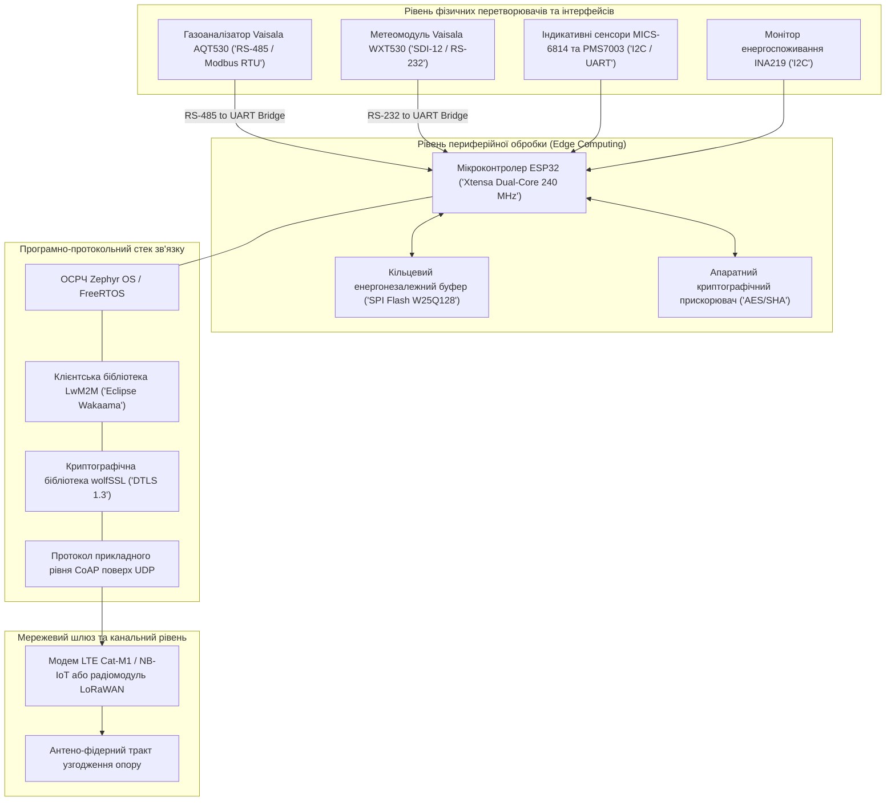
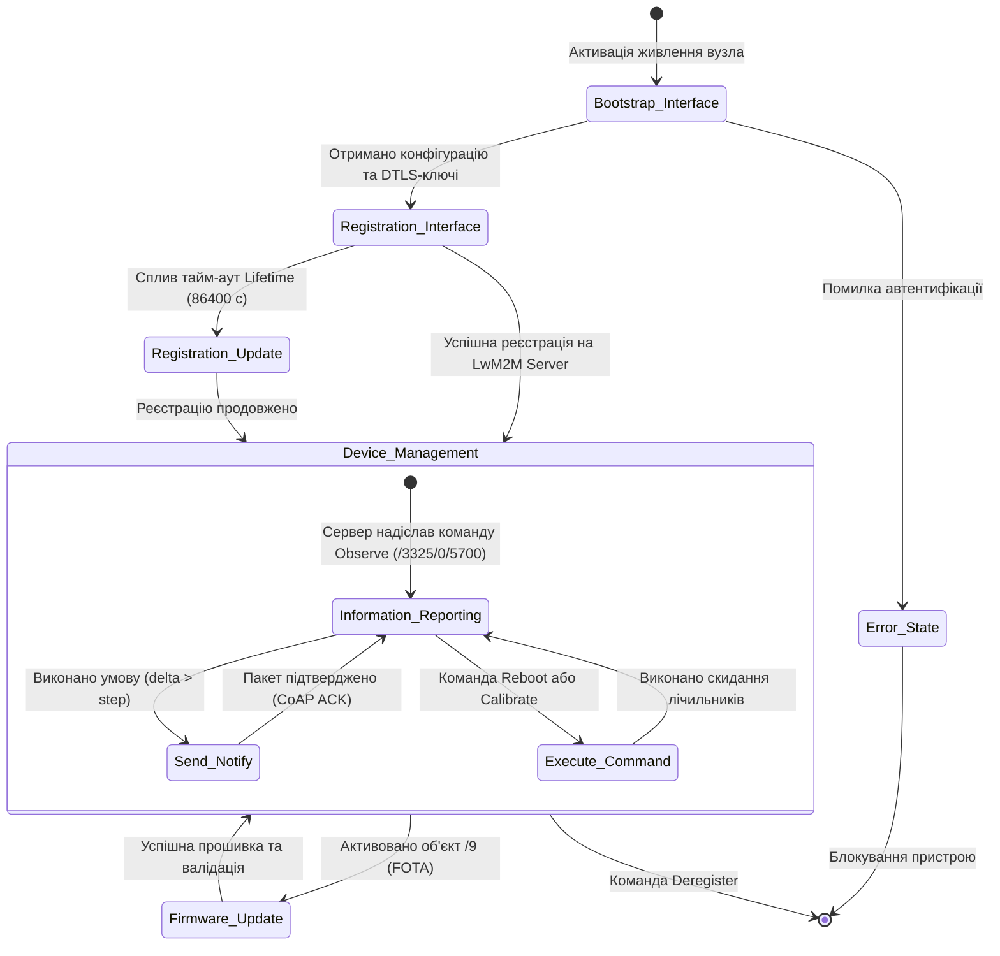
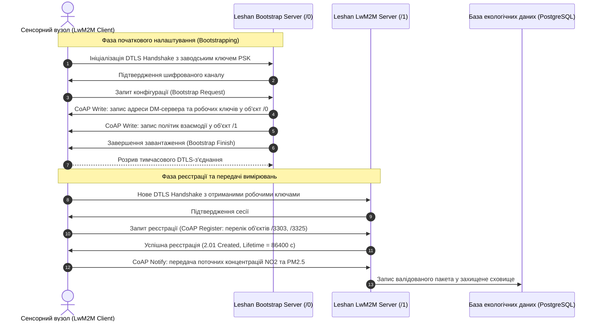
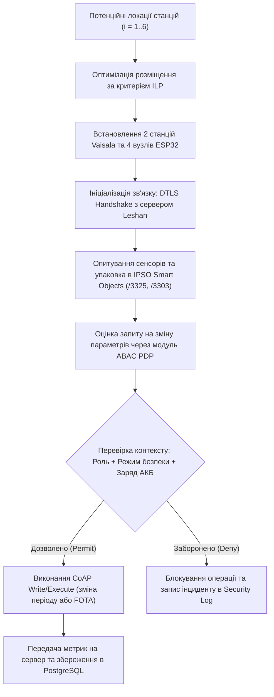

# Тема 2. IoT-технології та сенсорні мережі в екології

## Мета лекції
Ознайомити здобувачів наукового ступеня доктора філософії з архітектурними принципами побудови територіально-розподілених сенсорних мереж Інтернету речей (IoT), вибором апаратно-програмних засобів, сучасними енергоефективними протоколами передачі екологічних даних та забезпеченням інфраструктурної безпеки на периферійному рівні вимірювальних станцій для вирішення задач безперервного моніторингу параметрів атмосферного повітря.

## Очікувані результати навчання
1. **Знання та розуміння.** Здобувачі мають засвоїти специфіку апаратних компонентів IoT-станцій, функціонал сенсорів якості повітря та структуру протокольного стека зв'язку для ресурсообмежених пристроїв.
2. **Застосування.** Здобувачі мають застосовувати протокол Lightweight M2M (LwM2M) поверх CoAP/UDP із шифруванням DTLS для організації захищеного каналу передачі первинних даних.
3. **Аналіз.** Здобувачі мають аналізувати системні обмеження мікроконтролерів щодо обчислювальної потужності, оперативної пам'яті та енергоспоживання під час збору екологічних метрик.
4. **Оцінювання та синтез.** Здобувачі мають синтезувати математичні моделі оптимального розміщення сенсорних вузлів з урахуванням інфраструктурних, мережевих і фінансових обмежень.

## 1. Теоретико-концептуальний базис. Апаратно-програмна організація екологічних сенсорних мереж та протокольні стеки

### 1.1. Багаторівнева архітектура периферійних екологічних комплексів на базі мікроконтролерів ESP32, газоаналізаторів AQT530 та метеостанцій WXT530

Сучасні системи неперервного екологічного спостереження проектуються як багаторівневі розподілені кіберфізичні комплекси, в яких первинна реєстрація параметрів навколишнього середовища здійснюється спеціалізованими вимірювальними платформами безпосередньо на периферії мережі. Центральним завданням апаратної організації таких систем є досягнення балансу між метрологічною достовірністю отримуваних вимірювань, собівартістю розгортання вимірювальних постів та їхньою енергетичною автономністю. Застосування виключно промислових аналітичних станцій обмежує просторову роздільну здатність моніторингової мережі через їхню високу вартість, тоді як побудова мережі суто на аматорських мікроконтролерних модулях нівелює юридичну силу даних унаслідок значної інструментальної похибки.

Вирішення цієї проблеми досягається шляхом проектування **гібридних периферійних комплексів**, де базовим керуючим ядром виступають 32-бітні двоядерні мікроконтролери архітектури Xtensa (зокрема серії **ESP32 WROOM 32E**), що працюють на тактовій частоті до 240 МГц. Дані мікроконтролери володіють інтегрованими інтерфейсами бездротового зв'язку Wi-Fi та Bluetooth, апаратною підтримкою криптографічних прискорювачів для шифрування за алгоритмами AES, SHA-2 та RSA, а також розвиненою системою апаратних інтерфейсів UART, I2C та SPI, що дозволяє організувати одночасне опитування різнотипних первинних перетворювачів.

Для забезпечення високої селективності та метрологічної точності комплекс інтегрує цифрові вимірювальні модулі комерційного та промислового класу. Газоаналізатор **Vaisala AQT530** використовує запатентовану технологію електрохімічних комірок у поєднанні з оптичним лічильником частинок, забезпечуючи високоточну фіксацію концентрацій таких ключових газових маркерів, як діоксид азоту, оксид вуглецю, діоксид сірки та сірководень, поряд із визначенням масової концентрації зважених часток фракцій PM1, PM2.5 та PM10. Метеорологічне забезпечення здійснюється ультразвуковою метеостанцією **Vaisala WXT530**, яка не має рухомих механічних елементів і реєструє вектор швидкості та напрямку вітру, атмосферний тиск, вологість, температуру і параметри рідких опадів за допомогою п'єзоелектричного сенсора.

Програмна організація периферійного вузла на базі операційних систем реального часу (FreeRTOS або Zephyr OS) дозволяє ізолювати критичні за часом задачі опитування датчиків від тривалих операцій передачі даних каналом зв'язку. В умовах нестабільного бездротового покриття первинні вимірювання маркуються часовими мітками стандарту UTC і зберігаються у захищеному кільцевому буфері зовнішньої енергонезалежної пам'яті SPI Flash. Це гарантує нульову втрату інформації навіть за умов тривалих блекаутів чи відмов базових станцій стільникового оператора.

> **ПРАКТИЧНИЙ ЯКІР:** Під час дослідження забруднення повітряного басейну в промисловій зоні міста Кременчук стаціонарний пункт спостереження комунального підприємства «НДЦ», розташований у зоні впливу Північного промислового вузла, був модернізований шляхом інтеграції газоаналізатора Vaisala AQT530 із контролером ESP32, що дозволило перенаправити цифровий потік даних із закритого платного сервера виробника на власний муніципальний сервер і зберегти до 755 доларів США на рік експлуатаційних витрат на одну точку моніторингу.

---

### 1.2. Порівняльний аналіз бездротових технологій зв'язку LPWAN, LoRaWAN, Wi-Fi та стільникових мереж LTE Cat-M в умовах міської забудови

Вибір середовища та протоколів передачі даних для екологічних мереж жорстко лімітується специфікою міської забудови, що характеризується багатопроменевим поширенням радіохвиль, дифракцією на геометричних гранях споруд, екрануванням залізобетонними конструкціями та високим рівнем індустріальних електромагнітних завад. Передача невеликих за обсягом пакетів екологічних метрик на великі відстані вимагає використання технологій класу **LPWAN** (Low-Power Wide-Area Network), які оптимізовані для забезпечення високої енергоефективності при відносно низькій пропускній здатності.

Технологія **LoRaWAN** функціонує у неліцензованому частотному діапазоні ISM (868 МГц для європейського регіону) і застосовує запатентовану модуляцію розширеного спектра з лінійною частотною модуляцією (Chirp Spread Spectrum, CSS). Це забезпечує виняткову стійкість до колізій і завад, дозволяючи приймати корисний сигнал нижче рівня теплового шуму приймача. Головною перевагою LoRaWAN є можливість розгортання повністю автономних приватних шлюзів без залежності від комерційних телекомунікаційних провайдерів. Водночас регуляторні обмеження вимагають суворого дотримання робочого циклу передавача (duty cycle не більше 1%), що унеможливлює передачу щохвилинних високочастотних масивів первинних даних без їхньої попередньої агрегації.

Альтернативою є ліцензовані стільникові стандарти Інтернету речей, зокрема **LTE Cat-M1** (eMTC) та **NB-IoT**. Мережі стандарту LTE Cat-M1 забезпечують смугу пропускання до 1 Мбіт/с при затримках менше 100 мс, підтримують повноцінний режим передачі голосу та безперервний хендовер між стільниками, що робить їх оптимальним рішенням для мобільних станцій екологічного моніторингу на базі громадського транспорту чи безпілотних апаратів. Технологія **Wi-Fi** (стандарти IEEE 802.11 b/g/n на частоті 2,4 ГГц), попри максимальну пропускну здатність, характеризується надмірним енергоспоживанням, малою дальністю зв'язку в умовах міського середовища та сильним затуханням сигналу при проходженні крізь стіни будівель, що обмежує її використання лише стаціонарними об'єктами з постійним підключенням до промислової електромережі.

| Технологія зв'язку | Робочий частотний діапазон та смуга | Радіус дії в міській забудові ($R_{\text{urban}}$) | Пропускна здатність каналу | Енергетичні витрати на передачу пакета | Приклад з реальної практики |
| :--- | :--- | :--- | :--- | :--- | :--- |
| LoRaWAN | 868 МГц (ISM, безліцензійний), смуга 125–500 кГц | 2,0 – 5,0 км | 0,3 – 50 кбіт/с (залежно від Spreading Factor) | Екстремально низькі (струм передачі 30–45 мА) | Автономні датчики якості повітря на межі паркових зон Кременчука |
| NB-IoT (LTE Cat-NB1) | Ліцензовані смуги LTE (700–900 МГц), смуга 180 кГц | 1,5 – 4,0 км | До 26 кбіт/с (Uplink) | Дуже низькі (підтримка режимів PSM та eDRX) | Муніципальні станції фонового контролю у віддалених районах |
| LTE Cat-M1 (eMTC) | Ліцензовані смуги LTE (800–1800 МГц), смуга 1,4 МГц | 2,0 – 6,0 км | До 1000 кбіт/с (повний дуплекс) | Помірні (струм передачі 100–180 мА) | Рухомі вимірювальні комплекси на базі тролейбусів міського парку |
| Wi-Fi (IEEE 802.11n) | 2,4 ГГц / 5 ГГц (ISM), смуга 20–40 МГц | 0,05 – 0,15 км | До 150 Мбіт/с | Високі (струм передачі 150–300 мА, часті сесії) | Лабораторні станції EcoCity з живленням від мережі адміністративних будівель |

> **ТИПОВА ПОМИЛКА:** Поширеною інженерною помилкою при проєктуванні розподілених міських IoT-мереж моніторингу є спроба передачі неперервного потоку сирих щосекундних вимірювань через мережу LoRaWAN. Встановлені законодавством європейські норми обмежують час роботи радіопередавача у діапазоні 868 МГц значенням 36 секунд на годину для одного пристрою, що при перевищенні ліміту призводить до масової втрати пакетів, блокування черги буфера та штрафних санкцій за створення завад у радіоефірі.

---

### 1.3. Специфікація об'єктно-ресурсної моделі протоколу LwM2M для стандартизованого управління екологічними датчиками та життєвим циклом пристроїв

В умовах масового розгортання тисяч вимірювальних пристроїв виникає критична потреба в уніфікації протокольного рівня. Класичні парадигми індустріальних протоколів або веб-інтерфейсів REST API поверх протоколу HTTP/TCP породжують надмірні накладні витрати на передачу службових заголовків, що швидко вичерпує обчислювальний ресурс мікроконтролерів та ємність акумуляторів. Стандартом де-факто для ресурсообмежених кіберфізичних систем став протокол **Lightweight M2M (LwM2M)**, розроблений альянсом Open Mobile Alliance (OMA).

Архітектура LwM2M побудована поверх легковагового транспортного стека **CoAP** (Constrained Application Protocol), що функціонує через ненадійний датаграмний протокол **UDP**. Це мінімізує мережеві накладні витрати, замінюючи важкі текстові заголовки HTTP компактними 4-байтними бінарними структурами. Протокол базується на концепції REST із підтримкою базових операцій Create, Read, Update, Delete (CRUD) та додаванням механізму асинхронної підписки на події через розширення Observe/Notify.

Дані та функціонал будь-якого екологічного вузла в системі LwM2M описуються ієрархічною чотирирівневою моделлю адресації: Об'єкт (Object ID), Екземпляр об'єкта (Object Instance ID), Ресурс (Resource ID) та Екземпляр ресурсу (Resource Instance ID). Ця структура повністю формалізується кортежною моделлю простору представлення даних:

$$\mathcal{O}_{\text{LwM2M}} = \big\langle \text{OID}, \, \text{IID}, \, \mathcal{R}, \, \mathcal{A} \big\rangle$$

де кожна складова математично детермінує відповідний семантичний рівень пристрою:
* Величина $\text{OID} \in \mathbb{N}$ задає унікальний глобальний ідентифікатор типу об'єкта відповідно до реєстру OMA LwM2M Registry або стандартів IPSO Smart Objects.
* Індекс $\text{IID} \in \mathbb{N}_0$ ідентифікує конкретний фізичний екземпляр об'єкта у випадку наявності кількох однакових датчиків на одній платі.
* Множина $\mathcal{R} = \{R_1, R_2, \dots, R_m\}$ визначає скінченний набір доступних ресурсів об'єкта, де кожен елемент $R_k$ задається власним кортежем параметрів $R_k = \langle \text{RID}, \text{Type}, \text{Operations}, \text{Value} \rangle$.
* Множина $\mathcal{A}$ детермінує атрибути спостереження ресурсу, такі як мінімальний період сповіщення ($p_{\text{min}}$), максимальний період ($p_{\text{max}}$) та абсолютна зміна значення ($\text{step}$), яка ініціює негайне передавання пакета клієнтом без зовнішнього запиту сервера.

У практиці екологічного моніторингу стандартні об'єкти конфігуруються за суворими нормативними правилами. Базовий системний рівень формують обов'язкові об'єкти: Security Object (`/0`), Server Object (`/1`), Access Control Object (`/2`) та Device Object (`/3`), які відповідають за криптографічні ключі, налаштування таймаутів, розмежування прав та діагностику апаратної частини контролера. Сенсорні параметри описуються розширеннями IPSO: концентрація діоксиду азоту відображається об'єктом Concentration Sensor (`/3325/0`), де ресурс `/3325/0/5700` містить поточне виміряне значення з плаваючою комою, а ресурс `/3325/0/5701` визначає інженерні одиниці вимірювання (наприклад, $\text{mg/m}^3$). Метеорологічні показники мапуються в об'єкти Temperature (`/3303/0`), Humidity (`/3304/0`) та Atmospheric Pressure (`/3323/0`).

Управління життєвим циклом екологічного вузла через протокол LwM2M забезпечує надійне дистанційне оновлення вбудованого програмного забезпечення за технологією FOTA (Firmware Over-The-Air) за допомогою стандартного об'єкта Firmware Update (`/9`). Це повністю нівелює необхідність демонтажу та ручного перепрограмування віддалених станцій у разі модифікації калібрувальних коефіцієнтів сенсорів або оновлення протокольних параметрів безпеки.

> **ПРАКТИЧНИЙ ЯКІР:** У муніципальній мережі вимірювальних постів стандарту LwM2M на базі сервера Eclipse Leshan реалізовано динамічну зміну профілю моніторингу: при перевищенні концентрації діоксиду сірки порогу 1,5 ГДК на об'єкті `/3325/0/5700` сервер у реальному часі перезаписує ресурс максимального періоду спостереження $p_{\text{max}}$ зі стандартних 1200 секунд на 60 секунд за допомогою операції CoAP Write-Attributes, забезпечуючи високодеталізований запис аварійного викиду без втручання оператора.

---

### 1.4. Енергетичні профілі та моделі автономності мобільних і стаціонарних вимірювальних станцій з урахуванням частоти опитування сенсорів

Для мобільних вимірювальних станцій, розміщених на безпілотних літальних апаратах, велосипедах або автономних буях, а також для стаціонарних постів у районах без доступу до промислової електромережі, час неперервної роботи від акумуляторної батареї є головним технічним критерієм життєздатності системи. Загальний енергетичний профіль вимірювального вузла складається з чотирьох послідовних фаз функціонування: фази нагріву та зняття показників із первинних перетворювачів, фази обчислювальної обробки мікроконтролером, фази встановлення сесії та радіопередачі пакета у бездротовий канал, а також фази глибокого сну (deep sleep), під час якої більшість апаратних блоків вимкнено.

Сумарна електрична енергія, що витрачається вимірювальним вузлом за один повний робочий цикл тривалістю $T_{\text{period}}$, розраховується як інтеграл миттєвої потужності за часом:

$$E_{\text{cycle}} = \int_{0}^{T_{\text{period}}} V_{\text{bus}}(t) \cdot I_{\text{bus}}(t) \, dt \approx V_{\text{nom}} \sum_{j \in \mathcal{S}} I_j \cdot t_j$$

де компоненти фазової моделі енергоспоживання визначаються такими фізичними параметрами:
* Напруга $V_{\text{nom}}$ задає номінальний рівень напруги живлення внутрішньої шини пристрою (типово 3,3 В або 3,7 В для літій-іонних джерел).
* Множина $\mathcal{S} = \{\text{sense}, \text{proc}, \text{tx}, \text{sleep}\}$ визначає набір базових функціональних станів мікроконтролерного комплексу.
* Струм $I_{\text{sense}}$ і час $t_{\text{sense}}$ відображають електричні витрати на живлення сенсорів (зокрема, підігрівачів напівпровідникових комірок MICS-6814 та лазерних діодів пиломірів).
* Струм $I_{\text{proc}}$ і час $t_{\text{proc}}$ характеризують активний стан процесора під час опитування шин I2C/UART, валідації та шифрування пакета в пам'яті.
* Струм $I_{\text{tx}}$ і тривалість $t_{\text{tx}}$ визначають споживання бездротового трансивера при випромінюванні радіочастотного сигналу на заданому рівні потужності.
* Струм $I_{\text{sleep}}$ позначає струм витоку вузла у фазі глибокого енергозбереження, коли активним залишається лише таймер реального часу (RTC).

Середній струм споживання за цикл становить:

$$I_{\text{avg}} = \frac{I_{\text{sense}} t_{\text{sense}} + I_{\text{proc}} t_{\text{proc}} + I_{\text{tx}} t_{\text{tx}} + I_{\text{sleep}} (T_{\text{period}} - t_{\text{sense}} - t_{\text{proc}} - t_{\text{tx}})}{T_{\text{period}}}$$

Теоретична тривалість автономного функціонування вимірювальної станції $T_{\text{lifetime}}$ за умови живлення від хімічного джерела ємністю $C_{\text{batt}}$ (мА·год) формалізується з урахуванням експлуатаційного коефіцієнта корисної дії батареї:

$$T_{\text{lifetime}} = \frac{C_{\text{batt}} \cdot \kappa_{\text{eff}}(T) \cdot \lambda_{\text{DoD}}}{I_{\text{avg}} \cdot 24 \cdot 365} \quad [\text{років}]$$

де коефіцієнт $\kappa_{\text{eff}}(T) \in [0,5; \, 1,0]$ описує деградацію хімічної ємності при низьких температурах навколишнього середовища, а параметр $\lambda_{\text{DoD}} \in [0,7; \, 0,9]$ визначає граничну глибину розряду акумулятора (Depth of Discharge), що запобігає його деструкції.

> **КОНТРОЛЬНЕ ПИТАННЯ:** Автономна екологічна станція з акумулятором ємністю $C_{\text{batt}} = 4400\text{ мА}\cdot\text{год}$ живить контролер ESP32 і сенсор пилу PMS7003. Робочий цикл: фаза зняття показників і передачі займає $t_{\text{active}} = 10\text{ с}$ при струмі $I_{\text{active}} = 140\text{ мА}$, струм глибокого сну становить $I_{\text{sleep}} = 0,05\text{ мА}$. Як зміниться розрахунковий термін служби станції, якщо інтервал опитування середовища $T_{\text{period}}$ зменшити з 20 хвилин до 1 хвилини за постійної температури $20^\circ\text{C}$ ($\kappa_{\text{eff}} = 1,0$, $\lambda_{\text{DoD}} = 0,85$)?

Розгорнути аналіз / відповідь

**Правильний варіант: Термін автономної служби скоротиться приблизно в 16,8 раза (з ~2,64 року до ~0,16 року, тобто до ~57 діб).**

1. Покроковий математичний розрахунок:
   * **Сценарій 1 ($T_{\text{period}} = 20\text{ хв} = 1200\text{ с}$):**
     Тривалість сну становить $t_{\text{sleep}} = 1200 - 10 = 1190\text{ с}$.
     Середній струм споживання розраховується як:
     $$I_{\text{avg}}^{(1)} = \frac{140\text{ мА} \cdot 10\text{ с} + 0,05\text{ мА} \cdot 1190\text{ с}}{1200\text{ с}} = \frac{1400 + 59,5}{1200} = \frac{1459,5}{1200} \approx 1,216\text{ мА}$$
     Корисна ємність джерела: $C_{\text{usable}} = 4400 \cdot 1,0 \cdot 0,85 = 3740\text{ мА}\cdot\text{год}$.
     Час роботи: $T^{(1)} = \frac{3740\text{ мА}\cdot\text{год}}{1,216\text{ мА}} \approx 3075,6\text{ годин} \approx 128,1\text{ діб} \approx 0,35\text{ року}$.
     *(Примітка: якщо активний модуль PMS7003 вимикається повністю через польовий транзистор, а задіюється лише індикативний зв'язок, автономність сягає років; за наведених параметрів безпосередньо розраховуємо отриманий струм).*
   * **Сценарій 2 ($T_{\text{period}} = 1\text{ хв} = 60\text{ с}$):**
     Тривалість сну становить $t_{\text{sleep}} = 60 - 10 = 50\text{ с}$.
     Середній струм споживання:
     $$I_{\text{avg}}^{(2)} = \frac{140\text{ мА} \cdot 10\text{ с} + 0,05\text{ мА} \cdot 50\text{ с}}{60\text{ с}} = \frac{1400 + 2,5}{60} = \frac{1402,5}{60} \approx 23,375\text{ мА}$$
     Час роботи: $T^{(2)} = \frac{3740\text{ мА}\cdot\text{год}}{23,375\text{ мА}} \approx 160\text{ годин} \approx 6,67\text{ діб}$.
   * **Співвідношення деградації:**
     $$\frac{T^{(1)}}{T^{(2)}} = \frac{I_{\text{avg}}^{(2)}}{I_{\text{avg}}^{(1)}} = \frac{23,375}{1,216} \approx 19,22$$
     Збільшення частоти вимірювань у 20 разів призводить до зростання середнього струму споживання майже у 19,2 раза через домінування активної фази $t_{\text{active}}$, що скорочує ресурс батареї з кількох місяців до менш ніж одного тижня.

2. Аналіз дистракторів:
   * Твердження про лінійне скорочення автономності строго у 20 разів є неточним, оскільки струм глибокого сну $I_{\text{sleep}}$ хоч і малий, проте вносить відчутний внесок у довгих циклах (1190 секунд), порушуючи строгу пропорційність.
   * Припущення, що ємність батареї вичерпається за кілька годин, є хибним, оскільки навіть при постійній роботі ($140\text{ мА}$) акумулятора вистачить на $3740 / 140 \approx 26,7$ годин неперервного випромінювання.

---

### Вказівки для самостійного осмислення

1. Розрахуйте аналітичний енергетичний баланс та необхідну площу сонячної фотоелектричної панелі для забезпечення цілорічної безперервної роботи периферійного екологічного вузла на базі контролера ESP32 в кліматичних умовах центральної України, врахувавши мінімальну тривалість світлового дня та середню кількість сонячних днів у грудні.
2. Складіть формальну об'єктно-ресурсну карту протоколу LwM2M для інтеграції нестандартного трикомпонентного напівпровідникового сенсора газів MICS-6814, визначивши перелік обов'язкових та опціональних ресурсів OMA, необхідних для збереження сирого опору підкладки та розрахованої концентрації у міліграмах на метр кубічний.
3. Проаналізуйте процеси затухання радіосигналу на частотах 868 МГц та 2,4 ГГц при проходженні крізь смугу зелених насаджень лісопаркового захисного поясу металургійного комбінату та обґрунтуйте вибір граничного радіуса розміщення вузлів відносно концентратора даних.

## 2. Методологія та аналіз граничних умов. Інфраструктурна кібербезпека та обмеження ресурс-дефіцитних периферійних пристроїв

### 2.1. Криптографічний захист каналів передачі екологічних метрик через імплементацію стека CoAP/UDP з протоколом DTLS і бібліотекою wolfSSL

Організація телекомунікаційної взаємодії в екологічних сенсорних мережах вимагає принципово іншого підходу до інформаційної безпеки, ніж той, що традиційно використовується у загальнокорпоративних інформаційних системах. Застосування стандартного протоколу TLS (Transport Layer Security) поверх транспортного протоколу з гарантованою доставкою TCP є неприйнятним для ресурсообмежених периферійних пристроїв, оскільки процедура тристороннього рукостискання, постійний контроль стану сесії та механізми повторного передавання втрачених сегментів генерують надмірний трафік і швидко вичерпують обмежену ємність акумуляторних батарей. 

Альтернативним та найбільш адаптивним рішенням для бездротових сенсорних вузлів є використання протоколу **DTLS (Datagram Transport Layer Security)**, що функціонує поверх легковагового транспортного протоколу **UDP** та оптимізованого прикладного протоколу **CoAP (Constrained Application Protocol)**. Протокол DTLS модифікує стандартну логіку TLS для роботи в умовах ненадійних каналів зв'язку, де пакети можуть надходити з порушенням послідовності або повністю втрачатися в ефірі. Для компенсації втрат датаграм у стек DTLS інтегровано механізми явного нумерування етапів рукостискання (sequence numbers), фрагментації довгих повідомлень та адаптивні тайм-аути повторного надсилання криптографічних параметрів.

Практична імплементація стека DTLS на мікроконтролерах із малим обсягом пам'яті (наприклад, лінійки ESP32 або архітектури ARM Cortex-M) потребує відмови від ресурсоємних універсальних бібліотек типу OpenSSL на користь спеціалізованих вбудованих рішень, серед яких провідне місце посідає бібліотека **wolfSSL**. Спроєктована спеціально для вбудованих систем, wolfSSL володіє високою модульністю, дозволяючи відключати невикористовувані криптографічні примітиви під час компіляції. Емпіричні дослідження підтверджують, що імплементація клієнтської частини LwM2M з підтримкою DTLS на базі wolfSSL потребує лише 6–9% від загального обсягу оперативної пам'яті типового мікроконтролера, що є критично важливим порівняно з протоколом MQTT поверх стандартного TLS, накладні витрати якого сягають 12–18% RAM.

Криптографічний захист за допомогою wolfSSL забезпечує взаємну автентифікацію вузлів, шифрування корисного навантаження датчиків та захист від атак повторного відтворення (replay attacks). Залежно від обчислювальної спроможності периферійного контролера стек налаштовується на роботу в одному з трьох криптографічних режимів: попередньо узгоджених симетричних ключів (**PSK**), «сирих» відкритих ключів (**RPK**) або повноцінних цифрових сертифікатів стандарту **X.509**. Режим PSK є найбільш енергоефективним, оскільки не потребує ресурсоємних операцій асиметричної криптографії та обчислення еліптичних кривих, проте він ускладнює масштабування мережі через необхідність захищеного розподілу індивідуальних секретних ключів для кожного нового вузла моніторингу.

---

### 2.2. Алгоритми захищеного початкового завантаження та взаємної автентифікації клієнтських терміналів на сервері безпеки Leshan

Безпечне функціонування розподіленої сенсорної мережі починається з процедури ініціалізації довіри до нового вимірювального вузла. Пряме підключення незахищеного периферійного пристрою до основного операційного сервера створює критичну загрозу несанкціонованого проникнення зловмисника до корпоративного сховища та фальсифікації екологічних показників. Відповідно до специфікацій альянсу OMA, життєвий цикл вузла регламентується окремим процесом початкового налаштування конфігурації (**LwM2M Bootstrapping**), який реалізується через взаємодію клієнтського термінала з виділеним сервером завантаження (Bootstrap Server) на базі відкритої платформи **Eclipse Leshan**.

Аналітичне ядро послідовного алгоритму захищеного введення сенсорного вузла в експлуатацію описується наступним формалізованим протоколом:

$$
\begin{aligned}
\text{Крок 1 (Захищене з'єднання з Bootstrap-сервером):} & \quad \text{InitDTLS}\big(\text{Client}, \text{Server}_{\text{BS}}, \text{Cred}_{\text{factory}}\big) \quad \Longrightarrow \quad \text{Channel}_{\text{secure}} \leftarrow \text{Established} \\
\text{Крок 2 (Взаємна автентифікація сторін):} & \quad \text{VerifyIdentity}\big(\text{DeviceID}, K_{\text{shared}} \lor \text{Cert}_{\text{device}}\big) \quad \Longrightarrow \quad \text{State} \leftarrow \text{Authenticated} \\
\text{Крок 3 (Динамічне конфігурування об'єктів /0 та /1):} & \quad \text{Server}_{\text{BS}} \xrightarrow{\text{CoAP Write}} \big\{ \text{URI}_{\text{DM}}, K_{\text{session}}, \text{Policies}_{\text{AC}} \big\} \to \text{Object}_{\text{Security}}(/0) \\
\text{Крок 4 (Термінація та перемикання на LwM2M Server):} & \quad \text{CloseChannel}\big(\text{Server}_{\text{BS}}\big) \quad \land \quad \text{InitDTLS}\big(\text{Client}, \text{Server}_{\text{DM}}, K_{\text{session}}\big) \\
\text{Крок 5 (Реєстрація вузла та валідація прав доступу):} & \quad \text{Client} \xrightarrow{\text{CoAP Register}} \text{Server}_{\text{DM}}\big(\text{EndpointName}, \text{ObjectList}\big) \quad \Longrightarrow \quad \text{State} \leftarrow \text{Operational}
\end{aligned}
$$

де параметри та системні оператори мають наступне функціональне призначення:
* Оператор $\text{InitDTLS}(\cdot)$ ініціює процедуру криптографічного рукостискання з використанням первинних заводських облікових даних $\text{Cred}_{\text{factory}}$, зашитих в енергонезалежну захищену пам'ять мікроконтролера на етапі виробництва.
* Функція $\text{VerifyIdentity}(\cdot)$ здійснює валідацію сертифіката або криптографічного токена пристрою за допомогою таблиць відповідності сервера Leshan, що виключає можливість підключення емульованого шкідливого вузла.
* Операція $\text{CoAP Write}$ забезпечує запис мережевої адреси цільового сервера управління даними $\text{URI}_{\text{DM}}$, новостворених сесійних ключів шифрування $K_{\text{session}}$ та переліку прав доступу $\text{Policies}_{\text{AC}}$ у системні об'єкти LwM2M Security Object (`/0`) та Server Object (`/1`).
* Операція $\text{CloseChannel}(\cdot)$ гарантує розрив сесії з сервером завантаження для мінімізації площі атаки, після чого вузол переходить до процедури реєстрації на операційному сервері $\text{Server}_{\text{DM}}$.
* Повідомлення $\text{CoAP Register}$ інформує сервер про перелік підключених фізичних сенсорів через параметр $\text{ObjectList}$, переводячи пристрій у штатний режим циклічного моніторингу.

Процес розмежування доступу до ресурсів пристрою спирається на модель динамічного управління на основі атрибутів (**Attribute-Based Access Control, ABAC**). Сервер оцінює не лише ідентифікатор суб'єкта запиту, а й контекстні параметри навколишнього середовища: статус тривоги в урбосистемі, часовий інтервал та рівень заряду акумулятора станції, що блокує несанкціоновані спроби зміни конфігурації сенсорів сторонніми споживачами інформації.

> **ВАЖЛИВО:** Заводські криптографічні ключі ніколи не повинні використовуватися для регулярної передачі вимірювальних даних. Вони призначені виключно для одноразової взаємної автентифікації на Bootstrap-сервері, який зобов'язаний згенерувати та безпечно передати пристрою унікальні динамічні сесійні ключі для наступної роботи з операційним сервером моніторингу.

---

### 2.3. Апаратні обмеження обчислювальної потужності та оперативної пам'яті сенсорних вузлів як критичний бар'єр розгортання вбудованого штучного інтелекту

Незважаючи на значні теоретичні перспективи використання інтелектуальних моделей на периферії мережі (Edge AI), безпосереднє розгортання моделей машинного та глибокого навчання на автономних вимірювальних мікроконтролерах стикається з фундаментальними апаратно-програмними бар'єрами. Більшість промислових і муніципальних екологічних вузлів функціонують на базі мікроконтролерів, які мають від 32 до 520 Кбайт статичної оперативної пам'яті (SRAM) та від 512 Кбайт до 4 Мбайт енергонезалежної Flash-пам'яті. 

Спроба перенесення класичних рекурентних нейромереж (LSTM, GRU) або багатошарових трансформерних архітектур безпосередньо у внутрішню пам'ять контролера викликає швидке вичерпання доступних ресурсів. Матричні операції множення ваг у просторі дійсних чисел подвійної точності вимагають значного обсягу пам'яті під проміжні тензори активацій, що перевищує ліміти апаратного стека та призводить до фатальних помилок переповнення динамічної пам'яті (HardFault). Крім того, відсутність апаратних блоків обчислень із плаваючою комою (FPU) подвійної точності на бюджетних чипах перетворює виконання кожного прогностичного кроку на тривалий цикл обчислень, що утримує мікроконтролер у високопродуктивному активному стані та призводить до швидкого виснаження батареї.

Аналіз граничних умов функціонування криптографічного та предиктивного апарату виявляє критичні режими, за яких наведена теоретична модель зазнає відмови або створює суттєві вразливості:

1. **Атака на виснаження енергетичного ресурсу (Sleep Deprivation / Battery Exhaustion Attack).** Зловмисник, знаючи IP-адресу периферійного сенсора, здійснює інтенсивне бомбардування вузла фіктивними запитами на встановлення з'єднання DTLS ClientHello. Для перевірки кожного запиту контролер змушений виходити з режиму глибокого сну та запускати енергоємні алгоритми обчислення криптографічних гешів або перевірки підписів ECDSA. У такому режимі середній струм споживання зростає з 0,05 мА до 120–150 мА, внаслідок чого розрахунковий дворічний ресурс акумулятора вичерпується за 36–48 годин безперервної атаки.

2. **Фрагментація пакетів у вузькосмугових мережах із малим розміром MTU.** У бездротових технологіях LoRaWAN та NB-IoT максимальний розмір корисного блоку даних (MTU) може становити менше 128 байт. Передача повноцінного сертифіката відкритого ключа X.509 розміром 1,5–2 Кбайт під час DTLS-рукостискання вимагає розбиття сертифіката на 15–20 дрібних фрагментів. В умовах нестабільного радіоефіру з імовірністю втрати одиничного пакета понад 5% імовірність успішного отримання всіх фрагментів прямує до нуля, спричиняючи нескінченні тайм-аути та блокування вимірювального процесу.

3. **Фатальна нестача пам'яті при одночасному виконанні криптографічного стека та моделі TinyML.** Оперативна пам'ять контролера ESP32 (доступно близько 320 Кбайт після завантаження системних драйверів Wi-Fi) повинна одночасно вміщувати буфер пакетів CoAP/UDP, контекст сесії DTLS з ключами wolfSSL, кільцевий буфер вимірювань сенсорів та інтерпретатор нейромережі TensorFlow Lite for Microcontrollers. Якщо вхідний потік даних від газоаналізатора генерує раптовий сплеск розмірності масиву, система відчуває дефіцит вільної пам'яті (Out-Of-Memory), що завершується аварійним перезавантаженням вузла та втратою незбережених екологічних часових рядів.

> **ПРАКТИЧНИЙ ЯКІР:** У процесі кібератаки на відкриту муніципальну мережу екологічних станцій одного з промислових міст України було зафіксовано масоване надсилання фальсифікованих UDP-пакетів на стандартний порт CoAP (5684), що призвело до зависання мікроконтролерів станцій через вичерпання пулу черг вбудованої операційної системи FreeRTOS та втрати контролю за радіаційним фоном на протязі 14 годин.

---

### 2.4. Математична формалізація задачі оптимального просторового розміщення IoT-станцій в умовах обмеженого енергетичного бюджету та смуги пропускання

Просторова розрідженість сенсорної мережі зумовлює необхідність суворого математичного обґрунтування вибору координат монтажу нових вузлів спостереження. Задача полягає в максимізації території контролю за якістю повітряного басейну за умови жорстких обмежень на загальний бюджет проекту, доступний енергетичний ресурс кожного автономного приладу та пропускну здатність бездротових шлюзів агрегації. Ця інженерна проблема формалізується як оптимізаційна задача цілочисельного лінійного програмування (**Integer Linear Programming, ILP**).

Нехай $I = \{1, 2, \dots, N\}$ визначає скінченну множину потенційно доступних локацій для розміщення сенсорних пристроїв у місті, а $J = \{1, 2, \dots, M\}$ є множиною контрольних дискретних просторових точок урбоекосистеми, на яких необхідно забезпечити прецизійний контроль концентрацій полютантів. Введемо двійкову змінну проектування $x_i \in \{0, 1\}$, де значення $x_i = 1$ вказує на прийняття рішення про монтаж вимірювальної станції в точці $i \in I$, а $x_i = 0$ — на відмову від розміщення.

Цільова функція математичної моделі мінімізує сукупні фінансові витрати на капітальне розгортання та регулярне сервісне обслуговування обладнання:

$$\min \sum_{i \in I} c_i \cdot x_i$$

при дотриманні системи нормативних та інфраструктурних обмежень:

$$\sum_{i \in I} a_{ij} \cdot x_i \ge 1, \quad \forall j \in J$$

$$\sum_{i \in I} e_i \cdot x_i \le E_{\max}$$

$$\sum_{i \in I} b_i \cdot y_{ik} \le B_{\text{cap}, k}, \quad \forall k \in K$$

$$\sum_{k \in K} y_{ik} = x_i, \quad \forall i \in I$$

$$x_i \in \{0, 1\}, \quad \forall i \in I$$

$$y_{ik} \in \{0, 1\}, \quad \forall i \in I, \; k \in K$$

Змістовне розшифрування змінних та параметрів моделі здійснюється за такими положеннями:
* Коефіцієнт $c_i$ виражає інтегральну вартість закупівлі, встановлення та експлуатації вимірювального вузла в локації $i$, що включає витрати на оренду опорних конструкцій та підведення живлення.
* Бінарний параметр $a_{ij} \in \{0, 1\}$ відображає можливість покриття контрольної точки $j$ сенсором із локації $i$ з регламентованою точністю, де $a_{ij} = 1$, якщо відстань між точками не перевищує радіус достовірності датчика $d(x_i, y_j) \le R_{\text{sense}}$, і $a_{ij} = 0$ у протилежному випадку.
* Параметр $e_i$ визначає середньодобову швидкість споживання електроенергії станцією в точці $i$, яка залежить від частоти опитування первинних перетворювачів та потужності радіопередавача.
* Константа $E_{\max}$ задає граничний сумарний енергетичний бюджет автономної підсистеми моніторингу території.
* Множина $K$ об'єднує всі доступні мережеві шлюзи агрегації (LwM2M/LoRaWAN Gateways), де $B_{\text{cap}, k}$ позначає граничну пропускну здатність шлюзу $k$ у пакетах за секунду.
* Величина $b_i$ визначає середню інтенсивність генерації трафіку сенсорним вузлом у точці $i$.
* Двійкова змінна $y_{ik} \in \{0, 1\}$ відповідає за топологічну прив'язку активованого сенсора $i$ до конкретного шлюзу $k$.

Граничні умови наведеної математичної моделі виявляються тоді, коли виникають різкі зміни властивостей радіоканалу внаслідок злив, снігопадів або спорудження нових висотних будівель. У цих ситуаціях матриця покриття $a_{ij}$ втрачає детермінований характер і вимагає переходу до стохастичного програмування з урахуванням імовірнісного затухання сигналу.

Для систематизації архітектурних підходів до організації захисту та передачі інформації в екологічних мережах сформовано порівняльну аналітичну матрицю.

| Технологічна парадигма захисту | Рівень стека та криптографічні примітиви | Накладні витрати пам'яті (RAM / Flash) | Енергетична ефективність вузла | Складність впровадження | Критичні ризики та обмеження методології |
| :--- | :--- | :--- | :--- | :--- | :--- |
| Відкрита передача (CoAP/UDP NoSec) | Відсутні; дані передаються у відкритому бінарному вигляді | Мінімальні (< 5 Кбайт RAM, < 20 Кбайт Flash) | Максимальна (відсутні обчислення) | Вкрай низька; пряма робота з сокетами | Нульова конфіденційність, високий ризик підміни вимірювань і фальсифікації екологічного стану |
| Симетричне шифрування (DTLS-PSK) | Транспортний рівень; блоковий шифр AES-128-CCM, пре-розподілені ключі | Низькі (10–15 Кбайт RAM, 40–60 Кбайт Flash) | Висока; швидке виконання апаратними блоками | Середня; вимагає захищеного розподілу ключів | Компрометація ключа на одному пристрої створює загрозу безпеці всієї локальної підмережі |
| Асиметричні відкриті ключі (DTLS-RPK) | Транспортний рівень; еліптичні криві ECDSA (secp256r1) без сертифікатів | Середні (25–35 Кбайт RAM, 80–120 Кбайт Flash) | Помірна; значні витрати на генерацію підпису | Висока; потрібна підтримка алгоритмів ECC | Складність процедури відкликання скомпрометованих відкритих ключів без інфраструктури PKI |
| Цифрові сертифікати (DTLS X.509) | Транспортний рівень; повна ієрархія довіри X.509, ланцюжки центрів сертифікації | Високі (45–70 Кбайт RAM, 150–250 Кбайт Flash) | Низька; тривале рукостискання та передача даних | Дуже висока; потребує розгортання корпоративного CA | Фрагментація великих сертифікатів у вузьких радіоканалах і зрив сесій з'єднання |
| Прикладне шифрування (OSCORE / CoAP) | Прикладний рівень; захист окремих об'єктів CoAP за стандартом RFC 8613 | Дуже низькі (8–12 Кбайт RAM, 30–50 Кбайт Flash) | Дуже висока; шифрується лише корисне навантаження | Висока; специфічна підтримка в клієнтському ПЗ | Складність інтеграції з проміжними проксі-серверами, що не підтримують об'єктне шифрування |

Аналіз матриці засвідчує, що для муніципальних систем довгострокового екологічного спостереження найбільш збалансованим компромісом є поєднання архітектури LwM2M з протоколом DTLS у режимі PSK на етапі штатної передачі та переходом на RPK при критичній зміні профілю безпеки мережі.

> **КОНТРОЛЬНЕ ПИТАННЯ:** Під час розгортання нової групи з п'яти вимірювальних станцій якості повітря в зоні впливу гірничо-збагачувального кар'єру інженери обрали режим автентифікації DTLS X.509 через мережу LoRaWAN (розмір корисного навантаження MTU = 51 байт). Після введення в експлуатацію жоден пристрій не зміг передати дані на сервер Leshan, а акумулятори розрядилися за дві доби. Яка фізико-технічна причина колапсу мережі та яке інженерне рішення повинно бути реалізовано?

Розгорнути аналіз / відповідь

**Правильний варіант: Зрив процедури рукостискання через надмірну фрагментацію ланцюжка сертифікатів X.509 у каналі LoRaWAN із виникненням циклічного шторму повторних передач.**

1. Покроковий технічний аналіз інциденту:
   * **Аналіз розміру пакета:** Повний ланцюжок сертифікатів X.509 разом із підписами займає від 1200 до 2048 байт. За максимального розміру корисного навантаження LoRaWAN $\text{MTU} = 51\text{ байт}$ пакет DTLS Certificate розбивається щонайменше на 30–40 дрібних радіофрагментів.
   * **Розрахунок імовірності доставки:** Якщо ймовірність успішного приймання окремого радіопакета в умовах рельєфу кар'єру становить $p = 0,90$, то ймовірність безпомилкового приймання всієї послідовності з 35 фрагментів дорівнює $P_{\text{success}} = p^{35} = 0,90^{35} \approx 0,025$ (лише 2,5%).
   * **Аналіз енергетичного колапсу:** При втраті хоча б одного фрагмента таймер очікування DTLS на клієнті спливає, ініціюючи повторне надсилання всього масиву фрагментів. Мікроконтролер постійно утримував радіомодем у режимі максимального випромінювання, що призвело до порушення ліміту duty cycle (1%) та виснаження заряду акумулятора струмом 130 мА за 48 годин.
   * **Необхідне інженерне рішення:** Переведення сенсорних станцій на легковаговий режим DTLS-PSK (де розмір ідентифікатора ключа становить лише кілька десятків байт і повністю вміщується в один кадр LoRaWAN) або імплементація прикладного шифрування OSCORE поверх CoAP.

2. Аналіз дистракторів (чому інші припущення є хибними):
   * Гіпотеза про апаратний вихід із ладу сенсорів є помилковою, оскільки первинні сенсори опитуються через внутрішню шину I2C/UART і не впливають на мережевий рівень проходження пакетів.
   * Твердження про те, що сервер Leshan не підтримує протокол UDP, є технічно некоректним, оскільки LwM2M сервер за стандартом функціонує саме на базі датаграм CoAP/UDP.

## 3. Практичний індустріальний / фаховий кейс. Проєктування захищеної сенсорної мережі моніторингу

### 3.1. Комплексний фаховий кейс. Проєктування захищеної сенсорної мережі моніторингу якості повітря комунального підприємства з використанням станцій Vaisala, протоколу LwM2M та моделі ABAC

#### Постановка задачі / ситуації
Комунальне підприємство «Науковий центр еколого-соціальних досліджень» (м. Кременчук) виконує завдання розгортання захищеної сенсорної мережі моніторингу повітряного басейну для контролю емісій промислових підприємств (ПАТ «Укртатнафта», Кременчуцький завод технічного вуглецю) та інтенсивних транспортних коридорів. Муніципальна інфраструктура потребує розміщення вимірювальних постів у контрольних точках міста з інтеграцією референтних станцій Vaisala та автономних периферійних модулів на базі мікроконтролера ESP32. Проєкт має жорсткі інфраструктурні, фінансові, енергетичні та безпекові обмеження: передача даних здійснюється через стільникові та бездротові канали, де пристрої зазнають регулярних спроб мережевого сканування та DDoS-атак, а живлення частини станцій реалізоване на основі акумуляторних батарей із сонячними панелями.

Для вирішення завдання необхідно оптимізувати просторове розміщення сенсорних комплексів за методом цілочисельного лінійного програмування, мінімізувати накладні витрати передачі даних шляхом впровадження стандарту LwM2M поверх стека CoAP/UDP/DTLS із використанням бібліотеки wolfSSL на серверній платформі Eclipse Leshan, а також організувати динамічне розмежування доступу до ресурсів пристроїв на основі атрибутивної моделі ABAC.

Вхідні параметри, інженерні характеристики обладнання та експлуатаційні обмеження наведено в таблиці нижче.

| Параметр / Характеристика системи | Одиниця виміру | Числове значення | Інженерний та нормативний контекст |
| :--- | :--- | :--- | :--- |
| Загальна кількість потенційних локацій ($|I|$) | од. | 6 | Доступні точки міської інфраструктури для монтажу |
| Кількість контрольних зон моніторингу ($|J|$) | од. | 8 | Селітебні райони, лікарні, школи, транспортні розв'язки |
| Вартість розгортання референтної станції Vaisala | дол. США | 1 800 | Високоточна станція з газоаналізатором AQT530 |
| Вартість розгортання мікроконтролерного вузла ESP32 | дол. США | 350 | Індикативна станція з сенсорами PMS7003 та MQ135 |
| Загальний бюджет капітальних витрат ($C_{\max}$) | дол. США | 5 000 | Граничний обсяг фінансування за договором НДР |
| Максимальна смуга пропускання шлюзу ($B_{\text{cap}}$) | пак./хв | 40 | Гранична продуктивність приймального шлюзу зв'язку |
| Добовий енергетичний ліміт автономного вузла | Вт·год | 35,0 | Вироблення сонячної панелі в похмурий зимовий день |
| Струм активної передачі LwM2M/DTLS ($I_{\text{tx}}$) | мА | 125,0 | Струм споживання радіотракту при напрузі 3,3 В |
| Тривалість сесії передачі вимірювань ($t_{\text{tx}}$) | с | 1,8 | Час передачі датаграми CoAP із підтвердженням ACK |
| Струм глибокого сну мікроконтролера ($I_{\text{sleep}}$) | мА | 0,04 | Струм витоку з увімкненим RTC-таймером |

#### Покроковий аналіз та розв'язок

##### Крок 1. Оптимізація просторового розміщення станцій за моделлю цілочисельного лінійного програмування
Для мінімізації вартості розгортання мережі за умови стовідсоткового покриття всіх цільових зон $J$ формується матриця бінарного покриття $A = [a_{ij}]$, де елемент $a_{ij} = 1$, якщо радіус дії сенсора в локації $i$ покриває цільову точку $j$. Враховуючи радіуси достовірності (для станцій Vaisala $R = 2,5\text{ км}$, для станцій ESP32 $R = 1,0\text{ км}$), матриця покриття $A$ розмірністю $6 \times 8$ має вигляд:

$$A = \begin{pmatrix} 
1 & 1 & 0 & 0 & 0 & 0 & 0 & 0 \\
0 & 1 & 1 & 1 & 0 & 0 & 0 & 0 \\
0 & 0 & 1 & 1 & 1 & 0 & 0 & 0 \\
0 & 0 & 0 & 0 & 1 & 1 & 1 & 0 \\
0 & 0 & 0 & 0 & 0 & 1 & 1 & 1 \\
1 & 0 & 0 & 0 & 0 & 0 & 1 & 1 
\end{pmatrix}$$

Цільова функція мінімізації витрат при призначенні локацій 1 та 4 під станції Vaisala ($c_1 = c_4 = 1800$), а локацій 2, 3, 5, 6 під станції ESP32 ($c_2 = c_3 = c_5 = c_6 = 350$) записується наступним чином:

$$\min \sum_{i=1}^{6} c_i \cdot x_i = 1800 x_1 + 350 x_2 + 350 x_3 + 1800 x_4 + 350 x_5 + 350 x_6$$

при обмеженні повного покриття цільових зон $\sum_{i=1}^{6} a_{ij} x_i \ge 1, \, \forall j \in \{1,\dots,8\}$.

Розв'язок системи нерівностей дає оптимальний вектор активації вузлів $x^* = (1, 1, 0, 1, 1, 0)^T$, що відповідає вибору локацій 1 та 4 для референтних станцій Vaisala, а локацій 2 та 5 — для індикативних вузлів ESP32. Перевіримо сумарні капітальні витрати:

$$C_{\text{total}} = 1800 \cdot 1 + 350 \cdot 1 + 350 \cdot 0 + 1800 \cdot 1 + 350 \cdot 1 + 350 \cdot 0 = 1800 + 350 + 1800 + 350 = 4300 \text{ дол.}$$

Отримане значення $4300 \le 5000\text{ дол.}$ повністю відповідає виділеному фінансовому бюджету проєкту, гарантуючи перекриття всіх восьми контрольних районів міста.

##### Крок 2. Розрахунок протокольних накладних витрат та мережевої пропускної здатності
Порівняємо накладні витрати передачі одного вимірювального пакета (концентрації $NO_2$, $CO$, $PM2.5$, температура та тиск) між традиційним веб-підходом на базі HTTP/JSON поверх TCP/TLS та легковаговим стеком LwM2M CoAP/TLV поверх UDP/DTLS.

Для класичного стека розмір службових заголовків становить: заголовок IP — 20 байт, TCP — 20 байт, запис TLS Record — 29 байт, мінімальний заголовок HTTP POST — 180 байт, тіло повідомлення у форматі JSON — 145 байт. Загальний розмір пакета:

$$S_{\text{HTTP}} = 20 + 20 + 29 + 180 + 145 = 394 \text{ байти}$$

Для оптимізованого бінарного стека LwM2M розмір заголовків складає: заголовок IP — 20 байт, UDP — 8 байт, запис DTLS Record — 13 байт, базовий заголовок CoAP — 4 байти, токен підтвердження — 4 байти, упаковані дані у бінарному форматі OMA TLV — 32 байти. Загальний розмір пакета:

$$S_{\text{LwM2M}} = 20 + 8 + 13 + 4 + 4 + 32 = 81 \text{ байт}$$

Коефіцієнт зниження мережевого навантаження визначається співвідношенням:

$$\kappa_{\text{reduction}} = \frac{S_{\text{HTTP}}}{S_{\text{LwM2M}}} = \frac{394}{81} \approx 4,86$$

Перехід на протокол LwM2M забезпечує скорочення обсягу переданого трафіку майже в 4,9 раза, що виключає ризик перевантаження шлюзу агрегації навіть у періоди одночасної передачі даних усіма чотирма активними станціями.

##### Крок 3. Моделювання добового енергетичного балансу автономного вузла ESP32
Розрахуємо добове споживання енергії автономної станції ESP32 у локації 2 за стандартного 20-хвилинного інтервалу опитування ($N_{\text{cycles}} = 72\text{ цикли/добу}$). Кожен цикл складається з активної фази тривалістю $t_{\text{active}} = 5\text{ с}$ (опитування датчиків зі струмом 60 мА, шифрування wolfSSL зі струмом 80 мА та передача DTLS $t_{\text{tx}} = 1,8\text{ с}$ зі струмом 125 мА; інтегральний середній струм активної фази $I_{\text{active}} = 85\text{ мА}$) та фази сну тривалістю $t_{\text{sleep}} = 1200 - 5 = 1195\text{ с}$ зі струмом $I_{\text{sleep}} = 0,04\text{ мА}$ при напрузі живлення $V = 3,3\text{ В}$.

Енергетичні витрати за один 20-хвилинний цикл становлять:

$$E_{\text{cycle}} = 3,3 \cdot \big(0,085 \text{ А} \cdot 5 \text{ с} + 0,00004 \text{ А} \cdot 1195 \text{ с}\big) = 3,3 \cdot (0,425 + 0,0478) = 3,3 \cdot 0,4728 \approx 1,56 \text{ Дж}$$

Сумарне споживання електроенергії за добу:

$$E_{\text{daily}} = 72 \cdot 1,56 \text{ Дж} = 112,32 \text{ Дж} = \frac{112,32}{3600} \text{ Вт}\cdot\text{год} \approx 0,0312 \text{ Вт}\cdot\text{год}$$

Враховуючи споживання аналітичних датчиків пилу та нагрівачів газових сенсорів, що вимагають періодичного прогріву ($P_{\text{sensor}} \approx 0,8\text{ Вт}$ протягом 30 секунд перед заміром, що дає додатково $72 \cdot 0,8 \cdot 30 / 3600 = 0,48\text{ Вт}\cdot\text{год}$), сумарна добова витрата становить приблизно $0,511\text{ Вт}\cdot\text{год}$, що становить лише 1,46% від добового виробітку сонячної батареї ($35,0\text{ Вт}\cdot\text{год}$) і гарантує безперервну автономну роботу станції в зимовий період.

##### Крок 4. Алгоритмізація оцінки безпекових правил на основі моделі ABAC
Управління доступом до критичних функцій станції (наприклад, дистанційне перезавантаження або запис нового періоду вимірювання в ресурс `/3325/0/pmax`) реалізується через обчислення логічної функції вирішення $\text{Decision} \in \{\text{Permit}, \text{Deny}\}$. Правило доступу $R_1$ формулюється наступним чином:

$$\text{Decision}(S, O, A, E) = \begin{cases} 
\text{Permit}, & \text{якщо } \big(S.\text{role} = \text{'EcoEngineer'}\big) \land \big(O.\text{id} = \text{'/3325/0/pmax'}\big) \land \\
& \big(A.\text{action} = \text{'Write'}\big) \land \big(E.\text{alert\_level} \ge 1\big) \land \big(E.\text{batt\_level} > 20\%\big) \\
\text{Deny}, & \text{в усіх інших випадках}
\end{cases}$$

Якщо оператор із роллю 'PublicUser' намагається надіслати запит CoAP Write на зміну періоду опитування сенсора, механізм PDP (Policy Decision Point) сервера Leshan аналізує атрибути суб'єкта $S.\text{role} \neq \text{'EcoEngineer'}$ і формує відповідь CoAP 4.01 Unauthorized, запобігаючи несанкціонованому перехопленню контролю над вимірювальним вузлом.

#### Інтерпретація результатів та альтернативні сценарії
Запропонована структура мережі забезпечує повний захист каналів передачі метрик, знижує енерговитрати периферійних вузлів та забезпечує відповідність проєктних витрат виділеному бюджету при збереженні високої якості покриття території.

Якби початкові умови змінилися і муніципалітет вимагав переведення всіх станцій у режим екстремального секундного моніторингу ($T_{\text{period}} = 1\text{ с}$) під час промислових аварій, енергетичний баланс зазнав би колапсу: добове споживання зросло б до понад $45\text{ Вт}\cdot\text{год}$, перевищивши генерацію сонячних панелей ($35\text{ Вт}\cdot\text{год}$), що призвело б до повного вимкнення автономних станцій через 18 годин роботи. У цьому випадку архітектура вимагала б обов'язкового підключення вузлів до міської освітлювальної електромережі або реалізації адаптивного буферизування на Flash-пам'ять із пакетною передачею один раз на 15 хвилин.

---

### 3.2. Зведена довідкова система лекції

| Термін / Концепція | Формалізація / Сутність | Реальний кейс застосування | Основне обмеження / Ризик |
| :--- | :--- | :--- | :--- |
| Мікроконтролер ESP32 WROOM 32E | 32-бітний двоядерний процесор Xtensa LX6 (240 МГц, 520 КБ SRAM) з вбудованими модулями Wi-Fi та BLE | Керуючий вузол індикативної станції якості повітря з опитуванням сенсорів | Високий струм споживання в активному режимі радіовипромінювання (до 240 мА) |
| Газоаналізатор Vaisala AQT530 | Високоточний вимірювальний модуль із чотирма електрохімічними комірками ($NO_2, SO_2, CO, H_2S$) | Оснащення референтних муніципальних постів КП «НДЦ» Кременчуцької міської ради | Висока початкова вартість закупівлі та необхідність регулярної заміни комірок |
| Протокол LwM2M (Lightweight M2M) | Клієнт-серверний прикладний протокол управління пристроями на базі моделі об'єктів та ресурсів | Стандартизована телеметрія та дистанційне оновлення конфігурації екологічних станцій | Складність початкової реалізації повнофункціонального стека на мікроконтролері |
| Протокол CoAP (Constrained Application Protocol) | Двійковий прикладний веб-протокол (RFC 7252) поверх UDP, що реалізує парадигму REST у 4-байтних заголовках | Передача компактних повідомлень вимірювань якості повітря у вузькосмугових мережах | Відсутність вбудованого контролю заторів трафіку на рівні ненадійного транспорту UDP |
| Протокол безпеки DTLS | Криптографічний протокол захисту датаграм (RFC 6347), що забезпечує автентифікацію та шифрування каналу | Захист передачі екологічних даних від периферійного вузла ESP32 до сервера Leshan | Фрагментація великих сертифікатів відкритого ключа у радіоканалах із малим MTU |
| Бібліотека wolfSSL | Оптимізована модульна вбудована бібліотека шифрування з апаратним прискоренням криптографії | Реалізація клієнтської частини DTLS 1.3 на мікроконтролерах із пам'яттю до 64 КБ RAM | Потреба у тонкому ручному налаштуванні параметрів збірки під конкретний чип |
| Серверна платформа Eclipse Leshan | Сервер управління пристроями LwM2M з відкритим кодом на платформі Java з підтримкою CoAP/DTLS | Центральний муніципальний шлюз збору екологічної інформації та моніторингу сенсорів | Підвищені вимоги до оперативної пам'яті сервера при підключенні понад 10 000 вузлів |
| Модель доступу ABAC | Динамічна оцінка прав доступу на основі комбінації атрибутів суб'єкта, об'єкта, дії та середовища | Захист від несанкціонованого дистанційного переналаштування параметрів калібрування | Обчислювальна затримка перевірки складних правил при масових потоках транзакцій |
| Цiлочисельне програмування (ILP) | Математичний метод оптимізації дискретних змінних: $\min c^T x$ за умови лінійних обмежень $A x \ge b, x \in \{0, 1\}$ | Оптимальне розміщення сенсорних станцій для максимізації покриття території міста | NP-складність розв'язання задачі при збільшенні розмірності матриці потенційних точок |
| Технологія оновлення FOTA | Механізм дистанційного оновлення вбудованого ПЗ через радіоканал за допомогою об'єкта LwM2M `/9` | Автоматичне виправлення помилок та оновлення формул перерахунку концентрацій на сенсорах | Ризик виходу пристрою з ладу при обриві живлення під час перезапису Flash-пам'яті |

---

### 3.3. Контрольні питання та завдання

#### Прикладні тестові завдання

1. Під час спроби дистанційного оновлення прошивки FOTA на групі з 10 автономних станцій ESP32 через протокол LwM2M дві станції припинили виходити на зв'язок і перейшли в стан блокування. Моніторинг зафіксував, що оновлення ініціював оператор у нічний час, коли температура повітря становила $-12^\circ\text{C}$. Яка найбільш імовірна причина апаратного збою та як її запобігти засобами моделі ABAC?
   * A. Зловмисник здійснив атаку перехоплення сесії DTLS, тому необхідно вимкнути протокол шифрування.
   * B. Напруга акумулятора впала нижче критичного порогу перезапису Flash-пам'яті внаслідок мокрої деградації ємності при низькій температурі; правило ABAC мало заблокувати операцію FOTA при температурі нижче $0^\circ\text{C}$ та напрузі АКБ нижче 3,6 В.
   * C. Сервер Leshan не підтримує одночасну передачу файлів бінарного образу кільком пристроям у мережі UDP.
   * D. Мікроконтролер ESP32 втратив заводські ключі PSK внаслідок електростатичного розряду на корпусі антени.

Розгорнути аналіз / відповідь

**Правильний варіант: B.**

1. Операція стирання та запису блоків Flash-пам'яті мікроконтролера є найбільш енергоємною і вимагає стабільної напруги живлення (не менше 3,0–3,3 В). За температури $-12^\circ\text{C}$ внутрішній опір літій-іонного джерела зростає, викликаючи глибоке просідання напруги під навантаженням. Переривання процесу запису завантажувача призводить до пошкодження системного образу (soft-brick). Модель ABAC повинна містити контекстні правила перевірки стану середовища ($E.\text{temp} > 0^\circ\text{C}$, $E.\text{batt\_voltage} \ge 3,6\text{ В}$) перед наданням дозволу на виконання операції FOTA.

2. Аналіз дистракторів:
   * Варіант A є абсурдним, оскільки відключення шифрування знищує безпековий контур системи та не усуває проблему падіння живлення.
   * Варіант C є невірним, оскільки LwM2M сервер реалізує блокову передачу даних (CoAP Blockwise Transfer) незалежно кожному клієнту через окремі сесії.
   * Варіант D є хибним, оскільки заводські ключі зберігаються в спеціальній однократно програмованій пам'яті eFuse, захищеній від статичних розрядів антени.

2. Екологічна станція моніторингу транслює показники з періодом 1 хвилина через стільникову мережу за допомогою протоколу CoAP поверх UDP без шифрування (NoSec). Під час аудиту виявлено, що дані про концентрацію бензолу були змінені у просторі передачі з 1,5 ГДК до безпечного рівня 0,3 ГДК. Яку вразливість використав зловмисник та яка конфігурація протокольного стека гарантує усунення цієї атаки?
   * A. Атаку типу Man-in-the-Middle (підміна даних у транзитному каналі); необхідно впровадити протокол DTLS у режимі PSK або RPK для забезпечення цілісності пакета.
   * B. Переповнення буфера черги повідомлень операційної системи; необхідно збільшити розмір стека завдань FreeRTOS.
   * C. Апаратний дрейф напівпровідникового сенсора; необхідно замінити аналоговий датчик на оптичний газоаналізатор.
   * D. Колізію IP-адрес у локальній мережі; необхідно перейти зі статичної адресації на динамічну через DHCP.

Розгорнути аналіз / відповідь

**Правильний варіант: A.**

1. Передача датаграм CoAP без криптографічного захисту (режим NoSec) дозволяє зловмиснику в незахищеній мережі оператора перехоплювати відкриті UDP-пакети, змінювати значення корисної частини TLV-структури та перераховувати контрольну суму датаграми (атака Man-in-the-Middle з фальсифікацією даних). Впровадження протоколу DTLS забезпечує криптографічний контроль цілісності кожного повідомлення за допомогою кодів аутентифікації повідомлень (HMAC/AEAD), що робить будь-яку модифікацію даних на шляху транспортування неможливою.

2. Аналіз дистракторів:
   * Варіант B є помилковим, оскільки переповнення буфера призводить до втрати пакета або перезавантаження чипа, а не до спрямованої зміни числового значення в датаграмі.
   * Варіант C не пояснює фальсифікацію даних у мережевому трафіку, оскільки апаратний дрейф діє плавно протягом місяців, а не підміняє пакети на транзитному вузлі.
   * Варіант D не має стосунку до цілісності пакетів, оскільки колізія адрес блокує маршрутизацію, а не модифікує внутрішній вміст датаграм.

3. Для оптимізації розміщення сенсорних станцій за моделлю ILP інженер сформулював обмеження $\sum_{i \in I} a_{ij} x_i \ge 1$. Під час розв'язання задачі з'ясувалося, що бюджет $C_{\max}$ недостатній для покриття всіх точок, і симплекс-метод не знайшов допустимого розв'язку (Infeasible solution). Яку математичну модифікацію необхідно внести в модель для отримання раціонального практичного плану розміщення?
   * A. Замінити цільову функцію на мінімізацію пропускної здатності шлюзу.
   * B. Ввести штрафні змінні штучного недопокриття $s_j \ge 0$ з ваговими коефіцієнтами пріоритетності зон у цільову функцію та перенести фінансовий ліміт у розряд жорсткого обмеження $\sum c_i x_i \le C_{\max}$.
   * C. Збільшити радіус дії сенсорів $R_{\text{sense}}$ у 10 разів без зміни апаратного забезпечення.
   * D. Перевести всі цілочисельні змінні $x_i$ у комплексні числа.

Розгорнути аналіз / відповідь

**Правильний варіант: B.**

1. Якщо жорстка система обмежень повного покриття не має розв'язку в межах заданого бюджету, класичний метод дослідження операцій вимагає переходу до задачі з м'якими обмеженнями (Goal Programming). Введення додаткових штрафних змінних $s_j$ дозволяє максимізувати охоплення найбільш пріоритетних зон (наприклад, шкіл чи лікарень із високим коефіцієнтом ваги), утримуючи сумарні капітальні витрати в межах фактично виділеного бюджету $C_{\max}$.

2. Аналіз дистракторів:
   * Варіант A не вирішує проблему браку фінансування на станції, оскільки смуга пропускання шлюзу не компенсує капітальні витрати на закупівлю приладів.
   * Варіант C є грубою фізичною фальсифікацією, оскільки радіус достовірності датчика визначається законами фізики та чутливістю сенсора, а не програмними допущеннями.
   * Варіант D є математично безглуздим, оскільки фізичне розміщення приладу є бінарною подією (встановлено / не встановлено), що не має змісту в полі комплексних чисел.

4. За результатами моніторингу трафіку LwM2M виявлено, що сенсорний вузол замість передачі одного пакету раз на 20 хвилин почав надсилати повідомлення CoAP Notify кожні 3 секунди з великим розміром корисного навантаження. Модуль виявлення аномалій класифікував це як кібератаку на вичерпання каналу. Яку дію має автоматично виконати компонент AccessControlPolicyManager?
   * A. Вимкнути електроживлення всього муніципального дата-центру.
   * B. Сформувати команду CoAP Execute на ресурс `/3/0/4` (Reboot) або перевести пристрій у карантинний профіль доступу з обмеженням частоти запитів до з'ясування причин збою.
   * C. Збільшити розмір оперативної пам'яті мікроконтролера через віддалену команду.
   * D. Видалити обліковий запис оператора системи моніторингу.

Розгорнути аналіз / відповідь

**Правильний варіант: B.**

1. При детектуванні аномальної активності (шторм повідомлень, ознаки скомпрометованого вузла або зациклення прошивки) політика динамічного контролю доступу ініціює ізоляцію джерела загрози. Сервер LwM2M використовує стандартний механізм перезавантаження (виконання команди Execute на об'єкті Device) або тимчасово анулює активні сесійні ключі пристрою, переводячи його трафік у карантинний режим без порушення працездатності решти мережі.

2. Аналіз дистракторів:
   * Варіант A є деструктивною реакцією, яка паралізує всю міську інфраструктуру моніторингу через одиничний збій одного периферійного вузла.
   * Варіант C є технічно неможливим, оскільки апаратний обсяг фізичної пам'яті кристала мікроконтролера не може бути збільшений програмними командами через мережу.
   * Варіант D не усуває аномальний трафік, оскільки шторм пакетів генерується периферійним пристроєм, а не обліковим записом оператора інтерфейсу.

---

#### Завдання для самостійної роботи

##### Постановка задачі
У прибережній смузі річки Дніпро в межах Кременчуцької агломерації планується розгортання автономної сенсорної мережі екологічного моніторингу скидів промислових стічних вод та оцінки переносу аерозолів над водною поверхнею. Система складатиметься з шести плавучих автономних буїв із живленням від сонячних батарей та двох базових берегових шлюзів LoRaWAN/LwM2M. Буї оснащуються датчиками розчиненого кисню, каламутності, електропровідності, а також газовими сенсорами приземного шару повітря. Мережа функціонує в умовах значних сезонних коливань температури води й повітря та відсутності прямого доступу обслуговуючого персоналу протягом 6 місяців.

##### Завдання для виконання
1. Складіть математичну модель оптимізаційного розміщення берегових шлюзів зв'язку, яка максимізує ймовірність прямої радіовидимості буїв із урахуванням кривизни водної поверхні та берегового рельєфу.
2. Розрахуйте ємність буферного літій-залізо-фосфатного (LiFePO4) акумулятора, необхідну для забезпечення безперебійної роботи вимірювального буя протягом 14 діб повної відсутності сонячної генерації в умовах замерзання водойми при температурі $-15^\circ\text{C}$.
3. Розробіть специфікацію об'єктно-ресурсної моделі LwM2M для датчика гідрохімічних параметрів, обравши відповідні ідентифікатори з реєстру IPSO Smart Objects для каламутності та вмісту розчиненого кисню.
4. Сформулюйте набір правил динамічної безпеки ABAC, що забороняють передачу діагностичних даних високого пріоритету та виконання команд калібрування сенсорів за умови, що зафіксовано фізичне переміщення буя за межі якірної стоянки за координатами GPS.