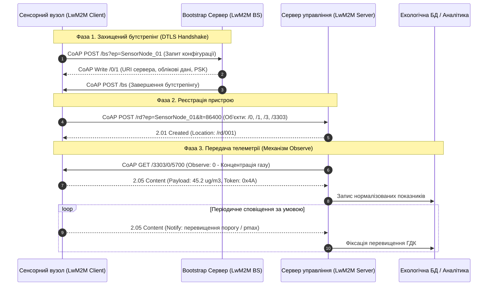

# Змістовий модуль 1. Системи збору та первинного аналізу даних в екологічному моніторингу

# Тема 2. IoT-технології та сенсорні мережі в екології

---

## 2.1. Архітектура апаратного забезпечення екологічного збору даних: мікроконтролери (ESP32, ARM), сенсорні модулі (NO₂, CO, PM2.5, метеопараметри)

### Основний зміст та теоретичний базис
Розбудова сучасних систем автоматизованого екологічного моніторингу базується на концепції територіально розподілених бездротових сенсорних мереж (Wireless Sensor Networks, WSN), інтегрованих у парадигму Інтернету речей (Internet of Things, IoT). Здобувачі вищої освіти мають враховувати, що проектування периферійних вимірювальних вузлів для тривалого польового моніторингу істотно відрізняється від проектування стаціонарних лабораторних систем через жорсткі ресурсні обмеження. Польові контролери характеризуються лімітованим енергозабезпеченням (живлення від акумуляторів у буфері з сонячними фотоелектричними панелями), обмеженим обсягом оперативної пам’яті (RAM від 10 до 520 Кбайт), помірною обчислювальною потужністю процесорних ядер та необхідністю функціонування в умовах агресивного навколишнього середовища й нестабільного каналу бездротового зв’язку.

Апаратна архітектура типового периферійного IoT-модуля складається з чотирьох взаємопов’язаних підсистем: сенсорного інтерфейсного блоку, центрального обчислювального вузла на базі мікроконтролера, бездротового трансивера та підсистеми автономного енергоменеджменту.

```
+-----------------------------------------------------------------------------------+
|                           ПЕРИФЕРІЙНИЙ IOT-ВУЗОЛ МОНІТОРИНГУ                      |
|                                                                                   |
|  +--------------------------------+       +------------------------------------+  |
|  |     Сенсорна підсистема        |       |  Обчислювальне ядро (MCU)          |  |
|  | - NO2, CO (електрохімічні)     | I2C   | - ESP32 / ARM Cortex-M (LPC55S3x)  |  |
|  | - PM2.5 / PM10 (оптичні)       | UART  | - Апаратний криптомодуль (AES/ECC) |  |
|  | - Метео (BME280 / DHT22)       | SPI   | - Керування режимами сну           |  |
|  +--------------------------------+       +------------------------------------+  |
|                                                              |                    |
|  +--------------------------------+                          | SPI/UART           |
|  |   Підсистема енергоживлення    |                          v                    |
|  | - LiFePO4 акумулятор           |       +------------------------------------+  |
|  | - Сонячна панель + MPPT        |       |   Комунікаційний трансивер         |  |
|  | - Контроль заряду (SoC)        |       | - Wi-Fi / LTE Cat-M / NB-IoT       |  |
|  +--------------------------------+       +------------------------------------+  |
+-----------------------------------------------------------------------------------+
```

Сенсорна підсистема призначена для первинного перетворення фізико-хімічних параметрів атмосферного повітря в електричний сигнал. Вибір сенсорних елементів зумовлюється типом контрольованого забруднювача та принципом детектування:
* Детектування токсичних газів, таких як діоксид азоту ($\text{NO}_2$) та оксид вуглецю ($\text{CO}$), здійснюється за допомогою електрохімічних комірок (наприклад, Alphasense NO2-B43F, MQ-135, MiCS-6814) або напівпровідникових металооксидних структур. Електрохімічні сенсори генерують струм, пропорційний парціальному тиску цільового газу, внаслідок протікання окисно-відновних реакцій на робочому електроді. Вони характеризуються високою селективністю та лінійністю характеристик, проте потребують застосування прецизійних операційних підсилювачів з малим рівнем власних шумів і корекції температурного дрейфу нуля.
* Вимірювання масової концентрації зважених часток пилу ($\text{PM}_{2.5}$ та $\text{PM}_{10}$) реалізується переважно на базі лазерних оптичних лічильників частинок (наприклад, Plantower PMS5003, Sensirion SPS30). Їх функціонування ґрунтується на явищі розсіювання світла (ефекті Мі), де інтенсивність світлового потоку, відбитого аерозольними частками, перераховується у масову концентрацію за допомогою вбудованих калібрувальних алгоритмів.
* Моніторинг метеорологічних параметрів здійснюється інтегрованими цифровими датчиками (Bosch BME280, DHT22), які вимірюють температуру, відносну вологість та атмосферний тиск. Метеорологічні дані є критично важливими регресорами для термодинамічної компенсації показів газових сенсорів та алгоритмів нормалізації об’єму повітря до стандартних умов.

Обчислювальний рівень забезпечується застосуванням 32-розрядних мікроконтролерів із низьким енергоспоживанням. Серед них найбільш поширеними у муніципальних проєктах є платформи на базі мікроконтролерів Espressif ESP32-WROOM-32E та процесорні ядра лінійки ARM Cortex-M (зокрема Microchip SAM E54, NXP LPC55S3x). Мікроконтролер ESP32 має двоядерний процесор Xtensa LX6 із тактовою частотою до 240 МГц, 520 Кбайт внутрішньої пам’яті SRAM та інтегровані модулі Wi-Fi (IEEE 802.11 b/g/n) і Bluetooth v4.2 BR/EDR/BLE. Для підвищених вимог до кібербезпеки та відмовостійкості доцільно використовувати мікроконтролери архітектури ARM Cortex-M33 (NXP LPC55S3x), які містять апаратні модулі безпеки TrustZone, зони апаратного захисту пам'яті (Memory Protection Unit) та криптографічні прискорювачі для алгоритмів AES, SHA-256 та криптографії на еліптичних кривих (ECC).

Математичне моделювання енергетичного балансу польового вузла є необхідною умовою забезпечення його цілорічної автономності. Сумарні енергетичні витрати за період дискретизації $T_{\text{cycle}}$ формуються як сума енергій, витрачених у різних режимах функціонування:

$$E_{\text{node}} = E_{\text{sense}} + E_{\text{proc}} + E_{\text{comm}} + E_{\text{sleep}},$$

де $E_{\text{sense}} = P_{\text{sense}} \cdot t_{\text{sense}}$ — енергія, необхідна для прогріву та зчитування сенсорів ($P_{\text{sense}}$ — потужність сенсорного блоку, $t_{\text{sense}}$ — тривалість вимірювальної фази); $E_{\text{proc}} = P_{\text{proc}} \cdot t_{\text{proc}}$ — енергія, що споживається мікропроцесором під час аналітичної обробки та фільтрації сигналу ($P_{\text{proc}}$ — активна потужність мікроконтролера, $t_{\text{proc}}$ — час обчислень); $E_{\text{comm}} = P_{\text{comm}} \cdot t_{\text{comm}}$ — енерговитрати радіомодема під час сеансу передачі даних ($P_{\text{comm}}$ — потужність трансивера в режимі передачі, $t_{\text{comm}}$ — тривалість сеансу зв'язку); $E_{\text{sleep}} = P_{\text{sleep}} \cdot t_{\text{sleep}}$ — втрати енергії в режимі глибокого сну (deep sleep), де потужність $P_{\text{sleep}}$ становить одиниці мікроват, а час $t_{\text{sleep}} = T_{\text{cycle}} - (t_{\text{sense}} + t_{\text{proc}} + t_{\text{comm}})$.

Загальний баланс енергоресурсу автономної батареї $E(t)$ у часі описується інтегральним виразом:

$$E(t) = E_{\text{bat}} - \int_0^t P_e(\tau)\,d\tau + \int_0^t P_{\text{solar}}(\tau)\,d\tau,$$

де $E_{\text{bat}}$ — номінальна початкова ємність акумуляторної батареї, Дж; $P_e(\tau)$ — миттєва споживана потужність навантаження, Вт; $P_{\text{solar}}(\tau)$ — генерація енергії від сонячної панелі з урахуванням сонячної інсоляції та коефіцієнта корисної дії перетворювача заряду, Вт.

При оцінюванні пропускної здатності каналів зв’язку екологічного підприємства навантаження каналу $W_{\text{group}}$ всередині підрозділу розраховується через трафік різної модальності:

$$W_{\text{group}} = \frac{T_I}{N_i} + \frac{T_L}{N_i} + \frac{T_{BD}}{N_i},$$

де $T_I$ — зовнішній трафік Ethernet, Мбіт/с; $T_L$ — локальний трафік підрозділу, Мбіт/с; $T_{BD}$ — трафік звернень до централізованої бази даних екологічного стану, Мбіт/с; $N_i$ — кількість активних робочих вузлів відповідного підрозділу.

| Апаратна платформа | Архітектура ядра | Тактова частота, МГц | Обсяг пам'яті (RAM / Flash) | Апаратні засоби безпеки | Енергоспоживання (Active / Sleep) | Бездротові інтерфейси |
| :--- | :--- | :--- | :--- | :--- | :--- | :--- |
| **ESP32-WROOM-32E** | Xtensa Dual-Core 32-bit LX6 | 160–240 | 520 КБ / 4–16 МБ | Апаратний AES, SHA-2, RSA, RNG | 80–240 мА / 5–10 мкА | Wi-Fi 802.11 b/g/n, BLE 4.2 |
| **NXP LPC55S3x** | ARM Cortex-M33 | 100–150 | 320 КБ / 512 КБ | TrustZone, AES-256, SHA-2, PUF, Secure Boot | 15–30 мА / 2–4 мкА | Потребує зовнішнього модуля (SPI/UART) |
| **Microchip SAM E54** | ARM Cortex-M4F | 120 | 256 КБ / 1 МБ | Апаратні криптоакселератори, Integrity Check Monitor | 35–50 мА / 3–6 мкА | Ethernet MAC, CAN, зовнішній бездротовий |
| **STM32WL55CC** | ARM Dual-Core (Cortex-M4 + M0+) | 48 | 64 КБ / 256 КБ | Апаратний AES-256, захист секторів пам'яті | 12–20 мА / 1–2 мкА | Інтегрований LoRaWAN, (G)FSK |

Наведена порівняльна характеристика свідчить про те, що для базових міських сценаріїв із доступом до мереж Wi-Fi або мобільного зв'язку оптимальним економічним рішенням є мікроконтролер ESP32. Проте для розгортання критичних вузлів моніторингу техногенних зон, де діють суворі стандарти інформаційної безпеки та захисту від несанкціонованої модифікації прошивки, доцільно використовувати мікроконтролери з архітектурою ARM Cortex-M33, які підтримують апаратну ізоляцію критичних процесів та стійке шифрування телеметрії.

---

## 2.2. Мережеві протоколи передачі екологічної телеметрії: CoAP, MQTT, LwM2M

### Основний зміст та теоретичний базис
Передача екологічної інформації від периферійних пристроїв до аналітичних хмарних платформ вимагає вибору мережевого протоколу, оптимізованого для середовищ із обмеженими обчислювальними ресурсами та низькою пропускною здатністю каналу зв'язку. Класичні протоколи прикладного рівня, такі як HTTP/REST, створюють надмірне навантаження на стек пам'яті мікроконтролера через громіздкі текстові заголовки та обов'язкову підтримку сесій TCP, що призводить до невиправданих витрат обмеженого заряду батарей. У сфері екологічного IoT основними альтернативами виступають протоколи MQTT, CoAP та комплексний стандарт Lightweight M2M (LwM2M).

Протокол **MQTT** (Message Queuing Telemetry Transport) базується на архітектурі «публікація-підписка» (Publish/Subscribe) з використанням центрального брокера повідомлень. MQTT функціонує поверх протоколу надійного транспорту TCP, що гарантує доставку пакетів завдяки вбудованим рівням якості обслуговування (QoS 0, QoS 1, QoS 2). Застосування MQTT у муніципальних системах забезпечує зручну маршрутизацію телеметрії між сотнями підписників (аналітичні модулі, бази даних, системи геовізуалізації). Проте підтримка постійного TCP-з'єднання та механізмів Keep-Alive у бездротових мережах стандарту LTE Cat-M чи NB-IoT зумовлює значне споживання енергії. Реалізація клієнта MQTT вимагає виділення 12–18 % від загального обсягу оперативної пам'яті (RAM) мікроконтролера, що обмежує можливість локального виконання складних алгоритмів попередньої обробки сигналу.

Протокол **CoAP** (Constrained Application Protocol) розроблено спеціально для вбудованих пристроїв як легковаговий еквівалент HTTP, що працює поверх ненадійного протоколу дейтаграм UDP. CoAP використовує клієнт-серверну модель взаємодії та компактний бінарний заголовок фіксованої довжини (лише 4 байти у базовій конфігурації). Підтримка асинхронного механізму Observe (RFC 7641) дозволяє клієнту підписуватися на оновлення екологічних ресурсів без необхідності постійного періодичного опитування сервера (polling). Це знижує обсяг мережевого трафіку на порядок.

Стандарт **LwM2M** (Lightweight Machine-to-Machine), розроблений консорціумом Open Mobile Alliance (OMA), є комплексним прикладним протоколом, побудованим поверх CoAP/UDP. LwM2M надає не лише засоби передачі телеметрії, але й стандартизовані механізми адміністрування пристроїв, віддаленого оновлення вбудованого програмного забезпечення (Firmware Over-The-Air, FOTA), конфігурування безпеки та реєстрації. Інформаційна модель LwM2M має чітку трирівневу ієрархію: Об'єкт (Object) $\to$ Екземпляр об'єкта (Object Instance) $\to$ Ресурс (Resource), що формалізується шляхом $\text{/Object\_ID/Instance\_ID/Resource\_ID}$. Обов'язковими для функціонування системи є стандартні об'єкти: Security Object (`/0`), Server Object (`/1`), Access Control Object (`/2`), Device Object (`/3`), Connectivity Monitoring Object (`/4`), а також спеціалізовані сенсорні об'єкти з реєстру IPSO Smart Objects (наприклад, Temperature Sensor `/3303`, Humidity Sensor `/3304`, Generic Sensor `/3300`). 

Імплементація клієнтської бібліотеки LwM2M (наприклад, Eclipse Wakaama або Zephyr LwM2M engine) потребує лише 6–9 % доступної RAM мікроконтролера, що робить цей стандарт найбільш збалансованим для задач муніципального екологічного контролю.


*Рисунок 1 — Часова діаграма взаємодії компонентів екологічної інформаційної системи за протоколом LwM2M*

Для математичного опису функціонування вузла моніторингу в умовах стохастичного надходження інформаційних пакетів або сплесків трафіку хибних подій (індукованих апаратними збоями чи мережевими перешкодами) пристрій формалізується як система масового обслуговування з обмеженим буфером типу $M/D/1/K$.

Нехай час детермінованого обслуговування (обробка та передача) повідомлення становить $t_0$, інтенсивність вхідного потоку пакетів дорівнює $\lambda(t)$, а середня міжімпульсна пауза становить $z(t) = 1/\lambda(t)$. Тоді ефективне приведене навантаження системи $y_{\text{eff}}(t)$ визначається як:

$$y_{\text{eff}}(t) = t_0 \cdot \lambda(t) \cdot [1 - q(t)] \cdot S(t) \cdot A(t),$$

де $q(t)$ — миттєва ймовірність відмови вузла; $S(t)$ — функція живучості апаратного комплексу; $A(t)$ — коефіцієнт функціональної готовності.

Ймовірність втрати пакета $p_0(t)$ внаслідок переповнення буфера місткістю $C$ розраховується за аналітичним виразом:

$$p_0(t) = \frac{(1 - y_{\text{eff}}(t)) \cdot E_K(t)}{1 - [y_{\text{eff}}(t)]^K \cdot E_K(t)},$$

де $K = C + 1$ — гранична місткість черги у системі, а функція $E_K(t)$ задається формулою:

$$E_K(t) = 1 - \sum_{j=1}^{C} \frac{(-1)^j [y_{\text{eff}}(t)]^j (C - j)^j}{j!} \exp[-y_{\text{eff}}(t)(C - j)].$$

Якщо навантаження $y_{\text{eff}}(t) > 0.5$, різко зростає ймовірність відмови в обслуговуванні через буферне насичення. Ефективна ймовірність детектування екологічних подій $p_d^*(t)$ коригується з урахуванням мережевої деградації:

$$p_d^*(t) = (1 - p_0(t)) \cdot p_d(\rho(t), r, q(t), \sigma_t),$$

де $\rho(t)$ — просторова щільність активних вузлів моніторингу; $r$ — радіус чутливості сенсорів; $\sigma_t$ — дисперсія мережевої затримки пакетів. Множник $(1 - p_0(t))$ виступає динамічним фактором згасання аналітичної спроможності всієї моніторингової мережі.

---

## 2.3. Забезпечення цілісності та кібербезпеки в розподілених сенсорних мережах (DTLS, модель ABAC)

### Основний зміст та теоретичний базис
Критична роль даних екологічного моніторингу у процесах прийняття рішень щодо цивільного захисту населення та регулювання промислових емісій висуває підвищені вимоги до інформаційної безпеки. Компрометація даних (підміна координат вимірювальних постів, модифікація концентрацій токсичних речовин, блокування сигналів перевищення ГДК) може призвести до хибної оцінки надзвичайної ситуації та загрози життю людей. 

Організація захищеного інформаційного каналу на транспортному рівні для систем на базі UDP/CoAP/LwM2M реалізується протоколом **DTLS** (Datagram Transport Layer Security, версії 1.2 або 1.3), який вирішує проблему втрати дейтаграм та зміни порядку їх надходження за допомогою механізму нумерації записів і тайм-аутів повторної передачі квитанцій рукостискання (handshake retransmission). Специфікація LwM2M передбачає три режими безпеки:
* Режим попередньо розподілених спільних ключів (Pre-Shared Key, PSK), що базується на симетричній криптографії, характеризується мінімальним споживанням обчислювальних ресурсів і рекомендується для масових малогабаритних польових сенсорів.
* Режим відкритих ключів без сертифікатів (Raw Public Key, RPK), що зменшує накладні витрати на передачу сертифікатів, реалізуючи асиметричну аутентифікацію.
* Режим інфраструктури відкритих ключів (X.509 Certificates), що забезпечує максимальний рівень захисту та ієрархічну перевірку автентичності, проте вимагає значних обсягів RAM для збереження ланцюжків довіри.

Для запобігання несанкціонованому управлінню виконавчими механізмами станцій моніторингу (дистанційне відключення газоаналізаторів, примусове змінення тригерів тривоги) застосовується динамічна модель управління доступом на основі атрибутів (**Attribute-Based Access Control, ABAC**). На відміну від статичної рольової моделі (RBAC), ABAC формує рішення про надання доступу на базі аналізу кортежу атрибутів:

$$\text{Decision} = f_{\text{policy}}(\text{Attr}_{\text{Subject}}, \text{Attr}_{\text{Resource}}, \text{Attr}_{\text{Action}}, \text{Attr}_{\text{Environment}}),$$

де $\text{Attr}_{\text{Subject}}$ описує параметри запитувача (роль, цифровий сертифікат, рівень допуску); $\text{Attr}_{\text{Resource}}$ — властивості цільового LwM2M-ресурсу (тип сенсора, координати, статус критичності); $\text{Attr}_{\text{Action}}$ — тип операції (Read, Write, Execute, Observe); $\text{Attr}_{\text{Environment}}$ — динамічний контекст довкілля (поточний час доби, аварійний режим функціонування підприємства, фіксація перевищення ГДК, рівень заряду станції). Наприклад, операція `Write` на ресурс зміни інтервалу вимірювань дозволяється системному оператору виключно у робочий час за умови, що значення аварійного тригера станції не активоване.

Математична оцінка інформаційних ризиків в інфраструктурі екологічного моніторингу базується на розрахунку очікуваних втрат із урахуванням імовірності реалізації загроз, масштабів потенційних збитків та вартості захисних заходів. Агрегований вплив $I_t$ реалізації загрози $t$ на властивості конфіденційності ($I_{t,C}$), цілісності ($I_{t,I}$) та доступності ($I_{t,A}$) визначається як зважена сума:

$$I_t = w_C \cdot I_{t,C} + w_I \cdot I_{t,I} + w_A \cdot I_{t,A},$$

де $w_C, w_I, w_A \in [0, 1]$ — вагові коефіцієнти відносної важливості критеріїв інформаційної безпеки для досліджуваної екологічної системи, які задовольняють умову нормування $w_C + w_I + w_A = 1$. Для систем моніторингу пріоритет зазвичай надається цілісності та доступності ($w_I \ge 0.45$, $w_A \ge 0.45$, $w_C \le 0.10$).

Кількісний ризик $\text{Risk}_t$, асоційований із окремою загрозою $t$, дорівнює добутку ймовірності її виникнення $P_t$ на інтегральний вплив $I_t$:

$$\text{Risk}_t = P_t \cdot I_t = P_t \cdot (w_C \cdot I_{t,C} + w_I \cdot I_{t,I} + w_A \cdot I_{t,A}).$$

Сумарний початковий ризик $R$ для множини всіх ідентифікованих загроз $T$ розраховується як:

$$R = \sum_{t \in T} \text{Risk}_t = \sum_{t \in T} P_t \cdot (w_C \cdot I_{t,C} + w_I \cdot I_{t,I} + w_A \cdot I_{t,A}).$$

Впровадження комплексу заходів захисту $M$ (використання шифрування DTLS, налаштування модулів ABAC, інтеграція апаратного захисту TEE) призводить до зменшення ймовірностей реалізації загроз до величин $P_t^{(M)} \le P_t$ та зниження шкоди $I_t^{(M)} \le I_t$. Залишковий ризик $R^{(M)}$ визначається співвідношенням:

$$R^{(M)} = \sum_{t \in T} P_t^{(M)} \cdot \left( w_C \cdot I_{t,C}^{(M)} + w_I \cdot I_{t,I}^{(M)} + w_A \cdot I_{t,A}^{(M)} \right).$$

Економічна доцільність обраної стратегії кіберзахисту верифікується шляхом зіставлення абсолютної величини зниження ризику $\Delta R^{(M)} = R - R^{(M)}$ із сукупними фінансовими витратами на реалізацію відповідного набору контрзаходів $C(M) = \sum_{m \in M} C_m$.

Для оперативного виявлення кібератак типу «відмова в обслуговуванні» (DoS) або спроб ін'єкції сфальсифікованих показів сенсорів застосовується метод багатовимірного аналізу аномалій у мережевому трафіку. Для вектора спостережень параметрів трафіку $X_t$ (розмір пакетів, частота запитів, міжпакетні інтервали, дисперсія фази Observe) розраховується відстань Махаланобіса $D_M(X_t)$:

$$D_M(X_t) = \sqrt{(X_t - \mu)^T \Sigma^{-1} (X_t - \mu)},$$

де $\mu$ — вектор середніх значень параметрів нормального профілю функціонування мережі; $\Sigma$ — коваріаційна матриця ознак трафіку. Перевищення розрахованої відстані $D_M(X_t)$ встановленого критичного порогу свідчить про наявність аномальної поведінки вузла або атаку на інформаційну інфраструктуру, що ініціює процедуру ізоляції скомпрометованого сегмента на рівні LwM2M-сервера.

---

### Питання для самоперевірки та аналітичного осмислення

1. Які апаратні обмеження мікроконтролерів встановлюють межі застосування складних криптографічних протоколів на периферійному рівні екологічних IoT-мереж?
2. Проаналізуйте причини, чому протокол MQTT, незважаючи на широку популярність у комерційному IoT, створює суттєві енергетичні та пам'яттєві накладні витрати порівняно з протоколом LwM2M на польових вимірювальних станціях.
3. У чому полягає сутність трирівневої інформаційної моделі стандарту LwM2M (Об'єкт / Екземпляр / Ресурс), і яким чином вона забезпечує стандартизацію представлення екологічних показників від різних сенсорних виробників?
4. Поясніть фізичний зміст параметрів системи масового обслуговування $M/D/1/K$ при моделюванні пропускної здатності сенсорного вузла в умовах стохастичних інформаційних сплесків.
5. Опишіть механізм функціонування моделі динамічного контролю доступу ABAC. Які саме атрибути навколишнього середовища ($\text{Attr}_{\text{Environment}}$) є критично важливими для управління правами доступу до екологічних станцій під час аварійних екологічних ситуацій?
6. Як розраховується залишковий ризик інформаційної безпеки системи моніторингу після впровадження захищеного бутстрепінгу та шифрування каналів зв'язку за моделлю $\text{Risk}_t$?
7. Яким чином обчислення відстані Махаланобіса $D_M(X_t)$ для метрик мережевого трафіку дозволяє виявляти аномалії в роботі розподілених станцій екологічного спостереження без розшифрування змісту самого корисного навантаження?