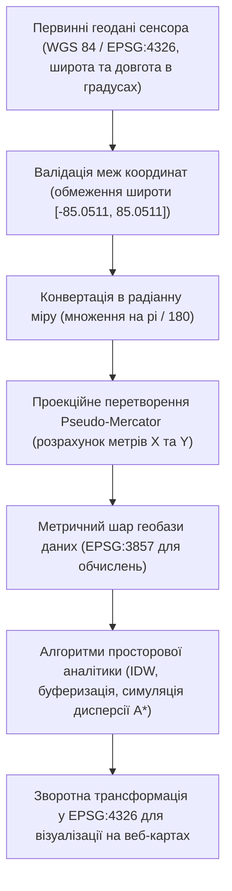
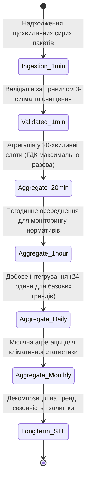
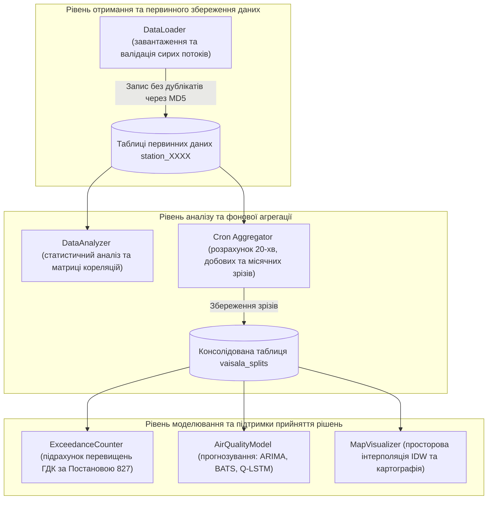
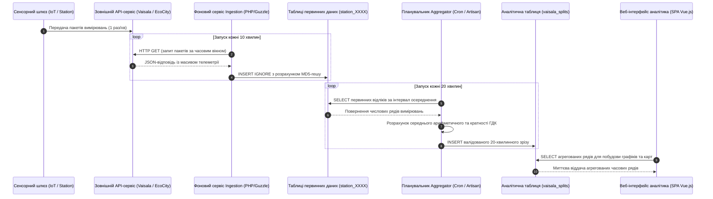
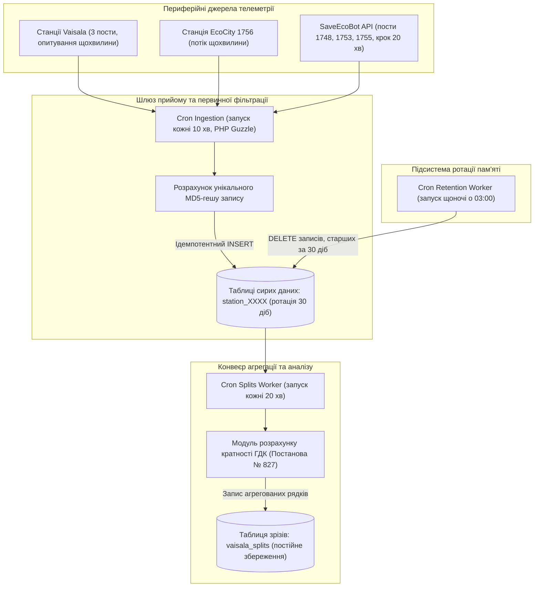

# Тема 3. Проєктування структур баз даних та архітектури інтеграції гетерогенних даних муніципального екологічного моніторингу

## Мета лекції
Метою лекції є формування у магістрантів комплексних фахових компетентностей щодо проєктування та оптимізації гетерогенних сховищ екологічної телеметрії, розробки стійких реляційних схем фізичного розділення первинних і агрегованих даних, реалізації математичних перетворень просторово-часових координат для подальшого геопросторового моделювання, а також побудови надійних сервісних адаптерів взаємодії з промисловими та громадськими API, що забезпечує функціонування сучасних муніципальних систем екологічної безпеки в реальному часі.

## Очікувані результати навчання
1. **Знання та розуміння.** Здобувачі мають засвоїти теоретичні засади просторово-часової дискретизації екологічної телеметрії, математичний апарат проекційних трансформацій координат між WGS 84 та Pseudo-Mercator, принципи нормалізації та денормалізації баз даних часових рядів, а також фундаментальні механізми забезпечення ідемпотентності запису первинних спостережень за допомогою криптографічного гешування.
2. **Застосування.** Здобувачі будуть здатні самостійно розробляти оптимізовані DDL-схеми реляційних баз даних MySQL та PostgreSQL для дворівневого зберігання потоків вимірювань, налаштовувати механізми планування завдань ротації та агрегації даних через фонові процеси, а також реалізовувати програмні клієнти для асинхронного забору телеметрії через REST API сервісів моніторингу повітря.
3. **Аналіз.** Здобувачі навчаться аналізувати вплив кроку часової дискретизації на обчислювальні витрати систем предиктивної аналітики, досліджувати вузькі місця індексації B-Tree при обробці високочастотних транзакцій та зіставляти архітектурну ефективність реляційних моделей даних і документоорієнтованих систем повнотекстового індексування логів екологічних інцидентів.
4. **Оцінювання та синтез.** Здобувачі набудуть спроможності комплексно оцінювати надійність і масштабованість інфраструктури зберігання даних екологічного моніторингу в умовах ресурсних обмежень сервісних платформ та синтезувати гібридні архітектури баз даних, які інтегрують просторову інтерполяцію, автоматизований аудит системних збоїв та сумісність із вимогами чинних державних і міжнародних екологічних регламентів.

---

## Детальний покроковий план лекції

### 1. Теоретико-концептуальний базис. Просторово-часова дискретизація та математичні моделі представлення екологічних сутностей
* 1.1. Математична формалізація багатовимірних просторово-часових наборів даних екологічних спостережень та кортежні моделі представлення об'єктів у парадигмі DPPDM.
* 1.2. Картографічні проекційні перетворення, усунення сферичних геометричних спотворень та перехід від географічної системи WGS 84 (EPSG:4326) до планарної проекції Pseudo-Mercator (EPSG:3857).
* 1.3. Багаторівнева ієрархія часової дискретизації вимірювань, вимоги санітарно-гігієнічних регламентів до 20-хвилинного осереднення та виявлення довгострокових кліматичних трендів.
* 1.4. Об'єктно-орієнтоване моделювання предметної області екологічного контролю на основі діаграм класів UML і криптографічний контроль унікальності первинних записів за формулою комбінованого гешування MD5.

### 2. Методологія та аналіз граничних умов. Архітектура реляційних схем, ротація телеметрії та шлюзи зовнішніх API
* 2.1. Концепція дворівневого сховища даних із розділенням таблиць ізольованого накопичення щохвилинних спостережень та консолідованих аналітичних таблиць зрізів.
* 2.2. Алгоритми автоматизованої фонової агрегації даних за розкладом cron та стратегії ротації застарілих записів для запобігання деградації сховища.
* 2.3. Проєктування сервісних адаптерів взаємодії з відкритими API комерційного та громадського моніторингу повітря на базі спеціалізованих клієнтських класів обробки телеметрії.
* 2.4. Гібридизація сховищ: інтеграція реляційних баз даних із документоорієнтованою системою OpenSearch для структурованого аудиту системних логів, аномалій та інцидентів.
* 2.5. Системні бар'єри масштабування, деградація пропускної спроможності індексів при високочастотному записі та проблема часового розсинхрону незв'язаних сенсорних мереж.

### 3. Практичний індустріальний / фаховий кейс. Інженерія даних муніципальної системи спостереження агломерації
**Тема наскрізної задачі.** «Проєктування дворівневої структури бази даних MySQL/PostgreSQL та шлюзу інтеграції промислових станцій Vaisala й громадської мережі EcoCity для муніципальної системи моніторингу якості повітря міста Кременчук».


## 1. Теоретико-концептуальний базис. Просторово-часова дискретизація та математичні моделі представлення екологічних сутностей

### 1.1. Математична формалізація багатовимірних просторово-часових наборів даних екологічних спостережень та кортежні моделі представлення об'єктів у парадигмі DPPDM

Проєктування інформаційних систем екологічного моніторингу вимагає побудови адекватної математичної моделі предметної області, здатної формалізувати неперервні фізико-хімічні процеси міського середовища у вигляді дискретних структур даних. Екологічна інформація за своєю природою є гетерогенною та просторово-часово розподіленою, оскільки вона об'єднує динамічні концентрації шкідливих домішок, термодинамічні та гідродинамічні показники атмосфери, а також координати вимірювальних постів і нормативні регламенти. 

Математично вхідний масив екологічних вимірювань муніципального рівня представляється у вигляді багатовимірного тензора або дискретного просторово-часового поля спостережень, яке формалізується виразом:

$$X = \{x_{i,j,t}\}, \quad i \in \{1, \dots, N\}, \quad j \in \{1, \dots, M\}, \quad t \in \{1, \dots, T\},$$

де індекс $i$ позначає просторово локалізований вимірювальний пост або автоматичну станцію спостереження із загальної множини $N$ постів; індекс $j$ відповідає конкретному фізико-хімічному або метеорологічному показнику з множини $M$ контрольованих параметрів; дискретний індекс часу $t$ фіксує момент або інтервал реєстрації показника на часовому горизонті спостережень $T$; а величина $x_{i,j,t} \in \mathbb{R}$ є дійсним числовим значенням зареєстрованої концентрації полютанта чи метеорологічного фактора.

Для подолання семантичної неоднорідності та структурування зв'язків між первинними спостереженнями, аналітичними алгоритмами та управлінськими діями застосовується кортежний апарат формалізації знань. Концептуальна модель функціонування досліджуваної екологічної системи описується кортежем:

$$T_1 = \langle ES, I, P, R, CM \rangle,$$

де компонент $ES$ визначає фізичний об'єкт спостереження, такий як урбанізований повітряний басейн або промислова агломерація; елемент $I$ представляє множину вимірюваних індикаторів стану середовища; $P$ формалізує динамічні фізичні процеси переносу, розсіювання або хімічної трансформації домішок; $R$ задає систему внутрішніх кореляційних та причинно-наслідкових відношень між показниками та зовнішніми факторами; а компонент $CM$ представляє інтегровану концептуальну схему предметної області, що містить онтологічні зв'язки функціонування системи.

Окреме елементарне спостереження, що генерується вимірювальною підсистемою та записується до бази даних, формалізується розширеним прикладним кортежем обліку даних:

$$M = \langle O, C, M_{\text{tech}}, T, L, S, I_{\text{eval}}, U \rangle,$$

де елемент $O$ ідентифікує конкретний об'єкт або субстанцію дослідження; компонент $C$ фіксує кількісні та якісні характеристики об'єкта; параметр $M_{\text{tech}}$ позначає інструментальний метод вимірювання, такий як спектрофотометрія, електрохімічний аналіз або лазерна дифракція; атрибут $T$ задає точну часову мітку зняття показника; компонент $L$ містить просторові координати вузла; вектор $S$ агрегує первинні статистичні дескриптори ряду; компонент $I_{\text{eval}}$ відображає експертну інтерпретацію стану середовища; а символ $U$ регламентує операційне управлінське рішення, що формується автоматизованою системою на основі зареєстрованих показників.

На основі систематизації кортежних моделей синтезовано розширену парадигму інтелектуального оброблення екологічних даних $\text{DPPDM}_{\text{ext}}$, яка перетворює первинний потік телеметрії на інформаційний базис для систем прийняття рішень. Базова множина перетворень даних формалізується співвідношенням:

$$\text{DPPDM} = \langle D, T_{\text{trans}}, P, F, V \rangle,$$

де множина $D$ містить сирі вимірювання, отримані від розподіленої мережі сенсорів; оператор $T_{\text{trans}}$ задає множину перетворень нормалізації, фільтрації викидів та інтерполяції часових рядів; компонента $P$ відповідає за роботу предиктивних алгоритмів; множина $F$ охоплює інженерію похідних ознак, зокрема оцінку кратності перевищення санітарно-гігієнічних обмежень; а блок $V$ відповідає за візуалізацію результатів. Розширена модель $\text{DPPDM}_{\text{ext}}$ поглиблює прогностичне ядро через інтеграцію додаткових підсистем:

$$\text{DPPDM}_{\text{ext}} = \langle D, T_{\text{trans}}, F, \langle A, P, Q, M_{\text{sim}}, E \rangle, F, V \rangle,$$

у межах якої підсистема $A$ реалізує попередній аналіз стохастичних властивостей рядів; блок $Q$ виконує оптимізацію архітектур прогнозування; модуль $M_{\text{sim}}$ реалізує геопросторове моделювання та генерацію віртуальних станцій; а підсистема $E$ забезпечує експертну валідацію отриманих предиктивних моделей за допомогою метрик похибки та когнітивних агентів.

> **ПРАКТИЧНИЙ ЯКІР:** У муніципальній системі моніторингу промислової агломерації міста Кременчук математична формалізація $X = \{x_{i,j,t}\}$ застосовується для одночасної обробки щомісячних ретроспективних показників тринадцяти фізико-хімічних параметрів (зокрема пилу, діоксиду сірки, оксиду вуглецю, діоксиду азоту та формальдегіду) із мережі п'яти стаціонарних постів спостереження, локалізованих поблизу потужних джерел техногенного впливу, таких як Кременчуцький нафтопереробний завод та металургійні виробництва.

### 1.2. Картографічні проекційні перетворення, усунення сферичних геометричних спотворень та перехід від географічної системи WGS 84 (EPSG:4326) до планарної проекції Pseudo-Mercator (EPSG:3857)

Геопросторове позиціонування постів екологічного моніторингу у первинному вигляді описується географічними координатами, отриманими за допомогою супутникових систем навігації (GPS/GLONASS) у загальноприйнятій геодезичній системі координат **WGS 84 (World Geodetic System 1984)**, яка в міжнародному реєстрі просторових даних EPSG має ідентифікатор **EPSG:4326**. У цій системі позиція кожного датчика визначається кутовими величинами: широтою $\varphi \in [-90^\circ, 90^\circ]$ та довготою $\lambda \in [-180^\circ, 180^\circ]$, що задаються на поверхні тривісного референц-еліпсоїда. 

Проте використання географічних кутових координат для виконання завдань геопросторового моделювання, розрахунку радіусів поширення викидів та алгоритмів просторової інтерполяції є некоректним. Земна поверхня не є площиною, а лінійна довжина одного кутового градуса за довготою стрімко зменшується від екватора до полюсів пропорційно косинусу широти $\cos(\varphi)$. Прямий розрахунок евклідової відстані між пунктами вимірювання за формулою $\sqrt{(\Delta \lambda)^2 + (\Delta \varphi)^2}$ вносить грубі нелінійні геометричні деформації в метрику простору, що призводить до спотворення ізоліній концентрацій забруднюючих речовин.

Для забезпечення можливості застосування лінійних метричних шкал та евклідової планарної геометрії в аналітичних підсистемах здійснюється математичне перетворення географічних координат у планарну проекційну систему координат **WGS 84 / Pseudo-Mercator**, що позначається кодом **EPSG:3857** (також відому як сферичний Меркатор, що є стандартом для картографічних сервісів OpenStreetMap та Google Maps). У цій системі поверхня Землі апроксимується сферою фіксованого радіуса, а координати виражаються в метрах $(x, y)$ відносно початку відліку на перетині Гринвіцького меридіана та екватора.

Трансформація географічних координат точки $(\varphi, \lambda)$, заданих у десяткових градусах, у плоскі метрові координати $(x, y)$ проекції EPSG:3857 описується аналітичними рівняннями:

$$x = R_{\text{Earth}} \cdot \lambda_{\text{rad}}, \quad y = R_{\text{Earth}} \cdot \ln\left[ \tan\left( \frac{\pi}{4} + \frac{\varphi_{\text{rad}}}{2} \right) \right],$$

де константа $R_{\text{Earth}} = 6378137.0\text{ м}$ відповідає великій півосі еліпсоїда WGS 84, прийнятій за радіус базової сфери в нормалізованій проекції Меркатора; а змінні $\lambda_{\text{rad}}$ та $\varphi_{\text{rad}}$ представляють кутові координати, переведені з десяткових градусів у радіани за формулами:

$$\lambda_{\text{rad}} = \lambda \cdot \frac{\pi}{180}, \quad \varphi_{\text{rad}} = \varphi \cdot \frac{\pi}{180}.$$

Зворотне проекційне перетворення координат із планарного простору $(x, y)$ проекції EPSG:3857 у географічні градусні координати $(\varphi, \lambda)$ системи EPSG:4326 виконується за аналітичними виразами:

$$\lambda = \left( \frac{x}{R_{\text{Earth}}} \right) \cdot \frac{180}{\pi}, \quad \varphi = \left( 2 \cdot \arctan\left( \exp\left( \frac{y}{R_{\text{Earth}}} \right) \right) - \frac{\pi}{2} \right) \cdot \frac{180}{\pi}.$$

Перехід до метричної системи координат EPSG:3857 є базовою математичною передумовою для коректного функціонування методу зворотно зважених відстаней (**Inverse Distance Weighting, IDW**), який визначає значення прогнозованої концентрації $z(x_0, y_0)$ у довільній точці міського простору $(x_0, y_0)$ через зважену суму вимірювань $z_i$ на $N$ стаціонарних постах спостереження:

$$z(x_0, y_0) = \frac{\sum_{i=1}^N w_i(x_0, y_0) \cdot z_i}{\sum_{i=1}^N w_i(x_0, y_0)}, \quad w_i(x_0, y_0) = \frac{1}{d_i^p},$$

де вага $w_i(x_0, y_0)$ залежить від геометричної евклідової відстані $d_i$ між досліджуваною точкою та $i$-м постом, яка обчислюється у метрах:

$$d_i = \sqrt{(x_0 - x_i)^2 + (y_0 - y_i)^2},$$

а параметр степеня $p$ (зазвичай приймається $p = 2$) визначає швидкість спадання впливу віддалених точок спостереження на оцінювану локацію.



> **ТИПОВА ПОМИЛКА:** Безпосередній розрахунок евклідової відстані в алгоритмах інтерполяції (IDW або Kriging) на основі сирих кутових градусів WGS 84 без попередньої трансформації в метричну проекцію EPSG:3857 призводить до анізотропного геометричного стиснення простору за віссю широти. На широті 50° північної широти один градус довготи лінійно коротший за один градус широти майже на 36%, через що розраховані ореоли забруднення набувають штучної еліптичної витягнутості вздовж меридіанів, спотворюючи межі зон екологічного лиха.

### 1.3. Багаторівнева ієрархія часової дискретизації вимірювань, вимоги санітарно-гігієнічних регламентів до 20-хвилинного осереднення та виявлення довгострокових кліматичних трендів

Для забезпечення високої пропускної спроможності бази даних та узгодження результатів обробки з нормативними стандартами екологічного контролю первинні телеметричні потоки мають бути структуровані у багаторівневу часову ієрархію. Вимірювальні комплекси генерують первинні відліки з високою дискретизацією (щохвилини або кожні 1–5 хвилин). Проте збереження таких масивів у єдиній аналітичній таблиці спричиняє деградацію операцій вибірки через колосальний обсяг даних.

Чинна нормативно-правова база України, зокрема **Постанова Кабінету Міністрів України № 827** «Деякі питання здійснення державного моніторингу в галузі охорони атмосферного повітря», гармонізована з європейськими нормами (Директива 2008/50/ЄС та оновлена **Директива ЄС 2024/2881** про якість атмосферного повітря), встановлює регламентовані вікна осереднення. Розрахунок максимально разових концентрацій полютантів має базуватися на 20-хвилинних інтервалах осереднення, оскільки саме цей часовий інтервал мінімізує вплив короткочасних стохастичних шумів і відображає фізіологічну реакцію дихальних шляхів людини на токсичний удар.

Математично процедура дискретного осереднення часового ряду концентрацій шкідливих речовин для $i$-го моніторингового поста в межах заданого часового вікна $\Delta t$ записується у вигляді середнього арифметичного інтегрального відліку:

$$\bar{C}_{i,j}(t_k) = \frac{1}{N_k} \sum_{m=1}^{N_k} C_{i,j}(t_{k,m}),$$

де $\bar{C}_{i,j}(t_k)$ — розрахована осереднена концентрація $j$-ї субстанції за $k$-й часовий інтервал; $N_k$ — фактична кількість валідних інструментальних вимірювань, зареєстрованих сенсором протягом інтервалу (наприклад, $N_k = 20$ для щохвилинних відліків у межах 20-хвилинного слота); а $C_{i,j}(t_{k,m})$ — миттєве вимірювання сенсора у дискретний квант часу всередині вікна.

Для виявлення довгострокових трендів екологічних змін та відокремлення випадкових флуктуацій від систематичних факторів агреговані часові ряди піддаються класичній адитивній або мультиплікативній сезонній декомпозиції (**Seasonal and Trend decomposition using Loess, STL**). У разі адитивної моделі поведінка ряду $X(t)$ описується функціоналом:

$$X(t) = T(t) + S(t) + R(t),$$

де компонент $T(t)$ описує детермінований довгостроковий тренд зміни екологічного параметра; $S(t)$ формалізує циклічну сезонну компоненту з фіксованим періодом коливань (наприклад, 12 місяців для річного сонячного та опалювального циклу або 24 години для добового циклу трафіку); а $R(t)$ є випадковою стохастичною залишковою величиною (залишком), яка повинна підпорядковуватися властивостям білого шуму за умови коректної побудови декомпозиції.

Ієрархія переходів станів агрегації даних у часовому просторі бази даних представлена схемою життєвого циклу оброблення первинної телеметрії:



> **ПРАКТИЧНИЙ ЯКІР:** У процесі дослідження часових рядів забруднення повітря у місті Кременчук за період 2007–2024 років декомпозиція щомісячних концентрацій пилу за моделлю $X(t) = T(t) + S(t) + R(t)$ на стаціонарному пості № 4 (вул. Шевченка, 22/30) дозволила виявити чітку циклічну сезонну компоненту з максимумами у літні місяці та мінімумами у зимовий період, а також зафіксувати зниження монотонного тренду $T(t)$ із рівня 1.2 до показників нижче 1.0 кратності середньодобової ГДК після 2019 року.

### 1.4. Об'єктно-орієнтоване моделювання предметної області екологічного контролю на основі діаграм класів UML і криптографічний контроль унікальності первинних записів за формулою комбінованого гешування MD5

Створення надійного та масштабованого програмного забезпечення для зберігання та аналізу екологічних даних потребує точного визначення об'єктної моделі предметної області з використанням мови моделювання **Unified Modeling Language (UML)**. Об'єктно-орієнтований підхід дозволяє відобразити складні багаторівневі взаємозв'язки між фізичними сенсорами, географічними пунктами, хімічними речовинами та нормативними документами.

Основними класами системи виступають:
* Клас `ObservationPost`, який інкапсулює відомості про вимірювальні пости (унікальний числовий ідентифікатор, назву, мережевий ідентифікатор шлюзу та координати в системі EPSG:3857);
* Клас `City`, що визначає просторову та демографічну прив'язку спостережень до муніципального утворення;
* Клас `Address`, який деталізує фізичне розташування датчика до рівня вулиці та будівлі;
* Клас `Pollutant`, що містить номенклатуру досліджуваних домішок із зазначенням одиниць вимірювання та санітарно-хімічних властивостей;
* Клас `MPC`, який зберігає чинні нормативи гранично допустимих концентрацій з відповідними термінами дії для кожного полютанта;
* Клас `Exceedance`, що фіксує конкретні інциденти перевищення нормативів, пов'язуючи станцію, речовину, кратність перевищення та дату події.

Для забезпечення ефективного функціонування сховища та автоматизації аналітичних процедур структура модулів програмного забезпечення розподіляється за функціональними рівнями.



Критичним аспектом збереження цілісності первинних даних під час високочастотного завантаження телеметрії через мережеві канали зв'язку є запобігання дублюванню спостережень. У разі виникнення тайм-аутів при опитуванні датчиків або повторного виконання пакетних cron-завдань один і той самий пакет даних може надійти повторно. Для гарантування ідемпотентності операцій вставки в реляційні таблиці застосовується механізм розрахунку криптографічного геш-коду запису.

Для кожного вхідного кортежу вимірювання формується детермінований унікальний геш-код за алгоритмом **MD5**, який об'єднує конкатенацію ключових параметрів фізичного стану датчика:

$$\text{hash}_{\text{record}} = \text{MD5}\big(\text{place\_id} \,\|\, \text{split\_number} \,\|\, \text{option} \,\|\, \text{measurement\_value} \,\|\, \text{measurement\_time}\big),$$

де оператор $\|$ позначає конкатенацію рядкових представлень змінних; $\text{place\_id}$ — системний ідентифікатор вимірювального поста; $\text{split\_number}$ — номер дискретного часового кванта всередині доби; $\text{option}$ — стандартизоване кодове позначення хімічної речовини (наприклад, `NO2` або `CO`); $\text{measurement\_value}$ — отримане числове значення вимірюваної концентрації; а $\text{measurement\_time}$ — точний час фіксації вимірювання у форматі таймстемпу.

Отримане 128-бітне шістнадцяткове значення зберігається у спеціальному стовпці `unique_hash` із накладеним обмеженням бази даних `UNIQUE INDEX`. При спробі виконання повторної операції `INSERT` сервер баз даних блокує дублювання транзакції на рівні ядра СКБД, усуваючи необхідність виконання попередніх ресурсомістких SQL-запитів типу `SELECT ... WHERE EXISTS`.

Нижче наведено порівняльну характеристику фундаментальних моделей і методів представлення та обробки просторово-часових даних у сучасних екологічних інформаційних системах.

| Модель / Метод | Математичний або алгоритмічний базис | Переваги впровадження у сховище | Ключові обмеження та виклики | Приклад з реальної практики |
| :--- | :--- | :--- | :--- | :--- |
| **Кортежна модель DPPDM / DPPDMext** | Теорія множин, впорядковані кортежі $\langle D, T, P, F, V \rangle$ | Формалізує замкнений аналітичний цикл від первинного забору даних до прийняття рішень | Вимагає суворої типізації метаданих на всіх етапах обробки | Інформаційна технологія адаптивного прогнозування стану урбанізованого середовища |
| **Проекція WGS 84 / Pseudo-Mercator** | Логарифмічно-тригонометричне конформне перетворення Меркатора | Забезпечує сталість масштабу в метрах для локального евклідового аналізу | Нелінійне масштабне спотворення геометрії на субполярних широтах | Геоінформаційний модуль муніципального картографування OpenStreetMap |
| **Багаторівнева дискретизація (20-хв, добова)** | Статистичне інтегрування та розрахунок середнього арифметичного | Зменшує обсяги зберігання на 95% та узгоджується із нормами Постанови КМУ № 827 | Втрата екстремальних миттєвих піків залпових викидів тривалістю менше хвилини | Сервіс розрахунку індексів AQI та кратності перевищення гранично допустимих норм |
| **Контроль унікальності на базі MD5** | Криптографічна геш-функція дайджесту повідомлень (128 біт) | Гарантує ідемпотентність операцій збереження та цілісність часових рядів | Потенційна теоретична можливість геш-колізій при надвеликих масивах даних | Модуль автоматизованого вивантаження даних станцій EcoCity та Vaisala у MySQL |

> **КОНТРОЛЬНЕ ПИТАННЯ:** Чому використання 20-хвилинного осереднення є обов'язковим для оцінки максимально разових концентрацій шкідливих домішок з точки зору санітарно-гігієнічних вимог, і як воно впливає на стабільність предиктивних моделей порівняно з хвилинними відліками?

<details markdown="1">
<summary>Розгорнути аналіз / відповідь</summary>

**Правильний варіант: Забезпечення фізіологічної відповідності часу токсичної експозиції та згладжування високочастотного апаратного шуму.**

1. Згідно з токсикологічними та санітарно-гігієнічними нормами (Постанова КМУ № 827, стандарти ВООЗ), інтервал у 20 хвилин обрано як мінімальний фізіологічний час реагування дихальної та серцево-судинної систем людини на гострий токсичний вплив атмосферних забруднювачів. Миттєві хвилинні флуктуації часто обумовлені локальними завихреннями повітря або випадковими стохастичними викидами, які не утворюють стійкого поля небезпечної концентрації. 

2. Для предиктивних математичних моделей (ARIMA, BATS, LSTM) 20-хвилинне агрегування виступає природним фільтром низьких частот. Воно усуває високочастотний шум вимірювальних каналів та короткостроковий дрейф нуля сенсорів, забезпечуючи чітке виділення автокореляційних зв'язків. Використання ж хвилинних відліків безпосередньо у прогностичних ядрах призводить до перенавчання моделей на апаратному шумі та суттєвого падіння їхньої прогностичної сили (зростання MSE до 300% для волатильних рядів).

</details>

---

### Вказівки для самостійного осмислення

1. Здійснити аналітичний розрахунок планарних координат у метричній проекції EPSG:3857 для заданої географічної точки в межах обраної міської агломерації та порівняти величину відносної похибки визначення відстаней між двома сусідніми моніторинговими станціями при розрахунку за сферичними та планарними формулами.
2. Сформувати кортежний опис процесу агрегації екологічних даних для гіпотетичної вимірювальної станції відповідно до парадигми $\text{DPPDM}_{\text{ext}}$, визначивши конкретне наповнення кожного операційного блоку моделі з урахуванням специфіки вимірювання газових домішок та метеопараметрів.
3. Проаналізувати механізм генерації комбінованого геш-коду запису телеметрії на базі алгоритму MD5 та розробити фрагмент схеми реляційної таблиці мовою SQL, що реалізує ідемпотентну поведінку бази даних при повторному надходженні дублюючих пакетів спостережень.


## 2. Методологія та аналіз граничних умов. Реляційні схеми, ротація телеметрії та шлюзи зовнішніх API

### 2.1. Концепція дворівневого сховища даних із розділенням таблиць ізольованого накопичення щохвилинних спостережень та консолідованих аналітичних таблиць зрізів

Архітектурне проєктування реляційних баз даних для систем муніципального екологічного моніторингу вимагає розв'язання вираженого системного конфлікту між інтенсивним конкурентним записом високочастотних первинних даних у режимі реального часу та високою швидкістю виконання ресурсомістких аналітичних запитів над історичними масивами. Традиційний підхід, що передбачає акумулювання всіх вимірювань у межах єдиної денормалізованої таблиці, виявляється непридатним у промисловій експлуатації. Постійне надходження щохвилинних потоків телеметрії від розподіленої мережі сенсорів ініціює часті операції блокування індексних структур типу **B-Tree**, спричиняє фрагментацію табличного простору та призводить до катастрофічного зростання затримок при спробах паралельного виконання аналітичних вибірок.

Для розв'язання цієї суперечності розроблено методологію дворівневої фізичної та логічної організації сховища. Перший рівень формують ізольовані таблиці первинного накопичення, кожна з яких прив'язана до конкретної фізичної станції спостереження, наприклад, `station_T3950713`, `station_T3950716` для промислових станцій Vaisala або `station1748`, `station1756` для станцій індикативного моніторингу EcoCity. Така ізоляція гарантує повну незалежність транзакційних потоків: інтенсивний запис або аварійне блокування таблиці однієї станції не впливає на процес збору даних з інших вимірювальних вузлів. Крім того, індивідуальні таблиці первинних спостережень мають адаптивну структуру полів, яка враховує індивідуальну апаратну комплектацію вимірювальних постів. Наприклад, якщо станція містить комбінований набір сенсорів **AQT530** (газоаналізатор) та **WXT530** (метеостанція), її таблиця фіксує як концентрації газів, так і швидкість вітру чи опади; якщо ж пост обладнано лише базовим сенсором, відсутні фізичні канали залишаються порожніми, не спричиняючи спотворення структури загального сховища.

Другий рівень архітектури представлений консолідованою реляційною таблицею аналітичних зрізів `vaisala_splits` (або `split_measurement_ua171`). Ця структура містить виключно попередньо оброблені та осереднені дані, оптимізовані для швидкої багатокритеріальної фільтрації та подальшого навчання моделей машинного навчання. У цій таблиці реалізовано прапорці типізації інтервалів осереднення, що дозволяє виконувати аналітичні SQL-запити із залученням кластеризованих складених індексів за частки секунди, мінімізуючи навантаження на підсистему введення-виведення.

> **ВАЖЛИВО:** Фундаментальним інваріантом дворівневого сховища є сувора односпрямованість обробки даних: компоненти прикладного рівня ніколи не повинні звертатися безпосередньо до таблиць первинних даних під час виконання користувацьких чи аналітичних запитів. Будь-які операції візуалізації, побудови графіків, прогнозування та генерації звітів мають безальтернативно адресуватися до таблиці зрізів, що виключає ймовірність блокування процесів запису первинної телеметрії.



### 2.2. Алгоритми автоматизованої фонової агрегації даних за розкладом cron та стратегії ротації застарілих записів для запобігання деградації сховища

Для забезпечення стабільної життєздатності інформаційної системи на серверах із обмеженим обсягом дискового простору та оперативної пам'яті розроблено алгоритмічний конвеєр фонової обробки телеметрії. Він функціонує за розкладом системного планувальника завдань **cron** і керується консольними командами середовища розробки.

Математична та процедурна формалізація конвеєра поетапного перетворення та агрегації телеметрії описується системою послідовних операційних кроків:

$$
\begin{aligned}
\text{Крок 1 (Завантаження):} & \quad D_{\text{raw}}(t) = \mathcal{F}_{\text{fetch}}\big(\text{API}_{\text{source}}, [t - \Delta t_{\text{ingest}}, t]\big) \longrightarrow \text{DB}_{\text{raw}} \\
\text{Крок 2 (Ідемпотентна фільтрація):} & \quad \forall r \in D_{\text{raw}}(t): \mathcal{H}(r) = \text{MD5}(r) \notin \mathcal{K}_{\text{unique}} \implies \text{Insert}(r) \\
\text{Крок 3 (20-хвилинна агрегація):} & \quad \bar{C}_{20\text{m}}(t_k) = \frac{1}{M_k} \sum_{m=1}^{M_k} C_{\text{raw}}(t_{k,m}) \longrightarrow \text{DB}_{\text{splits}} \\
\text{Крок 4 (Нормативна оцінка):} & \quad \text{Ratio}_{j}(t_k) = \frac{\bar{C}_{20\text{m}, j}(t_k)}{\text{MPC}_{j}} \longrightarrow \text{DB}_{\text{splits}} \\
\text{Крок 5 (Ротація застарілих даних):} & \quad \text{Purge}\big(\text{DB}_{\text{raw}}, \tau \le t - T_{\text{retention}}\big)
\end{aligned}
$$

де функція $\mathcal{F}_{\text{fetch}}$ виконує запит до зовнішнього інтерфейсу із часовим вікном $\Delta t_{\text{ingest}} = 10\text{ хв}$; оператор $\mathcal{H}(r)$ розраховує криптографічний ідентифікатор запису для перевірки його наявності в множині унікальних ключів $\mathcal{K}_{\text{unique}}$; величина $M_k$ визначає кількість точок вимірювання, які потрапили у 20-хвилинне вікно агрегації; норматив $\text{MPC}_{j}$ позначає гранично допустиму концентрацію для $j$-ї речовини згідно з Постановою КМУ № 827; а операція $\text{Purge}$ видаляє з первинних таблиць записи, чий вік перевищує встановлений інтервал ретенції $T_{\text{retention}}$.

Необхідність регулярної ротації сирої інформації обумовлена фізичними лімітами дискових підсистем. Якщо одна автоматична станція реєструє 15 показників щохвилини, обсяг генерованих первинних даних разом із супутніми індексами становить близько 4,5 ГБ на рік для одного вимірювального вузла. У масштабах мережі з 10–15 станцій неконтрольоване накопичення щохвилинної інформації призведе до вичерпання дискового простору типового VPS-сервера вже протягом кількох місяців експлуатації. 

Коефіцієнт скорочення дискового простору завдяки переходу від збереження хвилинних відліків до консолідованих 20-хвилинних та добових часових зрізів формалізується як відношення:

$$S_{\text{ratio}} = 1 - \frac{V_{\text{splits}}}{V_{\text{raw}}},$$

де $V_{\text{splits}}$ — обсяг пам'яті, необхідний для зберігання агрегованих значень, а $V_{\text{raw}}$ — дисковий обсяг первинних вимірювань за аналогічний період часу. На практиці коефіцієнт стиснення сховища досягає значення $S_{\text{ratio}} \approx 0.95$, що означає вивільнення до 95% дискового простору без втрати репрезентативності даних для довгострокового екологічного аналізу.

### 2.3. Проєктування сервісних адаптерів взаємодії з відкритими API комерційного та громадського моніторингу повітря на базі спеціалізованих клієнтських класів обробки телеметрії

Інтеграція зовнішніх джерел даних вимагає проєктування відмовостійких програмних адаптерів, здатних абстрагувати бізнес-логіку системи від специфіки сторонніх протоколів передачі інформації. У середовищі веб-сервера взаємодія реалізується на основі патерна проєктування «Адаптер» (Adapter) із використанням асинхронного клієнта HTTP, який інкапсулює виконання запитів, автентифікацію та валідацію структури корисного навантаження.

Для роботи з даними відкритого агрегатора **SaveEcoBot** та промислового API **Vaisala** реалізовано спеціалізовану ієрархію сервісних класів, розміщених у шарі абстракції сервісів додатку:

```
                      +-----------------------------+
                      |      BaseIngestServer       |
                      |   - httpClient: Client      |
                      |   - apiCredentials: Array   |
                      +-----------------------------+
                                     ^
                                     | (успадкування)
         +---------------------------+---------------------------+
         |                                                       |
+-----------------------------------+   +------------------------------------+
|        AirParamsServer            |   |       ArchiveStationsServer        |
| - fetchLatestMetrics(stationId)   |   | - fetchHistoricalSeries(period)    |
| - validatePayloadIntegrity()      |   | - chunkedBatchInsert()             |
+-----------------------------------+   +------------------------------------+
         |                                                       |
+-----------------------------------+   +------------------------------------+
|     MonitoringStationServer       |   |         StationsTypeServer         |
| - syncStationCoordinates()        |   | - mapPollutantCodes()              |
| - updateOperationalStatus()       |   | - resolveMeasurementUnits()        |
+-----------------------------------+   +------------------------------------+
```

Клас `BaseIngestServer` надає механізм автоматичного відновлення з'єднання (**exponential backoff**), який при отриманні помилок мережевого тайм-ауту або статус-кодів перевантаження стороннього сервера (HTTP 429 Too Many Requests, HTTP 503 Service Unavailable) експоненційно збільшує паузу між повторними запитами. Клас `AirParamsServer` відповідає за періодичне зняття найсвіжіших миттєвих векторів телеметрії; `ArchiveStationsServer` забезпечує гарантовану доставку ретроспективних масивів через пакетне розбиття великих часових інтервалів на дискретні блоки; `MonitoringStationServer` оновлює статус працездатності та просторові координати постів у базі даних; а `StationsTypeServer` транслює внутрішні сирі коди вимірювальних каналів у стандартизовані наукові позначення хімічних речовин з уніфікацією розмірностей.

> **ПРАКТИЧНИЙ ЯКІР:** Використання прямого REST API опитування станцій Vaisala дозволило муніципалітету відмовитися від платної комерційної підписки на хмарний портал виробника обладнання, яка становить 1200 доларів США на рік за кожну точку вимірювання, замінивши її локальним шлюзом з річними витратами на оренду сервера у розмірі 445 доларів США для всієї мережі, що забезпечило повну окупність розробки протягом трирічного експлуатаційного періоду.

### 2.4. Гібридизація сховищ: інтеграція реляційних баз даних із документоорієнтованою системою OpenSearch для структурованого аудиту системних логів, аномалій та інцидентів

Експлуатація систем екологічного моніторингу супроводжується генеруванням значних обсягів напівструктурованої діагностичної інформації: мережевих логів взаємодії, трасувань стеків помилок при десеріалізації JSON, повідомлень про відмову сенсорів та протоколів спрацьовування аномальних екологічних інцидентів. Спроба збереження таких неструктурованих даних у реляційних таблицях (наприклад, у текстових полях типу `TEXT` або `BLOB` у MySQL) є неефективною, оскільки це призводить до швидкого вичерпання дискового простору під індексами та унеможливлює швидкий повнотекстовий пошук за довільними атрибутами.

Для вирішення цього завдання впроваджено парадигму поліглотного зберігання (**Polyglot Persistence**), яка поєднує реляційну СУБД MySQL для фіксації строго структурованих числових часових рядів із документоорієнтованою пошуковою платформою **OpenSearch**. Будь-яка аномальна подія в системі (наприклад, реєстрація концентрації газу, що перевищує верхню межу детектування сенсора, або раптове зникнення напруги живлення на віддаленому вузлі) трансформується у структурований JSON-документ і асинхронно індексується в OpenSearch через механізм REST Search API.

Формат системного інциденту, що документується в індексі OpenSearch, описується структурною схемою:

$$l_j = \langle t_j, s_j, \text{id}_{\text{node}}, \vec{p}_{\text{ctx}}, \text{msg}_j \rangle,$$

де мітка часу $t_j$ записується у стандартизованому часовому форматі ISO 8601; $s_j \in \{\text{INFO}, \text{WARN}, \text{ERROR}, \text{CRITICAL}\}$ позначає рівень серйозності інциденту; $\text{id}_{\text{node}}$ фіксує ідентифікатор апаратного джерела; вектор $\vec{p}_{\text{ctx}}$ містить параметри контексту виклику (IP-адреса, затримка відповіді, розмір пакета); а $\text{msg}_j$ є структурованим текстовим повідомленням із деталізацією технічного стану системи.

Завдяки побудові інвертованого індексу за всіма полями документів OpenSearch забезпечує миттєвий пошук системних збоїв та просторово-часову кореляцію між стрибками концентрацій забруднювачів і аномаліями у функціонуванні мережевого обладнання, розвантажуючи транзакційне ядро реляційної бази даних.

### 2.5. Системні бар'єри масштабування, деградація пропускної спроможності індексів при високочастотному записі та проблема часового розсинхрону незв'язаних сенсорних мереж

Практичне розгортання спроєктованих баз даних виявляє низку критичних граничних умов і технічних бар'єрів, за яких теоретичні моделі втрачають стабільність або демонструють неприпустиму деградацію характеристик.

Першим критичним бар'єром є деградація пропускної спроможності індексів типу B-Tree в реляційних базах даних при зростанні частоти вхідних транзакцій. Кожна операція додавання нового рядка в таблицю первинних спостережень вимагає не лише запису даних на диск, але й перерахунку індексних дерев за полями `measurement_time` та `unique_hash`. За умов масштабування мережі до сотень автономних пристроїв, які генерують високочастотні пакети кожні кілька секунд, операції випадкового доступу до сторінок індексів вичерпують виділений буферний пул оперативної пам'яті (**InnoDB Buffer Pool**). Це спричиняє масове скидання брудних сторінок на диск (**disk thrashing**), різке зростання черг очікування транзакцій та відмову системи в обслуговуванні чергових пакетів від зовнішніх API.

Другим фундаментальним обмеженням є часовий розсинхрон незв'язаних сенсорних мереж. Недорогі периферійні мікроконтролери (наприклад, ESP8266 або ESP32) використовують дешеві кварцові резонатори з високим температурним дрейфом частоти і часто позбавлені автономних батарейних модулів годинника реального часу (**RTC**). Якщо зв'язок із серверами точного часу через протокол **NTP (Network Time Protocol)** тимчасово втрачається внаслідок збоїв у мережі мобільного зв'язку, локальний таймстемп пристрою починає накопичувати похибку до кількох секунд або хвилин на добу. В результаті пакети телеметрії надходять до бази даних із порушенням хронологічної послідовності. Алгоритми 20-хвилинного осереднення, орієнтовані на фіксовані інтервали часу, в таких умовах стикаються з артефактом «випадання вікон»: дані потрапляють у сусідні інтервали або групуються на межах слотів, спотворюючи обчислення середньодобових концентрацій та кратностей ГДК.

Третьою граничною умовою є проблема високої розрідженості даних (**Data Sparsity**) в умовах екстремальних зовнішніх впливів. В умовах бойових дій або віялових відключень електроенергії передача даних від базових станцій може перериватися на години чи дні. При відновленні каналу зв'язку в базу одномоментно вивантажується накопичений локальний буфер, що провокує сплеск навантаження на СУБД. Водночас розриви у часових рядах унеможливлюють пряме застосування авторегресійних прогностичних моделей (ARIMA, BATS), які вимагають строгої безперервності та еквідистантності відліків, змушуючи аналітичну підсистему застосовувати алгоритми інтерполяції, які вносять суб'єктивну синтетичну похибку у фізичні показники середовища.

| Архітектурний підхід / Технологія | Продуктивність запису (Write Throughput) | Ефективність аналітичних агрегацій | Складність впровадження | Критичні ризики / Обмеження |
| :--- | :--- | :--- | :--- | :--- |
| **Реляційна модель з ізольованими таблицями (MySQL/PostgreSQL)** | Середня (до 5 000 операцій вставки/сек на вузол) | Низька для сирих рядів, дуже висока для таблиць зрізів | Низька (використання стандартних ORM та інструментів) | Блокування таблиць при ротації, деградація B-Tree індексів при високочастотній телеметрії |
| **Спеціалізовані часові СУБД (TimescaleDB / InfluxDB)** | Дуже висока (понад 100 000 операцій вставки/сек) | Дуже висока (апаратна підтримка гіпертаблиць та ковзних вікон) | Середня (необхідність специфічного адміністрування та ліцензування) | Обмежені можливості побудови складних зв'язків між реляційними сутностями системи |
| **Документоорієнтоване сховище (OpenSearch / Elasticsearch)** | Висока (оптимізовано для пакетного додавання документів) | Середня (висока продуктивність для фасетного та повнотекстового пошуку) | Висока (високі вимоги до оперативної пам'яті JVM heap) | Відсутність транзакційної цілісності (ACID), неоптимальність для числових матричних обчислень ШІ |
| **Гібридне сховище (MySQL + OpenSearch Polyglot)** | Оптимальна (розподіл навантаження між числовою телеметрією та логами) | Максимальна (числові агрегації в SQL, аудит та пошук подій в OpenSearch) | Дуже висока (потреба в синхронізації стану сховищ та оркестрації) | Можлива розсинхронізація станів сховищ у разі збою брокера повідомлень або черг завдань |

> **КОНТРОЛЬНЕ ПИТАННЯ:** Під час експлуатації системи моніторингу внаслідок багатогодинного збою в роботі міської базової станції стільникового зв'язку група з п'яти вимірювальних постів втратила доступ до NTP-сервера, внаслідок чого їхні внутрішні таймери змістилися вперед на 14 хвилин. Після відновлення зв'язку пристрої вивантажили накопичений масив вимірювань за останні 6 годин. Як дана ситуація вплине на роботу фонового агрегатора `SetVaisala20mSplits`, які системні спотворення це викличе у таблиці `vaisala_splits` та який алгоритмічний механізм необхідно впровадити для запобігання фальсифікації звітів за Постановою КМУ № 827?

<details markdown="1">
<summary>Розгорнути аналіз / відповідь</summary>

**Правильний варіант: Зміщення розрахункових часових меж агрегації з виникненням артефакту перекриття або дублювання зрізів, що вимагає серверної нормалізації часу на основі системного таймстемпу отримання пакета та примусового перерахунку історичних зрізів.**

1. **Аналітичний аналіз збою:** Зміщення апаратного таймера на 14 хвилин призведе до того, що щохвилинні відліки отримають мітки часу, які випереджають реальні астрономічні події. Коли фоновий скрипт `SetVaisala20mSplits` виконує вибірку за фіксованими вікнами (наприклад, з 12:00 до 12:20), у це вікно потраплять вимірювання, які фізично відбулися між 11:46 та 12:06. Це спотворить розрахунок максимально разової концентрації, розмиваючи пікові техногенні викиди між сусідніми інтервалами осереднення. Крім того, виникнуть конфлікти унікальності при подальшій синхронізації пристроїв із реальним часом.

2. **Алгоритмічне вирішення проблеми:**
   - Впровадження серверного штампу часу надходження: кожному пакету телеметрії під час проходження крізь шлюз присвоюється додатковий атрибут `server_received_at`, значення якого формується виключно синхронізованим сервером бази даних.
   - Детектування часового дрейфу: сервісний шар порівнює різницю $|\text{measurement\_time} - \text{server\_received\_at}|$. Якщо розбіжність перевищує допустимий поріг (наприклад, 60 секунд), пакет маркується статусом часової аномалії (`time_drift_flag = 1`) та індексується в OpenSearch.
   - Механізм компенсації та ретроспективного перерахунку: система автоматично коригує мітки часу сирих вимірювань на величину виявленого зсуву перед збереженням і запускає примусовий перерахунок 20-хвилинних та добових агрегатів у таблиці `vaisala_splits` за все зачеплене часове вікно. Це гарантує відповідність нормативної звітності реальним фізичним процесам у середовищі.

3. **Аналіз дистракторів:** Спроба просто проігнорувати часовий розсинхрон або відкинути отримані пакети призведе до критичної втрати даних за 6 годин моніторингу (штучна розрідженість ряду). Пряма заміна часу датчика на час отримання пакета сервером без урахування внутрішніх інтервалів сенсора є грубою помилкою, оскільки всі 360 щохвилинних вимірювань, накопичених у буфері пристрою, отримають однаковий або близький час прибуття, що повністю зруйнує часовий ряд.

</details>

## 3. Практичний індустріальний / фаховий кейс. Інженерія даних муніципальної системи спостереження агломерації

### 3.1. Комплексний фаховий кейс. Проєктування дворівневої структури бази даних та шлюзу інтеграції станцій Vaisala і мережі EcoCity для міста Кременчук

#### Постановка задачі / ситуації
Муніципальне підприємство «Науковий центр еколого-соціальних досліджень» міста Кременчук виконує завдання цілодобового моніторингу стану атмосферного повітря у промисловому вузлі, де зосереджені великі підприємства нафтопереробної, машинобудівної та залізорудної промисловості (зокрема ПАТ «Укртатнафта», Крюківський вагонобудівний завод та гірничо-збагачувальні комбінати концерну Ferrexpo). На балансі підприємства перебувають три імпортні промислові станції Vaisala: два автоматичні комплекси з комбінованим набором сенсорів AQT530 та WXT530, а також один комплекс виключно з газоаналізатором AQT530. Додатково в межах муніципалітету функціонує громадська мережа з чотирьох сенсорних станцій Air Fresh Max від EcoCity: станція з числовим кодом 1756 передає первинні вимірювання щохвилини, тоді як пости 1748, 1753 та 1755 надають доступ до агрегованих 20-хвилинних значень через відкритий програмний шлюз SaveEcoBot API.

Офіційний комерційний хмарний сервіс постачальника обладнання вимагає сплати регулярної ліцензії в обсязі 1 200 доларів США на рік за кожну точку спостереження. Одночасно базовий портал є функціонально закритим, не дозволяє інтегрувати сторонні індикативні станції EcoCity, не підтримує регламенти формування звітів відповідно до вимог Постанови Кабінету Міністрів України № 827 та не надає засобів просторово-часової інтерполяції полів забруднення. Перед інженерами поставлено завдання: спроєктувати та розгорнути на віртуальному сервері з обмеженими апаратними ресурсами автономне дворівневе сховище даних на базі СУБД MySQL, розробити сервісний шлюз збору телеметрії та реалізувати автоматичний конвеєр агрегації й ротації даних, забезпечивши стабільну роботу системи протягом щонайменше 3 років без перевищення дискової квоти.

| Параметр або обмеження інфраструктури | Фізичне або числове значення | Опис технічного контексту |
| :--- | :--- | :--- |
| **Кількість станцій моніторингу Vaisala** | 3 одиниці | Моделі з серійними номерами T3950713, T3950716 (AQT530 + WXT530) та V0440346 (лише AQT530) |
| **Кількість станцій мережі EcoCity** | 4 одиниці | Станція 1756 (щохвилинний потік); станції 1748, 1753, 1755 (20-хвилинні пакети через API) |
| **Дискретизація первинного запису телеметрії** | 60 секунд | Первинний крок фіксації фізико-хімічних показників для станцій Vaisala та EcoCity 1756 |
| **Обсяг сирих даних на одну станцію за рік** | 4,5 ГБ | Повний річний масив щохвилинних вимірювань 15 показників з урахуванням B-Tree індексів |
| **Доступний дисковий простір сервера (SSD NVMe)** | 40,0 ГБ | Жорстке лімітування дискової підсистеми віртуального виділеного сервера (VPS Advanced) |
| **Обсяг оперативної пам'яті сервера (RAM)** | 2 048 МБ (2,0 ГБ) | Базове системне споживання ОС Ubuntu 22.04 LTS (700 МБ), буферний пул InnoDB (1 024 МБ) |
| **Річний бюджет на серверне забезпечення** | 82,25 євро (~90 доларів США) | Фіксована річна орендна плата хмарного хостингу (тарифний план VPS Advanced) |
| **Нормативний регламент осереднення** | 20 хвилин та 24 години | Вимоги санітарно-гігієнічних стандартів Постанови КМУ № 827 для оцінки кратності ГДК |



#### Покроковий аналіз та розв'язок

##### Крок 1. Розрахунок генерації обсягів сирих даних та визначення критичного терміну ротації
Для оцінки динаміки заповнення дискового простору необхідно розрахувати сумарний обсяг сирої інформації, що надходить до бази даних протягом календарного року від усіх джерел без застосування механізму очищення. Чотири вимірювальні вузли генерують високочастотні потоки з кроком в одну хвилину, тоді як три станції передають дані з попереднім 20-хвилинним осередненням. 

Сумарний річний обсяг первинних даних, що записуються до індивідуальних таблиць станцій, розраховується за формулою:

$$V_{\text{raw\_annual}} = \sum_{k=1}^{N_{\text{high}}} V_{\text{high}} + \sum_{m=1}^{N_{\text{low}}} V_{\text{low}} = (4 \times 4.5\text{ ГБ}) + \left(3 \times \frac{4.5\text{ ГБ}}{20}\right) = 18.0\text{ ГБ} + 0.675\text{ ГБ} = 18.675\text{ ГБ/рік}.$$

Враховуючи, що операційна система Ubuntu 22.04 LTS разом із сервером Nginx, ядром СУБД MySQL та програмним стеком PHP займає 2,66 ГБ дискового простору, накопичення неротованих сирих даних призведе до критичного вичерпання виділеного накопичувача обсягом 40 ГБ уже на другому році експлуатації ($18.675 \times 2 + 2.66 = 40.01\text{ ГБ}$). 

Для забезпечення безперебійної роботи встановлюється максимальний період збереження сирих хвилинних даних у таблицях первинного накопичення, який становить $T_{\text{retention}} = 30\text{ діб}$. Статичний обсяг дискового простору, який постійно займають таблиці сирих спостережень за умов щоденного видалення записів, старших за 30 діб, обчислюється співвідношенням:

$$V_{\text{raw\_pool}} = \frac{V_{\text{raw\_annual}}}{365} \times T_{\text{retention}} = \frac{18.675\text{ ГБ}}{365} \times 30 \approx 1.535\text{ ГБ}.$$

##### Крок 2. Розрахунок характеристик сховища агрегованих зрізів та коефіцієнта стиснення
Таблиця `vaisala_splits` зберігає консолідовані дані з часовими інтервалами у 20 хвилин, одну добу та один рік. Кількість 20-хвилинних часових зрізів для однієї станції протягом доби становить 72 інтервали. Для всіх семи станцій мережі добовий приріст аналітичних записів складає:

$$N_{\text{records\_daily}} = N_{\text{stations}} \times \left( \frac{24 \times 60}{20} + 1 \right) = 7 \times (72 + 1) = 511\text{ записів/добу}.$$

Фізичний розмір одного агрегованого рядка в таблиці `vaisala_splits` з урахуванням числових полів типу `FLOAT(8,4)`, індексних вказівників B-Tree та прапорців становить приблизно 240 байт. Річний обсяг дискового простору, необхідний для зберігання очищених аналітичних даних, розраховується як:

$$V_{\text{splits\_annual}} = N_{\text{records\_daily}} \times 365 \times 240\text{ байт} = 511 \times 365 \times 240 \approx 44.76\text{ МБ/рік}.$$

Загальний коефіцієнт скорочення дискового навантаження за рахунок переходу від збереження нескінченного сирого ряду до схеми ротації та агрегації дорівнює:

$$S_{\text{ratio}} = 1 - \frac{V_{\text{splits\_annual}}}{V_{\text{raw\_annual}}} = 1 - \frac{0.04476\text{ ГБ}}{18.675\text{ ГБ}} = 1 - 0.0024 = 0.9976 \quad (99.76\%).$$

##### Крок 3. Формалізація структури унікального індексу для забезпечення ідемпотентності запису
Для запобігання дублюванню телеметрії при повторних мережевих викликах сервісу опитування API кожне вимірювання маркується унікальним криптографічним хешем. DDL-специфікація первинної таблиці станції формується з обов'язковим декларуванням обмеження унікальності за полем `unique_hash`:

```sql
CREATE TABLE `station_T3950716` (
    `id` BIGINT UNSIGNED NOT NULL AUTO_INCREMENT,
    `place_id` VARCHAR(32) NOT NULL,
    `split_number` SMALLINT UNSIGNED NOT NULL,
    `measurement_time` DATETIME NOT NULL,
    `option` VARCHAR(16) NOT NULL,
    `measurement_value` FLOAT(10,4) NOT NULL,
    `measurement_unit` VARCHAR(16) NOT NULL,
    `unique_hash` CHAR(32) NOT NULL,
    `created_at` TIMESTAMP DEFAULT CURRENT_TIMESTAMP,
    PRIMARY KEY (`id`),
    UNIQUE KEY `uk_station_record_hash` (`unique_hash`),
    INDEX `idx_time_option` (`measurement_time`, `option`)
) ENGINE=InnoDB DEFAULT CHARSET=utf8mb4;
```

Генерація поля `unique_hash` на рівні ORM Eloquent або сервісного класу реалізується детермінованим обчисленням MD5-дайджесту конкатенації атрибутів:

$$\text{hash} = \text{MD5}('T3950716' \,\|\, '42' \,\|\, 'NO2' \,\|\, '0.0412' \,\|\, '2024-05-12\text{ }14:00:00').$$

##### Крок 4. Розрахунок аналітичних показників кратності перевищення нормативів Постанови КМУ № 827
Під час перенесення усереднених 20-хвилинних значень у таблицю `vaisala_splits` обчислюються нормативні співвідношення до встановлених гранично допустимих концентрацій. Для діоксиду азоту ($\text{NO}_2$) максимально разова норма становить $\text{MPC}_{\text{NO}_2} = 0.2\text{ мг/м}^3$, а для пилу недиференційованого за складом — $\text{MPC}_{\text{Dust}} = 0.5\text{ мг/м}^3$. Якщо станція зафіксувала середню концентрацію діоксиду азоту $0.32\text{ мг/м}^3$, нормативний індикатор кратності обчислюється автоматично:

$$\text{Ratio}_{\text{NO}_2} = \frac{C_{\text{measured}}}{\text{MPC}_{\text{NO}_2}} = \frac{0.32\text{ мг/м}^3}{0.2\text{ мг/м}^3} = 1.60.$$

Значення $\text{Ratio} > 1.0$ автоматично ініціює генерацію запису в підсистемі реєстрації інцидентів та маркує часовий зріз як небезпечний для здоров'я населення.

#### Інтерпретація результатів та альтернативні сценарії
Запропонована дворівнева схема зберігання з 30-денним вікном ротації гарантує, що через 3 роки безперервної експлуатації сумарний обсяг бази даних становитиме лише $1.535\text{ ГБ (сирий пул)} + (3 \times 0.0448\text{ ГБ}) \approx 1.67\text{ ГБ}$, що використовує менше 5% дискового простору сервера. Це виключає ризик аварійної зупинки системи через переповнення накопичувача.

Якби частота реєстрації параметрів зросла до 1 Гц (щосекундне зняття показників у разі підключення мобільних газоаналізаторів на базі дронів чи патрульних автомобілів), архітектура на базі традиційного реляційного рушія MySQL InnoDB зазнала б відмови через вичерпання ресурсу B-Tree індексів та блокування сторінок при 60-кратному зростанні операцій вставки. За такого сценарію необхідним інженерним рішенням став би перехід на спеціалізовані часові СКБД (наприклад, ClickHouse або TimescaleDB), використання брокера повідомлень Apache Kafka як буфера прийому та відмова від транзакційних механізмів перевірки унікальності на користь блочного стиснення за алгоритмом Gorilla.

---

### 3.2. Зведена довідкова система лекції

| Термін / Концепція | Формалізація / Сутність | Реальний кейс застосування | Основне обмеження / Ризик |
| :--- | :--- | :--- | :--- |
| **Проекція Pseudo-Mercator (EPSG:3857)** | Конформна планарна циліндрична проекція, де координати розраховуються в метрах через логарифм тангенса напівшироти | Переведення GPS-координат постів моніторингу Кременчука для побудови карт ізоліній забруднення IDW | Значне масштабне спотворення геометричних площ та відстаней при віддаленні від екватора |
| **Дворівневе реляційне сховище** | Фізичне розділення таблиць первинних хвилинних даних (`station_XXXX`) та таблиць зрізів (`vaisala_splits`) | Забезпечення безперебійного збору телеметрії станцій Vaisala та EcoCity на VPS-сервері | Необхідність узгодження транзакційних черг та складність підтримки багатьох окремих DDL-схем |
| **Ідемпотентність через MD5-гешування** | Формування 128-бітного дайджесту на основі конкатенації станції, часу, речовини та величини вимірювання | Запобігання дублюванню рядків при повторних викликах Vaisala API або SaveEcoBot API | Теоретична ймовірність колізій хешів та додаткові обчислювальні витрати CPU під час вставки |
| **Багаторівневе часове осереднення** | Дискретизація ряду на 20-хвилинні, добові, місячні та річні відліки за формулою середнього арифметичного | Формування звітної документації щодо перевищень максимально разових та середньодобових ГДК | Згладжування екстремальних пікових викидів, тривалість яких становить менше 5 хвилин |
| **Ротація даних за схемою Retention** | Автоматичне фонове видалення щохвилинних спостережень, вік яких перевищує встановлений ліміт (30 діб) | Контроль заповнення дискового простору накопичувача SSD 40 ГБ для збереження стабільності ОС | Незворотна втрата хвилинної деталізації історичних спостережень для мікроструктурного аналізу |
| **Поліглотне зберігання (Polyglot)** | Комбінація реляційної СУБД (числові ряди) та документоорієнтованої системи OpenSearch (логи, аудит) | Моніторинг технічного стану вимірювальних шлюзів та збереження неструктурованих повідомлень про збої | Необхідність оркестрації двох різних систем та підвищене споживання оперативної пам'яті |
| **Шлюзовий клас Ingest Adapter** | Об'єктно-орієнтований сервісний шар на базі патерна «Адаптер» із підтримкою алгоритму exponential backoff | Уніфіковане отримання телеметрії через HTTP-клієнт Guzzle із зовнішніх гетерогенних джерел | Вразливість до змін сигнатури сторонніх API та блокування IP-адреси за перевищення ліміту запитів |
| **Нормативна кратність ГДК** | Відношення середньої концентрації до гранично допустимого нормативу: $\text{Ratio} = C / \text{MPC}$ | Автоматичне виявлення небезпечних екологічних ситуацій за Постановою КМУ № 827 | Стрибкоподібна зміна оцінки ризику при законодавчому перегляді нормативів ГДК |

---

### 3.3. Контрольні питання та завдання

#### Прикладні тестові завдання

1. Під час проведення планових робіт на сервері адміністратор вимкнув фоновий процес ротації `DeleteOldMeasurementData.php`, тоді як опитування зовнішніх API продовжило функціонувати в штатному режимі. Який наслідок для системи настане першим на 45-й день безперервної роботи, якщо дисковий накопичувач має місткість 40 ГБ?
   - A. Відбудеться аварійна зупинка операційної системи Linux через повне вичерпання вільного дискового простору кореневого розділу.
   - B. Порушиться цілісність таблиці зрізів `vaisala_splits` внаслідок неможливості запису 20-хвилинних агрегованих даних.
   - C. Система продовжить стабільне функціонування, оскільки за 45 днів обсяг накопичених первинних даних не перевищить резервного ліміту диска.
   - D. Сервер СУБД MySQL автоматично видалить найстарішу таблицю станції для вивільнення місця під нові транзакції.

<details markdown="1">
<summary>Розгорнути аналіз / відповідь</summary>

**Правильний варіант: C.**

1. За розрахунками з Кроку 1 річний обсяг генерації первинних даних для всієї мережі становить 18,675 ГБ. За 45 діб без ротації обсяг накопичених даних дорівнюватиме:
   $$\frac{18.675\text{ ГБ}}{365} \times 45 \approx 2.30\text{ ГБ}.$$
   Сумарно з операційною системою (2,66 ГБ) загальний зайнятий простір становитиме близько 5,0 ГБ, що значно менше за ліміт накопичувача у 40 ГБ. Отже, система продовжить роботу без збоїв.

2. Аналіз дистракторів:
   - Варіант A є хибним, оскільки для заповнення 40 ГБ за поточної швидкості генерації потрібно майже два роки відсутності ротації, а не 45 діб.
   - Варіант B є хибним, оскільки таблиця `vaisala_splits` генерує менше 4 МБ на місяць і матиме достатньо вільного місця.
   - Варіант D є хибним, оскільки стандартні реляційні СУБД (зокрема MySQL) не мають вбудованого механізму автоматичного видалення призначених для користувача таблиць при зменшенні дискового простору, а переходять у режим помилки запису (`read-only` або `crash`).

</details>

2. Інженер реалізував алгоритм просторової інтерполяції концентрацій діоксиду азоту методом IDW, використавши просторові координати станцій безпосередньо з вихідних JSON-відповідей SaveEcoBot API у форматі WGS 84 (градуси). Який дефект матиме результуюча карта полів забруднення для міста на широті 49° північної широти?
   - A. Розрахункові концентрації будуть зміщені на південь на фіксовану відстань 100 км.
   - B. Зони забруднення будуть штучно витягнуті за віссю схід-захід (довготою) та стиснуті за віссю північ-південь (широтою).
   - C. Зони забруднення будуть штучно стиснуті за віссю схід-захід (довготою) та витягнуті за віссю північ-південь (широтою).
   - D. Карта не матиме геометричних спотворень, оскільки метод IDW оперує безрозмірними вагами відстаней.

<details markdown="1">
<summary>Розгорнути аналіз / відповідь</summary>

**Правильний варіант: C.**

1. На широті 49° північної широти довжина одного градуса за меридіаном (широтою) становить приблизно 111,2 км, тоді як довжина одного градуса за паралеллю (довготою) дорівнює $111.3 \times \cos(49^\circ) \approx 73.0\text{ км}$. Якщо різниця координат у градусах використовується в евклідовій формулі $\sqrt{(\Delta \lambda)^2 + (\Delta \varphi)^2}$, одиничний приріст довготи сприймається алгоритмом як еквівалентний приросту широти. Це призводить до штучного масштабування: ізолінії спотворюються, звужуючись вздовж паралелей та витягуючись вздовж меридіанів.

2. Аналіз дистракторів:
   - Варіант A є хибним, оскільки кутові координати без проектування не дають постійного лінійного зсуву, а викликають масштабно-кутову деформацію.
   - Варіант B описує зворотну деформацію, яка виникала б, якби градус довготи був довшим за градус широти, що фізично неможливо на Землі.
   - Варіант D є хибним, оскільки ваги в IDW обчислюються як $w_i = 1 / d_i^p$, і похибка у визначенні відстаней безпосередньо викривляє вагові коефіцієнти інтерполяції.

</details>

3. Внаслідок збою мережі шлюз опитування Vaisala API виконав повторну відправку ідентичного пакета щохвилинних даних тричі протягом однієї хвилини. Як спрацює запропонована архітектура бази даних, і який стан зафіксується в таблиці `station_T3950713`?
   - A. У таблиці з'являться три однакові записи, що збільшить розраховане середнє значення концентрації за добу втричі.
   - B. Перший пакет успішно запишеться, а два наступні будуть заблоковані СУБД завдяки обмеженню `UNIQUE KEY` на полі `unique_hash`, не змінивши агрегованих показників.
   - C. Транзакція заблокує всю таблицю до моменту ручного втручання адміністратора через виникнення взаємного блокування (deadlock).
   - D. База даних автоматично перезапише попередній запис, оновивши поле первинного ключа `id`.

<details markdown="1">
<summary>Розгорнути аналіз / відповідь</summary>

**Правильний варіант: B.**

1. Формування детермінованого MD5-гешу на основі атрибутів вимірювання гарантує ідентичність рядка хешу для однакових пакетів телеметрії. При першій вставці створюється новий рядок. Під час спроби виконання наступних інструкцій `INSERT` ядро InnoDB генерує виняток дублювання ключа `uk_station_record_hash`. Якщо запит сформовано з конструкцією `INSERT IGNORE`, повторні рядки просто ігноруються, забезпечуючи ідемпотентність сховища.

2. Аналіз дистракторів:
   - Варіант A є хибним, оскільки обмеження унікальності унеможливлює фізичну вставку дубліката.
   - Варіант C є хибним, оскільки дублювання унікального ключа в межах однорядкових вставок не спричиняє deadlock, а викликає стандартну помилку `ER_DUP_ENTRY`.
   - Варіант D є хибним, оскільки без явного використання оператора `ON DUPLICATE KEY UPDATE` значення первинного ключа не модифікуються.

</details>

4. Програмний модуль розрахунку перевищень санітарних норм виконує аналіз викидів оксиду вуглецю ($\text{CO}$). Гранично допустима концентрація максимально разова для $\text{CO}$ становить $5.0\text{ мг/м}^3$ (20-хв осереднення), а середньодобова — $3.0\text{ мг/м}^3$. Сенсор зафіксував одиничний піковий викид $6.5\text{ мг/м}^3$ тривалістю 2 хвилини, після чого концентрація повернулася до рівня $1.0\text{ мг/м}^3$. Як цей викид відобразиться у звітності за Постановою КМУ № 827, якщо в решту 18 хвилин інтервалу концентрація становила $1.0\text{ мг/м}^3$?
   - A. Система зафіксує офіційне перевищення максимально разової ГДК, оскільки миттєва концентрація $6.5\text{ мг/м}^3 > 5.0\text{ мг/м}^3$.
   - B. Осереднена 20-хвилинна концентрація становитиме $1.55\text{ мг/м}^3$, тому факт перевищення максимально разової ГДК зафіксовано не буде.
   - C. Система класифікує подію як аварійну аномалію та заблокує подальший розрахунок добових показників.
   - D. Осереднена концентрація перевищить середньодобову норму, що спричинить негайне надсилання екстреного сповіщення.

<details markdown="1">
<summary>Розгорнути аналіз / відповідь</summary>

**Правильний варіант: B.**

1. За санітарно-гігієнічними нормами оцінка максимально разового перевищення здійснюється за 20-хвилинним середнім арифметичним. Розрахунок середнього за 20 хвилин:
   $$\bar{C} = \frac{(2 \times 6.5) + (18 \times 1.0)}{20} = \frac{13.0 + 18.0}{20} = \frac{31.0}{20} = 1.55\text{ мг/м}^3.$$
   Оскільки $1.55\text{ мг/м}^3 < 5.0\text{ мг/м}^3$, норматив максимально разової ГДК не перевищено, і порушення не фіксується у фінальному звіті за Постановою № 827.

2. Аналіз дистракторів:
   - Варіант A є хибним, оскільки чинне законодавство забороняє порівнювати миттєві хвилинні піки безпосередньо з максимально разовою ГДК без процедури 20-хвилинного осереднення.
   - Варіант C є хибним, оскільки концентрація $6.5\text{ мг/м}^3$ знаходиться в межах робочого діапазону газоаналізатора AQT530 і не є технічною відмовою сенсора.
   - Варіант D є хибним, оскільки величина $1.55\text{ мг/м}^3$ менша за середньодобову норму $3.0\text{ мг/м}^3$.

</details>

---

#### Завдання для самостійної роботи

##### Постановка задачі
Муніципальна система розширюється новим вимірювальним сегментом для екологічного нагляду за зоною кар'єрів та гірничо-збагачувального комбінату міста Горішні Плавні. Передбачається розгортання мобільної лабораторії на базі патрульного мікроавтобуса, обладнаного метеокомплексом та оптичним лічильником частинок пилу $\text{PM}_{1.0}$, $\text{PM}_{2.5}$ та $\text{PM}_{10}$. Лабораторія здійснює рух за маршрутом довжиною 40 км із середньою швидкістю 30 км/год і передає телеметрію кожні 10 секунд через мережу мобільного зв'язку стандарту LTE Cat-M за допомогою протоколу LwM2M. У зонах пересіченої місцевості спостерігаються регулярні збої зв'язку тривалістю до 45 хвилин. Необхідно розробити архітектуру розширення бази даних та алгоритмічний механізм обробки даних, що забезпечить точне просторове картування екологічного сліду мобільного комплексу.

##### Завдання для виконання
1. Спроєктувати DDL-схему таблиці `station_mobile_lab` у СУБД MySQL, передбачивши збереження метричних планарних координат EPSG:3857, поточної просторової швидкості переміщення лабораторії та індикаторів затримки передачі пакетів.
2. Сформувати аналітичний розрахунок добового обсягу телеметрії, генерованого мобільною лабораторією під час 8-годинної робочої зміни, та оцінити вплив пакетного скидання буфера після 45-хвилинного обриву зв'язку на буферний пул СУБД.
3. Розробити алгоритмічну блок-схему просторово-часової нормалізації даних у середовищі Mermaid для випадків, коли вимірювання мають нерівномірну просторову відстань між сусідніми відліками через зміну швидкості транспортного засобу.
4. Запропонувати модифікацію формули розрахунку комбінованого геш-коду запису для мобільного вимірювача з урахуванням динамічних координат, яка унеможливлює дублювання пакетів при повторних спробах надсилання телеметрії протоколом LwM2M.
