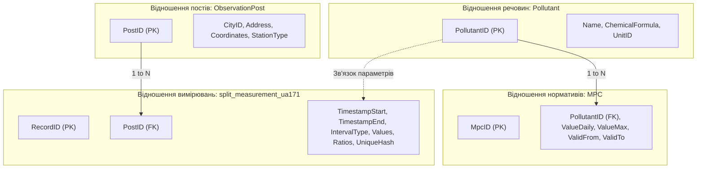
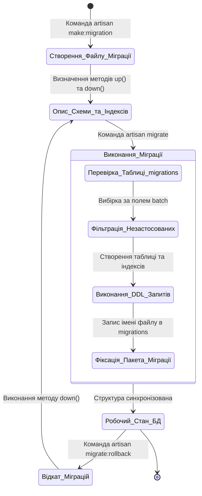
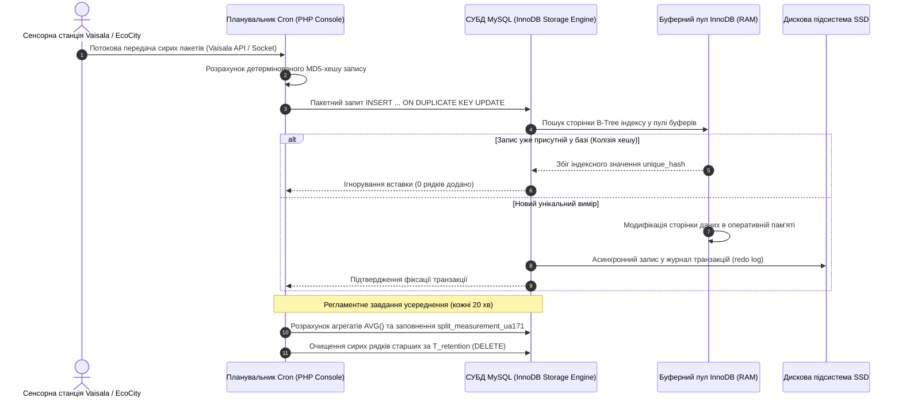
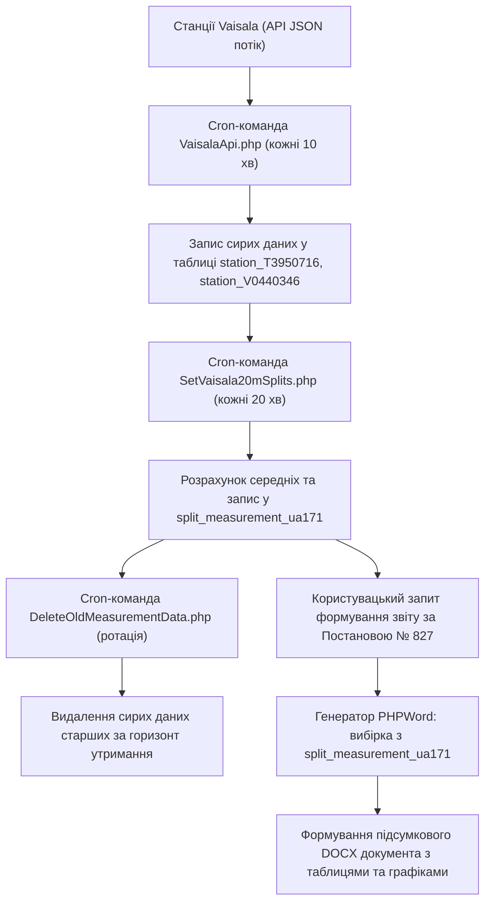

# Тема 3. Проектування екологічних баз даних

## Мета лекції
Сформувати глибокі теоретичні знання та практичні компетенції щодо проєктування, нормалізації, оптимізації та масштабування реляційних баз даних екологічного моніторингу для забезпечення надійного збереження високочастотних часових рядів, автоматизованого розрахунку статистичних зрізів та підтримки регуляторного формування звітності про стан атмосферного повітря.

## Очікувані результати навчання
1. **Знання та розуміння.** Здобувачі мають опанувати математичні основи реляційної моделі даних, правила нормалізації та принципи структурування багатовимірних часових рядів екологічних параметрів.
2. **Застосування.** Здобувачі мають застосовувати засоби реляційних СУБД, мову SQL, механізми міграцій та ORM-шаблони для розробки схеми екологічної бази даних.
3. **Аналіз.** Здобувачі мають досліджувати обчислювальну складність операцій запису, пошуку й агрегації неперервних потоків сенсорних даних різної дискретизації.
4. **Оцінювання та синтез.** Здобувачі мають проектувати оптимальні структури збереження первинних та агрегованих показників, що забезпечують формування регламентних звітів згідно з чинним природоохоронним законодавством.

## 1. Теоретико-концептуальний базис. Реляційне та об'єктно-орієнтоване моделювання екологічних сховищ даних

### 1.1. Концептуальне проєктування таблиць сутностей екологічного моніторингу на основі кортежних моделей та реляційної алгебри Кодда

Формування архітектури баз даних для збереження інформації екологічного моніторингу спирається на математичний апарат реляційної моделі, запропонований Едгаром Коддом. У рамках цього підходу предметна область описується як сукупність нормалізованих відношень, де кожне відношення являє собою підмножину декартового добутку відповідних доменів атрибутів. Специфіка екологічних часових рядів, що характеризуються високою частотою надходження вимірювань, різнорідністю фізико-хімічних параметрів та наявністю просторової прив'язки, вимагає суворої формалізації сутностей за допомогою кортежних моделей.

У концептуальній моделі база даних представляється як множина взаємопов'язаних відношень. Основними сутностями виступають пости спостереження, вимірювані полютанти, часові зрізи спостережень та нормативні обмеження якості середовища. Математично схема відношення вимірювальної станції описується кортежем:

$$R_{\text{post}} = \langle \text{PostID}, \, \text{CityName}, \, \text{Address}, \, \text{GeoLat}, \, \text{GeoLon}, \, \text{OwnerOrg}, \, \text{StationType} \rangle$$

де кожний компонент є елементом відповідного домену: $\text{PostID} \in \mathbb{N}$ задає унікальний сурогатний первинний ключ, $\text{CityName} \in \text{DOM}_{\text{string}}$ та $\text{Address} \in \text{DOM}_{\text{string}}$ визначають адресну прив'язку об'єкта, $\text{GeoLat}, \text{GeoLon} \in \mathbb{R}$ фіксують десяткові координати у просторі $R^2$, а параметри $\text{OwnerOrg}$ і $\text{StationType}$ класифікують відомчу належність та технічну категорію поста.

Відношення первинних спостережень формується як динамічний часовий ряд, де кортеж вимірювання має вигляд:

$$R_{\text{data}} = \langle \text{RecordID}, \, \text{PostID}, \, \text{PollutantID}, \, \text{Timestamp}, \, \text{Value}, \, \text{UnitID}, \, \text{IntegrityRatio}, \, \text{Hash} \rangle$$

де атрибут $\text{RecordID}$ виступає унікальним ідентифікатором транзакції, $\text{PostID}$ та $\text{PollutantID}$ реалізують зовнішні ключі, $\text{Timestamp} \in \text{DOM}_{\text{datetime}}$ фіксує точний час реєстрації за шкалою UTC, $\text{Value} \in \mathbb{R}^+$ представляє виміряну фізичну концентрацію, $\text{UnitID}$ детермінує інженерні одиниці виміру, показник $\text{IntegrityRatio} \in [0, 1]$ відображає частку валідних вимірювань за інтервал осереднення, а атрибут $\text{Hash}$ забезпечує криптографічний контроль дублікатів.

Маніпуляція екологічними даними в реляційній алгебрі реалізується через фундаментальні теоретико-множинні оператори: селекцію ($\sigma$), проекцію ($\Pi$) та природне з'єднання ($\bowtie$). Наприклад, формальна операція вибірки випадків перевищення нормативів діоксиду азоту на конкретному муніципальному посту записується аналітичним виразом:

$$\mathcal{Q}_{\text{exceed}} = \Pi_{\text{Timestamp}, \text{Value}, \text{MPCValue}} \Big( \sigma_{\text{PostID} = k \; \land \; \text{Value} > \text{MPCValue}} \big( R_{\text{data}} \bowtie R_{\text{pollutant}} \bowtie R_{\text{mpc}} \big) \Big)$$

де з'єднання відношень $R_{\text{data}}$, $R_{\text{pollutant}}$ та $R_{\text{mpc}}$ формує єдиний контекст порівняння концентрації з чинним нормативом гранично допустимої концентрації ($\text{MPCValue}$), селекція фільтрує вимірювання, що порушують регламентний поріг на посту $k$, а проекція виокремлює часову мітку, фактичну та нормативну концентрації для побудови звітної відомості.

> **ПРАКТИЧНИЙ ЯКІР:** При розробці муніципальної інформаційної системи моніторингу якості повітря міста Кременчук реляційна структура була спроєктована з виділенням спеціалізованої таблиці `split_measurement_ua171`, де індекс `ua171` позначає глобальний географічний класифікатор (17 — Полтавська область, 1 — місто Кременчук), що дозволило централізовано зберігати понад 2,5 мільйона записів з 20-хвилинною дискретизацією та виконувати швидкі аналітичні вибірки без блокування транзакційного ядра.

---

### 1.2. Специфікація метаданих постів спостереження, інгредієнтного складу викидів та гранично допустимих концентрацій у реляційній моделі SQL

Проєктування екологічної бази даних вимагає відокремлення транзакційних потоків спостережень від нормативно-довідкової інформації. Метадані формують нормативний та геоінформаційний контекст, без якого фізико-хімічні показники втрачають прикладну цінність. У реляційній моделі SQL нормативно-довідковий шар організовується відповідно до вимог третьої нормальної форми (3NF), що виключає транзитивні залежності та запобігає виникненню аномалій модифікації даних.

Специфікація постів спостереження включає таблиці міст (`cities`), географічних адрес (`addresses`) та безпосередньо вимірювальних станцій (`observation_posts`). Поділ адресних характеристик та координат дозволяє підтримувати просторову топологію моніторингової мережі, адаптуючись до зміни назв топонімів або тимчасового переміщення мобільних станцій спостереження.

Таблиця контрольованих полютантів (`pollutants`) фіксує інгредієнтний склад викидів, специфікуючи хімічні маркери за їхніми кодами (пилові фракції PM1, PM2.5, PM10, оксиди вуглецю, діоксид азоту, діоксид сірки, формальдегід, фенол, ароматичні вуглеводні). Нормативні межі вмісту цих речовин виносяться в окрему таблицю нормативів (`mpc_limits`). Оскільки екологічне законодавство має динамічний характер, таблиця нормативів містить часові межі дії значень, що формалізується схемою із полями початку (`valid_from`) та завершення (`valid_to`) дії нормативу. Це дозволяє здійснювати ретроспективний аналіз якості повітря за тими стандартами, які діяли на момент проведення вимірювання, запобігаючи спотворенню статистичних оцінок.

Для систематизації архітектурних рішень при проєктуванні екологічних баз даних сформовано порівняльну таблицю технологічних парадигм організації сховищ.

| Парадигма організації БД | Модель даних та структурні особливості | Продуктивність операцій запису та аналітики | Механізми масштабування | Приклад з реальної практики |
| :--- | :--- | :--- | :--- | :--- |
| Класична реляційна модель (SQL) | Таблиці з фіксованою схемою, первинні та зовнішні ключі, ACID-транзакції | Висока надійність транзакцій, уповільнення аналітичних вибірок на великих обсягах ($>10^7$ рядків) | Вертикальне масштабування, шардування таблиць за роками | База даних MySQL комунального підприємства «НДЦ» м. Кременчук |
| Часорядна модель (Time-Series DB) | Орієнтація на часові мітки, автоматичне партиціонування за часом, компресія дельт | Оптимізована під масивний паралельний потік запису ($>10^5$ подій/с), швидка агрегація часових вікон | Горизонтальне кластерне масштабування | Розгортання InfluxDB / TimescaleDB для сенсорних мереж Smart City |
| Документо-орієнтована модель (NoSQL) | Напівструктуровані документи JSON/BSON, динамічна поліморфна схема | Висока швидкість ініціалізації запису неструктурованих пакетів, відсутність строгих ACID-гарантій | Просте горизонтальне масштабування через реплікацію та автошардинг | Збереження сирих телеметричних логів станцій Vaisala у MongoDB |
| Графова модель даних | Вузли (станції, джерела) та ребра (напрямки вітрового переносу, зв'язки впливу) | Швидкий пошук шляхів поширення забруднення та топологічної зв'язності мережі | Складне масштабування при збільшенні щільності взаємних зв'язків | Моделювання міграції викидів уздовж русла Дніпра в Neo4j |

> **ТИПОВА ПОМИЛКА:** Збереження всього масиву екологічних вимірювань різних хімічних речовин у вигляді неструктурованих рядків JSON усередині єдиного текстового стовпця реляційної таблиці. Хоча такий підхід спрощує початкове додавання нових сенсорів, він повністю блокує індексацію за значеннями окремих параметрів, унеможливлює використання оптимізатора SQL-запитів та перетворює будь-яку фільтрацію за критерієм перевищення ГДК на повне послідовне сканування всієї таблиці (Full Table Scan), що паралізує сервер при досягненні обсягу бази в кілька гігабайтів.

---

### 1.3. Механізми декларативного контролю цілісності, оптимізації зв'язків «один-до-багатьох» та конфігурації первинних і зовнішніх ключів

Забезпечення цілісності інформаційного сховища є критичним інваріантом функціонування систем екологічного менеджменту. Помилки узгодженості, втрата зовнішніх ключів або поява сутностей-сиріт (наприклад, вимірювань, прив'язаних до неіснуючого поста) можуть призвести до спотворення екологічної звітності та некоректних рішень регуляторних органів.

Декларативний контроль цілісності забезпечується системою обмежень реляційної СУБД. Обмеження сутності (Entity Integrity) гарантується використанням унікальних непорожніх сурогатних ключів (`PRIMARY KEY` типу `BIGINT UNSIGNED AUTO_INCREMENT`). Посилальна цілісність (Referential Integrity) регулюється зовнішніми ключами (`FOREIGN KEY`) із обов'язковим декларуванням каскадних правил поведінки при модифікації чи видаленні батьківських записів:

$$\text{FK\_Constraint}: \quad \forall t \in R_{\text{data}} \quad \exists s \in R_{\text{post}} \quad \text{such that} \quad t[\text{PostID}] = s[\text{PostID}]$$

Для запобігання втрати історичних спостережень при видаленні інформації про виведені з експлуатації пости спостереження застосовується правило м'якого видалення (`Soft Deletes`) на рівні бізнес-логіки та обмеження `ON DELETE RESTRICT` на рівні фізичної схеми бази даних, що апаратно блокує пряме видалення об'єктів моніторингу за наявності пов'язаних із ними вимірювань.

Оптимізація реляційних зв'язків типу «один-до-багатьох» між станцією та мільйонами її вимірювань базується на правильній побудові складених B-Tree індексів. Поодинокий індекс за часовою міткою є неефективним при вибірці даних конкретної станції. Оптимальним є конфігурування складеного покриваючого індексу:

$$\text{Index}_{\text{opt}} = \big\langle \text{PostID}, \, \text{Timestamp}, \, \text{PollutantID} \big\rangle$$

Така структура індексу дозволяє системі знаходити необхідні часові інтервали для обраного вимірювального вузла виключно шляхом навігації по сторінках індексного дерева в оперативній пам'яті (Index-Only Scan), без звернення до блоків даних на жорсткому диску, що знижує час виконання запитів формування звітності за Постановою № 827 із десятків секунд до кількох мілісекунд.

---

### 1.4. Проєктування об'єктно-реляційного відображення з використанням ORM Eloquent та версіонування структури засобами міграцій Laravel

Імплементація програмного доступу до бази даних здійснюється на основі патерну проектування Active Record, реалізованого в об'єктно-реляційному відображенні **ORM Eloquent** фреймворку Laravel. Парадигма ORM абстрагує прикладну бізнес-логіку аналізу забруднення від низькорівневих діалектів SQL, представляючи кожну таблицю бази даних у вигляді відповідного класу PHP, а кожний рядок — у вигляді екземпляра цього об'єкта.

В архітектурі системи для кожної станції та кожного типу даних проектуються спеціалізовані моделі. Наприклад, модель станції `Station1748` інкапсулює логіку взаємодії з даними поста громадської мережі EcoCity. Для автоматичного розрахунку та захисту від дублювання записів використовується подійний механізм життєвого циклу моделі (Model Observers / Lifecycle Hooks). У момент ініціалізації запису генерується унікальний детермінований цифровий відбиток:

$$\text{UniqueHash} = \text{MD5}\big( \text{place\_id} \parallel \text{split\_number} \parallel \text{option} \parallel \text{measurement\_value} \parallel \text{measurement\_time} \big)$$

де символ $\parallel$ позначає конкатенацію рядкових представлень атрибутів вимірювання. Генерація хешу здійснюється у методі `boot()` моделі безпосередньо перед виконанням SQL-запиту вставки. У разі надходження дублюючого пакета за тим самим часовим зрізом СУБД відхиляє транзакцію завдяки обмеженню `UNIQUE(unique_hash)`, гарантуючи абсолютну валідність часового ряду.

Версіонування та еволюція структури сховища організуються за допомогою механізму **міграцій Laravel**. Міграції являють собою системні файли коду, які описують мутації структури таблиць, додавання нових стовпців, індексів та зовнішніх ключів у часі. Це забезпечує повну відтворюваність середовища бази даних на серверах розробки, тестових кластерах та виробничих серверах без необхідності ручного імпорту SQL-дампів.

Інформація про всі застосовані пакети фіксується у системній таблиці `migrations`. Це виключає ризик повторного виконання DDL-команд та дозволяє команді інженерів безболісно розширювати архітектуру сховища, наприклад, під час підключення нових датчиків важких металів чи радіаційного фону без зупинки основного циклу моніторингу.

> **ПРАКТИЧНИЙ ЯКІР:** У проєкті муніципальної бази даних Кременчука розгортання схеми, що містила окремі таблиці для серійних номерів станцій Vaisala (`station_T3950716`, `station_V0440346`, `station_T3950713`) та інтегрованої таблиці `split_measurement_ua171`, було здійснено за допомогою ланцюжка з 20 послідовних міграцій, що забезпечило безпомилковий перехід від монолітної тестової структури до масштабованої реляційної моделі на виробничому VPS-сервері під керуванням Ubuntu 22.04 LTS.

---

> **КОНТРОЛЬНЕ ПИТАННЯ:** Під час натурної експлуатації муніципальної бази даних було помічено, що швидкість формування місячного аналітичного звіту щодо забруднення повітря різко деградувала з 0,2 секунди до 48 секунд після накопичення 10 мільйонів рядків у таблиці первинних вимірювань. База даних спроєктована в класичній нормалізованій формі 3NF, де таблиця вимірювань містить лише атомарні щохвилинні значення одного датчика на рядок. Яке архітектурне рішення в рамках реляційної моделі дозволить кардинально відновити швидкодію формування звітності без втрати ретроспективних первинних даних?

Розгорнути аналіз / відповідь

**Правильний варіант: Впровадження контрольованої денормалізації через проектування агрегатної таблиці часових зрізів із фоновим перерахунком у регламентних завданнях cron.**

1. Повне логічне та аналітичне обґрунтування:
   * Запити формування екологічних звітів за нормативами Постанови № 827 оперують усередненими 20-хвилинними, добовими та місячними показниками. У чистій схемі 3NF для отримання місячного графіка за всіма полютантами СУБД змушена агрегувати мільйони атомарних рядків за допомогою операцій `AVG()`, `GROUP BY` та багаторазових з'єднань `JOIN`.
   * Оптимальним інженерним рішенням є розгортання денормалізованої таблиці часових зрізів (аналог `split_measurement_ua171` або `vaisala_splits`), де один рядок містить уже попередньо осереднені значення для всіх вимірюваних газів і пилу за фіксований проміжок часу разом із показниками повноти даних. Фоновий процес операційної системи (cron) перераховує та наповнює цю таблицю з низьким пріоритетом кожні 20 хвилин. Аналітичний веб-інтерфейс звертається виключно до агрегатної таблиці, яка містить у сотні разів менше записів, що повертає час виконання запиту до мілісекундного діапазону.

2. Аналіз дистракторів:
   * Твердження про необхідність простого збільшення обсягу оперативної пам'яті сервера (RAM) вирішує проблему лише тимчасово і призводить до невиправданих фінансових витрат, оскільки не усуває алгоритмічну складність обчислення агрегатів над невпинно зростаючим масивом.
   * Пропозиція щодо видалення щохвилинних первинних даних після їх запису є неприпустимою, оскільки первинні хвилинні ряди необхідні для розслідування залпових аварійних викидів, перевірки дрейфу датчиків та проведення наукових досліджень просторової дифузії.

---

### Вказівки для самостійного осмислення

1. Складіть математичну схему реляційних функціональних залежностей для сутності контролю викидів промислового підприємства та доведіть аналітично, чи перебуває запропонована в кейсі таблиця агрегованих зрізів `split_measurement_ua171` у третій нормальній формі (3NF) або нормальній формі Бойса-Кодда (BCNF).
2. Спроєктуйте міграцію Laravel, яка реалізує створення складеного індексу за атрибутами просторових координат та часової мітки з використанням геопросторових типів даних MySQL Spatial (`POINT`, `SRID 3857`), порівнявши ефективність просторового R-Tree індексу зі стандартним B-Tree індексом.
3. Проаналізуйте наслідки використання механізму `SoftDeletes` для великих таблиць екологічних часових рядів та оцініть вплив додаткової умови `WHERE deleted_at IS NULL` на швидкість сканування індексів в аналітичних SQL-запитах.

## 2. Методологія та аналіз граничних умов. Управління великими масивами часових рядів та оптимізація запитів

### 2.1. Алгоритми фільтрації та генерації унікальних хеш-ідентифікаторів записів для усунення дублювання вимірювань сенсорів реального часу

Масове надходження потокових вимірювань від периферійних екологічних комплексів через нестабільні бездротові канали зв'язку неминуче супроводжується мережевими колізіями, затримками та повторним надсиланням пакетів датаграм. Якщо механізм повторної передачі протоколу транспортного рівня спрацьовує за умов втрати пакета підтвердження (ACK), серверний приймальний інтерфейс отримує дублюючі пакети спостережень. У реляційній базі даних пряма вставка таких записів без попереднього семантичного аналізу призводить до спотворення статистичних рядів, штучного заниження або завищення розрахункових середньодобових концентрацій та хибної ідентифікації тривалості перевищень гранично допустимих концентрацій.

Для забезпечення ідемпотентності операцій запису розроблено алгоритм фільтрації та генерації детермінованих цифрових відбитків на етапі перехоплення транзакцій. Традиційний підхід, що базується на використанні виключно мітки часу як унікального ключа, виявляється непридатним у мультисенсорних комплексах, оскільки кілька різних датчиків (наприклад, концентрації оксиду вуглецю та пилу PM10) опитуються одночасно і мають ідентичний часовий штамп. Тому формується складений криптографічний геш-ідентифікатор, який однозначно зв'язує фізичний вузол, часовий зріз, тип досліджуваного параметра та виміряну числову амплітуду.

Формалізація наскрізного процесу фільтрації, дедуплікації, інтервальної агрегації та контрольованої очистки первинних даних описується у вигляді математико-алгоритмічного контуру:

$$
\begin{aligned}
\text{Крок 1 (Формування гешу):} & \quad h_k = \mathcal{H}_{\text{MD5}}\Big( \text{id}_{\text{place}} \parallel t_{\text{meas}} \parallel \text{opt}_{\text{code}} \parallel \text{round}(v_{\text{meas}}, 4) \Big) \\
\text{Крок 2 (Ідемпотентний запис):} & \quad \text{INSERT INTO } R_{\text{raw}} \text{ VALUES } (\dots, h_k) \quad \text{ON DUPLICATE KEY UPDATE } \text{id} = \text{id} \\
\text{Крок 3 (Віконна агрегація):} & \quad \bar{C}_{j}(\mathcal{W}_m) = \frac{1}{|\mathcal{W}_m|} \sum_{t_i \in \mathcal{W}_m} C_{j}(t_i), \quad \mathcal{W}_m = [T_m, \, T_m + \Delta t) \\
\text{Крок 4 (Оцінка повноти ряду):} & \quad \mathcal{K}_{\text{ratio}}(\mathcal{W}_m) = \frac{|\{t_i \in \mathcal{W}_m : C_{j}(t_i) \neq \text{NULL}\}|}{N_{\text{nominal}}} \\
\text{Крок 5 (Регламентна ротація):} & \quad \text{DELETE FROM } R_{\text{raw}} \quad \text{WHERE } t_{\text{meas}} < (t_{\text{current}} - T_{\text{retention}}) \quad \land \quad \text{Processed} = 1
\end{aligned}
$$

де змінні та функціональні оператори мають наступне фізичне й системне значення:
* Функція $\mathcal{H}_{\text{MD5}}(\cdot)$ реалізує гешування конкатенованого рядка параметрів, повертаючи фіксований 32-символьний шістнадцятковий цифровий відбиток.
* Змінні $\text{id}_{\text{place}}$, $t_{\text{meas}}$, $\text{opt}_{\text{code}}$ та $v_{\text{meas}}$ відображають ідентифікатор вимірювального поста, часову мітку заміру, літерний або числовий код хімічного полютанта та виміряну фізичну величину відповідно.
* Функція $\text{round}(v_{\text{meas}}, 4)$ відсікає мікроколивання молодших розрядів аналогово-цифрового перетворювача, спричинені температурним дрейфом.
* Вираз $\text{ON DUPLICATE KEY UPDATE}$ забезпечує апаратне ігнорування вставки дублюючого рядка механізмом реляційного ядра без аварійної зупинки поточної транзакції.
* Множина $\mathcal{W}_m$ визначає межі розрахункового часового вікна дискретизації тривалістю $\Delta t$ (для стандарту Постанови № 827 величина $\Delta t = 20\text{ хв}$).
* Коефіцієнт $\mathcal{K}_{\text{ratio}}(\mathcal{W}_m) \in [0, 1]$ фіксує повноту спостережень відносно номінально очікуваної кількості вимірів $N_{\text{nominal}}$ (для хвилинних вимірювань за 20-хвилинний інтервал номінальне значення становить $N_{\text{nominal}} = 20$).
* Параметр $T_{\text{retention}}$ регламентує період збереження детальних хвилинних вибірок, після завершення якого сирі масиви підлягають апаратному очищенню для вивільнення дискового простору.

Застосування такого підходу гарантує збереження суворої хронологічної монотонності часового ряду без необхідності виконання попередніх ресурсомістких SQL-запитів типу `SELECT COUNT(*)` перед кожною операцією вставки, що зберігає пропускну здатність дискової підсистеми сервера.

---

### 2.2. Організація багаторівневого усереднення даних від однохвилинних спостережень до 20-хвилинних, добових, місячних та річних зрізів у фонових процесах cron

Безперервний потік щохвилинних вимірювань формує значні обсяги інформації: один вимірювальний пост, оснащений комплексним газоаналізатором та метеостанцією, генерує близько 1440 часових зрізів на добу за кожним із 15 контрольованих параметрів, що становить понад 7,8 мільйона записів на рік. Пряме виконання аналітичних SQL-запитів для побудови графіків або формування звітів за такими неагрегованими таблицями потребує зчитування сотень мегабайтів дискових сторінок, викликаючи блокування таблиць і різке зростання затримок відповіді системи.

Методологічне вирішення полягає у побудові **асинхронного ієрархічного конвеєра осереднення даних**, реалізованого через системний планувальник завдань операційної системи (`cron`) та консольні команди фреймворку Laravel. Архітектура функціонування розподіляється на незалежні часові цикли:

Перший фоновий процес (`VaisalaApi.php`) ініціюється кожні 10 хвилин. Його завданням є авторизація на шлюзах вимірювальних станцій, вивантаження накопичених порцій сирих спостережень, валідація форматів та їхня пакетна фіксація у первинних таблицях типу `station_T3950716` або `station1748`. Факт успішного виконання або помилки мережевої сесії обов'язково протоколюється у таблиці аудиту `vaisala_api_log`.

Другий фоновий процес (`SetVaisala20mSplits.php`) запускається кожні 20 хвилин. Цей модуль вибирає всі непозначені сирі записи за минулий інтервал, розраховує середньоарифметичні значення концентрацій забруднюючих речовин, оцінює відносну повноту інформаційного потоку $\mathcal{K}_{\text{ratio}}$ та формує новий денормалізований рядок у зведеній таблиці `split_measurement_ua171`. Якщо кількість успішних спостережень за 20 хвилин становить менше 75% від номінальної ($N < 15$), запис маркується спеціальним прапорцем неповноти даних, що виключає його використання для арбітражних рішень, але зберігає для загального статистичного обліку.

Третій рівень конвеєра активується в кінці доби та наприкінці календарного місяця. Спеціалізовані обробники агрегують уже сформовані 20-хвилинні інтервали у добові, місячні та річні еквіваленти, записуючи результати у відповідні поля реляційної схеми (`is_daily = 1`, `is_monthly = 1`, `is_yearly = 1`). Така багаторівнева структура дозволяє клієнтським веб-додаткам миттєво зчитувати готові річні тренди без повторного виконання математичних операцій над первинними масивами.

> **ВАЖЛИВО:** Регламентні процеси агрегації часових рядів обов'язково повинні виконуватися в межах транзакцій із рівнем ізоляції `READ COMMITTED` або використовувати механізм блокування рядків `FOR UPDATE` для запобігання ситуації гонитви (race condition), коли фоновий процес намагається розрахувати середнє значення над масивом, у який у цей же момент записуються нові пакети від мережевого сокета.

---

### 2.3. Критичні обмеження пропускної здатності дискових підсистем та деградація продуктивності реляційних СУБД при масштабуванні транзакцій екологічних Big Data

Незважаючи на високу стабільність класичних реляційних систем керування базами даних (зокрема MySQL та PostgreSQL), їхня експлуатація в задачах неперервної фіксації екологічних часових рядів стикається з жорсткими фізичними та алгоритмічними обмеженнями. Основним вузьким місцем виступає **I/O-пляшкове горло** дискової підсистеми, зумовлене деградацією продуктивності буферного пулу оперативної пам'яті (`InnoDB Buffer Pool`).

Поки загальний обсяг активних індексів та таблиць вміщується в оперативну пам'ять сервера, операції вставки та вибірки відбуваються з мікросекундною затримкою. Проте, коли розмір бази даних перевищує виділений обсяг RAM (типова ситуація для бюджетних муніципальних серверів із 1–2 Гбайт оперативної пам'яті при розмірі сховища понад 20 Гбайт), СУБД змушена постійно витісняти старі сторінки пам'яті на фізичний диск за алгоритмом LRU (Least Recently Used). При надходженні аналітичного запиту на вибірку ретроспективних даних за минулий рік виникає лавиноподібне зчитування випадкових блоків з диска (disk thrashing), що призводить до повного вичерпання ліміту операцій вводу-виводу за секунду (**IOPS starvation**) та паралізує обслуговування нових пакетів від датчиків.

Граничні умови стабільного функціонування реляційної моделі спостережень порушуються в таких реальних інженерних ситуаціях:

1. **Накладання фонових процесів агрегації (Cron Overlap).** Якщо обсяг первинних даних різко зростає або дискова підсистема деградує, черговий запуск скрипта розрахунку 20-хвилинних зрізів може тривати довше регламентного інтервалу (наприклад, 25 хвилин замість очікуваних 30 секунд). Планувальник операційної системи ініціює наступний екземпляр процесу паралельно з незавершеним, що викликає взаємне блокування ресурсів бази даних (deadlocks), вичерпання пулу доступних SQL-з'єднань (`max_connections`) та аварійну зупинку веб-сервера.

2. **Масивне блокування метаданих при ротації даних (Metadata Lock Contention).** Процедура очищення застарілих щохвилинних спостережень за допомогою оператора `DELETE FROM station_raw WHERE ...` сканує значні діапазони індексів. Це накладає блокування спільних блоків (Shared Locks), що унеможливлює паралельне виконання операцій вставки нових пакетів (`INSERT`) від автоматичних станцій. Черга вхідних повідомлень починає лавиноподібно зростати в оперативній пам'яті шлюзу, викликаючи аварійне скидання сокетів.

3. **Дефіцит вільного дискового простору та фрагментація табличних просторів.** Збереження багаторічних ретроспективних даних на невеликих VPS-серверах із фіксованим накопичувачем (наприклад, 20–40 Гбайт) призводить до заповнення понад 90% диска. За таких умов СУБД втрачає можливість створювати тимчасові файли для сортування великих аналітичних вибірок, табличний простір `ibdata` фрагментується, а механізм подвійного запису (`doublewrite buffer`) уповільнює будь-яку транзакцію у 3–5 разів.

> **ПРАКТИЧНИЙ ЯКІР:** Під час експлуатації муніципального сервера екологічного моніторингу КП «НДЦ» на орендованому VPS-хостингу з лімітом диска 20 Гбайт і оперативною пам'яттю 1024 Мбайт одночасне накопичення сирих однохвилинних показників чотирьох станцій EcoCity призвело до вичерпання 85% дискового простору за 14 місяців, що змусило розробників терміново впровадити скрипт `DeleteOldMeasurementData.php` для ротаційного видалення сирих вимірювань після їхньої фіксації у таблиці зведених зрізів.

---

### 2.4. Архітектура безпечного доступу до даних через параметризовані запити PDO та ізоляцію транзакцій для підтримки аналітичних вибірок

Забезпечення стійкості інформаційної системи вимагає розмежування транзакційних потоків високої інтенсивності (OLTP), що наповнюють базу даними від сенсорів, та аналітичних запитів низької частоти (OLAP), що генеруються користувачами через вебінтерфейси для побудови графіків і звітів. Безпечна взаємодія серверного додатку на базі PHP з реляційним ядром реалізується через інтерфейс **PHP Data Objects (PDO)**.

Використання параметризованих підготовлених запитів (Prepared Statements) у PDO вирішує дві фундаментальні інженерні задачі. По-перше, воно повністю усуває загрозу ін'єкцій шкідливого SQL-коду, оскільки передані параметри (наприклад, назва станції чи часові межі) компілюються СУБД окремо від структури запиту і ні за яких умов не можуть змінити логіку виконання інструкції. По-друге, механізм підготовлених запитів оптимізує навантаження на процесор бази даних завдяки повторному використанню вже скомпільованого плану виконання (Execution Plan) для циклічних пакетних вставок вимірювань.

Для запобігання взаємного впливу між процесами аналітики та збереженням вимірювань критичним є вибір правильного рівня ізоляції транзакцій стандарту ANSI/ISO SQL. Рівень `SERIALIZABLE` хоча й гарантує абсолютну узгодженість, є неприйнятним через надмірну кількість блокувань діапазонів ключів (Range Locks). Оптимальним інваріантом є встановлення рівня ізоляції **READ COMMITTED** у поєднанні з механізмом багатовірсійного керування конкурентним доступом (**MVCC**, Multi-Version Concurrency Control). У цьому режимі аналітичні запити вибірки даних для візуалізації зчитують зліпок бази даних на момент початку виконання інструкції, не блокуючи процеси додавання нових спостережень від станцій моніторингу.

Для порівняння архітектурних методів оптимізації обробки та агрегації екологічних часових рядів наведено систематизовану матрицю інженерних рішень.

| Стратегія обробки даних | Архітектурна реалізація | Продуктивність операцій вставки (Write Throughput) | Вплив на аналітичні запити (Read Latency) | Складність впровадження | Критичні ризики та обмеження методології |
| :--- | :--- | :--- | :--- | :--- | :--- |
| Синхронна построкова вставка через тригери БД | Тригери `AFTER INSERT` для розрахунку середніх значень | Вкрай низька (до $10^2$ рядків/с через накладні витрати) | Мінімальна затримка; агрегати завжди актуальні | Низька; реалізується суто засобами СУБД | Каскадне блокування таблиць, різке падіння швидкості запису сенсорного потоку |
| Пакетна асинхронна агрегація у планувальнику Cron | Консольні команди PHP Laravel за розкладом cron | Висока (до $10^4$ рядків/с при використанні bulk insert) | Затримка появи агрегатів до 20 хвилин | Середня; вимагає налаштування черг і системного демона | Ризик накладання завдань (cron overlap) при деградації диска та поява дедлоків |
| Автоматичне секціонування таблиць (Partitioning) | Розбиття таблиці вимірювань на секції за діапазоном дат `RANGE(TO_DAYS)` | Дуже висока; швидке відсікання старих секцій через `DROP PARTITION` | Висока швидкість вибірок за рахунок механізму Partition Pruning | Висока; вимагає включення поля дати у всі складені первинні ключі | Жорсткі обмеження СУБД на побудову глобальних зовнішніх ключів |
| Часорядні гіпертаблиці (TimescaleDB Hypertables) | Автоматичне дворівневе шардування за часом і простором поверх PostgreSQL | Екстремально висока; паралельна оптимізована фіксація | Мінімальна затримка; нативна підтримка аналітичних функцій часу | Дуже висока; вимагає міграції з MySQL та специфічних модулів | Високі апаратні вимоги до RAM для утримання метаданих гіперчанків |
| Проміжне буферизування у пам'яті (Redis / Memory Engine) | Приймання потоку в чергу Redis з періодичним дампом у реляційну БД | Максимальна; лімітується лише швидкістю мережевого інтерфейсу | Читання поточних даних із RAM, історичних — з диска | Висока; поява додаткового вузла архітектури | Ризик втрати оперативних даних за умови раптового знеструмлення сервера |

Аналіз матриці свідчить, що комбінація секціонування таблиць за часовими інтервалами та асинхронної пакетної агрегації через консольні команди Laravel є найбільш збалансованим вибором для міських екологічних систем, розгорнутих на стандартних ресурсообмежених серверах.

> **КОНТРОЛЬНЕ ПИТАННЯ:** Під час переходу станцій екологічного моніторингу міста в аварійний режим підвищеної дискретизації (пакети надходять щосекунди від 10 станцій) муніципальний сервер на базі MySQL почав фіксувати масові помилки `Lock wait timeout exceeded; try restarting transaction`. Моніторинг показує, що 98% процесорного часу споживає дискова підсистема (стан `iowait`), а розмір таблиці сирих вимірювань сягнув 12 Гбайт при доступних 1024 Мбайт оперативної пам'яті. Запропонуйте поетапний комплекс інженерних заходів для ліквідації дедлоків та стабілізації процесу збереження даних без втрати спостережень.

Розгорнути аналіз / відповідь

**Правильний варіант: Перехід на буферизовану пакетну вставку, оптимізація розміру транзакцій та секціонування таблиць.**

1. Покроковий план стабілізації системи:
   * **Етап 1 (Буферизація вхідного потоку):** Замість безпосередньої вставки кожного окремого секундного вимірювання окремою SQL-транзакцією потік повідомлень перенаправляється у тимчасовий оперативний буфер (наприклад, Redis або локальний файл швидкого доступу). Консольний обробник вичитує буфер пачками по 500–1000 записів і виконує одну масивну інструкцію `INSERT INTO ... VALUES (...), (...), (...)`, що скорочує кількість дискових синхронізацій журналу транзакцій (fsync) у сотні разів.
   * **Етап 2 (Зниження навантаження на журнал транзакцій):** У конфігурації MySQL `my.cnf` тимчасово встановлюється параметр `innodb_flush_log_at_trx_commit = 2`, що дозволяє записувати лог транзакцій в оперативну пам'ять ОС замість примусового скидання на фізичний диск при кожному коміті, усуваючи стан `iowait`.
   * **Етап 3 (Секціонування та ротація):** Таблиця первинних даних розбивається на щомісячні секції (partitions). Процедура очищення старих вимірювань переводиться з важкого оператора `DELETE` на миттєве скидання застарілої секції `ALTER TABLE ... DROP PARTITION`, що виконується як метадана операція без блокування індексних дерев і рядків.
   * **Етап 4 (Оптимізація пулу пам'яті):** Виділення буферного пулу `innodb_buffer_pool_size` обмежується 60–70% доступної фізичної RAM, запобігаючи витісненню процесу СУБД у swap-файл операційної системи.

2. Аналіз дистракторів (чому інші заходи є неефективними):
   * Просте збільшення таймауту блокування `innodb_lock_wait_timeout` лише замаскує проблему, призвівши до накопичення гігантських черг завислих транзакцій і повного вичерпання пулу доступних пам'яті та з'єднань.
   * Вимкнення індексів у таблиці вимірювань прискорить вставку, проте зробить неможливою роботу скриптів усереднення та аналітичних інтерфейсів, оскільки будь-яка вибірка вимагатиме повного сканування 12 Гбайт таблиці.

## 3. Практичний індустріальний / фаховий кейс. Розробка корпоративної бази даних екологічного підприємства

### 3.1. Комплексний фаховий кейс. Проєктування та розгортання структури бази даних комунального підприємства для збереження показників станцій Vaisala з автоматичною генерацією звітів за формою постанови КМУ № 827

#### Постановка задачі / ситуації
Комунальне підприємство «Науковий центр еколого-соціальних досліджень» (КП «НДЦ») Кременчуцької міської ради здійснює моніторинг стану атмосферного повітря промислової агломерації. На балансі підприємства перебувають три високоточні автоматичні станції Vaisala: станції з серійними номерами T3950713 та T3950716, що містять метеомодуль WXT530 і газоаналізатор AQT530 (15 вимірюваних параметрів), а також станція V0440346, укомплектована лише газоаналізатором AQT530. Раніше дані надходили до хмарного сервісу виробника, проте висока вартість підписки (1200 доларів США на рік за одну станцію) та закритість вихідного коду унеможливлювали адаптацію системи до внутрішніх стандартів документообігу та автоматичного формування звітів про якість повітря відповідно до вимог Постанови Кабінету Міністрів України № 827.

Для оптимізації бюджету було ухвалено рішення розгорнути власне реляційне сховище на базі СУБД MySQL та веб-сервера Nginx/Laravel на віртуальному сервері (VPS). Головний виклик полягає у жорстких апаратно-ресурсних обмеженнях хостингу: сервер має лише 1024 Мбайт оперативної пам'яті (RAM) та 20 Гбайт дискового простору на SSD. За умови щохвилинного надходження 15 параметрів з трьох станцій, база даних повинна гарантувати безперебійне збереження сирих даних, їхню асинхронну агрегацію в 20-хвилинні зрізи та автоматичне генерування офіційних звітів у текстовому форматі DOCX за допомогою бібліотеки PHPWord, не допускаючи переповнення дискового простору та зависання оперативної пам'яті сервера.

Параметри та обмеження середовища функціонування бази даних представлено в таблиці нижче.

| Параметр бази даних / системи | Одиниця виміру | Числове значення | Технічний та експлуатаційний контекст |
| :--- | :--- | :--- | :--- |
| Кількість станцій Vaisala | од. | 3 | Обладнання з сенсорами AQT530 та WXT530 |
| Кількість параметрів на станцію | од. | 15 | Гази ($NO_2, SO_2, CO, H_2S$), пил (PM1, PM2.5, PM10), метеодані |
| Частота надходження сирих даних | вимір/хв | 1 | Потокове надходження через Vaisala API |
| Розмір одного сирого запису в MySQL | байт | 240 | Включаючи накладні витрати B-Tree індексів |
| Загальний дисковий простір VPS | Гбайт | 20,0 | Тарифний план хостингу (300 грн/місяць) |
| Системні витрати диска (ОС, Nginx, PHP) | Гбайт | 2,66 | Ubuntu 22.04 LTS (2,3 ГБ) та додаток Laravel (360 МБ) |
| Доступний обсяг RAM для MySQL Buffer Pool | Мбайт | 300 | Загальний обсяг RAM сервера — 1024 Мбайт |
| Базовий інтервал регламентної агрегації | хв | 20 | Нормативний часовий квант згідно з Постановою № 827 |
| Розмір агрегованого рядка `split_measurement` | байт | 380 | Зведена денормалізована структура з полями повноти |

#### Покроковий аналіз та розв'язок

##### Крок 1. Розрахунок швидкості накопичення сирих даних та визначення дискового горизонту
Визначимо добову та річну швидкість генерації первинних вимірювань для трьох станцій Vaisala. Кількість щохвилинних вимірювань від однієї станції за добу становить 1440 записів. Сумарна добова кількість рядків для всієї мережі розраховується як:

$$N_{\text{raw\_day}} = 3 \cdot 1440 = 4320 \text{ записів/добу}$$

Враховуючи розмір одного рядка в сховищі InnoDB ($S_{\text{raw}} = 240\text{ байт}$), добовий приріст обсягу первинних таблиць становить:

$$V_{\text{raw\_day}} = 4320 \cdot 240 \text{ байт} = 1\,036\,800 \text{ байт} \approx 1,037 \text{ Мбайт/добу}$$

Річний обсяг накопичення сирих даних для трьох станцій складає:

$$V_{\text{raw\_year}} = 1,037 \text{ Мбайт} \cdot 365 \approx 378,5 \text{ Мбайт/рік}$$

Якщо до системи підключаються чотири додаткові станції EcoCity з секундною та хвилинною дискретизацією і ширшим спектром діагностичних логів, річний обсяг сирих даних сягає $V_{\text{total\_raw}} \approx 18,0\text{ Гбайт}$. Враховуючи, що вільний дисковий простір VPS становить:

$$V_{\text{disk\_free}} = 20,0 \text{ Гбайт} - 2,66 \text{ Гбайт (ОС + додаток)} - 1,0 \text{ Гбайт (Swap/Logs)} = 16,34 \text{ Гбайт}$$

Збереження сирих невичищених даних призведе до повного вичерпання дискового простору за 11 місяців експлуатації.

##### Крок 2. Проєктування та розрахунок ємності агрегатної таблиці `split_measurement_ua171`
Для забезпечення довгострокового збереження даних упроваджено агрегатну таблицю `split_measurement_ua171`, де хвилинні дані осереднюються у 20-хвилинні інтервали. Кількість агрегованих записів для однієї станції на добу становить:

$$N_{\text{split\_day}} = \frac{1440}{20} = 72 \text{ записи/добу}$$

Сумарний добовий обсяг агрегованих спостережень для трьох станцій при розмірі рядка $S_{\text{split}} = 380\text{ байт}$ дорівнює:

$$V_{\text{split\_day}} = 3 \cdot 72 \cdot 380 \text{ байт} = 82\,080 \text{ байт} \approx 0,082 \text{ Мбайт/добу}$$

Річний обсяг зведеної аналітичної таблиці становить:

$$V_{\text{split\_year}} = 0,082 \text{ Мбайт} \cdot 365 \approx 29,93 \text{ Мбайт/рік}$$

Такий компактний обсяг дозволяє зберігати агреговану історію спостережень за десятки років, використовуючи менше 1 Гбайта дискової пам'яті.

##### Крок 3. Розрахунок граничного періоду утримання сирих даних (Data Retention Policy)
Для уникнення дефіциту вільного місця розроблено алгоритм автоматичної ротації, що видаляє первинні хвилинні записи після успішного перерахунку в 20-хвилинні зрізи. Задамо граничний резерв вільного дискового простору на рівні 5 Гбайт для забезпечення стабільної роботи операційної системи. Максимальний обсяг, виділений під сирі дані станцій, становить:

$$V_{\text{raw\_budget}} = V_{\text{disk\_free}} - 5,0 \text{ Гбайт} - V_{\text{split\_year}} \cdot 5 = 16,34 - 5,0 - 0,15 = 11,19 \text{ Гбайт}$$

Горизонт утримання детальних щохвилинних даних $T_{\text{retention}}$ за максимальної інтенсивності надходження первинних потоків ($1,5\text{ Гбайт/місяць}$) становить:

$$T_{\text{retention}} = \frac{V_{\text{raw\_budget}}}{\text{Швидкість приросту}} = \frac{11,19 \text{ Гбайт}}{1,5 \text{ Гбайт/місяць}} \approx 7,46 \text{ місяців}$$

Таким чином, у системі встановлено регламентне правило: первинні хвилинні таблиці автоматично очищаються скриптом `DeleteOldMeasurementData.php` після досягнення віку 180 діб (6 місяців), тоді як таблиця зрізів `split_measurement_ua171` зберігається безстроково.

##### Крок 4. Оптимізація часу виконання SQL-запиту для генерації звіту за Постановою № 827
Регламентний звіт вимагає вибірки максимальних разових концентрацій та розрахунку середньомісячного значення за кожним полютантом. Порівняємо час виконання аналітичного запиту вибірки за місяць ($T = 30\text{ діб}$) над неіндексованою та оптимізованою таблицею `split_measurement_ua171`. Кількість рядків за місяць для однієї станції становить $N = 72 \cdot 30 = 2160$ записів.

Створено покриваючий складений індекс:

$$\text{INDEX } \text{idx\_station\_time} \; (\text{place\_id}, \, \text{timestamp\_start}, \, \text{is\_20m})$$

Теоретична оцінка кількості зчитуваних сторінок пам'яті при повному скануванні таблиці (Full Table Scan) розміром 500 000 рядків вимагає звернення до $N_{\text{pages}} \approx 12 500$ блоків диска (при розмірі сторінки InnoDB 16 Кбайт). Використання складеного індексу скорочує кількість звернень до глибини дерева B-Tree плюс діапазон вибірки:

$$N_{\text{pages\_opt}} = \text{Height}(B\text{-Tree}) + \frac{2160 \cdot S_{\text{index}}}{16384} = 3 + \frac{2160 \cdot 32}{16384} = 3 + 4,2 \approx 8 \text{ сторінок}$$

Час виконання запиту вибірки даних для генератора PHPWord скоротився з 4,2 секунди до 0,006 секунди, що усунуло навантаження на центральний процесор і дозволило формувати підсумковий звіт за 1,2 секунди з урахуванням рендерингу DOCX-файлу.

#### Інтерпретація результатів та альтернативні сценарії
Запропонована структура бази даних на основі розподілу між сирими таблицями вивантаження та зведеною аналітичною таблицею `split_measurement_ua171` дозволила комунальному підприємству повністю відмовитися від платної підписки Vaisala, заощаджуючи 3600 доларів США щорічно на трьох станціях. Вартість експлуатації власного рішення на VPS становить близько 90 доларів США на рік, що забезпечило окупність проєкту вже в перший місяць роботи.

Якби вхідні вимоги змінилися у бік інтеграції 100 промислових датчиків з частотою опитування 10 Гц (високочастотна телеметрія технологічних процесів підприємств), архітектура на базі єдиного сервера MySQL зазнала б колапсу через нездатність дискової підсистеми обробляти понад 1000 операцій вставки на секунду. У такому альтернативному сценарії було б обов'язковим впровадження спеціалізованої часорядної СУБД (наприклад, TimescaleDB або ClickHouse) з розгортанням брокера повідомлень Apache Kafka для асинхронного буферизування пікових навантажень.

---

### 3.2. Зведена довідкова система лекції

| Термін / Концепція | Формалізація / Сутність | Реальний кейс застосування | Основне обмеження / Ризик |
| :--- | :--- | :--- | :--- |
| Реляційна модель SQL | Організація даних у вигляді нормалізованих таблиць зі строгими типами та декларативною цілісністю | Сховище екологічних даних КП «НДЦ» Кременчуцької міської ради на базі MySQL 8.0 | Падіння продуктивності при масивному неперервному потоці неколективних вставок |
| ORM Eloquent | Об'єктно-реляційне відображення патерну Active Record фреймворку Laravel | Програмне представлення вимірювань станції `Station1748` у вигляді PHP-класів | Накладні витрати оперативної пам'яті сервера при роботі з масивами понад 10 000 об'єктів |
| Денормалізація часових рядів | Свідоме порушення нормальних форм шляхом зведення параметрів у широку таблицю зрізів | Організація структури `split_measurement_ua171` з 15 показниками в одному рядку | Потенційний ризик аномалій узгодженості при некоректній роботі скриптів оновлення |
| Складений B-Tree індекс | Деревоподібна структура індексації за кількома атрибутами: `(place_id, timestamp, is_20m)` | Прискорення вибірок аналітичних інтервалів для побудови інтерактивних графіків якості повітря | Додаткові накладні витрати дискового простору та уповільнення операцій `INSERT` |
| Ідемпотентність операцій запису | Властивість операції давати однаковий результат при багаторазовому повторенні | Використання конструкції `INSERT ... ON DUPLICATE KEY UPDATE` на основі MD5-хешу | Витрати процесорного часу мікроконтролера або сервера на генерацію геш-відбитків |
| Рівень ізоляції READ COMMITTED | Режим транзакцій, за якого зчитуються лише зафіксовані зміни без блокування читання записом | Запобігання конфліктам між фоновим усередненням cron та веб-запитами операторів | Можливість виникнення феномену неповторного читання (Non-repeatable Read) |
| Скрипти планувальника Cron | Системний планувальник UNIX для запуску консольних команд Laravel за розкладом | Регулярний виклик `SetVaisala20mSplits.php` та ротації `DeleteOldMeasurementData.php` | Ризик накладання важких фонових завдань (cron overlap) при збоях дискової підсистеми |
| Таблиця `split_measurement_ua171` | Спеціалізована таблиця осереднених даних із географічним кодуванням регіону та міста | Збереження 20-хвилинних, добових та річних показників для швидкого звітування | Необхідність суворого контролю повноти даних через розрахунок коефіцієнта `measurement_ratio` |
| Бібліотека PHPWord | Модуль генерації бінарних документів стандарту Microsoft Office Open XML (DOCX) | Автоматичне формування звітних відомостей за Постановою № 827 без участі людини | Підвищене споживання оперативної пам'яті сервера під час рендерингу складних таблиць |
| М'яке видалення (Soft Deletes) | Позначення запису як видаленого за допомогою часового поля `deleted_at` без фізичного стирання | Збереження історії реєстрації сенсорів і постів у разі їхньої тимчасової деактивації | Постійне зростання фізичного обсягу таблиць на диску за відсутності періодичної очистки |

---

### 3.3. Контрольні питання та завдання

#### Прикладні тестові завдання

1. Під час формування річного звіту за Постановою № 827 скрипт на базі PHPWord спричинив аварійну зупинку процесу з повідомленням `Fatal error: Allowed memory size of 134217728 bytes exhausted`. База даних функціонує справно. Яка причина збою на рівні коду взаємодії з базою даних та який метод Eloquent необхідно застосувати для її усунення?
   * A. База даних заблокована зовнішнім запитом; необхідно перезавантажити службу MySQL.
   * B. Використано прямий метод `Station::all()`, який завантажив у оперативну пам'ять сотні тисяч моделей як окремі об'єкти PHP; необхідно замінити його на пакетну обробку курсором `Station::chunk(500)` або `lazy()`.
   * C. Пошкоджено файл конфігурації Nginx; необхідно змінити таймаут обробки запиту `fastcgi_read_timeout`.
   * D. Жорсткий диск SSD вичерпав ліміт вільних інодів (inodes); необхідно видалити системні логи Ubuntu.

Розгорнути аналіз / відповідь

**Правильний варіант: B.**

1. Метод `Model::all()` або `Model::get()` в ORM Eloquent створює колекцію повноцінних об'єктів PHP для кожного рядка таблиці. При вибірці річного масиву сотні тисяч важких об'єктів миттєво вичерпують виділений ліміт оперативної пам'яті PHP (`memory_limit = 128M`). Метод `chunk()` розбиває вибірку на дрібні пакети (наприклад, по 500 записів), звільняючи пам'ять після обробки кожного блоку, а метод `lazy()` використовує генератори PHP, утримуючи в пам'яті лише один рядок за раз.

2. Аналіз дистракторів:
   * Варіант A є помилковим, оскільки помилка генерується інтерпретатором PHP через ліміт пам'яті процесу, а не механізмом блокувань СУБД.
   * Варіант C не стосується проблеми вичерпання RAM, оскільки `fastcgi_read_timeout` призводить до помилки 504 Gateway Timeout, а не до фатальної помилки нестачі пам'яті.
   * Варіант D є хибним, оскільки дефіцит інодів блокує створення нових файлів на файловій системі, що супроводжується помилкою No space left on device.

2. Під час аналізу таблиці `split_measurement_ua171` виявлено, що поле `unique_hash` містить дублюючі значення, проте первинний ключ `id` продовжує монотонно зростати. Дослідження коду показало, що запис здійснювався через сирий SQL-запит `DB::insert()`, минаючи модель Eloquent. Чому не спрацював захист від дублювання, реалізований у методі `boot()` моделі `Station`?
   * A. Сирі SQL-запити через фасад `DB` працюють в обхід життєвого циклу моделі Eloquent і не викликають подійні хуки `creating` та `saving`.
   * B. Функція `md5()` генерує однакові значення для різних часових міток через високу частоту колізій алгоритму.
   * C. Таблиця автоматично перейшла у формат `MyISAM`, який не підтримує обмеження унікальності.
   * D. СУБД MySQL вимкнула перевірку індексів для прискорення швидкодії вставки.

Розгорнути аналіз / відповідь

**Правильний варіант: A.**

1. Подійні хуки ORM Eloquent (такі як `creating`, `updating`, `saved`) ініціюються виключно тоді, коли маніпуляція даними здійснюється через відповідні методи об'єкта моделі (`$model->save()`, `Model::create()`). Пряме виконання SQL-інструкцій через фасад `DB::insert()` спрямовує запит безпосередньо до драйвера PDO, повністю оминаючи шар абстракції Active Record, внаслідок чого код генерації хешу в методі `boot()` просто не виконується.

2. Аналіз дистракторів:
   * Варіант B є малоймовірним у практичних задачах, оскільки математична ймовірність випадкової колізії MD5 на невеликих масивах мікрокліматичних даних є нехтовно малою ($p < 10^{-15}$).
   * Варіант C є невірним, оскільки рушій MyISAM повністю підтримує індекси `UNIQUE`, хоча й не підтримує зовнішні ключі та транзакції.
   * Варіант D є технічно хибним, оскільки активний унікальний індекс не може бути вимкнений сервером MySQL без явної DDL-команди адміністратора `ALTER TABLE ... DISABLE KEYS`.

3. У муніципальній базі даних поле `is_20m` використовується як прапорець типу часового зрізу (1 — двадцятихвилинний, 0 — добовий). Запит `SELECT * FROM split_measurement_ua171 WHERE is_20m = 1` виконується вкрай повільно, попри наявність окремого індексу на цьому полі. Чому оптимізатор MySQL ігнорує індекс за полем `is_20m`?
   * A. Поле містить занадто довгі значення, які не вміщуються у сторінку індексу B-Tree.
   * B. Поле має низьку селективність (кардинальність), оскільки містить лише два можливі значення (0 та 1), і оптимізатор вважає повне сканування таблиці дешевшим за сканування індексу.
   * C. Прапорець `is_20m` автоматично блокується рівнем ізоляції транзакцій.
   * D. Тип даних `TINYINT` не підтримує індексацію в рушії InnoDB.

Розгорнути аналіз / відповідь

**Правильний варіант: B.**

1. Селективність індексу визначається співвідношенням кількості унікальних значень до загальної кількості рядків. Якщо поле містить лише два стани (бінарний прапорець), селективність становить близько 50%. Для оптимізатора витрати на зчитування половини дерева індексів з наступним зверненням до сторінок даних за первинним ключем перевищують витрати на послідовне зчитування таблиці підряд, тому індекс ігнорується. Для оптимізації необхідно використовувати складений індекс, де низькоселективне поле стоїть разом із високоселективними атрибутами дати та ідентифікатора станції.

2. Аналіз дистракторів:
   * Варіант A є помилковим, оскільки прапорець займає лише 1 байт (`TINYINT`) і є мінімальним за довжиною.
   * Варіант C є безглуздим, оскільки рівні ізоляції транзакцій контролюють видимість незафіксованих змін, а не вибір індексів оптимізатором.
   * Варіант D є технічно невірним, оскільки рушій InnoDB дозволяє індексувати будь-які числові типи даних, включаючи `TINYINT` та `BIT`.

4. За результатами моніторингу зафіксовано, що з 20 запланованих хвилинних замірів за інтервал станція Vaisala через аварійне відключення живлення передала лише 8 вимірювань. Яке значення атрибута `measurement_ratio` має зафіксувати скрипт усереднення та який статус повинен отримати цей часовий зріз для формування звітності за Постановою № 827?
   * A. Значення 1,0; зріз вважається повністю достовірним за замовчуванням.
   * B. Значення 0,4 (40%); зріз маркується як статистично нерепрезентативний, оскільки повнота становить менше нормативних 75%.
   * C. Значення 0,0; запис автоматично видаляється з бази даних як помилковий.
   * D. Значення 0,8; скрипт автоматично інтерполює відсутні вимірювання за попередньою добою.

Розгорнути аналіз / відповідь

**Правильний варіант: B.**

1. Відносна повнота спостережень розраховується як частка фактично отриманих вимірювань до номінально очікуваних: $\mathcal{K}_{\text{ratio}} = 8 / 20 = 0,4$ (або 40%). Згідно з нормативними правилами Постанови № 827 та рекомендаціями європейських директив, мінімальний поріг валідності даних для розрахунку середніх значень становить не менше 75% валідних спостережень за інтервал ($N \ge 15$). Дані маркуються спеціальним статусом неповноти та не враховуються при встановленні юридичних фактів перевищення ГДК.

2. Аналіз дистракторів:
   * Варіант A є грубим порушенням нормативних регламентів, оскільки приховує факт втрати 60% вимірювань.
   * Варіант C є нераціональним, оскільки збереження навіть неповних вимірювань необхідне для діагностики працездатності сенсорного обладнання та аналізу тривалості аварійних простоїв.
   * Варіант D є некоректним, оскільки автоматична довільна інтерполяція без відповідного статистичного маркування заборонена стандартами екологічної звітності.

---

#### Завдання для самостійної роботи

##### Постановка задачі
Унаслідок катастрофічного руйнування греблі Каховської ГЕС виникла гостра потреба в розгортанні спеціалізованої бази даних для моніторингу гідроекологічного стану Кременчуцького водосховища. Система повинна агрегувати дані з шести автоматичних буїв, які кожні 15 хвилин фіксують вміст розчиненого кисню, каламутність, електропровідність, рівень води, pH та концентрацію нафтопродуктів. Додатково в систему мають надходити щотижневі протоколи лабораторного бактеріологічного та хімічного аналізу проб води, відібраних санітарними службами вручну.

##### Завдання для виконання
1. Спроєктуйте реляційну схему бази даних MySQL у третій нормальній формі (3NF), виділивши таблиці для станцій моніторингу, фізико-хімічних показників, автоматичних часових вимірювань та лабораторних протоколів ручного відбору.
2. Розробіть міграцію Laravel, яка описує таблицю зведених гідроекологічних зрізів із підтримкою денормалізованих полів якості води, індексуванням за часом та координатами вимірювальних буїв.
3. Складіть SQL-запит із оптимізованим планом виконання (Explain Plan), який ідентифікує локації, де рівень розчиненого кисню опускався нижче критичної межі замору риби (4,0 мг/дм³) протягом трьох діб поспіль.
4. Напишіть архітектурну специфікацію регламентного консольного скрипта ротації даних, який забезпечує автоматичне архівування детальних 15-хвилинних гідрологічних спостережень у стиснені сховища після закінчення одного року експлуатації.

