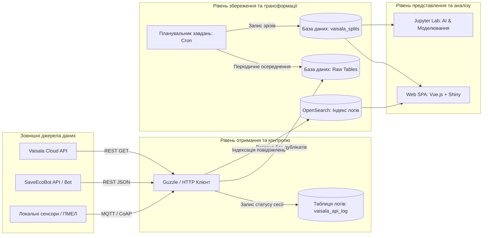

# Змістовий модуль 1. Системи збору та первинного аналізу даних в екологічному моніторингу

# Тема 3. Проєктування екологічних баз даних

---

## 3.1. Моделі представлення екологічних даних: часова дискретизація, геопросторове координування постів

### Основний зміст та теоретичний базис
Проєктування структур баз даних для систем екологічного моніторингу муніципального рівня є фундаментальним науково-інженерним завданням, оскільки ефективність подальшого інтелектуального аналізу, просторової інтерполяції та предиктивного моделювання безпосередньо залежить від формату збереження, індексації та зв’язності первинної інформації. Екологічна телеметрія за своєю фізичною сутністю є багатовимірною просторово-часовою інформацією, яка поєднує часові ряди концентрацій різнорідних полютантів, метеорологічні показники, вектор просторових координат вимірювальних постів та нормативно-довідкові метадані. Здобувачі вищої освіти в межах даного освітнього компонента мають засвоїти теоретичні основи представлення просторово-часових екологічних сутностей та методи їх коректної цифровізації.

Формально багатовимірний набір даних екологічних спостережень для муніципальної інформаційної системи визначається як впорядкована множина часових зрізів $X_t$, яка охоплює вимірювання $M$ різних хімічних і фізичних параметрів на $N$ просторово розподілених моніторингових постах протягом загального часового горизонту $T$:

$$X = \{x_{i,j,t}\}, \quad i \in \{1, \dots, N\}, \quad j \in \{1, \dots, M\}, \quad t \in \{1, \dots, T\},$$

де $x_{i,j,t}$ — числове значення концентрації або фізичної величини $j$-го параметра (наприклад, $\text{NO}_2$, $\text{CO}$, $\text{PM}_{2.5}$, температури, вологості чи атмосферного тиску), зареєстроване на $i$-му вимірювальному пості в дискретний момент часу $t$.

Ключовим аспектом представлення екологічних даних є геопросторове координування вимірювальних вузлів. Для забезпечення взаємодії з міжнародними картографічними сервісами (OpenStreetMap, Google Maps) та геоінформаційними системами первинні координати постів фіксуються в географічній системі координат WGS 84 (EPSG:4326) у вигляді пари чисел: широти ($\varphi$, latitude) та довготи ($\lambda$, longitude) у десяткових градусах. Проте виконання процедур просторового моделювання, розрахунку евклідових відстаней та інтерполяції полів забруднення у сферичних координатах призводить до суттєвих спотворень через нелінійну залежність довжини дуги паралелі від широти. 

У зв’язку з цим у системі реалізується обов'язкова математична трансформація географічних координат у планарну проекційну метричну систему координат WGS 84 / Pseudo-Mercator (EPSG:3857), у якій координати $(x, y)$ виражаються в метрах:

$$x = R_{\text{Earth}} \cdot \lambda_{\text{rad}}, \quad y = R_{\text{Earth}} \cdot \ln\left[ \tan\left( \frac{\pi}{4} + \frac{\varphi_{\text{rad}}}{2} \right) \right],$$

де $R_{\text{Earth}} \approx 6378137\text{ м}$ — радіус екватора референц-еліпсоїда WGS 84; $\varphi_{\text{rad}} = \varphi \cdot \frac{\pi}{180}$ та $\lambda_{\text{rad}} = \lambda \cdot \frac{\pi}{180}$ — відповідно широта та довгота точки спостереження, переведені в радіани. Перехід до метричної системи координат EPSG:3857 забезпечує сталість масштабу в межах локальних урбанізованих територій і спрощує виконання обчислень для алгоритмів геопросторової інтерполяції та симуляції розсіювання викидів.

Не менш важливим чинником є багаторівнева часова дискретизація даних. Первинні вимірювання, що надходять від автоматичних станцій (наприклад, Vaisala AQT420 або IoT-станцій EcoCity), генеруються з високою частотою — один раз на 1–5 хвилин. Зберігання та безпосередня обробка таких обсягів інформації («сирих» даних) на тривалих часових інтервалах створює значне навантаження на дискову підсистему СУБД та сповільнює виконання аналітичних запитів. 

Для розв'язання цієї проблеми в інформаційних системах впроваджується ієрархія часового агрегування, яка формує дискретні часові зрізи: 20-хвилинні інтервали (відповідають часу осереднення для максимально разових концентрацій відповідно до санітарно-гігієнічних вимог), 1-годинні інтервали (для контролю короткострокових екологічних нормативів), 8-годинні ковзні вікна (для специфічних маркерів токсичності, зокрема монооксиду вуглецю та озону), середньодобові значення (24 години), а також середньомісячні та середньорічні показники, необхідні для виявлення кліматичних трендів і міжрічної динаміки.

---

## 3.2. Реляційні схеми (MySQL/PostgreSQL) для збереження первинних («сирих») та усереднених даних (20-хв, добові, місячні, річні)

### Основний зміст та теоретичний базис
При проєктуванні реляційної бази даних для муніципального екологічного моніторингу постає архітектурна дилема: забезпечення максимальної швидкодії запису високочастотних потоків даних у режимі реального часу та одночасна оптимізація виконання складних аналітичних агрегацій за тривалі періоди. Використання єдиної монолітної таблиці для всіх вимірювань швидко призводить до деградації продуктивності індексів B-Tree, збільшення часу блокування таблиць (table locks) та надмірних витрат оперативної пам'яті. 

Для подолання цих обмежень у розробленій інформаційній системі застосовується дворівнева модульна архітектура сховища на базі реляційної СУБД MySQL / PostgreSQL, що базується на фізичному та логічному розділенні таблиць «сирих» (raw) даних і таблиць часових зрізів (splits).

```
   [ Вхідні дані: API Vaisala / EcoCity / Сенсори ]
                          |
                          v
    +-----------------------------------------------+
    |       ТАБЛИЦІ ПЕРВИННИХ («СИРИХ») ДАНИХ       |
    |   station_T3950713, station_T3950716 тощо     |
    |   - Дискретизація: 1 хвилина                  |
    |   - Механізм: видалення дублікатів по MD5     |
    |   - Час зберігання: обмежений (ротація)       |
    +-----------------------------------------------+
                          |
                          | (Фонові cron-завдання: усереднення)
                          v
    +-----------------------------------------------+
    |         ТАБЛИЦЯ АГРЕГОВАНИХ ЗРІЗІВ            |
    |                vaisala_splits                 |
    |   - Дискретизація: 20 хв, доба, місяць, рік   |
    |   - Індексація: B-Tree, просторові координати |
    |   - Постійне зберігання для аналітики та ШІ   |
    +-----------------------------------------------+
```

Перший рівень утворюють індивідуальні таблиці для кожної станції моніторингу (наприклад, `station_T3950713`, `station_T3950716`, `data_eco_city_1755`), куди безпосередньо записуються хвилинні вимірювання в момент їх отримання від сенсорних мереж. Модель таких таблиць розроблена універсальною для довільного набору датчиків: якщо певна модифікація станції не містить вимірювача конкретного газу (наприклад, сірководню $\text{H}_2\text{S}$ чи діоксиду сірки $\text{SO}_2$), відповідні стовпці залишаються порожніми (`NULL`) або заповнюються нульовими значеннями. 

Для запобігання дублюванню записів, яке часто виникає внаслідок повторних відпрацювань мережевих запитів або перекриття інтервалів завантаження, у таблицях первинних даних застосовується механізм контролю унікальності. Унікальним ідентифікатором запису виступає мітка часу вимірювання `measurement_time` у поєднанні з унікальним геш-кодом:

$$\text{hash}_{\text{record}} = \text{MD5}\big(\text{station\_id} \,\|\, t_{\text{measurement\_time}} \,\|\, C_{\text{raw}}\big),$$

де $\|$ — операція конкатенації рядків. При спробі вставки повторного пакета даних спрацьовує обмеження `UNIQUE KEY`, що запобігає викривленню статистичних характеристик вибірки.

Другий рівень сховища представлений консолідованою таблицею часових зрізів `vaisala_splits` (або `split_measurement`), структура якої оптимізована для тривалого зберігання та швидкого аналітичного вилучення даних. До цієї таблиці записуються результати агрегації, що розраховуються утилітами фонової обробки за розкладом (`cron`). 

Для ефективної роботи з великими обсягами інформації (Big Data) таблиця `vaisala_splits` містить прапорці типізації інтервалу (`is_20m`, `is_daily`, `is_monthly`, `is_yearly`) та спеціальні коефіцієнти нормалізованого співвідношення до нормативів ГДК (`humidity_ratio`, `temperature_ratio`, `carbon_oxide_ratio`, `nitrogen_dioxide_ratio`, `dust_pm2_5_ratio`). Така схема позбавляє аналітичні модулі необхідності повторного виконання обчислень нормативної кратності під час кожного сеансу побудови графіків або просторових карт.

Для оптимізації дискового простору та підтримки високої швидкодії бази даних розроблено алгоритм ротації даних. Після того як фонові скрипти (наприклад, `SetVaisala20mSplits.php` та `SetVaisalaDailySplits.php`) розраховують усереднені параметри та успішно записують їх у таблицю `vaisala_splits`, старі «сирі» щохвилинні дані видаляються з вихідних таблиць станцій за допомогою модуля `DeleteOldMeasurementData.php`, якщо термін їхнього збереження перевищує заданий поріг (наприклад, 30 діб). Це забезпечує стабільний розмір первинних таблиць і дозволяє безперебійно функціонувати системі на віртуальних серверах (VPS) із обмеженим обсягом дискового накопичувача (SSD 40–50 ГБ).

| Назва поля | Тип даних (SQL) | Обмеження / Ключі | Опис та функціональне призначення поля |
| :--- | :--- | :--- | :--- |
| **`id`** | `BIGINT UNSIGNED` | `PRIMARY KEY, AUTO_INCREMENT` | Унікальний системний сурогатний первинний ключ запису |
| **`sensor_id`** | `VARCHAR(64)` | `INDEX` | Ідентифікатор вимірювальної станції або сенсорного пристрою |
| **`timestamp_start`** | `DATETIME` | `INDEX` | Часова мітка початку інтервалу осереднення даних |
| **`timestamp_end`** | `DATETIME` | `INDEX` | Часова мітка завершення інтервалу осереднення даних |
| **`temperature`** | `FLOAT(6,2)` | `NULL` | Середнє значення температури атмосферного повітря, °C |
| **`humidity`** | `FLOAT(5,2)` | `NULL` | Середнє значення відносної вологості повітря, % RH |
| **`pressure`** | `FLOAT(8,2)` | `NULL` | Середнє значення атмосферного тиску, гПа |
| **`carbon_oxide`** | `FLOAT(8,4)` | `NULL` | Концентрація оксиду вуглецю ($\text{CO}$), $\text{mg/m}^3$ |
| **`nitrogen_dioxide`**| `FLOAT(8,4)` | `NULL` | Концентрація діоксиду азоту ($\text{NO}_2$), $\text{mg/m}^3$ |
| **`dust_pm2_5`** | `FLOAT(8,3)` | `NULL` | Концентрація дрібнодисперсного пилу $\text{PM}_{2.5}$, $\mu\text{g/m}^3$ |
| **`dust_pm10`** | `FLOAT(8,3)` | `NULL` | Концентрація зважених часток пилу $\text{PM}_{10}$, $\mu\text{g/m}^3$ |
| **`carbon_oxide_ratio`**| `FLOAT(8,4)` | `NULL` | Кратність концентрації $\text{CO}$ відносно середньодобової ГДК |
| **`no2_ratio`** | `FLOAT(8,4)` | `NULL` | Кратність концентрації $\text{NO}_2$ відносно середньодобової ГДК |
| **`interval_avg_time`**| `ENUM('20m','1d','1M','1Y')` | `INDEX` | Тип часового зрізу для швидкої фільтрації запитів аналітики |
| **`is_daily`** | `TINYINT(1)` | `DEFAULT 0, INDEX` | Бінарний прапорець приналежності запису до середньодобових даних |
| **`created_at`** | `TIMESTAMP` | `DEFAULT CURRENT_TIMESTAMP` | Системний час внесення запису в базу даних для аудиту |

Наведена структура таблиці агрегованих даних забезпечує швидке виконання SQL-запитів за складеними індексами `(sensor_id, interval_avg_time, timestamp_start)`. Такий підхід скорочує час формування звітів за постановою КМУ № 827 із кількох хвилин до десятків мілісекунд, забезпечуючи високу реактивність веб-інтерфейсу користувача.

---

## 3.3. Робота з відкритими API екологічних сервісів (Vaisala API, SaveEcoBot API, OpenSearch)

### Основний зміст та теоретичний базис
Сучасні інформаційно-аналітичні системи екологічного спрямування функціонують у гетерогенному інформаційному просторі, де джерелами даних виступають як автономні промислові шлюзи, так і зовнішні хмарні сервіси та відкриті веб-інтерфейси прикладного програмування (Application Programming Interfaces, API). Здобувачам вищої освіти слід розуміти принципи побудови надійних клієнтських модулів збору інформації, які забезпечують безперервне завантаження, валідацію, обробку помилок та інтеграцію різнорідних API-потоків.

Архітектура взаємодії веб-сервісу з API зовнішніх систем реалізується за модульним принципом із використанням спеціалізованих сервісних класів (наприклад, у середовищі PHP/Laravel із використанням HTTP-клієнта Guzzle або в середовищі Python за допомогою бібліотек `requests` та `aiohttp`).


*Рисунок 1 — Схема потоків даних та архітектура інтеграції відкритих API в інформаційно-аналітичну систему екологічного моніторингу*

Організація взаємодії з **Vaisala Cloud API** базується на періодичному виконанні HTTP-запитів типу `GET` із передачею параметрів автентифікації (API-токен у заголовку запиту) та параметрів часового вікна вивантаження (`date_start`, `date_end`, `station_serial_number`). Для забезпечення прозорості та аудиту процесу інформаційного обміну в системі функціонує окрема таблиця реєстрації сеансів `vaisala_api_log`. 

Кожне звернення до API фіксується у журналі із записом ідентифікатора станції, діапазону запитаних дат, кількості успішно отриманих пакетів телеметрії, коду відповіді сервера та тривалості транзакції. У разі виникнення тайм-ауту або відсутності зв'язку з хмарним сервером виробника система фіксує статус помилки та ініціює повторний запит за експоненційним алгоритмом затримки (exponential backoff), що гарантує цілісність ретроспективного архіву.

Інтеграція з **SaveEcoBot API** дозволяє розширити інформаційну базу системи даними громадського моніторингу по всій території України. Отримання даних здійснюється через структуровані JSON-відповіді, які десеріалізуються за допомогою спеціалізованих сервісних класів:
* Клас `SearchCityServer` відповідає за отримання актуального переліку населених пунктів, де розгорнуто вимірювальні станції, з можливістю просторової фільтрації за областями та районами;
* Клас `MonitoringStationServer` здійснює вилучення детальних метаданих щодо конкретного вимірювального пункту, включаючи його точні географічні координати, адресу встановлення та перелік активних сенсорів;
* Клас `StationsTypeServer` завантажує нормативно-технічний класифікатор вимірюваних параметрів, встановлюючи відповідність між внутрішніми кодами полютантів, їхніми загальноприйнятими назвами та одиницями вимірювання ($\text{mg/m}^3$, $\mu\text{g/m}^3$, %, °C, гПа);
* Клас `AirParamsServer` забезпечує отримання останніх оперативних вимірювань за всіма сенсорами станції в режимі реального часу;
* Клас `ArchiveStationsServer` виконує пакетне завантаження погодинних архівних даних за попередні періоди для подальшого аналізу трендів і сезонності.

Для збереження напівструктурованих журналів системних подій, текстових повідомлень про інциденти та розширеного повнотекстового пошуку застосовується документоорієнтована платформа **OpenSearch**. Кожен екологічний інцидент або запис телеметрії індексується у вигляді JSON-документа структури:

$$l_j = \langle t_j, s_j, \text{msg}_j \rangle,$$

де $t_j$ — мітка часу реєстрації події в форматі ISO 8601; $s_j \in \{\text{INFO}, \text{WARN}, \text{ERROR}, \text{FATAL}\}$ — рівень критичності інциденту; $\text{msg}_j$ — структурований зміст повідомлення (наприклад, інформація про перевищення порогу небезпеки або збій сенсора). 

Використання Search API OpenSearch у комбінації з реляційною базою даних MySQL/PostgreSQL забезпечує гібридну аналітичну архітектуру: реляційні таблиці відповідають за прецизійні числові часові ряди для моделей прогнозування, тоді як OpenSearch гарантує масштабований аудит системних подій та оперативну діагностику стану вимірювальної інфраструктури.

---

### Питання для самоперевірки та аналітичного осмислення

1. Чому для завдань просторової інтерполяції екологічних полів забруднення є обов'язковою математична трансформація географічних координат із системи WGS 84 (EPSG:4326) у планарну проекційну систему EPSG:3857?
2. Поясніть причини розділення сховища екологічних даних на таблиці первинних («сирих») спостережень та консолідовану таблицю агрегованих зрізів (`vaisala_splits`). Які переваги це надає для швидкодії системи?
3. Яким чином використання унікальних комбінованих індексів або контрольних геш-сум (MD5) вирішує проблему дублювання екологічної телеметрії при повторних зверненнях до зовнішніх API?
4. Охарактеризуйте структуру та призначення фонових процедур (cron jobs) з обробки та ротації даних. Які операції виконують модулі `SetVaisala20mSplits` та `DeleteOldMeasurementData`?
5. Опишіть функціональні обов'язки сервісних класів при роботі з відкритим API агрегатора екологічних даних SaveEcoBot (`SearchCityServer`, `MonitoringStationServer`, `ArchiveStationsServer`).
6. У чому полягає доцільність використання документоорієнтованої СУБД OpenSearch поряд із класичною реляційною базою даних при побудові комплексних систем муніципального екологічного моніторингу?
7. Як впливає обраний крок часової дискретизації (20-хв, добовий, місячний) на здатність прогностичних моделей виявляти короткочасні техногенні залпові викиди та сезонні кліматичні коливання?