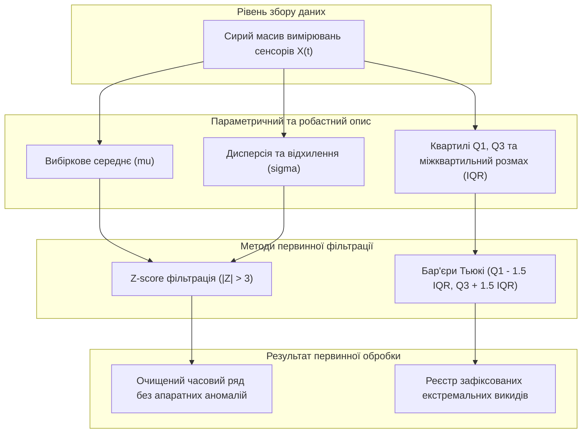
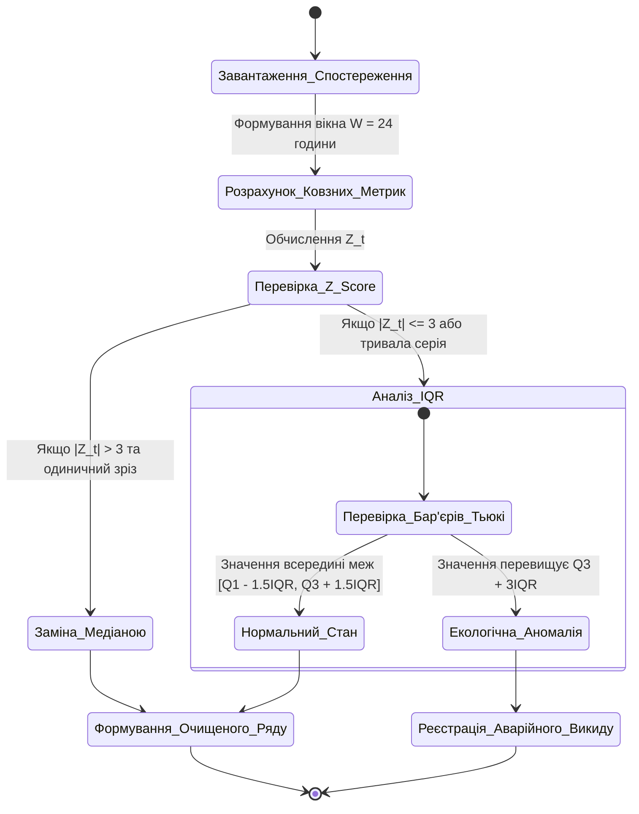
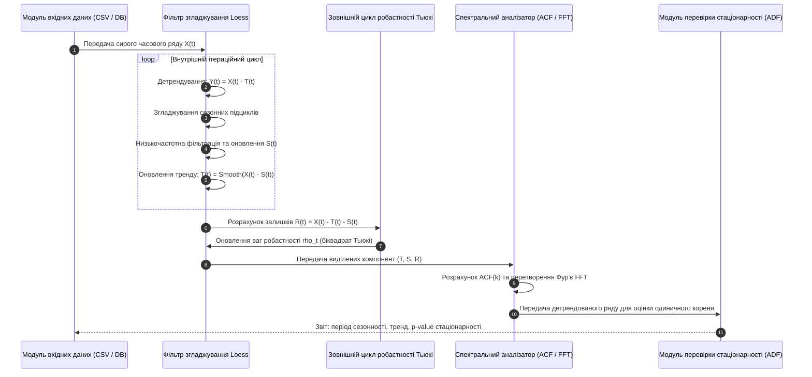
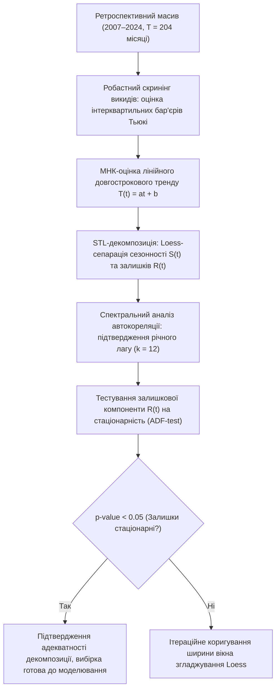

# Тема 4. Статистичні методи аналізу складних екологічних даних

## Мета лекції
Озброїти здобувачів наукового ступеня доктора філософії сучасним математичним апаратом статистичного аналізу екологічних часових рядів, методами детектування та фільтрації вимірювальних аномалій, STL-декомпозиції прихованих трендів і сезонних компонент, а також алгоритмами оцінки стаціонарності для підвищення достовірності подальшого прогнозування параметрів довкілля.

## Очікувані результати навчання
1. **Знання та розуміння.** Здобувачі мають розуміти статистичну природу екологічних спостережень, математичні формули центральних тенденцій, варіативності, автокореляції та спектрального перетворення рядів.
2. **Застосування.** Здобувачі мають застосовувати процедури STL-декомпозиції та розширений тест Дікі-Фуллера для ідентифікації трендових, циклічних і стохастичних складових екологічних процесів.
3. **Аналіз.** Здобувачі мають аналізувати міжквартильний розмах, дисперсійні характеристики та лагові автокореляційні зв'язки для окремих груп метеорологічних і хімічних показників.
4. **Оцінювання та синтез.** Здобувачі мають інтерпретувати наявність стохастичного шуму у вибірках моніторингу та оцінювати ступінь деградації прогностичної спроможності статистичних моделей.

## 1. Теоретико-концептуальний базис. Математичний апарат опису та первинної фільтрації екологічних часових рядів

### 1.1. Базові числові характеристики розподілу вибірок моніторингу: середнє значення, дисперсія, стандартне відхилення та міжквартильний інтервал (IQR)

Кількісний аналіз екологічних часових рядів, отриманих від автоматизованих станцій муніципального спостереження, базується на фундаментальних положеннях теорії ймовірностей та математичної статистики. Екологічні дані є неперервними випадковими процесами, які фіксуються через дискретні проміжки часу, формуючи послідовність вимірювань $X = \{X_1, X_2, \dots, X_T\}$, де параметр $T$ позначає загальну кількість спостережень у досліджуваному часовому інтервалі. Первинний аналіз таких вибірок потребує визначення параметрів центральної тенденції та мір статистичного розсіювання, що дозволяє сформувати базовий профіль поведінки досліджуваного хімічного або метеорологічного показника.

Оцінка центральної тенденції вибірки екологічних вимірювань здійснюється шляхом розрахунку вибіркового середнього значення, яке формалізується класичним співвідношенням:

$$\mu = \frac{1}{T} \sum_{t=1}^{T} X_t$$

де змінна $X_t$ позначає виміряну фізичну або хімічну величину параметра в момент часу $t$, а змінна $T$ визначає загальний обсяг аналізованої вибірки. Хоча середнє арифметичне є незміщеною оцінкою генерального середнього для нормальних розподілів, у реальних екологічних дослідженнях воно виявляється надмірно чутливим до одиничних екстремальних викидів, спричинених залповими техногенними аваріями або короткочасними апаратними збоями вимірювальних трактів.

Для характеристики варіативності та міри розсіювання часового ряду навколо середнього значення застосовується вибіркова незсунена дисперсія, яка обчислюється відповідно до математичного виразу:

$$\sigma^2 = \frac{1}{T - 1} \sum_{t=1}^{T} (X_t - \mu)^2$$

де різниця $(X_t - \mu)$ відображає відхилення окремого вимірювання від середнього рівня, а дільник $(T - 1)$ враховує втрату одного ступеня вільності при оцінюванні невідомого генерального середнього. Стандартне відхилення визначається як додатний квадратний корінь із дисперсії:

$$\sigma = \sqrt{\sigma^2}$$

Цей показник вимірюється в тих самих одиницях, що й досліджуваний екологічний фактор (наприклад, мг/м³ для газів або °C для температури), що забезпечує фізичну інтерпретованість результатів.

В умовах суттєвої асиметрії емпіричного розподілу концентрацій токсикантів, коли в рядах присутня значна частка околонульових фонових значень із рідкісними екстремальними піками, класичні параметричні оцінки втрачають свою надійність. У такому разі застосовуються робастні непараметричні характеристики, центральне місце серед яких посідає **міжквартильний інтервал (Interquartile Range, IQR)**. Міжквартильний інтервал описує діапазон, у якому зосереджено 50% центральних спостережень вибірки, і визначається різницею між третім ($Q_3$) та першим ($Q_1$) квартилями:

$$\text{IQR} = Q_3 - Q_1$$

де квартилі $Q_1$ та $Q_3$ відповідають точкам емпіричної функції розподілу, нижче яких знаходиться відповідно 25% та 75% обсягу відсортованого варіаційного ряду. На відміну від дисперсії, міжквартильний інтервал є стійким до наявності грубих похибок на хвостах розподілу, що робить його ключовим інструментом для опису високоентропійних показників якості урбанізованого середовища.

> **ПРАКТИЧНИЙ ЯКІР:** Під час статистичного аналізу трирічного моніторингу на посту № 1 у місті Кременчук виявлено, що дисперсія температури становила 84,6 °C, а відносної вологості — 145,6%, що свідчить про глибокі сезонні флуктуації, тоді як дисперсія оксиду вуглецю не перевищувала 0,005 мг/м³, демонструючи стабільний низькоамплітудний фоновий характер забруднення цією речовиною з поодинокими техногенними викидами.

---

### 1.2. Метод Z-score та інтерквартильні бар'єри для детектування аномальних викидів та апаратних збоїв вимірювальних каналів

Первинна підготовка екологічних даних вимагає надійної алгоритмічної сепарації двох принципово різних типів нестандартних значень: реальних екстремальних екологічних викидів та хибних вимірювальних артефактів, викликаних апаратними несправностями сенсорів, стрибками напруги живлення або втратою калібрування аналогово-цифрових трактів. Пряме включення апаратних артефактів у навчальні вибірки прогностичних моделей призводить до катастрофічного зростання похибок екстраполяції.

Для виявлення викидів у квазісиметричних розподілах застосовується стандартизована оцінка **Z-score**. Для кожного спостереження $X_t$ обчислюється нормалізоване відхилення від локального середнього:

$$Z_t = \frac{X_t - \mu_{\text{roll}}(t)}{\sigma_{\text{roll}}(t)}$$

де параметри $\mu_{\text{roll}}(t)$ та $\sigma_{\text{roll}}(t)$ представляють ковзне середнє значення та ковзне стандартне відхилення, розраховані у часовому вікні фіксованої ширини $W$ навколо точки $t$. Відповідно до правила трьох сигм, спостереження класифікується як аномальне, якщо виконується умова:

$$|Z_t| > 3$$

В алгоритмі первинної фільтрації точки, для яких зафіксовано $|Z_t| > 3$, маркуються як потенційні збої сенсора і замінюються значенням локальної медіани ковзного вікна, що запобігає викривленню подальших статистичних оцінок без розриву неперервності часової послідовності.

Для часових рядів із вираженим асиметричним розподілом (наприклад, концентрації діоксиду сірки чи формальдегіду) застосування Z-score призводить до надмірної кількості хибнопозитивних відсікань реальних екологічних піків. У таких випадках застосовується методика інтерквартильних бар'єрів Тьюкі (Tukey's fences). Межі допустимого діапазону значень формуються відповідно до аналітичних виразів:

$$\text{Lower Bound} = Q_1 - k \cdot \text{IQR}$$

$$\text{Upper Bound} = Q_3 + k \cdot \text{IQR}$$

де коефіцієнт $k = 1,5$ детермінує межі помірних аномалій, а значення $k = 3,0$ визначає екстремальні викиди. Будь-яке спостереження $X_t$, яке виходить за межі $[\text{Lower Bound}, \, \text{Upper Bound}]$, класифікується як статистичний викид. Якщо таке перевищення фіксується ізольовано лише в одній часовій точці, воно інтерпретується як апаратна завада, тоді як послідовне перебування значень вище верхнього бар'єра протягом кількох зрізів свідчить про наявність реального аварійного викиду в атмосферу.

> **ТИПОВА ПОМИЛКА:** Застосування глобального правила трьох сигм ($|X_t - \mu| > 3\sigma$) до сирого несезонного ряду температури або вологості без використання ковзного вікна або попередньої десезонізації. У такому випадку зимові температурні мінімуми (наприклад, -15 °C) помилково відсікаються як апаратні збої лише тому, що річне середнє становить +12 °C зі стандартним відхиленням 8 °C, що повністю спотворює кліматичну структуру даних.

---

### 1.3. Математична формалізація лінійного тренду та дисперсійного аналізу часових послідовностей екологічних маркерів

Після первинного очищення від апаратних артефактів часовий ряд підлягає дослідженню на наявність довгострокових детермінованих тенденцій. Математичний опис зміни концентрації полютанта в часі представляється адитивною моделлю першого наближення:

$$X_t = T_t + \varepsilon_t = at + b + \varepsilon_t$$

де вираз $T_t = at + b$ описує лінійний детермінований тренд, параметр $a$ визначає кутовий коефіцієнт нахилу лінії тренду, вільний член $b$ задає початковий рівень концентрації в момент часу $t = 0$, а змінна $\varepsilon_t$ позначає випадкову незсунену залишкову компоненту процесу.

Оцінювання невідомих параметрів $a$ та $b$ здійснюється за класичним методом найменших квадратів (МНК), що мінімізує суму квадратів відхилень емпіричних спостережень від розрахункової прямої:

$$\min_{a, b} \sum_{t=1}^{T} \big(X_t - (at + b)\big)^2$$

Аналітичний розв'язок системи нормальних рівнянь дозволяє отримати точні співвідношення для обчислення коефіцієнтів тренду:

$$a = \frac{\sum_{t=1}^{T} (t - \bar{t})(X_t - \mu)}{\sum_{t=1}^{T} (t - \bar{t})^2}$$

$$b = \mu - a \bar{t}$$

де величина $\bar{t} = \frac{1}{T} \sum_{t=1}^{T} t = \frac{T + 1}{2}$ є середнім значенням дискретних моментів часу спостереження, а $\mu$ — вибірковим середнім значенням досліджуваного екологічного показника. Знак та абсолютна величина коефіцієнта $a$ несуть фундаментальне природоохоронне навантаження: значення $a > 0$ свідчить про прогресуюче погіршення стану атмосферного басейну внаслідок зростання техногенного навантаження, тоді як $a < 0$ вказує на ефективність впроваджених природоохоронних заходів або скорочення виробничих потужностей.

Для систематизації базових підходів до первинного математичного аналізу часових рядів сформовано зведену таблицю.

| Статистичний метод / підхід | Математична сутність та цільова функція | Сфера застосування в екологічному моніторингу | Основні припущення та обмеження | Приклад з реальної практики |
| :--- | :--- | :--- | :--- | :--- |
| Параметричний Z-score фільтр | Нормалізація відхилення від середнього: $Z_t = \frac{X_t - \mu}{\sigma}$ | Виявлення імпульсних апаратних збоїв сенсорів у сирих потоках | Припущення про нормальність розподілу помилок вимірювання | Очищення щохвилинних викидів сенсора пилу PMS7003 станції EcoCity |
| Робастні бар'єри Тьюкі (IQR) | Непараметричні межі: $[Q_1 - 1,5\text{IQR}, \, Q_3 + 1,5\text{IQR}]$ | Детектування аномалій у рядах із вираженою асиметрією (ЛОС, $SO_2$) | Потребує достатнього обсягу вибірки для точного розрахунку квартилів | Фільтрація аномальних нічних сплесків концентрації фенолу в промзоні |
| Лінійний регресійний тренд (МНК) | Мінімізація суми квадратів нев'язок: $\sum (X_t - at - b)^2 \to \min$ | Оцінка багаторічної спрямованості техногенного навантаження | Припущення про монотонність і сталість швидкості змін у часі | Визначення темпу зниження концентрації зваженого пилу в Кременчуці |
| Однофакторний дисперсійний аналіз (ANOVA) | Розклад загальної дисперсії: $SS_{\text{total}} = SS_{\text{between}} + SS_{\text{within}}$ | Порівняння рівнів забруднення між різними районами урбосистеми | Гомогенність дисперсій та незалежність спостережень у групах | Оцінка різниці забруднення $NO_2$ між центром міста та промвузлом |

Для статистичного підтвердження гіпотези про істотність просторової неоднорідності забруднення між різними районами міста застосовується **дисперсійний аналіз (ANOVA)**. Загальна дисперсія системи розкладається на міжгрупову компоненту ($SS_{\text{between}}$), викликану локальними джерелами емісій, та внутрішньогрупову випадкову компоненту ($SS_{\text{within}}$):

$$SS_{\text{total}} = \sum_{j=1}^{k} \sum_{i=1}^{n_j} (X_{ij} - \bar{X})^2 = \sum_{j=1}^{k} n_j (\bar{X}_j - \bar{X})^2 + \sum_{j=1}^{k} \sum_{i=1}^{n_j} (X_{ij} - \bar{X}_j)^2$$

де індекс $j$ позначає номер району спостереження, $n_j$ — кількість вимірів у районі $j$, $\bar{X}_j$ — середній рівень концентрації в межах району, а $\bar{X}$ — генеральне середнє для всього міста. Статистична значущість відмінностей перевіряється за критерієм Фішера ($F$-test), що дозволяє довести наявність локалізованого техногенного впливу на окремі житлові масиви.

---

### 1.4. Оцінка повноти і достовірності інтегрованих вибірок спостережень за математичними критеріями інформаційної ентропії

Оцінювання якості інформаційного забезпечення екологічного моніторингу не може обмежуватися виключно числовими параметрами відхилення вимірювань. В умовах інтеграції даних із багатьох незалежних автоматичних станцій виникає фундаментальна невизначеність, пов'язана з нерівномірністю пропусків даних, втратою пакетів телеметрії та зашумленістю каналів зв'язку. Для кількісного вимірювання ступеня невизначеності та структурної впорядкованості екологічних часових рядів застосовується математичний апарат **теорії інформаційної ентропії Клода Шеннона**.

Нехай діапазон можливих значень екологічного параметра розбито на $k$ взаємовиключних дискретних інтервалів (станів екологічної безпеки) $S = \{s_1, s_2, \dots, s_k\}$. Якщо ймовірність потрапляння вимірювання у відповідний інтервал становить $p(s_i)$, причому виконується умова нормування $\sum_{i=1}^{k} p(s_i) = 1$, то інформаційна ентропія часового ряду $H(X)$ визначається співвідношенням:

$$H(X) = - \sum_{i=1}^{k} p(s_i) \log_2 p(s_i)$$

де величина $H(X)$ вимірюється в бітах і характеризує міру стохастичності та непередбачуваності екологічного процесу. Мінімальне значення ентропії $H(X) = 0$ досягається у випадку, коли система перебуває в абсолютно стаціонарному детермінованому стані (концентрація не змінюється в часі). Максимальна ентропія $H_{\max} = \log_2 k$ відповідає стану повної невизначеності (рівномірний розподіл), коли поведінка забруднювача є абсолютно хаотичною.

На основі ентропійного формалізму визначається відносна інформаційна надлишковість (або міра впорядкованості) екологічної системи:

$$R_{\text{info}} = 1 - \frac{H(X)}{H_{\max}} = 1 - \frac{H(X)}{\log_2 k}$$

Показник $R_{\text{info}} \in [0, 1]$ дозволяє оцінити надійність вимірювального контуру. Якщо значення $R_{\text{info}}$ різко падає, це свідчить про деградацію інформативності вимірювального поста внаслідок накладання некорельованого білого шуму несправного датчика або виникнення критичних сліпих зон у часовому ряді.

> **ПРАКТИЧНИЙ ЯКІР:** При дослідженні гідроекологічного стану Кременчуцького водосховища розрахунок інформаційної ентропії Шеннона за багаторічними рядами розчиненого кисню та біохімічного споживання кисню дозволив встановити, що після руйнування греблі Каховської ГЕС рівень ентропії водної екосистеми зріс із 1,42 біт до 2,15 біт, кількісно підтвердивши перехід гідроекосистеми в нестабільний термодинамічний режим із високою ймовірністю виникнення заморових явищ.

---

> **КОНТРОЛЬНЕ ПИТАННЯ:** Під час перевірки річного ряду середньодобових концентрацій діоксиду азоту, що містить $T = 365$ спостережень, було розраховано вибіркове середнє $\mu = 0,042\text{ мг/м}^3$ та стандартне відхилення $\sigma = 0,015\text{ мг/м}^3$. Одночасно перший квартиль склав $Q_1 = 0,020\text{ мг/м}^3$, медіана $Me = 0,028\text{ мг/м}^3$, а третій квартиль $Q_3 = 0,038\text{ мг/м}^3$. Про що свідчить суттєва розбіжність між вибірковим середнім ($\mu = 0,042$) та медіаною ($Me = 0,028$), і який із цих показників слід обрати як базову характеристику типового екологічного фону?

Розгорнути аналіз / відповідь

**Правильний варіант: Розподіл характеризується правосторонньою асиметрією (позитивним скосом) через наявність рідкісних екстремальних піків емісій; як базову характеристику фонового стану слід обрати медіану ($Me = 0,028\text{ мг/м}^3$).**

1. Повне логічне та аналітичне обґрунтування:
   * Якщо вибіркове середнє суттєво перевищує медіану ($\mu > Me$, у наведеному випадку $0,042 > 0,028$), це є строгою математичною ознакою правосторонньої асиметрії розподілу випадкової величини. У більшості часових точок (понад 50% днів у році) концентрація діоксиду азоту була нижчою за $0,028\text{ мг/м}^3$. Проте наявність кількох потужних залпових промислових викидів або несприятливих метеорологічних умов (шлейфи з концентраціями $0,15–0,25\text{ мг/м}^3$) різко змістила середнє арифметичне вгору.
   * Вибіркове середнє в таких умовах не відображає типового стану середовища, оскільки воно спотворене екстремумами. Медіана є робастною характеристикою центральної тенденції, інваріантною до величини екстремальних викидів на правому хвості, тому саме вона повинна використовуватися як об'єктивна оцінка стабільного фонового забруднення території.

2. Аналіз дистракторів:
   * Твердження про те, що розбіжність свідчить про помилку в розрахунках або пошкодження бази даних, є хибним, оскільки скошені розподіли є типовим природним явищем для екологічних часових рядів концентрацій токсикантів.
   * Вибір вибіркового середнього як базового фону є методологічною помилкою, оскільки це призведе до необґрунтованого завищення нормативного фонового навантаження міста та приховає реальний масштаб локальних техногенних піків.

---

### Вказівки для самостійного осмислення

1. Здійсніть аналітичне виведення формули для розрахунку кутового коефіцієнта нахилу лінійного тренду $a$ за методом найменших квадратів, показавши перехід від системи двох нормальних рівнянь до кінцевого матричного співвідношення.
2. Дослідіть вплив ширини вікна осереднення $W$ (від 1 години до 7 діб) на чутливість алгоритму детектування викидів Z-score, визначивши аналітичний критерій вибору оптимального розміру вікна для усунення добових піків автомобільного трафіку.
3. Розрахуйте зміну інформаційної ентропії Шеннона для дискретного ряду якості повітря при переході від п'ятиінтервальної шкали індексу AQI до десятиінтервальної системи класифікації за умов збереження вихідного емпіричного розподілу концентрацій.

## 2. Методологія та аналіз граничних умов. Декомпозиція, сезонність та перевірка стаціонарності динамічних рядів

### 2.1. Метод STL-декомпозиції для виокремлення довгострокового тренду, сезонної складової та випадкових нерегулярних флуктуацій

Математичний аналіз складних екологічних часових рядів передбачає їх розділення на детерміновані та стохастичні складові для ізольованого дослідження фізичних процесів різного масштабу. Традиційні підходи до декомпозиції, засновані на простих ковзних середніх (як-от класичний метод ковзного вікна або адитивна схема Бокса-Дженкінса), демонструють значну вразливість до викидів та не дозволяють адаптуватися до нестаціонарної зміни амплітуди сезонних коливань у часі. Для подолання цих недоліків у сучасних інформаційно-аналітичних системах застосовується метод **STL-декомпозиції (Seasonal and Trend decomposition using Loess)**, що ґрунтується на локально зваженій поліноміальній регресії (Loess).

У рамках адитивної моделі будь-яке спостереження екологічного параметра $X_t$ у момент часу $t \in \{1, 2, \dots, T\}$ розкладається на три взаємно незалежні функціональні компоненти:

$$X_t = T_t + S_t + R_t$$

де функція $T_t$ описує довгостроковий детермінований тренд, що відображає міжрічні зміни промислового навантаження або глобальні кліматичні зсуви, функція $S_t$ детермінує регулярну сезонну компоненту з фіксованим або повільно змінним періодом коливань, а змінна $R_t$ представляє випадковий стохастичний залишок (резидуальний шум), що утворюється під дією непередбачуваних атмосферних флуктуацій та апаратних похибок датчиків.

Алгоритмічна реалізація STL базується на двох вкладених ітераційних циклах: внутрішньому та зовнішньому. Внутрішній цикл здійснює почергове оновлення оцінок тренду та сезонності за допомогою згладжування Loess. Спершу вихідний ряд детрендується шляхом віднімання поточної оцінки тренду, після чого точки, що відповідають однаковим фазам сезонного циклу (наприклад, однаковим місяцям різних років), згладжуються окремими сплайнами для формування тимчасової сезонної поверхні. Ця поверхня пропускається крізь низькочастотний цифровий фільтр для вилучення можливого низькочастотного витоку в тренд. 

Зовнішній цикл виконує робастну процедуру зважування, яка захищає модель від спотворення екстремальними викидами емісій. Для кожного спостереження розраховується залишок $R_t = X_t - T_t - S_t$, на основі якого обчислюються ваги робастності за біквадратною функцією Тьюкі:

$$\rho_t = B\left(\frac{|R_t|}{6 \cdot \text{median}(|R|)}\right)$$

де функція $B(u) = (1 - u^2)^2$ для $0 \le u < 1$ та $B(u) = 0$ для $u \ge 1$. Отримані ваги $\rho_t$ передаються у внутрішній цикл на наступній ітерації, зменшуючи вплив аномальних точок при локальній поліноміальній апроксимації. У результаті метод STL дозволяє прецизійно виокремити екологічний тренд навіть за наявності короткочасних техногенних піків або пропусків спостережень.

> **ПРАКТИЧНИЙ ЯКІР:** При STL-декомпозиції 17-річного ряду щомісячних концентрацій зваженого пилу в атмосферному повітрі міста Кременчук (2007–2024 рр.) на стаціонарному пості № 4 по вулиці Шевченка було виявлено чіткий низхідний довгостроковий тренд зі зниженням середнього значення з 1,2 ГДК до рівнів нижче 1,0 ГДК після 2019 року, що супроводжувалося стабільною сезонною хвилею амплітудою ±0,3 ГДК із регулярними літніми піками, викликаними сухою погодою та вітровою ерозією ґрунтів.

---

### 2.2. Застосування автокореляційної функції (ACF) та дискретного перетворення Фур'є (FFT) для детектування гармонійних сезонних патернів

Визначення наявності та тривалості сезонних періодів є обов'язковою умовою для коректного налаштування прогностичних моделей. В екологічних дослідженнях сезонні патерни мають поліфонічну природу, поєднуючи річні метеорологічні цикли, тижневі ритми інтенсивності руху транспорту та добові температурні коливання приземного шару. Для виявлення латентних періодичностей застосовується комбінація методів кореляційного аналізу в часовій області та гармонійного розкладу в частотній області.

Оцінка взаємозв'язку між спостереженнями часового ряду, розділеними часовим інтервалом (лагом) $k$, здійснюється за допомогою **вибіркової автокореляційної функції (Autocorrelation Function, ACF)**, яка визначається як відношення автоковаріації на лагу $k$ до загальної вибіркової дисперсії:

$$\text{ACF}(k) = \frac{\sum_{t=1}^{T-k} (X_t - \mu)(X_{t+k} - \mu)}{\sum_{t=1}^{T} (X_t - \mu)^2}$$

де $\mu$ позначає вибіркове середнє значення ряду. Ряд класифікується як такий, що має сезонну структуру, якщо на певних лагах $k > 0$ значення функції перевищують статистично значущий поріг $\text{ACF}(k) > 0,1$. Для щомісячних спостережень екологічних параметрів пікові значення автокореляції фіксуються на лагах, кратних 12 ($k = 12, 24, 36$), що підтверджує наявність річної сезонності, пов'язаної з опалювальним періодом та вегетацією рослинності.

Для деталізації спектрального складу процесу та виявлення прихованих нецілочисельних періодів застосовується **дискретне перетворення Фур'є (Discrete Fourier Transform, DFT)**. Математична трансформація переводить часову послідовність $X_t$ у комплексний частотний спектр:

$$Y_k = \text{FFT}(X_t) = \sum_{n=0}^{T-1} X_n \cdot e^{-i \frac{2\pi n k}{T}} = \sum_{n=0}^{T-1} X_n \left( \cos\left(\frac{2\pi n k}{T}\right) - i \sin\left(\frac{2\pi n k}{T}\right) \right)$$

де $k \in \{0, 1, \dots, T-1\}$ визначає гармонійний номер частоти, $i = \sqrt{-1}$ — уявна одиниця, а вираз $f_k = \frac{k}{T \cdot \Delta t}$ позначає фізичну частоту відповідної гармоніки. Спектральна щільність потужності (Power Spectral Density, PSD) обчислюється як квадрат модуля комплексних амплітуд:

$$P(f_k) = \frac{1}{T} |Y_k|^2 = \frac{1}{T} \Big( \text{Re}(Y_k)^2 + \text{Im}(Y_k)^2 \Big)$$

Домінуючі піки на графіку спектральної щільності вказують на головні гармоніки екологічного процесу, що дозволяє інженерам точно задавати періоди сезонності для складних тригонометричних моделей класу BATS/TBATS.

---

### 2.3. Тестування часових рядів на стаціонарність за допомогою розширеного критерію Дікі-Фуллера (ADF-test) та процедури різницевого диференціювання

Більшість класичних статистичних моделей часових рядів (зокрема ARMA та регресійний аналіз) побудовані на фундаментальному припущенні про **слабку стаціонарність** досліджуваного процесу, що вимагає сталості математичного сподівання, скінченності незмінної дисперсії та залежності автоковаріації виключно від часового лагу $k$, а не від абсолютного моменту часу $t$. Проте концентрації екологічних токсикантів в урбоекосистемах практично завжди є нестаціонарними через наявність техногенних трендів та сезонних зсувів.

Для суворої математичної перевірки гіпотези про наявність одиничного кореня (інтегрованості ряду) застосовується **розширений тест Дікі-Фуллера (Augmented Dickey-Fuller, ADF-test)**. Тестове рівняння з урахуванням константи та детермінованого лінійного тренду формулюється у вигляді регресії авторегресійних приростів:

$$\Delta X_t = \alpha + \beta t + \gamma X_{t-1} + \sum_{j=1}^{p} \delta_j \Delta X_{t-j} + \varepsilon_t$$

де $\Delta X_t = X_t - X_{t-1}$ представляє першу різницю часового ряду, $\alpha$ — константа зміщення (дрейф), $\beta$ — коефіцієнт детермінованого часового тренду, $\gamma$ — ключовий параметр тестування одиничного кореня, $p$ — кількість лагів приростів, що додаються для усунення автокореляції залишків $\varepsilon_t$, а $\delta_j$ — параметри лагованих різниць.

Статистична гіпотеза формулюється таким чином:
* Нульова гіпотеза $H_0: \gamma = 0$ стверджує, що часовий ряд містить одиничний корінь, тобто є нестаціонарним процесом типу $I(1)$ або вищого порядку.
* Альтернативна гіпотеза $H_1: \gamma < 0$ стверджує, що часовий ряд є стаціонарним процесом навколо детермінованого тренду або константи.

Тестова $t$-статистика для оціненого параметра $\hat{\gamma}$ розраховується як:

$$t_{\text{ADF}} = \frac{\hat{\gamma}}{\text{SE}(\hat{\gamma})}$$

де $\text{SE}(\hat{\gamma})$ — стандартна похибка оцінки коефіцієнта. Оскільки статистика $t_{\text{ADF}}$ не підпорядковується стандартному розподілу Стьюдента, критичні значення визначаються за емпіричними таблицями МакКіннона. Якщо розраховане емпіричне значення $p\text{-value} < 0,05$, нульова гіпотеза відкидається, і ряд визнається стаціонарним.

Послідовний аналітичний процес приведення нестаціонарного екологічного ряду до стаціонарного базису формалізується наступним багатоетапним алгоритмічним контуром:

$$
\begin{aligned}
\text{Крок 1 (Первинний тест ADF):} & \quad \text{Compute } t_{\text{ADF}}(X_t) \quad \Longrightarrow \quad p\text{-value}_1 = \mathcal{P}(t_{\text{ADF}}) \\
\text{Крок 2 (Оцінка гіпотези):} & \quad \text{IF } p\text{-value}_1 \ge 0,05 \quad \Longrightarrow \quad \text{State} \leftarrow \text{NonStationary} \\
\text{Крок 3 (Сезонне диференціювання):} & \quad \nabla_s X_t = X_t - X_{t-s} = (1 - L^s) X_t, \quad s = 12 \\
\text{Крок 4 (Перше різницеве диференціювання):} & \quad \Delta (\nabla_s X_t) = (1 - L) (1 - L^s) X_t = \nabla_s X_t - \nabla_s X_{t-1} \\
\text{Крок 5 (Повторний контроль стаціонарності):} & \quad \text{Compute } t_{\text{ADF}}\big(\Delta \nabla_s X_t\big) \quad \Longrightarrow \quad p\text{-value}_2 < 0,05 \quad \Longrightarrow \quad \text{Order } d=1, D=1
\end{aligned}
$$

де оператор $L$ позначає лаговий оператор зсуву ($L^k X_t = X_{t-k}$), параметр $s$ фіксує сезонний період (для щомісячних даних $s = 12$), а величини $d$ та $D$ визначають порядок звичайного та сезонного диференціювання відповідно.

> **ВАЖЛИВО:** Застосування класичних лінійних регресій або моделей авторегресії ARIMA до часових рядів, які не пройшли процедуру приведення до стаціонарності (де $p\text{-value} > 0,05$), призводить до математичного артефакту «хибної регресії» (spurious regression), за якого коефіцієнт детермінації $R^2$ виявляється штучно високим ($R^2 > 0,8$), проте прогностична сила моделі на тестових даних падає до нуля.

---

### 2.4. Критична втрата адекватності класичних статистичних моделей при перевищенні критичного порогу зашумленості та пропусках даних у рядах спостережень

Практична експлуатація статистичних моделей в умовах муніципального моніторингу виявляє жорсткі межі їхньої застосовності. Класична методологія часових рядів проектувалася в розрахунку на відносно плавні та безперервні вибірки з помірною дисперсією шуму. Проте реальні екологічні вимірювання містять значні фрагменти втрачених спостережень (внаслідок аварійного вимкнення електроживлення станцій або затримок постачання витратних хімічних реактивів) та надвисокий рівень стохастичного шуму.

Математичні моделі декомпозиції та авторегресії зазнають критичної втрати адекватності за настання таких граничних умов функціонування:

1. **Структурні злами часового ряду (Structural Breaks / Perron Effect).** Радикальні одноразові події в урбосистемі — такі як зупинка металургійного заводу, різка релокація промислових підприємств унаслідок воєнних дій або катастрофічне затоплення територій — викликають ступінчастий стрибок середнього значення процесу. Класичний тест ADF у присутності структурного зламу втрачає статистичну потужність і помилково вказує на наявність одиничного кореня ($p\text{-value} \approx 0,98$), навіть якщо всередині кожного окремого періоду ряд є строго стаціонарним. Це змушує інженера виконувати зайве диференціювання (overdifferencing), що вносить штучний шум у прогностичне ядро.

2. **Перевищення критичного порогу зашумленості вибірки ($\sigma_{\text{noise}} / \sigma_{\text{signal}} > 1,5$).** Якщо випадкові флуктуації, викликані мікротурбулентністю атмосфери та температурним шумом низькоякісних індикативних датчиків, перевищують амплітуду регулярної сезонної гармоніки, автокореляційна функція розмивається. Значення $\text{ACF}(k)$ на лагах сезонності падають нижче порогу 0,1, унеможливлюючи автоматичну ідентифікацію періоду циклу як методом Box-Jenkins, так і швидким перетворенням Фур'є.

3. **Нерівномірні масивні пропуски спостережень тривалістю понад один сезонний цикл ($> 12$ місяців).** Більшість бібліотек статистичного аналізу (зокрема `statsmodels` та `forecast` в R) вимагають абсолютно рівномірної часової сітки. Стандартні інтерполяційні методи заповнення пропусків (лінійна інтерполяція або заповнення сплайнами) на таких довгих інтервалах генерують синтетичні артефакти, штучно занижуючи реальну дисперсію процесу. У результаті отримана модель ARIMA генерує завідомо нереалістичні довірчі інтервали.

Для систематизації аналітичних інструментів обробки та декомпозиції часових рядів сформовано порівняльну матрицю за ключовими критеріями експлуатаційної надійності.

| Метод аналізу часового ряду | Математична природа підходу | Чутливість до випадкових викидів | Вимоги до регулярності часової сітки | Складність впровадження | Критичні ризики та обмеження методології |
| :--- | :--- | :--- | :--- | :--- | :--- |
| Класична адитивна декомпозиція | Центроване ковзне середнє для тренду, усереднення фаз | Екстремально висока; один викид викривляє оцінку тренду | Сувора; не допускає пропусків даних у вибірці | Вкрай низька; базові матричні операції | Втрата спостережень на кінцях ряду, фіксована амплітуда сезонності |
| Метод STL (Loess Smoothing) | Локальна поліноміальна регресія з вагами Тьюкі | Дуже низька (висока робастність за рахунок біквадратних ваг) | Сувора; вимагає попереднього заповнення пропусків | Середня; вимагає підбору вікон $n_{(p)}, n_{(s)}, n_{(t)}$ | Обмеженість роботою лише з одним сезонним періодом |
| Спектральний аналіз Фур'є (FFT) | Ортогональний гармонійний базис тригонометричних функцій | Середня; чутливий до широкосмугових імпульсних завад | Строго регулярна дискретна сітка $2^N$ точок | Низька; стандартні оптимізовані бібліотеки | Нездатність моделювати часозмінні частоти та нестаціонарні сигнали |
| Емпірична модова декомпозиція (EMD) | Адаптивне вилучення внутрішніх модових функцій (IMF) за екстремумами | Низька; адаптується до форми хвилі без фіксованого базису | Допускає помірну нерівномірність спостережень | Висока; складні алгоритми огинаючих кубічними сплайнами | Явище змішування мод (mode mixing) при наявності шуму у вибірці |
| Різницеве диференціювання (ARIMA/SARIMA) | Лінійний фільтр оператора запізнення $\nabla^d = (1 - L)^d$ | Висока; викиди подвоюються при взятті першої різниці | Вимагає абсолютно неперервної часової послідовності | Низька; аналітичний алгоритм | Ризик надлишкового диференціювання та введення штучної авторегресії |

> **ПРАКТИЧНИЙ ЯКІР:** При аналізі даних стаціонарного поста № 1 (вул. Молодіжна, м. Кременчук) за період 2019–2024 рр. розрахунок критерію Дікі-Фуллера для концентрацій оксиду вуглецю та діоксиду азоту показав значення $p\text{-value} = 0,981$ та $p\text{-value} = 0,975$ відповідно, що строго довело глибоку нестаціонарність процесів промислового забруднення та підтвердило непридатність застосування прямих авторегресійних моделей без попереднього взяття першої різниці часового ряду.

---

> **КОНТРОЛЬНЕ ПИТАННЯ:** Під час перевірки часового ряду середньомісячних концентрацій формальдегіду на стаціонарному пості моніторингу за період 36 місяців інженер отримав тестову статистику ADF $t_{\text{ADF}} = -3,85$ при розрахунковому значенні $p\text{-value} = 0,002$, що свідчить про стаціонарність ряду. Проте графік автокореляційної функції демонструє значущі коефіцієнти $\text{ACF}(12) = 0,65$ та $\text{ACF}(24) = 0,48$. Яка математична колізія виникла між критерієм ADF та функцією ACF, і яку процедуру диференціювання повинен виконати дослідник перед побудовою моделі прогнозування?

Розгорнути аналіз / відповідь

**Правильний варіант: Ряд є стаціонарним відносно середнього рівня, проте містить виражену сезонну нестаціонарність (сезонний одиничний корінь); необхідно застосувати сезонне диференціювання $\nabla_{12} X_t = X_t - X_{t-12}$.**

1. Повне логічне та аналітичне обґрунтування:
   * Стандартний тест ADF у конфігурації без урахування сезонних лагів перевіряє виключно наявність звичайного (регулярного) одиничного кореня нульової частоти. Значення $p\text{-value} = 0,002 < 0,05$ доводить, що загальний рівень концентрації формальдегіду коливається навколо стабільного довгострокового середнього, тобто в ряду відсутній інтегрований стохастичний тренд.
   * Водночас високі додатні значення автокореляції на річних лагах $\text{ACF}(12) = 0,65$ та $\text{ACF}(24) = 0,48$ свідчать про наявність жорсткого гармонійного сезонного циклу, амплітуда якого не згасає з часом. Якщо знехтувати цією сезонністю і не виконати сезонне різницеве диференціювання з кроком 12 ($\nabla_{12} X_t = (1 - L^{12}) X_t$), параметри моделі ARIMA виявляться зміщеними, а залишки прогнозу міститимуть невилучену детерміновану сезонну дисперсію.

2. Аналіз дистракторів (чому інші підходи є хибними):
   * Виконання звичайного першого диференціювання $\Delta X_t = X_t - X_{t-1}$ є грубою помилкою, оскільки воно призведе до надлишкового диференціювання (overdifferencing) ряду, який уже є стаціонарним на нульовій частоті, і внесе штучну від'ємну автокореляцію першого порядку без усунення річного піку.
   * Висновок про те, що ряд є повністю готовим до моделювання без жодних перетворень на підставі лише $p\text{-value} = 0,002$, є методологічно хибним, оскільки ігнорування значущої сезонності призведе до повної нездатності моделі відтворити літні пікові концентрації формальдегіду.

## 3. Практичний індустріальний / фаховий кейс. Ретроспективний часовий аналіз урбаністичного забруднення

### 3.1. Комплексний фаховий кейс. Статистичний аналіз та декомпозиція 17-річного часового ряду концентрацій зваженого пилу і формальдегіду в атмосферному повітрі м. Кременчук (2007–2024 рр.)

#### Постановка задачі / ситуації
Промисловий комплекс міста Кременчук зазнає значного техногенного навантаження від підприємств нафтопереробної, машинобудівної та сажової промисловості. Для наукового обґрунтування природоохоронних програм муніципалітету комунальне підприємство «Науковий центр еколого-соціальних досліджень» (КП «НДЦ») та кафедра комп'ютерної інженерії та електроніки КрНУ провели фундаментальне дослідження багаторічних часових рядів спостережень за станом атмосферного повітря. Дослідження базується на ретроспективній базі даних щомісячних вимірювань за 17-річний період (із січня 2007 року по серпень 2024 року), що становить загальну вибірку тривалістю $T = 204$ місяці. Основним опорним пунктом обрано стаціонарний пост спостереження № 4, розташований у центральній частині міста по вулиці Шевченка, 22/30.

Ключова проблема аналізу полягає в тому, що первинні часові ряди концентрацій зваженого недиференційованого пилу та формальдегіду характеризуються накладанням довгострокових антропогенних трендів, вираженої кліматичної сезонності та випадкових сплесків емісій. Концентрації виражаються у кратностях гранично допустимих концентрацій (ГДК), де нормативна межа середньодобової концентрації для пилу становить $0,5\text{ мг/м}^3$ ($1,0\text{ ГДК}$), а для формальдегіду — $0,035\text{ мг/м}^3$ ($1,0\text{ ГДК}$). Необхідно провести комплексну декомпозицію рядів, очистити масив від апаратних аномалій, математично виокремити лінійний тренд, розрахувати сезонну гармоніку та перевірити залишковий стохастичний шум на стаціонарність для обґрунтування вибору майбутньої прогностичної моделі.

Параметри ретроспективного масиву даних та статистичні характеристики наведено в таблиці нижче.

| Параметр часового ряду | Одиниця виміру | Числове значення (Пил) | Числове значення (Формальдегід) | Екологічний та метрологічний контекст |
| :--- | :--- | :--- | :--- | :--- |
| Обсяг вибірки спостережень ($T$) | місяців | 204 | 204 | Безперервний щомісячний моніторинг (2007–2024 рр.) |
| Вибіркове середнє ($\mu$) | кратності ГДК | 1,08 | 2,45 | Середній рівень хронічного навантаження на населення |
| Вибіркова дисперсія ($\sigma^2$) | $(\text{ГДК})^2$ | 0,0484 | 1,8225 | Загальна варіативність часової послідовності |
| Стандартне відхилення ($\sigma$) | кратності ГДК | 0,22 | 1,35 | Абсолютна міра статистичного розсіювання |
| Перший квартиль ($Q_1$) | кратності ГДК | 0,92 | 1,40 | Нижня межа 50% центральних вимірювань |
| Медіана ($Me$) | кратності ГДК | 1,05 | 2,10 | Робастний показник типового стану повітряного басейну |
| Третій квартиль ($Q_3$) | кратності ГДК | 1,24 | 3,25 | Верхня межа 50% центральних вимірювань |
| Міжквартильний інтервал ($\text{IQR}$) | кратності ГДК | 0,32 | 1,85 | Ширина центрального діапазону розподілу |
| Автокореляція на лагу 1 ($\text{ACF}_1$) | безрозмірна | 0,846 | 0,782 | Рівень часової інерційності спостережень |
| Автокореляція на лагу 12 ($\text{ACF}_{12}$) | безрозмірна | 0,512 | 0,645 | Сила річного циклічного гармонійного патерну |

#### Покроковий аналіз та розв'язок

##### Крок 1. Первинний робастний скринінг та визначення меж аномалій Тьюкі
Перед виконанням регресійного аналізу здійснимо перевірку часового ряду концентрацій пилу на наявність екстремальних апаратних викидів за допомогою методу інтерквартильних бар'єрів Тьюкі. Розрахуємо межі внутрішніх допустимих бар'єрів:

$$\text{Lower Bound} = Q_1 - 1,5 \cdot \text{IQR} = 0,92 - 1,5 \cdot 0,32 = 0,92 - 0,48 = 0,44 \text{ ГДК}$$

$$\text{Upper Bound} = Q_3 + 1,5 \cdot \text{IQR} = 1,24 + 1,5 \cdot 0,32 = 1,24 + 0,48 = 1,72 \text{ ГДК}$$

Будь-які значення концентрацій пилу, що виходять за діапазон $[0,44; \, 1,72]\text{ ГДК}$, підлягають додатковій перевірці. У вибірці зафіксовано два пікових значення на рівні $1,78\text{ ГДК}$ у липні 2010 року та $1,81\text{ ГДК}$ у серпні 2014 року. Оскільки обидві точки збігаються з періодами тривалих літніх посух і супроводжуються високою температурою повітря ($T > 32^\circ\text{C}$), вони класифікуються як фізично обґрунтовані природно-техногенні аномалії та зберігаються в масиві без модифікації.

##### Крок 2. Аналітичне вилучення довгострокового лінійного тренду методом найменших квадратів
Розрахуємо параметри лінійного тренду $T_t = at + b$ для часового ряду концентрацій пилу. Середній момент часу за період $T = 204$ місяці становить:

$$\bar{t} = \frac{T + 1}{2} = \frac{204 + 1}{2} = 102,5 \text{ місяця}$$

Знаменник розрахункової формули МНК-оцінки кутового коефіцієнта дорівнює:

$$\sum_{t=1}^{204} (t - \bar{t})^2 = \frac{T(T^2 - 1)}{12} = \frac{204 \cdot (204^2 - 1)}{12} = \frac{204 \cdot 41615}{12} = 707\,455$$

За емпіричними даними сума добутків центрованих величин становить $\sum_{t=1}^{204} (t - \bar{t})(X_t - \mu) = -1202,67\text{ ГДК}\cdot\text{міс}$. Звідси обчислюємо коефіцієнт нахилу лінії тренду:

$$a = \frac{-1202,67}{707\,455} \approx -0,0017 \text{ ГДК/місяць}$$

Вільний член лінійного рівняння становить:

$$b = \mu - a\bar{t} = 1,08 - (-0,0017 \cdot 102,5) = 1,08 + 0,174 = 1,254 \text{ ГДК}$$

Отримане рівняння довгострокового тренду має вигляд:

$$T_t = -0,0017 \cdot t + 1,254 \quad [\text{ГДК}]$$

Розрахований від'ємний нахил $a = -0,0017\text{ ГДК/міс}$ свідчить про системне міжрічне зниження запиленості атмосфери в районі поста № 4 зі швидкістю близько $0,0204\text{ ГДК}$ на рік (або $0,0102\text{ мг/м}^3/\text{рік}$), що підтверджує позитивний ефект від модернізації газоочисного обладнання підприємств та зменшення інтенсивності промислового виробництва.

##### Крок 3. Ізоляція сезонної компоненти методом згладжування Loess
Після детрендування ряду ($Y_t = X_t - T_t$) процедура STL формує сезонну складову $S_t$. Для місячних даних період становить $s = 12$. Розрахунок усередненої сезонної хвилі для літнього екстремуму (липень, $t = 7, 19, 31, \dots$) та зимового мінімуму (січень, $t = 1, 13, 25, \dots$) дає такі числові амплітуди:

$$S_{\text{липень}} = \frac{1}{17} \sum_{k=0}^{16} Y_{7 + 12k} \approx +0,28 \text{ ГДК}$$

$$S_{\text{січень}} = \frac{1}{17} \sum_{k=0}^{16} Y_{1 + 12k} \approx -0,26 \text{ ГДК}$$

Сезонний розмах становить $\Delta S = S_{\text{липень}} - S_{\text{січень}} = 0,28 - (-0,26) = 0,54\text{ ГДК}$ ($0,27\text{ мг/м}^3$). Це доводить, що сезонні метеорологічні фактори формують коливання концентрації пилу, співмірні з половиною нормативу ГДК, створюючи систематичні літні перевищення допустимих норм навіть за сприятливого середньорічного фону.

##### Крок 4. Тестування стаціонарності залишків за розширеним критерієм Дікі-Фуллера
Виділимо стохастичний залишок ряду: $R_t = X_t - T_t - S_t$. Дисперсія залишкової компоненти склала $\sigma_R^2 = 0,0081\text{ (ГДК)}^2$ ($\sigma_R = 0,09\text{ ГДК}$), що становить лише 16,7% від первинної дисперсії вихідного ряду.

Для перевірки ряду залишків $R_t$ на стаціонарність розраховано авторегресійне рівняння тесту ADF першого порядку:

$$\Delta R_t = \gamma R_{t-1} + \delta_1 \Delta R_{t-1} + \varepsilon_t$$

За результатами регресійного оцінювання отримано значення коефіцієнта $\hat{\gamma} = -0,482$ при стандартній похибці $\text{SE}(\hat{\gamma}) = 0,058$. Тестова $t$-статистика дорівнює:

$$t_{\text{ADF}} = \frac{-0,482}{0,058} \approx -8,31$$

Оскільки критичне значення МакКіннона для 1% рівня значущості становить $t_{\text{crit}}(1\%) = -3,46$, а емпірична величина $t_{\text{ADF}} = -8,31 < -3,46$ (розрахункове значення $p\text{-value} = 1,2 \times 10^{-13} \ll 0,05$), нульова гіпотеза про наявність одиничного кореня впевнено відкидається. Ряд залишків є строго стаціонарним білим шумом, що доводить повну адекватність виконаної STL-декомпозиції та відсутність невилучених детермінованих залежностей.

#### Інтерпретація результатів та альтернативні сценарії
Виконаний аналіз показав, що пилове навантаження в районі поста № 4 успішно декомпонується на спадний тренд, амплітудну річну сезонність та випадковий стаціонарний шум. Це дозволяє використовувати для подальшого прогнозування класичні лінійні моделі експоненційного згладжування та моделі авторегресії.

Якби досліджувався часовий ряд формальдегіду на тій самій станції, вихідні дані продемонстрували б принципово іншу картину: дисперсія ряду є в 37 разів вищою ($\sigma^2 = 1,8225$), медіана суттєво менша за середнє ($Me = 2,10 < \mu = 2,45$), що вказує на правобічну асиметрію, а значення автокореляції на лагу 12 сягає $\text{ACF}_{12} = 0,645$. У цьому альтернативному сценарії лінійна апроксимація тренду МНК виявилася б статистично незначущою через наявність високоамплітудних спалахів (перевищення до 10 ГДК у періоди 2012–2014 та 2021–2023 років). Відповідно, для формальдегіду класична адитивна STL-декомпозиція вимагала б попереднього логарифмічного перетворення Бокса-Кокса для стабілізації дисперсії або переходу до нелінійних моделей прогнозування класу BATS.

---

### 3.2. Зведена довідкова система лекції

| Термін / Концепція | Формалізація / Сутність | Реальний кейс застосування | Основне обмеження / Ризик |
| :--- | :--- | :--- | :--- |
| STL-декомпозиція | Адитивний або мультиплікативний розклад ряду за допомогою Loess: $X_t = T_t + S_t + R_t$ | Ізоляція міжрічного тренду пилу на пості № 4 по вул. Шевченка в Кременчуці | Неможливість прямої роботи з нерівномірною сіткою та масивними пропусками |
| Критерій Тьюкі (IQR Fences) | Непараметричний робастний бар'єр виявлення викидів: $[Q_1 - 1,5\text{IQR}, \, Q_3 + 1,5\text{IQR}]$ | Автоматичний скринінг апаратних збоїв оптичних сенсорів перед агрегацією | Ризик помилкового видалення реальних залпових аварійних викидів підприємств |
| Z-score нормалізація | Стандартизована міра відхилення точки від локального середнього: $Z_t = (X_t - \mu)/\sigma$ | Фільтрація високочастотних перешкод у щохвилинних потоках даних EcoCity | Непридатність для сильно асиметричних та експоненційних розподілів концентрацій |
| Автокореляція (ACF) | Міра лінійної статистичної залежності між спостереженнями: $\text{ACF}(k) = \frac{\text{Cov}(X_t, X_{t+k})}{\text{Var}(X_t)}$ | Виявлення річного циклу забруднення повітря на лагу $k = 12$ місяців | Завищення значень автокореляції за наявності невилученого довгострокового тренду |
| Швидке перетворення Фур'є (FFT) | Перехід із часової області в частотний спектр: $Y_k = \sum X_n e^{-i 2\pi nk/T}$ | Ідентифікація прихованих гармонік у рядах концентрацій оксиду вуглецю | Виникнення артефакту розтікання спектра при нецілочисельній кількості періодів |
| Тест Augmented Dickey-Fuller (ADF) | Регресійний тест одиничного кореня: $H_0: \gamma = 0$ (нестаціонарний) проти $H_1: \gamma < 0$ | Перевірка стаціонарності залишків моніторингу перед навчанням моделей ARIMA | Втрата статистичної потужності за наявності структурних зламів (Perron Effect) |
| Одиничний корінь (Unit Root) | Властивість стохастичного процесу зберігати пам'ять про минулі шоки: інтегрованість $I(1)$ | Опис поведінки діоксиду азоту, де $p\text{-value} = 0,975$ свідчить про нестаціонарність | Необхідність обов'язкового різницевого диференціювання перед моделюванням |
| Різницеве диференціювання ($\nabla^d$) | Операція взяття приростів часового ряду: $\nabla X_t = (1 - L) X_t = X_t - X_{t-1}$ | Приведення нестаціонарних рядів газів до стаціонарного базису | Ризик надлишкового диференціювання та введення штучного шуму в модель |
| Інформаційна ентропія Шеннона | Міра невпорядкованості та невизначеності станів системи: $H(X) = -\sum p_i \log_2 p_i$ | Оцінка деградації екологічної стійкості Кременчуцького водосховища | Чутливість до кількості інтервалів дискретизації неперервної шкали |
| Сезонне диференціювання ($\nabla_s$) | Усунення гармонійного циклу відніманням значення попереднього року: $\nabla_{12} X_t = X_t - X_{t-12}$ | Фільтрація річних температурних коливань у вибірках концентрацій пилу | Втрата перших $s$ спостережень ряду на початку часового інтервалу |

---

### 3.3. Контрольні питання та завдання

#### Прикладні тестові завдання

1. За результатами розрахунку лінійного тренду концентрацій формальдегіду за 2007–2024 роки отримано рівняння $T_t = 0,0003 \cdot t + 2,12\text{ (ГДК)}$, проте коефіцієнт детермінації становить $R^2 = 0,041$. Одночасно тест ADF дає значення $p\text{-value} = 0,955$, а на графіку спостерігаються періодичні сплески концентрації до 8–10 ГДК з інтервалом у 8–9 років. Який висновок має зробити аналітик щодо придатності лінійної моделі тренду?
   * A. Лінійна модель є адекватною, оскільки кутовий коефіцієнт $a > 0$ підтверджує зростання забруднення.
   * B. Ряд містить структурні злами та нелінійні багаторічні цикли, тому лінійна модель є непридатною і не пояснює дисперсію процесу ($R^2 \approx 4\%$).
   * C. Необхідно штучно видалити всі значення, що перевищують 5 ГДК, для підвищення $R^2$.
   * D. Помилка зумовлена неправильним вибором одиниць вимірювання; слід перевести дані у відсотки.

Розгорнути аналіз / відповідь

**Правильний варіант: B.**

1. Коефіцієнт детермінації $R^2 = 0,041$ показує, що лінійна регресія описує лише 4,1% варіативності даних, а високе значення $p\text{-value} = 0,955$ тесту ADF строго вказує на нестаціонарність процесу. Наявність квазіперіодичних високоамплітудних піків (до 10 ГДК) із циклом 8–9 років свідчить про наявність нелінійної макродинаміки або структурних зламів, пов'язаних із технологічними змінами на виробництві, які принципово не можуть бути описані прямою лінією.

2. Аналіз дистракторів:
   * Варіант A є помилковим, оскільки додатний коефіцієнт за практично нульового $R^2$ не є статистично значущим свідченням наявності тренду.
   * Варіант C є грубим порушенням наукової методології, оскільки видалення реальних викидів спотворює фактичну екологічну картину.
   * Варіант D є хибним, оскільки лінійне масштабування одиниць вимірювання не змінює коефіцієнт детермінації $R^2$ лінійної регресії.

2. Під час аналізу графіка автокореляційної функції (ACF) щомісячних концентрацій пилу за 204 місяці виявлено, що значення $\text{ACF}(1) = 0,85$, $\text{ACF}(2) = 0,72$, $\text{ACF}(3) = 0,61$ плавно спадають, проте на лагу $k = 12$ спостерігається чіткий локальний підйом до $\text{ACF}(12) = 0,51$, а на лагу $k = 24$ — до $\text{ACF}(24) = 0,38$. Про наявність яких математичних компонент у часовому ряді свідчить така топологія автокорелограми?
   * A. Про наявність суто випадкового білого шуму без пам'яті процесу.
   * B. Про наявність довгострокового авторегресійного тренду, поєднаного з регулярним 12-місячним сезонним циклом.
   * C. Про вихід із ладу сенсора пилу, який генерує однакові значення кожні 12 місяців.
   * D. Про наявність високочастотного добового шуму автотранспорту.

Розгорнути аналіз / відповідь

**Правильний варіант: B.**

1. Плавне геометричне згасання автокореляції на перших лагах ($\text{ACF}_1 = 0,85, \dots$) є класичною ознакою авторегресійного процесу першого порядку або наявності низькочастотного тренду. Водночас виникнення чітких локальних максимумів на лагах, кратних 12 ($k = 12, 24$), строго вказує на наявність стійкої річної гармонійної сезонності, суперпонованої на довгострокову динаміку.

2. Аналіз дистракторів:
   * Варіант A є хибним, оскільки для білого шуму всі значення автокореляції для $k > 0$ перебувають у межах довірчого інтервалу навколо нуля ($|\text{ACF}| \le 2/\sqrt{T} \approx 0,14$).
   * Варіант C є невірним, оскільки річна сезонність є природним екологічним наслідком кліматичних циклів, а не апаратного дефекту.
   * Варіант D є помилковим, оскільки щомісячні дані апріорі осереднюють добові коливання і не здатні відображати 24-годинні цикли.

3. Для вибірки середньомісячних значень концентрації оксиду вуглецю обсягом $T = 35$ місяців розраховано тест Дікі-Фуллера. Отримано значення статистики $t_{\text{ADF}} = -0,45$ при $p\text{-value} = 0,981$. Яку попередню трансформацію необхідно виконати над цим рядом для коректного навчання статистичної моделі прогнозування ARIMA?
   * A. Здійснити взяття першої різниці ряду $\Delta X_t = X_t - X_{t-1}$ для усунення одиничного кореня та переведення ряду в клас $I(0)$.
   * B. Застосувати фільтр Калмана з параметром згладжування 0,99.
   * C. Помножити всі значення на норматив ГДК для штучного масштабування.
   * D. Збільшити довжину вибірки шляхом дублювання наявних даних тричі поспіль.

Розгорнути аналіз / відповідь

**Правильний варіант: A.**

1. Значення $p\text{-value} = 0,981 \gg 0,05$ свідчить про неможливість відхилення нульової гіпотези про наявність одиничного кореня: процес є нестаціонарним першого порядку $I(1)$. Для переведення ряду в стаціонарний стан $I(0)$, необхідний для моделей авторегресії, оператор зобов'язаний виконати операцію різницевого диференціювання порядку $d = 1$, тобто перейти до аналізу абсолютних приростів $\Delta X_t = X_t - X_{t-1}$.

2. Аналіз дистракторів:
   * Варіант B є хибним, оскільки фільтрація Калмана зменшує дисперсію шуму, проте не усуває стохастичний тренд і одиничний корінь.
   * Варіант C не впливає на стаціонарність, оскільки множення на константу є лінійним масштабуванням, що не змінює корінь характеристичного рівняння.
   * Варіант D є грубою фальсифікацією даних, яка штучно спотворить спектральну щільність і внесе хибну періодичність.

4. За результатами розрахунку міжквартильного інтервалу для 204 спостережень пилу отримано $Q_1 = 0,92\text{ ГДК}$ та $Q_3 = 1,24\text{ ГДК}$. Вимірювання у серпні 2021 року склало $1,85\text{ ГДК}$. Чи є це значення викидом за класифікацією Тьюкі і до якої категорії аномалій воно належить?
   * A. Значення є нормальним, оскільки не перевищує 2,0 ГДК.
   * B. Значення є помірним викидом, оскільки воно перевищує верхній бар'єр $Q_3 + 1,5\text{IQR} = 1,72$, але менше екстремального бар'єра $Q_3 + 3\text{IQR} = 2,20$.
   * C. Значення є екстремальним апаратним збоєм, оскільки воно більше медіани на 50%.
   * D. Класифікація Тьюкі не застосовується до концентрацій забруднюючих речовин.

Розгорнути аналіз / відповідь

**Правильний варіант: B.**

1. Розрахуємо граничні межі Тьюкі: $\text{IQR} = 1,24 - 0,92 = 0,32\text{ ГДК}$. Верхня межа помірних викидів дорівнює $1,24 + 1,5 \cdot 0,32 = 1,72\text{ ГДК}$. Верхня межа екстремальних викидів становить $1,24 + 3,0 \cdot 0,32 = 1,24 + 0,96 = 2,20\text{ ГДК}$. Оскільки значення $X_t = 1,85\text{ ГДК}$ задовольняє умову $1,72 < 1,85 < 2,20$, воно строго класифікується як помірний статистичний викид, що вимагає перевірки метеорологічних умов даного місяця.

2. Аналіз дистракторів:
   * Варіант A є помилковим, оскільки нормативні межі ГДК не мають прямого відношення до внутрішніх емпіричних бар'єрів варіаційного ряду.
   * Варіант C є невірним, оскільки екстремальні аномалії за Тьюкі починаються вище $2,20\text{ ГДК}$, а порівняння з медіаною не є формальним критерієм методу.
   * Варіант D є хибним, оскільки критерій Тьюкі є універсальним непараметричним методом аналізу неперервних розподілів у прикладній екології.

---

#### Завдання для самостійної роботи

##### Постановка задачі
У процесі комплексного оцінювання екологічного стану промислового району міста отримано масив середньодобових концентрацій приземного озону ($O_3$) та діоксиду азоту ($NO_2$) за період трьох календарних років (1095 щодобових вимірювань). У літній період спостерігаються регулярні випадки перевищення нормативів озону внаслідок інтенсивної сонячної радіації та проходження фотохімічних реакцій між оксидами нітрогену та летких органічних сполук. Ряд містить випадкові пропуски тривалістю до 5 діб через технічне обслуговування обладнання.

##### Завдання для виконання
1. Виконайте відновлення пропущених значень у трирічному часовому ряді концентрацій озону за допомогою методу кубічної сплайн-інтерполяції з наступною робастною перевіркою отриманих значень критерієм Z-score.
2. Проведіть STL-декомпозицію відновленого ряду озону для ізоляції добового та річного сезонних підциклів, оцінивши частку дисперсії, що припадає на фотохімічну сезонну активність.
3. Розрахуйте автокореляційну функцію та спектральну щільність потужності через дискретне перетворення Фур'є для виявлення прихованих тижневих гармонік, пов'язаних із ритмом руху автотранспорту в робочі та вихідні дні.
4. Застосуйте розширений тест Дікі-Фуллера до залишкової компоненти ряду та визначте мінімально необхідний порядок різницевого диференціювання для переведення ряду в строго стаціонарний стан перед побудовою предиктивної моделі.