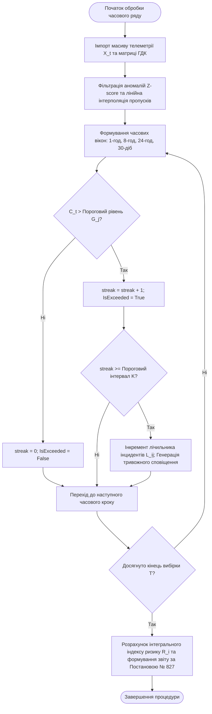

# Змістовий модуль 1. Системи збору та первинного аналізу даних в екологічному моніторингу

# Тема 4. Статистичні методи аналізу складних екологічних даних

---

## 4.1. Первинна обробка та валідація екологічних рядів спостережень: фільтрація шумів, виявлення викидів (Z-score, IQR), відновлення пропусків

### Основний зміст та теоретичний базис
Первинна екологічна телеметрія, отримана від автоматичних станцій моніторингу та розподілених бездротових сенсорних мереж, характеризується високим рівнем стохастичного шуму, наявністю пропусків спостережень унаслідок збоїв живлення чи каналів зв'язку, а також аномальними викидами, зумовленими апаратними девіаціями вимірювальних трактів. Здобувачі вищої освіти повинні усвідомлювати, що пряма трансляція «сирих» даних у предиктивні моделі або системи підтримки прийняття рішень призводить до суттєвої деградації точності та генерації хибних екологічних тривог. У зв'язку з цим початковим етапом аналітичного контуру є всебічна статистична обробка, валідація та нормалізація масивів даних.

Нехай часовий ряд спостережень за певним екологічним параметром представлений вибіркою $X_t = \{x_1, x_2, \dots, x_T\}$, де $T$ — загальна кількість зафіксованих відліків. Базовими числовими характеристиками центральної тенденції та розсіювання вибірки виступають вибіркове середнє значення $\mu$ та незсунена дисперсія $\sigma^2$:

$$\mu = \frac{1}{T} \sum_{t=1}^{T} X_t,$$

$$\sigma^2 = \frac{1}{T - 1} \sum_{t=1}^{T} (X_t - \mu)^2,$$

де стандартне середньоквадратичне відхилення визначається як $\sigma = \sqrt{\sigma^2}$.

Для оцінки варіативності рядів, розподіл яких відхиляється від нормального закону Гауса (що є типовим для екологічних маркерів в умовах епізодичних техногенних викидів), застосовується міжквартильний розмах ($\text{IQR}$):

$$\text{IQR} = Q_3 - Q_1,$$

де $Q_1$ та $Q_3$ — відповідно перший (25-й процентиль) та третій (75-й процентиль) квартилі емпіричного розподілу, між якими зосереджено 50 % центральних значень вибірки.

Для виявлення аномальних відліків (викидів), спричинених короткочасними збоями сенсорного обладнання, використовується метод стандартизованих оцінок ($Z$-score) на основі ковзного вікна. Точка спостереження $x_t$ класифікується як аномальна, якщо її відхилення від локального ковзного середнього $\mu_{\text{roll}}$ перевищує потроєне ковзне стандартне відхилення $\sigma_{\text{roll}}$:

$$|Z_t| = \left| \frac{x_t - \mu_{\text{roll}}}{\sigma_{\text{roll}}} \right| > 3.$$

Ідентифіковані викиди вилучаються з ряду та заміщуються значенням локальної медіани ковзного вікна, що дозволяє зберегти статистичну стійкість ряду без зміщення його дисперсійних характеристик. Застосування глобального правила $\text{IQR}$ передбачає фільтрацію значень, що виходять за межі інтервалу $[Q_1 - 1.5 \cdot \text{IQR}, Q_3 + 1.5 \cdot \text{IQR}]$.

Процедура відновлення пропущених значень диференціюється залежно від тривалості відсутності сигналу $\Delta t_{\text{gap}}$:
* Короткочасні пропуски спостережень тривалістю менше шести годин ($\Delta t_{\text{gap}} \le 6\text{ год}$), що виникають через тимчасові перебої в роботі телекомунікаційних шлюзів, заповнюються за допомогою лінійної інтерполяції для збереження локального часового тренду:

$$X_t = X_{t_1} + \frac{X_{t_2} - X_{t_1}}{t_2 - t_1} (t - t_1),$$

де $X_{t_1}$ та $X_{t_2}$ — достовірні значення вимірюваного показника безпосередньо перед початком та після завершення інтервалу втрати даних.
* Тривалі пропуски спостережень ($\Delta t_{\text{gap}} > 6\text{ год}$), викликані серйозними аваріями інфраструктури або технічним обслуговуванням станцій, вилучаються з аналізу шляхом сегментації часового ряду, оскільки штучна математична інтерполяція таких інтервалів призводить до появи хибних періодичностей та синтетичних артефактів.

Завершальним етапом первинної підготовки є масштабування ознак. Для приведення різнорідних фізичних величин (температури, тиску, концентрацій газів) до єдиного безрозмірного діапазону $[0, 1]$ застосовується мінімаксна нормалізація ($\text{Min-Max Scaling}$):

$$X_{\text{norm}} = \frac{X_t - X_{\min}}{X_{\max} - X_{\min}},$$

де $X_{\min}$ та $X_{\max}$ — відповідно мінімальне та максимальне значення аналізованого параметра у вибірці. Дане перетворення є критично важливим для коректного функціонування шарів квантового кодування (наприклад, $\text{AngleEmbedding}$), де нормалізовані значення трансформуються в кути обертання квантових гейтів у діапазоні $[0, \pi]$ або $[0, 2\pi]$, запобігаючи насиченню квантових станів.

| Локація спостереження | Вимірюваний параметр | Середнє значення ($\mu$) | Дисперсія ($\sigma^2$) | Міжквартильний розмах ($\text{IQR}$) | Лінійний тренд ($a$) | Домінуюча сезонність (лаг) | Стаціонарність ($\text{ADF } p\text{-value}$) | Автокореляція ($\text{ACF at Lag-1}$) |
| :--- | :--- | :--- | :--- | :--- | :--- | :--- | :--- | :--- |
| **Гімназія № 26 (житлова зона)** | Температура, °C | 11.84 | 84.60 | 16.50 | 0.081 | 12 | 0.041 (стаціонарний) | 0.853 |
| | Вологість, % | 70.03 | 145.60 | 19.85 | –0.152 | 12 | 0.123 (нестаціонарний)| 0.662 |
| | Тиск, гПа | 1015.00 | 0.89 | 1.10 | –0.009 | 12 | 0.025 (стаціонарний) | 0.108 |
| | $\text{CO}$, $\text{mg/m}^3$ | 0.45 | 0.005 | 0.06 | 0.002 | 12 | 0.981 (нестаціонарний)| 0.939 |
| | $\text{NO}_2$, $\text{mg/m}^3$ | 0.03 | 0.0001 | 0.01 | 0.0003 | 12 | 0.975 (нестаціонарний)| 0.940 |
| **Північний промвузол (індустріальна зона)** | Температура, °C | 15.90 | 85.10 | 17.80 | –0.075 | 12 | 0.189 (нестаціонарний)| 0.846 |
| | Вологість, % | 62.46 | 221.60 | 23.12 | 0.211 | 12 | 0.234 (нестаціонарний)| 0.661 |
| | Тиск, гПа | 1013.00 | 1.21 | 1.35 | –0.015 | 12 | 0.345 (нестаціонарний)| 0.145 |
| | $\text{CO}$, $\text{mg/m}^3$ | 0.51 | 0.008 | 0.08 | 0.003 | 12 | 0.990 (нестаціонарний)| 0.853 |
| | $\text{NO}_2$, $\text{mg/m}^3$ | 0.04 | 0.0002 | 0.01 | 0.0005 | 12 | 0.988 (нестаціонарний)| 0.915 |
| **Район «Фаворит» (комерційна зона)** | Температура, °C | 16.92 | 86.80 | 18.10 | –0.053 | 12 | 0.033 (стаціонарний) | 0.881 |
| | Вологість, % | 54.88 | 330.50 | 28.50 | 0.350 | 12 | 0.451 (нестаціонарний)| 0.896 |
| | Тиск, гПа | 1012.00 | 2.55 | 2.10 | –0.021 | 12 | 0.048 (стаціонарний) | 0.600 |
| | $\text{CO}$, $\text{mg/m}^3$ | 0.55 | 0.011 | 0.10 | 0.004 | 12 | 0.992 (нестаціонарний)| 0.910 |
| | $\text{NO}_2$, $\text{mg/m}^3$ | 0.05 | 0.0003 | 0.02 | –0.0002| 12 | 0.895 (нестаціонарний)| 0.959 |

Аналіз емпіричних характеристик набору даних свідчить про виражену гетерогенність показників між різними функціональними зонами міста. Метеорологічні параметри (температура та вологість) демонструють високу дисперсію та чітку річну циклічність. Натомість концентрації токсичних газів ($\text{CO}$ та $\text{NO}_2$) характеризуються вираженою нестаціонарністю ($p\text{-значення}$ тесту ADF наближаються до одиниці) та високою автокореляцією першого порядку ($\text{ACF} > 0.85$), що відображає кумулятивний характер забруднення та значну інерційність розсіювання домішок в умовах щільної міської забудови.

---

## 4.2. Математичний апарат аналізу часових рядів: тренд, автокореляція (ACF), спектральний аналіз (FFT), тест на стаціонарність Дікі-Фуллера (ADF)

### Основний зміст та теоретичний базис
Комплексний аналіз екологічного часового ряду передбачає його структурну декомпозицію на детерміновані та випадкові компоненти. У сучасних інформаційно-аналітичних системах застосовується адитивна модель декомпозиції часового ряду (Seasonal and Trend decomposition using Loess — STL):

$$X_t = T_t + S_t + R_t,$$

де $T_t$ — довгострокова трендова складова, що відображає загальну спрямованість змін екологічного стану; $S_t$ — сезонна (періодична) компонента з фіксованим періодом коливань; $R_t$ — нерегулярна залишкова (стохастична) компонента, яка описує випадкові короткочасні флуктуації.

Виділення лінійного тренду здійснюється методом найменших квадратів за допомогою лінійної апроксимаційної функції:

$$X_t = a \cdot t + b,$$

де кутовий коефіцієнт $a$ визначає швидкість та напрямок зміни показника (додатне значення $a > 0$ свідчить про зростаючий тренд забруднення, від'ємне $a < 0$ — про тенденцію до покращення якості середовища), а вільний член $b$ фіксує початковий рівень ряду:

$$a = \frac{\sum_{t=1}^{T} (t - \bar{t})(X_t - \mu)}{\sum_{t=1}^{T} (t - \bar{t})^2}, \quad b = \mu - a \cdot \bar{t},$$

де $\bar{t} = \frac{T + 1}{2}$ — середнє значення індексу часу.

Для виявлення внутрішньої інерційності процесу та оцінки статистичного зв'язку між послідовними відліками використовується автокореляційна функція ($\text{ACF}$) для часового лагу $k$:

$$\text{ACF}(k) = \frac{\sum_{t=1}^{T-k} (X_t - \mu)(X_{t+k} - \mu)}{\sum_{t=1}^{T} (X_t - \mu)^2} = \frac{\text{Cov}(X_t, X_{t+k})}{\text{Var}(X_t)},$$

де $\text{Cov}(X_t, X_{t+k})$ — автоковаріація ряду на лагу $k$; $\text{Var}(X_t)$ — вибіркова дисперсія. Якщо для кількох послідовних сезонних лагів виконується умова $\text{ACF}(k) > 0.1$, часовий ряд класифікується як такий, що має виражену сезонну структуру.

Спектральний аналіз методом швидкого перетворення Фур'є (Fast Fourier Transform — FFT) дозволяє трансформувати дискретний часовий ряд із часової області у частотну для ідентифікації прихованих гармонічних коливань:

$$\text{FFT}(X_t) = \sum_{n=0}^{T-1} X_t \cdot \exp\left( -2\pi i \frac{n \cdot k}{T} \right) = \sum_{n=0}^{T-1} X_t \left[ \cos\left( \frac{2\pi nk}{T} \right) - i \sin\left( \frac{2\pi nk}{T} \right) \right],$$

де $i = \sqrt{-1}$ — уявна одиниця; $k$ — індекс частотної гармоніки. Пікові значення амплітудного спектра $|\text{FFT}(X_t)|$ відповідають домінуючим періодам коливань екологічних процесів (добовим, тижневим або річним циклам).

Перевірка стаціонарності часового ряду здійснюється за допомогою розширеного тесту Дікі-Фуллера (Augmented Dickey-Fuller — ADF). Наявність одиничного кореня перевіряється в межах регресійного рівняння:

$$\Delta X_t = \alpha + \beta \cdot t + \gamma \cdot X_{t-1} + \sum_{j=1}^{p} \delta_j \Delta X_{t-j} + \varepsilon_t,$$

де $\Delta X_t = X_t - X_{t-1}$ — перша різниця часового ряду; $\alpha$ — константа (дрейф); $\beta \cdot t$ — лінійний детермінований тренд; $\gamma$ — коефіцієнт при лаговій змінній; $p$ — порядок авторегресії доданих перших різниць, що вводяться для усунення автокореляції залишків $\varepsilon_t$. 

Тестування базується на нульовій гіпотезі $H_0: \gamma = 0$ (наявність одиничного кореня, що свідчить про нестаціонарність ряду) проти альтернативної гіпотези $H_1: \gamma < 0$ (ряд є стаціонарним). Якщо розрахункове значення ймовірності $p\text{-value} < 0.05$, нульова гіпотеза відхиляється, а часовий ряд вважається статистично стаціонарним. Якщо ж $p\text{-value} \ge 0.05$, ряд потребує процедури диференціювання порядку $d$ для приведення до стаціонарного вигляду перед застосуванням класичних прогностичних моделей.

---

## 4.3. Алгоритми підрахунку кратності та послідовних перевищень гранично допустимих концентрацій (ГДК / MPC)

### Основний зміст та теоретичний базис
Нормативно-технічний супровід екологічного моніторингу вимагає постійного зіставлення виміряних значень концентрацій із санітарно-гігієнічними регламентами. Основним безрозмірним критерієм забруднення є кратність перевищення гранично допустимої концентрації ($\text{MPC\_Ratio}$):

$$\text{MPC\_Ratio}_{i,j,t} = \frac{x_{i,j,t}}{\text{ГДК}_j},$$

де $x_{i,j,t}$ — виміряна або осереднена концентрація $j$-ї забруднюючої речовини на $i$-му пості в момент часу $t$, $\text{mg/m}^3$; $\text{ГДК}_j$ — нормативне значення гранично допустимої концентрації (максимально разової $\text{ГДК}_{\text{м.р.}}$ або середньодобової $\text{ГДК}_{\text{с.д.}}$) для $j$-ї речовини відповідно до чинного законодавства. 

Значення $\text{MPC\_Ratio} > 1$ свідчить про порушення екологічного нормативу, причому діапазон від 1 до 5 класифікується як помірне перевищення, а понад 10 — як високий рівень екстремального техногенного забруднення.

Для реалізації автоматизованого контролю згідно з Постановою КМУ № 827 розроблено алгоритм ковзного віконного осереднення та виявлення інцидентів тривалого перевищення порогових меж.

*Рисунок 1 — Блок-схема алгоритму виявлення та реєстрації послідовних перевищень нормативів ГДК*

Представлена блок-схема відображає послідовність функціонування модуля автоматизованої валідації екологічних даних. Після попередньої фільтрації та формування нормалізованих вікон осереднення система здійснює покроковий аналіз умов перевищення нормативних значень $G_j$. Якщо концентрація речовини перевищує норматив, внутрішній лічильник неперервної послідовності $\text{streak}_t$ збільшується на одиницю. 

У разі, коли тривалість неперервного перевищення досягає нормативно визначеного критичного порогу $K$ (наприклад, $K = 3$ години для порогів тривоги за діоксидом сірки та діоксидом азоту), система реєструє офіційний екологічний інцидент, інкрементує лічильник $L_{i,j}$ та ініціює створення тривожного сповіщення для оператора. Якщо на певному кроці значення концентрації повертається в допустимі межі, лічильник $\text{streak}_t$ скидається до нуля, що унеможливлює повторну реєстрацію одного й того самого тривалого порушення.

Для аналізу тривалих періодів спостережень усереднення за рухомим вікном формується за формулою:

$$C_{\text{avg}}(t) = \frac{1}{W} \sum_{m=0}^{W-1} x_{t-m},$$

де $W$ — розмір вікна осереднення (для 20-хвилинного осереднення при хвилинній дискретизації $W = 20$; для годинного $W = 60$; для добового $W = 1440$).

У розрахункових таблицях (наприклад, при реалізації алгоритмів у табличних процесорах або за допомогою бібліотеки `pandas`) зміщення ковзної області реалізується за допомогою динамічних індексних функцій. Зсув базового діапазону визначається відстанню від початкового рядка таблиці до цільового часового зрізу:

$$\text{Offset\_Row}(t) = (t - 1) \cdot W + 1.$$

Для контролю специфічного показника — максимального середньодобового восьмигодинного значення (що є обов'язковим для оцінки впливу чадного газу та озону на здоров'я людини) — алгоритм обчислює ковзне 8-годинне середнє ($W = 8\text{ годин}$) для кожної години доби, після чого вибирає максимальне значення за 24-годинний цикл:

$$C_{8\text{h\_max}}^{\text{daily}} = \max_{k \in \{1, \dots, 24\}} \left( \frac{1}{8} \sum_{h=0}^{7} x_{k-h} \right).$$

Розраховані масиви перевищень трансформуються в агреговані матриці статистичної звітності, які слугують основою для складання щомісячних і щорічних декларацій муніципальних екологічних служб перед Міністерством захисту довкілля та природних ресурсів України.

---

### Питання для самоперевірки та аналітичного осмислення

1. Які фізичні та технічні чинники зумовлюють появу аномальних викидів у часових рядах автоматичних екологічних станцій, і чому класичне відсікання за глобальними порогами поступається локальному ковзному $Z$-score аналізу?
2. Поясніть математичну різницю між лінійною інтерполяцією короткочасних пропусків ($\le 6\text{ год}$) та вилученням тривалих інтервалів відсутності даних при підготовці вибірки для глибоких нейронних мереж.
3. Чому для більшості техногенних полютантів ($\text{CO}, \text{NO}_2$) розрахункові значення тесту Дікі-Фуллера ($\text{ADF } p\text{-value}$) перевищують критичний рівень 0.05, і що це означає для вибору структури прогностичної моделі?
4. Яким чином аналіз автокореляційної функції ($\text{ACF}$) на різних лагах дозволяє диференціювати природні метеорологічні коливання від регулярних промислових циклів викидів?
5. Опишіть логіку функціонування рекурентної змінної $\text{streak}_t$ в алгоритмі підрахунку тривалих перевищень нормативів згідно з вимогами Постанови КМУ № 827.
6. У чому полягає відмінність між розрахунком максимально разової кратності ГДК та максимального середньодобового 8-годинного значення концентрації забруднювача?
7. Як впливає мінімаксна нормалізація даних на ефективність функціонування квантових параметризованих схем (VQC) у гібридних моделях прогнозування?