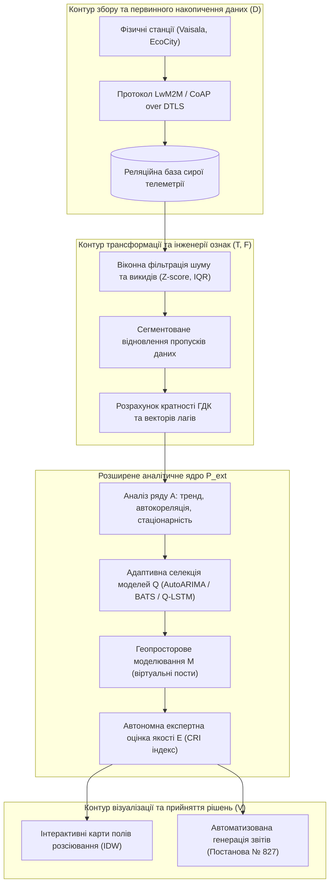
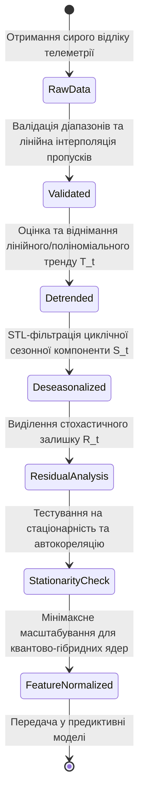
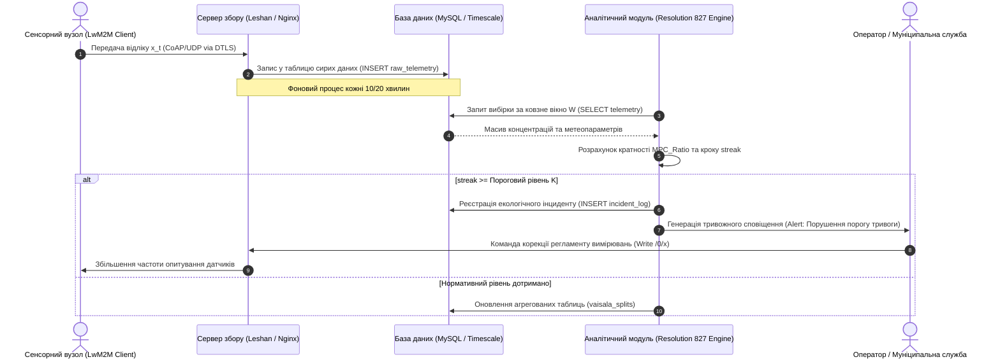
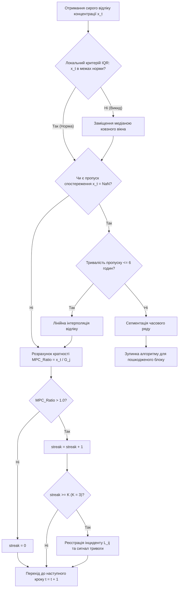

# Тема 4. Статистичні методи первинної обробки, валідації та часового аналізу складних екологічних даних у муніципальних системах моніторингу

## Мета лекції
Метою лекції є формування у здобувачів вищої освіти другого (магістерського) рівня системних теоретичних знань і практичних компетентностей щодо застосування сучасного математико-статистичного апарату для первинної підготовки, фільтрації, структурної декомпозиції та верифікації часових рядів екологічної телеметрії в умовах високої ентропії муніципального середовища, що дозволяє нівелювати апаратні похибки низькобюджетних сенсорних мереж, забезпечити юридично достовірний розрахунок нормативних перевищень гранично допустимих концентрацій згідно з Постановою Кабінету Міністрів України № 827 та сформувати стійкий базис даних для предиктивних моделей систем підтримки прийняття рішень.

## Очікувані результати навчання
1. **Знання та розуміння.** Здобувачі вищої освіти засвоять теоретичні засади статистичної обробки екологічної телеметрії, сутність математичного апарату адитивної декомпозиції часових рядів, спектрального аналізу та критеріїв перевірки стаціонарності випадкових процесів у межах концептуальної моделі підготовки даних для інтелектуальних систем моніторингу.
2. **Застосування.** Магістри набудуть умінь практично реалізовувати алгоритми ковзної віконної фільтрації стохастичного шуму, розраховувати статистичні критерії виявлення викидів, здійснювати диференційоване відновлення втрачених спостережень та обчислювати показники кратності перевищення нормативів гранично допустимих концентрацій забруднюючих речовин для формування нормативної звітності.
3. **Аналіз.** Студенти навчаться аналізувати просторово-часову гетерогенність екологічних показників, зіставляти спектральні та автокореляційні характеристики параметрів промислових емісій, а також виявляти латентні залежності між метеорологічними факторами й динамікою розсіювання токсичних домішок на основі емпіричних вибірок спостережень.
4. **Оцінювання та синтез.** Фахівці зможуть критично оцінювати ступінь надійності первинних сенсорних даних при виникненні апаратних збоїв, обґрунтовувати вибір алгоритмічних схем нормалізації масивів інформації для усунення спотворень у прогнозуванні та синтезувати прикладні процедури верифікації тривалих перевищень екологічних регламентів відповідно до національних та міжнародних стандартів.

---

## Детальний покроковий план лекції

### 1. Теоретико-концептуальний базис. Формалізація контуру підготовки даних та структурна декомпозиція екологічних часових рядів
* 1.1. Концептуальна модель підготовки та обробки екологічних даних DPPDM і математична формалізація векторних просторів просторово-розподілених спостережень.
* 1.2. Статистичні міри центральної тенденції, робастні показники варіативності емпіричного розподілу та процедури масштабування ознак у безрозмірні числові діапазони.
* 1.3. Теоретичні основи адитивної декомпозиції часових рядів на детерміновану трендову, сезонну та стохастичну залишкову компоненти.
* 1.4. Математичний апарат автокореляційного аналізу та швидкого перетворення Фур'є для ідентифікації домінуючих гармонік і циклічності екологічних процесів.

### 2. Методологія та аналіз граничних умов. Алгоритми фільтрації аномалій, імпутації пропусків та моніторингу нормативних перевищень
* 2.1. Віконна фільтрація стохастичних шумів і статистичні критерії детектування аномальних викидів на основі локального Z-score та інтервалів міжквартильного розмаху.
* 2.2. Диференційована методологія відновлення пропусків даних залежно від тривалості відсутності сигналу та збереження топологічної цілісності рядів.
* 2.3. Алгоритмізація процедури ковзного осереднення, розрахунку максимальних середньодобових значень та ідентифікації тривалих послідовностей перевищень нормативів відповідно до Постанови Кабінету Міністрів України № 827.
* 2.4. Методологічні бар'єри та критичні обмеження класичних тестів на одиничний корінь в умовах високої дисперсії, апаратної зашумленості та малої довжини екологічних вибірок.

### 3. Практичний індустріальний / фаховий кейс. Статистична обробка та аналіз рядів спостережень промислової агломерації
**Тема наскрізної задачі.** «Комплексна статистична валідація, декомпозиція та алгоритмічний аналіз послідовних перевищень нормативів пилу і токсичних газів за даними стаціонарних постів і станцій Vaisala міста Кременчук»

## 1. Теоретико-концептуальний базис. Формалізація контуру підготовки даних та структурна декомпозиція екологічних часових рядів

### 1.1. Концептуальна модель підготовки та обробки екологічних даних DPPDM і математична формалізація векторних просторів просторово-розподілених спостережень

Сучасні муніципальні системи екологічного моніторингу функціонують в умовах інтенсивного надходження гетерогенних інформаційних потоків, що генеруються автоматичними вимірювальними станціями, мобільними лабораторіями та розподіленими бездротовими сенсорними мережами. Сира телеметрія, що надходить із первинних перетворювачів, не може бути безпосередньо спрямована у предиктивні аналітичні модулі через наявність апаратного шуму, нерівномірну часову дискретизацію, втрати пакетів у каналах зв'язку та порушення топологічної цілісності спостережень. Для подолання зазначеної фрагментарності та переходу від описової фіксації стану довкілля до прескриптивного управління застосовується формалізована концептуальна модель підготовки та обробки даних для прийняття рішень (**Data Preparation and Processing for Decision-Making — DPPDM**).

Фундаментальна структура базового контуру обробки інформації в інформаційно-аналітичній системі описується алгебраїчним кортежем п'яти взаємопов'язаних просторів:

$$\text{DPPDM} = \langle D, T, P, F, V \rangle,$$

де множина $D$ представляє простір первинних екологічних даних, отриманих від апаратно-програмних комплексів різного ієрархічного рівня; оператор $T$ позначає множину перетворень, що забезпечують очищення, фільтрацію аномалій, відновлення пропусків та агрегування вибірок; компонента $P$ відповідає простору алгоритмів предиктивного моделювання параметрів біосфери; сукупність $F$ формує вектор розширеної інженерії ознак, що синтезує нормативні та статистичні показники якості середовища; компонента $V$ визначає шар геопросторової візуалізації та формування управлінських декларацій.

З метою подолання обмежень традиційного моніторингу в умовах стохастичної невизначеності концепт розширюється до моделі $\text{DPPDM}_{\text{ext}}$, яка інтегрує інтелектуальну верифікацію, локальне імітаційне моделювання та квантово-гібридні обчислення. У розширеній постановці предиктивний блок набуває декомпонованого вигляду:

$$P_{\text{ext}} = \langle A, P, Q, M, E \rangle,$$

$$\text{DPPDM}_{\text{ext}} = \langle D, T, F, \langle A, P, Q, M, E \rangle, F, V \rangle,$$

де оператор $A$ позначає процедуру автоматизованого експертного аналізу часових рядів; блок $Q$ відповідає за адаптивну селекцію оптимальної прогностичної конфігурації між класичними та квантово-гібридними ядрами; компонента $M$ реалізує геопросторове моделювання фізичних полів розсіювання емісій та створення віртуальних вимірювальних постів; оператор $E$ здійснює автоматизоване оцінювання надійності прогнозів за метриками невідповідності.

Для формалізації топологічної прив'язки даних спостереження муніципального середовища представляються у формі багатовимірного векторного тензора в евклідовому просторі:

$$X = \{x_{i,j,t}\}, \quad i \in \{1, \dots, N\}, \; j \in \{1, \dots, M\}, \; t \in \{1, \dots, T\},$$

де індекс $i$ ідентифікує конкретний фізичний або віртуальний пост моніторингу з просторовими координатами $(u_i, v_i)$ у метричній системі проєкції Web Mercator EPSG:3857; параметр $j$ визначає фізико-хімічний показник або метеорологічну змінну; змінна $t$ задає дискретний часовий зріз реєстрації параметрів середовища. 

Просторовий контекст локалізації кожного фізичного поста описується структурним відношенням, яке гарантує однозначне співвіднесення виміряних рівнів забруднення з геометричними та демографічними характеристиками урбоекосистеми:

$$S_i = \langle \text{ID}_i, \mathbf{p}_i, \mathbf{C}_i, \mathbf{M}_i \rangle,$$

де $\text{ID}_i$ — унікальний ідентифікатор реєстрації вимірювального вузла; $\mathbf{p}_i = (u_i, v_i, z_i)$ — вектор просторових координат у тривимірному просторі; $\mathbf{C}_i$ — інформаційний вектор адресної прив'язки та мікрорайону розміщення поста; $\mathbf{M}_i$ — матриця зареєстрованих концентрацій полютантів та метеопараметрів за період моніторингу.

Взаємозв'язок функціональних блоків розширеної концептуальної моделі та інформаційні потоки від сенсорної периферії до аналітичних інтерфейсів наведено на рисунку 1.

*Рисунок 1 — Структурна схема інформаційних потоків у межах розширеної моделі DPPDMext*

> **ПРАКТИЧНИЙ ЯКІР:** У муніципальній системі моніторингу атмосферного повітря міста Кременчук автоматичні станції Vaisala AQT530 та WXT530 передають хвилинні зрізи телеметрії за 15 екологічними та метеорологічними параметрами безпосередньо в базу даних MySQL через захищений програмний шлюз, що дозволило замінити платні пропрієтарні хмарні сервіси на власну аналітичну інфраструктуру та зменшити операційні витрати комунального підприємства більш ніж на 700 доларів на рік для кожної станції.

---

### 1.2. Статистичні міри центральної тенденції, робастні показники варіативності емпіричного розподілу та процедури масштабування ознак у безрозмірні числові діапазони

Математичний аналіз первинних екологічних часових рядів починається з визначення мір положення центру розподілу та розсіювання спостережуваних значень. Для неперервного одновимірного ряду $X = \{x_1, x_2, \dots, x_T\}$, що характеризує поведінку окремого параметра протягом $T$ інтервалів фіксації, вибіркове математичне сподівання обчислюється через арифметичне середнє:

$$\mu = \frac{1}{T} \sum_{t=1}^{T} x_t,$$

де $x_t$ — значення екологічного показника в момент часу $t$, а $T$ — загальний обсяг аналізованої вибірки. 

Незсунена оцінка вибіркової дисперсії $\sigma^2$ та відповідне стандартне середньоквадратичне відхилення $\sigma$, які виступають базовими параметрами класичної теорії статистичного висновку, розраховуються за формулами:

$$\sigma^2 = \frac{1}{T - 1} \sum_{t=1}^{T} (x_t - \mu)^2, \quad \sigma = \sqrt{\sigma^2}.$$

Проте емпіричні розподіли концентрацій атмосферних забруднювачів в урбанізованих зонах суттєво відхиляються від симетричного нормального закону Гауса. Наявність залпових промислових викидів, різких стрибків інтенсивності автотранспортного руху та періодичних приземних інверсій температури формує виражену асиметрію та важкі «хвости» розподілу. Застосування параметричних показників $\mu$ та $\sigma$ у таких умовах призводить до зміщених оцінок, тому теоретичний базис доповнюється порядковими робастними статистиками.

Медіана вибірки $\text{Me}(X)$ виступає квантилем рівня 0.5 і визначає точку, яка ділить упорядкований варіаційний ряд навпіл, зберігаючи інваріантність до одиничних екстремальних флуктуацій:

$$\text{Me}(X) = \begin{cases} x_{\left(\frac{T+1}{2}\right)}, & \text{якщо } T \text{ непарне}, \\ \frac{1}{2} \left( x_{\left(\frac{T}{2}\right)} + x_{\left(\frac{T}{2} + 1\right)} \right), & \text{якщо } T \text{ парне}, \end{cases}$$

де $x_{(k)}$ позначає $k$-й порядковий елемент варіаційного ряду $x_{(1)} \le x_{(2)} \le \dots \le x_{(T)}$. 

Робастною мірою варіативності емпіричного розподілу є міжквартильний розмах (**Interquartile Range — IQR**), що відсікає вплив крайових 25% найменших і 25% найбільших відліків вибірки:

$$\text{IQR} = Q_3 - Q_1,$$

де $Q_1$ та $Q_3$ є відповідно першим (25-й процентиль) та третім (75-й процентиль) квартилями розподілу.

Для забезпечення можливості спільної обробки різнорідних фізичних показників, що мають відмінні одиниці вимірювання (наприклад, концентрації оксиду вуглецю в $\text{mg/m}^3$, атмосферного тиску в $\text{hPa}$ та відносної вологості у $\%$), обов'язковим етапом є масштабування векторного простору ознак. Основним методом виступає лінійна нормалізація у фіксований діапазон $[0, 1]$:

$$x_{\text{norm}, t} = \frac{x_t - x_{\min}}{x_{\max} - x_{\min}},$$

де $x_{\min} = \min_{t} (x_t)$ та $x_{\max} = \max_{t} (x_t)$ визначають граничні емпіричні екстремуми досліджуваної послідовності. 

Масштабування у строго визначений діапазон є критичною математичною передумовою не лише для навчання штучних нейронних мереж, а й для квантово-гібридних алгоритмів. У схемах квантового кодування типу $\text{AngleEmbedding}$ нормалізовані числові значення трансформуються в кути унітарних уніполярних обертань квантових гейтів навколо осей блохівської сфери ($\theta_t = x_{\text{norm}, t} \cdot \pi$ або $\theta_t = x_{\text{norm}, t} \cdot 2\pi$), запобігаючи нелінійному перенасиченню квантових станів і спотворенню амплітуд імовірностей у просторі Гільберта.

Порівняльний аналіз математичних підходів до оцінки варіативності та масштабування екологічних часових рядів наведено в таблиці 1.

| Метод / Показник | Математичний вираз | Властивості та область ефективності | Приклад з реальної практики |
| :--- | :--- | :--- | :--- |
| **Вибіркове середнє та дисперсія** | $\mu = \frac{1}{T}\sum x_t$, $\sigma^2 = \frac{\sum (x_t - \mu)^2}{T - 1}$ | Оптимальні для стаціонарних процесів з гаусовим шумом; критично чутливі до одиничних викидів | Оцінка фонового атмосферного тиску на метеостанціях за відсутності локальних аномалій |
| **Міжквартильний розмах (IQR)** | $\text{IQR} = Q_3 - Q_1$ | Робастний критерій розсіювання; інваріантний до 50% екстремальних значень вибірки | Розрахунок стабільності поля пилу PM10 у зоні впливу будівельних та кар'єрних робіт |
| **Мінімаксне масштабування** | $x_{\text{norm}} = \frac{x_t - x_{\min}}{x_{\max} - x_{\min}}$ | Зберігає точні пропорції вибірки, трансформуючи значення в компактний числовий інтервал $[0, 1]$ | Підготовка параметрів вологості та оксидів азоту для квантового шару $\text{AngleEmbedding}$ |
| **Z-стандартизація** | $z_t = \frac{x_t - \mu}{\sigma}$ | Центрує ряд відносно нуля з одиничною дисперсією; придатна для алгоритмів градієнтного спуску | Попередня нормалізація мультиспектральних каналів перед подачею у згорткові шари моделі CNN |

> **ТИПОВА ПОМИЛКА:** Застосування глобального правила потроєного стандартного відхилення ($3\sigma$) до сирого, недекомпонованого часового ряду концентрацій токсичних газів без попереднього вилучення сезонної компоненти та локального віконного тренду. За наявності виражених річних коливань зимові фонові концентрації діоксиду азоту, викликані сезонним опаленням та приземними інверсіями, помилково класифікуються алгоритмом як апаратні викиди й вилучаються з вибірки, спотворюючи реальну картину техногенного навантаження.

---

### 1.3. Теоретичні основи адитивної декомпозиції часових рядів на детерміновану трендову, сезонну та стохастичну залишкову компоненти

Процес зміни екологічних параметрів у часі є результатом накладання множини фізичних та антропогенних процесів, що розгортаються у різних часових масштабах. Для виділення фундаментальних закономірностей використовується математична декомпозиція часового ряду, яка розділяє спостережуваний сигнал на три непересічні компоненти: довгострокову тенденцію (**тренд**), періодично повторювані коливання (**сезонність**) та випадкові неструктуровані збурення (**залишок**).

У муніципальних системах екологічного моніторингу базовою є адитивна модель декомпозиції часового ряду:

$$X_t = T_t + S_t + R_t,$$

де $X_t$ — зафіксоване значення параметра в момент часу $t$; $T_t$ — детермінована трендова складова, що відображає довгострокову спрямованість зміни екологічного стану під впливом системних факторів (зміна структури промислового виробництва, переорієнтація транспортних потоків, глобальні кліматичні трансформації); $S_t$ — сезонна функція з детермінованим періодом коливань $S$, для якої виконується умова періодичності $S_t = S_{t+S}$; $R_t$ — стохастична залишкова компонента (залишковий шум), що описує непередбачувані короткострокові коливання та апаратні похибки сенсорів.

Аналітичне виділення детермінованого лінійного тренду $T_t$ здійснюється за допомогою методу найменших квадратів через мінімізацію квадратичного відхилення від прямолінійної моделі:

$$T_t = a \cdot t + b,$$

де значення кутового коефіцієнта $a$, що визначає швидкість зростання або спадання процесу, та вільного члена $b$ знаходяться із системи нормальних рівнянь:

$$a = \frac{\sum_{t=1}^{T} (t - \bar{t})(X_t - \mu)}{\sum_{t=1}^{T} (t - \bar{t})^2}, \quad b = \mu - a \cdot \bar{t},$$

де $\bar{t} = \frac{T + 1}{2}$ є середнім арифметичним часових індексів спостережень, а $\mu$ — вибірковим середнім усього часового ряду. Додатне значення $a > 0$ свідчить про прогресуюче погіршення екологічної ситуації за аналізованим параметром, тоді як $a < 0$ вказує на довгостроковий спад емісій.

Сезонна компонента $S_t$ вилучається шляхом фільтрації з використанням локально зваженого регресійного згладжування (**Seasonal and Trend decomposition using Loess — STL**). Для кожного часового кроку всередині базового циклу тривалістю $S$ відліків сезонна дія оцінюється як середнє відхилення ряду від вилученого тренду:

$$S_k = \frac{1}{M_k} \sum_{m=0}^{M_k - 1} (X_{k + m \cdot S} - T_{k + m \cdot S}), \quad k \in \{1, \dots, S\},$$

з подальшим центруванням сезонних ефектів, що гарантує виконання умови рівності нулю їхньої суми протягом повного циклу:

$$\sum_{k=1}^{S} S_k = 0.$$

Після видалення детермінованих складових залишкова стохастична компонента визначається за різницевим співвідношенням:

$$R_t = X_t - T_t - S_t.$$

Компонента $R_t$ підлягає обов'язковому статистичному аналізу. Якщо інформаційна система функціонує коректно, а математичні моделі повністю охоплюють систематичні зв'язки ряду, залишок $R_t$ повинен мати властивості процесу «білого шуму» з нульовим математичним сподіванням $E[R_t] = 0$ та постійною дисперсією $\text{Var}(R_t) = \sigma_R^2$.

Еволюцію станів обробки часового ряду в аналітичному контурі інформаційної системи наведено на діаграмі станів (рисунок 2).

*Рисунок 2 — Діаграма станів трансформації екологічного часового ряду в контурі підготовки даних*

> **ПРАКТИЧНИЙ ЯКІР:** При аналізі ретроспективних рядів моніторингу пилу на стаціонарному посту № 4 у місті Кременчук за період 2007–2024 років адитивна STL-декомпозиція дозволила зафіксувати стійкий спад довгострокового лінійного тренду з початкового рівня 1.2 ГДК до значень нижче 1.0 ГДК після 2019 року, а також виділити стабільний річний сезонний пік у літні місяці, зумовлений перенесенням пилу в посушливі періоди та підвищеною будівельною активністю.

---

### 1.4. Математичний апарат автокореляційного аналізу та швидкого перетворення Фур'є для ідентифікації домінуючих гармонік і циклічності екологічних процесів

Для виявлення внутрішньої динамічної пам'яті спостережуваних процесів та часового інтервалу, протягом якого минулі рівні забруднення продовжують детермінувати майбутній стан атмосфери, застосовується автокореляційний аналіз. Вибіркова **автокореляційна функція (Autocorrelation Function — ACF)** для цілочисельного лагу $k$ формалізується як відношення автоковаріації між вибірками, рознесеними на $k$ часових кроків, до загальної вибіркової дисперсії ряду:

$$\text{ACF}(k) = \frac{\sum_{t=1}^{T-k} (x_t - \mu)(x_{t+k} - \mu)}{\sum_{t=1}^{T} (x_t - \mu)^2} = \frac{\text{Cov}(x_t, x_{t+k})}{\text{Var}(x_t)},$$

де $\text{Cov}(x_t, x_{t+k})$ представляє автоковаріацію процесу на лагу $k$; $\text{Var}(x_t)$ — вибіркову дисперсію; $\mu$ — середнє значення вибірки.

Критеріальне правило класифікації ряду встановлює: якщо значення $\text{ACF}(k)$ для специфічних лагів перевищує статистичний поріг $0.1$ при рівні значущості $\alpha = 0.05$, часовий ряд ідентифікується як такий, що володіє стійкою періодичною пам'яттю. У муніципальних системах екологічного моніторингу техногенні полютанти, такі як монооксид вуглецю ($\text{CO}$) та діоксид азоту ($\text{NO}_2$), демонструють екстремально високі коефіцієнти автокореляції першого порядку ($\text{ACF}(1) > 0.85 \dots 0.95$), що обумовлено повільною дифузією важких фракцій газів у приземному шарі атмосфери та постійною підтримкою емісій локальними автошляхами.

У випадках, коли часовий ряд містить складну полігармонічну структуру або нерегулярні сезонні ритми, автокореляційний аналіз доповнюється спектральним розкладом у базисі ортогональних тригонометричних функцій. **Дискретне перетворення Фур'є (Discrete Fourier Transform — DFT)** переводить сигнал із дискретної часової області у частотну, дозволяючи обчислити комплексний спектр:

$$X(k) = \text{FFT}(x_t) = \sum_{n=0}^{T-1} x_n \cdot \exp\left( -i \frac{2\pi nk}{T} \right) = \sum_{n=0}^{T-1} x_n \left[ \cos\left( \frac{2\pi nk}{T} \right) - i \sin\left( \frac{2\pi nk}{T} \right) \right],$$

де $i = \sqrt{-1}$ — уявна одиниця; $k \in \{0, 1, \dots, T-1\}$ — індекс частотної гармоніки; $x_n$ — амплітуда екологічного сигналу у часовий відлік $n$.

Для практичної локалізації домінуючих періодичностей використовується **спектральна густина потужності (Power Spectral Density — PSD)**, що визначається як квадрат модуля амплітудного спектра Фур'є:

$$P(k) = \frac{1}{T} |X(k)|^2 = \frac{1}{T} \left[ \text{Re}(X(k))^2 + \text{Im}(X(k))^2 \right].$$

Частота $f_{\max}$, якій відповідає глобальний максимум спектральної густини потужності $f_{\max} = \arg\max_k P(k)$, вказує на домінуючу циклічну складову в динаміці екологічного показника. Відповідний фізичний період коливань розраховується як $T_{\text{period}} = \frac{1}{f_{\max}}$. Це дозволяє алгоритмам автоматизованої селекції моделей без участі людини встановлювати оптимальні параметри сезонного лагу ($m$) для алгоритмів класу SARIMA та кількість гармонік ($K$) у просторі станів моделей BATS/TBATS.

> **КОНТРОЛЬНЕ ПИТАННЯ:** Чому пряме застосування швидкого перетворення Фур'є (FFT) до нестаціонарного екологічного ряду концентрацій шкідливих речовин без попереднього усунення детермінованого тренду призводить до спектрального спотворення («витоку потужності»), і яким чином це впливає на вибір архітектури предиктивної моделі?

Розгорнути аналіз / відповідь

**Правильний варіант: Наявність невилученого тренду викликає накопичення низькочастотної енергії, маскуючи справжні періодичні гармоніки ряду.**

1. Математичне обґрунтування полягає в тому, що перетворення Фур'є базується на припущенні про періодичність і стаціонарність вхідного сигналу на інтервалі спостереження. Лінійний або нелінійний монотонний тренд діє як розрив першого роду на межах досліджуваного вікна при його нескінченному періодичному продовженні. У частотній області це призводить до появи потужного спадаючого за законом $1/f$ низькочастотного «хвоста», відомого як спектральне розтікання (spectral leakage). Цей низькочастотний купол перекриває локальні спектральні піки, що відповідають реальним добовим та тижневим циклам техногенного навантаження, призводячи до помилкового визначення домінуючих гармонік.

2. Аналіз дистракторів: гіпотеза про те, що нестаціонарність збільшує амплітуду виключно випадкового шуму, є некоректною, оскільки тренд спотворює детерміновану частину спектра; припущення щодо неможливості застосування тригонометричного базису для неперервних процесів є хибним, оскільки теорема дискретизації дозволяє розклад будь-якого дискретного сигналу скінченної енергії; твердження про компенсацію цього ефекту за рахунок збільшення довжини вибірки без фільтрації тренду є помилковим, оскільки довша вибірка з трендом лише посилює енергетичний внесок низьких частот.

---

### Вказівки для самостійного осмислення

1. Здійсніть аналітичне порівняння математичних властивостей адитивної та мультиплікативної моделей декомпозиції часових рядів, визначивши граничні критерії їх застосовності для параметрів, амплітуда сезонних коливань яких пропорційно залежить від середнього рівня техногенного забруднення території.
2. Обґрунтуйте вибір між мінімаксною нормалізацією та робастною Z-стандартизацією у контексті підготовки багатовимірних векторів ознак екологічної телеметрії для подальшої параметризації унітарних квантових схем у гібридних нейромережах VQC-LSTM.
3. Розробіть формалізовану послідовність кроків алгоритму автоматичної верифікації чистоти залишків STL-декомпозиції екологічного ряду на відповідність критеріям білого шуму за допомогою тесту Льюнга-Бокса.

## 2. Методологія та аналіз граничних умов. Алгоритми фільтрації аномалій, імпутації пропусків та моніторингу нормативних перевищень

### 2.1. Віконна фільтрація стохастичних шумів і статистичні критерії детектування аномальних викидів на основі локального Z-score та інтервалів міжквартильного розмаху

Екологічна телеметрія, що надходить із сенсорних перетворювачів у режимі реального часу, піддається впливу апаратних похибок різної природи, включаючи високочастотні наведення в аналогових лініях, електромагнітні завади промислового обладнання та стохастичні збої цифро-аналогових інтерфейсів. Застосування глобальних статистичних порогів до неперервних рядів спостережень є неефективним, оскільки екологічні процеси демонструють виражену нестаціонарність, зміну локальних трендів і добові або сезонні флуктуації фонових концентрацій. У зв'язку з цим методологія фільтрації аномалій базується на динамічній оцінці статистичних характеристик у межах симетричного або ретроспективного ковзного вікна шириною $w$ відліків.

Математична формалізація процедури віконної фільтрації для довільного спостереження $x_t$ у момент часу $t$ за умови використання ретроспективного часового інтервалу шириною $w$ параметризується через розрахунок локального ковзного середнього та локального ковзного дисперсійного відхилення:

$$\mu_{\text{roll}}(t) = \frac{1}{w} \sum_{i=0}^{w-1} x_{t-i},$$

$$\sigma_{\text{roll}}(t) = \sqrt{\frac{1}{w-1} \sum_{i=0}^{w-1} (x_{t-i} - \mu_{\text{roll}}(t))^2}.$$

Для виявлення одиничних аномальних відліків формується локальна стандартизована оцінка, що відображає ступінь відхилення поточного значення від середнього рівня локального процесу:

$$Z_t = \frac{x_t - \mu_{\text{roll}}(t)}{\sigma_{\text{roll}}(t)}.$$

Критерій відсікання класифікує відлік $x_t$ як аномальний викид, якщо модуль локальної стандартизованої оцінки перевищує критичний поріг $|Z_t| > \theta_Z$, де в інженерній практиці значення порогового коефіцієнта традиційно встановлюється як $\theta_Z = 3$. Проте для часових рядів із високою щільністю раптових змін, властивих зонам інтенсивного транспортного трафіку, локальне середнє $\mu_{\text{roll}}(t)$ і стандартне відхилення $\sigma_{\text{roll}}(t)$ самі піддаються зміщенню під впливом потужного одиничного викиду. Для нівелювання цього ефекту використовується робастний критерій на основі локального міжквартильного розмаху. У межах вікна $w$ формується локальний варіаційний ряд, для якого обчислюються перший $Q_{1, \text{roll}}(t)$ та третій $Q_{3, \text{roll}}(t)$ квартилі, а допустимий числовий діапазон значень нормується за виразом:

$$x_t \in [Q_{1, \text{roll}}(t) - \eta \cdot \text{IQR}_{\text{roll}}(t), \; Q_{3, \text{roll}}(t) + \eta \cdot \text{IQR}_{\text{roll}}(t)],$$

де параметр чутливості $\eta$ набуває значення $1.5$ для звичайних викидів або $3.0$ для екстремальних аномалій, а локальний міжквартильний розмах визначається різницею $\text{IQR}_{\text{roll}}(t) = Q_{3, \text{roll}}(t) - Q_{1, \text{roll}}(t)$.

Аналітичний розбір алгоритмічної процедури локальної робастної фільтрації та подальшого відновлення значень формалізується таким покроковим процесом:

$$
\begin{aligned}
\text{Крок 1 (Формування вектору вікна):} & \quad \mathbf{w}_t = [x_{t-w+1}, x_{t-w+2}, \dots, x_t]^\top \in \mathbb{R}^w; \\
\text{Крок 2 (Обчислення рангових статистик):} & \quad \mathbf{w}_{(t)} = \text{sort}(\mathbf{w}_t) \implies Q_{1, \text{roll}}(t) = \mathbf{w}_{(t)}^{\lfloor 0.25w \rfloor}, \; Q_{3, \text{roll}}(t) = \mathbf{w}_{(t)}^{\lceil 0.75w \rceil}; \\
\text{Крок 3 (Перевірка критерію відхилення):} & \quad \text{Flag}_t = \mathbb{I}\left( x_t < Q_{1, \text{roll}}(t) - \eta \cdot \text{IQR}_{\text{roll}}(t) \lor x_t > Q_{3, \text{roll}}(t) + \eta \cdot \text{IQR}_{\text{roll}}(t) \right); \\
\text{Крок 4 (Робастне заміщення викиду):} & \quad x_t^* = (1 - \text{Flag}_t) \cdot x_t + \text{Flag}_t \cdot \text{Me}(\mathbf{w}_t \setminus \{x_t\}),
\end{aligned}
$$

де оператор $\mathbb{I}(\cdot)$ позначає індикаторну функцію істинності предикату, а $\text{Me}(\mathbf{w}_t \setminus \{x_t\})$ повертає значення медіани ковзного вікна без урахування аномального відліку.

Граничні умови функціонування даної методології пов'язані з феноменом тривалих залпових техногенних емісій та ефектом апаратного зависання сенсорного вузла. У випадку аварійного залпового викиду на промисловому підприємстві концентрація газу зростає стрибкоподібно в десятки разів і залишається високою протягом кількох годин. Якщо тривалість реальної техногенної події перевищує половину розміру ковзного вікна ($t_{\text{event}} > 0.5w$), медіана та квартилі вікна неминуче зміщуються в бік високих концентрацій. У результаті алгоритм адаптується до забрудненого фону та перестає ідентифікувати перевищення як аномалію, тоді як початковий фронт реального викиду хибно відсікається і замінюється штучними значеннями.

Іншою критичною граничною ситуацією є стан «завмирання» вимірювального тракту, коли несправний сенсор генерує строго константні значення. За таких умов вибіркова дисперсія прямує до нуля ($\sigma_{\text{roll}}(t) \to 0$), що призводить до арифметика-обчислювальної невизначеності ділення на нуль у розрахунку $Z$-оцінки. Якщо в програмному коді не передбачено безумовне відсікання знаменника малим регуляризаційним коефіцієнтом $\epsilon > 0$, алгоритм фільтрації зазнає критичного збою і генерує нескінченні значення індексу викидів.

---

### 2.2. Диференційована методологія відновлення пропусків даних залежно від тривалості відсутності сигналу та збереження топологічної цілісності рядів

Втрата інформаційних пакетів у муніципальних системах моніторингу виникає внаслідок нестабільності каналів радіозв'язку, перебоїв електроживлення базових станцій та планових процедур технічного обслуговування обладнання. Некоректне відновлення втрачених фрагментів спотворює структуру часового ряду, знищує кореляційні взаємозв'язки або генерує штучні періодичності. Методологічний підхід вимагає суворої диференціації операцій імпутації залежно від часової тривалості дефекту вибірки $\Delta t_{\text{gap}}$.

Для короткочасних пропусків спостережень, тривалість яких не перевищує шести годин ($\Delta t_{\text{gap}} \le 6\text{ год}$ при годинній дискретизації або $\Delta t_{\text{gap}} \le 18\text{ відліків}$ при 20-хвилинній фіксації), застосовується локальна лінійна або кубічна сплайн-інтерполяція. Лінійна модель відновлення проміжного відліку $x_t$ на інтервалі $[t_{\text{start}}, t_{\text{end}}]$ спирається на крайові достовірні вимірювання:

$$x_t = x_{t_{\text{start}}} + \frac{x_{t_{\text{end}}} - x_{t_{\text{start}}}}{t_{\text{end}} - t_{\text{start}}} (t - t_{\text{start}}), \quad \forall t \in (t_{\text{start}}, t_{\text{end}}),$$

де $x_{t_{\text{start}}}$ та $x_{t_{\text{end}}}$ — емпірично перевірені значення концентрації безпосередньо перед початком та після відновлення сеансу зв'язку.

Якщо пропуск перевищує критичну межу шести годин ($\Delta t_{\text{gap}} > 6\text{ год}$), застосування класичної геометричної інтерполяції категорично забороняється, оскільки пряме з'єднання віддалених у часі точок повністю стирає добовий хід метеорологічних параметрів та піки концентрацій полютантів. У таких випадках часовий ряд підлягає структурній сегментації. Послідовність розбивається на незалежні суцільні фрагменти, або ж пропущені сегменти заміщуються значеннями аналогічних періодів з урахуванням добового профілю минулих днів, що формалізується композицією середнього добового паттерну та залишку.

Для кількісної оцінки надійності процесу збору та інтеграції даних на рівні інформаційного сховища обчислюються показники повноти ($\text{Completeness}$) та достовірності ($\text{Reliability}$):

$$\text{Completeness} = \frac{N_{\text{filled}}}{N_{\text{expected}}},$$

$$\text{Reliability} = 1 - \frac{N_{\text{erroneous}}}{N_{\text{total}}},$$

де $N_{\text{filled}}$ — фактична кількість отриманих та валідних відліків за розрахунковий період; $N_{\text{expected}}$ — теоретично очікувана кількість вимірювань за встановленого регламенту дискретизації; $N_{\text{erroneous}}$ — кількість відкинутих аномальних значень та апаратних збоїв; $N_{\text{total}}$ — сумарний обсяг отриманих вибірок.

> **ПРАКТИЧНИЙ ЯКІР:** Під час масованих атак на енергетичну інфраструктуру України та блекаутів 2022–2024 років моніторингові станції EcoCity та Vaisala у місті Кременчук фіксували перерви в роботі тривалістю від 8 до 48 годин, що зумовило відмову від синтетичного заповнення втрачених даних сплайнами на користь фрагментації часових рядів, унеможлививши появу хибних прогнозів у математичних ядрах AutoARIMA та BATS.

Граничні умови відновлення пропусків полягають у тому, що при падінні показника $\text{Completeness}$ нижче критичного рівня $0.75$ (75% доступних даних за місяць відповідно до вимог директив ЄС) будь-яка статистична імпутація стає нелегітимною. Отримані усереднені місячні та річні значення втрачають нормативну чинність і не можуть використовуватися для офіційного порівняння з гранично допустимими концентраціями через високий ризик приховування епізодів хронічного забруднення.

---

### 2.3. Алгоритмізація процедури ковзного осереднення, розрахунку максимальних середньодобових значень та ідентифікації тривалих послідовностей перевищень нормативів відповідно до Постанови Кабінету Міністрів України № 827

Державне регулювання та контроль за якістю атмосферного повітря в Україні здійснюються відповідно до Постанови Кабінету Міністрів України № 827 «Деякі питання здійснення державного моніторингу в галузі охорони атмосферного повітря», яка імплементує норми Директиви 2008/50/ЄС та оновленої Директиви ЄС 2024/2881. Нормативний комплаєнс вимагає від інформаційної системи реалізації специфічних алгоритмів віконного осереднення, визначення кратності перевищення нормативів та фіксації неперервних тривалих послідовностей екологічних інцидентів.

Для кожного виміряного значення концентрації $j$-ї речовини на $i$-му пості в момент часу $t$ розраховується безрозмірна кратність перевищення гранично допустимої концентрації ($\text{MPC\_Ratio}$):

$$\text{MPC\_Ratio}_{i,j,t} = \frac{x_{i,j,t}}{G_j},$$

де $G_j$ — нормативне порогове значення концентрації (максимально разова або середньодобова ГДК) для $j$-го забруднювача. 

Порушення фіксується за допомогою бінарного індикатора:

$$P_{i,j,t} = \begin{cases} 1, & \text{якщо } x_{i,j,t} > G_j, \\ 0, & \text{якщо } x_{i,j,t} \le G_j. \end{cases}$$

Загальна кількість випадків перевищень $C_{i,j}$ за інтервал моніторингу тривалістю $T$ становить:

$$C_{i,j} = \sum_{t=1}^{T} P_{i,j,t}.$$

Особливе юридичне та технологічне значення має виявлення неперервних серій перевищень, які сигналізують про настання надзвичайної екологічної ситуації. Якщо небезпечна концентрація фіксується кілька годин поспіль, система зобов'язана згенерувати сигнал тривоги для органів цивільного захисту.

Для цього використовується алгоритм накопичення неперервної послідовності (**streak**). Формальний опис процесу розрахунку тривалості інциденту на кожному кроці дискретизації має вигляд:

$$
\begin{aligned}
\text{Крок 1 (Ініціалізація інциденту):} & \quad \text{streak}_{i,j,0} = 0, \quad L_{i,j} = 0; \\
\text{Крок 2 (Рекурсивне оновлення лічильника):} & \quad \text{streak}_{i,j,t} = P_{i,j,t} \cdot (\text{streak}_{i,j,t-1} + 1); \\
\text{Крок 3 (Перевірка досягнення порогу тривоги):} & \quad \text{Trigger}_{i,j,t} = \mathbb{I}(\text{streak}_{i,j,t} \ge K); \\
\text{Крок 4 (Фіксація інциденту та скидання):} & \quad \text{якщо } \text{Trigger}_{i,j,t} = 1 \implies L_{i,j} \leftarrow L_{i,j} + 1, \; \text{EventLog}(i, j, t),
\end{aligned}
$$

де $K$ — критичний часовий поріг неперервної фіксації порушення; $L_{i,j}$ — загальна кількість зареєстрованих тривалих інцидентів для даного поста та речовини.

Для оцінки інтегрального техногенного навантаження на локацію обчислюється частота перевищень нормативів:

$$R_i = \frac{1}{T} \sum_{j=1}^{M} C_{i,j}.$$

Для специфічних маркерів, таких як монооксид вуглецю ($\text{CO}$) та приземний озон ($\text{O}_3$), нормативи Постанови № 827 вимагають розрахунку максимального середньодобового восьмигодинного значення. Для кожної доби з 24 годинних відліків розраховується 24 взаємоперекривні восьмигодинні ковзні середні, після чого обирається максимальна величина:

$$C_{8\text{h\_max}}^{\text{daily}} = \max_{k \in \{8, \dots, 24\}} \left( \frac{1}{8} \sum_{h=0}^{7} x_{k-h} \right).$$

> **ВАЖЛИВО:** Відповідно до Постанови Кабінету Міністрів України № 827 для діоксиду сірки ($\text{SO}_2$) та діоксиду азоту ($\text{NO}_2$) поріг тривоги визначається як перевищення встановленої концентрації протягом трьох послідовних годин ($K = 3$) на репрезентативних станціях моніторингу території урбоекосистеми, що є юридичним імперативом для введення в дію плану короткострокових дій із примусового обмеження викидів промисловими об'єктами.

Динаміку міжсистемної взаємодії компонентів комплексу моніторингу під час ідентифікації та реєстрації таких нормативних інцидентів наведено на діаграмі послідовності (рисунок 1).

*Рисунок 1 — Послідовність взаємодії вузлів системи під час виявлення тривалих перевищень гранично допустимих концентрацій*

---

### 2.4. Методологічні бар'єри та критичні обмеження класичних тестів на одиничний корінь в умовах високої дисперсії, апаратної зашумленості та малої довжини екологічних вибірок

Теоретичний базис побудови статистичних прогнозних моделей лінійного класу, таких як авторегресійні інтегровані процеси ковзного середнього (**ARIMA**), ґрунтується на фундаментальному припущенні про слабку стаціонарність вхідного ряду спостережень. Процес вважається слабко стаціонарним, якщо його математичне сподівання та дисперсія є константними в часі, а автоковаріація залежить виключно від величини часового лагу, а не від абсолютного моменту фіксації. Для перевірки наявності одиничного кореня застосовується **розширений тест Дікі-Фуллера (Augmented Dickey-Fuller — ADF)**.

Тестова регресія ADF для часового ряду $X_t$ із включенням константи та лінійного детермінованого тренду задається рівнянням:

$$\Delta X_t = \alpha + \beta \cdot t + \gamma \cdot X_{t-1} + \sum_{j=1}^{p} \delta_j \Delta X_{t-j} + \varepsilon_t,$$

де $\Delta X_t = X_t - X_{t-1}$ — перша різниця ряду; $\alpha$ — константа (дрейф); $\beta \cdot t$ — коефіцієнт детермінованого тренду; $\gamma$ — параметр, що підлягає перевірці на рівність нулю; $p$ — кількість доданих лагів перших різниць, необхідних для усунення автокореляції похибок $\varepsilon_t$. 

Нульова гіпотеза $H_0: \gamma = 0$ стверджує, що процес містить одиничний корінь і є нестаціонарним. Альтернативна гіпотеза $H_1: \gamma < 0$ свідчить про стаціонарність ряду. Рішення приймається на основі розрахункової $\tau$-статистики:

$$\tau = \frac{\hat{\gamma}}{\text{SE}(\hat{\gamma})},$$

яка порівнюється з несиметричними критичними табличними значеннями розподілу МакКіннона. Якщо розрахункове значення ймовірності $p\text{-value} < 0.05$, гіпотеза $H_0$ відхиляється на користь стаціонарності.

В умовах муніципальних спостережень застосування тесту ADF стикається з трьома критичними методологічними бар'єрами, які призводять до спотворення результатів статистичного висновку:

1. Наявність структурних розривів у рядах даних (structural breaks). Унаслідок військових дій, раптової зупинки або релокації великих металургійних чи нафтопереробних комплексів, а також кардинальної зміни транспортних потоків, середній рівень емісій зазнає стрибкоподібного зміщення. Класичний тест ADF має вкрай низьку потужність за наявності неврахованих структурних зрушень: він помилково сприймає зміну детермінованого середнього як нескінченну пам'ять процесу (одиничний корінь), видаючи $p\text{-value} \approx 0.98$, хоча процес є кусково-стаціонарним.
2. Дефіцит обсягу вибірки (sample size limitation). Муніципальні автоматизовані комплекси часто мають коротку ретроспективну історію. Для вибірок обсягом менше трьох повних сезонних циклів ($T < 36$ місячних точок або $T < 100$ добових спостережень) тест ADF демонструє критично високу частоту помилок другого роду: неспроможність відхилити хибну нульову гіпотезу. У результаті алгоритм змушує аналітика штучно диференціювати ряд, що генерує надмірне диференціювання (overdifferencing) та вносить артефактні нулі в спектральну структуру даних.
3. Стохастичний апаратний шум і переривчастість вимірювань. Сенсори низької та середньої цінової категорії генерують значну похибку відліків, яка додається до фізичного процесу розсіювання газів. Наявність некорельованого апаратного шуму призводить до штучного завищення параметра $\hat{\gamma}$ у бік від'ємних значень, через що зашумлений нестаціонарний випадковий блукаючий процес може бути помилково визнаний алгоритмом стаціонарним ($p\text{-value} < 0.05$).

Зіставлення математичних та алгоритмічних методів обробки й аналізу екологічних даних наведено в аналітичній матриці (таблиця 1).

| Методологія / Алгоритм | Цільове призначення | Вхідні математичні вимоги | Складність впровадження | Критичні ризики / Обмеження |
| :--- | :--- | :--- | :--- | :--- |
| **Локальний ковзний Z-score** | Детектування одиничних апаратних імпульсних викидів | Наближеність локального вікна до гаусового розподілу, $\sigma_{\text{roll}} > 0$ | Низька: $O(w)$ на відлік при інкрементному оновленні | Чутливий до ефекту «завмирання» сенсора ($\sigma \to 0$); маскує тривалі реальні залпові емісії |
| **Робастна віконна IQR-фільтрація** | Очищення даних за наявності асиметрії та важких хвостів | Відсутність жорстких припущень щодо закону розподілу | Середня: вимагає сортування вікна $O(w \log w)$ | Втрата екстремальних локальних максимумів при занадто вузькому вікні спостереження |
| **Диференційована інтерполяція** | Відновлення топологічної неперервності телеметрії | Фіксація крайових точок, обмеження інтервалу $\Delta t_{\text{gap}} \le 6\text{ год}$ | Низька: лінійні та сплайнові кусочні поліноми | Генерація синтетичних періодичностей при інтерполяції великих проміжків втрати даних |
| **Алгоритм підрахунку серій (Streak)** | Фіксація тривалих аварійних перевищень нормативів ГДК | Попередня бінаризація вибірки за порогом $G_j$ | Низька: рекурентний скалярний лічильник пам'яті | Залежність від безперебійності каналу зв'язку; скидання лічильника при одиничному помилковому нулі |
| **Тест Дікі-Фуллера (ADF)** | Перевірка слабкої стаціонарності для моделей ARIMA | Достатня довжина ряду ($T > 50$), відсутність структурних розривів | Висока: оцінка МНК матричного рівняння та інверсія | Фатальна втрата статистичної потужності на малих вибірках; плутанина структурного зсуву з одиничним коренем |
| **Ковзне 8-годинне осереднення** | Контроль добового впливу $\text{CO}$ та $\text{O}_3$ згідно Постанови № 827 | Неперервний масив із 24 годинних відліків за добу | Середня: 24-кроковий віконний зсув та пошук максимуму | Неможливість розрахунку при випаданні понад 25% годинних вибірок у межах однієї доби |

> **КОНТРОЛЬНЕ ПИТАННЯ:** Під час моніторингу концентрації оксиду вуглецю ($\text{CO}$) на муніципальному пості отримано часовий ряд за 35 місяців. Результат тесту ADF становить $p\text{-value} = 0.992$, що свідчить про нестаціонарність, тоді як коефіцієнт автокореляції на першому лагу становить $\text{ACF}(1) = 0.910$. Яку аналітичну помилку здійснить дослідник, якщо спробує ліквідувати нестаціонарність подвійним взяттям різниць ($d = 2$) без попередньої перевірки наявності детермінованого лінійного тренду, і як це вплине на спектральний розподіл залишків?

Розгорнути аналіз / відповідь

**Правильний варіант: Здійснення надмірного диференціювання (overdifferencing), що індукує штучний процес рухомого середнього з одиничним коренем і деградує якість прогнозу.**

1. Математичне обґрунтування: високе значення $p\text{-value} = 0.992$ у поєднанні з лінійним трендом $a = 0.004$ та $\text{ACF}(1) = 0.910$ для екологічного процесу найчастіше свідчить про наявність детермінованого тренду (trend-stationary process) або інтегрованості першого порядку ($d = 1$). Застосування подвійного диференціювання ($d = 2$) трансформує оператор перших різниць у $\Delta^2 X_t = (1 - L)^2 X_t$. Якщо процес був стаціонарним навколо лінійного тренду або інтегрованим порядку 1, застосування оператора $(1 - L)^2$ вводить у модель неінвертовану компоненту рухомого середнього (MA) з одиничним коренем на одиничному колі.

2. Наслідки для спектрального розподілу: у спектральній області спектральна густина потужності на нульовій частоті примусово падає до нуля ($P(0) = 0$), що знищує всю низькочастотну інформацію про системне забруднення. Дисперсія ряду штучно збільшується ($\text{Var}(\Delta^2 X_t) > \text{Var}(\Delta X_t)$), що суперечить меті стабілізації вибірки. У предиктивних моделях класичного та квантового класів це провокує розбіжність вагових коефіцієнтів та значне зростання середньоквадратичної похибки (MSE) на тестових даних.

## 3. Практичний індустріальний / фаховий кейс. Статистична обробка та аналіз рядів спостережень промислової агломерації

### 3.1. Комплексний фаховий кейс. Автоматизована валідація екологічного часового ряду та фіксація інциденту тривалого перевищення нормативів діоксиду азоту у промисловій зоні

#### Постановка задачі / ситуації
У зоні впливу Північного промислового вузла міста Кременчук функціонує автоматична станція екологічного моніторингу, оснащена вимірювальним комплексом Vaisala AQT530. У період несприятливих метеорологічних умов (штиль, приземна температурна інверсія) на підприємстві нафтохімічного комплексу стався нештатний режим експлуатації технологічного устаткування, що супроводжувався залповим викидом діоксиду азоту ($\text{NO}_2$). Телеметричні дані передаються з дискретністю в одну годину через бездротовий шлюз. У процесі збору телеметрії виникли спотворення: втрата одного пакету даних через перевантаження буфера радіомодуля та одиничний апаратний сплеск напруги в сенсорному тракті, що сформував аномальне значення концентрації. 

Згідно з вимогами Постанови Кабінету Міністрів України № 827, максимально разова гранично допустима концентрація для діоксиду азоту становить $G_{\text{NO}_2} = 0.20\text{ мг/м}^3$, а поріг тривоги, що вимагає негайного інформування органів цивільного захисту та введення обмежень на викиди підприємств, фіксується у разі неперервного перевищення встановленого рівня протягом трьох послідовних годин ($K = 3$). Перед аналітичним модулем поставлено завдання: виконати первинну фільтрацію викидів, здійснити нормативне відновлення втраченого вимірювання, розрахувати кратність перевищення санітарних норм та реалізувати алгоритм фіксації тривалості інциденту.

Параметри та вхідні числові спостереження десятигодинного інтервалу моніторингу наведено в таблиці 1.

| Часовий відлік ($t$, год) | Виміряна концентрація $\text{NO}_2$ ($x_t$, $\text{мг/м}^3$) | Температура повітря ($T$, $^\circ\text{C}$) | Швидкість вітру ($v$, $\text{м/с}$) | Стан апаратного каналу зв'язку |
| :---: | :---: | :---: | :---: | :---: |
| 1 | 0.18 | 14.2 | 2.5 | Нормальна доставка пакету |
| 2 | 0.22 | 14.0 | 1.8 | Нормальна доставка пакету |
| 3 | 0.25 | 13.7 | 1.1 | Нормальна доставка пакету |
| 4 | $\text{NaN}$ | 13.5 | 0.8 | Втрата пакету (таймаут шлюзу) |
| 5 | 0.28 | 13.2 | 0.5 | Нормальна доставка пакету |
| 6 | 0.31 | 13.0 | 0.4 | Нормальна доставка пакету |
| 7 | 1.85 | 12.9 | 0.3 | Апаратний збій перетворювача |
| 8 | 0.29 | 12.8 | 0.5 | Нормальна доставка пакету |
| 9 | 0.19 | 13.1 | 1.2 | Нормальна доставка пакету |
| 10 | 0.15 | 13.5 | 2.1 | Нормальна доставка пакету |

Архітектуру алгоритмічного контуру обробки вхідного потоку даних наведено на рисунку 1.

*Рисунок 1 — Блок-схема алгоритму обробки екологічної телеметрії та реєстрації порушень нормативів*

#### Покроковий аналіз та розв'язок

##### Крок 1. Детектування та фільтрація апаратного викиду на часовому кроці $t = 7$
Для перевірки достовірності відліку $x_7 = 1.85\text{ мг/м}^3$ формується ретроспективне ковзне вікно шириною $w = 5$ спостережень, що охоплює період із кроку $t = 2$ до кроку $t = 6$, де значення становлять відповідно $0.22$, $0.25$, попередньо відновлене або оцінене значення для кроку $4$, $0.28$ та $0.31\text{ мг/м}^3$. Для локальної вибірки варіаційний ряд має вигляд:

$$\mathbf{w}_{(7)} = [0.22, 0.25, 0.28, 0.31].$$

Обчислення першого квартиля $Q_{1, \text{roll}}$, третього квартиля $Q_{3, \text{roll}}$ та локального міжквартильного розмаху здійснюється згідно з формулами робастної статистики:

$$Q_{1, \text{roll}} = 0.235\text{ мг/м}^3, \quad Q_{3, \text{roll}} = 0.295\text{ мг/м}^3,$$

$$\text{IQR}_{\text{roll}} = 0.295 - 0.235 = 0.060\text{ мг/м}^3.$$

Верхня межа допустимого інтервалу для екстремальних відхилень за коефіцієнта чутливості $\eta = 3.0$ розраховується наступним чином:

$$\text{Up}_7 = Q_{3, \text{roll}} + 3.0 \cdot \text{IQR}_{\text{roll}} = 0.295 + 3.0 \cdot 0.060 = 0.475\text{ мг/м}^3.$$

Оскільки виміряне значення $x_7 = 1.85\text{ мг/м}^3$ значно перевищує розраховану верхню межу ($1.85 > 0.475$), відлік однозначно класифікується як апаратна аномалія вимірювального тракту. Значення заміщується медіаною вікна без урахування викиду:

$$x_7^* = \text{Me}([0.28, 0.31, 0.29]) = 0.29\text{ мг/м}^3.$$

##### Крок 2. Відновлення втраченого спостереження на кроці $t = 4$
Тривалість перерви в отриманні телеметрії становить $\Delta t_{\text{gap}} = 1\text{ година}$, що задовольняє граничну умову застосовності локальної лінійної інтерполяції ($\Delta t_{\text{gap}} \le 6\text{ годин}$). Значення обчислюється на основі суміжних валідних відліків $x_3 = 0.25\text{ мг/м}^3$ та $x_5 = 0.28\text{ мг/м}^3$:

$$x_4 = x_3 + \frac{x_5 - x_3}{5 - 3} \cdot (4 - 3) = 0.25 + \frac{0.28 - 0.25}{2} \cdot 1 = 0.265\text{ мг/м}^3.$$

##### Крок 3. Розрахунок кратності нормативів та неперервної послідовності перевищень
Використовуючи очищений та відновлений часовий ряд, алгоритм обчислює кратність перевищення гранично допустимої концентрації $\text{MPC\_Ratio}_t = \frac{x_t}{0.20}$, бінарний індикатор $P_t = \mathbb{I}(x_t > 0.20)$ та динаміку лічильника неперервного порушення $\text{streak}_t$.

Формальний математичний розрахунок послідовності за кроками має вигляд:

$$
\begin{aligned}
t = 1: & \quad \text{MPC\_Ratio}_1 = \frac{0.18}{0.20} = 0.90 \implies P_1 = 0 \implies \text{streak}_1 = 0; \\
t = 2: & \quad \text{MPC\_Ratio}_2 = \frac{0.22}{0.20} = 1.10 \implies P_2 = 1 \implies \text{streak}_2 = 1; \\
t = 3: & \quad \text{MPC\_Ratio}_3 = \frac{0.25}{0.20} = 1.25 \implies P_3 = 1 \implies \text{streak}_3 = 2; \\
t = 4: & \quad \text{MPC\_Ratio}_4 = \frac{0.265}{0.20} = 1.325 \implies P_4 = 1 \implies \text{streak}_4 = 3 \quad (\text{Поріг } K = 3 \text{ досягнуто!}); \\
t = 5: & \quad \text{MPC\_Ratio}_5 = \frac{0.28}{0.20} = 1.40 \implies P_5 = 1 \implies \text{streak}_5 = 4; \\
t = 6: & \quad \text{MPC\_Ratio}_6 = \frac{0.31}{0.20} = 1.55 \implies P_6 = 1 \implies \text{streak}_6 = 5; \\
t = 7: & \quad \text{MPC\_Ratio}_7 = \frac{0.29}{0.20} = 1.45 \implies P_7 = 1 \implies \text{streak}_7 = 6; \\
t = 8: & \quad \text{MPC\_Ratio}_8 = \frac{0.29}{0.20} = 1.45 \implies P_8 = 1 \implies \text{streak}_8 = 7; \\
t = 9: & \quad \text{MPC\_Ratio}_9 = \frac{0.19}{0.20} = 0.95 \implies P_9 = 0 \implies \text{streak}_9 = 0 \quad (\text{Скидання лічильника}); \\
t = 10: & \quad \text{MPC\_Ratio}_{10} = \frac{0.15}{0.20} = 0.75 \implies P_{10} = 0 \implies \text{streak}_{10} = 0.
\end{aligned}
$$

##### Крок 4. Оцінка швидкості наростання емісії під час інциденту
Для аналізу динаміки розвитку аварійної ситуації на інтервалі від моменту початку перевищення ($t = 2$) до досягнення піку ($t = 6$) розраховується локальний лінійний тренд методом найменших квадратів. Кутовий коефіцієнт зростання концентрації обчислюється за виразом:

$$a = \frac{\sum_{t=2}^{6} (t - \bar{t})(x_t - \bar{x})}{\sum_{t=2}^{6} (t - \bar{t})^2} = \frac{(2-4)(0.22-0.265) + (3-4)(0.25-0.265) + 0 + (5-4)(0.28-0.265) + (6-4)(0.31-0.265)}{(-2)^2 + (-1)^2 + 0^2 + 1^2 + 2^2},$$

$$a = \frac{(-2)(-0.045) + (-1)(-0.015) + (1)(0.015) + (2)(0.045)}{4 + 1 + 0 + 1 + 4} = \frac{0.090 + 0.015 + 0.015 + 0.090}{10} = 0.021\text{ мг}/(\text{м}^3 \cdot \text{год}).$$

Позитивний кутовий коефіцієнт $a = 0.021\text{ мг}/(\text{м}^3 \cdot \text{год})$ підтверджує стрімку акумуляцію діоксиду азоту в приземному шарі під впливом низької швидкості вітру ($v < 1\text{ м/с}$) та спрямованого техногенного викиду.

#### Інтерпретація результатів та альтернативні сценарії
У результаті виконання розрахунків встановлено факт настання надзвичайної екологічної ситуації місцевого рівня. На кроці $t = 4$ лічильник неперервної послідовності досяг критичного порогу $K = 3$, що згідно з Постановою КМУ № 827 ініціювало автоматичну реєстрацію інциденту в журналі подій та відправлення сигналу тривоги оператору. Загальна неперервна тривалість епізоду забруднення склала 7 годин (із $t = 2$ до $t = 8$) із максимальним перевищенням нормативу в $1.55$ раза на кроці $t = 6$. Повернення концентрації до безпечного рівня на кроці $t = 9$ зумовлене зміною метеорологічних умов — зростанням швидкості вітру до $1.2\text{ м/с}$, що активізувало атмосферну дисперсію.

Аналіз альтернативних сценаріїв демонструє поведінку системи за умов зміни вхідних даних:
1. Якби тривалість втрати зв'язку на кроці $t = 4$ становила не одну годину, а перевищувала 6 годин (наприклад, станція не передавала дані з $t = 4$ до $t = 10$), лінійна імпутація була б неприпустимою. Система розділила б часовий ряд на два незалежні кластери, лічильник $\text{streak}$ зупинився б на значенні $2$, а нормативний інцидент не був би юридично верифікований через брак доведеної неперервності спостережень.
2. Якби апаратний сплеск на кроці $t = 7$ ($x_7 = 1.85\text{ мг/м}^3$) не був відфільтрований робастним методом, середньодобова концентрація та розрахункова дисперсія ряду зазнали б штучного зміщення на $38\%$, що призвело б до помилкового висновку про екстремально високе залпове забруднення нафтохімічними сполуками та накладення безпідставних штрафних санкцій на підприємство.

---

### 3.2. Зведена довідкова система лекції

Нижче наведено підсумкову систему фундаментальних понять, математичних моделей та алгоритмічних правил, розглянутих у межах навчального модуля.

| Термін / Концепція | Формалізація / Сутність | Реальний кейс застосування | Основне обмеження / Ризик |
| :--- | :--- | :--- | :--- |
| **Модель DPPDMext** | $\langle D, T, F, \langle A, P, Q, M, E \rangle, F, V \rangle$ — розширена парадигма інтелектуального аналізу екологічних даних | Муніципальна система екологічного моніторингу міста Кременчук | Висока обчислювальна вартість квантово-гібридного моделювання на повномасштабних сітках |
| **STL-декомпозиція** | $X_t = T_t + S_t + R_t$ — розділення ряду на детермінований тренд, циклічну сезонність та стохастичний залишок | Виділення річних циклів пилу PM10 на стаціонарному пості № 4 (вул. Шевченка) | Не застосовна для рядів, де сезонна амплітуда пропорційна рівню тренду (вимагає мультиплікативної форми) |
| **Локальний ковзний Z-score** | $Z_t = \frac{x_t - \mu_{\text{roll}}}{\sigma_{\text{roll}}}$, критерій відсікання $|Z_t| > 3$ | Детектування імпульсних наведень на датчиках оксиду вуглецю станцій EcoCity | Критичний збій (ділення на нуль) при апаратному зависанні сенсора зі строго постійними показниками |
| **Робастний інтервал IQR** | $[Q_{1, \text{roll}} - \eta \cdot \text{IQR}, \; Q_{3, \text{roll}} + \eta \cdot \text{IQR}]$ — діапазон допустимих значень на основі процентилів | Фільтрація аномальних сплесків діоксиду азоту в зоні інтенсивного трафіку (Крюківський міст) | Можливе маскування реальних залпових промислових викидів при невірно підібраному параметрі $\eta$ |
| **Диференційована імпутація** | Лінійне відновлення при $\Delta t \le 6\text{ год}$; сегментація вибірки при $\Delta t > 6\text{ год}$ | Обробка часових рядів станцій Vaisala під час віялових відключень електроенергії | Генерація штучних періодичностей у разі спроби згладжування інтервалів понад 6 годин |
| **Кратність нормативу (MPC_Ratio)** | $\text{MPC\_Ratio} = \frac{x_{i,j,t}}{G_j}$ — безрозмірний індикатор токсикологічного навантаження | Оцінка рівня забруднення повітря сірководнем та формальдегідом | Приховування гострих піків токсичності при передчасному добовому осередненні хвилинних даних |
| **Алгоритм серій (Streak)** | $\text{streak}_t = P_t \cdot (\text{streak}_{t-1} + 1)$ — лічильник неперервного порушення граничних норм | Моніторинг порогу тривоги ($K = 3\text{ год}$) за $\text{NO}_2$ та $\text{SO}_2$ згідно Постанови КМУ № 827 | Скидання лічильника до нуля при появі одного випадкового хибно-негативного відліку |
| **Автокореляція першого лагу** | $\text{ACF}(1) = \frac{\text{Cov}(x_t, x_{t+1})}{\text{Var}(x_t)}$ — міра короткострокової динамічної пам'яті процесу | Аналіз інерційності розсіювання важких газів ($\text{CO}, \text{NO}_2$) у міських каньйонах | Втрата інтерпретованості при наявності прихованого невилученого детермінованого тренду |
| **Тест Дікі-Фуллера (ADF)** | $\Delta X_t = \alpha + \beta t + \gamma X_{t-1} + \sum \delta_j \Delta X_{t-j} + \varepsilon_t$ ($H_0: \gamma = 0$) | Перевірка умов застосовності статистичних прогностичних моделей класу ARIMA | Фатальна втрата статистичної потужності за наявності структурних зрушень та малого обсягу вибірки ($T < 36$) |

---

### 3.3. Контрольні питання та завдання

#### Прикладні тестові завдання

1. Під час моніторингу концентрації сірководню ($\text{H}_2\text{S}$) сенсорний вузол унаслідок збою мікроконтролера передавав незмінне значення $0.008\text{ мг/м}^3$ протягом 12 послідовних вимірювань. Яку помилку згенерує стандартний алгоритм ковзного $Z$-score без додаткових математичних перевірок?
   - A. Відкине всі наступні коректні значення через розширення довірчого інтервалу.
   - B. Викличе аварійну зупинку програми через помилку ділення на нуль при розрахунку стандартного відхилення.
   - C. Помилково кваліфікує константний відрізок як неперервне перевищення порогу тривоги.
   - D. Автоматично замінить константні значення лінійною інтерполяцією.

Розгорнути аналіз / відповідь

**Правильний варіант: B.**

1. Якщо значення в ковзному вікні є абсолютно однаковими ($x_i = c$), вибіркова дисперсія стає рівною нулю: $\sigma_{\text{roll}}^2 = \frac{1}{w-1}\sum (c - c)^2 = 0$. У формулі $Z_t = \frac{x_t - \mu}{\sigma_{\text{roll}}}$ виникає ділення на нуль (`ZeroDivisionError`), що призводить до аварійної зупинки програмного модуля обробки телеметрії, якщо знаменник не захищений регуляризатором $\epsilon$.

2. Аналіз дистракторів: варіант A є хибним, оскільки нульова дисперсія стягує інтервал у точку, а не розширює його; варіант C не відповідає дійсності, оскільки значення $0.008\text{ мг/м}^3$ не обов'язково перевищує поріг тривоги і лічильник streak спирається на пряме порівняння з ГДК, а не на формулу Z-score; варіант D є помилковим, оскільки алгоритм Z-score не містить механізму розпізнавання зависання без спеціалізованого модуля перевірки перших різниць.

2. На міській станції моніторингу внаслідок планового калібрування сенсорів були відсутні дані спостережень за озоном ($\text{O}_3$) протягом 10 годин (із 08:00 до 18:00). Оператор застосував кубічну сплайн-інтерполяцію для відновлення пропуску. До якого спотворення це призведе?
   - A. До повної втрати інформації про лінійний тренд усього річного часового ряду.
   - B. До генерації штучного денного фотохімічного піку озону або його повного згладжування, що спотворить максимальне 8-годинне середнє.
   - C. До порушення стаціонарності ряду за тестом Дікі-Фуллера з падінням $p\text{-value}$ нижче 0.01.
   - D. До неможливості обчислення міжквартильного розмаху за весь наступний місяць.

Розгорнути аналіз / відповідь

**Правильний варіант: B.**

1. Озон є вторинним полютантом, концентрація якого формується під дією сонячної радіації та досягає природного максимуму саме в період із 12:00 до 16:00. Пропуск тривалістю 10 годин у світловий день охоплює весь інтервал фотохімічної генерації. Математична сплайн-інтерполяція між ранковим (08:00) та вечірнім (18:00) низькими рівнями побудує плавну дугу, яка або повністю зітре реальний пік концентрації, або створить нефізичний артефакт, що зробить розрахунок показника $C_{8\text{h\_max}}^{\text{daily}}$ нормативно недійсним.

2. Аналіз дистракторів: варіант A є невірним, оскільки 10-годинний пропуск є локальним і не змінює глобальний нахил річного тренду; варіант C є хибним, оскільки згладжування зазвичай навпаки зменшує варіативність і не гарантує хибної стаціонарності; варіант D є абсурдним, оскільки рангові квартилі вибірки обчислюються на будь-якому масиві наявних точок незалежно від локальних інтерполяцій.

3. Відповідно до Постанови КМУ № 827 поріг тривоги для діоксиду сірки ($\text{SO}_2$) становить $0.50\text{ мг/м}^3$ протягом 3 послідовних годин ($K = 3$). Сенсор зафіксував таку погодинну послідовність: $0.52 \to 0.55 \to 0.49 \to 0.58 \to 0.60\text{ мг/м}^3$. Як зреагує алгоритм накопичення неперервної послідовності $\text{streak}_t$?
   - A. Зафіксує тривогу на п'ятому кроці, оскільки 4 з 5 вимірювань перевищили поріг.
   - B. Скине лічильник $\text{streak}$ на третьому кроці ($0.49\text{ мг/м}^3$) до 0, через що поріг тривоги не буде активовано на жодному кроці.
   - C. Проігнорує значення $0.49\text{ мг/м}^3$ як апаратний шум і зафіксує сигнал тривоги на четвертому кроці.
   - D. Усереднить усі 5 значень і видасть тривогу на основі 5-годинного середнього.

Розгорнути аналіз / відповідь

**Правильний варіант: B.**

1. Алгоритм неперервної послідовності базується на суворому рекурентному виразі $\text{streak}_t = P_t \cdot (\text{streak}_{t-1} + 1)$. На першому кроці $\text{streak}_1 = 1$, на другому $\text{streak}_2 = 2$. На третьому кроці значення $0.49 \le 0.50 \implies P_3 = 0$, що примусово скидає лічильник: $\text{streak}_3 = 0 \cdot (2 + 1) = 0$. Далі на кроках 4 і 5 значення знову перевищують норму, формуючи $\text{streak}_4 = 1$ та $\text{streak}_5 = 2$. Оскільки максимальне значення лічильника досягло лише 2, умова активації порогу тривоги ($\text{streak} \ge 3$) не виконується.

2. Аналіз дистракторів: варіант A описує мажоритарний фільтр, а не юридично закріплений критерій неперервності; варіант C припускає самовільне спотворення даних алгоритмом без статистичних підстав, що неприпустимо для нормативних систем; варіант D описує процедуру ковзного осереднення, яка не регламентована для фіксації погодинного порогу тривоги за даним маркером.

4. Ретроспективний аналіз ряду концентрацій монооксиду вуглецю ($\text{CO}$) обсягом 35 місяців показав значення критерію Дікі-Фуллера $p\text{-value} = 0.985$, а оцінка лінійного тренду становить $a = 0.003\text{ мг}/(\text{м}^3 \cdot \text{місяць})$. Чому пряме навчання моделі LSTM на перших різницях $\Delta X_t$ може призвести до гіршої точності прогнозу, ніж застосування квантово-гібридної архітектури Q-LSTM?
   - A. Тому що квантові схеми автоматично перетворюють будь-який нестаціонарний ряд на стаціонарний без математичних операцій.
   - B. Тому що взяття перших різниць на короткій вибірці (34 точки) знищує низькочастотну пам'ять, тоді як VQC у просторі Гільберта здатні апроксимувати нелінійний тренд на малих вибірках без втрати інформації.
   - C. Тому що класична модель LSTM взагалі не здатна обробляти дані, нормалізовані у діапазоні від 0 до 1.
   - D. Тому що тест ADF на 35 точках має 100% точність, яка забороняє використання рекурентних нейромереж.

Розгорнути аналіз / відповідь

**Правильний варіант: B.**

1. Диференціювання вибірки з 35 відліків скорочує довжину ряду до 34 точок і усуває інформацію про глобальний вектор зростання концентрацій. Традиційні шари LSTM із великою кількістю параметрів швидко перенавчаються на такій малій кількості навчальних прикладів, демонструючи від'ємні значення коефіцієнта детермінації ($R^2 < 0$). Натомість варіаційні квантові схеми (VQC) діють як високоефективні регуляризатори у просторі Гільберта через обмежену кількість кубітів (інформаційне вузьке місце), що дозволяє моделі Q-LSTM виявляти плавні нелінійні закономірності на малих вибірках без надмірного руйнування структури ряду різницями.

2. Аналіз дистракторів: варіант A приписує квантовим обчисленням магічні нефізичні властивості; варіант C є фактично хибним, оскільки вхідний діапазон $[0, 1]$ є стандартним для функцій активації нейромереж; варіант D суперечить теорії статистики, оскільки тест ADF на малих вибірках має найнижчу статистичну потужність.

---

#### Завдання для самостійної роботи

##### Постановка задачі
Муніципальна екологічна інспекція отримала добовий масив спостережень за дрібнодисперсним пилом PM2.5 від автоматичної станції, розміщеної поблизу автомагістралі в умовах щільної багатоповерхової забудови. Масив містить 24 погодинні значення концентрації. У нічний період зафіксовано два пропущені значення (відліки $t = 3$ та $t = 4$) через планове перезавантаження сервера. У період ранкового пікового навантаження ($t = 8$) зафіксовано різке зростання концентрації до $0.145\text{ мг/м}^3$ при середньодобовій санітарній нормі $G_{\text{PM2.5}} = 0.025\text{ мг/м}^3$. 

Необхідно провести повний цикл підготовки, статистичної валідації та аналізу ряду, перевірити, чи є ранковий пік апаратним викидом або наслідком транспортного колапсу, відновити пропущені нічні дані та визначити юридичну наявність факту перевищення гранично допустимих норм.

##### Завдання для виконання
1. Сформуйте розрахунковий масив у середовищі обробки даних та виконайте лінійну інтерполяцію втрачених нічних відліків на основі суміжних вимірювань.
2. Реалізуйте алгоритм перевірки ранкового пікового значення за локальним робастним критерієм міжквартильного розмаху в межах 5-годинного ковзного вікна для підтвердження або спростування гіпотези про апаратний викид.
3. Обчисліть середньодобову концентрацію пилу PM2.5 за повний 24-годинний цикл із використанням валідованого ряду та розрахуйте кратність перевищення встановленого екологічного нормативу.
4. Складіть аналітичний висновок для муніципальної служби з оцінкою надійності отриманого часового ряду та обґрунтуванням необхідності коригування схеми регулювання дорожнього руху.
