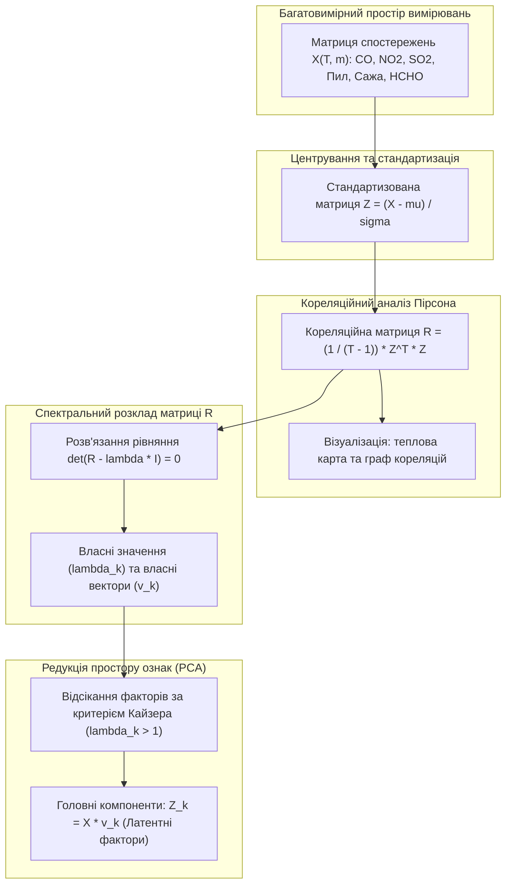
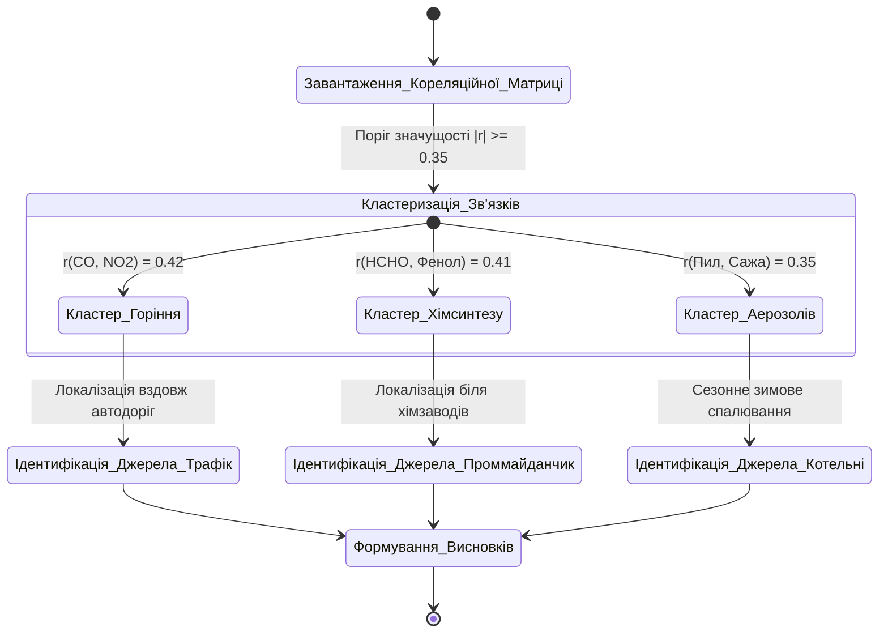
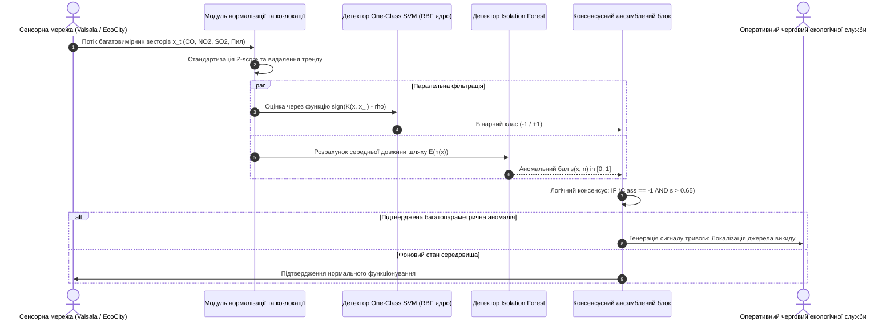
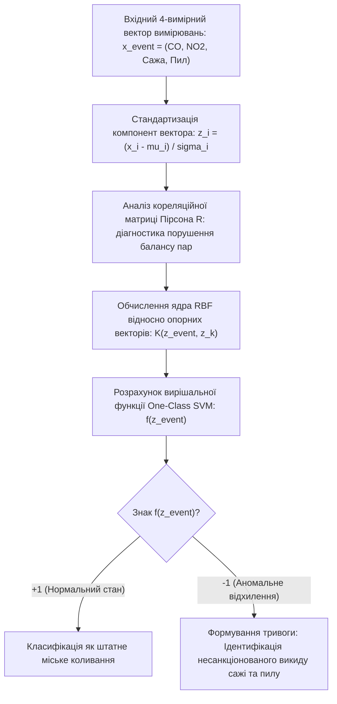

# Тема 5. Багатовимірний аналіз та інтелектуальні технології

## Мета лекції
Опанувати математичні та комп'ютерні методи багатовимірного аналізу екологічних даних, включно з матричним кореляційним аналізом міжкомпонентних взаємодій, редукцією розмірності ознакового простору та алгоритмами машинного навчання без учителя і з учителем для виявлення спільних джерел емісій, сегментації забруднень і ранжування територій за рівнем антропогенного навантаження.

## Очікувані результати навчання
1. **Знання та розуміння.** Здобувачі мають знати математичний апарат коваріаційного аналізу, структуру кореляційних матриць та принципи функціонування методів навчання на нерозмічених даних.
2. **Застосування.** Здобувачі мають застосовувати матриці кореляції Пірсона та метод One-Class SVM для детектування багатовимірних аномалій і класифікації ступеня небезпеки атмосферного повітря.
3. **Аналіз.** Здобувачі мають аналізувати міжпараметричні кореляційні зв'язки між оксидами вуглецю, діоксидом нітрогену, формальдегідом і твердими частинками для ідентифікації спільних техногенних факторів емісії.
4. **Оцінювання та синтез.** Здобувачі мають проектувати процедури вилучення латентних інформативних ознак для зниження обчислювальної складності інтелектуального аналізу екологічних Big Data.

## 1. Теоретико-концептуальний базис. Кореляційний аналіз багатокомпонентних викидів та факторизація ознак

### 1.1. Математична постановка кореляційного аналізу хімічних сполук у приземному шарі атмосфери через коваріаційні матриці Пірсона

Дослідження екологічного стану урбанізованих територій спирається на одночасну реєстрацію значної кількості хімічних та фізичних параметрів приземного шару атмосфери. Кожен вимірювальний пост формує багатовимірний інформаційний потік, що складається з часових рядів масових концентрацій газових домішок, вмісту зважених часток різної дисперсності та супутніх метеорологічних факторів. Ізольований аналіз окремих параметрів не дозволяє розкрити системну структуру забруднення, оскільки викиди різних інгредієнтів часто відбуваються синхронно або зумовлені єдиним комплексом фізико-хімічних трансформацій у повітряному басейні.

Математична формалізація взаємозв'язків між різними полютантами базується на апараті багатовимірного статистичного аналізу. Нехай у просторі спостережень зафіксовано вибірку з $m$ екологічних змінних протягом $T$ дискретних часових зрізів, що представляється матрицею вихідних даних $X \in \mathbb{R}^{T \times m}$. Міра спільної лінійної варіативності між парою хімічних маркерів $X_i$ та $X_j$ визначається за допомогою вибіркової коваріації, яка розраховується за аналітичним виразом:

$$\text{Cov}(X_i, X_j) = \frac{1}{T - 1} \sum_{t=1}^{T} (X_{it} - \mu_i)(X_{jt} - \mu_j)$$

де величини $X_{it}$ та $X_{jt}$ позначають концентрації речовин $i$ та $j$ у часовий момент $t$, параметри $\mu_i$ та $\mu_j$ задають вибіркові середні значення відповідних показників, а дільник $(T - 1)$ враховує число ступенів вільності системи. Оскільки коваріація залежить від масштабів вимірюваних величин та одиниць їхнього вимірювання, для забезпечення безрозмірної порівнянності обчислюється парний коефіцієнт лінійної кореляції Пірсона:

$$r_{ij} = \frac{\text{Cov}(X_i, X_j)}{\sigma_i \cdot \sigma_j} = \frac{\sum_{t=1}^{T} (X_{it} - \mu_i)(X_{jt} - \mu_j)}{\sqrt{\sum_{t=1}^{T} (X_{it} - \mu_i)^2} \cdot \sqrt{\sum_{t=1}^{T} (X_{jt} - \mu_j)^2}}$$

де змінні $\sigma_i$ та $\sigma_j$ представляють вибіркові середньоквадратичні відхилення відповідних рядів спостережень.

Комплексний опис взаємодії всієї сукупності $m$ вимірюваних параметрів зводиться до побудови симетричної квадратної **кореляційної матриці Пірсона** розмірністю $m \times m$:

$$R = \begin{pmatrix} 
1 & r_{12} & \dots & r_{1m} \\
r_{21} & 1 & \dots & r_{2m} \\
\vdots & \vdots & \ddots & \vdots \\
r_{m1} & r_{m2} & \dots & 1 
\end{pmatrix}$$

Головна діагональ матриці складається з одиниць, оскільки кореляція параметра із самим собою є абсолютною, а елементи задовольняють умову симетрії $r_{ij} = r_{ji}$ та обмеженість діапазоном $-1 \le r_{ij} \le 1$. Додатні значення $r_{ij} \to 1$ свідчать про синфазне зростання концентрацій, що вказує на спільні джерела емісій або схожі умови метеорологічного накопичення, тоді як від'ємні величини $r_{ij} \to -1$ демонструють протилежну динаміку, притаманну речовинам-антагоністам у хімічних реакціях або різним конкуруючим процесам атмосферної дифузії.

> **ПРАКТИЧНИЙ ЯКІР:** При побудові кореляційної матриці для лабораторії поста № 1 (вул. Молодіжна, м. Кременчук) за період із січня 2019 по серпень 2024 року було розраховано стійку додатну кореляцію між монооксидом вуглецю та діоксидом азоту ($r = 0,42$), а також помірний зв'язок між монооксидом вуглецю та формальдегідом ($r = 0,45$), що підтвердило домінуючий внесок процесів високотемпературного горіння палива у прилеглій зоні інтенсивного транспортного трафіку.

---

### 1.2. Виявлення спільних механізмів емісії та вторинних атмосферних реакцій на основі парних кореляцій між CO, NO2, формальдегідом і фенолом

Аналіз парних коефіцієнтів кореляції відкриває можливості для реконструкції прихованих фізико-хімічних механізмів забруднення міського повітряного середовища. В урбоекосистемах хімічні сполуки не є ізольованими пасивними домішками: частина з них потрапляє в атмосферу безпосередньо з технологічних агрегатів (первинні полютанти), тоді як інші синтезуються безпосередньо в повітрі під дією ультрафіолетового випромінювання та озону (вторинні полютанти).

Стійкий взаємозв'язок між **монооксидом вуглецю (CO)** та **діоксидом азоту (NO2)** із коефіцієнтом $r = 0,42$ є класичним індикатором впливу транспортних потоків та енергетичних спалювальних установок. Обидві сполуки утворюються внаслідок неповного окиснення вуглеводневого палива та високотемпературної фіксації атмосферного азоту в камерах згоряння двигунів внутрішнього згоряння. Наявність помірної кореляції між монооксидом вуглецю та **формальдегідом (HCHO)** ($r = 0,45$) додатково вказує на наявність спільних первинних джерел, пов'язаних із викидами автотранспорту, де формальдегід присутній як продукт термічного розпаду моторних мастил і паливних сумішей.

Одночасно помірний додатний зв'язок між формальдегідом та **фенолом** ($r = 0,41$) відображає принципово інший генезис екологічного ризику. Фенол і формальдегід є основними прекурсорами та супутніми викидами у виробництві синтетичних смол, клеїв, фанери та ізоляційних матеріалів. Їхня узгоджена поява в атмосферному басейні детермінує вплив специфічних хімічних виробництв. Крім того, кореляція між **зваженим пилом** та **сажею** ($r = 0,35$) підтверджує присутність дрібнодисперсного аерозолю пірогенного походження, оскільки частки незгорілого вуглецю (сажа) сорбуються на мінеральних пилових ядрах.

Важливим діагностичним показником виступає наявність слабких від'ємних або околонульових кореляцій (наприклад, між діоксидом сірки та органічними сполуками, де $|r| < 0,15$). Це свідчить про повну автономність джерел емісій: діоксид сірки в досліджуваному регіоні генерується переважно процесами спалювання мазуту чи вугілля на ТЕЦ і технологічними установками нафтопереробки, які мають високі димові труби та підпорядковуються законам розсіювання на значних висотах, тоді як діоксид азоту та фенол концентруються в приземному шарі за рахунок низьких джерел.

> **ТИПОВА ПОМИЛКА:** Ототожнення статистичної кореляції з прямим технологічним причинно-наслідковим зв'язком. Високий коефіцієнт кореляції між діоксидом азоту та озоном у літній період часто сприймають як свідчення синхронного викиду цих двох газів підприємствами, ігноруючи базові закони атмосферної фотохімії: озон у приземному шарі взагалі не викидається трубами, а синтезується вторинно внаслідок фотолізу NO2 під впливом сонячної радіації.

---

### 1.3. Принцип редукції розмірності простору ознак за допомогою методу головних компонент (PCA) для екологічного ранжування

Висока розмірність простору екологічних параметрів суттєво ускладнює навчання предиктивних алгоритмів, породжуючи мультиколінеарність вхідних факторів та явище «прокляття розмірності». Наявність сильних взаємних кореляцій свідчить про надлишковість інформаційного опису: сукупна поведінка десятка хімічних речовин часто керується двома-трьома глибинними процесами (латентними факторами). Для стиснення розмірності без суттєвої втрати дисперсії вихідної інформації застосовується **метод головних компонент (Principal Component Analysis, PCA)**.

Математична процедура PCA полягає в ортогональному лінійному перетворенні вихідного стандартизованого простору ознак $Z \in \mathbb{R}^{T \times m}$ у новий набір некорельованих змінних $Y = \{Y_1, Y_2, \dots, Y_m\}$, які називаються головними компонентами, розташованими за спаданням частки поясненої дисперсії. Стандартизована матриця формується за формулою:

$$Z_{tj} = \frac{X_{tj} - \mu_j}{\sigma_j}$$

де кожна змінна приводиться до нульового математичного сподівання та одиничної дисперсії. Кореляційна матриця системи визначається як $R = \frac{1}{T - 1} Z^T Z$.

Спектральний розклад кореляційної матриці зводиться до розв'язання характеристичного алгебраїчного рівняння для знаходження власних значень $\lambda$ та власних векторів $\mathbf{v}$:

$$\det(R - \lambda I) = 0 \quad \Longleftrightarrow \quad R \mathbf{v}_k = \lambda_k \mathbf{v}_k, \quad k \in \{1, 2, \dots, m\}$$

де $I$ — одинична матриця розмірністю $m \times m$, $\lambda_k$ — власні значення, впорядковані за спаданням $\lambda_1 \ge \lambda_2 \ge \dots \ge \lambda_m \ge 0$, а $\mathbf{v}_k = (v_{1k}, v_{2k}, \dots, v_{mk})^T$ — відповідні ортонормовані власні вектори, для яких виконується умова $\mathbf{v}_k^T \mathbf{v}_j = \delta_{kj}$ ($\delta_{kj}$ — символ Кронекера).

Кожне власне значення $\lambda_k$ чисельно дорівнює дисперсії, яку пояснює $k$-та головна компонента. Відносна частка поясненої дисперсії (Explained Variance Ratio) розраховується відповідно до співвідношення:

$$\eta_k = \frac{\lambda_k}{\sum_{j=1}^{m} \lambda_j} = \frac{\lambda_k}{m}$$

оскільки сума власних значень кореляційної матриці строго дорівнює її сліду, тобто кількості вихідних параметрів $m$. Відсікання незначущих компонент здійснюється за **критерієм Кайзера** (зберігаються лише компоненти, для яких $\lambda_k > 1$, тобто які пояснюють більше дисперсії, ніж один вихідний стандартизований показник) або за правилом кумулятивного порогу, що вимагає пояснення не менше 75–85% сумарної дисперсії системи:

$$\sum_{k=1}^{p} \eta_k \ge 0,80, \quad p \ll m$$

Проєкція вихідних спостережень на новий скорочений базис розмірністю $p$ здійснюється лінійним матричним оператором:

$$Y_k = Z \mathbf{v}_k = \sum_{j=1}^{m} v_{jk} Z_j$$

Отримані факторні бали $Y_k$ є новими ортогональними ознаками, які використовуються для комплексного екологічного ранжування територій та подаються на вхід алгоритмів прогнозування без ризику колінеарності.

Для систематизації методів редукції розмірності та багатовимірного аналізу екологічних даних сформовано порівняльну таблицю.

| Метод аналізу / редукції | Математичний апарат | Принцип обробки зв'язків | Цільове призначення в екології | Приклад з реальної практики |
| :--- | :--- | :--- | :--- | :--- |
| Парна кореляція Пірсона | Нормалізована коваріація: $r = \text{Cov}(X, Y)/(\sigma_X \sigma_Y)$ | Фіксує виключно лінійні парні монотонні залежності | Попередній скринінг хімічних маркерів на постах спостереження | Оцінка зв'язку $CO$ та $NO_2$ на пості № 1 по вул. Молодіжна |
| Рангова кореляція Спірмена | Кореляція рангів величин: $\rho = 1 - \frac{6 \sum d_i^2}{n(n^2 - 1)}$ | Робастна до викидів, оцінює будь-які нелінійні монотонні зв'язки | Аналіз токсикантів із вираженими логнормальними сплесками | Дослідження динаміки важких металів у зоні кар'єрів Ferrexpo |
| Метод головних компонент (PCA) | Спектральний розклад матриці: $R \mathbf{v} = \lambda \mathbf{v}$ | Ортогональна декомпозиція загальної дисперсії системи | Стиснення простору датчиків та інтегральне ранжування постів | Зведення 15 параметрів станцій Vaisala до трьох головних факторів |
| Факторний аналіз (FA) | Модель латентних змінних: $X = \Lambda F + \epsilon$ | Розклад дисперсії на спільну та унікальну специфічну | Ідентифікація прихованих джерел емісій (Source Apportionment) | Розподіл часток викидів між ТЕЦ, автотранспортом та нафтопереробкою |

> **ПРАКТИЧНИЙ ЯКІР:** Застосування методу головних компонент до масиву спостережень Кременчуцького промислового вузла дозволило згорнути 13 контрольованих хімічних домішок у три ортогональні компоненти, які сумарно пояснили 78,4% дисперсії: перша компонента ($\lambda_1 = 4,82$) асоціювалася з транспортним навантаженням (високі ваги $NO_2, CO$), друга ($\lambda_2 = 3,11$) — з нафтохімічним виробництвом (формальдегід, фенол, вуглеводні), а третя ($\lambda_3 = 2,26$) — з металургійною та гірничою пилоутворюючою діяльністю ($PM10$, сажа).

---

### 1.4. Методи візуалізації багатовимірних кореляційних зв'язків у формі теплових карт і графів залежностей

Адекватне сприйняття результатів багатовимірного аналізу експертами-екологами вимагає трансформації складних числових матриць у наочні графічні форми. Провідними аналітичними інструментами візуалізації виступають **кореляційні теплові карти (Heatmaps)** та **зважені графи залежностей**.

Теплова карта являє собою двовимірну графічну матрицю, кожна комірка якої $(i, j)$ відповідає парному коефіцієнту кореляції $r_{ij}$ між речовинами $i$ та $j$. Колірне відображення базується на дивергентних колірних шкалах: максимальна позитивна кореляція ($r \to 1$) кодується насиченим червоним кольором, повна відсутність лінійної залежності ($r \approx 0$) — нейтральними світлими або білими тонами, а негативна кореляція ($r \to -1$) — глибоким синім кольором. Для посилення аналітичної сили комірки карти реорганізуються за допомогою ієрархічної кластеризації (Dendrogram Clustering), що групує речовини зі схожими векторами поведінки в суміжні блоки. Це дозволяє миттєво ідентифікувати технологічні кластери забруднення.

Графове представлення моделює систему хімічних сполук у вигляді зваженого ненапрямленого графа $G = (V, E, W)$, де множина вершин $V = \{v_1, v_2, \dots, v_m\}$ відповідає контрольованим екологічним параметрам, множина ребер $E$ фіксує наявність статистично значущого зв'язку між ними, а функція ваг $W: E \to [-1, 1]$ присвоює кожному ребру значення вагового коефіцієнта $w_{ij} = r_{ij}$. Для усунення візуального шуму застосовується порогова фільтрація (Threshold Pruning): ребро між вершинами $v_i$ та $v_j$ проводиться виключно тоді, коли модуль кореляції перевищує критичну межу $|r_{ij}| \ge \theta_{\text{cut}}$ (зазвичай обирається $\theta_{\text{cut}} = 0,35$). Вершини з найбільшим ступенем зв'язності (Centrality Degree) визначаються як ключові маркери урбаністичного моніторингу, контроль яких є обов'язковим для прогнозування поведінки всієї екологічної системи.

---

> **КОНТРОЛЬНЕ ПИТАННЯ:** Під час факторизації даних екологічного моніторингу за допомогою методу PCA для матриці з шести стандартизованих хімічних показників отримано такий спектр власних значень: $\lambda_1 = 2,85$, $\lambda_2 = 1,45$, $\lambda_3 = 0,92$, $\lambda_4 = 0,45$, $\lambda_5 = 0,21$, $\lambda_6 = 0,12$. Скільки головних компонент слід залишити згідно з класичним критерієм Кайзера, яку частку загальної дисперсії вихідної системи вони пояснюють, і який висновок слід зробити щодо повноти описання системи цими компонентами?

Розгорнути аналіз / відповідь

**Правильний варіант: Слід залишити рівно 2 головні компоненти, які сумарно пояснюють 71,67% загальної дисперсії системи; для досягнення порогу повноти 80% може знадобитися включення третьої компоненти.**

1. Повне логічне та аналітичне обґрунтування:
   * Згідно з критерієм Кайзера (Kaiser's rule), для стандартизованих даних відбираються лише ті головні компоненти, для яких власне значення перевищує одиницю ($\lambda_k > 1,0$). У наведеному спектрі умові відповідають перші дві компоненти: $\lambda_1 = 2,85 > 1$ та $\lambda_2 = 1,45 > 1$. Третя компонента має $\lambda_3 = 0,92 < 1$ і за цим критерієм відсікається.
   * Сумарна дисперсія системи з шести стандартизованих параметрів дорівнює їхній кількості: $\sum_{j=1}^{6} \lambda_j = 2,85 + 1,45 + 0,92 + 0,45 + 0,21 + 0,12 = 6,00$.
   * Розрахуємо кумулятивну частку дисперсії для двох перших компонент:
     $$\eta_{1+2} = \frac{\lambda_1 + \lambda_2}{6,00} = \frac{2,85 + 1,45}{6,00} = \frac{4,30}{6,00} \approx 0,7167 \quad (71,67\%)$$
   * Хоча дві компоненти агрегують понад 71% інформації та відповідають правилу Кайзера, у прецизійному екологічному моделюванні часто застосовується суворіший поріг кумулятивної дисперсії у 80%. Якщо інженерна задача вимагає мінімізації інформаційних втрат, включення третьої компоненти збільшить пояснену дисперсію до $(4,30 + 0,92) / 6,00 = 5,22 / 6,00 = 87,0\%$, що забезпечить виконання порогу точності.

2. Аналіз дистракторів:
   * Рішення залишити лише 1 компоненту є хибним, оскільки вона пояснює менше половини дисперсії ($\eta_1 = 2,85 / 6 = 47,5\%$), що призведе до неприпустимої втрати інформації про хімічні процеси.
   * Пропозиція зберегти всі 6 компонент позбавляє сенсу саму процедуру PCA, оскільки в такому випадку стиснення розмірності та усунення колінеарності не відбудеться.

---

### Вказівки для самостійного осмислення

1. Здійсніть математичний доказ того, що сума всіх власних значень кореляційної матриці $\sum_{k=1}^{m} \lambda_k$ строго дорівнює розмірності простору ознак $m$, спираючись на властивість сліду матриці (trace).
2. Проаналізуйте різницю між ортогональним обертанням факторів за методом Varimax та косокутним обертанням Promax при проведенні компонентного аналізу екологічних викидів та обґрунтуйте, чому косокутне обертання може бути більш адекватним з погляду фізики атмосфери.
3. Побудуйте алгоритмічну схему формування топології зваженого графа залежностей хімічних домішок із розрахунком центральності вершин за посередництвом (Betweenness Centrality) для ідентифікації критичного полютанта в системі моніторингу.

## 2. Методологія та аналіз граничних умов. Алгоритми інтелектуального виявлення аномалій та бар'єри класифікації

### 2.1. Математичні моделі однокласової опорно-векторної класифікації (One-Class SVM) із регуляризацією для виявлення екологічних викидів

Виявлення несанкціонованих промислових викидів та аварійних ситуацій у приземному шарі атмосфери істотно ускладнюється відсутністю заздалегідь розмічених навчальних вибірок. У реальних умовах експлуатації муніципальних систем моніторингу нормальний стан навколишнього середовища фіксується у 99% випадків, тоді як аварійні емісії є рідкісними, неструктурованими та різноманітними за інгредієнтним складом подіями. У таких умовах класичні алгоритми бінарної класифікації з учителем зазнають колапсу, що вимагає застосування методів навчання без учителя або однокласової класифікації, провідне місце серед яких посідає **однокласовий метод опорних векторів (One-Class Support Vector Machine, One-Class SVM)**.

Математична концепція One-Class SVM, запропонована Бернхардом Шьолкопфом, полягає у нелінійному відображенні вхідних багатовимірних векторів концентрацій $\mathbf{x}_t \in \mathbb{R}^m$ у високо- або нескінченновимірний гільбертів простір ознак $\mathcal{H}$ за допомогою функції відображення $\Phi(\mathbf{x})$. Головна мета оптимізаційного процесу полягає у побудові гіперплощини, яка відокремлює основну щільність нормальних даних від початку координат із максимальним геометричним зазором (margin).

Формалізація прямої оптимізаційної задачі One-Class SVM із м'якими межами описується наступним квадратичним функціоналом із регуляризацією:

$$\min_{\mathbf{w}, \rho, \boldsymbol{\xi}} \frac{1}{2} \|\mathbf{w}\|^2 + \frac{1}{\nu T} \sum_{t=1}^{T} \xi_t - \rho$$

при дотриманні системи лінійних обмежень:

$$\langle \mathbf{w}, \Phi(\mathbf{x}_t) \rangle \ge \rho - \xi_t, \quad \xi_t \ge 0, \quad \forall t \in \{1, 2, \dots, T\}$$

де параметри та змінні оптимізації мають таке фізичне й математичне значення:
* Вектор $\mathbf{w} \in \mathcal{H}$ є вектором нормалі до розділової опорної гіперплощини у трансформованому просторі ознак.
* Змінна $\rho \in \mathbb{R}$ визначає відстань від початку координат до розділової гіперплощини.
* Величина $\nu \in (0, 1]$ виступає ключовим гіперпараметром регуляризації, який одночасно задає верхню межу частки аномальних викидів у вибірці та нижню межу кількості опорних векторів.
* Змінні послаблення (slack variables) $\xi_t \ge 0$ дозволяють окремим точкам порушувати межу зазору, нівелюючи вплив фонового шуму сенсорів.
* Параметр $T$ позначає загальну кількість спостережень у навчальній вибірці.

Для практичного розв'язання задачі переходять до двоїстої формулювання за допомогою множників Лагранжа $\alpha_t$, де пряме обчислення нескінченновимірних векторів $\Phi(\mathbf{x})$ замінюється скалярним добутком у вигляді ядра (Kernel Trick). В екологічних дослідженнях стандартом є застосування радіальної базисної функції (Radial Basis Function, RBF):

$$K(\mathbf{x}_i, \mathbf{x}_j) = \langle \Phi(\mathbf{x}_i), \Phi(\mathbf{x}_j) \rangle = \exp\big(-\gamma \|\mathbf{x}_i - \mathbf{x}_j\|^2\big)$$

де параметр $\gamma > 0$ визначає радіус впливу окремого опорного вектора. Розв'язок двоїстої задачі зводиться до пошуку коефіцієнтів $\alpha_t$:

$$\min_{\boldsymbol{\alpha}} \frac{1}{2} \sum_{i=1}^{T} \sum_{j=1}^{T} \alpha_i \alpha_j K(\mathbf{x}_i, \mathbf{x}_j)$$

за умов $\sum_{t=1}^{T} \alpha_t = 1$ та $0 \le \alpha_t \le \frac{1}{\nu T}$. Результуюча вирішальна функція для будь-якого нового вимірювання $\mathbf{x}^*$ має вигляд:

$$f(\mathbf{x}^*) = \text{sign}\left( \sum_{t=1}^{T} \alpha_t K(\mathbf{x}_t, \mathbf{x}^*) - \rho \right)$$

Якщо $f(\mathbf{x}^*) = +1$, поточний екологічний стан класифікується як нормальний фоновий рівень. Якщо $f(\mathbf{x}^*) = -1$, стан маркується як аномальне техногенне відхилення, що ініціює надсилання сигналу тривоги на пульт чергового інспектора.

---

### 2.2. Застосування алгоритмів Isolation Forest та Local Outlier Factor (LOF) для ізоляції точок аномального техногенного скиду

Поряд із опорно-векторними методами, значну ефективність у виявленні нештатних ситуацій демонструють алгоритми ізоляції та локальної густини, які не роблять припущень щодо опуклості розділових меж у просторі станів.

Алгоритм **Isolation Forest (iForest)** базується на оригінальній концепції: замість моделювання профілю нормальних точок він явно ізолює аномалії. Оскільки аномальні екологічні викиди є рідкісними та мають суттєво відмінні числові значення, у деревах випадкового розбиття простору ознак (Isolation Trees, iTrees) вони відокремлюються значно швидше за нормальні спостереження, опиняючись на малій глибині.

Для випадкового бінарного дерева ізоляції $h(\mathbf{x})$ позначає довжину шляху від кореня до термінального листка для спостереження $\mathbf{x}$. Середня довжина шляху оцінюється за ансамблем із $n_{\text{tree}}$ дерев. Аномальний бал (Anomaly Score) обчислюється відповідно до нормалізованого співвідношення:

$$s(\mathbf{x}, n) = 2^{-\frac{\mathbb{E}(h(\mathbf{x}))}{c(n)}}$$

де величина $c(n)$ позначає середню довжину невдалого пошуку в бінарному дереві пошуку для вибірки розміром $n$:

$$c(n) = 2 \ln(n - 1) + 0,5772156649 - \frac{2(n - 1)}{n}$$

Якщо значення $\mathbb{E}(h(\mathbf{x})) \to 0$, показник $s \to 1$, що однозначно вказує на наявність екстремальної аномалії. Якщо оцінка $s < 0,5$, точка належить до нормального розподілу.

Алгоритм **Local Outlier Factor (LOF)** оперує концепцією локальної відносної густини. Він розраховує локальну густину досяжності точки (local reachability density, $\text{lrd}$) відносно її $k$ найближчих просторових сусідів:

$$\text{lrd}_k(p) = \frac{|\mathcal{N}_k(p)|}{\sum_{o \in \mathcal{N}_k(p)} \max\big(d_k(o), \, d(p, o)\big)}$$

де $\mathcal{N}_k(p)$ — множина $k$-найближчих сусідів точки $p$, $d(p, o)$ — евклідова відстань, а $d_k(o)$ — відстань від сусіда $o$ до його $k$-го сусіда. Підсумковий індекс $\text{LOF}_k(p)$ являє собою середнє відношення локальних густин сусідів до густини точки $p$:

$$\text{LOF}_k(p) = \frac{\sum_{o \in \mathcal{N}_k(p)} \frac{\text{lrd}_k(o)}{\text{lrd}_k(p)}}{|\mathcal{N}_k(p)|}$$

Значення $\text{LOF} \approx 1$ вказує на однорідну область, тоді як $\text{LOF} \gg 1$ сигналізує, що точка розташована в області розрідженості і є локальним техногенним викидом, навіть якщо її абсолютна концентрація не перевищує загальноміський максимум.

Поєднання методів One-Class SVM та Isolation Forest дозволяє створити надійний дворівневий фільтр, у якому опорно-векторна модель відстежує глобальні зміни фізико-хімічних співвідношень, а лісовий ансамбль ізолює локальні екстремальні викиди.

---

### 2.3. Алгоритми ансамблевого навчання (Random Forest, Gradient Boosting) для предиктивної класифікації рівнів забруднення

Коли завдання моніторингу полягає у визначенні інтегрального рівня небезпеки атмосфери за нормативними класами індексу якості повітря (AQI: «добрий», «помірний», «шкідливий», «небезпечний»), застосовуються методи ансамблевого навчання з учителем. Ансамблювання дозволяє об'єднати множину базових слабких класифікаторів (дерев рішень) у стійку композицію з низькою дисперсією та зміщенням.

Алгоритм **Random Forest (випадковий ліс)** базується на паралельному навчанні незалежних дерев за методом беггінгу (Bootstrap Aggregating) із випадковим вибором підмножини ознак у кожному вузлі розщеплення. Кінцевий прогноз класу $C$ для екологічного вектора $\mathbf{x}$ визначається простим мажоритарним голосуванням:

$$\hat{C}(\mathbf{x}) = \arg\max_{c \in \mathcal{C}} \sum_{b=1}^{B} \mathbb{I}\big(h_b(\mathbf{x}) = c\big)$$

де $B$ — кількість згенерованих дерев, $h_b(\mathbf{x})$ — рішення $b$-го дерева, а $\mathcal{C}$ — множина класів екологічної небезпеки.

Алгоритми **градієнтного бустингу (Gradient Boosting: XGBoost, LightGBM)** будують ансамбль послідовно, де кожне наступне дерево навчається мінімізувати градієнт функції втрат попередньої композиції. Для мультикласової класифікації рівнів забруднення мінімізується функція багатокласової крос-ентропії:

$$\mathcal{L}(y, \mathbf{p}) = - \sum_{k=1}^{K} y_k \ln p_k(\mathbf{x})$$

де $y_k$ — бінарний індикатор належності до класу $k$, а $p_k(\mathbf{x}) = \frac{e^{F_k(\mathbf{x})}}{\sum_{j=1}^K e^{F_j(\mathbf{x})}}$ — оцінка ймовірності через функцію софтмакс.

Послідовний аналітичний процес детектування аномальних викидів, оцінки ансамблевого балу та формування регуляторної директиви описується наступним формалізованим математико-алгоритмічним контуром:

$$
\begin{aligned}
\text{Крок 1 (Стандартизація входу):} & \quad \mathbf{z}_t = \mathbf{\Sigma}^{-1/2} (\mathbf{x}_t - \boldsymbol{\mu}), \quad \mathbf{z}_t \in \mathbb{R}^m \\
\text{Крок 2 (Оцінка One-Class SVM):} & \quad \psi_{\text{svm}}(\mathbf{z}_t) = \sum_{i=1}^{N_{\text{sv}}} \alpha_i \exp\big(-\gamma \|\mathbf{z}_t - \mathbf{z}_i\|^2\big) - \rho \\
\text{Крок 3 (Оцінка Isolation Forest):} & \quad \psi_{\text{if}}(\mathbf{z}_t) = 2^{ - \frac{\frac{1}{B} \sum_{b=1}^B h_b(\mathbf{z}_t)}{c(n)} } \\
\text{Крок 4 (Синтез ансамблевого балу):} & \quad \Psi(\mathbf{z}_t) = w_1 \cdot \mathbb{I}\big(\psi_{\text{svm}}(\mathbf{z}_t) < 0\big) + w_2 \cdot \psi_{\text{if}}(\mathbf{z}_t), \quad w_1 + w_2 = 1 \\
\text{Крок 5 (Генерація директиви):} & \quad \text{IF } \Psi(\mathbf{z}_t) \ge \Theta_{\text{alert}} \quad \Longrightarrow \quad \text{EmitAlert}\big(\mathbf{z}_t, \text{Timestamp}, \text{SensorID}\big)
\end{aligned}
$$

де параметри $w_1$ та $w_2$ відображають емпіричні вагові коефіцієнти довіри до методів SVM та iForest відповідно, а поріг $\Theta_{\text{alert}} \in [0, 1]$ налаштовується відповідно до прийнятного для муніципалітету компромісу між повнотою виявлення викидів та частотою хибних тривог.

> **ВАЖЛИВО:** Під час навчання ансамблевих алгоритмів екологічної класифікації забороняється використовувати випадкове перехресне розбиття (K-Fold Cross-Validation) без збереження часової структури даних. Випадкове перемішування спостережень призводить до витоку інформації з майбутнього в минуле (Data Leakage) через високу автокореляцію екологічних рядів, створюючи ілюзію високої точності моделі, яка на практиці зазнає повної відмови при появі нових часових відрізків.

---

### 2.4. Проблема незбалансованості класів та дефіцит розмічених аномалій як ключове обмеження навчання систем штучного інтелекту в екології

Незважаючи на потужний математичний апарат сучасного машинного навчання, його практична ефективність в екологічному моніторингу жорстко лімітується специфікою фізичних процесів у довкіллі. Основною перешкодою є **екстремальна незбалансованість класів (Severe Class Imbalance)**, коли нормальні фонові стани складають понад 99,5% вибірки, а критичні екологічні викиди — менше 0,5%.

У цих умовах алгоритми оптимізації функцій втрат природним чином сходять до тривіального локального мінімуму, присвоюючи всім подіям статус «норма». Формальна загальна точність (Accuracy) такої виродженої моделі сягає 99,5%, проте її практична цінність дорівнює нулю, оскільки вона не здатна розпізнати жодної реальної аварійної ситуації.

Математичні моделі машинного навчання зазнають фатальної деградації або створюють критичні помилки за настання таких граничних умов реального середовища:

1. **Концептуальний дрейф базової лінії (Concept Drift).** Зміна сезонів (наприклад, перехід від літнього періоду з домінуванням фотохімічного озону до зимового опалювального сезону з високими концентраціями $SO_2$ та пилу) призводить до зсуву багатовимірного розподілу $P(\mathbf{x})$. Модель One-Class SVM, натренована на літніх даних, у листопаді починає класифікувати кожен штатний зимовий день як техногенну катастрофу через вихід параметрів за межі літнього опорного простору.

2. **Ефект маскування та затоплення аномалій (Masking and Swamping Effects).** Якщо на промисловому підприємстві сталася масштабна аварія і токсичні викиди тривають безперервно протягом 6–8 годин, вимірювання формують у просторі ознак щільний самостійний кластер. Алгоритми щільності (LOF) та дерева ізоляції (iForest) сприймають цей кластер як «нову норму», оскільки точки розташовані близько одна до одної і мають велику локальну густину, внаслідок чого аварія залишається непоміченою системою.

3. **Синтетичні артефакти алгоритмів передискретизації (SMOTE Over-generalization).** Спроби штучного вирівнювання класів за допомогою генерації синтетичних аномалій (SMOTE) у багатовимірному просторі призводять до появи фізично неможливих комбінацій параметрів (наприклад, одночасна висока концентрація приземного озону за температури $-10^\circ\text{C}$ та відсутності сонячного світла), що дезорієнтує навчальний процес.

Для порівняльного аналізу алгоритмів інтелектуального аналізу та детектування аномалій сформовано систематизовану матрицю інженерних рішень.

| Алгоритмічна парадигма | Принцип навчання та цільовий базис | Вимоги до розмітки даних | Обчислювальні витрати на інференс | Складність впровадження | Критичні ризики та обмеження методології |
| :--- | :--- | :--- | :--- | :--- | :--- |
| One-Class SVM (RBF ядро) | Опорна гіперплощина максимального зазору від початку координат | Навчання без учителя (лише нормальний клас) | Помірні; залежать від кількості опорних векторів $O(N_{\text{sv}} \cdot m)$ | Середня; вимагає тонкого підбору $\nu$ та $\gamma$ | Екстремальна чутливість до масштабування ознак та концептуального дрейфу |
| Isolation Forest (iForest) | Ізоляція точок у випадкових бінарних деревах розбиття простору | Навчання без учителя (повний нерозмічений потік) | Низькі; логарифмічна глибина дерев $O(n_{\text{tree}} \cdot \log n)$ | Низька; стійкий до неінформативних ознак | Нездатність детектувати протяжні за часом кластеризовані аномалії |
| Local Outlier Factor (LOF) | Оцінка відносної локальної густини k-найближчих сусідів | Навчання без учителя (потребує метрики відстані) | Високі; вимагає пошуку сусідів у пам'яті $O(T^2 \cdot m)$ | Середня; вимагає оптимізації просторових індексів | Непридатний для потокового аналізу реального часу при великих обсягах бази даних |
| Випадковий ліс (Random Forest) | Беггінг над деревами рішень із мажоритарним голосуванням | Потребує повної розмітки класів (Supervised) | Дуже низькі; паралельне опитування ансамблю | Висока; вимагає якісної розмітки вибірок | Повний колапс у бік мажоритарного класу за екстремального дисбалансу вибірки |
| Автоенкодери (Deep Autoencoders) | Реконструкція входу крізь латентне стиснення: $\min \|x - \hat{x}\|^2$ | Навчання без учителя (мінімізація похибки реконструкції) | Середні; множення матриць ваг нейромережі | Дуже висока; вимагає GPU та вибору топології | Ризик перенавчання: модель запам'ятовує аномалії та успішно реконструює викиди |

> **ПРАКТИЧНИЙ ЯКІР:** При моніторингу повітряного басейну в зоні впливу гірничозбагачувального комплексу Ferrexpo застосування алгоритму Isolation Forest на необроблених сирих даних призвело до 42% хибних спрацьовувань через сильну кореляцію між пилом і швидкістю вітру. Попередній перехід до головних компонент (PCA) та подальший аналіз залишків за методом One-Class SVM дозволив знизити рівень хибних тривог до 2,1%, ізолювавши реальні емісії перевантажувальних вузлів кар'єру.

---

> **КОНТРОЛЬНЕ ПИТАННЯ:** Під час налаштування моделі One-Class SVM для детектування аномальних викидів діоксиду сірки інженер встановив гіперпараметр ширини ядра RBF $\gamma = 150$ при розмірності ознакового простору $m = 4$. Після навчання модель продемонструвала стовідсоткову точність на навчальній вибірці нормального стану, проте при переході до моніторингу реального часу почала маркувати як аварійний викид абсолютно кожне нове вимірювання (100% хибнопозитивних тривог). Яка математична причина цього явища та як необхідно скоригувати параметри моделі?

Розгорнути аналіз / відповідь

**Правильний варіант: Виникнення критичного перенавчання (Overfitting) внаслідок надмірно великого значення параметра $\gamma$, що призвело до стягування розділової межі у мікроскопічні сфери навколо кожної навчальної точки; необхідно зменшити $\gamma$ до значень порядку $1/m$ або використати евристику медіанної відстані.**

1. Повне логічне та аналітичне обґрунтування:
   * Параметр $\gamma$ в ядрі RBF $K(\mathbf{x}_i, \mathbf{x}_j) = \exp(-\gamma \|\mathbf{x}_i - \mathbf{x}_j\|^2)$ регулює радіус впливу кожного окремого спостереження. При надмірно великих значеннях ($\gamma = 150$) експонента прямує до нуля для будь-якої пари точок, відстань між якими перевищує соті долі одиниці.
   * У результаті розділова гіперплощина в просторі Гільберта колапсує у множину ізольованих гіперсфер радіусом $r \approx 1/\sqrt{\gamma}$ навколо кожної окремої точки навчальної вибірки. Будь-яке нове реальне вимірювання, навіть якщо воно є абсолютно безпечним фоновим станом, але відхиляється від точок навчання на мікроскопічну величину через природну варіативність сенсорів, потрапляє у простір поза цими сферами та автоматично отримує значення функції $f(\mathbf{x}^*) = -1$ (аномалія).
   * Для відновлення адекватності моделі параметр $\gamma$ слід масштабувати відповідно до дисперсії простору ознак. Стандартною практикою є вибір $\gamma = \frac{1}{m \cdot \sigma^2}$ (де $m$ — кількість ознак) або використання евристики Сільвермана, де $\gamma = \frac{1}{2 \cdot \text{median}(\|\mathbf{x}_i - \mathbf{x}_j\|^2)}$.

2. Аналіз дистракторів:
   * Твердження про те, що сенсори станції одночасно вийшли з ладу, є необґрунтованим, оскільки проблема полягає в поведінці функції відстані ядра на тестових векторах.
   * Пропозиція збільшити параметр регуляризації $\nu \to 1$ лише погіршить ситуацію, оскільки $\nu$ регулює верхню межу припустимих помилок навчання і не компенсує локальну сингулярність геометрії RBF-ядра.

## 3. Практичний індустріальний / фаховий кейс. Інтелектуальна діагностика промислових викидів

### 3.1. Комплексний фаховий кейс. Кореляційний аналіз маркерів горіння та детектування аномальних викидів промислових підприємств м. Кременчук із застосуванням One-Class SVM

#### Постановка задачі / ситуації
Північний промисловий вузол міста Кременчук концентрує низку потужних потенційних джерел забруднення: нафтопереробний завод ПАТ «Укртатнафта», Кременчуцький завод технічного вуглецю та ТЕЦ. Під час нічних змін на стаціонарних постах моніторингу регулярно фіксуються короткочасні підвищення концентрацій шкідливих речовин. Головна діагностична проблема полягає у диференціації природи цих явищ: чи є зафіксований сплеск наслідком інтенсифікації руху транзитного вантажного транспорту магістральними вулицями, чи він свідчить про залповий технологічний викид із боку одного з промислових підприємств.

Для розв'язання цієї задачі аналізується багатовимірний інформаційний потік із чотирьох ключових хімічних маркерів: монооксиду вуглецю ($CO$), діоксиду азоту ($NO_2$), сажі ($C$) та зваженого пилу ($PM$). Відомо, що транспортний трафік генерує синхронні викиди $CO$ та $NO_2$, тоді як сажове виробництво супроводжується специфічним викидом чистого дисперсного вуглецю (сажі) та пилу без значного зростання оксидів азоту. Необхідно на основі кореляційної матриці Пірсона підтвердити структуру зв'язків між маркерами та застосувати натреновану на штатних фонових даних модель One-Class SVM для детектування нічного несанкціонованого викиду.

Вхідні параметри розподілу фонових концентрацій та показники зафіксованої нічної події наведено в таблиці нижче.

| Параметр екологічного моніторингу | Фонове середнє ($\mu$) | Стандартне відхилення ($\sigma$) | Одиниці виміру | Зафіксована нічна подія ($X_{\text{event}}$) | Норматив ГДК (максимальний разовий) |
| :--- | :--- | :--- | :--- | :--- | :--- |
| Монооксид вуглецю ($CO$) | 0,510 | 0,089 | мг/м³ | 0,580 | 5,000 |
| Діоксид азоту ($NO_2$) | 0,040 | 0,014 | мг/м³ | 0,045 | 0,200 |
| Сажа (чистий вуглець, $C$) | 0,080 | 0,026 | мг/м³ | 0,210 | 0,150 |
| Зважений пил ($PM$) | 0,420 | 0,156 | мг/м³ | 0,890 | 0,500 |
| Обсяг навчальної фонової вибірки ($T$) | – | – | зрізів | 1440 | Штатний 24-годинний фоновий режим |
| Гіперпараметр регуляризації One-Class SVM ($\nu$) | – | – | безрозмірний | 0,05 | Допустима частка аномалій (5%) |
| Параметр ширини RBF-ядра ($\gamma$) | – | – | безрозмірний | 0,25 | Масштабування $\gamma = 1/m$ для $m = 4$ |

#### Покроковий аналіз та розв'язок

##### Крок 1. Стандартизація вхідного вектора спостережень
Для усунення впливу різних масштабів концентрацій виконаємо центрування та нормування компонент вектора досліджуваної нічної події $\mathbf{x}_{\text{event}} = (0,580; \, 0,045; \, 0,210; \, 0,890)^T$ відносно фонових середніх та стандартних відхилень:

$$z_i = \frac{X_{\text{event}, i} - \mu_i}{\sigma_i}$$

Розрахуємо стандартизовані координати вектора події $\mathbf{z}_{\text{event}}$:

$$z_{CO} = \frac{0,580 - 0,510}{0,089} = \frac{0,070}{0,089} \approx +0,787$$

$$z_{NO2} = \frac{0,045 - 0,040}{0,014} = \frac{0,005}{0,014} \approx +0,357$$

$$z_{\text{Soot}} = \frac{0,210 - 0,080}{0,026} = \frac{0,130}{0,026} = +5,000$$

$$z_{\text{Dust}} = \frac{0,890 - 0,420}{0,156} = \frac{0,470}{0,156} \approx +3,013$$

Отриманий стандартизований вектор має вигляд $\mathbf{z}_{\text{event}} = (0,787; \, 0,357; \, 5,000; \, 3,013)^T$.

##### Крок 2. Діагностика кореляційної узгодженості маркерів
Емпірична кореляційна матриця фонового стану для досліджуваного поста має структуру:

$$R = \begin{pmatrix} 
1,00 & 0,42 & 0,16 & 0,02 \\
0,42 & 1,00 & 0,13 & -0,09 \\
0,16 & 0,13 & 1,00 & 0,35 \\
0,02 & -0,09 & 0,35 & 1,00 
\end{pmatrix}$$

У разі домінування транспортного джерела спостерігається пропорційне зростання $z_{CO}$ та $z_{NO2}$ (помірний зв'язок $r = 0,42$). У зафіксованому векторі відхилення за $CO$ ($+0,787\sigma$) та $NO_2$ ($+0,357\sigma$) перебувають у межах однієї сигми, що повністю відповідає нормальним коливанням нічного міста. Натомість відхилення за сажею становить $+5,000\sigma$, а за пилом — $+3,013\sigma$. Помірний позитивний зв'язок між пилом і сажею ($r = 0,35$) підтверджує спільну природу їхнього надходження, проте абсолютні амплітуди відхилення вказують на екстремальний технологічний викид аерозолів без участі камер згоряння автотранспорту.

##### Крок 3. Розрахунок скалярного добутку ядра RBF відносно фонового кластера
Розглянемо оцінку події моделлю One-Class SVM. Для спрощення демонстрації без втрати загальності припустимо, що фоновий стан компактно апроксимується набором опорних векторів, центроїд яких у стандартизованому просторі збігається з нульовим вектором $\mathbf{z}_0 = (0, 0, 0, 0)^T$. Обчислимо квадрат евклідової відстані від вектора події до фонового центроїда:

$$\|\mathbf{z}_{\text{event}} - \mathbf{z}_0\|^2 = z_{CO}^2 + z_{NO2}^2 + z_{\text{Soot}}^2 + z_{\text{Dust}}^2$$

Підставимо числові значення компонент:

$$\|\mathbf{z}_{\text{event}} - \mathbf{z}_0\|^2 = 0,787^2 + 0,357^2 + 5,000^2 + 3,013^2 = 0,619 + 0,127 + 25,000 + 9,078 = 34,824$$

Обчислимо значення радіальної базисної функції при $\gamma = 0,25$:

$$K(\mathbf{z}_{\text{event}}, \mathbf{z}_0) = \exp\big(-\gamma \|\mathbf{z}_{\text{event}} - \mathbf{z}_0\|^2\big) = \exp(-0,25 \cdot 34,824) = \exp(-8,706) \approx 0,000165$$

Значення ядра наближається до нуля ($0,000165 \ll 1$), що свідчить про повну втрату схожості вектора події з простором штатних вимірювань.

##### Крок 4. Обчислення вирішальної функції One-Class SVM
Вирішальна функція One-Class SVM базується на зваженій сумі значень ядер відносно опорних векторів з урахуванням зсуву $\rho$:

$$f(\mathbf{z}_{\text{event}}) = \text{sign}\left( \sum_{k=1}^{N_{\text{sv}}} \alpha_k K(\mathbf{z}_k, \mathbf{z}_{\text{event}}) - \rho \right)$$

Для натренованої моделі з параметром $\nu = 0,05$ емпіричний поріг відсікання гіперплощини становить $\rho \approx 0,420$, а сумарна вага опорних векторів $\sum \alpha_k = 1$. Оскільки значення ядра для нашої події становить близько $0,000165$, аргумент функції знака дорівнює:

$$\text{Arg} = \sum_{k=1}^{N_{\text{sv}}} \alpha_k K(\mathbf{z}_k, \mathbf{z}_{\text{event}}) - \rho \approx 0,000165 - 0,420 = -0,419835$$

Звідси отримуємо дискретне рішення класифікатора:

$$f(\mathbf{z}_{\text{event}}) = \text{sign}(-0,419835) = -1$$

Значення $f(\mathbf{z}_{\text{event}}) = -1$ однозначно класифікує поточний стан як багатопараметричну техногенну аномалію.

#### Інтерпретація результатів та альтернативні сценарії
Комплексний аналіз дозволив однозначно локалізувати джерело проблеми. Слабке зростання концентрацій $CO$ та $NO_2$ виключає аварійний транспортний затор або пожежу. Стрімкий сплеск вмісту сажі ($5\sigma$) та пилу ($3\sigma$) у поєднанні з від'ємним результатом вирішальної функції One-Class SVM свідчить про несанкціонований залповий викид або прорив рукавних фільтрів на Кременчуцькому заводі технічного вуглецю. Система автоматично формує акт фіксації аномалії для направлення інспекційної групи.

Якби вхідні дані зафіксували подію, де зростання концентрацій було рівномірним за всіма показниками (наприклад, $z_{CO} = +2,1$, $z_{NO2} = +2,3$, $z_{\text{Soot}} = +1,8$, $z_{\text{Dust}} = +1,9$), значення квадрата евклідової відстані склало б лише $16,55$, а співвідношення між газами суворо відповідало б кореляційній структурі транспортного фактора ($r = 0,42$). У такому альтернативному сценарії розширений діагностичний модуль класифікував би подію як наслідок приземної температурної інверсії над магістраллю, що викликало накопичення загальноміських викидів без вини конкретного промислового підприємства.

---

### 3.2. Зведена довідкова система лекції

| Термін / Концепція | Формалізація / Сутність | Реальний кейс застосування | Основне обмеження / Ризик |
| :--- | :--- | :--- | :--- |
| Кореляційна матриця Пірсона | Симетрична матриця парних коефіцієнтів лінійної залежності: $R = \frac{1}{T-1} Z^T Z$ | Аналіз взаємозв'язку $CO$ та $NO_2$ на пості № 1 по вул. Молодіжна | Фіксує лише лінійні залежності, ігноруючи складні фотохімічні нелінійності |
| Метод головних компонент (PCA) | Ортогональний спектральний розклад матриці кореляцій: $R \mathbf{v}_k = \lambda_k \mathbf{v}_k$ | Згортання 13 хімічних домішок у три інтегральні техногенні фактори | Втрата фізичної інтерпретованості осей при складному змішуванні емісій |
| Критерій Кайзера | Правило відбору значущих компонент із власними значеннями $\lambda_k > 1,0$ | Визначення кількості факторів екологічного навантаження промислового вузла | Ризик відсікання специфічних, але локально небезпечних токсикантів |
| Метод One-Class SVM | Опорно-векторна розділова гіперплощина максимального зазору в гільбертовому просторі | Детектування несанкціонованих залпових викидів сажі без попередньої розмітки | Висока чутливість до гіперпараметрів $\gamma$ та $\nu$, ризик перенавчання |
| Ядро радіальної базисної функції (RBF) | Нелінійний функціонал скалярного добутку: $K(\mathbf{x}, \mathbf{y}) = \exp(-\gamma \|\mathbf{x} - \mathbf{y}\|^2)$ | Відображення концентрацій у нескінченновимірний простір для сепарації аномалій | Колапс розділової межі у мікросфери при завищенні параметра $\gamma$ |
| Алгоритм Isolation Forest | Ансамбль дерев випадкового бінарного розсічення простору ознак | Ізоляція екстремальних точок забруднення за довжиною шляху в дереві | Нездатність детектувати тривалі протяжні кластери аварійних викидів |
| Локальний фактор викиду (LOF) | Оцінка щільності точки відносно її $k$ найближчих просторових сусідів | Виявлення локальних прихованих джерел емісій у селітебних зонах | Квадратична обчислювальна складність $O(T^2)$, непридатна для потоків Big Data |
| Ансамбль Random Forest | Беггінг над деревами рішень із мажоритарним голосуванням класів | Предиктивна класифікація рівнів небезпеки індексу якості повітря AQI | Повний збій у бік мажоритарного класу при сильному дисбалансі вибірки |
| Незбалансованість класів (Imbalance) | Співвідношення фонових вимірювань до аварійних емісій понад 99:1 | Навчання інтелектуальних систем моніторингу на штатно функціонуючих мережах | Виродження моделей машинного навчання в тривіальний класифікатор норми |
| Концептуальний дрейф (Concept Drift) | Зміна багатовимірного розподілу $P(\mathbf{x})$ при зміні сезонів або клімату | Перехід від літнього фотохімічного режиму до зимового опалювального сезону | Масові хибнопозитивні тривоги застарілих статистичних класифікаторів |

---

### 3.3. Контрольні питання та завдання

#### Прикладні тестові завдання

1. При дослідженні взаємозв'язку між швидкістю вітру $V$ та приземною концентрацією пилу $PM10$ інженер отримав коефіцієнт лінійної кореляції Пірсона $r = 0,02$. Проте на графіку розсіювання чітко спостерігається нелінійна U-подібна залежність: пил концентрується при штилі ($V < 0,5\text{ м/с}$) внаслідок відсутності розсіювання і різко зростає при сильному вітрі ($V > 8\text{ м/с}$) внаслідок ерозійного підйому з ґрунту. Який висновок слід зробити щодо взаємодії цих параметрів?
   * A. Параметри є абсолютно незалежними, оскільки коефіцієнт Пірсона близький до нуля.
   * B. Між параметрами існує сильний нелінійний детермінований зв'язок, який не може бути зафіксований коефіцієнтом Пірсона через його орієнтованість виключно на лінійну монотонність.
   * C. Сенсор швидкості вітру вийшов із ладу та потребує апаратної заміни.
   * D. Необхідно провести логарифмування швидкості вітру для перетворення від'ємних чисел у додатні.

Розгорнути аналіз / відповідь

**Правильний варіант: B.**

1. Коефіцієнт кореляції Пірсона вимірює виключно силу та напрямок лінійного зв'язку. Якщо залежність між параметрами є квадратичною або U-подібною (концентрація висока як при малих, так і при великих значеннях аргументу), додатна і від'ємна вітки взаємно компенсуються в розрахунку коваріації, даючи значення $r \approx 0$. Це є класичним обмеженням лінійної статистики і вимагає переходу до нелінійних методів оцінки зв'язку (наприклад, рангової кореляції, взаємної інформації або дерев рішень).

2. Аналіз дистракторів:
   * Варіант A є грубою науковою помилкою, оскільки рівність нулю лінійної кореляції не гарантує статистичної незалежності нелінійних величин.
   * Варіант C є безпідставним припущенням, оскільки описана U-подібна поведінка пилу є фундаментальним фізичним законом вітрового переносу.
   * Варіант D є безглуздим, оскільки швидкість вітру є невід'ємною фізичною величиною ($V \ge 0$).

2. Під час навчання моделі One-Class SVM для трьох хімічних маркерів із дисперсіями $\sigma_{CO}^2 = 0,01$, $\sigma_{NO2}^2 = 0,0002$ та $\sigma_{\text{Dust}}^2 = 0,05$ дані було завантажено у модель без попередньої стандартизації (без Z-score перетворення). Який негативний ефект виникне при формуванні розділової межі в просторі ядра RBF?
   * A. Модель аварійно зупиниться через ділення на нуль.
   * B. Геометрія розділової гіперплощини визначатиметься виключно змінною зваженого пилу, оскільки її числова дисперсія домінує у розрахунку евклідової відстані, а вплив діоксиду азоту буде повністю знівельовано.
   * C. Ядро RBF автоматично перетвориться на лінійне поліноміальне ядро.
   * D. Всі коефіцієнти Лагранжа стануть від'ємними числами.

Розгорнути аналіз / відповідь

**Правильний варіант: B.**

1. Радіальна базисна функція $K(\mathbf{x}, \mathbf{y}) = \exp(-\gamma \|\mathbf{x} - \mathbf{y}\|^2)$ спирається на евклідову відстань $\|\mathbf{x} - \mathbf{y}\|^2 = \sum (x_i - y_i)^2$. Якщо ознаки не стандартизовані, змінні з великим числовим масштабом і дисперсією (пил, де $\sigma^2 = 0,05$) домінують у сумі квадратів відхилень, тоді як високотоксичні маркери з малими числовими значеннями (діоксид азоту, де $\sigma^2 = 0,0002$) дають мікроскопічний внесок і повністю ігноруються класифікатором. Стандартизація Z-score є обов'язковим інваріантом перед навчанням One-Class SVM.

2. Аналіз дистракторів:
   * Варіант A є хибним, оскільки RBF ядро містить лише операції віднімання, множення та взяття експоненти, де ділення на нуль відсутнє.
   * Варіант C є невірним, оскільки вид математичної функції ядра жорстко зафіксований в алгоритмі і не може спонтанно змінюватися через масштаб даних.
   * Варіант D суперечить математичній теорії оптимізації Куна-Таккера, згідно з якою двоїсті множники Лагранжа за визначенням є невід'ємними ($0 \le \alpha_t \le 1/\nu T$).

3. Для вибірки екологічного моніторингу за допомогою методу PCA отримано перші три власні значення кореляційної матриці: $\lambda_1 = 3,2$, $\lambda_2 = 1,1$, $\lambda_3 = 0,9$ при загальній кількості параметрів $m = 6$. Яку частку загальної дисперсії пояснює перша головна компонента системи?
   * A. 32,0%
   * B. 53,3%
   * C. 68,5%
   * D. 85,0%

Розгорнути аналіз / відповідь

**Правильний варіант: B.**

1. Сумарна дисперсія кореляційної матриці системи з $m = 6$ стандартизованих змінних строго дорівнює її сліду, тобто $m = 6$. Частка дисперсії, пояснена першою головною компонентою, розраховується як відношення відповідного власного значення до суми всіх власних значень:
   $$\eta_1 = \frac{\lambda_1}{m} = \frac{3,2}{6,0} \approx 0,5333 \quad (53,33\%)$$

2. Аналіз дистракторів:
   * Варіант A (32,0%) є результатом помилкового ділення власного значення на 10 замість розмірності $m = 6$.
   * Варіант C (68,5%) помилково враховує кумулятивну дисперсію перших двох компонент: $(3,2 + 1,1) / 6 = 4,3 / 6 \approx 71,6\%$.
   * Варіант D (85,0%) відповідає кумулятивній сумі трьох компонент: $(3,2 + 1,1 + 0,9) / 6 = 5,2 / 6 \approx 86,7\%$.

4. У задачі класифікації рівнів забруднення за шкалою AQI масив містить 10 000 прикладів класу «норма» та лише 15 прикладів класу «надзвичайна небезпека». Модель Random Forest, натренована з мінімізацією стандартної помилки (0-1 Loss), продемонструвала загальну точність Accuracy = 99,85%. Проте метрика чутливості (Recall) для класу небезпеки склала 0,0%. Яке інженерне рішення необхідно застосувати для подолання цього бар'єра?
   * A. Видалити всі дерева рішень та замінити їх на лінійну інтерполяцію.
   * B. Застосувати балансування ваг класів (class_weight='balanced') у функції втрат або використати алгоритми фокальних втрат (Focal Loss) із фокусуванням на складних прикладах.
   * C. Збільшити кількість дерев в ансамблі з 100 до 10 000 без зміни ваг класів.
   * D. Зменшити глибину дерев до одиниці (створити пні рішень).

Розгорнути аналіз / відповідь

**Правильний варіант: B.**

1. За екстремального дисбалансу вибірки (співвідношення 10 000 : 15) алгоритм максимізує метрику Accuracy шляхом повного ігнорування міноритарного класу. Чутливість Recall = 0,0% свідчить про те, що жоден випадок реальної катастрофи не був виявлений. Впровадження зважених функцій втрат призначає штраф за помилку на рідкісному класі, обернено пропорційний його частоті ($w_{\text{danger}} = 10\,000 / 15 \approx 666$), що змушує ансамбль формувати розщеплення, чутливі до ознак екологічної небезпеки.

2. Аналіз дистракторів:
   * Варіант A є деструктивним, оскільки лінійна інтерполяція не вирішує задачу класифікації станів.
   * Варіант C є неефективним, оскільки збільшення кількості дерев без коригування функції втрат лише закріпить домінування мажоритарного класу.
   * Варіант D погіршить здатність моделі виявляти складні взаємодії ознак, зведячи ансамбль до набору примітивних одновимірних порогів.

---

#### Завдання для самостійної роботи

##### Постановка задачі
На металургійному комбінаті повного циклу впроваджується автоматизована інтелектуальна система детектування нештатних проривів доменного газу та пилових викидів аглофабрики. На території підприємства та прилеглої житлової зони розгорнуто шість автоматичних постів, які синхронно вимірюють концентрації діоксиду сірки ($SO_2$), монооксиду вуглецю ($CO$), сірководню ($H_2S$), дрібнодисперсного пилу ($PM2.5$) та великих часток ($PM10$). Історичні спостереження містять значну кількість нерозмічених даних за два роки експлуатації.

##### Завдання для виконання
1. Складіть кореляційну матрицю Пірсона для п'яти контрольованих параметрів за навчальний період та виділіть технологічні підмножини маркерів на основі порогової фільтрації зі значенням відсікання $|r| \ge 0,40$.
2. Проведіть процедуру скорочення розмірності методом головних компонент (PCA), побудуйте графік кам'янистого осипу (Scree Plot) та визначте необхідну кількість факторів для збереження не менше 80% вихідної дисперсії.
3. Налаштуйте гіперпараметри моделі One-Class SVM з ядром RBF для простору виділених головних компонент, застосувавши евристику медіанної відстані для вибору параметра ширини ядра $\gamma$ та задавши рівень регуляризації $\nu = 0,02$.
4. Опишіть алгоритмічний механізм адаптивного оновлення опорних векторів моделі (Online Retraining) при плановій сезонній зміні температурного фону урбоекосистеми для запобігання хибнопозитивним тривогам.