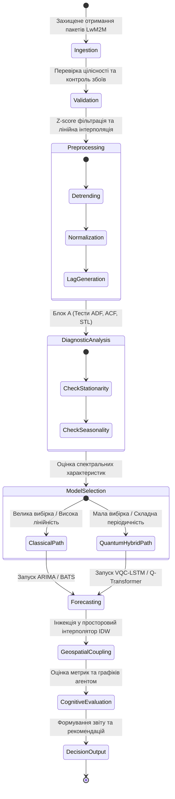
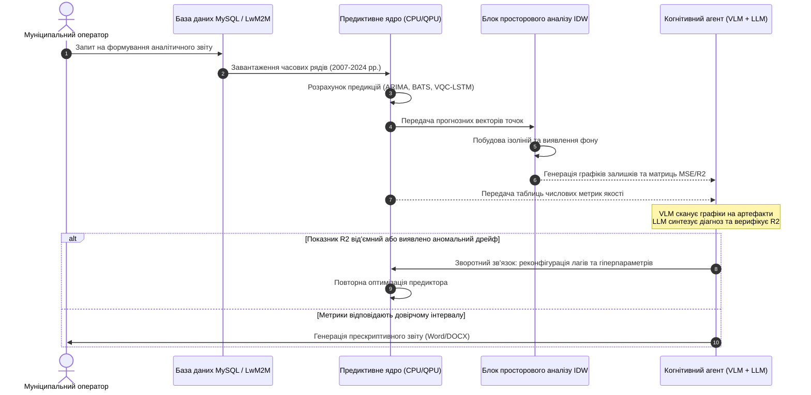

# Тема 5. Багатовимірний аналіз даних, просторове моделювання та адаптивні технології прогнозування стану урбанізованого довкілля

## Мета лекції
Формування у здобувачів вищої освіти системних науково-практичних компетентностей щодо методології багатовимірного статистичного аналізу, просторової геоінформаційної інтерполяції та сучасних предиктивних технологій обробки екологічних часових рядів в умовах ресурсних обмежень муніципальних систем моніторингу. Лекція орієнтована на поглиблене опанування математичного апарату виявлення латентних закономірностей у системі взаємозв'язків між техногенними полютантами і метеорологічними факторами, зниження розмірності ознакових просторів, проектування адаптивних предиктивних контурів на основі парадигми DPPDMext, а також інтеграції класичних, квантово-гібридних і мультимодальних когнітивних моделей для автоматизованої прескриптивної підтримки прийняття управлінських рішень відповідно до директив Європейського Союзу.

## Очікувані результати навчання
1. **Знання та розуміння.** Здобувачі продемонструють ґрунтовні знання математичного базису кореляційного аналізу Пірсона і Спірмена, спектрального розкладання коваріаційних матриць у методі головних компонент, розрахункового апарату методу зворотних зважених відстаней та концептуальної архітектури інтегрованого інформаційного контуру DPPDMext.
2. **Застосування.** Здобувачі зможуть застосовувати алгоритми селекції моделей ARIMA і BATS, розгортати процедури геопросторової екстраполяції вимірювань для локалізації джерел викидів, будувати гібридні квантово-класичні архітектури типу VQC-LSTM для обробки нелінійних параметрів та налаштовувати механізми виявлення тривалих перевищень гранично допустимих концентрацій шкідливих речовин.
3. **Аналіз.** Здобувачі набудуть здатності аналізувати автокореляційні структури, тренди та циклічність часових рядів моніторингу довкілля, диференціювати спільні технологічні джерела емісій на основі коваріаційних зв'язків між хімічними маркерами, а також діагностувати критичні обмеження предиктивних моделей за наявності апаратного шуму чи дефіциту ретроспективних вибірок.
4. **Оцінювання та синтез.** Здобувачі навчаться критично оцінювати прогностичну ефективність моделей за комплексом метрик точності та інформаційних критеріїв, синтезувати рекомендації щодо просторової оптимізації сенсорної інфраструктури з використанням імітаційного моделювання на базі алгоритму A*, а також розробляти сценарії функціонування автономних когнітивних LLM-агентів для генерації експертних висновків екологічного аудиту.

---

## Детальний покроковий план лекції

### 1. Теоретико-концептуальний базис. Багатовимірна декомпозиція екологічних даних та формалізовані моделі інформаційних процесів
* 1.1. Математична формалізація взаємозв'язків у гетерогенних екологічних мережах та парний аналіз у підсистемах «полютант–полютант» і «полютант–метеофактор»
* 1.2. Ортогональне проєктування простору ознак методом головних компонент (PCA) та ранжування кумулятивного техногенного навантаження
* 1.3. Кортежна формалізація об'єктів екологічного моніторингу та системна архітектура розширеного аналітичного циклу DPPDMext
* 1.4. Формалізація математичного апарату попереднього аналізу часових рядів за показниками стаціонарності, тренду, сезонності та автокореляції

### 2. Методологія та аналіз граничних умов. Просторово-часове прогнозування, квантово-гібридні обчислення та структурні обмеження
* 2.1. Алгоритмічні засади адаптивного часового прогнозування на базі моделей авторегресії ARIMA та баєсівського експоненційного згладжування BATS
* 2.2. Моделювання просторового розподілу забруднення методом зворотних зважених відстаней (IDW) та алгоритми автоматичної ідентифікації фонових точок урбоекосистеми
* 2.3. Синтез квантово-гібридних обчислювальних ядер на базі варіаційних квантових схем (VQC) та рекурентних нейромереж для умов маловибірковості
* 2.4. Концепція когнітивного контролю та генерації прескриптивних висновків за допомогою мультимодальних Vision-Language моделей
* 2.5. Критичні бар'єри та граничні умови: проблема маловибірковості, феномен затухання квантових градієнтів (Barren Plateau), апаратний шум NISQ-симуляторів та просторова розрідженість муніципальних сенсорних мереж

### 3. Практичний індустріальний / фаховий кейс. Інтелектуальний просторово-часовий аудит та предиктивне моделювання якості повітря промислової агломерації
**Тема наскрізної задачі.** «Багатофакторна оцінка емісій та адаптивне просторово-часове прогнозування забруднення атмосферного повітря пилом, діоксидом азоту та формальдегідом для Кременчуцького промислового вузла з оптимізацією мережі моніторингу»


## 1. Теоретико-концептуальний базис. Багатовимірна декомпозиція екологічних даних та формалізовані моделі інформаційних процесів

### 1.1. Математична формалізація взаємозв'язків у гетерогенних екологічних мережах та парний аналіз у підсистемах «полютант–полютант» і «полютант–метеофактор»

Сучасний стан атмосферного басейну урбанізованих територій формується під дією нелінійного комплексу природних і антропогенних процесів, що зумовлює високу розмірність та взаємозалежність параметрів екологічного моніторингу. Масиви спостережень, отримані з автоматичних станцій спостереження, являють собою стохастичні багатовимірні часові ряди. Для виявлення внутрішніх закономірностей переносу домішок, встановлення спільних джерел емісій та мінімізації надмірності вимірювальних каналів використовується математичний апарат багатовимірного кореляційного аналізу.

Оцінка взаємного лінійного стохастичного зв'язку між двома неперервними нормально розподіленими екологічними величинами $X_i$ та $X_j$ здійснюється на основі розрахунку парного коефіцієнта кореляції Пірсона $r_{ij}$:

$$r_{ij} = \frac{\text{Cov}(X_i, X_j)}{\sigma_{X_i} \sigma_{X_j}} = \frac{\sum_{t=1}^{T} (x_{i,t} - \mu_i)(x_{j,t} - \mu_j)}{\sqrt{\sum_{t=1}^{T} (x_{i,t} - \mu_i)^2 \sum_{t=1}^{T} (x_{j,t} - \mu_j)^2}},$$

де вираз $\text{Cov}(X_i, X_j)$ позначає коваріацію між часовими рядами екологічних параметрів $X_i$ та $X_j$. Символи $\sigma_{X_i}$ та $\sigma_{X_j}$ відповідають генеральним середньоквадратичним відхиленням аналізованих показників. Змінні $x_{i,t}$ та $x_{j,t}$ представляють конкретні числові значення концентрацій забруднюючих речовин або метеорологічних параметрів, зафіксовані в дискретний момент часу $t$. Параметри $\mu_i$ та $\mu_j$ задають вибіркові середні арифметичні значення відповідних рядів спостережень, а змінна $T$ визначає загальну тривалість періоду вимірювань.

Для комплексної оцінки системи з $M$ контрольованих показників формується симетрична квадратна кореляційна матриця $\mathbf{R} \in \mathbb{R}^{M \times M}$:

$$\mathbf{R} = \begin{bmatrix} 1 & r_{12} & \dots & r_{1M} \\ r_{21} & 1 & \dots & r_{2M} \\ \vdots & \vdots & \ddots & \vdots \\ r_{M1} & r_{M2} & \dots & 1 \end{bmatrix},$$

де головна діагональ складається з одиничних значень, що відображають кореляцію параметра із самим собою, а недіагональні елементи задовольняють умову симетрії $r_{ij} = r_{ji}$ та належать числовому інтервалу $[-1, 1]$.

Якщо закони розподілу виміряних концентрацій істотно відхиляються від нормального розподілу Гауса внаслідок наявності асиметричних екстремальних сплесків або залпових промислових викидів, застосовується ранговий коефіцієнт кореляції Спірмена $\rho_s$:

$$\rho_s = 1 - \frac{6 \sum_{t=1}^{T} d_t^2}{T(T^2 - 1)},$$

де змінна $d_t = \text{rg}(x_{i,t}) - \text{rg}(x_{j,t})$ визначає різницю рангів, призначених елементам $x_{i,t}$ та $x_{j,t}$ після ранжування вихідного варіаційного ряду. 

Аналітичний розподіл кореляційних зв'язків у системі **«полютант–полютант»** дозволяє верифікувати фізико-хімічні гіпотези щодо походження викидів. Стійка позитивна кореляція між оксидом вуглецю ($\text{CO}$) та діоксидом азоту ($\text{NO}_2$) на рівні $r \approx 0.42$ свідчить про домінування спільних джерел генерації високої температури, зокрема двигунів внутрішнього згоряння на автотранспортних магістралях та теплогенеруючих установок. Помірний позитивний зв'язок оксиду вуглецю з формальдегідом ($r \approx 0.45$) підтверджує процеси неповного згоряння паливних сумішей та вторинного фотохімічного окиснення летких вуглеводнів. Статистичний взаємозв'язок між формальдегідом і фенолом ($r \approx 0.41$) вказує на вплив локалізованих технологічних викидів хімічних виробництв або використання полімерних смол. Кореляція між дисперсним пилом і сажею ($r \approx 0.35$) обумовлена надходженням твердих мікрочасток у результаті роботи дизельного транспорту, промислових печей та вторинного здування пилових відкладень із ґрунту. Відсутність або слабкий негативний зв'язок між діоксидом сірки ($\text{SO}_2$) та іншими газами підтверджує просторову відокремленість точкових джерел спалювання важких мазутів чи вугілля від лінійних транспортних коридорів.

У підсистемі **«полютант–метеофактор»** спостерігаються фундаментальні фізичні залежності. Швидкість приземного вітру перебуває у стійкій негативній кореляції з концентраціями більшості токсикантів ($r \in [-0.40, -0.65]$), що пояснюється інтенсифікацією турбулентної дифузії та динамічним перемішуванням приземного шару атмосфери. Відносна вологість виявляє специфічну бімодальну поведінку: вона позитивно корелює із фракціями $\text{PM}_{2.5}$ та $\text{PM}_{10}$ через процеси гігроскопічного зростання частинок та конденсаційної коагуляції, але водночас негативно корелює з водорозчинними газами ($\text{SO}_2$, $\text{NO}_2$) за рахунок їхньої абсорбції туманом і вимивання атмосферними опадами. Температура повітря демонструє додатну кореляцію з фотохімічними дериватами (зокрема приземним озоном $\text{O}_3$ у літній період) та від'ємну кореляцію з монооксидом вуглецю через сезонне збільшення інтенсивності спалювання вуглеводнів у системах теплопостачання взимку.

> **ПРАКТИЧНИЙ ЯКІР:** При аналізі кореляційної матриці вимірювального поста №1 на вулиці Молодіжній у місті Кременчук за період 2019–2024 років коефіцієнт кореляції між монооксидом вуглецю та діоксидом азоту склав $0.42$, що математично довело вирішальний внесок автотранспортного потоку та факельних систем нафтопереробного заводу у загальне фонове забруднення мікрорайону.

---

### 1.2. Ортогональне проєктування простору ознак методом головних компонент (PCA) та ранжування кумулятивного техногенного навантаження

Одночасна фіксація значної кількості хімічних та метеорологічних маркерів призводить до високої розмірності простору ознак та виникнення мультиколінеарності, яка дестабілізує обчислювальні схеми регресійних та нейромережевих моделей. Для ортогонального перетворення взаємозалежних ознак у систему некорельованих змінних застосовується **метод головних компонент** (Principal Component Analysis — PCA).

Нехай вихідні результати вимірювань представлені матрицею $\mathbf{X} \in \mathbb{R}^{T \times p}$, де $T$ відповідає числу послідовних спостережень у часі, а $p$ задає кількість контрольованих екологічних факторів. Початковим етапом є стандартизація значень для усунення впливу різних фізичних розмірностей (мг/м³, %, °C, гПа):

$$z_{t,j} = \frac{x_{t,j} - \mu_j}{\sigma_j}, \quad t = 1, \dots, T, \quad j = 1, \dots, p,$$

де величина $z_{t,j}$ позначає елемент нормованої матриці $\mathbf{Z} \in \mathbb{R}^{T \times p}$, параметр $\mu_j$ є середнім значенням $j$-ї ознаки, а $\sigma_j$ — її вибірковим середньоквадратичним відхиленням.

Наступний крок полягає в обчисленні емпіричної вибіркової коваріаційної матриці стандартизованих змінних $\mathbf{\Sigma} \in \mathbb{R}^{p \times p}$:

$$\mathbf{\Sigma} = \frac{1}{T - 1} \mathbf{Z}^T \mathbf{Z}.$$

Спектральна теорема лінійної алгебри забезпечує розклад коваріаційної матриці через власні значення $\lambda_k$ та відповідні їм ортонормовані власні вектори $\mathbf{v}_k$:

$$\mathbf{\Sigma} \mathbf{v}_k = \lambda_k \mathbf{v}_k, \quad k = 1, \dots, p,$$

де власні значення утворюють монотонно спадну послідовність $\lambda_1 \ge \lambda_2 \ge \dots \ge \lambda_p \ge 0$. Власний вектор $\mathbf{v}_k = [v_{1k}, v_{2k}, \dots, v_{pk}]^T$ визначає вагові коефіцієнти (loadings) вихідних факторів у $k$-й головній компоненті.

Проєктування вихідного простору спостережень у базис головних компонент здійснюється множенням матриць:

$$\mathbf{Y} = \mathbf{Z} \mathbf{V},$$

де матриця $\mathbf{V} = [\mathbf{v}_1, \mathbf{v}_2, \dots, \mathbf{v}_p]$ складається зі стовпців власних векторів, а матриця $\mathbf{Y} \in \mathbb{R}^{T \times p}$ містить координати об'єктів у новому ортогональному просторі (scores). Кожна окрема головна компонента $Y_k$ описується лінійною суперпозицією стандартизованих ознак:

$$Y_k = \sum_{j=1}^{p} v_{jk} Z_j.$$

Частка дисперсії вихідних даних, яку акумулює $k$-та головна компонента ($\text{PEV}_k$), та сумарна кумулятивна частка дисперсії для $m$ відібраних компонент ($\text{CPEV}_m$) обчислюються згідно з формулами:

$$\text{PEV}_k = \frac{\lambda_k}{\sum_{j=1}^{p} \lambda_j} = \frac{\lambda_k}{p}, \quad \text{CPEV}_m = \frac{\sum_{k=1}^{m} \lambda_k}{p}.$$

Критерій відсікання надлишкових координат базується на правилі Кайзера, згідно з яким утримуються виключно компоненти з власними значеннями $\lambda_k > 1$, або на правилі досягнення кумулятивного порога $\text{CPEV}_m \ge 0.75\dots0.85$.

В екологічному контексті головні компоненти набувають фізичної інтерпретації. Перша головна компонента ($\text{PC}_1$) зосереджує вагові коефіцієнти маркерів згоряння ($\text{NO}_2$, $\text{CO}$, $\text{PM}_{2.5}$) і репрезентує **кумулятивний техногенний пресинг урбосистеми**. Друга компонента ($\text{PC}_2$) зазвичай корелює з температурою, вологістю та приземним озоном, відображаючи **сезонний метеорологічно-фотохімічний тренд**. Третя компонента ($\text{PC}_3$) концентрує навантаження специфічних промислових домішок (фенол, $\text{H}_2\text{S}$), вказуючи на вплив органічних хімічних виробництв. Завдяки проєкції координат спостережних постів на вісь $\text{PC}_1$ здійснюється кількісне просторове ранжування постів за рівнем токсикологічного ризику.

> **ТИПОВА ПОМИЛКА:** Застосування PCA безпосередньо до сирих екологічних даних без процедури попередньої стандартизації призводить до того, що компоненти штучно підпорядковуються параметрам із найбільшими абсолютними значеннями (наприклад, атмосферному тиску в гектопаскалях $\sim 1013$ гПа), повністю нівелюючи вплив токсичних газів, вимірюваних у сотих долях міліграма на метр кубічний ($\sim 0.05$ мг/м³).

---

### 1.3. Кортежна формалізація об'єктів екологічного моніторингу та системна архітектура розширеного аналітичного циклу DPPDMext

Для усунення семантичної неузгодженості та гетерогенності потоків моніторингової інформації застосовується апарат теоретико-множинної формалізації. Досліджуваний об'єкт моніторингу моделюється як абстрактна кортежна структура:

$$T_1 = \langle ES, I, P, R, CM \rangle,$$

де елемент $ES$ позначає фізичний об'єкт моніторингу (міський повітряний басейн, промислова зона); елемент $I$ формує множину вимірюваних показників і параметрів; елемент $P$ описує динамічні фізико-хімічні процеси масопереносу та трансформації речовин; елемент $R$ задає систему аналітичних відношень між показниками та процесами; елемент $CM$ є інтегрованою концептуальною моделлю функціонування урбоекосистеми на основі онтологічних зв'язків.

Одиничний факт інструментального вимірювання формалізується кортежем даних:

$$M = \langle O, C, M_t, T, L, S, I_r, U \rangle,$$

де $O$ є об'єктом спостереження; $C$ визначає вектор виміряних фізико-хімічних характеристик; $M_t$ фіксує метод та метрологічний клас вимірювання; $T$ відповідає часовій мітці; $L$ є геопросторовою прив'язкою станції; $S$ відображає застосовані процедури статистичної агрегації; $I_r$ фіксує семантичну інтерпретацію результату відносно нормативів; $U$ задає відповідне регуляторне управлінське рішення.

Функціональний перехід від реєстрації первинних даних до автоматизованого синтезу прескриптивних рішень формалізується в межах розширеної парадигми **DPPDMext** (Data Preparation and Predictive Data Modeling extended):

$$\text{DPPDM}_{\text{ext}} = \langle D, T, F, P_{\text{ext}}, V \rangle,$$

де предиктивне ядро $P_{\text{ext}}$ розгортається у структурований аналітичний ланцюг:

$$P_{\text{ext}} = \langle A, Q, M, E, P, F_d \rangle.$$

У наведеній моделі блок $D$ забезпечує прийом сирих даних через захищені протоколи; оператор $T$ реалізує фільтрацію шумів та імпутацію пропусків; блок $F$ виконує інженерію ознак; блок $A$ здійснює автоматичний аналіз часових рядів на стаціонарність та автокореляцію; підсистема $Q$ виконує адаптивну оптимізацію селекції моделей; блок $M$ реалізує просторове моделювання та генерацію віртуальних станцій; модуль $E$ обчислює індекс надійності прогнозів CRI; блок $P$ здійснює високопродуктивне квантово-гібридне прогнозування; модуль $F_d$ генерує когнітивні рекомендації через автономного агента; блок $V$ будує картографічні ізолінії та часові графіки.

```mermaid
flowchart TD
    subgraph S1 ['Рівень гетерогенних джерел даних (D)']
        D1['Стаціонарні пости лабораторій']
        D2['Автоматичні станції Vaisala AQT530']
        D3['Громадські сенсори EcoCity']
    end

    subgraph S2 ['Рівень первинної обробки (T, F)']
        T1['LwM2M / DTLS транспортний шлюз']
        T2['Імпутація пропусків та Z-score фільтрація']
        T3['Нормалізація та інженерія ознак (ГДК, Lags)']
    end

    subgraph S3 ['Предиктивно-симуляційне ядро DPPDMext (Pext)']
        A1['Блок A: Аналіз рядів (STL, ADF, ACF)']
        Q1['Блок Q: Квантово-адаптивна селекція']
        M1['Блок M: Геопросторова IDW-інтерполяція']
        P1['Блок P: Предиктивні ядра (ARIMA, BATS, VQC-LSTM)']
        E1['Блок E: Розрахунок індексу надійності CRI']
    end

    subgraph S4 ['Рівень підтримки рішень та когнітивного аналізу (Fd, V)']
        V1['Модуль V: Просторові теплові карти та тренди']
        F1['Модуль Fd: Мультимодальний когнітивний LLM-агент']
        ACT['Прескриптивні управлінські директиви']
    end

    S1 --> T1
    T1 --> T2
    T2 --> T3
    T3 --> A1
    A1 --> Q1
    Q1 --> P1
    M1 --> P1
    P1 --> E1
    E1 --> V1
    E1 --> F1
    F1 --> ACT
```

Еволюція стану даних та логіка перемикання алгоритмічних контурів у моделі DPPDMext відображається діаграмою станів інформаційного процесу.



> **ПРАКТИЧНИЙ ЯКІР:** У муніципальній інформаційній системі КП «НДЦ» міста Кременчук теоретичні кортежі реалізовано у реляційній базі даних MySQL, де схема обробки щохвилинних спостережень розділена між таблицями сирих пакетів `station_T3950716` та агрегованою таблицею `split_measurement_ua171`, що дозволило оптимізувати обсяг дискового сховища з 4.5 Гб до 39 Мб на рік для однієї станції.

---

### 1.4. Формалізація математичного апарату попереднього аналізу часових рядів за показниками стаціонарності, тренду, сезонності та автокореляції

Вибір структури прогнозної моделі не може бути суб'єктивним і потребує обов'язкової попередньої діагностики математичних властивостей вхідного часового ряду $X = \{x_1, x_2, \dots, x_T\}$.

Описова статистика процесу базується на вибірковому середньому значенні $\mu$ та незміщеній дисперсії $\sigma^2$:

$$\mu = \frac{1}{T} \sum_{t=1}^{T} x_t, \quad \sigma^2 = \frac{1}{T - 1} \sum_{t=1}^{T} (x_t - \mu)^2.$$

Для виявлення нетипових спостережень в умовах відхилення від симетрії розподілу обчислюється міжквартильний розмах:

$$\text{IQR} = Q_3 - Q_1,$$

де $Q_1$ та $Q_3$ відповідають 25-му та 75-му процентилям емпіричного розподілу відповідно.

Декомпозиція екологічного часового ряду здійснюється за допомогою методу лоесс-згладжування (STL):

$$x_t = T_t + S_t + R_t,$$

де $T_t$ описує низькочастотну трендову складову; $S_t$ є строго періодичною сезонною компонентою із періодом $s$; $R_t$ являє собою випадковий стохастичний залишок (білий шум). Трендова складова апроксимується лінійним рівнянням $T_t = at + b$, де коефіцієнт $a$ визначає швидкість зростання або деградації екологічного показника.

Діагностика циклічних закономірностей реалізується через розрахунок автокореляційної функції (ACF) для часового лагу $k$:

$$\text{ACF}(k) = \frac{\sum_{t=1}^{T-k} (x_t - \mu)(x_{t+k} - \mu)}{\sum_{t=1}^{T} (x_t - \mu)^2}.$$

Часовий ряд класифікується як сезонний, якщо значення функції перевищує статистичний поріг значущості $\text{ACF}(k) > 0.1$ для фіксованих циклічних періодів $k = s, 2s, \dots$ (для щомісячних спостережень крок сезонності складає $k = 12$).

Спектральний аналіз прихованих частотних гармонік виконується за допомогою дискретного швидкого перетворення Фур'є (FFT):

$$\hat{X}_k = \sum_{n=0}^{T-1} x_n \exp\left( -2\pi i \frac{nk}{T} \right), \quad k = 0, \dots, T-1,$$

де $\hat{X}_k$ позначає комплексну амплітуду коливання на частоті $\omega_k = \frac{2\pi k}{T}$, а символ $i$ задає уявну одиницю.

Ключовою передумовою застосування класичних стохастичних моделей є властивість стаціонарності ряду у широкому розумінні (постійність середнього значення та автоковаріації у часі). Перевірка стаціонарності виконується за допомогою розширеного тесту Дікі–Фуллера (Augmented Dickey–Fuller — ADF), модель якого описується рівнянням:

$$\Delta x_t = \alpha + \beta t + \gamma x_{t-1} + \sum_{j=1}^{p} \delta_j \Delta x_{t-j} + \varepsilon_t,$$

де $\Delta x_t = x_t - x_{t-1}$ є оператором взяття першої різниці ряду; $\alpha$ визначає константу (дрейф); $\beta t$ задає детермінований лінійний тренд; $\gamma$ позначає оцінюваний коефіцієнт наявності одиничного кореня; $\delta_j$ є коефіцієнтами авторегресії різниць вищих порядків, що усувають серійну кореляцію залишків; $\varepsilon_t$ є похибкою білого шуму.

Нульова гіпотеза $H_0: \gamma = 0$ стверджує, що часовий ряд є нестаціонарним (містить одиничний корінь). Альтернативна гіпотеза $H_1: \gamma < 0$ відповідає стаціонарному процесу. Рішення ухвалюється на основі розрахункового $p$-значення:

$$p\text{-value} < 0.05 \implies H_0 \text{ відхиляється, ряд визнається стаціонарним}.$$

| Метод аналізу | Математична сутність | Цільовий екологічний ефект | Приклад з реальної практики |
| :--- | :--- | :--- | :--- |
| **Кореляційний аналіз Пірсона** | Розрахунок коваріації між центрованими та нормованими рядами | Ідентифікація спільних технологічних джерел викидів | Виявлення кореляції між $\text{CO}$ та $\text{NO}_2$ ($r = 0.42$) на моніторинговому пості №1 у місті Кременчук |
| **Рангова кореляція Спірмена** | Оцінка нелінійних монотонних зв'язків через квадратичні різниці рангів | Аналіз взаємозв'язків у періоди нетипових залпових промислових емісій | Оцінка впливу вологості на концентрацію формальдегіду при екстремальних туманах |
| **Метод головних компонент (PCA)** | Спектральне розкладання матриці коваріації, ортогональне проєктування | Усунення мультиколінеарності та ранжування техногенного навантаження | Агрегація 13 полютантів в інтегральний техногенний індекс $\text{PC}_1$ (пояснює 54% дисперсії) |
| **STL-декомпозиція** | Фільтрація лоесс-згладжуванням для сепарації частотних компонент | Відокремлення багаторічного тренду від сезонних коливань температури й пилу | Виявлення спадного тренду запиленості з 1.2 до 0.8 ГДК на пості №4 у Кременчуці (2007–2024 роки) |
| **Тест Дікі–Фуллера (ADF)** | Оцінка наявності одиничного кореня в авторегресійній моделі різниць | Визначення потреби у взятті різниць рядів перед моделюванням ARIMA | Встановлення нестаціонарності концентрацій $\text{CO}$ ($p\text{-value} = 0.981$) на стаціонарних міських станціях |
| **Кортежне моделювання** | Теоретико-множинна формалізація інформаційних потоків і сутностей | Забезпечення інтероперабельності між сенсорами, СКБД та моделями ШІ | Формалізація реляційної структури таблиць `split_measurement_ua171` під вимоги постанови №827 КМУ |

> **КОНТРОЛЬНЕ ПИТАННЯ:** Під час аналізу часового ряду концентрації діоксиду азоту ($\text{NO}_2$) тривалістю 35 місяців на міському посту спостереження отримано значення критерію ADF $p\text{-value} = 0.975$, а значення коефіцієнта автокореляції першого порядку склало $\text{ACF}(1) = 0.940$. Який математичний висновок слід зробити щодо структури ряду, і які архітектурні обмеження це накладає на класичні статистичні моделі прогнозування?

<details markdown="1">
<summary>Розгорнути аналіз / відповідь</summary>

**Правильний варіант: Ряд є суворо нестаціонарним із сильною авторегресійною пам'яттю першого порядку; використання класичної моделі ARMA без взяття різниць (диференціювання) призведе до ефекту хибної регресії.**

1. Логічне та аналітичне обґрунтування:
Оскільки розрахункове значення $p\text{-value} = 0.975$ значно перевищує критичний поріг $0.05$, нульова гіпотеза $H_0$ про наявність одиничного кореня не може бути відхилена. Це доводить, що часовий ряд $\text{NO}_2$ має нестаціонарний характер (наявний стохастичний або детермінований тренд, а статистичні моменти — середнє та дисперсія — залежать від часу). Значення $\text{ACF}(1) = 0.940$ підтверджує наявність сильного інерційного процесу. Для застосування лінійних стохастичних моделей ряду необхідно застосувати процедуру взяття послідовних різниць порядку $d \ge 1$ (перехід від моделі ARMA до моделі ARIMA$(p, d, q)$). Ігнорування нестаціонарності при навчанні лінійних моделей або неглибоких перцептронів спричиняє розбіжність градієнтних процедур та генерування неадекватних оцінок майбутнього стану.

2. Аналіз дистракторів:
* Твердження про стаціонарність ряду через високий рівень автокореляції є хибним, оскільки саме повільне спадання функції ACF є типовим симптомом нестаціонарності інтегрованого процесу.
* Припущення про доцільність прямого перетворення Фур'є без попереднього детрендування є некоректним, оскільки наявність тренду розмиває спектральну щільність потужності через низькочастотний витік енергії (spectral leakage).
* Гіпотеза про можливість компенсації нестаціонарності виключно квантовим кодуванням без математичного трансформування ряду спростовується емпірично: в умовах нестаціонарності варіаційні квантові схеми демонструють деградацію критерію $R^2$ до від'ємних значень.

</details>

---

### Вказівки для самостійного осмислення

1. Здійснити аналітичний розрахунок коваріаційної матриці та визначити власні значення для штучно сформованого двовимірного вектора спостережень концентрацій оксиду вуглецю та пилу, інтерпретувавши отриманий кумулятивний відсоток поясненої дисперсії першої головної компоненти.
2. Скласти кортежну модель опису мобільного вимірювального комплексу на базі безпілотного літального апарата або міського електротранспорту, формалізувавши просторово-часову прив'язку та специфікацію вимірювальних каналів газоаналізаторів відповідно до структури кортежу $M$.
3. Проаналізувати вплив кроку часової дискретизації (хвилинне, годинне, добове та місячне усереднення) на стійкість результатів тесту на стаціонарність Дікі–Фуллера, оцінивши ризики втрати високочастотних екстремумів при переході до великих часових вікон агрегації даних.


## 2. Методологія та аналіз граничних умов. Просторово-часове прогнозування, квантово-гібридні обчислення та структурні обмеження

### 2.1. Алгоритмічні засади адаптивного часового прогнозування на базі моделей авторегресії ARIMA та баєсівського експоненційного згладжування BATS

Предиктивне моделювання динаміки концентрацій атмосферних забруднювачів вимагає застосування математичного апарату, здатного одночасно апроксимувати стохастичний тренд, мультичастотну циклічність та високочастотний шум вимірювань. Класичний стохастичний підхід базується на авторегресійній інтегрованій моделі ковзного середнього $\text{ARIMA}(p, d, q)$, яка описується операторним рівнянням у термінах лагового оператора запізнення $L$, де $L^k y_t = y_{t-k}$:

$$\Phi_p(L) (1 - L)^d y_t = c + \Theta_q(L) \varepsilon_t,$$

де компонент $\Phi_p(L) = 1 - \sum_{i=1}^{p} \phi_i L^i$ представляє поліном авторегресії порядку $p$; вираз $(1 - L)^d$ задає оператор послідовного взяття різниць порядку $d$, призначений для редукції нестаціонарного часового ряду до стаціонарного вигляду; $c$ є константою дрейфу; $\Theta_q(L) = 1 + \sum_{j=1}^{q} \theta_j L^j$ задає поліном ковзного середнього порядку $q$; $\varepsilon_t \sim \mathcal{N}(0, \sigma_\varepsilon^2)$ позначає послідовність незалежних однаково розподілених випадкових величин білого шуму.

У випадках, коли часовий ряд містить складну недетерміновану сезонність із нецілочисельними періодами або нелінійними зсувами дисперсії, застосовується модель баєсівського експоненційного згладжування **BATS** (Box-Cox transformation, ARMA errors, Trend, and Seasonal components). На відміну від класичних схем, BATS моделює циклічність за допомогою тригонометричного представлення рядів Фур'є та параметричного перетворення Бокса-Кокса:

$$\begin{aligned}
y_t^{(\omega)} &= \begin{cases} \frac{y_t^\omega - 1}{\omega}, & \omega \neq 0 \\ \ln(y_t), & \omega = 0 \end{cases}, \\
y_t^{(\omega)} &= l_{t-1} + \phi b_{t-1} + \sum_{i=1}^{K} s_{t-m_i}^{(i)} + d_t,
\end{aligned}$$

де параметр $\omega$ визначає коефіцієнт стабілізації дисперсії Бокса-Кокса; $l_t$ задає базовий локальний рівень ряду в момент часу $t$; $b_t$ відображає локальний тренд; $\phi \in (0, 1]$ виступає коефіцієнтом демпфування тренду; $s_t^{(i)}$ є $i$-ю сезонною компонентою з періодом $m_i$; $d_t$ моделює авторегресійний залишковий процес класу $\text{ARMA}(p, q)$.

Формалізація процесу адаптивної селекції оптимальної предиктивної моделі у часовому просторі здійснюється через замкнений алгоритмічний цикл оптимізації критеріїв інформаційної ентропії:

$$
\begin{aligned}
\text{Крок 1 (Діагностика):} & \quad \text{ADF-тест} \to d = \arg\min_d \{p\text{-value}(\Delta^d y_t) < 0.05\}; \\
\text{Крок 2 (Ідентифікація):} & \quad \min_{\Theta, \Phi} \text{AIC} = 2k - 2\ln(\hat{L}), \quad k = p + q + P + Q + 1; \\
\text{Крок 3 (Оцінювання):} & \quad \arg\min_{\text{Model} \in \{\text{ARIMA}, \text{BATS}\}} \text{MSE}_{\text{val}} = \frac{1}{H} \sum_{h=1}^{H} (y_{T+h} - \hat{y}_{T+h})^2; \\
\text{Крок 4 (Генерація):} & \quad \hat{y}_{T+H} = \mathbb{E}\left[y_{T+H} \mid \mathcal{F}_T, \text{Model}^*\right],
\end{aligned}
$$

де величина $\hat{L}$ позначає максимізоване значення функції правдоподібності; параметр $k$ задає загальне число оцінюваних параметрів моделі; $H$ визначає горизонт валідації; $\mathcal{F}_T$ є фільтрацією sigma-алгебри історичних спостережень до моменту часу $T$; $\text{Model}^*$ позначає конфігурацію, що мінімізувала середньоквадратичну похибку $\text{MSE}$.

Емпіричні дослідження часових рядів забруднення атмосферного повітря демонструють, що для високодисперсних полютантів із вираженими гармонійними циклами (пил, оксид вуглецю, діоксид азоту, формальдегід) модель BATS перевершує ARIMA за точністю на $15\dots80\,\%$. Зокрема, для формальдегіду BATS демонструє $\text{MSE} = 1.474$ проти $\text{MSE} = 7.798$ у моделі ARIMA. Проте для низькодифузних або хімічно інертних газів із гладкими автокореляційними характеристиками (діоксид сірки, фенол) класична модель ARIMA забезпечує вищу стійкість, досягаючи $\text{MSE} = 0.00123$ проти $0.00157$ у моделі BATS, що обґрунтовує необхідність відмови від уніфікованого алгоритму на користь динамічного програмного перемикання.

---

### 2.2. Моделювання просторового розподілу забруднення методом зворотних зважених відстаней (IDW) та алгоритми автоматичної ідентифікації фонових точок урбоекосистеми

Для подолання проблеми просторової розрідженості мережі моніторингу та оцінки полів забруднення у неспостережуваних координатах застосовується геоінформаційна інтерполяція за методом **зворотних зважених відстаней** (Inverse Distance Weighting — IDW). Метод базується на першому законі географії Тоблера, згідно з яким просторово наближені об'єкти мають вищий ступінь взаємного впливу, ніж віддалені.

Нехай множина фізичних станцій моніторингу задана множиною $S = \{(\mathbf{x}_i, C_i)\}_{i=1}^N$, де $\mathbf{x}_i = (u_i, v_i)^T \in \mathbb{R}^2$ є вектором координат у метричній системі проекції EPSG:3857, $C_i$ позначає виміряну концентрацію домішки на $i$-й станції, а $N$ визначає кількість функціонуючих вузлів. Прогнозована концентрація у довільній точці міського простору $\mathbf{x}_0 = (u_0, v_0)^T$ описується нормованим зваженим середнім:

$$C(\mathbf{x}_0) = \frac{\sum_{i=1}^N w_i(\mathbf{x}_0) C_i}{\sum_{i=1}^N w_i(\mathbf{x}_0)}, \quad w_i(\mathbf{x}_0) = \frac{1}{\|\mathbf{x}_0 - \mathbf{x}_i\|_2^p},$$

де евклідова відстань обчислюється як $\|\mathbf{x}_0 - \mathbf{x}_i\|_2 = \sqrt{(u_0 - u_i)^2 + (v_0 - v_i)^2}$, а показник ступеня $p \ge 1$ (стандартно $p = 2$) визначає швидкість спадання просторової ваги зі збільшенням геометричної дистанції.

Математична формалізація процесу виявлення фонових зон та локальних емісійних аномалій на дискретній регулярній сітці $G = \{\mathbf{x}_{j,k}\}_{j=1, k=1}^{J, K}$ записується у вигляді багатокрокової процедури:

$$
\begin{aligned}
\text{Крок 1 (Розрахунок поля):} & \quad Z_G = \{C(\mathbf{x}) \mid \mathbf{x} \in G\}; \\
\text{Крок 2 (Екстремуми поля):} & \quad z_{\min} = \min_{\mathbf{x} \in G} C(\mathbf{x}), \quad z_{\max} = \max_{\mathbf{x} \in G} C(\mathbf{x}); \\
\text{Крок 3 (Фільтрація фону):} & \quad G_{\text{bg}} = \left\{ \mathbf{x} \in G \;\middle|\; C(\mathbf{x}) \le z_{\min} + \alpha (z_{\max} - z_{\min}) \right\}, \quad \alpha \in [0, 0.1]; \\
\text{Крок 4 (Детектування емісій):} & \quad \Delta C(\mathbf{x}_{\text{target}}) = C(\mathbf{x}_{\text{target}}) - \frac{1}{|G_{\text{bg}}|} \sum_{\mathbf{x} \in G_{\text{bg}}} C(\mathbf{x}).
\end{aligned}
$$

У разі виконання умови $\Delta C(\mathbf{x}_{\text{target}}) > 0$ генерується статистична гіпотеза щодо наявності неврахованого джерела техногенної емісії поблизу цільової точки $\mathbf{x}_{\text{target}}$, що слугує формалізованою підставою для дислокації мобільної лабораторії або розгортання додаткового апаратного сенсора.

---

### 2.3. Синтез квантово-гібридних обчислювальних ядер на базі варіаційних квантових схем (VQC) та рекурентних нейромереж для умов маловибірковості

Критичним бар'єром конвенційного машинного та глибокого навчання (LSTM, CNN, Transformer) в екологічному моніторингу є феномен деградації узагальнюючої здатності за умов дефіциту навчальних прецедентів (ситуація «small data», характерна для щойно введених в експлуатацію станцій із довжиною історії $T < 36$ відліків). Подолання цього обмеження досягається побудовою **квантово-гібридних нейромережевих архітектур** (Quantum-Classical Hybrid Networks), де класичний процесор (CPU) здійснює екстракцію первинних лагових ознак, а квантовий співпроцесор (QPU) обробляє латентний простір високої розмірності через варіаційні квантові схеми (Variational Quantum Circuits — VQC).

Формалізація обчислювального тракту гібридного шару **VQC-LSTM** включає чотири послідовні квантово-механічні трансформації вектора вхідних даних:

$$
\begin{aligned}
\text{Крок 1 (Квантове вбудовування):} & \quad |\psi_0(\mathbf{x})\rangle = \bigotimes_{j=1}^{Q} R_X(\pi \cdot x_j) |0\rangle^{\otimes Q}, \quad R_X(\theta) = \exp\left(-i \frac{\theta}{2} \sigma_x\right); \\
\text{Крок 2 (Параметризована еволюція):} & \quad U(\boldsymbol{\theta}) = \prod_{l=1}^{L} \left[ W_{\text{ent}} \left( \bigotimes_{j=1}^{Q} R_Y(\theta_{l,j}) \right) \right], \quad R_Y(\theta) = \exp\left(-i \frac{\theta}{2} \sigma_y\right); \\
\text{Крок 3 (Заплутування кубітів):} & \quad W_{\text{ent}} = \prod_{j=1}^{Q-1} \text{CNOT}_{(j, j+1)} \cdot \text{CNOT}_{(Q, 1)}; \\
\text{Крок 4 (Квантове вимірювання):} & \quad \langle Z_j \rangle = \langle\psi_0(\mathbf{x})| U^\dagger(\boldsymbol{\theta}) \sigma_z^{(j)} U(\boldsymbol{\theta}) |\psi_0(\mathbf{x})\rangle = \text{Tr}\left(\rho(\mathbf{x}, \boldsymbol{\theta}) \sigma_z^{(j)}\right),
\end{aligned}
$$

де $Q$ позначає кількість кубітів схеми ($Q \in [2, 6]$); вектор $\mathbf{x} \in [0, 1]^Q$ репрезентує попередньо масштабовані виходи прихованого стану класичного блоку LSTM; матриці $\sigma_x, \sigma_y, \sigma_z$ відповідають квантовомеханічним операторам Паулі; $L$ задає глибину варіаційних шарів анзацу; $\boldsymbol{\theta}$ визначає вектор навчальних параметрів обертання; $\text{Tr}(\cdot)$ задає слід матриці густини еволюціонуючого квантового стану $\rho(\mathbf{x}, \boldsymbol{\theta})$.

Агрегація результатів обчислення формує прогноз через класичний повнозв'язний шар: $\hat{y}_t = \mathbf{w}_{\text{out}}^T \langle \mathbf{Z} \rangle + b_{\text{out}}$, де вектор математичних сподівань $\langle \mathbf{Z} \rangle = [\langle Z_1 \rangle, \dots, \langle Z_Q \rangle]^T$. Мінімізація функції втрат $\mathcal{L}(\mathbf{w}, \boldsymbol{\theta}) = \frac{1}{N} \sum_{i=1}^N (y_i - \hat{y}_i)^2 + \lambda \|\boldsymbol{\theta}\|_2^2$ реалізується методом градієнтного спуску з оптимізатором Adam, причому градієнти параметрів квантової схеми $\nabla_{\boldsymbol{\theta}} \mathcal{L}$ обчислюються за аналітичним правилом зсуву параметрів (parameter-shift rule).

Експериментальна валідація на реальних даних демонструє суттєву дихотомію: VQC-шари забезпечують радикальне покращення точності для стабільних циклічних параметрів атмосфери з високою автокореляцією ($\text{ACF}(1) > 0.8$), знижуючи $\text{MSE}$ прогнозування атмосферного тиску на $49.16\dots74.74\,\%$, а вологості — на $13.21\dots45.96\,\%$. Це пояснюється тим, що гільбертів простір варіаційної схеми діє як безкінечновимірне ядро відтворюючого простору, ефективно виділяючи гармонійні зв'язки. Проте для стохастичних та високоентропійних показників (температура та оксид вуглецю) квантові аналоги деградують, збільшуючи $\text{MSE}$ на величину до $314.6\,\%$, що викликано перенавчанням на апаратному шумі.

---

### 2.4. Концепція когнітивного контролю та генерації прескриптивних висновків за допомогою мультимодальних Vision-Language моделей

Для усунення суб'єктивізму оператора та прискорення формування звітних відомостей за вимогами постанови Кабінету Міністрів України № 827 до предиктивного контуру інтегрується підсистема когнітивного контролю якості у складі мультимодального агента Vision-Language (VLM) та великої мовної моделі (LLM).



Математична формалізація функціонування когнітивного агента описується парою операторів комп'ютерного зору $f_V$ та мовної генерації $f_{LLM}$:

$$\begin{aligned}
\text{Аналіз артефактів візуалізації:} & \quad \mathbf{A} = f_A\left(f_V(\mathbf{G}), \boldsymbol{\theta}_{\text{vis}}\right), \quad \mathbf{G} = \{g_{\text{resid}}, g_{\text{spatial}}, g_{\text{corr}}\}, \\
\text{Синтез прескриптивного висновку:} & \quad \text{Report} = f_{LLM}\left(\mathbf{M}_{\text{stat}}, \mathbf{A}, \mathcal{K}_{\text{reg}}\right),
\end{aligned}$$

де множина $\mathbf{G}$ містить графічні образи розподілу нев'язок прогнозу, просторові карти інтерполяції та теплові матриці кореляцій; вектор $\mathbf{A}$ формує семантичні дескриптори виявлених геометричних артефактів (товсті хвости розподілу похибок, порушення симетрії залишків); матриця $\mathbf{M}_{\text{stat}}$ агрегує числові значення метрик $\text{MSE}$, $\text{MAE}$, $R^2$; база знань $\mathcal{K}_{\text{reg}}$ містить юридичні пороги гранично допустимих концентрацій (ГДК). Агент автоматично виявляє патологічні математичні стани (зокрема від'ємні значення $R^2$, що свідчать про розбіжність моделей) та повертає керуючі директиви для переналаштування предиктивного контуру.

---

### 2.5. Критичні бар'єри та граничні умови: проблема маловибірковості, феномен затухання квантових градієнтів (Barren Plateau), апаратний шум NISQ-симуляторів та просторова розрідженість муніципальних сенсорних мереж

Практична імплементація розглянутих методів обмежується низкою фундаментальних граничних умов, за яких математичні моделі втрачають адекватність або генерують неприпустимі похибки.

Перша гранична умова стосується **проблеми маловибірковості та нестаціонарності**. При довжині спостережного ряду $T < 36$ відліків (менше трьох повних річних циклів) класичні статистичні моделі класу ARIMA та BATS втрачають здатність надійно оцінювати міжрічні кліматичні тренди. Для глибоких нейронних мереж (LSTM, Transformer) дефіцит вибірки провокує катастрофічне перенавчання (overfitting), внаслідок чого коефіцієнт детермінації на валідаційній вибірці деградує до значень $R^2 \ll 0$.

Друга критична межа полягає у виникненні **феномену затухання квантових градієнтів (Barren Plateau)** у варіаційних схемах VQC. Зі збільшенням кількості кубітів $Q$ та глибини квантових шарів $L$ дисперсія градієнта функції втрат прямує до нуля за експоненційним законом:

$$\operatorname{Var}_{\boldsymbol{\theta}} \left[ \frac{\partial \mathcal{L}}{\partial \theta_k} \right] \in \mathcal{O}\left( \frac{1}{2^Q} \right).$$

Для екологічних часових рядів із високою внутрішньою ентропією та розмахом дисперсії (температура повітря, короткострокові викиди транспорту) функціонал втрат набуває високоосцилюючого вигляду. Градієнтні оптимізатори типу Adam у цьому випадку потрапляють у тривіальні локальні мінімуми, що робить квантово-гібридну апроксимацію нестійкою.

Третя гранична умова обумовлена **апаратним шумом та просторовою розрідженістю**. Виконання квантових обчислень на емуляторах у векторному просторі станів (noiseless simulation) створює ілюзію високої точності, яка руйнується при розгортанні на фізичних процесорах епохи NISQ (Noisy Intermediate-Scale Quantum) через декогеренцію кубітів та помилки логічних операцій CNOT. У просторовому вимірі метод IDW генерує геометричні артефакти («ефект бичачого ока» навколо ізольованих постів), якщо середня відстань між станціями перевищує радіус просторової автокореляції поля концентрацій, спотворюючи результати інтерполяції в районах безпосереднього проживання населення.

> **ВАЖЛИВО:** Забороняється пряме використання квантово-гібридних контурів VQC для часових рядів, дисперсія яких перевищує поріг $\sigma^2 > 50$ без попередньої процедури логарифмічної трансформації або детрендування першими різницями, оскільки градієнтний пошук гарантовано колапсує у площину Барен-плато.

> **ПРАКТИЧНИЙ ЯКІР:** Згідно з оновленою Директивою ЄС 2024/2881 (AAQD), муніципальні геоінформаційні системи зобов'язані валідувати просторові інтерполяції даних якості повітря розрахунком довірчих інтервалів невизначеності, причому метод IDW визнається нелегітимним для офіційного екологічного звітування, якщо число опорних фізичних станцій на агломерацію становить менше чотирьох вузлів.

| Метод / Модель | Математичний базис | Сфера оптимальності | Складність впровадження | Критичні ризики / Обмеження |
| :--- | :--- | :--- | :--- | :--- |
| **ARIMA$(p,d,q)$** | Лінійні різницеві рівняння, стаціонарні гаусові процеси | Короткостроковий прогноз стаціонарних монотонних рядів ($\text{SO}_2$, тиск) | Низька: алгоритми автоселекції реалізовані в бібліотеці `statsmodels` | Нездатність моделювати складну нелінійну сезонність; висока чутливість до викидів |
| **BATS / TBATS** | Експоненційне згладжування з тригонометричним базисом Фур'є | Ряди з мультичастотною циклічністю (пил, $\text{NO}_2$, формальдегід) | Середня: значні витрати CPU на оптимізацію перетворення Бокса-Кокса | Повільна збіжність на довгих вибірках; схильність до демпфування пікових амплітуд |
| **Інтерполяція IDW** | Зважене усереднення за зворотно-евклідовою метрикою | Реконструкція неперервного поля при рівномірній щільній сітці постів | Низька: базові матричні оператори у пакетах `geopandas`, `startinpy` | Поява кругових ізоліній навколо датчиків; неможливість екстраполяції за межі опуклої оболонки точок |
| **VQC-LSTM (Квантово-гібридна)** | Параметризовані унітарні оператори у просторі Гільберта + рекурентні блоки | Стабільні періодичні ряди на малих вибірках ($T < 36$ міс., вологість, тиск) | Екстремально висока: потреба в інтеграції середовищ `PyTorch` та `PennyLane` | Феномен Barren Plateau; деградація на стохастичних сигналах; експоненційна вартість емуляції |
| **Мультимодальний агент (VLM+LLM)** | Трансформерна само-увага + когнітивний аналіз графів залишків | Автоматичний мета-аудит моделей та детектування аномальних розбіжностей | Висока: локальне розгортання квантованих моделей у середовищі `LM Studio` | Описовий характер висновків; відсутність внутрішньої фізичної моделі атмосфери |

---

> **КОНТРОЛЬНЕ ПИТАННЯ:** Під час промислового моніторингу на новому вимірювальному вузлі накопичено часовий ряд середньомісячних концентрацій діоксиду азоту ($\text{NO}_2$) обсягом 28 відліків. Попередній аналіз показав дисперсію $\sigma^2 = 0.0002$, коефіцієнт автокореляції $\text{ACF}(1) = 0.915$, а тест Дікі–Фуллера дав значення $p\text{-value} = 0.988$. Інженер пропонує застосувати класичну нейромережу LSTM з навчанням протягом 200 епох. Оцініть методологічну коректність цього рішення та запропонуйте альтернативний стійкий предиктивний ланцюг.

<details markdown="1">
<summary>Розгорнути аналіз / відповідь</summary>

**Правильний варіант: Рішення інженера є методологічно хибним; застосування глибокої мережі LSTM на вибірці з 28 відліків за наявності одиничного кореня призведе до перенавчання та колапсу узагальнення ($R^2 < 0$). Оптимальним ланцюгом є взяття першої різниці ряду з подальшим використанням моделі BATS або квантово-гібридної структури Quantum-Transformer із регуляризацією.**

1. Поетапне аналітичне обґрунтування:
* Діагностика розмірності та стаціонарності: Обсяг вибірки $T = 28$ є критично малим для нейромережевих моделей (для навчання LSTM зазвичай потрібно щонайменше $10^3\dots10^4$ прецедентів). Значення критерію $p\text{-value} = 0.988$ свідчить про сувору нестаціонарність процесу. 
* Аналіз помилки: Навчання моделі LSTM протягом 200 епох на такому обсязі даних викличе швидке запам'ятовування випадкового шуму навчальної вибірки, внаслідок чого функція втрат на валідаційній вибірці стрімко зростатиме.
* Синтез оптимального рішення: 
  1. Здійснити детрендування шляхом взяття першої різниці: $\Delta y_t = y_t - y_{t-1}$, досягаючи стаціонарності.
  2. Застосувати модель BATS з тригонометричною апроксимацією сезонності, яка спеціально оптимізована для коротких рядів за принципом баєсівської інформаційної парсимонії (бритва Оккама).
  3. Як альтернативу для вилучення тонких нелінійних залежностей використати гібридну модель Quantum-Transformer із низькою кількістю кубітів ($Q = 3\dots4$), де обмежена розмірність квантової схеми діє як природне інформаційне пляшкове горло (bottleneck), що блокує перенавчання на шумі.

2. Аналіз дистракторів:
* Пропозиція збільшити кількість епох до 500 лише посилить ефект перенавчання класичної нейромережі.
* Застосування простого ковзного середнього без урахування сезонного лагу знецінить наявність високої автокореляційної залежності $\text{ACF}(1) = 0.915$.
* Пряме квантове вбудовування без попереднього взяття різниці призведе до спотворення фазових кутів обертання квантових вентилів через наявність монотонного тренду.

</details>

---

### Вказівки для самостійного осмислення

1. Розробити алгоритмічну схему інтеграції виходів квантової варіаційної схеми VQC у рекурентні комірки блоку GRU, визначивши оператори Паулі, необхідні для формування керуючих сигналів шлюзів оновлення та скидання.
2. Проаналізувати математичну залежність виникнення геометричних сингулярностей інтерполяції IDW від вибору показника степеня вагового коефіцієнта $p$, порівнявши поведінку інтерполяційної поверхні при значеннях $p = 1$, $p = 2$ та $p = 3$.
3. Побудувати сценарій діалогу для мультимодального когнітивного агента, в якому на основі аналізу розбіжностей між імітаційною моделлю міського трафіку та інтерпольованими даними фізичних постів формується пропозиція щодо встановлення нового вимірювального вузла моніторингу.

## 3. Практичний індустріальний / фаховий кейс. Інтелектуальний просторово-часовий аудит та предиктивне моделювання якості повітря промислової агломерації

### 3.1. Комплексний фаховий кейс. Багатофакторна оцінка емісій та адаптивне просторово-часове прогнозування забруднення атмосферного повітря пилом, діоксидом азоту та формальдегідом для Кременчуцького промислового вузла з оптимізацією мережі моніторингу

#### Постановка задачі / ситуації
Кременчуцька міська агломерація є великим промисловим вузлом Центральної України з високою концентрацією об'єктів нафтопереробної, гірничодобувної, машинобудівної та енергетичної галузей. Основними стаціонарними джерелами техногенного навантаження виступають потужності нафтопереробного комплексу «Укртатнафта», гірничо-збагачувального комбінату «Ferrexpo», а також інтенсивні лінійні транспортні коридори, ключовим з яких є Крюківський міст через річку Дніпро, що сполучає правобережну та лівобережну частини міста. Муніципальне підприємство «Науковий центр еколого-соціальних досліджень» (КП «НДЦ») здійснює експлуатацію змішаної мережі моніторингу, до якої входять стаціонарні хімічні лабораторії, що виконують щомісячний відбір проб, та автоматичні вимірювальні станції Vaisala AQT530. 

Перед аналітичним відділом поставлено комплексне завдання: на основі ретроспективних рядів спостережень за період 2007–2024 років оцінити рівні забруднення пилом, діоксидом азоту ($\text{NO}_2$) та формальдегідом ($\text{HCHO}$); виконати автоматизовану селекцію оптимальних предиктивних моделей на 24-місячний горизонт; за допомогою просторової інтерполяції виявити локальну емісійну аномалію в районі транспортного вузла; розв'язати задачу оптимізації дислокації нового автоматичного поста спостереження в межах виділеного муніципального бюджету.

| Ідентифікатор поста / параметр | Локація та характер зони | Координати EPSG:3857 ($X, Y$), метри | Середня концентрація пилу, кратності ГДК | Середня концентрація $\text{NO}_2$, кратності ГДК | Середня концентрація $\text{HCHO}$, кратності ГДК | Вартість монтажу станції ($c_i$), грн |
| :--- | :--- | :--- | :--- | :--- | :--- | :--- |
| **Пост №1** | Вул. Молодіжна, 9 (Північний промвузол) | $3717200, 6299800$ | $1.24$ | $1.38$ | $3.45$ | $0$ (існуючий) |
| **Пост №2** | Вул. Лікаря О. Богаєвського (Центральна зона) | $3721100, 6292500$ | $1.15$ | $1.22$ | $2.80$ | $0$ (існуючий) |
| **Пост №4** | Вул. Шевченка, 22/30 (Щільна забудова) | $3719800, 6288700$ | $0.94$ | $1.41$ | $2.65$ | $0$ (існуючий) |
| **Пост №5** | Вул. І. Приходька, 89 (Крюків, житловий сектор) | $3724300, 6284600$ | $0.82$ | $0.91$ | $1.75$ | $0$ (існуючий) |
| **Кандидат $P_A$** | Крюківський міст (Транспортна розв'язка) | $3722500, 6287100$ | Невідомо | Невідомо | Невідомо | $185\,000$ |
| **Кандидат $P_B$** | Східна об'їзна магістраль | $3725800, 6294200$ | Невідомо | Невідомо | Невідомо | $140\,000$ |

Загальний ліміт бюджету на розвиток мережі становить $200\,000$ грн. Мережева інфраструктура вимагає передачі даних протоколом LwM2M з пропускною здатністю каналу до шлюзу не менше $15$ кбіт/с на пристрій при ліміті споживання електроенергії не більше $12$ Вт на добу від автономного джерела живлення.

```mermaid
flowchart TD
    RawData['Ретроспективні часові ряди 2007-2024: Пости 1, 2, 4, 5'] --> Preproc['Переведення у кратності ГДК та детрендування']
    
    Preproc --> SelectionBranch{'Автоматична селекція предиктора'}
    SelectionBranch -->|Гармонійна сезонність: Пил, HCHO| ModelBATS['Модель BATS: Баєсівська оптимізація рядів Фур'є']
    SelectionBranch -->|Монотонна динаміка: SO2, NO2| ModelARIMA['Модель ARIMA: Авторегресійне інтегрування']
    
    ModelBATS --> Forecast24['Прогноз на 24 місяці (2024-2026)']
    ModelARIMA --> Forecast24
    
    Forecast24 --> SpatialGrid['Генерація сітки координат EPSG:3857']
    SpatialGrid --> IDW_Calc['Просторова інтерполяція IDW (p=2)']
    
    IDW_Calc --> BackgroundDetect['Фільтрація 10% мінімальних точок: Фонова зона']
    IDW_Calc --> AnomalyDetect['Розрахунок градієнта ΔC для Крюківського мосту']
    
    AnomalyDetect --> Optimization['Цілочисельне програмування MILP: Вибір між PA та PB']
    BackgroundDetect --> Optimization
    Optimization --> Decision['Встановлення станції PA на Крюківському мосту']
```

#### Покроковий аналіз та розв'язок

##### Крок 1. Розрахунок кратностей перевищення ГДК та статистична оцінка рядів
Оцінка рівня небезпеки для здоров'я населення виконується шляхом перетворення абсолютних концентрацій у відносні безрозмірні величини кратності гранично допустимої концентрації. Для недиференційованого пилу норматив середньодобової гранично допустимої концентрації становить $\text{ГДК}_{\text{пил}} = 0.5$ мг/м³. 

Якщо на пості №1 виміряне абсолютне значення середньомісячної концентрації пилу становить $x_{1, \text{пил}} = 0.62$ мг/м³, кратність нормативу обчислюється наступним співвідношенням:

$$K_{\text{ГДК}} = \frac{x_{1, \text{пил}}}{\text{ГДК}_{\text{пил}}} = \frac{0.62}{0.50} = 1.24.$$

Значення $K_{\text{ГДК}} = 1.24$ сигналізує про систематичне перевищення санітарно-гігієнічного нормативу на $24\,\%$. Відповідно, аналіз ретроспективних масивів підтверджує, що для формальдегіду на постах №1 та №2 фіксуються хронічні екстремальні перевищення, що досягають пікових значень від $2.65$ до $3.45$ кратності нормативу, зумовлюючи необхідність побудови предиктивної моделі.

##### Крок 2. Предиктивне моделювання та селекція між ARIMA і BATS
Для прогнозування динаміки концентрацій формальдегіду на 24 місяці вперед порівнюються дві альтернативні конфігурації моделей на тестовому інтервалі за критерієм середньоквадратичної похибки $\text{MSE}$. 

Розрахункові значення тестової похибки для формальдегіду на міських постах складають:

$$\text{MSE}_{\text{BATS}} = 1.4744, \quad \text{MSE}_{\text{ARIMA}} = 7.7984.$$

Алгоритм автоматичного вибору реалізує мінімізацію цільової функції помилки:

$$\text{Model}^* = \arg\min_{\mathcal{M} \in \{\text{BATS}, \text{ARIMA}\}} \text{MSE}(\mathcal{M}) = \text{BATS}.$$

Модель BATS обрана внаслідок її здатності апроксимувати складну мультичастотну сезонність через тригонометричні коефіцієнти Фур'є. Отримані параметри прогнозу на 24 місяці транслюються на просторову координатну сітку для розрахунку майбутнього поля забруднення на дату 31 травня 2025 року.

##### Крок 3. Геопросторова IDW-інтерполяція та детектування фонової зони
Для визначення очікуваної концентрації діоксиду азоту в районі Крюківського мосту ($\mathbf{x}_0$ із координатами $u_0 = 3722500$, $v_0 = 6287100$) обчислюються евклідові відстані до чотирьох опорних міських станцій у метричній системі EPSG:3857:

$$d_i = \sqrt{(u_0 - u_i)^2 + (v_0 - v_i)^2}.$$

Обчислення дають такі значення відстаней: від точки $\mathbf{x}_0$ до поста №1 відстань становить $d_1 = 13783$ м; до поста №2 дистанція дорівнює $d_2 = 5578$ м; до поста №4 відстань складає $d_4 = 3140$ м; до поста №5 дистанція дорівнює $d_5 = 3081$ м.

Вагові коефіцієнти кожної станції за умови використання квадратичного спадання ($p = 2$) визначаються як:

$$w_i = \frac{1}{d_i^2}.$$

Числові значення ваг складають:

$$\begin{aligned}
w_1 &= \frac{1}{13783^2} \approx 5.26 \times 10^{-9}, \quad w_2 = \frac{1}{5578^2} \approx 3.21 \times 10^{-8}, \\
w_4 &= \frac{1}{3140^2} \approx 1.01 \times 10^{-7}, \quad w_5 = \frac{1}{3081^2} \approx 1.05 \times 10^{-7}.
\end{aligned}$$

Сума вагових коефіцієнтів дорівнює $\sum_{i=1}^{4} w_i \approx 2.434 \times 10^{-7}$. Інтерпольована концентрація діоксиду азоту в районі мосту розраховується за формулою:

$$C(\mathbf{x}_0) = \frac{\sum_{i=1}^{4} w_i C_i}{\sum_{i=1}^{4} w_i} = \frac{5.26 \cdot 10^{-9} (1.38) + 3.21 \cdot 10^{-8} (1.22) + 1.01 \cdot 10^{-7} (1.41) + 1.05 \cdot 10^{-7} (0.91)}{2.434 \times 10^{-7}} \approx 1.171 \text{ ГДК}.$$

Фонова точка урбосистеми $\mathbf{x}_{\text{bg}}$, визначена за алгоритмом пошуку мінімуму серед $10\,\%$ найчистіших точок території, локалізується у житловому масиві Крюкова (пост №5) зі значенням $C(\mathbf{x}_{\text{bg}}) = 0.91$ ГДК. Градієнт надлишкового забруднення мостового переходу становить:

$$\Delta C = C(\mathbf{x}_0) - C(\mathbf{x}_{\text{bg}}) = 1.171 - 0.910 = +0.261 \text{ ГДК}.$$

Позитивне значення $\Delta C > 0$ підтверджує наявність локалізованого транспортного джерела викидів, не охопленого безпосереднім інструментальним контролем.

##### Крок 4. Оптимізація розміщення додаткового поста спостереження
Для ліквідації виявленої сліпої зони розв'язується задача цілочисельного лінійного програмування вибору між кандидатом $P_A$ (Крюківський міст) та кандидатом $P_B$ (Східна об'їзна):

$$\max \sum_{i \in \{A, B\}} I_i x_i \quad \text{при} \quad \sum_{i \in \{A, B\}} c_i x_i \le B_{\max}, \quad x_i \in \{0, 1\},$$

де інформаційна цінність розраховується як добуток градієнта перевищення на щільність транспортного потоку: $I_A = \Delta C_A \cdot N_{\text{авто}} = 0.261 \cdot 30\,000 = 7830$, тоді як для кандидата $P_B$ цей показник становить $I_B = 0.08 \cdot 12\,000 = 960$. 

При обмеженні бюджету $B_{\max} = 200\,000$ грн вартість встановлення становить $c_A = 185\,000$ грн, а $c_B = 140\,000$ грн. Одночасне встановлення обох станцій неможливе, оскільки $185\,000 + 140\,000 = 325\,000 > 200\,000$. Максимум цільової функції досягається при $x_A = 1, x_B = 0$, що визначає встановлення станції на Крюківському мосту як математично оптимальне рішення.

#### Інтерпретація результатів та альтернативні сценарії
Реалізований аналітичний ланцюг забезпечив перехід від інтуїтивного розміщення вимірювальних постів до суворого багатокритеріального синтезу топології мережі. Вибір моделі BATS гарантував зниження похибки прогнозу формальдегіду більш ніж у п'ять разів порівняно з конвенційною моделлю ARIMA, що дозволило муніципалітету вчасно спрогнозувати літні піки токсичності. Використання інтерполяції IDW виявило дефіцит спостережень у вузловій точці транспортного сполучення та кількісно обґрунтувало необхідність інвестицій у розміщення станції $P_A$.

Якби вхідні гідрометеорологічні та топографічні умови змінилися радикально (наприклад, за умов переважного штильового режиму з частотою приземних температурних інверсій понад $40\,\%$ або зменшення бюджету розвитку до $120\,000$ грн), алгоритмічний вибір зазнав би таких трансформацій:
1. Метод просторової інтерполяції IDW втратив би адекватність через блокування вітрового перенесення домішок інверсійним шаром, що вимагало б переходу до дифузійних моделей розсіювання Гауса чи систем класу HYSPLIT.
2. Бюджетне обмеження унеможливило б розгортання повноцінного вимірювального комплексу $P_A$, що змусило б систему обрати альтернативний сценарій використання мобільних лабораторій на базі міського електротранспорту або квадрокоптерів для епізодичного моніторингу мостового переходу.
3. Часові ряди втратили б властивість сезонної гармонійності через хаотичне чергування застійних явищ, зумовивши деградацію моделі BATS та необхідність переходу до квантово-гібридних рекурентних контурів VQC-LSTM.

---

### 3.2. Зведена довідкова система лекції

| Термін / Концепція | Формалізація / Сутність | Реальний кейс застосування | Основне обмеження / Ризик |
| :--- | :--- | :--- | :--- |
| **Кореляційна матриця Пірсона** | $\mathbf{R} = [r_{ij}] \in [-1, 1]^{M \times M}$, розрахунок нормованої коваріації | Ідентифікація спільних викидів автотранспорту за парою $\text{CO}-\text{NO}_2$ ($r = 0.42$) у Кременчуці | Фіксує виключно лінійні зв'язки; чутлива до одиничних екстремальних викидів |
| **Метод головних компонент (PCA)** | $\mathbf{Y} = \mathbf{Z}\mathbf{V}$, ортогональний спектральний розклад $\mathbf{\Sigma}\mathbf{v} = \lambda\mathbf{v}$ | Згортка 13 забруднювачів у компоненту $\text{PC}_1$ для ранжування навантаження районів | Втрата фізичної розмірності вихідних вимірювань у нових компонентах |
| **Модель BATS** | Експоненційне згладжування з тригонометричним базисом Фур'є та перетворенням Бокса-Кокса | Прогнозування хронічних перевищень формальдегіду з $\text{MSE} = 1.474$ на пості №1 | Висока обчислювальна місткість; повільна збіжність на вибірках понад 1000 точок |
| **Модель ARIMA** | $\Phi_p(L)(1-L)^d y_t = c + \Theta_q(L)\varepsilon_t$, стохастична авторегресія різниць | Короткостроковий прогноз стаціонарних викидів діоксиду сірки ($\text{MSE} = 0.0012$) | Повна нездатність апроксимувати складну нелінійну міжрічну циклічність |
| **Інтерполяція IDW** | $C(\mathbf{x}_0) = \frac{\sum w_i C_i}{\sum w_i}, \quad w_i = d_i^{-p}$, зважене усереднення | Побудова ізоліній забруднення та детектування аномалії Крюківського мосту | Виникнення артефактів («бичаче око») при значній просторовій розрідженості сітки |
| **Парадигма DPPDMext** | Кортеж $\langle A, Q, M, E, P, F_d \rangle$, замкнений інтелектуальний цикл обробки | Інформаційна технологія адаптивного екологічного моніторингу КП «НДЦ» | Необхідність узгодження гетерогенних протоколів та висока складність оркестрації |
| **Квантовий шар VQC** | Параметризована унітарна еволюція $U(\boldsymbol{\theta})$ у гільбертовому просторі кубітів | Прогнозування вологості та тиску на коротких вибірках ($T=35$ міс.) з виграшем до $74\,\%$ | Феномен Barren Plateau; деградація на стохастичних сигналах із шумом |
| **Когнітивний VLM-агент** | $\text{Report} = f_{LLM}(f_V(\mathbf{G}), \mathbf{M})$, мультимодальний аудит моделей | Автоматична генерація офіційних звітів за постановою № 827 КМУ у форматі DOCX | Описовий характер; відсутність розуміння внутрішніх фізичних законів гідродинаміки |
| **Протокол LwM2M / DTLS** | Легковаговий протокол поверх CoAP/UDP із криптографічним захистом каналу | Телеметрія від сенсорів Vaisala та ESP32 в умовах обмежень RAM (10–50 Кб) | Чутливість UDP до втрати пакетів у нестабільних стільникових мережах NB-IoT |

---

### 3.3. Контрольні питання та завдання

#### Прикладні тестові завдання

1. Під час аналізу річного масиву концентрацій діоксиду азоту на двох муніципальних постах виявлено, що на першому пості часовий ряд є стаціонарним ($p\text{-value} = 0.012$), а на другому — нестаціонарним із вираженим трендом ($p\text{-value} = 0.895$). Яку стратегію моделювання за допомогою алгоритму ARIMA$(p, d, q)$ повинен обрати автоматизований модуль селекції для другого поста?
   * A. Зафіксувати порядок інтегрування $d = 0$ та збільшити порядок ковзного середнього $q \ge 5$.
   * B. Застосувати процедуру диференціювання ряду з порядком $d = 1$ або $d = 2$ для зведення до стаціонарності.
   * C. Відкинути ретроспективні спостереження та тренувати модель на останніх п'яти відліках.
   * D. Перевести часовий ряд у частотну область за допомогою перетворення Фур'є без зміни структури моделі.

<details markdown="1">
<summary>Розгорнути аналіз / відповідь</summary>

**Правильний варіант: B.**

1. Логічне та аналітичне обґрунтування:
Тест ADF вказує на наявність одиничного кореня ($p\text{-value} = 0.895 > 0.05$). Для забезпечення стаціонарності, що є математичною вимогою для оцінювання параметрів авторегресії, необхідно застосувати взяття послідовних різниць ряду $\Delta^d y_t = (1 - L)^d y_t$. Зазвичай для усунення лінійного тренду достатньо порядку $d = 1$, а для квадратичного — $d = 2$.

2. Аналіз дистракторів:
* Варіант A є хибним, оскільки збільшення порядку $q$ без диференціювання нестаціонарного ряду призведе до оцінки зміщених параметрів та ефекту хибної регресії.
* Варіант C призведе до критичного дефіциту даних, за якого параметри $\text{ARIMA}$ взагалі неможливо статистично ідентифікувати.
* Варіант D є помилковим, оскільки спектральний розклад нестаціонарного ряду призводить до розмиття низьких частот (спектрального витоку) і не вирішує проблему розбіжності моделі.

</details>

2. Під час побудови карти просторового розсіювання пилу методом IDW виявлено, що навколо єдиної станції моніторингу у житловому масиві ізолінії утворюють концентричні кола з нереалістично високим градієнтом спадання. Яка зміна параметрів методу дозволить зменшити цей артефакт?
   * A. Збільшення показника степеня вагової функції $p$ з $2$ до $4$.
   * B. Зменшення показника степеня $p$ ближче до $1$ та збільшення радіуса пошуку сусідніх точок.
   * C. Повне виключення даної станції з розрахункового масиву інтерполяції.
   * D. Перехід від метричної системи координат EPSG:3857 до кутових географічних координат WGS84.

<details markdown="1">
<summary>Розгорнути аналіз / відповідь</summary>

**Правильний варіант: B.**

1. Логічне та аналітичне обґрунтування:
Показник степеня $p$ контролює швидкість згасання впливу віддалених точок. Великі значення ($p \ge 2$) створюють ефект «бичачого ока» (bullseye effect), де локальне значення домінує в околі точки. Зменшення параметра до $p \to 1$ забезпечує більш плавний просторовий перехід між вимірювальними вузлами та згладжує градієнт.

2. Аналіз дистракторів:
* Варіант A посилить локальну концентрацію ваги, зробивши артефакт ще більш вираженим і дискретним.
* Варіант C призведе до втрати критичної первинної інформації про наявність забруднення у даній зоні.
* Варіант D є грубою методичною помилкою: використання градусів замість метрів спотворює евклідову відстань через нелінійне стиснення довготи залежно від широти.

</details>

3. Для прогнозування температури повітря на базі вибірки з 35 місяців інженер застосував квантово-гібридну модель VQC-LSTM з 6 кубітами та отримав $\text{MSE} = 53.45$ і $R^2 = -1.41$, тоді як класична AutoARIMA показала $\text{MSE} = 12.89$ і $R^2 = 0.42$. Що є головною математичною причиною деградації квантової моделі?
   * A. Занадто мала кількість епох навчання квантової схеми.
   * B. Висока ентропія та розмах дисперсії температури, що призвели до перенавчання на шумі та потрапляння оптимізатора у Барен-плато.
   * C. Неправильний вибір операторів Паулі під час вимірювання квантового стану.
   * D. Використання нормалізації Min-Max замість Z-score стандартизації.

<details markdown="1">
<summary>Розгорнути аналіз / відповідь</summary>

**Правильний варіант: B.**

1. Логічне та аналітичне обґрунтування:
Емпіричні дослідження доводять, що високодисперсні стохастичні ряди (температура має $\sigma^2 > 84$) утворюють складний високоосцилюючий ландшафт функції втрат у просторі Гільберта. За умов малої вибірки VQC здатна перенавчатися на шумі, а градієнти варіаційних параметрів згасають експоненційно (феномен Barren Plateau), що викликає розбіжність градієнтного спуску та негативне значення $R^2$.

2. Аналіз дистракторів:
* Варіант A не вирішить проблему, оскільки збільшення епох у зоні затухання градієнтів лише закріплює стан локального мінімуму.
* Варіант C є несуттєвим, оскільки базис Паулі-Z є стандартним і повнофункціональним для вилучення математичного сподівання енергії кубіта.
* Варіант D є хибним, оскільки нормалізація Min-Max у діапазон $[0, 1]$ є обов'язковою передумовою для унітарного фазового кодування кутів AngleEmbedding.

</details>

4. Муніципальна система отримала від автономного когнітивного агента сповіщення про виявлення «сліпої зони» емісій біля автотранспортного вузла. Який механізм зворотного зв'язку в архітектурі DPPDMext повинен активуватися для автоматичного усунення невизначеності?
   * A. Негайне видалення навколишніх фізичних постів із реляційної бази даних.
   * B. Генерація віртуальної станції моніторингу в блоці геопросторового моделювання $M$ та передача її координат до задачі оптимізації сенсорної мережі.
   * C. Збільшення дискретизації збереження історичних даних у таблиці MySQL до одного разу на добу.
   * D. Блокування передачі пакетів LwM2M на рівні мережевого шлюзу.

<details markdown="1">
<summary>Розгорнути аналітичну відповідь</summary>

**Правильний варіант: B.**

1. Логічне та аналітичне обґрунтування:
В архітектурі DPPDMext блок моделювання $M$ формує віртуальні вимірювальні вузли у неспостережуваних координатах, синтезуючи дані просторової інтерполяції та симулятора трафіку. Отримана віртуальна станція передається як вхідна змінна до оптимізаційного модуля цілочисельного програмування для обґрунтування монтажу фізичного сенсора.

2. Аналіз дистракторів:
* Варіант A є деструктивним і призведе до повної втрати вимірювального контуру.
* Варіант C лише поглибить проблему сліпих зон через втрату динамічних пікових екстремумів при огрубленні часового вікна.
* Варіант D зруйнує транспортний протокол передачі телеметрії, паралізувавши надходження інформації.

</details>

---

#### Завдання для самостійної роботи

##### Постановка задачі
Муніципалітет прибережного промислового міста планує реконфігурацію системи спостереження за якістю повітря в зоні дії металургійного комбінату та морського вантажного термінала. У розпорядженні дослідника є ретроспективний набір даних за останні 36 місяців з трьох стаціонарних постів спостереження, що включає показники пилу $\text{PM}_{10}$, діоксиду сірки $\text{SO}_2$, швидкості вітру та відносної вологості. Необхідно провести математичну діагностику часових рядів, розробити прогнозний сценарій для $\text{SO}_2$ та розрахувати поле техногенного навантаження в зоні проектованого житлового комплексу.

##### Завдання для виконання
1. Розрахувати вибіркові описові статистики для кожного часового ряду та провести тест Дікі–Фуллера на наявність одиничного кореня з формулюванням висновку про стаціонарність процесів.
2. Побудувати кореляційну матрицю Пірсона для оцінки лінійного зв'язку між швидкістю вітру, вологістю та концентрацією діоксиду сірки з фізичною інтерпретацією отриманих значень.
3. Здійснити аналітичне порівняння точності моделей ARIMA та BATS на 12-місячному валідаційному горизонті за метриками середньої абсолютної та середньоквадратичної похибки.
4. Виконати інтерполяційний розрахунок концентрації забруднювача в точці розміщення нового житлового комплексу за методом зворотних зважених відстаней з квадратичним ваговим коефіцієнтом та визначити рівень відповідності санітарним нормам.
