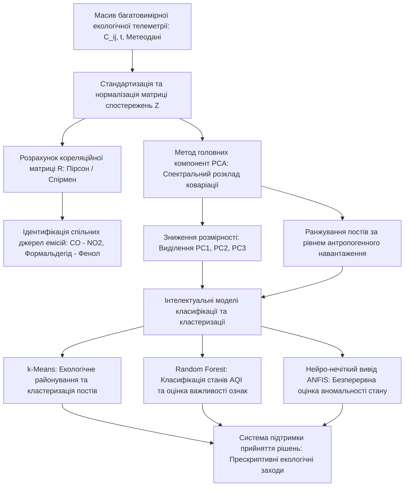

# Змістовий модуль 1. Системи збору та первинного аналізу даних в екологічному моніторингу

# Тема 5. Багатовимірний аналіз та інтелектуальні технології

---

## 5.1. Кореляційний аналіз у системі «полютант–полютант» та «полютант–метеофактор» (матриці Пірсона, Спірмена)

### Основний зміст та теоретичний базис
Сучасний стан урбанізованого середовища формується під впливом множини одночасно діючих природних і техногенних факторів, що зумовлює складний багатовимірний характер даних моніторингу довкілля. Для встановлення прихованих закономірностей взаємодії між різними хімічними сполуками в атмосфері, а також оцінки впливу гідрометеорологічних умов на процеси їхнього переносу та розсіювання застосовується математичний апарат кореляційного аналізу. Здобувачі вищої освіти в межах даного освітнього компонента повинні опанувати методи ідентифікації взаємозв'язків у багатовимірних масивах екологічної інформації, оскільки це дозволяє розв'язувати задачі виявлення спільних джерел емісій, оптимізувати склад вимірювальних каналів та підвищувати точність прогнозних моделей.

Оцінка лінійної залежності між двома неперервними нормально розподіленими екологічними величинами $X_i$ та $X_j$ здійснюється шляхом розрахунку парного коефіцієнта лінійної кореляції Пірсона $r_{ij}$:

$$r_{ij} = \frac{\text{Cov}(X_i, X_j)}{\sigma_{X_i} \sigma_{X_j}} = \frac{\sum_{t=1}^{T} (x_{i,t} - \mu_i)(x_{j,t} - \mu_j)}{\sqrt{\sum_{t=1}^{T} (x_{i,t} - \mu_i)^2 \sum_{t=1}^{T} (x_{j,t} - \mu_j)^2}},$$

де $\text{Cov}(X_i, X_j)$ — коваріація між часовими рядами параметрів $X_i$ та $X_j$; $\sigma_{X_i}$ та $\sigma_{X_j}$ — середньоквадратичні відхилення відповідних параметрів; $x_{i,t}$ та $x_{j,t}$ — значення концентрацій речовин або метеопоказників у момент часу $t$; $\mu_i$ та $\mu_j$ — вибіркові середні значення; $T$ — загальний обсяг часової вибірки.

Для сукупності $M$ екологічних показників формується симетрична квадратна кореляційна матриця $\mathbf{R} \in \mathbb{R}^{M \times M}$:

$$\mathbf{R} = \begin{bmatrix} 1 & r_{12} & \dots & r_{1M} \\ r_{21} & 1 & \dots & r_{2M} \\ \vdots & \vdots & \ddots & \vdots \\ r_{M1} & r_{M2} & \dots & 1 \end{bmatrix},$$

де головна діагональ складається з одиниць, а позадіагональні елементи задовольняють умову симетрії $r_{ij} = r_{ji}$ та належать числовому проміжку $[-1, 1]$. 

У випадках, коли розподіл виміряних концентрацій забруднюючих речовин відхиляється від нормального закону або містить значні асиметричні сплески (що характерно для періодів залпових промислових викидів), для оцінки монотонних нелінійних залежностей використовується ранговий коефіцієнт кореляції Спірмена $\rho_s$:

$$\rho_s = 1 - \frac{6 \sum_{t=1}^{T} d_t^2}{T(T^2 - 1)},$$

де $d_t = \text{rg}(x_{i,t}) - \text{rg}(x_{j,t})$ — різниця рангів, призначених спостереженням $x_{i,t}$ та $x_{j,t}$ після впорядкування їхніх числових значень у варіаційні ряди.

Практична цінність кореляційного аналізу в екологічних інформаційних системах полягає у можливості обґрунтованої ідентифікації спільних джерел походження забруднювачів на основі кількісних оцінок зв'язку в підсистемі «полютант–полютант». 

Емпіричні дослідження якості атмосферного повітря на прикладі промислових центрів (зокрема Кременчуцької агломерації) демонструють стійку статистично значущу позитивну кореляцію між оксидом вуглецю ($\text{CO}$) та діоксидом азоту ($\text{NO}_2$) на рівні $r \approx 0.42\dots0.55$. Цей зв'язок пояснюється наявністю спільного фізичного джерела емісій — процесів високотемпературного спалювання вуглеводневого палива у двигунах внутрішнього згоряння автотранспорту та факельних установках нафтохімічних комплексів. Схожий механізм формує помірний позитивний зв'язок між оксидом вуглецю та формальдегідом ($r \approx 0.45$), де формальдегід виступає як продуктом неповного окиснення палива, так і вторинним фотохімічним дериватом, що утворюється в атмосфері в присутності оксидів вуглецю та сонячної радіації.

Позитивна кореляція між формальдегідом і фенолом ($r \approx 0.41$) вказує на вплив органічних хімічних виробництв, виробництва синтетичних смол або використання специфічних розчинників у промисловій зоні. 

Взаємозв'язок між недиференційованим пилом і сажею ($r \approx 0.35\dots0.48$) обумовлений їхньою спільною природою як твердих дисперсних аерозолів, що генеруються котельними установками, дизельним вантажним транспортом та будівельними процесами. 

Слабкі або від'ємні кореляції (наприклад, між діоксидом сірки $\text{SO}_2$ та органічними сполуками) свідчать про просторову рознесеність або технологічну відмінність джерел їхньої генерації (викиди сірки зазвичай асоціюються зі спалюванням мазуту або вугілля на ТЕЦ, тоді як вуглеводні надходять переважно від автотранспортних магістралей).

Аналіз у підсистемі «полютант–метеофактор» встановлює фізичні закономірності розсіювання викидів:
* Швидкість вітру перебуває у вираженій негативній кореляційній залежності з приземними концентраціями більшості газів ($r \approx -0.40\dots-0.65$), оскільки збільшення динамічного перемішування повітряних мас інтенсифікує турбулентну дифузію та знижує локальну концентрацію домішок.
* Відносна вологість повітря виявляє складний нелінійний вплив, корелюючи позитивно з масовою концентрацією часток $\text{PM}_{2.5}$ та $\text{PM}_{10}$ через процеси гігроскопічного зростання розміру аерозолів при високій вологості, проте сприяючи вимиванню розчинних газів ($\text{SO}_2$, $\text{NO}_2$) під час випадання атмосферних опадів.
* Температура повітря впливає на швидкість фотохімічних трансформацій, зумовлюючи високу пряму кореляцію з утворенням вторинного приземного озону ($\text{O}_3$) у літній період та зворотну кореляцію з оксидом вуглецю через сезонне збільшення інтенсивності опалення в холодну пору року.

Здобувачі вищої освіти повинні пам'ятати класичний методологічний постулат: кореляція фіксує лише статистичну узгодженість варіації двох рядів і не є прямим доказом причинно-наслідкового зв'язку (causation), що вимагає залучення методів фізичного та математичного моделювання для остаточної верифікації гіпотез.

---

## 5.2. Метод головних компонент (PCA) для зниження розмірності простору екологічних ознак і ранжування антропогенного навантаження

### Основний зміст та теоретичний базис
Одночасний безперервний моніторинг десятків забруднюючих речовин і метеорологічних параметрів на великій кількості просторових станцій призводить до виникнення проблеми високої розмірності даних («прокляття розмірності»). Багатовимірний масив екологічної телеметрії містить значну надмірність (мультиколінеарність), оскільки концентрації багатьох споріднених речовин взаємно корелюють між собою. 

Для стиснення інформаційного простору без суттєвої втрати дисперсії первинних спостережень та для інтегральної оцінки техногенного стану територій застосовується **метод головних компонент** (Principal Component Analysis — PCA).

Математична формалізація методу базується на лінійній ортогональній трансформації стандартизованого простору ознак. Нехай вихідна матриця спостережень $\mathbf{X} \in \mathbb{R}^{T \times p}$ містить $T$ часових відліків за $p$ екологічними параметрами. На першому етапі здійснюється стандартизація матриці шляхом віднімання середніх значень $\mu_j$ та ділення на стандартні відхилення $\sigma_j$:

$$z_{t,j} = \frac{x_{t,j} - \mu_j}{\sigma_j}, \quad t = 1, \dots, T, \quad j = 1, \dots, p,$$

утворюючи центровану та нормовану матрицю $\mathbf{Z} \in \mathbb{R}^{T \times p}$.

На другому етапі обчислюється вибіркова коваріаційна (кореляційна) матриця $\mathbf{\Sigma} \in \mathbb{R}^{p \times p}$:

$$\mathbf{\Sigma} = \frac{1}{T - 1} \mathbf{Z}^T \mathbf{Z}.$$

Спектральне розкладання матриці $\mathbf{\Sigma}$ передбачає знаходження власних значень $\lambda_k$ та відповідних ортонормованих власних векторів $\mathbf{v}_k$:

$$\mathbf{\Sigma} \mathbf{v}_k = \lambda_k \mathbf{v}_k, \quad k = 1, \dots, p,$$

де власні значення впорядковуються за спаданням: $\lambda_1 \ge \lambda_2 \ge \dots \ge \lambda_p \ge 0$. Власні вектори $\mathbf{v}_k = [v_{1k}, v_{2k}, \dots, v_{pk}]^T$ визначають вагові коефіцієнти (loadings) вихідних екологічних параметрів у складі нової $k$-ї головної компоненти.

Перехід до нових некорельованих змінних — головних компонент (scores) $\mathbf{Y} \in \mathbb{R}^{T \times p}$ — здійснюється лінійним перетворенням:

$$\mathbf{Y} = \mathbf{Z} \mathbf{V},$$

де $\mathbf{V} = [\mathbf{v}_1, \mathbf{v}_2, \dots, \mathbf{v}_p]$ — матриця власних векторів. Кожна $k$-та головна компонента $Y_k$ являє собою лінійну комбінацію стандартизованих вихідних ознак:

$$Y_k = v_{1k} Z_1 + v_{2k} Z_2 + \dots + v_{pk} Z_p.$$

Частка загальної дисперсії ($\text{Proportion of Explained Variance}$ — $\text{PEV}_k$), що описується $k$-ю головною компонентою, дорівнює відношенню відповідного власного значення до сліду матриці коваріації:

$$\text{PEV}_k = \frac{\lambda_k}{\sum_{j=1}^{p} \lambda_j} = \frac{\lambda_k}{p}.$$

Кумулятивна частка поясненої дисперсії для перших $m$ компонент ($m < p$) розраховується як:

$$\text{CPEV}_m = \frac{\sum_{k=1}^{m} \lambda_k}{p}.$$

У практичних екологічних дослідженнях число утримуваних головних компонент $m$ вибирається за правилом Кайзера (відбір компонент із власними значеннями $\lambda_k > 1$) або за досягненням сумарної поясненої дисперсії $\text{CPEV}_m \ge 75\dots85\text{ \%}$.

Екологічна інтерпретація головних компонент дозволяє структурувати вплив антропогенних джерел:
* Перша головна компонента ($\text{PC}_1$), що акумулює від 40 % до 60 % загальної дисперсії, зазвичай має високі позитивні навантаження за показниками $\text{NO}_2$, $\text{CO}$, $\text{PM}_{2.5}$ та сажі. Вона інтерпретується як **інтегральний індекс загального техногенного навантаження**, спричиненого спалюванням викопного палива та автотранспортними потоками.
* Друга головна компонента ($\text{PC}_2$), що пояснює 15–25 % дисперсії, має домінуючі ваги за температурою, вологістю та приземним озоном, відображаючи **сезонно-кліматичний та фотохімічний фактор**.
* Третя головна компонента ($\text{PC}_3$) зазвичай асоціюється зі специфічними промисловими емісіями (фенол, сірководень, формальдегід), що дозволяє локалізувати вплив окремих хімічних підприємств.

За допомогою значень першої головної компоненти $\text{PC}_1$ здійснюється просторове ранжування вимірювальних станцій муніципальної мережі за рівнем антропогенного тиску. Пункти спостереження з максимальними додатними значеннями координат проекції на вісь $\text{PC}_1$ класифікуються як критичні зони екологічної напруги, що вимагають першочергового впровадження регуляторних природоохоронних заходів.

---

## 5.3. Базові алгоритми машинного навчання для екологічної класифікації та виявлення прихованих патернів емісій

### Основний зміст та теоретичний базис
Розвиток інтелектуальних інформаційних технологій у сфері охорони навколишнього середовища зумовлює перехід від класичного статистичного аналізу до інтелектуальних методів машинного навчання (Machine Learning — ML). 

У контексті підготовки фахівців-екологів рівня PhD акцент зміщується з низькорівневого програмування алгоритмів на розуміння їхньої математичної сутності, правильний вибір методів та інтерпретацію результатів класифікації і кластеризації екологічних станів у середовищі Jupyter Lab за допомогою високорівневих бібліотек (`scikit-learn`, `scipy`).

Для виявлення прихованих структур та автоматичного районування території за ступенем екологічної безпеки без використання попередньої розмітки застосовуються методи навчання без учителя (unsupervised learning), серед яких базовим є **алгоритм $k$-середніх ($k$-Means)**. Цільова функція мінімізує суму квадратів відстаней від об'єктів (векторів стану вимірювальних постів $\mathbf{x}_t$) до центроїдів відповідних кластерів $\mathbf{\mu}_k$:

$$J(C) = \sum_{k=1}^{K} \sum_{\mathbf{x}_t \in S_k} \|\mathbf{x}_t - \mathbf{\mu}_k\|^2,$$

де $S_k$ — множина точок, віднесених до $k$-го кластера; $\mathbf{\mu}_k = \frac{1}{|S_k|} \sum_{\mathbf{x}_t \in S_k} \mathbf{x}_t$ — вектор координат центроїда $k$-го кластера; $K$ — загальна кількість екологічних зон (наприклад, $K = 3$: фонова рекреаційна зона, зона помірного транспортного навантаження, зона екстремального промислового забруднення).

Для задач автоматизованого присвоєння категорій індексу якості повітря (AQI) або детектування фактів перевищення екологічних нормативів за комплексом супутніх параметрів застосовуються методи навчання з учителем (supervised learning), зокрема **ансамблеві моделі на основі дерев рішень (Random Forest)** та **метод опорних векторів (Support Vector Machines — SVM)**.

Модель Random Forest базується на побудові ансамблю із $B$ незалежних дерев ухвалення рішень, кожне з яких навчається на випадковій бутстреп-підвибірці навчального датасету (bagging) з випадковим вибором підмножини ознак у кожному вузлі розщеплення. Результуюча класифікаційна оцінка екологічного стану $\hat{y}$ формується шляхом мажоритарного голосування:

$$\hat{y} = \text{mode}\big\{ h_1(\mathbf{x}), h_2(\mathbf{x}), \dots, h_B(\mathbf{x}) \big\},$$

де $h_b(\mathbf{x})$ — прогноз класу якості повітря, згенерований $b$-м окремим деревом рішень. 

Перевагою Random Forest для екологічних досліджень є стійкість до мультиколінеарності вхідних параметрів, відсутність схильності до перенавчання на зашумлених даних та можливість обчислення індексу важливості ознак ($\text{Feature Importance}$ на основі зменшення неоднорідності Джині або перестановочної точності), що дозволяє ранжувати внесок кожного окремого газу та метеофактора у формування токсичних ситуацій.

*Рисунок 1 — Схема багатовимірного аналізу та інтелектуальної обробки екологічних даних*

Представлена на рисунку 1 схема демонструє логічну послідовність етапів трансформації багатовимірної первинної інформації у прикладні управлінські рішення. Після етапу стандартизації формуються дві паралельні гілки аналітичної обробки. Перша гілка реалізує кореляційний аналіз для з'ясування взаємозв'язків між окремими хімічними сполуками та ідентифікації спільних технологічних джерел їхньої емісії. Друга гілка здійснює спектральне розкладання матриці коваріації в межах процедури PCA, що забезпечує ортогональне проєктування ознакового простору в координати перших головних компонент, нівелюючи взаємну надмірність показників і ранжуючи пости спостереження за рівнем кумулятивного антропогенного тиску. 

Отримані низьковимірні вектори ознак передаються на вхід блоків машинного навчання: алгоритм $k$-Means формує об'єктивні межі екологічних зон, модель Random Forest категоризує рівні небезпеки якості повітря з оцінкою відносної ваги кожного фактора, а система адаптивного нейро-нечіткого виводу (ANFIS) забезпечує безперервний моніторинг ступеня аномальності вузлів, формуючи достовірне підґрунтя для прийняття оперативних екологічних рішень.

| Метод аналізу | Математична сутність | Вхідні параметри | Вихідний результат | Переваги в екології | Обмеження застосування |
| :--- | :--- | :--- | :--- | :--- | :--- |
| **Кореляційний аналіз (Пірсон/Спірмен)** | Оцінка коваріації та рангових відхилень між змінними | Пари часових рядів полютантів і метеофакторів | Кореляційні матриці, коефіцієнти $r_{ij} \in [-1, 1]$ | Швидка ідентифікація спільних джерел емісій | Відображає лише парні зв'язки, не доводить причинність |
| **Метод головних компонент (PCA)** | Власне розкладання кореляційної матриці, ортогональне проєктування | Стандартизована матриця всіх вимірюваних параметрів $\mathbf{Z}$ | Головні компоненти $Y_k$, навантаження $v_{jk}$, графіки Biplot | Зниження розмірності, усунення мультиколінеарності | Втрата прямої фізичної розмірності компонент |
| **Кластеризація $k$-Means** | Ітеративна мінімізація суми внутрішньокластерних квадратів відстаней | Вектори екологічного стану постів або просторові координати | Поділ постів на $K$ дискретних екологічних кластерів | Автоматичне районування території без вчителя | Чутливість до вибору початкових центроїдів і кількості $K$ |
| **Класифікація Random Forest** | Ансамблеве усереднення результатів множини дерев рішень | Багатовимірний вектор ознак (концентрації + метеорологія) | Категорія індексу AQI, оцінка $\text{Feature Importance}$ | Висока точність, стійкість до шуму, оцінка ваги полютантів | Необхідність наявності розміченої навчальної вибірки |
| **Нейро-нечіткий вивід (ANFIS)** | Гібрид штучної нейронної мережі та бази нечітких правил IF-THEN | Нормалізовані вектори телеметрії та лінгвістичні терми | Безперервний коефіцієнт аномальності $\alpha \in [0, 1]$ | Прозорість логіки прийняття рішень, висока інтерпретованість | Обчислювальна складність при великій кількості входів |

Порівняльний аналіз наведених методів підтверджує, що сучасні інформаційно-аналітичні технології вимагають комбінованого застосування математичного апарату. Використання PCA як попереднього етапу зниження розмірності суттєво підвищує стійкість і швидкодію подальших алгоритмів класифікації та нейро-нечіткого моделювання, оптимізуючи процес обробки великих обсягів даних муніципального екологічного моніторингу.

---

### Питання для самоперевірки та аналітичного осмислення

1. Які фізико-хімічні процеси в атмосфері та технологічні особливості виробництва зумовлюють високий рівень взаємної кореляції між концентраціями оксиду вуглецю ($\text{CO}$) та діоксиду азоту ($\text{NO}_2$)?
2. У чому полягає відмінність між використанням коефіцієнта кореляції Пірсона та рангового коефіцієнта Спірмена при аналізі екологічних рядів із нелінійними залежностями та аномальними сплесками?
3. Поясніть математичний зміст власних значень $\lambda_k$ та власних векторів $\mathbf{v}_k$ коваріаційної матриці в контексті методу головних компонент (PCA).
4. Як кумулятивна частка поясненої дисперсії ($\text{CPEV}_m$) використовується для обґрунтування кількості утримуваних головних компонент при скороченні простору екологічних ознак?
5. Яким чином метод головних компонент дозволяє здійснювати інтегральне ранжування муніципальних моніторингових постів за ступенем кумулятивного техногенного навантаження?
6. Охарактеризуйте механізм оцінки важливості ознак ($\text{Feature Importance}$) у моделі Random Forest та її значення для виявлення провідних факторів погіршення індексу якості повітря (AQI).
7. Чому використання систем нейро-нечіткого виводу (ANFIS) має перевагу над «чорними скриньками» глибокого навчання в задачах екологічного аудиту та моніторингу критичної інфраструктури?