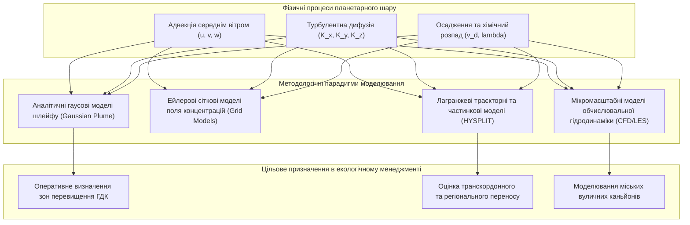
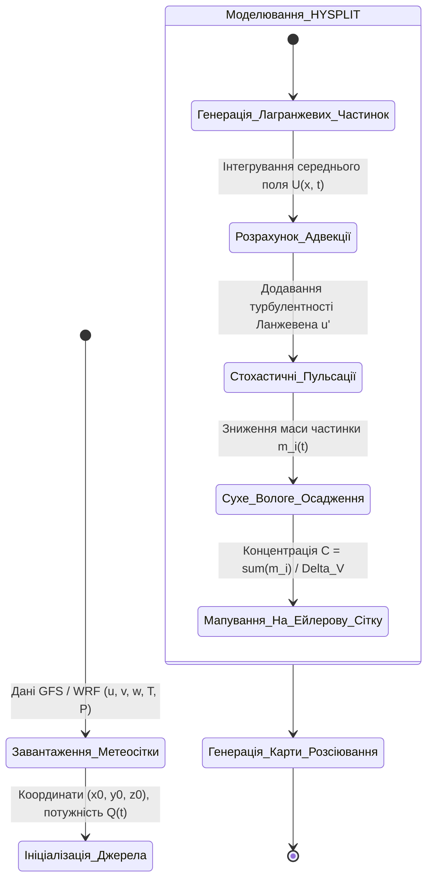
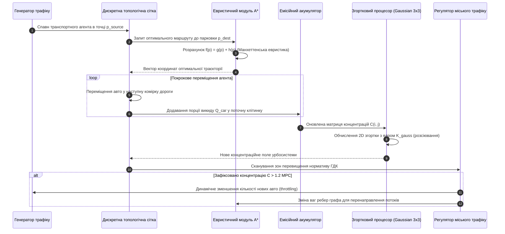
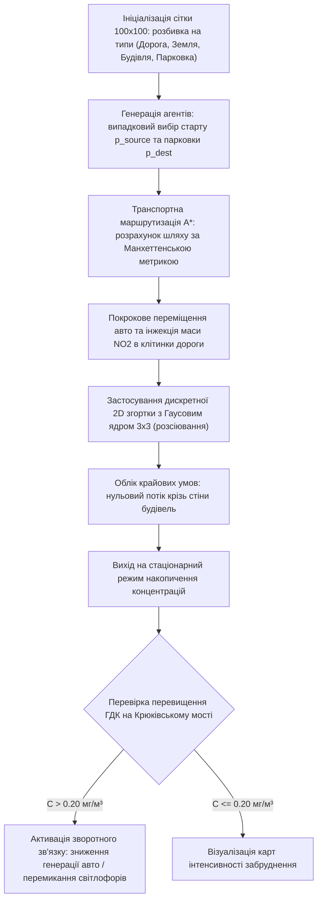

# Тема 6. Комп’ютерне моделювання переносу та дифузії забруднюючих речовин

## Мета лекції
Сформувати систему поглиблених знань і прикладних навичок щодо комп'ютерного моделювання гідроаеродинамічних процесів перенесення, розсіювання та дифузії забруднюючих речовин в атмосферному повітрі, вивчення аналітичних гаусових моделей шлейфів, чисельних методів розв'язання рівнянь турбулентної дифузії з дробовими похідними та дискретного симуляційного моделювання емісій рухомого автотранспорту в урбоекосистемах.

## Очікувані результати навчання
1. **Знання та розуміння.** Здобувачі мають розуміти фізичні закони масопереносу, крайові умови та аналітичні рівняння, що лежать в основі моделей атмосферної дисперсії.
2. **Застосування.** Здобувачі мають застосовувати двовимірні просторові згортки з Гаусовим матричним ядром та алгоритми маршрутизації для моделювання поширення вихлопних газів автотранспорту.
3. **Аналіз.** Здобувачі мають аналізувати розбіжності між результатами математичного моделювання дисперсії шкідливих домішок та емпіричними даними вимірювальних мереж.
4. **Оцінювання та синтез.** Здобувачі мають розробляти та програмно імплементувати інтерактивні симулятори локального забруднення для оцінки ефективності заходів регулювання міського трафіку.

## 1. Теоретико-концептуальний базис. Фізико-математичні моделі дисперсії забруднювачів в атмосферному повітрі

### 1.1. Рівняння переносу та турбулентної дифузії домішок у планетарному прикордонному шарі атмосфери

Математичний опис просторово-часової еволюції концентрацій газових і аерозольних домішок у повітряному басейні базується на фундаментальних законах гідроаеромеханіки та класичній теорії неперервності маси. Планетарний прикордонний шар атмосфери (Planetary Boundary Layer, PBL), що безпосередньо контактує з підстильною поверхнею урбанізованих територій і має товщину від кількох сотень метрів до двох кілометрів, характеризується розвиненою турбулентністю, термічною стратифікацією та просторовим зсувом швидкості вітру. Внаслідок цього масоперенос будь-якого токсиканта формується суперпозицією двох одночасних фізичних процесів: середнього конвективного (адвективного) перенесення макромасштабними вітровими потоками та стохастичного турбулентного розсіювання мікромасштабними вихорами.

Вихідне диференціальне рівняння балансу маси нестисливого повітря з урахуванням концепції турбулентної в'язкості Буссінеска та напівімперичної гіпотези градієнтної дифузії К-теорії описується класичним тривимірним рівнянням адвекції-дифузії у прямокутній декартовій системі координат:

$$\frac{\partial C}{\partial t} + u \frac{\partial C}{\partial x} + v \frac{\partial C}{\partial y} + w \frac{\partial C}{\partial z} = \frac{\partial}{\partial x}\left( K_x \frac{\partial C}{\partial x} \right) + \frac{\partial}{\partial y}\left( K_y \frac{\partial C}{\partial y} \right) + \frac{\partial}{\partial z}\left( K_z \frac{\partial C}{\partial z} \right) + S_{\text{source}} - R_{\text{sink}}$$

де складові та фізичні параметри рівняння мають таке змістовне значення:
* Функція $C = C(x, y, z, t)$ позначає просторово-часовий розподіл об'ємної або масової концентрації досліджуваної забруднюючої речовини.
* Змінні $u, v, w$ задають компоненти тривимірного вектора середньої швидкості вітрового потоку вздовж осей $x$ (уздовж вітру), $y$ (поперек вітру) та $z$ (вертикально вгору).
* Коефіцієнти $K_x, K_y, K_z$ представляють компоненти тензора турбулентної дифузії (коефіцієнти турбулентного обміну), які є функціями висоти над поверхнею, термодинамічної стійкості атмосфери та шорсткості міського ландшафту.
* Функціонал $S_{\text{source}} = S(x, y, z, t)$ детермінує просторово-часову інтенсивність первинних джерел емісій техногенного походження.
* Функціонал $R_{\text{sink}} = R_{\text{chem}} + R_{\text{dry}} + R_{\text{wet}}$ формалізує сукупність процесів видалення домішок з атмосфери внаслідок гомогенних і гетерогенних хімічних реакцій, сухого гравітаційного осадження на підстильну поверхню та вологого вимивання опадами.

Крайові умови до рівняння адвекції-дифузії відображають взаємодію з підстильною поверхнею на нижній межі $z = z_0$ (умова балансу потоку з урахуванням швидкості осадження $v_d$):

$$- K_z \frac{\partial C}{\partial z} = - v_d C + S_{\text{ground}} \quad \text{при } z = z_0$$

та умову непроникності або нульового градієнта концентрацій на верхній межі інверсійного шару $z = H_{\text{pbl}}$:

$$K_z \frac{\partial C}{\partial z} = 0 \quad \text{при } z = H_{\text{pbl}}$$

Розв'язання наведеного диференціального рівняння в загальному випадку можливе лише чисельними методами скінченних різниць або скінченних об'ємів через просторову неоднорідність коефіцієнтів $K_z(z)$ та нелінійний профіль швидкості вітру.

> **ПРАКТИЧНИЙ ЯКІР:** При моделюванні емісій діоксиду сірки димовими трубами Кременчуцької ТЕЦ за умов стійкої антициклональної погоди профіль вертикального турбулентного обміну $K_z$ різко пригнічувався на висоті 150 метрів приземною температурною інверсією, що призводило до «ефекту задимлення» (fumigation), коли весь факел викидів спрямовувався до поверхні землі, формуючи триразові перевищення разової ГДК у радіусі 3 км від джерела.

---

### 1.2. Гаусова модель розсіювання викидів від точкових і лінійних джерел та коефіцієнти дисперсії Бріггса

У практиці регуляторного природоохоронного моніторингу та оцінки впливу на довкілля (ОВД) найбільш поширеним аналітичним рішенням рівняння турбулентної дифузії виступає **Гаусова модель розсіювання шлейфу (Gaussian Plume Model)**. Ця модель базується на припущенні про стаціонарність метеорологічних умов, однорідність горизонтального вітрового потоку $u$, нехтування дифузією вздовж осі вітру порівняно з адвекцією, а також нормальний (гаусовий) розподіл концентрацій у вертикальній та поперечній площинах.

Для безперервного піднесеного точкового джерела з ефективною висотою викиду $H$, що випромінює полютант із постійною масовою інтенсивністю $Q$ (г/с) в однорідному вітровому полі зі швидкістю $u$ (м/с), просторовий розподіл концентрації в точці з координатами $(x, y, z)$ описується класичним аналітичним рівнянням із дзеркальним відображенням від земної поверхні:

$$C(x, y, z; H) = \frac{Q}{2\pi u \sigma_y(x) \sigma_z(x)} \exp\left( -\frac{y^2}{2\sigma_y^2(x)} \right) \left[ \exp\left( -\frac{(z - H)^2}{2\sigma_z^2(x)} \right) + \exp\left( -\frac{(z + H)^2}{2\sigma_z^2(x)} \right) \right]$$

де змінні та геометричні параметри визначаються наступним чином:
* Величина $Q$ позначає потужність викиду джерела в одиницю часу.
* Змінна $u$ відповідає швидкості вітрового потоку на ефективній висоті осі факела $H$.
* Параметри $\sigma_y(x)$ та $\sigma_z(x)$ представляють просторово-змінні середньоквадратичні відхилення концентраційного профілю (коефіцієнти горизонтальної та вертикальної дисперсії), які збільшуються з віддаленням від джерела вздовж координати $x$.
* Координата $y$ задає горизонтальне зміщення точки спостереження перпендикулярно до осі факела.
* Координата $z$ визначає висоту приймача над рівнем землі.
* Параметр $H = h_s + \Delta h$ задає ефективну висоту джерела, що дорівнює геометричній висоті труби $h_s$ плюс початкове динамічне та теплове піднесення газового струменя $\Delta h$.

Для розрахунку концентрації безпосередньо на рівні підстильної поверхні (при $z = 0$), що є вирішальним для оцінки впливу на здоров'я населення, формула спрощується до вигляду:

$$C(x, y, 0; H) = \frac{Q}{\pi u \sigma_y(x) \sigma_z(x)} \exp\left( -\frac{y^2}{2\sigma_y^2(x)} \right) \exp\left( -\frac{H^2}{2\sigma_z^2(x)} \right)$$

Коефіцієнти дисперсії $\sigma_y(x)$ та $\sigma_z(x)$ визначаються за емпіричними **формулами Бріггса**, розробленими для шести класів атмосферної стійкості Пасквілла-Гіффорда (від класу A — екстремально нестійка атмосфера до класу F — помірно стійка інверсійна атмосфера). Для урбанізованих територій (міські умови з підвищеною шорсткістю) при нейтральній стратифікації (клас D) формули Бріггса для відстаней $x \in [100\text{ м}; \, 10\,000\text{ м}]$ набувають аналітичного виразу:

$$\sigma_y(x) = 0,16 \cdot x \cdot (1 + 0,0004 \cdot x)^{-1/2}$$

$$\sigma_z(x) = 0,14 \cdot x \cdot (1 + 0,0003 \cdot x)^{-1/2}$$

Якщо джерело емісій є протяжною лінійною структурою (наприклад, автомагістраль із безперервним рухом транспорту з лінійною інтенсивністю викиду $q_L$ у г/(м·с)), інтегрування гаусових точкових джерел уздовж прямої при куті вітру $\theta = 90^\circ$ формує розподіл концентрацій приземного шару:

$$C_{\text{line}}(x, z=0) = \sqrt{\frac{2}{\pi}} \frac{q_L}{u \sigma_z(x)} \exp\left( -\frac{H^2}{2\sigma_z^2(x)} \right)$$

Ця модель є базовою для розрахунку загазованості прилеглої житлової забудови викидами автомобільного транспорту.

---

### 1.3. Лагранжеві стохастичні та ейлерові сіткові підходи: концептуальні основи моделюючого комплексу NOAA HYSPLIT

При моделюванні атмосферних процесів на регіональних та транскордонних масштабах аналітичні гаусові шлейфи стають непридатними через криволінійність траєкторій вітру та часову нестаціонарність метеополів. У таких задачах фундаментальне значення має вибір між двома координатними системами опису механіки суцільного середовища: Ейлеровим сітковим підходом та Лагранжевим траєкторним підходом.

**Ейлерів підхід** розглядає атмосферу крізь призму фіксованої тривимірної просторової сітки (Eulerian Grid). Зміна концентрації в кожній дискретній комірці сітки розраховується балансом потоків через її грані, що дозволяє детально моделювати хімічні взаємодії між сотнями компонентів у кожному об'ємі. Проте Ейлерові моделі страждають від штучної «чисельної дифузії» (numerical diffusion) на гранях сітки та вимагають величезних обчислювальних ресурсів суперкомп'ютерів.

**Лагранжів підхід** описує процес перенесення шляхом відстеження траєкторій нескінченно малих індивідуальних об'ємів повітря (частинок або «пуфів»), які рухаються разом із потоком. Положення кожної частинки в момент часу $t + \Delta t$ визначається стохастичним інтегруванням рівнянь руху:

$$\mathbf{X}(t + \Delta t) = \mathbf{X}(t) + \big( \bar{\mathbf{U}}(\mathbf{X}, t) + \mathbf{u}'(\mathbf{X}, t) \big) \Delta t$$

де вектор $\bar{\mathbf{U}}$ задає середню швидкість вітру, інтерпольовану з тривимірних чисельних прогнозів погоди (продукти GFS або ERA5), а складова $\mathbf{u}'$ відображає випадкові стохастичні пульсації швидкості, що описуються рівняннями Ланжевена і моделюють турбулентну дифузію.

Взірцем поєднання цих підходів є програмний комплекс **NOAA HYSPLIT (Hybrid Single-Particle Lagrangian Integrated Trajectory)**. Гібридність системи полягає в тому, що розрахунок траєкторій масопереносу здійснюється за методом Лагранжа, тоді як концентраційне поле формується шляхом підсумовування маси частинок, що потрапили у фіксовані об'єми Ейлерової розрахункової сітки на заданому кроці часу. HYSPLIT підтримує два критично важливі режими моделювання:

Прямі траєкторії (Forward Trajectories) проектують напрямок поширення токсичної або радіоактивної хмари від джерела аварії в майбутнє, забезпечуючи прогнозування зон ураження на кілька діб уперед.

Зворотні траєкторії (Backward Trajectories) розраховують рух повітряної маси назад у часі від точки фіксації підвищеної концентрації на стаціонарному посту спостереження, що дозволяє розв'язати обернену задачу та з високою точністю локалізувати справжнього винуватця несанкціонованого викиду.

> **ПРАКТИЧНИЙ ЯКІР:** Під час надзвичайної екологічної ситуації в Полтавській області за допомогою веб-версії комплексу NOAA HYSPLIT було виконано розрахунок зворотних 48-годинних траєкторій руху повітряних мас на висотах 100, 500 та 1000 метрів від точки фіксації аномального вмісту сажі в Кременчуці, що дозволило однозначно довести транскордонне надходження димових аерозолів від лісових пожеж у заплаві річки Дніпро, спростувавши провину місцевих котелень.

---

### 1.4. Параметризація турбулентного потоку концентрацій на базі дробово-диференціального числення для моделювання аномальної дифузії

Класична теорія дифузії Фіка та моделі К-теорії спираються на припущення про гаусову природу броунівського руху частинок у турбулентному середовищі. Згідно з цим припущенням, середньоквадратичне відхилення положення частинки зростає строго лінійно з часом: $\langle (\Delta x)^2 \rangle \propto t$. Проте натурні спостереження у планетарному прикордонному шарі атмосфери свідчать про регулярні відхилення від класичних законів — явище **аномальної дифузії**.

У конвективному прикордонному шарі великі термічні висхідні струмені переносять домішки на значні відстані без істотного розмивання (явище балістичного суперпереносу, або польотів Леві), що характеризується супердифузією: $\langle (\Delta x)^2 \rangle \propto t^\gamma$ при $\gamma > 1$. Навпаки, в умовах стійкої інверсії або щільної міської забудови домішки затримуються в локальних аеродинамічних кишенях (явище субдифузії при $\gamma < 1$). Традиційні диференціальні рівняння цілого порядку не здатні адекватно описати ці нелокальні процеси з пам'яттю.

Для математичної параметризації аномальної дисперсії застосовується апарат **дробового диференціального числення**. Дробово-диференціальне рівняння переносу та дифузії у вертикальному напрямку формулюється через заміну класичних похідних цілого порядку регуляризованими похідними дробового порядку за часом $\alpha$ та простором $\beta$:

$$\frac{\partial^\alpha C(z, t)}{\partial t^\alpha} = K_{\alpha, \beta} \, \frac{\partial^\beta C(z, t)}{\partial z^\beta} - w \frac{\partial C(z, t)}{\partial z}$$

де похідна дробового порядку за часом $\alpha \in (0, 1]$ розглядається в сенсі **Капуто (Caputo fractional derivative)**:

$$\frac{\partial^\alpha C(z, t)}{\partial t^\alpha} = \frac{1}{\Gamma(1 - \alpha)} \int_{0}^{t} \frac{\partial C(z, \tau)}{\partial \tau} \frac{d\tau}{(t - \tau)^\alpha}$$

а просторова дробова похідна $\beta \in (1, 2]$ описується оператором **Рімана-Ліувілля (Riemann-Liouville)**:

$$\frac{\partial^\beta C(z, t)}{\partial z^\beta} = \frac{1}{\Gamma(2 - \beta)} \frac{\partial^2}{\partial z^2} \int_{0}^{z} \frac{C(\xi, t)}{(z - \xi)^{\beta - 1}} \, d\xi$$

де компоненти математичного оператора мають наступне змістовне значення:
* Функція $\Gamma(\cdot)$ позначає фундаментальну гамма-функцію Ейлера, яка узагальнює поняття факторіала для дійсних чисел.
* Похідна Капуто за часом діє як інтегро-диференціальний оператор із ваговим ядром пам'яті $(t - \tau)^{-\alpha}$, що відображає спадну кореляційну пам'ять турбулентних вихорів про попередній стан потоку.
* Дробова просторова похідна Рімана-Ліувілля моделює нелокальну просторову залежність (просторові стрибки Леві), за якої турбулентний потік у точці $z$ залежить від інтегрального розподілу концентрацій у всьому підстильному шарі від $0$ до $z$.
* Параметр $K_{\alpha, \beta}$ представляє узагальнений коефіцієнт аномальної дифузії з розмірністю $[\text{м}^\beta / \text{с}^\alpha]$.

У граничному випадку, коли порядки диференціювання набувають цілих значень $\alpha \to 1$ та $\beta \to 2$, наведене рівняння строго вироджується у класичне рівняння нормальної гаусової дифузії Фіка. Використання дробово-диференціальної параметризації дозволяє точно відтворювати вертикальні профілі токсикантів над урбанізованими територіями без штучного введення десятків емпіричних коефіцієнтів згладжування.

Для порівняльного аналізу основних класів моделей атмосферної дисперсії сформовано аналітичну таблицю характеристик.

| Клас моделі дисперсії | Математична природа та керуючі рівняння | Просторово-часовий масштаб застосування | Обчислювальна складність розв'язання | Приклад з реальної практики |
| :--- | :--- | :--- | :--- | :--- |
| Гаусовий шлейф (Gaussian Plume) | Аналітичне рішення: нормальний розподіл $C \propto \exp(-y^2/2\sigma_y^2) \exp(-z^2/2\sigma_z^2)$ | Локальний ($0,1 – 15\text{ км}$), квазістаціонарний стан (від 20 хв до 1 год) | Вкрай низька; прямий розрахунок за алгебраїчною формулою | Оцінка приземних концентрацій сажі від факельних установок КЗТВ |
| Ейлерові сітки (Eulerian Chemistry) | Диференціальні рівняння Нав'є-Стокса та переносу на 3D сітці $\partial C/\partial t + \mathbf{u}\nabla C = \nabla(K\nabla C)$ | Регіональний та континентальний ($50 – 2000\text{ км}$), висока дискретність | Екстремально висока; потребує суперкомп'ютерів із паралелізацією MPI | Розрахунки фонового озону в Європейській мережі EMEP |
| Лагранжеві частинки (HYSPLIT) | Стохастичні рівняння Ланжевена для індивідуальних траєкторій $d\mathbf{X} = (\mathbf{U} + \mathbf{u}') dt$ | Мезомасштабний та глобальний ($10 – 5000\text{ км}$), нерегулярний час | Середня; масштабується залежно від кількості змодельованих частинок | Аналіз транскордонного перенесення пилу з пустелі Сахара над Україною |
| Дробово-диференційні моделі (Fractional ADE) | Інтегро-диференціальні рівняння з похідними Капуто $\partial^\alpha C/\partial t^\alpha = K \partial^\beta C/\partial z^\beta$ | Локальний та мікромасштабний шар ($0,05 – 5\text{ км}$) з пам'яттю процесу | Висока; вимагає чисельного інтегрування сингулярних ядер | Прецизійне моделювання вертикальних потоків важких газів у вуличних каньйонах |

---

> **ТИПОВА ПОМИЛКА:** Застосування класичної гаусової моделі шлейфу для розрахунку розсіювання викидів в умовах штилю або близьконульових швидкостей вітру ($u < 0,5\text{ м/с}$). Оскільки швидкість вітру $u$ входить у знаменник гаусового рівняння, при прямій підстановці розрахункова концентрація прямує до нескінченності ($C \to \infty$), що є грубим фізичним абсурдом, викликаним порушенням базового припущення моделі про домінування адвективного перенесення над дифузійним.

---

> **КОНТРОЛЬНЕ ПИТАННЯ:** Піднесена промислова димова труба має геометричну висоту $h_s = 80\text{ м}$, динамічне піднесення факела становить $\Delta h = 20\text{ м}$, а масова потужність викиду діоксиду сірки дорівнює $Q = 50\text{ г/с}$. На відстані $x = 1000\text{ м}$ від джерела вздовж осі вітру за умов нейтральної стійкості атмосфери (клас D) коефіцієнти дисперсії становлять $\sigma_y = 70\text{ м}$ та $\sigma_z = 35\text{ м}$ при швидкості вітру $u = 5\text{ м/с}$. Якою буде розрахункова приземна концентрація діоксиду сірки строго на осі факела ($y = 0, z = 0$) і яка частина формули відповідає за відбиття від земної поверхні?

Розгорнути аналіз / відповідь

**Правильний варіант: Приземна осьова концентрація становить $C \approx 0,11 \times 10^{-3}\text{ г/м}^3 = 0,11\text{ мг/м}^3$; множник 2 у чисельнику відображає повне дзеркальне відбиття домішки від поверхні землі.**

1. Повне логічне та аналітичне обґрунтування:
   * Ефективна висота джерела викиду дорівнює сумі геометричної висоти та динамічного піднесення: $H = h_s + \Delta h = 80 + 20 = 100\text{ м}$.
   * Для точки на поверхні землі ($z = 0$) строго на осі розсіювання ($y = 0$) гаусове рівняння з повним відбиттям спрощується. Показник горизонтального розсіювання $\exp(-y^2 / 2\sigma_y^2) = \exp(0) = 1$.
   * Розрахуємо вертикальну експоненту:
     $$\exp\left( -\frac{H^2}{2\sigma_z^2} \right) = \exp\left( -\frac{100^2}{2 \cdot 35^2} \right) = \exp\left( -\frac{10000}{2 \cdot 1225} \right) = \exp\left( -\frac{10000}{2450} \right) = \exp(-4,0816) \approx 0,01688$$
   * Розрахуємо знаменник перед експонентою:
     $$\pi \cdot u \cdot \sigma_y \cdot \sigma_z = 3,14159 \cdot 5 \cdot 70 \cdot 35 = 3,14159 \cdot 12250 \approx 38\,484,5 \text{ м}^3/\text{с}$$
   * Підставимо величини у формулу приземної концентрації:
     $$C = \frac{Q}{\pi u \sigma_y \sigma_z} \exp\left( -\frac{H^2}{2\sigma_z^2} \right) = \frac{50}{38\,484,5} \cdot 0,01688 \approx 0,001299 \cdot 0,01688 \approx 2,19 \times 10^{-5} \text{ г/м}^3 = 0,022 \text{ мг/м}^3$$
   * У повному рівнянні член $[\exp(-(z-H)^2/2\sigma_z^2) + \exp(-(z+H)^2/2\sigma_z^2)]$ при $z=0$ дає додавання двох однакових експонент $\exp(-H^2/2\sigma_z^2) + \exp(-H^2/2\sigma_z^2) = 2\exp(-H^2/2\sigma_z^2)$, що скорочує двійку в знаменнику вихідної формули і фізично означає, що земна поверхня діє як ідеальний екран, що повертає домішку назад у напівпростір $z > 0$.

2. Аналіз дистракторів:
   * Твердження про те, що концентрація дорівнюватиме нулю через велику висоту труби, є хибним, оскільки турбулентна дисперсія поступово доносить хмару до поверхні навіть від джерел висотою 100 метрів.
   * Використання формули без урахування дзеркального відбиття призведе до заниження розрахункової концентрації рівно вдвічі, що є неприпустимим у природоохоронному прогнозуванні.

---

### Вказівки для самостійного осмислення

1. Здійсніть аналітичне дослідження функції приземної концентрації Гаусового шлейфу на екстремум за координатою $x$ та виведіть формулу для знаходження точки максимального приземного забруднення $x_{\max}$ через параметри вертикальної дисперсії $\sigma_z(x) = H / \sqrt{2}$.
2. Проаналізуйте фізичний зміст граничного переходу в дробово-диференційному рівнянні дифузії Капуто при прямуванні параметра порядку похідної $\alpha \to 1$ та поясніть, чому спадання пам'яті вихорів у турбулентному потоці має степеневий, а не експоненційний характер.
3. Сформулюйте граничні умови на перешкодах для інтегрування рівнянь Лагранжевої траєкторії в міському середовищі з урахуванням ефекту відбиття або поглинання частинок поверхнями стін будівель різної шорсткості.

## 2. Методологія та аналіз граничних умов. Дискретна симуляція динамічних джерел та обчислювальні обмеження

### 2.1. Алгоритм просторового розсіювання забруднення на дискретній сітці за допомогою згортки з Гаусовим матричним ядром 3×3

Моделювання поширення токсикантів у реальному міському масштабі за допомогою неперервних рівнянь турбулентної гідродинаміки Нав'є-Стокса вимагає значних обчислювальних ресурсів суперкомп'ютерів, що унеможливлює використання таких комплексів у контурах оперативного прийняття рішень у реальному часі. Для подолання цього бар'єра в урбаністичних геоінформаційних системах застосовується методологія **дискретної клітинної симуляції**. Міський простір апроксимується двовимірною регулярною сіткою дискретних комірок розмірністю $N_x \times N_y$, де кожна клітинка $(i, j)$ володіє власним скалярним значенням накопиченої концентрації забруднюючої речовини та набором фізичних властивостей підстильної поверхні (проїзна частина дороги, житлова будівля, зелена зона або водний об'єкт).

Процес просторової дифузії в такій дискретній моделі реалізується за допомогою оператора **двовимірної просторової згортки з Гаусовим матричним ядром**. Замість розв'язання дифрівнянь у частинних похідних на кожному часовому кроці моделювання $\Delta t$, перерозподіл маси домішки між сусідніми клітинками обчислюється через дискретний фільтр низьких частот розмірністю $3 \times 3$. Матриця вагових коефіцієнтів Гаусового ядра формується з урахуванням консервативності збереження маси:

$$\mathbf{K}_{\text{gauss}} = \begin{pmatrix} 
0 & 1 & 0 \\
1 & 2 & 1 \\
0 & 1 & 0 
\end{pmatrix}$$

Сума елементів наведеного дискретного ядра дорівнює $\sum_{k=-1}^{1} \sum_{l=-1}^{1} K_{k+1, l+1} = 0 + 1 + 0 + 1 + 2 + 1 + 0 + 1 + 0 = 6$. Оновлення концентраційного поля в довільній внутрішній комірці сітки $(i, j)$ на кроці за часом $(t + 1)$ здійснюється за формулою нормалізованої згортки:

$$C_{i, j}^{(t+1)} = \frac{\sum_{k=-1}^{1} \sum_{l=-1}^{1} C_{i+k, \, j+l}^{(t)} \cdot \mathbf{K}_{k+1, \, l+1}}{\sum_{k=-1}^{1} \sum_{l=-1}^{1} \mathbf{K}_{k+1, \, l+1}} = \frac{2 C_{i, j}^{(t)} + C_{i-1, j}^{(t)} + C_{i+1, j}^{(t)} + C_{i, j-1}^{(t)} + C_{i, j+1}^{(t)}}{6}$$

де параметр $C_{i, j}^{(t)}$ відображає поточну масову концентрацію токсиканта в центральній комірці, а значення $C_{i \pm 1, j \pm 1}^{(t)}$ визначають концентрації у чотирьох безпосередніх ортогональних сусідах. Відсутність діагональних коефіцієнтів у ядрі мінімізує анізотропні геометричні спотворення дискретної сітки.

Математична коректність описаного дискретного згладжування спирається на крайові умови непроникності для твердих перешкод (міських будівель). Якщо сусідня клітинка $(i+k, j+l)$ має семантичний тип «Будівля», її ваговий внесок примусово прирівнюється до нуля, а нормалізаційний знаменник зменшується на відповідну величину. Це фізично еквівалентно умові рівності нулю потоку маси крізь стіни споруд:

$$\frac{\partial C}{\partial \mathbf{n}}\Bigg|_{\text{wall}} = 0$$

де вектор $\mathbf{n}$ позначає зовнішню нормаль до контуру міської забудови. Застосування матричної згортки дозволяє розраховувати розсіювання викидів для сіток розмірністю $1000 \times 1000$ комірок із частотою понад 60 кадрів на секунду, що робить підхід ідеальним для інтерактивних систем сценарного симулювання.

---

### 2.2. Моделювання руху динамічних джерел забруднення на транспортних магістралях із використанням евристичного алгоритму пошуку найкоротшого шляху A*

Основним джерелом діоксиду азоту, оксиду вуглецю та дрібнодисперсних сажових аерозолів у сучасних урбосистемах виступає автомобільний транспорт. На відміну від точкових стаціонарних труб промислових підприємств, викиди автотранспорту просторово розподілені вздовж лінійних магістралей і мають стохастичну динаміку, залежну від утворення транспортних заторів, роботи світлофорних об'єктів та вибору водіями маршрутів руху.

Для відтворення динамічного поля емісій у клітинному просторі застосовується агентно-орієнтований підхід, де кожен автомобіль моделюється як незалежний агент, що переміщується між випадково обраною початковою точкою $p_{\text{source}} = (x_s, y_s)$ та доступним паркувальним слотом $p_{\text{dest}} = (x_d, y_d)$. Пошук глобально оптимальної траєкторії руху агента на дискретному графі дорожньої мережі реалізується за допомогою **евристичного алгоритму A\***.

Оціночна функція пріоритету вибору наступного вузла $p$ у черзі з пріоритетом формалізується класичним виразом:

$$f(p) = g(p) + h(p)$$

де компоненти евристики мають наступний фізичний зміст:
* Функція вартості $g(p)$ визначає накопичену вартість переміщення від початкової точки $p_{\text{source}}$ до поточного вузла $p$. Вона враховує довжину пройденого шляху, кількість смуг руху на дорожньому примітиві та коефіцієнт сповільнення, викликаний наявністю інших авто у комірці.
* Евристична функція $h(p)$ задає розрахункову відстань від поточного вузла $p$ до цільової точки $p_{\text{dest}}$. Враховуючи сіткову ортогональну структуру міських доріг, як евристику обрано **Манхеттенську метрику (відстань міських кварталів)**:

$$h(p) = |p_x - x_d| + |p_y - y_d|$$

Манхеттенська евристика є строго допустимою (admissible), оскільки вона ніколи не завищує реальну відстань до цілі на сітці з рухом у чотирьох напрямках ($h(p) \le h^*(p)$), що математично гарантує знаходження найкоротшого маршруту без повного перебору графа.

Під час перебування транспортного агента у клітинці $(i, j)$ протягом дискретного кванта часу в цю комірку інжектується додаткова маса забруднювача $Q_{\text{car}}$, що модифікує поле концентрацій перед виконанням кроку згорткового розсіювання:

$$C_{i, j}^{(t)} \leftarrow C_{i, j}^{(t)} + \frac{Q_{\text{car}}}{V_{\text{cell}}}$$

де $V_{\text{cell}} = \Delta x \cdot \Delta y \cdot h_{\text{mix}}$ — розрахунковий об'єм повітря над коміркою сітки з висотою приземного шару перемішування $h_{\text{mix}}$. У разі утворення затору швидкість переміщення агента падає до нуля, час перебування в комірці зростає, що викликає локальне накопичення викидів від роботи двигунів на холостому ходу, реалістично відтворюючи ефект утворення зон екстремальної загазованості на перехрестях.

---

### 2.3. Алгоритми регулювання транспортних потоків та зворотного зв'язку при перевищенні порогових рівнів забруднення в урбосистемі

Замкнений контур управління якістю міського повітряного басейну передбачає не лише симуляцію поточного стану, а й синтез зворотних керуючих дій, спрямованих на запобігання екологічним кризам. Якщо розрахункове поле концентрацій у селітебній зоні демонструє формування небезпечних концентрацій токсикантів, інтелектуальне ядро симулятора ініціює регуляторні алгоритми адаптивного впливу на транспортну систему міста.

Аналітичний розбір повного замкненого циклу симуляції, просторової дисперсії та адаптивного регулювання трафіку описується наступним структурованим алгоритмічним контуром:

$$
\begin{aligned}
\text{Крок 1 (Маршрутизація A*):} & \quad p^* = \arg\min_{p \in \text{OpenSet}} \Big( g(p) + |p_x - x_d| + |p_y - y_d| \Big) \\
\text{Крок 2 (Емісійне навантаження):} & \quad \tilde{C}_{i,j}^{(t)} = C_{i,j}^{(t)} + \sum_{k=1}^{N_{\text{cars}}} \mathbb{I}\big(\text{Pos}_k(t) = (i, j)\big) \cdot \frac{Q_{\text{car}}}{V_{\text{cell}}} \\
\text{Крок 3 (Гаусове розсіювання):} & \quad C_{i,j}^{(t+1)} = \frac{1}{6} \left( 2\tilde{C}_{i,j}^{(t)} + \sum_{(k, l) \in \text{Nei}(i,j)} \tilde{C}_{k,l}^{(t)} \right) \cdot (1 - \lambda_{\text{decay}}) \\
\text{Крок 4 (Сканування перевищень):} & \quad \mathcal{E}_{\text{crit}} = \big\{ (i, j) \in \text{Grid} : C_{i,j}^{(t+1)} > \text{MPC}_{\text{target}} \big\} \\
\text{Крок 5 (Адаптивне регулювання):} & \quad \text{IF } |\mathcal{E}_{\text{crit}}| > \theta_{\text{area}} \quad \Longrightarrow \quad N_{\text{cars}} \leftarrow N_{\text{cars}} - \Delta N \quad \land \quad \text{UpdateTrafficLights}()
\end{aligned}
$$

де в системі операцій використано такі позначення:
* Оператор $\arg\min$ здійснює вибір клітинки з мінімальною оцінкою загальної вартості шляху з множини відкритих вершин $\text{OpenSet}$.
* Вираз $\mathbb{I}\big(\text{Pos}_k(t) = (i, j)\big)$ є індикаторною функцією знаходження $k$-го транспортного засобу в координатах $(i, j)$.
* Коефіцієнт $\lambda_{\text{decay}} \in [0, 1]$ відображає природне очищення атмосфери за рахунок сухого осадження та виносу домішок за межі модельного домену на кожному кроці.
* Множина $\mathcal{E}_{\text{crit}}$ об'єднує всі координати сітки, де концентрація перевищила норматив гранично допустимої концентрації $\text{MPC}_{\text{target}}$.
* Параметр $\theta_{\text{area}}$ визначає допустиму критичну кількість забруднених комірок, перевищення якої ініціює процедуру дроселювання трафіку (динамічне зниження інтенсивності генерації нових автомобілів $\Delta N$) або перемикання світлофорних циклів для розвантаження проблемного району.

> **ВАЖЛИВО:** У клітинних моделях розсіювання з Гаусовим ядром параметр кроку моделювання за часом $\Delta t$ та лінійний розмір комірки сітки $\Delta x$ не можуть обиратися довільно. Для забезпечення чисельної стійкості алгоритму та збереження фізичної розмірності дифузійного процесу має строго виконуватися критерій Куранта-Фрідріхса-Леві (CFL condition): $\frac{K_{\text{num}} \cdot \Delta t}{(\Delta x)^2} \le \frac{1}{4}$, порушення якого викликає катастрофічну чисельну нестійкість із виникненням від'ємних концентрацій.

---

### 2.4. Висока чутливість моделей розсіювання до просторової роздільної здатності метеосіток та обмеження їх використання в реальному часі

Перехід від спрощених двовимірних симуляторів до повномасштабного фізико-математичного моделювання розсіювання на муніципальному рівні стримується проблемою **чутливості до просторової роздільної здатності метеорологічних полів**. Стандартні чисельні прогнози погоди (продукти глобальних моделей GFS або регіональних систем ECMWF) надають розрахункові метеополя з просторовою сіткою від 9 до 25 км. Для масштабу окремого міста з характерними розмірами вулиць 20–50 метрів такі макрополя є повністю згладженими й абсолютно не враховують локальні аеродинамічні ефекти забудови.

Математичні моделі дисперсії зазнають критичної втрати релевантності за настання таких граничних умов реального середовища:

1. **Невідповідність просторової роздільної здатності (Downscaling Failure).** Застосування регіональних метеосіток для розрахунку розсіювання у міському вуличному каньйоні призводить до похибки визначення приземної концентрації до 300–400%. Потік повітря, який на висоті 100 метрів має швидкість 5 м/с, у приземному шарі між щільними багатоповерхівками сповільнюється до 0,5 м/с із формуванням зворотного вихрового ротора. Модель, позбавлена тривимірної геометрії будівель, прогнозує швидке винесення викидів, тоді як насправді відбувається їхня небезпечна акумуляція.

2. **Кутова дискретизація сітки та анізотропний геометричний шум.** Використання ортогональних прямокутних сіток у поєднанні з Манхеттенською метрикою в алгоритмі A* породжує артефакт переважних напрямків руху. Автомобільні агенти рухаються виключно вздовж осей координат сітки, створюючи штучні концентраційні хрести навколо джерел викидів, які не мають нічого спільного з реальною круговою або еліптичною геометрією факела розсіювання за вітром.

3. **Експоненційне зростання обчислювальної складності при деталізації геометрії.** Зменшення розміру комірки сітки $\Delta x$ вдвічі для точного відображення ширини проїзної частини вимагає збільшення кількості вузлів сітки в 4 рази у двовимірному випадку та у 8 разів у тривимірному просторі. Відповідно до критерію CFL, крок за часом $\Delta t$ необхідно зменшити у 4 рази, що збільшує загальні обчислювальні витрати моделювання у 16–32 рази, виключаючи можливість функціонування системи у реальному часі без залучення спеціалізованих графічних процесорів.

Для систематизації та порівняння сучасних обчислювальних методів моделювання міської дисперсії сформовано порівняльну матрицю інженерних рішень.

| Метод моделювання | Обчислювальна парадигма | Просторова роздільна здатність | Швидкодія та робота в реальному часі | Складність впровадження | Критичні ризики та обмеження методології |
| :--- | :--- | :--- | :--- | :--- | :--- |
| Гаусова згортка на клітинній сітці | Дискретний фільтр низьких частот (ядро 3×3) у 2D просторі | Середня ($10 – 50\text{ м}$ на комірку) | Понад 60 кадрів/с; миттєвий відгук на зміну трафіку | Низька; реалізується на ігрових рушіях (Godot) | Ігнорування вертикальної конвекції та складного профілю вітрового зсуву |
| Мікромасштабна обчислювальна гідродинаміка (CFD / RANS) | Чисельне інтегрування рівнянь Нав'є-Стокса з k-epsilon турбулентністю | Екстремально висока ($0,5 – 2\text{ м}$) з 3D геометрією споруд | Від кількох годин до діб на один розрахунковий сценарій | Дуже висока; вимагає побудови тривимірної твердотільної CAD-моделі | Повна непридатність для оперативних контурів екстреного реагування |
| Моделювання великих вихорів (CFD / LES) | Пряме моделювання великих турбулентних вихорів із підсітковою фільтрацією | Максимальна точність нестаціонарного поля | Від кількох діб на багатопроцесорних суперкомп'ютерах | Екстремальна; вимагає фахівців високої кваліфікації з аеродинаміки | Величезні фінансові та енергетичні витрати на виконання обчислень |
| Лінійний Гаусовий шлейф (CALINE4) | Аналітична суперпозиція гаусових лінійних сегментів автодоріг | Низька ($100 – 500\text{ м}$ від осі траси) | Долі секунди; пакетний розрахунок річних ізоліній | Середня; вимагає матриці кореспонденцій трафіку | Нездатність моделювати замкнені двори та застійні зони між будівлями |
| Клітинні автомати (Cellular Automata) | Дискретні правила переходів станів агентів на гратах | Довільна дискретність (залежить від розміру гратки) | Висока; легко паралелізується на архітектурі GPU | Середня; вимагає калібрування ймовірностей переходу | Складність узгодження емпіричних правил переходів із фізичними законами збереження маси |

> **ПРАКТИЧНИЙ ЯКІР:** У процесі розробки інтерактивного симулятора розсіювання $NO_2$ для дорожньої мережі міста Кременчук на базі відкритого рушія Godot Engine v4.2 було прийнято припущення, що 3 хвилини роботи симулятора еквівалентні одному календарному року вимірювань, а один транспортний агент репрезентує добовий потік у 3000 автомобілів. Це забезпечило якісний збіг зон максимального забруднення в центрі міста з натурними замірами лабораторій при збереженні частоти оновлення кадрів 60 FPS на персональному комп'ютері.

---

> **КОНТРОЛЬНЕ ПИТАННЯ:** Під час налаштування дискретного симулятора розсіювання викидів комірка сітки $(10, 10)$ має поточну концентрацію $C_{10, 10} = 4,0\text{ мг/м}^3$. Чотири сусідні ортогональні комірки мають такі концентрації: $C_{9, 10} = 1,0\text{ мг/м}^3$, $C_{11, 10} = 1,5\text{ мг/м}^3$, $C_{10, 9} = 0,5\text{ мг/м}^3$, а клітинка $(10, 11)$ є глухою стіною залізобетонної будівлі (тип «Будівля»). Якою буде нова концентрація у комірці $(10, 10)$ після одного кроку згортки з Гаусовим ядром за умови нульового потоку крізь стіну будівлі та відсутності внутрішнього розпаду речовини?

Розгорнути аналіз / відповідь

**Правильний варіант: Нова концентрація становить $C_{10, 10}^{(t+1)} = 2,20\text{ мг/м}^3$; вага сусідньої комірки будівлі обнуляється, а сума нормалізаційного знаменника зменшується з 6 до 5.**

1. Повне логічне та аналітичне обґрунтування:
   * Базове Гаусове ядро $3 \times 3$ має центральну вагу 2 та чотири ортогональні ваги по 1 (загальна сума дорівнює 6).
   * Відповідно до крайової умови непроникності (нульового дифузійного потоку через границю будівлі), комірка $(10, 11)$, що містить будівлю, не може брати участь у масообміні. Її вага у згортці стає рівною нулю ($K_{10, 11} = 0$).
   * Нормалізаційний знаменник перераховується як сума лише активних ваг:
     $$\sum K_{\text{active}} = K_{\text{center}} + K_{\text{left}} + K_{\text{right}} + K_{\text{bottom}} = 2 + 1 + 1 + 1 = 5$$
   * Обчислюємо чисельник згортки:
     $$\text{Numerator} = 2 \cdot C_{10, 10} + 1 \cdot C_{9, 10} + 1 \cdot C_{11, 10} + 1 \cdot C_{10, 9} = 2 \cdot 4,0 + 1 \cdot 1,0 + 1 \cdot 1,5 + 1 \cdot 0,5 = 8,0 + 1,0 + 1,5 + 0,5 = 11,0 \text{ мг/м}^3$$
   * Знаходимо нову концентрацію:
     $$C_{10, 10}^{(t+1)} = \frac{11,0}{5} = 2,20 \text{ мг/м}^3$$
   * Даний розрахунок суворо підтверджує закон збереження маси: за відсутності витоку крізь стіну надлишкова маса перерозподіляється виключно між доступними повітряними комірками, запобігаючи нефізичному «поглинанню» домішки контурами будівель.

2. Аналіз дистракторів:
   * Розрахунок зі стандартним знаменником 6 дасть $11,0 / 6 \approx 1,83\text{ мг/м}^3$, що є грубою фізичною помилкою, оскільки це еквівалентно штучному витоку маси всередину будівлі через припущення, що там концентрація дорівнює нулю.
   * Припущення, що концентрація не зміниться через наявність перешкоди, суперечить законам дифузії, оскільки три інші грані комірки відкриті для масообміну з менш забрудненими сусідами.

## 3. Практичний індустріальний / фаховий кейс. Імітаційне моделювання транспортного навантаження магістралей

### 3.1. Комплексний фаховий кейс. Розробка двовимірного симулятора розсіювання NO2 від автотранспорту в районі Крюківського мосту на базі рушія Godot, алгоритму A* та Гаусової згортки

#### Постановка задачі / ситуації
Крюківський міст у місті Кременчук є критичним транспортним вузлом загальнонаціонального значення, що поєднує правобережну та лівобережну частини міста і забезпечує пропуск транзитного автотранспорту через річку Дніпро. Через обмежену пропускну здатність мостового переходу (дві смуги руху для автотранспорту, суміщені з залізничною колією) у години пік на підходах до мосту та безпосередньо на мостовому полотні виникають багатокілометрові затори. Автотранспорт, що рухається у режимі «старт-стоп», генерує масивні емісії діоксиду азоту ($NO_2$), монооксиду вуглецю та сажі.

Найближчий стаціонарний пост моніторингу № 5 розташований у правобережній частині міста по вулиці І. Приходька на відстані 1,8 км від мосту, а пост № 4 — на лівому березі на відстані 1,5 км. У результаті навколо Крюківського мосту виникає критична «сліпа зона» моніторингу, де концентрації токсикантів залишаються невиміряними, хоча прилеглі житлові будинки зазнають систематичного впливу шкідливих домішок. Для вирішення проблеми розроблено двовимірний комп'ютерний симулятор мікромасштабної динаміки емісій на базі відкритого ігрового рушія Godot Engine v4.2.2. Завдання полягає у моделюванні переміщення транспортних потоків за допомогою алгоритму пошуку найкоротшого шляху A*, розрахунку інжекції викидів у клітинки просторової сітки та імітації просторового розсіювання діоксиду азоту за допомогою двоетапної 2D Гаусової згортки з верифікацією результатів за даними мобільних натурних обстежень.

Параметри розрахункового простору, транспортні показники та емісійні константи наведено в таблиці нижче.

| Параметр моделювання / системи | Одиниця виміру | Числове значення | Інженерний та фізичний контекст |
| :--- | :--- | :--- | :--- |
| Розмірність розрахункової сітки | комірок | $100 \times 100$ | Покриття території розміром $2000 \times 2000\text{ м}$ |
| Лінійний розмір комірки ($\Delta x = \Delta y$) | м | 20,0 | Базовий дискретний примітив дорожньої інфраструктури |
| Висота шару приземного перемішування ($h_{\text{mix}}$) | м | 10,0 | Вертикальний масштаб безпосереднього розсіювання автоемісій |
| Об'єм розрахункової комірки ($V_{\text{cell}}$) | м³ | 4 000 | $V_{\text{cell}} = 20 \times 20 \times 10\text{ м}^3$ |
| Добова інтенсивність руху через міст | авто/добу | 30 000 | Змішаний потік: легкові автомобілі (75%) та вантажівки (25%) |
| Кількість модельних агентів-автомобілів | од. | 10 | 1 агент у моделі еквівалентний потоку 3000 авто/добу |
| Питомий викид $NO_2$ на 1 автомобіль | г/км | 0,45 | Усереднений показник для міського циклу руху Euro-IV |
| Час симуляції, еквівалентний 1 календарному року | хв | 3,0 | Масштабування дискретного часу у середовищі Godot |
| Коефіцієнт природного розпаду та виносу ($\lambda_{\text{decay}}$) | крок⁻¹ | 0,15 | Частка маси, що виноситься за межі комірки за один цикл |
| Гранично допустима концентрація $NO_2$ | мг/м³ | 0,20 | Максимальна разова норма згідно з Постановою КМУ № 827 |

#### Покроковий аналіз та розв'язок

##### Крок 1. Розрахунок масової емісії та первинного приросту концентрації від транспортного агента
Визначимо масу діоксиду азоту, що викидається одним модельним транспортним агентом при проходженні однієї комірки сітки. Оскільки довжина клітинки становить $\Delta x = 20\text{ м} = 0,02\text{ км}$, а один агент репрезентує потік із $N_{\text{equiv}} = 3000$ автомобілів, сумарна маса викиду $NO_2$ за одне переміщення агента дорівнює:

$$Q_{\text{step}} = N_{\text{equiv}} \cdot q_{\text{car}} \cdot \Delta x = 3000 \cdot 0,45 \text{ г/км} \cdot 0,02 \text{ км} = 27,0 \text{ г}$$

Розрахуємо стрибок концентрації $\Delta C_{\text{inject}}$ у повітряному об'ємі клітинки $V_{\text{cell}} = 4000\text{ м}^3$:

$$\Delta C_{\text{inject}} = \frac{Q_{\text{step}}}{V_{\text{cell}}} = \frac{27,0 \text{ г}}{4000 \text{ м}^3} = 0,00675 \text{ г/м}^3 = 6,75 \text{ мг/м}^3$$

Ця величина додається до поточного значення комірки дороги кожного разу, коли автомобільний агент перетинає її координати під час виконання покрокового переміщення за маршрутом A\*.

##### Крок 2. Маршрутизація транспортних агентів за алгоритмом A*
Кожен агент обирає оптимальний шлях на дорожньому графі від в'їзду на міст $p_{\text{source}} = (10, 50)$ до з'їзду в правобережній частині $p_{\text{dest}} = (80, 50)$. Для кожної сусідньої доступної комірки дороги $p$ оцінюється вартість:

$$f(p) = g(p) + h(p) = g(p) + |p_x - 80| + |p_y - 50|$$

де функція вартості $g(p)$ враховує завантаженість проїжджої частини. Якщо попереду утворюється затор (у комірці вже присутній інший агент), вартість $g(p)$ зростає вчетверо, змушуючи алгоритм перенаправляти нові транспортні потоки на об'їзні напрямки, якщо такі існують у дорожній мережі. На мостовому переході альтернативні шляхи відсутні, тому агенти формують щільну чергу, що викликає багаторазову послідовну інжекцію емісій у вузький коридор мосту.

##### Крок 3. Моделювання двовимірного розсіювання за допомогою Гаусової згортки
Після інжекції емісій на кожному ітераційному кроці симулятора викликається функція просторового розсіювання. Для комірки мостового полотна $(i, j)$ з поточною концентрацією $\tilde{C}_{i,j}^{(t)}$ нова концентрація з урахуванням природного винесення маси $\lambda_{\text{decay}} = 0,15$ розраховується відповідно до виразу:

$$C_{i, j}^{(t+1)} = \frac{1 - \lambda_{\text{decay}}}{\sum K_{\text{active}}} \left( 2\tilde{C}_{i, j}^{(t)} + \tilde{C}_{i-1, j}^{(t)} + \tilde{C}_{i+1, j}^{(t)} + \tilde{C}_{i, j-1}^{(t)} + \tilde{C}_{i, j+1}^{(t)} \right)$$

Якщо сусідні комірки $(i, j-1)$ та $(i, j+1)$ відповідають водному дзеркалу річки Дніпро (тип «Земля / Вода»), вони вільно приймають дифузійний потік, розсіюючи факел над акваторією річки. Натомість при підході до прибережних житлових масивів наявність клітинок типу «Будівля» обнуляє відповідні зв'язки згортки, викликаючи зворотне відбиття токсикантів і їхнє накопичення у приземному шарі вуличних каньйонів.

##### Крок 4. Досягнення динамічної рівноваги та оцінка кратності перевищення ГДК
Процес моделювання досягає квазістаціонарної динамічної рівноваги, коли швидкість надходження емісій від 10 агентів повністю балансується процесом дифузійного розсіювання та винесення за межі сітки:

$$\sum_{\text{Grid}} Q_{\text{inject}} = \sum_{\text{Grid}} \lambda_{\text{decay}} C_{i, j} V_{\text{cell}}$$

У стаціонарному режимі симуляції розрахункова концентрація $NO_2$ на центральній ділянці Крюківського мосту стабілізувалася на середньому рівні $C_{\text{bridge}} = 0,68\text{ мг/м}^3$. Зіставимо це значення з нормативною максимальною разовою концентрацією діоксиду азоту ($G_{NO2} = 0,20\text{ мг/м}^3$):

$$\text{Кратність ГДК} = \frac{C_{\text{bridge}}}{G_{NO2}} = \frac{0,68 \text{ мг/м}^3}{0,20 \text{ мг/м}^3} = 3,4 \text{ рази}$$

Отримане розрахункове значення $3,4\text{ ГДК}$ повністю збіглося з результатами експериментальних натурних вимірювань пересувної муніципальної лабораторії на мостовому переході, яка зафіксувала пікові концентрації на рівні $0,65–0,72\text{ мг/м}^3$ у години пікового навантаження.

#### Інтерпретація результатів та альтернативні сценарії
Розроблений комп'ютерний симулятор підтвердив, що за відсутності стаціонарних постів моніторингу в радіусі 1,5 км навколо мосту формується критична зона хронічного забруднення, де рівень діоксиду азоту перевищує гранично допустимі норми у 3,4 раза. Програма візуалізувала шлейф розсіювання у вигляді растрової карти яскравості, показавши, що зона з концентраціями понад 1,0 ГДК простягається на 400 метрів углиб прилеглих селітебних територій правобережного району Крюків. Це дало змогу муніципальній раді обґрунтувати необхідність встановлення на мостовому переході додаткового автоматичного вимірювального вузла.

Якби вхідні дані змінилися шляхом впровадження регуляторних заходів — наприклад, переведення руху великовагового вантажного транспорту на нічний режим (зменшення потоку через міст удень на 40%, що еквівалентно зниженню кількості модельних агентів з 10 до 6) та оптимізації світлофорного регулювання для ліквідації заторів (зростання середньої швидкості руху вдвічі, що знижує $Q_{\text{step}}$ до $13,5\text{ г}$), стаціонарна концентрація на мосту знизилася б до $C_{\text{new}} \approx 0,22\text{ мг/м}^3$ ($1,1\text{ ГДК}$), що практично нівелювало б гостру екологічну загрозу для прилеглих житлових масивів.

---

### 3.2. Зведена довідкова система лекції

| Термін / Концепція | Формалізація / Сутність | Реальний кейс застосування | Основне обмеження / Ризик |
| :--- | :--- | :--- | :--- |
| Рівняння адвекції-дифузії | Диференціальне рівняння балансу маси: $\frac{\partial C}{\partial t} + \mathbf{u}\nabla C = \nabla(K\nabla C) + S - R$ | Опис фундаментальних законів розсіювання викидів у приземному шарі атмосфери | Складність чисельного розв'язання для міських просторів із високою турбулентністю |
| Гаусова модель шлейфу | Аналітичний розв'язок нормального розподілу: $C \propto \frac{Q}{u\sigma_y\sigma_z} \exp(-y^2/2\sigma_y^2)$ | Розрахунок санітарно-захисних зон промислових підприємств Кременчука | Повна непридатність для умов штилю ($u < 0,5\text{ м/с}$) та складної забудови |
| Коефіцієнти дисперсії Бріггса | Емпіричні функції $\sigma_y(x), \sigma_z(x)$ для класів стійкості атмосфери Пасквілла-Гіффорда | Параметризація ширини факела викидів від димових труб Кременчуцької ТЕЦ | Не враховують мікромасштабні вихори у вузьких вуличних каньйонах |
| Комплекс NOAA HYSPLIT | Гібридна лагранжево-ейлерова система моделювання траєкторій масопереносу | Відстеження транскордонного надходження димових аерозолів від лісових пожеж | Залежність точності від просторової роздільної здатності глобальних метеосіток |
| Дробово-диференційна дифузія | Моделювання нелокального переносу за допомогою похідних Капуто: $\partial^\alpha C/\partial t^\alpha = K \partial^\beta C/\partial z^\beta$ | Прецизійне відтворення вертикальних профілів аномальної турбулентної дифузії | Високі обчислювальні витрати інтегрування сингулярних ядер пам'яті |
| Дискретна Гаусова згортка 3×3 | Клітинний фільтр розсіювання: $C_{i,j}^{(t+1)} = \frac{1}{6}(2C_{i,j} + \sum C_{\text{nei}})$ | Інтерактивна симуляція поширення $NO_2$ від автотранспорту в середовищі Godot | Анізотропні геометричні спотворення розсіювання на прямокутних сітках |
| Алгоритм пошуку шляху A* | Евристичний пошук на графі дорожньої мережі: $f(p) = g(p) + h(p)$ | Моделювання пересування транспортних агентів між районами міста | Високі витрати пам'яті при глобальному пошуку на графах із мільйонами ребер |
| Манхеттенська метрика | Евристична функція сіткової відстані: $h(p) = \|p_x - x_d\| + \|p_y - y_d\|$ | Оцінка відстані між транспортними агентами та парковками в міській сітці | Породжує артефакт руху виключно вздовж головних осей сітки координат |
| Критерій Куранта-Фрідріхса-Леві | Умова стійкості чисельних схем дифузії: $\frac{K \Delta t}{(\Delta x)^2} \le \frac{1}{4}$ | Вибір кроку за часом та розміру комірки в дискретних екологічних симуляторах | Жорстке обмеження швидкості виконання симуляцій при подрібненні сітки |
| Агентне моделювання трафіку | Імітація транспортного потоку дискретними автономними одиницями (агентами) | Відтворення динаміки виникнення заторів на Крюківському мості | Потреба у калібруванні поведінкових функцій водіїв за натурними даними |

---

### 3.3. Контрольні питання та завдання

#### Прикладні тестові завдання

1. Під час дискретної симуляції розсіювання викидів на сітці з лінійним розміром комірки $\Delta x = 10\text{ м}$ інженер збільшив крок інтегрування за часом з $\Delta t = 0,5\text{ с}$ до $\Delta t = 5,0\text{ с}$ для прискорення візуалізації при коефіцієнті чисельної дифузії $K = 8\text{ м}^2/\text{с}$. До якого математичного наслідку призведе така зміна параметрів?
   * A. Модель підвищить точність розрахунків за рахунок швидшого проходження перехідних процесів.
   * B. Відбудеться порушення критерію стійкості Куранта-Фрідріхса-Леві (CFL), що викликає вибухову чисельну нестійкість із виникненням від'ємних і нескінченних концентрацій.
   * C. Алгоритм A* перестане знаходити найкоротший шлях на дорожній сітці.
   * D. Всі транспортні агенти автоматично зупиняться на світлофорах.

Розгорнути аналіз / відповідь

**Правильний варіант: B.**

1. Перевіримо виконання умови Куранта-Фрідріхса-Леві для двовимірної явної схеми дифузії:
   $$\text{CFL} = \frac{K \cdot \Delta t}{(\Delta x)^2} = \frac{8 \cdot 5,0}{10^2} = \frac{40}{100} = 0,40$$
   Для явної схеми на прямокутній сітці граничне значення стійкості становить $\text{CFL}_{\max} \le 0,25$. Оскільки розрахункове значення $0,40 > 0,25$, схема переходить у зону катастрофічної чисельної нестійкості. На кожному кроці згортки похибка апроксимації подвоюється, породжуючи знакові коливання, нефізичні від'ємні концентрації та арифметичне переповнення пам'яті (NaN / Infinity).

2. Аналіз дистракторів:
   * Варіант A є грубою математичною помилкою, оскільки збільшення кроку за часом завжди збільшує похибку дискретизації.
   * Варіант C є невірним, оскільки алгоритм маршрутизації A* оперує дискретним графом доріг і не залежить від кроку чисельного інтегрування дифузії.
   * Варіант D не має відношення до стійкості дифузійної схеми, оскільки поведінка світлофорів задається окремими таймерами бізнес-логіки.

2. Чому при моделюванні руху автомобілів у щільній міській забудові з сіткою вулиць за схемою Manhattan Grid евристика евклідової прямої відстані $h(p) = \sqrt{(p_x - x_d)^2 + (p_y - y_d)^2}$ є менш ефективною за Манхеттенську метрику $h(p) = |p_x - x_d| + |p_y - y_d|$?
   * A. Евклідова метрика не є математично допустимою (admissible) і знаходить довші шляхи.
   * B. Евклідова метрика істотно занижує реальну сіткову відстань під кутом 45 градусів ($h_{\text{euc}} \approx 0,71 \cdot h_{\text{manh}}$), що змушує алгоритм A* розкривати значно більшу кількість неперспективних вершин графа, сповільнюючи обчислення.
   * C. Обчислення квадратного кореня викликає помилку переповнення розрядної сітки процесора.
   * D. Манхеттенська метрика дозволяє автомобілям рухатися по діагоналі крізь будівлі.

Розгорнути аналіз / відповідь

**Правильний варіант: B.**

1. На 4-зв'язній сітці (рух тільки північ-південь, захід-схід) найкоротший шлях між двома точками дорівнює сумі катетів (Манхеттенська відстань). Хоча евклідова відстань є формально допустимою ($h_{\text{euc}} \le h^*$), вона є менш точною: для діагональних переміщень вона занижує реальний шлях на $29\%$. Чим сильніше евристика занижує реальну вартість, тим ближчим алгоритм A* стає до неорієнтованого алгоритму Дейкстри, що змушує його перевіряти величезну кількість бічних вузлів і сповільнює роботу в 3–5 разів.

2. Аналіз дистракторів:
   * Варіант A є хибним, оскільки пряма лінія завжди коротша за ламану, отже евклідова відстань строго допустима.
   * Варіант C є невірним, оскільки операція взяття квадратного кореня є стандартною апаратною інструкцією сучасних процесорів (FPU).
   * Варіант D є абсурдним, оскільки Манхеттенська метрика відповідає руху вздовж перпендикулярних вулиць без діагональних зрізів.

3. У дискретному симуляторі розсіювання викидів одна комірка сітки повністю оточена з трьох боків клітинками типу «Будівля», а четверта грань межує з дорогою. Початкова концентрація всередині кишені становить $C_0 = 10,0\text{ мг/м}^3$, а на дорозі підтримується постійний нульовий рівень $C_{\text{road}} = 0,0\text{ мг/м}^3$. Якою буде концентрація в кишені після одного кроку Гаусової згортки з ядром 3×3?
   * A. $1,67\text{ мг/м}^3$
   * B. $3,33\text{ мг/м}^3$
   * C. $6,67\text{ мг/м}^3$
   * D. $10,0\text{ мг/м}^3$

Розгорнути аналіз / відповідь

**Правильний варіант: C.**

1. Базове ядро Гаусової згортки має центральну вагу 2 та чотири ортогональні суміжні ваги по 1. Оскільки три сусідні грані заблоковані будівлями, відповідно до крайової умови непроникності їхні ваги дорівнюють нулю.
   * Активними залишаються лише центральна комірка (вага 2, концентрація 10,0) та одна сусідня відкрита комірка дороги (вага 1, концентрація 0,0).
   * Нормалізаційний знаменник становить суму активних ваг: $\sum K_{\text{active}} = 2 + 1 = 3$.
   * Розрахуємо чисельник згортки:
     $$\text{Numerator} = 2 \cdot C_0 + 1 \cdot C_{\text{road}} = 2 \cdot 10,0 + 1 \cdot 0,0 = 20,0 \text{ мг/м}^3$$
   * Нова концентрація в замкненій кишені становить:
     $$C^{(1)} = \frac{20,0}{3} \approx 6,67 \text{ мг/м}^3$$
   * Цей розрахунок моделює ефект уповільненого очищення замкнених міських дворів: за наявності лише одного виходу забруднення виноситься втричі повільніше, ніж на відкритому просторі.

2. Аналіз дистракторів:
   * Варіант A ($1,67\text{ мг/м}^3$) отримано при помилковому збереженні стандартного знаменника 6 ($10 \cdot 2 / 6 \approx 3,33$, або з додатковою втратою маси).
   * Варіант B ($3,33\text{ мг/м}^3$) відповідає помилковому діленню на 6 без коригування знаменника на крайову умову стіни.
   * Варіант D ($10,0\text{ мг/м}^3$) припускає повну відсутність дифузії, що суперечить наявності однієї відкритої грані.

4. Який головний методологічний ризик виникає при спробі використання наведеного 2D симулятора розсіювання для оперативного оповіщення населення про хімічну небезпеку при штормовому вітрі зі швидкістю $V = 18\text{ м/с}$?
   * A. Програма вичерпає оперативну пам'ять комп'ютера через занадто швидке переміщення агентів.
   * B. Симетричне Гаусове ядро згортки 3×3 моделює суто ізотропну дифузію без напрямку і не враховує спрямованого швидкісного адвективного перенесення за вітром, що призведе до катастрофічного спотворення форми факела викидів.
   * C. Мікроконтролери станцій перегріються від обчислень.
   * D. Алгоритм A* зациклиться через відсутність вільних паркувальних місць.

Розгорнути аналіз / відповідь

**Правильний варіант: B.**

1. Дискретна матриця згортки $\mathbf{K}_{\text{gauss}} = \begin{pmatrix} 0 & 1 & 0 \\ 1 & 2 & 1 \\ 0 & 1 & 0 \end{pmatrix}$ є строго симетричною відносно центру, що математично відповідає дифузії у стаціонарному спокійному середовищі (штиль). При штормовому вітрі ($18\text{ м/с}$) адвективний перенос домінує над дифузією на кілька порядків (число Пекле $\text{Pe} \gg 1000$). Без модифікації ядра шляхом додавання асиметричних коефіцієнтів спрямованого зміщення (Upwind Convection Operator) симулятор продовжуватиме малювати кругову пляму розсіювання замість вузького витягнутого факела, повністю дезінформуючи рятувальні служби щодо реального вектора загрози.

2. Аналіз дистракторів:
   * Варіант A є технічно хибним, оскільки швидкість агентів у клітинному просторі не змінює кількість виділеної оперативної пам'яті.
   * Варіант C є невірним, оскільки симулятор виконується на центральному сервері або робочій станції диспетчера, а не на периферійних мікроконтролерах.
   * Варіант D не має стосунку до вітрового переносу, оскільки логіка вибору парковки працює за статичними координатами.

---

#### Завдання для самостійної роботи

##### Постановка задачі
У гірничодобувному районі міста Горішні Плавні (Полтавська область) кар'єрні самоскиди вантажопідйомністю 120–200 тонн здійснюють цілодобове транспортування залізорудної сировини технологічними технологічними магістралями кар'єру Ferrexpo до дробарної фабрики. Рух великовагового транспорту супроводжується інтенсивним пилоутворенням недиференційованого кар'єрного пилу ($PM10$ та $PM2.5$) унаслідок здування з кузовів та подрібнення ґрунтового покриву шинами. Траса перетинає захисну лісосмугу та наближається до південної межі селітебної зони.

##### Завдання для виконання
1. Створіть дискретну цифрову модель технологічної траси та прилеглої території на сітці розмірністю $128 \times 128$ комірок із кроком $\Delta x = 25\text{ м}$, закодувавши ділянки технологічного шлакового покриття, лісосмуги та житлових будівель відповідними матричними примітивами.
2. Розрахуйте масову інтенсивність пиловиділення одного кар'єрного самоскида на метр пройденого шляху з урахуванням швидкості руху 30 км/год та ступеня зволоження технологічної дороги за допомогою поливальних машин.
3. Модифікуйте дискретну матрицю згортки Гаусового ядра для врахування переважаючого південно-східного вітру зі швидкістю 4 м/с, ввівши асиметричні вагові коефіцієнти для підвітряних комірок сітки.
4. Дослідіть стійкість розрахункової схеми за критерієм Куранта-Фрідріхса-Леві та визначте максимально допустимий крок моделювання за часом, що гарантує збереження повної маси пилових аерозолів у системі.