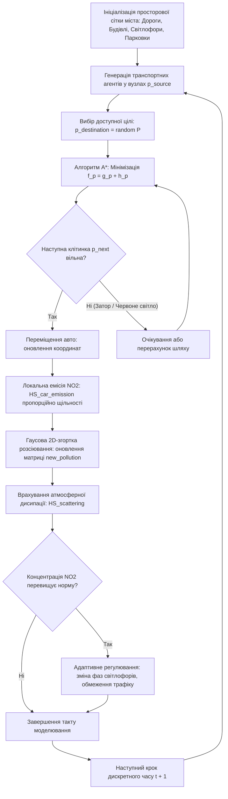

# Змістовий модуль 2. Моделювання екологічних процесів та геоінформаційні технології

# Тема 6. Комп’ютерне моделювання переносу та дифузії забруднюючих речовин

---

## 6.1. Фізико-математичні основи розсіювання домішок у приземному шарі атмосфери: моделі Гаусового шлейфу

### Основний зміст та теоретичний базис
Процеси перенесення, розсіювання та хімічної трансформації шкідливих домішок в атмосферному повітрі підпорядковуються фундаментальним законам гідродинаміки та турбулентної дифузії в приземному (планетарному) пограничному шарі атмосфери (Planetary Boundary Layer, PBL). Здобувачі вищої освіти повинні засвоїти, що моделювання поведінки техногенних емісій є ключовим інструментом проактивної оцінки екологічної безпеки, оскільки воно дозволяє перейти від точкових ретроспективних спостережень до безперервного просторово-часового прогнозування зон забруднення.

У сучасній прикладній екології розрізняють два фундаментальні підходи до опису розсіювання домішок: Ейлеровий та Лагранжевий. 
Ейлеровий підхід розглядає зміну концентрації речовини у фіксованих точках тривимірного простору через розв'язання рівняння неперервності та турбулентної дифузії. 
Лагранжевий підхід, реалізований у міжнародних прогностичних комплексах класу HYSPLIT (Hybrid Single-Particle Lagrangian Integrated Trajectory), відстежує траєкторії руху дискретних частинок або повітряних об'ємів (хмар/шлейфів), що переміщуються під впливом середнього вітрового потоку та стохастичних турбулентних флуктуацій. Застосування математичного апарату дробового числення дозволяє параметризувати аномальну турбулентну дифузію в умовах конвективного пограничного шару, коректно описуючи нелінійні ефекти масопереносу на великих відстанях.

Для моделювання викидів від локалізованих стаціонарних промислових джерел найпоширенішим аналітичним базисом виступає класична тривимірна модель Гаусового шлейфу (Gaussian Plume Model). Модель базується на припущенні про стаціонарність метеорологічних умов, однорідність поля середньої швидкості вітру та нормальний (гаусовий) розподіл концентрації домішки в площинах, перпендикулярних до напрямку вітрового перенесення.

Розподіл об'ємної концентрації забруднюючої речовини $C(x, y, z)$ у тривимірному просторі для неперервного точкового джерела з ефективною висотою викиду $H_{\text{eff}}$ описується аналітичним виразом:

$$C(x, y, z) = \frac{Q}{2\pi u \sigma_y(x) \sigma_z(x)} \exp\left( -\frac{y^2}{2\sigma_y^2(x)} \right) \left[ \exp\left( -\frac{(z - H_{\text{eff}})^2}{2\sigma_z^2(x)} \right) + \exp\left( -\frac{(z + H_{\text{eff}})^2}{2\sigma_z^2(x)} \right) \right],$$

де $C(x, y, z)$ — концентрація забруднюючої речовини в точці з координатами $(x, y, z)$, $\text{mg/m}^3$ або $\mu\text{g/m}^3$; $Q$ — масова потужність викиду джерела, $\text{mg/s}$ або $\text{g/s}$; $u$ — середня швидкість вітру на рівні ефективної висоти джерела, $\text{m/s}$; $x$ — поздовжня відстань від джерела вздовж напрямку вітру, $\text{m}$; $y$ — поперечна координата відхилення від осі шлейфу, $\text{m}$; $z$ — висота точки спостереження над поверхнею землі, $\text{m}$; $H_{\text{eff}}$ — ефективна висота джерела викиду, $\text{m}$; $\sigma_y(x)$ та $\sigma_z(x)$ — дисперсійні коефіцієнти розсіювання (стандартні відхилення просторового розподілу концентрації), $\text{m}$.

Другий експоненційний додаток у квадратних дужках відображає ефект повного дзеркального відбиття шлейфу від підстилаючої земної поверхні (гіпотеза неабсорбуючої поверхні). Приземна концентрація домішки на рівні дихання людини ($z = 0$) визначається спрощеним аналітичним співвідношенням:

$$C(x, y, 0) = \frac{Q}{\pi u \sigma_y(x) \sigma_z(x)} \exp\left( -\frac{y^2}{2\sigma_y^2(x)} \right) \exp\left( -\frac{H_{\text{eff}}^2}{2\sigma_z^2(x)} \right).$$

Дисперсійні параметри $\sigma_y(x)$ та $\sigma_z(x)$ є монотонно зростаючими функціями поздовжньої відстані $x$, значення яких визначаються класом термодинамічної стійкості атмосфери за класифікацією Пасквілла–Гіффорда (від класу $A$ — екстремальна нестійкість до класу $F$ — помірна стійкість/температурна інверсія):

$$\sigma_y(x) = a \cdot x^b, \quad \sigma_z(x) = c \cdot x^d,$$

де $a, b, c, d$ — безрозмірні емпіричні коефіцієнти, що залежать від ступеня шорсткості поверхні та метеорологічного класу стійкості.

Ефективна висота емісії $H_{\text{eff}}$ формується з геометричної висоти димової труби $H_{\text{stack}}$ та величини динамічного і теплового підйому факела викиду $\Delta H$:

$$H_{\text{eff}} = H_{\text{stack}} + \Delta H,$$

де підйом струменя $\Delta H$ обчислюється на основі формул Бріггса через теплову потужність викиду, температуру відхідних газів та початкову швидкість виходу газоповітряної суміші з гирла джерела.

Незважаючи на аналітичну строгість і високу швидкість розрахунків, класичні Гаусові моделі мають принципові обмеження при застосуванні у щільній міській забудові. Вони не враховують геометрію вуличних каньйонів, динаміку перехресть та мобільний характер автотранспортних потоків, що вимагає переходу до дискретних агентних і згорткових схем моделювання.

---

## 6.2. Моделювання динамічних джерел забруднення: агентне моделювання автотранспортних потоків на базі алгоритму А*

### Основний зміст та теоретичний базис
В урбанізованих екосистемах автотранспорт є основним джерелом емісії високотоксичних оксидів азоту ($\text{NO}_x$, переважно $\text{NO}_2$), монооксиду вуглецю ($\text{CO}$) та дрібнодисперсних аерозолів. На відміну від стаціонарних заводських труб із постійними параметрами викиду, транспортні потоки являють собою просторово розподілені, нестаціонарні та дискретно-динамічні джерела забруднення. Рівень викидів безпосередньо залежить від топології вулично-дорожньої мережі, пропускної здатності магістралей, наявності світлофорного регулювання та виникнення заторів, під час яких питомі викиди двигунів зростають у 3–5 разів через перехід у неоптимальні перехідні режими збагачення палива.

Для адекватного відтворення просторово-часової динаміки транспортних емісій застосовується просторово-сіткова агентна модель, реалізована на базі алгоритму евристичного пошуку оптимального шляху $A^*$ (A-star) у середовищі дискретного моделювання (наприклад, у спеціалізованих симуляторах на базі Godot Engine або Python).

Модельний простір міської території дискретизується у вигляді регулярної матриці квадратних примітивів (клітинок сітки), кожна з яких наділяється певним типом інфраструктурного об'єкта та множиною динамічних атрибутів. Типізація об'єктів задається дискретним параметром «Об'єкт дороги»:
* Стан «0» відповідає вільному елементу дорожнього полотна (проїзна частина), яким дозволено безперешкодний рух транспортних агентів;
* Стан «1» ідентифікує паркувальний майданчик або термінал, який слугує цільовою точкою тяжіння або джерелом початкового генерування автомобілів;
* Стан «2» визначає світлофорний вузол регулювання руху, що циклічно змінює свій стан між дозволеним і забороненим, причому активація реверсивного режиму синхронізує фази зустрічних транспортних потоків;
* Стан «3» та стан «4» моделюють відповідно відкритий ґрунт (землю) та капітальні будівлі, які виступають фізичними бар'єрами, непроникними для руху транспорту;
* Стан «5» представляє статичний генератор промислових викидів із фіксованою інтенсивністю емісії, що дозволяє досліджувати спільний вплив фабричних та транспортних джерел.

Кожен мобільний агент (автомобіль) $A$ генерується у випадковій початковій клітинці $p_{\text{source}} = (x_s, y_s)$ та прямує до доступного паркувального місця $p_{\text{destination}} = (e_x, e_y)$, випадково обраного з множини вільних парковок $P$:

$$p_{\text{destination}} = \text{random}(P).$$

Траєкторія переміщення агента між точками $p_{\text{source}}$ та $p_{\text{destination}}$ прокладається за алгоритмом $A^*$, який мінімізує сумарну оціночну функцію вартості шляху $f(p)$:

$$f(p) = g(p) + h(p),$$

де $g(p)$ — фактична вартість переміщення від початкової позиції до поточної клітинки $p = (x, y)$ з урахуванням опору руху та завантаженості сегмента; $h(p)$ — евристична функція, яка оцінює залишковий шлях до цільової точки $p_{\text{destination}} = (e_x, e_y)$. 

Оскільки переміщення в дискретній сітці відбувається за чотирма або вісьмома ортогональними напрямками вздовж вуличної сітки, евристична відстань розраховується за манхеттенською метрикою:

$$h(p) = |p_x - e_x| + |p_y - e_y|,$$

де $p_x, p_y$ — координати поточної позиції агента; $e_x, e_y$ — координати цільового вузла.

*Рисунок 1 — Структурно-логічна схема агентного симулятора транспортного трафіку та розсіювання викидів*

Динаміка руху враховує зайнятість наступної клітинки $p_{\text{next}}$. Якщо клітинка зайнята іншим транспортним засобом або заблокована заборонним сигналом світлофора, швидкість агента падає до нуля, ініціюючи локальний затор. 

У разі тривалого блокування сегмента алгоритм динамічно формує альтернативний маршрут. Під час руху кожен автомобіль генерує порцію забруднення в поточній клітинці сітки, перетворюючи транспортний потік на просторово-розподілену лінію емісії, інтенсивність якої прямо пропорційна щільності трафіку та обернено пропорційна середній швидкості руху на ділянці.

---

## 6.3. Згорткові схеми розсіювання на основі Гаусового фільтра для оцінки локальних зон забруднення

### Основний зміст та теоретичний базис
Для моделювання просторової дисипації (розсіювання) викидів від рухомих автомобілів і стаціонарних об'єктів на регулярній сітці в режимі реального часу застосовується дискретна згорткова схема на основі двовимірного Гаусового ядра. Замість розв'язання ресурсомістких систем диференціальних рівнянь Нав'є–Стокса чи рівнянь дифузії в частинних похідних, згортковий підхід дозволяє швидко апроксимувати поступове розтікання та перенесення газових мас під впливом турбулентності навколишнього середовища.

Просторове розсіювання описується згорткою матриці поточних концентрацій із дискретним симетричним ядром Гаусової фільтрації $\mathbf{K}_{\text{Gauss}} \in \mathbb{R}^{3 \times 3}$:

$$\mathbf{K}_{\text{Gauss}} = \begin{bmatrix} 0 & 1 & 0 \\ 1 & 2 & 1 \\ 0 & 1 & 0 \end{bmatrix}.$$

Оновлене значення концентрації забруднюючої речовини $\text{new\_pollution}_{i,j}$ у клітинці сітки з просторовими індексами $(i, j)$ на наступному кроці ітерації розраховується за формулою нормованої згортки:

$$\text{new\_pollution}_{i,j} = \frac{\sum_{k=-1}^{1} \sum_{l=-1}^{1} \text{pollution}_{i+k,\, j+l} \cdot \mathbf{K}_{k+1,\, l+1}}{\sum_{k=-1}^{1} \sum_{l=-1}^{1} \mathbf{K}_{k+1,\, l+1}},$$

де $\text{pollution}_{i+k,\, j+l}$ — концентрація домішки в сусідніх клітинках на поточному кроці; $\mathbf{K}_{k+1,\, l+1}$ — ваговий коефіцієнт ядра, що визначає частку перенесення речовини у сусідні вузли. Центральний елемент ядра ($\mathbf{K}_{1,1} = 2$) фіксує інерційність збереження власної маси домішки, тоді як ортогональні елементи ($\mathbf{K} = 1$) моделюють дифузійний потік у чотирьох просторових напрямках.

Динаміка зміни загального рівня забруднення в кожній клітинці простору враховує процеси надходження від джерел та природну атмосферну дисипацію:

$$\Delta \text{Pollution} = H_{\text{scattering}} + H_{\text{car\_emission}},$$

де $H_{\text{car\_emission}}$ — додаткова маса полютанта, викинута автомобілями в клітинці за крок часу; $H_{\text{scattering}}$ — зміна концентрації внаслідок дифузійного розсіювання та вітрового виносу.

Масштабування симулятора до реальних фізичних процесів базується на виборі емпіричних масштабних коефіцієнтів. Наприклад, при моделюванні атмосферного забруднення діоксидом азоту в місті Кременчук встановлено такі параметричні еквіваленти: один примітив дороги відповідає трисмуговій проїзній частині; один примітив автомобіля представляє узагальнений транспортний потік інтенсивністю 3000 автомобілів на добу; три хвилини безперервної роботи комп'ютерного симулятора відповідають одному календарному року накопичення та осереднення забруднення в реальному місті. 

Результати симуляції візуалізуються у вигляді растрових карт яскравості (heatmaps), де рівень яскравості пікселя пропорційний накопиченій експозиційній концентрації $\text{NO}_2$.

| Метод моделювання | Фізичний принцип | Масштаб застосування | Обчислювальна складність | Ключові переваги | Основні обмеження |
| :--- | :--- | :--- | :--- | :--- | :--- |
| **Гаусовий шлейф (Gaussian Plume)** | Аналітичний розв'язок напівімпіричного рівняння дифузії | Локальний (до 10–20 км від джерела) | Мінімальна ($O(1)$ на точку) | Миттєвий розрахунок, висока точність для одиночних високих труб | Непридатний для умов міських каньйонів, вимагає стаціонарного вітру |
| **Лагранжеві траєкторії (HYSPLIT)** | Відстеження руху масивів часток/пафів у 3D полі вітру | Регіональний та транскордонний (100–5000 км) | Середня-висока (залежить від числа часток) | Врахування складної орографії, метеосіток, хімічних перетворень | Потребує детальних метеорологічних полів високої роздільності |
| **Мікромасштабні моделі (CFD / RANS)** | Чисельне розв'язання рівнянь Нав'є–Стокса для турбулентних потоків | Мікрорівень (окремі вулиці, перехрестя, квартали) | Екстремально висока (години обчислень на GPU/CPU) | Повний облік аеродинаміки міських будівель і завихрень | Неможливість роботи в режимі реального часу в системах моніторингу |
| **Агентно-згорткова модель ($A^* + \text{Gauss}$)** | Імітаційне моделювання трафіку із 2D-згорткою розсіювання | Муніципальний (міські агломерації, транспортні вузли) | Низька-помірна (робота в реальному часі на ПК/мобільних пристроях) | Безпосередній зв'язок із регулюванням руху, виявлення «сліпих зон» мереж | Спрощений опис фізики вітру, абстрагування від рельєфу |

Аналіз даних таблиці показує, що агентно-згортковий підхід є оптимальним компромісом для муніципальних систем підтримки прийняття рішень. 

Практичне зіставлення результатів моделювання на прикладі Кременчука виявило важливу закономірність: максимальні концентрації $\text{NO}_2$ зосереджені в центральній частині міста та на магістральних транспортних коридорах (зокрема в районі Крюківського мосту). 

Більше того, виявлена розбіжність між результатами просторової інтерполяції за даними наявних постів (де була відсутня аномалія у правому нижньому секторі карти) та симулятором (який передбачив там критичне накопичення $\text{NO}_2$) доводить наявність інформаційної «сліпої зони» в інфраструктурі фізичного моніторингу. 

Таким чином, імітаційне моделювання формує науково обґрунтовану гіпотезу для оптимального розміщення нових автоматичних станцій спостереження.

---

### Питання для самоперевірки та аналітичного осмислення

1. Які фізичні припущення та граничні умови покладено в основу класичної тривимірної моделі Гаусового шлейфу для розрахунку приземних концентрацій забруднюючих речовин?
2. Поясніть фізичний зміст дисперсійних коефіцієнтів $\sigma_y(x)$ та $\sigma_z(x)$ у моделі Гаусового розсіювання та їхню залежність від класів термодинамічної стійкості атмосфери за Пасквіллом–Гіффордом.
3. Чому лінійне зростання інтенсивності автотранспортного потоку у вуличних каньйонах викликає нелінійне експоненційне зростання концентрацій діоксиду азоту ($\text{NO}_2$)?
4. Опишіть математичну структуру евристичної функції оцінки $f(p) = g(p) + h(p)$ в алгоритмі $A^*$ та обґрунтуйте доцільність використання манхеттенської метрики для міської дорожньої мережі.
5. Яким чином матрична 2D-згортка з ядром $\mathbf{K}_{\text{Gauss}}$ апроксимує процес турбулентної дифузії домішок на дискретній просторовій сітці симулятора?
6. Як розбіжність між результатами геопросторової інтерполяції (IDW) та результатами імітаційного моделювання транспортного руху дозволяє ідентифікувати інформаційні «сліпі зони» муніципальної системи екологічного моніторингу?
7. Які функціональні переваги та обмеження має застосування спрощених агентно-згорткових моделей порівняно з повномасштабним обчислювальним гідродинамічним моделюванням (CFD) в задачах оперативного екологічного менеджменту?