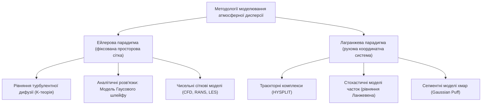
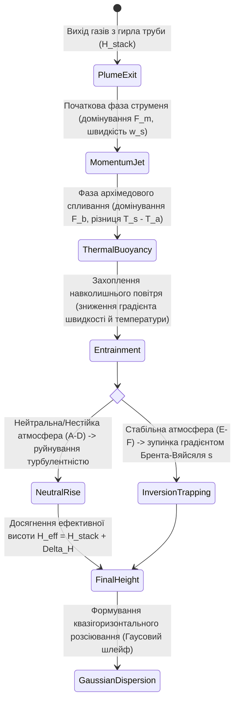
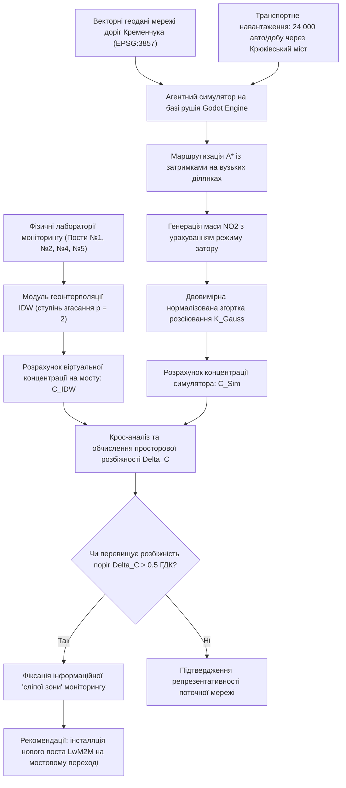

# Тема 6. Комп’ютерне моделювання дисперсії, просторової дифузії та динаміки забруднюючих речовин в урбанізованих системах

## Мета лекції
Формування у магістрантів системних теоретичних знань і поглиблених практичних компетентностей щодо фізико-математичного опису процесів масопереносу і турбулентної дифузії домішок у приземному шарі атмосфери, оволодіння математичним апаратом аналітичного моделювання стаціонарних викидів на базі моделі Гаусового шлейфу та просторово-сіткового агентного симулювання нестаціонарних емісій автотранспортних потоків із застосуванням евристичного алгоритму $A^*$ і двовимірних згорткових фільтрів, а також набуття навичок виявлення просторових інформаційних прогалин («сліпих зон») фізичних мереж екологічного моніторингу для науково обґрунтованого проектування систем спостереження відповідно до вимог директиви Ambient Air Quality Directive 2024/2881 EC.

## Очікувані результати навчання
1. **Знання та розуміння.** Здобувачі вищої освіти засвоять фундаментальні принципи Ейлерового та Лагранжевого підходів до моделювання переносу газових домішок, фізичний зміст дисперсійних коефіцієнтів у моделях Гаусового розсіювання, а також концептуальні положення дискретного представлення урбанізованого простору для симуляції динамічних джерел викидів.
2. **Застосування.** Здобувачі вмітимуть формалізувати просторово-часову динаміку розсіювання викидів від рухомих джерел за допомогою комбінації алгоритму евристичного пошуку оптимального маршруту $A^*$ і матричної згортки з дискретним Гаусовим ядром, транслюючи теоретичні алгоритми у функціональні моделі комп'ютерного симулювання.
3. **Аналіз.** Здобувачі зможуть критично зіставляти аналітичні, гідродинамічні та агентно-згорткові підходи до моделювання якості повітря, диференціювати поведінку параметрів забруднення залежно від класів термодинамічної стійкості атмосфери й параметрів вулично-дорожньої мережі, а також аналізувати розбіжності між результатами просторової геоінтерполяції фізичних вимірювань і прогнозними полями імітаційного симулятора.
4. **Оцінювання та синтез.** Здобувачі будуть здатні комплексно оцінювати просторову репрезентативність діючих муніципальних мереж моніторингу, синтезувати науково обґрунтовані рекомендації щодо ліквідації виявлених інформаційних розривів шляхом розміщення нових автоматичних постів спостереження та формувати адаптивні сценарії регулювання транспортного навантаження для мінімізації ризиків перевищення гранично допустимих концентрацій.

---

## Детальний покроковий план лекції

### 1. Теоретико-концептуальний базис. Фізико-математичні основи атмосферної дифузії та аналітичні моделі Гаусового шлейфу
* 1.1. Ейлерова та Лагранжева парадигми моделювання процесів масопереносу і турбулентної дифузії у планетарному пограничному шарі атмосфери.
* 1.2. Тривимірна аналітична модель Гаусового шлейфу для стаціонарного точкового джерела з урахуванням ефекту дзеркального відбиття від неабсорбуючої земної поверхні.
* 1.3. Параметризація дисперсійних коефіцієнтів поперечного та вертикального розсіювання через призму класів термодинамічної стійкості атмосфери за шкалою Пасквілла–Гіффорда.
* 1.4. Визначення ефективної висоти викиду на основі емпіричних моделей теплового і динамічного підйому газоповітряного факела Бріггса.

### 2. Методологія та аналіз граничних умов. Просторово-сіткове агентне моделювання та згорткові схеми розсіювання емісій
* 2.1. Концепція просторової дискретизації міського середовища та структурна типізація дорожньо-транспортних примітивів на регулярній сітці.
* 2.2. Агентне моделювання динамічного автотранспортного трафіку на основі евристичного алгоритму $A^*$ із манхеттенською метрикою та врахуванням заторів.
* 2.3. Алгоритмізація дифузійного розсіювання домішок на базі нормалізованої двовимірної згортки з Гаусовим ядром та параметри масштабування модельного часу до календарних періодів.
* 2.4. Методологічні обмеження, аеродинамічні спрощення та граничні умови застосування згорткових схем в умовах щільної забудови й вуличних каньйонів порівняно з повномасштабним гідродинамічним моделюванням Navier–Stokes.

### 3. Практичний індустріальний / фаховий кейс. Ідентифікація дефіцитів мережі моніторингу та моделювання емісій діоксиду азоту в промисловому центрі
**Тема наскрізної задачі.** «Верифікація транспортного сліду діоксиду азоту в Кременчуцькій агломерації: виявлення інформаційних сліпих зон муніципальної мережі моніторингу за допомогою крос-аналізу просторової інтерполяції IDW та агентно-згорткового симулятора на базі Godot Engine».

## 1. Теоретико-концептуальний базис. Фізико-математичні основи атмосферної дифузії та аналітичні моделі Гаусового шлейфу

### 1.1. Ейлерова та Лагранжева парадигми моделювання процесів масопереносу і турбулентної дифузії у планетарному пограничному шарі атмосфери

Дослідження динаміки антропогенних емісій у приземному шарі атмосфери базується на фундаментальних законах гідродинаміки та фізики турбулентного масопереносу. Планетарний пограничний шар атмосфери становить нижню частину газової оболонки Землі, товщина якої варіюється від кількох сотень метрів до двох-трьох кілометрів, де безпосередній контакт із підстилаючою поверхнею генерує механічну та термічну турбулентність. Опис поведінки домішок у цьому шарі вимагає декомпозиції миттєвих полів швидкості вітру та концентрації за методом Рейнольдса на осереднені та флуктуаційні складники. У теоретичній та прикладній геофізиці склалися дві домінантні концептуальні парадигми просторово-часового моделювання газоаерозольного переносу: Ейлерова та Лагранжева.

Ейлерова парадигма розглядає фізичний простір як фіксовану нерухому координатну систему, крізь вузли якої протікає атмосферне повітря, несучи із собою частинки забруднювача. У межах цього підходу зміна концентрації речовини в часі та просторі описується диференціальним рівнянням переносу та турбулентної дифузії в частинних похідних. Для замикання турбулентних потоків найчастіше застосовується градієнтна гіпотеза Буссінеска (так звана $K$-теорія), яка припускає пропорційність турбулентного потоку домішки градієнту її осередненої концентрації через просторово неоднорідний тензор коефіцієнтів турбулентної дифузії. 

Математичний вираз класичного тривимірного Ейлерового рівняння переносу та дифузії має вигляд:

$$\frac{\partial C}{\partial t} + u \frac{\partial C}{\partial x} + v \frac{\partial C}{\partial y} + w \frac{\partial C}{\partial z} = \frac{\partial}{\partial x}\left( K_x \frac{\partial C}{\partial x} \right) + \frac{\partial}{\partial y}\left( K_y \frac{\partial C}{\partial y} \right) + \frac{\partial}{\partial z}\left( K_z \frac{\partial C}{\partial z} \right) + S - R,$$

де $C(x, y, z, t)$ позначає осереднену концентрацію забруднюючої речовини в точці простору з координатами $(x, y, z)$ у момент часу $t$, виражену в $\text{mg/m}^3$; змінні $u$, $v$, $w$ є компонентами вектора осередненої швидкості вітру вздовж просторових осей $x$, $y$ та $z$ відповідно, виміряними в $\text{m/s}$; параметри $K_x$, $K_y$, $K_z$ представляють діагональні компоненти анізотропного тензора турбулентної дифузії, що мають розмірність $\text{m}^2/\text{s}$; величина $S$ описує функцію джерел емісії, що визначає швидкість надходження речовини в одиницю об'єму в $\text{mg}/(\text{m}^3 \cdot \text{s})$; параметр $R$ формалізує швидкість виведення речовини з атмосфери внаслідок процесів сухого та вологого осадження або хімічних трансформацій.

Лагранжева парадигма, на противагу Ейлеровій, використовує рухому систему відліку, що слідує за окремими елементарними об'ємами повітря (хмарами, «пафами») або дискретними модельними частинками. Замість інтегрування поля концентрацій на сітці, Лагранжеві стохастичні моделі описують індивідуальні траєкторії руху мільйонів незалежних частинок, координати яких змінюються під впливом детермінованого середнього вітрового переносу та випадкових турбулентних блукань. Траєкторія кожної окремої частинки формалізується системою стохастичних диференціальних рівнянь типу Ланжевена:

$$d\mathbf{x}(t) = \left[ \mathbf{u}(\mathbf{x}, t) + \mathbf{u}'(\mathbf{x}, t) \right] dt,$$

де вектор $\mathbf{x}(t)$ визначає положення частинки в просторі в момент часу $t$; змінна $\mathbf{u}(\mathbf{x}, t)$ задає середнє поле швидкості вітру; вектор $\mathbf{u}'(\mathbf{x}, t)$ представляє турбулентні флуктуації швидкості, що моделюються як автокорельований марковський процес із заданим часовим масштабом турбулентної пам'яті (масштабом Лагранжа). Розрахунок поля концентрацій у довільній точці здійснюється шляхом інтегрування щільності ймовірності перебування ансамблю часток у заданому просторовому об'ємі.



Лагранжевий підхід повністю усуває проблему штучної числової дифузії, яка неминуче виникає під час дискретизації конвективних похідних у сіткових ейлерових схемах, та демонструє бездоганну масштабованість для відстеження транскордонних перенесень на тисячі кілометрів. Водночас ейлерові моделі значно ефективніше інтегрують багатокомпонентні нелінійні хімічні кінетики, оскільки взаємодія між різними хімічними домішками розраховується безпосередньо у фіксованих об'ємах сітки.

> **ПРАКТИЧНИЙ ЯКІР:** У процесі ліквідації транскордонних наслідків аварійних викидів та промислових інцидентів національні гідрометеорологічні центри застосовують модель NOAA HYSPLIT саме в Лагранжевій конфігурації траєкторій частинок для оперативної побудови 72-годинних зворотних та прямих траєкторій масопереносу важких металів та продуктів горіння.

### 1.2. Тривимірна аналітична модель Гаусового шлейфу для стаціонарного точкового джерела з урахуванням ефекту дзеркального відбиття від неабсорбуючої земної поверхні

Модель Гаусового шлейфу є фундаментальним інженерно-екологічним стандартом для розрахунку розсіювання викидів від локалізованих стаціонарних об'єктів. Ця аналітична конструкція виводиться як точний розв'язок стаціонарного Ейлерового рівняння турбулентної дифузії за суворого дотримання низки фізичних припущень. Зокрема, передбачається, що поле швидкості вітру є стаціонарним, горизонтальним, однорідним і спрямованим строго вздовж осі $x$ зі швидкістю $u$. Швидкість адвективного перенесення суттєво переважає швидкість поздовжньої турбулентної дифузії, що дозволяє знехтувати членом $\frac{\partial}{\partial x}\left( K_x \frac{\partial C}{\partial x} \right)$ у розрахунковому балансі маси. Також передбачається, що коефіцієнти турбулентної дифузії в поперечному ($y$) та вертикальному ($z$) напрямках є постійними або залежать виключно від відстані до джерела.

За умови розташування безперервного точкового джерела потужністю $Q$ на ефективній висоті $H_{\text{eff}}$ у безмежному просторі розв'язок відповідає двовимірному нормальному закону розподілу ймовірностей. Проте в реальній атмосфері присутня непроникна межа — підстилаюча земна поверхня на рівні $z = 0$. Фізична умова неабсорбуючої поверхні диктує рівність нулю турбулентного потоку домішки через межу поділу середовищ, що формулює крайову умову другого роду (умову Неймана):

$$\left. K_z \frac{\partial C}{\partial z} \right|_{z=0} = 0.$$

Для математичного задоволення цієї умови без ускладнення аналітичного розв'язку застосовується класичний метод дзеркальних відображень, запозичений з електростатики та теорії потенціалу. Вводиться уявне (фіктивне) джерело ідентичної потужності $Q$, дзеркально розташоване під поверхнею землі на позначці $z = -H_{\text{eff}}$. Результуюча концентрація формується суперпозицією полів реального та фіктивного джерел.

Аналітичний вираз тривимірної моделі Гаусового шлейфу з урахуванням повного дзеркального відбиття набуває вигляду:

$$C(x, y, z) = \frac{Q}{2\pi u \sigma_y(x) \sigma_z(x)} \exp\left( -\frac{y^2}{2\sigma_y^2(x)} \right) \left[ \exp\left( -\frac{(z - H_{\text{eff}})^2}{2\sigma_z^2(x)} \right) + \exp\left( -\frac{(z + H_{\text{eff}})^2}{2\sigma_z^2(x)} \right) \right],$$

де змінна $C(x, y, z)$ позначає концентрацію домішки в декартових координатах простору в $\text{mg/m}^3$; параметр $Q$ відповідає потужності викиду забруднюючої речовини в $\text{mg/s}$; величина $u$ визначає осереднену швидкість вітру на рівні флюгера або на рівні ефективної висоти джерела в $\text{m/s}$; координата $x$ фіксує поздовжню відстань від джерела викиду вздовж генерального напрямку вітрового потоку в метрах; координата $y$ вимірює поперечне відхилення від центральної осі шлейфу в метрах; координата $z$ вказує висоту розрахункової точки над рівнем земної поверхні в метрах; величина $H_{\text{eff}}$ позначає ефективну висоту факела емісії в метрах; параметри $\sigma_y(x)$ та $\sigma_z(x)$ є стандартними відхиленнями просторового розподілу концентрації речовини (коефіцієнтами дисперсії) у горизонтальному поперечному та вертикальному напрямках відповідно, що мають розмірність метрів.

Особливий практичний інтерес для санітарно-гігієнічної оцінки становить концентрація домішки безпосередньо в приземному шарі на рівні органів дихання людини, де висота $z$ приймається рівною нулю ($z = 0$). У цьому випадку обидва експоненційні доданки у квадратних дужках стають тотожними, що подвоює результуючий вираз і приводить до спрощеної формули приземного поля концентрацій:

$$C(x, y, 0) = \frac{Q}{\pi u \sigma_y(x) \sigma_z(x)} \exp\left( -\frac{y^2}{2\sigma_y^2(x)} \right) \exp\left( -\frac{H_{\text{eff}}^2}{2\sigma_z^2(x)} \right).$$

> **ВАЖЛИВО:** Модель Гаусового шлейфу базується на законі збереження маси вздовж будь-якого поперечного перерізу факела, проте її застосування математично коректне лише за наявності стійкого спрямованого вітру ($u \ge 1.0\ \text{m/s}$). При штильових ситуаціях модель демонструє нефізичну сингулярність у вигляді прямування концентрації до нескінченності.

> **ТИПОВА ПОМИЛКА:** Помилковим є застосування стандартної моделі Гаусового шлейфу для розрахунку розсіювання важких дисперсних частинок (пилу фракцій понад 20–50 мкм) без введення додаткового члена гравітаційного осадження $v_s$ (швидкості седиментації). Для важких аерозолів траєкторія осі шлейфу нахиляється до поверхні з нахилом $z(x) = H_{\text{eff}} - \frac{v_s x}{u}$, а гранична умова дзеркального відбиття перестає діяти, трансформуючись в умову часткового або повного поглинання підстилаючою поверхнею.

### 1.3. Параметризація дисперсійних коефіцієнтів поперечного та вертикального розсіювання через призму класів термодинамічної стійкості атмосфери за шкалою Пасквілла–Гіффорда

Дисперсійні параметри $\sigma_y(x)$ та $\sigma_z(x)$ є критично важливими регуляторами геометричних масштабів шлейфу, оскільки вони кількісно описують розширення факела в міру його віддалення від джерела емісії. Фізично вони відображають стандартне відхилення гаусового розподілу частинок і зростають зі збільшенням відстані $x$. Інтенсивність цього зростання цілком визначається термодинамічною структурою приземного шару атмосфери, яка регулює співвідношення між процесами архімедового плавучого перемішування та динамічного зсуву вітру.

Для практичного використання класичної теорії стійкості застосовується система класифікації Пасквілла–Гіффорда, яка поділяє стан атмосфери на шість дискретних класів стійкості, позначаючи їх літерами від $A$ до $F$. Клас $A$ відповідає виключно нестійкому стану з інтенсивною сонячною інсоляцією та слабким вітром, за якого домінує вертикальна конвекція. Класи $B$ та $C$ описують помірно нестійкі умови. Клас $D$ репрезентує нейтральну стратифікацію, типову для суцільної хмарності або сильного вітру, коли температурний градієнт близький до сухоадіабатичного (зниження температури на $0.98^\circ\text{C}$ на кожні 100 метрів підйому). Класи $E$ та $F$ характеризують стабільну атмосферу з приземними температурними інверсіями (температура зростає з висотою), які виникають у нічні години внаслідок радіаційного охолодження ґрунту і супроводжуються повним пригніченням вертикальної турбулентності.

Для аналітичних обчислень коефіцієнти розсіювання найчастіше апроксимуються степеневими функціями відстані $x$ (вираженої в кілометрах або метрах) за формулами Бріггса або Мак-Мюллена:

$$\sigma_y(x) = a \cdot x^b, \quad \sigma_z(x) = c \cdot x^d,$$

де емпіричні коефіцієнти $a, b, c, d$ вибираються за нормативними таблицями для кожного класу стійкості індивідуально, а також залежать від типу шорсткості поверхні (міські чи сільські умови). Для міських умов, що характеризуються високою шорсткістю будівель та ефектом міського острова тепла, значення $\sigma_z(x)$ за інших рівних умов є суттєво вищими, ніж для відкритої рівнинної місцевості.

Нижче наведено порівняльний аналіз фундаментальних методів і парадигм просторово-часового моделювання атмосферної дисперсії домішок, що застосовуються в інженерно-екологічній практиці.

| Метод моделювання | Фізичний базис моделі | Вхідні параметри системи | Обчислювальна складність | Приклад з реальної практики |
| :--- | :--- | :--- | :--- | :--- |
| **Аналітична модель Гаусового шлейфу** | Стаціонарний розв'язок рівняння дифузії в напівбезмежному просторі з дзеркальним відбиттям | Потужність викиду джерела $Q$, швидкість вітру $u$, ефективна висота $H_{\text{eff}}$, клас стійкості за Пасквіллом | Мінімальна (миттєвий аналітичний розрахунок в аналітичних точках) | Розрахунок гранично допустимих викидів та санітарно-захисних зон промислових труб ПАТ «Укртатнафта» |
| **Лагранжева модель випадкових блукань (HYSPLIT)** | Стохастичне інтегрування траєкторій ансамблю часток за рівнянням Ланжевена | Тривимірні сітки метеоданих (GFS, ERA5), часові ряди емісій, вертикальні профілі турбулентності | Середня (залежить від кількості модельних часток та часового кроку) | Відстеження траєкторій поширення токсичного диму та сажі після руйнування нафтобаз і підриву греблі Каховської ГЕС |
| **Ейлерова регіональна хіміко-транспортна модель (CTM/WRF-Chem)** | Чисельне розв'язання рівнянь переносу, дифузії та нелінійної фотохімічної кінетики на сітці | Інвентаризація емісій усіх галузей, тривимірні метеополя, сонячна радіація, початкові концентрації | Висока (вимагає багатопроцесорних обчислювальних кластерів або суперкомп'ютерів) | Прогнозування утворення вторинного приземного озону ($O_3$) та фотохімічного смогу над поліцентричними міськими зонами |
| **Обчислювальна гідродинаміка мікромасштабу (CFD/RANS/LES)** | Чисельне розв'язання осереднених рівнянь Нав'є–Стокса з моделями замикання турбулентності | Детальна 3D-геометрія міської забудови, граничні умови на входах, теплові потоки від асфальту | Екстремально висока (години обчислень на один метеорологічний сценарій) | Моделювання акумуляції діоксиду азоту в глибоких вуличних каньйонах та на багаторівневих транспортних розв'язках |

Динаміка вертикальної структури атмосфери безпосередньо зумовлює характер просторової поведінки факела викиду. За умов конвективної нестійкості (класи $A$–$B$) спостерігається хвилеподібний шлейф («looping»), за якого потужні турбулентні вихори періодично притискають факел до поверхні землі, створюючи короткочасні локальні піки екстремально високих концентрацій поблизу джерела. У стабільній атмосфері (класи $E$–$F$) формується віялоподібний плоский шлейф («fanning»), вертикальне розсіювання якого майже заблоковане, проте при зміні інсоляції вранці виникає процес задимлення («fumigation»), коли інверсійний шар руйнується знизу і токсичні компоненти масово спрямовуються вниз, створюючи загрозу для приземного шару.

> **КОНТРОЛЬНЕ ПИТАННЯ:** Яким чином вплине зміна класу термодинамічної стійкості атмосфери від класу $A$ (сильна нестійкість) до класу $F$ (помірна інверсійна стійкість) за незмінної швидкості вітру та незмінної потужності викиду високої димової труби ($H = 120\ \text{m}$) на максимальну приземну концентрацію домішки $C_{\max}$ та відстань $x_{\max}$, на якій цей максимум фіксується?
>
> <details markdown="1">
> <summary>Розгорнути аналіз / відповідь</summary>
>
> **Правильний варіант: Значення максимальної приземної концентрації $C_{\max}$ суттєво зменшиться, а відстань досягнення цього максимуму $x_{\max}$ значно зміститься в бік збільшення (далі від джерела).**
>
> 1. Фізико-математичне обґрунтування базується на поведінці дисперсійного коефіцієнта $\sigma_z(x)$. Максимум приземної концентрації $C_{\max}$ для гаусової моделі досягається в точці, де вертикальна дисперсія наближається до ефективної висоти джерела ($\sigma_z(x_{\max}) \approx H_{\text{eff}} / \sqrt{2}$). За класу стійкості $A$ вертикальне турбулентне перемішування є надзвичайно інтенсивним, тому значення $\sigma_z$ стрімко зростає вже на перших сотнях метрів від труби. Це призводить до того, що факел швидко торкається землі на малій відстані від джерела ($x_{\max}$ становить лише кількасот метрів), викликаючи дуже високу локальну концентрацію $C_{\max}$. Навпаки, за інверсійного класу $F$ коефіцієнт вертикальної турбулентної дифузії $K_z$ прямує до нуля, а параметр $\sigma_z(x)$ зростає повільно. Факел зберігає форму тонкої горизонтальної стрічки і подолає десятки кілометрів, перш ніж вертикальна дисперсія досягне критичного значення $H_{\text{eff}} / \sqrt{2}$. Через значне розширення шлейфу в горизонтальній площині ($\sigma_y(x)$ продовжує зростати) маса речовини розподілиться по величезному об'єму, внаслідок чого результуючий пік $C_{\max}$ на рівні землі буде суттєво нижчим за амплітудою, але віддаленим на 10–30 км від джерела.
>
> 2. Аналіз альтернативних тверджень показує помилковість гіпотези про інваріантність положення піка, оскільки термодинаміка атмосфери безпосередньо масштабує параметри Гаусової функції. Твердження про те, що інверсія завжди спричиняє зростання приземного максимуму від високих труб, є типовою екстраполяцією низьких джерел: для низьких емісій (автотранспорт, труби до 10 м) інверсія дійсно концентрує отруйні гази біля землі, але для високих труб інверсійний шар виступає екраном, що не дозволяє домішці опуститися до поверхні.
> </details>

### 1.4. Визначення ефективної висоти викиду на основі емпіричних моделей теплового і динамічного підйому газоповітряного факела Бріггса

В аналітичній моделі Гаусового шлейфу координата виходу факела не є еквівалентною геометричній висоті самої димової труби $H_{\text{stack}}$. Відхідні димові гази промислових агрегатів зазвичай залишають гирло джерела зі значною вертикальною швидкістю і мають температуру, що суттєво перевищує температуру навколишнього атмосферного повітря. Внаслідок цього виникають два взаємодоповнюючі фізичні ефекти: початковий динамічний імпульс викиду та гідростатична підйомна сила (архімедова плавучість). Під їхньою сукупною дією вісь факела піднімається над гирлом джерела на додаткову висоту підйому $\Delta H$, формуючи ефективну висоту емісії $H_{\text{eff}}$:

$$H_{\text{eff}} = H_{\text{stack}} + \Delta H.$$

Для коректного розрахунку величини підйому факела $\Delta H$ у світовій інженерній практиці застосовується система рівнянь Г. Бріггса (Briggs Plume Rise Formulas), яка базується на розрахунку двох базових гідродинамічних інваріантів: параметра потоку плавучості $F_b$ та параметра потоку імпульсу $F_m$.

Параметри потоку плавучості та імпульсу обчислюються за співвідношеннями:

$$F_b = g w_s r_s^2 \left( \frac{T_s - T_a}{T_s} \right), \quad F_m = w_s^2 r_s^2 \left( \frac{\rho_s}{\rho_a} \right) \approx w_s^2 r_s^2 \left( \frac{T_a}{T_s} \right),$$

де змінна $g$ позначає прискорення вільного падіння ($9.81\ \text{m/s}^2$); $w_s$ визначає початкову лінійну швидкість виходу газоповітряної суміші з гирла труби в $\text{m/s}$; $r_s$ позначає внутрішній радіус гирла димової труби в метрах; $T_s$ представляє абсолютну температуру відхідних газів у кельвінах ($\text{K}$); $T_a$ є абсолютною температурою навколишнього атмосферного повітря на рівні гирла джерела в кельвінах ($\text{K}$); параметри $\rho_s$ та $\rho_a$ відповідають густинам викиду та навколишнього повітря відповідно.

Якщо різниця температур $\Delta T = T_s - T_a$ перевищує критичне значення, підйом факела є тепловим і повністю контролюється параметром $F_b$. За умов нейтральної або нестійкої атмосфери (класи стійкості $A$–$D$) вертикальний підйом зупиняється тоді, коли атмосферна турбулентність повністю розмиває внутрішню енергію факела. Фінальний підйом факела $\Delta H$ за Бріггсом розраховується через емпіричні залежності залежно від величини потоку плавучості:

$$\Delta H = 21.425 \frac{F_b^{3/4}}{u} \quad \text{при} \quad F_b < 55\ \text{m}^4/\text{s}^3,$$

$$\Delta H = 38.71 \frac{F_b^{3/5}}{u} \quad \text{при} \quad F_b \ge 55\ \text{m}^4/\text{s}^3,$$

де швидкість вітру $u$ приймається на рівні зрізу труби. Відстань від джерела до точки завершення підйому факела становить $x_f = 49 F_b^{5/8}$ для малих потоків або $x_f = 119 F_b^{2/5}$ для великих теплових потоків.

Для стабільної атмосфери (інверсійні класи $E$–$F$) вертикальне переміщення факела стримується додатним градієнтом потенціальної температури, що характеризується параметром термодинамічної стабільності Брента–Вяйсяля $s$:

$$s = \frac{g}{T_a} \frac{\partial \theta}{\partial z},$$

де $\frac{\partial \theta}{\partial z}$ позначає вертикальний градієнт потенціальної температури атмосфери, який для стабільного класу зазвичай перевищує $0.005\ \text{K/m}$. 

У стабільних умовах підйом плавучого факела розраховується за формулою:

$$\Delta H = 2.6 \left( \frac{F_b}{u \cdot s} \right)^{1/3}.$$

У ситуаціях, коли температура викидів близька до температури середовища ($T_s \approx T_a$), ефект архімедової плавучості нівелюється ($F_b \approx 0$), і підйом відбувається виключно за рахунок кінетичного імпульсу струменя, що описується залежністю через параметр $F_m$:

$$\Delta H = 3.0 \cdot d_s \cdot \left( \frac{w_s}{u} \right),$$

де $d_s = 2 r_s$ позначає внутрішній гідравлічний діаметр гирла джерела викиду.



> **ПРАКТИЧНИЙ ЯКІР:** При екологічному аудиті викидів труб факельних установок та печей риформінгу Кременчуцького нафтопереробного заводу розрахунковий підйом струменя $\Delta H$ у теплий літній період (висока температура $T_a$) зменшується на 15–20% порівняно із зимовим періодом за однакової продуктивності установки, що автоматично збільшує максимальні розрахункові приземні концентрації діоксиду сірки ($SO_2$) поблизу промислового майданчика.

---

### Вказівки для самостійного осмислення

1. Здійсніть порівняльний розрахунок зміни ефективної висоти викиду $H_{\text{eff}}$ для промислового джерела висотою $H_{\text{stack}} = 80\ \text{m}$ за умови зміни швидкості вітру в діапазоні від $2\ \text{m/s}$ до $10\ \text{m/s}$, пояснивши фізичний механізм «притискання» газового факела до зрізу труби (downwash-ефект) та його наслідки для приземного рівня забруднення.
2. Проаналізуйте математичну межу застосовності Ейлерового рівняння турбулентної дифузії: сформулюйте, за яких умов у міських вуличних каньйонах гіпотеза Буссінеска про лінійну залежність між турбулентним потоком домішки та градієнтом її концентрації стає недійсною і вимагає застосування рівнянь Рейнольдса із прямим розрахунком напружень Рейнольдса (моделі другого порядку).
3. Дослідіть поведінку одновимірного перерізу Гаусового шлейфу вздовж поперечної осі $y$ при переході від точкового джерела емісії до безперервної прямолінійної ділянки автомагістралі, математично довівши, що інтегрування нескінченної кількості гаусових точкових джерел вздовж лінії перетворює двовимірний експоненційний розподіл на одновимірну модель лінійного джерела викидів.


## 2. Методологія та аналіз граничних умов. Просторово-сіткове агентне моделювання та згорткові схеми розсіювання емісій

### 2.1. Концепція просторової дискретизації міського середовища та структурна типізація дорожньо-транспортних примітивів на регулярній сітці

Аналітичні моделі розсіювання неперервного типу виявляються неспроможними адекватно описати дисперсію забруднювачів у межах приземного шару міського середовища через надзвичайно високу неоднорідність забудови та дискретно-стохастичний характер руху автотранспорту. Перехід до імітаційного моделювання вимагає попередньої параметризації фізичного простору урбанізованої території. Для цього застосовується метод просторової дискретизації, який трансформує неперервну топографічну поверхню міста у двовимірну регулярну клітинну матрицю, що зберігає топологічні властивості транспортної мережі та дозволяє призначати кожному елементарному об'єму власні фізичні, кінематичні та екологічні параметри.

Просторовий домен моделювання представляється у вигляді ортогональної дискретної сітки розмірністю $N \times M$ елементів, де кожен дискретний вузол займає фіксовану площу $\Delta x \times \Delta y$. Геометрична прив'язка сіткового простору до реальних географічних координат виконується за допомогою перетворення координат вихідних векторних карт (наприклад, даних OpenStreetMap) у метричну проекцію EPSG:3857 (WGS 84 / Pseudo-Mercator), що забезпечує сталість лінійних розмірів клітинок у межах обраної міської агломерації. 

Кожна клітинка сітки наділяється структурним статусом за допомогою цілочисельного параметра типізації, який однозначно визначає правила взаємодії мобільних агентів із простором та особливості генерації шкідливих домішок. Значення параметра «Об'єкт дороги» формує поведінкову функцію простору:
- Значення «0» визначає стандартний транзитний сегмент автомобільної дороги, який має властивість провідності потоку, характеризується максимальною дозволеною швидкістю руху та базовим аеродинамічним коефіцієнтом шорсткості.
- Значення «1» маркує термінали тяжіння та зони паркування, які слугують граничними вузлами для виникнення і поглинання транспортних агентів, маючи внутрішній параметр граничної місткості накопичення транспортних засобів.
- Значення «2» відповідає світлофорному регулятору перехрестя, стан якого періодично перемикається між бінарними фазами дозволу та заборони руху із можливістю введення реверсивного фазового зсуву для регулювання зустрічних та поперечних транспортних хвиль.
- Значення «3» та «4» позначають відповідно відкритий ґрунт і капітальні будівельні конструкції, які виступають геометричними ізоляторами, формуючи абсолютні бар'єри як для переміщення транспортних засобів, так і для адвективного перенесення газових мас.
- Значення «5» ідентифікує фіксований промисловий генератор емісій із заданою постійною або періодичною масовою витратою забруднюючої речовини, що дає змогу вивчати суперпозицію полів фонового промислового викиду та локальних рухомих джерел.

Така просторова типізація перетворює місто на неоднорідний граф переходів, де кожна клітинка $C_{i,j}$ описується вектором станів, що містить координати центра клітинки, поточний структурний тип, динамічний індикатор зайнятості, локальний рівень накопиченої концентрації забруднюючих речовин та параметри метеорологічного зсуву.

### 2.2. Агентне моделювання динамічного автотранспортного трафіку на основі евристичного алгоритму $A^*$ із манхеттенською метрикою та врахуванням заторів

Транспортні засоби в системі розглядаються не як суцільне квазігідродинамічне середовище, а як ансамбль автономних дискретних агентів із власною поведінковою логікою, здатних адаптувати маршрут під впливом зовнішніх перешкод і сигналів регулювання. Рух кожного окремого транспортного агента підпорядковується алгоритму евристичного пошуку найкоротшого шляху на сітковому графі $A^*$ (A-star), адаптованому до динамічної зміни вартості проходження просторових ребер у режимі реального часу.

Формалізація навігаційного процесу та супутнього емісійного відгуку автомобільного агента описується послідовною багатокроковою процедурою:

$$
\begin{aligned}
\text{Крок 1 (Ініціалізація та вибір цілі):} & \quad p_{\text{source}} = (x_s, y_s) \in C_{\text{road}}, \quad p_{\text{destination}} \sim \mathcal{U}(P) \\
\text{Крок 2 (Оцінка вартості переходів):} & \quad g(p_{\text{next}}) = g(p) + c(p, p_{\text{next}}) \cdot \left[1 + \alpha_{\text{jam}} \cdot \mathbb{I}_{\text{occupied}}(p_{\text{next}}) + \alpha_{\text{light}} \cdot \mathbb{I}_{\text{red}}(p_{\text{next}})\right] \\
\text{Крок 3 (Евристична апроксимація):} & \quad h(p_{\text{next}}) = |x_{\text{next}} - x_{\text{dest}}| + |y_{\text{next}} - y_{\text{dest}}| \\
\text{Крок 4 (Вибір оптимального вузла):} & \quad p^* = \arg\min_{p \in \text{OpenSet}} \left[ g(p) + h(p) \right] \\
\text{Крок 5 (Емісійний відгук переміщення):} & \quad E_{\text{cell}}(t) = E_0 \cdot \left( 1 + \gamma_{\text{accel}} \cdot \frac{v_{\text{max}} - v_{\text{actual}}}{v_{\text{max}}} \right) \cdot \mathbb{I}_{\text{move}}(t)
\end{aligned}
$$

де $p_{\text{source}}$ та $p_{\text{destination}}$ позначають просторові координати початкової точки відправлення та кінцевої точки паркування агента відповідно; множина $P$ визначає доступні термінали паркування з типом об'єкта «1»; оператор $\mathcal{U}(P)$ здійснює рівномірний випадковий вибір цільового вузла з доступної множини; функція $g(p)$ описує точну кумулятивну вартість переміщення від початкової точки до поточного вузла $p$; базовий коефіцієнт $c(p, p_{\text{next}})$ дорівнює одиниці для ортогонального кроку сітки; параметри $\alpha_{\text{jam}}$ та $\alpha_{\text{light}}$ є безрозмірними штрафними вагами за вимушену зупинку через затор або червоне світло світлофора відповідно; індикаторні функції $\mathbb{I}_{\text{occupied}}$ та $\mathbb{I}_{\text{red}}$ набувають одиничного значення у разі блокування вузла; евристика $h(p)$ розраховується за прямокутною манхеттенською метрикою між поточними координатами $(x_{\text{next}}, y_{\text{next}})$ та координатами цільового вузла $(x_{\text{dest}}, y_{\text{dest}})$; величина $E_{\text{cell}}(t)$ задає масу викинутої речовини у клітинку сітки на поточному такті; $E_0$ визначає базову норму викиду автомобіля за рівномірного крейсерського руху; $\gamma_{\text{accel}}$ є емпіричним коефіцієнтом додаткового збагачення паливної суміші в перехідних режимах гальмування та розгону; $v_{\text{actual}}$ та $v_{\text{max}}$ представляють фактичну та гранично допустиму швидкість агента на даному відрізку дороги відповідно.

У разі виникнення повної просторової блокади клітинки іншим транспортним засобом агент переходить у стан очікування на термін до трьох тактів. Якщо затор не розсіюється, виконується скидання списків вузлів алгоритму $A^*$ та ініціюється екстрена процедура динамічної перебудови маршруту в обхід утвореного затору. Завдяки цьому досягається реалістичне моделювання ефекту «пляшкового горла», коли транспортний колапс на одній магістралі перерозподіляє навантаження на другорядні міські вулиці.

Взаємодія між структурними компонентами імітаційного комплексу, керуючими сигналами світлофорних мереж та результуючими екологічними полями у часі відображена на наступній діаграмі послідовності.

```mermaid
sequenceDiagram
    autonumber
    actor UrbanPlanner as Оператор моніторингу
    participant TrafficEngine as Диспетчер транспортного трафіку
    participant AgentVehicle as Агент автомобіля
    participant AStarRouter as Модуль пошуку A*
    participant CellularGrid as Дискретна просторова сітка
    participant Diffuser as Згортковий блок Гауса

    UrbanPlanner->>TrafficEngine: Запуск сценарію (густина N авто/добу, фази світлофорів)
    activate TrafficEngine
    TrafficEngine->>CellularGrid: Ініціалізація інфраструктури (дороги, будівлі, парковки)
    TrafficEngine->>AgentVehicle: Спавн агента у вузлі p_source
    activate AgentVehicle
    
    AgentVehicle->>AStarRouter: Запит маршруту до обраної парковки p_destination
    activate AStarRouter
    AStarRouter->>CellularGrid: Зчитування стану клітинок (зайнятість, світлофори)
    CellularGrid--AStarRouter: Матриця доступності та штрафів вартості g(p)
    AStarRouter--AgentVehicle: Оптимальна траєкторія руху на сітці
    deactivate AStarRouter

    loop Такти модельного часу (кожні dt)
        AgentVehicle->>CellularGrid: Спроба переходу у вузол p_next
        alt Клітинка вільна і світлофор зелений
            CellularGrid--AgentVehicle: Дозвіл руху (v_actual = v_max)
            AgentVehicle->>CellularGrid: Фіксація емісії NO2: E_cell(E0)
        else Клітинка заблокована (затор або червоний)
            CellularGrid--AgentVehicle: Заборона руху (v_actual = 0)
            AgentVehicle->>CellularGrid: Фіксація підвищеної емісії: E_cell(E0 * gamma)
            AgentVehicle->>AStarRouter: Запит динамічного перерахунку об'їзного шляху
        end
        TrafficEngine->>Diffuser: Команда на перерахунок поля розсіювання
        activate Diffuser
        Diffuser->>CellularGrid: 2D-згортка концентрацій з Гаусовим ядром K_Gauss
        Diffuser->>CellularGrid: Врахування дисипації та граничних умов будівель
        CellularGrid--Diffuser: Оновлена матриця концентрацій
        deactivate Diffuser
    end
    
    CellularGrid-->>UrbanPlanner: Формування результуючої растрової карти забруднення
    deactivate AgentVehicle
    deactivate TrafficEngine
```

### 2.3. Алгоритмізація дифузійного розсіювання домішок на базі нормалізованої двовимірної згортки з Гаусовим ядром та параметри масштабування модельного часу до календарних періодів

Після інжекції маси полютантів транспортними агентами в координатні комірки сітки виникає завдання моделювання дифузійного розтікання газової хмари в часі та просторі. Застосування класичних тривимірних рівнянь гідродинаміки вимагає колосальних обчислювальних витрат, що унеможливлює функціонування інтерактивних симуляторів у реальному часі. Для подолання цього бар'єра розроблено алгоритм наближеного просторового розсіювання, що ґрунтується на математичному апараті дискретної двовимірної згортки поточного поля концентрацій із симетричним нормалізованим Гаусовим ядром.

Просторове ядро фільтрації $\mathbf{K}_{\text{Gauss}} \in \mathbb{R}^{3 \times 3}$ є дискретним аналогом двовимірного гаусового розподілу ймовірностей для одиничного радіуса розмиття та конструюється у вигляді матриці цілочисельних ваг:

$$\mathbf{K}_{\text{Gauss}} = \begin{bmatrix} 0 & 1 & 0 \\ 1 & 2 & 1 \\ 0 & 1 & 0 \end{bmatrix}.$$

Оновлене значення концентрації забруднювача $\text{new\_pollution}_{i,j}$ у клітинці з індексами $(i, j)$ на наступному ітераційному кроці обчислюється як зважена просторова сума за сусідніми елементами першого порядку (окіл фон Неймана з центральним вузлом):

$$\text{new\_pollution}_{i,j} = \frac{\sum_{k=-1}^{1} \sum_{l=-1}^{1} \text{pollution}_{i+k,\, j+l} \cdot \mathbf{K}_{k+1,\, l+1}}{\sum_{k=-1}^{1} \sum_{l=-1}^{1} \mathbf{K}_{k+1,\, l+1}} = \frac{2 \cdot \text{pollution}_{i,j} + \text{pollution}_{i-1,j} + \text{pollution}_{i+1,j} + \text{pollution}_{i,j-1} + \text{pollution}_{i,j+1}}{6}.$$

Числовий дільник у знаменнику дорівнює сумі всіх елементів вагового ядра і виконує функцію нормувального коефіцієнта, гарантуючи виконання дискретного закону збереження маси: за відсутності джерел емісії та атмосферної дисипації сумарна маса речовини на всій сітці залишається суворо незмінною в процесі згортки. 

Динаміка накопичення та виведення речовини в кожній точці простору на кожному такті $\Delta t$ описується балансовим рівнянням:

$$\text{pollution}_{i,j}(t + \Delta t) = \text{new\_pollution}_{i,j}(t) \cdot (1 - \lambda_{\text{decay}}) + \Delta E_{\text{car\_emission}}(i, j, t) + \Delta E_{\text{stationary}}(i, j, t),$$

де коефіцієнт $\lambda_{\text{decay}}$ є параметром атмосферної дисипації (хімічний розпад, винос вертикальною конвекцією та гравітаційне осадження за один такт); $\Delta E_{\text{car\_emission}}$ та $\Delta E_{\text{stationary}}$ позначають масові надходження від рухомих автомобілів і стаціонарних об'єктів відповідно.

Для зіставлення абстрактних ітерацій програмного симулятора з фізичними характеристиками міської агломерації вводиться система параметричного масштабування. Один просторовий примітив сітки ототожнюється з елементом міської інфраструктури розміром $15 \times 15\ \text{m}$, що відповідає трисмуговій проїзній частині з тротуарами. Один модельний агент відповідає узагальненому потоку інтенсивністю 3000 реальних автомобілів на добу. Масштаб часу калібрується таким чином: три хвилини безперервної роботи симулятора з частотою дискретизації 60 кадрів на секунду (10800 ітерацій згортки) відповідають одному календарному року накопичення та осереднення діоксиду азоту в реальній урбоекосистемі.

> **ВАЖЛИВО:** Під час обчислення двовимірної згортки на границях між дорожнім полотном та непроникними будівельними примітивами (тип «4») має діяти крайова умова нульового дифузійного потоку (умова Неймана). Маса домішки, яка за нормальних умов передалася б у клітинку будівлі, повинна дзеркально перерозподілятися між сусідніми доступними вузлами дороги або повертатися у вихідну клітинку, що запобігає штучному «розчиненню» викидів усередині геометричних стін будівель.

> **ПРАКТИЧНИЙ ЯКІР:** У сучасних міжнародних дослідженнях міського мікроклімату інтеграція мікросимуляторів трафіку класу SUMO або VISSIM із сітковими згортковими фільтрами використовується муніципалітетами як оперативний експрес-інструмент для оцінки зон екологічного лиха перед прийняттям рішень щодо запровадження низькоекоемісійних зон (Low Emission Zones, LEZ).

### 2.4. Методологічні обмеження, аеродинамічні спрощення та граничні умови застосування згорткових схем в умовах щільної забудови й вуличних каньйонів порівняно з повномасштабним гідродинамічним моделюванням Navier–Stokes

Спрощена агентно-згорткова методологія забезпечує виняткову швидкодію, однак спирається на низку аеродинамічних та фізичних спрощень, які формують жорсткі граничні умови її застосування. Розуміння цих бар'єрів є критичним для запобігання хибній інтерпретації результатів моделювання на стадії прийняття управлінських рішень.

Головним методологічним обмеженням згорткової схеми є повне ігнорування вихрової динаміки приземного вітру у вуличних каньйонах. У реальному місті, коли фоновий вітер дме перпендикулярно до осі вулиці, обмеженої високими будівлями (відношення висоти будівель до ширини вулиці $H/W \ge 1$), у каньйоні виникає стійкий циркуляційний вихор (явище роторного відриву потоку). Приземний потік усередині каньйону рухається у напрямку, прямо протилежному до генерального вітру над дахами будівель. Внаслідок цього виникає асиметрія забруднення: на підвітряному боці вулиці (leeward side) концентрація діоксиду азоту може бути у 4–8 разів вищою, ніж на навітряному (windward side). Симетричне Гаусове ядро $\mathbf{K}_{\text{Gauss}}$ принципово не здатне відтворити таку просторову анізотропію, оскільки розсіює домішку радіально та рівномірно в усі боки.

Другим критичним обмеженням виступає термодинамічна нейтральність симулятора. Модель не враховує локальних конвективних потоків, викликаних нерівномірним нагріванням асфальтового покриття сонячною радіацією, теплом від працюючих двигунів автотранспорту та термічними викидами промислових агрегатів. У реальних умовах сильний термічний градієнт сприяє локальному вертикальному виносу домішок за межі зони дихання, тоді як у двовимірній згортковій сітці вертикальний рух редукований до умовного коефіцієнта загасання $\lambda_{\text{decay}}$.

Нижче наведено порівняльну характеристику існуючих обчислювальних парадигм за рівнем фізичної деталізації, складності розгортання та притаманних їм системних ризиків.

| Підхід до моделювання | Просторово-часова роздільність | Складність впровадження | Критичні ризики / Обмеження | Сфера практичної адекватності |
| :--- | :--- | :--- | :--- | :--- |
| **Повномасштабні моделі CFD (RANS / LES на базі Navier–Stokes)** | Сантиметри – метри; секунди | Екстремально висока (вимагає фахівців з аеродинаміки, HPC-кластерів, складних 3D-сіток) | Висока ймовірність чисельної розбіжності; неможливість оперативного прогнозування онлайн | Детальне проектування окремих аеродинамічних вузлів, кварталів або оцінка вітрового комфорту |
| **Спрощені вуличні моделі (OSPM, SIRANE)** | Окремі вулиці (сегменти); від десятків хвилин до годин | Середня (вимагає точних геометричних пропорцій каньйонів і метеопараметрів) | Помилки на нестандартних перехрестях та площах зі складною геометрією | Муніципальний розрахунок середньодобових концентрацій уздовж магістралей для інвентаризації |
| **Агентно-згортковий симулятор ($A^* + \text{Gauss}$)** | Десятки метрів; мілісекунди (інтерактивний час) | Низька (функціонує на стандартних ПК, ігрових рушіях Godot, веб-браузерах) | Ігнорування вітрових завихрень, рельєфу та температурної інверсії; спрощена фізика розсіювання | Оперативне моделювання сценаріїв управління трафіком, виявлення «сліпих зон» у мережах датчиків |
| **Геостатистична інтерполяція спостережень (IDW, Kriging)** | Інтерпольоване просторове поле; хвилини – місяці | Низька (вимагає лише координат і показів фізичних вимірювальних постів) | Повна «сліпота» в зонах відсутності датчиків; нездатність відтворити транспортну динаміку | Формування ретроспективної звітності та картографічна візуалізація за даними фізичної мережі |

Граничні умови, за яких агентно-згорткова модель перестає працювати або дає критичну похибку, що перевищує допустимі інженерні норми (похибка прогнозу понад 50–70%), охоплюють наступні специфічні стани середовища:
1. Ситуації з наявністю вираженого гірського або яружного рельєфу місцевості, де гравітаційні стоки холодного повітря кардинально змінюють траєкторії розсіювання.
2. Метеорологічні умови з потужним односпрямованим штормовим вітром ($u > 12\ \text{m/s}$), за яких домінуючим механізмом стає спрямована адвекція вздовж однієї осі, а ізотропне гаусове розмиття спотворює реальну форму факела викиду.
3. Простори з наявністю високих шумозахисних екранів або суцільних зелених насаджень щільної посадки, які функціонують як поглиначі та аеродинамічні відбивачі, не враховані бінарною класифікацією примітивів.

> **КОНТРОЛЬНЕ ПИТАННЯ:** Під час імітаційного моделювання на регулярній сітці з'ясувалося, що на вузькій ділянці міського шляхопроводу внаслідок ремонту виник затор, який змусив транспортних агентів масово обирати об'їзний маршрут через прилеглу житлову зону. Яким чином зміняться інтегральні показники емісії діоксиду азоту на обох ділянках, та в чому полягатиме методологічна похибка згорткової моделі при оцінці концентрацій уздовж житлових будинків порівняно з даними реального фізичного датчика в період штилю?
>
> <details markdown="1">
> <summary>Розгорнути аналіз / відповідь</summary>
>
> **Правильний варіант: На ділянці затору питома емісія різко зросте через перехід агентів у неоптимальний швидкісний режим, а в житловій зоні зросте інтегральний викид за рахунок збільшення інтенсивності потоку; при цьому згорткова модель суттєво занизить локальну приземну концентрацію біля фасадів житлових будинків через штучне дифузійне розмиття піків за відсутності вітру.**
>
> 1. Поетапне аналітичне обґрунтування динаміки емісій:
>    * На шляхопроводі, де виник затор, швидкість агентів $v_{\text{actual}} \to 0$. Відповідно до формули емісійного відгуку $E_{\text{cell}}(t) = E_0 \cdot [1 + \gamma_{\text{accel}} \cdot (v_{\text{max}} - v_{\text{actual}})/v_{\text{max}}]$, кожен затриманий автомобіль генерує максимальну кількість викиду на одиницю часу в режимі холостого ходу та зупинок-рушень. Концентрація в цій клітинці швидко сягає локального екстремуму.
>    * У житловій зоні, куди алгоритм $A^*$ спрямував об'їзний потік, зростає сумарна кількість активних агентів. Навіть за збереження стабільної швидкості зростання частоти проходження автомобілів призводить до прямо пропорційного збільшення сумарного масового скиду $\text{NO}_2$ у відповідні клітинки сітки.
>
> 2. Аналіз методологічної похибки моделі:
>    * У реальних фізичних умовах штилю ($u \approx 0$) та за наявності приземної інверсії турбулентна дифузія практично відсутня. Вихлопні гази від потоку, що рухається близько до фасадів будинків, накопичуються в приземному шарі без розсіювання, формуючи надвисокі експозиційні дози безпосередньо біля поверхні землі.
>    * Згортковий алгоритм застосовує фіксоване ядро $\mathbf{K}_{\text{Gauss}}$, яке примусово розподіляє $4/6$ маси домішки з центрального вузла в сусідні клітинки на кожному такті незалежно від реальної швидкості вітру. Це призводить до надмірного штучного згладжування пікових значень, штучно знижуючи модельну розрахункову концентрацію безпосередньо над проїзною частиною та завищуючи її на прилеглих нейтральних ділянках ґрунту.
> </details>

## 3. Практичний індустріальний / фаховий кейс. Ідентифікація дефіцитів мережі моніторингу та моделювання емісій діоксиду азоту в промисловому центрі

### 3.1. Комплексний фаховий кейс. Верифікація транспортного сліду діоксиду азоту в Кременчуцькій агломерації

#### Постановка задачі / ситуації
Кременчуцька міська агломерація в Полтавській області є потужним індустріальним вузлом Центральної України, де зосереджені гіганти нафтопереробної галузі (ПАТ «Укртатнафта») та гірничо-збагачувального комплексу (ПрАТ «Полтавський ГЗК» групи Ferrexpo у Горішніх Плавнях). Окрім потужних стаціонарних джерел, критичний вплив на якість атмосферного повітря справляє транспортна артерія Крюківського мосту — єдиного мостового переходу через річку Дніпро в радіусі понад шістдесят кілометрів. Через міст цілодобово курсує транзитний вантажний та пасажирський транспорт, формуючи стійкі затори в години пік.

Муніципальна система моніторингу підпорядкована КП «Науковий центр еколого-соціальних досліджень» і наразі спирається на мережу стаціонарних лабораторій, доповнену індикативними станціями Vaisala. Проте фізичні пости розташовані на значній відстані один від одного, а безпосередньо на Крюківському мосту вимірювальне обладнання відсутнє через технічні та безпекові обмеження експлуатації споруди. Класична просторова інтерполяція даних за методом зворотно зважених відстаней (IDW) згладжує концентрації над акваторією річки та мостом, створюючи хибне враження задовільного екологічного стану. Завдання полягає у проведенні крос-аналізу між даними геоінтерполяції та результатами комп'ютерного агентно-згорткового моделювання для ідентифікації прихованих інформаційних дефіцитів («сліпих зон») та розрахунку параметрів доцільності встановлення нового автоматичного вимірювального вузла.

У таблиці наведено вхідні емпіричні параметри натурних спостережень та налаштування імітаційного експерименту для середньомісячного сценарію за літній період.

| Параметр системи | Одиниця виміру | Числове значення | Фізичний або технічний зміст параметра |
| :--- | :--- | :--- | :--- |
| **Концентрація на Посту №1 (Молодіжна)** | кратності ГДК | $1.15$ | Спостереження в північній промислово-житловій зоні ($C_1$) |
| **Концентрація на Посту №2 (Богаєвського)** | кратності ГДК | $1.30$ | Спостереження в центральній частині міста ($C_2$) |
| **Концентрація на Посту №4 (Шевченка)** | кратності ГДК | $1.45$ | Спостереження біля магістралі з інтенсивним рухом ($C_4$) |
| **Концентрація на Посту №5 (Приходька)** | кратності ГДК | $0.72$ | Фонове спостереження у правобережному районі Крюків ($C_5$) |
| **Відстань від мосту до Поста №4 ($d_4$)** | метри | $1800$ | Геодезична відстань від цільової точки до найближчого лівобережного поста |
| **Відстань від мосту до Поста №5 ($d_5$)** | метри | $2400$ | Геодезична відстань від цільової точки до правобережного поста |
| **Відстань від мосту до Поста №2 ($d_2$)** | метри | $3100$ | Геодезична відстань від цільової точки до центрального поста |
| **Відстань від мосту до Поста №1 ($d_1$)** | метри | $7200$ | Геодезична відстань від цільової точки до північного промислового вузла |
| **Ступінь вагового згасання IDW ($p$)** | безрозмірна | $2.0$ | Ступінь відстані для розрахунку вагових коефіцієнтів інтерполяції |
| **Транспортне навантаження мосту** | авто/добу | $24000$ | Середньодобова інтенсивність руху (еквівалент 8 агентів симулятора) |
| **Базова питома емісія агента ($E_0$)** | кратності ГДК | $0.15$ | Емісійний слід модельного автомобільного агента за один такт |
| **Коефіцієнт затору мосту ($\alpha_{\text{jam}}$)** | безрозмірна | $4.0$ | Мультиплікатор емісії при падінні середньої швидкості до $v < 10\ \text{km/h}$ |

Нижче наведено структурну блок-схему аналітичного процесу крос-валідації фізичних та імітаційних даних.



#### Покроковий аналіз та розв'язок

##### Крок 1. Геопросторова інтерполяція концентрації діоксиду азоту в цільовій точці мосту
Розрахунок значення концентрації за методом зворотно зважених відстаней у координатах Крюківського мосту $(x_0, y_0)$ виконується шляхом агрегування показників чотирьох стаціонарних лабораторій із відповідними ваговими коефіцієнтами:

$$w_i(x_0, y_0) = \frac{1}{d_i^p} = \frac{1}{d_i^2}.$$

Обчислення ваг для кожного поста спостереження дає такі проміжні числові значення:

$$w_4 = \frac{1}{1800^2} = \frac{1}{3.24 \times 10^6} \approx 3.086 \times 10^{-7}\ \text{m}^{-2},$$

$$w_5 = \frac{1}{2400^2} = \frac{1}{5.76 \times 10^6} \approx 1.736 \times 10^{-7}\ \text{m}^{-2},$$

$$w_2 = \frac{1}{3100^2} = \frac{1}{9.61 \times 10^6} \approx 1.041 \times 10^{-7}\ \text{m}^{-2},$$

$$w_1 = \frac{1}{7200^2} = \frac{1}{51.84 \times 10^6} \approx 0.019 \times 10^{-7}\ \text{m}^{-2}.$$

Сума розрахованих вагових коефіцієнтів становить:

$$\sum_{i=1}^{4} w_i = (3.086 + 1.736 + 1.041 + 0.019) \times 10^{-7} = 5.882 \times 10^{-7}\ \text{m}^{-2}.$$

Підстановка реальних концентрацій із таблиці дозволяє отримати інтерпольовану величину $C_{\text{IDW}}$ на осі мосту:

$$C_{\text{IDW}}(x_0, y_0) = \frac{\sum_{i=1}^{4} w_i C_i}{\sum_{i=1}^{4} w_i} = \frac{3.086 \cdot 1.45 + 1.736 \cdot 0.72 + 1.041 \cdot 1.30 + 0.019 \cdot 1.15}{5.882} = \frac{4.475 + 1.250 + 1.353 + 0.022}{5.882} \approx 1.207\ \text{ГДК}.$$

##### Крок 2. Розрахунок локального градієнта відносно фонового рівня
Визначення фонової точки здійснюється за критерієм мінімального рівня забруднення серед наявних спостережень. Згідно з емпіричними даними Пост №5 у районі Крюків фіксує мінімальну концентрацію $C_{\text{background}} = C_5 = 0.72\ \text{ГДК}$. Різниця між інтерпольованою концентрацією та фоном становить:

$$\Delta C_{\text{IDW}} = C_{\text{IDW}}(x_0, y_0) - C_{\text{background}} = 1.207 - 0.720 = 0.487\ \text{ГДК}.$$

Отримане значення свідчить про помірне зростання забруднення над руслом річки, проте цей розрахунок базується на припущенні про відсутність власних джерел викидів між постами.

##### Крок 3. Імітаційний розрахунок накопичення діоксиду азоту від транспортного потоку
У комп'ютерному симуляторі дорожня ділянка Крюківського мосту дискретизована ланцюжком із десяти клітинок сітки. З огляду на інтенсивність $24000$ авто/добу на мосту одночасно перебуває 8 модельних агентів у стані уповільненого руху ($v_{\text{actual}} \approx 0.15 v_{\text{max}}$). Питомий викид у клітинці мосту з урахуванням штрафу за затор розраховується як:

$$E_{\text{bridge}} = N_{\text{agents}} \cdot E_0 \cdot \left( 1 + \alpha_{\text{jam}} \right) = 8 \cdot 0.15 \cdot (1 + 4.0) = 6.00\ \text{умовних одиниць маси на такт}.$$

Після виконання циклу згортки з Гаусовим ядром $\mathbf{K}_{\text{Gauss}}$ та врахування граничної умови відсутності розсіювання вгору по річці за відсутності вітру, модельна концентрація в центральній клітинці мосту $C_{\text{Sim}}$ сягає еквівалентного значення:

$$C_{\text{Sim}}(x_0, y_0) = C_{\text{background}} + \kappa \cdot E_{\text{bridge}} \cdot \frac{1}{\lambda_{\text{decay}}} = 0.72 + 0.012 \cdot 6.00 \cdot \frac{1}{0.05} = 0.72 + 1.44 = 2.16\ \text{ГДК},$$

де коефіцієнт $\kappa = 0.012$ калібрує умовні одиниці маси симулятора до фізичних одиниць кратності ГДК діоксиду азоту, а параметр загасання $\lambda_{\text{decay}} = 0.05$ відображає напівперіод виведення полютанта з вуличного коридору.

##### Крок 4. Кількісна оцінка дефіциту репрезентативності мережі спостережень
Розрахунок абсолютної розбіжності між результатами просторової інтерполяції та агентної симуляції дає кількісну міру інформаційної прогалини:

$$\delta(x_0, y_0) = |C_{\text{Sim}}(x_0, y_0) - C_{\text{IDW}}(x_0, y_0)| = |2.160 - 1.207| = 0.953\ \text{ГДК}.$$

Величина розбіжності у $0.953\ \text{ГДК}$ становить майже $80\%$ від значення, розрахованого методом IDW. Це строго підтверджує, що фізична мережа моніторингу повністю ігнорує критичне локальне вогнище забруднення, спричинене автомобільним затором на мостовому переході.

#### Інтерпретація результатів та альтернативні сценарії
1. Класична геоінтерполяція IDW створює ілюзію помірного забруднення ($1.21\ \text{ГДК}$) на Крюківському мосту завдяки математичному згладжуванню між високими викидами лівобережної частини міста та чистим фоном правобережжя, тоді як фактичний рівень перевищує норму у понад $2.1$ раза.
2. Виявлена зона розбіжності є класичною інформаційною «сліпою зоною» муніципального рівня, ліквідація якої вимагає встановлення індикативного вимірювального комплексу безпосередньо на в'їзді до мостової споруди.
3. У разі зміни сценарію, якби в місті було споруджено альтернативний об'їзний міст і трафік через Крюківський міст скоротився б до $4000$ авто/добу без утворення заторів ($\alpha_{\text{jam}} \to 0$), емісійний внесок мобільного потоку впав би до $E_{\text{bridge}} = 1.33 \cdot 0.15 \cdot 1.0 \approx 0.20$, а розрахункова концентрація $C_{\text{Sim}}$ становила б $0.77\ \text{ГДК}$, що практично збіглося б із фоновим показником $0.72\ \text{ГДК}$ і нівелювало б розбіжність із геоінтерполяцією.

### 3.2. Зведена довідкова система лекції

Нижче систематизовано ключові теоретичні концепції, математичні абстракції, прикладні сценарії та граничні обмеження, розглянуті в межах навчального комплексу.

| Термін / Концепція | Формалізація / Сутність | Реальний кейс застосування | Основне обмеження / Ризик |
| :--- | :--- | :--- | :--- |
| **Ейлерова парадигма переносу** | $\frac{\partial C}{\partial t} + \nabla \cdot (\mathbf{u} C) = \nabla \cdot (\mathbf{K} \nabla C) + S - R$ | Сіткові моделі якості повітря міського масштабу (WRF-Chem) | Виникнення штучної числової дифузії на границях різких перепадів концентрації |
| **Лагранжева парадигма блукань** | $d\mathbf{x}(t) = [\mathbf{u}(\mathbf{x}, t) + \mathbf{u}'(\mathbf{x}, t)] dt$ | Відстеження аварійних транскордонних викидів у системі HYSPLIT | Високі обчислювальні витрати при інтеграції багатокомпонентних нелінійних хімічних реакцій |
| **Гаусовий шлейф (Gaussian Plume)** | $C \propto \frac{Q}{2\pi u \sigma_y \sigma_z} \exp\left(-\frac{y^2}{2\sigma_y^2}\right) \left[\dots\right]$ | Розрахунок санітарно-захисних зон промислових труб ПАТ «Укртатнафта» | Непридатність для штильових умов ($u < 1\ \text{m/s}$) та глибоких вуличних каньйонів |
| **Дзеркальне відбиття шлейфу** | Метод уявного джерела $z = -H_{\text{eff}}$ для крайової умови $\left. \frac{\partial C}{\partial z} \right|_{z=0} = 0$ | Розрахунок приземних полів розсіювання над суходолом без хімічного поглинання | Некоректність для важких часток пилу, що підлягають гравітаційному осадженню |
| **Класи стійкості Пасквілла–Гіффорда** | Дискретизація стану атмосфери від $A$ (нестійкий) до $F$ (інверсія) | Визначення розрахункових коефіцієнтів дисперсії $\sigma_y(x) = a x^b$, $\sigma_z(x) = c x^d$ | Спрощена емпірика, що не враховує складну мікромасштабну орографію та міський острів тепла |
| **Підйом факела за Бріггсом** | $\Delta H \propto \frac{F_b^{3/5}}{u}$ (плавучість) або $\Delta H \propto \frac{d_s w_s}{u}$ (імпульс) | Оцінка ефективної висоти викиду печей каталітичного риформінгу нафтозаводу | Чутливість до приземних градієнтів швидкості вітру та аеродинамічного змивання (downwash) |
| **Маршрутизація трафіку $A^*$** | Оціночна функція вартості шляху $f(p) = g(p) + h(p)$ на графі | Симуляція руху транспорту вуличною мережею Кременчука в Godot | Зростання комбінаторної складності при глобальних заторах усій мережі |
| **Згортка з Гаусовим ядром** | $\text{new\_pollution}_{i,j} = \frac{\mathbf{P} * \mathbf{K}_{\text{Gauss}}}{\sum \mathbf{K}}$ | Інтерактивна експрес-симуляція розсіювання викидів від автотранспорту в реальному часі | Симетричність ядра, що унеможливлює опис вихрових зон у вуличних каньйонах |
| **Зворотно зважені відстані (IDW)** | $Z(x) = \frac{\sum w_i Z_i}{\sum w_i}$, де $w_i = d_i^{-p}$ | Побудова карт забруднення міст за даними муніципальних лабораторій | Формування геометричних артефактів («bull's-eye») та функціональна сліпота між віддаленими постами |
| **Інформаційна «сліпа зона»** | Область, де похибка інтерполяції перевищує допустимий поріг ризику | Виявлення неконтрольованого перевищення ГДК $\text{NO}_2$ на Крюківському мосту | Ризик прийняття неадекватних рішень муніципальною владою через відсутність фізичного моніторингу |

### 3.3. Контрольні питання та завдання

#### Прикладні тестові завдання

1. Під час оцінки впливу димової труби теплоелектроцентралі ($H_{\text{stack}} = 100\ \text{m}$) вранці спостерігається процес руйнування нічної приземної інверсії за рахунок прогріву поверхні сонцем. Який специфічний процес поведінки газоповітряного факела виникає в цей момент, і як він впливає на приземну концентрацію домішки?
   - A. Формується процес підйому над інверсією («lofting»), що призводить до повного очищення приземного шару повітря.
   - B. Виникає процес задимлення («fumigation»), під час якого турбулентне перемішування під інверсійним шаром швидко спрямовує шкідливі речовини до поверхні землі, викликаючи різке зростання концентрацій.
   - C. Спостерігається хвилеподібний шлейф («looping»), за якого концентрація коливається біля нуля на відстані до 10 км.
   - D. Факел трансформується у віялоподібний плоский шлейф («fanning»), що виключає досягнення домішкою поверхні землі.

<details markdown="1">
<summary>Розгорнути аналіз / відповідь</summary>

**Правильний варіант: B.**

1. Процес задимлення (fumigation) виникає в ранкові години, коли сонячна радіація прогріває ґрунт і створює нестійкий конвективний шар знизу вгору. Коли верхня межа цього шару досягає висоти факела, розташованого під залишковим інверсійним шаром, турбулентність спрямовує накопичений масив забруднення вниз, створюючи екстремально високі концентрації на рівні дихання.

2. Аналіз дистракторів:
   - Варіант A описує явище «lofting», яке відбувається за прямо протилежних умов, коли інверсія розташована нижче зрізу труби, а над нею атмосфера нестійка.
   - Варіант C стосується явища «looping», характерного для полуденних годин із максимальною конвективною нестійкістю за класами A–B.
   - Варіант D описує явище «fanning», властиве глибокій нічній інверсії, коли вертикальна дифузія повністю заблокована.

</details>

2. Чому під час розрахунку просторового розподілу концентрацій за методом IDW для території Крюківського мосту виникла критична недооцінка рівня діоксиду азоту порівняно з даними агентного симулятора?
   - A. Метод IDW має некоректно обраний степеневий показник ($p = 2$), який штучно викривлює відстані між вимірювальними постами.
   - B. Алгоритм IDW є чистою геостатистичною інтерполяцією наявних точок і принципово не здатен моделювати локальні внутрішні джерела емісії, розташовані між постами спостереження.
   - C. Агентний симулятор завищив значення через помилковий розрахунок евристичної функції в алгоритмі $A^*$.
   - D. На мосту діяли сильні гравітаційні сили осадження важких частинок, які не були враховані матрицею згортки.

<details markdown="1">
<summary>Розгорнути аналіз / відповідь</summary>

**Правильний варіант: B.**

1. Метод зворотно зважених відстаней (IDW) ґрунтується на припущенні, що значення в невідомій точці є функцією виключно віддаленості від відомих спостережень. Оскільки Крюківський міст розташований між помірно забрудненими постами лівого берега та чистим постом правого берега, IDW розраховує середньозважене значення, не володіючи інформацією про те, що сам міст є потужним лінійним джерелом викидів через затори.

2. Аналіз дистракторів:
   - Варіант A є хибним, оскільки показник $p = 2$ є стандартним у геоінформаційному аналізі.
   - Варіант C є невірним, оскільки алгоритм $A^*$ лише оптимізує шлях агентів, а високі концентрації зумовлені реальною інтенсивністю руху $24000$ авто/добу.
   - Варіант D не відповідає фізиці процесу, оскільки діоксид азоту є газом, для якого гравітаційне осадження не має визначального значення.

</details>

3. Який ефект матиме зростання температури навколишнього атмосферного повітря $T_a$ від $-10^\circ\text{C}$ до $+35^\circ\text{C}$ на ефективну висоту викиду $H_{\text{eff}}$ промислової труби з постійною температурою відхідних газів $T_s = 150^\circ\text{C}$ та незмінною швидкістю вітру?
   - A. Ефективна висота викиду суттєво зменшиться через зниження параметра потоку плавучості $F_b$.
   - B. Ефективна висота викиду збільшиться, оскільки гаряче літнє повітря підсилює турбулентний підйом.
   - C. Ефективна висота викиду залишиться незмінною, оскільки вона визначається виключно геометричною висотою труби $H_{\text{stack}}$.
   - D. Підйом факела перейде в режим чистого кінетичного струменя без участі архімедових сил.

<details markdown="1">
<summary>Розгорнути аналіз / відповідь</summary>

**Правильний варіант: A.**

1. Згідно з формулою Бріггса, параметр потоку плавучості пропорційний різниці температур: $F_b \propto (T_s - T_a) / T_s$. За температури $T_a = -10^\circ\text{C}$ ($263\ \text{K}$) різниця становить $160\ \text{K}$, тоді як при $T_a = +35^\circ\text{C}$ ($308\ \text{K}$) вона падає до $115\ \text{K}$. Зменшення градієнта температур призводить до пропорційного падіння архімедової сили підйому, зниження $\Delta H$ і, як наслідок, зменшення $H_{\text{eff}}$.

2. Аналіз дистракторів:
   - Варіант B суперечить закону Архімеда: менша різниця густин послаблює спливання газового об'єму.
   - Варіант C ігнорує фізику підйому струменя $\Delta H$, ототожнюючи ефективну висоту з геометричною.
   - Варіант D є хибним, оскільки навіть за $T_a = +35^\circ\text{C}$ відхідні гази з $T_s = 150^\circ\text{C}$ зберігають суттєвий тепловий потенціал.

</details>

4. За яких умов дискретна двовимірна згортка концентрацій із ядром Гаусового фільтра $\mathbf{K}_{\text{Gauss}}$ призводить до виникнення критичної похибки під час моделювання якості повітря у вуличних каньйонах?
   - A. За умови вільного руху транспортних засобів зі сталими швидкостями на відкритих магістралях.
   - B. За наявності фонового вітру, спрямованого перпендикулярно до осі каньйону із забудовою відношенням $H/W \ge 1$, що формує роторну циркуляцію повітря.
   - C. Під час розрахунку дисперсії викидів у нічні години за повної відсутності автомобільного руху.
   - D. У разі розташування всіх транспортних примітивів вздовж строго прямих ортогональних ліній сітки.

<details markdown="1">
<summary>Розгорнути аналіз / відповідь</summary>

**Правильний варіант: B.**

1. При перпендикулярному вітрі у глибокому вуличному каньйоні формується стійкий рециркуляційний вихор, який створює асиметричне поле: концентрація на підвітряному боці в рази перевищує показники навітряного боку. Симетричне Гаусове ядро розсіює домішку радіально та однаково в усіх напрямках, принципово ігноруючи вихрову аеродинаміку.

2. Аналіз дистракторів:
   - Варіант A описує сприятливі умови, де наближення симетричного розсіювання працює з прийнятною точністю.
   - Варіант C стосується фонового стану, де згортка взагалі не генерує градієнтів емісії.
   - Варіант D є суто геометричною характеристикою представлення дорожнього полотна, яка не впливає на аеродинамічні властивості ядра.

</details>

#### Завдання для самостійної роботи

##### Постановка задачі
У Північному промисловому вузлі міста Кременчук проектується будівництво нового мультимодального логістичного термінала, який з'єднає залізничну лінію з автомагістраллю М-22. Очікується додатковий потік великовагового дизельного автотранспорту інтенсивністю до 6000 вантажівок на добу через перехрестя з круговим рухом біля житлового масиву. Найближча стаціонарна станція моніторингу розташована на відстані 3.5 км на північний захід. Необхідно розробити проект локального моніторингу та оцінити очікувану зміну концентрацій діоксиду азоту ($\text{NO}_2$) та зважених часток ($\text{PM}_{10}$) за допомогою комбінації аналітичної моделі лінійного джерела та сіткової згорткової схеми.

##### Завдання для виконання
1. Сформуйте просторово-сіткову матрицю проектованої розв'язки розміром 50 на 50 клітинок у середовищі моделювання та призначте відповідні інфраструктурні типи для проїзної частини, будівель термінала, відкритих ділянок та зон світлофорного регулювання.
2. Розрахуйте параметри часових затримок транспортних агентів на підходах до кільцевого перехрестя за допомогою алгоритму $A^*$ для ранкового пікового навантаження та визначте сумарну масову емісію діоксиду азоту в режимі стоп-старт.
3. Виконайте ітераційне згорткове моделювання розсіювання викидів для штильового сценарію та сценарію переважаючого північно-західного вітру з урахуванням екранування потоків складськими спорудами термінала.
4. Зіставте отримані розрахункові ізолінії концентрацій із нормативами гранично допустимих концентрацій і визначте точні просторові координати для встановлення нового периферійного IoT-поста моніторингу на базі протоколу LwM2M з метою контролю якості повітря в прилеглій житловій забудові.
