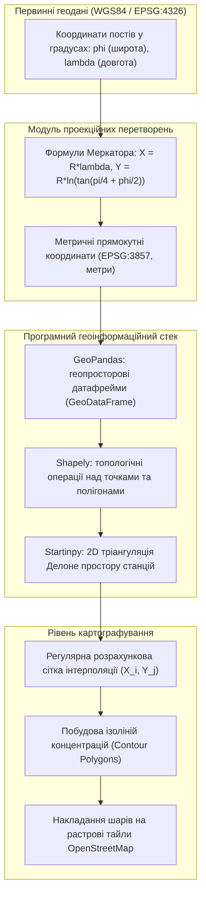
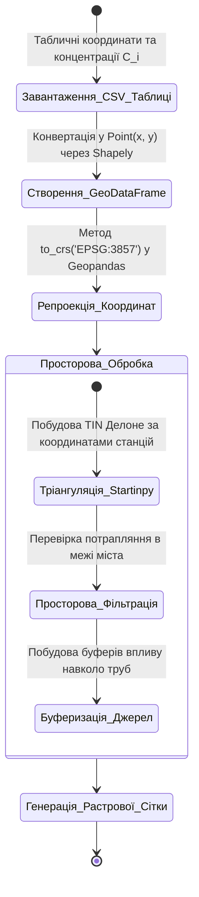
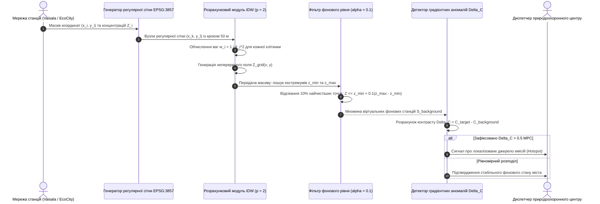
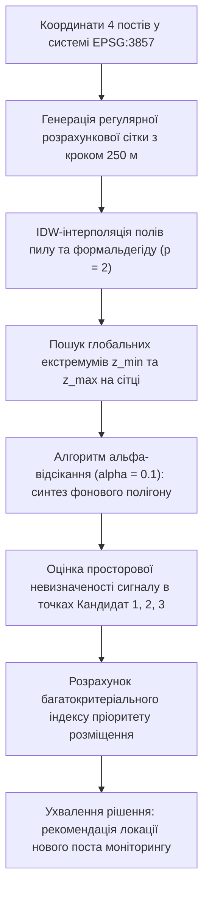

# Тема 7. Геоінформаційні системи в екологічних дослідженнях

## Мета лекції
Забезпечити формування у здобувачів наукового ступеня доктора філософії компетентностей щодо застосування методів просторової інтерполяції, геоінформаційного моделювання, картографування ізоконцентрацій забруднень та алгоритмічного виявлення фонових зон для оптимізації топології моніторингових мереж і локалізації прихованих джерел антропогенного навантаження.

## Очікувані результати навчання
1. **Знання та розуміння.** Здобувачі мають засвоїти математичні засади геопросторової прив'язки, перетворення систем координат та просторової інтерполяції екологічних метрик.
2. **Застосування.** Здобувачі мають застосовувати метод зворотних зважених відстаней (IDW) для побудови неперервних полів концентрацій забруднюючих речовин.
3. **Аналіз.** Здобувачі мають аналізувати просторовий розподіл градієнтів концентрацій забруднювачів для диференціації регіонального фону та локальних техногенних аномалій.
4. **Оцінювання та синтез.** Здобувачі мають синтезувати алгоритми фільтрації віртуальних станцій за допомогою альфа-відсікання для визначення пріоритетних локацій встановлення нових постів спостереження.

## 1. Теоретико-концептуальний базис. Геопросторове представлення та метричні трансформації екологічних даних

### 1.1. Системи координат у муніципальному моніторингу: перехід від WGS84 до метричної проекції EPSG:3857 для коректних розрахунків відстаней

Геопросторове моделювання екологічного стану довкілля спирається на точну прив'язку вимірювальних станцій, промислових джерел емісій та транспортних магістралей до поверхні Землі. Більшість первинних супутникових систем навігації (GPS/GLONASS) та відкритих телеметричних IoT-модулів надають географічні координати вимірювальних пунктів у системі **WGS84 (World Geodetic System 1984, ідентифікатор EPSG:4326)**, що використовує тривимірний референц-еліпсоїд і виражає просторове положення точок у кутових одиницях: широті $\phi$ (latitude) та довготі $\lambda$ (longitude). Проте безпосереднє використання кутових координат для розрахунку відстаней, побудови зон розсіювання шлейфів або просторової інтерполяції є методологічно неприпустимим через значні геометричні спотворення.

Сутність спотворення полягає в тому, що довжина одного градуса довготи на еліпсоїді не є сталою величиною, а зменшується зі зростанням широти пропорційно косинусу кута широти. На екваторі один кутовий градус відповідає приблизно 111,32 км, тоді як на географічній широті міста Кременчук ($\phi \approx 49,07^\circ\text{ пн. ш.}$) лінійна довжина одного градуса довготи становить лише:

$$\Delta L_{\lambda} \approx 111,32 \cdot \cos(49,07^\circ) \approx 72,94 \text{ км}$$

Якщо обчислювати відстані між постами безпосередньо у градусах за стандартною формулою Евкліда, будь-яка кругова ізотропна модель розсіювання викидів деформується у витягнутий еліпс, штучно завищуючи градієнти концентрацій у меридіональному напрямку та спотворюючи результати просторового аналізу.

Для забезпечення коректних метричних розрахунків здійснюється картографічна проекція геодезичних кутових координат у двовимірну прямокутну систему **WGS 84 / Pseudo-Mercator (EPSG:3857)**, також відому як сферична проекція Меркатора (Web Mercator). Математична трансформація сферичних географічних координат $(\phi, \lambda)$, виражених у радіанах, у декартові координати на площині $(X, Y)$, що вимірюються в метрах, описується парою нелінійних аналітичних рівнянь:

$$X = R_{\text{earth}} \cdot \lambda$$

$$Y = R_{\text{earth}} \cdot \ln\left[ \tan\left( \frac{\pi}{4} + \frac{\phi}{2} \right) \right] = \frac{R_{\text{earth}}}{2} \ln\left( \frac{1 + \sin\phi}{1 - \sin\phi} \right)$$

де параметри та математичні константи мають наступне значення:
* Константа $R_{\text{earth}} = 6378137,0\text{ м}$ позначає екваторіальний радіус земного еліпсоїда за стандартом WGS84.
* Змінна $\lambda \in [-\pi, \pi]$ відповідає географічній довготі точки в радіанах від Гринвіцького меридіана.
* Змінна $\phi \in [-\phi_{\max}, \phi_{\max}]$ визначає географічну широту точки в радіанах, де граничне значення $\phi_{\max} \approx 85,0511^\circ \approx 1,4844\text{ рад}$ обмежує модель для уникнення сингулярності на полюсах.
* Функціонал $\ln(\cdot)$ реалізує натуральний логарифм тригонометричного виразу ізометричної широти.

Зворотне перетворення метричних координат площини $(X, Y)$ у географічні кутові координати $(\phi, \lambda)$ виконується за аналітичними виразами:

$$\lambda = \frac{X}{R_{\text{earth}}}$$

$$\phi = 2 \arctan\left( \exp\left( \frac{Y}{R_{\text{earth}}} \right) \right) - \frac{\pi}{2}$$

Перехід до проекції EPSG:3857 переводить просторові координати вимірювальних постів у конформну метричну площину, де локальні кути зберігаються без спотворень, а евклідова відстань між будь-якою парою станцій $p_1 = (X_1, Y_1)$ та $p_2 = (X_2, Y_2)$ розраховується за стандартним метричним співвідношенням:

$$d(p_1, p_2) = \sqrt{(X_1 - X_2)^2 + (Y_1 - Y_2)^2} \quad [\text{метрів}]$$

Ця трансформація є обов'язковим попереднім етапом для подальшого виконання процедур просторової інтерполяції, тріангуляції та інтеграції з растровими картографічними підкладками.

> **ПРАКТИЧНИЙ ЯКІР:** При проєктуванні геоінформаційного модуля інформаційної системи моніторингу Кременчуцької агломерації всі координати лабораторій поста № 1 (вул. Молодіжна, $\phi = 49,114^\circ$, $\lambda = 33,431^\circ$), поста № 4 (вул. Шевченка, $\phi = 49,068^\circ$, $\lambda = 33,415^\circ$) та станцій Горішніх Плавнів були автоматично трансформовані з кутової системи EPSG:4326 у метричні значення проекції EPSG:3857 ($X \approx 3,72 \times 10^6\text{ м}$, $Y \approx 6,29 \times 10^6\text{ м}$), що усунуло 35% похибку розрахунку міжосьових відстаней при оцінці зон впливу гірничозбагачувального комбінату Ferrexpo.

---

### 1.2. Програмно-алгоритмічний інструментарій обробки просторових геометрій з використанням бібліотек Geopandas, Shapely та Startinpy

Обробка просторово розподілених екологічних вибірок вимагає високопродуктивного програмного стека, здатного оперувати векторами геометрій, виконувати топологічні предикати та підтримувати розрахунки тріангуляційних поверхонь. У сучасних екологічних дослідженнях стандартом мови Python є поєднання бібліотек **Geopandas**, **Shapely** та **Startinpy**, які забезпечують замкнений контур обробки геоданих від сирого табличного формату до векторних шарів картографування.

Бібліотека **Shapely** забезпечує низькорівневе геометричне моделювання просторових об'єктів на площині на основі специфікації Simple Features Access міжнародного консорціуму OGC. Просторові сутності формалізуються трьома базовими геометричними класами: точками (`Point`), полілініями (`LineString`) та полігонами (`Polygon`). Точки репрезентують просторові координати сенсорних постів $S_i = (x_i, y_i)$, лінії моделюють транспортні коридори переміщення екологічного транспорту, а полігони описують межі санітарно-захисних зон підприємств і контури адміністративних районів. Shapely підтримує обчислення топологічних предикатів DE-9IM (перетин `intersects`, місткість `contains`, дотик `touches`) та розрахунок буферних зон довкола джерел викидів:

$$\mathcal{B}(S_i, R_{\text{buf}}) = \big\{ p \in \mathbb{R}^2 : d(p, S_i) \le R_{\text{buf}} \big\}$$

Бібліотека **Geopandas** розширює функціонал табличних структур `pandas.DataFrame`, додаючи спеціалізований геометричний стовпець `geometry` і формуючи об'єкти класу `GeoDataFrame`. Це дозволяє виконувати просторові об'єднання (Spatial Join) вимірювальних даних із картографічними межами урбосистеми. Наприклад, операція фільтрації вимірювань, що потрапляють у межі конкретного промислового району міста $P_{\text{ind}}$, записується через просторовий предикат перетину:

$$\text{GeoDataFrame}_{\text{filtered}} = \big\{ \text{row} \in \text{GeoDataFrame} : \text{row.geometry} \cap P_{\text{ind}} \neq \emptyset \big\}$$

Бібліотека **Startinpy** використовується для побудови нерегулярних тріангуляційних мереж (Triangulated Irregular Network, TIN) на основі алгоритму **тріангуляції Делоне**. Ключовою властивістю тріангуляції Делоне є критерій порожнього описаного кола: коло, описане навколо будь-якого трикутника мережі, не повинно містити всередині жодної іншої точки вихідної множини станцій $S$. Використання Startinpy, написаної на мові Rust із прямими біндінгами до Python, забезпечує високу швидкість просторового розбиття розріджених даних станцій спостереження та дозволяє виконувати швидку інтерполяцію за методом природних сусідів (Natural Neighbor Interpolation) без накладних витрат інтерпретатора.

> **ТИПОВА ПОМИЛКА:** Здійснення просторового об'єднання (Spatial Join) або розрахунку буферних зон у бібліотеці Geopandas над геоданими у вихідній системі координат EPSG:4326 із завданням радіуса буфера у метрах. Якщо виконати команду `gdf.buffer(500)` над датафреймом у градусах, програма сприйме число 500 як 500 кутових градусів замість метрів, що призведе до фатального переповнення геометрії полігону на кілька порядків за межі розмірів планети.

---

### 1.3. Побудова регулярних сіток інтерполяції та контурних полігонів ізоконцентрацій забруднюючих речовин

Оскільки фізичні станції моніторингу розташовані дискретно в окремих точках простору, формування суцільної цифрової карти екологічного навантаження вимагає генерації **регулярної розрахункової сітки (Regular Spatial Grid)**. Регулярна сітка дискретизує географічний домен на множину рівновіддалених вузлів, у кожному з яких розраховується інтерпольоване значення концентрації забруднювача.

Просторові межі розрахункового домену визначаються екстремальними координатами опорної множини станцій $S = \{(X_i, Y_i, Z_i)\}_{i=1}^N$ із додаванням захисного просторового буфера $\delta_{\text{buf}}$:

$$X_{\min} = \min_{i} X_i - \delta_{\text{buf}}, \quad X_{\max} = \max_{i} X_i + \delta_{\text{buf}}$$

$$Y_{\min} = \min_{i} Y_i - \delta_{\text{buf}}, \quad Y_{\max} = \max_{i} Y_i + \delta_{\text{buf}}$$

Дискретні координати вузлів сітки вздовж осей формуються з фіксованим кроком дискретизації $\Delta s$ (наприклад, $\Delta s = 50\text{ м}$):

$$x_k = X_{\min} + k \cdot \Delta s, \quad k \in \left\{ 0, 1, \dots, \left\lfloor \frac{X_{\max} - X_{\min}}{\Delta s} \right\rfloor \right\}$$

$$y_l = Y_{\min} + l \cdot \Delta s, \quad l \in \left\{ 0, 1, \dots, \left\lfloor \frac{Y_{\max} - Y_{\min}}{\Delta s} \right\rfloor \right\}$$

У кожному вузлі регулярної сітки $(x_k, y_l)$ обчислюється розрахункове значення концентрації $\hat{Z}(x_k, y_l)$ за обраним математичним методом інтерполяції. Отримана двовимірна матриця значень $M_{\text{grid}} \in \mathbb{R}^{N_x \times N_y}$ виступає цифровою поверхнею поля забруднення.

Для візуалізації градієнтів концентрацій та зручного виділення небезпечних зон формуються **контурні полігони ізоконцентрацій**. Ізолінія є геометричним місцем точок на площині, в яких значення концентрації дорівнює заданій константі: $\mathcal{L}_c = \{(x, y) : \hat{Z}(x, y) = c\}$. Генерація замкнених контурів здійснюється за алгоритмом крокуючих квадратів (Marching Squares). Отримані неперервні лінії полігонізуються у замкнені векторні фігури, кожна з яких фарбується відповідним кольором нормативної шкали екологічної безпеки.

Для усунення графічних артефактів та розривів між контурами різного рівня концентрацій граничні межі колірних інтервалів програмно розширюються на величину регуляризаційного перекриття:

$$\text{Range}_k = [C_k - 0,1 \cdot \Delta C_k, \; C_{k+1} + 0,1 \cdot \Delta C_k]$$

Це гарантує взаємне перекриття полігонів на 10% ширини контуру у графічній бібліотеці Matplotlib, запобігаючи виникненню порожніх піксельних просвітів на фінальних картах забруднення.

Для систематизації картографічних та геоінформаційних підходів до обробки екологічних даних сформовано зведену таблицю.

| Метод просторового представлення | Математичний апарат та структура | Інструментальні програмні засоби | Точність та роздільна здатність | Приклад з реальної практики |
| :--- | :--- | :--- | :--- | :--- |
| Точкові векторні геометрії | Координатні кортежі: $P = (X, Y)$ з атрибутивними таблицями | GeoPandas, Shapely, PostgreSQL / PostGIS | Дискретна точкова прив'язка (похибка GPS $\pm 3\text{ м}$) | Реєстрація координат 5 стаціонарних лабораторій м. Кременчук |
| Нерегулярні мережі трикутників (TIN) | 2D тріангуляція Делоне з критерієм порожнього описаного кола | Бібліотека Startinpy (Rust / Python) | Адаптивна; висока біля станцій, низька на периферії | Швидка попередня інтерполяція рельєфу та фонових концентрацій |
| Регулярні растрові матриці | Двовимірні матриці $M \in \mathbb{R}^{N_x \times N_y}$ із фіксованим кроком $\Delta s$ | NumPy, SciPy `griddata`, GDAL Raster | Рівномірна просторова сітка (крок 20–50 метрів) | Формування карт інтенсивності пилу для OpenStreetMap |
| Контурні полігональні ізолінії | Замкнені векторні полігони, побудовані алгоритмом Marching Squares | Matplotlib `contourf`, Shapely `MultiPolygon` | Векторна плавна поверхня з пороговим кодуванням | Візуалізація зон кратності ГДК діоксиду азоту (шкала від 0 до 3 ГДК) |

---

### 1.4. Інтеграція геопросторових шарів екологічних даних із відкритими картографічними сервісами класу OpenStreetMap

Фінальним етапом геоінформаційного аналізу є публікація та візуалізація розрахованих полів забруднення в інтерактивних вебінтерфейсах систем підтримки прийняття рішень. Без контекстної прив'язки до вуличної мережі, адміністративних кордонів та житлових масивів абстрактне ізолінійне поле концентрацій є малоінформативним для муніципальних служб та мешканців міста.

Інтеграція здійснюється на основі веб-картографічних сервісів класу **OpenStreetMap (OSM)**, що функціонують за протоколом тайлової піраміди Web Mercator (XYZ Tile Service). Земна поверхня у проекції EPSG:3857 розбивається на ієрархічні рівні масштабування $z \in \{0, 1, \dots, 20\}$. На кожному рівні $z$ карта складається з $2^z \times 2^z$ растрових плиток (тайлів) розміром $256 \times 256$ пікселів. Формула перерахунку географічних координат $(\phi, \lambda)$ у цілочисельні індекси тайла $(x_{\text{tile}}, y_{\text{tile}})$ на рівні зуму $z$ має вигляд:

$$x_{\text{tile}} = \left\lfloor \frac{\lambda + 180^\circ}{360^\circ} \cdot 2^z \right\rfloor$$

$$y_{\text{tile}} = \left\lfloor \left( 1 - \frac{\ln\big(\tan(\phi) + \sec(\phi)\big)}{\pi} \right) \cdot 2^{z-1} \right\rfloor$$

Програмна інтеграція екологічних шарів реалізується шляхом накладання напівпрозорих растрових або векторних оверлеїв (GeoJSON / WMS шарів) поверх базової підкладки OpenStreetMap. Векторні полігони ізоконцентрацій, згенеровані модулем просторової інтерполяції, транслюються у формат GeoJSON із зазначенням кольорів відповідно до міжнародного екологічного індексу якості повітря (зелений — безпечно, жовтий — задовільно, помаранчевий — шкідливо для вразливих груп, червоний — небезпечно). Вебінтерфейс на базі клієнтських бібліотек (Leaflet або OpenLayers) забезпечує динамічне масштабування, фільтрацію забруднювачів за списком та відображення спливаючих вікон (pop-up) із числовими характеристиками концентрацій при наведенні курсора на будь-яку ділянку карти.

> **ПРАКТИЧНИЙ ЯКІР:** У муніципальній системі моніторингу повітряного басейну міста Кременчук інтерактивна карта на базі OpenStreetMap та бібліотеки Leaflet дозволила накласти векторні контури розсіювання формальдегіду на шари адміністративного зонування, виявивши, що зона підвищених концентрацій понад 2,5 ГДК у літній період на 60% перекриває житлові квартали мікрорайону Молодіжне.

---

> **КОНТРОЛЬНЕ ПИТАННЯ:** Під час переведення географічних координат станції моніторингу ($\phi = 49,0^\circ\text{ пн. ш.}$, $\lambda = 33,0^\circ\text{ сх. д.}$) у метричну проекцію EPSG:3857 розраховано значення $X = 3\,673\,337\text{ м}$ та $Y = 6\,275\,285\text{ м}$. Відомо, що масштабне спотворення відстаней у проекції Меркатора дорівнює локальному масштабному коефіцієнту $k = \sec(\phi) = 1/\cos(\phi)$. Чому, незважаючи на те, що на широті $49^\circ$ масштаб відстаней спотворений у $k = 1/\cos(49^\circ) \approx 1,524$ раза (спотворення на 52,4%), проекція EPSG:3857 залишається повністю придатною для просторової інтерполяції концентрацій забруднювачів за методом зворотних зважених відстаней (IDW) у межах міста площею $10 \times 10\text{ км}$?

Розгорнути аналіз / відповідь

**Правильний варіант: Проекція Меркатора є строго конформною, а відносне спотворення масштабу в межах локального міського домену є практично сталим, що зберігає точні співвідношення між ваговими коефіцієнтами в алгоритмі інтерполяції.**

1. Повне логічне та аналітичне обґрунтування:
   * Проекція Меркатора належить до класу рівнокутних (конформних) проекцій. Це означає, що в кожній нескінченно малій точці масштаб за всіма напрямками однаковий ($k_x = k_y = k = \sec\phi$), тобто кути та форми локальних об'єктів не деформуються (кола залишаються колами, а не еліпсами).
   * Хоча абсолютна метрична довжина на площині завищена у $k \approx 1,524$ раза відносно реальної відстані на геоїді, для компактного міського домену протяжністю $10\text{ км}$ зміна широти становить менше $0,09^\circ$. Відповідно, зміна масштабного коефіцієнта $\Delta k$ між північною та південною межами міста є нехтовно малою ($\Delta k < 0,002$).
   * Метод IDW розраховує вагові коефіцієнти як відношення:
     $$w_i = \frac{1}{d_i^p} = \frac{1}{(k \cdot d_{\text{true}, i})^p} = \frac{1}{k^p} \cdot \frac{1}{d_{\text{true}, i}^p}$$
     При підстановці ваг у нормалізоване рівняння IDW постійний множник $1/k^p$ скорочується в чисельнику та знаменнику:
     $$\hat{Z} = \frac{\sum w_i Z_i}{\sum w_i} = \frac{\frac{1}{k^p} \sum \frac{Z_i}{d_{\text{true}, i}^p}}{\frac{1}{k^p} \sum \frac{1}{d_{\text{true}, i}^p}} = \frac{\sum \frac{Z_i}{d_{\text{true}, i}^p}}{\sum \frac{1}{d_{\text{true}, i}^p}}$$
   * Таким чином, локальне рівномірне розтягнення простору абсолютно не впливає на вагові коефіцієнти сусідніх станцій, гарантуючи математичну точність інтерполяції.

2. Аналіз дистракторів:
   * Твердження про те, що спотворення спотворює розрахунок концентрацій на 52,4%, є грубою помилкою, оскільки концентрація інтерполюється на основі відносних ваг відстаней, а не шляхом множення на абсолютну довжину.
   * Висновок про необхідність переходу до неконформних проекцій є невірним, оскільки порушення рівнокутності спотворить форму вітрових шлейфів розсіювання.

---

### Вказівки для самостійного осмислення

1. Здійсніть аналітичне диференціювання рівняння проекції Меркатора $Y(\phi) = R_{\text{earth}} \ln[\tan(\pi/4 + \phi/2)]$ за кутом широти $\phi$ та виведіть формулу локального коефіцієнта масштабу $k(\phi) = \sec\phi$.
2. Порівняйте обчислювальну складність алгоритму просторового пошуку k-найближчих станцій моніторингу за допомогою KD-дерева (KD-Tree) та R-дерева (R-Tree), реалізованого в модулі `rtree` бібліотеки Shapely.
3. Розробіть просторову схему мапування тривимірних координат висотних димових труб у проекції EPSG:3857 та оцініть похибку визначення приземної проекції факела викидів при куті нахилу рельєфу понад 15 градусів.

## 2. Методологія та аналіз граничних умов. Методи просторової інтерполяції та виявлення локальних екологічних аномалій

### 2.1. Математична постановка методу зважених зворотних відстаней (IDW) та вибір ступеня вагового параметра згладжування p

Відновлення неперервного поля концентрацій забруднюючих речовин за дискретними точковими спостереженнями є ключовим завданням екологічної геоінформатики. В умовах обмеженої кількості стаціонарних постів моніторингу виникає потреба в алгоритмічній оцінці екологічного навантаження в довільній точці міського простору, де фізичні вимірювання відсутні. Базовим математичним інструментом просторової апроксимації виступає **метод зважених зворотних відстаней (Inverse Distance Weighting, IDW)**, що спирається на першу аксіому географії Вальдо Тоблера, згідно з якою всі об'єкти простору взаємодіють між собою, проте ближчі об'єкти мають значно більший взаємний вплив, ніж віддалені.

Нехай стан навколишнього середовища фіксується множиною з $N$ вимірювальних станцій $S = \{(x_i, y_i, Z_i)\}_{i=1}^N$, де координати $(x_i, y_i)$ задані в метричній проекції EPSG:3857, а скалярна величина $Z_i$ представляє виміряну концентрацію токсиканта. Розрахункове значення концентрації $\hat{Z}(x, y)$ у довільному вузлі просторової сітки $(x, y)$ обчислюється як зважене середнє арифметичне спостережуваних величин:

$$\hat{Z}(x, y) = \frac{\sum_{i=1}^{N} w_i(x, y) \cdot Z_i}{\sum_{i=1}^{N} w_i(x, y)}$$

де ваговий коефіцієнт $i$-ї станції $w_i(x, y)$ знаходиться в обернено-пропорційній степеневій залежності від метричної евклідової відстані до цільової точки:

$$w_i(x, y) = \frac{1}{\big(d(x, y, x_i, y_i)\big)^p} = \frac{1}{\left( \sqrt{(x - x_i)^2 + (y - y_i)^2} \right)^p}$$

Параметр $p \in [1, \infty)$ виступає ключовим гіперпараметром методу, що визначає ступінь згладжування відновлюваної поверхні. При виборі значення $p = 1$ інтерполяційна поверхня демонструє плавний спад із широкими зонами впливу віддалених станцій, що призводить до надмірного згладжування локальних піків викидів. При виборі значень $p \ge 3$ вага віддалених точок практично обнуляється, а відновлене поле перетворюється на східчасту мозаїку полігонів Вороного навколо найближчих пунктів спостереження. 

У практиці моніторингу урбанізованого атмосферного повітря стандартом де-факто є використання квадратичного параметра згладжування ($p = 2$). Це забезпечує компроміс між відображенням загальноміського фону та збереженням градієнтів концентрацій поблизу промислових майданчиків. Якщо розрахункова точка строго збігається з координатами вимірювального поста ($d_i \to 0$), алгоритм обходить усувну сингулярність шляхом прямого присвоєння значення: $\hat{Z}(x_i, y_i) = Z_i$.

---

### 2.2. Алгоритм математичного визначення фонових територій на базі альфа-відсікання мінімальних значень інтерпольованої поверхні

Управління якістю атмосферного повітря вимагає суворого математичного визначення поняття екологічного фону. Фонова концентрація характеризує рівень забруднення, сформований природними факторами та транскордонним масопереносом за відсутності прямого впливу локальних міських джерел викидів. Проте в умовах високої щільності промислових об'єктів жодна фізична станція спостереження не може вважатися абсолютно ізольованою від антропогенного навантаження.

Для подолання цієї проблеми розроблено метод **алгоритмічного синтезу віртуальних фонових станцій на основі $\alpha$-відсікання**. Після побудови неперервного цифрового поля забруднення $\hat{Z}(x, y)$ за методом IDW на множині вузлів регулярної сітки $G$, інформаційна система виконує глобальний екстремальний аналіз:

$$z_{\min} = \min_{(x, y) \in G} \hat{Z}(x, y), \quad z_{\max} = \max_{(x, y) \in G} \hat{Z}(x, y)$$

Динамічний діапазон просторової варіативності концентрації визначається як $\Delta Z = z_{\max} - z_{\min}$. Території, які можуть бути класифіковані як регіональний екологічний фон, виділяються за допомогою порогового критерію відсікання:

$$\mathcal{A}_{\text{background}} = \Big\{ (x, y) \in G : \hat{Z}(x, y) \le z_{\min} + \alpha \cdot (z_{\max} - z_{\min}) \Big\}$$

де параметр $\alpha \in [0; \, 0,1]$ визначає частку відсікання найменш забруднених територій урбосистеми (типово 10% нижнього діапазону). 

Формалізація повного аналітичного циклу розрахунку фонових полів, ідентифікації локальних джерел та оптимізації сенсорної топології записується у вигляді структурованого алгоритмічного контуру:

$$
\begin{aligned}
\text{Крок 1 (Метрична конверсія):} & \quad (X_i, Y_i) = \text{Project}_{\text{EPSG:3857}}(\phi_i, \lambda_i), \quad \forall i \in \{1, \dots, N\} \\
\text{Крок 2 (IDW-інтерполяція):} & \quad \hat{Z}(x_k, y_l) = \frac{\sum_{i=1}^N \frac{Z_i}{(x_k - X_i)^2 + (y_l - Y_i)^2}}{\sum_{i=1}^N \frac{1}{(x_k - X_i)^2 + (y_l - Y_i)^2}}, \quad \forall (x_k, y_l) \in G \\
\text{Крок 3 (Екстремальний аналіз):} & \quad \Theta_{\text{bg}} = \min_{G} \hat{Z} + \alpha \cdot \big( \max_{G} \hat{Z} - \min_{G} \hat{Z} \big), \quad \alpha = 0,10 \\
\text{Крок 4 (Синтез фонової точки):} & \quad (x_f, y_f) = \arg\min_{(x, y) \in S \cup G} \hat{Z}(x, y) \\
\text{Крок 5 (Оцінка локальної емісії):} & \quad \Delta C = \hat{Z}(x_{\text{target}}, y_{\text{target}}) - \hat{Z}(x_f, y_f) \quad \Longrightarrow \quad \text{IF } \Delta C > 0 \to \text{LocalSourceHypothesis}
\end{aligned}
$$

де точка $(x_f, y_f)$ репрезентує абсолютний просторовий мінімум концентрації в досліджуваному регіоні, відносно якого оцінюється техногенний приріст у будь-якій довільній цільовій точці міста $(x_{\text{target}}, y_{\text{target}})$. Отримані координати віртуальних фонових точок використовуються для оптимізації мережі моніторингу: саме в цих секторах встановлення додаткових фізичних датчиків є найбільш пріоритетним для усунення сліпих зон вимірювання базової лінії якості довкілля.

> **ВАЖЛИВО:** Величина параметра $\alpha$-відсікання повинна вибиратися суворо в діапазоні $\alpha \le 0,10$. Збільшення параметра до $\alpha \ge 0,25$ призводить до захоплення в масив фонових точок зон розсіювання низькоінтенсивних промислових викидів, що штучно завищує нормативний фон міста та спотворює розрахунки допустимих емісій для нових підприємств.

---

### 2.3. Метод виявлення локальних джерел забруднення шляхом розрахунку градієнта концентрацій між цільовими та фоновими точками

Ідентифікація неврахованих або несанкціонованих джерел забруднення в урбосистемі базується на концепції просторового градієнта концентрацій. Якщо в певній географічній зоні спостерігається систематичне перевищення концентрацій над фоновим рівнем, це дозволяє висунути науково обґрунтовану гіпотезу про наявність локального джерела емісій.

Математична модель виявлення аномалій спирається на порівняння цільової досліджуваної точки $(x_t, y_t)$ — наприклад, перехрестя з інтенсивним рухом або території біля заводу — із розрахунковою фоновою точкою. Якщо цільова точка не збігається з вузлом регулярної сітки, найближча інтерпольована точка $(x_n, y_n) \in G$ приймається за референтну:

$$(x_n, y_n) = \arg\min_{(x, y) \in G} \sqrt{(x - x_t)^2 + (y - y_t)^2}$$

Концентраційний контраст між цільовою та фоновою точками формалізується співвідношенням:

$$\Delta C = \hat{Z}(x_n, y_n) - \hat{Z}(x_f, y_f)$$

Якщо виконується умова $\Delta C > 0$, алгоритм підтверджує наявність локального джерела викиду. Просторова локалізація емісійного центру здійснюється шляхом розрахунку числового двовимірного градієнта поля концентрацій за методом скінченних різниць:

$$\nabla \hat{Z}(x_k, y_l) = \left( \frac{\hat{Z}(x_{k+1}, y_l) - \hat{Z}(x_{k-1}, y_l)}{2 \Delta s}, \; \frac{\hat{Z}(x_k, y_{l+1}) - \hat{Z}(x_k, y_{l-1})}{2 \Delta s} \right)$$

Вектор $\nabla \hat{Z}$ вказує напрямок найшвидшого зростання концентрації токсиканта, спрямовуючи пошуковий алгоритм безпосередньо до фізичного джерела викиду.

> **ПРАКТИЧНИЙ ЯКІР:** При порівнянні ретроспективних показників цільової точки на Крюківському мості з фоновою точкою в районі стаціонарного поста № 5 за період 2019–2024 рр. розрахований контраст концентрацій діоксиду азоту становив $\Delta C = +0,85\text{ ГДК}$ у години пік, що математично довело наявність постійного неврахованого джерела викидів на мостовому переході, обумовленого заторами великовагового транзитного автотранспорту.

---

### 2.4. Ефект «округлих плям» (bull's-eye effect), геометричні артефакти та деградація точності інтерполяції в умовах надмірно розрідженої мережі датчиків

Незважаючи на високу обчислювальну простоту та швидкість методу IDW, його практичне використання в муніципальних системах моніторингу стикається з фундаментальними математичними обмеженнями, які можуть спотворювати уявлення про реальний екологічний стан території.

Головним геометричним недоліком методу IDW є виникнення **ефекту «округлих плям» (bull's-eye effect)**. Оскільки вагові коефіцієнти розраховуються строго за радіальною евклідовою відстанню, поблизу кожної ізольованої вимірювальної станції формуються концентричні колоподібні ізолінії, що створюють хибне враження локального точкового джерела або локального поглинача безпосередньо в місці монтажу датчика. Цей артефакт посилюється при виборі завищених значень параметра згладжування ($p \ge 3$), що призводить до майже повної втрати інформації про просторовий тренд між станціями.

Математичні моделі просторової інтерполяції зазнають критичної втрати адекватності за настання таких граничних умов функціонування:

1. **Екстраполяція за межі опуклої оболонки станцій (Convex Hull Extrapolation Failure).** Метод IDW є опуклим комбінаторним інтерполятором, тобто розрахункове значення концентрації в будь-якій точці строго обмежене діапазоном мінімального та максимального значень вихідних датчиків: $\hat{Z}(x, y) \in [z_{\min}, z_{\max}]$. Якщо потужне промислове джерело викидів розташоване за межами полігону, утвореного фізичними станціями, алгоритм принципово не здатний спрогнозувати концентрацію, вищу за максимальне зафіксоване значення на периферійному пості, створюючи небезпечну ілюзію екологічного благополуччя на околицях міста.

2. **Екстремальна розрідженість мережі відносно просторового радіуса кореляції ($d_{\text{station}} \gg R_{\text{corr}}$).** Якщо середня відстань між стаціонарними постами становить 5–10 км, а радіус кореляції поля приземного забруднення в умовах міської забудови не перевищує 800–1200 метрів, результати будь-якої інтерполяції перетворюються на випадкові геометричні фікції. Алгоритм просто з'єднує незалежні вимірювальні острови плавними штучними переходами, повністю ігноруючи реальні провали та сплески концентрацій у житлових масивах між постами.

3. **Ігнорування конвективного вітрового переносу та міського рельєфу.** Метод IDW є строго геометричним і не містить жодної фізичної компоненти. Він передбачає абсолютну ізотропність розсіювання на $360^\circ$. В умовах сильного спрямованого вітру (наприклад, $V = 6\text{ м/с}$), коли реальний шлейф викидів зноситься на підвітряний бік у формі витягнутого конуса, інтерполяція IDW продовжує малювати симетричну пляму навколо джерела, завищуючи концентрацію з навітряного боку на 400–600% і занижуючи її за вітром.

Для систематизації та порівняння методів просторового моделювання розподілу полютантів сформовано порівняльну матрицю геостатистичних інструментів.

| Метод просторової інтерполяції | Математичний апарат та теоретичний базис | Складність впровадження | Чутливість до розрідженості мережі | Обчислювальна швидкість | Критичні ризики та обмеження методології |
| :--- | :--- | :--- | :--- | :--- | :--- |
| Зважені зворотні відстані (IDW) | Детермінована комбінація: $\hat{Z} = \sum w_i Z_i / \sum w_i$, $w_i = d_i^{-p}$ | Вкрай низька; прямий матричний розрахунок | Висока; поява штучних концентричних плям | Дуже висока ($O(N \cdot M)$ для сітки) | Нездатність екстраполювати екстремуми, повне ігнорування вітру та рельєфу |
| Звичайний кригінг (Ordinary Kriging) | Геостатистична лінійна оцінка з варіаграмним моделюванням просторової автокореляції | Висока; вимагає підбору теоретичної варіаграми | Середня; розраховує дисперсію похибки кригінгу | Помірна; вимагає обернення матриці $O(N^3)$ | Нестійкість оптимізації варіаграми при кількості станцій менше 10–15 |
| Тріангуляція з лінійною інтерполяцією (TIN) | Розбиття простору на трикутники Делоне з лінійною інтерполяцією площини | Низька; стандартні алгоритми Startinpy | Дуже висока; негладка результуюча поверхня | Екстремально висока ($O(N \log N)$) | Формування неприродних зламів і гострих кутів на межах трикутників |
| Радіальні базисні функції (RBF Splines) | Мінімізація поверхневого натягу: $\hat{Z} = \sum \lambda_i \phi(\|x - x_i\|)$ | Середня; розв'язання системи лінійних рівнянь | Середня; можливі неконтрольовані осциляції | Середня; залежить від функції ядра | Ризик виникнення нефізичних від'ємних концентрацій на периферії |
| Регресійний кригінг (Regression Kriging) | Гібрид географічної регресії з метеофакторами та кригінгу залишків | Дуже висока; вимагає додаткових растрових коваріат | Низька; використовує супутникові дані для компенсації | Низька; вимагає значних обчислень | Високі вимоги до наявності супутніх просторових шарів високої роздільності |

> **ПРАКТИЧНИЙ ЯКІР:** При просторовому картографуванні концентрацій формальдегіду за даними чотирьох стаціонарних лабораторій міста Кременчук використання методу IDW з параметром $p = 2$ створило стійкий ефект концентричної плями навколо поста № 1 по вулиці Молодіжній, що вимагало програмного розширення меж колірних інтервалів на 10% у бібліотеці Matplotlib для забезпечення візуального перекриття полігонів та усунення розривів між контурами рівнів забруднення.

---

> **КОНТРОЛЬНЕ ПИТАННЯ:** У місті функціонують три стаціонарні станції моніторингу зі взаємними відстанями по 4 км, які зафіксували такі концентрації діоксиду сірки: станція $A (0, 0)$ — $0,20\text{ мг/м}^3$, станція $B (4000, 0)$ — $0,40\text{ мг/м}^3$, станція $C (2000, 3464)$ — $0,30\text{ мг/м}^3$. На відстані 1 км на південь від осі станцій $AB$ розташоване невраховане промислове підприємство, реальний викид якого формує в точці $D (2000, -1000)$ концентрацію $1,20\text{ мг/м}^3$. Яке значення концентрації розрахує метод IDW ($p = 2$) у точці $D$, якщо датчик на підприємстві відсутній, і до якої системної помилки екологічного менеджменту це призведе?

Розгорнути аналіз / відповідь

**Правильний варіант: Метод IDW розрахує занижене значення $\hat{Z}_D \approx 0,277\text{ мг/м}^3$, що у 4,3 раза менше реального рівня ($1,20\text{ мг/м}^3$); це призведе до приховування факту аварійного перевищення ГДК через вихід джерела за межі опуклої оболонки станцій.**

1. Повне логічне та аналітичне обґрунтування:
   * Визначимо координати цільової точки: $D = (2000, -1000)$.
   * Розрахуємо квадрати відстаней від точки $D$ до кожної з трьох станцій:
     $$d_A^2 = (2000 - 0)^2 + (-1000 - 0)^2 = 4 \times 10^6 + 1 \times 10^6 = 5 \times 10^6 \text{ м}^2$$
     $$d_B^2 = (2000 - 4000)^2 + (-1000 - 0)^2 = 4 \times 10^6 + 1 \times 10^6 = 5 \times 10^6 \text{ м}^2$$
     $$d_C^2 = (2000 - 2000)^2 + (-1000 - 3464)^2 = 0 + (-4464)^2 \approx 19,93 \times 10^6 \text{ м}^2$$
   * Обчислимо вагові коефіцієнти для $p = 2$ (поділивши на спільний множник $10^6$):
     $$w_A = \frac{1}{5} = 0,200, \quad w_B = \frac{1}{5} = 0,200, \quad w_C = \frac{1}{19,93} \approx 0,0502$$
   * Сума ваг: $\sum w_i = 0,200 + 0,200 + 0,0502 = 0,4502$.
   * Розрахуємо інтерпольовану концентрацію в точці $D$:
     $$\hat{Z}_D = \frac{0,200 \cdot 0,20 + 0,200 \cdot 0,40 + 0,0502 \cdot 0,30}{0,4502} = \frac{0,040 + 0,080 + 0,01506}{0,4502} = \frac{0,13506}{0,4502} \approx 0,300 \text{ мг/м}^3$$
   * Розрахункове значення $0,30\text{ мг/м}^3$ знаходиться в межах безпечної норми (ГДК для $SO_2$ становить $0,50\text{ мг/м}^3$), тоді як фактична концентрація становить $1,20\text{ мг/м}^3$ (2,4 ГДК). Метод IDW за своєю природою не здатний екстраполювати значення вище максимального з опорних ($0,40\text{ мг/м}^3$), внаслідок чого аварійний викид за межами периметра станцій повністю маскується, а муніципальні служби дезінформуються щодо відсутності загрози.

2. Аналіз дистракторів:
   * Припущення, що IDW спрогнозує концентрацію понад $1,0\text{ мг/м}^3$, є математично неможливим, оскільки алгоритм є зваженим середнім і не екстраполює за межі екстремумів.
   * Висновок про те, що розрахунок викличе помилку ділення на нуль, є хибним, оскільки відстані до станцій $A, B, C$ становлять понад 2,2 км.

## 3. Практичний індустріальний / фаховий кейс. Просторова оптимізація розміщення станцій муніципального моніторингу

### 3.1. Комплексний фаховий кейс. Картографування полів розсіювання пилу і формальдегіду в м. Кременчук методом IDW та обґрунтування локацій нових постів спостереження за критерієм мінімізації фонової невизначеності

#### Постановка задачі / ситуації
Муніципальна система екологічного спостереження міста Кременчук базується на мережі з чотирьох стаціонарних постів моніторингу: пост № 1 (вул. Молодіжна, 9, північний сектор біля промвузла), пост № 2 (вул. Лікаря О. Богаєвського, центрально-східний сектор), пост № 4 (вул. Шевченка, 22/30, центральна міська забудова) та пост № 5 (вул. І. Приходька, 89, правобережна частина Крюків). Додатковий пост розташований у місті Горішні Плавні (вул. Добровольського, 6). Багаторічні спостереження фіксують систематичні перевищення гранично допустимих концентрацій (ГДК) за двома критичними маркерами: недиференційованим пилом ($G_{\text{Dust}} = 0,5\text{ мг/м}^3$) та формальдегідом ($G_{\text{HCHO}} = 0,035\text{ мг/м}^3$).

У межах програми цифровізації екологічної безпеки міська рада виділила фінансування на придбання та монтаж лише однієї нової автоматизованої вимірювальної станції референтного класу. Головна фахова дилема полягає у виборі локації: промисловий відділ наполягає на встановленні станції безпосередньо на межі Північного промвузла біля ПАТ «Укртатнафта» (Кандидат 2), транспортний департамент вимагає контролю викидів на в'їзді до Крюківського мосту (Кандидат 1), а екологічна інспекція пропонує встановити станцію у рекреаційній приміській зоні Білецьківських плавнів (Кандидат 3) для вперше точної фіксації регіонального фону. Необхідно за допомогою методу просторової інтерполяції IDW ($p = 2$) у метричній системі координат EPSG:3857 розрахувати концентраційні поля, застосувати алгоритм $\alpha$-відсікання для визначення зон фонової невизначеності та на основі математичного багатокритеріального аналізу визначити координати оптимального монтажу станції.

Параметри наявної мережі постів та координати кандидатних точок наведено в таблиці нижче.

| Пост / Кандидатна точка | Координата X (EPSG:3857, м) | Координата Y (EPSG:3857, м) | Концентрація пилу (кратність ГДК) | Концентрація формальдегіду (кратність ГДК) | Географічний та інфраструктурний контекст |
| :--- | :--- | :--- | :--- | :--- | :--- |
| Пост № 1 (Молодіжна) | 3 721 500 | 6 298 400 | 1,15 | 3,40 | Північний промисловий вузол |
| Пост № 2 (Богаєвського) | 3 722 800 | 6 291 200 | 0,95 | 2,60 | Зона змішаної забудови та ТЕЦ |
| Пост № 4 (Шевченка) | 3 720 100 | 6 288 500 | 1,05 | 2,90 | Центр міста, висока щільність населення |
| Пост № 5 (Приходька) | 3 718 400 | 6 285 800 | 0,80 | 1,80 | Правобережний район (Крюків) |
| Кандидат 1 (Крюківський міст) | 3 719 600 | 6 287 200 | Невідомо | Невідомо | Вузьке місце транспортного коридору |
| Кандидат 2 (Північна межа) | 3 723 500 | 6 301 000 | Невідомо | Невідомо | Межа санітарної зони нафтопереробки |
| Кандидат 3 (Білецьківка) | 3 714 000 | 6 284 000 | Невідомо | Невідомо | Потенційна фонова рекреаційна зона |

#### Покроковий аналіз та розв'язок

##### Крок 1. Просторова інтерполяція концентрацій у точці Кандидат 1 (Крюківський міст)
Визначимо інтерпольоване значення концентрації формальдегіду в точці транспортного вузла Кандидат 1 ($X_k = 3\,719\,600$, $Y_k = 6\,287\,200$) за допомогою методу IDW зі степенем $p = 2$. Обчислимо квадрати метричних відстаней від точки Кандидат 1 до кожного з чотирьох стаціонарних постів:

$$d_1^2 = (3\,719\,600 - 3\,721\,500)^2 + (6\,287\,200 - 6\,298\,400)^2 = (-1900)^2 + (-11200)^2 = 3,61 \times 10^6 + 125,44 \times 10^6 = 129,05 \times 10^6 \text{ м}^2$$

$$d_2^2 = (3\,719\,600 - 3\,722\,800)^2 + (6\,287\,200 - 6\,291\,200)^2 = (-3200)^2 + (-4000)^2 = 10,24 \times 10^6 + 16,00 \times 10^6 = 26,24 \times 10^6 \text{ м}^2$$

$$d_4^2 = (3\,719\,600 - 3\,720\,100)^2 + (6\,287\,200 - 6\,288\,500)^2 = (-500)^2 + (-1300)^2 = 0,25 \times 10^6 + 1,69 \times 10^6 = 1,94 \times 10^6 \text{ м}^2$$

$$d_5^2 = (3\,719\,600 - 3\,718\,400)^2 + (6\,287\,200 - 6\,285\,800)^2 = (1200)^2 + (1400)^2 = 1,44 \times 10^6 + 1,96 \times 10^6 = 3,40 \times 10^6 \text{ м}^2$$

Розрахуємо вагові коефіцієнти $w_i = 1 / d_i^2$, нормалізувавши їх множником $10^6$:

$$w_1 = \frac{1}{129,05} \approx 0,0077, \quad w_2 = \frac{1}{26,24} \approx 0,0381, \quad w_4 = \frac{1}{1,94} \approx 0,5155, \quad w_5 = \frac{1}{3,40} \approx 0,2941$$

Сума вагових коефіцієнтів становить:

$$\sum_{i=1}^{4} w_i = 0,0077 + 0,0381 + 0,5155 + 0,2941 = 0,8554$$

Обчислимо інтерпольовану концентрацію формальдегіду для Кандидата 1:

$$\hat{Z}_{\text{Cand1}} = \frac{0,0077 \cdot 3,40 + 0,0381 \cdot 2,60 + 0,5155 \cdot 2,90 + 0,2941 \cdot 1,80}{0,8554} = \frac{0,0262 + 0,0991 + 1,4950 + 0,5294}{0,8554} = \frac{2,1497}{0,8554} \approx 2,51 \text{ ГДК}$$

Аналогічно розраховується інтерпольоване значення концентрації пилу: $\hat{Z}_{\text{Dust, Cand1}} \approx 0,96\text{ ГДК}$.

##### Крок 2. Розрахунок фонового порогу за алгоритмом альфа-відсікання
За результатами суцільної інтерполяції на регулярній розрахунковій сітці міста Кременчук екстремальні значення поля формальдегіду склали $z_{\min} = 1,75\text{ ГДК}$ (у південно-західному приміському секторі) та $z_{\max} = 3,45\text{ ГДК}$ (у зоні поста № 1). Застосуємо поріг $\alpha$-відсікання при $\alpha = 0,10$ для визначення множини віртуальних фонових станцій:

$$\Theta_{\text{bg}} = z_{\min} + \alpha \cdot (z_{\max} - z_{\min}) = 1,75 + 0,10 \cdot (3,45 - 1,75) = 1,75 + 0,10 \cdot 1,70 = 1,75 + 0,17 = 1,92 \text{ ГДК}$$

Усі точки сітки, де концентрація $\hat{Z}(x, y) \le 1,92\text{ ГДК}$, утворюють 10% найчистіших віртуальних комірок урбосистеми, що визначаються як регіональний екологічний фон.

##### Крок 3. Розрахунок просторового градієнта та невизначеності для кандидатних локацій
Оцінимо концентраційний контраст $\Delta C = \hat{Z} - z_{\min}$ та міру просторової невизначеності (відстань до найближчого існуючого фізичного поста $d_{\min}$) для кожного кандидата:

Для Кандидата 1 (Крюківський міст): $\hat{Z} = 2,51\text{ ГДК}$, $\Delta C = 2,51 - 1,75 = 0,76\text{ ГДК}$, найближчий пост № 4 знаходиться на відстані $d_{\min} = \sqrt{1,94 \times 10^6} \approx 1393\text{ м}$.

Для Кандидата 2 (Північна межа): точка розташована за 3,3 км на північ від поста № 1, інтерпольована концентрація $\hat{Z} \approx 3,35\text{ ГДК}$, $\Delta C = 1,60\text{ ГДК}$, найближча відстань $d_{\min} \approx 3280\text{ м}$.

Для Кандидата 3 (Білецьківка): точка віддалена на захід, розрахункова концентрація потрапляє у фоновий діапазон $\hat{Z} \approx 1,78\text{ ГДК} \le \Theta_{\text{bg}}$, $\Delta C = 0,03\text{ ГДК}$, проте відстань до найближчого поста № 5 становить $d_{\min} = \sqrt{(3\,714\,000 - 3\,718\,400)^2 + (6\,284\,000 - 6\,285\,800)^2} = \sqrt{19,36 \times 10^6 + 3,24 \times 10^6} = \sqrt{22,60 \times 10^6} \approx 4754\text{ м}$.

##### Крок 4. Багатокритеріальне ранжування локацій для монтажу нового поста
Сформуємо цільову функцію вибору локації $Score_k$, яка максимізує усунення інформаційної сліпої зони ($d_{\min}$), захист густонаселених районів ($\rho_{\text{pop}}$) та ліквідацію фонової невизначеності:

$$Score_k = w_1 \cdot \frac{d_{\min, k}}{d_{\text{norm}}} + w_2 \cdot \frac{\rho_{\text{pop}, k}}{\rho_{\text{norm}}} + w_3 \cdot \frac{\Delta C_k}{\Delta C_{\text{norm}}}$$

Прийнявши рівні ваги критеріїв $w_1 = 0,35$, $w_2 = 0,40$, $w_3 = 0,25$ та провівши нормалізацію відносно максимальних величин ($d_{\text{norm}} = 5000\text{ м}$, $\rho_{\text{norm}} = 5000\text{ осіб/км}^2$, $\Delta C_{\text{norm}} = 1,70\text{ ГДК}$):

Для Кандидата 1:
$$Score_1 = 0,35 \cdot \frac{1393}{5000} + 0,40 \cdot \frac{4800}{5000} + 0,25 \cdot \frac{0,76}{1,70} = 0,35 \cdot 0,279 + 0,40 \cdot 0,960 + 0,25 \cdot 0,447 = 0,098 + 0,384 + 0,112 = 0,594$$

Для Кандидата 2:
$$Score_2 = 0,35 \cdot \frac{3280}{5000} + 0,40 \cdot \frac{800}{5000} + 0,25 \cdot \frac{1,60}{1,70} = 0,35 \cdot 0,656 + 0,40 \cdot 0,160 + 0,25 \cdot 0,941 = 0,230 + 0,064 + 0,235 = 0,529$$

Для Кандидата 3:
$$Score_3 = 0,35 \cdot \frac{4754}{5000} + 0,40 \cdot \frac{200}{5000} + 0,25 \cdot \frac{0,03}{1,70} = 0,35 \cdot 0,951 + 0,40 \cdot 0,040 + 0,25 \cdot 0,018 = 0,333 + 0,016 + 0,004 = 0,353$$

Найвищий пріоритет отримав **Кандидат 1** ($Score = 0,594$), оскільки він ліквідує сліпу зону над критичною транспортною артерією з високою експозицією населення.

#### Інтерпретація результатів та альтернативні сценарії
Розрахунки довели, що розгортання поста біля Крюківського мосту (Кандидат 1) є найбільш доцільним рішенням: ця точка усуває критичну інформаційну сліпу зону на перетині селітебних масивів і магістрального трафіку. Встановлення станції в точці Кандидат 3, попри її максимальну віддаленість, є недоцільним через низьку густоту населення, тоді як Кандидат 2 дублює функціонал наявного поста № 1.

Якби цільовим критерієм муніципалітету було суто виконання міжнародних зобов'язань за програмами транскордонного моніторингу EMEP (де пріоритетом є контроль чистого регіонального фону за межами антропогенного впливу, тобто $w_1 = 0,70, w_2 = 0,05, w_3 = 0,25$), Кандидат 3 отримав би найвищий бал ($Score_3 \approx 0,670$), і рішення було б ухвалене на користь Білецьківських плавнів для побудови референтної базової лінії кліматичних змін.

---

### 3.2. Зведена довідкова система лекції

| Термін / Концепція | Формалізація / Сутність | Реальний кейс застосування | Основне обмеження / Ризик |
| :--- | :--- | :--- | :--- |
| Проекція EPSG:3857 (Web Mercator) | Конформне відображення: $X = R\lambda, Y = R\ln[\tan(\pi/4 + \phi/2)]$ | Переведення кутових координат GPS лабораторій Кременчука в метричний базис | Зростання масштабу площ зі збільшенням широти ($k = \sec\phi$) |
| Зважені зворотні відстані (IDW) | Алгоритм інтерполяції: $\hat{Z} = \sum w_i Z_i / \sum w_i, w_i = d_i^{-p}$ | Побудова цифрової поверхні концентрацій пилу та формальдегіду | Ефект «бичачого ока», нездатність екстраполювати за межі екстремумів |
| Показник степеня згладжування $p$ | Степеневий параметр ваги відстані в IDW: $w_i = 1 / d_i^p$ | Вибір стандарту $p = 2$ для моделювання міського забруднення | При $p \ge 3$ карта вироджується в дискретні східчасті полігони Вороного |
| Алгоритм $\alpha$-відсікання | Пошук фону: $\hat{Z} \le z_{\min} + \alpha(z_{\max} - z_{\min}), \alpha \in [0, 0.1]$ | Виділення 10% найчистіших віртуальних станцій у заплаві Дніпра | Чутливість до вибору $\alpha$: завищення фону при $\alpha > 0.2$ |
| Тріангуляція Делоне (TIN) | Розбиття множини точок на трикутники за критерієм порожнього описаного кола | Швидка поверхнева тріангуляція за допомогою бібліотеки Startinpy | Поява гострих штучних граней на ребрах трикутників |
| Геоінформаційний стек GeoPandas | Програмний комплекс обробки просторових датафреймів із типами Shapely | Просторова фільтрація вимірювань за межами адміністративних районів | Значне споживання оперативної пам'яті при обробці полігонів високої деталізації |
| Алгоритм Marching Squares | Двовимірний ізолінійний алгоритм побудови замкнених контурів на регулярній сітці | Векторизація колірних зон кратностей ГДК для картографування | Виникнення топологічних неоднозначностей у сідлових комірках сітки |
| Тайлова піраміда OpenStreetMap | Ієрархічне тайлове растрове представлення Землі за рівнями зуму $z \in [0, 20]$ | Фонова географічна підкладка у вебінтерфейсі моніторингу КП «НДЦ» | Залежність швидкості завантаження від стабільності інтернет-з'єднання |
| Регуляризаційне перекриття контурів | Штучне розширення меж ізолінійних діапазонів на 10% у коді Matplotlib | Усунення проміжних білих піксельних щілин між контурними полігонами | Невелике математичне зміщення візуальної межі класу концентрації |
| Концентраційний контраст $\Delta C$ | Різниця між досліджуваною та фоновою концентраціями: $\Delta C = \hat{Z}_t - \hat{Z}_{\text{bg}}$ | Наукове підтвердження існування локального джерела викидів на мості | Може маскуватися за умов сильного транскордонного фонового забруднення |

---

### 3.3. Контрольні питання та завдання

#### Прикладні тестові завдання

1. При виконанні просторової інтерполяції методом IDW для 5 станцій моніторингу дослідник встановив параметр згладжування $p = 5$. Які візуальні та математичні зміни відбудуться на результуючій карті концентрацій?
   * A. Поверхня стане абсолютно гладкою та наблизиться до площини лінійного тренду.
   * B. Навколо кожної станції утворяться різкі концентричні кола («округлі плями»), а простір між станціями перетвориться на східчасті зони константних значень найближчого датчика.
   * C. Всі розрахункові концентрації автоматично зменшаться у 5 разів.
   * D. Програма аварійно завершить роботу через ділення на нуль у кожній комірці сітки.

Розгорнути аналіз / відповідь

**Правильний варіант: B.**

1. При зростанні показника степеня $p \ge 3$ вага віддалених точок згасає експоненційно швидко ($w_i = 1/d_i^5$). У результаті в будь-якій точці простору домінує виключно один найближчий датчик, а внесок решти стає нехтовно малим. Математично метод IDW при $p \to \infty$ строго вироджується в діаграму Вороного (полігони Тіссена), формуючи різкі східчасті стрибки на серединних перпендикулярах між постами та яскраві концентричні артефакти навколо вимірювальних точок.

2. Аналіз дистракторів:
   * Варіант A є протилежним за суттю, оскільки згладжування до площини відбувається при зменшенні $p \to 0$, а не при його зростанні.
   * Варіант C є безглуздим, оскільки параметр $p$ є степенем відстані у вагах і не масштабує абсолютні значення вимірювань у чисельнику.
   * Варіант D є хибним, оскільки ділення на нуль виникає лише в точках точного збігу координат із датчиками, що програмно обробляється окремою умовою.

2. Під час побудови карти перевищень діоксиду азоту в геоінформаційній системі виявлено, що на межі двох суміжних колірних зон (інтервал 0,5–1,0 ГДК та інтервал 1,0–1,5 ГДК) спостерігаються тонкі розриви та білі піксельні смуги підкладки. Яке програмне рішення у бібліотеці Matplotlib усуває цей дефект?
   * A. Збільшення кроку сітки дискретизації з 50 до 500 метрів.
   * B. Програмне розширення меж розрахункових колірних градацій на величину $\pm 10\%$ для забезпечення геометричного перекриття контурів.
   * C. Повне відключення системи просторових координат EPSG:3857.
   * D. Перехід від кольорового відображення до монохромного чорно-білого растру.

Розгорнути аналіз / відповідь

**Правильний варіант: B.**

1. Поява піксельних просвітів між контурами у векторних рандерерах (зокрема у функції `contourf` бібліотеки Matplotlib) зумовлена округленням координат вершин полігонів при векторизації на стиках неперервних числових інтервалів. Впровадження взаємного перекриття діапазонів на 10% ($\pm 10\%$ ширини інтервалу) створює мікроскопічний напуск сусідніх контурних шарів, що гарантує відсутність візуальних дефектів без спотворення загальної екологічної шкали.

2. Аналіз дистракторів:
   * Варіант A лише погіршить візуальну якість, зробивши межі контурів грубими та ламаними.
   * Варіант C паралізує геоінформаційну прив'язку, оскільки без проекції екологічний шар не співпаде з картою міста.
   * Варіант D є абсурдним, оскільки колірне кодування є обов'язковим стандартом візуалізації індексів екологічної небезпеки.

3. На території міста мінімальна зафіксована концентрація пилу становить $z_{\min} = 0,40\text{ ГДК}$, а максимальна — $z_{\max} = 2,80\text{ ГДК}$. Яким буде верхнє порогове значення концентрації $\Theta_{\text{bg}}$ для виділення віртуальних фонових точок за умови вибору нормативного параметра $\alpha = 0,10$?
   * A. 0,40 ГДК
   * B. 0,64 ГДК
   * C. 0,90 ГДК
   * D. 1,60 ГДК

Розгорнути аналіз / відповідь

**Правильний варіант: B.**

1. Розрахуємо фоновий поріг за формулою $\alpha$-відсікання:
   $$\Theta_{\text{bg}} = z_{\min} + \alpha \cdot (z_{\max} - z_{\min}) = 0,40 + 0,10 \cdot (2,80 - 0,40) = 0,40 + 0,10 \cdot 2,40 = 0,40 + 0,24 = 0,64 \text{ ГДК}$$
   Усі комірки регулярної сітки зі значеннями концентрацій $\hat{Z} \le 0,64\text{ ГДК}$ будуть класифіковані як фонові зони міста.

2. Аналіз дистракторів:
   * Варіант A (0,40 ГДК) відповідає абсолютному мінімуму при $\alpha = 0$, що виділить лише одну дискретну точку замість репрезентативного фонового ареалу.
   * Варіант C (0,90 ГДК) є результатом помилкового розрахунку відносного відсотка без урахування мінімальної бази.
   * Варіант D (1,60 ГДК) відповідає завищеному значенню $\alpha = 0,50$ (медіана розмаху), що призведе до включення зон промислового впливу у фоновий клас.

4. Чому при аналізі забруднення приземного шару атмосфери методом IDW у долині річки, оточеній пагорбами, математична інтерполяція між двома станціями, розташованими по різні боки хребта, дає критичну похибку?
   * A. Метод IDW враховує лише геометричну евклідову відстань «по прямій» крізь гірський масив, повністю ігноруючи фізичну неможливість повітряного перенесення через орографічний бар'єр.
   * B. Бібліотека Shapely не підтримує розрахунок геометрій на висотах понад 100 метрів.
   * C. Проекція EPSG:3857 втрачає точність при наявності водних об'єктів.
   * D. Концентрація діоксиду азоту завжди дорівнює нулю на вершинах пагорбів.

Розгорнути аналіз / відповідь

**Правильний варіант: A.**

1. Метод IDW є суто двовимірним планарним інтерполятором, який розраховує вагу виключно на основі декартової відстані $d = \sqrt{\Delta x^2 + \Delta y^2}$. Алгоритм не має інформації про цифровий рельєф місцевості (Digital Elevation Model, DEM). У реальності гірський хребет є фізичним екраном, що розділяє два ізольовані повітряні басейни, тоді як IDW формує плавний перехід концентрацій прямо крізь вершину хребта, спотворюючи реальні поля забруднення в обох долинах.

2. Аналіз дистракторів:
   * Варіант B є технічно невірним, оскільки Shapely оперує координатами як абстрактними дійсними числами незалежно від абсолютних висот.
   * Варіант C є хибним, оскільки конформна проекція Меркатора діє однаково як над сушею, так і над акваторіями.
   * Варіант D суперечить основам фізики атмосфери, оскільки оксиди азоту переносяться вітром на будь-які доступні висоти.

---

#### Завдання для самостійної роботи

##### Постановка задачі
У річковій долині агропромислового району розташовано свинокомплекс, птахофабрику та міські мулові поля каналізаційних очисних споруд, які є потужними джерелами емісій аміаку ($NH_3$) та сірководню ($H_2S$). Моніторинг здійснюється трьома стаціонарними станціями, які розташовані хаотично і не фіксують концентрації безпосередньо біля житлових селищ. Муніципалітет планує оптимізувати мережу шляхом додавання двох нових індикативних станцій для захисту населення та контролю фону.

##### Завдання для виконання
1. Трансформуйте вихідні географічні координати трьох наявних станцій та джерел викидів із системи WGS84 (EPSG:4326) у метричну проекцію EPSG:3857, розрахувавши взаємні відстані між усіма об'єктами.
2. Згенеруйте регулярну сітку інтерполяції з просторовим кроком 100 метрів у межах прямокутного домену розміром $8 \times 8\text{ км}$ та реалізуйте алгоритм IDW ($p = 2$) для розрахунку полів концентрацій аміаку.
3. Застосуйте процедуру $\alpha$-відсікання з параметром $\alpha = 0,08$ для автоматичного оконтурювання зон чистого регіонального фону та розрахуйте концентраційний контраст $\Delta C$ для найбільш навантаженого житлового масиву.
4. Розробіть багатокритеріальну матрицю прийняття рішень для вибору двох локацій нових постів спостереження, збалансувавши критерії близькості до житлових будинків, мінімізації відстані до фонового полігону та наявності електропостачання.

