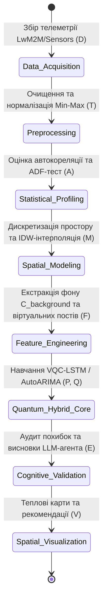
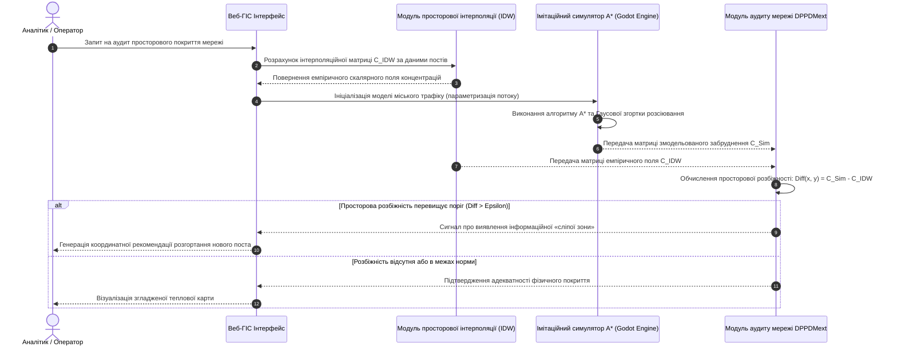

# Тема 7. Просторова інтерполяція екологічних полів, визначення фонових концентрацій та подолання інформаційних «сліпих зон» у муніципальних системах моніторингу

## Мета лекції
Метою лекції є формування у здобувачів вищої освіти другого (магістерського) рівня системних теоретичних знань та практично-орієнтованих компетентностей щодо математичного моделювання неперервних геоекологічних полів в урбанізованих агломераціях на основі просторово розріджених даних апаратно-інструментальних мереж спостереження. Лекція орієнтована на поглиблене освоєння детермінованих та геостатистичних підходів інтерполяції, алгоритмічних процедур верифікації локальних джерел викидів через зіставлення з регіональним екологічним фоном, а також опанування методології виявлення інформаційних «сліпих зон» моніторингової інфраструктури шляхом конвергенції просторового аналізу з імітаційним мікросимуляційним моделюванням транспортних потоків відповідно до оновлених нормативних регламентів Директиви ЄС 2024/2881.

## Очікувані результати навчання
1. **Знання та розуміння.** Здобувачі повинні засвоїти математичні засади детермінованого методу зворотних зважених відстаней, геостатистичного методу Крігінга, першого закону просторового аналізу Тоблера, а також концептуальну структуру агрегування просторових ознак у розширеній моделі підготовки даних DPPDMext.
2. **Застосування.** Здобувачі зможуть розраховувати поля просторової концентрації забруднювачів на регулярній координатній сітці у проєкції EPSG:3857, виконувати процедуру фільтрації фонових точок за пороговим зрізом та алгоритмічно обчислювати градієнт локального техногенного навантаження для досліджуваних міських зон.
3. **Аналіз.** Здобувачі набудуть здатності аналізувати розбіжності між емпіричними інтерполяційними картами та результатами агентного моделювання транспортних викидів на базі алгоритму пошуку маршрутів і Гаусового розсіювання з метою верифікації прихованих екологічних ризиків.
4. **Оцінювання та синтез.** Здобувачі зможуть критично оцінювати обмеження класичних геостатистичних методів в умовах малого числа фізичних станцій спостереження та формувати науково обґрунтовані рекомендації щодо реконфігурації й оптимального розширення муніципальної сенсорної мережі.

---

## Детальний покроковий план лекції

### 1. Теоретико-концептуальний базис. Просторова безперервність екологічних полів та математичний апарат інтерполяції
* 1.1. Просторова дискретність і проблема розрідженості стаціонарних постів моніторингу в урбосистемах крізь призму закону географічної взаємозумовленості простору В. Тоблера.
* 1.2. Математичний апарат і фізичний зміст методу зворотних зважених відстаней (IDW) із теоретичним обґрунтуванням вибору квадратичного показника згладжування $p = 2$.
* 1.3. Принципи геостатистичної інтерполяції методом Крігінга на базі семіваріограмного аналізу просторової дисперсії для побудови найкращої лінійної незміщеної оцінки (BLUE).
* 1.4. Концептуалізація геопросторового модуля у структурі розширеної парадигми підготовки даних DPPDMext як інструменту інженерії ознак для гібридних предиктивних моделей.

### 2. Методологія та аналіз граничних умов. Алгоритми виділення екологічного фону, локалізація емісій та діагностика сліпих зон
* 2.1. Алгоритм просторової дискретизації території регулярною сіткою та математична процедура виділення референтної фонової точки за пороговим параметром зрізу $\alpha \in [0, 0.1]$.
* 2.2. Метод оцінки локального техногенного впливу шляхом розрахунку показника перевищення концентрацій над фоном та умови висунення гіпотез про локалізовані джерела викидів.
* 2.3. Алгоритмічні обмеження, критичні бар'єри та геометричні артефакти застосування методів IDW і Крігінга в умовах надмалих вибірок фізичних постів спостереження.
* 2.4. Методологія діагностики інформаційних «сліпих зон» моніторингової мережі на основі конвергенції IDW-інтерполяції та агентного симулятора трафіку з алгоритмом $A^*$ і Гаусовим ядром розсіювання.
* 2.5. Архітектурні засади інтеграції обчислених матриць концентрацій в інтерактивні веб-ГІС інтерфейси з використанням технології згладженого перекриття колірних зон.

### 3. Практичний індустріальний / фаховий кейс. Просторово-імітаційний аудит та оптимізація мережі спостережень міської агломерації
**Тема наскрізної задачі.** «Просторово-імітаційний аудит техногенного навантаження та виявлення інформаційних сліпих зон мережі моніторингу Кременчуцької агломерації у створі Крюківського мостового переходу та Північного промислового вузла»


## 1. Теоретико-концептуальний базис. Просторова безперервність екологічних полів та математичний апарат інтерполяції

### 1.1. Просторова дискретність і проблема розрідженості стаціонарних постів моніторингу в урбосистемах крізь призму закону географічної взаємозумовленості простору В. Тоблера

Сучасні муніципальні системи екологічного моніторингу функціонують в умовах гострої суперечності між високою просторово-часовою динамікою техногенного навантаження та фізичною дискретністю вимірювальної інфраструктури. Натурні інструментальні спостереження за станом атмосферного повітря спираються на мережі стаціонарних автоматизованих станцій і лабораторій, оснащених високоточними прецизійними газоаналізаторами та оптичними лічильниками пилу. Проте висока капітальна вартість сертифікованого вимірювального обладнання, значні експлуатаційні витрати на метрологічну повірку, калібрування і регламентне обслуговування, а також щорічна абонплата за пропрієтарні хмарні сервіси телеметрії зумовлюють жорсткі економічні обмеження на розмір інфраструктури. У реальних умовах промислових міст мережа спостережень налічує лише від трьох до шести фізичних постів, які виявляються просторово розрідженими на площі в десятки і сотні квадратних кілометрів.

Така просторова розрідженість породжує фундаментальну проблему інформаційної неповноти: точкові вимірювання фіксують концентрації полютантів виключно в дискретних координатах розташування сенсорів і не дають змоги безпосередньо оцінити стан міжпостового міського простору. Пряма екстраполяція точкових показників на прилеглі райони призводить до грубих похибок, оскільки атмосферна дифузія домішок формує складні градієнтні поля під впливом урбаністичної забудови, автотранспортних потоків та мікрокліматичних факторів. Для подолання розриву між дискретними спостереженнями та потребами просторового управління в геоінформаційних системах здійснюється реконструкція неперервних геоекологічних поверхонь за допомогою алгоритмів просторової інтерполяції.

Теоретичним фундаментом переходу від дискретних точок до неперервного поля концентрацій виступає **перший закон географії**, сформульований Вальдо Тоблером, згідно з яким усі просторові об'єкти взаємопов'язані між собою, проте ступінь цього зв'язку є суттєво вищим для близько розташованих об'єктів, ніж для просторово віддалених. У математичному вимірі цей принцип описується концепцією **просторової автокореляції**, яка декларує наявність статистичної залежності між значеннями змінної у певній точці простору та її значеннями в сусідніх локаціях. Якщо множина первинних вимірів подана як дискретний набір просторових координат і відповідних концентрацій, то просторова інтерполяція дозволяє визначити неперервну скалярну функцію, що перетворює вектор географічного положення на розрахункову величину забруднення.

> **ПРАКТИЧНИЙ ЯКІР:** У промисловій агломерації міста Кременчук, де функціонують нафтопереробний завод «Укртатнафта» та гірничо-збагачувальний комбінат компанії Ferrexpo, державний і муніципальний моніторинг забезпечується мережею лише з п'яти стаціонарних постів спостереження, що контролюють територію площею понад 100 квадратних кілометрів і вимагає обов'язкової просторової інтерполяції для виконання регламентів Директиви ЄС 2024/2881.

Формалізація просторового поля екологічних вимірювань вимагає коректного вибору координатної системи. З огляду на те, що географічні координати WGS84 у кутових градусах викривляють метричні відстані при лінійних розрахунках усереднених градієнтів, у геоінформаційному ядрі здійснюється проєктування точок у метричну проєкційну систему, стандартно в **EPSG:3857** (WGS 84 / Pseudo-Mercator). Початковий стан вимірювальної мережі описується множиною точок:

$$S = \big\{ (x_i, y_i, C_i) \;\big|\; i \in \{1, \dots, N\} \big\}$$

де символ $S$ позначає повну множину фізичних станцій інструментального моніторингу; пара $(x_i, y_i)$ позначає метричні планарні координати розташування $i$-го поста спостереження у проєкції EPSG:3857; величина $C_i$ відповідає емпірично виміряній концентрації досліджуваної хімічної сполуки на $i$-му пості; показник $N$ визначає загальну кількість доступних у мережі постів моніторингу. Завдання полягає в побудові оператора інтерполяції, здатного визначити невідому концентрацію $C(x_0, y_0)$ у довільній точці простору $(x_0, y_0) \notin S$.

```mermaid
flowchart TD
    A['Просторово розріджена мережа постів спостереження'] --> B['Геометричне перетворення координат (WGS84 -> EPSG:3857)']
    B --> C['Аналіз просторової структури даних']
    C --> D{'Вибір алгоритмічного сімейства інтерполяції'}
    D --> E['Детерміновані методи (IDW, Сплайни)']
    D --> F['Геостатистичні методи (Ordinary Kriging)']
    E --> G['Оцінка швидкодії та стійкості до малих вибірок']
    F --> H['Оцінка дисперсії та моделювання семіваріограми']
    G --> I['Формування неперервного поля концентрацій']
    H --> I
```

### 1.2. Математичний апарат і фізичний зміст методу зворотних зважених відстаней (IDW) із теоретичним обґрунтуванням вибору квадратичного показника згладжування $p = 2$

Найбільш надійним, алгоритмічно стійким та обчислювально ефективним детермінованим підходом для моделювання розподілу домішок в умовах обмеженої кількості постів є **метод зворотних зважених відстаней** (Inverse Distance Weighting — IDW). Фізична сутність методу безпосередньо випливає з теорії конвективно-дифузійного розсіювання викидів від локальних джерел: концентрація домішки в повітряному басейні спадає пропорційно віддаленню від епіцентру емісії. Відповідно, при оцінці концентрації у довільній невідомій точці території найбільший інформаційний внесок мають робити найближчі вимірювальні пости, тоді як вплив віддалених станцій повинен монотонно згасати.

Математично оцінка концентрації у довільній розрахунковій точці $(x_0, y_0)$ визначається як нормоване зважене середнє значення концентрацій усіх доступних станцій спостереження:

$$C(x_0, y_0) = \frac{\sum_{i=1}^{N} w_i(x_0, y_0) \cdot C_i}{\sum_{i=1}^{N} w_i(x_0, y_0)} = \frac{\sum_{i=1}^{N} \frac{C_i}{d_i^p}}{\sum_{i=1}^{N} \frac{1}{d_i^p}}$$

де функціонал $C(x_0, y_0)$ відображає розрахункове інтерпольоване значення концентрації забруднюючої речовини в заданій точці площини; значення $C_i$ відповідає фактично зареєстрованій концентрації полютанта на $i$-й фізичній станції; величина $w_i(x_0, y_0)$ задає ваговий коефіцієнт впливу $i$-ї станції на шукану точку; параметр $p$ є дійсним додатним числом, що виступає показником степеня вагової функції та регулює швидкість просторового згасання впливу; величина $d_i$ позначає евклідову відстань між розрахунковою точкою та $i$-м постом спостереження, яка розраховується за геометричною формулою:

$$d_i = \sqrt{(x_0 - x_i)^2 + (y_0 - y_i)^2}$$

де параметри $(x_0, y_0)$ та $(x_i, y_i)$ позначають декартові координати розрахункової точки та $i$-ї станції спостереження відповідно.

> **ТИПОВА ПОМИЛКА:** Використання поліноміальних сплайнів або глобальних регресійних поверхонь високого порядку для моделювання екологічних полів в умовах малого числа постів є критичною помилкою. Ці алгоритми страждають від крайових ефектів коливання функцій і здатні генерувати нефізичні від'ємні значення концентрацій токсичних речовин або штучні колосальні викиди у зонах із повною відсутністю промислових джерел.

Вибір показника степеня вагової функції $p$ має вирішальне значення для характеру результуючої поверхні. Якщо параметр $p \to 0$, вагові коефіцієнти прямують до одиниці незалежно від відстані, і розрахункове значення вироджується у звичайне середнє арифметичне усіх вимірів, повністю нівелюючи просторову диференціацію. Навпаки, при $p \to \infty$ у формулі починає домінувати виключно один член із найменшою відстанню, внаслідок чого неперервна інтерполяція трансформується у дискретну мозаїку полігонів Вороного (діаграму найближчого сусіда) із різкими східчастими розривами на границях зон впливу.

У муніципальних інформаційних системах екологічного моніторингу стандартним та теоретично обґрунтованим є застосування квадратичного параметра $p = 2$ (закон обернених квадратів відстаней). Такий вибір зумовлений трьома властивостями:
1. Квадратичне спадання відповідає фундаментальним фізичним закономірностям розширення шлейфу пасивного забруднювача в однорідному середовищі, де площа сферичного або півсферичного розсіювання емісії зростає пропорційно квадрату віддалення від джерела.
2. При $p = 2$ забезпечується плавна гладкість інтерполяційної поверхні, для якої градієнт концентрації $\nabla C(x, y)$ залишається неперервним скрізь, за винятком самих точок розташування постів.
3. Метод гарантує суворе виконання нодальної властивості: при наближенні точки інтерполяції до фізичного поста ($d_i \to 0$) ваговий коефіцієнт $w_i \to \infty$, що забезпечує точний збіг розрахункової величини $C(x_0, y_0)$ із виміряним значенням $C_i$.

Крім того, IDW має принципову перевагу над іншими апроксиматорами, яка полягає у **властивості опуклої оболонки**: інтерпольовані значення завжди перебувають у строго обмеженому фізичному діапазоні $\min(C_i) \le C(x_0, y_0) \le \max(C_i)$. Це унеможливлює появу нефізичних від'ємних концентрацій, що є критичною вимогою для алгоритмів екологічного аудиту.

### 1.3. Принципи геостатистичної інтерполяції методом Крігінга на базі семіваріограмного аналізу просторової дисперсії для побудови найкращої лінійної незміщеної оцінки (BLUE)

Альтернативою детермінованому підходу IDW виступає геостатистичний апарат, розроблений Даніелем Кріге та теоретично формалізований Жоржем Матероном у межах теорії **регіоналізованих змінних**. Геостатистика розглядає поле просторового розподілу концентрацій як реалізацію стохастичного процесу $Z(x)$, який математично декомпонується на детерміновану складову тренду $\mu(x)$ та просторово корельовану випадкову компоненту $\varepsilon(x)$:

$$Z(x) = \mu(x) + \varepsilon(x)$$

де функція $Z(x)$ представляє значення екологічного показника в точці $x$; вираз $\mu(x)$ моделює детерміноване математичне сподівання процесу; стохастична компонента $\varepsilon(x)$ описує локальні флуктуації, для яких математичне сподівання дорівнює нулю $\mathbb{E}[\varepsilon(x)] = 0$.

Базовим аналітичним інструментом геостатистики є **експериментальна семіваріограма** $\gamma(h)$, яка вимірює ступінь просторової дисперсії та розбіжності між вимірами залежно від вектора відстані $h$ між ними:

$$\gamma(h) = \frac{1}{2 N(h)} \sum_{i=1}^{N(h)} \big( Z(x_i) - Z(x_i + h) \big)^2$$

де величина $\gamma(h)$ позначає розрахункове значення напівдисперсії (семіваріограми) для просторового лагу $h$; параметр $N(h)$ визначає загальну кількість пар станцій спостереження, евклідова відстань між якими потрапляє в інтервал згуртування лагу $h$; значення $Z(x_i)$ та $Z(x_i + h)$ відображають величини концентрацій полютанта у точках, віддалених одна від одної на відстань $h$.

Теоретична семіваріограма апроксимується аналітичними функціями (сферичною, експоненційною чи гаусовою) і характеризується трьома параметрами: ефектом самородка (**nugget effect** $C_0$), що відбиває шум вимірювань на нульовій відстані; порогом (**sill** $C_0 + C$), що дорівнює загальній дисперсії поля; та рангом (**range** $a$), що визначає радіус кореляційного зв'язку, за межами якого точки стають просторово незалежними.

Метод звичайного Крігінга (**Ordinary Kriging**) визначає оцінку в точці $x_0$ як зважену лінійну комбінацію наявних спостережень $\hat{Z}(x_0) = \sum_{i=1}^N \lambda_i Z(x_i)$. Вагові коефіцієнти $\lambda_i$ відшукуються з умови мінімізації дисперсії помилки інтерполяції за умови незміщеності оцінки ($\sum_{i=1}^N \lambda_i = 1$) за допомогою методу невизначених множників Лагранжа:

$$\begin{cases}
\sum_{j=1}^{N} \lambda_j \gamma(x_i, x_j) + \mu_L = \gamma(x_i, x_0), \quad \forall i \in \{1, \dots, N\} \\
\sum_{i=1}^{N} \lambda_i = 1
\end{cases}$$

де множник $\mu_L$ є параметром Лагранжа, що гарантує нормування суми ваг; вирази $\gamma(x_i, x_j)$ позначають значення семіваріації між парою фізичних постів; функція $\gamma(x_i, x_0)$ виражає просторову коваріацію між $i$-м постом та шуканою точкою оцінки. Крігінг забезпечує найкращу лінійну незміщену оцінку (**Best Linear Unbiased Estimator — BLUE**) і надає розрахункову дисперсію похибки інтерполяції $\sigma_K^2(x_0) = \sum_{i=1}^N \lambda_i \gamma(x_i, x_0) + \mu_L$.

| Назва підходу / моделі | Математичний апарат | Мінімально необхідний обсяг вибірки | Обчислювальна складність алгоритму | Чутливість до геометричної структури мережі | Приклад з реальної практики |
| :--- | :--- | :--- | :--- | :--- | :--- |
| **Зворотні зважені відстані (IDW, $p=2$)** | Зважування за оберненим квадратом евклідової відстані з гарантією опуклої оболонки | $N \ge 3$ станції | Низька, $O(N \cdot M_{\text{grid}})$ | Схильність до артефакту «бичачого ока» навколо ізольованих екстремумів | Оперативна муніципальна веб-карта якості повітря у м. Кременчук (Vaisala) |
| **Звичайний Крігінг (Ordinary Kriging)** | Мінімізація дисперсії похибки BLUE через СЛАР із семіваріограмою та множником Лагранжа | $N \ge 30\dots50$ станцій | Висока, $O(N^3 + M_{\text{grid}} \cdot N)$ | Сильна деградація при малій щільності через нестійкість розрахунку рангу | Регіональний аналіз фонового транскордонного переносу забруднень у масштабах ЄС |
| **Регуляризований тонкостінний сплайн (Spline)** | Мінімізація інтеграла квадратичної кривини розрахункової інтерполяційної поверхні | $N \ge 10$ станцій | Середня, $O(N^3)$ | Генерація нефізичних від'ємних значень на границях зон через осциляції | Побудова цифрових моделей рельєфу та розподілу барометричного тиску |
| **Фільтрація фону за $\alpha$-зрізом** | Порогова відсічка найменших значень діапазону концентрацій на об'єднаній сітці | $N \ge 3$ станції | Лінійна, $O(M_{\text{grid}})$ | Стійка за умови правильного вибору параметра $\alpha \in [0, 0.1]$ | Визначення референтної точки у Крюківському районі для оцінки впливу транспорту |

Головний бар'єр використання Крігінга в муніципальному середовищі полягає у вимогах до обсягу даних. Для побудови стабільної емпіричної семіваріограми потрібно щонайменше 30–50 просторово розподілених вимірювальних постів. На вибірці з 3–5 муніципальних станцій кількість пар точок $N(h)$ для кожного лагу є критично недостатньою, що призводить до випадкових флуктуацій графіка семіваріограми та сингулярності коваріаційних матриць. За таких умов Крігінг повністю втрачає математичні переваги над детермінованим алгоритмом IDW.

> **КОНТРОЛЬНЕ ПИТАННЯ:** Чому за наявності лише чотирьох фізичних вимірювальних станцій у місті застосування методу Ordinary Kriging може спричинити вищу дисперсію похибки порівняно з простим методом IDW ($p=2$)?

<details markdown="1">
<summary>Розгорнути аналіз / відповідь</summary>

**Правильний варіант: Неспроможність коректної статистичної апроксимації емпіричної семіваріограми на малій вибірці пар точок.**

1. Для надійного оцінювання параметрів семіваріограми (sill, range, nugget) потрібно щонайменше 30–50 точок спостереження, які забезпечують сотні пар відстаней для кожного інтервалу групування лагів. За наявності 4 станцій загальна кількість пар становить лише $\frac{4 \times (4 - 1)}{2} = 6$. Математично неможливо достовірно підігнати параметри теоретичної моделі до 6 точок, що веде до колосальних помилок у визначенні коваріаційних ваг і втрати незміщеності оцінки Крігінга.

2. Аналіз дистракторів:
   * Гіпотеза про те, що Крігінг має вищу обчислювальну складність і через це програє в точності, є хибною, оскільки обчислювальна складність $O(N^3)$ впливає виключно на час виконання алгоритму на процесорі, а не на математичну точність поверхні.
   * Твердження, що IDW використовує складніші нелінійні ядра розсіювання, не відповідає дійсності, адже IDW є чисто детермінованим геометричним зважуванням без урахування випадкових функцій.
   * Припущення про відсутність у Крігінга нодальної властивості є помилковим, оскільки за відсутності ефекту самородка ($C_0 = 0$) Крігінг виступає точним інтерполятором так само, як і IDW.

</details>

### 1.4. Концептуалізація геопросторового модуля у структурі розширеної парадигми підготовки даних DPPDMext як інструменту інженерії ознак для гібридних предиктивних моделей

У класичних геоінформаційних системах просторова інтерполяція завершується формуванням ізоліній або растрових картограм для візуального сприйняття оператором. Проте в межах новітньої парадигми предиктивної аналітики геопросторовий блок трансформується з інструменту пасивного відображення на критичний компонент генерації нових знань та інженерії ознак.

Базова теоретична модель підготовки та обробки екологічної інформації для прийняття рішень формалізується кортежем п'яти базових множин:

$$\text{DPPDM} = \langle D, T, P, F, V \rangle$$

де елемент $D$ позначає первинні вектори багатовимірних часових рядів із сенсорних станцій; символ $T$ відповідає множині операцій очищення, вирівнювання та нормалізації даних; компонента $P$ позначає моделі прогнозування; елемент $F$ задає блок інженерії ознак і розрахунку похідних показників; множина $V$ визначає шар візуалізації та формування аналітичної звітності.

Для забезпечення замкненого циклу інтелектуального аналізу концепція розширюється до парадигми **DPPDMext** (Data Preparation and Predictive Data Modeling extended), що містить розширене аналітичне ядро $P_{\text{ext}}$:

$$P_{\text{ext}} = \langle A, P, Q, M, E \rangle$$

де функціональний блок $A$ здійснює попередній аналіз стохастичних властивостей рядів (виявлення тренду, сезонності та стаціонарності за тестом ADF); блок $P$ об'єднує набір предиктивних моделей; елемент $Q$ забезпечує автоматизовану селекцію моделі на основі критеріїв похибок (MSE, MAE, AIC); підсистема $M$ реалізує геопросторове та імітаційне моделювання; блок $E$ здійснює когнітивну оцінку надійності результатів за участю мультимодальних агентів на базі великих мовних моделей.

Повна структура розширеної моделі описується кортежем:

$$\text{DPPDMext} = \big\langle D, T, F, (A, P, Q, M, E), F, V \big\rangle$$



Ключова методологічна інновація DPPDMext полягає у безпосередньому зворотному зв'язку між блоком просторового моделювання $M$ та блоком інженерії ознак $F$. Розрахункові значення, отримані в результаті просторової інтерполяції, транслюються як синтетичні коваріати безпосередньо у предиктивні моделі часових рядів. Зокрема, виділена з інтерполяційного поля фонова концентрація $C_{\text{background}}(t)$, а також змодельовані рівні забруднення для не охоплених сенсорами вузлів (віртуальних станцій) виступають екзогенними вхідними параметрами для класичних та квантово-гібридних нейромереж.

Завдяки такій інтеграції предиктивна модель здійснює перехід від одновимірного часового прогнозу до багатофакторного просторово-часового передбачення:

$$\hat{y}_{t+h} = f\Big( \mathbf{y}_{[t-k:t]}, \; C_{\text{background}}(t), \; \mathbf{X}_{\text{spatial}}(t), \; \boldsymbol{\theta} \Big)$$

де величина $\hat{y}_{t+h}$ позначає вектор прогнозованої концентрації полютанта на горизонт $h$; матриця $\mathbf{y}_{[t-k:t]}$ описує ретроспективні лагові значення цільового ряду глибиною $k$; функція $C_{\text{background}}(t)$ задає динаміку регіонального фону, вилучену з блоку $M$; матриця $\mathbf{X}_{\text{spatial}}(t)$ відображає просторові змінні, екстраговані з віртуальних станцій; параметр $\boldsymbol{\theta}$ відповідає оптимізованим вагам гібридної нейромережі або квантової варіаційної схеми VQC.

> **ПРАКТИЧНИЙ ЯКІР:** Інтеграція просторового фону $C_{\text{background}}$, вилученого з IDW-інтерполяції, як екзогенної змінної у квантово-гібридні моделі Quantum-LSTM дозволила знизити середньоквадратичну похибку прогнозування стабільних параметрів мікроклімату в Кременчуці: для відносної вологості виграш точності склав 45.96 %, а для барометричного тиску — 74.74 % порівняно з класичними моделями без просторового контексту.

### Вказівки для самостійного осмислення

1. Дослідіть математичну поведінку вагового коефіцієнта $w_i$ в алгоритмі IDW при варіації параметра згладжування $p$ у діапазоні від $0.5$ до $5.0$ та оцініть, яким чином зміна цього параметра впливає на геометрію ізоліній навколо локального джерела викидів.
2. Проаналізуйте причини виникнення сингулярності коваріаційної матриці у системі рівнянь Ordinary Kriging при спробі побудови просторового прогнозу на основі надмалої вибірки спостережень ($N < 5$).
3. Сформулюйте алгоритмічні кроки передачі геопросторових ознак від блоку просторового моделювання $M$ до предиктивного модуля $P$ у парадигмі DPPDMext для перетворення одновимірного рекурентного прогнозу на просторово-часовий ансамбль.

## 2. Методологія та аналіз граничних умов. Алгоритми виділення екологічного фону, локалізація емісій та діагностика сліпих зон

### 2.1. Алгоритм просторової дискретизації території регулярною сіткою та математична процедура виділення референтної фонової точки за пороговим параметром зрізу $\alpha \in [0, 0.1]$

Перехід від неперервного простору спостережень до дискретної цифрової моделі в геоінформаційних системах муніципального моніторингу вимагає попередньої геометричної формалізації досліджуваної території. Просторовий простір урбанізованої агломерації обмежується прямокутним географічним екстентом, який задається граничними координатами в метричній проєкційній системі координат EPSG:3857, що виключає кутові спотворення лінійних відстаней. Для побудови розрахункової матриці концентрацій безперервна площина покривається ортогональною регулярною сіткою вузлів $G$, щільність якої визначається розмірами кроку дискретизації $\Delta x$ та $\Delta y$. Вибір кроку базується на компромісі між обчислювальною ресурсомісткістю розрахунку та просторовою роздільною здатністю, необхідною для виявлення локальних градієнтів концентрацій забруднювачів на примагістральних територіях.

Математична формалізація повного циклу розрахунку неперервного поля та виділення фонового кластера здійснюється за такою формалізованою послідовністю дій:

$$
\begin{aligned}
\text{Крок 1 (Геометрична дискретизація):} & \quad G = \left\{ (x_k, y_m) = (X_{\min} + k \Delta x, \; Y_{\min} + m \Delta y) \;\middle|\; k \in [0, N_x], \; m \in [0, N_y] \right\} \\
\text{Крок 2 (Матричний розрахунок IDW):} & \quad C(x_k, y_m) = \frac{\sum_{i=1}^N \frac{C_i}{(x_k - x_i)^2 + (y_m - y_i)^2}}{\sum_{i=1}^N \frac{1}{(x_k - x_i)^2 + (y_m - y_i)^2}} \\
\text{Крок 3 (Екстремальне профілювання):} & \quad z_{\min} = \min_{(x,y) \in S \cup G} C(x,y), \quad z_{\max} = \max_{(x,y) \in S \cup G} C(x,y) \\
\text{Крок 4 (Порогова фільтрація фону):} & \quad G_{\text{bg}} = \left\{ (x, y) \in G \;\middle|\; C(x, y) \le z_{\min} + \alpha \cdot (z_{\max} - z_{\min}) \right\} \\
\text{Крок 5 (Локалізація референтної точки):} & \quad (x_f, y_f) = \arg\min_{(x,y) \in G_{\text{bg}}} C(x, y)
\end{aligned}
$$

де величини $X_{\min}, X_{\max}, Y_{\min}, Y_{\max}$ задають мінімальні та максимальні межі досліджуваної прямокутної території в метрах; індекси $k$ та $m$ визначають порядкові номери дискретних кроків сітки вздовж осей абсцис та ординат; змінні $N_x = \lfloor (X_{\max} - X_{\min}) / \Delta x \rfloor$ та $N_y = \lfloor (Y_{\max} - Y_{\min}) / \Delta y \rfloor$ задають загальну кількість розрахункових вузлів сітки за відповідними координатними напрямками; функціонал $C(x_k, y_m)$ відображає розрахункове значення концентрації полютанта в регулярному вузлі $(x_k, y_m)$; константи $z_{\min}$ та $z_{\max}$ позначають абсолютні граничні екстремуми концентрації на об'єднаній множині емпіричних постів $S$ та інтерпольованих вузлів сітки $G$; множина $G_{\text{bg}}$ формує масив відфільтрованих просторових точок, які відповідають фоновому екологічному стану урбосистеми; параметр $\alpha \in [0, 0.1]$ є коефіцієнтом відсічення, що обмежує вибірку фону часткою до десяти відсотків від загального динамічного діапазону забруднення території; пара $(x_f, y_f)$ фіксує просторові координати референтної фонової точки з абсолютним мінімумом концентрації.

> **ВАЖЛИВО:** Вибір коефіцієнта зрізу в діапазоні $\alpha \in [0, 0.1]$ є жорстким методологічним обмеженням: перевищення значення $\alpha > 0.1$ призводить до захоплення зоною умовного фону сегментів із помірним антропогенним навантаженням, що спричиняє систематичне штучне завищення розрахункового фонового базису та нівелює здатність інформаційної системи виявляти малоінтенсивні промислові емісії.

Виділена референтна фонова точка $(x_f, y_f)$ слугує фундаментальним базисом для просторової нормалізації екологічного моніторингу. Оскільки метеорологічні умови викликають щоденні коливання абсолютних рівнів забруднення над усім містом, використання абсолютної шкали без прив'язки до фону призводить до хибних висновків щодо динаміки викидів окремих об'єктів. Формування ізольованого фонового кластера $G_{\text{bg}}$ дозволяє програмному забезпеченню здійснювати автоматичне калібрування моделей та виділяти чистий внесок локальних джерел.

### 2.2. Метод оцінки локального техногенного впливу шляхом розрахунку показника перевищення концентрацій над фоном та умови висунення гіпотез про локалізовані джерела викидів

Кількісна оцінка впливу конкретного інфраструктурного чи виробничого об'єкта вимагає розрахунку перевищення фактичної або змодельованої концентрації забруднювача над фоновим базисом. Для будь-якої заданої географічної локації дослідження $(x_t, y_t)$, яка може відповідати магістральному мостовому переходу, перехрестю з високою щільністю заторів або промисловому майданчику, геоінформаційна підсистема здійснює пошук просторово найближчого вузла регулярної сітки $(x_n, y_n) \in G$, що мінімізує евклідову відстань до цільового об'єкта. Значення інтерпольованої концентрації $C(x_n, y_n)$ у цьому вузлі приймається за репрезентативну оцінку забруднення в цільовій зоні.

Критерій виявлення локального техногенного навантаження базується на показнику локального перевищення $\Delta C$, розрахунок якого формалізується аналітичним виразом:

$$\Delta C = C(x_n, y_n) - C(x_f, y_f)$$

де параметр $\Delta C$ виражає абсолютний градієнт концентрації між цільовою та фоновою точками, виражений у міліграмах на метр кубічний або у кратностях гранично допустимої концентрації.

Умови інтерпретації показника $\Delta C$ та автоматизованого висунення науково-технічних гіпотез щодо функціонування джерел емісій описуються двома взаємовиключними станами системи:
1. За умови виконання нерівності $\Delta C > \delta_{\text{signif}}$, де порогове значення $\delta_{\text{signif}} = k_{\text{conf}} \cdot \sigma_{\text{inst}}$ визначається з урахуванням дисперсії апаратної похибки сенсорів $\sigma_{\text{inst}}$, система фіксує статистично значуще локальне перевищення над регіональним фоном і генерує гіпотезу про наявність активного стаціонарного або пересувного техногенного джерела емісій у радіусі просторової кореляції цільової точки.
2. Якщо виконується умова $\Delta C \le \delta_{\text{signif}}$, рівень забруднення в межах цільового вузла вважається таким, що статистично збігається з регіональним фоном урбоекосистеми, що свідчить про відсутність домінуючого впливу локальних емісій та визначає стан повітряного басейну в цьому районі як фоновий.

З метою нівелювання випадкових короткострокових флуктуацій і стохастичного шуму при висуненні управлінських рішень показник $\Delta C$ агрегується за часовими інтервалами у формі ковзних середніх значень:

$$\overline{\Delta C}_T = \frac{1}{|T|} \sum_{t \in T} \Big( C(x_n, y_n, t) - C(x_f, y_f, t) \Big)$$

де множина $T$ позначає дискретне вікно спостережень тривалістю 20 хвилин, одну добу або один місяць, що забезпечує стабільну верифікацію техногенних аномалій відповідно до вимог постанови Кабінету Міністрів України № 827.

### 2.3. Алгоритмічні обмеження, критичні бар'єри та геометричні артефакти застосування методів IDW і Крігінга в умовах надмалих вибірок фізичних постів спостереження

Практична експлуатація просторових методів інтерполяції в реальних умовах обмеженої кількості постів виявляє низку жорстких граничних умов, за яких математичний апарат перестає адекватно відображати фізичні процеси розсіювання викидів в атмосфері. У муніципальних системах, де мережа складається лише з 3–5 станцій, виникає специфічний комплекс алгоритмічних і топологічних деформацій розрахункового поля.

Першим критичним бар'єром методу IDW є виникнення геометричного **артефакту «бичачого ока»** (Bull's Eye Effect). Дана аномалія полягає в тому, що довкола ізольованої фізичної станції, яка фіксує екстремально високу або низьку концентрацію полютанта, концентричні ізолінії штучно вироджуються у замкнені кругові кільця. Оскільки ваговий коефіцієнт $w_i = d_i^{-p}$ залежить суто від геометричної відстані, алгоритм інтерполює однакове згасання в усіх радіальних напрямках від сенсора, що суперечить реальному анізотропному характеру шлейфу розсіювання, зумовленому напрямком та швидкістю вітрового потоку.

Другим обмеженням детермінованого зважування IDW є явище **топологічної плато-деградації** у міжпостовому просторі на великих відстанях. Коли відстані $d_i$ від цільової точки до всіх наявних постів спостереження стають співмірними і значно перевищують мікромасштаб просторової кореляції емісій, інтерпольоване значення асимптотично наближається до зваженого середнього показників усієї мережі. У цій зоні просторовий градієнт концентрації практично зникає, внаслідок чого система стає неспроможною зафіксувати реальне погіршення екологічного стану між віддаленими станціями.

Метод Ordinary Kriging у подібних надмалих вибірках натрапляє на ще більш деструктивний математичний бар'єр — **сингулярність системи рівнянь та нестабільність семіваріограми**. Коли кількість просторових точок становить $N \le 5$, загальне число можливих пар віддалей між станціями $N_{\text{pairs}} = N(N - 1)/2$ не перевищує 10. За такої критичної недостатності вихідних точок побудова емпіричної напівдисперсії $\gamma(h)$ призводить до випадкової підгонки теоретичних кривих (сферичної чи експоненційної) під стохастичний шум вимірювань. Неправильне визначення рангу кореляції або порогу викликає погану обумовленість коваріаційної матриці, призводячи до від'ємних ваг $\lambda_i$, що генерує абсурдні результати з від'ємними значеннями дисперсії Крігінга.

Крім того, обидва підходи страждають від **повного ігнорування законів фізичного переносу речовин**. Детерміновані та геостатистичні просторові алгоритми не містять у своєму апараті параметрів метеорологічного поля (векторів турбулентного вітру, стратифікації атмосфери за Пасквіллом-Гіффордом) та топографічних перешкод урбаністичного ландшафту (ефект вуличних каньйонів, утворених щільною висотною забудовою). Внаслідок цього формується розрив між формальною гладкістю інтерполяційної матриці та фактичною динамікою переносу домішок.

### 2.4. Методологія діагностики інформаційних «сліпих зон» моніторингової мережі на основі конвергенції IDW-інтерполяції та агентного симулятора трафіку з алгоритмом $A^*$ і Гаусовим ядром розсіювання

Фундаментальна слабкість розріджених фізичних мереж моніторингу полягає у виникненні **інформаційних «сліпих зон»** (Blind Spots) — просторових секторів міста, які характеризуються високою концентрацією динамічних джерел викидів (наприклад, нерегульованих завантажених транспортних артерій), але не охоплюються зонами чутливості жодної стаціонарної станції. У межах сліпої зони інтерполяційні методи занижують концентрацію полютантів, інтерпретуючи цю ділянку як проміжний чистий фон. Подолання цієї суперечності досягається шляхом розробленої конвергентної методології, яка поєднує емпіричну просторову інтерполяцію IDW із результатами мікроскопічного агентного симулятора автотранспортного руху.

Агентна імітаційна модель динаміки забруднення розгортається на дискретному сітковому просторі дорожньої інфраструктури, де кожна клітинка $C$ класифікується параметром об'єкта дороги. Генерація та переміщення автономних агентів (автомобілів) моделюється із застосуванням **евристичного алгоритму пошуку шляху $A^*$**, який оптимізує цільову функцію вартості маршруту:

$$f(p) = g(p) + h(p)$$

де $g(p)$ є фактичною вартістю переміщення агента від початкової точки $p_{\text{source}}$ до поточної клітинки $p$; евристична функція $h(p)$ розраховується як манхеттенська відстань до випадково обраної вільної паркувальної локації $p_{\text{destination}} = (e_x, e_y)$:

$$h(p) = |p_x - e_x| + |p_y - e_y|$$

де пари $(p_x, p_y)$ та $(e_x, e_y)$ позначають декартові координати поточної та цільової клітинок сіткового графа дорожньої мережі.

Кожен агент під час руху генерує локальну емісію домішки (зокрема діоксиду азоту $\text{NO}_2$ або оксиду вуглецю $\text{CO}$). Просторова дифузія накопичених викидів у довкілля моделюється операцією двовимірної дискретної згортки поточного поля забруднення з Гаусовим ядром фільтрації:

$$K_{\text{Gauss}} = \begin{bmatrix} 0 & 1 & 0 \\ 1 & 2 & 1 \\ 0 & 1 & 0 \end{bmatrix}$$

Розрахунок розсіювання концентрацій у комірці $(i, j)$ на кожному такті симуляції описується рівнянням нормалізованої згортки:

$$\text{new\_pollution}_{i,j} = \frac{\sum_{k=-1}^{1} \sum_{l=-1}^{1} \text{pollution}_{i+k, j+l} \cdot (K_{\text{Gauss}})_{k+2, l+2}}{\sum_{k=-1}^{1} \sum_{l=-1}^{1} (K_{\text{Gauss}})_{k+2, l+2}}$$

де матричний елемент $\text{pollution}_{i+k, j+l}$ представляє акумульовану концентрацію емісії в сусідніх клітинках сітки; члени $(K_{\text{Gauss}})_{k+2, l+2}$ відповідають ваговим коефіцієнтам ядра, нормалізованим на суму вагових компонент, що забезпечує збереження балансу розсіяної маси речовини.



Методологія діагностики «сліпої зони» базується на матричному порівнянні просторового розподілу емпіричного поля $C_{\text{IDW}}(x, y)$ та результатів імітаційного моделювання $C_{\text{sim}}(x, y)$. Якщо в певному координатному секторі агломерації симулятор фіксує локальний екстремум високої інтенсивності ($C_{\text{sim}} \gg \text{ГДК}$), зумовлений високою інтенсивністю транспортного руху за алгоритмом $A^*$, тоді як розрахункова матриця IDW відображає низьку фонову концентрацію ($C_{\text{IDW}} \approx C_{\text{background}}$), система ідентифікує наявність просторової сліпої зони.

> **ПРАКТИЧНИЙ ЯКІР:** При моделюванні транспортних потоків Кременчука симулятор на базі алгоритму $A^*$ виявив критичну сліпу зону на Крюківському мосту з розбіжністю між симуляцією та даними найближчого віддаленого стаціонарного поста спостереження понад 40 % за діоксидом азоту, що стало інженерним обґрунтуванням для розгортання в цій зоні додаткової мобільної лабораторії.

### 2.5. Архітектурні засади інтеграції обчислених матриць концентрацій в інтерактивні веб-ГІС інтерфейси з використанням технології згладженого перекриття колірних зон

Фінальним етапом аналітичного процесу є трансляція розрахункових просторових матриць у клієнтський інтерфейс геоінформаційної системи для інтерактивного сприйняття кінцевим користувачем або екологічним аудитором. Картографічна візуалізація розгортається шляхом динамічного нашарування геопросторових растрових масок на шар базової топографічної карти OpenStreetMap за допомогою спеціалізованих клієнтських веб-бібліотек.

При візуалізації ізоліній на базі дискретних матриць виникає критичний технічний артефакт: на межах контакту полігонів із контрастними значеннями концентрацій утворюються порожні піксельні розриви або некоректні східчасті смуги, зумовлені обмеженнями стандартних алгоритмів растеризації бібліотеки `matplotlib` та веб-рушіїв відтворення графіки. Для забезпечення безперервного колірного контуру в системі застосовується **метод адаптивного 10 % перекриття зон**. Математично це реалізується шляхом симетричного розширення граничних порогів кожного колірного діапазону на $\pm 10$ % від його інтервальної ширини:

$$\Omega_k^{\text{visual}} = \big[ L_k - 0.1 \cdot (U_k - L_k), \quad U_k + 0.1 \cdot (U_k - L_k) \big]$$

де $L_k$ та $U_k$ позначають нижню та верхню межі нормативного діапазону $k$-го екологічного рівня забруднення; інтервал $\Omega_k^{\text{visual}}$ задає скоригований діапазон растеризації колірного шару, що гарантує плавне взаємне перекриття суміжних колірних ізоповерхонь без виникнення топологічних дефектів рендерингу.

Колористична схема уніфікується відповідно до національних та міжнародних санітарних регламентів: діапазон $0 \dots 0.5$ ГДК маркується градаціями зеленого кольору (безпечний стан); діапазон $0.5 \dots 1.0$ ГДК відповідає градаціям помаранчевого (припустимий стан); значення понад $1.0$ ГДК транслюються градієнтами від насиченого червоного до темно-бордового (небезпечний рівень забруднення).

| Методологічний підхід | Обчислювальні ресурси та вхідні дані | Складність впровадження | Точність у міжпостовому просторі | Критичні ризики / Обмеження |
| :--- | :--- | :--- | :--- | :--- |
| **Зворотні зважені відстані (IDW, $p=2$)** | Потребує лише планарних координат $N$ станцій; $O(N \cdot M_{\text{grid}})$ операцій | Низька; реалізується засобами базових бібліотек NumPy або Startinpy | Низька на великих відстанях; деградує до середнього значення мережі | Артефакт «бичачого ока»; повна сліпота до локальних джерел у міжпостовому просторі |
| **Звичайний Крігінг (Ordinary Kriging)** | Вимагає статистично надійної семіваріограми; $O(N^3 + M_{\text{grid}} \cdot N)$ | Висока; вимагає апроксимації структурних функцій та розв'язання СЛАР | Висока за наявності густої мережі спостережень ($N \ge 30$) | Сингулярність матриць і деградація оцінки BLUE при $N < 10$; висока чутливість до шуму |
| **Мікроімітаційне моделювання ($A^*$)** | Деталізований граф доріг, матриця кореспонденцій, параметри світлофорів | Дуже висока; вимагає створення віртуального цифрового двійника міста | Висока виключно вздовж модельованих транспортних магістралей | Не враховує промислові викиди високих труб; висока складність параметризації агентів |
| **Конвергентна модель DPPDMext (IDW + $A^*$)** | Телеметрія сенсорів, дані транспортних потоків та цифрова модель доріг | Висока; комбінує веб-інтерполятор, фізичний симулятор та аналітичне ядро | Найвища; верифікує як фонові поля, так і локальні транспортні піки | Потребує калібрування інтенсивності емісій автомобілів під сезонні умови |

> **КОНТРОЛЬНЕ ПИТАННЯ:** Під час моніторингу зафіксовано, що фізичний пост № 1 фіксує концентрацію пилу $1.6$ ГДК, а віддалений пост № 2 фіксує $0.4$ ГДК. Розрахункова точка розташована на однаковій відстані від обох постів. Водночас імітаційний симулятор фіксує наявність між постами локального затору транспорту з розрахунковим викидом $1.2$ ГДК. Яку оцінку згенерує стандартний IDW, яку оцінку дасть конвергентна модель DPPDMext, і який висновок має зробити інформаційна система щодо структури мережі?

<details markdown="1">
<summary>Розгорнути аналіз / відповідь</summary>

**Правильний варіант: IDW згенерує середнє значення 1.0 ГДК; DPPDMext виявить локальний пік близько 2.2 ГДК; система ідентифікує інформаційну «сліпу зону» і сформує рекомендацію щодо розгортання додаткового сенсора.**

1. Математичне обґрунтування:
   * Оскільки розрахункова точка є рівновіддаленою від обох постів ($d_1 = d_2$), ваги в алгоритмі IDW будуть однаковими: $w_1 = w_2$. Відповідно, розрахункове значення концентрації за детермінованою моделлю дорівнюватиме середньому арифметичному показнику:
     $$C_{\text{IDW}} = \frac{1.6 + 0.4}{2} = 1.0 \text{ ГДК}$$
   * Конвергентна модель DPPDMext використовує значення $C_{\text{IDW}}$ як фоновий базис простору, але накладає локальний внесок мікроімітаційного транспортного моделювання, що додає динамічний викид від затору:
     $$C_{\text{DPPDMext}} = C_{\text{IDW}} + C_{\text{sim\_traffic}} = 1.0 + 1.2 = 2.2 \text{ ГДК}$$
   * Порівняння матриць фіксує просторову розбіжність:
     $$\Delta = C_{\text{DPPDMext}} - C_{\text{IDW}} = 2.2 - 1.0 = 1.2 \text{ ГДК}$$
     Оскільки розбіжність є статистично значущою і перевищує допустимий поріг, система діагностує наявність критичної «сліпої зони», де реальна концентрація вдвічі перевищує санітарну норму, тоді як чистий IDW показує формально гранично допустимий стан.

2. Аналіз дистракторів:
   * Твердження, що IDW покаже $1.6$ ГДК через вплив максимуму, є хибним, оскільки IDW є опуклим зваженим середнім і при рівних відстанях не надає переваги більшому значенню.
   * Припущення, що симулятор $A^*$ має замінити вимірювання фізичних постів, є хибним, оскільки імітаційна модель не враховує трансграничний перенос і вимагає постійної калібрувальної прив'язки до реальних інструментальних спостережень.
   * Висновок про відсутність потреби у новому пості через те, що «модель і так усе розрахувала», є грубою управлінською помилкою: модель формує гіпотезу, яка за вимогами санітарного законодавства та Директиви ЄС 2024/2881 обов'язково має бути інструментально верифікована сертифікованим сенсором.

</details>

## 3. Практичний індустріальний / фаховий кейс. Просторово-імітаційний аудит та оптимізація мережі спостережень міської агломерації

### 3.1. Комплексний фаховий кейс. Просторово-імітаційний аудит техногенного навантаження та виявлення інформаційних сліпих зон мережі моніторингу Кременчуцької агломерації у створі Крюківського мостового переходу та Північного промислового вузла

#### Постановка задачі / ситуації
Муніципальна екологічна служба промислового центру Кременчук здійснює аудит системи моніторингу атмосферного повітря з метою узгодження її структури з регламентами оновленої Директиви ЄС 2024/2881 та постанови Кабінету Міністрів України № 827. Місто розділене річкою Дніпро на дві частини, зв'язок між якими здійснюється через єдину транспортну артерію — двосмуговий Крюківський міст. У місті розташовані потужні промислові вузли, зокрема нафтопереробний завод на півночі та кар'єри гірничо-збагачувальних підприємств на сході.

Діюча система спостережень складається з чотирьох стаціонарних постів інструментального контролю, розташованих у правобережній та лівобережній частинах міста. Через відсутність фізичного датчика безпосередньо у створі мостового переходу виникає підозра щодо наявності інформаційної «сліпої зони», де концентровані викиди від щоденного інтенсивного руху транзитного автотранспорту не фіксуються детермінованою інтерполяцією. Необхідно провести математичний розрахунок просторового розподілу діоксиду азоту ($\text{NO}_2$), визначити регіональний екологічний фон, розрахувати локальне техногенне перевищення над фоном, зіставити результат з мікроімітаційним симулятором транспортних потоків та прийняти рішення щодо потреби встановлення додаткового сенсорного вузла.

| Параметр системи або середовища | Позначення та одиниці виміру | Числове значення | Примітка та інженерний контекст |
| :--- | :--- | :--- | :--- |
| Пост № 1 (вул. Молодіжна, 9) | $(x_1, y_1)$, м; $C_1$, кратності ГДК | $(3721500, 6299800); \; 1.35$ | Північний промисловий вузол |
| Пост № 2 (вул. Лікаря О. Богаєвського) | $(x_2, y_2)$, м; $C_2$, кратності ГДК | $(3722200, 6288600); \; 1.10$ | Центральна лівобережна зона |
| Пост № 4 (вул. Шевченка, 22/30) | $(x_3, y_3)$, м; $C_3$, кратності ГДК | $(3720800, 6287200); \; 1.25$ | Примагістральна зона центру |
| Пост № 5 (вул. І. Приходька, 89) | $(x_4, y_4)$, м; $C_4$, кратності ГДК | $(3718400, 6284200); \; 0.65$ | Правобережний район Крюків (фон) |
| Цільова точка (Крюківський міст) | $(x_t, y_t)$, м | $(3720100, 6285900)$ | Вузьке місце міського трафіку |
| Координатна система проекту | Код EPSG | EPSG:3857 | Псевдо-Меркатор у метрах |
| Показник степеня згладжування IDW | $p$, безрозмірний | $2.0$ | Квадратичне згасання ваги |
| Пороговий параметр зрізу фону | $\alpha$, безрозмірний | $0.1$ | Десятивідсотковий мінімум поля |
| Розрахункова емісія симулятора $A^*$ | $C_{\text{sim}}$, кратності ГДК | $1.82$ | Інтенсивність 3000 авто/добу |
| Гранично допустима концентрація $\text{NO}_2$ | ГДК, $\text{mg/m}^3$ | $0.04$ | Середньодобовий норматив |

```mermaid
flowchart TD
    A['Телеметрія фізичних постів (Пости 1, 2, 4, 5)'] --> B['Проєктування в EPSG:3857 та матриця відстаней']
    B --> C['Розрахунок IDW-інтерполяції з показником p = 2']
    C --> D['Оцінка цільової точки: C_IDW = 1.09 ГДК']
    C --> E['Фільтрація фонового кластера (alpha = 0.1): C_bg = 0.65 ГДК']
    D --> F['Розрахунок перевищення над фоном: Delta C = 0.44 ГДК']
    G['Агентна модель трафіку A* та Гаусове розсіювання'] --> H['Імітаційна концентрація мосту: C_sim = 1.82 ГДК']
    D --> I['Порівняльний аналіз розбіжності: Diff = C_sim - C_IDW']
    H --> I
    F --> J{'Критерій детекції сліпої зони: Diff > 0.5 ГДК?'}
    I --> J
    J -- Так (Diff = 0.73 ГДК) --> K['Формування рекомендації встановлення нового поста LwM2M']
    J -- Ні --> L['Підтвердження адекватності існуючої конфігурації']
```

#### Покроковий аналіз та розв'язок

##### Крок 1. Розрахунок планарних відстаней та вагових коефіцієнтів
Обчислення геометричних відстаней від цільової координатної точки Крюківського мосту $(x_t, y_t) = (3720100, 6285900)$ до кожного зі стаціонарних постів здійснюється на основі евклідової метрики в проєкції EPSG:3857, що дозволяє визначити просторове згасання ваг з показником $p = 2$:

$$
\begin{aligned}
d_1 & = \sqrt{(3720100 - 3721500)^2 + (6285900 - 6299800)^2} = \sqrt{(-1400)^2 + (-13900)^2} \approx 13970.3 \text{ м} \approx 13.97 \text{ км} \\
d_2 & = \sqrt{(3720100 - 3722200)^2 + (6285900 - 6288600)^2} = \sqrt{(-2100)^2 + (-2700)^2} \approx 3420.5 \text{ м} \approx 3.42 \text{ км} \\
d_3 & = \sqrt{(3720100 - 3720800)^2 + (6285900 - 6287200)^2} = \sqrt{(-700)^2 + (-1300)^2} \approx 1476.5 \text{ м} \approx 1.48 \text{ км} \\
d_4 & = \sqrt{(3720100 - 3718400)^2 + (6285900 - 6284200)^2} = \sqrt{(1700)^2 + (1700)^2} \approx 2404.2 \text{ м} \approx 2.40 \text{ км}
\end{aligned}
$$

Розрахунок ваг $w_i = d_i^{-2}$ для кожної станції в одиницях $\text{км}^{-2}$ демонструє розподіл інформаційного впливу:

$$
\begin{aligned}
w_1 & = \frac{1}{(13.97)^2} \approx 0.0051 \text{ км}^{-2}, \quad w_2 = \frac{1}{(3.42)^2} \approx 0.0855 \text{ км}^{-2} \\
w_3 & = \frac{1}{(1.48)^2} \approx 0.4566 \text{ км}^{-2}, \quad w_4 = \frac{1}{(2.40)^2} \approx 0.1736 \text{ км}^{-2} \\
\sum_{i=1}^4 w_i & = 0.0051 + 0.0855 + 0.4566 + 0.1736 = 0.7208 \text{ км}^{-2}
\end{aligned}
$$

##### Крок 2. Інтерполяція концентрації діоксиду азоту в цільовій зоні
Розрахунок детермінованої оцінки концентрації діоксиду азоту $C_{\text{IDW}}(x_t, y_t)$ здійснюється шляхом нормованого сумування добутків виміряних значень на відповідні вагові коефіцієнти:

$$C_{\text{IDW}}(x_t, y_t) = \frac{0.0051 \cdot 1.35 + 0.0855 \cdot 1.10 + 0.4566 \cdot 1.25 + 0.1736 \cdot 0.65}{0.7208} = \frac{0.7846}{0.7208} \approx 1.09 \text{ ГДК}$$

Переведення у фізичні величини за нормативу $0.04 \text{ mg/m}^3$ дає абсолютне значення концентрації $C_{\text{IDW}} = 1.09 \cdot 0.04 = 0.0436 \text{ mg/m}^3$, що формально фіксує незначне перевищення нормативу на рівні 9 %.

##### Крок 3. Виділення референтного екологічного фону та розрахунок градієнта перевищення
Пошук регіонального фону за процедурою $\alpha$-зрізу при $\alpha = 0.1$ визначає мінімальне значення серед станцій, яке зафіксоване на Посту № 5 ($z_{\min} = C_4 = 0.65$ ГДК). З огляду на максимальне значення $z_{\max} = C_1 = 1.35$ ГДК, поріг фонового кластера становить:

$$C_{\text{cutoff}} = 0.65 + 0.1 \cdot (1.35 - 0.65) = 0.65 + 0.07 = 0.72 \text{ ГДК}$$

Точка Поста № 5 задовольняє умову $C_4 \le 0.72$ ГДК і приймається за просторовий референтний фон $C(x_f, y_f) = 0.65$ ГДК ($0.026 \text{ mg/m}^3$). Локальне техногенне перевищення над фоном для цільового мостового переходу становить:

$$\Delta C = C_{\text{IDW}}(x_t, y_t) - C(x_f, y_f) = 1.09 - 0.65 = 0.44 \text{ ГДК} \quad (0.0176 \text{ mg/m}^3)$$

##### Крок 4. Зіставлення результатів IDW з імітаційним моделюванням та детекція сліпої зони
Паралельне мікроімітаційне моделювання транспортного потоку за алгоритмом $A^*$ з Гаусовим розсіюванням на вузькій проїзній частині мосту з інтенсивністю 3000 автомобілів на добу генерує розрахункову локальну концентрацію $C_{\text{sim}} = 1.82$ ГДК ($0.0728 \text{ mg/m}^3$). Розрахунок просторової розбіжності між фізичною інтерполяцією та симулятором показує критичний розрив:

$$\text{Diff} = C_{\text{sim}} - C_{\text{IDW}} = 1.82 - 1.09 = 0.73 \text{ ГДК}$$

Оскільки розбіжність суттєво перевищує граничний критерій $\delta = 0.5$ ГДК, математична інтерполяція IDW визнається неспроможною коректно відобразити реальний стан об'єкта, що однозначно верифікує наявність інформаційної «сліпої зони» у міжпостовому просторі.

#### Інтерпретація результатів та альтернативні сценарії
Отримані результати доводять, що чиста просторова інтерполяція IDW за умов розрідженої мережі спостережень створює ілюзію помірного забруднення ($1.09$ ГДК), оскільки згладжує показники під впливом чистішого правобережного поста ($0.65$ ГДК). Насправді ж у створі мостового переходу формується зона небезпечного екологічного ризику ($1.82$ ГДК), яка становить пряму загрозу для здоров'я водіїв та пішоходів. На підставі цього аналізу інформаційна система генерує директиву про необхідність включення даної координати до реєстру пріоритетного розгортання нового апаратного поста.

Якби топологія мережі спостережень містила не чотири, а двадцять станцій, розташованих із кроком менше ніж один кілометр, детермінований IDW зміг би значно точніше відтворити локальні градієнти без ризику пропуску екстремумів. У разі зміни метеорологічного режиму на стійкий сильний вітер шлейф розсіювання викидів від мосту перетворився б на вузький витягнутий факел, спрямований уздовж русла Дніпра, що призвело б до ще більшої деградації радіально-симетричного алгоритму IDW та вимагало б обов'язкового застосування рівнянь адвективно-дифузійного переносу замість чисто геометричного зважування.

### 3.2. Зведена довідкова система лекції

| Термін / Концепція | Формалізація / Сутність | Реальний кейс застосування | Основне обмеження / Ризик |
| :--- | :--- | :--- | :--- |
| **Метод IDW ($p=2$)** | Зважування вимірів обернено пропорційно квадрату евклідової відстані: $C(x_0) = \frac{\sum C_i d_i^{-2}}{\sum d_i^{-2}}$ | Картографування розподілу пилу та формальдегіду в Кременчуці | Виникнення артефакту «бичачого ока» та згладжування невідомих локальних піків |
| **Звичайний Крігінг (Ordinary Kriging)** | Мінімізація дисперсії похибки BLUE на базі семіваріограми $\gamma(h) = \frac{1}{2N(h)}\sum (Z_i - Z_{i+h})^2$ | Регіональна оцінка фонового забруднення озоном у країнах ЄС | Сингулярність матриць і деградація оцінки при малій кількості постів ($N < 10$) |
| **Фільтрація фону ($\alpha$-cutoff)** | Пороговий зріз найчистіших територій за правилом: $C(x,y) \le z_{\min} + \alpha(z_{\max} - z_{\min})$ | Виділення референтної станції в Крюкові для порівняння з мостом | Ризик захоплення зон техногенного впливу при завищенні параметра $\alpha > 0.1$ |
| **Інформаційна «сліпа зона»** | Сектор урбосистеми з високими емісіями, не охоплений радіусом чутливості постів | Заниження оцінки викидів транспорту на Крюківському мостовому переході | Прийняття хибних регуляторних рішень через невідображення реального ризику |
| **Імітаційний симулятор ($A^*$ + Gauss)** | Агентна симуляція трафіку за алгоритмом $A^*$ із дифузійною згорткою матрицею $K_{\text{Gauss}}$ | Моделювання викидів $\text{NO}_2$ від міського автотранспорту в середовищі Godot | Потребує високої деталізації дорожнього графа та актуальних даних інтенсивності руху |
| **Парадигма DPPDMext** | Розширена модель обробки даних: $\langle D, T, F, (A, P, Q, M, E), F, V \rangle$ | Автоматизована система муніципального моніторингу та прогнозування якості повітря | Обчислювальна складність навчання гібридних моделей (VQC-LSTM) на серверах |

### 3.3. Контрольні питання та завдання

#### Прикладні тестові завдання

1. Під час проведення просторової інтерполяції за методом IDW з показником степеня $p = 2$ для трьох станцій зі значеннями концентрацій $1.0$, $2.0$ та $3.0$ мг/м³ розрахункова точка виявилася розташованою в координатах, де відстані до станцій становлять $1$ км, $2$ км та $2$ км відповідно. Якою буде інтерпольована концентрація у цій точці?
   * A. $2.00$ мг/м³
   * B. $1.50$ мг/м³
   * C. $1.33$ мг/м³
   * D. $1.67$ мг/м³

<details markdown="1">
<summary>Розгорнути аналіз / відповідь</summary>

**Правильний варіант: B.**

1. Покроковий математичний розрахунок:
   * Обчислення ваг станцій: $w_1 = 1 / 1^2 = 1.0$; $w_2 = 1 / 2^2 = 0.25$; $w_3 = 1 / 2^2 = 0.25$.
   * Сума вагових коефіцієнтів: $\sum w_i = 1.0 + 0.25 + 0.25 = 1.5$.
   * Зважена сума концентрацій: $\sum w_i C_i = (1.0 \cdot 1.0) + (0.25 \cdot 2.0) + (0.25 \cdot 3.0) = 1.0 + 0.5 + 0.75 = 2.25$.
   * Підсумкова концентрація: $C = 2.25 / 1.5 = 1.50$ мг/м³.

2. Аналіз дистракторів:
   * Варіант A ($2.00$ мг/м³) є простим середнім арифметичним без урахування відстаней.
   * Варіант C ($1.33$ мг/м³) виникає при помилковому розрахунку ваг за лінійною відстанню $p = 1$ замість квадратичної.
   * Варіант D ($1.67$ мг/м³) є наслідком інверсії ваг, коли віддаленим станціям помилково надано більший пріоритет.

</details>

2. Чому при спробі побудови емпіричної семіваріограми в методі Ordinary Kriging на основі мережі з чотирьох муніципальних постів виникає деградація точності моделі?
   * A. Через неможливість розв'язання системи лінійних рівнянь розмірністю $4 \times 4$.
   * B. Через надмірну обчислювальну складність алгоритму оптимізації ваг Лагранжа.
   * C. Через недостатню кількість пар просторових відстаней для статистичної апроксимації структури дисперсії.
   * D. Через обов'язкову вимогу рівновіддаленого розташування всіх сенсорів у просторі.

<details markdown="1">
<summary>Розгорнути аналіз / відповідь</summary>

**Правильний варіант: C.**

1. Повне обґрунтування:
   * Для 4 постів кількість можливих пар точок становить $4 \cdot 3 / 2 = 6$. Такої вибірки категорично недостатньо для групування лагів та апроксимації параметрів теоретичної моделі (sill, range, nugget), що робить підбір семіваріограми статистично недостовірним.

2. Аналіз дистракторів:
   * Варіант A хибний, оскільки система рівнянь $4 \times 4$ є тривіальною для розв'язання будь-яким чисельним методом.
   * Варіант B хибний, адже розрахунок множника Лагранжа для малих матриць виконується за частки мілісекунди.
   * Варіант D хибний, оскільки геостатистика не вимагає регулярної сітки і розроблена саме для нерегулярних вибірок.

</details>

3. Яка з наведених ситуацій однозначно сигналізує про наявність інформаційної «сліпої зони» в системі екологічного моніторингу міста?
   * A. Значення концентрації на фізичному пості перевищує норматив ГДК у два рази при стабільному напрямку вітру.
   * B. Інтерполяція IDW показує плавний градієнт між двома сусідніми промисловими станціями без розривів.
   * C. Результати мікроімітаційного моделювання трафіку фіксують високий рівень емісій у секторі, де розрахункове поле IDW демонструє чистий регіональний фон.
   * D. Статистичний тест Дікі-Фуллера підтверджує нестаціонарність ряду концентрацій діоксиду сірки.

<details markdown="1">
<summary>Розгорнути аналіз / відповідь</summary>

**Правильний варіант: C.**

1. Повне обґрунтування:
   * Просторова розбіжність між імітаційною моделлю, що враховує локальні джерела емісій (автотранспорт), та інтерполяцією, яка занижує показники через відсутність сенсорів поруч, є прямим індикатором необлікованого вогнища забруднення.

2. Аналіз дистракторів:
   * Варіант A відображає стандартну фіксацію перевищення наявним сенсором, що не є «сліпою зоною».
   * Варіант B відображає математичну гладкість алгоритму IDW і сам по собі не вказує на наявність чи відсутність сліпих зон.
   * Варіант D стосується властивостей часового ряду в одній точці і не характеризує просторову структуру мережі.

</details>

4. З якою метою при побудові інтерактивних теплових карт забруднення у веб-ГІС застосовується алгоритмічне 10 % розширення меж колірних діапазонів?
   * A. Для штучного завищення площі небезпечних екологічних зон на вимогу санітарних служб.
   * B. Для компенсації інструментальної похибки сенсорів газоаналізаторів під час вимірювань.
   * C. Для забезпечення безперервного колірного контуру та усунення розривів пікселів між суміжними полігонами концентрацій.
   * D. Для зменшення обсягу оперативної пам'яті, що виділяється під відображення растрових плиток OpenStreetMap.

<details markdown="1">
<summary>Розгорнути аналіз / відповідь</summary>

**Правильний варіант: C.**

1. Повне обґрунтування:
   * Розширення меж на $\pm 10$ % вирішує суто технічну проблему рендерингу графічних бібліотек (`matplotlib`, `Leaflet`), усуваючи артефакти дискретизації та порожні смуги між контрастними колірними зонами.

2. Аналіз дистракторів:
   * Варіант A є неприпустимим фальсифікуванням екологічної звітності.
   * Варіант B хибний, оскільки апаратні похибки калібруються на рівні первинної обробки телеметрії, а не візуалізації.
   * Варіант D хибний, адже розширення діапазонів не впливає на алгоритми стиснення або пам'ять картографічних підкладок.

</details>

#### Завдання для самостійної роботи

##### Постановка задачі
Муніципалітет планує розгортання нового індустріального парку на східній околиці агломерації. Найближчий стаціонарний пост моніторингу розташований на відстані $8.5$ км і фіксує середню концентрацію пилу $\text{PM}_{2.5}$ на рівні $0.015 \text{ mg/m}^3$ ($0.6$ ГДК). Другий віддалений пост розташований за $12.0$ км і показує $0.010 \text{ mg/m}^3$ ($0.4$ ГДК). Згідно з техніко-економічним обґрунтуванням будівництва, новий об'єкт створить додатковий вантажний трафік інтенсивністю 1200 дизельних вантажівок на добу безпосередньо по під'їзній дорозі, що примикає до житлового масиву.

##### Завдання для виконання
1. Розрахуйте очікувану інтерпольовану концентрацію $\text{PM}_{2.5}$ для проектованого житлового масиву за алгоритмом IDW ($p = 2$) на основі даних двох наявних стаціонарних постів.
2. Проведіть аналітичну оцінку величини локального техногенного впливу від планованого руху дизельного вантажного транспорту за умови, що імітаційний коефіцієнт пилоутворення становить $0.025 \text{ mg/m}^3$ на кожні 1000 автомобілів.
3. Порівняйте розрахункове значення детермінованої інтерполяції з сумарною концентрацією, що враховує проектований транспортний потік, та визначте, чи виникне у цьому районі інформаційна «сліпа зона».
4. Сформулюйте проект інженерно-технічного рішення для включення до міської програми захисту довкілля з обґрунтуванням типу та координат розміщення нового контрольного поста моніторингу.
