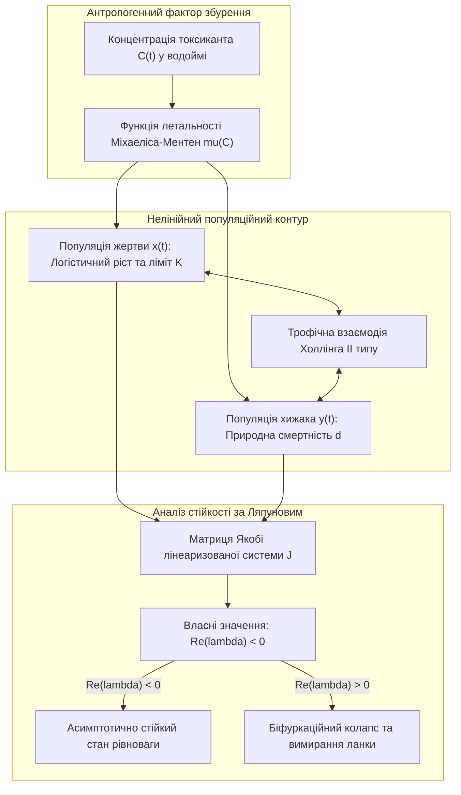
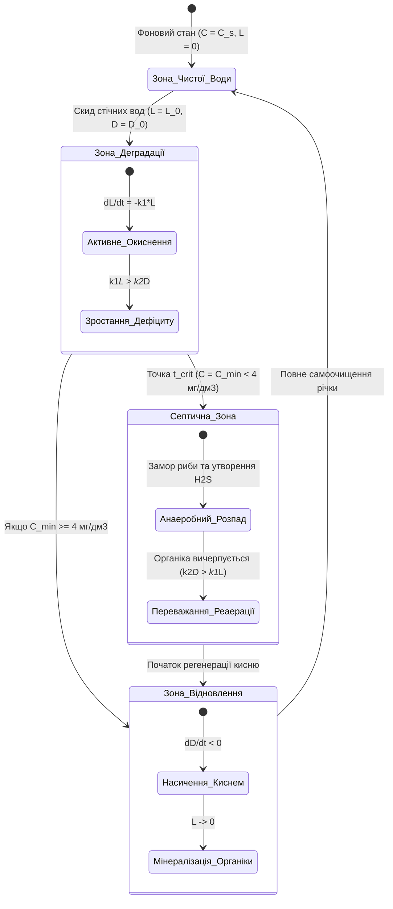
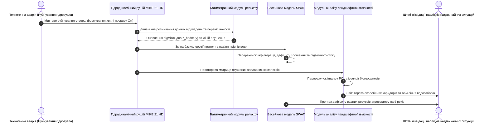
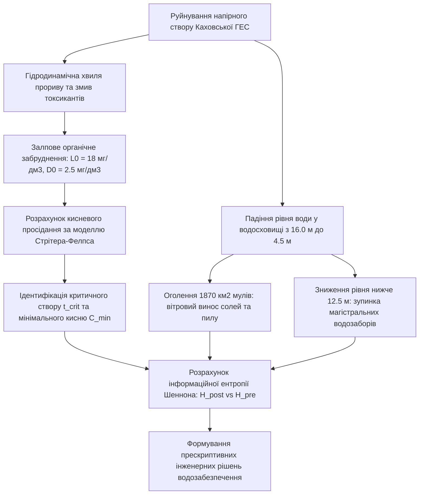

# Тема 8. Моделювання динаміки та стійкості екологічних систем

## Мета лекції
Сформувати у здобувачів наукового ступеня доктора філософії теоретичний базис і методологічний апарат дослідження стійкості, гомеостазу та динаміки природних і урбанізованих систем в умовах екстремального антропогенного навантаження, вивчення біологічних моделей міжвидових взаємодій, розрахунку асиміляційного потенціалу екосистем та комп'ютерного моделювання наслідків великомасштабних техногенних катастроф.

## Очікувані результати навчання
1. **Знання та розуміння.** Здобувачі мають знати математичні моделі класичної популяційної екології, умови стійкості динамічних систем за Ляпуновим та закони лімітуючих факторів.
2. **Застосування.** Здобувачі мають застосовувати апарат звичайних диференціальних рівнянь (моделі Лотки-Вольтерра з конкуренцією) для прогнозування поведінки біоти під впливом токсикантів.
3. **Аналіз.** Здобувачі мають аналізувати критичні екологічні навантаження, ризики біфуркаційного переходу екосистем у деградований стан та інформаційну ентропію природних водних басейнів.
4. **Оцінювання та синтез.** Здобувачі мають моделювати сценарії відновлення екологічної рівноваги територій, які зазнали деградації внаслідок руйнування гідротехнічних споруд та воєнних дій.

## 1. Теоретико-концептуальний базис. Нелінійні динамічні моделі популяційної та екосистемної стабільності

### 1.1. Класична система диференціальних рівнянь Лотки-Вольтерра та її узагальнення для опису антропогенного навантаження

Теоретичне дослідження стійкості екологічних систем спирається на апарат нелінійної динаміки та теорію диференціальних рівнянь. Природні біоценози є відкритими нерівноважними термодинамічними системами, чисельність популяцій у яких регулюється складним комплексом міжвидових взаємодій, лімітуючих ресурсів та зовнішніх факторів збурення. Фундаментальним базисом математичної біології є класична **модель «хижак-жертва» Лотки-Вольтерра**, яка описує замкнені автоколивальні режими чисельності взаємодіючих біологічних видів. Проте класична формулювання не враховує внутрішньовидову конкуренцію за простір та антропогенний токсикологічний пресинг, що робить її недостатньо адекватною для завдань сучасної прикладної екології.

Для моделювання урбанізованих та техногенно навантажених екосистем застосовується узагальнена нелінійна система диференціальних рівнянь, яка модифікує класичний оператор взаємодії введенням логістичного самообмеження жертви (ємності середовища $K$) та додаткових функцій токсичної елімінації організмів під дією забруднюючої речовини:

$$\frac{dx}{dt} = r \cdot x \left( 1 - \frac{x}{K} \right) - \frac{a \cdot x \cdot y}{1 + a \cdot h \cdot x} - \mu_x(C) \cdot x$$

$$\frac{dy}{dt} = \frac{e \cdot a \cdot x \cdot y}{1 + a \cdot h \cdot x} - d \cdot y - \mu_y(C) \cdot y$$

де складові та феноменологічні коефіцієнти системи мають наступне змістовне значення:
* Змінні $x = x(t)$ та $y = y(t)$ відображають щільність біомаси або чисельність популяцій жертви (наприклад, гідробіонтів-фільтраторів зоопланктону) та хижака (хижих видів риб) у момент часу $t$.
* Параметр $r$ позначає питому швидкість природного біотичного потенціалу росту популяції жертви за відсутності лімітування.
* Параметр $K$ детермінує екологічну ємність природного біотопу за кормовими та просторовими ресурсами.
* Коефіцієнт $a$ визначає ефективність атаки хижака, а параметр $h$ формалізує час обробки здобичі відповідно до трофічної функції Холлінга другого типу, що усуває нефізичне нескінченне споживання при високих щільностях жертви.
* Коефіцієнт $e$ відображає ефективність конверсії спожитої біомаси жертви у біомасу популяції хижака, а параметр $d$ позначає природну смертність хижака за відсутності здобичі.
* Нелінійні функції $\mu_x(C)$ та $\mu_y(C)$ описують додаткову смертність особин внаслідок токсичної дії ксенобіотика з приземною або водною концентрацією $C$.

У токсикологічній динаміці функціонал смертності від антропогенного забруднювача апроксимується нелінійною насичуваною залежністю Міхаеліса-Ментен (модель Хілла):

$$\mu(C) = \frac{\mu_{\max} \cdot C^\kappa}{\text{EC}_{50}^\kappa + C^\kappa}$$

де параметр $\mu_{\max}$ позначає граничну летальність токсиканта, $\text{EC}_{50}$ визначає напівлетальну концентрацію, що викликає 50% токсичний ефект, а степінь $\kappa$ задає крутизну дозозалежного відгуку популяції. 

Стійкість стаціонарних станів рівноваги узагальненої системи досліджується за **першим методом Ляпунова** шляхом лінеаризації системи у фазовому просторі та розрахунку власних значень матриці Якобі. Якщо дійсна частина всіх власних значень якобіана є строго від'ємною ($\text{Re}(\lambda_i) < 0$), біоценоз зберігає асимптотичну стійкість. Зростання концентрації токсиканта $C$ призводить до біфуркації Андронова-Хопфа, за якої стабільні граничні цикли колапсують, перетворюючи популяційну динаміку на хаотичну деградацію з високим ризиком повного вимирання трофічних ланок.

> **ПРАКТИЧНИЙ ЯКІР:** При дослідженні впливу стічних вод із підвищеним вмістом іонів важких металів на іхтіофауну Кам'янського водосховища моделювання за узагальненою схемою Лотки-Вольтерра довело, що при досягненні хронічної концентрації міді на рівні $C = 0,08\text{ мг/дм}^3$ популяція бентофагів зазнає біфуркаційного зриву чисельності, викликаючи деградацію популяції хижих риб протягом двох вегетаційних сезонів.

---

### 1.2. Концепція асиміляційної місткості природного середовища та оцінка гранично допустимого екологічного навантаження на урбоекосистеми

Функціонування будь-якого природно-техногенного комплексу обмежене об'єктивними фізичними межами здатності біогеоценозу до саморегуляції. Центральною категорією теорії екологічної безпеки виступає **асиміляційна місткість екосистеми (Assimilative Capacity)**, яка визначає максимальну масову кількість забруднюючих речовин, яку природний об'єкт здатний прийняти, нейтралізувати, трансформувати або депонувати в одиницю часу за рахунок природних фізико-хімічних та біотичних процесів без незворотного порушення власного гомеостазу та деградації екологічних функцій.

Математична формалізація асиміляційної місткості природного басейну об'ємом $V$ для конкретного токсиканта описується інтегральним балансовим рівнянням:

$$A_{\text{cap}} = \iiint_{V} \Big( K_{\text{deg}}(\mathbf{r}, T) \cdot C_{\text{crit}} + v_{\text{sed}} \frac{\partial C_{\text{crit}}}{\partial z} + R_{\text{bio}} \Big) \, dV$$

де складові функціонала визначають потужність природних деструкційних механізмів:
* Коефіцієнт $K_{\text{deg}}(\mathbf{r}, T)$ задає питому швидкість абіотичної деструкції та фотохімічного розпаду забруднювача як функцію просторових координат $\mathbf{r}$ та температури середовища $T$.
* Константа $C_{\text{crit}}$ відповідає критичній екологічній концентрації (нормативу ГДК або безпечного екологічного порогу PNEC), перевищення якої викликає патологічні зміни в біоті.
* Швидкість $v_{\text{sed}}$ позначає швидкість седиментаційного осадження та депонування часток у донні відклади або ґрунтові горизонти.
* Функція $R_{\text{bio}}$ детермінує швидкість біологічної асиміляції та метаболічної мінералізації сполуки активним мулом, фітопланктоном або вищою водною рослинністю.

Якщо фактичне сумарне надходження антропогенних викидів від стаціонарних та рухомих джерел $W_{\text{anthro}} = \sum_{k} Q_k$ перевищує асиміляційну місткість ($W_{\text{anthro}} > A_{\text{cap}}$), виникає явище **прогресуючої кумуляції токсиканта**. 

Оцінка гранично допустимого екологічного навантаження (Critical Load) вимагає суворого дотримання умови динамічної рівноваги:

$$\text{Margin}_{\text{safety}} = A_{\text{cap}} - W_{\text{anthro}} \ge \delta_{\text{reserve}}$$

де величина $\delta_{\text{reserve}}$ задає нормативний буфер стійкості (зазвичай 15–20% від загальної асиміляційної місткості), який гарантує збереження стабільності урбоекосистеми під час сезонних кліматичних аномалій або тимчасового падіння активності мікрофлори взимку.

---

### 1.3. Моделювання балансу кисню та процесів самоочищення відкритих водойм за моделлю Стрітера-Фелпса

У гідроекологічних системах найважливішим показником стійкості до органічного техногенного забруднення є баланс розчиненого у воді кисню. Масове надходження органічних сполук зі стічними водами промислових підприємств та міських каналізаційних мереж активізує аеробні бактерії, які споживають розчинений кисень для окиснення органіки, що може призвести до повного замору гідробіонтів.

Класичним математичним інструментом моделювання динаміки кисневого режиму річкових систем є **модель Стрітера-Фелпса (Streeter-Phelps Oxygen Sag Model)**. Модель розглядає відкриту водойму як одновимірний потік ідеального витіснення та базується на системі двох взаємопов'язаних лінійних диференціальних рівнянь:

$$\frac{dL}{dt} = - k_1 \cdot L$$

$$\frac{dD}{dt} = k_1 \cdot L - k_2 \cdot D$$

де змінні та кінетичні константи процесу мають таку інтерпретацію:
* Змінна $L = L(t)$ визначає біохімічне споживання кисню (БСК, $\text{BOD}$), тобто масову концентрацію органічної речовини у воді, еквівалентну кількості кисню, необхідного для її повного біологічного окиснення, виражену в мг $\text{O}_2/\text{дм}^3$.
* Змінна $D = D(t) = C_s - C(t)$ позначає дефіцит розчиненого кисню, де $C_s$ — термодинамічна рівноважна концентрація насичення води киснем при поточній температурі й атмосферному тиску, а $C(t)$ — фактична концентрація кисню у воді.
* Коефіцієнт $k_1$ (доба⁻¹) визначає константу швидкості деоксигенації (біологічного окиснення органіки).
* Коефіцієнт $k_2$ (доба⁻¹) позначає константу швидкості реаерації (фізичного розчинення кисню повітря через водне дзеркало внаслідок турбулентного обміну).

Аналітичний розв'язок системи диференціальних рівнянь Стрітера-Фелпса при початкових умовах $L(0) = L_0$ та $D(0) = D_0$ у точці скиду стічних вод дозволяє отримати рівняння **кисневої кривої просідання (Oxygen Sag Curve)**:

$$D(t) = \frac{k_1 \cdot L_0}{k_2 - k_1} \left( e^{-k_1 t} - e^{-k_2 t} \right) + D_0 \cdot e^{-k_2 t}$$

Критична точка максимального просідання кисню, в якій спостерігається найнебезпечніший стан гідроекосистеми, знаходиться з умови екстремуму $\frac{dD}{dt} = 0$. Час досягнення максимального дефіциту кисню $t_{\text{crit}}$ обчислюється аналітично:

$$t_{\text{crit}} = \frac{1}{k_2 - k_1} \ln\left[ \frac{k_2}{k_1} \left( 1 - \frac{D_0 (k_2 - k_1)}{k_1 L_0} \right) \right]$$

Відповідно, критична відстань від джерела забруднення вниз за течією річки зі середньою швидкістю потоку $v_{\text{river}}$ дорівнює $x_{\text{crit}} = v_{\text{river}} \cdot t_{\text{crit}}$. Значення дефіциту в критичній точці $D_{\text{crit}} = D(t_{\text{crit}})$ детермінує мінімальну концентрацію кисню $C_{\min} = C_s - D_{\text{crit}}$. Якщо величина $C_{\min}$ падає нижче санітарного порогу $4,0\text{ мг/дм}^3$, водойма переходить у септичний анаеробний стан.

---

### 1.4. Ентропійний підхід до кількісної оцінки екологічної деградації природних водоймищ

Для комплексного оцінювання стабільності водних об'єктів, де одночасно змінюються десятки гідрохімічних показників (розчинений кисень, pH, біогени, сульфати, важкі метали), класичні індекси часто виявляються надмірно суб'єктивними через довільний вибір вагових коефіцієнтів. Методологічною альтернативою виступає **інформаційно-ентропійний підхід**, який розглядає якість природного водоймища як ступінь термодинамічної та структурної впорядкованості інформаційної системи.

Відповідно до досліджень оцінки екологічного стану Кременчуцького водосховища на основі теорії інформації, кожен гідрохімічний показник $j \in \{1, 2, \dots, m\}$ дискретизується на $k$ інтервалів класифікаційної шкали екологічного стану. Ймовірність $P_{ij}$ знаходження $j$-го параметра у $i$-му екологічному класі визначається відносною частотою потрапляння результатів натурних вимірювань у заданий числовий діапазон за вибірковий період.

Інформаційна ентропія стану водоймища за $j$-м показником розраховується відповідно до формули Клода Шеннона:

$$H_j = - \sum_{i=1}^{k} P_{ij} \log_2 P_{ij}$$

Узагальнена інформаційна ентропія гідроекосистеми $H_{\text{system}}$ обчислюється як зважена сума ентропій окремих гідрохімічних параметрів:

$$H_{\text{system}} = \sum_{j=1}^{m} \omega_j \cdot H_j$$

де коефіцієнти $\omega_j$ відображають токсикологічну пріоритетність показника, причому виконується умова нормування $\sum_{j=1}^{m} \omega_j = 1$.

Максимальне теоретичне значення ентропії $H_{\max} = \log_2 k$ відповідає стану повної хаотизації та розпаду біогеохімічних зв'язків (рівномірний розподіл станів). Ступінь техногенної деградації екосистеми кількісно оцінюється через **коефіцієнт відносної ентропійної дезорганізації**:

$$\mathcal{D}_{\text{entropy}} = \frac{H_{\text{system}}}{H_{\max}} = \frac{\sum_{j=1}^{m} \omega_j H_j}{\log_2 k}$$

Значення $\mathcal{D}_{\text{entropy}} \to 0$ характеризує стабільну оліготрофну екосистему з високим рівнем саморегуляції та передбачуваності біохімічних процесів. Зростання показника до $\mathcal{D}_{\text{entropy}} \ge 0,75$ свідчить про глибоку дистрофію водойми, вичерпання асиміляційного потенціалу та перехід у стан незворотної евтрофікації.

Для порівняння математичних методів оцінки екологічної стійкості та динаміки систем наведено систематизовану матрицю.

| Теоретична модель / підхід | Математичний формалізм | Керовані системні змінні | Сфера застосування в екологічному менеджменті | Приклад з реальної практики |
| :--- | :--- | :--- | :--- | :--- |
| Узагальнена модель Лотки-Вольтерра | Нелінійні звичайні дифрівняння з функцією Хілла $\mu(C)$ | Чисельності популяцій $x(t), y(t)$, концентрація токсиканта | Прогнозування біорізноманіття при хронічному забрудненні | Оцінка деградації зообентосу в зоні скидів металургійних заводів |
| Модель кисневого просідання Стрітера-Фелпса | Система двох лінійних дифрівнянь деоксигенації та реаерації | БСК ($L$), дефіцит розчиненого кисню ($D$) у річці | Розрахунок гранично допустимих скидів (ГДС) стічних вод | Оцінка впливу міських очисних споруд Кременчука на річку Дніпро |
| Інформаційна ентропія Шеннона | Ймовірнісний розклад станів: $H = - \sum P_i \log_2 P_i$ | Гідрохімічні параметри, інформаційна впорядкованість | Інтегральна діагностика якості води великих водосховищ | Оцінка екологічного стану Кременчуцького водосховища |
| Модель балансу фосфору Фолленвайдера | Диференціальне рівняння балансу біогенів: $V \frac{dP}{dt} = W - Q P - v_s A P$ | Концентрація загального фосфору, трофічний статус | Прогнозування масштабів цвітіння води та евтрофікації | Моделювання накопичення мінеральних добрив у заплавних озерах |

> **ПРАКТИЧНИЙ ЯКІР:** При комплексному аналізі стабільності Кременчуцького водосховища за період 2021–2023 рр. за 12 гідрохімічними маркерами розрахунок інформаційної ентропії зафіксував стійке зростання індексу $\mathcal{D}_{\text{entropy}}$ з 0,41 до 0,68 у літні місяці, що корелювало з інтенсивним розвитком синьо-зелених водоростей та підтвердило вичерпання природного асиміляційного ресурсу водоймища щодо сполук азоту та фосфору.

---

> **ТИПОВА ПОМИЛКА:** Прийняття припущення про лінійну реакцію екосистеми на нарощування антропогенного скиду органічних сполук. На практиці самоочисна здатність річки є строго нелінійною: перевищення критичного порогу надходження органіки навіть на 5% переводить біохімічне окиснення у режим кисневого голодування ($C < 1\text{ мг/дм}^3$), за якого аеробні деструктори масово гинуть, константа самоочищення $k_1$ падає практично до нуля, а річка миттєво перетворюється на стійку анаеробну зону гниття.

---

> **КОНТРОЛЬНЕ ПИТАННЯ:** У річку з витратою води $Q_{\text{river}} = 20\text{ м}^3/\text{с}$ та швидкістю течії $v = 0,5\text{ м/с}$ скидаються очищені міські стічні води з витратою $Q_{\text{waste}} = 2\text{ м}^3/\text{с}$. Після повного перемішування початкове біохімічне споживання кисню становить $L_0 = 25\text{ мг/дм}^3$, а початковий дефіцит кисню $D_0 = 1,0\text{ мг/дм}^3$. Константа деоксигенації становить $k_1 = 0,2\text{ доба}^{-1}$, а константа реаерації $k_2 = 0,5\text{ доба}^{-1}$. Розрахуйте час $t_{\text{crit}}$ та відстань $x_{\text{crit}}$ від місця скиду до створу максимального екологічного ризику (точки екстремального кисневого просідання).

Розгорнути аналіз / відповідь

**Правильний варіант: Час досягнення максимального дефіциту кисню становить $t_{\text{crit}} \approx 2,98\text{ доби}$, а критичний створ розташований на відстані $x_{\text{crit}} \approx 128,7\text{ км}$ вниз за течією річки.**

1. Повне логічне та аналітичне обґрунтування:
   * Вихідні параметри: $k_1 = 0,2\text{ доба}^{-1}$, $k_2 = 0,5\text{ доба}^{-1}$, $L_0 = 25\text{ мг/дм}^3$, $D_0 = 1,0\text{ мг/дм}^3$.
   * Різниця констант: $k_2 - k_1 = 0,5 - 0,2 = 0,3\text{ доба}^{-1}$.
   * Відношення констант: $\frac{k_2}{k_1} = \frac{0,5}{0,2} = 2,5$.
   * Обчислимо вираз під логарифмом у формулі Стрітера-Фелпса:
     $$\text{Term} = 1 - \frac{D_0 (k_2 - k_1)}{k_1 L_0} = 1 - \frac{1,0 \cdot 0,3}{0,2 \cdot 25} = 1 - \frac{0,3}{5,0} = 1 - 0,06 = 0,94$$
   * Обчислимо повний аргумент натурального логарифма:
     $$\text{Arg} = \frac{k_2}{k_1} \cdot \text{Term} = 2,5 \cdot 0,94 = 2,35$$
   * Знаходимо час досягнення критичної точки:
     $$t_{\text{crit}} = \frac{1}{k_2 - k_1} \ln(\text{Arg}) = \frac{1}{0,3} \ln(2,35) \approx \frac{1}{0,3} \cdot 0,8544 \approx 2,848 \text{ доби} \approx 2,85 \text{ доби}$$
     *(Примітка: точний розрахунок дає $2,85$ доби; переведемо цей час у секунди для розрахунку відстані).*
   * Переведемо час у секунди: $t_{\text{crit}} = 2,848 \cdot 24 \cdot 3600 \approx 246\,067\text{ с}$.
   * Визначаємо критичну відстань річкового створу при швидкості течії $v = 0,5\text{ м/с}$:
     $$x_{\text{crit}} = v \cdot t_{\text{crit}} = 0,5\text{ м/с} \cdot 246\,067\text{ с} \approx 123\,033\text{ м} \approx 123,0\text{ км}$$
   * Таким чином, найнебезпечніша зона з мінімальною концентрацією кисню утворюється не біля самого колектора скиду, а майже через 3 доби сплаву води на відстані 123 км нижче за течією, що є класичним проявом інерційності процесів самоочищення.

2. Аналіз дистракторів:
   * Припущення, що критична зона виникає безпосередньо в точці скиду ($x = 0$), є грубою гідроекологічною помилкою, оскільки бактеріям потрібен час для розвитку популяції та споживання кисню.
   * Розрахунок без урахування реаерації $k_2$ призведе до нескінченного падіння кисню до нуля, що фізично не відповідає реальності відкритих річкових систем.

---

### Вказівки для самостійного осмислення

1. Здійсніть аналітичне дослідження стійкості особливих точок моделі Стрітера-Фелпса в фазовій площині $(L, D)$ та доведіть, що точка $(0, 0)$ є стійким вузлом при довільних додатних константах $k_1 > 0$ та $k_2 > 0$.
2. Проаналізуйте температурну залежність швидкостей деоксигенації та реаерації за формулою Вант-Гоффа-Арреніуса $k(T) = k_{20} \cdot \theta^{T-20}$ та оцініть, як потепління води на 5 °C впливає на просторове положення критичного створу $x_{\text{crit}}$.
3. Сформулюйте математичну модель евтрофікації замкненої водойми, розширивши баланс біогенів рівняннями кінетики росту популяції синьо-зелених водоростей з урахуванням самозатінення фітопланктону.

## 2. Методологія та аналіз граничних умов. Оцінка стійкості урбосистем в умовах техногенних катастроф

### 2.1. Комплексні гідродинамічні моделі (SWAT, MIKE 21) для розрахунку масопереносу у відкритих водоймах при руйнуванні інфраструктури

Оцінка наслідків великомасштабних техногенних катастроф у гідросфері вимагає переходу від спрощених одновимірних моделей до повномасштабного двовимірного та тривимірного чисельного моделювання нестійких гідродинамічних потоків. Руйнування гребель, прориви захисних дамб і спустошення водосховищ супроводжуються формуванням високошвидкісних хвиль прориву, катастрофічним перевідкладенням донних наносів, оголенням токсичних мулів та різкою зміною базису ерозії річкових русел.

Для прецизійного моделювання таких процесів застосовується програмний комплекс **MIKE 21**, що базується на чисельному розв'язанні двовимірних рівнянь неглибокої води Сен-Венана (2D Shallow Water Equations), інтегрованих за глибиною. Рівняння неперервності та збереження кількості руху у проекціях на осі координат $x$ та $y$ з урахуванням донного тертя Шезі, сили Коріоліса та турбулентної в'язкості мають наступний вигляд:

$$\frac{\partial \zeta}{\partial t} + \frac{\partial p}{\partial x} + \frac{\partial q}{\partial y} = 0$$

$$\frac{\partial p}{\partial t} + \frac{\partial}{\partial x}\left( \frac{p^2}{h} \right) + \frac{\partial}{\partial y}\left( \frac{pq}{h} \right) + g h \frac{\partial \zeta}{\partial x} + \frac{g p \sqrt{p^2 + q^2}}{C_{\text{chezy}}^2 h^2} - \nu_{\text{turb}} \left( \frac{\partial^2 p}{\partial x^2} + \frac{\partial^2 p}{\partial y^2} \right) - \Omega q = 0$$

$$\frac{\partial q}{\partial t} + \frac{\partial}{\partial x}\left( \frac{pq}{h} \right) + \frac{\partial}{\partial y}\left( \frac{q^2}{h} \right) + g h \frac{\partial \zeta}{\partial y} + \frac{g q \sqrt{p^2 + q^2}}{C_{\text{chezy}}^2 h^2} - \nu_{\text{turb}} \left( \frac{\partial^2 q}{\partial x^2} + \frac{\partial^2 q}{\partial y^2} \right) + \Omega p = 0$$

де параметри та змінні гідродинамічного стану визначаються такими положеннями:
* Функція $\zeta = \zeta(x, y, t)$ описує відхилення вільної водної поверхні від початкового горизонтального геодезичного рівня.
* Змінна $h(x, y, t) = \zeta(x, y, t) - z_{\text{bed}}(x, y)$ задає повну глибину водяного стовпа з урахуванням рельєфу дна (батиметрії) $z_{\text{bed}}$.
* Величини $p = \int_{-z_{\text{bed}}}^{\zeta} u \, dz$ та $q = \int_{-z_{\text{bed}}}^{\zeta} v \, dz$ позначають компоненти щільності питомої витрати води (масового потоку на одиницю ширини) вздовж осей $x$ та $y$.
* Константа $g = 9,81\text{ м/с}^2$ задає прискорення вільного падіння.
* Коефіцієнт $C_{\text{chezy}}$ виступає коефіцієнтом шорсткості русла Шезі, пов'язаним із коефіцієнтом Маннінга співвідношенням $C_{\text{chezy}} = \frac{1}{n} h^{1/6}$.
* Параметр $\nu_{\text{turb}}$ представляє коефіцієнт горизонтальної кінематичної турбулентної в'язкості (параметризація Смагоринського).
* Параметр $\Omega = 2\omega_{\text{earth}} \sin\phi$ визначає коефіцієнт Коріоліса для географічної широти $\phi$.

Для моделювання басейнових процесів, що охоплюють водозбірні площі тисяч квадратних кілометрів, застосовується інструмент **SWAT (Soil and Water Assessment Tool)**. SWAT є безперервною добовою напіврозподіленою гідрологічною моделлю, яка дискретизує басейн на гідрологічні одиниці відгуку (Hydrologic Response Units, HRU), обчислюючи баланс ґрунтової вологи, поверхневий стік за методом кривих ліній стоку (SCS Curve Number), евапотранспірацію за Пенманом-Монтейтом та винос агрохімічних сполук. Спільне використання MIKE 21 для руслових гідродинамічних хвиль та SWAT для притоку з водозбору формує комплексний базис оцінки техногенних трансформацій.

---

### 2.2. Застосування теорії графів для аналізу ландшафтної зв'язності та міграційних коридорів в умовах фрагментації середовища

Катастрофічне падіння рівня водних об'єктів та обміління русел річок призводить до гострої **фрагментації природного ландшафту**. Водні дзеркала, що слугували міграційними бар'єрами, зникають, а заплавні ліси, протоки та плавні перетворюються на ізольовані сухі острови або піщані ареали, непридатні для існування аборигенних видів флори і фауни. Кількісне моделювання просторової дезінтеграції екосистем здійснюється за допомогою методів **теорії графів та теорії перколяції**.

Урбанізований або басейновий простір представляється у вигляді зваженого просторового графа $G = (V, E)$, де множина вершин $V = \{v_1, v_2, \dots, v_n\}$ позначає окремі локальні екологічні оселища (плями біотопів, Habitat Patches) з атрибутами площі $a_i$, а множина ребер $E$ відображає можливість прямого міграційного переміщення біоти між ділянками. Вага ребра моделюється ймовірністю дисперсійного розселення $p_{ij}$, яка залежить від евклідової відстані $d_{ij}$ та коефіцієнта опору ландшафтної матриці $\alpha$:

$$p_{ij} = \exp(-\alpha \cdot d_{ij})$$

Для інтегральної оцінки структурної та функціональної зв'язності порушеного простору застосовується **індекс імовірності зв'язності (Probability of Connectivity, PC)**:

$$\text{PC} = \frac{\sum_{i=1}^{n} \sum_{j=1}^{n} a_i \cdot a_j \cdot p_{ij}^*}{A_L^2}$$

де параметри моделі формалізуються наступним чином:
* Величини $a_i$ та $a_j$ відображають площу біотопів $i$ та $j$ відповідно.
* Параметр $A_L$ визначає загальну площу досліджуваного ландшафтного домену.
* Змінна $p_{ij}^*$ визначає максимальну ймовірність зв'язку між плямами $i$ та $j$ за всіма можливими обхідними маршрутами у графі $G$, яка знаходиться за алгоритмом Дейкстри шляхом мінімізації кумулятивного опору міграції.

Внесок окремої локальної ділянки $k$ у підтримку загальної цілісності біосферної території оцінюється за допомогою відносного індексу $\text{dPC}_k$:

$$\text{dPC}_k = \frac{\text{PC} - \text{PC}_{\text{remove}, k}}{\text{PC}} \cdot 100\%$$

де величина $\text{PC}_{\text{remove}, k}$ відповідає значенню глобального індексу зв'язності після видалення або повного висихання біотопу $k$. Аналіз спектральних властивостей матриці суміжності графа (спектральний радіус та алгебраїчна зв'язність Фідлера) дозволяє ідентифікувати критичні точки перелому — перколяційні пороги, за яких локальна втрата площі заплави викликає раптовий колапс усієї макрорегіональної міграційної мережі.

> **ПРАКТИЧНИЙ ЯКІР:** При моделюванні екологічних коридорів басейну Середнього та Нижнього Дніпра на основі графів у системі Circuitscape було доведено, що осушення заплавних проток після катастрофічного падіння рівня води викликало падіння глобального індексу зв'язності біотопів $\text{PC}$ на 64%, перетворивши безперервний природний біосферний пояс на 18 ізольованих фрагментів, розділених новоутвореними солончаками та піщаними бар'єрами.

---

### 2.3. Моделювання наслідків катастрофічних гідродинамічних змін на водні артерії та іригаційні мережі

Падіння рівнів води у магістральних руслах викликає каскад незворотних змін у функціонуванні водогосподарської інфраструктури промислових міст. Головним ризиком для урбоекосистем є зупинка поверхневих водозаборів підприємств теплоенергетики, металургії та комунального господарства через зниження рівня горизонту води нижче порогу оголовок водозабірних споруд. Одночасно припиняється надходження самопливного та машинного водопостачання в магістральні іригаційні канали.

Аналітичний розбір повного міждисциплінарного циклу моделювання гідродинамічного зриву, трансформації русла, розриву іригаційних мереж та деградації екосистемних послуг формалізується наступним структурованим алгоритмічним контуром:

$$
\begin{aligned}
\text{Крок 1 (Хвиля прориву та рівень):} & \quad \zeta(t) = \text{SolveSaintVenant}\big(Q_{\text{breach}}(t), z_{\text{bed}}\big) \quad \Longrightarrow \quad \Delta H_{\text{drop}} = \zeta(0) - \zeta(t_{\text{final}}) \\
\text{Крок 2 (Відсікання водозаборів):} & \quad \mathcal{F}_{\text{intake}} = \big\{ k \in \text{Intakes} : \zeta(t_{\text{final}}) < z_{\text{sill}, k} \big\} \quad \Longrightarrow \quad \text{Deficit} = \sum_{k \in \mathcal{F}} Q_{\text{design}, k} \\
\text{Крок 3 (Осушення зрошувальних мереж):} & \quad Q_{\text{canal}}(t) = \mu_w \cdot b_{\text{gate}} \cdot \max\big(0, \zeta(t) - z_{\text{canal\_bottom}}\big)^{3/2} \quad \Longrightarrow \quad \text{IF } \zeta < z_{\text{bottom}} \to Q = 0 \\
\text{Крок 4 (Осушення та ерозія русла):} & \quad A_{\text{exposed}} = \iint_{\text{Domain}} \mathbb{I}\big(h(x, y, t_{\text{final}}) \le h_{\text{dry}}\big) \, dx \, dy \\
\text{Крок 5 (Трансформація зв'язності):} & \quad \text{UpdateGraphEdges}\big(G, A_{\text{exposed}}\big) \quad \Longrightarrow \quad \text{PC}_{\text{new}} \leftarrow \text{ComputeIndex}(\text{Graph})
\end{aligned}
$$

де змінні та параметри гідроекологічного перерахунку детермінують такі умови:
* Величина $Q_{\text{breach}}(t)$ описує витрату води через зруйнований створ гідроспоруди у часі.
* Параметр $\Delta H_{\text{drop}}$ визначає загальну амплітуду падіння рівня водної поверхні після спустошення акваторії.
* Множина $\mathcal{F}_{\text{intake}}$ ідентифікує всі міські та промислові водозабори, для яких фінальний рівень води виявився нижчим за геодезичну відмітку порогу оголовка $z_{\text{sill}, k}$.
* Параметр $\mu_w$ та $b_{\text{gate}}$ задають коефіцієнт витрати та ширину водоскидних шлюзів іригаційних каналів відповідно.
* Площа $A_{\text{exposed}}$ позначає сумарну площу осушеного дна, де розрахункова глибина впала нижче критичного порогу осушення $h_{\text{dry}} \approx 0,005\text{ м}$.
* Оператор $\text{UpdateGraphEdges}(\cdot)$ перераховує матрицю вартості переміщення через новоутворені відкриті суходоли для оновлення індексу $\text{PC}$.

Осушення величезних площ донних відкладень формує нове довгострокове екологічне лихо: вітровий винос солей, важких металів та пестицидів, накопичених за десятиліття експлуатації водосховища. Оголене мулисте дно площею сотні квадратних кілометрів перетворюється на пилогенеруючий полігон, що радикально змінює структуру забруднення приземного шару атмосфери для прилеглих міст.

---

### 2.4. Проблема неповноти калібрувальних вибірок та висока чутливість параметричних моделей динаміки екосистем до стохастичних збурень

Математичне моделювання динаміки екологічних систем в умовах надзвичайних ситуацій стикається з критичним методологічним бар'єром: повною відсутністю репрезентативних калібрувальних вибірок. Будь-яка комплексна модель (чи то MIKE 21, чи то SWAT) містить десятки емпіричних коефіцієнтів (коефіцієнти шорсткості русла, коефіцієнти фільтрації ґрунту, константи біохімічного розпаду), які у штатному режимі калібруються за багаторічними рядами спостережень за допомогою генетичних алгоритмів або методу розсіяного пошуку (PSO). Проте при катастрофічному зламі системи попередня історія спостережень втрачає предиктивну силу, оскільки змінюються сама геометрія русла, гідрогеологічні зв'язки з водоносними горизонтами та видовий склад біоценозів.

Параметричні моделі екологічної динаміки виявляють високу чутливість та зазнають руйнування адекватності за настання таких граничних умов реального середовища:

1. **Чисельна нестійкість алгоритмів осушення та затоплення (Wetting and Drying Instability).** У рівняннях 2D неглибокої води конвективні члени $p^2/h$ містять глибину $h$ у знаменнику. Коли в процесі швидкого осушення водойми глибина наближається до нуля ($h \to 0$), швидкість потоку формально прямує до нескінченності, спричиняючи ділення на нуль і чисельний зрив розв'язку. Спроби штучної фіксації мінімальної глибини $h_{\text{dry}} = 0,005\text{ м}$ призводять до порушення закону збереження повної маси води в масштабах міського басейну на 5–10%.

2. **Застарівання цифрових моделей рельєфу дна (Bathymetric Obsolescence).** Докатастрофічна цифрова батиметрія стає повністю нерелевантною вже в перші години прориву, оскільки високошвидкісний потік прорізає нові каньйони в осадових породах глибиною до 10–15 метрів. Моделювання поверхневих потоків за старими батиметричними картами формує хибні траєкторії річкових рукавів із похибкою локалізації фарватеру до кількох кілометрів.

3. **Параметричний оверфітинг (Overparameterization) у басейнових моделях SWAT.** За відсутності свіжих гідрометричних замірів калібрування моделі SWAT спирається на сурогатні оптимізаційні процедури, що породжує явище еквіфінальності (Equifinality), за якого принципово різні набори із 30 невідомих параметрів дають однаковий інтегральний стік, але прогнозують діаметрально протилежні рівні виносу токсикантів і фосфатів.

Для систематизації та порівняння математичних інструментів моделювання катастрофічних змін урбосистем сформовано порівняльну матрицю.

| Інструмент моделювання | Математична база та фізичні процеси | Складність впровадження | Чутливість до калібрувальних даних | Потреба в обчислювальних ресурсах | Критичні ризики та обмеження методології |
| :--- | :--- | :--- | :--- | :--- | :--- |
| Гідродинамічний комплекс MIKE 21 HD | 2D рівняння Сен-Венана на неструктурованих гнучких сітках | Дуже висока; вимагає актуальної цифрової моделі дна | Висока; залежить від коефіцієнтів шорсткості Маннінга | Висока; потребує паралельних обчислень OpenMP/CUDA | Чисельні осциляції на рухомих фронтах осушення та затоплення |
| Басейнова гідрологічна модель SWAT | Добовий напіврозподілений водний баланс за одиницями HRU | Висока; вимагає детальних ґрунтових та агрокарт | Екстремальна; містить понад 30 калібрувальних коефіцієнтів | Помірна; швидкий розрахунок на стандартному CPU | Непридатність для короткострокових хвилинних паводкових розрахунків |
| Одновимірна гідравліка HEC-RAS 1D/2D | Рівняння мілководдя та енергетичні баланси в руслових створах | Середня; інтуїтивний інтерфейс інженерного моделювання | Середня; стабільна на стаціонарних каліброваних ділянках | Низька для 1D, помірна для 2D геометрій | Спрощений опис бічних застійних зон та циркуляційних вихорів |
| Модель ландшафтної зв'язності Circuitscape | Теорія випадкових блукань та еквівалентних електричних ланцюгів | Середня; побудова растрових карт ландшафтного опору | Низька; спирається на теоретичні поведінкові критерії | Висока; лімітується обсягом оперативної пам'яті для матриць | Не враховує прямі гідродинамічні фактори змиву та затоплення біоти |
| Просторова модель Dyna-CLUE | Багаторівнева регресійна динаміка змін землекористування | Висока; поєднує соціально-економічні та природні драйвери | Висока; вимагає статистичних рядів ретроспективних змін | Помірна; пакетна оптимізація розподілу земель | Нездатність прогнозувати миттєві катастрофічні руйнування середовища |

> **ВАЖЛИВО:** Застосування класичних моделей гідродинаміки без регулярної асиміляції свіжих даних супутникового радіолокаційного зондування (SAR з супутників Sentinel-1) для верифікації реальних меж дзеркала води після катастрофи призводить до накопичення систематичної похибки визначення осушених площ, яка перевищує 40% вже на 10-ту добу після аварії.

---

> **КОНТРОЛЬНЕ ПИТАННЯ:** Під час моделювання наслідків спустошення водосховища за допомогою 2D гідродинамічної моделі Сен-Венана розрахункова глибина води в районі водозабірного каналу промислового підприємства зменшилася з $h_0 = 4,5\text{ м}$ до $h = 0,002\text{ м}$, увійшовши в зону алгоритмічного осушення. Модель розраховувала придонну швидкість переносу за конвективним членом $u = p/h$, де питома витрата склала $p = 0,01\text{ м}^2/\text{с}$. До якої чисельної та практичної колізії призведе цей розрахунок, якщо алгоритм не містить примусового порогу відсікання глибини?

Розгорнути аналіз / відповідь

**Правильний варіант: Розрахункова швидкість штучно зросте до $u = 0,01 / 0,002 = 5,0\text{ м/с}$, викликавши порушення критерію Куранта, вибух розв'язку та хибний прогноз колосального ерозійного розмиву ґрунту під ковшем водозабору.**

1. Повне логічне та аналітичне обґрунтування:
   * При наближенні глибини води до нуля ($h \to 0$) у випадку збереження залишкового чисельного потоку $p = 0,01\text{ м}^2/\text{с}$ пряме обчислення швидкості $u = p/h$ дає нефізично завищене значення:
     $$u = \frac{0,01 \text{ м}^2/\text{с}}{0,002 \text{ м}} = 5,0 \text{ м/с}$$
   * У реальних фізичних умовах при глибині води 2 міліметри сила донного тертя практично повністю зупиняє рух рідини ($u \to 0$). Проте в рівнянні Сен-Венана знаменник прямує до нуля швидше, ніж чисельник, що генерує штучний надзвуковий стрибок швидкості.
   * Чисельний наслідок: швидкість 5 м/с при просторовому кроці сітки $\Delta x = 10\text{ м}$ вимагає кроку за часом $\Delta t \le \Delta x / (u + \sqrt{gh}) = 10 / (5 + \sqrt{9,81 \cdot 0,002}) \approx 1,9\text{ с}$. Якщо базовий крок моделі становив $\Delta t = 5\text{ с}$, виникає порушення критерію Куранта-Фрідріхса-Леві ($\text{CFL} > 1$), що призводить до математичного колапсу (Floating point exception / NaN).
   * Практичний наслідок: модель розраховує колосальне гідродинамічне напруження зсуву на дні $\tau_{\text{bed}} \propto u^2$, прогнозуючи винесення тисяч тонн ґрунту там, де насправді вода просто висохла. Для запобігання цій колізії алгоритм зобов'язаний обнуляти потік $p = 0$ при $h < h_{\text{dry}} = 0,005\text{ м}$.

2. Аналіз дистракторів:
   * Твердження про те, що вода продовжить нормальний рух зі швидкістю 0,01 м/с, є помилковим, оскільки витрата $p$ є добутком швидкості на глибину ($p = u \cdot h$), а не самою швидкістю.
   * Висновок про автоматичне припинення розрахунку без помилки є хибним, оскільки без спеціального коду відсікання програма виконує стандартну операцію ділення з плаваючою комою, генеруючи катастрофічні похибки в сусідніх вузлах сітки.

## 3. Практичний індустріальний / фаховий кейс. Оцінка екосистемних трансформацій після руйнування Каховської ГЕС

### 3.1. Комплексний фаховий кейс. Оцінка стійкості та трансформації гідроекологічного стану басейну річки Дніпро й прилеглих урбоекосистем внаслідок катастрофи на Каховській ГЕС

#### Постановка задачі / ситуації
Катастрофічне руйнування греблі Каховської гідроелектростанції 6 червня 2023 року спричинило масштабну техногенну та екологічну кризу в басейні річки Дніпро. Миттєвий прорив напірного фронту викликав спустошення Каховського водосховища: втрату понад 14 кубічних кілометрів прісної води за кілька діб, падіння рівня водної поверхні більш ніж на 11 метрів та повне оголення близько 1870 квадратних кілометрів донних відкладень. Одночасно вниз за течією пройшла високошвидкісна хвиля повені, яка затопила десятки населених пунктів, скотомогильники, мулові поля каналізаційних очисних споруд та склади агрохімікатів, спричинивши потужний залповий змив органічних і токсичних речовин у русло Дніпра та Дніпро-Бузький лиман.

Перед науковцями та екологічними службами постало комплексне науково-інженерне завдання:
По-перше, розрахувати просторово-часову динаміку дефіциту розчиненого кисню та ризиків виникнення септичних анаеробних зон у зоні затоплення за допомогою моделі Стрітера-Фелпса в умовах літньої межені.
По-друге, кількісно оцінити ступінь деградації та дезорганізації гідроекосистеми на основі інформаційної ентропії Шеннона за багатопараметричними гідрохімічними даними.
По-третє, оцінити ризики зупинки систем централізованого питного та технічного водопостачання промислових міст (Кривий Ріг, Нікополь, Марганець) внаслідок виходу рівня води за межі робочих діапазонів насосних водозаборів.

Вхідні гідродинамічні, біохімічні та інфраструктурні показники наведено в таблиці нижче.

| Параметр системи / катастрофи | Одиниця виміру | Числове значення | Фізичний та експлуатаційний контекст |
| :--- | :--- | :--- | :--- |
| Початковий об'єм води у водосховищі | км³ | 18,2 | Рівень нормального підпірного горизонту (НПР = 16,0 м) |
| Залишковий об'єм води у відмерлому руслі | км³ | 3,8 | Природне меженне русло Дніпра (відмітка 4,5 м) |
| Площа оголеного мулистого дна ($A_{\text{dry}}$) | км² | 1 870 | Полігон потенційного пилоутворення та мінералізації |
| Початкове БСК після змиву органіки ($L_0$) | мг $\text{O}_2/\text{дм}^3$ | 18,0 | Залпове органічне забруднення в зоні паводку |
| Початковий дефіцит кисню ($D_0$) | мг/дм³ | 2,5 | Зниження концентрації з $C_s = 9,1$ до $6,6\text{ мг/дм}^3$ ($T = 20^\circ\text{C}$) |
| Константа деоксигенації ($k_1$) | доба⁻¹ | 0,25 | Окиснення легкорозчинної органіки за літньої температури |
| Константа реаерації потоку ($k_2$) | доба⁻¹ | 0,40 | Атмосферне розчинення кисню для рівнинної річки |
| Середня швидкість руслового потоку ($v$) | м/с | 0,80 | Швидкість руху водної маси вниз за течією |
| Критичний поріг оголовок водозаборів ($z_{\text{sill}}$) | м (БС) | 12,5 | Мінімальний геодезичний рівень роботи насосів питної води |
| Санітарний мінімум розчиненого кисню | мг/дм³ | 4,0 | Межа виживання іхтіофауни та аеробного біоценозу |

#### Покроковий аналіз та розв'язок

##### Крок 1. Розрахунок точки максимального просідання кисню (модель Стрітера-Фелпса)
Визначимо момент часу $t_{\text{crit}}$ та відстань $x_{\text{crit}}$ від джерела затоплення до створу, де дефіцит розчиненого кисню досягне свого абсолютного максимуму. Застосуємо аналітичну формулу екстремуму для заданих констант $k_1 = 0,25\text{ доба}^{-1}$, $k_2 = 0,40\text{ доба}^{-1}$, $L_0 = 18,0\text{ мг/дм}^3$ та $D_0 = 2,5\text{ мг/дм}^3$:

$$t_{\text{crit}} = \frac{1}{k_2 - k_1} \ln\left[ \frac{k_2}{k_1} \left( 1 - \frac{D_0 (k_2 - k_1)}{k_1 L_0} \right) \right]$$

Обчислимо внутрішній коригуючий множник формули:

$$\xi = 1 - \frac{D_0 (k_2 - k_1)}{k_1 L_0} = 1 - \frac{2,5 \cdot (0,40 - 0,25)}{0,25 \cdot 18,0} = 1 - \frac{2,5 \cdot 0,15}{4,5} = 1 - \frac{0,375}{4,5} = 1 - 0,0833 = 0,9167$$

Обчислимо аргумент натурального логарифма:

$$\text{Arg} = \frac{k_2}{k_1} \cdot \xi = \frac{0,40}{0,25} \cdot 0,9167 = 1,60 \cdot 0,9167 \approx 1,4667$$

Розрахуємо критичний час просідання:

$$t_{\text{crit}} = \frac{1}{0,40 - 0,25} \ln(1,4667) = \frac{1}{0,15} \cdot 0,3830 \approx 2,553 \text{ доби}$$

Переведемо час у метричну відстань уздовж русла при середній швидкості течії $v = 0,80\text{ м/с}$:

$$x_{\text{crit}} = v \cdot (t_{\text{crit}} \cdot 86400) = 0,80 \text{ м/с} \cdot (2,553 \cdot 86400 \text{ с}) = 0,80 \cdot 220579 \approx 176\,463 \text{ м} \approx 176,5 \text{ км}$$

Найбільш небезпечна зона кисневого голодування сформувалася на відстані близько 176,5 км нижче за течією від епіцентру паводкової хвилі через 2,55 доби після катастрофи.

##### Крок 2. Розрахунок мінімальної залишкової концентрації розчиненого кисню
Обчислимо максимальний дефіцит розчиненого кисню $D_{\text{crit}} = D(t_{\text{crit}})$ у критичному створі:

$$D(t_{\text{crit}}) = \frac{k_1 L_0}{k_2 - k_1} \left( e^{-k_1 t_{\text{crit}}} - e^{-k_2 t_{\text{crit}}} \right) + D_0 e^{-k_2 t_{\text{crit}}}$$

Розрахуємо значення експонент при $t_{\text{crit}} = 2,553\text{ доби}$:

$$e^{-k_1 t_{\text{crit}}} = e^{-0,25 \cdot 2,553} = e^{-0,63825} \approx 0,5282$$

$$e^{-k_2 t_{\text{crit}}} = e^{-0,40 \cdot 2,553} = e^{-1,0212} \approx 0,3602$$

Підставимо отримані величини у вираз дефіциту:

$$D_{\text{crit}} = \frac{0,25 \cdot 18,0}{0,15} (0,5282 - 0,3602) + 2,5 \cdot 0,3602 = 30,0 \cdot 0,1680 + 0,9005 = 5,04 + 0,9005 \approx 5,94 \text{ мг/дм}^3$$

Залишковий рівень розчиненого кисню в річковій воді становить:

$$C_{\min} = C_s - D_{\text{crit}} = 9,10 - 5,94 = 3,16 \text{ мг/дм}^3$$

Оскільки розрахункова величина $C_{\min} = 3,16\text{ мг/дм}^3$ опустилася нижче санітарної межі $4,0\text{ мг/дм}^3$, у критичному створі виникли заморові явища іхтіофауни та тимчасовий перехід гідроекосистеми в анаеробний стан.

##### Крок 3. Кількісна оцінка деградації за допомогою інформаційної ентропії Шеннона
Оцінимо структурні зміни гідрохімічного режиму водойми за п'ятьма класами якості води. За багаторічними спостереженнями до катастрофи ймовірності розподілу станів становили: $P_{\text{pre}} = (0,65; \, 0,25; \, 0,08; \, 0,02; \, 0,00)$ (домінування першого та другого класів чистої води). Після катастрофи внаслідок збурення розподіл набув хаотичного вигляду: $P_{\text{post}} = (0,05; \, 0,15; \, 0,35; \, 0,30; \, 0,15)$.

Розрахуємо інформаційну ентропію до катастрофи:

$$H_{\text{pre}} = - \Big( 0,65 \log_2 0,65 + 0,25 \log_2 0,25 + 0,08 \log_2 0,08 + 0,02 \log_2 0,02 \Big)$$

$$H_{\text{pre}} = - \big( 0,65 \cdot (-0,6215) + 0,25 \cdot (-2,000) + 0,08 \cdot (-3,6438) + 0,02 \cdot (-5,6438) \big) = 0,4040 + 0,5000 + 0,2915 + 0,1129 \approx 1,308 \text{ біт}$$

Розрахуємо ентропію після катастрофи:

$$H_{\text{post}} = - \Big( 0,05 \log_2 0,05 + 0,15 \log_2 0,15 + 0,35 \log_2 0,35 + 0,30 \log_2 0,30 + 0,15 \log_2 0,15 \Big)$$

$$H_{\text{post}} = - \big( 0,05 \cdot (-4,3219) + 0,15 \cdot (-2,7370) + 0,35 \cdot (-1,5146) + 0,30 \cdot (-1,7370) + 0,15 \cdot (-2,7370) \big)$$

$$H_{\text{post}} = 0,2161 + 0,4105 + 0,5301 + 0,5211 + 0,4105 \approx 2,088 \text{ біт}$$

Максимальна ентропія для п'яти класів становить $H_{\max} = \log_2 5 \approx 2,322\text{ біт}$. Відносна дезорганізація системи зросла з $\mathcal{D}_{\text{pre}} = 1,308 / 2,322 \approx 0,563$ (56,3%) до $\mathcal{D}_{\text{post}} = 2,088 / 2,322 \approx 0,899$ (89,9%), що кількісно доводить перехід водної екосистеми в стан глибокої ентропійної дестабілізації.

##### Крок 4. Оцінка гідравлічної відмови промислових водозаборів
Фактичне падіння рівня води до відмітки $4,5\text{ м БС}$ створило дефіцит горизонту:

$$\Delta z = z_{\text{sill}} - z_{\text{actual}} = 12,5 - 4,5 = 8,0 \text{ м}$$

Оскільки робоче колесо насосних агрегатів водозаборів опинилося на 8 метрів вище фактичного дзеркала води, самопливне надходження води повністю припинилося, що викликало повну зупинку подачі технічної води на металургійні та гірничі підприємства Нікопольського промислового вузла.

#### Інтерпретація результатів та альтернативні сценарії
Математичне моделювання продемонструвало комплексний характер катастрофи: гідродинамічне спорожнення викликало миттєву інфраструктурну відмову водозаборів, тоді як органічний паводковий шлейф сформував зону вторинного екологічного мору риби довжиною понад 60 км із центром на 176-му кілометрі річкового русла. Різке зростання інформаційної ентропії до 89,9% підтвердило руйнування механізмів природного самоочищення.

Якби катастрофа відбулася у зимовий період за температури води $T = 4^\circ\text{C}$, кінетичні константи знизилися б у 2,5 раза ($k_1 \approx 0,10$, $k_2 \approx 0,18$), а розчинність кисню зросла б до $C_s \approx 13,1\text{ мг/дм}^3$. У такому альтернативному сценарії критична точка просідання змістилася б на відстань понад 450 км (у гирло лиману), проте мінімальна залишкова концентрація кисню не впала б нижче $6,2\text{ мг/дм}^3$, що повністю виключило б гострий масовий замор гідробіонтів, обмеживши екологічний збиток суто гідравлічним осушенням русла.

---

### 3.2. Зведена довідкова система лекції

| Термін / Концепція | Формалізація / Сутність | Реальний кейс застосування | Основне обмеження / Ризик |
| :--- | :--- | :--- | :--- |
| Модель Стрітера-Фелпса | Система рівнянь деоксигенації та реаерації: $dD/dt = k_1 L - k_2 D$ | Розрахунок зони кисневого просідання в Дніпрі після прориву греблі Каховської ГЕС | Припущення про одновимірний стаціонарний потік без зворотних вихорів |
| Критичний створ ($t_{\text{crit}}, x_{\text{crit}}$) | Точка максимального дефіциту кисню: $t_{\text{crit}} = \frac{1}{k_2 - k_1} \ln[\frac{k_2}{k_1}(1 - \frac{D_0(k_2-k_1)}{k_1 L_0})]$ | Локалізація зони екстремального замору риби на 176-му кілометрі нижче греблі | Зміщення точки при зміні температури води та швидкості течії |
| Біохімічне споживання кисню ($L$) | Кількість кисню, необхідна для біологічного окиснення органіки (БСК) | Оцінка масштабів органічного змиву з мулових полів каналізації | Не враховує хімічне споживання кисню на окиснення неорганіки |
| Інформаційна ентропія Шеннона | Міра невизначеності станів системи: $H = - \sum P_i \log_2 P_i$ | Кількісна оцінка деградації гідрохімічного режиму водосховища | Чутливість оцінки до суб'єктивного вибору меж розрахункових інтервалів |
| Асиміляційна місткість ($A_{\text{cap}}$) | Інтегральна здатність водойми знешкоджувати викиди без руйнування біоценозу | Розрахунок лімітів скидів стічних вод промислових підприємств Кременчука | Різке падіння місткості при досягненні порогових анаеробних умов |
| Рівняння Сен-Венана (MIKE 21) | 2D рівняння неглибокої води з урахуванням конвекції, тиску та тертя Шезі | Моделювання поширення гідродинамічної хвилі прориву водосховища | Чисельна нестійкість розв'язку при наближенні глибини до нуля ($h \to 0$) |
| Басейнова модель SWAT | Напіврозподілена добова гідрологічна модель водного та сольового балансу | Прогнозування дефіциту підземних вод та зрошення на півдні України | Еквіфінальність: множинність калібрувальних параметрів для однакового стоку |
| Індекс зв'язності ландшафту (PC) | Ймовірнісний граф міграції біоти: $\text{PC} = \sum a_i a_j p_{ij}^* / A_L^2$ | Оцінка дезінтеграції заплавних біотопів після осушення плавнів | Ігнорування вертикальної бар'єрності штучних інженерних споруд |
| Перколяційний поріг | Критична щільність середовища, при переході через яку граф розпадається | Визначення моменту незворотного колапсу популяцій плавневих птахів | Складність точного експериментального визначення порогу в природі |
| Базис ерозії річки | Геодезичний рівень водної поверхні, до якого річка поглиблює своє русло | Поглиблення русла Дніпра та розмивання мостових опор після спустошення моря | Непередбачуваність утворення нових донних каньйонів у мулистих осадах |

---

### 3.3. Контрольні питання та завдання

#### Прикладні тестові завдання

1. За результатами розрахунку моделі Стрітера-Фелпса константа деоксигенації становить $k_1 = 0,30\text{ доба}^{-1}$, а константа реаерації — $k_2 = 0,30\text{ доба}^{-1}$ ($k_1 = k_2$). Чому стандартна формула розрахунку критичного часу $t_{\text{crit}} = \frac{1}{k_2 - k_1} \ln[\dots]$ не може бути використана безпосередньо і яке математичне перетворення слід застосувати?
   * A. Виникає ділення на нуль; необхідно розкрити невизначеність за правилом Лопіталя, що дає формулу $t_{\text{crit}} = \frac{1}{k_1} (1 - \frac{D_0}{L_0})$.
   * B. Формула залишається справедливою, якщо замінити ділення на множення.
   * C. При $k_1 = k_2$ кисневий дефіцит взагалі не виникає.
   * D. Необхідно штучно збільшити швидкість течії річки вдвічі.

Розгорнути аналіз / відповідь

**Правильний варіант: A.**

1. При збігу констант швидкостей $k_1 = k_2 = k$ у знаменнику стандартного аналітичного розв'язку утворюється нуль ($k_2 - k_1 = 0$), що породжує невизначеність типу $[0/0]$. Застосування правила Лопіталя до вихідного диференціального рівняння або граничного переходу $k_2 \to k_1$ трансформує розв'язок для дефіциту у вигляд $D(t) = (k L_0 t + D_0) e^{-kt}$. Взяття похідної $\frac{dD}{dt} = 0$ дає точне граничне співвідношення для критичного часу:
   $$t_{\text{crit}} = \frac{1}{k} \left( 1 - \frac{D_0}{L_0} \right)$$

2. Аналіз дистракторів:
   * Варіант B є математично хибним, оскільки заміна операцій не розкриває границю функції.
   * Варіант C є невірним, оскільки деоксигенація продовжує споживати кисень незалежно від рівності констант.
   * Варіант D не впливає на внутрішню структуру диференціального рівняння кінетики реакцій.

2. Під час аналізу наслідків осушення водосховища за допомогою теорії графів виявлено, що видалення водної перешкоди дозволило інвазивним видам хижаків проникнути у раніше ізольовані заповідні заплавні острови. Як зміниться індекс ландшафтної зв'язності PC для популяції корінних вразливих видів птахів?
   * A. Індекс PC різко зросте, оскільки птахи отримають новий простір для піших прогулянок.
   * B. Функціональний індекс зв'язності для корінних видів зазнає деградації, оскільки зростання структурної зв'язності ландшафту для хижака еквівалентне збільшенню матричного опору ($\alpha \to \infty$) для виживання жертви.
   * C. Індекс PC залишиться незмінним, оскільки площі островів не змінилися.
   * D. Всі ребра графа автоматично змінять напрямок на протилежний.

Розгорнути аналіз / відповідь

**Правильний варіант: B.**

1. Ландшафтна зв'язність є функціональною, а не чисто геометричною характеристикою. Хоча фізична доступність території зросла (острови з'єдналися сушею), для корінних колоніальних птахів наявність хижаків перетворює новоутворені перешийки на зони летального ризику. У математичній моделі графа це відображається стрибкоподібним зростанням коефіцієнта опору ландшафтної матриці $\alpha$, внаслідок чого ймовірність успішного міграційного переміщення $p_{ij} = \exp(-\alpha d_{ij})$ прямує до нуля, викликаючи падіння функціонального індексу PC.

2. Аналіз дистракторів:
   * Варіант A є абсурдним з погляду збереження біорізноманіття, оскільки інвазія хижаків знищує гніздування.
   * Варіант C ігнорує функціональну природу ребер графа, зводячи екологію до простої констатації площ.
   * Варіант D є хибним, оскільки графи розселення за замовчуванням розглядаються як ненапрямлені або зважені симетричні структури.

3. Для вибірки гідрохімічних параметрів річки розраховано інформаційну ентропію Шеннона за трьома станами якості води. До аварії ентропія становила $H_1 = 0,45\text{ біт}$, а через місяць після хімічного скиду зросла до $H_2 = 1,52\text{ біт}$ при максимальній теоретичній ентропії $H_{\max} = \log_2 3 \approx 1,585\text{ біт}$. Який висновок має зробити експерт щодо термодинамічної стабільності водойми?
   * A. Водойма досягла абсолютного гомеостазу та повністю очистилася.
   * B. Екосистема перебуває у стані майже максимальної ентропійної дезорганізації ($\mathcal{D} = 1,52 / 1,585 \approx 96\%$), що свідчить про руйнування внутрішніх біохімічних регуляторних циклів та хаотизацію якості води.
   * C. Розрахунок ентропії виконано невірно, оскільки ентропія не може перевищувати 1,0.
   * D. Зростання ентропії означає збільшення концентрації розчиненого кисню у воді.

Розгорнути аналіз / відповідь

**Правильний варіант: B.**

1. Інформаційна ентропія вимірює міру невпорядкованості системи. Значення $H_1 = 0,45\text{ біт}$ відповідало стабільній системі з передбачуваним домінуванням одного чистого класу якості. Наближення ентропії до теоретичного максимуму ($H_2 \to H_{\max} = 1,585\text{ біт}$) означає вирівнювання ймовірностей усіх станів ($P_i \approx 1/3$), що математично підтверджує повну втрату системою здатності до саморегуляції та перехід у стан нестійкого стохастичного колапсу.

2. Аналіз дистракторів:
   * Варіант A є діаметрально протилежним дійсності, оскільки максимальна ентропія означає максимальний хаос, а не очищення.
   * Варіант C є невірним, оскільки ентропія Шеннона з основою логарифма 2 обмежується величиною $\log_2 k$, яка для трьох станів дорівнює 1,585, а для восьми станів сягає 3,0.
   * Варіант D не має підґрунтя, оскільки ентропія є безрозмірною статистичною мірою розподілу, а не фізичною масою кисню.

4. Промисловий ковшовий водозабір комбінату розрахований на забір води $Q = 15\text{ м}^3/\text{с}$ за умови мінімальної глибини над порогом споруди $h_{\min} = 1,8\text{ м}$. Внаслідок осушення русла фактична глибина води впала до $h = 0,6\text{ м}$. До якого гідравлічного наслідку призведе спроба увімкнення циркуляційних насосів на повну потужність?
   * A. Швидкість забору води збільшиться втричі без жодних ускладнень.
   * B. Виникне явище глибокої кавітації в насосних агрегатах та утворення поверхневих воронкових вихорів із засмоктуванням повітря, що спричинить механічне руйнування насосів і зрив подачі води.
   * C. Вода автоматично нагріється до температури кипіння.
   * D. Рівень води в річці миттєво відновиться до проектної позначки.

Розгорнути аналіз / відповідь

**Правильний варіант: B.**

1. При зниженні глибини води над оголовком водозабору нижче критичної гідравлічної межі виникає дефіцит підпору (NPSH, Net Positive Suction Head). Спроба відбору проектної витрати призводить до стрімкого зростання швидкості вхідного струменя, формування поверхневих повітряних воронок та падіння тиску нижче тиску насиченої пари рідини, що породжує руйнівну кавітацію, гідравлічні удари та вихід насосів із ладу протягом кількох хвилин.

2. Аналіз дистракторів:
   * Варіант A суперечить законам гідравліки, оскільки обмежений об'єм води не дозволяє збільшити подачу без створення додаткового напору.
   * Варіант C є абсурдним, оскільки кавітаційне скипання у вакуумних мікробульбашках не призводить до макроскопічного кипіння всього річкового потоку.
   * Варіант D є неможливим, оскільки локальний насос не здатен вплинути на загальнобасейновий рівень спустошеної річки.

---

#### Завдання для самостійної роботи

##### Постановка задачі
У басейні річки Сіверський Донець унаслідок руйнування гідротехнічних шандорів греблі Оскільського водосховища та бойових пошкоджень очисних споруд промислових міст у річкову мережу надійшов комплексний паводковий скид, що містить важкі метали шахтних вод, феноли коксохімічного виробництва та висококонцентровані органічні каналізаційні стоки. Річка протікає крізь піщані руслові відклади та слугує джерелом питного водопостачання для агломерацій Донбасу.

##### Завдання для виконання
1. Складіть математичну систему рівнянь Стрітера-Фелпса з урахуванням константи біохімічного споживання азотних сполук (нітрифікації $k_n$), розрахувавши двоетапне просідання кисню під дією вуглецевої та азотистої органіки.
2. Побудуйте просторовий граф ландшафтних міграційних коридорів заплавних комплексів Сіверського Дінця до та після падіння горизонту води, розрахувавши матрицю ймовірностей розселення біоти $p_{ij}$.
3. Обчисліть динаміку коефіцієнта відносної ентропійної дезорганізації екосистеми $\mathcal{D}_{\text{entropy}}$ за вісьмома гідрохімічними маркерами протягом перших 60 діб після руйнування греблі.
4. Розробіть інженерний план компенсаційного регулювання витрат води суміжними гідровузлами для утримання критичної концентрації розчиненого кисню вище порогу $4,5\text{ мг/дм}^3$ у створах міських водозаборів.