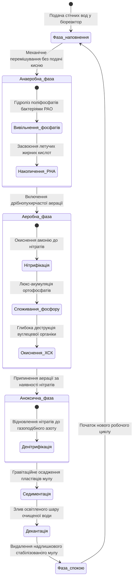
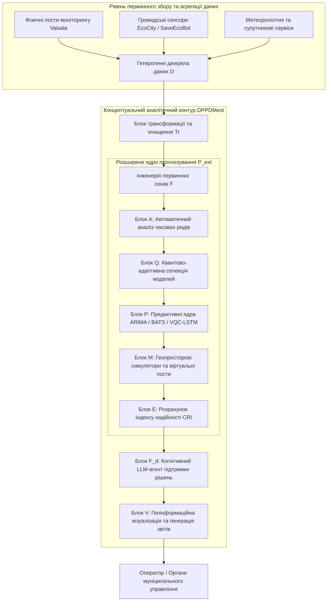
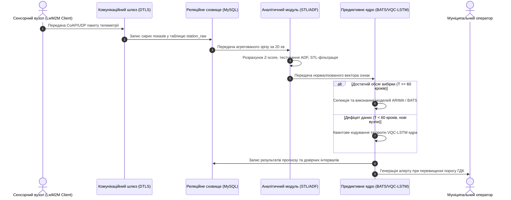
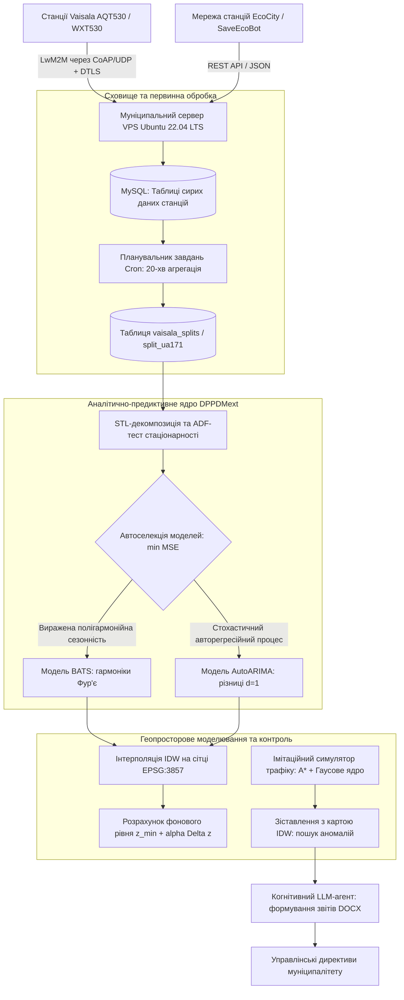

# Тема 8. Математичне моделювання динаміки екологічних систем та інтелектуальний аналіз техногенного навантаження урбоекосистем

## Мета лекції
Метою лекції є формування у магістрантів комплексної системи фундаментальних знань і практичних компетентностей щодо математичного моделювання процесів масопереносу, біотичних взаємодій та оцінки асиміляційного потенціалу екосистем у поєднанні з сучасними методами комп'ютерного предиктивного моделювання часових рядів і геопросторового аналізу на базі концептуальної моделі DPPDMext, що забезпечує перехід від ретроспективної фіксації забруднення довкілля до прескриптивного інтелектуального управління екологічною безпекою промислових агломерацій відповідно до нормативів Директиви ЄС 2024/2881 та національного природоохоронного законодавства.

## Очікувані результати навчання
1. **Знання та розуміння.** Здобувачі опанують фундаментальні математичні моделі динаміки екосистем під техногенним навантаженням, включаючи кінетику біодеградації Моно, моделі кисневого балансу Стрітера-Фелпса, класичні статистичні моделі ARIMA й BATS, математичний апарат просторової інтерполяції IDW та архітектуру концептуальної парадигми DPPDMext для обробки екологічних даних.
2. **Застосування.** Магістранти набудуть практичних умінь використовувати алгоритми часової декомпозиції, інтегрувати класичні й квантово-гібридні обчислювальні ядра для апроксимації динаміки екологічних параметрів, проєктувати структуру реляційних баз даних для збереження спостережень зі станцій моніторингу та моделювати локальне розсіювання викидів автотранспорту за допомогою алгоритму A* і Гаусового ядра.
3. **Аналіз.** Студенти зможуть здійснювати комплексний аналіз багатовимірних часових рядів забруднюючих речовин, виявляти кореляційні залежності між атмосферними маркерами, розпізнавати ефекти нестаціонарності та сезонності на обмежених вибірках, а також диференціювати природні циклічні флуктуації від техногенних аномалій і локальних екологічних загроз.
4. **Оцінювання та синтез.** Слухачі навчаться критично оцінювати прогностичну точність і надійність моделей за метриками MSE, MAE, R² та інформаційними критеріями, визначати просторові пріоритети для розміщення нових пунктів спостереження з урахуванням виявлених фонових рівнів, а також формувати синтетичні експертні висновки за допомогою когнітивних агентів на базі мультимодальних моделей штучного інтелекту.

---

## Детальний покроковий план лекції

### 1. Теоретико-концептуальний базис. Математичні засади стійкості екосистем та концептуальна модель DPPDMext
* 1.1. Математичне моделювання біотичних взаємодій і процесів самоочищення в умовах техногенного стресу на основі модифікованих систем Лотки-Вольтерра, моделі Стрітера-Фелпса та кінетики Моно в циклічних біореакторах SBR.
* 1.2. Оцінка екологічної ємності територій, асиміляційного потенціалу геосистем та балансові рівняння гранично допустимого антропогенного навантаження на урбанізовані ландшафти.
* 1.3. Формалізація процесів підготовки та обробки екологічних даних для прийняття рішень через кортежні моделі предметної області та розширену парадигму DPPDMext.
* 1.4. Архітектура розподілених муніципальних систем екологічного контролю, реляційні моделі баз даних спостережень та захищене агрегування телеметрії через енергоефективний протокол LwM2M.

### 2. Методологія та аналіз граничних умов. Алгоритми предиктивного моделювання, просторової інтерполяції та системні обмеження
* 2.1. Статистичний апарат попереднього аналізу часових рядів екологічних параметрів на основі автокореляційних функцій, тесту Дікі-Фуллера та STL-декомпозиції тренду й сезонності.
* 2.2. Предиктивне моделювання концентрацій полютантів з використанням алгоритмів ARIMA, BATS та механізму автоматичної селекції моделей за критеріями точності.
* 2.3. Математичний апарат варіаційних квантових схем та гібридних моделей VQC-LSTM для подолання проблеми дефіциту даних на нових вузлах моніторингу.
* 2.4. Критичні бар'єри та граничні обмеження класичних і квантових моделей, обумовлені шумом первинних сенсорів, виникненням плато безвиході у варіаційних квантових ландшафтах та дефіцитом ретроспективних рядів спостережень.
* 2.5. Просторова інтерполяція полів забруднення методом зворотно зважених відстаней IDW та імітаційне моделювання розсіювання викидів мобільних джерел за допомогою алгоритму A* і Гаусової згортки.

### 3. Практичний індустріальний / фаховий кейс. Інтелектуальний предиктивний моніторинг якості атмосферного повітря промислової агломерації
**Тема наскрізної задачі.** «Побудова замкненої системи інтелектуального моніторингу та адаптивного прогнозування викидів пилу, діоксиду азоту й формальдегіду для Кременчуцького промислового вузла на базі станцій Vaisala, моделей BATS/ARIMA та автономного когнітивного агента оцінки ризиків»

## 1. Теоретико-концептуальний базис. Математичні засади стійкості екосистем та концептуальна модель DPPDMext

### 1.1. Математичне моделювання біотичних взаємодій і процесів самоочищення в умовах техногенного стресу

Дослідження динамічної стійкості природних та урбанізованих екосистем вимагає застосування суворого математичного апарату, здатного формалізувати нелінійні процеси біотичного обміну, міжвидової конкуренції та деградації трофічних зв'язків під впливом антропогенного навантаження. Природні біоценози та штучні біотехнологічні комплекси очищення довкілля функціонують як відкриті динамічні системи, стан яких визначається балансом між внутрішніми автокаталітичними процесами самовідновлення та зовнішнім дестабілізуючим впливом ксенобіотиків. Теоретичним підґрунтям аналізу популяційної динаміки в умовах токсикологічного пресингу є модифікована система диференціальних рівнянь типу **Лотки-Вольтерра**, доповнена нелінійними функціями токсичного пригнічення життєдіяльності та обмеженням ємності екологічної ніші:

$$\begin{cases} \displaystyle \frac{dx}{dt} = \alpha x \left( 1 - \frac{x}{K_x} \right) - \beta x y - \delta_x(T_e) \cdot x, \\[10pt] \displaystyle \frac{dy}{dt} = \gamma \beta x y - m y - \delta_y(T_e) \cdot y, \end{cases}$$

де $x(t)$ позначає щільність популяції жертви або концентрацію органічного субстрату в середовищі у часовий момент $t$, виражену в міліграмах на літр ($\text{mg/L}$); $y(t)$ відповідає біомасі популяції хижака або активного мікробіоценозу деструкторів у міліграмах на літр ($\text{mg/L}$); параметр $\alpha$ відображає питому швидкість природного приросту популяції жертви за відсутності хижацтва, вимірювану в зворотних добах ($\text{day}^{-1}$); $K_x$ визначає граничну ємність екологічної ніші за первинними трофічними ресурсами; $\beta$ є коефіцієнтом питомої взаємодії між популяціями, що характеризує інтенсивність трофічного поглинання в літрах на міліграм-добу ($\text{L/(mg}\cdot\text{day)}$); величина $\gamma$ являє собою безрозмірний коефіцієнт біоконверсії спожитого субстрату в біомасу консумента; $m$ відображає питому природну смертність популяції хижака в зворотних добах ($\text{day}^{-1}$); функції $\delta_x(T_e)$ та $\delta_y(T_e)$ описують додаткову елімінацію особин унаслідок впливу концентрації токсиканта $T_e$.

Для аналітичного опису функцій токсикодинамічного відгуку $\delta_i(T_e)$ застосовують сигмоїдальні залежності **Хілла**, що враховують нелінійний кооперативний ефект пригнічення ферментативних систем біоценозу:

$$\delta_i(T_e) = \delta_{i,\max} \cdot \frac{T_e^n}{\text{EC}_{50,i}^n + T_e^n},$$

де величина $\delta_{i,\max}$ задає граничну швидкість токсичної загибелі $i$-го біологічного виду в зворотних добах ($\text{day}^{-1}$); змінна $\text{EC}_{50,i}$ відповідає напівмаксимальній ефективній концентрації токсиканта в середовищі ($\text{mg/L}$), за якої спостерігається пригнічення половини популяції; показник степеня $n$ відображає коефіцієнт кооперативності взаємодії токсиканта з біомішенями.

Аналіз стійкості стаціонарних станів $(\bar{x}, \bar{y})$ динамічної системи здійснюється за **методом першого наближення Ляпунова**. Для цього формується матриця **Якобі** $J$:

$$J(\bar{x}, \bar{y}) = \begin{bmatrix} \displaystyle \frac{\partial f_1}{\partial x} & \displaystyle \frac{\partial f_1}{\partial y} \\[10pt] \displaystyle \frac{\partial f_2}{\partial x} & \displaystyle \frac{\partial f_2}{\partial y} \end{bmatrix}_{(\bar{x}, \bar{y})},$$

власні значення якої $\lambda$ визначаються з характеристичного рівняння $\det(J - \lambda I) = \lambda^2 - \text{Sp}(J)\lambda + \det(J) = 0$. У разі зміщення дійсних частин власних значень $\text{Re}(\lambda)$ у додатну площину система втрачає асимптотичну стійкість через біфуркацію **Андронова-Хопфа**, генеруючи квазіперіодичні коливання високої амплітуди або колапсуючи в стан нульової біопродуктивності, що є класичним маркером руйнування екосистеми під дією гострого хімічного стресу.

У задачах біоремедіації водних об'єктів фундаментальною є класична кінетична модель **Стрітера-Фелпса**, яка описує зв'язок між біохімічним окисненням домішок і динамікою дефіциту розчиненого кисню:

$$\begin{cases} \displaystyle \frac{dL}{dt} = -k_1 L, \\[10pt] \displaystyle \frac{dD}{dt} = k_1 L - k_2 D, \end{cases}$$

де величина $L(t)$ відповідає залишковій концентрації біохімічного споживання кисню ($\text{БСК}$) у момент $t$ ($\text{mg }\text{O}_2\text{/L}$); $D(t) = C_s - C_{\text{DO}}(t)$ визначає кисневий дефіцит відносно стану насичення $C_s$ за поточної температури ($\text{mg/L}$); параметри $k_1$ та $k_2$ позначають константи швидкості дезоксигенації та реаерації водної поверхні відповідно ($\text{day}^{-1}$). 

Для висококонцентрованих стічних вод промислових об'єктів, де природна реаерація виявляється недостатньою, застосовують біотехнологічні споруди періодичної дії — послідовно-циклічні реактори (**Sequencing Batch Reactors, SBR**). Моделювання біохімічної трансформації в таких реакторах описується кінетикою **Моно** з подвійним субстратним лімітуванням:

$$\mu(S, S_O) = \mu_{\max} \cdot \frac{S}{K_S + S} \cdot \frac{S_O}{K_O + S_O} \cdot \prod_{j} \frac{K_{I,j}}{K_{I,j} + I_j},$$

де параметр $\mu_{\max}$ визначає теоретичний максимум питомої швидкості росту активного мулу ($\text{day}^{-1}$); $S$ та $S_O$ позначають концентрації органічного субстрату та розчиненого кисню ($\text{mg/L}$); $K_S$ та $K_O$ виступають константами спорідненості бактеріальної культури до субстрату й кисню; $K_{I,j}$ задають константи інгібування специфічними токсичними компонентами $I_j$. 

Динаміка біомаси $X(t)$ та субстрату $S(t)$ у періодичному SBR-реакторі формалізується балансовою системою диференціальних рівнянь:

$$\begin{cases} \displaystyle \frac{dX}{dt} = (\mu - k_d) X, \\[10pt] \displaystyle \frac{dS}{dt} = -\frac{1}{Y_{X/S}} \mu X - k_m X, \end{cases}$$

де коефіцієнт $k_d$ описує швидкість ендогенного дихання та лізису мікробної біомаси ($\text{day}^{-1}$); величина $Y_{X/S}$ відображає стехіометричний вихід біомаси на одиницю утилізованого субстрату; параметр $k_m$ визначає коефіцієнт підтримувального метаболізму клітин. Функціонування SBR-реактора складається з послідовності дискретних технологічних фаз, що забезпечують перебіг процесів нітрифікації, денітрифікації та глибокої біологічної дефосфотації.

### 1.2. Оцінка екологічної ємності територій та асиміляційного потенціалу геосистем

Концептуальна модель стійкості урбанізованих та природних ландшафтів базується на визначенні **екологічної ємності території** (Ecological Carrying Capacity) та **асиміляційного потенціалу геосистеми**. Під асиміляційним потенціалом розуміють граничну здатність природного комплексу знешкоджувати, сорбувати, розсіювати та трансформувати техногенні полютанти без переходу компонентів довкілля у стан незворотної дигресії.

Математична інтерпретація накопичення ксенобіотиків в елементарному об'ємі геосистеми спирається на диференціальне рівняння матеріального балансу:

$$\frac{dC_{\text{env}}}{dt} = \frac{Q_{\text{emission}}(t)}{V_{\text{env}}} - K_{\text{assim}}(T, \text{pH}, \text{bio}) \cdot C_{\text{env}} - \frac{Q_{\text{export}}(t)}{V_{\text{env}}},$$

де змінна $C_{\text{env}}$ позначає просторово усереднену концентрацію забруднюючої речовини в межах геосистеми ($\text{mg/m}^3$ для атмосфери або $\text{mg/L}$ для гідросфери); параметр $Q_{\text{emission}}(t)$ являє собою сумарний масовий потік антропогенної емісії токсикантів за одиницю часу ($\text{mg/day}$); $V_{\text{env}}$ позначає об'єм змішування досліджуваного геопросторового резервуара ($\text{m}^3$); коефіцієнт $K_{\text{assim}}$ є інтегральною кінетичною константою біогеохімічної асиміляції ($\text{day}^{-1}$), яка залежить від температури середовища $T$, кислотно-основного балансу $\text{pH}$ та біологічної активності редуцентів $\text{bio}$; величина $Q_{\text{export}}(t)$ описує масову швидкість транскордонного або адвективного виносу домішки за межі геосистеми ($\text{mg/day}$).

У квазістаціонарному стані рівноваги ($\frac{dC_{\text{env}}}{dt} = 0$) розраховується гранично допустиме навантаження на середовище $Q_{\text{critical}}$, за якого концентрація токсиканта не перевищує нормативу **гранично допустимої концентрації** ($\text{MPC}$):

$$Q_{\text{critical}} = V_{\text{env}} \cdot K_{\text{assim}} \cdot \text{MPC} + Q_{\text{export}}.$$

Якщо фактичний масовий потік перевищує значення $Q_{\text{critical}}$, виникає прогресуюча біоакумуляція токсикантів і деградація самовідновлювальної здатності геосистеми. Для багатокритеріальної оцінки території розраховують інтегральний показник екологічного резерву $ECC_{\text{total}}$ по просторовій області $\Omega$:

$$ECC_{\text{total}} = \iint_{\Omega} \Psi(x,y) \cdot \left[ C_{\text{crit}}(x,y) - C_{\text{fact}}(x,y,t) \right] \, dx\,dy,$$

де ваговий коефіцієнт $\Psi(x,y)$ відображає просторову вразливість ландшафту, набуваючи максимальних значень для рекреаційних зон, лісопаркових смуг і житлових масивів; $C_{\text{crit}}(x,y)$ задає локальний нормативний поріг стійкості; $C_{\text{fact}}(x,y,t)$ відповідає просторовому полю фактичних концентрацій домішок.

> **ПРАКТИЧНИЙ ЯКІР:** При аналізі промислових викидів діоксиду сірки та сполук важких металів у зоні впливу підприємств гірничо-металургійного комплексу розрахунок асиміляційного потенціалу дозволяє обґрунтувати граничні ліміти залпових емісій, виходячи з поточного об'єму шару перемішування атмосфери над прилеглими міськими агломераціями.

### 1.3. Формалізація процесів підготовки та обробки екологічних даних через кортежні моделі та парадигму DPPDMext

У сучасних інформаційних системах екологічного моніторингу інтеграція гетерогенних потоків даних від автоматичних вимірювальних станцій, лабораторних постів та супутникових систем вимагає переходу від неструктурованих сховищ до строгих теоретико-множинних моделей. Концептуальна модель екологічної системи, яка перебуває під постійним моніторингом, описується кортежем:

$$T_1 = \langle ES, I, P, R, CM \rangle,$$

де елемент $ES$ позначає фізичний об'єкт моніторингу, такий як повітряний басейн міста, річковий басейн або індустріальна зона; $I$ являє собою скінченну множину вимірюваних параметрів середовища, до якої належать концентрації домішок, температура, вологість та атмосферний тиск; $P$ визначає множину динамічних фізико-хімічних процесів, що відбуваються в системі; $R$ задає матрицю взаємозв'язків і кореляцій між параметрами та процесами; $CM$ формує концептуальну схему функціонування системи у вигляді онтології або семантичної мережі. 

Одиничний запис екологічного спостереження formalize через кортежний запис:

$$M = \langle O, C, M_m, T, L, S_a, I_r, U \rangle,$$

де компонент $O$ визначає об'єкт спостереження; $C$ характеризує фізико-хімічні параметри об'єкта; $M_m$ фіксує метод та метрологічний інструмент вимірювання; $T$ відповідає часовій мітці фіксації даних; $L$ містить координати точки спостереження; $S_a$ визначає застосовані методи первинного статистичного аналізу; $I_r$ фіксує інтерпретацію отриманих результатів на відповідність нормативам; $U$ визначає директиву або управлінське рішення, згенероване на основі оцінки.

Для забезпечення замкненого циклу інтелектуальної обробки даних використовується базова модель підготовки інформації для прийняття рішень (**Data Preparation and Processing for Decision Making, DPPDM**), що задається кортежем:

$$\text{DPPDM} = \langle D, T_r, P, F, V \rangle,$$

де $D$ являє собою набір первинних екологічних даних; $T_r$ визначає операції попередньої трансформації, нормалізації та імпутації пропусків; $P$ позначає блок прогнозного моделювання часових рядів; $F$ відповідає за генерацію ознакового простору (Feature Engineering); $V$ забезпечує просторову та графічну візуалізацію результатів. 

З метою усунення проблеми розрідженості даних та інтеграції когнітивного аналізу модель DPPDM розширюється до парадигми **DPPDMext**, у якій предиктивний блок набуває композиційної структури:

$$P_{\text{ext}} = \langle A, P, Q, M_v, E \rangle,$$

$$\text{DPPDM}_{\text{ext}} = \langle D, T_r, F, (A, P, Q, M_v, E), F_d, V \rangle,$$

де оператор $A$ реалізує автоматичний інтелектуальний аналіз сирих рядів для визначення тренду, стаціонарності та сезонності; $Q$ забезпечує автоматичну селекцію оптимальної прогнозної моделі або застосування методів квантового машинного навчання; $M_v$ реалізує генерацію віртуальних вимірювальних постів за допомогою геопросторової інтерполяції та симуляції; $E$ виконує експертну оцінку якості прогнозів; $F_d$ відповідає за підтримку прийняття рішень на основі автономних великих мовних моделей (**Large Language Models, LLM**).

Інтеграція гетерогенних джерел даних $\mathcal{D} = \{d_1, d_2, \dots, d_n\}$ у єдине сховище $\mathcal{S}$ здійснюється через відображення $I_d: \mathcal{D} \to \mathcal{S}$. Метрологічна валідність інтегрованого масиву оцінюється через формальні показники повноти ($\text{Comp}$) та достовірності ($\text{Rel}$):

$$\text{Comp} = \frac{N_{\text{filled}}}{N_{\text{expected}}}, \quad \text{Rel} = 1 - \frac{N_{\text{err}}}{N_{\text{total}}},$$

де $N_{\text{filled}}$ визначає кількість фактично заповнених вимірів; $N_{\text{expected}}$ відображає очікувану кількість вимірів за штатним графіком опитування; $N_{\text{err}}$ позначає кількість аномальних, пошкоджених або недостовірних значень; $N_{\text{total}}$ є загальною кількістю зареєстрованих точок даних.

> **ПРАКТИЧНИЙ ЯКІР:** У муніципальній системі моніторингу міста Кременчук використання парадигми DPPDMext дозволило об'єднати дані станцій високої точності Vaisala AQT420 та індикативної мережі датчиків EcoCity в єдину аналітичну модель, що забезпечило безперервний розрахунок індексу якості повітря навіть за умови аварійного відключення окремих сенсорів.

> **ТИПОВА ПОМИЛКА:** Ототожнення простої статистичної кореляції між двома концентраціями полютантів із прямим причинно-наслідковим зв'язком. Високий коефіцієнт кореляції Пірсона між оксидом вуглецю та діоксидом азоту в міському повітрі зазвичай свідчить про наявність спільного джерела емісії, такого як автотранспортний трафік на магістралях, а не про перетворення однієї хімічної речовини на іншу.

### 1.4. Архітектура розподілених муніципальних систем та захищене агрегування телеметрії через протокол LwM2M

Побудова муніципальних комплексів моніторингу передбачає розгортання розподіленої трирівневої архітектури, що охоплює сенсорний периферійний шар, рівень комунікаційних шлюзів та централізований аналітичний сервер. На сенсорному рівні застосовують мікроконтролерні вузли, функціонал яких включає вимірювання фізичних параметрів та первинне кодування сигналів. Проте периферійні мікроконтролери належать до класу пристроїв із суворими апаратними обмеженнями: обсяг оперативної пам'яті зазвичай не перевищує 50 кілобайт, обчислювальна частота лімітована, а електроживлення здійснюється від акумуляторних батарей або сонячних панелей.

За таких умов використання класичного стека передачі даних на основі протоколів HTTP та TCP стає технічно неможливим через надмірний обсяг службових заголовків, складність встановлення з'єднань і швидке вичерпання енергетичного ресурсу автономних вузлів. Стандартний протокол MQTT, хоч і розроблений для інтернету речей, функціонує поверх TCP і вимагає постійного утримання сесії, споживаючи від 12 до 18 відсотків оперативної пам'яті бюджетного мікроконтролера. 

Оптимальним вирішенням цієї проблеми є використання відкритого протоколу **Lightweight M2M (LwM2M)**, розробленого консорціумом Open Mobile Alliance. Архітектура LwM2M функціонує поверх легковагового транспортного стека **CoAP (Constrained Application Protocol)** та протоколу датаграм **UDP**, що дозволяє мінімізувати службовий трафік за рахунок застосування компактного бінарного формату даних. Імплементація клієнтської частини LwM2M на базі вбудованих бібліотек, таких як Wakaama або операційна система Zephyr OS, вимагає лише від 6 до 9 відсотків доступної оперативної пам'яті мікроконтролера. Безпека передачі даних у LwM2M забезпечується криптографічним протоколом **DTLS (Datagram Transport Layer Security)**, що реалізує взаємну автентифікацію вузлів на основі попередньо узгоджених ключів (Pre-Shared Key, PSK) або цифрових сертифікатів стандарту X.509 без перевантаження процесора.

Для довготривалого збереження та аналітичної обробки екологічних часових рядів на серверному рівні реалізується реляційна база даних під керуванням **MySQL** або **PostgreSQL**. База даних забезпечує зберігання як сирих щохвилинних спостережень, так і агрегованих показників за нормативними часовими інтервалами у 20 хвилин, одну добу, місяць та рік, що вимагається положеннями постанови Кабінету Міністрів України № 827.

| Рівень або компонент системи | Використовувані протоколи та технології | Основні функції та задачі компонента | Метрологічні та ресурсні обмеження | Приклад з реальної практики |
| :--- | :--- | :--- | :--- | :--- |
| **Периферійний вимірювальний вузол** | Сенсори AQT530, WXT530, ESP32, Zephyr OS, CoAP/UDP | Безпосереднє вимірювання концентрацій газів, пилу та метеопараметрів | Обмеження RAM (до 50 Кб), автономне батарейне живлення | Автоматичні мікростанції контролю повітря на базі ESP32 |
| **Канал передачі телеметрії** | Стандарт LwM2M, протокол безпеки DTLS, мережі LTE Cat-M / LoRaWAN | Захищена доставка метрик від сенсора до сервера без втрати пакетів | Обмежена пропускна здатність радіоканалу, ризик глушіння сигналу | Передача даних станцій Vaisala через стільниковий шлюз Beacon Edge |
| **Серверне сховище даних** | СКБД MySQL / PostgreSQL, веб-фреймворк Laravel, черги повідомлень | Агрегація сирих рядів у 20-хвилинні зрізи, валідація, індексація | Високі вимоги до простору на SSD-накопичувачах за щохвилинного логування | Централізована база даних муніципального підприємства КП «НДЦ» |
| **Аналітичне предиктивне ядро** | Моделі ARIMA, BATS, квантові схеми VQC, бібліотеки sktime та PennyLane | Короткостроковий та середньостроковий прогноз динаміки забруднення | Висока чутливість до пропусків і нестаціонарності часових рядів | Автоматизована система прогнозування перевищень ГДК полютантів |
| **Когнітивний інтерфейс підтримки рішень** | Великі мовні моделі (LLM), архітектура RAG, бібліотека PHPWord | Генерація текстових бюлетенів, протоколів перевищень та порад населенню | Ризик семантичних галюцинацій моделей за відсутності контексту RAG | Автоматичне формування звітів відповідно до Постанови КМУ № 827 |

> **КОНТРОЛЬНЕ ПИТАННЯ:** Чому використання протоколу LwM2M поверх CoAP/UDP є енергетично та алгоритмічно виправданішим для розподілених станцій моніторингу міського середовища порівняно з протоколом MQTT поверх TCP?

Розгорнути аналіз / відповідь

**Правильний варіант: Зменшення системних накладних витрат транспортного рівня та оптимізація енергоспоживання вузлів.**

1. Протокол MQTT базується на транспортному рівні TCP, що вимагає обов'язкової процедури тристороннього рукостискання (three-way handshake) для кожного з'єднання та постійної підтримки активної сесії за допомогою сигналів keep-alive. У мобільних і автономних сенсорних мережах з частими періодами сну це призводить до значних непродуктивних витрат енергії акумулятора та постійного вичерпання обмеженої пам'яті мікроконтролера. На відміну від нього, LwM2M використовує легковаговий CoAP поверх UDP, що дозволяє передавати дані короткими незалежними датаграмами без утримання з'єднання. Крім того, LwM2M має вбудовану об'єктну модель даних OMA та механізм бінарного кодування, завдяки чому обсяг клієнтської бібліотеки LwM2M займає лише 6–9% оперативної пам'яті пристрою порівняно з 12–18% для MQTT.

2. Аналіз дистракторів:
   * Твердження про те, що MQTT забезпечує вищий рівень шифрування, є хибним, оскільки протокол DTLS у зв'язці з LwM2M використовує ті самі криптографічні стандарти (AES, RSA, ECC), що й TLS для MQTT, але реалізує їх для датаграмних повідомлень.
   * Твердження про неможливість двостороннього зв'язку в UDP є помилковим, оскільки протокол CoAP реалізує власні механізми підтвердження доставки пакетів (Confirmable messages) та механізм підписки Observe безпосередньо на прикладному рівні.

---

### Вказівки для самостійного осмислення

1. Здійснити аналітичний розрахунок критичного навантаження $Q_{\text{critical}}$ для атмосферного басейну заданого промислового району за умов стаціонарної інверсії температури, використовуючи відомі параметри об'єму шару змішування та емпіричний коефіцієнт самоочищення повітря від діоксиду сірки.
2. Побудувати схему інформаційної взаємодії між таблицями реляційної бази даних муніципального моніторингу для забезпечення автоматичного перерахунку щохвилинних значень сенсорів пилу PM2.5 у середньодобові показники з контролем повноти даних понад сімдесят п'ять відсотків.
3. Проаналізувати математичну поведінку системи диференціальних рівнянь Моно в періодичному біореакторі SBR та визначити тривалість аеробної фази, необхідну для зниження концентрації біохімічного споживання кисню з вихідного рівня $1400\text{ mg/L}$ до нормативного скидного значення $15\text{ mg/L}$.

## 2. Методологія та аналіз граничних умов. Алгоритми предиктивного моделювання, просторової інтерполяції та системні обмеження

### 2.1. Статистичний апарат попереднього аналізу часових рядів екологічних параметрів

Методологія побудови надійних систем предиктивного моніторингу спирається на первинний розвідувальний аналіз динамічних властивостей спостережуваних процесів, оскільки застосування складних математичних моделей без урахування внутрішньої структури часового ряду призводить до критичних похибок екстраполяції. Для первинної обробки емпіричних вибірок екологічних показників, отриманих із дискретністю в один місяць протягом тривалого періоду спостережень, формується вектор часового ряду $X = \{X_t\}_{t=1}^T$, де $T$ позначає загальну кількість зафіксованих спостережень. Очищення первинних даних від випадкових викидів, зумовлених апаратними збоями вимірювальних трактів, реалізується за допомогою фільтрації на основі ковзного $Z$-індексу, де точки із відхиленням $|Z| > 3\sigma$ заміщуються локальною медіаною, а короткі пропуски тривалістю менше шести годин відновлюються лінійною інтерполяцією.

Для перевірки гіпотези про інваріантність імовірнісних характеристик ряду в часі застосовується розширений тест **Дікі-Фуллера** (Augmented Dickey–Fuller, ADF), який оцінює наявність одиничного кореня в авторегресійній моделі зі зсувом і детермінованим трендом:

$$\Delta X_t = \alpha + \beta t + \gamma X_{t-1} + \sum_{s=1}^p \delta_s \Delta X_{t-s} + \varepsilon_t,$$

де $\Delta X_t = X_t - X_{t-1}$ є першою різницею часового ряду; $\alpha$ визначає константу зсуву; $\beta t$ описує лінійний детермінований тренд; $\gamma$ позначає коефіцієнт при лаговій змінній; $\delta_s$ відповідають коефіцієнтам авторегресії різниць вищих порядків $p$; $\varepsilon_t$ являє собою білий шум. Статистична гіпотеза про стаціонарність приймається виключно за умови отримання емпіричного значення $p\text{-value} < 0.05$, що вказує на відсутність одиничного кореня ($\gamma < 0$). У випадку, коли ряд демонструє виражену нестаціонарність, що є типовим для накопичення оксидів азоту чи монооксиду вуглецю в урбанізованих зонах, вимагається обов'язкове застосування оператора диференціювання порядку $d$.

Структурна декомпозиція екологічного сигналу виконується за алгоритмом **STL** (Seasonal-Trend decomposition using Loess), який розділяє вихідну функцію на ортогональні адитивні складові:

$$X_t = T_t + S_t + R_t,$$

де $T_t$ описує низькочастотний довгостроковий тренд зміни екологічного фону; $S_t$ виділяє квазіперіодичну сезонну компоненту з лагом $s = 12$; $R_t$ акумулює нерегулярні стохастичні коливання та невраховані шуми спостереження. Виявлення латентних періодичностей у випадковій складовій спирається на спільне використання вибіркової автокореляційної функції $\text{ACF}(k)$ для лагу $k$:

$$\text{ACF}(k) = \frac{\sum_{t=1}^{T-k} (X_t - \mu)(X_{t+k} - \mu)}{\sum_{t=1}^T (X_t - \mu)^2},$$

де $\mu$ позначає математичне сподівання ряду, та швидкого перетворення **Фур'є** (FFT), що дозволяє виявити домінантні гармонічні частоти антропогенних емісій і трансформувати вихідні ознаки у частотний простір.

### 2.2. Предиктивне моделювання концентрацій полютантів алгоритмами ARIMA та BATS

Побудова математичних прогнозів концентрацій домішок в атмосферному повітрі реалізується через поєднання лінійної авторегресійної методології **Бокса-Дженкінса** та експоненційного згладжування у просторі станів із тригонометричною сезонністю. Класична інтегрована модель авторегресії — ковзного середнього **ARIMA**($p, d, q$) формалізується через оператор послідовного запізнення $L$, що задовольняє умову $L^k X_t = X_{t-k}$:

$$\left(1 - \sum_{i=1}^p \phi_i L^i\right) (1 - L)^d X_t = c + \left(1 + \sum_{j=1}^q \theta_j L^j\right) \varepsilon_t,$$

де параметри $\phi_i$ визначають вагові коефіцієнти авторегресійного блоку порядку $p$; $\theta_j$ позначають коефіцієнти рухомого середнього порядку $q$; $d$ задає порядок інтегрування, необхідний для приведення часового ряду до стаціонарного вигляду; $c$ є константою тренду; $\varepsilon_t \sim \mathcal{N}(0, \sigma^2)$ позначає послідовність незалежних нормально розподілених випадкових помилок.

Для часових рядів, обтяжених складною полігармонійною сезонністю та нелінійним дрейфом дисперсії, застосовується модель **BATS** (Box-Cox transformation, ARMA errors, Trend, and Seasonal components). Структура базового рівня прогнозу за схемою BATS спирається на перетворення Бокса-Кокса над вектором відгуку та декомпозицію стану:

$$\hat{y}_t^{(\lambda)} = l_{t-1} + \phi b_{t-1} + \sum_{k=1}^K s_{t-m_k}^{(k)} + \sum_{i=1}^p \alpha_i d_{t-i} + \sum_{j=1}^q \beta_j \varepsilon_{t-j},$$

де $\lambda$ визначає параметр перетворення Бокса-Кокса для стабілізації гетероскедастичності; $l_{t-1}$ позначає локальний рівень ряду; $b_{t-1}$ описує довгостроковий тренд із коефіцієнтом демпфування $\phi$; $s_{t-m_k}^{(k)}$ задає $k$-ту сезонну компоненту з відповідним періодом $m_k$; $d_t$ та $\varepsilon_t$ описують динаміку авторегресійних залишків.

Автоматизована селекція між моделями ARIMA та BATS усередині контуру обробки здійснюється за принципом мінімізації інформаційного критерію **Акаіке** (Akaike Information Criterion, AIC) з наступною перевіркою точності на тестовому сегменті за середньоквадратичною похибкою ($\text{MSE}$):

$$\text{AIC} = 2k - 2\ln(\hat{L}), \quad \text{MSE} = \frac{1}{H} \sum_{h=1}^H \left(y_{T+h} - \hat{y}_{T+h}\right)^2,$$

де $k$ відповідає кількості оцінюваних параметрів моделі; $\hat{L}$ є максимізованим значенням функції правдоподібності; $H$ визначає горизонт прогнозування, що становить від п'яти до двадцяти чотирьох місяців. Якщо часовий ряд містить виражені щорічні температурні або вологісні флуктуації, BATS забезпечує кращу апроксимацію, тоді як для інертних полютантів із переважанням локального стохастичного тренду перевагу демонструє конфігурація AutoARIMA.

### 2.3. Математичний апарат варіаційних квантових схем та гібридних моделей VQC-LSTM

В умовах дефіциту ретроспективних рядів спостережень на нових постах моніторингу класичні глибинні нейромережі зазнають перенавчання через явище «прокляття розмірності». Для подолання цього бар'єра розроблено квантово-гібридну парадигму, де класичні рекурентні шари поєднуються з **варіаційними квантовими схемами** (Variational Quantum Circuits, VQC), що виступають високоекспресивними параметризованими ядрами в гільбертовому просторі станів.

Формалізація процесу гібридного прогнозування у часовому вимірі задається послідовністю аналітичних кроків:

$$
\begin{aligned}
\text{Крок 1 (Лагова екстракція):} & \quad \mathbf{x}_t = [y_{t-\text{lag}}, y_{t-\text{lag}+1}, \dots, y_{t-1}]^T \in \mathbb{R}^{\text{lag}}, \\
\text{Крок 2 (Квантове вбудовування):} & \quad |\psi(\mathbf{x}_t)\rangle = \bigotimes_{j=1}^{n_{\text{qubits}}} R_X(x_{t,j}) |0\rangle^{\otimes n_{\text{qubits}}}, \quad R_X(\phi) = \exp\left(-i\frac{\phi}{2}\sigma_x\right), \\
\text{Крок 3 (Варіаційна еволюція):} & \quad |\Phi(\mathbf{x}_t, \boldsymbol{\theta})\rangle = \prod_{l=1}^L \left( U_{\text{ent}} \cdot \bigotimes_{j=1}^{n_{\text{qubits}}} R_Y(\theta_{l,j}) \right) |\psi(\mathbf{x}_t)\rangle, \\
\text{Крок 4 (Квантове вимірювання):} & \quad \langle Z_j \rangle = \langle \Phi(\mathbf{x}_t, \boldsymbol{\theta}) | \sigma_z^{(j)} | \Phi(\mathbf{x}_t, \boldsymbol{\theta}) \rangle = \text{Tr}\left(\rho(\mathbf{x}_t, \boldsymbol{\theta}) \sigma_z^{(j)}\right), \\
\text{Крок 5 (Гібридна агрегація):} & \quad \hat{y}_t = \mathbf{W}_{\text{out}} \left( \frac{1}{n_{\text{qubits}}} \sum_{j=1}^{n_{\text{qubits}}} \langle Z_j \rangle \right) + \mathbf{b}_{\text{out}},
\end{aligned}
$$

де вектор $\mathbf{x}_t$ формується з нормалізованих за шкалою $[0, 1]$ значень ретроспективних часових точок; оператор $R_X(\phi)$ здійснює кутове кодування дійсних чисел у кубітові стани через обертання навколо осі $X$ на кут $\phi \in [0, \pi]$; матриця $U_{\text{ent}}$ позначає унітарне перетворення переплутування за допомогою послідовності двоелементних логічних вентилів $\text{CNOT}$; вектор $\boldsymbol{\theta}$ містить варіаційні параметри квантових поворотів $R_Y$, що підлягають оптимізації; $\sigma_z^{(j)}$ є матрицею Паулі для $j$-го кубіта; $\mathbf{W}_{\text{out}}$ та $\mathbf{b}_{\text{out}}$ визначають вагові коефіцієнти вихідного класичного повнозв'язного шару.

Квантове машинне навчання забезпечує значну перевагу на вибірках малої тривалості (до 35 часових кроків), оскільки квантова схема відображає вхідні вектори у простір вищої розмірності $2^{n_{\text{qubits}}}$, де нелінійні розділові поверхні стають лінійно розв'язними. Крім того, топологія обмеженої кількості кубітів ($n_{\text{qubits}} \in [2, 6]$) діє як жорстке інформаційне горло (information bottleneck), що здійснює неявну регуляризацію моделі та запобігає запам'ятовуванню високочастотного стохастичного шуму.

Взаємодія між фізичним рівнем датчиків, шлюзом збору, алгоритмами прогнозування та оператором у реальному часі формалізується діаграмою послідовності.

### 2.4. Граничні умови та критичні обмеження класичних і квантових моделей

Незважаючи на високу теоретичну ефективність розроблених методів, у реальних умовах промислової експлуатації виникають специфічні фізичні, технічні та алгоритмічні обмеження, за яких математичні моделі повністю втрачають адекватність або демонструють критичне зростання похибки.

Першим критичним бар'єром квантових варіаційних схем виступає явище **«плато безвиході»** (Barren Plateaus). Зі збільшенням кількості кубітів та глибини квантових шарів градієнти функції втрат експоненційно згасають до нуля по всій області параметричного простору:

$$\text{Var}_{\boldsymbol{\theta}} \left[ \frac{\partial \mathcal{L}(\boldsymbol{\theta})}{\partial \theta_k} \right] \in \mathcal{O}\left(\frac{1}{2^{n_{\text{qubits}}}}\right).$$

У випадку зашумлених та високоваріативних часових рядів, таких як температура повітря в зоні різких континентальних коливань, цільовий ландшафт оптимізації стає надзвичайно порізаним. Градієнтні алгоритми оптимізації першого порядку типу Adam неминуче потрапляють у неглибокі локальні мінімуми, що призводить до зростання середньоквадратичної похибки квантових моделей на 117–315% порівняно з класичним алгоритмом AutoARIMA.

Другим обмеженням є чутливість моделей до нелінійних стохастичних сплесків антропогенного походження. Концентрації чадного газу (CO) та діоксиду сірки ($\text{SO}_2$) у зонах транспортних перехресть підпорядковуються імпульсним викидам автотранспорту в години пік, які не володіють гладкою фізичною періодичністю. Квантові шари VQC через надмірну виразність свого гільбертового простору здійснюють запам'ятовування високочастотного шуму під час тренування, що призводить до катастрофічного перенавчання. На стадії валідації це спричиняє падіння коефіцієнта детермінації до глибоко від'ємних значень ($R^2 < -1.0$), що вказує на гіршу прогностичну здатність моделі порівняно з тривіальним середнім арифметичним.

Третім системним бар'єром виступає фізична невідповідність нелінійних математичних ядер природним граничним умовам. Регресійні алгоритми без штрафних обмежень у моменти різкого падіння концентрацій у вихідних даних генерують від'ємні значення фізичних величин, таких як вологість повітря чи концентрація пилу, що є фізично неможливим. Для запобігання цій системній деградації архітектура повинна обов'язково містити шар жорсткого постпроцесингу на основі функції зрізання $\text{ReLU}$: $f(x) = \max(0, x)$. Крім того, експлуатація квантово-гібридних алгоритмів на класичних процесорах (CPU/GPU) у режимі емуляції вектора стану супроводжується експоненційним збільшенням обчислювального часу: навчання VQC-LSTM триває у 8–12 разів довше порівняно з еквівалентними класичними рекурентними мережами.

### 2.5. Просторова інтерполяція методом IDW та імітаційне моделювання розсіювання

Відновлення безперервного поля концентрацій полютантів за даними дискретної мережі станцій виконується за допомогою модифікованого методу **зворотно зважених відстаней** (Inverse Distance Weighting, IDW). Значення концентрації у довільній точці міського простору $(x_0, y_0)$ розраховується як зважена сума показів від $N$ фізичних станцій спостереження:

$$C(x_0, y_0) = \frac{\sum_{i=1}^N w_i(x_0, y_0) C_i}{\sum_{i=1}^N w_i(x_0, y_0)}, \quad w_i(x_0, y_0) = \frac{1}{d_i^p},$$

де $C_i$ позначає виміряну концентрацію на $i$-му пості з координатами $(x_i, y_i)$; $d_i = \sqrt{(x_0 - x_i)^2 + (y_0 - y_i)^2}$ є евклідовою відстанню між розрахунковою точкою та сенсором; $p$ визначає параметр згладжування, прийнятий рівним $p = 2$.

Для просторового виявлення локальних джерел викидів розроблено алгоритм фільтрації фонового рівня. На базі регулярної інтерполяційної сітки $G$ визначаються екстремальні значення поля: $z_{\min} = \min_{(x,y) \in G} C(x, y)$ та $z_{\max} = \max_{(x,y) \in G} C(x, y)$. Точка простору $(x_f, y_f)$ класифікується як фонова за виконання умови:

$$C(x, y) \le z_{\min} + \alpha (z_{\max} - z_{\min}), \quad \alpha \in [0, 0.1].$$

Формування різниці між цільовою інфраструктурною точкою $(x_n, y_n)$ та фоновим значенням $\Delta C = C(x_n, y_n) - C(x_f, y_f)$ дозволяє верифікувати наявність локального техногенного джерела емісії при $\Delta C > 0$.

Для моделювання впливу рухомих джерел забруднення (транспортних потоків) використовується комбінація пошукового евристичного алгоритму **A\*** та просторового розсіювання за допомогою згортки з дискретним **Гаусовим ядром**. Рух окремих автомобілів у сітковому графі вуличного простору оптимізується за функцією вартості шляху $f(p) = g(p) + h(p)$, де $g(p)$ відображає накопичену вартість переміщення від початкової точки, а евристична оцінка Манхеттенської відстані до цільового паркувального вузла задається співвідношенням:

$$h(p) = |p_x - e_x| + |p_y - e_y|.$$

Динаміка розсіювання викидів автомобілів між дискретними осередками просторової сітки $(i, j)$ моделюється через операцію двовимірної дискретної згортки:

$$\text{Pollution}_{i,j}^{(t+1)} = \frac{\sum_{k=-1}^1 \sum_{l=-1}^1 \text{Pollution}_{i+k, j+l}^{(t)} \cdot K_{k+1, l+1}}{\sum_{k=-1}^1 \sum_{l=-1}^1 K_{k+1, l+1}}, \quad K = \begin{bmatrix} 0 & 1 & 0 \\ 1 & 2 & 1 \\ 0 & 1 & 0 \end{bmatrix}.$$

Такий підхід дозволяє виявляти інформаційні «сліпі зони» моніторингової мережі, коли імітаційна симуляція трафіку вказує на наявність інтенсивного забруднення у вузлових транспортних розв'язках, тоді як інтерполяція IDW дає занижені значення через відсутність фізичного сенсора в радіусі кореляції.

> **ВАЖЛИВО:** Відповідно до вимог Директиви ЄС 2024/2881 та Постанови КМУ № 827, часові ряди екологічних маркерів вважаються валідними для побудови нормативних звітів та калібрування предиктивних моделей лише за умови, що коефіцієнт повноти даних складає не менше 75% за розрахунковий часовий інтервал, а похибка просторової інтерполяції не перевищує 25% у контрольних точках верифікації.

> **ПРАКТИЧНИЙ ЯКІР:** При моделюванні викидів діоксиду азоту вздовж магістральних шляхів Кременчука (район Крюківського мосту) зіставлення імітаційної моделі A* з картами інтерполяції IDW виявило значний штучний артефакт заниження концентрації, що стало математичним обґрунтуванням для встановлення нового індикативного поста контролю на правобережній розв'язці.

Нижче наведено порівняльний аналіз досліджених методологічних підходів до прогнозування та просторового моделювання екологічних параметрів.

| Модельний підхід / Архітектура | Математичний базис | Складність впровадження | Обчислювальні витрати | Критичні ризики / Обмеження |
| :--- | :--- | :--- | :--- | :--- |
| **Класична ARIMA** | Лінійні різницеві рівняння Бокса-Дженкінса, ARMA оператори | Низька (наявність стандартних бібліотек R/Python) | Мінімальні ($\mathcal{O}(T \cdot (p+q))$, мілісекунди) | Повна нездатність апроксимувати нелінійні динамічні процеси, чутливість до шуму |
| **Експоненційна BATS** | Простір станів, перетворення Бокса-Кокса, ряди Фур'є | Середня (автоматичний підбір гармонік) | Помірні ($\mathcal{O}(K \cdot T)$, оптимізація параметрів) | Нестійкість при різких аперіодичних викидах, накопичення похибки на довгих горизонтах |
| **Квантово-гібридна VQC-LSTM** | Варіаційні квантові схеми, вентилі Паулі, унітарні оператори | Дуже висока (потрібні фреймворки PennyLane, Qiskit) | Високі (експоненційне зростання часу емуляції $2^{n_{\text{qubits}}}$) | Явище Barren Plateaus, критична деградація на високоваріативних рядах температури |
| **Інтерполяція IDW** | Зважена сума обернених евклідових відстаней зі степенем $p=2$ | Низька (пряма матрична алгебра, бібліотека Shapely) | Низькі ($\mathcal{O}(N \cdot M)$ для сітки з $M$ вузлів) | Виникнення артефакту «очей бика» навколо ізольованих постів, ігнорування рельєфу |
| **Імітація A\* + Гаусів фільтр** | Евристичний пошук на графі, двовимірна дискретна згортка | Висока (потрібен ігровий рушій або симулятор Godot) | Середні (залежать від кількості агентів-автомобілів) | Необхідність точного калібрування міських транспортних графів та інтенсивності руху |

> **КОНТРОЛЬНЕ ПИТАННЯ:** Під час тестування предиктивного ядра для станції моніторингу, розташованої у промисловій зоні, модель QuantumAutoARIMA для параметра діоксиду азоту показала значення $\text{MSE} = 0.007320$ та $R^2 = -22.356$, тоді як класична модель AutoARIMA продемонструвала $\text{MSE} = 0.000066$ та $R^2 = -1.036$. Яка фундаментальна математична причина зумовлює настільки різке падіння точності квантово-гібридної конфігурації, і яка модифікація алгоритму є обов'язковою для відновлення стабільності предиктора?

Розгорнути аналіз / відповідь

**Правильний варіант: Перенавчання варіаційного квантового ядра на високочастотному стохастичному шумі та потрапляння оптимізатора в локальні мінімуми внаслідок явища Barren Plateaus.**

1. Повне аналітичне обґрунтування:
   * Ряд концентрації діоксиду азоту в промисловому вузлі характеризується високою нерівномірністю, нестаціонарністю (підтвердженою $p\text{-value} > 0.05$ у тесті ADF) та наявністю випадкових локальних піків викидів.
   * Варіаційна квантова схема (VQC) відображає дані у багатовимірний гільбертів простір із надвисокою виразністю (expressibility). За наявності короткої вибірки (менше трьох річних циклів) квантові гейти замість узагальнення глобального тренду здійснюють апроксимацію і запам'ятовування високочастотної шумової компоненти.
   * На ландшафті втрат виникає ефект згасання градієнтів (Barren Plateau), що призводить до зупинки оптимізатора в локальному оптимумі. Класична AutoARIMA виявляється стійкішою завдяки статистичному диференціюванню ($d=1$), яке усуває нестаціонарність, та обмеженій кількості параметрів (принцип «Бритви Оккама»).
   * Для стабілізації квантової моделі вимагається: застосувати попереднє статистичне диференціювання вхідного ряду до квантового кодування; ввести штрафний регуляризаційний член $\lambda \|\mathbf{w}\|^2$ у функцію втрат; скоротити кількість квантових шарів до $L \le 2$; накласти функцію активації $\text{ReLU}$ на вихідному шарі.

2. Аналіз дистракторів:
   * Припущення про те, що похибка викликана виключно апаратним шумом квантового процесора, є хибним, оскільки розрахунки проводилися на безшумному емуляторі вектора станів `default.qubit` у бібліотеці PennyLane.
   * Пояснення про недостатню кількість кубітів є невірним, оскільки збільшення розмірності квантового регістра до $n > 6$ за наявності зашумлених вибірок малого обсягу лише посилює ефект згасання градієнтів і погіршує показники узагальнення.

## 3. Практичний індустріальний / фаховий кейс. Інтелектуальний предиктивний моніторинг якості атмосферного повітря промислової агломерації

### 3.1. Комплексний фаховий кейс. Побудова замкненої системи інтелектуального моніторингу та адаптивного прогнозування викидів пилу, діоксиду азоту й формальдегіду для Кременчуцького промислового вузла

#### Постановка задачі / ситуації
Кременчуцький промисловий вузол є потужним індустріальним центром центральної частини України з високою концентрацією нафтопереробних (ПАТ «Укртатнафта»), машинобудівних та гірничо-збагачувальних потужностей (ПрАТ «Полтавський ГЗК» у Горішніх Плавнях), а також щільною мережею автотранспортних артерій, центральною з яких є Крюківський міст. Загострення техногенної ситуації внаслідок воєнних дій, перерозподіл вантажних потоків та релокація промислових потужностей зумовили системне перевищення гранично допустимих концентрацій (**ГДК**) за такими маркерами, як зважений пил, діоксид азоту ($\text{NO}_2$) та формальдегід ($\text{CH}_2\text{O}$). Муніципальне підприємство КП «Науковий центр еколого-соціальних досліджень» володіє мережею зі стаціонарних постів спостереження та автоматизованих станцій Vaisala, проте стикається із фінансовими обмеженнями на придбання пропрієтарного хмарного програмного забезпечення виробника і технічними проблемами наявності «сліпих зон» уздовж транспортних коридорів. Перед інженерно-аналітичною групою постало комплексне науково-прикладне завдання: розгорнути суверенний програмно-апаратний комплекс на базі концептуальної моделі **DPPDMext**, забезпечити збір і зберігання даних у реляційній базі даних MySQL через енергоефективні протоколи, автоматизувати селекцію найкращих предиктивних моделей (**ARIMA** чи **BATS**) та провести геопросторовий аналіз для локалізації неврахованих джерел емісій.

| Параметр / Характеристика системи | Одиниця виміру / Формат | Значення вхідного базису | Техніко-економічне або нормативне обмеження |
| :--- | :--- | :--- | :--- |
| **Норматив ГДК пилу (недиференційованого)** | $\text{mg/m}^3$ | 0.50 | Граничний поріг разової та добової безпеки для урбоекосистем |
| **Норматив ГДК діоксиду азоту ($\text{NO}_2$)** | $\text{mg/m}^3$ | 0.04 | Відповідність Директиві ЄС 2024/2881 та Постанові КМУ № 827 |
| **Норматив ГДК формальдегіду ($\text{CH}_2\text{O}$)** | $\text{mg/m}^3$ | 0.035 | Канцерогенний маркер другого класу небезпеки |
| **Фактична концентрація пилу (Пост № 4)** | $\text{mg/m}^3$ (кратність ГДК) | 0.85 (1.70 ГДК) | Історичний піковий рівень 2008–2010 років у житловій зоні |
| **Фактична концентрація $\text{CH}_2\text{O}$ (Пост № 1)** | $\text{mg/m}^3$ (кратність ГДК) | 0.147 (4.20 ГДК) | Стійке перевищення у літні періоди спостереження |
| **Кількість станцій Vaisala AQT420/530** | одиниць | 3 | Станції з сенсорами газів, твердих часток та метеопараметрів |
| **Вартість фірмової підписки Vaisala Cloud** | USD / станція на рік | 1200.00 | Критичний бюджетний бар'єр для муніципальних підприємств |
| **Витрати на оренду власного VPS (Zomro)** | EUR / рік | 82.25 | Конфігурація: 2 ядра Intel Xeon, 2 Гб RAM, 40 Гб NVMe SSD |
| **Параметр просторової інтерполяції IDW ($p$)** | безрозмірний | 2.0 | Степінь згасання впливу відстані між сенсорами |
| **Поріг відсікання фонової концентрації ($\alpha$)** | відносна частка | 0.10 (10 %) | Фільтрація точок мінімального просторового забруднення |

#### Покроковий аналіз та розв'язок

##### Крок 1. Метрологічна нормалізація та розрахунок кратності перевищення нормативів
Первинний етап аналітичного контуру передбачає приведення виміряних значень до безрозмірних індексів кратності нормативу ГДК, що забезпечує порівнюваність гетерогенних полютантів між різними постами спостереження. Для пилу на пості № 4 та формальдегіду на пості № 1 обчислення кратності здійснюється шляхом ділення виміряного значення на відповідний норматив:

$$K_{\text{dust}} = \frac{C_{\text{fact}}}{C_{\text{MPC}}} = \frac{0.85\text{ mg/m}^3}{0.50\text{ mg/m}^3} = 1.70, \quad K_{\text{form}} = \frac{0.147\text{ mg/m}^3}{0.035\text{ mg/m}^3} = 4.20.$$

Отримані значення свідчать про наявність стійкого хронічного забруднення, що перевищує екологічну ємність середовища в 1.7 та 4.2 раза відповідно, вимагаючи активації алгоритмів довгострокового прогнозування.

##### Крок 2. Автоматизована селекція та побудова предиктивних моделей BATS та ARIMA
На етапі предиктивного моделювання аналітичний модуль здійснює паралельний прогін класичної моделі AutoARIMA та моделі експоненційного згладжування BATS на тестовому інтервалі тривалістю п'ять місяців. Порівняння базується на емпіричних розрахунках середньоквадратичної похибки для ретроспективного масиву станцій Кременчука:

$$
\begin{aligned}
\text{Крок 2.1 (Оцінка для пилу):} & \quad \text{MSE}_{\text{BATS}} = 0.024182, \quad \text{MSE}_{\text{ARIMA}} = 0.035434 \implies \Delta\text{MSE} = -31.76\,\%, \\
\text{Крок 2.2 (Оцінка для формальдегіду):} & \quad \text{MSE}_{\text{BATS}} = 1.474393, \quad \text{MSE}_{\text{ARIMA}} = 7.798375 \implies \Delta\text{MSE} = -81.10\,\%, \\
\text{Крок 2.3 (Оцінка для діоксиду сірки):} & \quad \text{MSE}_{\text{BATS}} = 0.001569, \quad \text{MSE}_{\text{ARIMA}} = 0.001229 \implies \Delta\text{MSE} = +27.66\,\%.
\end{aligned}
$$

Для пилу та формальдегіду ядро автоматично обирає модель BATS, оскільки наявність явних літніх піків та температурних залежностей краще апроксимується гармоніками Фур'є. Натомість для діоксиду сірки система обирає ARIMA, оскільки емісії сірки мають переважно випадковий характер без вираженого річного циклу.

##### Крок 3. Геопросторове моделювання фонового забруднення методом IDW
На основі просторових координат постів у метричній системі EPSG:3857 будується регулярна просторова сітка з кроком 100 метрів. Значення концентрації в осередках сірки обчислюються методом IDW зі степенем $p = 2$. За результатами інтерполяції визначаються екстремуми концентрації діоксиду азоту: $z_{\min} = 0.021\text{ mg/m}^3$ (зона зелених насаджень острова Диканька) та $z_{\max} = 0.088\text{ mg/m}^3$ (центр міста). Розрахунок граничного порогу для ідентифікації фонових точок за параметром $\alpha = 0.10$ виконується наступним чином:

$$z_{\text{background\_limit}} = z_{\min} + \alpha \cdot (z_{\max} - z_{\min}) = 0.021 + 0.10 \cdot (0.088 - 0.021) = 0.0277\text{ mg/m}^3.$$

Усі вузли інтерполяційної сітки, для яких значення $C(x, y) \le 0.0277\text{ mg/m}^3$, автоматично маркуються системою як регіональний природний фон.

##### Крок 4. Ідентифікація інфраструктурних аномалій та детекція «сліпих зон»
Під час симуляції руху автотранспорту через Крюківський міст за допомогою алгоритму A* та Гаусового розсіювання розрахована концентрація на правобережному з'їзді склала $C_{\text{sim}} = 0.076\text{ mg/m}^3$. Порівняння з фоновою концентрацією показує наявність гострої локальної аномалії:

$$\Delta C = C_{\text{target}} - C_{\text{background}} = 0.076 - 0.021 = 0.055\text{ mg/m}^3 > 0.$$

Оскільки на карті чистої інтерполяції IDW у цій точці фіксувалося занижене значення $C_{\text{IDW}} = 0.038\text{ mg/m}^3$ через відсутність фізичного датчика на відстані понад 2.5 км, система автоматично діагностує наявність критичної сліпої зони та видає рекомендацію щодо пріоритетного монтажу додаткового сенсора.

##### Крок 5. Розрахунок економічної ефективності відмови від стороннього SaaS
Економічна оптимізація муніципального проєкту розраховується через зіставлення річних витрат на офіційне хмарне обслуговування трьох станцій Vaisala ($C_{\text{official}}$) та сумарних витрат на власну інфраструктуру VPS з відкритим програмним кодом ($C_{\text{custom}}$):

$$C_{\text{official}} = 3 \times 1200 = 3600\text{ USD/рік},$$

$$C_{\text{custom}} = 82.25\text{ EUR} \times 1.08\text{ (USD/EUR)} + 3 \times 300\text{ (тарифи мобільного API)} = 88.83 + 900 = 988.83\text{ USD/рік}.$$

Чистий економічний ефект муніципалітету за перший рік функціонування становить:

$$S_{\text{economy}} = C_{\text{official}} - C_{\text{custom}} = 3600.00 - 988.83 = 2611.17\text{ USD/рік}.$$

При одноразових витратах на інженерну розробку системи в розмірі $2000\text{ USD}$, термін повної окупності муніципального проєкту складає менше дев'яти місяців.

#### Інтерпретація результатів та альтернативні сценарії
Впровадження розробленого контуру дозволило ліквідувати інформаційний розрив між вимірюванням первинних концентрацій та прийняттям управлінських рішень. Використання автоматичної селекції моделей довело, що універсальної прогностичної архітектури не існує: наявність складних циклів вимагає гнучких тригонометричних моделей BATS, тоді як монотонні процеси ефективно описуються компактними моделями ARIMA. 

Якби вхідні умови задачі змінилися радикально, а саме: внаслідок повної зупинки нафтопереробного заводу емісії формальдегіду впали б нижче межі чутливості приладів, предиктивні моделі зіткнулися б із феноменом розрідженості даних (zero-inflated series). За такого сценарію апарат BATS зазнав би чисельної нестабільності при оцінці перетворення Бокса-Кокса, що вимагало б автоматичного перемикання системи на моделі квантово-класичного перцептрону або квантової авторегресії з жорсткою регуляризацією лагів. У випадку ж екстремального зростання завантаженості Крюківського мосту важкою дизельною технікою понад 15 000 автомобілів на добу, інтерполяція IDW взагалі перестала б адекватно відображати поле $\text{NO}_2$, а ключовим інструментом оперативного оповіщення став би імітаційний симулятор реального часу.

### 3.2. Зведена довідкова система лекції

| Термін / Концепція | Формалізація / Сутність | Реальний кейс застосування | Основне обмеження / Ризик |
| :--- | :--- | :--- | :--- |
| **Парадигма DPPDMext** | Кортеж $\langle D, T_r, F, (A, P, Q, M_v, E), F_d, V \rangle$, що об'єднує підготовку даних, моделювання та когнітивних агентів | Інтеграція гетерогенних мереж спостереження Vaisala та EcoCity у місті Кременчук | Висока складність синхронізації різнорідних часових рядів та обчислювальна вартість |
| **Кінетика Моно у SBR-реакторах** | Рівняння подвійного лімітування $\mu = \mu_{\max} \frac{S}{K_S+S} \frac{S_O}{K_O+S_O}$ із балансом біомаси й субстрату | Локальне біологічне очищення висококонцентрованих стоків м'ясокомбінатів | Чутливість активного мулу до залпових токсичних скидів та інгібіторів метаболізму |
| **Асиміляційний потенціал геосистем** | Граничний потік маси $Q_{\text{critical}} = V_{\text{env}} K_{\text{assim}} \text{MPC} + Q_{\text{export}}$, що забезпечує стаціонарність без дигресії | Розрахунок гранично допустимих викидів діоксиду сірки для металургійних регіонів | Швидка деградація асиміляційної спроможності під час приземних температурних інверсій |
| **Модель BATS** | Експоненційне згладжування з перетворенням Бокса-Кокса та рядами Фур'є для сезонних коливань | Прогнозування концентрацій пилу та формальдегіду з вираженими річними циклами | Нестійкість оптимізації при аперіодичних викидах та великих горизонтах екстраполяції |
| **Модель ARIMA($p, d, q$)** | Лінійна авторегресія інтегрованого ковзного середнього з різницевим оператором $(1-L)^d$ | Короткостроковий прогноз стаціонарних та лінійно дрейфуючих часових рядів $\text{SO}_2$ | Повна неспроможність апроксимувати складні нелінійні динамічні та хаотичні зв'язки |
| **Квантова варіаційна схема (VQC)** | Параметризований унітарний квантовий контур $U(\boldsymbol{\theta})$ над заплутаними кубітами | Прогнозування атмосферного тиску та вологості на малих навчальних вибірках (до 35 точок) | Виникнення Barren Plateaus та експоненційне зростання часу класичної емуляції |
| **Інтерполяція IDW** | Зважене просторове усереднення $C = \sum (w_i C_i) / \sum w_i$ із вагою $w_i = d_i^{-p}$ | Побудова безперервних теплових карт розподілу пилу та газів по території міста | Виникнення концентричних артефактів навколо постів та згладжування екстремумів |
| **Протокол LwM2M / DTLS** | Легковаговий стек клієнт-серверного управління IoT поверх CoAP/UDP із криптографією DTLS | Енергоефективна передача телеметрії від периферійних мікростанцій моніторингу | Обмежена пропускна здатність радіоканалу та ризик втрати критичних UDP-датаграм |

### 3.3. Контрольні питання та завдання

#### Прикладні тестові завдання

1. Під час аналізу часового ряду концентрації формальдегіду на міському пості моніторингу отримано значення тесту Дікі-Фуллера $p\text{-value} = 0.012$, а спектральний аналіз виявив наявність домінуючої гармоніки з лагом $s = 12$ місяців. Яка предиктивна конфігурація забезпечить найвищу адекватність прогнозу на горизонті 12 місяців?
   * A. Класична модель випадкового блукання NaiveForecaster без сезонних параметрів.
   * B. Модель BATS із включенням тригонометричних гармонік та стабілізацією дисперсії Бокса-Кокса.
   * C. Чиста модель авторегресії AR(1) із примусовим подвійним диференціюванням $d = 2$.
   * D. Багатошаровий перцептрон MLP без використання лагових змінних у вхідному векторі.

Розгорнути аналіз / відповідь

**Правильний варіант: B.**

1. Значення $p\text{-value} = 0.012$ менше критичного порогу 0.05, що свідчить про стаціонарність ряду. Наявність вираженої річної періодичності ($s = 12$) у концентраціях формальдегіду пояснюється фотохімічними реакціями у літній період під дією сонячної радіації. Модель BATS спеціально спроєктована для роботи з часовими рядами, що містять складну полігармонійну сезонність, а перетворення Бокса-Кокса дозволяє демпфувати нерівномірні амплітудні сплески, забезпечуючи мінімальну похибку MSE.

2. Аналіз дистракторів:
   * Варіант A є хибним, оскільки наївний прогноз лише копіює останнє зафіксоване значення, повністю ігноруючи річну циклічність процесу.
   * Варіант C є грубою методологічною помилкою: ряд уже є стаціонарним ($p < 0.05$), тому надлишкове диференціювання $d = 2$ внесе штучний шум у залишкову дисперсію та знищить прогностичну здатність авторегресії.
   * Варіант D є нерелевантним, оскільки перцептрон без лагових ознак втрачає зв'язок із часовою динамікою і не здатний здійснювати авторегресійну екстраполяцію.

2. Муніципальна система спостереження виявила суперечність: на карті просторової інтерполяції IDW район перехрестя позначається як зона допустимої якості повітря ($C_{\text{IDW}} = 0.03\text{ mg/m}^3$), тоді як імітаційний симулятор транспортних потоків прогнозує локальний викид діоксиду азоту на рівні $0.09\text{ mg/m}^3$. Яке системне явище відображає ця розбіжність?
   * A. Програмний збій у роботі графічного рушія симулятора Godot.
   * B. Фізичне поглинання всього обсягу діоксиду азоту прилеглими будівлями.
   * C. Наявність інформаційної «сліпої зони» в сенсорній мережі через просторову розрідженість постів.
   * D. Помилку калібрування сенсорів віддаленої фонової станції спостереження.

Розгорнути аналіз / відповідь

**Правильний варіант: C.**

1. Метод зворотних зважених відстаней (IDW) розраховує концентрацію виключно на основі фактично існуючих вимірювальних станцій. Якщо у вузлі інтенсивного трафіку немає фізичного сенсора, IDW апроксимує показники за віддаленими станціями, згладжуючи піки і формуючи ілюзію благополучної екологічної ситуації. Моделювання трафіку за допомогою алгоритму A* та Гаусового розсіювання розраховує теоретичну емісію від фактичної кількості автомобілів, оголюючи «сліпу зону» мережі та формуючи обґрунтування для встановлення нового поста.

2. Аналіз дистракторів:
   * Варіант A є хибним, оскільки розбіжність має чітку топологічну природу, зафіксовану на реальних картах Кременчука.
   * Варіант B суперечить фізиці атмосферного масопереносу: міська забудова створює ефект «вуличного каньйону», навпаки блокуючи розсіювання газів.
   * Варіант D є помилковим, оскільки фонові станції фіксують реальний чистий стан середовища за межами антропогенного впливу, і їхня коректність не пояснює локальний транспортний сплеск.

3. Чому під час експериментального порівняння предиктивних моделей для часового ряду середньомісячної температури повітря квантово-гібридна модель QuantumAutoETS показала катастрофічну деградацію точності ($\text{MSE} = 48.75$ проти $\text{MSE} = 22.45$ у класичної AutoARIMA)?
   * A. Через використання алгоритму зворотного поширення помилки без урахування матриць Паулі.
   * B. Через потрапляння оптимізатора у локальні мінімуми ландшафту втрат внаслідок високої дисперсії сигналу та явища Barren Plateaus.
   * C. Через апаратне перегрівання обчислювального блоку GPU під час емуляції квантових вентилів.
   * D. Через відсутність підтримки квантових бітів бібліотекою Statsmodels.

Розгорнути аналіз / відповідь

**Правильний варіант: B.**

1. Часовий ряд температури має максимальну дисперсію ($\sigma^2 = 85.10$) серед усіх параметрів датасету. Для варіаційних квантових схем (VQC) висока амплітудна волатильність формує надзвичайно складний, порізаний ландшафт оптимізації. У поєднанні з ефектом Barren Plateaus градієнти експоненційно згасають, і класичний градієнтний спуск застряє в локальних мінімумах, призводячи до перенавчання квантового шару. Класична AutoARIMA успішно усуває дисперсію шляхом статистичного диференціювання, демонструючи перевагу принципу простоти надмірних параметрів.

2. Аналіз дистракторів:
   * Варіант A є технічно некоректним, оскільки варіаційні квантові моделі навчаються методом shift-rule або автодиференціюванням PyTorch/PennyLane саме з точним урахуванням операторів Паулі.
   * Варіант C є хибним, оскільки температурні режими обладнання не визначають теоретичну збіжність цільової математичної функції.
   * Варіант D є абсурдним, оскільки побудова квантових шарів здійснюється у спеціалізованому середовищі PennyLane, а не Statsmodels.

4. Муніципальний інженер розробляє автономний вузол контролю пилу з живленням від акумулятора та передачею даних через мережу LTE Cat-M. Який протокольний стек мінімізує накладні витрати пам'яті та забезпечить відповідність стандарту безпечного управління пристроєм?
   * A. Передача текстових даних у форматі SOAP через HTTP поверх TCP без шифрування.
   * B. Реалізація клієнта MQTT із безперервним утриманням сесії keep-alive поверх TLS.
   * C. Імплементація об'єктної моделі LwM2M поверх CoAP/UDP із шифруванням DTLS.
   * D. Пряме записування даних у віддалену базу даних через мережевий порт MySQL 3306.

Розгорнути аналіз / відповідь

**Правильний варіант: C.**

1. Стек LwM2M поверх CoAP/UDP забезпечує передачу даних компактними бінарними датаграмами без необхідності встановлення довготривалих TCP-з'єднань, що заощаджує заряд батареї та вимагає лише 6–9% оперативної пам'яті мікроконтролера. Безпека гарантується протоколом DTLS, а стандартна об'єктна модель OMA спрощує життєвий цикл управління пристроєм, оновлення прошивки та калібрування сенсорів.

2. Аналіз дистракторів:
   * Варіант A призведе до миттєвого вичерпання лімітів мобільного трафіку через громіздкий формат XML та створить критичну загрозу перехоплення даних через відсутність шифрування.
   * Варіант B вимагає постійної підтримки з'єднання TCP, що споживає 12–18% RAM пристрою і розряджає акумулятор у режимі очікування.
   * Варіант D є грубим порушенням архітектури безпеки IoT: пряме відкриття порту бази даних на периферійному пристрої створює критичну вразливість до атак компрометації всього сховища.

#### Завдання для самостійної роботи

##### Постановка задачі
У житловому масиві, розташованому на відстані чотирьох кілометрів на схід від промислового вузла, зафіксовано численні скарги мешканців на появу різкого запаху та подразнення дихальних шляхів. Найближчий стаціонарний пост моніторингу зафіксував стійкий фоновий рівень діоксиду сірки $\text{SO}_2$ у межах $0.008\text{ mg/m}^3$ (норматив ГДК становить $0.50\text{ mg/m}^3$), проте автоматична індикативна станція громадського моніторингу, встановлена на фасаді місцевої школи, зареєструвала три послідовні годинні сплески концентрації сірководню $\text{H}_2\text{S}$ до $0.045\text{ mg/m}^3$ (норматив разової ГДК становить $0.008\text{ mg/m}^3$). За даними метеостанції WXT530 зафіксовано південно-західний вітер зі швидкістю 1.8 м/с та наявність приземної температурної інверсії на висоті до 50 метрів. Необхідно задіяти методологію розширеної парадигми DPPDMext для верифікації техногенного інциденту, визначення джерела емісії та формування звіту реагування.

##### Завдання для виконання
1. Сформувати кортеж первинного спостереження екологічного інциденту $M$, визначивши математичні зв'язки між просторовою локалізацією школи, метеорологічними параметрами перенесення маси та показниками кратності перевищення нормативу сірководню.
2. Розрахувати коефіцієнт повноти та надійності даних індикативного сенсора за останню добу для підтвердження його метрологічної придатності перед ініціацією перевірки муніципальною інспекцією.
3. Побудувати вектор перенесення забруднення за допомогою балансового рівняння масопереносу в приземному інверсійному шарі атмосфери для локалізації потенційного промислового джерела залпового викиду.
4. Розробити структуру запиту до когнітивного агента підтримки рішень для автоматичної генерації офіційного протоколу реагування відповідно до вимог Постанови Кабінету Міністрів України № 827.
