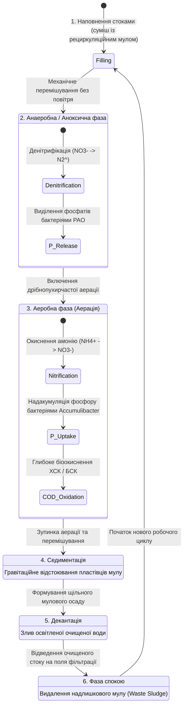

# Змістовий модуль 2. Моделювання екологічних процесів та геоінформаційні технології

# Тема 8. Моделювання динаміки та стійкості екологічних систем

---

## 8.1. Математичні моделі біотичних взаємодій в умовах техногенного стресу (динамічні моделі типу Лотки-Вольтерра)

### Основний зміст та теоретичний базис
Фундаментальним завданням сучасної прикладної та теоретичної екології є дослідження динаміки біотичних угруповань під впливом антропогенних факторів і техногенного стресу. Природні біоценози та штучно культивовані мікробіоценози являють собою відкриті нелінійні динамічні системи, у яких взаємодія між окремими популяціями визначається процесами трофічного обміну, конкуренції за лімітуючий субстрат, мутуалізму та просторової дифузії. Здобувачі вищої освіти в межах даного освітнього компонента мають оволодіти математичним апаратом диференціального моделювання популяційної динаміки для прогнозування стійкості екосистем, оцінки ризиків деградації біорізноманіття та проєктування біотехнологічних комплексів очищення довкілля.

Класичним підґрунтям аналізу міжвидових взаємодій є система нелінійних диференціальних рівнянь типу Лотки-Вольтерра, яка в умовах техногенного навантаження модифікується введенням функцій токсикологічного стресу та обмеження ресурсної ємності середовища. У випадку системи трофічної взаємодії «хижак – жертва» (або «мікроорганізм-деструктор – органічний субстрат») за наявності зовнішнього хімічного забруднювача динаміка чисельності популяцій описується системою рівнянь:

$$\begin{cases} \displaystyle \frac{dx}{dt} = \alpha x \left( 1 - \frac{x}{K_x} \right) - \beta x y - \delta_x(T_e) \cdot x, \\[10pt] \displaystyle \frac{dy}{dt} = \gamma \beta x y - m y - \delta_y(T_e) \cdot y, \end{cases}$$

де $x(t)$ — щільність або біомаса популяції жертви (або концентрація доступного первинного субстрату в середовищі), $\text{mg/L}$ чи $\text{ind./m}^3$; $y(t)$ — щільність або біомаса популяції хижака (або активного мікробіоценозу), $\text{mg/L}$ чи $\text{ind./m}^3$; $\alpha$ — питома швидкість природного приросту популяції жертви за відсутності хижака та лімітування, $\text{day}^{-1}$; $K_x$ — гранична ємність екологічної ніші для популяції жертви, обумовлена первинними природними ресурсами; $\beta$ — коефіцієнт питомої взаємодії (ефективність хижацтва або швидкість поглинання субстрату), $\text{L/(mg}\cdot\text{day)}$; $\gamma$ — коефіцієнт біоконверсії, що визначає частку спожитої біомаси жертви, яка трансформується у приріст біомаси хижака (трофічна ефективність); $m$ — коефіцієнт природної питомої смертності хижака, $\text{day}^{-1}$; $\delta_x(T_e)$ та $\delta_y(T_e)$ — нелінійні функції додаткової токсичної смертності або пригнічення життєдіяльності під дією концентрації токсиканта $T_e$.

Функції токсикодинамічного відгуку $\delta_i(T_e)$ найчастіше формалізуються через сигмоїдальні залежності Хілла:

$$\delta_i(T_e) = \delta_{i,\max} \cdot \frac{T_e^n}{\text{EC}_{50,i}^n + T_e^n},$$

де $\delta_{i,\max}$ — максимальна швидкість токсичної елімінації популяції, $\text{day}^{-1}$; $\text{EC}_{50,i}$ — напівмаксимальна ефективна концентрація токсиканта для $i$-го виду, $\text{mg/L}$; $n$ — коефіцієнт Хілла (показник кооперативності токсичної дії).

У випадку міжвидової конкуренції двох популяцій за спільний трофічний ресурс (наприклад, конкуренція автотрофних нітрифікуючих бактерій та гетеротрофних мікроорганізмів за розчинений кисень у водному об'єкті) система трансформується до класичної конкурентної моделі Вольтерра-Гаузе з урахуванням абіотичного пресингу:

$$\begin{cases} \displaystyle \frac{dN_1}{dt} = r_1 N_1 \left( 1 - \frac{N_1 + \alpha_{12} N_2}{K_1(T_e)} \right), \\[10pt] \displaystyle \frac{dN_2}{dt} = r_2 N_2 \left( 1 - \frac{N_2 + \alpha_{21} N_1}{K_2(T_e)} \right), \end{cases}$$

де $N_1, N_2$ — чисельності взаємодіючих популяцій; $r_1, r_2$ — внутрішні біотичні потенціали приросту; $\alpha_{12}$ — коефіцієнт конкурентного пригнічення першого виду другим видом; $\alpha_{21}$ — коефіцієнт пригнічення другого виду першим видом; $K_1(T_e), K_2(T_e)$ — ефективні екологічні ємності середовища, які монотонно зменшуються зі зростанням токсичного тиску відповідно до формули $K_i(T_e) = K_{i,0} \cdot \exp(-\kappa_i T_e)$, де $\kappa_i$ — коефіцієнт чутливості виду до техногенного фактора.

Аналіз стійкості стаціонарних станів екосистеми здійснюється за методом першого наближення Ляпунова шляхом лінеаризації системи рівнянь у стаціонарних точках $(\bar{x}, \bar{y})$ та дослідження власних значень матриці Якобі $J$:

$$J(\bar{x}, \bar{y}) = \begin{bmatrix} \displaystyle \frac{\partial f_1}{\partial x} & \displaystyle \frac{\partial f_1}{\partial y} \\[10pt] \displaystyle \frac{\partial f_2}{\partial x} & \displaystyle \frac{\partial f_2}{\partial y} \end{bmatrix}_{(\bar{x}, \bar{y})}.$$

Характеристичне рівняння $\det(J - \lambda I) = \lambda^2 - \text{Sp}(J)\lambda + \det(J) = 0$ визначає характер фазових траєкторій. Техногенний стрес зміщує дійсні частини власних значень $\text{Re}(\lambda)$ у додатну площину, що спричиняє біфуркації Андронова-Хопфа — виникнення незгасаючих автоколивань високої амплітуди або колапс рівноважного стану, за якого одна з популяцій повністю елімінується із біоценозу. Розуміння цих закономірностей дозволяє створювати системи раннього виявлення екологічного колапсу за ознаками критичного уповільнення відновлення (critical slowing down) біологічних популяцій.

---

## 8.2. Оцінка екологічної ємності територій та гранично допустимого навантаження на геосистеми

### Основний зміст та теоретичний базис
Концепція стійкості екологічних систем нерозривно пов'язана з фундаментальними поняттями **екологічної ємності території** (Ecological Carrying Capacity, ECC) та **асиміляційного потенціалу геосистем**. Асиміляційний потенціал відображає максимальну швидкість природного самовідновлення, біохімічної трансформації та знешкодження забруднюючих речовин автохтонним біоценозом і абіотичними геосферами (атмосферою, гідросферою, ґрунтовим покривом) без незворотного порушення їхньої структурно-функціональної цілісності. 

Математичний опис динаміки накопичення забруднення в геосистемі базується на рівнянні матеріального балансу між надходженням емісій та їх природною нейтралізацією:

$$\frac{dC_{\text{env}}}{dt} = \frac{Q_{\text{emission}}(t)}{V_{\text{env}}} - K_{\text{assim}}(T, \text{pH}, \text{bio}) \cdot C_{\text{env}} - \frac{Q_{\text{export}}(t)}{V_{\text{env}}},$$

де $C_{\text{env}}$ — усереднена концентрація забруднюючої речовини в межах геосистеми, $\text{mg/m}^3$ або $\text{mg/L}$; $Q_{\text{emission}}(t)$ — сумарний масовий потік антропогенного надходження токсикантів за одиницю часу, $\text{mg/day}$; $V_{\text{env}}$ — характерний робочий об'єм екологічного резервуара (об'єм змішування атмосфери над містом або об'єм водної маси річкового басейну), $\text{m}^3$; $K_{\text{assim}}$ — інтегральний коефіцієнт швидкості біогеохімічної асиміляції (самоочищення), $\text{day}^{-1}$, який є складною нелінійною функцією температури $T$, кислотності $\text{pH}$ та метаболічної активності редуцентів $\text{bio}$; $Q_{\text{export}}(t)$ — масова швидкість транскордонного винесення або адвективного відтоку полютанта за межі досліджуваної території, $\text{mg/day}$.

У стаціонарному стані системи ($\frac{dC_{\text{env}}}{dt} = 0$) визначається гранично допустиме техногенне навантаження ($Q_{\text{critical}}$), за якого рівноважна концентрація не перевищує норматив гранично допустимої концентрації ($\text{MPC}$):

$$Q_{\text{critical}} = V_{\text{env}} \cdot K_{\text{assim}} \cdot \text{MPC} + Q_{\text{export}}.$$

Якщо фактичний рівень емісій $Q_{\text{emission}} > Q_{\text{critical}}$, спостерігається прогресуюча акумуляція токсикантів у трофічних ланцюгах, зниження біологічного різноманіття та деградація демпфуючих властивостей природних комплексів.

Для інтегральної оцінки екологічної ємності ландшафтів застосовується просторовий інтегральний індекс екологічного резерву $ECC_{\text{total}}$, що розраховується по всій просторовій області геосистеми $\Omega$:

$$ECC_{\text{total}} = \iint_{\Omega} \Psi(x,y) \cdot \left[ C_{\text{crit}}(x,y) - C_{\text{fact}}(x,y,t) \right] \, dx\,dy,$$

де $\Psi(x,y)$ — ваговий коефіцієнт екологічної вразливості ландшафту (вищий для природоохоронних зон, заплавних луків та річкових долин, нижчий для індустріальних пустирів); $C_{\text{crit}}(x,y)$ — критична межа стійкості екосистеми; $C_{\text{fact}}(x,y,t)$ — фактичне поле концентрацій, розраховане за допомогою ГІС-інтерполяції (IDW) або результатів прямого моніторингу.

| Компонент геосистеми | Провідні процеси самоочищення та асиміляції | Ключові математичні та біологічні показники | Фактори зниження асиміляційного потенціалу | Критерій переходу в деградований стан |
| :--- | :--- | :--- | :--- | :--- |
| **Атмосферний басейн** | Турбулентна дифузія, гравітаційне осадження пилу, вимивання опадами, фотохімічна деструкція | Коефіцієнт турбулентної дифузії, швидкість сухого осадження, час напівочищення $\tau_{1/2}$ | Температурні інверсії, штильові умови, висока щільність міської забудови | Перевищення ГДК за комплексним індексом $\text{ІЗА} > 7$ |
| **Поверхневі водні об'єкти** | Біохімічне окиснення бактеріями, седиментація завислих часток, реаерація, фотоліз | Біохімічне споживання кисню ($\text{БСК}_5$), хімічне споживання кисню ($\text{ХСК}$), вміст розчиненого $\text{O}_2$ | Залпові скиди висококонцентрованих промислових стоків, термічне забруднення | Падіння розчиненого кисню $\text{DO} < 4\text{ mg/L}$, анаеробне загнивання |
| **Ґрунтовий покрив** | Гуміфікація, мікробіологічна деструкція ксенобіотиків, іонний обмін, фітоекстракція | Вміст гумусу, мікробіологічна активність, буферна ємність, катіонний обмін | Переущільнення важкою технікою, дегуміфікація, закислення або вторинне засолення | Зниження ферментативної активності на $> 50\,\%$, ерозія |
| **Штучні біоспоруди (SBR)** | Адаптивна циклічна нітри-денітрифікація, біоакумуляція фосфатів, флокулоутворення | Муловий індекс ($\text{SVI}$), питома швидкість дихання мулу ($\text{SOUR}$), ККД деструкції | Перевантаження за жирами та токсикантами, дефіцит розчиненого кисню | Вспухання активного мулу, винос біомаси, втрата селективності |

Систематизація характеристик стійкості свідчить про те, що природні геосистеми мають обмежений запас демпфування. У зв’язку з цим сучасна екологічна політика передбачає перехоплення та глибоку локальну очистку концентрованих промислових і господарсько-побутових стоків безпосередньо біля джерел їх генерації до моменту скидання у відкриті водні об'єкти.

---

## 8.3. Моделювання процесів самоочищення водних об'єктів та біохімічної трансформації відходів (моделі біореакторів SBR)

### Основний зміст та теоретичний базис
Прикладним втіленням теорії динамічних екологічних систем є моделювання процесів самоочищення природних водойм та розробка високоінтенсивних біотехнологічних установок очищення стічних вод. У природних умовах класичною математичною моделлю кисневого режиму річки є система диференціальних рівнянь Стрітера-Фелпса (Streeter-Phelps oxygen sag model), яка описує динаміку розчиненого кисню внаслідок дезоксигенації під час окиснення органіки та атмосферної реаерації:

$$\begin{cases} \displaystyle \frac{dL}{dt} = -k_1 L, \\[10pt] \displaystyle \frac{dD}{dt} = k_1 L - k_2 D, \end{cases}$$

де $L(t)$ — залишкове біохімічне споживання кисню ($\text{БСК}$), $\text{mg }\text{O}_2\text{/L}$; $D(t) = C_s - C_{\text{DO}}(t)$ — дефіцит розчиненого кисню у воді, $\text{mg/L}$ ($C_s$ — рівноважна концентрація насичення киснем при даній температурі, $C_{\text{DO}}$ — фактична концентрація розчиненого кисню); $k_1$ — константа швидкості біохімічної дезоксигенації, $\text{day}^{-1}$; $k_2$ — константа швидкості атмосферної реаерації дзеркала водойми, $\text{day}^{-1}$.

При надходженні важких промислових стоків (наприклад, стічних вод м'ясопереробних комбінатів, що містять $\text{БСК}_{\text{повн}} = 1400\dots 1500\text{ mg/L}$, $\text{ХСК} = 1800\text{ mg/L}$, сполуки азоту до $192\text{ mg/L}$ та сполуки фосфору до $60\text{ mg/L}$) природний асиміляційний потенціал водойм повністю колапсує. Для ліквідації таких загроз застосовують інноваційні біотехнології на основі послідовно-циклічних біологічних реакторів (**Sequencing Batch Reactors, SBR**).

*Рисунок 1 — Фазова діаграма та біохімічні перетворення в робочому циклі біореактора типу SBR з адаптованим мікробіоценозом*

Математичне моделювання біохімічної деградації субстрату та росту адаптованого активного мулу в біореакторах типу SBR описується нелінійною кінетикою Моно (Monod kinetics) з подвійним субстратним лімітуванням за вуглецевим живленням та розчиненим киснем:

$$\mu(S, S_O) = \mu_{\max} \cdot \frac{S}{K_S + S} \cdot \frac{S_O}{K_O + S_O} \cdot \prod_{i} \frac{K_{I,i}}{K_{I,i} + I_i},$$

де $\mu$ — питома швидкість росту мікроорганізмів активного мулу, $\text{day}^{-1}$; $\mu_{\max}$ — максимальна теоретична швидкість росту при насиченні субстратом; $S$ — концентрація лімітуючого органічного субстрату ($\text{БСК}$ або $\text{ХСК}$), $\text{mg/L}$; $K_S$ — константа напівнасичення Моно за субстратом, $\text{mg/L}$; $S_O$ — поточна концентрація розчиненого кисню в камері біореактора, $\text{mg/L}$; $K_O$ — константа спорідненості мікробіоценозу до кисню, $\text{mg/L}$; $K_{I,i}$ — константи інгібування специфічними токсикантами $I_i$ (наприклад, надлишком хлориду натрію або жирових сполук).

Динаміка біомаси активного мулу $X(t)$ та залишкового органічного субстрату $S(t)$ у періодичній системі SBR формалізується системою диференціальних рівнянь:

$$\begin{cases} \displaystyle \frac{dX}{dt} = (\mu - k_d) X, \\[10pt] \displaystyle \frac{dS}{dt} = -\frac{1}{Y_{X/S}} \mu X - k_m X, \end{cases}$$

де $k_d$ — коефіцієнт ендогенного дихання та відмирання клітин біомаси, $\text{day}^{-1}$; $Y_{X/S}$ — економічний коефіцієнт виходу біомаси на одиницю утилізованого субстрату, $\text{mg біомаси / mg субстрату}$; $k_m$ — коефіцієнт витрат субстрату на підтримку життєдіяльності клітин (maintenance coefficient).

Ключовою перевагою реакторів SBR у схемі очищення стоків м'ясопереробних комплексів є чергування анаеробних, аноксичних та аеробних фаз у межах єдиного модульного резервуара, що забезпечує функціонування вузькоспеціалізованих груп адаптованого мікробіоценозу:
* Процес біологічної нітрифікації протікає в аеробній фазі під дією хемолітоавтотрофних бактерій родів *Nitrosomonas* та *Nitrobacter*:
  $$\text{NH}_4^+ + 1.5\text{O}_2 \xrightarrow{\text{Nitrosomonas}} \text{NO}_2^- + \text{H}_2\text{O} + 2\text{H}^+,$$
  $$\text{NO}_2^- + 0.5\text{O}_2 \xrightarrow{\text{Nitrobacter}} \text{NO}_3^-.$$
* Процес біологічної денітрифікації реалізується в аноксичній фазі факультативними анаеробними бактеріями родів *Pseudomonas*, *Bacillus*, *Acinetobacter*, *Aeromonas*, які використовують нітрати як кінцевий акцептор електронів при окисненні органічного Карбону:
  $$2\text{NO}_3^- + 10e^- + 12\text{H}^+ \xrightarrow{\text{Денітрифікатори}} \text{N}_2 \uparrow + 6\text{H}_2\text{O}.$$
* Глибоке біологічне видалення сполук Фосфору (Enhanced Biological Phosphorus Removal, EBPR) забезпечується поліфосфат-акумулюючими мікроорганізмами (Polyphosphate Accumulating Organisms — PAO), зокрема *Candidatus Accumulibacter*. В анаеробній фазі бактерії PAO гідролізують внутрішньоклітинні поліфосфати, виділяючи ортофосфати у розчин та запасаючи енергію у вигляді полігідроксиалканоатів (PHA). В наступній аеробній фазі за рахунок окиснення PHA ці мікроорганізми здійснюють надлишкове накопичення фосфатів із води, акумулюючи їх у складі пластівців мулу з ефективністю до 95–99 %.

Впровадження ступінчастої схеми (попереднє механічне очищення, коагуляція-флокуляція у трубчастому флокуляторі, флотація у DAF-установці та біологічне доочищення у двох паралельних біореакторах SBR I і SBR II) дозволяє знизити $\text{БСК}_5$ з $1410\text{ mg/L}$ до $50\text{ mg/L}$, $\text{ХСК}$ — з $1800\text{ mg/L}$ до $250\text{ mg/L}$, вміст азоту — зі $172\text{ mg/L}$ до $15\text{ mg/L}$, а концентрацію фосфору — з $42\text{ mg/L}$ до $2\text{ mg/L}$. Це повністю нівелює ризики антропогенної евтрофікації природних водних екосистем та відповідає вимогам екологічної безпеки урбанізованих територій.

---

### Питання для самоперевірки та аналітичного осмислення

1. Яким чином математичні моделі Лотки-Вольтерра модифікуються для адекватного врахування токсикологічного стресу та деградації природної ємності екологічної ніші?
2. Поясніть біологічний та математичний зміст функцій відгуку Хілла $\delta(T_e)$ при моделюванні впливу техногенних емісій на виживання біотичних популяцій.
3. Що являє собою асиміляційний потенціал геосистеми, і за яких умов масовий потік антропогенного забруднення $Q_{\text{emission}}$ призводить до незворотного колапсу самоочищувальної здатності ландшафту?
4. Проаналізуйте структуру класичної моделі кисневого прогину Стрітера-Фелпса. Які фізико-хімічні фактори визначають співвідношення констант швидкості дезоксигенації $k_1$ та реаерації $k_2$?
5. Опишіть кінетичні рівняння росту біомаси Моно з урахуванням множинного субстратного лімітування (органічний Карбон, розчинений кисень, токсичне інгібування).
6. Розкрийте мікробіологічний та фазовий механізм видалення сполук Нітрогену і Фосфору в циклічних біореакторах типу SBR із адаптованим мікробіоценозом (*Candidatus Accumulibacter*, *Nitrosomonas*, *Pseudomonas*).
7. Як результати моделювання біодеградації рідких промислових відходів у SBR-реакторах можуть бути інтегровані в цифрові інформаційні системи муніципального екологічного моніторингу?