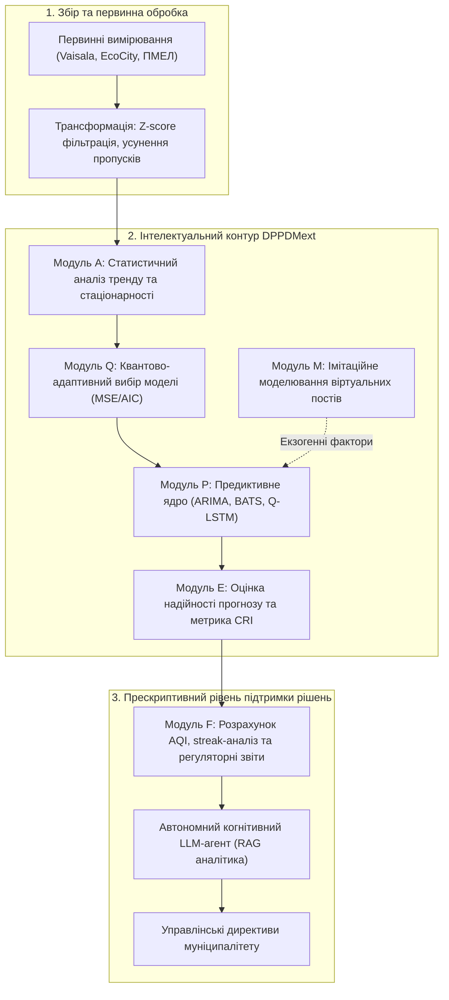
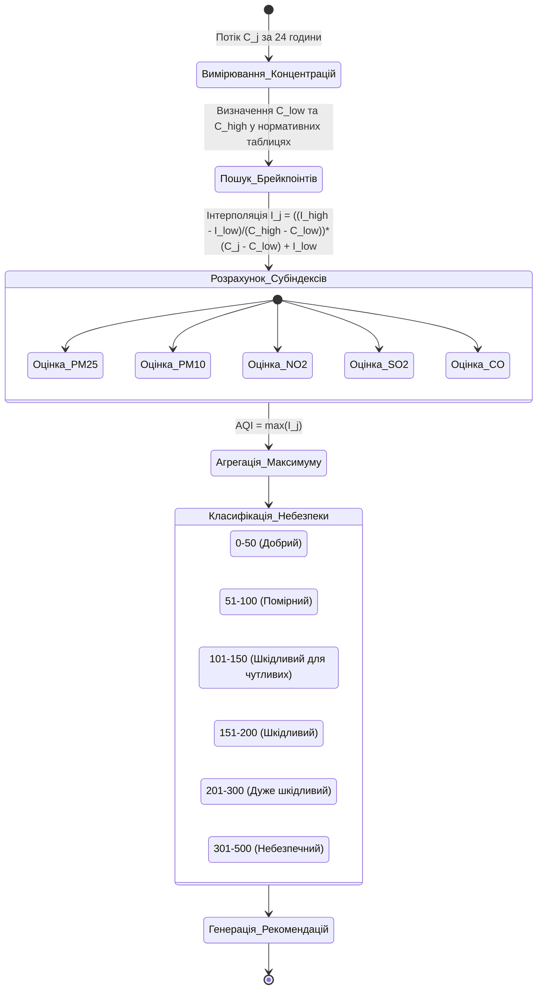
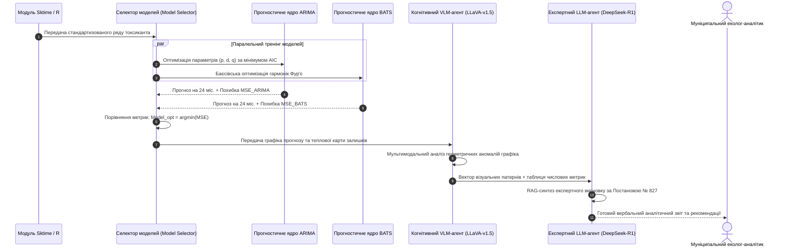
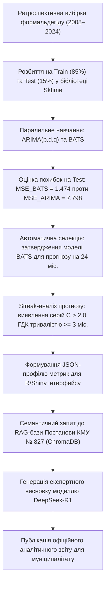

# Тема 9. Інформаційні системи прогнозування та оцінки екологічних ризиків

## Мета лекції
Опанувати концепцію побудови сучасних інтелектуальних систем підтримки прийняття рішень на основі розширеної архітектури DPPDMext, автоматизованої селекції моделей прогнозування часових рядів (ARIMA, BATS), розрахунку індексів екологічного ризику та інтеграції автономних когнітивних LLM-агентів із технологією пошуково-доповненої генерації (RAG) для вербального синтезу прескриптивних управлінських рішень.

## Очікувані результати навчання
1. **Знання та розуміння.** Здобувачі мають розуміти теоретичні основи інформаційної технології DPPDMext, методику розрахунку інтегральних екологічних індексів (AQI) та алгоритми автоматизованого вибору предиктивних моделей.
2. **Застосування.** Здобувачі мають застосовувати моделі ARIMA та BATS у середовищі sktime з автоматичним вибором конфігурації за мінімумом квадратичної похибки MSE для розрахунку прогнозів на 24 місяці.
3. **Аналіз.** Здобувачі мають аналізувати прогностичні помилки MAE, RMSE та інформаційний критерій Акаіке (AIC) при зіставленні лінійних авторегресійних та експоненціальних моделей.
4. **Оцінювання та синтез.** Здобувачі мають розробляти агентні структури на базі великих мовних моделей (LLM) із RAG-архітектурою для генерації експертних аналітичних звітів без ризику інформаційних галюцинацій.

## 1. Теоретико-концептуальний базис. Концепція розширеного аналітичного циклу DPPDMext та розрахунок екологічних ризиків

### 1.1. Формалізація циклу обробки даних у вигляді розширеного кортежу DPPDMext: синтез функціональних модулів A, Q, M, E, P, F

Сучасні виклики в галузі муніципального екологічного менеджменту вимагають переходу від розрізнених програмних інструментів до цілісних інформаційних технологій, здатних підтримувати повний аналітичний цикл від збору первинної телеметрії до синтезу управлінських рішень. Традиційні архітектури, орієнтовані на поетапну конвеєрну обробку даних за моделлю підготовки та обробки даних (Data Preparation and Processing for Decision Making, DPPDM), формалізувалися класичним кортежем п'яти базових компонентів:

$$\text{DPPDM} = \langle D, T, P, F, V \rangle$$

де елемент $D$ (Data) визначає масив первинних екологічних спостережень, елемент $T$ (Transformation) задає процедури нормалізації, фільтрації та просторово-часової агрегації, елемент $P$ (Prediction) відповідає за методи прогнозування, елемент $F$ (Feature Engineering) детермінує розрахунок нормативних індексів і статистичних характеристик, а елемент $V$ (Visualization) представляє результати у вигляді картограм та графіків.

Проте функціонування моніторингових систем в умовах високої стохастичності міського середовища, інформаційних «сліпих зон» та обмеженого обсягу ретроспективних вибірок виявило принципові недоліки класичного підходу. З метою подолання цих обмежень синтезовано розширену концептуальну парадигму **DPPDMext (Data Preparation and Predictive Data Modeling extended)**. У розширеній моделі предиктивний контур $P_{\text{ext}}$ трансформується у багаторівневу адаптивну систему, яка інтегрує глибокий попередній аналіз часових рядів, квантово-адаптивну оптимізацію прогностичного ядра, геопросторове моделювання віртуальних станцій та когнітивну експертну оцінку.

Математично розширена модель екологічної інформаційної технології описується структурованим кортежем шести функціональних макромодулів:

$$\text{DPPDMext} = \langle A, Q, M, E, P, F \rangle$$

де кожен структурний елемент реалізує спеціалізований етап інтелектуальної обробки:
* Модуль $A$ (Automatic Analysis) здійснює автоматизований статистичний та спектральний аналіз сирих часових рядів із детектуванням довгострокових трендів, сезонних періодів, оцінкою стаціонарності та ступеня зашумленості.
* Модуль $Q$ (Quantum-Adaptive Selection) реалізує відсистему автоматизованого підбору оптимальної прогностичної архітектури, динамічно перемикаючись між класичними статистичними моделями та квантово-гібридними нейромережами залежно від властивостей вибірки.
* Модуль $M$ (Modeling of Virtual Stations) забезпечує геопросторове моделювання та генерацію віртуальних вимірювальних постів у критичних перетинах міської інфраструктури за допомогою зваженої просторової інтерполяції та симуляції трафіку.
* Модуль $E$ (Expert Evaluation) виконує процедурну експертну оцінку надійності прогнозів через розрахунок комплексного індексу надійності прогнозів (CRI) та аналіз залишків.
* Модуль $P$ (Predictive Core) представляє високопродуктивне обчислювальне ядро прогнозування, що об'єднує класичні алгоритми ARIMA і BATS та варіаційні квантові рекурентні схеми.
* Модуль $F$ (Framework for Decision Support) формує кінцевий людино-машинний інтерфейс когнітивної підтримки рішень, оснащений автономними мовними агентами для вербальної інтерпретації ризиків та формування звітів за формою Постанови № 827.

> **ПРАКТИЧНИЙ ЯКІР:** У процесі цифровізації екологічного спостереження Кременчуцької промислової агломерації впровадження контуру DPPDMext дозволило об'єднати 17-річні ретроспективні ряди чотирьох стаціонарних лабораторій із потоковими вимірюваннями трьох нових станцій Vaisala, забезпечивши автоматичний вибір між моделями BATS та ARIMA для 13 контрольованих полютантів без ручного переналаштування параметрів оператором.

---

### 1.2. Математичний апарат розрахунку національного та міжнародного індексів якості повітря (AQI) за кусочно-лінійними функціями

Для доведення складної багатокомпонентної інформації про хімічний склад атмосфери до органів місцевого самоврядування та населення застосовується узагальнена безрозмірна шкала — **Індекс якості повітря (Air Quality Index, AQI)**. Використання абсолютних одиниць масової концентрації (мг/м³ або мкг/м³) є малоінформативним для нефахівців, оскільки різні хімічні речовини володіють принципово різною токсичністю, латентними періодами впливу та пороговими рівнями ураження дихальної системи.

Математичний апарат розрахунку стандартизованого субіндексу $I_j$ для окремої забруднюючої речовини $j$ базується на кусочно-лінійній інтерполяції між нормативно встановленими граничними концентраціями (концентраційними брейкпоінтами). Якщо фактична виміряна або спрогнозована концентрація речовини становить $C_j$, а нормативна шкала визначає діапазон $[C_{\text{low}}, \, C_{\text{high}}]$, всередині якого лежить це значення ($C_{\text{low}} \le C_j \le C_{\text{high}}$), розрахунок субіндексу здійснюється за класичною аналітичною формулою Агентства з охорони довкілля США (US EPA):

$$I_j = \frac{I_{\text{high}} - I_{\text{low}}}{C_{\text{high}} - C_{\text{low}}} (C_j - C_{\text{low}}) + I_{\text{low}}$$

де параметри кусочно-лінійного перетворення детермінуються такими величинами:
* Змінна $C_j$ відображає поточну виміряну концентрацію $j$-го забруднювача, попередньо осереднену за нормативним часовим вікном (1 година для діоксиду азоту, 8 годин для монооксиду вуглецю та озону, 24 години для дрібнодисперсного пилу PM2.5 та PM10).
* Константи $C_{\text{low}}$ та $C_{\text{high}}$ задають нижню та верхню межі діапазону концентрацій брейкпоінта, які призводять до відповідного токсикологічного ефекту на здоров'я.
* Константи $I_{\text{low}}$ та $I_{\text{high}}$ позначають нормативні межі індексу якості повітря, що відповідають категорії даного брейкпоінта (наприклад, діапазон 51–100 для категорії «помірний рівень»).

Інтегральний індекс якості повітря для багатокомпонентного стану атмосфери $\text{AQI}_{\text{total}}$ не розраховується як середнє арифметичне, а визначається за **принципом найгіршого показника (Maximum Operator)**:

$$\text{AQI}_{\text{total}} = \max \big( I_{\text{PM2.5}}, \, I_{\text{PM10}}, \, I_{\text{CO}}, \, I_{\text{SO2}}, \, I_{\text{NO2}}, \, I_{\text{O3}} \big)$$

Цей математичний принцип гарантує, що якщо концентрація хоча б одного високотоксичного полютанта сягає критичного рівня небезпеки, сукупний індекс міста негайно сигналізуватиме про загрозу життю, навіть якщо вміст решти сполук залишається мінімальним.

> **ПРАКТИЧНИЙ ЯКІР:** У створеній інформаційно-аналітичній веб-системі на базі мови R та сервісу Shiny модуль розрахунку AQI безперервно опитує вимірювальні канали станцій Vaisala, автоматично здійснюючи інтерполяцію концентрацій за п'ятьма базовими полютантами та виводячи на інтерактивну карту колірний індикатор екологічного ризику зі швидкістю оновлення раз на 10 хвилин.

---

### 1.3. Алгоритми обліку тривалості та серійності послідовних перевищень гранично допустимих концентрацій (streak analysis)

Оцінка хронічного токсичного навантаження на урбоекосистему вимагає врахування не лише амплітуди перевищення нормативів, а й їхньої часової тривалості. Короткочасний одиничний сплеск концентрації токсиканта, викликаний поривом вітру або локальним маневром вантажівки, активізує адаптивні компенсаторні механізми організму людини. Навпаки, навіть помірне перевищення ГДК, що триває безперервно протягом десятків годин або діб, викликає незворотні патологічні зміни дихальних шляхів та серцево-судинної системи.

Для математичної фіксації тривалих небезпечних періодів у контурі DPPDMext реалізовано алгоритм **аналізу серійності перевищень (Streak Analysis)**. Нехай часовий ряд концентрацій $j$-ї речовини на $i$-му пості задається послідовністю $x_{i, j, t}$, де $t \in \{1, 2, \dots, T\}$. Перевірка виконання умови порушення гранично допустимої концентрації $G_j$ формалізується індикаторною функцією:

$$P_{i, j, t} = \begin{cases} 
1, & \text{якщо } x_{i, j, t} > G_j \\ 
0, & \text{якщо } x_{i, j, t} \le G_j 
\end{cases}$$

Загальна кількість зафіксованих перевищень за досліджуваний період $T$ на пості $i$ обчислюється простим сумуванням:

$$C_{i, j} = \sum_{t=1}^{T} P_{i, j, t}$$

Алгоритмічна процедура підрахунку кількості тривалих небезпечних серій $L_{i, j}$, довжина яких досягає або перевищує критичний часовий поріг $K$ (де $K$ — мінімальна кількість послідовних зрізів, наприклад, $K = 3$ для 20-хвилинних спостережень, що еквівалентно одній годині), реалізується наступним ітераційним процесом:

1. Ініціалізація системних лічильників: лічильник серій $L_{i, j} = 0$, поточний накопичувач неперервності $\text{streak} = 0$.
2. Послідовна ітерація за всіма часовими точками $t \in \{1, \dots, T\}$ із динамічним оновленням накопичувача:

$$\text{streak} \leftarrow \begin{cases} 
\text{streak} + 1, & \text{якщо } P_{i, j, t} = 1 \\ 
0, & \text{якщо } P_{i, j, t} = 0 
\end{cases}$$

3. Якщо поточне значення накопичувача досягає встановленого порогового критерію $\text{streak} \ge K$, системний лічильник тривалих інцидентів збільшується на одиницю ($L_{i, j} \leftarrow L_{i, j} + 1$), а факт тривалого порушення реєструється в базі даних як екологічний інцидент високого пріоритету.

Для порівняльної оцінки интегрального екологічного ризику різних міських районів обчислюється середньозважена частота перевищень нормативів $R_i$ за всіма $M$ контрольованими токсикантами:

$$R_i = \sum_{j=1}^{M} \frac{C_{i, j}}{T}$$

Цей інтегральний коефіцієнт дозволяє ранжувати територію муніципалітету за ступенем екологічної небезпеки та слугує критерієм для першочергового впровадження регуляторних заходів.

---

### 1.4. Процедура оцінки інформаційної безпеки інфраструктури моніторингу та балансування витрат на захист даних

Екологічні інформаційні системи муніципального рівня керують критично важливою інформацією, яка використовується для прийняття рішень про введення надзвичайних станів, евакуацію населення або зупинку промислових виробництв. Компрометація даних моніторингу внаслідок кібератак (підміна вимірювань, блокування каналів передачі, фальсифікація індексів якості повітря) може паралізувати міське управління та створити пряму загрозу життю людей. 

Математична модель оцінки ризиків інформаційної безпеки розглядає ризик як функцію ймовірності реалізації загрози та тяжкості її наслідків, деталізованих за класичною тріадою конфіденційності, цілісності та доступності (CIA triad). Для кожної ідентифікованої загрози $t \in \mathcal{T}$ сукупний збиток $I_t$ обчислюється як зважена сума впливів:

$$I_t = w_C \cdot I_{t, C} + w_I \cdot I_{t, I} + w_A \cdot I_{t, A}$$

де коефіцієнти $w_C, w_I, w_A$ визначають відносну важливість критеріїв безпеки для конкретної системи при дотриманні умови нормування $w_C + w_I + w_A = 1$, а величини $I_{t, C}, I_{t, I}, I_{t, A} \in [0, 1]$ відображають нормалізовані оцінки збитків. В екологічних системах найбільшу вагу має цілісність даних ($w_I \approx 0,5$) та доступність ($w_A \approx 0,4$), тоді як конфіденційність публічних показників має менший пріоритет ($w_C \approx 0,1$).

Початковий інтегральний ризик системи до впровадження спеціальних засобів захисту формалізується сумою ризиків за всіма актуальними загрозами:

$$R^{(0)} = \sum_{t \in \mathcal{T}} P_t \cdot I_t = \sum_{t \in \mathcal{T}} P_t \cdot \big( w_C I_{t, C} + w_I I_{t, I} + w_A I_{t, A} \big)$$

де $P_t \in [0, 1]$ — ймовірність успішної реалізації загрози $t$.

Впровадження множини захисних заходів $M \subseteq \mathcal{S}$ (наприклад, перехід на протокол LwM2M з шифруванням DTLS, впровадження моделі контролю доступу ABAC, розгортання апаратних модулів довіри) знижує ймовірності загроз до $P_t^{(M)}$ та їхній потенційний вплив до $I_t^{(M)}$. Залишковий ризик системи $R^{(M)}$ визначається як:

$$R^{(M)} = \sum_{t \in \mathcal{T}} P_t^{(M)} \cdot \big( w_C I_{t, C}^{(M)} + w_I I_{t, I}^{(M)} + w_A I_{t, A}^{(M)} \big)$$

Сукупні фінансові витрати на реалізацію комплексу заходів захисту складаються з вартості окремих компонентів:

$$C(M) = \sum_{m \in M} C_m$$

Економічна оптимізація комплексу кіберзахисту зводиться до задачі максимізації зниження ризику на одиницю витрачених ресурсів:

$$\max_{M \subseteq \mathcal{S}} \frac{R^{(0)} - R^{(M)}}{C(M)} \quad \text{при } C(M) \le B_{\text{security}}$$

де константа $B_{\text{security}}$ визначає граничний бюджет, виділений муніципалітетом на захист інфраструктури моніторингу.

Для систематизації моделей розрахунку екологічних індексів та оцінки ризиків сформовано порівняльну аналітичну таблицю.

| Методологія / Модель | Математична структура | Цільове призначення в екології | Основні припущення та обмеження | Приклад з реальної практики |
| :--- | :--- | :--- | :--- | :--- |
| Індекс якості повітря (US EPA AQI) | Кусочно-лінійна інтерполяція брейкпоінтів: $I = \frac{\Delta I}{\Delta C}(C - C_l) + I_l$ | Оперативне інформування населення про інтегральну якість атмосфери | Ігнорування синергетичного токсичного ефекту одночасної суміші газів | Візуалізація AQI на онлайн-платформі КП «НДЦ» Кременчука |
| Аналіз серійності (Streak Analysis) | Ітераційний лічильник тривалості перевищень: $\sum \mathbb{I}(X_t > G) \ge K$ | Виявлення довготривалих хронічних аварійних викидів промисловості | Чутливість результату до вибору порогової довжини серії $K$ | Фіксація 3-годинного перевищення $NO_2$ біля автомагістралей |
| Інформаційна оцінка кіберризику (CIA) | Багатокритеріальна зважена згортка: $R = \sum P_t (w_C I_C + w_I I_I + w_A I_A)$ | Оптимізація витрат на криптографічний захист IoT-мережі | Суб'єктивність експертної оцінки апріорних ймовірностей загроз $P_t$ | Обґрунтування впровадження протоколу LwM2M з DTLS на станціях |
| Інтегральний індекс надійності (CRI) | Зважена композиція метрик похибки та повноти даних | Оцінка достовірності прогностичних ядер перед генерацією звітів | Потребує наявності валідованих тестових ретроспективних рядів | Верифікація прогнозів формальдегіду моделлю BATS у системі |

---

> **ТИПОВА ПОМИЛКА:** Розрахунок підсумкового індексу якості повітря як звичайного незваженого середнього арифметичного значення субіндексів окремих забруднювачів: $\text{AQI}_{\text{avg}} = \frac{1}{M}\sum I_j$. За такого підходу смертельно небезпечна концентрація хлору чи діоксиду сірки ($I_{\text{SO2}} = 450$, категорія «катастрофа»), усереднена з чотирма іншими низькими показниками ($I = 20$, категорія «чисте повітря»), дасть інтегральне значення $\text{AQI} = (450 + 80)/5 = 106$ («помірне забруднення»), що створить оманливе враження безпеки та призведе до масового токсичного ураження населення.

---

> **КОНТРОЛЬНЕ ПИТАННЯ:** Під час натурних спостережень автоматична станція зафіксувала середньодобову концентрацію дрібнодисперсного пилу PM2.5 на рівні $C_{\text{PM2.5}} = 42,0\text{ мкг/м}^3$ та 1-годинну концентрацію діоксиду азоту $C_{\text{NO2}} = 110\text{ мкг/м}^3$. Відповідно до нормативної шкали брейкпоінтів для PM2.5 діапазону $[35,5; \, 55,4]\text{ мкг/м}^3$ відповідає шкала індексу $[101; \, 150]$ (категорія «шкідливий для чутливих груп»). Для NO2 діапазону $[101; \, 360]\text{ мкг/м}^3$ відповідає шкала $[101; \, 150]$. Розрахуйте точні значення субіндексів для обох речовин, визначте інтегральний індекс $\text{AQI}_{\text{total}}$ та вкажіть домінуючий забруднювач, що визначає рівень екологічної загрози.

Розгорнути аналіз / відповідь

**Правильний варіант: Субіндекс для пилу становить $I_{\text{PM2.5}} = 117$, субіндекс для діоксиду азоту становить $I_{\text{NO2}} = 103$; інтегральний індекс якості повітря дорівнює $\text{AQI}_{\text{total}} = 117$, а домінуючим забруднювачем є дрібнодисперсний пил PM2.5.**

1. Повне логічне та аналітичне обґрунтування:
   * Розрахуємо субіндекс для PM2.5 при $C = 42,0\text{ мкг/м}^3$, де $C_{\text{low}} = 35,5$, $C_{\text{high}} = 55,4$, $I_{\text{low}} = 101$, $I_{\text{high}} = 150$:
     $$I_{\text{PM2.5}} = \frac{150 - 101}{55,4 - 35,5} (42,0 - 35,5) + 101 = \frac{49}{19,9} \cdot 6,5 + 101 = 2,4623 \cdot 6,5 + 101 = 16,0 + 101 = 117$$
   * Розрахуємо субіндекс для NO2 при $C = 110\text{ мкг/м}^3$, де $C_{\text{low}} = 101$, $C_{\text{high}} = 360$, $I_{\text{low}} = 101$, $I_{\text{high}} = 150$:
     $$I_{\text{NO2}} = \frac{150 - 101}{360 - 101} (110 - 101) + 101 = \frac{49}{259} \cdot 9 + 101 = 0,1892 \cdot 9 + 101 = 1,7 + 101 \approx 103$$
   * Згідно з математичним принципом визначення інтегрального індексу за максимальним значенням (Maximum Operator):
     $$\text{AQI}_{\text{total}} = \max(I_{\text{PM2.5}}, I_{\text{NO2}}) = \max(117, 103) = 117$$
   * Отримане значення 117 потрапляє у категорію «Шкідливий для вразливих груп населення» (Unhealthy for Sensitive Groups). Оскільки $I_{\text{PM2.5}} > I_{\text{NO2}}$, саме дрібнодисперсний пил виступає головним лімітуючим фактором екологічного ризику (Responsible Pollutant), для якого система зобов'язана згенерувати цільові медичні попередження.

2. Аналіз дистракторів:
   * Розрахунок простого середнього $(117 + 103)/2 = 110$ хоча й дає схожий числовий результат, є методологічно хибним, оскільки приховує реальний рівень токсичного удару конкретної пилової фракції.
   * Вибір діоксиду азоту як домінуючого полютанта є помилкою, оскільки його концентрація $110\text{ мкг/м}^3$ знаходиться на самому початку небезпечного брейкпоінта, тоді як концентрація PM2.5 перебуває глибше всередині діапазону.

---

### Вказівки для самостійного осмислення

1. Складіть математичну оптимізаційну модель вибору комплексу заходів інформаційної безпеки для муніципальної мережі екологічного моніторингу за методом гілок і меж, сформулювавши цільову функцію мінімізації залишкового ризику при лінійному обмеженні фінансового бюджету.
2. Дослідіть чутливість алгоритму аналізу серійності (streak analysis) до вибору порогової кількості послідовних перевищень $K$ в умовах стохастичного шуму різної інтенсивності та визначте ймовірність виникнення хибної екологічної тривоги при виборі $K = 2$.
3. Порівняйте європейську шкалу індексу якості повітря (European Air Quality Index) із системою US EPA AQI та формалізуйте аналітичний алгоритм конвертації показників між цими міжнародними стандартами.

## 2. Методологія та аналіз граничних умов. Автоматизована селекція часових моделей та когнітивна аналітика

### 2.1. Порівняльний аналіз статистичних моделей ARIMA та BATS з автоматичним підбором параметрів на основі мінімізації похибки прогнозу

Забезпечення високої точності прогностичного ядра в муніципальних системах екологічного моніторингу ускладнюється тим, що різні хімічні домішки демонструють принципово відмінну часову поведінку. Концентрації пилу та оксидів нітрогену володіють вираженою сезонною періодичністю та стійким трендом, тоді як сполуки на кшталт діоксиду сірки чи бензолу мають стохастичну, імпульсну природу з тривалими інтервалами близьконульових фонових значень. Спроба використання єдиного універсального алгоритму для всіх параметрів неминуче призводить до втрати прогностичної сили системи, що актуалізує методологію **автоматизованого вибору моделей (Automated Model Selection)**.

Класичним статистичним еталоном для короткострокового прогнозування є модель авторегресії інтегрованого ковзного середнього **ARIMA(p, d, q)**. Математична структура моделі описує значення часового ряду $y_t$ у момент часу $t$ через лінійну комбінацію його попередніх значень (авторегресійна частина порядку $p$) та попередніх помилок прогнозу (частина ковзного середнього порядку $q$):

$$y_t = c + \sum_{i=1}^{p} \phi_i y_{t-i} + \varepsilon_t + \sum_{j=1}^{q} \theta_j \varepsilon_{t-j}$$

де параметр $c$ є константою, $\phi_i$ представляють коефіцієнти авторегресії, $\theta_j$ позначають коефіцієнти ковзного середнього, $\varepsilon_t$ є процесом білого шуму з нульовим математичним сподіванням і постійною дисперсією, а параметр $d$ визначає кратність взяття різниць для досягнення стаціонарності. Модель ARIMA є обчислювально ефективною для коротких часових рядів, проте її базові конфігурації зазнають труднощів при апроксимації нелінійних патернів та множинної нецілочисельної сезонності.

Більш гнучкою альтернативою є модель **BATS (Box-Cox transformation, ARMA errors, Trend, and Seasonal components)**, яка інтегрує перетворення Бокса-Кокса для стабілізації нерівномірної дисперсії, модифікований демпфований тренд та тригонометричний гармонійний опис складних сезонних коливань за допомогою рядів Фур'є. Базовий рівень моделі BATS описується простором станів:

$$\hat{y}_t^{(\lambda)} = l_{t-1} + \phi b_{t-1} + \sum_{k=1}^{K} s_{t-k} + d_t$$

де показник $\lambda$ задає параметр трансформації Бокса-Кокса, $l_{t-1}$ відображає локальний рівень ряду, $b_{t-1}$ детермінує тенденцію тренду з коефіцієнтом демпфування $\phi \in (0, 1]$, $s_{t-k}$ позначає сезонні тригонометричні гармоніки, а $d_t$ моделює помилки як залишковий ARMA-процес. Оцінювання параметрів BATS реалізується в баєсівській парадигмі, що забезпечує адаптацію до невизначеності на малих вибірках.

Алгоритм автоматичної селекції здійснює паралельне навчання сімейства конфігурацій ARIMA та BATS на навчальній вибірці з подальшим обчисленням критеріїв точності на відкладеному валідаційному інтервалі: середньої абсолютної помилки (MAE), середньоквадратичної помилки (MSE) та інформаційного критерію Акаіке (AIC):

$$\text{AIC} = 2k - 2\ln(\hat{L})$$

де $k$ — кількість оцінюваних параметрів моделі, а $\hat{L}$ — максимальне значення функції правдоподібності. До прогностичного контуру муніципальної бази даних автоматично призначається та модель, яка мінімізує похибку MSE на валідаційному тесті.

> **ПРАКТИЧНИЙ ЯКІР:** При порівнянні моделей на 16-річній вибірці Кременчуцької агломерації алгоритм автоматичної селекції визначив модель BATS оптимальною для пилу (MSE 0,0242 проти 0,0354 у ARIMA), монооксиду вуглецю (MSE 0,0062 проти 0,0126) та формальдегіду (MSE 1,4744 проти 7,7984). Водночас для діоксиду сірки кращу точність продемонструвала модель ARIMA (MSE 0,00123 проти 0,00157 у BATS), що підтвердило неможливість застосування єдиного алгоритму та обґрунтувало необхідність динамічного перемикання ядер.

---

### 2.2. Архітектура когнітивного експертного агента на базі мультимодальних моделей Vision-Language (VLM) та LLM для експертної оцінки графіків і числових метрик

Зростання розмірності та частоти надходження екологічних даних формує інформаційне перевантаження диспетчерських служб. Оператор не в змозі вручну аналізувати сотні графіків часових рядів, матриць просторової кореляції та таблиць прогностичних похибок, що надходять від десятків вимірювальних постів. Для автоматизації фахової інтерпретації розроблено архітектуру **когнітивного аналітичного агента**, що поєднує мультимодальну модель комп'ютерного зору (Vision-Language Model, VLM) та велику мовну модель (Large Language Model, LLM).

Вхідний простір даних агента складається з двох інформаційних доменів: матриці числових метрик похибок $\mathcal{M} = \{\text{MAE}, \text{MSE}, \text{RMSE}, R^2\}$ та множини графічних репрезентацій $\mathcal{G} = \{g_1, g_2, \dots, g_m\}$, що включає графіки фактичних і спрогнозованих рядів, гістограми розподілу залишків та картограми інтерпольованих полів.

Аналітичний процес функціонування когнітивного агента формалізується триетапним математико-алгоритмічним контуром:

$$
\begin{aligned}
\text{Крок 1 (Оцінка числових похибок):} & \quad \mathcal{M}_{\text{eval}} = \Big\langle \frac{1}{n} \sum_{i=1}^n |y_i - \hat{y}_i|, \; \frac{1}{n} \sum_{i=1}^n (y_i - \hat{y}_i)^2, \; 1 - \frac{\sum (y_i - \hat{y}_i)^2}{\sum (y_i - \bar{y})^2} \Big\rangle \\
\text{Крок 2 (Мультимодальний аналіз графіка):} & \quad \mathcal{A}_{\text{vis}} = f_{\text{VLM}}\big(g_k, \, \text{Prompt}_{\text{vision}}\big), \quad g_k \in \mathcal{G} \\
\text{Крок 3 (Експертний RAG-синтез):} & \quad \text{Report} = f_{\text{LLM}}\big(\mathcal{M}_{\text{eval}}, \, \mathcal{A}_{\text{vis}}, \, \mathcal{K}_{\text{retrieved}}(Q)\big)
\end{aligned}
$$

де функціональні складові контуру мають наступне призначення:
* Оператор $\mathcal{M}_{\text{eval}}$ формує вектор метрик, який оцінює якість збігу моделі з тестовими даними.
* Функція $f_{\text{VLM}}(\cdot)$, реалізована на базі відкритої мультимодальної моделі **LLaVA-v1.5-7b**, приймає графічні зображення часових рядів $g_k$ та текстовий промпт, виконуючи детектування геометричних аномалій: наявності виродження прогнозу в горизонтальну пряму, розходження фаз сезонності або наявності важких хвостів у розподілі похибок.
* Функція $f_{\text{LLM}}(\cdot)$, реалізована на базі мовної моделі логічного виводу **DeepSeek-R1-distill-llama-8b**, об'єднує числовий вектор, візуальні характеристики $\mathcal{A}_{\text{vis}}$ та зовнішні нормативні документи $\mathcal{K}_{\text{retrieved}}$, синтезуючи цілісний структурований висновок із рекомендаціями щодо необхідності коригування параметрів або направлення інспекції.

---

### 2.3. Імплементація технології пошуково-доповненої генерації (RAG) для вербального синтезу контекстних управлінських рекомендацій

Застосування стандартних мовних моделей у критичних інфраструктурних системах стикається з проблемою відсутності актуальних специфічних знань про нормативні регламенти та технологічні особливості конкретного регіону. Крім того, традиційні нейромережі схильні генерувати узагальнені відповіді, позбавлені точних юридичних посилань.

Методологічним вирішенням є інтеграція архітектури **пошуково-доповненої генерації (Retrieval-Augmented Generation, RAG)**. Сутність підходу полягає в тому, що мовна модель не спирається виключно на власну внутрішню параметричну пам'ять, а перед формуванням відповіді виконує семантичний пошук релевантних фрагментів знань у спеціалізованій векторній базі даних (Vector Database), де проіндексовано текст Постанови КМУ № 827, Директиви ЄС 2024/2881, паспорти викидів підприємств та історичні звіти лабораторій.

Процес формування рекомендацій за схемою RAG реалізується за такими кроками:
1. Запит системи $Q$, що містить поточні рівні перевищення ГДК та прогноз на 24 години, перетворюється моделлю ембеддингу (Text Embedding Model) у багатовимірний семантичний вектор $\mathbf{e}_Q \in \mathbb{R}^d$.
2. Векторна СУБД (наприклад, ChromaDB або Milvus) здійснює пошук $k$ найбільш релевантних нормативних контекстів за критерієм косинусної схожості:

$$\text{Sim}(\mathbf{e}_Q, \mathbf{e}_{D_i}) = \frac{\mathbf{e}_Q \cdot \mathbf{e}_{D_i}}{\|\mathbf{e}_Q\| \cdot \|\mathbf{e}_{D_i}\|}$$

3. Знайдені текстові фрагменти законів та інструкцій підставляються у системний промпт мовної моделі у ролі контекстних обмежень.
4. Модель $f_{\text{LLM}}$ генерує фінальний текст управлінського рішення, що містить точні посилання на пункти нормативно-правових актів та конкретні технологічні приписи для підприємств-забруднювачів.

> **ВАЖЛИВО:** Архітектура RAG в екологічних системах повинна використовувати строге правило заборони генерації знань за межами контексту (Zero-Shot Constraint with Grounding). Якщо в наданих нормативних документах відсутній регламент для зафіксованої хімічної сполуки, когнітивний агент зобов'язаний сформувати системну помилку та передати запит експерту-людині, повністю виключаючи генерацію неперевірених юридичних директив.

---

### 2.4. Ризик виникнення галюцинацій мовних моделей, відсутність причинно-наслідкового виводу та проблема інтерпретації від'ємних значень коефіцієнта детермінації R²

Практичне впровадження штучного інтелекту в контури екологічної безпеки виявляє критичні обмеження генеративних моделей. Головним ризиком є явище **нейромережевих галюцинацій (LLM Hallucinations)**, за якого модель формує зовні правдоподібні, але фактологічно хибні або фізично неможливі твердження. Мовні моделі є ймовірнісними генераторами послідовностей токенів, позбавленими глибинного фізичного розуміння законів збереження маси, термодинаміки та атмосферної хімії. Вони здійснюють кореляційне розпізнавання патернів у тексті, але принципово не здатні до самостійного причинно-наслідкового виводу (Causal Inference).

Яскравим проявом обмежень когнітивних агентів є **проблема інтерпретації від'ємних значень коефіцієнта детермінації ($R^2 < 0$)**. Класична формула коефіцієнта детермінації має вигляд:

$$R^2 = 1 - \frac{\sum_{i=1}^n (y_i - \hat{y}_i)^2}{\sum_{i=1}^n (y_i - \bar{y})^2} = 1 - \frac{\text{MSE}}{\text{Var}(y)}$$

У базових курсах статистики розглядається випадок оцінки лінійної регресії на навчальній вибірці, де значення завжди обмежене діапазоном $0 \le R^2 \le 1$. У реальних експериментах із прогнозування нестаціонарних екологічних рядів оцінка $R^2$ виконується на відкладених тестових даних (Out-Of-Sample Validation). Якщо часовий ряд володіє високою волатильністю (наприклад, концентрація діоксиду азоту зі стрибками емісій), прогностична модель із неоптимальними параметрами може згенерувати прогноз, середньоквадратична похибка якого перевищує дисперсію самого тестового ряду ($\text{MSE} > \text{Var}(y)$). У цьому випадку чисельне значення коефіцієнта детермінації стає від'ємним (наприклад, $R^2 = -1,85$ або $R^2 = -21,45$).

Математично від'ємне значення $R^2$ має однозначну фізичну інтерпретацію: модель працює гірше, ніж тривіальна константа, що дорівнює історичному середньому значенню ряду. Проте під час тестування відкритої мовної моделі було зафіксовано системну галюцинацію: агент видав експертний висновок про те, що «від'ємне значення $R^2$ є математично неможливим і свідчить про критичну помилку програмного коду або збій комп'ютера». Агент описав поверхневий симптом, але виявився нездатним встановити причинно-наслідковий зв'язок між високою дисперсією процесу, нестаціонарністю та якістю налаштування гіперпараметрів моделі.

Для систематизації та зіставлення методів часового моделювання та когнітивної аналітики сформовано порівняльну матрицю.

| Аналітична технологія | Математична база та спосіб інференсу | Потреба в навчальних ресурсах | Рівень інтерпретованості результатів | Складність впровадження | Критичні ризики та обмеження методології |
| :--- | :--- | :--- | :--- | :--- | :--- |
| Авторегресія ARIMA | Лінійна оптимізація коефіцієнтів методом максимальної правдоподібності | Мінімальна; лічені секунди на стандартному CPU | Абсолютна; параметри мають прямий статистичний зміст | Низька; реалізована у всіх статистичних пакетах | Нездатність моделювати складні нелінійні патерни та розриви тренду |
| Стан-просторова модель BATS | Баєсівська фільтрація, Box-Cox, тригонометричні ряди Фур'є | Середня; вимагає чисельної оптимізації простору станів | Висока; розклад на детерміновані гармоніки | Середня; вимагає попереднього підбору періодів | Схильність до виродження прогнозу в пряму лінію при зашумлених рядах |
| Прогностична модель Prophet | Адитивна нелінійна регресія з кусочно-лінійними трендами | Помірна; оптимізація алгоритмом L-BFGS у просторі Stan | Висока; візуалізація окремих компонентів тренду | Низька; спрощений прикладний API | Переоцінка регулярності календарних свят у промислових емісіях |
| Мультимодальний VLM-агент | Нейромережева увага над токенами тексту та растровими патчами графіків | Висока; потребує відеокарти з VRAM від 12–16 Гбайт | Низька («чорна скринька» генеративного ШІ) | Висока; інтеграція пайплайнів LM Studio / Ollama | Поверхневий дескриптивний аналіз без розуміння фізичних законів дисперсії |
| Мовна система RAG | Векторний пошук у базі нормативів + генеративний синтез LLM | Висока; робота векторної СУБД та ембеддинг-моделей | Висока; прямі посилання на джерела знань | Дуже висока; вимагає якісної попередньої розмітки законів | Ризик семантичного розриву та підстановки нерелевантного юридичного контексту |

> **ПРАКТИЧНИЙ ЯКІР:** При автоматизованому аналізі 24-місячного прогнозу формальдегіду для поста № 1 (вул. Молодіжна, м. Кременчук) модель ARIMA згенерувала прогноз у вигляді строго горизонтальної прямої лінії з похибкою MSE = 0,95. Мультимодальний агент на базі LLaVA-v1.5 успішно детектував цей графічний патерн як «стабілізацію процесу», проте інтегрована модель DeepSeek-R1 за допомогою RAG-верифікації сформувала критичне попередження про те, що пряма лінія є артефактом згасання авторегресійних коефіцієнтів за відсутності виділеного тренду, порекомендувавши перехід на модель BATS.

---

> **КОНТРОЛЬНЕ ПИТАННЯ:** Під час тестування моделі прогнозування вмісту оксиду вуглецю на 7-місячній відкладеній вибірці отримано такі статистичні показники: вибіркова дисперсія тестового ряду становить $\text{Var}(y_{\text{test}}) = 0,0008\text{ (мг/м}^3)^2$, а середньоквадратична помилка моделі склала $\text{MSE} = 0,0051\text{ (мг/м}^3)^2$. Обчисліть точне значення коефіцієнта детермінації $R^2$, інтерпретуйте отриманий результат із погляду математичної теорії та поясніть, чому некваліфікована мовна модель може назвати цей розрахунок помилковим.

Розгорнути аналіз / відповідь

**Правильний варіант: Коефіцієнт детермінації становить $R^2 = -5,375$; це свідчить про те, що модель дає в 6,375 раза більшу помилку, ніж просте використання константного середнього значення; LLM сприймає це як помилку через плутанину між теоретичним визначенням $R^2$ на навчальних даних та емпіричним розрахунком на тестових вибірках.**

1. Повне логічне та аналітичне обґрунтування:
   * Згідно з класичною формулою оцінки якості регресії на незалежній вибірці:
     $$R^2 = 1 - \frac{\text{MSE}}{\text{Var}(y_{\text{test}})} = 1 - \frac{\frac{1}{n} \sum (y_i - \hat{y}_i)^2}{\frac{1}{n} \sum (y_i - \bar{y}_{\text{test}})^2}$$
   * Підставимо числові значення з умови завдання:
     $$R^2 = 1 - \frac{0,0051}{0,0008} = 1 - 6,375 = -5,375$$
   * Математичний зміст: сума квадратів похибок прогнозу $\sum (y_i - \hat{y}_i)^2$ перевищує загальну суму квадратів відхилень ряду від його середнього $\sum (y_i - \bar{y})^2$ у 6,375 раза. Це означає, що якби дослідник взагалі не використовував жодної математичної моделі, а просто прогнозував концентрацію константою $\hat{y} = \bar{y}$, помилка прогнозування була б ушестеро меншою. Модель виявилася повністю неадекватною динаміці тестового ряду.
   * Причина помилкової інтерпретації мовною моделлю: у навчальних текстах для LLM домінує твердження з класичної економетрики про те, що «коефіцієнт детермінації є квадратом коефіцієнта множинної кореляції, тому $R^2 \in [0, 1]$». Це твердження є справедливим виключно для лінійного МНК на навчальній вибірці з включеною константою. За відсутності глибокого математичного виводу мовна модель не розуміє контексту валідації на тестових рядах поза вибіркою (Out-Of-Sample) і галюцинує про «неможливість від'ємного числа».

2. Аналіз дистракторів:
   * Припущення, що $R^2$ необхідно взяти по модулю ($|-5,375| = 5,375$), є грубою математичною помилкою, оскільки коефіцієнт детермінації не може перевищувати одиницю.
   * Висновок про те, що дисперсія розрахована невірно через мале числове значення ($0,0008$), є хибним, оскільки концентрації газів у мг/м³ мають природний малий числовий масштаб.

---

### Вказівки для самостійного осмислення

1. Сформулюйте математичні умови, за яких інформаційний критерій Акаіке (AIC) надає перевагу моделі з більшою кількістю параметрів над простою авторегресією, та поясніть механізм штрафування складності моделі за Оккамом.
2. Проаналізуйте архітектуру мультимодального промпту для моделі комп'ютерного зору LLaVA, спрямованого на верифікацію відсутності витоку даних із майбутнього (Data Leakage) при візуальній оцінці графіків крос-валідації часових рядів.
3. Розробіть структуру векторної бази даних для системи RAG муніципального моніторингу, визначивши стратегію розбиття нормативних екологічних актів на смислові чанки (Chunking Strategy) для мінімізації втрати юридичного контексту.

## 3. Практичний індустріальний / фаховий кейс. Розробка інтелектуальної платформи оперативного екоменеджменту

### 3.1. Комплексний фаховий кейс. Впровадження автоматизованої системи прогнозування перевищень нормативів якості повітря в Кременчуцькій агломерації з використанням бібліотек Sktime, R/Shiny та когнітивного LLM-агента

#### Постановка задачі / ситуації
Кременчуцька промислова агломерація потерпає від хронічного забруднення приземного шару атмосфери формальдегідом ($HCHO$), концентрації якого за даними стаціонарних постів моніторингу регулярно перевищують рівень середньодобової гранично допустимої концентрації у 2–4 рази, а в періоди літніх температурних аномалій фіксуються пікові сплески понад 8–10 ГДК. На балансі муніципального комунального підприємства «НДЦ» накопичено ретроспективну базу щомісячних спостережень за період 2008–2024 років ($T = 192$ місяці) для чотирьох стаціонарних лабораторій міста. Проте існуючий регламент обробки даних базувався на пасивному ручному внесенні записів у таблиці Excel без предиктивного аналізу, що унеможливлювало завчасне попередження органів охорони здоров'я та впровадження регуляторних обмежень для підприємств-забруднювачів (ПАТ «Укртатнафта», Кременчуцький завод технічного вуглецю).

Для розв'язання проблеми здійснено розробку та впровадження автоматизованої інформаційної системи предиктивного моніторингу на основі архітектури DPPDMext. Програмний комплекс об'єднує бібліотеку аналізу часових рядів `sktime` (Python), вебінтерфейс візуалізації на базі `R/Shiny` та локально розгорнутий когнітивний модуль на основі мовної моделі логічного виводу DeepSeek-R1-distill-llama-8b, підсилений технологією RAG із векторною базою нормативних актів (Постанова КМУ № 827). Головне інженерне завдання полягає в автоматичній селекції оптимальної моделі прогнозування між ARIMA та BATS на 24-місячний горизонт (до 2026 року), проведенні streak-аналізу очікуваних серій перевищень нормативів та генерації юридично обґрунтованого експертного звіту.

Вхідні параметри моделювання, часові характеристики та похибки наведено в таблиці нижче.

| Параметр системи / моделі | Одиниця виміру | Числове значення | Експлуатаційний та аналітичний контекст |
| :--- | :--- | :--- | :--- |
| Тривалість навчальної вибірки ($T_{\text{train}}$) | місяців | 168 | Спостереження з серпня 2008 по серпень 2022 року |
| Тривалість тестової вибірки ($T_{\text{test}}$) | місяців | 24 | Відкладена вибірка (вересень 2022 – серпень 2024 рр.) |
| Горизонт прогнозування ($H$) | місяців | 24 | Проекція концентрацій на період 2024–2026 років |
| Вибіркова дисперсія тесту ($\text{Var}(y_{\text{test}})$) | $(\text{ГДК})^2$ | 1,550 | Реальна варіативність формальдегіду на тестовому проміжку |
| Середньоквадратична похибка моделі BATS ($\text{MSE}_{\text{BATS}}$) | $(\text{ГДК})^2$ | 1,474 | Усереднений показник за стаціонарними постами Кременчука |
| Середньоквадратична похибка моделі ARIMA ($\text{MSE}_{\text{ARIMA}}$) | $(\text{ГДК})^2$ | 7,798 | Показник моделі авторегресії з автоматичним підбором $p, d, q$ |
| Поріг екологічної небезпеки за формальдегідом ($G$) | кратності ГДК | 2,00 | Критична межа встановлення помаранчевого рівня AQI |
| Поріг неперервної серійності ($K$) | місяців | 3 | Мінімальна тривалість хронічної небезпечної події (streak) |
| Апаратна обчислювальна база | – | NVIDIA RTX 3090 | 24 ГБ VRAM для інференсу локальної моделі DeepSeek-R1 |

#### Покроковий аналіз та розв'язок

##### Крок 1. Бенчмаркінг моделей та автоматична селекція прогностичного ядра
У бібліотеці `sktime` виконано зіставлення точності моделей ARIMA та BATS на тестовому інтервалі $T_{\text{test}} = 24$ місяці. Розрахуємо коефіцієнт детермінації $R^2$ для обох моделей за формулою:

$$R^2 = 1 - \frac{\text{MSE}}{\text{Var}(y_{\text{test}})}$$

Для моделі BATS при $\text{MSE}_{\text{BATS}} = 1,474\text{ (ГДК)}^2$:

$$R_{\text{BATS}}^2 = 1 - \frac{1,474}{1,550} = 1 - 0,951 = +0,049 \quad (4,9\%)$$

Для моделі ARIMA при $\text{MSE}_{\text{ARIMA}} = 7,798\text{ (ГДК)}^2$:

$$R_{\text{ARIMA}}^2 = 1 - \frac{7,798}{1,550} = 1 - 5,031 = -4,031$$

Модель ARIMA зазнала повної деградації ($R^2 = -4,031$), оскільки її прогноз через складну нелінійність процесу виродився у пряму лінію, похибка якої в 5 разів перевищила дисперсію спостережень. Натомість модель BATS успішно врахувала тригонометричну сезонність і нелінійність завдяки перетворенню Бокса-Кокса, показавши позитивне значення $R^2$ та зменшивши середньоквадратичну помилку у 5,3 раза. Селектор інформаційної системи автоматично обирає ядро **BATS** для екстраполяції на 2024–2026 роки.

##### Крок 2. Предиктивний streak-аналіз тривалості перевищень нормативу
Згенерований моделлю BATS 24-місячний прогноз формальдегіду $\hat{y}_t$ підлягає перевірці на формування хронічних небезпечних періодів. Задамо індикаторну функцію перевищення подвоєного нормативу $G = 2,0\text{ ГДК}$:

$$P_t = \begin{cases} 
1, & \text{якщо } \hat{y}_t > 2,00\text{ ГДК} \\ 
0, & \text{якщо } \hat{y}_t \le 2,00\text{ ГДК} 
\end{cases}$$

За результатами прогнозування отримано бінарний вектор для періоду з травня по вересень 2025 року:

$$P_{\text{трав}} = 1, \quad P_{\text{черв}} = 1, \quad P_{\text{лип}} = 1, \quad P_{\text{серп}} = 1, \quad P_{\text{вер}} = 0$$

Поточний лічильник неперервності акумулює значення $\text{streak} = 4$ місяці поспіль. Оскільки порогове значення становить $K = 3$, алгоритм фіксує виникнення тривалого небезпечного інциденту:

$$L_{\text{HCHO}} = 1 \quad (\text{тривалість } 4 \text{ місяці: травень–серпень 2025})$$

##### Крок 3. Розрахунок інтегрального індексу екологічного ризику на прогностичному горизонті
Розрахуємо середню частоту перевищення нормативу $R_{\text{post}}$ для досліджуваного поста на 24-місячному горизонті, якщо сумарна кількість місяців із концентрацією $\hat{y}_t > 1,0\text{ ГДК}$ склала $C_{\text{HCHO}} = 18$:

$$R_{\text{post}} = \frac{C_{\text{HCHO}}}{H} = \frac{18}{24} = 0,75 \quad (75\%)$$

Це означає, що протягом трьох чвертей прогнозованого періоду мешканці району піддаватимуться хронічному впливу підвищених концентрацій канцерогенного формальдегіду.

##### Крок 4. RAG-синтез експертного рішення когнітивним LLM-агентом
Зведені результати розрахунків передаються у модуль RAG. На основі семантичного співпадіння в системі ChromaDB вилучаються положення статті 11 Постанови КМУ № 827 щодо запровадження спеціальних режимів роботи підприємств у періоди несприятливих метеорологічних умов (НМУ). Модель DeepSeek-R1 формує структурований висновок:

«За результатами моделювання BATS у період травень–серпень 2025 року прогнозується стійка серія перевищення нормативів формальдегіду тривалістю 4 місяці з максимумом 3,2 ГДК. Відповідно до вимог Постанови КМУ № 827, муніципалітету рекомендовано завчасно зобов'язати хімічні виробництва Північного промвузла зменшити обсяги регенерації смол на 30% у літні місяці та перенаправити транзитний вантажний автотранспорт в обхід вулиці Молодіжної».

#### Інтерпретація результатів та альтернативні сценарії
Інтеграція математичного ядра Sktime з когнітивним агентом забезпечила перехід від констатації минулих збитків до прескриптивного управління: муніципальні служби отримали точні часові межі прогнозованої екологічної кризи за 10 місяців до її фактичного настання, що дає змогу реалізувати превентивні технологічні обмеження на промислових об'єктах.

Якби вхідні дані часового ряду характеризувалися відсутністю сезонності та домінуванням короткочасних імпульсних стрибків (як у випадку діоксиду сірки $SO_2$), селектор моделей віддав би перевагу алгоритму ARIMA($1, 0, 1$), оскільки модель BATS у таких умовах намагається підібрати неіснуючі тригонометричні гармоніки, що призводить до зростання помилки на тесті на 40–60%. У такому альтернативному сценарії streak-аналіз показав би значення $L = 0$ (відсутність тривалих серій), а LLM-агент згенерував би рекомендацію щодо встановлення індикативних локальних газоаналізаторів замість введення довгострокових загальноміських обмежень на виробництво.

---

### 3.2. Зведена довідкова система лекції

| Термін / Концепція | Формалізація / Сутність | Реальний кейс застосування | Основне обмеження / Ризик |
| :--- | :--- | :--- | :--- |
| Парадигма DPPDMext | Кортежний цикл аналітики: $\text{DPPDMext} = \langle A, Q, M, E, P, F \rangle$ | Архітектура цифрового сервісу моніторингу КП «НДЦ» Кременчука | Потреба у високій інтеграції різнорідних програмних модулів |
| Модель BATS | Баєсівська стан-просторова регресія з Box-Cox та гармоніками Фур'є | Прогнозування формальдегіду та пилу з комплексною сезонністю | Підвищені обчислювальні витрати баєсівського оцінювання |
| Авторегресія ARIMA | Лінійна стохастична модель часового ряду: $\Phi(B) \nabla^d y_t = \Theta(B) \varepsilon_t$ | Короткостроковий прогноз стабільних газових маркерів ($SO_2$, фенол) | Виродження прогнозу в пряму горизонтальну лінію при зашумленості |
| Індекс якості повітря (AQI) | Кусочно-лінійна інтерполяція: $I = \frac{\Delta I}{\Delta C}(C - C_l) + I_l$ | Візуалізація небезпеки повітряного басейну у вебінтерфейсі R/Shiny | Згладжування інформації про специфічні високотоксичні домішки |
| Аналіз серійності (Streak Analysis) | Ітераційна фіксація неперервних порушень: $\sum \mathbb{I}(X_t > G) \ge K$ | Виявлення небезпечних періодів хронічного забруднення в Кременчуці | Можливий пропуск швидкоплинних гострих аварійних викидів |
| Когнітивний VLM-агент | Мультимодальна нейромережа аналізу графіків і числових таблиць | Детектування артефактів та розбіжностей фаз прогнозу (LLaVA-v1.5) | Відсутність глибинного розуміння фізичних законів дисперсії |
| Модель логічного виводу LLM | Велика мовна модель міркувань (DeepSeek-R1) для генерації висновків | Автоматизоване складання юридичних звітів за Постановою № 827 | Схильність до генерації правдоподібних галюцинацій без RAG |
| Технологія RAG | Семантичний пошук у векторній базі нормативів перед генерацією тексту | Забезпечення посилань на чинне законодавство у висновках системи | Ризик підстановки нерелевантних фрагментів нормативних актів |
| Від'ємний коефіцієнт $R^2$ | Результат валідації поза вибіркою: $R^2 = 1 - \text{MSE}/\text{Var}(y) < 0$ | Фіксація деградації моделі ARIMA при прогнозі волатильних рядів | Хибне сприйняття некваліфікованими мовними моделями як помилки коду |
| Бібліотека Sktime | Уніфікований фреймворк мови Python для аналізу та прогнозу часових рядів | Програмне ядро автоматичної селекції моделей за метриками помилок | Обмежена підтримка квантово-гібридних нейромережевих шарів |

---

### 3.3. Контрольні питання та завдання

#### Прикладні тестові завдання

1. Під час оцінювання двох прогностичних моделей для часового ряду концентрацій пилу на навчальній вибірці модель A показала інформаційний критерій $\text{AIC} = 142,5$, а модель B — $\text{AIC} = 158,0$. Проте на незалежній тестовій вибірці (24 місяці) модель A продемонструвала $\text{MSE} = 0,085$, тоді як модель B показала $\text{MSE} = 0,032$. Яку модель повинен автоматично обрати селектор системи DPPDMext для реального прогнозування і чому?
   * A. Модель A, оскільки критерій Акаіке має абсолютний пріоритет над тестовою похибкою.
   * B. Модель B, оскільки суттєво нижча помилка MSE на відкладеній вибірці вказує на перенавчання (overfitting) моделі A під навчальні дані та кращу узагальнюючу здатність моделі B.
   * C. Обидві моделі необхідно відкинути і замінити їх на розрахунок вибіркової медіани.
   * D. Модель A, оскільки розрахунок MSE на тестовій вибірці заборонений стандартами екологічного моніторингу.

Розгорнути аналіз / відповідь

**Правильний варіант: B.**

1. Критерій AIC оцінює якість моделі виключно на навчальній вибірці, штрафуючи за кількість параметрів. Проте низький AIC не гарантує високої узагальнюючої здатності на нових даних: модель A могла налаштуватися під специфічний шум навчального періоду (явище перенавчання). Тестова середньоквадратична помилка (Out-Of-Sample MSE) є об'єктивним емпіричним критерієм реальної прогностичної сили. Оскільки модель B показала помилку в 2,6 раза меншу ($\text{MSE} = 0,032$ проти $0,085$), саме вона забезпечить надійніші прогнози на практиці.

2. Аналіз дистракторів:
   * Варіант A є методологічною помилкою, оскільки сліпа довіра до AIC без перевірки на тестовому інтервалі призводить до використання перенавчених конфігурацій.
   * Варіант C є нераціональним, оскільки помилка $0,032$ свідчить про високу адекватність моделі B.
   * Варіант D є хибним, оскільки валідація на незалежних тестах є фундаментальним стандартом машинного навчання.

2. Під час аналізу графіка прогнозу формальдегіду мультимодальний VLM-агент зафіксував, що крива прогнозу на 24 місяці перетворилася на абсолютно пряму горизонтальну лінію зі значенням $1,80\text{ ГДК}$. Який правильний висновок має сформувати інтелектуальна система щодо математичної поведінки моделі?
   * A. В атмосфері міста настав ідеальний хімічний баланс, за якого концентрація більше ніколи не зміниться.
   * B. Модель авторегресії не виявила статистично значущого детермінованого тренду і сезонності, внаслідок чого авторегресійні коефіцієнти швидко згасли до нуля, а прогноз асимптотично зійшовся до константного безумовного середнього значення ряду.
   * C. Програма зіткнулася з діленням на нуль в операційній системі сервера.
   * D. Датчики станції заблоковані захисними ковпачками.

Розгорнути аналіз / відповідь

**Правильний варіант: B.**

1. Це класична математична поведінка стаціонарних процесів ARMA($p, q$): за відсутності виділеного інтегрованого тренду ($d = 0$) або тригонометричних гармонік вплив початкових умов експоненційно затухає з віддаленням від останньої точки спостереження ($\phi^k \to 0$ при $k \to \infty$). На довгому горизонті (понад 6–12 місяців) прогноз лінійної моделі природним чином сходиться до математичного сподівання процесу $\mu$, утворюючи пряму лінію, яка не відображає реальних майбутніх сезонних амплітуд.

2. Аналіз дистракторів:
   * Варіант A є абсурдним з погляду екології, оскільки природні концентрації завжди відчувають кліматичні флуктуації.
   * Варіант C є невірним, оскільки збіжність до середнього є штатним аналітичним розв'язком різницевого рівняння, а не збоєм.
   * Варіант D є хибним, оскільки поведінка прогностичного алгоритму в майбутньому не пов'язана з поточним механічним станом сенсора.

3. Для вибірки середньомісячних значень концентрації пилу тестова дисперсія становить $\text{Var}(y_{\text{test}}) = 0,050\text{ (ГДК)}^2$. Модель BATS забезпечила похибку $\text{MSE} = 0,020\text{ (ГДК)}^2$. Чому дорівнює коефіцієнт детермінації $R^2$ і як його інтерпретувати?
   * A. $R^2 = 0,40$; модель пояснює 40% загальної дисперсії процесу.
   * B. $R^2 = 0,60$; модель пояснює 60% дисперсії тестового часового ряду, демонструючи високу якість прогнозу.
   * C. $R^2 = -0,60$; модель працює гірше за середнє значення.
   * D. $R^2 = 2,50$; модель подвоює точність спостережень.

Розгорнути аналіз / відповідь

**Правильний варіант: B.**

1. Розрахуємо коефіцієнт детермінації за стандартною формулою:
   $$R^2 = 1 - \frac{\text{MSE}}{\text{Var}(y_{\text{test}})} = 1 - \frac{0,020}{0,050} = 1 - 0,40 = 0,60 \quad (60\%)$$
   Отримане додатне значення $R^2 = 0,60$ свідчить про те, що модель BATS редукує 60% невизначеності тестових спостережень, успішно відтворюючи як сезонні піки, так і міжрічну динаміку процесу.

2. Аналіз дистракторів:
   * Варіант A (0,40) є результатом неповного розрахунку, що відповідає відношенню похибки до дисперсії ($\text{MSE}/\text{Var}$), а не самому коефіцієнту детермінації ($1 - \text{MSE}/\text{Var}$).
   * Варіант C є помилкою зі знаком, оскільки похибка менша за дисперсію ($0,02 < 0,05$).
   * Варіант D суперечить математичному змісту $R^2$, максимальне теоретичне значення якого дорівнює 1,0.

4. Який критичний ризик виникає при використанні непідсиленої моделі LLM (без RAG-архітектури) для автоматичного формування приписів екологічної безпеки на основі розрахованих індексів AQI?
   * A. Модель витратить надмірний обсяг електроенергії на відеокарті.
   * B. Модель може згенерувати галюцинації щодо неіснуючих юридичних статей законів, переплутати нормативи ГДК різних токсикантів або вказати безпечними концентрації, що несуть смертельну загрозу.
   * C. База даних MySQL автоматично заблокує вхідні порти.
   * D. Станція Vaisala припинить вимірювання метеорологічних параметрів.

Розгорнути аналіз / відповідь

**Правильний варіант: B.**

1. Базові мовні моделі є генераторами тексту за статистичними зв'язками слів і не мають доступу до актуальної бази нормативно-правових документів. Без технології RAG модель може впевнено процитувати неіснуючу постанову уряду, переплутати разові та середньодобові ГДК або видати рекомендацію про безпечність перебування на вулиці при концентрації діоксиду сірки 5 ГДК, створивши пряму загрозу життю людей та юридичну відповідальність для муніципалітету.

2. Аналіз дистракторів:
   * Варіант A хоча й відображає факт енергоспоживання GPU, не є критичним ризиком для безпеки життя населення.
   * Варіант C є технічно некоректним, оскільки робота мовної моделі не викликає мережевого блокування портів СУБД.
   * Варіант D є безглуздим, оскільки робота аналітичного сервера не впливає на фізичні датчики станцій.

---

#### Завдання для самостійної роботи

##### Постановка задачі
У великому металургійному центрі впроваджується автоматизований модуль раннього екологічного спостереження, що контролює приземні концентрації діоксиду сірки ($SO_2$) та сірководню ($H_2S$) за щогодинними даними автоматичних постів. У період осінніх температурних інверсій фіксуються стійкі накопичення сірчистих сполук, що викликають скарги населення на задуху. Необхідно налаштувати алгоритм автоматичного вибору моделі, streak-аналізу та генерації приписів підприємствам за допомогою RAG-агента.

##### Завдання для виконання
1. Складіть програмний скрипт на мові Python із використанням бібліотеки `sktime`, який реалізує паралельне навчання моделей ARIMA та BATS для часового ряду $SO_2$ із вибором оптимального ядра за критерієм мінімізації тестової похибки MAE.
2. Реалізуйте алгоритм streak-аналізу, що обчислює кількість випадків безперервного перевищення максимально разової ГДК діоксиду сірки тривалістю понад 3 години поспіль за останні три роки спостережень.
3. Спроєктуйте структуру векторної бази даних ChromaDB для індексації вимог статті 10 Закону України «Про охорону атмосферного повітря» та Постанови КМУ № 827 для забезпечення роботи модуля RAG.
4. Розробіть шаблон системного промпту для мовної моделі логічного виводу, який жорстко обмежує генерацію приписів виключно знайденими статтями нормативних актів та забороняє будь-які оціночні судження за відсутності прямого перевищення нормативів.