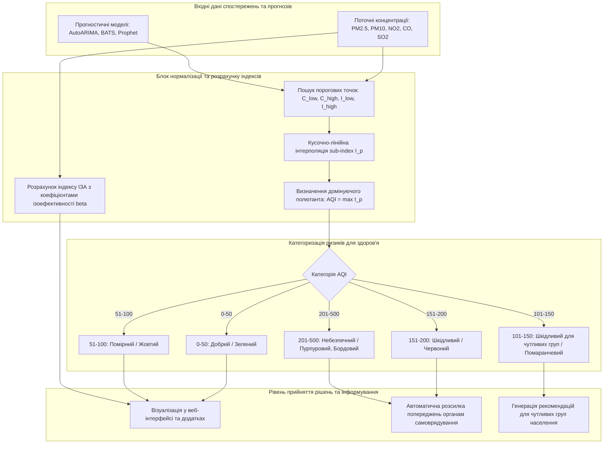

# Змістовий модуль 2. Моделювання екологічних процесів та геоінформаційні технології

# Тема 9. Інформаційні системи прогнозування та оцінки екологічних ризиків

---

## 9.1. Класичні та адаптивні статистичні моделі прогнозування часових рядів (AutoARIMA, ETS, Prophet, TBATS)

### Основний зміст та теоретичний базис
Прогнозування динаміки екологічних параметрів є ключовою ланкою сучасних систем підтримки прийняття рішень у сфері екологічної безпеки та муніципального управління. Атмосферні процеси та динаміка емісій шкідливих речовин формують складні часові ряди, які одночасно містять детерміновані трендові складові, виражену полігармонічну сезонність, стохастичний апаратний і турбулентний шум, а також суттєву нестаціонарність. Здобувачі вищої освіти в межах даного освітнього компонента мають оволодіти як класичними статистичними методологіями, так і сучасними адаптивними моделями простору станів, здатними автоматично підлаштовувати свої параметри під специфіку конкретного екологічного часового ряду.

Математично будь-який екологічний часовий ряд $X_t$ ($t = 1, 2, \dots, T$) може бути декомпонований за допомогою адитивної або мультиплікативної схеми STL (Seasonal and Trend decomposition using Loess):

$$X_t = T_t + S_t + R_t,$$

де $T_t$ — довгострокова трендова компонента, яка відображає системні зміни у структурі викидів або глобальні кліматичні тенденції; $S_t$ — сезонна компонента з періодом $s$ (наприклад, добові коливання $s=24$ або річні цикли $s=12$); $R_t$ — залишкова стохастична компонента (білий шум та нерегулярні сплески).

Класичним інструментом статистичного моделювання виступає методологія Бокса-Дженкінса, реалізована в моделі **ARIMA** (AutoRegressive Integrated Moving Average) порядку $(p, d, q)$. Модель описує стаціонаризований за допомогою взяття різниць порядку $d$ часовий ряд через лінійну комбінацію його попередніх значень (авторегресія, AR) та попередніх помилок прогнозу (ковзне середнє, MA):

$$\nabla^d y_t = c + \sum_{i=1}^{p} \phi_i \nabla^d y_{t-i} + \sum_{j=1}^{q} \theta_j \epsilon_{t-j} + \epsilon_t,$$

де $\nabla^d = (1 - B)^d$ — оператор взяття послідовних різниць порядку $d$; $B$ — оператор зворотного зсуву ($B^k y_t = y_{t-k}$); $\phi_i$ — коефіцієнти авторегресії; $\theta_j$ — коефіцієнти ковзного середнього; $c$ — константа; $\epsilon_t \sim \mathcal{N}(0, \sigma_\epsilon^2)$ — нескорельована послідовність випадкових збурень із нульовим математичним сподіванням і постійною дисперсією. 

У практичних муніципальних системах використовується алгоритм **AutoARIMA**, який автоматизує вибір порядку моделі шляхом послідовного тестування стаціонарності за тестом Дікі-Фуллера (ADF-test) та мінімізації інформаційних критеріїв Акаіке ($\text{AIC}$) чи Шварца ($\text{BIC}$).

Для екологічних часових рядів із вираженими структурними змінами дисперсії застосовується модель експоненційного згладжування в просторі станів **ETS** (Error, Trend, Seasonal). Модель оперує системою рівнянь стану, де рівень ряду $l_t$, тренд $b_t$ та сезонність $s_t$ оновлюються на кожному кроці за допомогою вагових коефіцієнтів згладжування $\alpha, \beta, \gamma, \phi \in [0, 1]$:

$$\begin{cases} \hat{y}_{t+h|t} = l_t + h b_t + s_{t+h-m(k+1)}, \\ l_t = \alpha (y_t - s_{t-m}) + (1 - \alpha)(l_{t-1} + b_{t-1}), \\ b_t = \beta (l_t - l_{t-1}) + (1 - \beta) b_{t-1}, \\ s_t = \gamma (y_t - l_{t-1} - b_{t-1}) + (1 - \gamma) s_{t-m}. \end{cases}$$

Для процесів із надскладною сезонною структурою (одночасна наявність тижневих антропогенних циклів та річних метеорологічних коливань) розроблено моделі класу **BATS** та **TBATS** (Trigonometric Box-Cox transform, ARMA errors, Trend, and Seasonal components). Модель BATS інтегрує нелінійне перетворення Бокса-Кокса $y_t^{(\omega)} = \frac{y_t^\omega - 1}{\omega}$ для стабілізації дисперсії, демпфований тренд та моделювання залишків процесом $\text{ARMA}(p, q)$. Її розширення TBATS використовує тригонометричні ряди Фур'є для апроксимації нецілочисельних та множинних сезонних періодів:

$$s_t^{(i)} = \sum_{j=1}^{k_i} \left[ \alpha_j^{(i)} \cos\left( \frac{2\pi j t}{m_i} \right) + \beta_j^{(i)} \sin\left( \frac{2\pi j t}{m_i} \right) \right],$$

де $m_i$ — тривалість $i$-го сезонного періоду; $k_i$ — кількість гармонік, що визначається автоматично методом максимальної правдоподібності.

Сучасною альтернативою є модель **Prophet**, яка представляє часовий ряд як декомпозиційну регресійну модель:

$$y(t) = g(t) + s(t) + h(t) + \epsilon_t,$$

де $g(t)$ — кусочно-лінійний або логістичний тренд із автоматичним виявленням точок зламу (changepoints); $s(t)$ — сезонні коливання, змодельовані рядами Фур'є; $h(t)$ — ефект нерегулярних факторів (вихідні дні, технологічні аварії, локдауни).

#### Порівняльний аналіз чутливості моделей ARIMA та BATS до характеристик екологічних даних
Емпіричні дослідження показують суттєву диференціацію прогностичної сили моделей ARIMA та BATS залежно від природи екологічного параметра:
* Модель **BATS** демонструє значну перевагу над ARIMA при прогнозуванні показників із вираженою нестаціонарністю, високою волатильністю та складними сезонними патернами, таких як пил, діоксид азоту ($\text{NO}_2$), оксид вуглецю ($\text{CO}$) та формальдегід. Завдяки перетворенню Бокса-Кокса та гнучкій параметризації гармонік BATS ефективно нівелює гетероскедастичність і забезпечує зниження середньоквадратичної похибки прогнозу ($\text{MSE}$) на 40–80 % порівняно з класичною ARIMA.
* Модель **ARIMA** виявляється стійкішою та точнішою для часових рядів, які описуються гладкими фізичними законами з високою автокореляцією першого порядку ($\text{ACF}(1) > 0.8$) та помірною дисперсією залишків після взяття різниць (наприклад, температура повітря, атмосферний тиск, фонові концентрації діоксиду сірки $\text{SO}_2$ і фенолу). Для таких параметрів надлишкова параметризація BATS може призводити до перенавчання (overfitting) на коротких навчальних вибірках.

| Модель прогнозування | Математична основа | Механізм моделювання сезонності | Стійкість до нестаціонарності | Чутливість до шуму та аномалій | Оптимальні екологічні параметри |
| :--- | :--- | :--- | :--- | :--- | :--- |
| **AutoARIMA** | Авторегресія та ковзне середнє $\text{ARIMA}(p,d,q)$ | Сезонне диференціювання $\text{SARIMA}(P,D,Q)_s$ | Висока (через оператор різниць $\nabla^d$) | Висока (чутлива до викидів) | Температура, атмосферний тиск, $\text{SO}_2$, фенол |
| **AutoETS** | Експоненційне згладжування в просторі станів | Адитивні / мультиплікативні коефіцієнти | Помірна (потребує трендової стабілізації) | Середня | Вологість повітря, монотонні тренди емісій |
| **BATS / TBATS** | Перетворення Бокса-Кокса + $\text{ARMA}$ + гармоніки | Тригонометричні ряди Фур'є довільного періоду | Дуже висока (адаптація дисперсії) | Низька (робастна завдяки баєсівській оцінці) | Пил ($\text{PM}_{2.5}$, $\text{PM}_{10}$), $\text{NO}_2$, $\text{CO}$, формальдегід |
| **Prophet** | Адитивна нелінійна регресія з точками зламу | Ряди Фур'є + байєсівське апріорне згладжування | Висока (кусочно-лінійні тренди) | Дуже низька (стійка до пропусків і сплесків) | Загальноміські індекси забруднення, тривалі ряди моніторингу |

Наведена систематизація підтверджує необхідність реалізації алгоритмів автоматичної селекції моделей (Model Selection Engine), які в режимі реального часу аналізують спектральні властивості вхідного сигналу та обирають оптимальний алгоритм прогнозування без втручання оператора.

---

## 9.2. Метрики оцінки точності та надійності екологічних прогнозів (MSE, MAE, RMSE, $R^2$, Index of Agreement)

### Основний зміст та теоретичний базис
Оцінювання якості прогностичних моделей у системах екологічного моніторингу є обов'язковим етапом, що забезпечує верифікацію математичного апарату перед формуванням управлінських рішень. Для запобігання штучному завищенню точності оцінювання здійснюється виключно на відкладеній тестовій вибірці (out-of-sample testing) за схемою ковзного вікна (rolling-window cross-validation).

Основними числовими метриками оцінки похибок виступають:
* **Середньоквадратична похибка (Mean Squared Error, $\text{MSE}$):**
  $$\text{MSE} = \frac{1}{N} \sum_{i=1}^{N} (y_i - \hat{y}_i)^2,$$
  де $N$ — кількість точок у тестовому наборі даних; $y_i$ — фактичне виміряне значення екологічного параметра; $\hat{y}_i$ — прогнозоване значення моделі. Завдяки квадратичній формі $\text{MSE}$ є надзвичайно чутливою до великих похибок та одиничних аномальних відхилень.
* **Середня абсолютна похибка (Mean Absolute Error, $\text{MAE}$):**
  $$\text{MAE} = \frac{1}{N} \sum_{i=1}^{N} |y_i - \hat{y}_i|.$$
  $\text{MAE}$ відображає середню величину похибки в абсолютних одиницях вимірювання і є робастною до випадкових одиничних викидів у вибірці.
* **Корінь із середньоквадратичної похибки (Root Mean Square Error, $\text{RMSE}$):**
  $$\text{RMSE} = \sqrt{\text{MSE}} = \sqrt{\frac{1}{N} \sum_{i=1}^{N} (y_i - \hat{y}_i)^2}.$$
  Метрика повертає похибку до розмірності досліджуваної величини ($\text{mg/m}^3$ або $\mu\text{g/m}^3$), полегшуючи фізичну інтерпретацію відхилень.
* **Коефіцієнт детермінації ($R^2$):**
  $$R^2 = 1 - \frac{\sum_{i=1}^{N} (y_i - \hat{y}_i)^2}{\sum_{i=1}^{N} (y_i - \bar{y})^2},$$
  де $\bar{y} = \frac{1}{N} \sum_{i=1}^{N} y_i$ — середнє арифметичне значення спостережень у тестовій вибірці. Значення $R^2 = 1$ відповідає ідеальному прогнозу; $R^2 = 0$ вказує, що модель працює не краще за просте середнє значення. 

У практиці екологічного прогнозування на коротких зашумлених вибірках нерідко виникає явище **від'ємного коефіцієнта детермінації ($R^2 < 0$)**. Це свідчить про те, що сума квадратів залишків моделі перевищує дисперсію тестових даних ($\sum (y_i - \hat{y}_i)^2 > \sum (y_i - \bar{y})^2$). Причинами такого ефекту є значна нестаціонарність ряду, структурне зміщення рівня або прогнозування фізично неможливих від'ємних концентрацій. Для усунення цієї проблеми в інформаційних системах впроваджується обов'язкова операція пост-обробки на основі функції $\text{ReLU}$: $f(\hat{y}) = \max(0, \hat{y})$, а також розрахунок $R^2$ відносно масштабованої дисперсії тестового зрізу.

* **Індекс узгодженості Віллмотта (Willmott's Index of Agreement, $d$):**
  $$d = 1 - \frac{\sum_{i=1}^{N} (y_i - \hat{y}_i)^2}{\sum_{i=1}^{N} \left( |\hat{y}_i - \bar{y}| + |y_i - \bar{y}| \right)^2}, \quad d \in [0, 1].$$
  Індекс $d$ є стандартизованою мірою ступеня похибки прогнозу моделі і, на відміну від $R^2$, коректно відображає пропорційні та адитивні зсуви без ризику отримання від'ємних значень.

Статистична значущість відмінностей між прогнозами різних моделей верифікується за допомогою непараметричного критерію Вілкоксона для зв'язаних вибірок (Wilcoxon signed-rank test), оскільки розподіл залишків екологічних часових рядів суттєво відхиляється від нормального закону Гауса ($p < 0.05$).

---

## 9.3. Розрахунок комплексних індексів якості атмосферного повітря (AQI, комплексний індекс забруднення атмосфери — ІЗА)

### Основний зміст та теоретичний базис
Для надання населенню та керівним органам зрозумілої інформації про екологічний стан розрізнені показники концентрацій окремих хімічних домішок трансформуються в інтегральні індекси. Найбільш визнаними у світовій практиці є загальний індекс якості повітря (**Air Quality Index, AQI**) за шкалою US EPA / ЄС та вітчизняний комплексний індекс забруднення атмосфери (**ІЗА**).

Розрахунок індексу якості повітря $\text{AQI}$ базується на методі кусочно-лінійної інтерполяції для кожного контрольованого полютанта:

$$I_p = \frac{I_{\text{high}} - I_{\text{low}}}{C_{\text{high}} - C_{\text{low}}} \cdot (C_p - C_{\text{low}}) + I_{\text{low}},$$

де $C_p$ — виміряна або спрогнозована концентрація забруднюючої речовини $p$ (округлена відповідно до нормативних правил); $C_{\text{low}}, C_{\text{high}}$ — нижня та верхня межі діапазону концентрацій (концентраційні точки перегину), що охоплюють значення $C_p$; $I_{\text{low}}, I_{\text{high}}$ — відповідні граничні значення індексу $\text{AQI}$ для даної категорії небезпеки.

Підсумковий інтегральний індекс якості повітря $\text{AQI}$ визначається за правилом домінуючого забруднювача («найгірший показник визначає стан»):

$$\text{AQI} = \max_{p \in \{1, \dots, K\}} I_p.$$

*Рисунок 1 — Структурно-логічна схема розрахунку інтегральних екологічних індексів AQI та ІЗА, категоризації ризиків і формування автоматичних сповіщень*

Паралельно в системі розраховується комплексний індекс забруднення атмосфери ($\text{ІЗА}$), що є стандартом довгострокової державної оцінки в Україні:

$$\text{ІЗА} = \sum_{j=1}^{M} I_j = \sum_{j=1}^{M} \left( \frac{\bar{C}_j}{\text{ГДК}_{c.d., j}} \right)^{\beta_j},$$

де $\bar{C}_j$ — середньорічна концентрація $j$-ї домішки; $\text{ГДК}_{c.d., j}$ — середньодобова гранично допустима концентрація; $\beta_j$ — коефіцієнт ізоефективності шкідливості речовини, що становить $1.7$ для речовин 1-го класу небезпеки, $1.5$ — для 2-го класу, $1.0$ — для 3-го класу, $0.85$ — для 4-го класу. 

Рівень забруднення території класифікується як:
* Низький: при $\text{ІЗА} < 5$;
* Підвищений: при $5 \le \text{ІЗА} < 7$ (характерний для більшості промислових центрів України, зокрема міст Кременчук та Черкаси);
* Високий: при $7 \le \text{ІЗА} < 14$;
* Дуже високий (критичний): при $\text{ІЗА} \ge 14$.

Інтеграція розрахунку показників $\text{AQI}$ та $\text{ІЗА}$ з моделями короткострокового прогнозування дозволяє інформаційній системі не лише відображати поточний стан атмосфери, а й генерувати попереджувальні сигнали тривоги на 24–48 годин уперед, оптимізуючи заходи цивільного захисту населення та графіки технологічних емісій промислових комплексів.

---

### Питання для самоперевірки та аналітичного осмислення

1. Поясніть сутність математичної структури моделей ARIMA та охарактеризуйте фізичний зміст параметрів $(p, d, q)$ у контексті моделювання екологічних процесів.
2. Чому модель BATS/TBATS демонструє вищу точність порівняно з ARIMA під час прогнозування високоентропійних та нестаціонарних рядів концентрацій пилу $\text{PM}_{2.5}$ та діоксиду азоту $\text{NO}_2$?
3. За яких умов під час верифікації прогностичних моделей на екологічних часових рядах спостерігається від'ємне значення коефіцієнта детермінації ($R^2 < 0$), і які методи корекції слід застосувати?
4. У чому полягає перевага індексу узгодженості Віллмотта ($d$) над класичним коефіцієнтом лінійної кореляції Пірсона при оцінюванні надійності прогнозів якості довкілля?
5. Опишіть алгоритм розрахунку сумарного індексу $\text{AQI}$ за формулою кусочно-лінійної інтерполяції та поясніть принцип домінуючого полютанта.
6. Як розраховується комплексний індекс забруднення атмосфери ($\text{ІЗА}$), і яку роль відіграють коефіцієнти ізоефективності $\beta_j$ для різних класів небезпеки токсичних речовин?
7. Яким чином інформаційна система поєднує предиктивні моделі часових рядів із модулями розрахунку $\text{AQI}$ для реалізації системи раннього екологічного оповіщення населення?