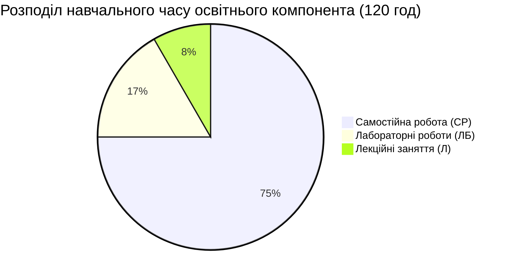
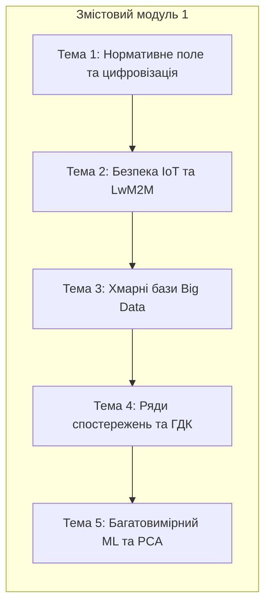
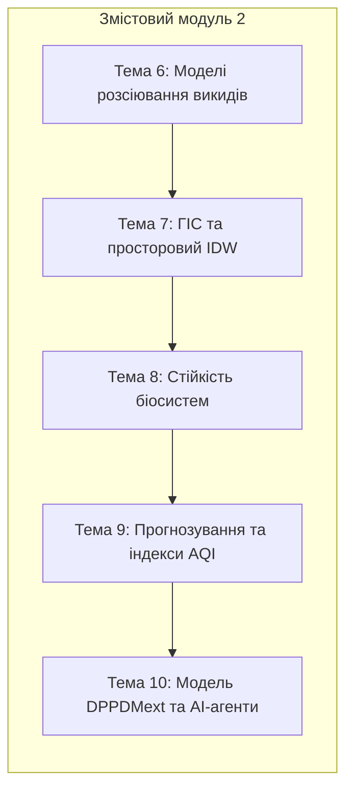

# МЕТОДИЧНІ ВКАЗІВКИ ЩОДО САМОСТІЙНОЇ РОБОТИ
## З ОСВІТНЬОГО КОМПОНЕНТА
## «Інформаційно-аналітичні технології в екологічних системах»

---

## ВСТУП

Самостійна робота здобувачів вищої освіти третього (освітньо-наукового) рівня доктора філософії (PhD) за спеціальністю 101 «Екологія» (освітньо-наукова програма «Екологічна безпека») є провідною формою опанування науково-теоретичного та прикладного матеріалу освітнього компонента «Інформаційно-аналітичні технології в екологічних системах». Вона спрямована на поглиблення фахових компетентностей у сфері математичного моделювання геоекологічних процесів, статистичного аналізу багатовимірної екологічної телеметрії, проєктування архітектур Інтернету речей (IoT) та застосування інструментів штучного інтелекту для розв'язання задач екологічного моніторингу урбанізованих територій.

Навчально-методичне забезпечення самостійної роботи базується на комплексному використанні монографій, сучасних фахових періодичних видань, що індексуються у міжнародних наукометричних базах даних *Scopus* та *Web of Science*, нормативно-правових актів України і Європейського Союзу, а також електронних навчальних посібників та відкритих геоінформаційних ресурсів. Опанування матеріалу передбачає роботу з реальними базами екологічних даних та програмними сценаріями в інтерактивному середовищі *Jupyter Lab* на базі мови програмування *Python*.

Організація самостійної роботи здобувачів здійснюється відповідно до навчального плану та логіко-структурної схеми освітнього компонента. Після кожного аудиторного заняття здобувач виконує систематичне опрацювання наукової літератури, розширює теоретичний базис та реалізує індивідуальні дослідницькі завдання за тематичними напрямами. Для забезпечення системного контролю та надання кваліфікованої науково-методичної допомоги кафедрою встановлено регулярний графік щотижневих консультацій науково-педагогічних працівників, під час яких здійснюється обговорення результатів обчислювальних експериментів, верифікація моделей та проміжний захист етапів науково-дослідного курсового проєкту.

Предметом вивчення освітнього компонента є методи, алгоритми, математичні моделі та програмно-апаратні засоби збору, обробки, геопросторового аналізу та прогнозування параметрів стану навколишнього природного середовища. Мета викладання полягає у формуванні здатності розробляти та впроваджувати інноваційні інформаційно-аналітичні технології для комплексної оцінки екологічних ризиків і підтримки прийняття управлінських рішень у сфері екологічної безпеки.

У результаті самостійного опрацювання матеріалу здобувачі мають оволодіти спеціальними компетентностями:
* **СК04.** Здатність ініціювати, розробляти і реалізовувати комплексні інноваційні проєкти у сфері екології та дотичні до неї міждисциплінарні проєкти, демонструвати лідерство під час їх реалізації;
* **СК05.** Здатність застосовувати сучасні інструменти, електронні інформаційні ресурси, спеціалізоване програмне забезпечення у науковій та освітній діяльності, зокрема для моделювання екологічних процесів і прийняття оптимальних рішень;
* **ПРН05.** Розробляти та реалізовувати наукові та/або інноваційні інженерні проєкти з урахуванням соціальних, етичних, економічних, екологічних та правових аспектів;
* **ПРН06.** Застосовувати сучасні інструменти пошуку, оброблення й аналізу великих масивів екологічної інформації, спеціалізовані бази даних та ГІС.

---

## 1. ТЕМИ ТА ПОГОДИННИЙ РОЗКЛАД ЛЕКЦІЙ І САМОСТІЙНОЇ РОБОТИ

| Назва змістового модуля та теми | Лекції (год) | Самостійна робота (год) |
| :--- | :---: | :---: |
| **Змістовий модуль 1. Системи збору та первинного аналізу даних в екологічному моніторингу** | | |
| Тема 1. Сучасні концепції цифровізації екологічного моніторингу | 1 | 9 |
| Тема 2. IoT-технології та сенсорні мережі в екології | 1 | 9 |
| Тема 3. Проєктування екологічних баз даних | 1 | 9 |
| Тема 4. Статистичні методи аналізу складних екологічних даних | 1 | 9 |
| Тема 5. Багатовимірний аналіз та інтелектуальні технології | 1 | 9 |
| **Усього за змістовим модулем 1** | **5** | **45** |
| **Змістовий модуль 2. Моделювання екологічних процесів та геоінформаційні технології** | | |
| Тема 6. Комп’ютерне моделювання переносу та дифузії забруднюючих речовин | 1 | 9 |
| Тема 7. Геоінформаційні системи в екологічних дослідженнях | 1 | 9 |
| Тема 8. Моделювання динаміки та стійкості екологічних систем | 1 | 9 |
| Тема 9. Інформаційні системи прогнозування та оцінки екологічних ризиків | 1 | 9 |
| Тема 10. Квантово-гібридні та інтелектуальні платформи просторового прогнозування | 1 | 9 |
| **Усього за змістовим модулем 2** | **5** | **45** |
| Виконання індивідуального завдання (Науково-дослідний курсовий проєкт) | — | *(в межах СР)* |
| **ВСЬОГО ГОДИН З ОСВІТНЬОГО КОМПОНЕНТА** | **10** | **90** |

---

## 2. ПЕРЕЛІК ТЕМ І ПИТАНЬ ДЛЯ САМОСТІЙНОГО ОПРАЦЮВАННЯ

### Змістовий модуль 1. Системи збору та первинного аналізу даних в екологічному моніторингу

#### Тема 1. Дослідження нормативно-правової бази України та Директив ЄС щодо стандартизації обміну просторовими екологічними даними

**Теми для самостійного опрацювання:**
1. Системний аналіз вимог нової Директиви Європейського Парламенту та Ради (EU) 2024/2881 від 11 квітня 2024 року про якість атмосферного повітря та чистіше повітря для Європи (AAQD) у порівнянні з Директивою 2008/50/EC.
2. Дослідження механізмів імплементації положень Постанови Кабінету Міністрів України № 827 від 14 серпня 2019 року щодо функціонування державної системи моніторингу довкілля та організації управління якістю повітря за зонами й агломераціями.
3. Науково-методичні засади функціонування просторової інфраструктури екологічних даних відповідно до стандартів директиви *INSPIRE* (Infrastructure for Spatial Information in Europe).
4. Оцінка розбіжностей між вітчизняною методологією санітарно-гігієнічного нормування на основі гранично допустимих концентрацій (ГДК) та європейською концепцією цільових і граничних показників оцінки ризику для здоров'я населення.
5. Концептуальні підходи до побудови цифрових двійників міст (*Urban Digital Twins*) як мультидисциплінарних платформ об'єднання просторових моделей, інфраструктурних параметрів та екологічної телеметрії в реальному часі.
6. Огляд архітектури та функціоналу національної онлайн-платформи «ЕкоСистема» та державних геопорталів просторових даних.

**Практичне завдання у форматі Jupyter Notebook:**
* Розробка скрипту на мові Python для автоматичного парсингу та порівняльного співставлення нормативів гранично допустимих концентрацій (ГДК) України та граничних величин Директиви ЄС 2024/2881 для основних маркерів: $\text{NO}_2$, $\text{SO}_2$, $\text{CO}$, $\text{PM}_{2.5}$, $\text{PM}_{10}$.

**Питання для самоперевірки:**
1. У чому полягають принципові відмінності між концепцією санітарного оцінювання якості повітря за разовими ГДК та європейською методологією врахування середньорічних граничних величин з контролем експозиції популяції?
2. Які ключові структурні вимоги висуває Постанова КМУ № 827 до суб'єктів моніторингу при виділенні зон та агломерацій в Україні?
3. Як директива *INSPIRE* регламентує сумісність метаданих та просторових шарів в інтегрованих екологічних геоінформаційних системах?
4. Яку роль відіграють цифрові двійники міст у реалізації предикативного управління екологічною безпекою урбосистем?
5. Чому перехід на стандарти Директиви (EU) 2024/2881 вимагає обов'язкової диференціації контролю завислих речовин на фракції $\text{PM}_{2.5}$ та $\text{PM}_{10}$?
6. Які інформаційні обмеження виникають при тижневому ретроспективному інформуванні громадськості порівняно з онлайн-системами оповіщення в режимі реального часу?

**Література:** [1, 2, 4, 7, 14, 15, 16].

---

#### Тема 2. Безпекові аспекти функціонування критичної інфраструктури систем екологічного моніторингу

**Теми для самостійного опрацювання:**
1. Формалізація математичної моделі оцінки ризиків інформаційної безпеки для розподілених систем екологічного моніторингу з урахуванням імовірності реалізації загроз та потенційного збитку за критеріями конфіденційності, цілісності й доступності:
   $$R = \sum_{t \in T} P_t \cdot \left( w_C I_{t,C} + w_I I_{t,I} + w_A I_{t,A} \right)$$
2. Дослідження архітектурних переваг легковагового протоколу *Lightweight M2M* (LwM2M v1.2) над протоколами MQTT та HTTP/REST при передачі екологічної інформації в умовах ресурсообмежених периферійних мікроконтролерів (ESP32, ARM Cortex-M).
3. Аналіз криптографічних алгоритмів захисту транспортного рівня DTLS 1.3 (Datagram Transport Layer Security) із застосуванням попередньо розподілених ключів (PSK) та сертифікатів відкритого ключа (RPK, X.509).
4. Проєктування моделі динамічного адаптивного контролю доступу до ресурсів сенсорних станцій на основі атрибутів (*Attribute-Based Access Control*, ABAC).
5. Алгоритмізація процедур захищеного початкового конфігурування (*Secure Bootstrapping*) екологічних сенсорних вузлів при підключенні до муніципального сервера управління.
6. Математичне моделювання впливу індукованого трафіку хибних подій та мережевих перевантажень на показники живучості, доступності та енергетичного виснаження акумуляторних сенсорних вузлів у чергових системах типу $M/D/1/K$.

**Практичне завдання у форматі Jupyter Notebook:**
* Реалізація функції обчислення залишкового інформаційного ризику $R^{(M)}$ та оцінки вартості впровадження захисних заходів $C(M)$ для сенсорної мережі промислового підприємства при різних сценаріях кіберзагроз.

**Питання для самоперевірки:**
1. Які специфічні вразливості мають периферійні вузли екологічного моніторингу за умов обмеженого обсягу оперативної пам'яті (RAM 10–50 Кб)?
2. У чому полягає відмінність функціонування протоколу LwM2M поверх CoAP/UDP від брокерної моделі MQTT/TCP у контексті енергозбереження датчиків?
3. Як формалізується зв'язок між затримкою обслуговування пакетів у буфері сенсора та імовірністю втрати екологічної телеметрії за моделлю $M/D/1/K$?
4. Які критерії формують вектор політики безпеки в системі ABAC при спробі віддаленої зміни конфігурації вимірювальної станції?
5. Чому спотворення екологічних даних внаслідок атак типу Data Spoofing становить загрозу національній безпеці та життєдіяльності міст?
6. Як розраховується баланс споживання енергії акумуляторного сенсорного вузла з урахуванням накладних витрат на криптографічні операції DTLS?

**Література:** [3, 8, 9, 10, 11].

---

#### Тема 3. Технології інтеграції екологічних баз даних із глобальними хмарними сервісами та сховищами Big Data

**Теми для самостійного опрацювання:**
1. Проєктування багаторівневої структури бази даних для накопичення первинних щохвилинних та усереднених (20-хвилинних, добових, місячних, річних) показників якості повітря.
2. Методологія ліквідації дублікатів та часової синхронізації вимірювань за унікальними індексами часових міток `measurement_time` та ідентифікаторами станцій `station_id`.
3. Порівняльний аналіз реляційних СУБД (PostgreSQL з розширенням TimescaleDB) та розподілених нереляційних сховищ (OpenSearch, MongoDB) при обробці гетерогенних екологічних потоків.
4. Дослідження протоколів та інструментів агрегації даних із відкритих API: використання бібліотеки `Guzzle HTTP` у бекенд-системах та модулів `requests` і `urllib3` у скриптах автоматизації.
5. Розробка архітектури брокерів повідомлень та черг завдань (Cron, Celery, Redis) для регулярного вивантаження логів роботи автоматичних метеостанцій.
6. Економічна оцінка та технічне обґрунтування створення локальних муніципальних сховищ екологічних даних на противагу платним хмарним підпискам виробників обладнання (*Vaisala Cloud*).

**Практичне завдання у форматі Jupyter Notebook:**
* Побудова ETL-пайплайну (Extract, Transform, Load) у середовищі *pandas* для отримання сирого JSON-дампу екологічної телеметрії, агрегації показників за 20-хвилинними інтервалами та експорту очищених даних у базу SQLite.

**Питання для самоперевірки:**
1. Чому пряме збереження щохвилинних даних з десятків станцій без попередньої оптимізації структури призводить до деградації швидкодії аналітичних SQL-запитів?
2. Яким чином вирішується проблема неоднорідності найменувань параметрів у різних постачальників датчиків при приведенні даних до єдиного вектору ознак?
3. Які переваги надає використання розподіленого індексу OpenSearch для ведення системного аудиту та збереження журналів подій екологічних станцій?
4. Як організовується робота фонових завдань (Cron) для регулярного оновлення таблиць усереднення без блокування основної бази даних?
5. У чому полягає економічна та безпекова доцільність переходу муніципалітету на відкритий стек програмного забезпечення моніторингу?
6. Які механізми валідації вхідних даних запобігають запису нульових або від'ємних фізично неможливих значень концентрацій газів?

**Література:** [5, 6, 9, 10].

---

#### Тема 4. Методики відновлення пропущених значень та усунення аномалій у тривалих рядах екологічних спостережень

**Теми для самостійного опрацювання:**
1. Математичне обґрунтування методів виявлення статистичних викидів та апаратних аномалій в екологічних вибірках на основі аналізу нормального розподілу Гауса та критерію трьох сигм ($|X_t - \mu| > 3\sigma$).
2. Алгоритми відновлення локальних короткострокових прогалин (до 6 годин) засобами лінійної, поліноміальної та сплайн-інтерполяції часових рядів.
3. Дослідження методів обробки тривалих пропусків у даних із застосуванням алгоритмів просторово-часової регресії та векторних моделей найближчих сусідів (kNN).
4. Методологія STL-декомпозиції (Seasonal and Trend decomposition using Loess) екологічних часових рядів на детермінований тренд $T_t$, гармонійну сезонність $S_t$ та стохастичний залишок $R_t$:
   $$X_t = T_t + S_t + R_t$$
5. Оцінка стаціонарності рядів спостережень: математична сутність розширеного тесту Дікі-Фуллера (ADF) та розрахунок автокореляційної функції (ACF) для виявлення сезонних циклів:
   $$\text{ACF}(k) = \frac{\sum_{t=1}^{T-k}(X_t - \mu)(X_{t+k} - \mu)}{\sum_{t=1}^T (X_t - \mu)^2}$$
6. Алгоритмізація автоматизованого контролю перевищень нормативів ГДК відповідно до Постанови КМУ № 827 із розрахунком кумулятивних показників тривалості небезпечних періодів.

**Практичне завдання у форматі Jupyter Notebook:**
* Реалізація автоматизованого конвеєра STL-декомпозиції 35-місячного ряду концентрації пилу та оксиду вуглецю, проведення ADF-тесту на стаціонарність та підрахунок частоти перевищення середньодобових норм ГДК.

**Питання для самоперевірки:**
1. Чому наявність високої автокореляції на першому лазі ($\text{ACF}_1 > 0.8$) є критично важливою для вибору класу прогностичної моделі?
2. У яких випадках видалення пропущених даних є більш методично обґрунтованим, ніж їх штучна інтерполяція?
3. Чому часові ряди забруднювачів (CO, $\text{NO}_2$) в умовах міського середовища є нестаціонарними за критерієм ADF ($p\text{-value} > 0.05$)?
4. Як працює алгоритм подвійної перевірки умов для виявлення випадків перевищення встановленого порогу протягом трьох послідовних годин?
5. Який фізичний зміст має залишкова компонента $R_t$ після вилучення сезонності та тренду з часового ряду екологічних спостережень?
6. Як впливає нерівномірна дискретизація вихідних даних на похибку визначення середньомісячних концентрацій забруднюючих речовин?

**Література:** [1, 2, 6, 7].

---

#### Тема 5. Порівняльний аналіз методів машинного навчання при вирішенні задач класифікації та прогнозування стану екосистем

**Теми для самостійного опрацювання:**
1. Теоретичні засади застосування кореляційного аналізу для виявлення спільних джерел екологічної емісії: побудова та аналіз симетричних матриць парної кореляції між різнорідними полютантами:
   $$R = \begin{bmatrix} 1 & r_{12} & \dots & r_{1n} \\ r_{21} & 1 & \dots & r_{2n} \\ \vdots & \vdots & \ddots & \vdots \\ r_{n1} & r_{n2} & \dots & 1 \end{bmatrix}$$
2. Математичний апарат методу головних компонент (PCA): спектральна декомпозиція коваріаційної матриці, проекція на головні осі та визначення внеску власних значень у загальну дисперсію вибірки.
3. Зниження розмірності простору екологічних ознак для ідентифікації домінуючих факторів антропогенного навантаження в промислових центрах.
4. Порівняльний аналіз алгоритмів класифікації (*Decision Trees*, *Random Forest*, *k-Nearest Neighbors*) для категоріальної оцінки якості атмосферного повітря.
5. Застосування методів ансамблевого навчання (Gradient Boosting, CatBoost, LightGBM) для нелінійної апроксимації концентрацій токсичних речовин.
6. Оцінка метрик якості моделей класифікації екологічних станів: матриця невідповідностей (Confusion Matrix), показники точності (Precision), повноти (Recall), F1-score та коефіцієнт кореляції Метьюса (MCC).

**Практичне завдання у форматі Jupyter Notebook:**
* Побудова кореляційної матриці взаємозв'язку між п'ятьма забруднювачами ($\text{PM}_{2.5}$, $\text{CO}$, $\text{NO}_2$, $\text{SO}_2$, формальдегід), виконання факторизації простору ознак методом PCA у бібліотеці `scikit-learn` та 2D-візуалізація кластерів моніторингових постів.

**Питання для самоперевірки:**
1. Про що свідчить наявність стійкої позитивної кореляції ($r \approx 0.42$) між монооксидом вуглецю та діоксидом азоту в зоні міської автодороги?
2. Яким чином метод PCA дозволяє виявити приховані фактори забруднення без попереднього маркування навчальної вибірки?
3. Чому метрика загальної точності (Accuracy) може надавати викривлену оцінку при діагностиці рідкісних екстремальних екологічних катастроф?
4. У чому полягають обмеження класичних моделей машинного навчання при їх тренуванні на малих часових вибірках екологічних спостережень?
5. Як запобігти явищу перенавчання (overfitting) моделей дерев рішень при аналізі зашумлених вимірювань сенсорних мереж?
6. Які математичні критерії використовуються для вибору кількості головних компонент за правилом Кайзера та графіком кам'янистого осипу (*Scree plot*)?

**Література:** [1, 2, 5, 7, 13].

---

### Змістовий модуль 2. Моделювання екологічних процесів та геоінформаційні технології

#### Тема 6. Дослідження та використання спеціалізованого програмного забезпечення для моделювання транскордонного переносу забруднень

**Теми для самостійного опрацювання:**
1. Фізико-математичні основи розсіювання газоаерозольних домішок у планетарному пограничному шарі атмосфери: аналітичні розв'язки диференціальних рівнянь переносу та дифузії.
2. Гаусова модель шлейфу від точкового стаціонарного джерела з урахуванням висоти викиду, швидкості вітру та коефіцієнтів атмосферної дисперсії Пасквілла–Гіффорда $\sigma_y(x)$, $\sigma_z(x)$:
   $$C(x,y,z) = \frac{Q}{2\pi u \sigma_y \sigma_z} \exp\left( -\frac{y^2}{2\sigma_y^2} \right) \left[ \exp\left( -\frac{(z-H)^2}{2\sigma_z^2} \right) + \exp\left( -\frac{(z+H)^2}{2\sigma_z^2} \right) \right]$$
3. Моделювання динаміки розсіювання викидів автотранспорту в каньйонах міських вулиць: комбінування агентного алгоритму руху автомобілів $A^*$ з двовимірними згортковими фільтрами на базі дискретного Гаусового ядра.
4. Огляд структури та функціоналу систем чисельного моделювання траєкторій транскордонного переносу NOAA HYSPLIT.
5. Застосування апарату дробового числення для опису турбулентної дифузії в неоднорідних шарах атмосфери над урбанізованими ландшафтами.
6. Моделювання впливу температурних інверсій та штильових ситуацій на формування локальних критичних зон накопичення полютантів.

**Практичне завдання у форматі Jupyter Notebook:**
* Створення 2D-симуляції розсіювання викидів $\text{NO}_2$ від міської автомагістралі на прямокутній дискретній сітці з використанням двовимірної згортки `scipy.signal.convolve2d` та матриці Гаусових ваг.

**Питання для самоперевірки:**
1. Як змінюється розподіл концентрації викидів при переході від умов конвективної нестійкості атмосфери до режиму температурної інверсії?
2. Яким чином алгоритм $A^*$ дозволяє моделювати динамічну щільність транспортних потоків та їх вплив на формування лінійних джерел забруднення?
3. Чому класичні Гаусові моделі мають суттєві похибки при розрахунку концентрацій у безпосередній близькості до складних будівельних перешкод?
4. У чому полягає відмінність між ейлеровим та лагранжевим підходами до комп'ютерного моделювання переносу повітряних мас?
5. Як визначається критична концентрація забруднювача в зоні дихання пішоходів при інтенсивному русі автотранспорту?
6. Які вхідні метеорологічні параметри є найбільш чутливими для розрахунку параметрів атмосферної дисперсії?

**Література:** [1, 12, 17, 18, 19].

---

#### Тема 7. Використання даних дистанційного зондування Землі та методів просторової інтерполяції у ГІС-дослідженнях екосистем

**Теми для самостійного опрацювання:**
1. Теоретичне обґрунтування методу просторової інтерполяції за алгоритмом зворотних зважених відстаней (Inverse Distance Weighting, IDW):
   $$Z(x_0, y_0) = \frac{\sum_{i=1}^N w_i(x_0, y_0) Z_i}{\sum_{i=1}^N w_i(x_0, y_0)}, \quad w_i(x_0, y_0) = \frac{1}{d_i^p}$$
2. Вплив параметра степеня згладжування $p$ на чутливість розрахункових полів до локальних пікових викидів та усунення геометричних артефактів «бичачого ока» (*bull's-eye effect*).
3. Методика виділення фонових зон мінімального забруднення ($z(x,y) \le z_{\min} + \alpha \cdot (z_{\max} - z_{\min})$) та розрахунку градієнта концентрацій між цільовою і фоновою точками:
   $$\Delta C = C(x_{\text{target}}, y_{\text{target}}) - C(x_{\text{background}}, y_{\text{background}})$$
4. Ідентифікація просторових «сліпих зон» у фізичній мережі станцій моніторингу шляхом зіставлення інтерпольованих полів із результатами імітаційного моделювання джерел емісій.
5. Обробка багатоспектральних супутникових знімків систем *Sentinel-2* та *Landsat* для розрахунку нормалізованого різницевого вегетаційного індексу:
   $$\text{NDVI} = \frac{\text{NIR} - \text{Red}}{\text{NIR} + \text{Red}}$$
6. Застосування бібліотек `GeoPandas`, `Shapely` та відкритої платформи *QGIS* для векторного аналізу, просторових перетинів та побудови ізоліній екологічного навантаження.

**Практичне завдання у форматі Jupyter Notebook:**
* Побудова геопросторової карти інтерполяції IDW за реальними координатами постів спостереження, виділення контуру 10% найменш забруднених (фонових) територій міста та визначення ділянки для розміщення нової станції.

**Питання для самоперевірки:**
1. У чому полягає математична різниця між детерміністичною інтерполяцією IDW та геостатистичним методом Kriging?
2. Яким чином порівняння цільової точки на мостовому переході з фоновим постом житлового масиву доводить наявність локального автотранспортного джерела емісій?
3. Чому низька щільність розташування стаціонарних постів моніторингу призводить до виникнення просторових артефактів на інтерпольованій карті?
4. Як спектральні канали ближнього інфрачервоного (NIR) та червоного (Red) випромінювання дозволяють діагностувати деградацію міського рослинного покриву?
5. Яким чином результати просторової інтерполяції можуть використовуватися як екзогенні змінні ($C_{\text{background}}$) у нейромережевих моделях прогнозування?
6. Які правила вибору системи координат (перехід від географічних координат EPSG:4326 до метричних проєкцій EPSG:3857) необхідно враховувати для точного обчислення евклідових відстаней $d_i$?

**Література:** [1, 2, 7, 12, 17].

---

#### Тема 8. Моделювання кругообігу речовин, трофічних ланцюгів та стійкості екосистем

**Теми для самостійного опрацювання:**
1. Математичні моделі популяційної динаміки в умовах техногенного стресу: розширення системи нелінійних диференціальних рівнянь Лотки–Вольтерра параметрами токсичного навантаження:
   $$\begin{cases} \frac{dx}{dt} = x (\alpha - \beta y - \mu_1 C) \\ \frac{dy}{dt} = y (-\gamma + \delta x - \mu_2 C) \end{cases}$$
2. Фазовий аналіз стійкості стаціонарних станів біосистем методом лінеаризації за першим наближенням Ляпунова.
3. Моделювання процесів евтрофікації та балансу розчиненого кисню у відкритих водоймах при надходженні стічних вод із підвищеним вмістом сполук Нітрогену, Фосфору та БСК.
4. Біокінетичні моделі біологічного очищення висококонцентрованих стоків у реакторах послідовно-періодичної дії (SBR) за участю адаптованого активного мулу: кінетика нітрифікації, денітрифікації та фосфатакумуляції.
5. Математична формалізація правила Вант-Гоффа для розрахунку температурних коефіцієнтів швидкості деградації біоматеріалів та термінів стабільності біопродуктів:
   $$Q_{10} = \left( \frac{v_2}{v_1} \right)^{\frac{10}{T_2 - T_1}}$$
6. Розрахунок екологічної ємності природно-техногенних систем та порогів стійкості ландшафтів до хімічного та фізичного впливу.

**Практичне завдання у форматі Jupyter Notebook:**
* Чисельне інтегрування моделі Лотки–Вольтерра з параметром токсичності $C(t)$ за допомогою методу `scipy.integrate.odeint` та побудова фазового портрета системи для оцінки втрати популяційної рівноваги.

**Питання для самоперевірки:**
1. Як змінюється топологія фазових траєкторій у моделі «хижак–жертва» при введенні постійного коефіцієнта токсичної смертності?
2. Які мікробіологічні групи активного мулу забезпечують процеси денітрифікації та біологічного вилучення фосфатів у SBR-біореакторах?
3. Чому зниження розчиненого кисню у водоймі є ключовим індикатором перевищення її асиміляційної ємності?
4. Як за допомогою коефіцієнта $Q_{10}$ здійснюється екстраполяція термінів збереження стабільності біологічних систем при зміні температурного режиму?
5. У чому полягає відмінність між гомеостазом природної екосистеми та штучно керованим квазірівноважним станом у біотехнологічних очисних спорудах?
6. Які математичні критерії визначають біфуркаційний перехід екосистеми до незворотної деградації під впливом антропогенного навантаження?

**Література:** [12, 18, 19, 20].

---

#### Тема 9. Інтеграційні рішення для систем раннього екологічного оповіщення населення та прогнозування часових рядів

**Теми для самостійного опрацювання:**
1. Алгоритми автоматизованого підбору оптимальних моделей прогнозування часових рядів: класичні лінійні моделі авторегресії (ARIMA/SARIMA) проти моделей простору станів (BATS, TBATS).
2. Математичний апарат моделей BATS/TBATS для апроксимації рядів із складною мульти-сезонністю, нецілочисельними періодами та Box-Cox перетворенням:
   $$\hat{y}_t = l_{t-1} + \sum_{k=1}^K s_{t-k}$$
3. Дослідження декомпозиційної моделі прогнозування *Prophet* (адитивні тренди, сезонні гармоніки Фур'є, врахування святкових аномалій).
4. Порівняльний аналіз прогностичних метрик точності моделей на валідаційному інтервалі: Mean Squared Error (MSE), Root Mean Squared Error (RMSE), Mean Absolute Error (MAE) та коефіцієнта детермінації ($R^2$).
5. Алгоритм розрахунку уніфікованого індексу якості повітря (Air Quality Index, AQI) за сукупністю ключових забруднювачів:
   $$I = \frac{I_{\text{high}} - I_{\text{low}}}{C_{\text{high}} - C_{\text{low}}} (C - C_{\text{low}}) + I_{\text{low}}, \quad \text{AQI} = \max(I_1, I_2, \dots, I_M)$$
6. Принципи побудови архітектури систем раннього оповіщення населення про хімічні та радіаційні загрози з використанням картографічних веб-панелей.

**Практичне завдання у форматі Jupyter Notebook:**
* Розробка скрипту у бібліотеці `sktime` для автоматичного вибору між моделями AutoARIMA та BATS за критерієм мінімуму MSE на тестових даних концентрації формальдегіду з наступним розрахунком категорії індексу AQI.

**Питання для самоперевірки:**
1. Чому модель BATS часто перевершує класичну ARIMA при прогнозуванні концентрацій полютантів із вираженими річними та добовими циклами?
2. Як нелінійна кусково-лінійна функція індексу AQI нормалізує різнорідні діапазони токсичності окремих газів до шкали 0–500?
3. Чому від'ємні значення коефіцієнта детермінації ($R^2 < 0$) свідчать про те, що прогнозна модель працює гірше за просте середнє арифметичне ряду?
4. Які переваги надає інтеграція методів ковзного вікна (*rolling-window cross-validation*) при оцінці прогностичної надійності екологічних часових рядів?
5. Яким чином визначається пріоритетний забруднювач, що формує фінальне значення інтегрального індексу AQI на певній станції?
6. Як розраховується комплексний індекс забруднення атмосфери (ІЗА) з урахуванням класу небезпеки кожного окремого полютанта?

**Література:** [1, 2, 6, 7, 14, 16].

---

#### Тема 10. Аналіз перспектив використання квантових обчислень та когнітивних LLM-агентів за концепцією DPPDMext

**Теми для самостійного опрацювання:**
1. Формалізація розширеної концептуальної моделі підготовки та прогнозного моделювання екологічних даних $\text{DPPDMext} = \langle D, T, F, P_{ext}, F, V \rangle$, де предиктивне ядро $P_{ext} = \langle A, P, Q, M, E \rangle$ поєднує аналіз ($A$), гібридний прогноз ($P$), оптимізацію якості ($Q$), просторове моделювання ($M$) та експертну верифікацію ($E$).
2. Теоретичні засади квантового машинного навчання (QML) для задач малої вибірки: квантове кодування даних методом *AngleEmbedding* та обробка у варіаційних квантових схемах (VQC):
   $$\langle Z_i \rangle = \text{Tr}(\rho \cdot Z_i), \quad \hat{y} = \frac{1}{Q}\sum_{i=1}^Q \langle Z_i \rangle$$
3. Аналіз індуктивної переваги квантових нейромереж (Quantum-LSTM, Quantum-GRU, Quantum-Transformer) при апроксимації параметрів високої регулярності (тиск, вологість) проти ризику перенавчання на стохастичних вибірках (температура, CO).
4. Проблема «безплідних плато» (*Barren Plateaus*) у ландшафті навчання варіаційних квантових алгоритмів при оптимізації параметрів квантових гейтів.
5. Розробка когнітивних агентів на основі великих мовних моделей (LLM: DeepSeek-R1, LLaVA) для автоматизованого аудиту числових матриць помилок, читання графіків та формулювання експертних рекомендацій:
   $$\text{Report} = f_{\text{LLM}}(M, A)$$
6. Перспективи побудови замкнених саморегульованих децентралізованих екологічних мереж (DePIN) із застосуванням смарт-контрактів та мікромережевих екокластерів.

**Практичне завдання у форматі Jupyter Notebook:**
* Побудова програмного контуру взаємодії з локальним API мовної моделі (через Ollama / LM Studio), передача числових метрик якості прогнозування ($MSE, MAE, R^2$) та отримання структурованого аналітичного звіту з рекомендаціями для екологічної служби.

**Питання для самоперевірки:**
1. Які функціональні етапи входять до розширеного прогностичного ядра $P_{ext}$ у концептуальній моделі $\text{DPPDMext}$?
2. За рахунок яких квантово-механічних явищ (суперпозиція, заплутаність) VQC-шари забезпечують розширення простору ознак при обробці коротких екологічних часових рядів?
3. Чому квантово-гібридні моделі демонструють істотне зниження похибки MSE для параметрів тиску й вологості, проте зазнають деградації на зашумлених рядах температури?
4. У чому полягає обмеження сучасних Vision-Language моделей (VLM) при самостійному встановленні причинно-наслідкових зв'язків екологічних аномалій?
5. Як організовано зворотний зв'язок між когнітивним модулем експертної оцінки ($E$) та блоком оптимізації якості прогнозування ($Q$)?
6. Яку роль відіграють децентралізовані фізичні інфраструктурні мережі (DePIN) у забезпеченні прозорості та незмінності екологічних реєстрів моніторингу?

**Література:** [1, 3, 7, 8, 13].

---

## 3. ПИТАННЯ ДО МОДУЛЬНОГО ТА ПІДСУМКОВОГО СЕМЕСТРОВОГО КОНТРОЛЮ

### Змістовий модуль 1. Системи збору та первинного аналізу даних в екологічному моніторингу

1. Охарактеризуйте структуру державної системи моніторингу довкілля України та її основні суб'єкти.
2. Проаналізуйте вимоги Директиви ЄС 2008/50/EC щодо стандартів якості атмосферного повітря.
3. Які нові граничні показники та концептуальні положення впроваджує оновлена Директива (EU) 2024/2881 (AAQD)?
4. Опишіть алгоритм розподілу території країни на зони та агломерації відповідно до Постанови КМУ № 827.
5. Розкрийте зміст поняття «Цифровий двійник міста» (*Urban Digital Twin*) в задачах урбоекології.
6. Які типи сенсорів використовуються у сучасних автоматичних станціях контролю повітря (Vaisala AQT420 тощо)?
7. Порівняйте фізичні принципи роботи оптичних та електрохімічних газових сенсорів.
8. У чому полягають апаратні та обчислювальні обмеження мікроконтролерів при зборі екологічної телеметрії?
9. Проведіть порівняльний аналіз мережевих протоколів HTTP, MQTT та CoAP для екологічних сенсорних мереж.
10. Охарактеризуйте архітектурну модель протоколу *Lightweight M2M* (LwM2M) та його структуру об'єктів.
11. Як забезпечується криптографічний захист каналу передачі екологічних даних за допомогою протоколу DTLS?
12. Поясніть механізм функціонування моделі динамічного контролю доступу ABAC на сенсорних станціях.
13. Опишіть етапи процедури безпечного початкового підключення (*Secure Bootstrapping*) IoT-пристроїв.
14. Наведіть математичну формулу оцінки інтегрального інформаційного ризику для систем екологічного моніторингу.
15. Які фактори спричиняють деградацію мережі та втрату доступності сенсорних вузлів у моделі $M/D/1/K$?
16. Обґрунтуйте необхідність розділення бази даних екологічного моніторингу на таблиці з різною дискретизацією.
17. Як реалізується алгоритм видалення дублікатів вимірювань за часовими мітками у реляційній базі даних?
18. Охарактеризуйте особливості інтеграції та збору даних через відкритий інтерфейс *SaveEcoBot API*.
19. У чому полягають переваги використання нереляційного сховища OpenSearch для аналізу системних логів моніторингу?
20. Опишіть структуру запиту до *Vaisala API* для вивантаження метеорологічних та газових показників.
21. Як проводиться статистичне очищення вибірки та виявлення викидів за критерієм трьох сигм ($3\sigma$)?
22. Поясніть алгоритм фільтрації аномалій у часових рядах спостережень на основі міжквартильного розмаху (IQR).
23. Розкрийте сутність та математичний апарат STL-декомпозиції екологічних часових рядів.
24. Яке призначення має розширений тест Дікі-Фуллера (ADF) при підготовці даних до моделювання?
25. Як за допомогою автокореляційної функції (ACF) визначається наявність добової та річної сезонності?
26. Наведіть математичну формалізацію алгоритму перевірки умов перевищення нормативів ГДК за формулою $P_{i,j,t}$.
27. Як працює лічильник послідовних перевищень нормативів (streak-аналіз) у часовому ряді?
28. Які особливості розрахунку матриці парних кореляцій Пірсона між показниками забруднення довкілля?
29. Поясніть екологічну природу високої кореляції між концентраціями пилу та сажі в міському повітрі.
30. У чому полягає математична сутність ортогонального перетворення ознак методом головних компонент (PCA)?
31. Як інтерпретується графік власних значень (*Scree plot*) при визначенні кількості головних компонент у PCA?
32. Опишіть алгоритм застосування методу Random Forest для задачі визначення класу небезпеки якості повітря.
33. Які переваги надає коефіцієнт кореляції Метьюса (MCC) при оцінці якості незбалансованих екологічних вибірок?
34. Як впливає попереднє масштабування даних (Min-Max нормалізація) на якість роботи методів машинного навчання?
35. Охарактеризуйте концепцію захисту критичної інфраструктури моніторингу довкілля від атак типу Denial of Service.

---

### Змістовий модуль 2. Моделювання екологічних процесів та геоінформаційні технології

1. Наведіть класичне рівняння Гаусової моделі розсіювання викидів від точкового промислового джерела.
2. Як визначаються коефіцієнти просторової дисперсії $\sigma_y(x)$ та $\sigma_z(x)$ за методикою Пасквілла–Гіффорда?
3. Поясніть фізичний зміст ефекту відбиття домішки від поверхні землі в Гаусовій моделі.
4. Опишіть принцип застосування евристичного алгоритму $A^*$ для моделювання руху транспортних потоків.
5. Як реалізується процес атмосферного розсіювання на дискретній сітці за допомогою двовимірної згортки з Гаусовим ядром?
6. Яким чином поєднуються параметри інтенсивності емісій автомобілів та топологія міських доріг у симуляторі трафіку?
7. Розкрийте математичний апарат методу просторової інтерполяції за методом зворотних зважених відстаней (IDW).
8. Як впливає вибір степеня згладжування $p$ в алгоритмі IDW на формування контурів ізоконцентрацій?
9. Поясніть методику математичного визначення фонових референтних точок за допомогою коефіцієнта відсікання $\alpha$.
10. Як розраховується градієнт концентрації $\Delta C$ між цільовим об'єктом дослідження та регіональним фоном?
11. Яким чином виявляються інформаційні «сліпі зони» у фізичній мережі станцій за результатами імітаційного моделювання?
12. Опишіть процедуру розрахунку вегетаційного індексу NDVI за спектральними каналами супутника *Sentinel-2*.
13. Як використовуються супутникові дані температури поверхні землі (LST) для оцінки ефекту міського теплового острова?
14. Наведіть систему диференціальних рівнянь моделі Лотки–Вольтерра з урахуванням токсичного антропогенного фактора.
15. Охарактеризуйте біокінетичні фази очищення стічних вод у циклічних біореакторах типу SBR.
16. Як застосовується правило Вант-Гоффа та коефіцієнт $Q_{10}$ для оцінки терміну стабільності біологічних компонентів?
17. У чому полягає методологія розрахунку індексу якості повітря (AQI) за кусково-лінійною функцією?
18. Як визначається інтегральний комплексний індекс забруднення атмосфери (ІЗА) для п'яти пріоритетних домішок?
19. Опишіть математичну модель авторегресії інтегрованого ковзного середнього $\text{ARIMA}(p, d, q)$.
20. У чому полягають переваги використання моделі BATS при прогнозуванні рядів із комплексною сезонністю?
21. Як проводиться сценарне моделювання та оцінка трендів за допомогою алгоритму *Facebook Prophet*?
22. Порівняйте метрики оцінки точності прогнозування: MSE, MAE, RMSE та коефіцієнт детермінації $R^2$.
23. Поясніть причини виникнення від'ємних значень $R^2$ при прогнозуванні високозашумлених часових рядів.
24. Розкрийте структуру та взаємозв'язок компонентів розширеної моделі $\text{DPPDMext} = \langle D, T, F, (A, P, Q, M, E), F, V \rangle$.
25. Як функціонує квантове кодування класичних екологічних векторів за допомогою гейтів *AngleEmbedding*?
26. Опишіть структуру варіаційної квантової схеми (VQC) та процес вилучення квантових очікувань за оператором Паулі-Z.
27. Чому квантово-гібридні архітектури (Q-LSTM, Q-GRU) мають перевагу над класичними моделями при роботі з малими вибірками?
28. Поясніть фізичну природу обмежень квантових моделей при спробі апроксимації стохастичних рядів із високою дисперсією.
29. Що таке явище «безплідних плато» (*Barren Plateaus*) і як воно впливає на збіжність квантового градієнтного спуску?
30. Як формалізується робота когнітивного агента $f_{\text{LLM}}(M, A)$ для автоматизованої інтерпретації розрахунків?
31. Опишіть роль мультимодальних моделей (VLM, LLaVA) в аналізі графіків похибок та карт просторового розподілу.
32. Які обмеження мають сучасні LLM-агенти при проведенні глибинного причинно-наслідкового екологічного аналізу?
33. Як інтегруються просторові змінні $C_{\text{background}}$ у класичні шари нейромереж для переходу до багатофакторного прогнозу?
34. Охарактеризуйте концепцію децентралізованих мереж фізичної інфраструктури (DePIN) у сфері екологічного менеджменту.
35. Як використання смарт-контрактів дозволяє автоматизувати верифікацію екологічних нормативів у реальному часі?

---

## СПИСОК РЕКОМЕНДОВАНОЇ ЛІТЕРАТУРИ

### Основна література:
1. A Quantum-Hybrid Framework for Urban Environmental Forecasting Integrating Advanced AI and Geospatial Simulation / J. Peksa, A. Perekrest, K. Vadurin, D. Mamchur. *Sensors*. 2025. Vol. 25, Iss. 24. Art. 7422. DOI: [https://doi.org/10.3390/s25247422](https://doi.org/10.3390/s25247422).
2. Towards Digitalization for Air Pollution Detection: Forecasting Information System of the Environmental Monitoring / K. Vadurin, A. Perekrest, V. Bakharev, V. Shendryk, Y. Parfenenko, S. Shendryk. *Sustainability*. 2025. Vol. 17, Iss. 9. Art. 3760. DOI: [https://doi.org/10.3390/su17093760](https://doi.org/10.3390/su17093760).
3. Components of ensuring secure infrastructure for environmental monitoring systems using the LwM2M protocol / K. Vadurin, A. Perekrest, D. Mamchur, S. Vladov. *Proceedings of the 4th International Conference on Cyber Hygiene & Conflict Management in Global Information Networks (CH&CMiGIN’25)* (Kyiv, June 20–22, 2025). CEUR Workshop Proceedings, 2025. Vol. 4024. P. 1–20. URL: [https://ceur-ws.org/Vol-4024/paper19.pdf](https://ceur-ws.org/Vol-4024/paper19.pdf).
4. Застосування ГІС у природоохоронній справі на прикладі відкритої програми QGIS : навч. посіб. / О. Часковський, Ю. Андрейчук, Т. Ямелинець. Львів : ЛНУ ім. Івана Франка, Вид-во Простір-М, 2021. 228 с.
5. Information and analytical system for collecting, processing and analyzing data on air pollution / A. Zavalieiev, K. Vadurin, A. Perekrest, V. Bakharev. *Автоматизація технологічних і бізнес-процесів*. 2024. Т. 16, № 1. С. 72–82. DOI: [https://doi.org/10.15673/atbp.v16i1.2774](https://doi.org/10.15673/atbp.v16i1.2774).
6. Вадурін К. О., Перекрест А. Л., Бахарєв В. С. Розробка методу автоматичного формування звітності про кількість перевищень встановлених нормативів маркерів атмосферного повітря. *Інфокомунікаційні та комп’ютерні технології*. 2023. № 2 (06). С. 50–59. DOI: [https://doi.org/10.36994/2788-5518-2023-02-06-05](https://doi.org/10.36994/2788-5518-2023-02-06-05).
7. Моніторинг довкілля : підручник / В. М. Боголюбов та ін. ; за ред. В. М. Боголюбова. 2-ге вид., перероб. і доп. Київ : Видавничий центр НУБіП України, 2018. 435 с.

### Додаткова література:
8. Удовик І., Вадурін К. Дослідження стану предметної галузі інтелектуального аналізу часових рядів та геопросторового моделювання в муніципальних системах екологічного моніторингу. *Вісник Кременчуцького національного університету імені Михайла Остроградського*. 2026. Вип. 2 (157), Ч. 1. С. 158–171. DOI: [https://doi.org/10.32782/1995-0519.2026.2.16](https://doi.org/10.32782/1995-0519.2026.2.16).
9. Інформаційна система збору та накопичення даних про якість атмосферного повітря зі станцій Vaisala муніципального рівня / К. О. Вадурін, А. Л. Перекрест, В. С. Бахарєв, А. І. Дерієнко, А. В. Іващенко, С. А. Шкарупа. *Інфокомунікаційні та комп’ютерні технології*. 2023. № 2 (06). С. 38–49. DOI: [https://doi.org/10.36994/2788-5518-2023-02-06-04](https://doi.org/10.36994/2788-5518-2023-02-06-04).
10. Web-based technology of intellectual analysis of environmental data of an industrial enterprise / A. Perekrest, D. Mamchur, A. Zavaleev, K. Vadurin, V. Malolitko, V. Bakharev. *2023 IEEE 5th International Conference on Modern Electrical and Energy System (MEES)* (Kremenchuk, Sept. 27–30, 2023). IEEE, 2023. P. 1–7. DOI: [https://doi.org/10.1109/MEES61502.2023.10402523](https://doi.org/10.1109/MEES61502.2023.10402523).
11. Analytical Modelling of Survivability and Availability in IoT Networks Under Induced False-Event Traffic / Chen Yu, V. Kovtun. *Вісник Кременчуцького національного університету імені Михайла Остроградського*. 2026. Вип. 2 (157), Ч. 1. С. 180–186. DOI: [https://doi.org/10.32782/1995-0519.2026.2.18](https://doi.org/10.32782/1995-0519.2026.2.18).
12. Brimicombe A. GIS, Environmental Modeling and Engineering. 2nd ed. Boca Raton : CRC Press, 2020. 330 p.
13. Децентралізовані мережі фізичної інфраструктури для управління відновлюваною енергією / А. Перекрест, В. Дружиніна, Л. Сакун, В. Ноженко, К. Вадурін. *Вісник Кременчуцького національного університету імені Михайла Остроградського*. 2026. Вип. 2 (157), Ч. 1. С. 114–130. DOI: [https://doi.org/10.32782/1995-0519.2026.2.13](https://doi.org/10.32782/1995-0519.2026.2.13).

### Нормативно-правові акти:
14. Деякі питання здійснення державного моніторингу в галузі охорони атмосферного повітря : Постанова Кабінету Міністрів України від 14 серпня 2019 р. № 827. *Офіційний вісник України*. 2019. № 69. С. 2413. URL: [https://zakon.rada.gov.ua/laws/show/827-2019-п#Text](https://zakon.rada.gov.ua/laws/show/827-2019-п#Text).
15. Directive (EU) 2024/2881 of the European Parliament and of the Council of 11 April 2024 on Ambient Air Quality and Cleaner Air for Europe (Recast). *Official Journal of the European Union*. 2024. L 2024/2881. URL: [https://eur-lex.europa.eu/eli/dir/2024/2881/oj](https://eur-lex.europa.eu/eli/dir/2024/2881/oj).
16. Directive 2008/50/EC of the European Parliament and of the Council of 21 May 2008 on ambient air quality and cleaner air for Europe. *Official Journal of the European Union*. 2008. L 152. P. 1–44. URL: [https://eur-lex.europa.eu/eli/dir/2008/50/oj](https://eur-lex.europa.eu/eli/dir/2008/50/oj).

### Інформаційні ресурси в Інтернеті:
17. Earth Data Science Open Course & Tutorials: [https://earthdatascience.org/](https://earthdatascience.org/)
18. Geographic Data Science with Python (Rey S. J., Arribas-Bel D., Wolf L. J.): [https://geographicdata.science/book/intro.html](https://geographicdata.science/book/intro.html)
19. Python Data Science Handbook (Jake VanderPlas): [https://jakevdp.github.io/PythonDataScienceHandbook/](https://jakevdp.github.io/PythonDataScienceHandbook/)
20. Офіційний портал громадського моніторингу якості повітря SaveEcoBot: [https://www.saveecobot.com/](https://www.saveecobot.com/)